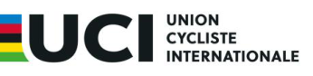

## MEMORANDUM 

## **AD HOC RULES** 

**Rules amendments applying on 1.07.2026** 

## **§ Preliminary provisions and scope of application** 

- **1** The present Ad hoc Rules (hereinafter: the Rules) have been adopted by the UCI Management Committee in response to the Russian invasion of Ukraine, with the objectives of ensuring the integrity and security of sporting competitions and the respect of the Olympic values. 

- **2** The Rules shall be applicable to all cycling categories and disciplines. 

- **3** The Rules shall be applicable until further notice. The present version of the Rules, approved by the Management Committee on ~~31 July 2023~~ 2 June 2026, enters into force on ~~1[st] January 2024~~ 1[st] July 2026. 

## **§ Participation rules** 

- **4** With the exception of the Junior category, ~~Nn~~ ational teams of Russia ~~and Belarus~~ shall not be authorised to take part in any events on the UCI International Calendar, including UCI events such as UCI World Cups ~~(incl. UCI Track Nations Cup) o~~ r the UCI World Championships. 

Likewise, teams made up of riders of Russian ~~or Belarusian s~~ porting nationality shall not be authorised to enter any event or competition based on a team classification and shall not be authorised to enter as a mixed team in any event of the UCI International Calendar. 

- **5** Riders whose sporting nationality within the meaning of article 1.1.033 of the UCI Regulations is Russian ~~or Belarusian~~ may participate in individual or team events on the UCI International Calendar, including UCI World Cup events ~~(incl. UCI Track Nations Cup)~~ or the UCI World Championships, ~~only i~~ n the following circumstances: 

   - a. Participation in an individual capacity as a “ _Individual Neutral Athlete_ ” as defined in Annex 1 to these Rules (“Conditions of Participation for individual neutral riders of Russian ~~or Belarusian~~ sporting nationality and their support personnel”) and confirmation of such status by the UCI; 

   - b. Participation with their team (UCI Teams or club teams), when provided for in the UCI Regulations. 

- **6** Any participation in an event on the UCI International Calendar is subject to the rules set out in the Annex 1 to these Rules. 

- **7** Junior riders and their support personnel shall not be required to apply for the status of _Individual Neutral Athlete_ pursuant to Annex 1 in order to participate in events on the UCI International Calendar. They shall be required to comply with these Rules and Annex 1 in the context of any participation and the UCI may refuse the registration, refuse the start or disqualify riders or their support personnel found to have acted in breach of these Rules or Annex 1 at any time since their entry into force. 

- **8** For UCI events which are not considered as part of the UCI International Calendar (including but not limited to Granfondo World Series and World Championships, Gravel World Series and World Championships (amateur category only), BMX Challenge World Championships, Masters World Championships, Trial Youth Games, etc.) riders and their support personnel shall not be required to apply for the status of _Individual Neutral Athlete_ pursuant to Annex 1. They shall be required to comply with these Rules and Annex 1 in the context of any participation and the UCI may refuse the registration, refuse the start or disqualify riders or their support personnel found to have acted in breach of these Rules ~~and~~ or Annex 1 at any time since their entry into force. 

## **§ UCI Teams** 

- **9** UCI Team status may not be granted to a team under Russian ~~or Belarusian~~ nationality (as defined in the UCI Regulations governing the nationality of teams for each discipline). 

- **10** Russian ~~and Belarusian~~ teams may be registered as club teams with their respective national federations, subject to compliance with the requirements of their national federation’s regulations. 

## **§ Events** 

- **11** The registration on the UCI International Calendar shall not be considered for an event taking place on the territory of Russi ~~a or Belarus~~ . Russian ~~and Belarusian e~~ vents may be registered on th ~~eir~~ Russian ~~respective n~~ ational calendar ~~s,~~ subject to compliance with the requirements of the ~~ir~~ national regulations. 

- **12** Any bids from Russian ~~and Belarusian c~~ andidates for the organisation of UCI events, including but not limited to UCI World Championships, UCI World Cup events and other UCI series or stand-alone events, shall not be considered. 

## **§ National Championships** 

- **13** The Russian ~~and Belarusian~~ National Championships cannot be registered on the UCI International Calendar. 

- **14** Should the Russian ~~and/or Belarusian~~ National Championships take place, no UCI points are allocated. 

## **§ Distinctive national signs** 

- **15** The appearance of all emblems, names, acronyms, colours, flags and anthems linked to Russia ~~and Belarus i~~ s prohibited at all events of all categories on the UCI International Calendar. 

- **16** Organisers shall withdraw references to Russia ~~and/or Belarus o~~ n all documents and publications in both printed and electronic format, including, but not limited to, start lists, result lists, rankings and TV graphics. 

- **17** Russian ~~and Belarusian~~ national champion jerseys shall be forbidden on all UCI International Calendar events, both in and on the margins of competitions. Therefore, any current national champion of Russia ~~or Belarus s~~ hall wear the team’s jersey when 

participating in an event with their team. In the case of participation in an event as _Individual Neutral Athlete_ , the jersey must comply with the provisions stipulated in Annex 1 of these Rules. 

Winners of a national championships organised during the period of validity of the present Rules shall not be entitled to wear the national champions’ jersey both during and after the period of validity of the present Rules. 

- **18** Any verbal, non-verbal or written activity or communication associated with the national flag, anthem, emblem or any other symbol of the Russian Federation, ~~the Republic of Belarus, their i~~ ts National Federation ~~s~~ or National Olympic Committee ~~s,~~ or any support for the war in Ukraine, both in and out of competition, is prohibited and considered contrary to the requirements of neutrality as set forth in Annex 1. 

## **§ Invitations** 

- **19** Organisers shall consider the applicable rules pertaining to invitations as provided under article 1.2.048 et seq. of the UCI Regulations. For Road cycling, organisers shall take into consideration and comply with the process set out in article 2.2.010bis should they envisage withdrawing an invitation or excluding a rider or team. 

- **20** Organisers of UCI International Calendar events shall not be entitled to invite club, regional or mixed teams from Russia ~~or Belarus.~~ 

## **§ Sporting nationality** 

- **21** Russian ~~and Belarusian~~ licence-holders who held several nationalities before 1 March 2022 may request a change to their sporting nationality in accordance with the procedure set out in article 1.1.033bis of the UCI Regulations, without application of any restriction on participation at UCI World Championships and UEC European Continental Championships. Participation restrictions applicable for multi-discipline events remain applicable in accordance with the rules of the relevant organisations (e.g., article 41 of the Olympic Charter and chapter 3.1 of the International Paralympic Committee Handbook). 

- **22** Applications for change of sporting nationality from Russian ~~or Belarusian~~ to another sporting nationality shall be dealt with according to an expedited procedure and changes of sporting nationality shall come into effect immediately upon UCI’s approval. The conditions for changing sporting nationality remain as provided for under article 1.1.033bis of the UCI Regulations. 

## **§ Sponsors** 

- **23** Russian ~~and Belarusian~~ company brands are considered damaging to the image of the UCI and the sport of cycling pursuant to article 1.1.089 of the UCI Regulations and shall therefore not be authorised on UCI International Calendar events without prior approval by the UCI. As such, riders, organisers and teams shall not be entitled to grant any visibility to such company brands without approval. ~~In case of any doubt, organisers and teams shall submit the envisaged branding to the UCI for approval.~~ 

- **24** ~~Exceptional derogations to this prohibition may be granted by tT~~ he UCI may authorise Russian brands or products sponsorship provided that ~~if t~~ he applicant ~~s~~ (rider ~~s~~ , organiser ~~s~~ or team ~~s~~ ) establishes beyond reasonable doubt that the brands or products in questions do 

not have any direct or indirect relationship with the Russian Federation ~~or the Republic of Belarus o~~ r otherwise benefit or participate, directly or indirectly, in the war effort of Russia ~~and Belarus.~~ This condition is presumed to be met if the sponsor in question has publicly denounced the war effort. 

## **§ Commissaires** 

- **25** Russian ~~and Belarusian~~ commissaires shall only be appointed by the UCI on any events on the UCI International Calendar if they meet the conditions stipulated in Annex 1 related to their function. 

## **§ Enforcement of the Rules and sanctions** 

- **26** Any violation of these rules, including Annex 1, by any person or entity bound by the UCI Regulations, may be subject to sanctions. 

- **27** Any infringement committed within the scope of, or in relation to, an event, in particular with regard to the prohibition of the wearing of emblems or logos referring to Russia ~~or Belarus~~ or any communication, whether verbal, non-verbal or written, in support of the war in Ukraine, shall be excluded by the commissaires panel of the event or by the UCI directly. 

- **28** Any infringement committed outside an event will be subject to disciplinary proceedings for violation of article 12.4.017 lit. a. of the UCI Regulations. 

- **29** The UCI shall take all necessary measures to ensure the enforcement of these Rules, including Annex 1. In particular, the UCI shall take the relevant measures to verify the compliance with the requirement of neutrality for riders and support personnel by subscribing to the necessary services, if need be. 

- **30** Any discriminatory behaviour towards a rider of Russian ~~or Belarussian s~~ porting nationality authorized to participate in an event under the present Rules shall be subject to disciplinary proceedings for violation of article 12.4.004 of the UCI Regulations. 

