## **CLARIFICATION GUIDE OF THE UCI TECHNICAL REGULATION** 

## _As from 01.04.2024_ 

As the summit organization of world cycle sport, the International Cycling Union (UCI) is the guarantor of the proper application of ethical and sporting regulations. 

The UCI Regulations assert the primacy of man over machine. Observance of the regulations by all parties involved facilitates sporting fairness and safety during competition. 

This document does not replace Articles 1.3.001 to 1.3.034 of the UCI Regulations, but rather complements them and illustrates the technical rules defined therein. The objective of this document is to offer a definitive interpretation in order to facilitate understanding and application of the Regulations by international commissaires, teams and manufacturers. 

This practical guide applies to equipment used in road, track and cyclo-cross events. Each discipline has its own technical characteristics and each may have variants depending on the type of event. 

The UCI equipment Unit may be contacted by anyone seeking information on the technical regulations. The technical regulations can be consulted on the UCI website under the "Rules" heading. Further details on the approval procedures for frames, forks and wheels are also available on the UCI website under the "equipment" heading. 

## **DEFINITIONS** 

## **B** 

- **BAR END PLUGS** – a handlebar accessory that exclusively covers open ends of the handlebar / extensions / base bar. 

- **BASE BAR** – a steering assembly with a grip position allowing for an aerodynamic posture. 

- **BESPOKE** equipment – any product that belongs to a brand and a model range and offers customisation features around the adaptation of the equipment. 

- **BICYCLE** - a vehicle with two wheels of equal diameter. The front wheel shall be steerable; the rear wheel shall be driven through a system comprising pedals and a chain. Exceptions to this rule may exist for certain cycling disciplines, in which case specific rules are provided for in the respective discipline. 

- **BOTTLE CAGE** – an add-on accessory used to affix a water bottle to a bicycle. 

## **C** 

- **CYCLING COMPUTER MOUNT** – an accessory that is designed solely for the secure installation of a cycling computer. 

1 

CLARIFICATION GUIDE OF THE UCI TECHNICAL REGULATION 

## **E** 

- **EQUIPMENT** – any product a rider will use in the UCI sanctioned event including but not limited to clothing, safety equipment and bicycles. 

## **F** 

- **FIXED ADDITIONAL TIME TRIAL EXTENSION HANDLEBAR** – a steering assembly secured to the handlebar or the base bar to improve the rider’s aerodynamic posture. 

- **FOREARM SUPPORT** – a component of the fixed additional time trial extension handlebar that provides an additional point of support. 

## **H** 

- **HANDLEBAR COCKPIT** – a combination of the handlebars or the base bar with the fixed additional time trial extension handlebar, stem plus any accessories (controls, levers, etc. and all their mounting accessories). 

- **HANDLEBAR GRIP** – an accessory designed to provide padding and vibration damping to ensure a proper grip between the hands and the handlebars. 

## **M** 

- **MAXIMUM / MINIMUM DIMENSION OF THE CROSS SECTION** - the largest and smallest dimensions of tube sections respectively, i.e. the maximum and minimum dimensions authorised in any direction. 

## **R** 

- **RECTANGULAR BOX:** The sides of the box are named as follows: 

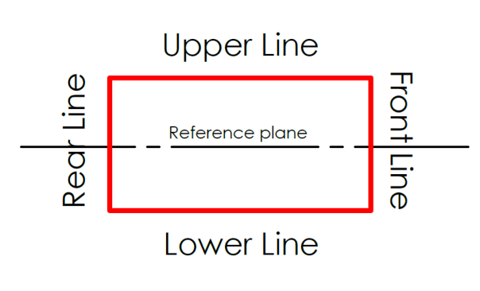

- **REFERENCE PLANE** - a nominally horizontal plane. 

## **S** 

- **STEM** - a component on a bicycle that connects the handlebars to the steerer tube of the bicycle fork. 

## **T** 

- **TRADITIONAL HANDLEBARS (commonly referred to as a Drop Handlebars)** - a steering assembly with multiple grip positions allowing for an aerodynamic posture. The handles of the traditional handlebars are bent below the rest of the bar. 

2 

CLARIFICATION GUIDE OF THE UCI TECHNICAL REGULATION 

## Section 1: general provisions 

## § 1 Principles 

## **ARTICLE 1.3.001** 

_“Each licence holder shall ensure that his equipment (bicycle with accessories and other devices fitted, headgear, clothing, etc.) does not, by virtue of its quality, materials or design, constitute any danger to himself or to others._ 

The licence holder is responsible for his or her equipment and for ensuring its compliance with the regulations. The licence holder must thus have knowledge of the technical regulations to be able to apply them to the bicycle, accessories and clothing. The objective of the approval procedures put in place by the UCI is to assist licence holders in this task. 

The bicycle must be designed and constructed to the highest professional standards in accordance with official quality and safety standards in a manner that respects the UCI's technical regulations, allowing the rider to adopt, without difficulty or risk, the required positions (support points, withdrawn saddle position, hands on the handlebars, position of handlebar extensions, etc.). 

## **ARTICLE 1.3.001 BIS** 

_“Each licence holder shall ensure that the_ equipment _he uses on the occasion of road, track or cyclo-cross events shall be approved by the UCI according to the specifications of the Approval Protocols in force and available on the UCI Website.”_ 

The UCI put at disposal on the UCI website the list of homologated Road, Time-Trial, Cyclocross, Track framesets (frame, fork, seat post and the frame components between the head tube and the handlebar stem) as well as the Cyclo-cross and road wheels under the "equipment" heading. For any item of equipment that is subject to an approval procedure to be used in competition, it must be approved in advance by the UCI with details published on the website. The other material items don’t need to be homologated but must respect article 1.3.006 obligations. 

## **ARTICLE 1.3.002** 

_“The UCI shall not be liable for any consequences deriving from the choice of the equipment used by licence holders, nor for any defects it may have or its non-compliance. Equipment used must meet all relevant ISO quality and safety requirements_ ~~_for bicycles_~~ _(as referenced for illustration purposes in the Clarification Guide published on the UCI website) as well as any other standards applicable in the country of the event.”_ 

_“The licence-holder shall use the_ equipment _which is certified and compliant with quality and safety standards as provided by the manufacturer, without any modification whatsoever. The licence-holder shall be entirely and exclusively liable for any modification made to the_ equipment _, in particular in the event of an incident, and may be subject to disciplinary sanctions in accordance with the UCI Regulations.”_ 

_Updated on 01.01.19; 01.01.24_ 

3 

CLARIFICATION GUIDE OF THE UCI TECHNICAL REGULATION 

It is essential that the equipment used in competition meets the prevailing quality and safety standards for bicycles. Mechanics and riders should also be aware of the ISO 4210 Standard on safety that applies to cycling equipment. They should refer to this Standard before modifying or adjusting any bicycle component. From 2019, all the framesets submitted to the UCI for approval will have to join a certification confirming the compliance with the ISO 4210 security norm. The certification template is available in the section « equipment » of the UCI website. 

Modifying equipment used in competition in relation to products supplied by the manufacturer is prohibited for obvious safety reasons. Whether it is a matter of modifying the length of the saddle, adapting approved wheels, filing off fork drop-out safety lugs or meeting the 1 cm rule by adding tape. No modification of equipment that is not conducted by the manufacturer is authorized by the UCI without prior approval. 

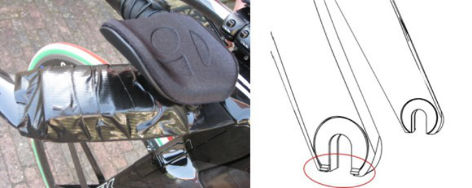

_Figure 1: Examples of the prohibited modification of equipment (addition of tape, filing off fork drop-out safety lugs)_ 

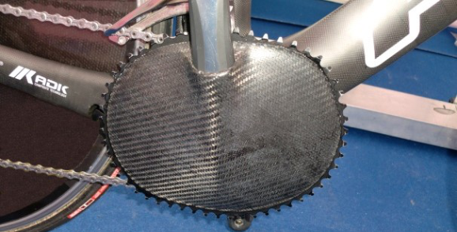

_Figure 2: Example of the prohibited modification of equipment (the carbon cover added to the chainring_ 

The addition of handlebar tape to improve a rider's grip and any addition of adhesive tape to maintain, avoid abrasion, provide visual continuity or any other function is authorized in condition when it does not constitute an excrescence or enlarges the general shape of equipment. 

4 

CLARIFICATION GUIDE OF THE UCI TECHNICAL REGULATION 

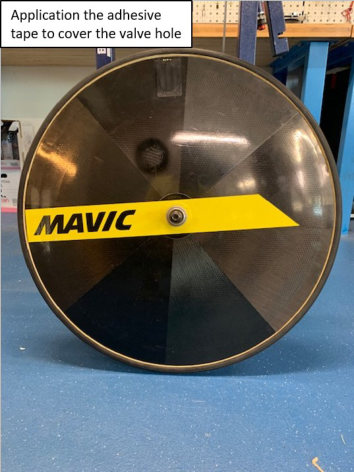

_Figure 3: Example of application the adhesive tape on the Time Trial disc wheel_ 

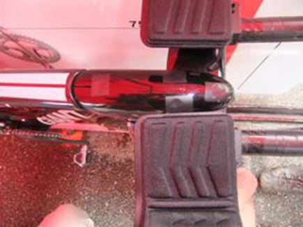

_Figure 4: Illustration of the addition of the adhesive tape to cover bolts access_ **ARTICLE 1.3.003** 

_“In no event shall the fact that a rider has been able to take part in the competition give rise to liability on the part of the UCI; checks on equipment that may be carried out by the commissaires or by an agent or a body of the UCI being limited to compliance with purely sporting and technical requirements. Where required, checks on equipment and material may be carried out, before, during or after the race, at the request of the president of the commissaires’ panel, or that of an agent or body of the UCI._ 

_For that purpose, the commissaire and the UCI can seize equipment for a subsequent check, if necessary before, during or after the race, irrespective of whether the equipment was used during the competition._ 

_If the seized equipment is found not to comply with the requirements of the UCI Regulations, the UCI may retain such item of equipment until the conclusion of any related disciplinary proceedings.”_ 

5 

CLARIFICATION GUIDE OF THE UCI TECHNICAL REGULATION 

## **ARTICLE 1.3.003 BIS** 

_“Evading, refusing or failing to allow or enable a commissaire or other competent body to conduct an equipment check shall be sanctioned as follows:_ 

_Rider or other team member: suspension of between one month and one year and/or a fine of between CHF 1’000.- and CHF 100’000.-_ 

_Team: suspension of between one and six months and/or a fine between CHF 5’000 and CHF 100’000”_ 

## § 2 Technical innovations 

## **ARTICLE 1.3.004** 

_“Except in mountain bike racing, no technical innovation regarding anything used, worn or carried by any rider or license holder during a competition (bicycles,_ equipment _mounted on them, accessories, helmets, clothing, means of communication telemetry, device, sensors, etc.) may be used until approved by the UCI. Requests for approval shall be submitted to the UCI, accompanied by all necessary documentation._ 

_All associated examination costs are to be paid by the applicant and are determined by the UCI Management Committee according to the complexity of the submitted technical innovation._ 

_The UCI will study the application of the technical innovation from a sporting and technical point of view and respond within 6 months from the date of submission of a complete file, including the application, all relevant exhibits and any additional documents requested by the UCI. The innovation comes into force as from the acceptance date._ 

_There is no technical innovation in the sense of the present article if the innovation entirely falls within the specifications foreseen in the regulations.”_ 

Technical innovations must be submitted to the UCI in advance and approved by the equipment Commission before they can be used in competition. 

A technical innovation is defined as a new system, device or item of equipment that allows an improvement of a rider’s performance, adds new functions to the bicycle, modifies the bicycle’s general appearance or affects any other aspect of the UCI regulations. 

If there is any doubt, it is preferable to present new equipment to the UCI which will determine whether it is a matter of a technical innovation or not. New equipment will be carefully studied by experts in order to evaluate the benefits and how such equipment could improve cycle sport as well as assessing the risks and any potential divergence from the regulations. The most appropriate decision will then be taken in the interest of the sport. 

**ARTICLE 1.3.005** 

6 

CLARIFICATION GUIDE OF THE UCI TECHNICAL REGULATION 

_“If at the start of a competition or stage the commissaires' panel considers that a rider arrives with a technical innovation or an_ equipment _not yet accepted by the UCI, it shall refuse to permit the rider to start with such an innovation._ 

_In the event of use in competition, the rider shall automatically be expelled from the competition or disqualified. There shall be no right to appeal against the decision of the commissaire's panel._ 

_If this technical innovation or the_ equipment _not yet accepted by the UCI are not noticed or sanctioned by the commissaire's panel, the UCI disciplinary commission shall order the disqualification. The UCI shall refer to the disciplinary commission, either automatically or at the request of all interested. The disciplinary commission will only apply sanctions after having received the opinion of the_ equipment _commission._ 

_In out of competition situations, the UCI shall decide whether an item should be considered a technical innovation and whether the procedure provided for in article 1.3.004 is to be followed.”_ 

There are 3 different possibilities to sanction the use of a technical innovation in competition that was not approved by the UCI first: 

- In cases where the technical innovation is checked before the start of a race, the rider is not allowed to start the race unless he removes or replaces the concerned equipment. 

- In cases where the technical innovation is spotted during the race, the rider is automatically expelled from the competition or disqualified. 

- In cases where the technical innovation is not sanctioned by the commissaire's panel neither before the start, nor during the race, the disqualification may be decided afterward by the UCI disciplinary commission. 

During the events, the commissaire's panel make the decision to determine if an equipment meets the technical innovation's definition and which sanction to apply. In out of competition situations or when a technical innovation is reported after the end of an event, the UCI disciplinary commission make the decision if a technical innovation was used and what would be the sanction that applies. 

## § 3 Commercialisation 

## **ARTICLE 1.3.006** 

_“_ Equipment _shall be of a type that is sold for use by anyone practicing cycling as a sport._ 

_Any_ equipment _in development phase and not yet available for sale (prototype) must be subject of an authorization request to the UCI_ equipment _Unit before its use. Authorization will be granted only for_ equipment _which is in the final stage of development and for which commercialization will take place no later than 12 months after the first use in competition. The manufacturer may request a single prolongation of the prototype status if justified by relevant reasons._ 

_When assessing a request for use of_ equipment _which is not yet available for sale, the UCI_ equipment _Unit will pay particular attention to safety of the_ equipment _which will be submitted to it for authorisation._ 

7 

CLARIFICATION GUIDE OF THE UCI TECHNICAL REGULATION 

_Use of equipment under prototype authorisation in track events and/or in the context of a particular performance (best performance, world record, hour record or other) shall not be authorised._ 

_Without prejudice to prototypes (equipment not yet available for purchase), any item of equipment must be commercially available in order to be used in cycling events. The requirement of commercial availability shall be understood as equipment having to be available for purchase through a direct and publicly available order system (whether with manufacturer, distributor or retailer). Upon an order being placed, the order shall be confirmed within 30 days and the relevant equipment shall be made available for delivery within a further 90-day deadline. In addition, the retail price of the equipment shall be publicly advertised, shall not render the equipment de facto unavailable to the general public and shall not unreasonably exceed the market value for equipment of a similar standard._ 

_Any equipment which is neither commercially available, nor under a valid prototype authorisation at the time of the event, may not be used. Any such unauthorised use of equipment may be sanctioned by disqualification of results obtained when using the equipment and/or a fine ranging from CHF 5’000 to 100’000.”_ 

The entire used material must be accessible to all participants. All the components must be available commercially (i.e. available on the market or sold directly by the manufacturer) at the latest twelve months after their first use in competition. If such a deadline is requested and accepted by the UCI, the manufacturer must publicly announce that the product in question is being used in competition and when it will be available for sale. In all cases the product must be in a final stage of development, very similar to the product that will be marketed. 

Thus, it is not allowed to use equipment in competition that is not either available on the market or authorized by the UCI equipment Unit and previously communicated by the manufacturer (with a twelve months period for the marketing). 

The use of equipment specially designed for a particular athlete, event or performance are prohibited. "Specially designed" means a bicycle with a technical added value when compared with other equipment. 

No minimum production quantity or minimum price is defined for either bicycles or any component parts. 

It is also demanded to have reasonable prizes, meaning comparable to a similar product of a same range. 

## § 4 Onboard technology 

## **ARTICLE 1.3.006 BIS** 

_“Onboard technology devices, which capture or transmit data, may be fitted on bicycles or worn by riders subject to being authorised under the present article, without prejudice to other provisions of the UCI Regulations. The present article concerns any device which captures or transmits data as described below, including but not limited to sensors (worn or ingested), transponders, rider information systems, telemetry devices._ 

_1. Devices which capture or transmit the following types of data are authorised:_ 

8 

CLARIFICATION GUIDE OF THE UCI TECHNICAL REGULATION 

_- Positioning: information related to the location of the rider or the bicycle;_ 

_- Image: still or moving images or footage captured from the bicycle (such devices may only be fitted on the bicycle unless specific regulations of a given discipline authorise devices being worn by riders);_ 

_- Mechanical: information captured from the bicycle or any of its components, including but not limited to power, speed, cadence, accelerometer, gyroscope, gearing, tyre pressure._ 

_2. Devices which capture or transmit the following physiological data are authorised: heartrate, body temperature, sweat rate. The authorisation is, however, limited to transmission protocols which enable only the rider concerned to view the data during a competition._ 

_3. Devices which capture other physiological data, including any metabolic values such as but not limited to glucose or lactate are not authorised in competition._ 

_The authorised capturing and transmitting of data as provided under this article shall not enable a rider to view data of another rider. Likewise, teams shall only access data of their riders, where such transmission is authorised, unless information pertaining to riders of other teams is publicly available._ 

_Any onboard technology device fitted on a bicycle must:_ 

- _Be installed on a system designed for bicycles and not affect the certification of any item of the bicycle;_ 

- _Not cause a risk for the safety of any rider and, therefore, be affixed in a manner that ensures it is not susceptible of inadvertently dismounting or is non-removable._ 

_The UCI may grant derogations to any envisaged use of onboard technology which is not authorised by the present article. Derogation requests shall be assessed, inter alia, in consideration of criteria of equal access to equipment, sporting fairness and integrity, and shall also comply with articles 1.3.001 to 1.3.006. Derogations may be limited to specific events and riders or teams._ 

_The UCI shall not be liable for any consequences deriving from the installation and use of onboard technology equipment by licence holders, nor for any defects it may hold or its noncompliance._ 

_For the sake of clarity, the present article does not govern or affect the ownership of the various data, meaning that the capturing, use and/or exploitation of the data remains subject to consent of the relevant rights’ holder.”_ 

_(Article introduced on 10.06.21)_ 

This article defines the terms of the onboard technology equipment which has the ability to collect or transmit data, information or images on the bicycles (transponder, camera, gps, telemetry system...). 

Such equipment is not considered as technological innovations in the sense of the article 1.3.004. 

9 

CLARIFICATION GUIDE OF THE UCI TECHNICAL REGULATION 

Moreover, as these equipment must be non-removable, they are considered as an integral part of the weight of the bicycle, as defined in the article 1.3.019. They will be left on the bicycle during a minimum bicycle weight check done by the Commissaires. 

## Section 2: bicycles 

## § 1 Principles 

## **ARTICLE 1.3.007** 

_“The bicycle is a vehicle with two wheels of equal diameter. The front wheel shall be steerable; the rear wheel shall be driven through a system comprising pedals and a chain. Exceptions to this rule may exist for certain cycling disciplines, in which case specific rules are provided for in the respective discipline.”_ 

_Text modified on 01.01.19_ 

The bicycle is a vehicle with two wheels which must be of equal diameter. Exception for MTB where the two wheels can be of a different diameter. 

The front wheel is steerable; the rear wheel is driven. The bicycle is propelled solely by a system of pedals acting upon a chain. Only one chain may be used on the bicycle in order to engage the transmission between the bottom bracket and the driven wheel. 

The bicycle must be in "working order" with a steering system acting on the steerable wheel and a propulsion system acting on the driven wheel by means of a circular movement through a chainset comprising one or more chainwheels and two arms (cranks), arranged at 180°, one as an extension of the other, in the same plane. 

## **ARTICLE 1.3.008** 

_“The rider shall normally assume a sitting position on the bicycle. This position requires that the only points of support are the following: the feet on the pedals, the hands on the handlebars and the seat on the saddle.”_ 

The use of a supplementary point of support such as a lumbar support achieved by an excessive inclination of the saddle or the addition of a lumbar support component to the saddle is not authorized in order to ensure fairness in competition. 

## **ARTICLE 1.3.009** 

_“The bicycle should have handlebars which allow it to be ridden and maneuvered in any circumstances and in complete safety.”_ 

Bicycles used in road and cyclo-cross events must be fitted with an efficient braking system that acts on both wheels (either simultaneously or independently) operated by two brake levers. The use of a fixed gear in competition is prohibited. Bicycles shall have at least 89 mm clearance between the pedal spindle and the front tire when turned to any position in accordance with the requirements of the EN14781 safety standard to not be hindered when turning. 

10 

CLARIFICATION GUIDE OF THE UCI TECHNICAL REGULATION 

Hydraulic brake systems on rims are authorized provided that their attachment to the bicycle does not contravene any regulations (brake hoods must not become extensions, etc.). Disc brake systems are authorized. 

## **ARTICLE 1.3.010** 

_“The bicycle shall be propelled solely, through a chainset, by the legs (inferior muscular chain) moving in a circular movement, without electric or other assistance.”_ 

_Exceptions to this rule may exist for certain cycling disciplines, in which case specific rules are provided for in the respective discipline._ 

_In para-cycling, mechanical prostheses/orthopedic braces for upper or lower limbs can only be used by athletes who have been evaluated in accordance with the UCI classification procedure and who have Review (R) or Confirmed (C) status._ 

_In no case may a mechanical prosthesis/orthopedic brace for the lower limbs be used outside para-cycling events.”_ 

_Text modified on 01.01.19_ 

The movement of the pedal axle around the bottom bracket axle must be completely circular. Oval chainwheels are allowed if the path is circular with a crank arm geometry that does not change. 

The addition of mechanical or electrical systems that serve to assist the rider is prohibited. Exception for the E-MTB discipline. The use of an electronic unit solely to change gears is authorized provided that the attachment to the bicycle does not contravene any regulations. 

All athletes, disabled or able-bodied, wanting to wear prosthesis or orthopaedic braces should go through the classification procedure. Able-bodied athletes cannot the use mechanical prostheses/orthopaedic braces because they would have NE (Not Eligible) status according to the classification procedure. 

Mechanical prosthesis/orthopaedic braces for lower limbs are prohibited in able-bodied events. On the other hand, mechanical prostheses/orthopaedic braces for upper limbs will be authorised (after evaluation) if they allow an improvement in handling skills compared to a fixed prosthesis/orthopaedic brace. An athlete with a mechanical prosthesis/orthopaedic brace for upper limbs can thus take part in able-bodied competition upon receiving authorization from the integration procedure. 

## § 2 Technical specifications 

## **ARTICLE 1.3.011** 

_“Except where stated to the contrary, the technical specifications given in the articles 1.3.011 to 1.3.025 shall apply to bicycles used in road, track and cyclo-cross racing._ 

11 

CLARIFICATION GUIDE OF THE UCI TECHNICAL REGULATION 

_The specific characteristics of bicycles used in mountain bike, BMX, BMX Freestyle, trials, indoor cycling and paracycling for riders with disabilities are set out in the part regulating the discipline in question.”_ 

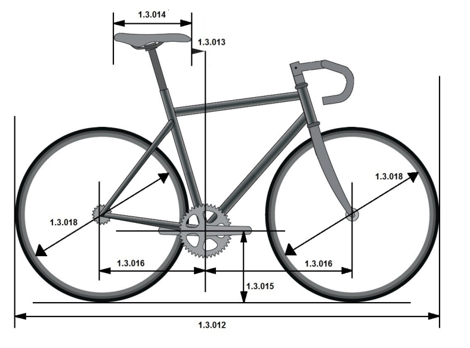

_Figure 5: Illustration of the parts of the bicycle covered by Articles 1.3.011 to 1.3.025_ 

## **ARTICLE 1.3.012** 

_“A bicycle shall not measure more that 185 cm in length and 50 cm in width overall. A tandem shall not measure more than 270 cm in length and 50 cm in width overall.”_ 

The maximum width of 500 mm for the bicycle directly relates the maximum authorised overall width (outside – outside) of handlebars. The minimum overall width (outside – outside) of traditional handlebars (road events) and base bars (road and track events) is limited to 350 mm. 

## **ARTICLE 1.3.013** 

_“The tip of the saddle shall be a minimum of 50 mm to the rear of a vertical plane passing through the bottom bracket spindle._ 

_The tip of the saddle can be moved forward until the vertical line passing through the bottom bracket spindle where necessary. Any rider who, for these reasons, considers the needs to use a bicycle of lesser dimensions than those given shall inform the commissaires' panel to that effect at the time of the bike check. Only one (1) of the following two (2) exemptions can be requested by the rider and thereafter granted;_ 

12 

CLARIFICATION GUIDE OF THE UCI TECHNICAL REGULATION 

_1.Either the tip of the saddle can be moved forward to a distance equal to or less than 50 mm._ 

_2.The fixed time trial extension_ ~~_s_~~ _handlebar can be adapted, in accordance with the rider height categories defined in Article 1.3.023.”_ 

The withdrawn position of the saddle is measured from the tip of the saddle to the vertical plane passing through the center of the bottom bracket axle. 

In no case the peak of the saddle can exceed the vertical line passing through the bottom bracket spindle 

If the exemption for the saddle is used, the rider cannot use the exemption for the extensions length in accordance with Article 1.3.023 

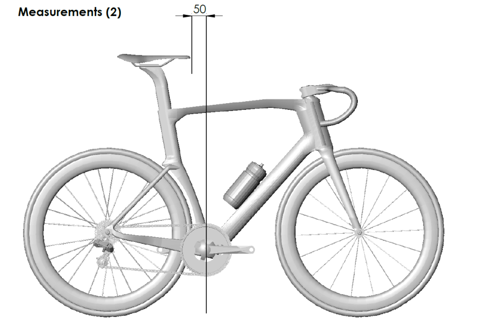

## **ARTICLE 1.3.014** 

_“The plane passing through the highest points at the front and rear of the saddle can have a maximum angle of nine degrees from horizontal. The length of the saddle shall be 24 cm minimum and 30 cm maximum. A tolerance of 5 mm is allowed.”_ 

It is important to grant the rider sufficient freedom to allow a comfortable position to be adopted, reducing the pressure on the perineum, while avoiding any deviation through an excessively sloping saddle that could improve sporting performance to an unacceptable degree by the addition of a lumbar support. Furthermore, if the saddle is inclined too severely, this reduces the quality of the rider’s position on the saddle, thus reducing its intrinsic function of providing a basic support for the rider on the bicycle. 

13 

CLARIFICATION GUIDE OF THE UCI TECHNICAL REGULATION 

Checks on the horizontality of saddles are conducted in the road, track and cyclo-cross events by measuring the angle of incline of the saddle, considering the plane passing through the highest points at the front and rear of the saddle. This angle must be less than 9 degrees (positive or negative incline). 

The commissaries are provided with a measuring device as shown in the Figure 6. Checks will not be systematic, but in the event of any doubt, the commissaires will place the device on the saddle to determine its angle of incline after having calibrated the device to the ground or the measuring jig. 

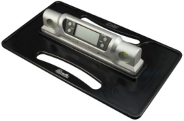

_Figure 6: Official measuring device to check saddle inclination_ 

The measurement of the horizontality of saddles must be a simple, fair and repeatable process. The tolerance of 9 degrees gives the rider a lot of freedom to adjust his or her position on the bike. Commissaires are able to give a clear, coherent and categorical response when carrying out saddle checks. 

## **ARTICLE 1.3.015** 

_“The distance between the bottom bracket spindle and the ground shall be between 24 cm minimum and maximum 30 cm.”_ 

The aim of this rule, among other things, is to avoid the risk of the cranks or pedals touching the ground when cornering. 

## **ARTICLE 1.3.016** 

_“The distance between the vertical passing through the bottom bracket spindle and the front wheel spindle shall be between 54 cm minimum and 65 cm maximum._ 

_The distance between the vertical passing through the bottom bracket spindle and the rear wheel spindle shall be between 35 cm minimum and maximum 50 cm.”_ 

If the front or rear center is too short, this will reduce the bicycle's stability whereas if the front or rear center is too long the bicycle will be less manoeuvrable. 

14 

CLARIFICATION GUIDE OF THE UCI TECHNICAL REGULATION 

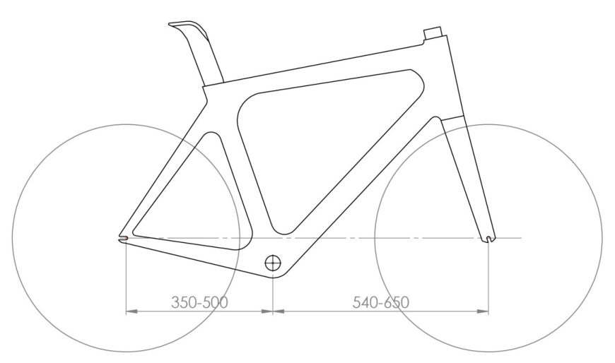

_Figure 7: Illustration of the minimum and maximum distances between the bottom bracket and front and rear wheel axles_ 

## **Article 1.3.017** 

_“The distance between the internal extremities of the front forks shall not exceed 11.5 cm; the distance between the internal extremities of the rear triangle shall not exceed 14.5 cm.”_ 

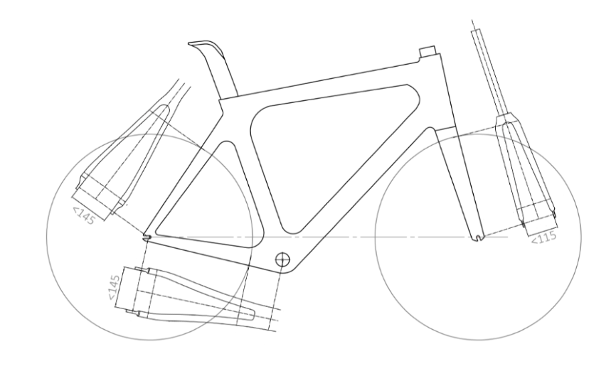

_Figure 8: Illustration of the maximum distances between the fork drop-outs and rear dropouts_ 

15 

## CLARIFICATION GUIDE OF THE UCI TECHNICAL REGULATION 

## **ARTICLE 1.3.018** 

_“Wheels of the bicycle may vary in diameter between 700_ ~~_cm_~~ _m maximum and 550_ ~~_cm_~~ _m minimum, including the tyre. For the cyclo-cross_ ~~_bicycle_~~ _the width of the tyre (measured between the widest parts) shall not exceed 33 mm and it may not incorporate any form of spikes or studs._ 

~~_For massed start competitions iI_~~ _n the disciplines road, track and cyclo-cross, only wheel designs granted prior approval by the UCI may be used. Wheels approved in mass start competitions in the disciplines of road and cyclo-cross shall have at least 12 spokes; spokes can be round, flattened or oval, as far as no dimension of their sections exceeds 10 mm._ 

_Wheels used in the road, track and cyclo-cross disciplines must meet the impact test requirements as specified in the standard ISO 4210-2:2023 Cycles — Safety requirements for bicycles, section 4.10.7.2.2., paragraph 2. Fulfilment of these requirements concerns both the front wheels and the rear wheels, independent of materials, brake systems and other characteristics. Manufacturers must apply for approval by providing declaration of conformity to the UCI. Detailed procedure and template can be found in the section “Equipment” on the UCI Website._ 

_In order to comply with the requirements and ensure compatibility between the components, rims must comply with the standard ISO 5775-2 and tyres with the standard ISO 5775-1._ 

~~_In order to be granted approval wheels must have been subjected to the Vertical Drop Test which consists of:_~~ 

## ~~_**Test method: Vertical Drop Test**_~~ 

~~_Vertical drop test (neutralization of the rebound of the anvil)_~~ 

## ~~_**Energy level:**_~~ 

~~_40 Joules_~~ 

## ~~_**Impact striker geometry:**_~~ 

~~_Flat steel anvil, the impact surface is covered with a silicone rubber pad of 20 mm thickness (Hardness Shore A=50 +/- 5, Compression set of 40% acc. To ASTM D395 Method B). The rubber pad requires to be undamaged._~~ 

## ~~_**Impact mass:**_~~ 

~~_Range of  6 – 10 kg_~~ 

~~_Energy must always remain at 40 Joules at the hit with a +/- 5% tolerance._~~ 

## ~~_**Hitting point:**_~~ 

~~_One hit at 90° from valve hole, adjusted to have the impact point of anvil between the spokes In order to be certified as passed, the alloy and/or carbon wheels shall have - No visible cracks or delamination_~~ 

~~_- No change in lateral profile or in lateral run out in excess of 1.0 mm - No change in radial profile or in radial run out in excess of 1.0 mm_~~ 

16 

CLARIFICATION GUIDE OF THE UCI TECHNICAL REGULATION 

_Wheels which meet the definition of traditional wheels do not need to follow the approval application procedure provided for in this article_ ~~_be certified._~~ _**Definition of Traditional wheels:** Criteria: Rim height: less than 25 mm Rim material: alloy_ 

_Spokes: minimum of 20 steel spokes which are detachable and all components must be identifiable and commercially available_ 

_In track competition, including motor-pacing the use of a front disc wheel is only permitted in the specialties against the clock._ 

_Notwithstanding this article, the choice and use of wheels remains subject to articles 1.3.001 to 1.3.003.”_ 

_(text modified on 01.01.02; 01.01.03; 01.09.03; 01.01.05; 01.07.10; 01.10.13; 01.01.16, 25.06.19, 01.01.24)_ 

~~This regulation applies to road races and cyclo-cross.~~ There is a distinction between standard and non-standard wheels. The latter must meet the impact test requirements as specified in the standard ISO 4210-2:2023 Cycles — Safety requirements for bicycles, section 4.10.7.2.2., paragraph 2 and must comply with the standard ISO 5775-2 and tyres with the standard ISO 5775-1 ~~pass a vertical drop test using a specific procedure~~ in order to be included in the list of wheels authorised for competition. This document entitled "List of Approved Wheels” and further detailed information on the test procedure for non-standard wheels are available on the UCI website under the "Equipment" heading. 

~~The procedure does not apply to time trials on the road or track events.~~ 

The list of approved wheels under the previous procedure, in force until the 31 December 2015, is also available on the UCI website under the “Equipment” heading. The wheels included in this list are still allowed in competition. 

For the individual sprint, the front disc wheel is allowed for the qualifications (200m flying start) but not for the matches. 

## **ARTICLE 1.3.019** 

_“The weight of the bicycle cannot be less than 6.8 kilograms.”_ 

The minimum weight of the bicycle (in working order) is 6.800 kg, considered without on-board accessories in place, that is to say those items that may be removed during the event. The bottles, on-board computers and all others removable accessories must be removed during the weight check. However, the bottle cages, fixture systems and clippedon extensions are part of the bicycle and stay in place during the weighing. 

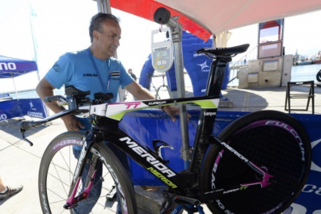

_Figure 9: Measuring the weight of a bicycle_ 

17 

CLARIFICATION GUIDE OF THE UCI TECHNICAL REGULATION 

## **ARTICLE 1.3.020** 

## TRIANGULAR SHAPE 

_“For road, track, and for cyclo-cross competitions, the frame of the bicycle shall be of a traditional pattern, i.e. built around a main triangle.”_ 

The triangular shape is defined from a design using 80 mm-wide boxes for each tube. In order to comply with this rule, the nominal rear wheel axle must be located within the seat stay and chain stay boxes. Furthermore, the bottom bracket axle must be located inside the chain stay, seat tube and down tube boxes. The drawing below illustrates these conditions. 

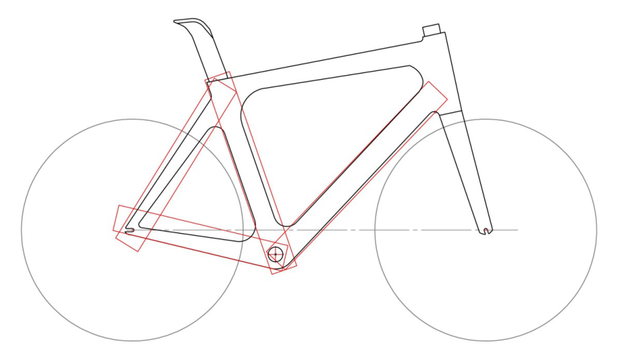

_Figure 10: Illustration of the bottom bracket and rear wheel axles inside the corresponding boxes_ 

This rule results from the Lugano Charter and has the objective of preserving the culture and image of the bicycle as an historical fact. Among other things, it prevents the use of "girder" frames and bicycles with extravagant shapes that do not represent bicycles as understood by the UCI and which would change the existing disciplines. 

18 

CLARIFICATION GUIDE OF THE UCI TECHNICAL REGULATION 

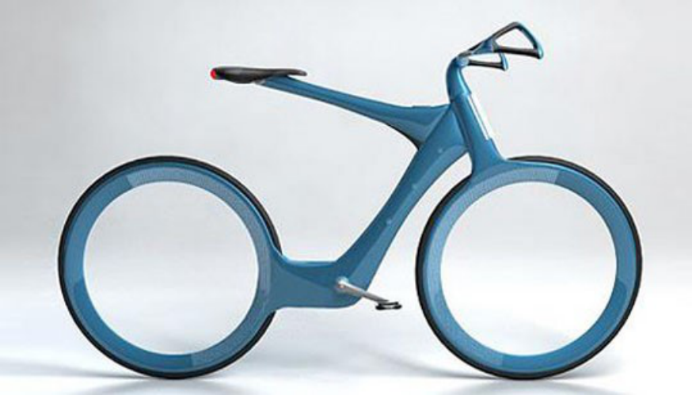

_Figure 11: Example geometry of a bicycle that does not comply with UCI regulations_ 

## COMPENSATION TRIANGLES AND THE 160 MM REINFORCEMENT ZONE 

_“Isosceles compensation triangles with two 8 cm sides are authorized at the joints between frame elements except at the joints between the chain stays and seat stays where triangles are not authorized._ 

_The effective width of the head tube zone may not exceed 16 cm at the narrowest point between the inner join of the top tube and down tube and the front of the box for the head tube.”_ 

Authorized reinforcement triangles are shown in blue in the diagram below. A 160 mm reinforcement zone is defined for the section where the top tube, head tube and down tube connect. 

The frame can completely fill the areas (rectangular boxes, compensation triangles and the 160 mm reinforcement zone), but in no case cross these limits. 

19 

CLARIFICATION GUIDE OF THE UCI TECHNICAL REGULATION 

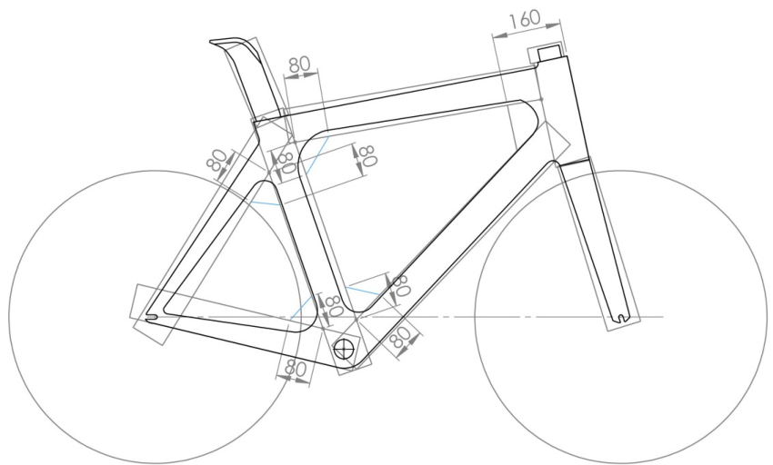

_Figure 12: General illustration of compensation triangles and boxes_ 

Reinforcement triangles with 80 mm sides are authorized at the joints between the tubes in order to accommodate the stresses relating to the specific properties of composites which require broader curves than metal to distribute and transmit forces through the frame without creating stress concentration zones that would make the frame more dangerous to use. 

The 160 millimeters rule has been introduced to guarantee improved aerodynamic fairness in competition between taller and shorter riders and in order to allow manufacturers enough room for maneuver so that they can create a design which is consistent between different frame sizes while allowing an adequate level of rigidity to guarantee safety in this sensitive area of the frame. 

To illustrate this amendment to the UCI technical regulations, a series of drawings will allow all the possible situations to be clarified. 

First, in the case of small frame sizes, even if the frame fits entirely within the boxes (shown Figure 13), the distance between the front of the box for the head tube and the internal joint between the top tube and the down tube at the nearest point to the head tube must not exceed 160 mm. 

In this specific instance, there is no compensatory joint zone that can be added to the boxes behind the head tube, since, as its name indicates, there is no scope for compensation, given how far forward the frame is. On the contrary, the 160 mm must be respected even inside the boxes as illustrated in the drawings below. 

20 

CLARIFICATION GUIDE OF THE UCI TECHNICAL REGULATION 

_Figure 13: Illustration of the 160 mm rule_ 

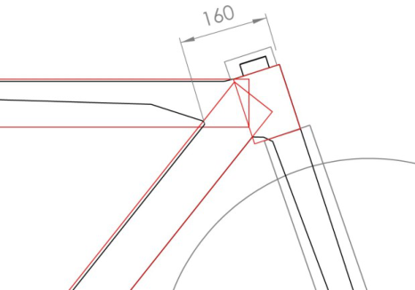

_Figure 14: Illustration of the maximum distance of 160 mm for a small frame size (A)_ 

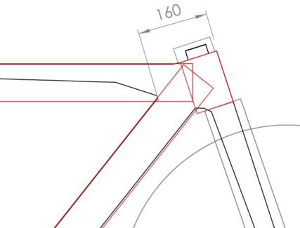

_Figure 15: Illustration of the maximum distance of 160 mm for a small frame size (B)_ 

The limit case where the 160 mm corresponds exactly to the intersection of the boxes for the top and down tubes is shown in the Figure 16. In this configuration, no compensatory joint zone can be added to the boxes behind the head tube. 

21 

CLARIFICATION GUIDE OF THE UCI TECHNICAL REGULATION 

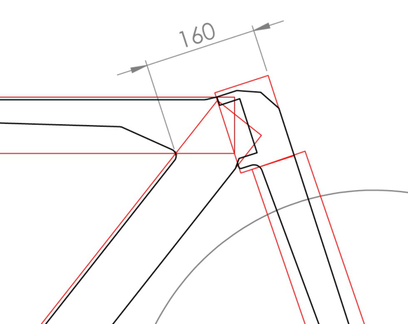

_Figure 16: Illustration of the limit case_ 

Lastly, for average and large frame sizes, the compensatory triangle behind the head tube is replaced by a compensatory joint zone of 160 mm. This zone is constructed by tracing a line parallel to and 160 mm behind of the line of the front of the box for the head tube, between the boxes for the top and down tubes, as shown in the Figure 17. 

The compensatory joint zone thus makes it possible to design a more homogeneous transition between the top tube and the down tube while permitting a better choice of the tube size for larger frames. Thus, the aerodynamic advantage of small frames disappears while at the same time avoiding taller riders making use of small frames to obtain this benefit. 

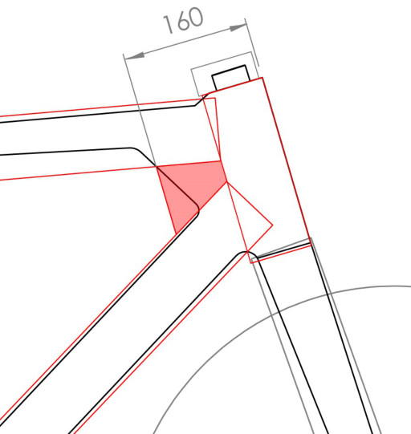

_Figure 17: Illustration of the compensatory joint zone_ 

22 

CLARIFICATION GUIDE OF THE UCI TECHNICAL REGULATION 

## STRAIGHT LINES 

_“It shall be constructed of straight or tapered tubular elements (which may be round, oval, flattened, teardrop shaped or otherwise in cross-section) such that the form of each element except the chain stays and the seat stays encloses a straight line.”_ 

The frame tubes must be tubular without excessive curvature. The frame elements may be slightly curved, but a straight line must be able to be drawn within each element along its length. The start and finish points of each of these lines is shown on the diagram below. 

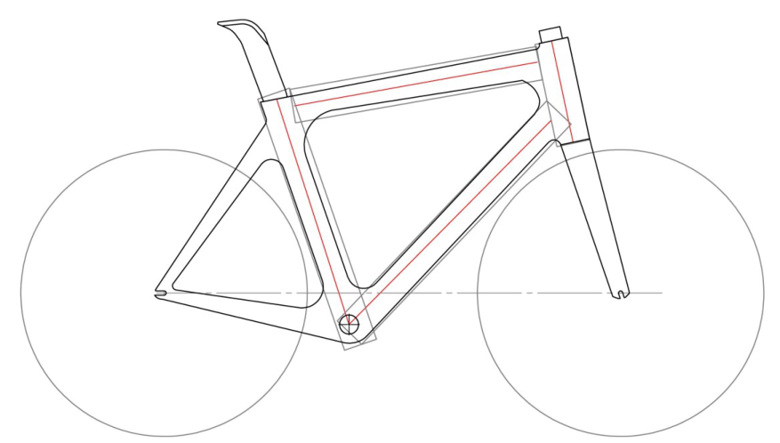

_Figure 18: Illustration of the start and finish points of the straight lines required inside tubes_ 

The start and finish points of the lines inside frame elements are the following: 

- Top tube: from the intersection of the front of the seat tube box with the top tube to the intersection of the rear of the head tube box with the top tube. 

- Head tube: from the section through the top of the head tube to the lower section taken at the point of contact with the forks. 

- Down tube: from the center of the bottom bracket to the intersection of the rear of the head tube box with the down tube. 

- Seat tube: from the center of the bottom bracket to the section passing through the top of the seat tube. 

In the case of double tubes, the straight line must fall within the envelope encompassing both tubes. In this case, it is not obligatory to be able to insert a straight line within each tube separately. 

It is not necessary for a straight line to pass inside the chain stays, seat stays, and fork blades. 

## THE SHAPE OF TUBES 

_“The elements of the frame shall be laid out such that the joining points shall follow the following pattern: the top tube (1) connects the top of the head tube (2) to the top of the_ 

23 

CLARIFICATION GUIDE OF THE UCI TECHNICAL REGULATION 

_seat tube (4); the seat tube shall connect to the bottom bracket shell; the down tube (3) shall connect the bottom bracket shell to the bottom of the head tube. The rear triangles shall be formed by the chain stays (6), the seat stays (5) and the seat tube (4) with the seat stays anchored to the seat tube at points falling within the limits laid down for the slope of the top tube. The seat post shall comply with the dimensional restrictions that apply to the seat tube and may be attached to the frame anywhere on the seat tube and/or top tube. Additional frame components can be added between the head tube and the handlebar stem. These must be inside the dimension of the head tube box.”_ 

The frameset must be able to fit entirely within the template formed by nine rectangular boxes of 80 mm width, the 160 mm reinforcement zone and the compensation triangles as shown by the diagram below. The seat post (8) must be able to fit entirely within its own rectangular box of 80 mm width. The upper line of the box must pass at most 60 mm from the fixture of the saddle on the seat post, Figure 20. Additional frame components between the head tube and the handlebar stem which are not covered by the head tube box and/or the top tube box must be able to fit within their own rectangular component box (9) of 80mm width. Altogether, the additional frame components between the head tube and the handlebar stem cannot exceed dimensional restrictions of the head tube box. During the transition stage, this restriction does not apply to additional frame components between the head tube and the handlebar stem which, on 1 January 2021, are/were already at the production stage. 

Manufacturers are free to adjust the positioning of the boxes provided that the frame geometry respects all articles of the technical regulations and the frame and forks are entirely contained within the boxes and do not present any apparent dangers (protruding parts or sharp angles). 

The bicycle must be designed and adjusted in such a manner that the rider can adopt a regulatory position as defined by Articles 1.3.022 and/or 1.3.023. 

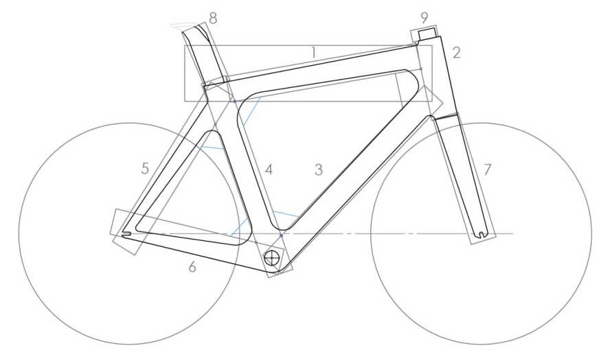

_Figure 19: General illustration of the shape and positioning of the 80 mm boxes_ 

24 

CLARIFICATION GUIDE OF THE UCI TECHNICAL REGULATION 

A template formed by red boxes for each element is shown below. The points circled in green show the limits of the box lengths. The head tube box must be positioned in the same axis as the steerer tube. 

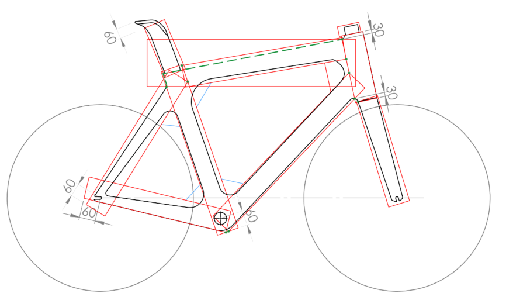

_Figure 20: Illustration of the template showing the start and finish points of the 80 mm boxes for each element_ 

The start and finish points of the 80 mm boxes are the following: 

- Top tube: the front line of the box must pass through the point of intersection of the rear line of the head tube box with the lower line of the top tube box; the rear line of the box must pass through the point of intersection of the front line of the seat tube box with the upper line of the top tube box. 

- Head tube: the upper line of the box must pass no more than 30 mm above the point of intersection of the rear line of the head tube box with the upper line of the top tube; the lower line of the box must pass no more than 30 mm below the point of intersection of the lower line of the down tube box with the rear line of the head tube box. 

- Down tube: the front line of the box must pass through the point of intersection of the rear line of the head tube box with the upper line of the down tube box; the rear line of the box must pass through the point of intersection of the lower line of the seat tube box with the lower line of the down tube box. 

- Seat tube: the upper line of the seat tube must not surpass the upper line of the top tube except in the situation where the seat post extends from the upper line of the seat tube; the lower line of the box must not be located in excess of 60 mm below the bottom bracket center. 

- Seat stays: the upper line of the box must pass through the point of intersection of the front line of the seat tube box with the front line of the seat stay box; the lower line of the box must not be located in excess of 60 mm below the rear wheel axle center. 

25 

CLARIFICATION GUIDE OF THE UCI TECHNICAL REGULATION 

- Chain stays: the front line of the box must pass through the point of intersection of the lower line of the seat tube box with the lower line of the chain stay box; the rear line of the box must not be located in excess of 60 mm behind the rear wheel axle center. 

- Forks: the upper line of the box must pass through the lowest point of the head tube; the lower line of the box can be positioned at the desired height provided that the fork is contained within the box. The box of the down tube can be used to cover the upper part of the fork. 

- Seat post: the seat post must be attached at least with one point of contact with the seat tube and/or top tube in the highlighted area (green). The start of the area: point of intersection of the upper line of the top tube with the rear line of the head tube box. The end of the area: point of intersection of the rear line of the seat stay with the rear line of the seat tube. The upper line of the box must pass at most 60 mm from the fixture of the saddle on the seat post. The front and rear lines of the seat post must not pass through any frame elements completely. 

- Additional frame component between the head tube and the handlebar stem: the lower line of the box must be collinear with the upper line of the head tube box; the upper line of the box can be positioned at the desired height provided that the component  is entirely contained within the box. 

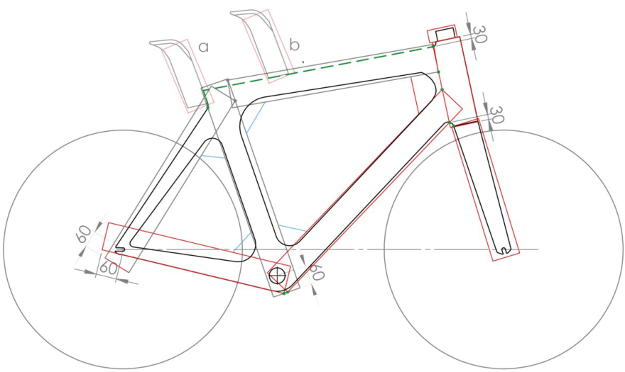

_Figure 21: Illustration of the positioning of the seat post box_ 

Any extension of the tube boxes beyond the points described above in order to contain certain frame parts is prohibited. For example, the extension of the top tube box behind the seat tube, as shown in Figure 22, is prohibited. The red zone of the frame is not allowed under the regulations and the red part of the top tube box must not be used. 

Cable guides and the seat bolt do not have to be contained within the 80 mm boxes provided that there is no deviation from their principal function. If these parts are integrated into the frame, everything must fit inside the boxes. 

26 

CLARIFICATION GUIDE OF THE UCI TECHNICAL REGULATION 

**----- Start of picture text -----** 
27 **----- End of picture text -----** 

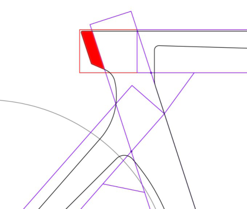

_Figure 22: Illustration of the unauthorized extension of the top tube box behind the seat tube_ 

## TUBE DIMENSIONS 

_“The maximum height of the elements shall be 8 cm and the minimum thickness 1 cm. The minimum thickness of the elements of the front fork shall be 1 cm; these may be straight or curved (7) .”_ 

The terms "height" and "thickness" used in the article should be understood to be the largest and smallest dimensions of tube sections respectively, i.e. the maximum and minimum dimensions authorized in any direction. Thus, the maximum dimension of the section of elements is 80 mm while the minimum dimension is 10 mm. 

A tolerance of one millimeter is allowed for frame elements to account for the thickness of surface coatings (paint and sponsors’ logos). No tolerance is allowed when inspecting technical designs, in particular during approval procedures. 

The blue areas of the illustration below show the parts of the frame and forks that must respect the rule of minimum and maximum dimension for the tubes. 

All sections must be perpendicular to the front or upper edges (red lines in the drawings). 

27 

CLARIFICATION GUIDE OF THE UCI TECHNICAL REGULATION 

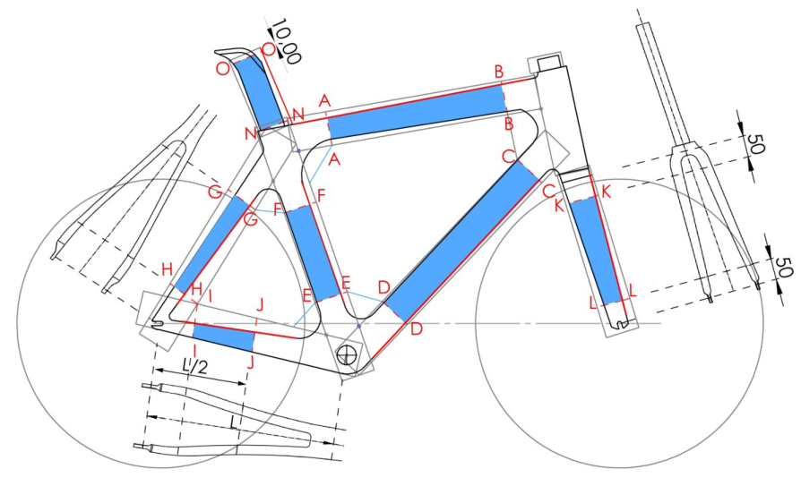

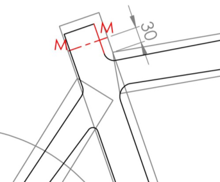

_Figure 23: Illustrations of the areas of the frameset subject to the rule of minimum and maximum dimension_ 

Sections A to O on the illustration represent the limits of these areas and are defined as follows: 

- Section A-A: a perpendicular section at the end of the top tube passing through the 

- point 80 mm from the front line of the seat tube box on the lower line of the top tube box. 

- Section B-B: a perpendicular section at the end of the top tube passing through the point 

- 160 mm from the front line of the head tube box on the lower line of the top tube box. 

- Section C-C: a perpendicular section at the end of the down tube passing through the 

- point 160 mm from the front line of the head tube box on the rear line of the down tube box. 

- Section D-D: a perpendicular section at the end of the down tube passing through the 

- point 80 mm from the front line of the seat tube box on the rear line of the down tube box. 

28 

CLARIFICATION GUIDE OF THE UCI TECHNICAL REGULATION 

- Section E-E: a perpendicular section at the end of the seat tube passing through the 

- point 80 mm from the rear line of the down tube box on the front line of the seat tube box. 

- Section F-F: a perpendicular section at the end of the seat tube passing through the 

- point 80 mm from the front line of the seat stay box on the rear line of the seat tube box. 

- Section G-G: a perpendicular section at the end of the seat stays passing through the 

- point 80 mm from the rear line of the seat tube box on the front line of the seat stay box. 

- Section H-H: a perpendicular section at the end of the seat stays passing through the 

- point of intersection of the front line of the seat stay box with the upper line of the chain stay box. 

- Section I-I: a perpendicular section at the end of the chain stays passing through the 

- point of intersection of the front line of the seat stay box with the upper line of the chain stay box. 

- Section J-J: a perpendicular section of the chain stays passing through the point halfway 

- between the center of the bottom bracket and the rear wheel axle. 

- Section K-K: a perpendicular section at the end of the fork blades located 50 mm from 

- the point where the fork blades join together. 

- Section L-L: a perpendicular section at the end of the fork blades located 50 mm from 

- the front wheel axle. 

- Section M-M (In case the seat post extends from the upper line of the seat tube): a 

- perpendicular section at the end of the seat tube on the part above the top tube passing through the point 30 mm from the upper line of the top tube box on the front line of the seat tube box. 

- Section N-N: a perpendicular section of the seat post passing through the point of 

- intersection of the upper line of the top tube or its extension with the front or the rear line of the seat post box. 

- Section O-O: a perpendicular section of the seat post passing through the point 10 mm 

- from the upper line of the seat post box on the front line of the seat post box. 

The regulations do not concern the transition zones between tubes. 

## SLOPING TOP TUBE 

_“The top tube may slope, provided that this element fits within a horizontal template defined by a maximum height of 16 cm.”_ 

The top tube may be inclined (sloping) provided that this frame element is contained within a horizontal box of 160 mm height. The limits of this zone are established as shown in the diagrams below, i.e. upper limit by the intersection of the top tube with the head tube box and lower limit by the intersection of the top tube with the seat tube box. 

29 

CLARIFICATION GUIDE OF THE UCI TECHNICAL REGULATION 

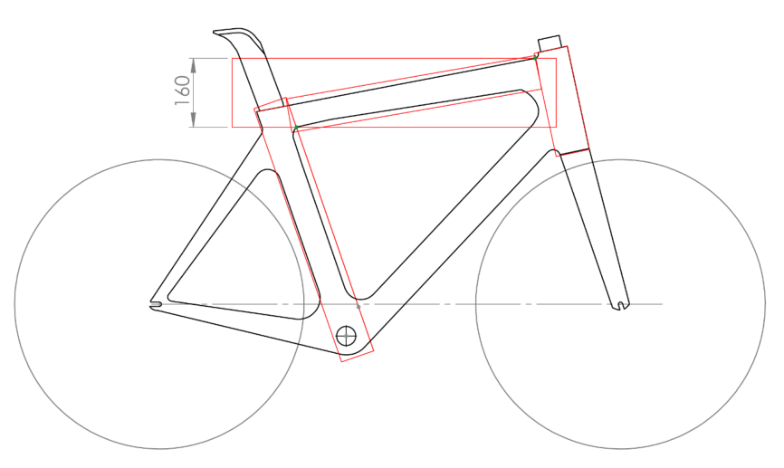

_Figure 24: Illustration of maximum allowed sloping top tube_ 

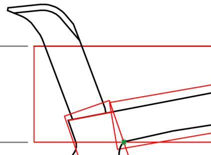

_Figure 25: Lowest point (circled in green) that must be contained within the 160 mm-high horizontal box_ 

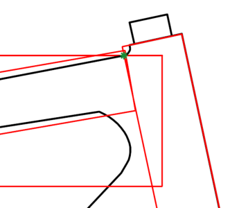

_Figure 26: Highest point (circled in green) that must be contained within the 160 mm-high horizontal box_ 

In addition to the requirement to fit within the 160 mm-high horizontal box, the top tube must also fit within the 80 mm box. 

## INCLINATION OF SEAT STAYS 

The front line of the 80 mm seat stay box must cross the area of intersection between the horizontal 160 mm-high box and the 80 mm seat tube box. The rear wheel axle must be contained within the seat stay and chain stay boxes. 

30 

CLARIFICATION GUIDE OF THE UCI TECHNICAL REGULATION 

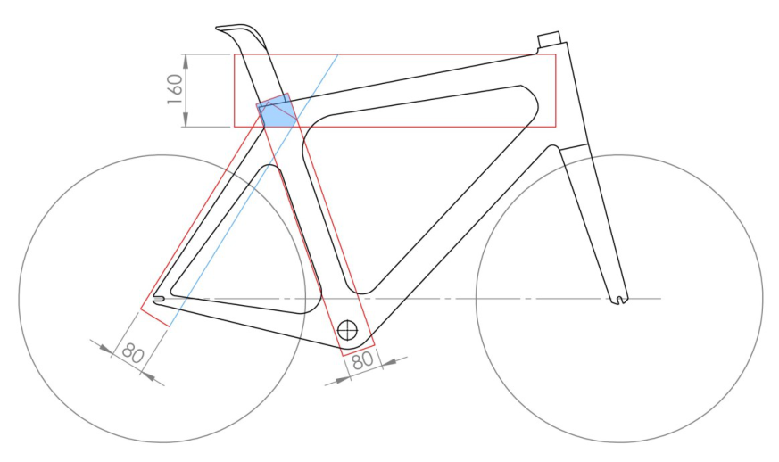

_Figure 27: Illustration of the rule on the inclination of seat stays_ 

## FORK GEOMETRY 

When the fork comprises a steerer that is inserted inside the head tube, the fork is considered as a separate component to the frame. Consequently, the fork must be contained within a single box of 80 mm width (not including the steerer). This box starts at the point of contact (circled in the Figure 28) between the head tube and the fork crown but is not necessarily positioned in the same plane as the head tube. 

When the fork is offset with the offset steerer component pivoting around its axis, it is considered to be integrated with the frame and thus the moving part is not considered separately from the structure of the frame. In this case the fixed and moving parts of the offset fork arrangement must be wholly contained within the template for the head tube. 

The axis of the head tube must always be contained within the head tube box in offset forks, as illustrated in the Figure 29. 

The body of the fork must be contained within a box although this can be offset in relation to the head tube. This box starts at the point of contact (circled in the Figure 29) between the head tube and the fork crown but is not necessarily positioned in the same plane as the head tube. For safety reasons relating to the properties of composites, the templates of the head tube and fork must overlap more than half the thickness of these boxes. 

By no means can the boxes of the top tube be used to cover a part of the fork. 

31 

CLARIFICATION GUIDE OF THE UCI TECHNICAL REGULATION 

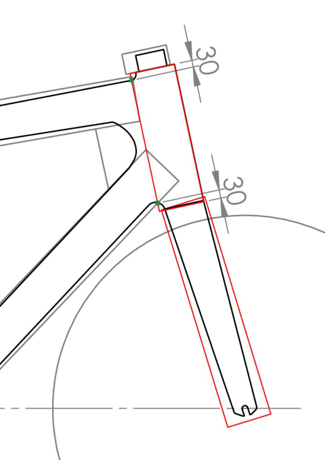

_Figure 28: Illustration of the position of the boxes for a fork using a traditional internal steerer_ 

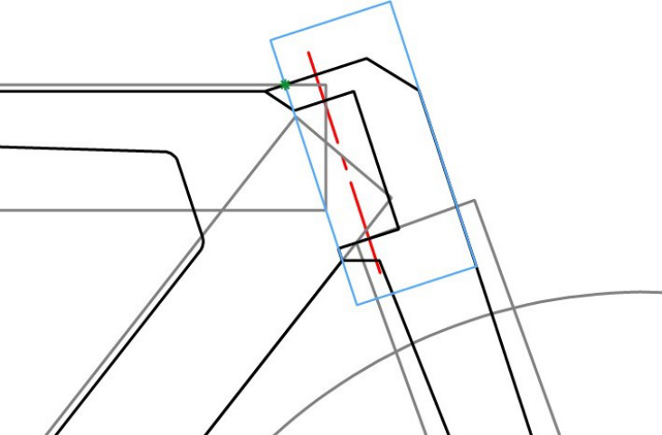

_Figure 29: Illustration of the positioning of the axis of the head tube within the head tube box_ 

32 

CLARIFICATION GUIDE OF THE UCI TECHNICAL REGULATION 

**----- Start of picture text -----** 
33 **----- End of picture text -----** 

Thus, forks must be able to be covered by the fork box in the case of a standard design forks, or by the fork box and the head tube box in the case of an offset forks. The box of the down tube can be used to cover the upper part of the fork box. It is prohibited to use other frame boxes to cover the fork components. 

A protuberance integrated with the fork crown, that serves as a stem or a support for the stem for the handlebars and handlebar extensions, is allowed but must be restricted to its original function. A diversion of use in the form of an added extension is prohibited. 

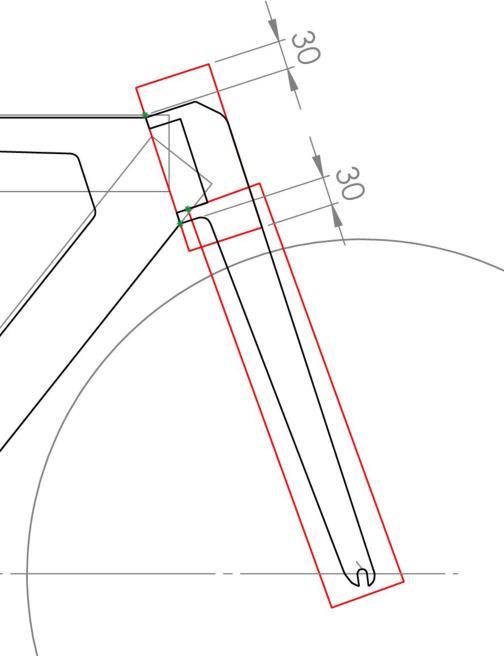

_Figure 30: Illustration of the position of the boxes for offset fork_ 

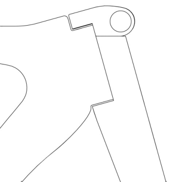

_Figure 31: Illustration of a protuberance used as a stem._ 

33 

CLARIFICATION GUIDE OF THE UCI TECHNICAL REGULATION 

## MULTIPLE ELEMENTS 

Multiple elements are authorized for the frame (top tube, down tube, seat tube, seat stays, chain stays), the fork, the seat post. 

The multiple tubes, taken individually and together, have to respect the maximum section dimension of 80 mm and the minimum section dimension of 10 mm. 

## TIMING CHIP PLACEMENT, TRACK 

The timing chip must be placed entirely on the surface of the left fork blade. The timing chip must not be placed partially or fully outside of the fork surface. A tolerance of 5 mm around the perimeter of the chip should apply. 

The timing chip must be placed on the outer side of the fork blade. 

The timing chip cannot be covered and/or shielded. However, the timing chip may be embedded in the fork structure for a distance equal to the thickness of the timing chip. 

Attachment of the timing chip by the rubber/latex “sock” is authorized under conditions when it does not constitute an excrescence or enlarges the general shape of the timing chip. 

The timing chip must be placed in a very close proximity to the front wheel axle within a max distance of 2 lengths of the timing chip. 

The timing chip should not be orientated 90° from the original position (see below). 

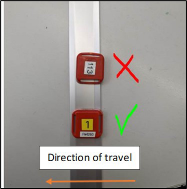

## **ARTICLE 1.3.022** 

_“In competitions other than those covered by article 1.3.023, only the traditional type of handlebars (see diagram «structure 1A») may be used. The handlebars must be positioned in an area defined as follows: above, by the horizontal plane of the point of support of the saddle (B); below, by the horizontal plane passing 100 mm below the highest point of the two wheels (these being of equal diameter) (C); at the rear by the axis of the steerer tube (D) and_ 

34 

CLARIFICATION GUIDE OF THE UCI TECHNICAL REGULATION 

_at the front by a vertical plane passing at horizontal distance of 100 mm from the axis of the front wheel spindle (see diagram «Structure (1A)»)._ 

_In addition, all handlebars must conform to the following:_ 

_- The maximum dimension of the cross section of the handlebars is 80 mm - The maximum dimension of the cross section of the stem is 80 mm - The minimum dimension of the cross section of all fork accessory is 10 mm_ 

_- Two isosceles compensation triangles with two 40 mm sides are authorised at the joints between the stem and the handlebars.”_ 

The traditional type of handlebars must be used in road races, cyclo-cross and track races (apart from track time trials and pursuits). The attachment of any additional handlebar component or fixed additional time trial extension handlebar is prohibited in these events. 

In no case shall the front of the handlebars exceed the vertical plane passing at horizontal distance of 100 mm from the the axis of the front wheel spindle; which is the control zone of the bicycle. The more forward the handlebar is positioned, the less maneuverable the bicycle will be and the less it will be easy to react quickly to an obstacle or a wind gust. Moreover, this would result in moving the center of gravity of the rider on the bicycle, which would increase even more the risks of loss of control. The area of positioning the handlebars is defined by the diagram below: 

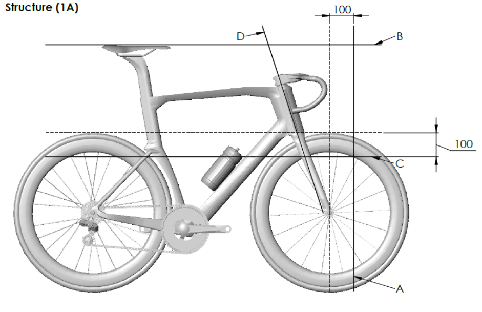

_Figure 32: Illustration of the box, marked out by lines A, B, C and D, within which the handlebars must be fully contained._ 

35 

CLARIFICATION GUIDE OF THE UCI TECHNICAL REGULATION 

_“The brake controls attached to the handlebars shall consist of two supports with levers. It must be possible to operate the brakes by pulling on the levers with the hands on the lever supports. Any extension to or reconfiguration of the supports to enable an alternative use is prohibited. A combined system of brake and gear controls is authorised.”_ 

The bicycle must be fitted with a braking system that operates on both front and rear wheels in order to take part in a road or cyclo-cross event. 

Electronic derailleurs are authorised in competition provided that they are controlled solely by the rider. 

## BRAKE HOOD BODY INCLINATION 

The centre plane of the Brake Hood Body must align with the centre plane of the Traditional Handlebars (Drop area). In order to ensure that the braking system may be operated both safely and as designed (or intended), by pulling on the levers with the hands on the lever supports, a maximum inclination of 10 degrees is permitted between the two planes (see illustrations below). 

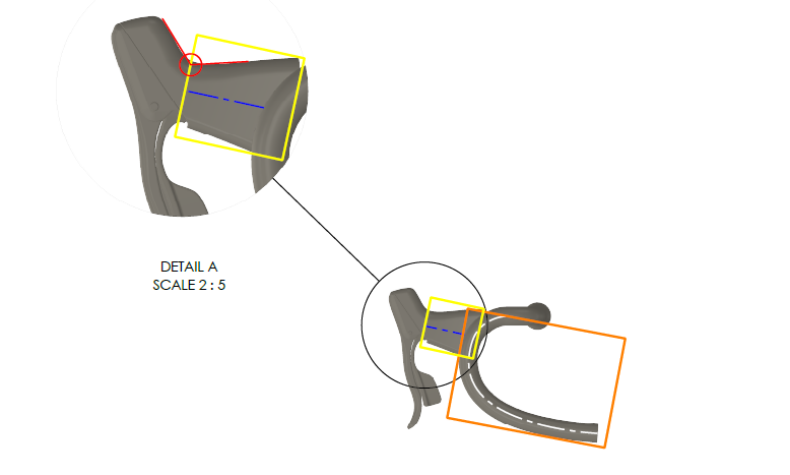

36 

CLARIFICATION GUIDE OF THE UCI TECHNICAL REGULATION 

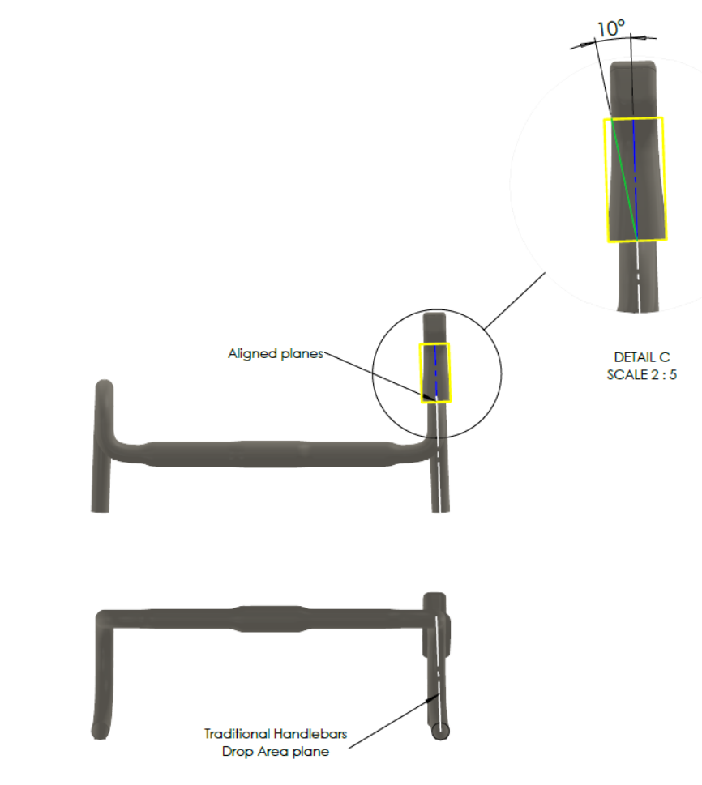

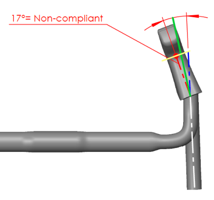

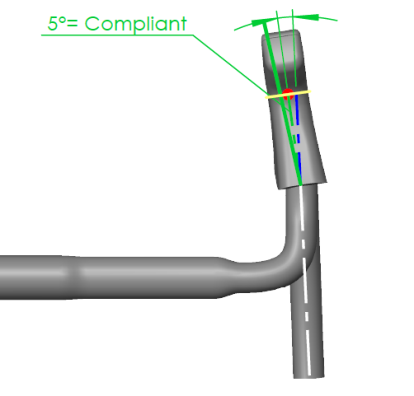

37 

CLARIFICATION GUIDE OF THE UCI TECHNICAL REGULATION 

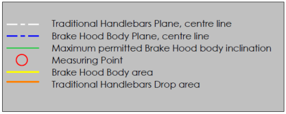

_Figure 33: Illustration of the maximum permitted Brake Hood body inclination_ 

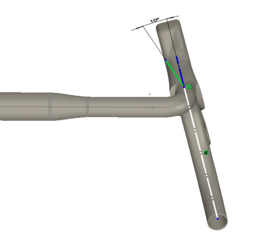

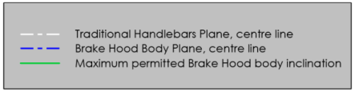

_Figure 34 Illustration of the maximum permitted Brake Hood body inclination in combination with a flared traditional handlebars_ 

## TRADITIONAL HANDLEBARS 

The cockpit which comprises the handlebar and the stem must be able to fit entirely within the template formed by 5 rectangular boxes of 80 mm width and the compensation triangles as shown by the diagram below. 

A template formed by red boxes for each element is shown below. 

38 

CLARIFICATION GUIDE OF THE UCI TECHNICAL REGULATION 

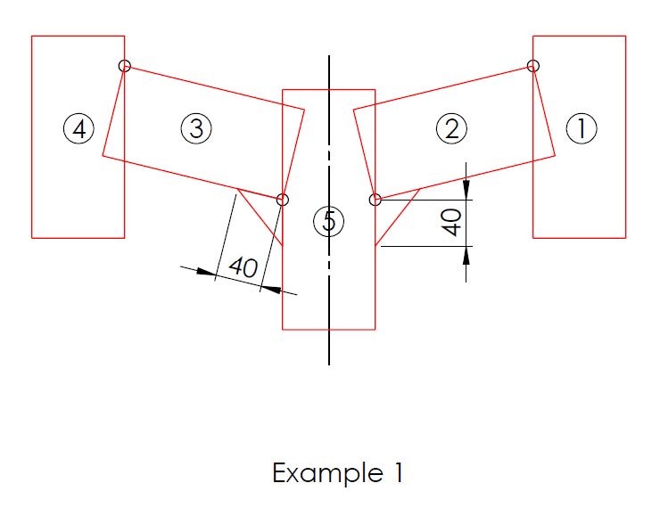

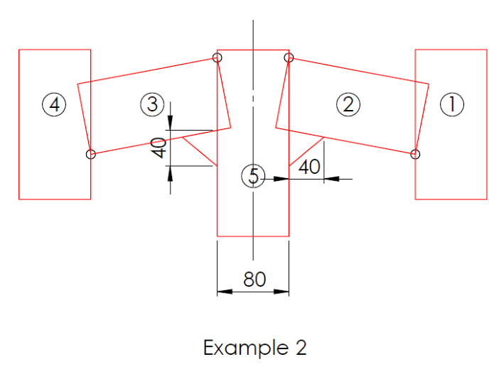

_Figure 35 Illustrations (Example 1), (Example 2) of templates formed by red boxes for each element_ 

The start and finish points of the boxes are the following: 

- Handlebars (1) and Handlebars (4): The upper line of the box is limited by a vertical plane passing at a horizontal distance of 100 mm from the axis of the front wheel spindle; the lower line of the box is limited by the axis of the steerer tube. 

39 

CLARIFICATION GUIDE OF THE UCI TECHNICAL REGULATION 

- Handlebars (2): The rear line of the box must pass through the point of intersection of the front line of the Stem (5) box with the lower or upper line of the Handlebar (2) box; the front line of the box must pass through the point of intersection of the rear line of the Handlebars (1) box with the upper or lower line of the Handlebar box (2). 

- Handlebars (3): The rear line of the box must pass through the point of intersection of the front line of the Handlebars (4) box with the upper or lower line of the Handlebars (3) box; the front line of the box must pass through the point of intersection of the rear line of the Stem (5) box with the lower or upper line of the Handlebars (3) box. 

- Stem (5): The upper line of the box can be positioned at the desired length provided that it meets the prevailing quality and safety standards for bicycles; the lower line of the box is limited by the dimensional restrictions of the frame components between the head tube and the handlebars stem box (see Article 1.3.020). 

Manufacturers are free to adjust the positioning of the boxes provided that the equipment geometry respects all articles of the technical regulations and the equipment is entirely contained within the boxes and does not present any apparent dangers (protruding parts or sharp angles). 

Any extension of the element boxes beyond the points described above in order to contain certain parts is prohibited. 

## TRADITIONAL HANDLEBARS, ELEMENT DIMENSIONS 

The terms “maximum/minimum dimension of the cross section” used in the article should be understood to be the largest and smallest dimensions of element sections respectively, i.e. the maximum and minimum dimensions authorized in any direction. 

A tolerance of one millimeter is allowed for the elements to account for the thickness of surface coatings (paint and sponsors’ logos). No tolerance is allowed when inspecting technical designs. 

The blue areas of the illustration below show the parts must respect the requirement of minimum and maximum dimensions. 

Sections A-A, B-B, C-C, D-D, F-F and E-E must be perpendicular to the red lines in the drawings. 

40 

CLARIFICATION GUIDE OF THE UCI TECHNICAL REGULATION 

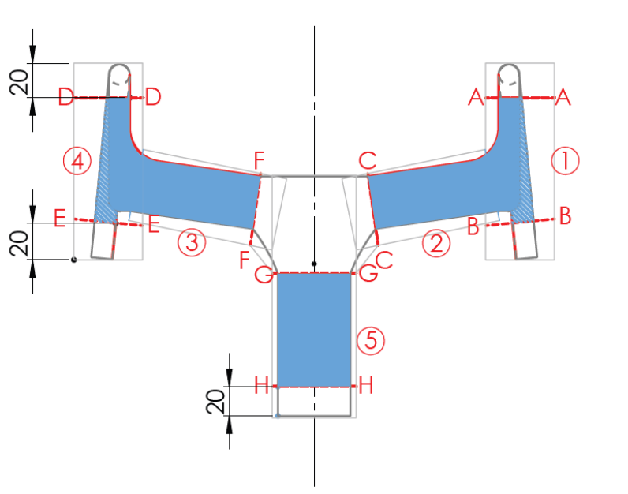

_Figure 36 Illustration of minimum and maximum dimensions requirements_ 

Sections A to H on the illustration represent the limits of these areas and are defined as follows: 

- Section A-A: a perpendicular section passing through the point 20 mm from the upper line of the Handlebars (1) box. 

- Section B-B: a perpendicular section passing through the point 20 mm from the lower line of the Handlebars (1) box. 

- Section C-C: a perpendicular section passing through the point 40 mm from the front line of the Stem (5) box on the lower line of the Handlebars (2) box. 

- Section D-D: a perpendicular section passing through the point 20 mm from the upper line of the Handlebars (4) box. 

- Section E-E: a perpendicular section passing through the point 20 mm from the lower line of the Handlebars (4) box. 

- Section F-F: a perpendicular section passing through the point 40 mm from the rear line of the Stem (5) box on the lower line of the Handlebar (3) box. 

- Section G-G: a perpendicular section to the center line, passing through the point 40 mm from the lower line of the Handlebars (3) box on the rear line of the Stem (5) box. 

- Section H-H: a perpendicular section to the center line, passing through the point 20 mm from the lower line of the Stem (5) box. 

The regulations do not concern the transition zones between elements. 

MULTIPLE ELEMENTS 

41 

CLARIFICATION GUIDE OF THE UCI TECHNICAL REGULATION 

Multiple elements are authorized for the stem, the traditional handlebars and base bars. Individual tubes and the multiple tubes have to respect the maximum section dimension of 80 mm and the minimum section dimension of 10 mm. The multiple elements rule applies in the same areas than the rule of the minimum and ~~m~~ aximum dimension for the tubes. 

In the case of the traditional handlebars and sections A-A, B-B, D-D and E-E, if one of the sections comprises multiple elements (not greater than 2), each element taken individually have to respect the maximum and minimum dimensions authorised in any direction. The requirement for the elements to respect the maximum and minimum dimensions in any direction in conjunction is not required. 

_Figure 37: Example of a compliant section of an element formed by two tubes_ 

In the event of a multiple elements of a length shorter than 80 mm, the same conditions as for other multiple elements apply with the exception that only one tube must respect the minimum section dimension of 10 mm. This scenario is limited to one exception per element. 

## TRADITIONAL HANDLEBARS, APPROVAL PROCEDURE, AS FROM 1.1.2023 

This procedure does not apply to traditional handlebars which, on 1 January 2023, are: 

- already manufactured 

- on the market 

- already at the production stage 

Handlebars/extensions/base bars that have already been available on the market during 2021 and 2022 can be approved under the present procedure at the manufacturer’s request. 

42 

CLARIFICATION GUIDE OF THE UCI TECHNICAL REGULATION 

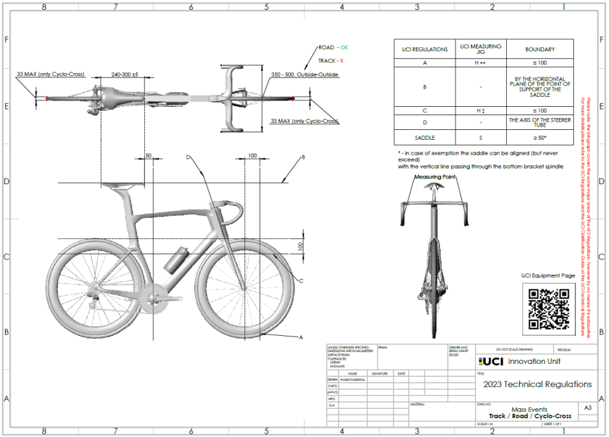

## **ARTICLE 1.3.023** 

_“For road time trials and for individual pursuit, team pursuit and Kilometre/500m time trial on the track, a fixed time trial extension handlebar (consisting of 2 extensions with sections for each hand to hold and two forearm supports) may be added or integrated to either the traditional handlebar or the base bar steering system (see diagram «Structure (1B)»)._ 

_The traditional type of handlebars or the base bar must be positioned in the area defined in article 1.3.022 (A, B, C, D)._ 

_The default horizontal distance between_ ~~_the_~~ _vertical planes_ ~~_line_~~ _passing through the bottom bracket axle and the extremity of the fixed time trial extension handlebar, including controls or fixed levers, may not exceed 750 mm._ 

_The default height difference between the midpoint of the forearm support and the highest or lowest point of the extension (including accessory) must be less than 100 mm._ 

_For the track and road competitions covered by the first paragraph, the default distance of 750 mm may be increased to 850 mm as a part of an exemption based on three (3) rider height categories mentioned below._ 

_Category 1:       Less than 180.0 cm tall_ 

43 

CLARIFICATION GUIDE OF THE UCI TECHNICAL REGULATION 

_For riders less than 180.0 cm tall, the horizontal distance between the vertical planes passing through the bottom bracket axle and the extremity of the fixed time trial extension handlebar, including all accessories, may be a maximum of 800 mm._ 

_The height difference between the midpoint of the forearm support and the highest or lowest point of the extension (including accessory) must be less than 100 mm._ 

_Category 2: Between 180.0 cm and 189.9 cm tall_ 

_For riders between 180.0 cm and 189.9 cm tall, the horizontal distance between the vertical planes passing through the bottom bracket axle and the extremity of the fixed time trial extension handlebar, including all accessories, may be a maximum of 830 mm. The height difference between the midpoint of the forearm support and the highest or lowest point of the extension (including accessory) must be less than 120 mm._ 

_Riders in Category 2 must submit a rider height attestation application form available from the UCI website._ 

_Category 3:_ 

## _190.0 cm and taller_ 

_For riders 190.0 cm and taller, the horizontal distance between the vertical planes passing through the bottom bracket axle and the extremity of the fixed time trial extension handlebar, including all accessories, may be a maximum of 850 mm._ 

_The height difference between the midpoint of the and the highest or lowest point of the extension (including accessory) must be less than 140 mm._ 

_Riders in Category 3 must submit a rider height attestation application form available from the UCI website._ 

_A rider makes use of a rider height category exemption, must inform the commissaires' panel at the time of the bike check. For clarity, the default distances mentioned above will be applied by the commissaires panel if the respective height category exemption is not communicated by the rider._ 

_In addition, all fixed time trial extension handlebars and forearm supports must conform to the following:_ 

44 

CLARIFICATION GUIDE OF THE UCI TECHNICAL REGULATION 

_- Two isosceles compensation triangles of 40 mm sides are authorised at the joints between the stem and the base bar; - The maximum dimension of the cross section of the base bar is 80 mm; - The minimum dimension of the cross section of all fork accessory is 10 mm; - The maximum dimension of the cross section of the stem is 80 mm;_ 

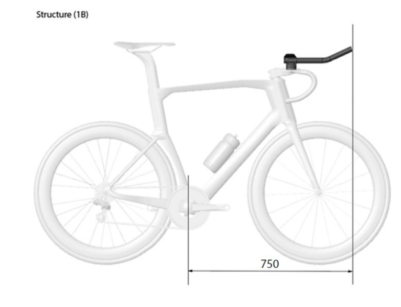

## HEIGHT CATEGORIES 

Riders in Category 2, 3 must submit a rider height attestation via an online submission available on the UCI website. 

In case a rider is not on the UCI List riders height Categories 2 and 3 on the day of the event, the UCI Commissaire can measure the height on-site, allowing the rider to compete under the respective Height Category. Nevertheless, the attestation must be submitted afterwards to be able to be added on the list. 

## BASE BAR 

The cockpit which comprises the base bar and the stem must be able to fit entirely within the template formed by 5 rectangular boxes of 80 mm width and the compensation triangles as shown by the diagram below. 

A template formed by red boxes for each element is shown below. 

45 

CLARIFICATION GUIDE OF THE UCI TECHNICAL REGULATION 

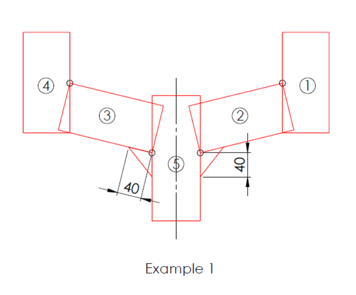

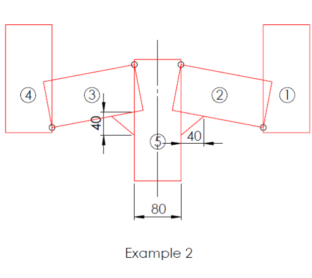

_Figure 38 Illustrations (Example 1), (Example 2) of templates formed by red boxes for each element_ 

The start and finish points of the boxes are the following: 

- Base bar (1) and Base bar (4): The upper line of the box is limited by a vertical plane passing at a horizontal distance of 100 mm from the axis of the front wheel spindle; the lower line of the box is limited by the axis of the steerer tube. 

46 

CLARIFICATION GUIDE OF THE UCI TECHNICAL REGULATION 

- Base bar (2): The rear line of the box must pass through the point of intersection of the front line of the Stem (5) box with the lower or upper line of the Base bar (2) box; the front line of the box must pass through the point of intersection of the rear line of the Base bar (1) box with the upper or lower line of the Base bar box (2). 

- Base bar (3): The rear line of the box must pass through the point of intersection of the front line of the Base bar (4) box with the upper or lower line of the Base bar (3) box; the front line of the box must pass through the point of intersection of the rear line of the Stem (5) box with the lower or upper line of the Base bar (3) box. 

- Stem (5): The upper line of the box can be positioned at the desired length provided that it meets the prevailing quality and safety standards for bicycles; the lower line of the box is limited by the dimensional restrictions of the frame components between the head tube and the handlebars stem box (see Article 1.3.020). 

Manufacturers are free to adjust the positioning of the boxes provided that the equipment geometry respects all articles of the technical regulations and the equipment is entirely contained within the boxes and does not present any apparent dangers (protruding parts or sharp angles). 

Any extension of the element boxes beyond the points described above in order to contain certain parts is prohibited. 

## BASE BAR, ELEMENT DIMENSIONS 

The terms “maximum/minimum dimension of the cross section” used in the article should be understood to be the largest and smallest dimensions of element sections respectively, i.e. the maximum and minimum dimensions authorized in any direction. 

A tolerance of one millimeter is allowed for the elements to account for the thickness of surface coatings (paint and sponsors’ logos). No tolerance is allowed when inspecting technical designs. 

The blue areas of the illustration below show the parts must respect the requirement of minimum and maximum dimensions. 

Sections A-A, B-B, C-C and D-D must be perpendicular to the red lines in the drawings. 

47 

CLARIFICATION GUIDE OF THE UCI TECHNICAL REGULATION 

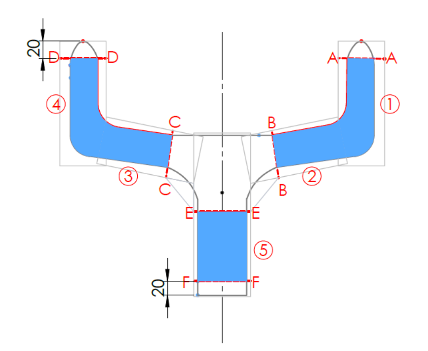

_Figure 39 Illustration of minimum and maximum dimensions requirements_ 

Sections A to F on the illustration represent the limits of these areas and are defined as follows: 

- Section A-A: a perpendicular section passing through the point 20 mm from the upper line of the Base bar (1) box. 

- Section B-B: a perpendicular section passing through the point 40 mm from the front line of the Stem (5) box on the lower line of the Base bar (2) box. 

- Section C-C: a perpendicular section passing through the point 40 mm from the rear line of the Stem (5) box on the lower line of the Base bar (3) box. 

- Section D-D: a perpendicular section passing through the point 20 mm from the upper line of the Base bar (4) box. 

- Section E-E: a perpendicular section to the center line, passing through the point 40 mm from the lower line of the Base bar (3) box on the rear line of the Stem (5) box. 

- Section F-F: a perpendicular section to the center line, passing through the point 20 mm from the lower line of the Stem (5) box. 

The regulations do not concern the transition zones between elements. 

48 

CLARIFICATION GUIDE OF THE UCI TECHNICAL REGULATION 

## FIXED ADDITIONAL TIME TRIAL EXTENSION HANDLEBAR 

The maximum inclination of each forearm support should be measured in relation to the reference plane. The regulation regarding the 30 degrees as well as the 125mm and 50mm ~~4 cm~~ aim to avoid any fairing by using large extensions or a too big inclination. 

The article must be understood so that the extension can be of a 50mm maximal section (width and height). On this extension, one part, the “ _forearm support_ ” can be wider than 50mm and can go up to 125mm wide (projected surface). This part can be of a 125mm maximal length. 

The extensions, mounting and any other accessories (controls, levers, etc.)  must be able to fit entirely within the template formed by 6 rectangular boxes and the compensation triangles as shown by the diagram below. 

A template formed by red boxes for each element is shown below. 

49 

CLARIFICATION GUIDE OF THE UCI TECHNICAL REGULATION 

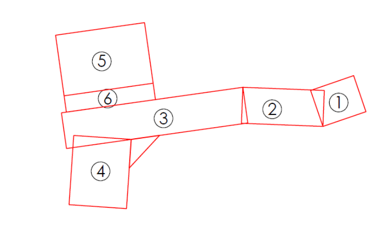

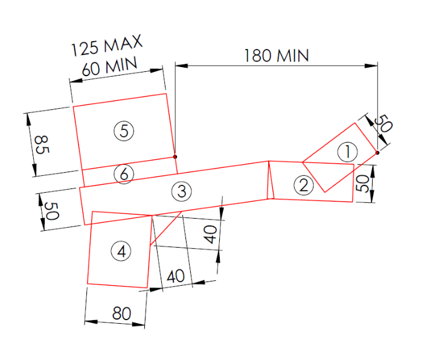

_Figure 40 Illustrations (A), (B) of templates formed by red boxes for each element_ 

50 

CLARIFICATION GUIDE OF THE UCI TECHNICAL REGULATION 

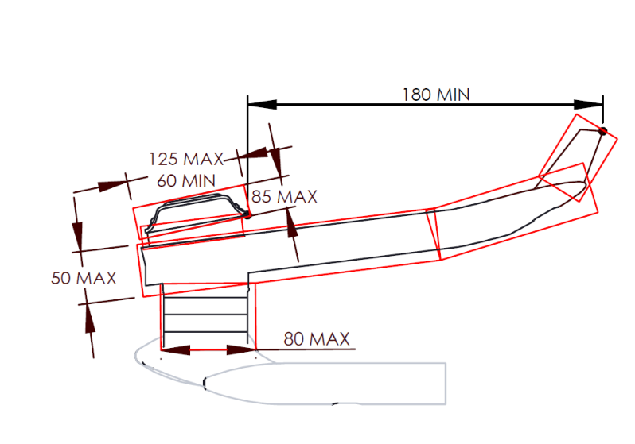

_Figure 41 Illustration (C) of templates formed by red boxes for each element_ 

The start and finish points of the boxes are the following: 

- Extension (1): The front line of the box can be positioned at the desired length provided that the extremity of the extension is completely contained within the box; the rear line of the box must pass through the point of intersection of the front or upper or lower line of the Extension (2) box with the lower or the upper line of the Extension (1) box. 

- Extension (2): The front line of the box must pass through the point of intersection of the upper or lower line of the Extension (1) box with the front line of the Extension (2) box. The rear line of the box must pass through the point of intersection of the front line of the Extension (3) box with the lower or upper line of the Extension (2) box. 

- Extension (3): The front line of the box must pass through the point of intersection of the rear line of the Extension (2) box with the lower or upper line of the Extension (3) box. The rear line can be positioned at the desired length provided that the rear extremity of the extension is completely contained within the box. 

In the case when both extensions are joined by part, the Extension (3) box must accommodate the joined part and therefore the cross section can be enlarged to 80mm. 

- Mounting accessory (4): the upper line of the box must pass through the point of intersection of the rear or front line of the Mounting accessory box with the lower line of the Extension (3) box; the lower line of the box must pass at most 15 mm from the fixture of the mounting accessory on the handlebars or the base bar. 

51 

CLARIFICATION GUIDE OF THE UCI TECHNICAL REGULATION 

An additional Mounting accessory box (6) of 125mm length may be added in between the Extension (3) box and the Forearm support box (5). The position of the box may vary but never cross the area defined by the vertical planes passing through the extremity point of the front line of the Forearm support box (5) and the rear line of the Extension (3) box. The maximum/minimum dimension of the cross section cannot exceed the section view length to width of 125mm x 50mm or 80mm (in case sections of extensions are joined by part). The box must be used solely for the adjustment and/or fixation purposes of the Forearm support box. The use of the box for any other reason is forbidden. 

## _•_ Forearm support (5): 

Each forearm support must be able to fit entirely within its own rectangular box (5) of 85 mm width. The box may overlap the Extension (3) box or the additional Mounting accessory box (6). 

The front line of the Forearm support box must be positioned at a minimum distance equal to 180mm or greater, from the vertical plane passing through the extremity of the extension. 

The minimum length of forearm supports is limited to 60 mm. 

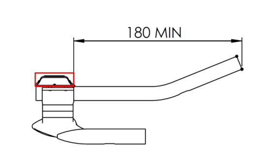

_Figure 42 Illustration of the Forearm support box position_ 

Manufacturers are free to adjust the positioning of the boxes provided that the equipment geometry respects all articles of the technical regulations and the equipment is entirely contained within the boxes and does not present any apparent dangers (protruding parts or sharp angles). 

Any extension of the element boxes beyond the points described above in order to contain certain parts is prohibited. 

## FIXED ADDITIONAL TIME TRIAL EXTENSION HANDLEBAR, ELEMENT DIMENSIONS 

The terms “maximum/minimum dimension of the cross section” used in the article should be understood to be the largest and smallest dimensions of element sections respectively, i.e. the maximum and minimum dimensions authorized in any direction. 

A tolerance of one millimeter is allowed for the elements to account for the thickness of surface coatings (paint and sponsors’ logos). No tolerance is allowed when inspecting technical designs. 

52 

CLARIFICATION GUIDE OF THE UCI TECHNICAL REGULATION 

The blue areas of the illustration below show the parts must respect the requirement of minimum and maximum dimensions. 

Sections A-A and B-B must be perpendicular to the red lines in the drawings. 

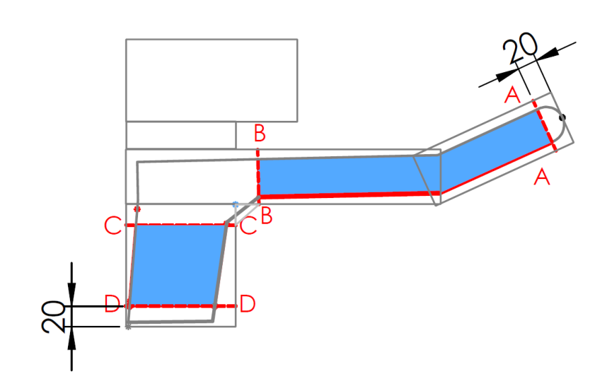

_Figure 43 Illustration of minimum and maximum dimensions requirements_ 

Sections A to D on the illustration represent the limits of these areas and are defined as follows: 

- Section A-A: a perpendicular section passing through the point 20 mm from the front line of the Extension box (1). 

- Section B-B: a perpendicular section passing through the point 40 mm from the front line of the Mounting accessory box on the lower line of the Extension box (3). 

- Section C-C: a horizontal section passing through the point 40 mm from the lower line of the Extension box (3) on the front line of the Mounting accessory box. 

- Section D-D: a horizontal section passing through the point 20 mm from the lower line of the Mounting accessory box. 

The regulations do not concern the transition zones between elements. 

## MULTIPLE ELEMENTS 

Multiple elements are authorized for the stem and base bars. 

Individual tubes and the multiple tubes have to respect the maximum section dimension of 80 mm and the minimum section dimension of 10 mm. The multiple elements rule applies in the same areas than the rule of the minimum and ~~m~~ aximum dimension for the tubes. 

53 

CLARIFICATION GUIDE OF THE UCI TECHNICAL REGULATION 

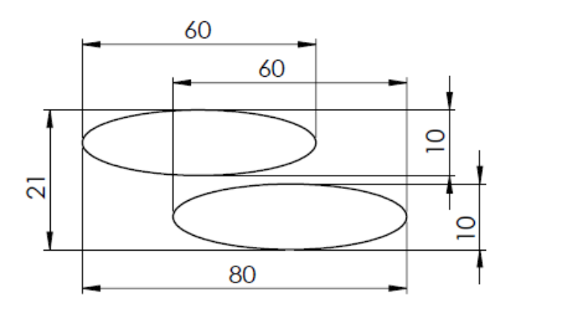

_Figure 44: Example of a compliant section of an element formed by two tubes_ 

In the event of a multiple elements of a length shorter than 80 mm, the same conditions as for other multiple elements apply with the exception that only one tube must respect the minimum section dimension of 10 mm. This scenario is limited to one exception per element. 

## FIXED ADDITIONAL TIME TRIAL EXTENSION HANDLEBAR JOINED BY PART 

In case when both extensions are joined by part, the maximum dimension of the cross section of the joined part is 80mm. Other dimensional restrictions remain unchanged. 

54 

CLARIFICATION GUIDE OF THE UCI TECHNICAL REGULATION 

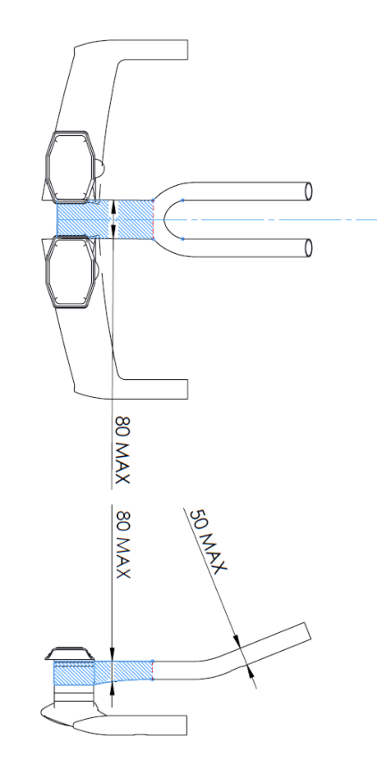

_Figure 45 Illustration of extensions joined by part_ 

## BINDING ELEMENT 

Any binding element (bridge) between the fixed additional time trial extension handlebar, forearm supports is considered as the continuation of the fixed additional time trial extension handlebar. Therefore, the maximum dimension of the cross section of the binding element must be 50 mm. Any binding element between stack/raisers must follow the identical restrictions. The binding element must be positioned at the horizontal distance equal to 80 mm or greater, from the vertical plane passing through the extremity of the handlebars extensions. 

Multiple binding elements are forbidden. Only one binding element can be placed in the mentioned areas. 

## BINDING ELEMENT, ELEMENT DIMENSIONS 

Sections A to B in the illustration below represent the limits of these areas and are defined as follows: 

55 

CLARIFICATION GUIDE OF THE UCI TECHNICAL REGULATION 

- Section A-A: a perpendicular section passing through the point 5 mm from the extension on the upper line of the binding element. 

- Section B-B: a perpendicular section passing through the point 5 mm from the extension on the upper line of the binding element. 

The regulations do not concern the transition zones between elements. 

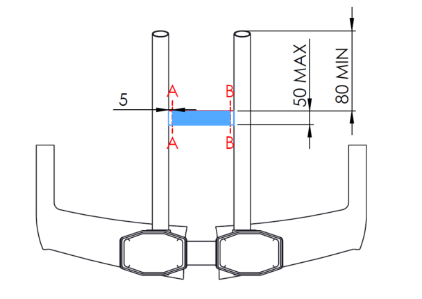

_Figure 46: Illustration of the binding element_ 

## SITUATION AROUND THE HEIGHT DIFFERENCE BETWEEN THE FOREARM SUPPORT POINT AND THE HIGHEST OR LOWEST POINT OF THE HANDLEBARS EXTENSION 

The fixed additional time trial extension handlebar plus any accessories (controls, levers, etc.) must be within ± 100 or ±120 or ±140 mm (as per provisions of article 1.3.023) with a tolerance of 5mm from the level defined by the middle of the forearm supports. Forearm supports pads must not be considered during the measurement. Any moving parts have to be placed in the most vertical position that can remain unsupported through their range of movement. 

To check, rotate the levers to the highest point and allow to rest, and then take the measurement for the +100/+120/+140 mm (as per provisions of article 1.3.023) position. If necessary, rotate the lever to the lowest point and take the measurement for the -100/120/-140 mm (as per provisions of article 1.3.023) position. The measurements of the upper and lower limits are taken in the front half of the fixed additional time trial extension handlebar. 

The measurement is made from a horizontal perspective of the forearm support. If it is inclined, the measurement will be made from the middle of the elbow support. 

56 

CLARIFICATION GUIDE OF THE UCI TECHNICAL REGULATION 

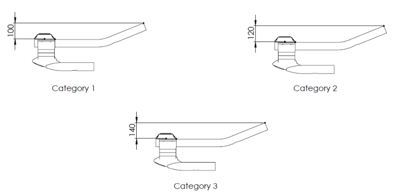

_Figure 47 Examples of the vertical limits per each height category (as per provisions of article 1.3.023)_ 

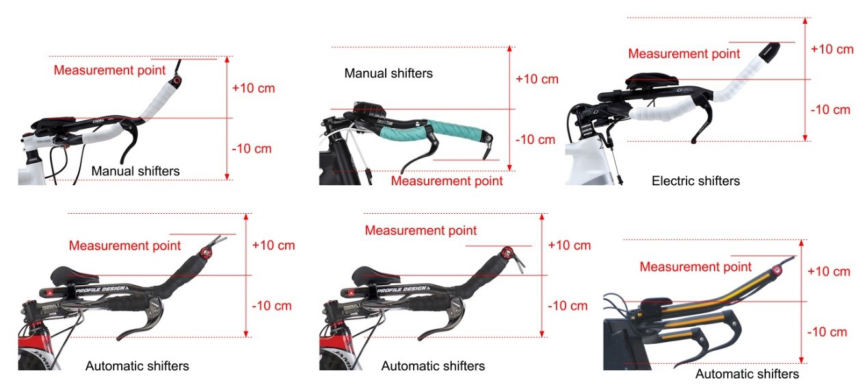

_Figure 48: Points of measurement for the vertical limits of the fixed additional time trial extensions and any accessories_ 

57 

CLARIFICATION GUIDE OF THE UCI TECHNICAL REGULATION 

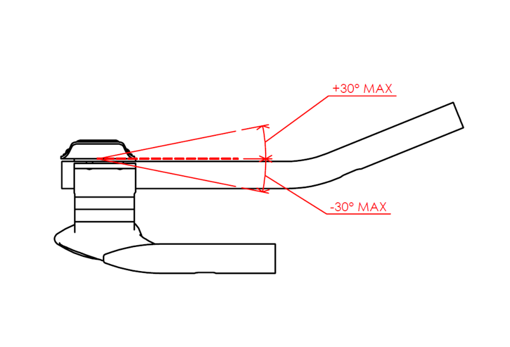

_Figure 49 Illustration of the maximum inclination of each elbow rest_ 

Having the fixed additional time trial extension handlebar taped or moulded on the complete length is authorised as long as the conditions mentioned above are respected. It is possible to have the _forearm support_ integrated in the extension. 

The fixed additional time trial extension handlebar with all their accessories (controls, levers, etc. and all their mounting accessories) must be included within the maximum distance allowed from the bottom bracket axle. Any moving parts have to be placed in the most horizontal position that can remain unsupported through their range of movement. 

To check, rotate the levers to the position that gives the maximum horizontal length and allow to rest, and then take the measurement allowed from the bottom bracket axle. 

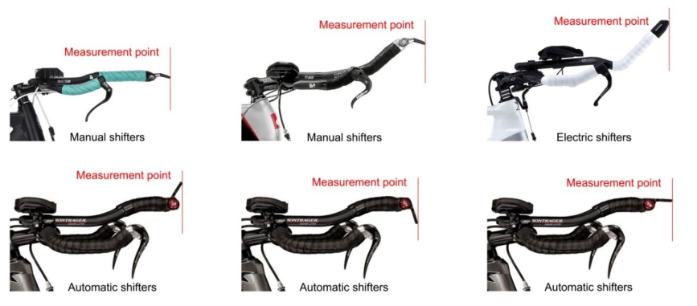

_Figure 50 Points of measurement for the horizontal distance from the bottom bracket axle_ 

58 

CLARIFICATION GUIDE OF THE UCI TECHNICAL REGULATION 

## SITUATION AROUND POSITION FOR TRACK, ROAD AND CYCLO-CROSS EVENTS 

- For track events, road and cyclo-cross (mass events): the position with the saddle withdrawn at least 50 mm behind a vertical plane passing through the center the bottom bracket and a maximum advancement of the handlebars of 100 mm in front of the front wheel axle. An exemption is possible for riders who want to bring the tip of the saddle forward up to the vertical plane passing through the center of the bottom bracket. 

- For track pursuit events (individual pursuit, team pursuit) and road individual events (ITT, TTT and the Mixed Team Relay): the position the saddle withdrawn at least 50 mm behind a vertical plane passing through the center of the bottom bracket and an advanced position for handlebars extensions of a maximum of 750 mm in front of the center of the bottom bracket. An exemption is possible for riders who want to bring the tip of the saddle forward up to the vertical plane passing through the center of the bottom bracket. Furthermore, an exemption for morphological reasons is possible for riders who want to advance the handlebars extension to up to 800/830/850 mm in front of the center of the bottom bracket. Only one exemption is allowed per rider. 

- For time trials (500 m or 1 km): the position with the saddle withdrawn at least 50 mm behind a vertical plane passing through the center the bottom bracket and a maximum advancement of the handlebars of 100 mm in front of the front wheel axle. In case of using handlebars extensions, an advanced position of a maximum of 750 mm in front of the center of the bottom bracket. An exemption is possible for riders who want to bring the tip of the saddle forward up to the vertical plane passing through the center of the bottom bracket. Furthermore, an exemption is possible for riders who want to advance the handlebars extension to up to 800/830/850 mm in front of the center of the bottom bracket. Only one exemption is allowed per rider. 

- 

- The chart below offers a summary of authorised positions. 

59 

CLARIFICATION GUIDE OF THE UCI TECHNICAL REGULATION 

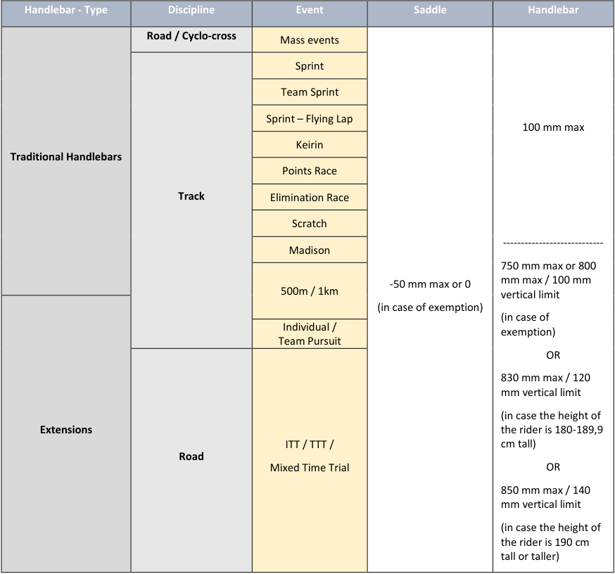

**----- Start of picture text -----** 
Handlebar - Type  Discipline  Event  Saddle  Handlebar Road / Cyclo-cross  Mass events Sprint Team Sprint Sprint – Flying Lap 100 mm max Keirin Traditional Handlebars Points Race Track  Elimination Race Scratch Madison  ---------------------------- 750 mm max or 800 -50 mm max or 0  mm max / 100 mm 500m / 1km  vertical limit (in case of exemption) (in case of Individual / exemption) Team Pursuit OR 830 mm max / 120 mm vertical limit (in case the height of Extensions  the rider is 180-189,9 ITT / TTT /  cm tall) Road Mixed Time Trial  OR 850 mm max / 140 mm vertical limit (in case the height of the rider is 190 cm tall or taller) **----- End of picture text -----** 

_Figure 51: Authorised positions for saddle and handlebars/handlebars extensions_ 

HANDLEBARS EXTENSIONS / BASE BARS, APPROVAL PROCEDURE, AS FROM 1.1.2023 

This procedure does not apply to handlebars extensions / base bars which, on 1 January 2023, are: 

- already manufactured 

- on the market 

- already at the production stage 

Handlebars/extensions/base bars that have already been available on the market during 2021 and 2022 can be approved under the present procedure at the manufacturer’s request. 

60 

CLARIFICATION GUIDE OF THE UCI TECHNICAL REGULATION 

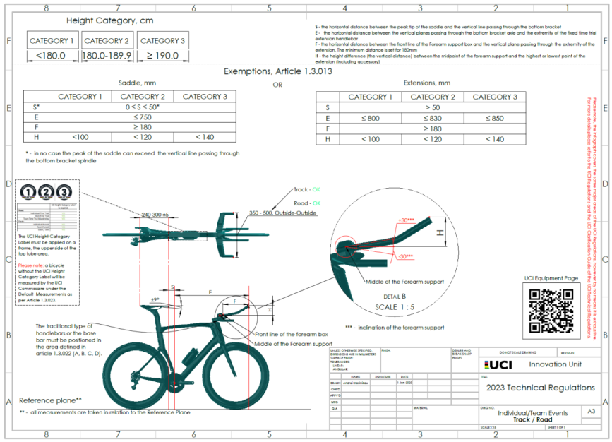

## **ARTICLE 1.3.024** 

_“Any device, added or blended into the structure, that is destined to decrease, or which has the effect of decreasing, resistance to air penetration or artificially to accelerate propulsion, such as a protective screen, fuselage form fairing or the like, shall be prohibited.”_ 

Protective screens, fuselages, fairings or any other device that is added or blended into the structure, and that is destined or have the effect of reducing resistance to air penetration, are prohibited. Aerodynamic assemblies and protuberances on the head tube or elsewhere are prohibited. 

## PROTECTIVE SCREEN 

_“A protective screen shall be defined as a fixed component that serves as a windscreen or windbreak designed to protect another fixed element of the bicycle in order to reduce its wind resistance.”_ 

A protective screen, shown by the diagram below, is defined as a fixed element acting as a cover, screen or windbreak designed to protect another component of the bicycle in order to reduce its wind resistance. This device is prohibited in competition. 

61 

CLARIFICATION GUIDE OF THE UCI TECHNICAL REGULATION 

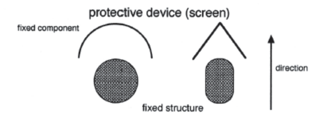

_Figure 52: Illustration of a protective screen_ 

A cover is authorized insofar as it ensures only the cover of an object without artifices in its shape, its content and its volume. These covers must in no case constitute an excrescence. Moreover, all together with equipment, it must then comply with all UCI rules specified to each piece of equipment. 

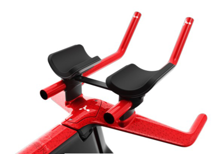

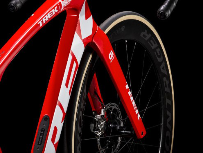

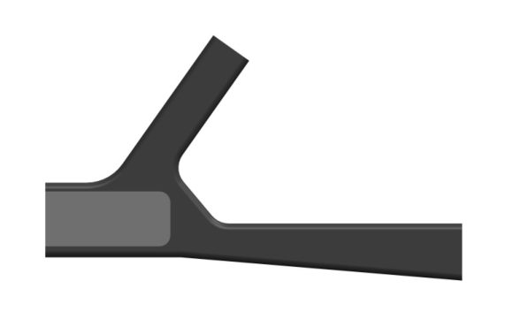

_Figure 53: Illustrations of authorized covers_ 

The image below illustrates non-compliance – a cover added to the frame to conceal brake cables. 

62 

CLARIFICATION GUIDE OF THE UCI TECHNICAL REGULATION 

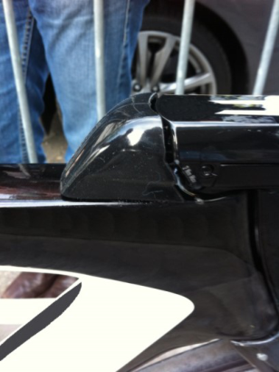

_Figure 54: Cover added to frame to conceal brake cables_ 

The addition of a cover to a braking system, as shown in the image below, is authorized. The unit is considered to be integrated with the frame or fork. 

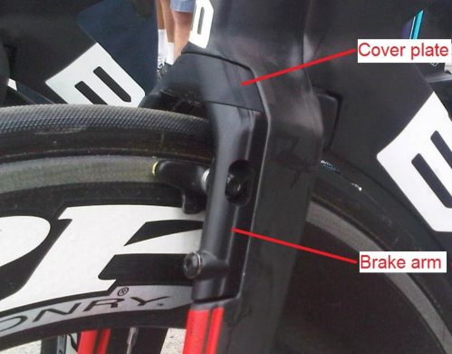

_Figure 55: Brake integrated with the fork and fitted with a cover_ 

The combination of the frame tube (or fork tube) + brake components + cover must respect the minimum and maximum dimension rules and must be contained completely (Rim Brake system) or partially (Disc Brake system) within the corresponding 80 mm box. 

What is the “corresponding 80 mm box”? 

- Rim Brake system: For rear brakes, attached to the seat stays/chain stays, the 

- combination of the seat stay/chain stay tube + brake + cover must fit inside the 80 mm box of the seat stays / chain stays. 

- Disc Brake system: For the rear disc brake components, attached to the seat stays and/or chain stays, the combination of the seat stay and/or chain stay + cover must fit inside the 80 mm box of the seat stays and/or chain stays. 

There are three scenarios for front brakes: 

63 

CLARIFICATION GUIDE OF THE UCI TECHNICAL REGULATION 

- Rim Brake system: For a standard fork (steerer tube inserted inside the head tube of the frame), if the cover does not extend to the stem, then the combination of the fork + brake + cover must fit inside the 80 mm box of the fork. 

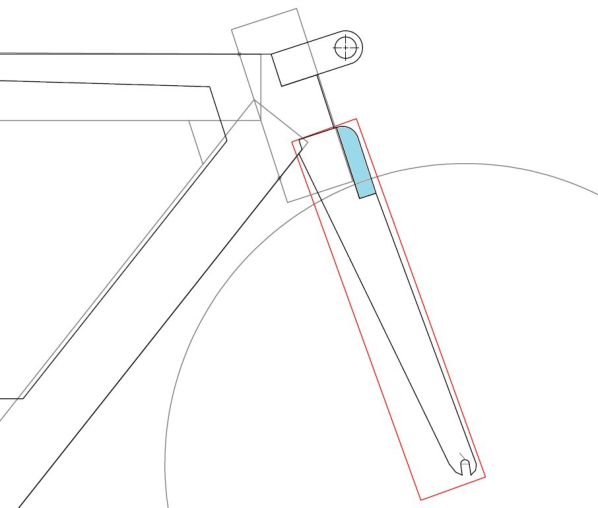

_Figure 56: Illustration of a cover that fits over the brake only_ 

- Rim Brake system: For an offset fork, or a standard fork with a cover over the brake that extends to the stem, then the combination of the fork + brake + cover must fit inside the 80 mm boxes of the fork and frame head tube. 

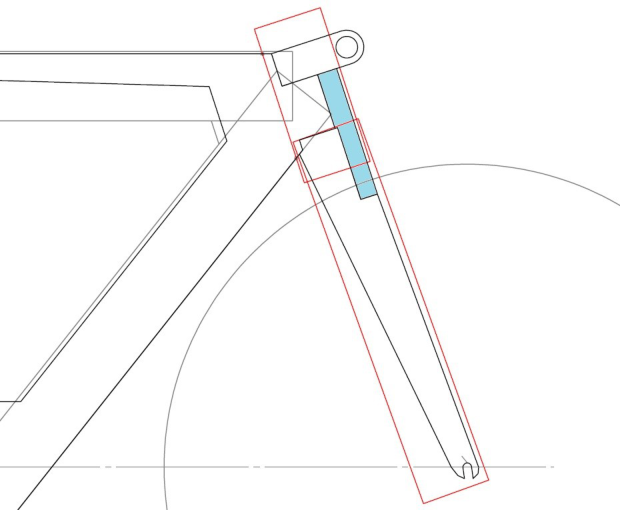

_Figure 57: Illustration of a cover that fits over the brake and extends to the stem_ 

- Disc Brake system: For a standard fork or an offset fork, a cover over the disc brake components, then the combination of the fork + cover must fit inside the 80 mm box of the fork. 

64 

CLARIFICATION GUIDE OF THE UCI TECHNICAL REGULATION 

With regards to covers over brakes, it is important to distinguish between the two different types of brake and the corresponding scenarios that apply: 

- Brakes considered to be “standard”: these are available on general sale and their shape and system of attachment allow them to be used on all types of frames and forks. These brakes, solely when a cover is fitted, must be contained within the corresponding 80 mm box, and are taken into consideration in the measurement of minimum/maximum dimensions. 

- Brakes considered to be “integrated”, which are designed for a specific model of frame/fork and which can only be used with this frame/fork due to their shape or attachment system. These brakes, whether a cover is fitted or not, must in all cases be contained within the corresponding 80 mm box and are taken into consideration in the measurement of minimum/maximum dimensions. 

It should be noted that brake systems that are integrated or use a cover must be submitted to the UCI during the approval procedure for frames and forks, and in any case before use in competition. 

## FUSELAGE 

_“A fuselage form shall be defined as an extension or streamlining of a section. This shall be tolerated as long as the ratio between the length L and the diameter D does not exceed established dimensional requirements as defined in articles 1.3.020 (framesets), 1.3.022 and 1.3.023 (handlebars, base bars and fixed time trial extension).”_ 

The rule does not apply to moving parts (wheels and chainset), front and rear derailleur bodies, braking systems for wheels, saddle and pedals. 

For frameset accessories that are subject to the minimum section dimension is 10 mm (in any direction). The width of cranks is restricted to 80 mm. 

The regulation on the subject of fuselage form does not exempt manufacturers from complying with the prevailing official safety standards concerning uncovered projections (must be rounded for safety), where "knife profile" shapes are not allowed. 

65 

CLARIFICATION GUIDE OF THE UCI TECHNICAL REGULATION 

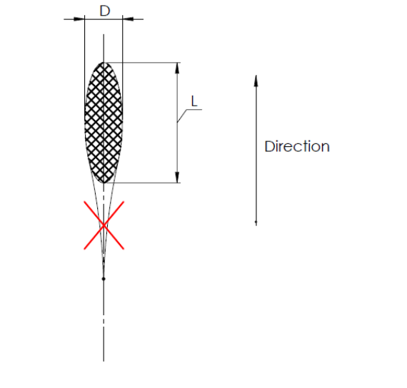

_Figure 58: Illustration of the restriction around the fuselage form of elements_ 

## FAIRING 

_“A fairing shall be defined as the use or adaptation of a component of the bicycle in such a fashion that it encloses a moving part of the bicycle such as the wheels or the chainset. Therefore it should be possible to pass a rigid card (like a credit card) between the fixed structure and the moving part.”_ 

If the seat tube mirrors the curve of the wheel it must not enclose it. It must be possible to insert a credit card freely and without bending between the tube and the wheel as shown by the illustrations below. 

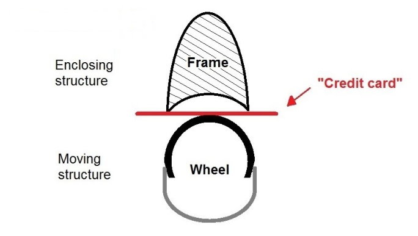

_Figure 59: Illustration of wheel fairing_ 

66 

CLARIFICATION GUIDE OF THE UCI TECHNICAL REGULATION 

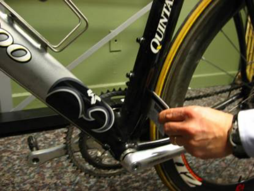

_Figure 60: Insertion of a credit card between the wheel and frame to check that a fairing is not present_ 

Similarly, the addition of a fairing to cover chainwheels, chains or any other moving part of the bicycle is prohibited. 

## **ARTICLE 1.3.024 BIS** 

BOTTLES 

_“Bottles shall not be integrated to the frame and may only be located on the down and seat tubes on the inside of the frame. The dimensions of the cross sections of a bottle used in competition must not exceed 10 cm or be less than 4 cm and their capacity must be a minimum of 400 ml and a maximum of 800 ml.”_ 

Bottles were increasingly moving away from their original function of allowing riders to rehydrate towards an alternative use as aerodynamic elements which are integrated into the design of frames in order to improve riders' performances. It is essential to regulate the positioning and dimensions of bottles in order to avoid any deviations and to return bottles to their principal function. 

Bottles are only allowed to be positioned on the down tube and seat tube inside of the main triangle of a frameset. It is possible to use a bottle of each of these tubes, but the bottle cannot be positioned at the same time to the two tubes. Locating bottles behind the saddle, on the stem, or in any other position is then prohibited. Furthermore, it is not allowed to integrate bottles with frames, meaning that there must be a physical and/or visual space between the bottle and the tube to which it is attached. 

67 

CLARIFICATION GUIDE OF THE UCI TECHNICAL REGULATION 

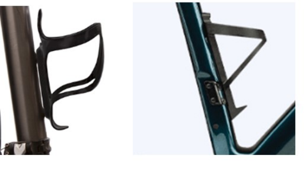

_Figure 61 Illustration of a physical (left) and a visual (right) space between the bottle and the tube to which it is attached._ 

The rule specifies the bottle dimensions in order to avoid empty bottles being added solely for reasons of aerodynamics. The rule also improves the rider's ability to access and grasp the bottle. It is forbidden to place an empty bottle (without any liquid) on the bicycle. The bottle should be held safely to avoid the bottle to be ejected on rough roads. 

The illustration below shows a bottle that complies with the current regulations with thickness of between 40 mm and 100 mm. The minimum dimension of 40 mm does not apply to the bottle cap, the area where the cap is attached to the bottle (shown in blue) and 30 mm wide areas from the neck and base of the bottle. The dimensions are measured perpendicular to the axis of the fluid exit direction (i.e. parallel to the cap threading direction) along the length of the bottle. 

68 

CLARIFICATION GUIDE OF THE UCI TECHNICAL REGULATION 

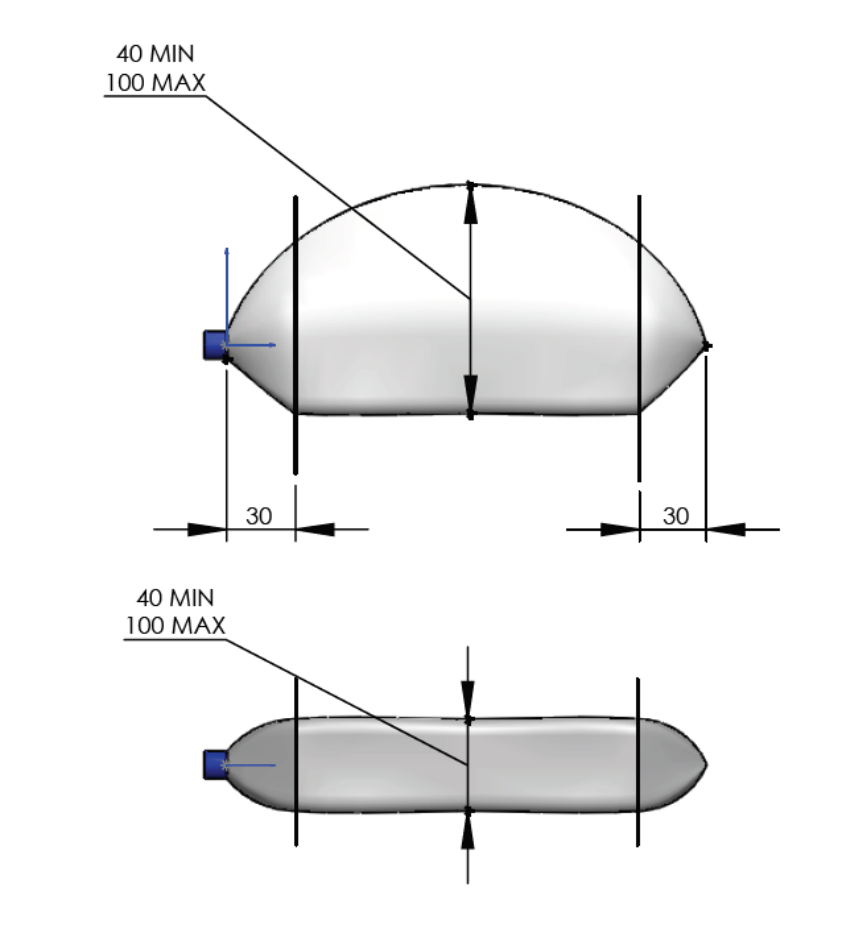

_Figure 62: Illustration of the areas of a bottle where the dimensions are subject to regulations_ 

Finally, the capacity is also specified in order to guarantee that bottles are used for rehydration purposes and to prevent any deviations. If bottles with a volume in excess of 500 ml are used, it is recommended that the bottle attachment system should be checked to ensure that it can bear a weight in excess of 0.5 kg. 

## BOTTLE CAGE 

A bottle cage is an add-on accessory to the frame and it can be integrated into the frame design. The bottle cage may only be located on the down tube or the seat tube on the inside of the frame. The bottle cage and the bottle must be able to fit entirely within a rectangular box of 130 mm width. The 130 mm width of the box is measured perpendicular to the axis of the fluid exit direction along the length of the bottle (i.e. parallel to the cap threading direction), whilst being attached to the bottle cage. 

The box may overlap the down tube and/or the seat tube. 

69 

CLARIFICATION GUIDE OF THE UCI TECHNICAL REGULATION 

The bottle cage must be used solely for the secure fixation of the bottle. The use of the bottle cage for any other reason is forbidden. A tolerance of 5mm is allowed during the onsite checks. 

It should be noted that bottle cages that are integrated must be submitted by a manufacturer to the UCI during the approval procedure for framesets, and in any case before use in competition. 

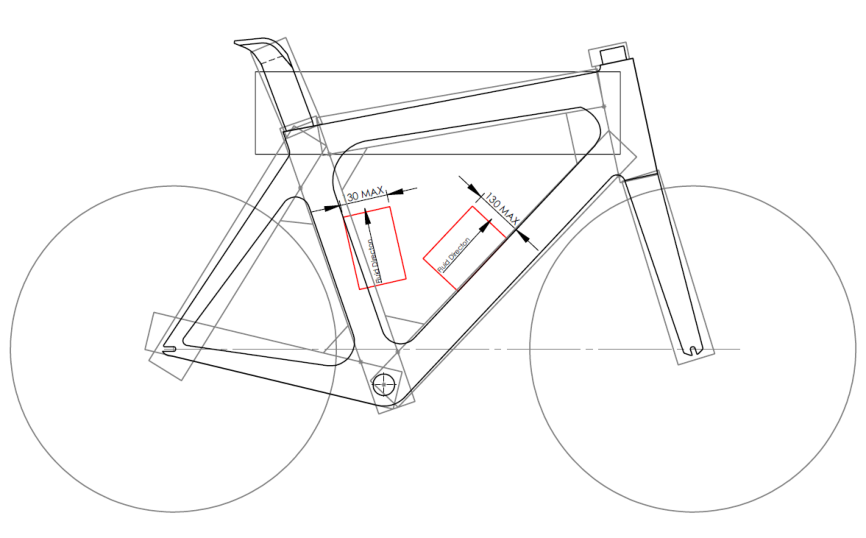

_Figure 63: Illustration of the positioning of the bottle cage boxes_ 

## CAMELBACK 

Hydration is an essential physiological consideration for athletes during a physical effort. Neither bottles nor camelback systems should diverge from their original function. 

There is a significant risk of camelback systems or any similar devices being used for other purposes than their original function. For this reason certain restrictions apply if they are to be used in competition: 

- The camelback system is authorized for competition solely for the purpose of rehydrating the rider. 

- It must not be the case that the system, presented as a way of improving a rider's hydration during an effort, is accompanied by an "aerodynamic clothing" advantage, in this way deflecting the camelback system from its original function. 

- The liquid container must not be capable of holding more than 0.5 liters and must not be a rigid shape liable to be considered as a device for improving the rider’s aerodynamic qualities. 

- The use of the camelback system must not modify the rider's morphology and must thus be directly attached against the body. 

- The use of the camelback system is only allowed on the back of the rider. 

70 

CLARIFICATION GUIDE OF THE UCI TECHNICAL REGULATION 

- It is mandatory for all riders who want to use a camelback system to present it to the commissaires before the start of the race at the risk of being disqualified. 

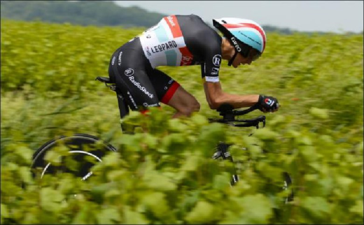

_Figure 64: Example of the use of a non-compliant camelback system_ 

## **ARTICLE 1.3.024 QUARTER** 

_“The UCI may fit, or appoint its agents or commissaires to fit, onboard technology devices for the purpose of detecting technological fraud during competition. Refusal by a team or rider to comply with instructions to carry such onboard technology devices may lead to the imposition of disciplinary measures in accordance with article 1.3.003bis.” (article introduced on 15.02.19)_ 

## **ARTICLE 1.3.025** 

_“Freewheels, multiple gears and brakes are not permitted for use on the track during competition or training._ 

_Disc brakes are allowed in cyclo-cross training and competition. Disc brakes are allowed in mountain bike training and competition. Disc brakes are allowed in road race and time trial training and competition. Disc brakes are allowed in BMX training and competition. Disc brakes are allowed in Trials training and competition._ 

_For races on the road and cyclo-cross, the use of fixed sprocket is forbidden: a braking system that acts on both wheels is required.” (text modified on 01.07.18)_ 

With regard to the use of disc brakes in the road disciplines, for safety reasons, the discs must imperatively be chamfered. 

On the track, the transmission exclusively must consist of three distinct elements: 

- a chain 

- a chainring 

- a sprocket 

71 

CLARIFICATION GUIDE OF THE UCI TECHNICAL REGULATION 

No additional elements are authorized (the chain tensioner, a derailleur, etc.). For safety reasons and in line with this constraint, chainrings and sprockets must be of a circular shape. 

## Section 3: riders’ clothing 

§ 1 General provisions 

## **ARTICLE 1.3.026** 

_“When competing, all riders shall wear a jersey with sleeves and a pair of shorts, possibly in the form of a one-piece skinsuit. By shorts it is understood that these are shorts that come above the knee. Sleeveless jerseys shall be forbidden._ 

_However, for downhill, four-cross and Enduro mountain bike events, BMX, trials and indoor cycling, specific provisions are laid down in the part of the regulations concerning the discipline in question.” (text modified on 01.01.20)_ 

By jersey with sleeves it is understand a jersey that leaves hands not covered. Consequently, integrated gloves in a jersey or a skinsuit are prohibited. 

## **ARTICLE 1.3.027** 

_“Jerseys shall be sufficiently distinct from world champions', UCI cup and classification leaders' and national jerseys to avoid confusion.”_ 

## **ARTICLE 1.3.028** 

_“Save in cases expressly provided for in the regulations, no distinctive jersey may be awarded or worn.”_ 

## **ARTICLE 1.3.029** 

_“No item of clothing may hide the lettering on the jersey or the rider's identification number, particularly in competition and at official ceremonies.”_ 

During past seasons the UCI has observed the trend of riders/teams to move away from traditional pin-on techniques to number pockets, i.e., number pockets made from clear plastic or mesh fabric where the identification number is placed inside. Various cycling stakeholders (Commissaires, Fans, and Commentators) have reported difficulties in reading the identification number due to the non-transparent nature of the mesh-based number pockets. 

To bring consistency in the visibility of the identification number within the UCI-sanctioned events, starting from 1 January 2023 for bunch events the identification number must be placed on the outer layer of clothing. 

72 

CLARIFICATION GUIDE OF THE UCI TECHNICAL REGULATION 

Please note, a technique used to place the identification number is not restricted to the pinon techniques as long as the identification number complies with Articles 1.3.029 and 1.3.076. 

For individual events, number pockets will be permitted. 

Below you will find a breakdown per event where the use of number pockets is permitted. 

|**TRACK**|**Number Pockets**||
|---|---|---|
|Individual/Team Pursuit|**OK**||
|Mass events|**X**||
|Sprint|**X**||
|Team Sprint|**OK**||
|The 200 metres Time Trial|**X**||
|Keirin|**X**||
|Points Race|**X**||
|Elimination Race|**X**||
|Scratch|**X**||
|Madison|**X**||
|Kilometre and 500 metres Time Trial|**OK**||
|**ROAD**|||
|ITT/TTT/Mixed Time Trial|**OK**||
|Mass events|**X**||
|**CYCLO-CROSS**|**X**||

_Figure 65 Table of events where the use of number pockets is permitted_ 

## **ARTICLE 1.3.030** 

_“Rain jackets must be either transparent, the same colour as the team jersey or display the team’s name or logo on their front and back. The minimum size of the inscription shall be at least 20cm in height or width.” (text modified on 23.10.19)_ 

## **ARTICLE 1.3.031** 

_1. “Wearing a rigid safety helmet shall be mandatory during competitions and official training sessions in the following disciplines in all disciplines except indoor cycling and BMX Freestyle Flatland_ 

_In all disciplines concerned wearing a rigid safety helmet is recommended outside of competitions and official training sessions. In any case, legal provisions must be complied with. 2. Each rider shall be responsible for: - Ensuring that the helmet is approved in compliance with an official security standard and that the helmet can be identified as approved;_ 

73 

CLARIFICATION GUIDE OF THE UCI TECHNICAL REGULATION 

_- wearing the helmet in accordance with the security regulations in order to ensure full protection, including but not limited to a correct adjustment on the head as well as a correct adjustment of the chin strap;_ 

_- avoiding any manipulation which could compromise the protective characteristics of the helmet and not wearing a helmet which has been undergone manipulation or an incident which might have compromised its protective characteristics;_ 

- _using only an approved helmet that has not suffered any accident or shock;_ 

_- using only a helmet that has not been altered or had any element added or removed in terms of design or form;_ 

_- using only accessories approved by the helmet manufacturer._ 

_3. For road and track disciplines, the dimensions of the helmet (including accessories) must not exceed the below dimensions:_ 

_Length (L) can be less or equal to 450 mm;_ 

_Width (W) can be less or equal to 300 mm;_ 

_Height (H) can be less or equal to 210 mm;_ 

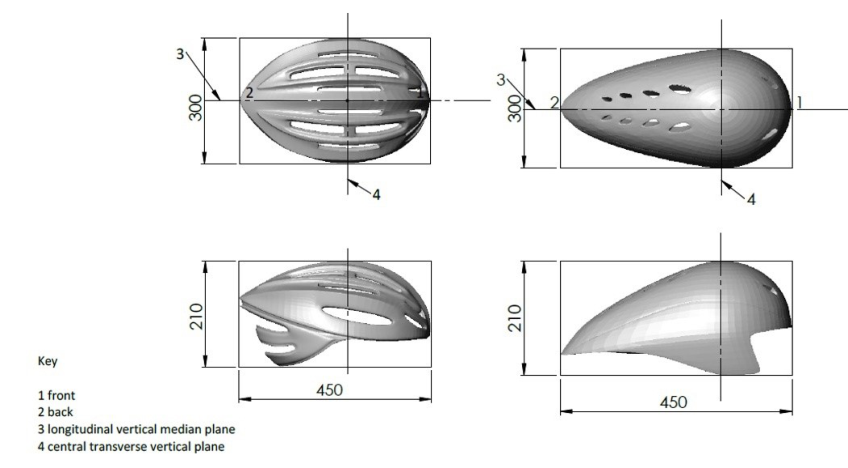

It is prohibited to add a detachable cover to a helmet. The composition of the helmet material and its surface condition are not subject to any regulations. However, additions to the helmet are not allowed (cover, tape, etc.). The use of mechanical or electronic systems in or on the helmet is also prohibited, unless the system (together with the helmet) is compliant with provisions stated in Article 1.3.002. 

It is obligatory to wear a helmet for safety reasons and no modifications to the helmet are allowed. The helmet must be approved in accordance with the prevailing safety standards, must not have been modified and must not have suffered an impact or been involved in an accident. 

Add-on helmet visors or covers are authorized provided that they are supplied by the helmet manufacturer. 

74 

CLARIFICATION GUIDE OF THE UCI TECHNICAL REGULATION 

Compliance with the dimensional restrictions is not compulsory for helmets that on 1 January 2023, are: 

- already manufactured 

- on the market 

- already at the production stage 

## **ARTICLE 1.3.033** 

_“Items of clothing may not modify the morphology of the rider and any non-essential element or device, of which the purpose is not exclusively that of clothing or protection, is forbidden. This shall also apply regarding any material or substance applied onto the skin or clothing and which is not itself an item of clothing._ 

_Modifications to the surface roughness of clothing are authorized but may only be the result of threading, weaving or assembling of the fabric. Surface roughness modifications shall be limited to a profile difference of 1mm at most._ 

_The measure of surface roughness modification shall be made without pressure or traction on the clothing._ 

_All clothing must maintain the original texture of the textile and may not be adapted in a manner to integrate form constraints. Therefore, when not worn, clothing may in no case contain any self-supporting element or rigid parts.” Text modified on 04.03.19_ 

Garments must not be adapted in any way such that they diverge from their use purely as clothing. The addition of any non-essential element or device to clothing is prohibited. The use of mechanical or electronic systems with clothing is prohibited. 

It is also prohibited to wear clothing or skinsuits to which non-essential elements have been added with a view to improving their aerodynamic properties such as, for example, "wings" under the arms or an extension between the helmet and the jersey or skinsuit. It is obligatory for clothing to follow the cyclist's body shape. 

Shoes that have been made more aerodynamic by the addition of a non-essential element or by a modification to the toe or heel are prohibited from competition. No part of the shoe should extend above ankle height. 

Gloves used in track competition must not be mittens that only have one, two or three separations between the fingers. Gloves must not fully or partially restrain free movements of fingers. 

75 

CLARIFICATION GUIDE OF THE UCI TECHNICAL REGULATION 

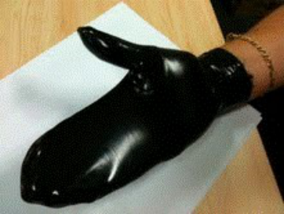

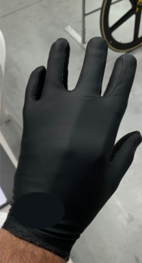

_Figure 66: Example of a mitten forbidden in track competition_ 

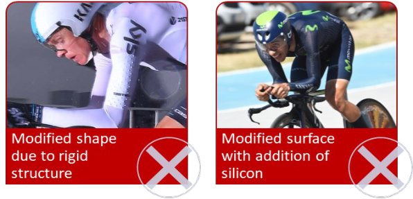

_Figure 67: Example of forbidden product and equipment_ 

Non-essential items forbidden by article 1.3.033 of the UCI Regulations shall include any product or substance applied on the body (legs, arms, etc..) aimed at improving aerodynamics. Specific oils for protection against cold or rain are tolerated. 

76 

CLARIFICATION GUIDE OF THE UCI TECHNICAL REGULATION 

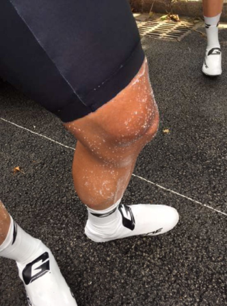

_Figure 68: Example of a substance applied on the body_ 

## **ARTICLE 1.3.033 BIS** 

_“Socks and overshoes used in competition may not rise above the height defined by half the distance between the middle of the lateral malleolus and the middle of the fibula head.” Article introduced on 15.10.18_ 

In order to clarify the socks height regulation and have a fair height between riders, thefollowing height is now imposed. 

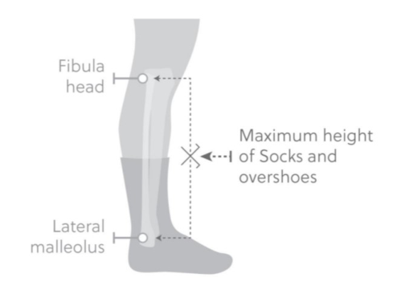

_Figure 69: Example of forbidden product and equipment_ 

## **ARTICLE 1.3.034** 

_“During competitions, riders' attendants may not bear any advertising matter on their clothing other than that authorized for their team's riders for the race in question.”_ 

77 

CLARIFICATION GUIDE OF THE UCI TECHNICAL REGULATION 

## **TRACKING MODIFICATIONS (HIGHLIGHTED IN RED)** 

|_VERSION_|**ARTICLE**|
|---|---|
|_01.04.2024_|**1.3.022**|

78
