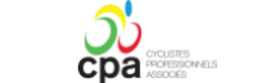
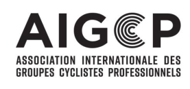

(version on 01.01.2024) 

## **JOINT AGREEMENTS** 

on the working conditions of riders hired by UCI ProTeams and UCI WorldTeams for the year of registration 2024 and thereafter. 

Signatories: 

- Cyclistes Professionnels Associés [Associated Professional Riders], hereinafter referred to as CPA, 

- Association Internationale des Groupes Cyclistes Professionnels [International Association of Professional Cycling Groups], hereinafter referred to as AIGCP, 

_(text modified on 01.01.13; 01.01.2024)_ 

## **Chapter I: GENERAL PROVISIONS** 

## **SCOPE** 

## **Art. 1** 

This agreement establishes the standards governing the working conditions of riders employed by a team registered or intending to register with the International Cycling Union (known by the French acronym UCI) as a UCI WorldTeam or a UCI ProTeam under Chapter XV or XVI of Part II of the UCI Cycling Regulations. 

It shall be binding for each team in its capacity as employer, in the person of its paying agent (hereinafter referred to as the team), and each rider employed by the team (hereinafter referred to as the rider). 

It shall not apply to riders employed by a team but who do not participate in international road races. However, a single participation by such a rider in an international road race during the year of registration shall suffice to make this agreement applicable to him during the whole year. 

The stipulations of this agreement shall be added to those of the UCI regulations. In the event of inconsistency, the UCI regulations shall apply. 

## **Art. 2** 

This agreement shall apply for the year of registration 2024 and the following, without prejudice to Article 10. 

The signatories undertake to renegotiate in good faith for the subsequent years, or if no changes are requested, to extend this agreement at its expiry for a further period to be defined. 

_(text modified on 01.01.13; 01.01.24)_ 

## **COMPULSORY FORCE** 

## **Art. 3** 

Any derogation from the provisions of this agreement to the detriment of the rider shall be null and void. Any and all advantages or agreements that can favour the rider beyond the provisions of the present agreement shall remain valid. 

1/16 

## **DISPUTES** 

## **Art. 4** 

Any and all disputes between the signatories about this agreement shall, at the request of one of the parties, be submitted to the Arbitral Board of the UCI following the procedures provided for in articles 12.7.008 and following of the cycling sport Regulations of the UCI. 

A dispute between a team and a rider over their work relationship shall be submitted to the Arbitral Board of the UCI or to the authority specifically designated by the competence clause provided in the contract, provided it is compliant with the UCI regulations. Insofar as the measure or the solution of the dispute depends on the interpretation of this agreement, the different authority to which the dispute is submitted may in any case request an imperative opinion from the Arbitral Board of the UCI. 

Under no circumstances may the contract contain a jurisdiction clause regarding disputes between a rider and a team which would designate a tribunal other than the civil court where the rider resides, the arbitral tribunal of the rider’s federation, the Arbitral Board of the UCI or the CAS. 

_(text modified on 01.01.10; 01.01.13; 1.09.19)._ 

## **Art. 4 bis** 

In any case, either party may, regardless of an eventual consent from the other party(ies) involved in a dispute over their work relationship, preliminarily contact a designated mediator registered on a public list of mediators agreed by the CPA and the AIGCP. The selected mediator, within 90 days from receipt of the mediation request, will submit a mediation proposal to the parties. The parties shall maintain full discretion as to whether they accept the mediation proposal and, if so, the mediation agreement shall have the effect of a binding contract between the parties. The mediator may at any time close the mediation proceedings and give formal authorisation to the parties to start ordinary proceedings in compliance with their contractual agreement, without prejudice to a party’s right to do so at an earlier stage as the case may be according to the legislation applicable to the contractual relationship. 

In any case, the mediator shall draw up a summary of the mediation proceedings, including the arguments put forward by the parties, either in the mediation proposal or the termination order, as the case may be. 

The consultation before the mediator shall be free for the parties and all related costs shall be borne by the CPA and the AIGCP. 

_(article introduced on 01.01.18)_ 

## **Chapte** r **II** : **WORKING CONDITIONS** 

## **HIRING** 

## **Art. 5** 

Hiring shall take place by means of an individual contract concluded by and between the rider and the team. 

The contract shall be drawn up in writing by means of a form corresponding to the sample contract 

2/16 

agreed by and between the signatories and approved by the UCI as an insertion in its regulations as a standard contract. 

Contracts shall be drawn up in at least 3 copies: 

1 for the team; 

- 1 for the rider; 

- 1 for the auditor approved by the UCI. 

The contract shall be typed. Each page shall be numbered and shall indicate the total number of pages in the contract. The rider and the paying agent shall sign each page of the contract. Clauses of the contract on a page which has not been signed by the rider may not be invoked against him; the rider may take advantage of them. 

## **TERM AND END OF THE CONTRACT** 

## **Art. 6** 

Contract shall be for a specified period ending on 31 December. 

It follows that in terms of the nature of the contract, it can never be interpreted as permanent or of an indefinite duration. 

Contracts coming into force before 1 July of the registration year shall be valid at least until 31 December of the same year. For a new professional, the contract shall be valid until at least 31 December of the following registration year. 

Contracts coming into force after 30 June shall be valid at least until 31 December of the following registration year and, in the case of a new professional, until 31 December of the year after that. 

## _(text modified on 01.01.18)_ 

## **Art. 7** 

1. The status of new professional is given to any rider who joins a UCI WorldTeam or UCI ProTeam for the first time no later than during his twenty-fifth year. 

For the application of this article the date of joining shall be the date on which the rider’s contract comes into force. 

The age of the rider is determined by the difference between the year of his hiring and the year of his birth. 

2. The status of new professional ends: 

   - a. If the contract comes into force before 1 July: on 31 December of the subsequent registration year; 

   - b. If the contract comes into force after 30 June: on 31 December of the second subsequent registration year. 

During this period the rider shall retain the status of new professional even if: 

   - a. The rider reaches the age of 26 during this period; 

   - b. The contract is terminated early and the rider changes team. 

3. If, at the time that the new professional’s contract comes into force, the remaining term of the contract between the paying agent and the principle partner or contracts between the paying 

3/16 

agent and the two principal partners is less than the duration of the contract as determined under the first paragraph of point 2 above but equal to at least one year, the duration of the new professional’s contract may be limited to the remaining duration of the contract with the principal partner or the longer of the contracts with the two principal partners. 

If, on expiry of the contract between the paying agent and the principal partner or the contracts between the paying agent and the two principle partners, the team continues its activities or the paying agent continues its activities in another team, he must reemploy the rider at that rider’s request for at least one year and under conditions which may not be less favourable to the rider. 

_(text modified on 01.01.13)_ 

## **Art. 8** 

The contract of employment shall not provide a trial period. 

## **Art. 9** 

Before 30 September prior to the end of the contract, if the contract has not already been renewed, each party shall inform the other in writing of their intentions as regards any renewal of the contract. A copy of this document shall be sent to CPA. 

_(text modified on 01.10.09)_ 

## **REMUNERATION, BONUSES AND PRIZES** 

## **Art. 10** 

The rider shall be entitled to a fixed remuneration, the annual minimum gross amount of which shall be fixed as follows: 

||**UCI ProTeams**|**UCI ProTeams**|**UCI WorldTeams**|**UCI WorldTeams**|
|---|---|---|---|---|
||**Neo-** **professionals**|**Other**|**Neo-** **professionals**|**Other**|
||**Employed**||||
|2024|28.191 €|33.707 €|34.020 €|42.047 €|
|2025|29.601 €|35.392 €|35.721 €|44.150 €|
|**164%**|**Self-employed(art. 2.15.115 bis & 2.16.036 bis)**||||
|2024|46.234 €|55.279 €|55.793 €|68.957 €|
|2025|48.545 €|58.043 €|58.582 €|72.404 €|

The remuneration for the following years will be negotiated by the parties and will be subject to an amendment to this agreement. In the event that no agreement can be found, the amounts of 2025 will remain in force. 

In particular situations and in the interest of the development of cycling, the Professional Cycling Council may decide exemptions on the joint proposal of the signatories of this agreement. 

_(text modified on 15.6.08; 01.07.09; 01.01.13; 01.01.18; 01.01.2024)_ 

## **Art. 11** 

The fixed remuneration shall be paid in cash, in the currency stipulated in the contract. 

4/16 

The payment must be made by transfer on the rider's bank account as indicated in the contract. Only the proof of the execution of the bank transfer shall be accepted as proof of payment. 

The fixed remuneration shall be paid to the rider in equal monthly payments, remitted at the latest by the fifth day of the next month. 

In the event of late payment of his remuneration or any benefit due, the rider has the automatic right without any formality, to increases and interest of 5% per year. 

_(text modified on 01.10.09; 01.01.18)._ 

## **Art. 12** 

The team and the rider may agree, in addition to the fixed salary, the payment of bonuses and other benefits that depend on the rider’s individual results and performance or the results and performance of the team. 

## **Art. 13** 

The prizes are the sums of money remitted by the organisers of cycling races. The prizes shall be remitted by the organisers to the national federation of the country of the race or to a collecting organisation appointed by this national federation and approved by the Professional Cycling Council. 

_(text modified on 01.01.13)_ 

## **Art. 14** 

All bonuses, compensation, prizes or other benefits in cash or in kind shall be over and above the fixed salary and shall not be imputed on said salary nor taken into consideration for its calculation. 

## **Art. 15** 

A detailed pay slip shall be remitted to the rider at the time of each payment. 

## **Art. 15bis** 

The team is obligated to settle all travel expenses incurred by the rider in the course of his work activity. These expenses include, at the very least, train or flight tickets, as well as costs for parking, taxi and car fuel. 

_(text modified on 01.01.13)_ 

## **CONDITIONS OF WORK AND OF REST** 

## **Art. 16** 

The annual number of competition days and their planning are the team’s responsibility, taking into account the UCI regulations. 

The planning must take into account the recovery periods needed for the rider to enjoy the necessary rest for his physical balance. 

The team must send the rider an annual certificate which confirms the number of competition days the rider has taken part in during the season. If this number is thirty or more, it suffices to certify that the rider has taken part in a minimum of thirty competition days. 

_(text modified on 01.01.13)_ 

5/16 

## **Art. 17** 

The rider shall be entitled to minimum of 35 vacation days per year. 

The holiday periods shall be taken, in agreement with the teams, depending on the competitions and the training sessions. 

Under no circumstances shall the holiday period be substituted by economic compensation. 

## **Art. 18** 

Once a year, the rider has the duty to attend the annual general meeting and the meetings convened by the CPA and its member organisations. The team shall exercise no pressure or constraint on the rider to dissuade him from attending. 

These meetings shall under no circumstances interfere with the sporting activity of the rider. 

_(text modified on 01.01.13)_ 

## **Art. 19** 

The rider shall be entitled to continue and to improve his cultural education. The team shall not object to the continuation of studies, provided they do not interfere with the sporting activity scheduled in the planning. 

## **Art. 20** 

The team and the rider shall take all the necessary measures to avoid, under any and all circumstances, risks for rider’s health according to the UCI regulations. 

## **COMPENSATION OF SALARY, INSURANCE AND SOCIAL BENEFITS** 

## **Art. 21** 

A rider prevented temporarily from carrying out his activity for no fault of his own, owing to illness, injury or accident, shall be entitled to his full (100%) remuneration during a period of 3 months and 50% of his remuneration during another period of three months without the amount to be paid being less than the minimum salary stipulated in article 10. 

This entitlement shall come to an end at the end of his disablement or of the contract. It is renewed for a fresh disability having another cause than the previous one. 

The entitlement to the salary shall be borne by the team, after deduction of insurance benefits for loss of income to which the rider may be entitled for this risk. Where applicable, the rider shall do everything necessary with a view to recourse against responsible third parties. 

Industrial disablement shall be duly established. The team may require the rider to undergo a physical examination administered either by a doctor designated by mutual agreement or by a medical officer accredited according to the applicable social security system or, in the absence thereof, a doctor designated by the president of the UCI Medical Commission at the request of the first party to take action. 

_(text modified on 01.01.13)_ 

6/16 

## **Art. 22** 

1. The team shall make sure that the rider is protected by social insurance. 

2. The team shall make sure that it is in compliance with social security legislation applicable to it in its capacity as an employer, so that the rider will be entitled to the benefits granted by law to fulltime workers. 

3. In the case where the rider is not covered by the legal social security system, the team must take out, at its expense, the following insurance cover: 

   1. an insurance policy covering the costs of health care (doctor, medicines, etc.) for the rider, for a sum of € 100’000 per year and per rider. 

   2. an insurance policy providing for the payment of a pension, annuity or capital at the earliest possible date after his career as a professional rider ceases, whose premium shall represent at least 12% of the gross annual salary, limited to three times the minimum amount provided for in article 10. 

If, in these cases, the insurance policy is of a type that must be taken out by the rider himself, the team will make sure that the rider contracts this insurance, and will pay the premiums. 

4. The Team shall pay half the contributions of the insurance referred to under three hereabove: 

   1. if the rider has been able to join, for example under an optional insurance scheme, a legal social security scheme other than the scheme under which the team is subject 

   2. if the rider’s affiliation to such other legal social security scheme is mandatory. 

5. The team must provide proof of the cover referred to in this article by producing the necessary certificates in the file required for the audit referred to in articles 2.15.068a and 2.16.014 of the Regulations. 

## _(text modified on 01.01.13)_ 

## **Art. 23** 

Independently from the benefits referred to in Article 22, the team must take out, at its expense, the following insurances with comprehensive global coverage that includes the rider’s country of residence: 

1. Life insurance coverage, by virtue of which a sum of € 250’000 will be paid to the beneficiaries named by the rider in the policy. This coverage encompasses both private and professional causes, offering protection against accidents and illnesses, including heart failure. 

Risks relating to sports or sports activities that are not connected to the preparation, maintenance or recovery of the rider’s physical condition, such as: aerial sports, mechanical sports (involving a motor vehicle, whether ground-based or not), ice sports, contact sports, potholing, rafting, rockclimbing, deep-sea diving, whether in a participant, instructor, official or in any other capacity apart from that of spectator, may be excluded from the coverage. 

2. Total permanent disability insurance coverage by virtue of which a sum of up to € 250’000 will be paid to the rider in the case the rider has to stop his professional cycling career due to an accident or illness. The insurance policy provides 24-hour coverage that encompasses both private and professional incidents. 

Risks relating to sports or sports activities that are not connected to the preparation, maintenance or recovery of the rider’s physical condition, such as: aerial sports, mechanical sports (involving a 

7/16 

motor vehicle, whether ground-based or not), ice sports, contact sports, potholing, rafting, rockclimbing, deep-sea diving, whether in a participant, instructor, official or in any other capacity apart from that of spectator may be excluded from the coverage. 

3. Hospitalization and repatriation insurance. This insurance must cover: 

   1. all the costs not covered by the social security relating to the rider’s hospitalization, for a sum of € 100’000 per incident and per individual; This includes: 

      - a) all the inpatient and outpatient costs not covered by the social security relating to the rider’s hospitalization, for a sum of € 100’000 per incident and per individual; 

      - b) all the pre-and post-hospitalization costs not covered by the social security relating to the rider’s hospitalization, for a sum of € 100’000 per incident and per individual; 

      - c) all the costs of repatriation for medical reasons or due to death, in connection with professional travel. 

   2. These coverages will apply worldwide on top of social security. 

This insurance policy does not impose any time limitations on hospitalization and repatriation coverage. 

In connection with professional travel: this coverage extends beyond accidents occurring solely during training or races. It encompasses every professional trip undertaken by the rider, including but not limited to team presentations, participation in Cycling Esports competitions, sponsor events, exhibition races or events, and any other professional engagements. 

_(text modified on 01.01.24)_ 

## **Art. 24** 

The team must attach to each contract a list, in accordance with the enclosed sample, of the legal or contractual insurance benefits that the rider will be entitled to, and of those he will not be entitled to. 

The team shall be responsible for paying the benefits that it may have wrongly listed as the rider’s entitlement. 

## **Art. 25** 

The team must be able to provide proof, at any time, of the insurance cover referred to in articles 22 and 23 for the rider-employee and, at the simple request of the employed riders, the UCI or the auditor, to the auditor accredited by the UCI. 

## **Art. 26** 

The lack of insurance or of cover is the responsibility of the party whose duty it is to contract it. The AIGCP, the CPA and the UCI are exempt from any liability. The UCI’s power to request evidence is simply a right, which does not imply any obligation or responsibility. 

## **Art. 27** 

The parties agree that EU GDPR (General Data Protection Regulation) or equivalent standards shall apply in all circumstances to the relationships between riders and teams. Therefore, the processing of 

8/16 

the rider’s personal data must adhere to the definitions and principles expressed in the EU GDPR. Appendix 3 contains guidelines for the preparation of a "Privacy Notice", compliant with the requirements of the EU GDPR, to be used by each team according to its own situation and to the relevant legislation provided by each country. 

_(Article introduced on 01.01.24)_ 

* * * * * * * 

For the AIGCP For the CPA Richard Plugge Adam Hansen President President 

Adam Hansen President 

9/16 

## **APPENDIX 1** 

## **LIST OF INSURANCES** 

The team certifies that the rider, 

Last Name:.....................First Name:.....................Date of birth: ..................., 

will benefit, as a result of his job, from the following insurances or benefits (for riders who do not have a legal social security system, the team states that it was given a proof of the following insurances or benefits): 

(each box have to be filled in with "yes" or "no" depending on the case) 

|Insured risks / benefits*|In accordance with the legislation (indicate the country)|In accordance with a contractual insurance**|
|---|---|---|
|1.  accident at work|||
|2. professional sickness|||
|3.  health care (doctor, medicine)|||
|4.  hospitalization|||
|5.  compensation for industrial disability|||
|6.  family allowance payments|||
|7.  unemployment|||
|8.  pension plan|||
|9.  reversionary annuity|||
|10.  orphan annuity|||
|11.  health care insurance (art. 22.3.1) (only for the rider who does not have a legal social security system)|||
|12.  contingency insurance (art. 22.3.2) (only for the rider who does not have a legal social security system)|||
|13.  decease insurance (art. 23.1)|||
|14.  disability insurance (art. 23.2)|||
|15.  hospitalization insurance (art. 23.3 a)|||
|16.  repatriation insurance (art. 23.3 b)|||
|17.  others|||

* The scope of the coverage depends on the legal social security system in use in the different countries. Therefore some risks may not be insured. Refer to the joint agreement and to the UCI Regulations for the minimum coverage. 

** For insurances subscribed by the team, provide a copy of insurance policies and general conditions. For contractual insurances subscribed by the rider himself, the team has to obtain from the rider a proof signed by the insurance company, according to the attached model. This certificate has to be presented to the local auditor. 

Date: 

Signature of the paying agent: 

10/16 

## **APPENDIX 2** 

## **CERTIFICATE OF INSURANCE FOR A PROFESSIONAL RIDER** 

The insurance company undersigned certifies that the rider, 

Last Name:.....................First Name:.....................Date of birth: ..................., 

is insured to the company from January 1st and for the whole year 20.. for the following risks and benefits (to the minimum)*: 

||||N° of the insurance policy|
|---|---|---|---|
|1.  Reimbursement of expenses for health care|Expenses concerning doctor and medicine for the rider for an amount of € 100’000 peryear|In accordance with joint agreement art. 22.3.1||
|2. Pension plan|Conditions/ minimum coverage: • Payment in capital or annuity form • Payable at the earliest at the end of the professional cycle career • Annual contribution representing at least 12% of the annual gross salary or fees, limited to 3 times the minimum amount|In accordance with joint agr. art. 22.3.2||
|3. Decease insurance|In case of death of the rider, payment of € 250’000 to the interested parties named by the rider. Some risky activities may be excluded(seejoint agreement)|In accordance with joint agr. art. 23.1||
|4. Disability insurance|In case of total and permanent disability of the rider due to an accident (round the clock)or illness, payment of € 250’000 to the rider.|In accordance with joint agr. art. 23.2||
|5. Reimbursement of hospitalization expenses|Hospitalization expenses for an amount of € 100’000 per disaster|In accordance with joint agr. art. 23.3.1a)and b)||
|6. Reimbursement of repatriation expenses|Repatriation expenses of the rider for medical reasons or in case of decease during professional trips|In accordance with joint agr. art. 23.3.1 c)||

This certificate is delivered in order to allow the rider to prove to his team and to the authorities of control of the professional cycling that he fulfils the registration conditions fixed by the UCI Regulations for the season 20... These Regulations refer for minimal insurance coverage to the Joint Agreement concerning the working conditions of the riders. This certificate will not be used for any other purposes. 

Comments / observations of the insurance company: 

Place and date of creation of the certificate: 

Stamp and signature of the insurance company: 

Contact person: 

Exact address: 

Tel. number: 

* Cross out the risks / benefits not covered by the insurance company. 

11/16 

## **Appendix 3** 

## **Guidelines for the drafting of a Privacy Notice on the processing and protection of personal data pursuant to and in accordance with Art. 13 and Art. 14 of Regulation (EU) 2016/679 (“General Data Protection Regulation” - GDPR)** 

* * * 

## **I. What is a Privacy Notice?** 

Organizations provide individuals with Privacy Notices to explain how their Personal Data is handled. 

Under GDPR, Privacy Notices must, _inter alia_ : 

- identify who the effective Data Controller is; 

- explain the purposes for which Personal Data is collected and used by the Data Controller; 

- clarify how Personal Data is used and disclosed and for how long it is kept by the Data Controller; 

- explicate the Data Controller’s legal basis for processing. 

In its capacity as Data Controller, each Team is required to draft a Privacy Notice, by which it informs Riders on how their Personal Data is processed and how it applies Data Protection principles. 

## **II. What does a Privacy Notice must contain?** 

If a Team is collecting Personal Data from a Rider directly, it must include the following information in its Privacy Notice: 

- the identity and contact details of the Team, its representative, and its Data Protection Officer, if appointed by the Team; 

- the purpose for the Team to process Personal Data of the Rider and its legal basis; 

- the legitimate interests of the Team (or third party, where applicable); 

- any recipient or categories of recipients of the Personal Data of the Rider; 

- the details regarding any transfer of Personal Data of the Rider to a third country and the precautions taken; 

- the retention period or criteria used to determine the retention period of the Personal Data; 

- the existence of each Rider’s rights; 

- the right to withdraw consent at any time (where relevant); 

- the right to lodge a complaint with a supervisory authority; 

- whether the provision of Personal Data is part of a statutory or contractual requirement or obligation and the possible consequences of failing to provide the Personal Data; 

- the possible existence of an automated decision-making system, including profiling, and information about how this system has been set up, the significance, and the consequences. 

If a Team obtains Riders’ Personal Data indirectly (i.e. via third parties) its Privacy Notice must provide all the above information[1] , plus the categories of Personal Data obtained in this way. 

> 1 Except for the aside “ _whether the provision of Personal Data is part of a statutory or contractual requirement or obligation and the possible consequences of failing to provide the Personal Data_ ”. 

12/16 

## **III. Which categories of Personal Data are usually processed by Teams?** 

Riders’ Personal Data processed by Teams may include the following categories: 

- “ordinary data”, including, by way of example, name, surname and tax code of the Riders; 

- “special data” (Art. 9 GDPR), i.e. those data from which, among other things, the health status of the Riders can be deduced and whose processing is subject to a specific manifestation of consent by each individual Rider. In particular, within the limits of the principles of minimisation and relevance of data processing, Teams may process: (i) data related to the health status of each Rider as part of the preventive and periodic checks of the sporting suitability or as part of the local federal procedures of verification and management of a state of illness declared by the Rider as a cause of abstention from sporting activity or from participation in sporting competitions of any kind or as part of the insurance procedures provided for by contracts or by law or as part of the procedures for the purposes of the fight against doping (ii) data relating to racial and/or ethnic origin and/or religious beliefs and/or anthropometric data; (iii) the so-called “Performance Data”, which may also include geolocation and “special data”, capable of revealing, _inter alia_ , genetic data, biometric data, data relating to a person's health or sexual life or sexual orientation; 

- data relating to criminal convictions and offences (Art. 10 GDPR), only in the event that the sports justice bodies, for the sole purpose of their functional competence, access copies of the records of any criminal proceedings under current legislation; 

- data of other specific nature, including data on anti-doping controls and their results, data on violations of regulations and consequent disciplinary measures. 

- Important: the content of a Privacy Notice is not intended to regulate the legal aspects of possible commercial agreements concerning the management of Riders' image rights. 

## **IV. What may be the purposes of Personal Data processing by Teams?** 

Purposes of processing may include the followings: 

- **A)** _**Purposes connected with and instrumental to the management of relations with the Riders, with reference to the sports activities carried out by reason of membership to the Team, in particular**_ : 

   - purposes concerning the execution of the contractual relationship and, in general, the fulfilment of all obligations inherent to the relationship between the Team and the Riders; 

   - purposes concerning the dissemination, by any means, of data relating to participation and results achieved in sporting events, seasonal performance rankings or any other individual or Team classification; 

   - purposes concerning the dissemination of footage and photographic images related to public sporting competitions or other public organised activities - in which there may be footage or images referring to the Riders - through any means of communication, such as, by way of example: websites, magazines, newspapers, TV, Internet, brochures, etc; 

   - purposes of promotion by the local federation of the practice of the sport of cycling (e.g. promotion of initiatives, dispatch of federal publications and sports newsletters); 

   - purposes of maintaining the historical record of the sporting activity of the Riders; 

   - purposes relating to the organisation of activities aimed at promoting, disseminating, improving the performance, technique and tactics of those involved. 

13/16 

## **B)** _**Purposes connected with the fulfilment of obligations relating to the registration and participation of the Riders in national and international competitions, in particular:**_ 

- purposes concerning the management of all obligations relating to the organisation and conduct of regional, national and international sporting competitions and events and/or sports events and for the fulfilment of all related obligations and/or activities; 

- purposes concerning the updating of the Personal Data of the persons concerned in the federal systems for membership purposes; 

- purposes concerning the fulfilment of obligations under civil and/or tax laws; 

- purposes relating to the fulfilment of obligations under federal, statutory and regulatory provisions, both national and international; 

- administrative-accounting purposes in general. 

## **C)** _**Purposes connected with the fulfilment of obligations provided for by State Laws and regulations, Federal Courts and regulations in force, as well as provisions issued by the local Federation, in particular:**_ 

- purposes relating to the application of current health protection legislation; 

- purposes relating to the enforcement of current legislation and the fight against doping; 

- purposes relating to the management of relations with public bodies, institutions and administrations and/or with other Teams, sports associations, affiliated companies, etc; 

- purposes relating to the administration of national and international sports justice (adoption of disciplinary measures and their communication within federal bodies, affiliated clubs, etc.) 

- purposes related to insurance coverage. 

## **D)** _**Statistical purposes.**_ 

## **E)** _**Cultural and social purposes.**_ 

- **F)** _**Purpose of producing and publishing information and on paper and telematic support concerning the activities carried out by the Team, also for marketing and sponsorship purposes.**_ 

- **G)** _**Purposes of producing and marketing printed products, digital audio and video products and websites with information and advertising purposes, relating to the activities of the Team**_ . 

## **V. What may be the Legal basis of the Processing by Teams?** 

For the purposes referred to in Point IV, letters A and B, the legal basis of the Processing may be: 

- in relation to ordinary data: (i) the need to execute the contract relating to sporting services stipulated between each Rider and the Team and/or the formalities relating to the registration of the Rider; (ii) the legitimate interest of the Team, as Data Controller; 

- in relation to special data (e.g. personal data disclosing health, including so-called “performance data”) by the express consent given by the Rider. 

For the purposes referred to in Point IV, letter C, the legal basis of the Processing may be the fulfilment of legal obligations, the express consent of the Rider and the legitimate interest of the Team, as Data Controller, and of any possible Joint Controller. 

14/16 

For the purposes referred to in Point IV, letters D, E, F and G, the legal basis of the Processing may be the explicit consent given by the Rider. 

Where the legal basis is the consent of the Rider, the Team will ask the latter to express or deny his/her consent to the Processing, on specific forms related to the individual purposes[2] . 

## **VI. How is the Provision of Data and Consent to Processing regulated?** 

The provision of Personal Data and Consent to the processing for the purposes referred to in Point IV, letters A, B and C, may be indispensable for the execution of the contractual relationship between the Team and the Rider, in compliance with current regulations and participation in sporting activities. Therefore, the lack of data conferment will result in the impossibility of its execution. Consent for the purposes set out in Point IV, letters D, E, F and G may be optional. 

## **VII. What information must Teams provide as to the modalities of Processing?** 

Personal Data may be processed using manual, computerised and telematic tools with logic strictly related to the purposes and, in any case, in such a way as to guarantee the security and confidentiality of the data in accordance with current regulations. The Data may be processed by the Team’s staff and/or collaborators, all of whom must be specifically instructed and authorised to process the data. For the processing of data, the Team may make use of third parties, appointed as “Data Processors”, pursuant to Art. 28 GDPR, the list of which should be made available upon request by the Rider. 

## **VIII. What information must Teams provide as to the Processing by other recipients?** 

In some cases, the performance of the activities connected with and/or instrumental to the management of the contractual relationship with the Rider - and in general to the latter’s membership of the Team - entails the disclosure of Personal Data, including special categories of Data (e.g. Data disclosing health status) to persons whose right to access them is recognised by law or is necessary to ensure participation in sporting activities and their regular performance. 

These recipients may include: 

- insurance companies, with which the Team stipulates insurance coverage contracts for each individual Rider; 

- consultants entrusted with the performance of legal and/or tax activities; 

- companies entrusted with the verification and preservation of certificates of sporting medical fitness; 

- sponsors; 

- radio and television media, press, newspapers, periodicals; 

- sports promotion bodies; 

- third-party organisers of sporting events; 

- third-party companies to which the organisers have entrusted technical and logistical services for the management of sporting events (such as, for example, timekeeping 

> 2 On the subject, Art. 7 GDPR (“Conditions for consent”) states the following: _“(1) Where processing is based on consent, the controller shall be able to demonstrate that the data subject has consented to processing of his or her personal data. (2) If the data subject’s consent is given in the context of a written declaration which also concerns other matters, the request for consent shall be presented in a manner which is clearly distinguishable from the other matters, in an intelligible and easily accessible form, using clear and plain language. Any part of such a declaration which constitutes an infringement of this Regulation shall not be binding. (3) The data subject shall have the right to withdraw his or her consent at any time. The withdrawal of consent shall not affect the lawfulness of processing based on consent before its withdrawal. Prior to giving consent, the data subject shall be informed thereof. It shall be as easy to withdraw as to give consent. (4) When assessing whether consent is freely given, utmost account shall be taken of whether, inter alia, the performance of a contract, including the provision of a service, is conditional on consent to the processing of personal data that is not necessary for the performance of that contract_ ”. 

15/16 

services, classification management services, race secretariat management services, race registration management services, etc.). 

- judicial and police authorities or other public administrations for the fulfilment of regulatory obligations; 

- local and/or international federations. 

Depending on the case, the subjects belonging to the categories to which the Data may be communicated will process the Data and use them, as the case may be, in their capacity as autonomous Data Controllers, Joint Data Controllers, Data Processors expressly appointed by the Data Controller and/or in their capacity as sub-processors appointed by the Data Controller. 

Subject to the specific consent of each rider, which is not compulsory, the Data may be disclosed to companies and enterprises for commercial purposes or for carrying out market research or interactive commercial communication or fundraising and sponsorship. 

## **IX. What other information must a Privacy Notice contain?** 

A Privacy Notice must also contain information regarding the following additional aspects: 

- scope of possible dissemination, if any; 

- possible transfer of Data to third countries or international organizations; 

- possible profiling, if any; 

- storage times of the Data; 

- list of the rights granted by the GDPR to the individuals (i.e. the right to information; the right of access; the right to rectification; the right to erasure; the right to restriction of processing; the right to Data portability; the right to object; the right to avoid automated decision-making; the right to lodge a complaint with a supervisory authority). 

* * * 

16/16 

