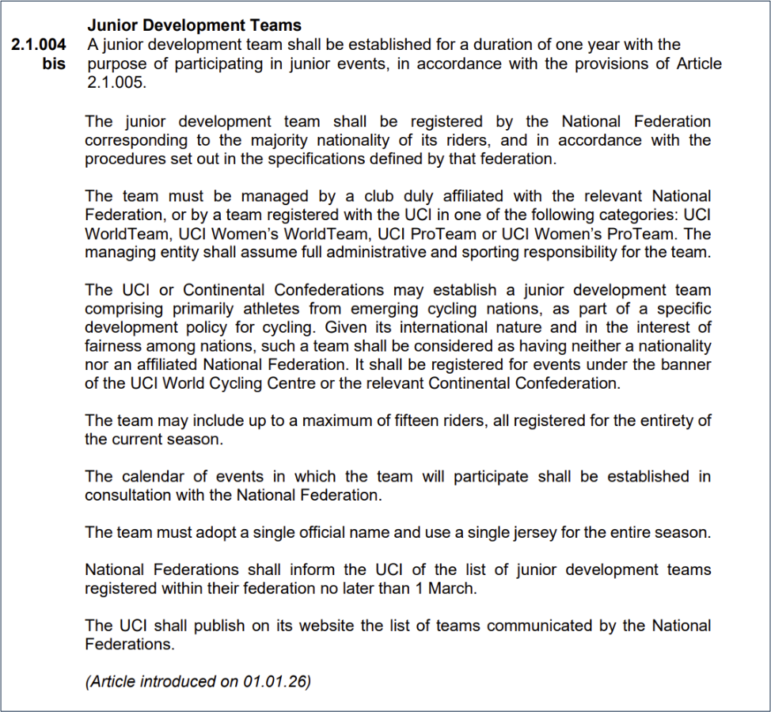
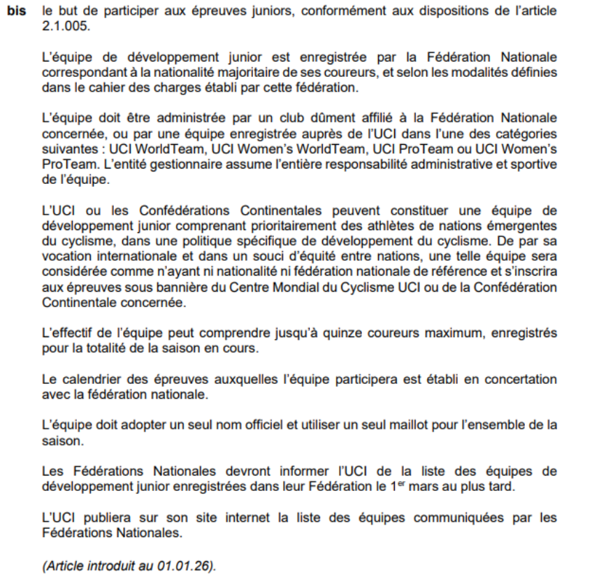
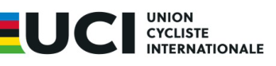

## **Junior development teams - 2026 season** 

## _**Equipes de développement junior - saison 2026**_ 

The junior development teams for the 2026 season are following. 

Page **1** / **3** 

**Union Cycliste Internationale** 9 avril 2026 

_Veuillez trouver ci-après les équipes de développement junior pour la saison 2026._ 

Page **2** / **3** 

**Union Cycliste Internationale** 9 avril 2026 

The teams listed in the table below are the junior development teams registered for the 2026 season, in accordance with Article 2.1.004bis of the UCI Regulations. 

_Les équipes figurant dans le tableau ci-dessous sont les équipes de développement junior enregistrées pour la saison 2026, conformément à l’article 2.1.004bis du Règlement UCI._ 

|**Junior development team / Equipe de développementjunior**|**Women - Men / Femmes - Hommes**|**Nationality / Nationalité**|
|---|---|---|
|AS BIKE RACING / FRANCE LITERIE|Women / Femmes|FRANCE|
|ASVILLEMUR DEVO U19|Men / Hommes|FRANCE|
|CENTRE CYCLISTE D'ETUPES LE DOUBS PAYS DE MONTBELIARD|Men / Hommes|FRANCE|
|CENTRE DE FORMATION CIC PRO CYCLING ACADEMY|Men / Hommes|FRANCE|
|CREF VENDEE CYCLISME|Men / Hommes|FRANCE|
|DECATHLON CMA CGM JUNIORS TEAM|Men / Hommes|FRANCE|
|ESPOIR CYCLISTE SAINT ETIENNE LOIRE|Men / Hommes|FRANCE|
|GERMAN JUNIOR RACING|TRV|Men / Hommes|GERMANY|
|GROUPAMA - FDJ UNITED|Men / Hommes|FRANCE|
|GUERIN ENERGIES - L2A AGENCEMENT U19|Men / Hommes|FRANCE|
|MAPEI MERIDA KAŇKOVSKÝ|Men / Hommes|CZECHIA|
|OC LOCMINÉ LORIC GOA U19|Men / Hommes|FRANCE|
|PARIS CYCLISTE OLYMPIQUE - U19|Men / Hommes|FRANCE|
|PHENIX TEAM CYCLING|Men / Hommes|FRANCE|
|ROMAN KREUZIGER CYCLING ACADEMY|Men / Hommes|CZECHIA|
|SAXONIA JUNIOR RACING TEAM|Men / Hommes|GERMANY|
|SPRINTER NICE METROPOLE COTE D'AZUR|Men / Hommes|FRANCE|
|TEAM 31 SPECIALIZED|Men / Hommes|FRANCE|
|TEAM AUVERGNE RHONE ALPES U19 FEMMES|Women / Femmes|FRANCE|
|TEAM DUKLA PRAHA|Men / Hommes|CZECHIA|
|TEAM GRENKE - AUTO EDER|Men / Hommes|GERMANY|
|TEAM NEO SOLUTIONS|Men / Hommes|GERMANY|
|U19 AC BISONTINE|Men / Hommes|FRANCE|
|U19 ACADEMIE REGION SUD|Men / Hommes|FRANCE|
|U19 CYCLING PROJECT|Men / Hommes|FRANCE|
|VERMARC CYCLING TEAM|Women / Femmes|GERMANY|

Page **3** / **3** 

**Union Cycliste Internationale** 9 avril 2026 

