**UCI** **CYCLING REGULATIONS**

# **PART 3 TRACK RACES**

**Version on 01.01.2026**

### TABLE OF CONTENTS Page

**Chapter I ORGANISATION** **3**

**Chapter II TRACK RACES** **6**

§ 1 General observations 6
§ 2 The 200 metres Time Trial 11
§ 3 Sprint 11
§ 4 Individual pursuit 17
§ 5 Team pursuit 19
§ 6 Kilometre Time Trial 24
§ 7 Points Race 25
§ 8 Keirin 28
§ 9 Team Sprint 35
§ 10 Madison 42
§ 11 Scratch Race 45
§ 12 Tandem 47
§ 13 Motor-Pacing 47
§ 14 Elimination Race 51
§ 15 Six-Day Races 53
§ 16 Omnium 55
§ 17 Flying Lap 58
§ 18 Tempo Race 58

**Chapter III UCI TRACK RANKINGS** **60**

**Chapter IV UCI TRACK WORLD CUP** **79**

**Chapter V WORLD RECORDS** **83**

**Chapter VI EQUIPMENT AND INFRASTRUCTURE** **88**

§ 1 Starting Blocks 88
§ 2 Motorbikes for motor-pacing 88
§ 3 Mopeds 91
§ 4 Attire of motor-pacers 93
§ 5 Attire of moped pacers 94
§ 6 Velodromes 94

**Chapter VII TRACK TEAMS** **106**

§ 1 Identity 106
§ 2 Legal and Financial Status 107
§ 3 Requirements imposed on the UCI Track Team for the registration 107
§ 4 Teams and Riders 109
§ 5 Contract of Employment & Insurance 110
§ 6 End of Contract 110
§ 7 Dissolution of a UCI Track Team 111
§ 8 Penalties 111
§ 9 UCI Model Contract Between a Rider and a UCI Track Team 112
§ 10 Bank guarantee of UCI Track Team 115

E0126 TRACK RACES 1

**UCI** **CYCLING REGULATIONS**

**Chapter VIII CALENDAR** **118**

**Chapter IX MASTERS** **121**

**Chapter X RACE INCIDENTS AND SPECIFIC INFRINGEMENTS** **125**

Appendix 1 136

E0126 TRACK RACES 2

**UCI** **CYCLING REGULATIONS**

## **PART 3 TRACK RACES**

### **Chapter I ORGANISATION**

**Technical Guide**
**3.1.001** (N) An organiser shall establish a Technical guide for each competition each time he
holds a race.

_(text modified on 01.08.23)_

**3.1.002** (N) The Technical guide shall include at least the following details of the organisation:

            - mention of the fact that the race will be run under UCI Regulations

            - possibly giving the specific regulations of the competition

            - the competition programme and schedule

            - a description of the track (length, coating, indoor or outdoor.)

            - location of the Competition Headquarters, the Doping Control Station and the
Media Centre

            - the place and time of the confirmation of starters and the distribution of riders’
numbers

            - the place and time of the meeting of Team Managers

            - the programme for the official ceremonies

            - prizes

            - the composition of the commissaires’ panel

            - the name, address and telephone number of the director of the organisation

            - specification that only the UCI Scale of Penalties shall apply

            - the anti-doping regulations that are to apply

_(text modified on 01.08.23)_

**Secretariat**
**3.1.003** (N) The organiser shall, for the full duration of the competition provide a permanent
equipped secretariat in the venue. A representative of the organiser shall be on hand
there at all times.

_(text modified on 01.08.23)_

**3.1.004** (N) The Competition Headquarters shall be maintained until the results have been
transmitted to the UCI or, if the commissaires have not yet finished their work, until
such time as they have finished.

**3.1.005** (N) The Competition Headquarters shall be equipped with a telephone, internet and
a photocopier.

_(text modified on 01.07.17)_

**Results**
**3.1.006** As soon as results of the competition are known, the organiser together with the
appointed Commissaire shall transmit them electronically or by any other method
specified by the UCI - to the UCI and its national federation within one working day,
together with the list of riders having taken the start.

_(text modified on 13.06.08; 12.06.20)_

E0126 TRACK RACES 3

**UCI** **CYCLING REGULATIONS**

**3.1.007** (N) The National Federation of the organiser shall without delay communicate to the
UCI any changes made to the results communicated by the organiser.

**Security**
**3.1.008** Notwithstanding any legal and administrative provisions that may apply and the duty
of each individual to take all due care, the organiser shall ensure that the track, the
venue and all installations are in good condition and do not constitute a danger to
security.

For an international competition, the UCI may require additional facilities or measures,
without that the absence of such a request would engage its responsibility.

_(text modified on 26.08.04, 01.08.23)_

**3.1.009** The number of riders on track in competition shall in no case exceed:
16 (12 teams for Madison) on a 166m track
20 (15 teams for Madison) on a 200 m track
24 (18 teams for Madison) on a 250 m track
36 (20 teams for Madison) on a 333.33 m track

_(text modified on 01.01.03; 17.10.22; 01.01.25)_

**3.1.010** In no case, can the UCI be held responsible for any defects or any mishaps that may
occur.

_(text modified on 01.01.03)_

**3.1.011** Bunch events refers to the following track events:

        - Points Race (as per § 7)

        - Madison (as per § 10)

        - Scratch Race (as per § 11)

        - Elimination Race (as per § 14)

       - Omnium (as per § 16)

       - Tempo Race (as per § 18)

_(article introduced on 12.06.20)_

**3.1.011** For the sake of clarity, the following terms have the following meaning within the
**bis** context of and throughout Part 3 of the regulations:

Competition: Refers to any track competition registered on the UCI calendar
which meets the classification as per article 3.3.009.
Event: Refers to a type of races as identified in Chapter II Track Races.
Session: Refers to a defined block of events within the competition.
Programme. Depending on the programme, it can refer to a day or
part of a day, and it should be well identified in the programme.

_(article introduced on 01.08.23)_

**Safety zone**
**3.1.012** During all track events, except Team Pursuit and Individual Pursuit, all team staff shall
remain on the infield (off the safety zone and the track).

E0126 TRACK RACES 4

**UCI** **CYCLING REGULATIONS**

During Team Pursuit and Individual Pursuit, one coach per team only is permitted on
the safety zone.

Specific team staff may be permitted to access the safety zone (i.e. the mechanic
following a crash) at the commissaires’ discretion.

Irrespective of the above, article 3.6.072 applies.

_(article introduced on 12.06.20)_

E0126 TRACK RACES 5

**UCI** **CYCLING REGULATIONS**

### **Chapter II TRACK RACES**

**§ 1** **General observations**

**Participation**
**3.2.001** The track season starts on January 1 [st] and ends on December 31 [st] .

Track competitions shall be held in the categories as defined in article 1.1.036 and
1.1.037.

Only riders aged 17 or more can take part in competitions on the international
calendar, as defined in article 1.1.035.

Junior riders of 18 years old can take part in competition for categories under 23 and
elite.

Riders of the under 23 category can take part in elite competitions.

|Eligibility by Competition Category|Col2|
|---|---|
|**Competition Category **|**Eligible Riders**|
|Elite|Elite, under-23, & junior riders aged 18 (2nd year junior)|
|Under 23|Under 23 & junior riders aged 18 (2nd year junior)|
|Junior|Junior riders|

_(text modified on 25.09.07; 12.06.20; 17.10.22, 01.01.26)_

**Race distances**
**3.2.001** [abrogated on 04.03.19]
**bis**

**Preparation of the track for timed events**
**3.2.001** For tracks longer than 250 metres, the blue band shall be made un-rideable by placing
**ter** pads every 5 metres starting from each Pursuit Line, up until the end of the second
turn after that Pursuit Line. For the Flying 200 metres event, only, these pads shall be
placed every 5 metres in the corners only. The pads shall be 50 cm long and a
maximum of 10 cm wide and 10 cm high made of a synthetic material heavy enough
to not be moved by the airstream.

On the 250 metres track or shorter, no pads are required on the blue band.

For Hour Record and any special attempt on any length track, the blue band shall be
made un-rideable by placing these pads every 5 metres the entire way around the
track.
.

_(article introduced on 21.06.18; modified on 04.03.19; 12.06.20)_

**Conduct of riders**
**3.2.002** Riders shall refrain from any collusion, manoeuvre or movement likely to hinder the
conduct or distort the result of the race. In the case of collusion between riders, the
commissaires may disqualify the riders concerned.

In addition, while riding on the track, riders shall at all times be in firm control of the
bicycle and have at least one hand on the handlebar (or extension).

E0126 TRACK RACES 6

**UCI** **CYCLING REGULATIONS**

As an exception to Article 1.3.008, riders may use their forearms as an additional point
of support on the handlebar, provided that all other points of support defined by Article
1.3.008 are maintained at all times.

_(text modified on 30.09.10; 04.03.19, 01.01.26)_

**3.2.003** If riders wearing the same team clothing ride in the same race, they shall bear some
item to distinguish them.

Riders are not permitted to wear tinted visor or glasses that would prevent them from
being clearly identified while seated in the waiting area. Riders shall only put on their
tinted visor or glasses when heading on to the track. Any rider breaching this article
shall be sanctioned as per article 3.10.008.

_(text modified on 01.01.02; 14.10.16; 04.03.19; 12.06.20)_

**3.2.004** Other than when prevented by circumstances beyond their control, all riders qualifying
for the following round of an event must participate or else they will be disqualified for
the event and the remainder of the competition.

_(text modified on 14.10.16; 01.01.26)_

**3.2.005** Riders may carry no object on them or on their bicycles that could drop onto the track.
They may not bear or use on the track any music player or radio communication
system.

In addition, any electronic device with display (for instance speedometer or
powermeter) must be hidden so that it cannot be read by the riders.

_(text modified on 25.09.07; 29.06.09)_

**3.2.006** A rider may not have the race stopped because of some irregularity of which he
considers himself the victim.

**3.2.007** Unless otherwise provided, any rider having fallen or left the track to dismount from
his bicycle, may accept help in remounting. He shall resume the race at the point
where he left the track, and in the position he occupied before falling or leaving the
track.

_(text modified on 01.10.11)_

**3.2.008** The blue band does not form part of the racing surface of the track. If a rider rides on
the blue band voluntarily, and if, in doing so, it is considered that the rider has obtained
an advantage, the latter will be relegated or disqualified depending on the seriousness
of the fault.

_(text modified on 01.01.02; 15.03.16; 01.10.19)_

**Riders’ numbers**
**3.2.009** (N) Riders shall bear two number panels, save in the following events where they
shall bear just one: the Km Time Trial, the Individual Pursuit, the Team Pursuit and
the Team Sprint.

_(text modified on 01.01.02; 01.02.11; 12.06.20)_

E0126 TRACK RACES 7

**UCI** **CYCLING REGULATIONS**

**Commissaires’ panel**
**3.2.010** The composition of the commissaires’ panel is indicated in Article 1.2.116.

**Judge-referee**
**3.2.011** (N) The president of the commissaires’ panel shall appoint one of the panel as judgereferee. The president of the commissaires’ panel may not carry out the task himself.
The presence of a judge-referee shall be compulsory for the sprint, the keirin, and all
bunch events as per article 3.1.011.

The judge-referee shall solely monitor the conduct of riders in the race and their
conformity with the racing regulations. On this issue he shall, alone and immediately,
impose penalties and take any other decision required under the regulations.

Nevertheless, the president of the commissaires’ panel may request that a decision
made by the judge-referee be reviewed by the commissaires’ panel. After review, only
the president of the commissaire’s panel may overturn a decision made by the judgereferee.

_(text modified on 04.07.03; 12.06.20, 01.08.23)_

**3.2.012** The judge-referee shall take up a place on the outside of the track in a calm and
isolated area with a good general view across the whole track. The judge-referee must
be provided with a means of communicating directly with the president of the
commissaires’ panel. At the World Championships, the Olympic Games, Continental
Championships and World Cup, the judge-referee shall also have access to a video
system permitting slow-motion replay in order to review events in the race. This
system must be linked to a TV display located near the finish line that will allow the
president of the commissaires’ panel to privately view the same images. A technician
shall be specifically appointed to assist him and operate the video system under his
instructions.

_(text modified on 01.10.11, 01.08.23)_

**Warnings – disqualification**
**3.2.013** [abrogated on 01.08.23]

**3.2.014** In the event that bicycles are checked in conformity with articles 1.3.006 to 1.3.020
with dedicated measuring devices, commissaires are entitled to double-check
positions after the race on a random basis. Should the bicycle or positions have been
modified in infringement with this regulation, the rider will be disqualified.

_(article introduced on 10.06.05)_

**Time-keeping**
**3.2.015** (N) Times shall be taken to the thousandth of a second whenever the time determines
the result.

**Start**
**3.2.016** The starter shall give the start by means of a pistol shot. In cases where the start is
to be taken from a starting block, the following procedure shall apply: the brakes of
the machine shall be released by the electronic system that simultaneously triggers
the chronometer. Once the bicycle has been fixed, a clock placed before the rider,
counts down the last 50 seconds before the start.

E0126 TRACK RACES 8

**UCI** **CYCLING REGULATIONS**

**3.2.017** Any rider holding up the start for reasons not accepted by the starter shall not be
permitted to start.

**Lap counter and bell**
**3.2.017** Unless otherwise provided in a specific provision, the start of the sprint lap(s),
**Bis** including the last lap, of a race shall be indicated by a bell. The bell shall be rung
when the head of the race crosses the finish line, and again for any rider or group of
riders who may also score points in a sprint. Points will be awarded, or the race will
be over upon the next time the head of the race crosses the finish line. The final
determination as to who the head of the race shall be made by the president of the
commissaires’ panel. Either the president, or a commissaire designated by the
president, shall indicate the head of the race during bunch events.

_(article introduced on 04.03.19; modified on 01.10.19; 01.01.25, 01.01.26)_

**3.2.017** Once the race has started, the remaining distance to be raced shall be indicated by
**ter** the lap counter, even if the total distance raced is not the same as indicated in the
regulations for the event.

_(article introduced on 01.10.19)_

**Gaining and losing laps**
**3.2.017** A rider or team shall be considered to have gained a lap when he or it has caught up
**quater** with the rear of the largest racing bunch on the track. Likewise, a rider or team shall
be considered to have lost a lap when he or it has been caught by the largest racing
bunch on the track. In all cases, the final determination as to which is the largest
bunch on the track shall be made by the president of the commissaires’ panel.

_(article introduced on 01.10.19; modified on 12.06.20)_

**Stoppage**
**3.2.018** The starter alone shall judge whether to stop the race in case of a false start.

**3.2.019** Stoppage of the race shall be indicated by a double pistol shot.

_(text modified on 01.01.02; 04.03.19)_

**3.2.020** [abrogated on 04.07.03]

**Neutralisation**
**3.2.020** Unless otherwise provided in a specific provision, in a bunch event, in the case of a
**bis** recognised mishap of a rider, or both riders of a team in Madison, the rider, or team,
shall be entitled to a neutralisation for the number of laps closest to 1250 metres (5
laps on a 250m-track), counted from the moment of the mishap until they resumed
their position that they occupied before the mishap.

Beyond the distance of 1250 metres, neutralised riders or teams begin to lose laps
until they resumed their position that they occupied before the mishap.

Neutralised riders or teams may not return to the track within the last kilometre. Should
this last kilometre start during the allowed neutralisation period of a recognised
mishap, and the riders not be able to return prior to the start of the last kilometre,
these neutralised riders or teams shall appear in the final placings depending on the

E0126 TRACK RACES 9

**UCI** **CYCLING REGULATIONS**

points and laps accumulated prior to the mishap, unless otherwise provided in a
specific provision.

_(article introduced on 04.03.19; modified on 01.10.19; 12.06.20; 01.01.26)_

**Recognised mishap**
**3.2.021** The following shall be considered recognised mishaps:

         - a legitimate fall

         - a puncture

         - the breakage of an essential part of the bicycle.
All other incidents are considered un-recognised mishaps.
_(text modified on 01.01.02; 14.10.16)_

**Seeding**
**3.2.021** For all competitions, other than World Cup, World Championships and
**bis** Olympic Games, rider and teams shall be seeded according to the following table:

|Events|UCI Ranking to use|
|---|---|
|-  Sprint -  Keirin -  Kilometre Time Trial|UCI Individual Ranking (Sprint)|
|-  Elimination Race -  Omnium -  Scratch Race -  Points Race -  Individual Pursuit|UCI Individual Ranking (Endurance)|
|-  Madison -  Team Pursuit -  Team Sprint|UCI Nation Rankings (specific to the event)|

Riders/teams with no ranking shall be seeded last in random order by the
commissaires’ panel. In the case where qualification heats are held for a bunch event,
riders in the subsequent race and finals shall be seeded according to the results from
these heats.

For _World Cup_, _World Championships_ and _Olympic Games_, riders and teams shall
be seeded by the UCI. When applicable, the current World Champion will have the
best seed.

_(article introduced on 01.02.11; text modified on 01.10.12; 12.06.20, 01.01.26)_

**Restart in standing start events**
**3.2.021** In each round of a standing start event, a team or a rider is only permitted two starts.
**ter** A restart shall only be given in the result of a false start, or in the event of a recognised
mishap as per article 3.2.021.

A team or a rider which causes a further false start or suffer a further recognised
mishap in the qualifying round shall be eliminated (DNF).

E0126 TRACK RACES 10

**UCI** **CYCLING REGULATIONS**

A team or a rider which causes a further false start or suffer a further recognised
mishap in the first round shall be relegated.

A team or a rider which causes a further false start or suffer a further recognised
mishap during the finals loses the final.

If a team or rider stops after suffering a mishap and the starter determines it is not a
recognised mishap, the team or rider shall be eliminated (DNF) from the qualifying
round of the event, or be relegated in the following rounds.

_(article introduced on 04.03.19; text modified on 01.08.23; 01.01.26)_

**§ 2** **The 200 metres Time Trial**

**Definition**
**3.2.022** A “200 metres Time Trial” shall take a flying start from the 200 metres line and shall
be used to select the participants and rankings for the sprint event.

_(text modified on 01.01.02)_

**Race procedure**
**3.2.023** Riders shall take the start in the order determined by the commissaires.

**3.2.024** The rider shall enter the track as soon as he has been passed by the previous rider
who has triggered the timing device.

_(text modified on 01.01.02)_

**3.2.025** The distance to accomplish including the momentum and the 200 metres is fixed as
follows, depending on the length of the track:

          - 250 metres track or smaller: 3.5 laps

          - 285,714 metre tracks: 3.0 laps

          - 333,33 metre track: 2.5 laps

          - 400 metres track and longer: 2.0 laps.

**3.2.026** [abrogated on 01.01.02]

**3.2.027** In case of a dead heat, the riders concerned will be classified according to the best
time in the last 100 metres. In the case that the last 100 metres time cannot be
recorded or if the riders are still tied, the riders concerned will be classified by drawing
lots.

_(text modified on 30.09.10)_

**3.2.028** In the case of a recognised mishap, the rider shall take a new start. Only one new
start per rider will be permitted.

_(text modified on 01.01.02; 01.01.04, 01.08.23)_

**§ 3** **Sprint**

**Definition**
**3.2.029** The sprint is a race between 2 to 4 riders over 2 or 3 laps.

E0126 TRACK RACES 11

**UCI** **CYCLING REGULATIONS**

_(text modified on 04.07.03)_

**Organisation of the event**
**3.2.030** The event shall be organised according to the table in article 3.2.050.

**3.2.031** (N) The event shall at least include:

          - 8 riders;

          - a 200 meters time trial, flying start;

          - 1/4 finals, straight;

          - 1/2 finals, best of three heats;

          - finals 3 [rd] -4t [h] and 1 [st] -2 [nd], best of three heats.

_(article introduced on 30.03.09; 14.10.16; 01.10.19)_

**3.2.032** [abrogated on 20.06.14]

**3.2.033** During World Cup and World Championships, 28 riders shall participate in the sprint
tournament. For other competitions, the same format can be used with a lower
number of riders based on the table of article 3.2.050 qualifying either 16 or 8 riders.

Prior to the first round, a qualifying 200 m time trial shall be run to determine the
fastest 28 riders taking part to the sprint tournament and the makeup of the heats.

_(text modified on 26.08.04; 10.06.05; 01.02.11; 20.06.14; 14.10.16)_

**Sprint Race**
**3.2.034** [abrogated on 01.01.02]

**3.2.035** On tracks of less than 333.33 metres, races shall be ridden over 3 laps. On tracks of
333.33 metres or more, races shall be ridden over 2 laps.

_(text modified on 01.01.03)_

**3.2.036** Should a rider drop out of a two-up heat, his opponent shall go to the starting line to
be declared the winner. He need not cover the distance.

**3.2.037** The starting position shall be determined by drawing lots. The rider drawing number
1 shall start on the inside of the track.

In two-heat races, the other rider shall take the position on the inside of the track in
the second heat.

For the deciding round, a fresh draw shall take place.

_(text modified on 01.01.02)_

**Race procedure**
**3.2.038** The start shall be given by whistle.

**3.2.039** The rider on the inside of the track, unless overtaken, shall lead at least at walking
pace and make no manoeuvre to force his opponent through until reaching the pursuit
line on the opposite side of the track. Should the leading rider not respect this
requirement, the race shall be restarted and the rider not at fault shall decide their
starting position. In a three or four up heat, the riders not at fault shall decide their
starting positions according to the order of the last draw.

E0126 TRACK RACES 12

**UCI** **CYCLING REGULATIONS**

_(text modified on 01.01.02; 01.01.04; 01.10.11; 01.08.23; 01.01.26)_

**3.2.039** A maximum of two standstills shall be permitted for each race. The maximum period
**bis** for a standstill shall be 30 seconds following which, the leading rider shall be directed
by the starter to continue. If he fails to do so, the starter shall stop the race and declare
the other rider the winner of the heat. In a three or four-up race, the race shall be
immediately rerun as a two or three-up race, without the relegated rider.

_(article introduced on 01.08.23)_

**3.2.040** [abrogated on 01.01.02]

**3.2.041** Before the last 200 metres line or the start of the final sprint, riders may avail
themselves of the full width of the track but must nevertheless leave sufficient space
for their opponent to pass and shall refrain from any manoeuvres that could provoke
a collision, a fall or cause any rider to ride off the track.

**3.2.042** During the final sprint, even if launched before the last 200 metres, each rider shall
remain in his lane up to the finish, unless he has at least a clear cycle-length lead and
shall not make any manoeuvre to prevent the opponent from passing.

_(text modified on 01.01.02)_

**3.2.043** A rider may not challenge or pass on the left an opponent riding in the sprinters’ lane.

If the leading rider leaves the sprinters’ lane and his opponent attempts to pass to his
left, he may not return to that lane unless he still has a clear cycle-length lead.

**3.2.044** A rider passing on the right of his opponent, who is in the sprinters’ lane, may not
crowd him or cause him suddenly to reduce speed.

**3.2.045** A rider starting the sprint outside the sprinters’ lane may not drop into that lane if it is
already occupied by his opponent unless there is a clear cycle-length lead.

_(text modified on 01.01.02)_

**3.2.046** [transferred to article 3.2.008 on 12.06.20]

**3.2.047** If, in a three or four up race, a rider behaves in an irregular manner to favour another
rider, he shall be relegated. The race shall be immediately rerun as a two or three-up
race.
_(text modified on 01.01.02)_

**Race stoppages**
**3.2.048**
1. In the case of a fall, the starter may stop the race.

If the fall is caused by a competitor riding too slowly in a bend or by any other
unintentional fault, the race shall be restarted and the rider not at fault shall
decide their starting position. In a three or four up heat, the riders not at fault
shall decide their starting positions according to the order of the last draw.

If the fall is intentionally caused by a competitor, that competitor shall be
relegated or disqualified from the competition according to the gravity of the fault

E0126 TRACK RACES 13

**UCI** **CYCLING REGULATIONS**

committed and the other competitor declared the winner. In three or four up
heat, the race shall be immediately restarted with the remaining two or three
riders.

If the fall is not caused by a competitor committing a fault, the commissaires’
panel shall decide whether the race is to be restarted with the riders in the same
order or whether the positions at the time of the fall should be considered final.

2. in the case of a puncture or the breakage of an essential part of the bicycle, the
starter may stop the race. Even if the race is not stopped, the commissaires’
panel shall decide whether the race is to be restarted with the riders in the same
order or whether the positions at the time of the incident should be considered
final.

3. In the case of a rider losing their balance or touching their opponent or barrier
before the start of the sprint, the starter may stop the race. The race shall be
restarted, and the rider not a fault shall decide their starting position. In a three
or four up heat, the riders not at fault shall decide their starting positions
according to the order of the last draw.

4. In the case where a rider commits a flagrant infringement before the bell rings
to indicate the start of the final lap or before the start of the sprint, whichever is
sooner, the starter shall stop the race and the commissaires’ panel may relegate
or disqualify the rider committing the infringement. In a three or four up heat, the
race shall be immediately restarted with the remaining two or three riders in their
same positions.

If the rider committing the infringement is not relegated or disqualified, the race
shall be restarted, and the opponent shall decide their starting position. In a
three or four up heat, the riders not at fault shall decide their starting positions
according to the order of the last draw.

_(text modified on 01.01.02; 01.08.23; 01.01.26)_

**3.2.048** In the case the event is interrupted for any reason, and it is not possible to restart the
**bis** event before the end of the competition, the commissaires’ panel shall decide
pursuant to the table below:

|DECISIONS|Col2|Col3|
|---|---|---|
|Interrupted before completion of the 1/4 finals|Interrupted after completion of the 1/4 finals, but before the completion of the semi- finals|Interruption after the completion of the semi-finals|
|No final classification. No results will be submitted and no UCI points will be awarded.|Riders qualified for the semi-finals will be awarded 4th place.   All other riders will be ranked according to the rules applicable for this event.|Riders qualified for the gold medal final will be awarded 2nd  place, and riders qualified for the bronze medal final will be awarded 4th  place.   All other riders will be ranked|

E0126 TRACK RACES 14

**UCI** **CYCLING REGULATIONS**

_(article introduced on 01.01.25)_

**3.2.049** [abrogated on 01.08.23]

**3.2.050** Table of sprint event:

**WORLD CUP AND WORLD CHAMPIONSHIPS**

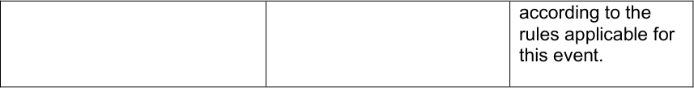

|STARTERS|SYSTEM|HEAT|COMPOSITION|1st|Other(s)|
|---|---|---|---|---|---|
|28|4 best riders skip    1/16 Finals 12 X 2→ 1 = 12| 1|N1 -|1A|Ranked 17 to 28 according to 200 m TT Qualifying|
|28|4 best riders skip    1/16 Finals 12 X 2→ 1 = 12|2|N2 -|2A|2A|
|28|4 best riders skip    1/16 Finals 12 X 2→ 1 = 12|3|N3 -|3A|3A|
|28|4 best riders skip    1/16 Finals 12 X 2→ 1 = 12|4|N4 -|4A|4A|
|28|4 best riders skip    1/16 Finals 12 X 2→ 1 = 12|5|N5 – N28|5A|5A|
|28|4 best riders skip    1/16 Finals 12 X 2→ 1 = 12|6|N6 – N27|6A|6A|
|28|4 best riders skip    1/16 Finals 12 X 2→ 1 = 12|7|N7 – N26|7A|7A|
|28|4 best riders skip    1/16 Finals 12 X 2→ 1 = 12|8|N8 – N25|8A|8A|
|28|4 best riders skip    1/16 Finals 12 X 2→ 1 = 12|9|N9 – N24|9A|9A|
|28|4 best riders skip    1/16 Finals 12 X 2→ 1 = 12|10|N10 – N23|10A|10A|
|28|4 best riders skip    1/16 Finals 12 X 2→ 1 = 12|11|N11 – N22|11A|11A|
|28|4 best riders skip    1/16 Finals 12 X 2→ 1 = 12|12|N12 – N21|12A|12A|
|28|4 best riders skip    1/16 Finals 12 X 2→ 1 = 12|13|N13 – N20|13A|13A|
|28|4 best riders skip    1/16 Finals 12 X 2→ 1 = 12|14|N14 – N19|14A|14A|
|28|4 best riders skip    1/16 Finals 12 X 2→ 1 = 12|15|N15 – N18|15A|15A|
|28|4 best riders skip    1/16 Finals 12 X 2→ 1 = 12|16|N16 – N17|16A|16A|
|16|1/8 Finals 8 X 2→ 1 = 8 |1|1A – 16A|1B|Ranked 9 to 16 according to 200 m TT Qualifying|
|16|1/8 Finals 8 X 2→ 1 = 8 |2|2A – 15A|2B|2B|
|16|1/8 Finals 8 X 2→ 1 = 8 |3|3A – 14A|3B|3B|
|16|1/8 Finals 8 X 2→ 1 = 8 |4|4A – 13A|4B|4B|
|16|1/8 Finals 8 X 2→ 1 = 8 |5|5A – 12A|5B|5B|
|16|1/8 Finals 8 X 2→ 1 = 8 |6|6A – 11A|6B|6B|
|16|1/8 Finals 8 X 2→ 1 = 8 |7|7A – 10A|7B|7B|
|16|1/8 Finals 8 X 2→ 1 = 8 |8|8A – 9A|8B|8B|
|8|1/4 Finals 4 X 2→ 1 = 4 (in 2 heats, 3 if required)|1|1B - 8B|1C|Ranked 5 to 8 according to 200 m TT Qualifying|
|8|1/4 Finals 4 X 2→ 1 = 4 (in 2 heats, 3 if required)|2|2B - 7B|2C|2C|
|8|1/4 Finals 4 X 2→ 1 = 4 (in 2 heats, 3 if required)|3|3B - 6B|3C|3C|
|8|1/4 Finals 4 X 2→ 1 = 4 (in 2 heats, 3 if required)|4|4B - 5B|4C|4C|
|4|1/2 Finals 2 X 2→ 1 = 2 (in 2 heats, 3 if required)|1|1C - 4C|1D1|1D2|
|4|1/2 Finals 2 X 2→ 1 = 2 (in 2 heats, 3 if required)|2|2C - 3C|2D1|2D2|
|4|Finals 2 X 2→ 1 = 2 (in 2 heats, 3 if required)|1|1D1 - 2D1|1er (gold)|2e (silver)|
|4|Finals 2 X 2→ 1 = 2 (in 2 heats, 3 if required)|2|1D2 – 2D2|3e  (bronze)|4e|

_(text modified on 26.08.04; 10.06.05; 20.06.14; 14.10.16; 05.04.17; 12.06.20, 01.08.23)_

E0126 TRACK RACES 15

**UCI** **CYCLING REGULATIONS**

**OLYMPIC GAMES**

|STARTERS|SYSTEM|HEAT|COMPOSITION|1st|Other(s)|
|---|---|---|---|---|---|
|24                     |1/32 Finals 12 x 2 -> 1 = 12                   |1|N1 - N24|1A1|1A2|
|24                     |1/32 Finals 12 x 2 -> 1 = 12                   |2|N2 - N23|2A1|2A2|
|24                     |1/32 Finals 12 x 2 -> 1 = 12                   |3|N3 - N22|3A1|3A2|
|24                     |1/32 Finals 12 x 2 -> 1 = 12                   |4|N4 - N21|4A1|4A2|
|24                     |1/32 Finals 12 x 2 -> 1 = 12                   |5|N5 - N20|5A1|5A2|
|24                     |1/32 Finals 12 x 2 -> 1 = 12                   |6|N6 - N19|6A1|6A2|
|24                     |1/32 Finals 12 x 2 -> 1 = 12                   |7|N7 - N18|7A1|7A2|
|24                     |1/32 Finals 12 x 2 -> 1 = 12                   |8|N8 - N17|8A1|8A2|
|24                     |1/32 Finals 12 x 2 -> 1 = 12                   |9|N9 - N16|9A1|9A2|
|24                     |1/32 Finals 12 x 2 -> 1 = 12                   |10|N10 - N15|10A1|10A2|
|24                     |1/32 Finals 12 x 2 -> 1 = 12                   |11|N11 - N14|11A1|11A2|
|24                     |1/32 Finals 12 x 2 -> 1 = 12                   |12|N12 - N13|12A1|12A2|
|12     |Repechages 4 x 3 -> 1 = 4   |1|1A2 - 8A2 - 9A2|1B|Ranking according to 200m TT|
|12     |Repechages 4 x 3 -> 1 = 4   |2|2A2 - 7A2 - 10A2|2B|2B|
|12     |Repechages 4 x 3 -> 1 = 4   |3|3A2 - 6A2 - 11A2|3B|3B|
|12     |Repechages 4 x 3 -> 1 = 4   |4|4A2 - 5A2 - 12A2|4B|4B|
|16             |1/16 Finals 8 x 2 -> 1 = 8           |1|1A1 - 4B|1C1|1C2|
|16             |1/16 Finals 8 x 2 -> 1 = 8           |2|2A1 - 3B|2C1|2C2|
|16             |1/16 Finals 8 x 2 -> 1 = 8           |3|3A1 - 2B|3C1|3C2|
|16             |1/16 Finals 8 x 2 -> 1 = 8           |4|4A1 - 1B|4C1|4C2|
|16             |1/16 Finals 8 x 2 -> 1 = 8           |5|5A1 - 12A1|5C1|5C2|
|16             |1/16 Finals 8 x 2 -> 1 = 8           |6|6A1 - 11A1|6C1|6C2|
|16             |1/16 Finals 8 x 2 -> 1 = 8           |7|7A1 - 10A1|7C1|7C2|
|16             |1/16 Finals 8 x 2 -> 1 = 8           |8|8A1 - 9A1|8C1|8C2|
|8      |Repechages 4 x 2 -> 1 = 4   |1|1C2 - 8C2|1D1|Ranking according to 200m TT|
|8      |Repechages 4 x 2 -> 1 = 4   |2|2C2 - 7C2|2D1|2D1|
|8      |Repechages 4 x 2 -> 1 = 4   |3|3C2 - 6C2|3D1|3D1|
|8      |Repechages 4 x 2 -> 1 = 4   |4|4C2 - 5C2|4D1|4D1|
|12         |1/8 Finals 6 x 2 -> 1 = 6       |1|1C1 - 4D1|1E1|1E2|
|12         |1/8 Finals 6 x 2 -> 1 = 6       |2|2C1 - 3D1|2E1|2E2|
|12         |1/8 Finals 6 x 2 -> 1 = 6       |3|3C1 - 2D1|3E1|3E2|
|12         |1/8 Finals 6 x 2 -> 1 = 6       |4|4C1 - 1D1|4E1|4E2|
|12         |1/8 Finals 6 x 2 -> 1 = 6       |5|5C1 - 8C1|5E1|5E2|
|12         |1/8 Finals 6 x 2 -> 1 = 6       |6|6C1 - 7C1|6E1|6E2|
|6  |Repechages 2 x 3 -> 1 = 2|1|1E2 - 4E2 - 5E2|1F1|Ranking according to 200m TT|
|6  |Repechages 2 x 3 -> 1 = 2|2|2E2 - 3E2 - 6E2|2F1|2F1|
|8      |1/4 Finals 4 x 2 -> 1 = 4 (in 2 heats, 3 if required)|1|1E1 - 2F1|1G1|For places 5 to 8|
|8      |1/4 Finals 4 x 2 -> 1 = 4 (in 2 heats, 3 if required)|2|2E1 - 1F1|2G1|2G1|
|8      |1/4 Finals 4 x 2 -> 1 = 4 (in 2 heats, 3 if required)|3|3E1 - 6E1|3G1|3G1|
|8      |1/4 Finals 4 x 2 -> 1 = 4 (in 2 heats, 3 if required)|4|4E1 - 5E1|4G1|4G1|
|4|1/2 Finals 2 x 2 -> 1 = 2 (in 2 heats 3 if required)|1|1G1 - 4G1|1H1|1H2|
|4|1/2 Finals 2 x 2 -> 1 = 2 (in 2 heats 3 if required)|2|2G1 - 3G1|2H1|2H2|
|4|Finals 2 x 2 -> 1 = 2 (in 2 heats 3 if required)|1|1H1 - 2H1|1st (gold)|2nd (silver)|
|4|Finals 2 x 2 -> 1 = 2 (in 2 heats 3 if required)|2|1H2 - 2H2|3rd (bronze)|4th|

_(text modified on 25.09.07; 04.03.19, 01.08.23)_

E0126 TRACK RACES 16

**UCI** **CYCLING REGULATIONS**

**§ 4** **Individual pursuit**

**Definition**
**3.2.051** Two cyclists compete in a fixed distance. The riders start on opposite sides of the
track. The winner is determined by either catching the other rider or recording the
fastest time.

_(text modified on 01.01.02)_

**Organisation of the event**
**3.2.052** Races shall be run over:

          - 4 km for Men Elite & Women Elite

          - 3 km for Junior Men & Junior Women

_(text modified on 01.01.25)_

**3.2.053** This event shall be organised in two series:
1. The qualifying rounds to select the best 4 riders on the basis of their times.
2. The finals
The riders with the two best times shall ride off in the final for first and second place
while the two others shall ride off in the final for third and fourth places.

_(text modified on 26.08.04)_

**3.2.054** [abrogated on 04.03.19]

**3.2.055** For the qualifying rounds the commissaires shall make up each match from riders
presumed to be of equal ability, but without matching the two presumed to be the best.

**3.2.056** During the qualifying rounds account shall be taken solely of times.

If a rider is caught, he must finish the distance to have a time recorded.

A caught rider may not ride in the slipstream of his opponent, nor pass him, on pain
of disqualification. Similarly, the catching rider may not ride in the slipstream of his
opponent, on pain of disqualification.

_(text modified on 01.10.19)_

**3.2.057** In a race between two of the four best riders (finals), if one rider catches the other the
race is deemed to have finished.

**3.2.058** A rider is considered to have been caught at the point that the chainset on his
opponent’s bicycle draws level with that on his own bicycle.

**3.2.059** [abrogated on 01.10.19]

**3.2.060** Should a rider fail to take the start of a final, his opponent is declared the winner.

A rider failing to start the final for 1 [st] and 2 [nd] places shall be placed 2 [nd] ; a rider failing
to start the final for 3 [rd ] and 4 [th] places shall be placed 4 [th] . If the reason for failing to ride
is not accepted, the absent rider shall be disqualified, and his place shall remain
vacant.

E0126 TRACK RACES 17

**UCI** **CYCLING REGULATIONS**

**3.2.061** In the event that riders record the same times, the rider who records the best time for
the final lap shall be declared the winner.

_(text modified on 13.06.08)_

**Preparation of the track**
**3.2.062** [abrogated on 21.06.18].

**3.2.063** At the start the two riders shall be positioned at diametrically opposite points on the
track.

**3.2.064** [abrogated on 01.08.23]

**3.2.065** (N) At each finishing point a device shall be set up to record the time of each rider and
trigger a green light and a red light to indicate the passing of the respective riders.

**3.2.066** A lap counter and a bell shall be set up at each rider's finish line.

**3.2.067** (N) The order of passing, the number of laps completed, the time of each rider and
the difference in time between the two riders on each half-lap and the final time of
each rider will be displayed on the electronic scoreboard.

**3.2.068** [abrogated on 01.08.23]

**3.2.069** (N) At the start, each rider shall be held in a starting block.

**Race procedure**
**3.2.070** The start shall be taken on the inside edge of the track.

**3.2.071** Riders starting point:
a) for the qualifying rounds, the commissaires shall determine the starting point for
each rider.
b) in the final, the rider who has in the previous round recorded the best time shall
finish in front of the main grandstand.

_(text modified on 01.01.02; 26.08.04; 26.06.07; 04.03.19)_

**3.2.072** The starter shall stop the race with a double pistol shot in the event of a false start or
of a recognised mishap. The race will then be restarted as per articles 3.2.074 and
3.2.075.

_(text modified on 20.09.05; 04.03.19, 01.08.23)_

**3.2.073** During the finals, a pistol shot shall mark the end of the race at the moment on which
each rider crosses his finish line at full distance or at the moment that one rider
catches the other.
_(text modified on 01.10.11)_

E0126 TRACK RACES 18

**UCI** **CYCLING REGULATIONS**

**Race stoppages**
**3.2.073** In the case the event is interrupted for any reason, and it is not possible to restart
**bis** and complete the event before the end of the competition, the commissaires’ panel
shall decide pursuant to the table below:

|DECISIONS|Col2|
|---|---|
|Interrupted before completion of the qualification round|Interrupted after completion of the qualification round|
|No final classification. No results will be submitted and no UCI points will be awarded.|Classification according to the results from the qualification round.|

_(article introduced on 01.01.25)_

**Mishaps**
(section subject to article 3.2.021ter)
**3.2.074** Qualifying rounds:
In the first half-lap, in the event of a recognised mishap, the race is stopped and
restarted immediately.

After the first half-lap the race shall not be stopped. A rider who is the victim of a
recognised mishap shall be permitted to ride again at the end of the qualifying rounds
(either alone against the watch or matched against another rider in the same
situation).

_(text modified on 01.01.02; 01.01.04; 04.03.19, 01.08.23)_

**3.2.075** Finals:
In the event of a recognised mishap in the first half-lap, the race shall be stopped and
restarted immediately by both riders.

After the first half-lap no mishap will be taken into consideration. The rider that suffers
a mishap shall be considered beaten in finals.

_(text modified on 01.01.02; 01.01.04; 26.08.04; 26.06.07; 05.03.18; 04.03.19,_
_01.08.23)_

**3.2.076** [article transferred to article 3.2.021ter on 04.03.19]

**3.2.076** [abrogated on 01.01.02]
**bis**

**§ 5** **Team pursuit**

**Definition**
**3.2.077** The team pursuit is a race with two opposing teams, starting on each side of the track.
The winner is determined by either catching the other team or recording the fastest
time.

The event is run over four kilometres by teams of four riders.

_(text modified on 01.01.02; 26.06.07; 25.02.13; 12.06.20)_

E0126 TRACK RACES 19

**UCI** **CYCLING REGULATIONS**

**Organisation of the event**
**3.2.078** Except for the specific details (even implicit) in this sub-section, the rules of the
individual pursuit shall apply equally to the team pursuit.

**3.2.079** Teams shall be made up of riders entered for this event. The composition of the team
may vary from one round to another. An incomplete team in the sense of article
3.2.077 may not take the start.

The team manager must notify the commissaires of any changes at least 30 minutes
before the relevant event round start.

_(text modified on 01.01.02; 30.09.10; 21.06.18; 04.03.19)_

**3.2.080** The time and the classification of each team shall be taken on that of the third rider of
each team. The time shall be measured on the front wheel of the third rider of each
team.
_(text modified on 01.01.02; 01.01.03)_

**3.2.081** A team is caught when the opposing team (at least 3 riders riding together) arrives at
or within a distance of one metre of it.

**3.2.082** Qualifying rounds shall be organised to find the 4 best teams, 8 for the World Cup,
Continental Championships, World Championships and the Olympic Games.

_(text modified on 01.01.02; 26.08.04; 26.06.07; 21.06.18, 01.08.23)_

**3.2.083** In the qualifying round, teams shall ride against the clock.

Depending on the number of entered teams, the commissaires’ panel may decide to
run qualifying round with two teams in each heat.

The seeding may be determined taking into account the targeted time communicated
by the team manager at the rider confirmation, but without matching the two teams
presumed to be the best.

_(text modified on 14.10.16; 01.07.17)_

**3.2.084** [abrogated on 01.01.02]

**3.2.085** This event shall be organised in two phases:
1. The qualifying round to select the 4 best teams on the basis of their times;
2. The finals.

The teams having made the two best times shall ride off the final for 1 [st] and 2 [nd] places,
the two others shall ride off the final for 3 [rd] and 4 [th] places.

First round:
At World Cup, Continental Championships, the World Championships and the
Olympic Games, the 8 teams recording the best times in the qualifying rounds shall
be matched in the first round as follows:
The team having obtained the 7 [th] fastest time against the one having obtained the 8 [th]
fastest time.
The team having obtained the 5 [th] fastest time against the one having obtained the 6 [th]
fastest time.

E0126 TRACK RACES 20

**UCI** **CYCLING REGULATIONS**

The team having obtained the 2 [nd] fastest time against the one having obtained the 3 [rd]
fastest time.
The team having obtained the fastest time against the one having obtained the 4 [th]
fastest time.

Finals:
The winners of the last two heats in the first round shall ride the final for 1 [st] and 2 [nd]
places.

The remaining 6 teams shall be ranked according to their times from the first round
and shall dispute the finals as follows:
The two fastest teams shall ride the final for 3 [rd] and 4 [th] places.

**At the Olympic Games, only:**
The next two fastest teams shall ride the final for 5 [th] and 6 [th] places.
The final two teams shall ride the final for 7 [th] and 8 [th] places.

_(text modified on 01.01.02; 26.08.04; 26.06.07; 01.02.11; 20.06.14; 14.10.16,_
_01.08.23; 01.01.26)_

**3.2.086** In the last two heats of the first round, if one team catches the other, the starter shall
fire the gun and the catching team is declared the winner. The catching team shall
stop as soon as possible in order to allow the other team to finish the distance and
thus to record a time. In this case, if one or both teams catch their opponents, the
times from the qualifying round shall be used to determine which of the two teams
shall finish in the home straight.

During the finals, if one team is caught by the other, the race is over, and the catching
team shall be declared the winner. The Starter shall fire the gun to indicate that the
race is over. Additionally, the Starter shall also fire the gun for each team as they
finish their race if neither team catches the other.

_(text modified on 20.06.19; 01.10.19, 01.01.26)_
.
**3.2.087** Incomplete teams may not take the start. In the qualifying round, incomplete teams
shall furthermore be disqualified.

If a team fails to take the start in the first round, no substitution shall be made. The
team failing to start shall be classified in 8 [th] place.

If several teams fail to start, they shall be classified in 8th place and above in order of
their times in the qualifying round. If the reason for failing to ride is not accepted by
the commissaires’ panel, the absent team shall be disqualified, and its place shall
remain vacant. The team that takes the start must ride alone to set a time to determine
the composition of the finals.

_(text modified on 26.06.07; 01.10.11)_

**3.2.088** Should a team fail to start in the finals, its opponents shall be declared winners and
the team not starting shall be placed second in that heat.

If the reason for failing to ride is not accepted by the commissaires’ panel, the absent
team shall be disqualified, and its place shall remain vacant.
_(text modified on 01.10.11)_

E0126 TRACK RACES 21

**UCI** **CYCLING REGULATIONS**

**3.2.089** Situations of teams not starting and ties on time shall be decided in accordance with
the regulations for the individual pursuit and with reference to article 3.3.012.

_(text modified on 01.01.02; 12.06.20)_

**Preparation of the track**
**3.2.090** (N) An electronic timing strip shall be set up on the pursuit lines in order to judge the
finish of the front wheel of the third rider of each team.

_(text modified on 01.01.02)_

**3.2.091** The timing and recording of half-laps completed shall be made on the front wheel of
the third rider.

_(text modified on 01.02.11)_

**Race procedure**
**3.2.092** The riders of each team shall start side by side behind the start line.

The lateral distance between riders shall be one metre.

(N) The rider, placed on the inside of the track, shall be held by a starting block and
shall be the leading rider.

_(text modified on 03.03.14)_

**3.2.093** [abrogated on 03.03.14]

**3.2.094** The starter shall stop the race for a false start or a mishap by a double pistol shot, for
example, one of the riders anticipates the start or if the rider on the inside of the track
fails to take the lead.

_(text modified on 01.01.02; 04.03.19)_

**3.2.095** [article transferred to article 3.2.021ter on 04.03.19]

**3.2.096** Pushing between members of the same team is strictly forbidden on pain of
disqualification in the qualifying rounds and relegation in the first competition round.

During the finals, that team loses its finals.

_(text modified on 01.01.02; 26.08.04; 26.06.07)_

**3.2.097** When the commissaires see that a team is about to be caught, they shall, in order to
avoid a collision with the other team or hinder its progress, signal to the former team
with a red flag and a whistle that it may not perform any more relays and must remain
at the bottom of the track until the opposing team has passed.

Any failure to act on this instruction shall result in the immediate disqualification of the
team.

_(text modified on 01.01.02; 20.06.19)_

E0126 TRACK RACES 22

**UCI** **CYCLING REGULATIONS**

**3.2.098** The race shall be over at the moment that the third rider of each team crosses the
finishing line for the final time at full distance or, in the finals, at the point that one
team (at least 3 riders riding together) catches the other team.

_(text modified on 01.01.02)_

|Race stoppages In the case the event interrupted for any reason, and it is not possible to restart and complete the event before the end of the competition, the commissaires’ panel shall decide pursuant to the table below:|Col2|Col3|
|---|---|---|
|**DECISIONS**|**DECISIONS**|**DECISIONS**|
|Interrupted before completion of the qualification round|Interrupted after completion of the qualification round, before completion of the First round|Interruption after the completion of the First round|
|No final classification. No results will be submitted and no UCI points will be awarded.|Classification according to the results from the qualification round.|Riders qualified for the gold medal final will be awarded 2nd place, and riders qualified for the bronze medal final will be awarded 4th place.   All other riders will be ranked according to the rules applicable for this event.|

_(article introduced on 01.01.25)_

**Mishaps**
(section subject to article 3.2.021ter)
**3.2.099** Qualifying round:
During the first half-lap, if any team suffers a recognised mishap the race is stopped
and restarted immediately.

If a recognised mishap occurs after the first half-lap and only one rider is involved, the
team may either continue with 3 riders, or stop. If the team chooses to stop, it must
do so within one lap of the place of the recognised mishap or they face disqualification.
Where practicable, the other team shall continue.

The team of a rider which has stopped following a recognised mishap shall restart at
the end of the qualifying rounds, or at a suitable position not to disrupt the preparation
of other teams as decided by the commissaires’ panel, where applicable with another
team in the same situation.

If a team suffers a mishap during its subsequent ride, it shall continue with three riders
or be disqualified.
_(text modified on 01.01.02; 01.02.03; 01.01.04; 26.08.04; 26.06.07; 25.02.13;_
_21.06.18; 04.03.19; 01.10.19, 01.08.23)_

**3.2.100** First round and finals:

E0126 TRACK RACES 23

**UCI** **CYCLING REGULATIONS**

In the event of a recognised mishap in the first half-lap, the race is stopped and
restarted immediately.

After the first half-lap no mishap will be taken into consideration. The team shall
continue if they still have three riders on the track.

Otherwise this team must stop and will be:

          - relegated and placed according to article 3.3.012 in the first round;

          - considered beaten in finals.

_(text modified on 01.01.02; 26.08.04; 26.06.07, 04.03.19; 01.10.19; 12.06.20,_
_01.08.23)_

**§ 6** **Kilometre Time Trial**

**Definition**
**3.2.101** The race known as the «Kilometre» or Time Trial is an individual time trial race with a
standing start.

_(text modified on 01.01.25)_

**3.2.102** During the World Cup and World Championships, this race is run over a distance of
1000 metres for men and women.

_(text modified on 01.01.25)_

**Organisation of the event**
**3.2.103** [abrogated on 14.10.16]

**3.2.104** The starting order shall be set by commissaires.

**3.2.105** [abrogated on 01.02.11]

**3.2.106** A qualifying round shall be organised in two-up heats to find the 8 best riders. In the
finals, each participant shall take the track alone.

_(text modified on 14.10.16)_ .
**3.2.106** (N) This event shall be organised in two phases:
**bis** 1. The qualifying round to select the 8 best riders on the basis of their times;
2. The finals.
For event of Class 1 and Class 2 on the UCI Calendar, the races can be ridden
directly as a final.

_(text modified on 14.10.16; 01.07.17)_

**3.2.107** In the case of a draw, the rider who records the best time for the final lap shall be
declared the winner.

_(text modified on 12.06.20)_

**Race Stoppages**
**3.2.108** All competitors must compete in the same session. If it is not possible for all the
participants to ride this race, for example because of atmospheric conditions, the
entire race shall be rerun in the following session and no account shall be taken of
the times previously made.

E0126 TRACK RACES 24

**UCI** **CYCLING REGULATIONS**

In the case the event is interrupted for any reason, and it is not possible to restart and
complete the event before the end of the competition, the commissaires’ panel shall
decide pursuant to the table below:

|DECISIONS|Col2|
|---|---|
|Interrupted before completion of the qualification round, or completion of the final in case of a direct final|Interrupted after completion of the qualification round|
|No final classification. No results will be submitted and no UCI points will be awarded.|Classification according to the results from the qualification round.|

_(text modified on 01.08.23; 01.01.25)_

**Race procedure**
**3.2.109** [abrogated on 21.06.18].

**3.2.110** (N) The rider shall be held at the start by a starting block.

**3.2.111** The start shall be taken on the inside edge of the track.

**Mishap**
(section subject to article 3.2.021ter)

**3.2.112** Qualifying round:
In the event of a recognised mishap, where practicable, the other rider shall continue.
The starter shall not stop the race unless the track is obstructed. The affected rider(s)
shall take a new start, if allowed, at the end of the qualifying round, or at a suitable
time as decided by the commissaires’ panel.

A rider suffering a second mishap during a subsequent ride shall be eliminated (DNF).

_(text modified on 01.01.02; 01.01.04; 04.03.19; 01.10.19; 12.06.20, 01.08.23)_

**3.2.112** Finals
**bis** In the event of a recognised mishap, the race is stopped and restarted immediately.
A rider suffering a second mishap during a subsequent ride shall be considered
beaten.

_(article introduced on 01.10.19; text modified on 12.06.20, 01.08.23)_

**3.2.113** [abrogated on 01.01.02]

**§ 7** **Points Race**

**Definition**
**3.2.114** The Points Race is a speciality in which the final placings are determined according
to accumulated points won by riders during the sprints and by taking laps.

E0126 TRACK RACES 25

**UCI** **CYCLING REGULATIONS**

_(text modified on 01.01.02; 01.01.03)_

**Organisation of the event**
**3.2.115** If the number of riders entered exceeds the track limit, qualifying heats shall take place
according to the table at article 3.2.117. The heats shall be run in such a way as to
qualify up to the track maximum number of riders, without necessarily qualifying the
maximum number of riders permitted. An equal number of riders shall be eliminated
from each heat, at a minimum of 2 riders per heat, among the riders who have started
the race.

_(text modified on 01.08.23)_

**3.2.116** On tracks shorter than 333.33m, intermediate sprints shall be run off every 10 laps.

On tracks of 333.33m or longer, intermediate sprints shall be run off every 5 laps.

_(text modified on 01.08.23)_

**3.2.117** The race shall be held over at least the following the distances, number of laps and
number of sprints as shown in the following table:

|TRACK LENGTH (in m)|Event|MEN ELITE|Col4|Col5|WOMEN ELITE|Col7|Col8|MEN JUNIOR|Col10|Col11|WOMEN JUNIOR|Col13|Col14|
|---|---|---|---|---|---|---|---|---|---|---|---|---|---|
|TRACK LENGTH (in m)|_Event_|_Distance_ _(km)_|_Laps_|_Sprints_|_Distance_ _(km)_|_Laps_|_Sprints_|_Distance_ _(km)_|_Laps_|_Sprints_|_Distance_ _(km)_|_Laps_|_Sprints_|
|166|Qualif.|15|90|9|10|60|6|10|60|6|10|60|6|
|166|Final|30|180|18|20 |120 |12 |20|120|12|15|90|9|
|200|Qualif.|14|70|7|10|50|5|10|50|5|8|40|4|
|200|Final|30|150|15|20|100|10|20|100|10|16|80|8|
|250|Qualif.|15|60|6|10|40|4|10|40|4|10|40|4|
|250|Final|30|120|12|20|80|8|20|80|8|15|60|6|
|285.714|Qualif.|16|56|5|10|42|4|12|42|4|10|35|3|
|285.714|Final|30|105|10|20|70|7|20|70|7|16|56|5|
|333.33|Qualif.|14|42|8|10|30|6|10|30|6|10|30|6|
|333.33|Final|30|90|18|20|60|12|20|60|12|16|48|9|
|400|Qualif.|14|35|7|10|25|5|10|25|5|8|20|4|
|400|Final|30|75|15|20|50|10|20|50|10|16|40|8|

_During_ _World_ _Cup, Continental Championships, and World Championships the_
_distances, number of laps and number of sprints shall be as shown in the following_
_table:_

|TRACK LENGTH (in m)|Event|MEN ELITE|Col4|Col5|WOMEN ELITE|Col7|Col8|MEN JUNIOR|Col10|Col11|WOMEN JUNIOR|Col13|Col14|
|---|---|---|---|---|---|---|---|---|---|---|---|---|---|
|TRACK LENGTH (in m)|_Event_| _Distance_ _(km)_|_Laps_|_Sprints_| _Distance_ _(km)_|_Laps_|_Sprints_| _Distance_ _(km)_|_Laps_|_Sprints_| _Distance_ _(km)_|_Laps_|_Sprints_|
|200|Qualif.|20|100|10|15|75|7|15|75|7|10|50|5|
|200|Final|40|200|20|25|125|12|25|125|12|20|100|10|
|250|Qualif.|20|80|8|15|60|6|15|60|6|10|40|4|
|250|Final|40|160|16|25|100|10|25|100|10|20|80|8|
|285.71|Qualif.|20|70|7|16|56|5|16|56|5|10|35|3|
|285.71|Final|40|140|14|25|84|8|25|84|8|20|70|7|

E0126 TRACK RACES 26

**UCI** **CYCLING REGULATIONS**

|333.33|Qualif.|20|60|12|16|48|9|16|48|9|10|30|6|
|---|---|---|---|---|---|---|---|---|---|---|---|---|---|
|333.33|Final|40|120|24|25|75|15|25|75|15|20|60|12|
|400|Qualif.|20|50|10|16|40|8|16|40|8|10|25|5|
|400|Final|40|100|20|25|65|13|25|60|12|20|50|10|

In the case where the total number of laps is not divisible by the indicated number of
laps between sprints, the “additional” laps shall be ridden prior to the first sprint. (For
example, on a 285.7m track, sprints are held every 10 laps. If the race is 56 laps, the
first sprint will take place after 16 laps, and then every 10 laps thereafter).

_(text modified on 01.01.02; 01.01.03; 30.03.09; 04.03.19; 01.10.19; 12.06.20;_
_17.10.2022, 01.08.23)_

**3.2.118** The first rider in each sprint shall be awarded 5 points, the second 3 points, the third
2 points and the fourth one point. Points awarded in the last sprint after the full
distance will be doubled (10 points, 6 points, 4 points, 2 points).

In the case of a tie in the sprint, the riders shall be awarded the same position, with
the corresponding points for that position (for example, if two riders tie for first in a
points sprint, they will both score 5 points; there will not be a second place in this
case).

Any rider that gains a lap on the main bunch is awarded 20 points.

Any rider that loses a lap on the main bunch is penalised 20 points.

_(text modified on 01.01.02; 01.01.03; 14.10.16; 12.06.20, 01.08.23)_

**3.2.119** Where two or more riders are equal on points, the places in the final sprint shall
declare the winner.

_(text modified on 01.01.02; 01.01.04)_

**Race Procedure**
**3.2.120** Before the start, half of the riders shall be lined up along the railings, the other half
lining up in single file in the sprinter’s lane.
**3.2.121** A flying start shall be taken after one neutralised lap.

**3.2.122** Sprints shall be run according to the rules governing sprint races.

**3.2.123** [abrogated on 12.06.20]

**3.2.124** [abrogated on 01.10.19].

**3.2.125** When the bell is rung by the commissaire, the head of the race is defined and decisive
for the awarding of the sprint points. At the moment of a sprint considered for
classification, if one or some rider(s) gain a lap, this/these rider(s) shall be awarded
20 points plus the points awarded for the sprint.

_(text modified on 01.01.02; 01.01.03; 01.10.19; 12.06.20, 01.08.23)_

**3.2.126** One or more riders having dropped behind the bunch and having been caught up by
one or more riders ahead of the bunch may not lead these riders, under pain of
disqualification.

E0126 TRACK RACES 27

**UCI** **CYCLING REGULATIONS**

_(text modified on 01.01.02; 01.01.03; 01.10.19)_

**3.2.127** Riders one or several laps down may be withdrawn by the commissaires’ panel.

_(text modified on 01.01.02)_

**3.2.128** [article transferred to article 3.2.002 on 04.03.19]

**3.2.129** [article transferred to article 3.2.020bis on 04.03.19]

**3.2.130** [article transferred to article 3.2.020bis on 04.03.19]

**3.2.131** [article transferred to article 3.2.133 on 01.08.23]

**3.2.132** [article transferred to article 3.2.020bis on 12.06.20]

**Races Stoppages**
**3.2.133** If the race is stopped for any reason, including if more than half the riders fall, the
commissaires’ panel shall determine the duration of the interruption. If the race is
restarted in the same session, it shall be restarted as follows:

         - The riders will restart with their already accumulated points;

         - The number of laps remaining in the race shall be adjusted to indicate the
number following the previously held sprint (for example, if the previously held
sprint was on 40 laps remaining and the race was stopped with 33 laps
remaining, the race shall be restarted with 39 laps remaining);

         - All riders will start together in a single group. In exceptional cases, the
commissaires’ panel my decide to allow riders who where more than a half lap
ahead of the declared main bunch to start a half lap ahead of the remaining
riders on the track.

If it is not possible to restart the race in the same session, the commissaires’ panel
shall decide pursuant to the table below:

|DECISIONS|Col2|
|---|---|
|Race stopped before 40%|Complete rerun|
|Race stopped between 40-80%|Resume race with points accumulated/lost|
|Race stopped after 80%|Let results stand|

If less than 80% of the race is completed by the end of the competition, there will be
no final classification. No results will be submitted and no UCI points will be awarded.

_(text modified on 01.01.02; 01.01.03, 01.08.23; 01.01.25)_

**§ 8** **Keirin**

**Definition**
**3.2.134** Riders compete in a sprint after completing a number of laps behind a motorized pacer
who leaves the track with 3 laps to go (250 m tracks). For other track sizes, the
motorized pacer should leave the track closest to 750m from the finish.

E0126 TRACK RACES 28

**UCI** **CYCLING REGULATIONS**

The number of laps without the motorized pacer shall equal the number of laps behind
the motorized pacer.

_(text modified on 01.01.02; 14.10.16; 04.03.19)_

**Organisation of the event**
**3.2.135** (N) The event shall at least include:

           - 10 riders

           - a qualifying round, 2 heats of 5 riders;

           - a final for places 7 to 10;

           - a final for places 1 to 6.

_(text modified on 04.03.19)_

E0126 TRACK RACES 29

**UCI** **CYCLING REGULATIONS**

The event shall be organised as shown in the following tables:

|Col1|1st round|Col3|Col4|
|---|---|---|---|
|No of riders|No of heats|No of riders per heat||
|10 à 14|2|5-7|Top 3 in final 1-6 4th to 6th in final 7-12|

|Col1|1st round|Col3|Col4|Repechages|Col6|Col7|1/2 finals|Col9|Col10|
|---|---|---|---|---|---|---|---|---|---|
|No of riders|No of heats|No of riders per heat|Riders qualified per heat for the 1/2 finals|No of heats|No of riders per heat|Riders qualified per heat for the 1/2 finals|No of heats|No of riders per heat||
|15 to 21|3|5-7|2|2-3|5-7|2-3|||Top 3 in final 1-6 Others in final 7-12|
|22 to 28|4|5-7|2|4|3-5|1|2|6|6|
|29 to 42|6|4-7|1|6|3-6|1||||

|Col1|1st round|Col3|Col4|Repechages|Col6|Col7|1/4 finals|Col9|Col10|Repechages|Col12|Col13|1/2 finals|Col15|Col16|
|---|---|---|---|---|---|---|---|---|---|---|---|---|---|---|---|
|No of riders|No of heats|No of riders per heat|Riders qualified per heat for the 1/4 finals|No of heats|No of riders per heat|Riders qualified per heat for the 1/4 finals|No of heats|No of riders per heat|Riders qualified per heat for the 1/2 finals|No of heats|No of riders per heat|Riders qualified per heat for the 1/2 finals|No of heats|No of riders per heat||
|43 to 49|7|6-7|1|6|6-7|2|3|6-7|2|2|6-7|3|2|6|Top 3 in final 1-6 Others in final 7-12|
|50 to 56|8|6-7|1|7|6-7|2|4|5-6|2|2|7|2|2|2|2|
|57 to 63|9|6-7|1|8|6-7|2|4|6-7|2|4|4-5|1|1|1|1|
|64 to 70|10|6-7|1|9|6-7|2|4|7|2|4|5|1|1|1|1|

|TRACK LENGTH|NO. OF LAPS|PACER (No. of laps to the finish)|
|---|---|---|
|250|6|3|

E0126 TRACK RACES 30

|4 HEATS of 7 riders A|B|C|D|
|---|---|---|---|
|R1|R2|R3|R4|
|R8|R7|R6|R5|
|R9|R10|R11|R12|
|R16|R15|R14|R13|
|R17|R18|R19|R20|
|R24|R23|R22|R21|
|R25|R26|R27|R28|

**UCI CYCLING REGULATIONS**

|*QA1|*QB1|*QC1|*QD1|
|---|---|---|---|
|*QA2|*QB2|*QC2|*QD2|
|QA3|QB3|QC3|QD3|
|QA4|QB4|QC4|QD4|
|QA5|QB5|QC5|QD5|
|QA6|QB6|QC6|QD6|
|QA7|QB7|QC7|QD7|

|4 HEATS of 5 riders|Col2|Col3|Col4|
|---|---|---|---|
|QA3|QB3|QC3|QD3|
|QD4|QC4|QB4|QA4|
|QC5|QB5|QA5|QD5|
|QB6|QA6|QD6|QC6|
|QA7|QD7|QC7|QB7|

|*RA1|*RB1|*RC1|*RD1|
|---|---|---|---|
|RA2|RB2|RC2|RD2|
|RA3|RB3|RC3|RD3|
|RA4|RB4|RC4|RD4|
|RA5|RB5|RC5|RD5|

|2 heats of 6 riders FA|FB|
|---|---|
|QA1|QB1|
|QD1|QC1|
|QB2|QA2|
|QC2|QD2|
|RA1|RB1|
|RD1|RC1|

|*FA1|*FB1|
|---|---|
|*FA2|*FB2|
|*FA3|*FB3|
|**FA4|**FB4|
|**FA5|**FB5|
|**FA6|**FB6|

|COMPOSITION EXAMPLE OF KEIRIN EVENTS INVOLVING 28 RIDERS|Col2|
|---|---|
| 1st ROUND|   Composition: 4 HEATS of 7 riders   A  B  C  D    R1 R2 R3 R4   R8 R7 R6 R5   R9 R10 R11 R12   R16 R15 R14 R13   R17 R18 R19 R20   R24 R23 R22 R21   R25 R26 R27 R28   Abbreviations: «R» Rank on the last UCI IndividualSprintRanking. In the absence of rank, drawing lots.           Results: *QA1 *QB1 *QC1 *QD1   *QA2 *QB2 *QC2 *QD2   QA3 QB3 QC3 QD3   QA4 QB4 QC4 QD4   QA5 QB5 QC5 QD5   QA6 QB6 QC6 QD6   QA7 QB7 QC7 QD7   *Riders qualified for 2nd Round (Semi-finals) – the other riders participate in the repechages         |
| REPECHAGES|         Composition: 4 HEATS of 5 riders   QA3 QB3 QC3 QD3   QD4 QC4 QB4 QA4   QC5 QB5 QA5 QD5   QB6 QA6 QD6 QC6   QA7 QD7 QC7 QB7           Results: *RA1 *RB1 *RC1 *RD1 All ranked 13 RA2 RB2 RC2 RD2 All ranked 17 RA3 RB3 RC3 RD3 All ranked 21 RA4 RB4 RC4 RD4 All ranked 25 RA5 RB5 RC5 RD5   *Riders qualified for 2nd Round (Semi-finals) – the other riders are ranked relative to the finish order of each of the heats (to be adapted depending on the number of heats)         |
|2nd ROUND: (1/2 finals)|         Composition: 2 heats of 6 riders       FA FB       QA1 QB1       QD1 QC1       QB2 QA2       QC2 QD2       RA1 RB1       RD1 RC1               Results: *FA1 *FB1       *FA2 *FB2       *FA3 *FB3       **FA4 **FB4       **FA5 **FB5       **FA6 **FB6       *Riders qualified for the FINAL 1 – 6 **Riders qualified for the FINAL 7 – 12|

E0126 TRACK RACES 31

**UCI CYCLING REGULATIONS**

|A|B|C|D|E|
|---|---|---|---|---|
|R1|R2|R3|R4|R5|
|R10|R9|R8|R7|R6|
|R11|R12|R13|R14|R15|
|R20|R19|R18|R17|R16|
|R21|R22|R23|R24|R25|
|R30|R29|R28|R27|R26|

|*QA1|*QB1|*QC1|*QD1|*QE1|
|---|---|---|---|---|
|*QA2|*QB2|*QC2|*QD2|*QE2|
|QA3|QB3|QC3|QD3|QE3|
|QA4|QB4|QC4|QD4|QE4|
|QA5|QB5|QC5|QD5|QE5|
|QA6|QB6|QC6|QD6|QE6|

|QA3|QB3|QC3|QD3|
|---|---|---|---|
|QD4|QC4|QB4|QE3|
|QE4|QA4|QA5|QB5|
|QB6|QE5|QD5|QC5|
|QC6|QD6|QE6|QA6|

|*RA1|*RB1|*RC1|*RD1|
|---|---|---|---|
|*RA2|*RB2|*RC2|*RD2|
|RA3|RB3|RC3|RD3|
|RA4|RB4|RC4|RD4|
|RA5|RB5|RC5|RD5|

|A|B|C|
|---|---|---|
|QA1|QB1|QC1|
|QD1|QE1|QA2|
|QB2|QC2|QD2|
|RB1|RA1|QE2|
|RC1|RD1|RA2|
|RD2|RC2|RB2|

|*SA1|*SB1|*SC1|
|---|---|---|
|*SA2|*SB2|*SC2|
|*SA3|*SB3|*SC3|
|*SA4|*SB4|*SC4|
|SA5|SB5|SC5|
|SA6|SB6|SC6|

|COMPOSITION EXAMPLE OF KEIRIN EVENTS INVOLVING 30 RIDERS AT OLYMPIC GAMES AND UCI TRACK WORLD CHAMPIONSHIPS|Col2|
|---|---|
| 1st ROUND|   Composition: 5 HEATS of 6 riders   A  B  C  D  E    R1 R2 R3 R4 R5   R10 R9 R8 R7 R6   R11 R12 R13 R14 R15   R20 R19 R18 R17 R16   R21 R22 R23 R24 R25   R30 R29 R28 R27 R26             Abbreviations: «R» Rank on the last UCI IndividualSprint Ranking. In the absence of rank, drawing lots.             Results: *QA1 *QB1 *QC1 *QD1 *QE1   *QA2 *QB2 *QC2 *QD2 *QE2   QA3 QB3 QC3 QD3 QE3   QA4 QB4 QC4 QD4 QE4   QA5 QB5 QC5 QD5 QE5   QA6 QB6 QC6 QD6 QE6             *Riders qualified for 2nd Round (1/4-finals) – the other riders participate in the repechages           |
| REPECHAGES|           Composition: 4 HEATS of 5 riders     QA3 QB3 QC3 QD3     QD4 QC4 QB4 QE3     QE4 QA4 QA5 QB5     QB6 QE5 QD5 QC5     QC6 QD6 QE6 QA6               Results: *RA1 *RB1 *RC1 *RD1     *RA2 *RB2 *RC2 *RD2   All ranked 19 RA3 RB3 RC3 RD3   All ranked 23 RA4 RB4 RC4 RD4   All ranked 27 RA5 RB5 RC5 RD5               *Riders qualified for 2nd Round (1/4-finals) – the other riders are ranked relative to the finish order of each of the heats           |
|2nd ROUND 1/4 finals |           Composition: 3 heats of 6 riders         A  B  C        QA1 QB1 QC1       QD1 QE1 QA2       QB2 QC2 QD2       RB1 RA1 QE2       RC1 RD1 RA2       RD2 RC2 RB2                 Results: *SA1 *SB1 *SC1       *SA2 *SB2 *SC2       *SA3 *SB3 *SC3       *SA4 *SB4 *SC4     All ranked 13 SA5 SB5 SC5     All ranked 16 SA6 SB6 SC6       *Riders qualified for ½ finals – the other riders are ranked relative to the finish order of each of the heats    |

E0126 TRACK RACES 32

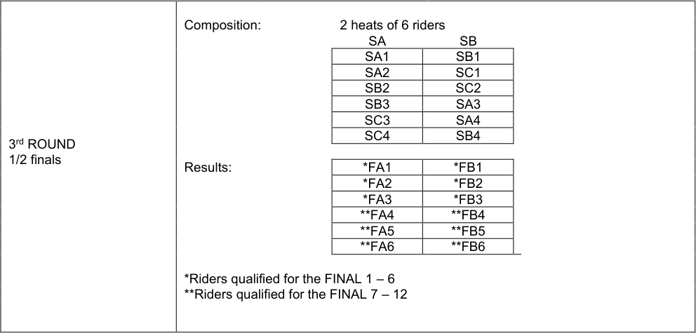

**UCI CYCLING REGULATIONS**

|SA|SB|
|---|---|
|SA1|SB1|
|SA2|SC1|
|SB2|SC2|
|SB3|SA3|
|SC3|SA4|
|SC4|SB4|

|*FA1|*FB1|
|---|---|
|*FA2|*FB2|
|*FA3|*FB3|
|**FA4|**FB4|
|**FA5|**FB5|
|**FA6|**FB6|

_(text modified on 01.01.02; 30.03.09; 19.06.09; 21.06.18; 04.03.19; 12.06.20,_
_01.01.26)_

**3.2.136** [abrogated on 01.01.02]

**3.2.137** The pacer shall ride within the sprinter line, starting at 30 kph and shall gradually
increase speed to 50 kph which should be reached at the latest when leaving the
track, after the pursuit line on the home straight, 3 laps to go (250 m tracks).

_(text modified on 01.01.02; 14.10.16)_

**Race procedure**
**3.2.138** The starting positions of the riders shall be determined by drawing lots. The riders
shall be placed side by side in that order on the pursuit line, the sprinters’ lane being
left free. The riders shall be held, but not pushed, by assistants.

**3.2.139** The start shall be given when the pacer approaches the pursuit line in the sprinters’
lane. At the start, riders shall take their positions determined by the draw, for at least
the first lap, failing which the race shall be stopped and riders that failed to comply
shall be disqualified. In the restart, the remaining riders shall again take their same
relative positions behind the pacer.

_(text modified on 01.01.02; 1.02.03; 19.06.09; 14.10.16; 01.01.26)_

**3.2.139** The riders shall remain immediately behind the pacer until such time as the pacer
**bis** leaves the track.

_(article introduced on 01.10.11)_

**3.2.140** In the case when one or more riders pass the leading edge of the front wheel of the
pacer before the pursuit line when he leaves the track, the race will be stopped and
rerun without the rider(s) at fault, which will be disqualified.

_(text modified on 01.01.02; 19.06.09; 14.10.16)_

E0126 TRACK RACES 33

**UCI CYCLING REGULATIONS**

_Figure 1_

_Figure 2_

_Figure 3_

E0126 TRACK RACES 34

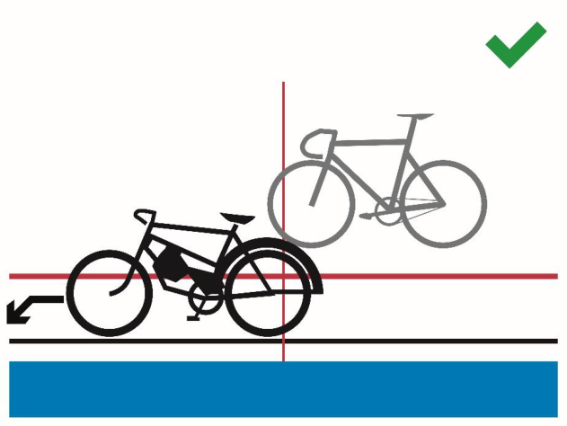

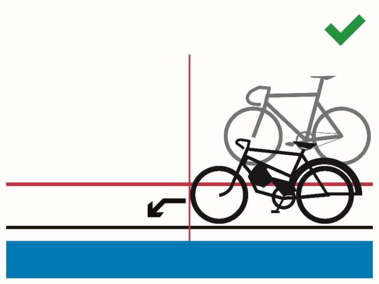

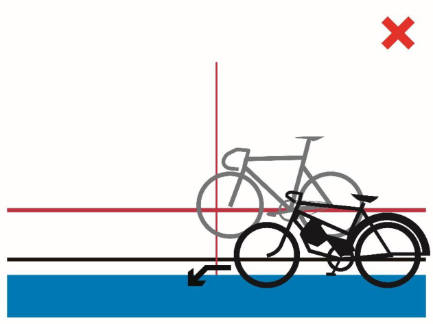
**UCI CYCLING REGULATIONS**

**3.2.141** The race shall be run according to the Sprint Regulations.

**3.2.142** The race will be stopped if one or more riders are at fault or behave in an unsporting
manner while being placed behind the derny. The race will be rerun without the
rider(s) at fault, which will be penalised depending on the gravity of the situation
(relegation with a warning, or disqualification).

_(text modified on 20.09.05; 19.06.09, 12.06.20)_

**3.2.143** A restart will take place immediately if a recognised mishap occurs within the first halflap. After the first half-lap no mishap will be taken into consideration.

_(text modified on 01.01.02; 20.09.05; 04.03.19; 01.01.26)_

**Race stoppages**
**3.2.143** In the case the event is stopped for any reason, and it is not possible to restart and
**bis** complete the event before the end of the competition, the commissaires’ panel shall
decide pursuant to the table below:

|DECISIONS|Col2|
|---|---|
|Interrupted before completion of the qualification round, 1/4 finals*, 1/2 finals*       *if applicable|Interrupted after completion of the qualification round, 1/4 finals*, 1/2 finals*, but before completion of the finals     *if applicable|
|No final classification. No results will be submitted and no UCI points will be awarded.|The last available position in the respective finals is attributed to the riders who qualified for the finals|

_(article introduced on 01.01.25)_

**§ 9** **Team Sprint**
_(text modified on 01.01.02)_

**Definition**
**3.2.144** The Team Sprint is a race with two opposing teams, each of whose riders shall lead
for one lap.

The event is run over three laps of a track by teams of three riders.

_(text modified on 01.01.02; 19.09.06; 12.06.20)_

**3.2.144** In the qualifying round, teams shall ride against the clock.
**bis** Depending on the number of entered teams, the commissaires’ panel may decide to
run qualifying rounds with two teams in each heat **.**

_(article introduced on 21.06.18)_

**Organisation of the event**
**3.2.145** This event shall be organised in three phases at World Cup, Continental
Championships, World Championships and Olympic Games:

E0126 TRACK RACES 35

**UCI CYCLING REGULATIONS**

1. The qualifying round to select the 8 best teams on the basis of their times;
2. In the first round, the 8 best teams shall be matched as follows:
The team having obtained the 4 [th] fastest time against the one having obtained
the 5 [th] fastest time
The team having obtained the 3 [rd] fastest time against the one having obtained
the 6 [th] fastest time
The team having obtained the 2 [nd] fastest time against the one having obtained
the 7 [th] fastest time
The team having obtained the fastest time against the one having obtained the
8 [th] fastest time.
3. The finals
The four winning teams from the first round shall dispute the finals. The teams
having made the two best times shall ride the final for first and second places
and the other two teams shall ride the final for third and fourth places.

Teams beaten during the first round shall be placed fifth to eighth according to their
times from the first round.

Should there be less than 8 teams taking part in the event, the event shall be run as
follows:

|7 teams|6 teams|5 teams|4 or less teams|
|---|---|---|---|
|Qualifying round|Qualifying round|Qualifying round|Qualifying round (no first round)|
|First round, based on the results of the qualifying round: a. 4th against 5th  b. 3rd against 6th  c. 2nd against 7th  d. 1st alone|First round, based on the results of the qualifying round: a. 4thagainst 6th  b. 3rd against 5th  c. 2nd alone d. 1st alone |First round, based on the results of the qualifying round: a. 4th against 5th  b. 3rd alone c. 2nd alone d. 1st alone|First round, based on the results of the qualifying round: a. 4th against 5th  b. 3rd alone c. 2nd alone d. 1st alone|
|Final: Winners of each heat of the first round (4 teams)|Final: Winners of each heat of the first round (4 teams)|Final: Winners of each heat of the first round (4 teams)|Final: 4 best teams of the qualifying round|

_(text modified on 01.01.02; 14.10.16, 01.08.23; 01.01.26)_

**3.2.146** _**At the Olympic Games only:**_
The four losing teams from the first round shall dispute the finals for 5 [th] to 8 [th] place.
The teams having made the 5 [th] and 6 [th] fastest time shall ride the final for 5 [th] and 6 [th]
and the other two teams shall ride the final for 7 [th] and 8 [th] .

_(article introduced on 26.06.07; modified on 14.10.16)_

**3.2.147** In case of a draw, the best time made during the last lap shall decide.

**3.2.148** If a team declares forfeit in a final, it shall not be replaced. The other team shall be
declared the winner.

E0126 TRACK RACES 36

**UCI CYCLING REGULATIONS**

If the reason for which that team did not ride is not accepted, the absent team shall
be disqualified.

_(text modified on 01.01.02)_

**3.2.148** If a team fails to take the start in the first round, no substitution shall be
**bis** made. The team failing to start shall be classified in 8 [th] place.

If several teams fail to start, they shall be classified in 8 [th] place and above in order of
their times in the qualifying round. If the reason for failing to ride is not accepted by
the commissaires’ panel, the absent team shall be disqualified, and its place shall
remain vacant. The team that takes the start must ride alone to set a time to determine
the composition of the finals.

_(article introduced on 01.10.11)_

**3.2.149** Teams shall be made up of riders entered for this event. The composition of a team
may be modified from one round to another. An incomplete team may not take the
start.

The team manager must notify the commissaires of any changes at least 30 minutes
before the relevant competition round start.

_(text modified on 01.01.02; 30.09.10, 01.08.23)_

**Preparation of the track**
**3.2.149** [abrogated on 01.08.23]
**bis**

**Race procedure**
**3.2.150** The start shall be taken in the middle of each straight. During the qualifying round, the
place of each team shall be determined by the commissaires. Subsequently, the team
having made the best time in the preceding stage of the event, shall start in front of
the main grandstand.

_(text modified on 01.08.23)_

**3.2.151** The riders of each team shall start side by side behind the start line. The lateral
distance between riders shall be 1.5 metres.

(N) The rider, placed on the inside of the track, shall be held by a starting block and
shall be the leading rider.
_(text modified on 01.01.02; 26.08.04; 10.06.05; 03.03.14)_

**3.2.152** The leading rider shall lead the first lap and move towards the outside of the track and
then drop back to leave the track without hindering the other team.

The rider that was in second position shall lead the following lap and then he shall
drop out in the same manner.

The third rider shall end the last lap alone.

_(text modified on 19.09.06; 04.03.19; 12.06.20)_

E0126 TRACK RACES 37

**UCI CYCLING REGULATIONS**

**3.2.153** At the completion of his lap, the leading edge of the leading rider’s front wheel must
cross the pursuit line ahead of the leading edge of the front wheel of the following
rider. Thereafter, the leading rider must draw aside immediately and ride above the
sprinter’s line no later than within 15 meters after the pursuit line.

Pushing between members of the same team is strictly forbidden.

If there is doubt that the above requirements have been met, a review of available
information is to be made. If confirmed, the team shall be relegated to the last place
in that stage of the event.

_(text modified on 01.01.02; 01.10.12; 14.10.16)_

E0126 TRACK RACES 38

**UCI CYCLING REGULATIONS**

**Race stoppages**
**3.2.153** In the case the event is stopped for any reason, and it is not possible to restart and
**bis** complete the event before the end of the competition, the commissaires’ panel shall
decide pursuant to the table below:

|DECISIONS|Col2|Col3|
|---|---|---|
|Interrupted before completion of the qualification round|Interrupted after completion of the qualification round, before completion of the First round|Interruption after the completion of the First round|
|No final classification. No results will be submitted and no UCI points will be awarded.|Classification according to the results from the qualification round|Riders qualified for the gold medal final will be awarded 2nd  place, and riders qualified for the bronze medal final will be awarded 4th place.   All other riders will be ranked according to the rules applicable for this event|

_(article introduced on 01.01.25)_

_Figure 1_

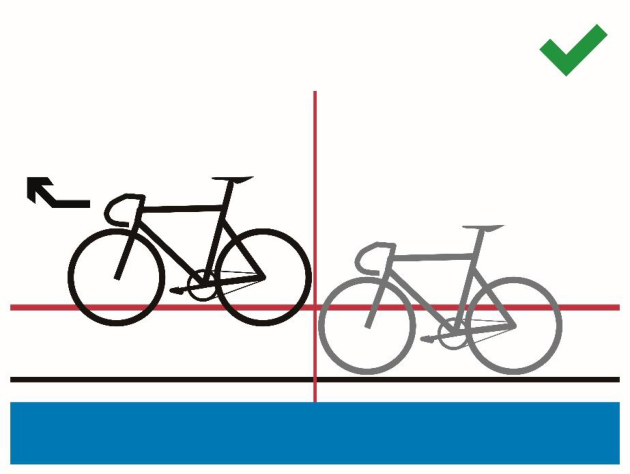

E0126 TRACK RACES 39

**UCI CYCLING REGULATIONS**

_Figure 2_

_Figure 3_

_Figure 4_

E0126 TRACK RACES 40

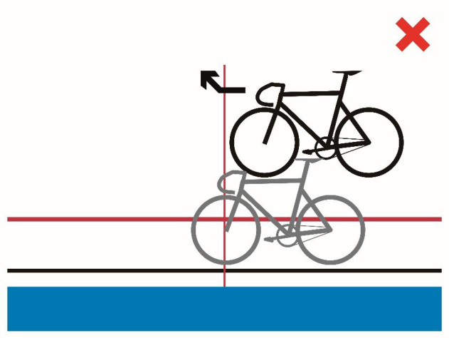

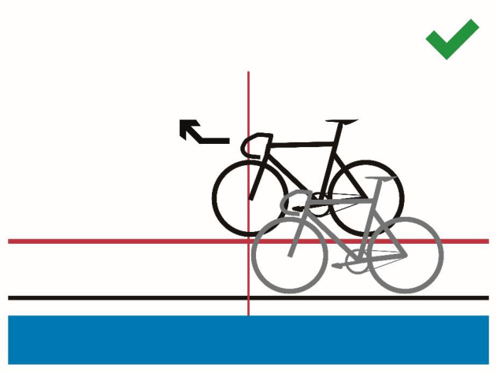

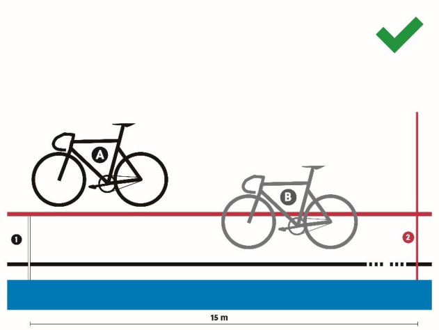
**UCI CYCLING REGULATIONS**

_Figure 5_

_Figure 6_

_Figure 7_

E0126 TRACK RACES 41

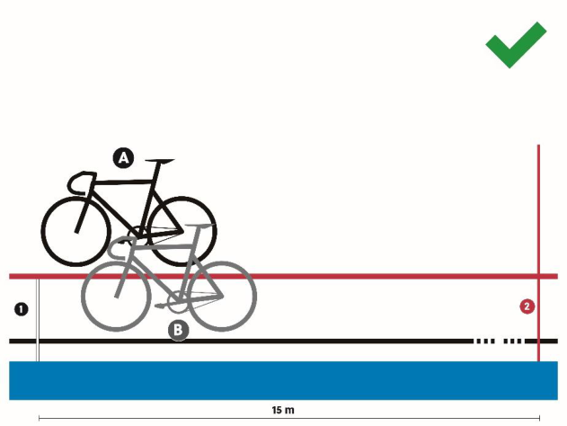

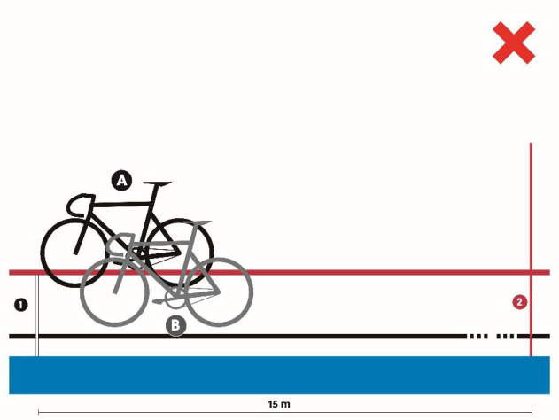

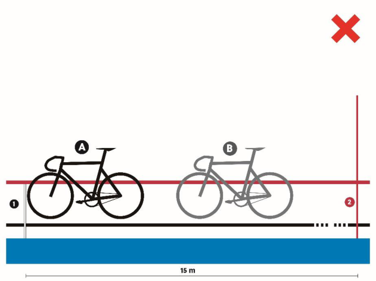
**UCI CYCLING REGULATIONS**

**Mishap**
(section subject to article 3.2.021ter)

**3.2.154** Qualifying round:
In the event of a recognised mishap, the team must restart at the end of the qualifying
round. Any team which may have been hindered by a mishap to its opponents may,
by decision of the commissaires' panel, be granted a restart at the end of the qualifying
round.

_(text modified on 01.01.02; 04.03.19, 01.08.23)_

**3.2.155** First round and finals:
In the event of a recognised mishap, the race shall be stopped and restarted
immediately.

After the first half-lap no mishap will be taken into consideration. In such a case, the
team must stop and will be:

         - relegated and placed last as per article 3.3.012 in the first round;

         - considered beaten in finals.

_(text modified on 01.01.02; 26.08.04; 26.06.07; 04.03.19; 12.06.20, 01.08.23)_

**§ 10** **Madison**

**Definition**
**3.2.156** The Madison Race is an event involving teams of 2 riders, in which the final placings
are determined according to the accumulated points won by teams during the sprints
and by taking laps.

_(text modified on 01.01.02; 14.10.16; 04.03.19; 01.10.19)_

**Organisation of the event**
**3.2.157** If the number of teams entered exceeds the track limit, qualifying heats shall take
place according to the tables below. The heats shall be run in such a way as to qualify
up to the track maximum number of teams, without necessarily qualifying the
maximum number of teams permitted. An equal number of teams shall be eliminated
from each heat, at a minimum of 2 teams per heat, among the teams who have started
the race.

The event shall be held over at least the following distances (number of laps), and
number of sprints as shown in the following table:

|TRACK LENGTH (in m)|Event|MEN ELITE|Col4|Col5|WOMEN ELITE|Col7|Col8|MEN JUNIOR|Col10|Col11|WOMEN JUNIOR|Col13|Col14|
|---|---|---|---|---|---|---|---|---|---|---|---|---|---|
|TRACK LENGTH (in m)|_Event_|_Distance_ _(km)_|_Laps_|_Sprint_|_Distance_ _(km)_|_Laps_|_Sprints_|_Distance_ _(km)_|_Laps_|_Sprints_|_Distance_ _(km)_|_Laps_|_Sprints_|
|166|Qualif|15|90|9|10|60|6|10|60|6|10|60|6|
|166|Final|30|180|18|20|120|12|20|120|12|15|90|9|
|200|Qualif|14|70|7|10|50|5|10|50|5|8|40|4|
|200|Final|30|150|15|20|100|10|20|100|10|16|80|8|
|250|Qualif|15|60|6|10|40|4|10|40|4|10|40|4|
|250|Final|30|120|12|20|80|8|20|80|8|15|60|6|

E0126 TRACK RACES 42

**UCI CYCLING REGULATIONS**

|285.714|Qualif|16|56|5|12|42|4|12|42|4|10|35|3|
|---|---|---|---|---|---|---|---|---|---|---|---|---|---|
|285.714|Final|30|105|10|20|70|7|20|70|7|16|56|5|
|333.33|Qualif|14|42|8|10|30|6|10|30|6|10|30|6|
|333.33|Final|30|90|18|20|60|12|20|60|12|16|48|9|
|400|Qualif|14|35|7|10|25|5|10|25|5|8|20|4|
|400|Final|30|75|15|20|50|10|20|50|10|16|40|8|

_At_ _World_ _Cup, Continental Championships, World Championships and Olympic_
_Games, the distances, number of laps and number of sprints shall be as shown in the_
_following table:_

|TRACK LENGTH (in m)|Event|MEN ELITE|Col4|Col5|WOMEN ELITE|Col7|Col8|MEN JUNIOR|Col10|Col11|WOMEN JUNIOR|Col13|Col14|
|---|---|---|---|---|---|---|---|---|---|---|---|---|---|
|TRACK LENGTH (in m)|_Event_|_Distance_ _(km)_|_Laps_|_Sprints_|_Distance_ _(km)_|_Laps_|_Sprints_|_Distance_ _(km)_|_Laps_|_Sprints_|_Distanc_ _e (km)_|_Laps_|_Sprints_|
|200|Qualif.|25|125|12|15|75|7|15|75|7|10|50|5|
|200|Final|50|250|25|30|150|15|30|150|15|20|100|10|
|250|Qualif.|25|100|10|15|60|6|15|60|6|10|40|4|
|250|Final|50|200|20|30|120|12|30|120|12|20|80|8|
|285.714|Qualif.|25.1|88|8|15.1|53|5|15.1|53|5|10|35|3|
|285.714|Final|50|175|17|30|105|10|30|105|10|20|70|7|
|333.33|Qualif.|25|75|15|14|42|8|14|42|8|10|30|6|
|333.33|Final|50|150|30|30|90|18|30|90|18|20|60|12|
|400|Qualif.|26|65|12|14|35|7|14|35|7|10|25|5|
|400|Final|50|125|25|30|75|15|30|75|15|20|50|10|

There shall be an equal number of laps between all sprints, starting from the final
sprint, according to the following:
Tracks of less than 333.33m – 10 laps
Tracks of 333.3m or more – 5 laps

In the case where the total number of laps is not divisible by the indicated number of
laps between sprints, the “additional” laps shall be ridden prior to the first sprint. (For
example, on a 285.7m track, sprints are held every 10 laps. If the race is 56 laps, the
first sprint will take place after 16 laps, and then every 10 laps thereafter).

_(text modified on 01.01.02; 30.03.09; 01.07.17; 04.03.19; 01.10.19; 17.10.22,_
_01.08.23; 01.01.25)_

**3.2.158** The two riders of each team shall carry the same rider number but of different colours.

**3.2.159** [article abrogated on 01.08.23]

**3.2.160** [article transferred to article 3.2.157 on 01.10.19]

**3.2.161** The first team in each intermediate sprint shall be awarded 5 points, the second 3
points, the third 2 points and the fourth one point. Points awarded in the last sprint
after the full distance will be doubled (10 points, 6 points, 4 points, 2 points).

In the case of a tie in the sprint, the teams shall be awarded the same position, with
the corresponding points for that position (for example, if two teams tie for first in a

E0126 TRACK RACES 43

**UCI CYCLING REGULATIONS**

points sprint, they will both score 5 points; there will not be a second place in this
case).

If a relay between two teammates takes place on the line during a sprint, the front
wheel of the second rider will count.

The relay is considered as passed, as soon as both riders are no longer in contact.

_(text modified on 01.01.02; 14.10.16; 12.06.20; 17.10.2022, 01.08.23)_

**3.2.162** Where there is a draw on ~~p~~ oints, the places in the final sprint shall decide.

Any team that gains a lap is awarded 20 points.

Any team that loses a lap is deducted 20 points.

_(text modified on 01.01.02; 26.08.04; 14.10.16; 01.10.19)_

**Race procedure**
**3.2.163** A first group of riders, formed of one rider of each team, take their places at the start
in the order listed on the start list. Half of this group shall be lined up along the outside
balustrade and the other half shall be lined up in the sprinters’ lane with holders.

A second group of riders, formed of the other riders of each team, shall be lined up
along the opposite outside balustrade.

A flying start shall be taken by the first group of riders after one neutralised lap. During
the neutralised lap, the second group of riders must remain motionless.

_(text modified on 01.01.02; 19.06.09; 04.03.19; 01.10.19)_

**3.2.164** Riders of a same team may relay one another at will by a touch of the hand or the
shorts.

**3.2.165** Sprints shall be run according to the Regulations governing Sprint.

**3.2.166** A rider who drops behind the bunch shall not assist chasing rider(s) to gain a lap on
the pain of disqualification of his team.

_(text modified on 01.01.02; 01.10.19)_

**3.2.167** When the bell is rung by the commissaire, the head of the race is defined and decisive
for the awarding of the sprint points. If at the moment of a sprint considered for
classification, if one or some rider(s) gain a lap, this/these rider(s) shall be awarded
20 points and the points awarded for the sprint.

_(text modified on 01.01.02; 01.10.19; 17.10.22, 01.08.23)_

**3.2.168** Teams lapped one or several times may be removed by the commissaires’ panel.

_(text modified on 01.01.02; 01.10.19)_

**Mishaps**
**3.2.169** Should one of the riders suffer a recognised mishap, his teammate shall immediately
take the team position in the race. There shall be no neutralisation.

E0126 TRACK RACES 44

**UCI CYCLING REGULATIONS**

_(text modified on 01.10.19)_

**3.2.170** [article transferred to article 3.2.020bis on 04.03.19]

**3.2.171** [article transferred to article 3.2.172 on 01.08.23]

**3.2.172** If the race is stopped for any reason, including if more than half the teams fall
(calculated on the basis of one rider per team), the commissaires’ panel shall
determine the duration of the interruption. If the race is restarted in the same session,
it shall be restarted as follows:

         - The teams will restart with their already accumulated points (or laps depending
on the type of race).

         - The number of laps remaining in the race shall be adjusted to indicate the
number following the previously held sprint (for example, if the previously held
sprint was on 40 laps remaining, and the race was stopped with 33 laps
remaining, the race shall be restarted with 39 laps remaining);

         - The restart will be held as for a normal Madison race start. No account shall
be taken of any team who were off the front or back of the main bunch at the
time the race was stopped. The racing riders shall start as a single group.

If it is not possible to restart the race in the same session, the commissaires’ panel
shall decide pursuant to the table below:

|DECISIONS|Col2|
|---|---|
|Race stopped before 40%|Complete rerun|
|Race stopped between 40-80%|Resume race with points accumulated/lost|
|Race stopped after 80%|Let results stand|

If less than 80% of the race is completed by the end of the competition, there will be
no final classification. No results will be submitted and no UCI points will be awarded.

_(text modified on 01.01.03; 14.10.16, 01.08.23, 01.01.25)_

**§ 11** **Scratch Race**

**Definition**
**3.2.173** The Scratch Race is an individual race over a specified distance.

_(text modified on 01.01.02)_

**Organisation of event**
**3.2.174** The races shall be held over the following distances:
Men Elite & Women Elite 10 km
Men Junior & Women Junior 7.5 km

_(text modified on 01.01.02, 01.01.25)_

**3.2.175** If the number or riders entered exceeds the track limit, qualifying heats shall take
place to reduce the number of riders according to the table below. The heats shall be
run in such a way as to qualify up to the track maximum number of riders, without

E0126 TRACK RACES 45

**UCI CYCLING REGULATIONS**

necessarily qualifying the maximum number of riders permitted. An equal number of
riders shall be eliminated from each heat, at a minimum of 2 riders per heat, among
the riders who have started the race.

|CATEGORY|DISTANCE TO RUN|
|---|---|
|MEN ELITE & WOMEN ELITE|7.5 km|
|MEN & WOMEN JUNIOR|5 km|

_(text modified on 01.01.02; 01.01.03; 12.06.20, 01.01.25)_

**Race procedure**
**3.2.176** Before the start, half of the riders shall be lined up along the railings, the other half
lining up in single file in the sprinter’s lane.

A flying start shall be taken after one neutralised lap.

_(text modified on 01.01.02)_

**3.2.177** Riders overtaken by the main bunch shall immediately leave the track.

**3.2.178** The final placings are determined during the final sprint, taking into account laps
gained.

_(text modified on 01.01.02; 01.01.03)_

**3.2.179** [abrogated on 01.01.02]

**3.2.180** [article transferred to article 3.2.002 on 04.03.19]

**3.2.181** [article transferred to article 3.2.017 on 04.03.19]

**Mishaps**
**3.2.182** Any rider not ending the race will not be placed.

_(text modified on 26.08.04; 20.09.05; 30.09.10; 04.03.19)_

**3.2.183** If the race is stopped for any reason, the commissaires’ panel shall determine the
duration of the interruption. If the race is restarted in the same competition session, it
shall be restarted as follows:

         - The riders will restart with their already gained or lost laps;

         - The number of laps remaining in the race shall be as at the time the race was
stopped (for example, if the race was stopped with 15 laps remaining, the race
shall be restarted with 15 laps remaining). If fewer than 10 laps were remaining
when the race was stopped, the number of laps remaining in the race shall be
adjusted to indicated 10 laps remaining (for example, if the race was stopped
with 4 laps remaining, the race shall be restarted with 10 laps remaining);

         - All riders will start together in a single group. In exceptional cases, the
commissaire’s panel may decide to allow riders who were more than a half lap
ahead of the declared main bunch to start a half lap ahead of the remaining
riders on the track.

If it is not possible to restart the race in the same competition session, the race shall
be completely rerun.

_(text modified on 01.08.23)_

E0126 TRACK RACES 46

**UCI CYCLING REGULATIONS**

**§ 12** **Tandem**

**Definition**
**3.2.184** The «tandem» speciality shall be a «sprint» event for tandems. It shall be run
according to the rules applicable to the «sprint» event, except as stipulated below.

**3.2.184** The start shall be taken from the Pursuit line in the finishing straight.
**bis**
_(article introduced on 01.08.23)_

**Organisation of the event**
**3.2.185** Each pair of riders shall be considered a single participant.

**3.2.186** The races shall be run as shown in the table in Article 3.2.050 according to the number
of participants and by calculating from the final.

Nevertheless, on tracks of 333.33 metres or less, a heat shall be ridden with a
maximum of three tandems.

**3.2.187** The qualifying heats shall be run over one lap with a flying start.

**3.2.188** The race shall be run over the distance of 3 laps.

_(text modified on 01.08.23)_

**§ 13** **Motor-Pacing**

**Definition**
**3.2.189** Motor-Pacing is a race in which each rider rides behind a motorcycle-mounted pacer.

**Motorcycles and pacers**
**3.2.190** The Federation of the organiser shall provide ten motorbikes (of which two in reserve)
complying with the description given in articles 3.6.007 to 3.6.028. The reserve
motorcycles shall be used by any pacer or pacers whose motorcycle breaks down.

**3.2.191** The commissaires shall check the motorcycles, if necessary, with the help of a
technician experienced in this type of work.

**3.2.192** The check shall take place at the time indicated by the commissaires’ panel before
each race.

**3.2.193** After having been checked, the motorcycles shall be deposited in a locked enclosure,
the keys of which shall be held by one of the commissaires. The motorcycles shall not
be entrusted to the pacers until they are about to go on track.

**3.2.194** Between two such checks, each pacer shall always use the same motorcycle.

**3.2.195** Pacers shall hold a licence. Pacers shall present a medical certificate to participate in
international competitions and shall not be aged older than 65 years old.

_(text modified on 04.03.19)_

E0126 TRACK RACES 47

**UCI CYCLING REGULATIONS**

**3.2.196** The Chief Commissaire shall designate two reserve pacers. These pacers,
throughout the races, shall stand by ready to start up the reserve motorbikes if one of
the machines in the race should break down.

**Organisation of the event**
**3.2.197** Pacing races may be held either over a set time (1 hour) or a set distance.

_(text modified on 04.03.19)_

**3.2.198** All the heats shall be run the same day.

**3.2.199** The commissaires shall make up a number of heats according to the number of riders
entered for the speciality.

There shall be at least two heats and each heat shall involve a maximum of 8 riders.

If there are two heats, the first three of each heat plus the fourth of the faster heat
shall qualify for the final.

If there are three heats, the first two of each heat plus the third of the fastest heat shall
qualify for the final.

If there are four or more heats, the winner of each heat plus the second of the fastest
heats shall qualify in such a way that there be seven riders in the final.

**3.2.200** [abrogated on 04.03.19]

**3.2.201** If a final is conducted in heats, the organiser shall set a rule how the general
classification will be established. If such a rule is missing, it is up to the commissaires’
panel to set the rule before the start of the races.

_(text modified on 04.03.19)_

**3.2.202** [abrogated on 04.03.19]

**Race procedure**
**3.2.203** [abrogated on 04.03.19]

**3.2.204** Riding outside the demarcation line, while being challenged, shall be forbidden.
Should a rider do so, his opponents may not pass him on the inside or they will be
disqualified.

_(text modified on 04.03.19)_

**3.2.205** A challenging rider may ride beyond the demarcation line only to come up on the right
of the rider he is challenging, but at all times leaving a maximum of space to allow
other riders to challenge also from the right.

**3.2.206** The position of riders at the start of each heat and the allocation of motorcycles shall
be determined by the drawing of lots on the track itself.

The starting position for the first heat of the final shall also be determined by drawing
lots on the track itself. The position at the start of the second heat shall be the reverse
of that in the first heat.

E0126 TRACK RACES 48

**UCI CYCLING REGULATIONS**

**3.2.207** Each rider shall have the same pacer throughout the entire competition.

**3.2.208** The pacers shall enter the track without the riders. On a signal from the starter, the
pacers, after a few laps to warm up, shall take up their positions at the start.

**3.2.209** The riders shall be lined up at the start in a set order.

**3.2.210** The start of the race shall be given by a pistol shot. After one lap, the riders shall have
fallen in behind their pacers.

**3.2.211** A bell shall indicate the last lap of the leading rider. The placing shall be determined
by the order in which the riders cross the finishing line and by the number of laps
covered, it being understood that, once the winner has crossed the finishing line, the
other riders shall cross it once only.
**3.2.212** [abrogated on 04.03.19]

**3.2.213** Once a rider has dropped a lap of behind the leading rider, he may no longer react to
an attack from another rider who is more than one lap ahead, on pain of being
eliminated from the race after a single warning.

_(text modified on 04.03.19)_

**3.2.214** Any rider falling more than 5 laps behind the leading rider shall be eliminated.

E0126 TRACK RACES 49

**UCI CYCLING REGULATIONS**

**3.2.215** Pacers committing the following faults shall be punished as follows

|Penalty|Flag|Degree|
|---|---|---|
|warning|green|A|
|fine of CHF 500|green and yellow|B|
|fine of CHF 750- and 15-days’ suspension|yellow|C|
|fine of CHF 1,000 and 1 to 3 months’ suspension|red|D|

|Infringement:|Col2|1st|2nd|3rd|4th|
|---|---|---|---|---|---|
|1)|Riding above the stayers’ line with an opponent at less than 10 meters|A|B|C|D|
|2)|Riding above the stayers’ line when being challenged|B|C|D||
|3)|Riding above the stayers’ line with an opponent along side|B|C|D||
|4)|Infringement (1), committed by a rider being overtaken|B|C|D||
|5)|Infringements (2) or (3), committed by a rider being overtaken|C|D|||
|6)|Crowding to the railing while being challenged by an opponent|B|C|D||
|7)|Crowding to the railing while being challenged by two opponents|C|D|||
|8)|Dropping back down with less than a 5 meter lead (cutting in)|C|D|||
|9)|Attempt to pass four abreast |D||||
|10)|Overtaking on the inside |D||||
|11)|Riding with only one hand on the handlebar |A|B|C|D|

**3.2.216** In the case of a motorcycle breakdown or recognised mishap before the riders join
their pacers, a false start shall be indicated, and the race shall be restarted.

Should the same thing happen after the riders have joined their pacers, a
neutralisation shall be granted for the number of laps closest to 1500 metres, save
during the last 1500 metres or the last minutes of time races, in which case the race
shall continue. The rider having suffered the mishap shall be placed in the position he
held at the time of the mishap, if the commissaires consider that his result was a
foregone conclusion. If that is not the case, he shall be placed last amongst riders
who have ridden the same numbers of laps at the moment of the mishap.

_(text modified on 04.03.19)_

**3.2.217** If the track becomes impracticable, the race shall be entirely restarted except if it is
stopped during the two last kilometres or, the two last minute in time races. In that
case, the riders shall be placed according to their positions when they last crossed
the finishing line.

_(text modified on 04.03.19)_

E0126 TRACK RACES 50

**UCI CYCLING REGULATIONS**

**§ 14** **Elimination Race**

**Definition**
**3.2.218** The Elimination Race is an individual race in which the last rider in each intermediate
sprint is eliminated.

**Organisation of the event**
**3.2.219** The organisation of the event shall be governed by the specific race regulations. If the
number of riders exceed the track limit, qualifying heats shall take place to reduce the
number of riders. All riders entered shall first participate in qualifying Scratch Race
heats run over the distance as per the regulations for Scratch Race heats. The heats
shall be run in such a way so as to qualify up to the track maximum number of riders,
without necessarily qualifying the maximum number of riders permitted. An equal
number of riders shall be eliminated from each heat, at a minimum of 2 riders per
heat, among the riders who have started the race.

All riders not qualifying to participate in the final of the Elimination Race shall be
placed jointly in last position. Any riders not finishing any of the qualifying rounds shall
not be placed (DNF).

_(text modified on 12.06.20, 01.08.23)_

**Race procedure**
**3.2.220** Before the start, half of the riders shall be lined up along the railings, the other half
lining up in single file in the sprinter’s lane.

_(text modified on 29.01.10)_

**3.2.221** A flying start shall be taken after one neutralised lap during which the riders shall ride
in a compact group at a moderate speed.

**3.2.222** A sprint shall be run every third lap on tracks of less than 200 metres, every second
lap on tracks of 200 metres to less than 333.33 metres, and every lap on tracks of
333.33 metres or more.

On tracks of less than 333.33 metres, each lap that precedes the sprint shall be
indicated by a bell.

(article modified on 01.10.19)

**3.2.223** After each sprint the last rider, according to the position of his rear wheel on the
finishing line, shall be eliminated.

If one or more riders are lapped or abandon the race between sprints, they shall be
the riders eliminated in the next sprint.

In certain cases, the commissaires may decide to eliminate a rider other than the last
rider in the sprint (for example, if a rider passes on the blue band). The president of
the commissaires’ panel shall be responsible for making the final decision on who will
be eliminated based on information from the judge-referee and other commissaires.

In all cases, the decision on which riders shall be eliminated must be made and
announced prior to the riders crossing the pursuit line on the back straight after the
elimination sprint. If no decision can be made by this time, then no riders shall be
eliminated until the next sprint. This shall be indicated by a green flag on the start line.

E0126 TRACK RACES 51

**UCI CYCLING REGULATIONS**

An eliminated rider shall leave the track immediately, failing which he shall be
penalised depending on the gravity of the situation (relegation with a warning, or
disqualification). In the case where the rider does not leave the track immediately, the
president of the commissaires’ panel may decide to neutralise the race in order to
remove the rider.

_(text modified on 18.06.10; 30.09.10; 01.10.11; 21.06.18; 12.06.20)_

**3.2.223** Riders eliminated shall be placed in inverse order according to the time of their
**bis** elimination (for example, the first rider eliminated is placed last, the second rider
eliminated is places second last, etc).

_(article introduced on 18.06.10)_

**3.2.224** The last two riders remaining in the race shall ride the final sprint. Their placing shall
be based on the position of their front wheels on the finishing line.

**3.2.225** The fact that a rider may gain a lap shall not count.

**3.2.226** In the case of a recognized mishap by one or more riders, as decided by the president
of the commissaires’ panel, the race shall immediately be neutralized for a maximum
distance of the number of laps closest to 1250 metres to allow the affected riders to
return to the bunch. In the case where all riders on the track suffer a recognized
mishap, the race shall be neutralized for a maximum of 3 minutes to allow the affected
riders to return to the race.

The neutralization shall be indicated by a yellow flag on the start line and all riders on
the track shall ride in a compact group at a moderate speed. No account shall be
taken of the position of any riders off the front or back of the bunch at the time of the
mishap.

The race shall be restarted, when affected riders are back on the track or when the
neutralisation is over, by the withdrawal of the yellow flag and the firing of the starter’s
pistol. Any riders not able to rejoin the race at this point shall be considered as
eliminated and their position determined according to the time of their elimination. The
bell shall be rung the following lap to indicate the start of a sprint lap.

Except in the case when all riders on the track suffer a recognized mishap, once four
or fewer riders remain on the track, no neutralization shall be granted, and any riders
not finishing shall be eliminated and their position determined according to the time of
their elimination.

_(text modified on 18.06.10; 30.09.10; 04.03.19; 12.06.20)_

**3.2.226** [article transferred to article 3.2.002 on 04.03.19]
**bis**

E0126 TRACK RACES 52

**UCI CYCLING REGULATIONS**

**§ 15** **Six-Day Races**

**3.2.227** [abrogated on 01.01.25]

**3.2.228** The organiser shall be free to set the duration and the programme of the “Six-Day
Race” within the limits set in the articles of this section.

_(text modified on 01.01.04; 01.01.25)_

**3.2.229** The “Six-Day Race” is a team race, each team comprising 2 or 3 riders who shall all
wear jerseys bearing identical riders’ number as indicated in article 1.3.044.

**3.2.230** A “Six-Day Race” shall be run on a track of minimum length 140 m.

**3.2.231** The organiser shall determine the number of teams according to the track length.

**3.2.232** At the start of Madisons/chases (handicap races excepted), the illuminated indicator
panel shall be set to zero (0) for all teams.

After the end of the Madisons/chases, the illuminated indicator panel shall again show
the actual general placings for the race.
On the last day of race, when the final Madisons/chases is being run, the illuminated
indicator panel shall indicate the actual general placings at all times.

_(text modified on 01.01.04)_

**3.2.233** [abrogated on 01.01.2004]

**3.2.234** Should a mechanical mishap occur and be recognised as valid by the commissaires,
or should a rider fall, the team shall be entitled to a of the number of laps closest to
1250 metres (5 laps on a 250m-track). In the case of a mishap not recognized by
commissaires or on expiry of the neutralisation, one of the team members shall
resume the race 100% from the position occupied at the moment of the mishap, failing
which the team shall be penalised by the number of laps lost.

_(text modified on 01.01.04; 04.03.19)_

**3.2.235** Laps gained by a team, one of whose members has been neutralised, shall be
recognised only if the rider who remained in the race covers the full distance, i.e. does
not miss a single relay.

**3.2.236** During a timed Madison/chase, a team reduced to a single rider shall leave the track
10 laps before the end of the Madison/chase.

_(text modified on 01.01.04)_

**3.2.237** The Track Manager, with the agreement of the Commissaires’ Panel, shall be entitled
to create a temporary team comprising riders whose teammates have been
neutralised. Such riders shall wear identical jerseys and numbers. To determine the
provisional position of such a provisional team, the number of laps covered by each
of the original teams from which the members of the provisional team were drawn
shall be added, rounded down to the nearest even number and divided by two.

E0126 TRACK RACES 53

**UCI CYCLING REGULATIONS**

When the provisional team is finally disbanded, laps gained or lost and any points
won shall be credited towards the general placings of the original teams from which
each of the members of the provisional team were drawn.

**3.2.238** If a rider is neutralised, his teammate shall continue the ongoing chase according to
the articles 3.2.235 and 3.2.236. If the neutralised rider is unable to continue the
following chase, all the team shall be neutralised.

After the chase, the neutralised team shall be placed in the same position as the
closest team in the general classification at the beginning of the race, including the
laps lost by this team during the chase. The gained laps shall not be considered.

Moreover, the neutralised team shall be penalised by one lap.

**3.2.239** The race doctor may decide to neutralise a rider for a maximum period lasting until
36 hours, after which the rider shall be eliminated.

_(text modified on 01.01.04)_

**3.2.240** Should a rider abandon the race, the team shall be disbanded. The remaining rider
shall participate in all the individual events.
If he has not been included in another team within 48 hours, he shall be eliminated.

**3.2.241** Should a new team be created, account shall be taken of the placing of the best team
disbanded plus one lap’s penalty.

The points won by the two teams will be added and divided by two.

**3.2.242** Points shall be awarded as follows:

           - Team event; Madison, Madison-Elimination, Team Time Trial (500-1000 m): 20,
12, 10, 8, 6, 4 points

           - Individual event; Points race, Elimination, Time Trial (1 lap), Derny, Scratch,
Keirin: 10, 6, 5, 4, 3, 2 points

           - Sprint: 5, 3, 2, 1 points; points double during the final Madison (maximum 6,
every 10 laps).

_(text modified on 10.06.05; 25.09.07)_

**3.2.243** As it is impossible to run all teams on track together for the same race, the event has
to be run in heats. The following procedure shall then apply:
a) 1 heat with teams from the 1 [st] half of the general classification: with 1 rider or
per team: 10-8-6-4-2 points.

           - per team (one relay in mid-race): 10, 8, 6, 4, 2 points

           - Madison: 15, 10, 8, 6, 4, 2 points
1 heat with teams from the 2 [nd] half of the general classification: with 1 rider or
per team: 10-8-6-4-2 points.

           - per team (one relay in mid-race): 10, 8, 6, 4, 2 points

           - Madison: 15, 10, 8, 6, 4, 2 points.
b) 2 heats with teams from the 1 [st] half of the general classification: with 1 rider: 54-3-2-1 points.
2 heats with teams from the 2 [nd] half of the general classification: with 1 rider: 54-3-2-1 points.

Laps won in races behind dernys do not count for the overall ranking.

E0126 TRACK RACES 54

**UCI CYCLING REGULATIONS**

_(text modified on 01.01.04)_

**3.2.244** In Madison/chase of the «Six-Day Race», the placing shall be determined by
distance according to the number of complete laps covered by each team plus by
accrued points.
Apart from the final Madison/chase of the «Six-Day Race», teams shall be credited
with one bonus lap for every 100 points logged.
Bonus laps can also be given in special events like time-trials, but only if all teams are
allowed to participate in the event.

_(text modified on 01.01.04; 01.07.17)_

**3.2.245** All points won in the individual and team events shall count towards the general
placings.

All laps won in races in which there is at least one rider of each team on track shall
count towards general classification.

Laps won in Elimination races do not count for the overall ranking.

_(text modified on 21.01.06)_
**3.2.246** Each day, in addition to the partial classification of the race or stage, a general
classification shall also be prepared on the basis of the number of laps completed and
points acquired.

The total distance covered over the six racing days, expressed in complete laps, and
the total number of points obtained shall determine the final classification.

The points classification shall be used to classify teams with the same number of laps.
The team with the greatest number of laps, regardless of the score obtained, shall be
declared the winner.

To distinguish team with equal laps and equal points, account shall be taken of the
finishing order of the teams in the final sprint.

**§ 16** **Omnium**
(chapter introduced on 07.07.06)

**Definition**
**3.2.247** The omnium is an event consisting of four races run with a maximum number of riders
set by the track limit (article 3.1.009) which shall be held over one day in the following
order:

1. Scratch
10 km for Men Elite & Women Elite
7.5 km for Men Junior & Women Junior

2. Tempo Race
10 km for Men Elite & Women Elite
7.5 km for Men Junior & Women Junior

3. Elimination

4. Points Race
25 km for Men Elite

E0126 TRACK RACES 55

**UCI CYCLING REGULATIONS**

20 km for Women Elite
20 km for Men Junior
15 km for Women Junior

_(text modified on 24.09.09; 29.03.10; 18.06.10; 01.02.11; 20.06.14; 14.10.16,_

_01.01.25)_

**3.2.247** In competitions for which the number or riders entered exceeds the track limit and
**bis** there is no existing qualification system to establish the number of participating riders,
their selection shall be determined as follows:

All riders entered shall first participate in Points Race qualifying heats run over the
distance and with the number of sprints, specified in the first table of the article
3.2.117, which applies to qualifying heats of international competitions, regardless of
the class of competition. The heats shall be run in such a way so as to qualify up to
the track maximum number of riders, without necessarily qualifying the maximum
number of riders permitted. An equal number of riders shall be eliminated from each
heat, at a minimum of 2 riders per heat, among the riders who have started the race.

All riders not qualifying to participate in the Omnium shall be placed jointly in last
position. Any riders not finishing any of the qualifying rounds for whatever reason shall
not be placed.

_(article introduced on 18.06.10, text modified on 01.08.23, 01.01.25, 01.01.26)_

**Organisation of the event**
**3.2.248** Whenever possible, there shall be an interval of at least 30 minutes between two
events.

**3.2.249** [abrogated on 01.01.26]

**3.2.249** For all the races, riders shall be lined up in single file along the railing and in the
**bis** sprinters lane in the order listed on the start list. For the Scratch Race, this order shall
be based on the latest UCI Endurance Ranking. For the Points Race, Elimination, and
Tempo Race, this order shall be based on the current intermediate Omnium
classification.

_(article introduced on 01.02.11; modified on 01.07.17; 01.10.17: 01.01.26)_

**Ranking**
**3.2.250** A full result shall be produced for the three events. For these three events, only, each
winner shall be awarded 40 points, each second place shall be awarded 38 points,
each third place shall be awarded 36 points, etc.

Riders ranked 21 [st] and below shall each be awarded 1 point.

_(text modified on 20.06.14; 14.10.16)_

**3.2.251** Prior to the start of the Points Race, a current ranking with the points totals shall be
drawn up, and riders will start the Points Race with these points accrued over the first
three events. Riders shall add to, and lose points from, their points totals based on
laps gained and lost, and points won in sprints, during the Points Race.

E0126 TRACK RACES 56

**UCI CYCLING REGULATIONS**

Final overall Omnium ranking shall evolve through the Points Race.

The winner of the Omnium shall be the rider who has obtained the highest total of
points.

_(text modified on 20.06.14; 14.10.16)_

**3.2.251** Any rider failing to start in one of the events or abandoning any of the events shall not
**bis** be allowed to continue in the Omnium and shall be recorded in the final classification,
in accordance with article 3.3.012.

In the case of the Scratch Race and the Tempo Race, a rider losing two laps shall be
withdrawn. That rider will be penalised with a deduction of 40 points in the
classification of the Omnium and will be allocated the next available rank determined
by the number of riders remaining on the track at this moment. If for any reason the
rider is not withdrawn, they will be classified as though they had been at the point at
which they lost their second lap (including the deduction of points).

_(text modified on 18.06.10; 01.02.11; 20.06.14; 15.03.16; 01.10.19; 12.06.20,_
_01.08.23, 01.01.26)_

**3.2.251** In the case of the Scratch Race, any rider not finishing the race due to a fall in the
**ter** final kilometre, or not being able to return to the track during the final kilometre, will
be allocated the next available ranking (and points) after the riders who finished the
race considering the laps taken and the number of riders remaining on the track at
this moment.

_(article introduced on 15.03.16; modified on 14.10.16; 01.07.17; 01.10.17; 12.06.20;_
_01.01.26)_

**3.2.252** In the event of a tie in the final ranking, the places in the final sprint of the last event,
the Points Race shall break the tie.

_(text modified on 20.06.14)_

**Race Stoppages**
**3.2.252** During the Omnium, in the case one of the races is stopped for any reason, and
**bis** the omnium can’t be completed before the end of the competition, the commissaires
shall decide as follow:

During the final Points Race, article 3.2.133 shall be applied. In the case where less
than 80% of the distance of the Points Race has been completed, but cannot be
restarted, the intermediate standings after the Elimination Race will become the final
classification of the Omnium.

If the track becomes impracticable after the Elimination Race has been completed,
but before the start of the final Points Race, the intermediate standings will become
the final classification of the omnium.

If the track becomes impracticable before the Elimination Race has been completed,
no final classification will be considered for the omnium. As a result, no results will be
submitted and no UCI points will be awarded for the Omnium.

_(article introduced on 01.01.25)_

E0126 TRACK RACES 57

**UCI CYCLING REGULATIONS**

**§ 17** **Flying Lap**
(chapter introduced on 29.01.10)

**Definition**
**3.2.253** The flying lap is a race against the clock with a flying start from the finish line.

_(text modified on 18.06.10; 01.07.12; 14.10.16)_

**Race Procedure**
**3.2.254** Riders shall take the start in the order determined by the commissaires.

**3.2.255** The rider shall enter the track as soon as he has been passed by the previous rider
who has triggered the timing device.

**3.2.256** The distance to accomplish including the momentum and the lap of the track is fixed
as follows, depending on the length of the track:
track of 250 metres or shorter: 3.5 laps
track of 285,714 metres: 3 laps
track of 333,33 metres: 2.5 laps
track of 400 metres or longer: 2 laps.

**3.2.257** In case of tie, riders will be ranked according to the best times in the last 200 metres.

**3.2.258** In case of a recognised mishap, the rider shall take a new start. Only one new start
per rider is permitted.

_(text modified on 01.08.23)_

**§ 18** **Tempo Race**
(chapter introduced on 14.10.16)

**Definition**
**3.2.259** The Tempo Race is an event in which the final placings are determined according to
accumulated points won by riders during the sprints and by taking laps.

**Organisation of the event**
**3.2.260** Except for the specific details (even implicit) in this sub-section, the rules of the Points
Race shall apply equally to the Tempo Race _._

The races shall be held over the following distances:
Men Elite & Women Elite 10 km
Men Junior & Women Junior 7.5 km

(article modified on 01.10.19, 01.01.25)

**3.2.261** After the first 4 laps, sprints shall be conducted every lap. After the completion of four
laps, the bell will be rung to indicate the start of the sprint laps.

**3.2.262** The first rider in each sprint shall be awarded 1 point, including for the final sprint.

Any rider that gains a lap is awarded 20 points.

Any rider that loses a lap is deducted 20 points.

E0126 TRACK RACES 58

**UCI CYCLING REGULATIONS**

_(text modified on 28.02.17; 05.04.17; 01.10.19)_

**Race Procedure**
**3.2.263** Before the start, half of the riders shall be lined up along the railings, the other
half lining up in single file in the sprinter’s lane.

**3.2.264** A flying start shall be taken after one neutralised lap during which the riders shall ride
in a compact group at a moderate speed.

**3.2.265** If the race is stopped for any reason, including if more than half the riders fall, the
commissaires’ panel shall determine the duration of the interruption. If the race is
restarted in the same session of the competition, it shall be restarted as follows:

         - The riders will restart with their already accumulated points;

         - The number of laps remaining in the race shall be adjusted by adding 5 laps
to the total being shown (for example, if the number of laps remaining was 11
when the race was stopped, the race shall be restarted with 16 laps
remaining). If there were 5 or fewer laps remaining when the race was
stopped, the race shall be restarted with 11 laps remaining;

         - The start will be held as for a normal Tempo Race. After the first 4 laps, sprint
shall be conducted every lap. After the completion of four laps, the bell will be
rung to indicate the start of the sprint laps.

         - All riders will start together in a single group. No account should be taken of
any riders who were off the front or back of the main bunch at the time the race
was stopped.

         - If it is not possible to restart the race in the same session, the race shall be
completely rerun.

_(article introduced on 01.08.23)_

E0126 TRACK RACES 59

**UCI CYCLING REGULATIONS**

### **Chapter III UCI TRACK RANKINGS**

(Chapter introduced on 31.05.04; modified on 15.03.16)

**3.3.001** The UCI has created an individual classification system for riders of elite and junior
categories participating in the races referred to in article 3.3.009.

Points won in competitions for the under 23 category will be integrated in the elite
classification.

This classification shall be called the “UCI Track Ranking” and shall be the exclusive
property of the UCI.

The UCI Track Ranking is composed of the following rankings:
UCI Nation Rankings

             - Endurance ranking

`o` includes the Omnium, Scratch Race, Points Race & Elimination Race

events

             - Sprint ranking

`o` includes the Sprint & Keirin events

             - Madison ranking

             - Team Pursuit ranking

             - Team Sprint ranking

UCI Individual Rankings

             - Endurance ranking

`o` includes the Omnium, Scratch Race, Points Race & Elimination Race

events

             - Sprint ranking

`o` includes the Sprint & Keirin events

             - Madison ranking

_(text modified on 25.09.07; 15.03.16; 01.01.25)_

**UCI Nation Ranking**
**3.3.002** A classification by nation for men and women, of elite and junior categories, is also
drawn up for each competition referred to in article 3.3.009 and shall be the exclusive
property of the UCI.

For team events (Madison excluded), points for the UCI Nation Ranking in a
competition are summed up to the following maximum quota, equal to the regular
number of riders composing the team.

MEN WOMEN
Team Pursuit: 4 Team Pursuit: 4
Team Sprint: 3 Team Sprint: 3

Once a nation has reached its maximum quota in an event, its riders over quota will
not receive any points.

For all events, the UCI Nation Ranking is calculated by summing the points in each
competition as follows:

             - when applicable, the best Olympic Games result in each of the events included
in the respective ranking.

E0126 TRACK RACES 60

**UCI CYCLING REGULATIONS**

           - the best World Championships result (as per the maximum number of riders by
nationality stipulated in article 9.2.022) in each of the events included in the
respective ranking.

           - the best Continental Championships result (as per the maximum number of
riders by nationality stipulated in article 10.1.005) in each of the events included
in the respective ranking.

           - the best World Cup result (as per the maximum number of riders by nationality
stipulated in article 3.4.007) in each of the events included in the respective
ranking.

           - the best 3 Class 1 results (including Regional Games) in each of the events
included in the respective ranking.

           - the best 3 Class 2 results (including Regional Games) in each of the events
included in the respective ranking.

           - the best National Championships result in each of the events included in the
respective ranking.

_(text modified on 30.09.10; 14.10.16; 05.03.18; 21.06.18; 12.06.20; 25.10.21,_
_01.08.23; 01.01.25, 01.01.26)_

**UCI Track Team Ranking**
**3.3.002** [abrogated on 01.01.25]

**bis**

**3.3.003** The classification shall be established according to the points obtained by riders
participating in Track competitions on the International calendar, divided into classes
according to article 3.8.003.

The classification is drawn up over a period of one year by adding the points won
since the preceding ranking was drawn up. At the same time, the remaining points
obtained up to the same day of the previous year by each rider in international track
cycling competitions are deducted.

If during the one-year period two national, continental or World Championships are
held in the same category, only the points of the most recent one will be taken into
account. Points of the national, continental and World championships remain on the
track classification until the next edition or for a maximum period of 18 months.

The UCI may grant dispensation in case of unpredictable late change of the Elite
World Championships dates.

_(text modified on 10.06.05; 25.09.08; 01.10.12; 14.10.16; 21.06.18; 04.03.19;_
_17.10.2022, 01.01.26)_

**3.3.004** The number of points to be won in each race is indicated in article 3.3.010.

For the competitions in class 2, only events matching the participation criteria might
award UCI points.

_(text modified on 25.02.13; 15.03.16; 17.10.2022)_

**3.3.005** UCI points will be awarded only once per event per competition.

For the competitions run as a tournament, UCI points will be awarded according to
the overall standings of the event. In the absence of overall standings, the event which

E0126 TRACK RACES 61

**UCI CYCLING REGULATIONS**

will award the UCI points shall be clearly identified on the programme of the
competition, failing that, the points will not be awarded.

_(text modified on 01.08.23)_

**3.3.006** All national federations shall immediately communicate any facts or decisions that
could result in an amendment to the points obtained by a rider.

Should such information not be transmitted, the Management Committee may
declassify the competition in question or exclude it from the Calendar, notwithstanding
any other penalties provided for in the Regulations.

_(text modified on 25.10.21, 01.08.23)_

**3.3.007** The Individual Ranking and the Nation Ranking shall be drawn up at least once a
week.

If need be, the classification of preceding weeks will be corrected.

_(text modified on 12.06.20, 01.08.23)_

**3.3.008** The UCI Management Committee may award prizes to riders, in accordance with such
criteria as it may establish and with their placing within the system of Ranking.

_(text modified on 01.01.21)_

**Classification of competitions**
**3.3.009** Olympic Games
UCI World Championships
UCI World Cup
Continental Championships
Class 1 & Class 2 competitions (including Regional Games)
National Championships

_(text modified au 25.02.13; 15.03.16; 25.10.21, 01.08.23, 01.01.26)_

**UCI** **Individual Ranking**
**3.3.010** Points are awarded according to the following scale, with only the best results of each
rider in each of the events included in the respective rankings taken into account as
follows:

           - when applicable, the Olympic Games result

           - the UCI World Championships result

           - the Continental Championships result

           - the best UCI World Cup result

           - the best 3 Class 1 results (including Regional Games)

           - the best 3 Class 2 results (including Regional Games)

           - the National Championships result

_(text modified on 12.06.20; 25.10.21, 01.08.23; 01.01.25, 01.01.26)_

E0126 TRACK RACES 62

**UCI CYCLING REGULATIONS**

|ELITE / JUNIOR Men and Women|Col2|Col3|Col4|Col5|
|---|---|---|---|---|
||Rank|World Championships Olympic Games*|World Cup*|Continental Championships|
|Omnium, Sprint, Keirin|1|1000|800|600|
|Omnium, Sprint, Keirin|2|900|720|540|
|Omnium, Sprint, Keirin|3|800|640|480|
|Omnium, Sprint, Keirin|4|750|600|450|
|Omnium, Sprint, Keirin|5|700|560|420|
|Omnium, Sprint, Keirin|6|650|520|390|
|Omnium, Sprint, Keirin|7|600|480|360|
|Omnium, Sprint, Keirin|8|550|440|330|
|Omnium, Sprint, Keirin|9|500|400|300|
|Omnium, Sprint, Keirin|10|450|360|270|
|Omnium, Sprint, Keirin|11|410|328|246|
|Omnium, Sprint, Keirin|12|380|304|228|
|Omnium, Sprint, Keirin|13|350|280|210|
|Omnium, Sprint, Keirin|14|320|256|192|
|Omnium, Sprint, Keirin|15|290|232|174|
|Omnium, Sprint, Keirin|16|260|208|156|
|Omnium, Sprint, Keirin|17|197|192|144|
|Omnium, Sprint, Keirin|18|181|176|132|
|Omnium, Sprint, Keirin|19|165|160|120|
|Omnium, Sprint, Keirin|20|149|144|108|
|Omnium, Sprint, Keirin|21|133|128|96|
|Omnium, Sprint, Keirin|22|117|112|84|
|Omnium, Sprint, Keirin|23|101|96|72|
|Omnium, Sprint, Keirin|24|85|80|60|
|Omnium, Sprint, Keirin|25 to X|1|1|1|

*Elite only

E0126 TRACK RACES 63

**UCI CYCLING REGULATIONS**

|ELITE / JUNIOR Men and Women|Col2|Col3|Col4|Col5|
|---|---|---|---|---|
||Rank|World Championships Olympic Games*|World Cup*|Continental Championships|
|Scratch Race, Elimination Race, Points Race|1|750|600|450|
|Scratch Race, Elimination Race, Points Race|2|675|540|405|
|Scratch Race, Elimination Race, Points Race|3|600|480|360|
|Scratch Race, Elimination Race, Points Race|4|560|450|335|
|Scratch Race, Elimination Race, Points Race|5|525|420|315|
|Scratch Race, Elimination Race, Points Race|6|487|390|292|
|Scratch Race, Elimination Race, Points Race|7|450|360|270|
|Scratch Race, Elimination Race, Points Race|8|410|330|248|
|Scratch Race, Elimination Race, Points Race|9|375|300|225|
|Scratch Race, Elimination Race, Points Race|10|335|270|205|
|Scratch Race, Elimination Race, Points Race|11|310|246|185|
|Scratch Race, Elimination Race, Points Race|12|285|228|171|
|Scratch Race, Elimination Race, Points Race|13|262|210|157|
|Scratch Race, Elimination Race, Points Race|14|240|192|144|
|Scratch Race, Elimination Race, Points Race|15|217|174|130|
|Scratch Race, Elimination Race, Points Race|16|195|156|117|
|Scratch Race, Elimination Race, Points Race|17|150|144|108|
|Scratch Race, Elimination Race, Points Race|18|135|132|99|
|Scratch Race, Elimination Race, Points Race|19|125|120|90|
|Scratch Race, Elimination Race, Points Race|20|112|108|81|
|Scratch Race, Elimination Race, Points Race|21|100|96|72|
|Scratch Race, Elimination Race, Points Race|22|87|84|63|
|Scratch Race, Elimination Race, Points Race|23|75|72|54|
|Scratch Race, Elimination Race, Points Race|24|65|60|45|
|Scratch Race, Elimination Race, Points Race|25 to X|1|1|1|

*Elite only

E0126 TRACK RACES 64

**UCI CYCLING REGULATIONS**

|ELITE / JUNIOR Men and Women|Col2|Col3|Col4|Col5|
|---|---|---|---|---|
||Rank|World Championships Olympic Games*|World Cup*|Continental Championships|
|Madison|1|2000 (2 x 1000)|1600 (2 x 800)|1200 (2 x 600)|
|Madison|2|1800 (2 x 900)|1440 (2 x 720)|1080 (2 x 540)|
|Madison|3|1600 (2 x 800)|1280 (2 x 640)|960 (2 x 480)|
|Madison|4|1500 (2 x 750)|1200 (2 x 600)|900 (2 x 450)|
|Madison|5|1400 (2 x 700)|1120 (2 x 560)|840 (2 x 420)|
|Madison|6|1300 (2 x 650)|1040 (2 x 520)|780 (2 x 390)|
|Madison|7|1200 (2 x 600)|960 (2 x 480)|720 (2 x 360)|
|Madison|8|1100 (2 x 550)|880 (2 x 440)|660 (2 x 330)|
|Madison|9|1000 (2 x 500)|800 (2 x 400)|600 (2 x 300)|
|Madison|10|900 (2 x 450)|720 (2 x 360)|540 (2 x 270)|
|Madison|11|820 (2 x 410)|656 (2 x 328)|492 (2 x 246)|
|Madison|12|760 (2 x 380)|608 (2 x 304)|456 (2 x 228)|
|Madison|13|570 (2 x 285)|560 (2 x 280)|420 (2 x 210)|
|Madison|14|522 (2 x 261)|512 (2 x 256)|384 (2 x 192)|
|Madison|15|474 (2 x 237)|464 (2 x 232)|348 (2 x 174)|
|Madison|16|426 (2 x 213)|416 (2 x 208)|312 (2 x 156)|
|Madison|17|394 (2 x 197)|384 (2 x 192)|288 (2 x 144)|
|Madison|18|362 (2 x 181)|352 (2 x 176)|264 (2 x 132)|
|Madison|19 to X|2 (2 x 1)|2 (2 x 1)|2 (2 x 1)|

*Elite only

E0126 TRACK RACES 65

**UCI CYCLING REGULATIONS**

|ELITE / JUNIOR Men and Women|Col2|Col3|Col4|Col5|
|---|---|---|---|---|
||Rank|World Championships Olympic Games*|World Cup*|Continental Championships|
|Team Pursuit|1|2000 (4 x 500)|1600 (4 x 400)|1200 (4 x 300)|
|Team Pursuit|2|1800 (4 x 450)|1440 (4 x 360)|1080 (4 x 270)|
|Team Pursuit|3|1600 (4 x 400)|1280 (4 x 320)|960 (4 x 240)|
|Team Pursuit|4|1500 (4 x 375)|1200 (4 x 300)|900 (4 x 225)|
|Team Pursuit|5|1400 (4 x 350)|1120 (4 x 280)|840 (4 x 210)|
|Team Pursuit|6|1300 (4 x 325)|1040 (4 x 260)|780 (4 x 195)|
|Team Pursuit|7|1200 (4 x 300)|960 (4 x 240)|720 (4 x 180)|
|Team Pursuit|8|1100 (4 x 275)|880 (4 x 220)|660 (4 x 165)|
|Team Pursuit|9|1000 (4 x 250)|800 (4 x 200)|600 (4 x 150)|
|Team Pursuit|10|900 (4 x 225)|720 (4 x 180)|540 (4 x 135)|
|Team Pursuit|11|820 (4 x 205)|656 (4 x 164)|492 (4 x 123)|
|Team Pursuit|12|760 (4 x 190)|608 (4 x 152)|456 (4 x 114)|
|Team Pursuit|13|700 (4 x 175)|560 (4 x 140)|420 (4 x 105)|
|Team Pursuit|14|640 (4 x 160)|512 (4 x 128)|384 (4 x 96)|
|Team Pursuit|15|580 (4 x 145)|464 (4 x 116)|348 (4 x 87)|
|Team Pursuit|16|520 (4 x 130)|416 (4 x 104)|312 (4 x 78)|
|Team Pursuit|17|404 (4 x 101)|384 (4 x 96)|288 (4 x 72)|
|Team Pursuit|18|372 (4 x 93)|352 (4 x 88)|264 (4 x 66)|
|Team Pursuit|19|340 (4 x 85)|320 (4 x 80)|240 (4 x 60)|
|Team Pursuit|20|308 (4 x 77)|288 (4 x 72)|216 (4 x 54)|
|Team Pursuit|21|276 (4 x 69)|256 (4 x 64)|192 (4 x 48)|
|Team Pursuit|22|244 (4 x 61)|224 (4 x 56)|168 (4 x 42)|
|Team Pursuit|23|212 (4 x 53)|192 (4 x 48)|144 (4 x 36)|
|Team Pursuit|24|180 (4 x 45)|160 (4 x 40)|120 (4 x 30)|
|Team Pursuit|25 to X|2 (4 x 0.5)|2 (4 x 0,5)|2 (4 x 0,5)|

*Elite only

E0126 TRACK RACES 66

**UCI CYCLING REGULATIONS**

|ELITE / JUNIOR Men and Women|Col2|Col3|Col4|Col5|
|---|---|---|---|---|
||Rank|World Championships Olympic Games*|World  Cup*|Continental Championships|
|Team Sprint|1|1500 (3 x 500)|1200 (3 x 400)|900 (3 x 300)|
|Team Sprint|2|1350 (3 x 450)|1080 (3 x 360)|810 (3 x 270)|
|Team Sprint|3|1200 (3 x 400)|960 (3 x 320)|720 (3 x 240)|
|Team Sprint|4|1125 (3 x 375)|900 (3 x 300)|675 (3 x 225)|
|Team Sprint|5|1050 (3 x 350)|840 (3 x 280)|630 (3 x 210)|
|Team Sprint|6|975 (3 x 325)|780 (3 x 260)|585 (3 x 195)|
|Team Sprint|7|900 (3 x 300)|720 (3 x 240)|540 (3 x 180)|
|Team Sprint|8|825 (3 x 275)|660 (3 x 220)|495 (3 x 165)|
|Team Sprint|9|750 (3 x 250)|600 (3 x 200)|450 (3 x 150)|
|Team Sprint|10|675 (3 x 225)|540 (3 x 180)|405 (3 x 135)|
|Team Sprint|11|615 (3 x 205)|492 (3 x 164)|369 (3 x 123)|
|Team Sprint|12|570 (3 x 190)|456 (3 x 152)|342 (3 x 114)|
|Team Sprint|13|525 (3 x 175)|420 (3 x 140)|315 (3 x 105)|
|Team Sprint|14|480 (3 x 160)|384 (3 x 128)|288 (3 x 96)|
|Team Sprint|15|435 (3 x 145)|348 (3 x 116)|261 (3 x 87)|
|Team Sprint|16|390 (3 x 130)|312 (3 x 104)|234 (3 x 78)|
|Team Sprint|17|303 (3 x 101)|288 (3 x 96)|216 (3 x 72)|
|Team Sprint|18|279 (3 x 93)|264 (3 x 88)|198 (3 x 66)|
|Team Sprint|19|255 (3 x 85)|240 (3 x 80)|180 (3 x 60)|
|Team Sprint|20|231 (3 x 77)|216 (3 x 72)|162 (3 x 54)|
|Team Sprint|21|207 (3 x 69)|192 (3 x 64)|144 (3 x 48)|
|Team Sprint|22|183 (3 x 61)|168 (3 x 56)|126 (3 x 42)|
|Team Sprint|23|159 (3 x 53)|144 (3 x 48)|108 (3 x 36)|
|Team Sprint|24|135 (3 x 45)|120 (3 x 40)|90 (3 x 30)|
|Team Sprint|25 to X|1.5 (3 x 0.5)|1.5 (3 x 0.5)|1.5 (3 x 0.5)|

*Elite only

E0126 TRACK RACES 67

**UCI CYCLING REGULATIONS**

|ELITE / JUNIOR Men and Women|Col2|Col3|Col4|
|---|---|---|---|
||Rank|Class 1|Class 2 National Championships|
|Omnium, Sprint, Keirin|1|200|100|
|Omnium, Sprint, Keirin|2|180|90|
|Omnium, Sprint, Keirin|3|160|80|
|Omnium, Sprint, Keirin|4|150|75|
|Omnium, Sprint, Keirin|5|140|70|
|Omnium, Sprint, Keirin|6|130|65|
|Omnium, Sprint, Keirin|7|120|60|
|Omnium, Sprint, Keirin|8|110|55|
|Omnium, Sprint, Keirin|9|100|50|
|Omnium, Sprint, Keirin|10|90|45|
|Omnium, Sprint, Keirin|11|82|41|
|Omnium, Sprint, Keirin|12|76|38|
|Omnium, Sprint, Keirin|13|70|35|
|Omnium, Sprint, Keirin|14|64|32|
|Omnium, Sprint, Keirin|15|58|29|
|Omnium, Sprint, Keirin|16|52|26|
|Omnium, Sprint, Keirin|17|48|24|
|Omnium, Sprint, Keirin|18|44|22|
|Omnium, Sprint, Keirin|19|40|20|
|Omnium, Sprint, Keirin|20|36|18|
|Omnium, Sprint, Keirin|21|32|16|
|Omnium, Sprint, Keirin|22|28|14|
|Omnium, Sprint, Keirin|23|24|12|
|Omnium, Sprint, Keirin|24|20|10|
|Omnium, Sprint, Keirin|25 to X|1|1|

E0126 TRACK RACES 68

**UCI CYCLING REGULATIONS**

|ELITE / JUNIOR Men and Women|Col2|Col3|Col4|
|---|---|---|---|
||Rank|Class 1|Class 2 National Championships|
|Scratch Race, Elimination Race, Points Race|1|150|75|
|Scratch Race, Elimination Race, Points Race|2|135|68|
|Scratch Race, Elimination Race, Points Race|3|120|60|
|Scratch Race, Elimination Race, Points Race|4|112|56|
|Scratch Race, Elimination Race, Points Race|5|105|52|
|Scratch Race, Elimination Race, Points Race|6|98|49|
|Scratch Race, Elimination Race, Points Race|7|90|45|
|Scratch Race, Elimination Race, Points Race|8|82|41|
|Scratch Race, Elimination Race, Points Race|9|75|37|
|Scratch Race, Elimination Race, Points Race|10|68|34|
|Scratch Race, Elimination Race, Points Race|11|62|31|
|Scratch Race, Elimination Race, Points Race|12|57|28|
|Scratch Race, Elimination Race, Points Race|13|52|26|
|Scratch Race, Elimination Race, Points Race|14|48|24|
|Scratch Race, Elimination Race, Points Race|15|44|22|
|Scratch Race, Elimination Race, Points Race|16|39|20|
|Scratch Race, Elimination Race, Points Race|17|36|18|
|Scratch Race, Elimination Race, Points Race|18|33|16|
|Scratch Race, Elimination Race, Points Race|19|30|15|
|Scratch Race, Elimination Race, Points Race|20|27|14|
|Scratch Race, Elimination Race, Points Race|21|24|12|
|Scratch Race, Elimination Race, Points Race|22|21|10|
|Scratch Race, Elimination Race, Points Race|23|18|9|
|Scratch Race, Elimination Race, Points Race|24|15|8|
|Scratch Race, Elimination Race, Points Race|25 to X|1|1|

E0126 TRACK RACES 69

**UCI CYCLING REGULATIONS**

|ELITE / JUNIOR Men and Women|Col2|Col3|Col4|
|---|---|---|---|
||Rank|Class 1|Class 2 National Championships|
|Madison|1|400 (2 x 200)|200 (2 x 100)|
|Madison|2|360 (2 x 180)|180 (2 x 90)|
|Madison|3|320 (2 x 160)|160 (2 x 80)|
|Madison|4|300 (2 x 150)|150 (2 x 75)|
|Madison|5|280 (2 x 140)|140 (2 x 70)|
|Madison|6|260 (2 x 130)|130 (2 x 65)|
|Madison|7|240 (2 x 120)|120 (2 x 60)|
|Madison|8|220 (2 x 110)|110 (2 x 55)|
|Madison|9|200 (2 x 100)|100 (2 x 50)|
|Madison|10|180 (2 x 90)|90 (2 x 45)|
|Madison|11|164 (2 x 82)|82 (2 x 41)|
|Madison|12|152 (2 x 76)|76 (2 x 38)|
|Madison|13|140 (2 x 70)|70 (2 x 35)|
|Madison|14|128 (2 x 64)|64 (2 x 32)|
|Madison|15|116 (2 x 58)|58 (2 x 29)|
|Madison|16|104 (2 x 52)|52 (2 x 26)|
|Madison|17|96 (2 x 48)|48 (2 x 24)|
|Madison|18|88 (2 x 44)|44 (2 x 22)|
|Madison|19 to X|2 (2 x 1)|2 (2 x 1)|

E0126 TRACK RACES 70

**UCI CYCLING REGULATIONS**

|ELITE / JUNIOR Men and Women|Col2|Col3|Col4|
|---|---|---|---|
||Rank|Class 1|Class 2 National Championships|
|Team Pursuit|1|400 (4 x 100)|200 (4 x 50)|
|Team Pursuit|2|360 (4 x 90)|180 (4 x 45)|
|Team Pursuit|3|320 (4 x 80)|160 (4 x 40)|
|Team Pursuit|4|300 (4 x 75)|150 (4 x 37,5)|
|Team Pursuit|5|280 (4 x 70)|140 (4 x 35)|
|Team Pursuit|6|260 (4 x 65)|130 (4 x 32,5)|
|Team Pursuit|7|240 (4 x 60)|120 (4 x 30)|
|Team Pursuit|8|220 (4 x 55)|110 (4 x 27,5)|
|Team Pursuit|9|200 (4 x 50)|100 (4 x 25)|
|Team Pursuit|10|180 (4 x 45)|90 (4 x 22,5)|
|Team Pursuit|11|164 (4 x 41)|82 (4 x 20,5)|
|Team Pursuit|12|152 (4 x 38)|76 (4 x 19)|
|Team Pursuit|13|140 (4 x 35)|70 (4 x 17,5)|
|Team Pursuit|14|128 (4 x 32)|64 (4 x 16)|
|Team Pursuit|15|116 (4 x 29)|58 (4 x 14,5)|
|Team Pursuit|16|104 (4 x 26)|52 (4 x 13)|
|Team Pursuit|17|96 (4 x 24)|48 (4 x 12)|
|Team Pursuit|18|88 (4 x 22)|44 (4 x 11)|
|Team Pursuit|19|80 (4 x 20)|40 (4 x 10)|
|Team Pursuit|20|72 (4 x 18)|36 (4 x 9)|
|Team Pursuit|21|64 (4 x 16)|32 (4 x 8)|
|Team Pursuit|22|56 (4 x 14)|28 (4 x 7)|
|Team Pursuit|23|48 (4 x 12)|24 (4 x 6)|
|Team Pursuit|24|40 (4 x 10)|20 (4 x 5)|
|Team Pursuit|25 to X|2 (4 x 0.5)|2 (4 x 0.5)|

E0126 TRACK RACES 71

**UCI CYCLING REGULATIONS**

|ELITE / JUNIOR Men and Women|Col2|Col3|Col4|
|---|---|---|---|
||Rank|Class 1|Class 2 National Championships|
|Team Sprint|1|300 (3 x 100)|150 (3 x 50)|
|Team Sprint|2|270 (3 x 90)|135 (3 x 45)|
|Team Sprint|3|240 (3 x 80)|120 (3 x 40)|
|Team Sprint|4|225 (3 x 75)|112,5 (3 x 37,5)|
|Team Sprint|5|210 (3 x 70)|105 (3 x 35)|
|Team Sprint|6|195 (3 x 65)|97,5 (3 x 32,5)|
|Team Sprint|7|180 (3 x 60)|90 (3 x 30)|
|Team Sprint|8|165 (3 x 55)|82,5 (3 x 27,5)|
|Team Sprint|9|150 (3 x 50)|75 (3 x 25)|
|Team Sprint|10|135 (3 x 45)|67,5 (3 x 22,5)|
|Team Sprint|11|123 (3 x 41)|61,5 (3 x 20,5)|
|Team Sprint|12|114 (3 x 38)|57 (3 x 19)|
|Team Sprint|13|105 (3 x 35)|52,5 (3 x 17,5)|
|Team Sprint|14|96 (3 x 32)|48 (3 x 16)|
|Team Sprint|15|87 (3 x 29)|43,5 (3 x 14,5)|
|Team Sprint|16|78 (3 x 26)|39 (3 x 13)|
|Team Sprint|17|72 (3 x 24)|36 (3 x 12)|
|Team Sprint|18|66 (3 x 22)|33 (3 x 11)|
|Team Sprint|19|60 (3 x 20)|30 (3 x 10)|
|Team Sprint|20|54 (3 x 18)|27 (3 x 9)|
|Team Sprint|21|48 (3 x 16)|24 (3 x 8)|
|Team Sprint|22|42 (3 x 14)|21 (3 x 7)|
|Team Sprint|23|36 (3 x 12)|18 (3 x 6)|
|Team Sprint|24|30 (3 x 10)|15 (3 x 5)|
|Team Sprint|25 to X|1.5 (3 x 0.5)|1.5 (3 x 0.5)|

_(text modified on 10.06.05; 19.09.06; 25.09.07; 13.06.08, 29.03.10; 1.07.12; 1.02.13; 10.04.13;_
_15.03.16; 14.10.16; 01.07.17; 05.03.18; 21.06.18, 12.06.20; 17.10.2022, 01.01.25)_

**Regional Games**
**3.3.010** Regional games will be considered Class 1 or Class 2 competitions in accordance
**bis** with the number of national federations participating:
5 nations and more: Class 1;
3 to 4 nations: Class 2;
1 to 2 nations: no points.

Points will only be awarded to the Regional Games registered on the UCI International
Track Calendar.

When a nation is represented by several regional teams, the points will be awarded
to the best rider(s) of this nation up to the maximum number of participants permitted
for teams by the specific regulation of each event.

_(text modified on 04.03.19, 01.08.23)_

E0126 TRACK RACES 72

**UCI CYCLING REGULATIONS**

**National championships**
**3.3.010** The points for the national championships are those awarded to an international
**ter** competition of Class 2.

Points will only be awarded to the national championships registered beforehand and
appearing on the UCI Track Calendar. The results must reach the UCI electronically
after the competition is finished on the specified deadline for calculating quota for the
various competitions, or the deadline for submission of results to DataRide, whichever
is sooner. Results submitted after this deadline will not be considered.

When two or three nations are organising joint national championships, each nation
must register their championships on the UCI Track Calendar in order to consider
results distinctively for the purposes of awarding points.

Where elite and under 23 men compete in the national championships in the same
event, points are awarded according to their position in the classification of the event.

For national federations organizing a separate event for the under-23 category, the
points are awarded as for the corresponding elite event.

Any rider can claim the award of points in only one category by event, where
applicable, his own.

Where the title of national champion for an event is awarded at an international
competition, the riders, regardless of their nationality, shall be awarded the points
relative to their position in the classification of that event.

_(text modified on 04.03.19; 01.10.19)_

**3.3.010** [abrogated on 01.01.26]
**quarter**

**3.3.011** The order of precedence between riders or nations on equal points in the respective
rankings shall be determined according to their classification of competitions in the
following order:

1. UCI World Championships;
2. UCI World Cup;
3. Continental Championships;
4. International competition of Class 1;
5. International competition of Class 2;
6. National Championships.

If they still stand equal, precedence shall be awarded to the rider with the best
classification in the most recent event of the same class of competitions.

In a combined ranking, the tiebreaker shall be determined by comparing the best
result, regardless of the event, following the same order.

_(text modified on 13.06.08; 25.02.13; 15.03.16; 12.06.20; 25.10.21, 01.01.26)_

E0126 TRACK RACES 73

**UCI CYCLING REGULATIONS**

**3.3.012  Ranking for classification**

Riders who are classified as finishers according to the specific UCI Regulations, will be
ranked, and will score UCI points, according to those specific regulations.

Unless otherwise provided for in a specific provision of the UCI Regulations, riders who
do not start, or who do not finish any of the events will have this indicated in their results,
and will score UCI points, according to the following, based on the event type:
The reason for not finishing will be indicated by one of the following result mark ~~:~~
DNS – Did Not Start: the rider did not come to the start line and did not start the race.
DNF – Did Not Finish: the rider started the race but did not finish the race due to one of
the following reasons: recognised mishap, withdrawn by the commissaires, withdrawn
by the race doctor
ABD – Abandon: the rider started the race but did not finish the race due to one of the
following reasons: unrecognised mishap or not finishing the race by their own decision.
DSQ – Disqualified: the rider may or may not have started the race but was removed
from the classification by the commissaires due to the breach or application of an article
of the UCI Regulations.

**A. Bunch Events**
Riders who do not finish qualifying heats will be designated with one of the following
depending on the reason for them not finishing: Did Not Finish (DNF); Abandon (ABD)
Did Not Start (DNS); Disqualified (DSQ). These riders shall not progress to the next
round of the event.

The final classification of the event shall be drawn up in groups in the following order:
1. All riders competing in the final and finishing (based on the UCI Regulations) will be
ranked and will score UCI points according to the UCI Regulations.
2. All riders competing in the final and not finishing due to having been withdrawn by the
commissaires (indicated as DNF) or suffering a mishap (indicated as DNF) will be given
a tied ranking for the next available position after the riders in group 1 and will score the
UCI points for that position.
3. In the case where qualifying heats were held, all riders competing in the final and not
finishing due to abandoning the race (indicated as ABD) will be given a tied ranking of
the last available position in the race, and will score the UCI points for that position. In
all other cases (when qualifying heats are not organised), all riders competing in the final
and not finishing due to abandoning the race (indicated as ABD) will not be assigned a
rank, and score no UCI points.
4. All riders qualified for the final through qualifying heats, but not starting (indicated as
DNS) will be given a tied ranking for the next available rank after group 3, and will score
the UCI points for that position.
5. All riders qualified for the final but disqualified (indicated as DSQ) will not be assigned
a rank, and will score no UCI points.
6. All riders competing in the qualifying heats, and finishing, but not qualifying for the
final will be given a tied ranking for the next available rank after group 4, and will score
the UCI points for that position.
7. All riders not finishing the qualifying heats, for whatever reason (grouped first as DNF,
ABD, then DNS, then DSQ) will not be assigned a rank, and will score no UCI points.

**B. Keirin**
Other than for riders who do not start, or who are disqualified, any riders who do not
finish any of the rounds are ranked in the last place for the heat in which they were
competing. They may proceed to the next round of the event, according to the UCI
Regulations.

E0126 TRACK RACES 74

**UCI CYCLING REGULATIONS**

When creating the final classification of the event, no rider can be moved up into a
position for which he was not competing. Some positions may therefore be left vacant.

The final classification of the event shall be drawn up in groups in the following order:
1. Riders competing in the major final and finishing (based on the UCI Regulations) will
be ranked and will score UCI points according to the UCI Regulations.
2. All riders competing in the major final and not finishing due to suffering a mishap
(indicated as DNF) will be given a tied ranking for the next available position after the
riders in group 1 and will score the UCI points for that position.
3. All riders qualifying for the major final but not starting (indicated as DNS) will be given
a tied ranking for the last available position in their race and will score the UCI points for
that position.
4. All riders competing in the major final and having been disqualified (indicated as DSQ)
will not be assigned a rank, and will score no UCI points. Any ranking positions that would
have been occupied by these riders will remain vacant.
5. Riders competing in the minor final will be classified and ranked next, according to
the same principles applicable to groups 1 to 4 above.

For each round of the event, other than those in groups 1 to 5, riders who do not qualify
for the following round will be ranked as follows, with the riders taking part in the later
rounds ranking higher than the riders taking part in the earlier rounds:
6. All riders finishing will be ranked according to the finish order in each of the heats and
will score the equivalent UCI points.
7. All riders not finishing (indicated as DNF) will be ranked tied in the next available rank
for that round of the event, taking into account riders who may have finished ahead of
them in other heats, and will score the equivalent UCI points.
8. All riders not starting (indicated as DNS) will be ranked tied in the last available rank
for that round of the event and will score the equivalent UCI points, other than for the first
round where riders not starting will not be assigned a rank, and will score no UCI points.
9. All riders competing and having been disqualified (indicated as DSQ) will not be
assigned a rank, and will score no UCI points. Any ranking positions that would have
been occupied by these riders will remain empty, taking into account riders who may
have received a ranking in equivalent heats.

**C. Sprint**
Riders who do not finish the qualifying 200m time trial will be designated with one of the
following according to the reason for them not finishing: Did Not Finish (DNF); Did Not
Start (DNS); Disqualified (DSQ). These riders shall be grouped first as DNF, then DNS,
then DSQ. They shall not progress to the Sprint event.

Other than where there is a specific provision in the UCI Regulations, riders having
started but not finished their heat (indicated as DNF), except for the case of DSQ, shall
be considered to have lost their heat. Any such rider will be ranked according to the UCI
Regulations as if they had lost their heat in a regular manner and will score the equivalent
UCI points.

Any riders not starting a heat (indicated as DNS), other than for disqualification, will be
considered to have lost their heat. In any round of the competition run over the best of 3
heats, any riders not starting will be considered to have lost that round of the event. Any
such riders will be ranked according to the UCI Regulations as if they had lost their heat
in a regular manner and will score the equivalent UCI points.

All riders being disqualified (indicated as DSQ), will not be assigned a rank, and will score
no UCI points. Any ranking positions that would have been occupied by these riders will
remain empty.

E0126 TRACK RACES 75

**UCI CYCLING REGULATIONS**

**D. 1kmTime Trial**
Riders who do not finish the qualifying round will be designated with one of the following
according to the reason for them not finishing: Did Not Finish (DNF); Did Not Start (DNS);
Disqualified (DSQ). These riders shall not progress to the next round of the event.

The final classification of the event shall be drawn up in groups in the following order:
1. All riders competing in the final and finishing (based on the UCI Regulations) will be
ranked and will score UCI points according to the UCI Regulations.
2. All riders competing in the final and not finishing for whatever reason (indicated as
DNF), other than for disqualification, will be given a tied ranking for the next available
position after the riders in group 1 and will score the UCI points for that position.
3. All riders qualifying for the final but not starting (indicated as DNS) will be given a tied
ranking for the last available position in the final round and will score the UCI points for
that position.
4. All riders qualifying for the final but having been disqualified (indicated as DSQ) will
not be assigned a rank, and will score no UCI points. Any ranking positions that would
have been occupied by these riders will remain vacant.
5. All riders competing in the qualifying round, and finishing, but not qualifying, will be
ranked with the next available rankings after group 3 and will score the equivalent UCI
points.
6. All riders not finishing the qualifying heats, for whatever reason (grouped first as DNF,
then DNS, then DSQ) will not be assigned a rank, and will score no UCI points.

**E. Team Pursuit**
Teams that do not finish the qualifying round will be designated with one of the following
according to the reason for them not finishing: Did Not Finish (DNF); Did Not Start (DNS);
Disqualified (DSQ). These teams shall not progress to the next round of the event.

In the final classification, teams shall be ranked according to the regulations of the event.

The final classification of the event shall be drawn up in groups as follows:
1. For all teams competing in the final round, any teams not starting (indicated as DNS),
or not finishing (indicated as DNF) for any reason, will be considered to have lost their
heat. These teams shall be ranked according to the UCI Regulations as if they had lost
their heat and will score the equivalent UCI points. Any disqualified team (indicated as
DSQ) will not be assigned a rank, and will score no UCI points. Any ranking positions
that would have been occupied by these teams will remain vacant.
2. In the case of a first round, all teams competing and finishing in this round, but not
advancing to the final, other than in the case of disqualification, will be classified
according to their times from this round.
3. In the case of a first round, all teams competing and not starting (indicated as DNS)
or not finishing (indicated as DNF) in this round, shall be ranked after group 2 according
to the UCI Regulations, and will score the equivalent UCI points.
4. In the case of a first round, any teams having been disqualified (indicated as DSQ)
will not be assigned a rank, and will score no UCI points. Any ranking positions that would
have been occupied by these teams will remain empty.
5. All teams competing in the qualifying round, and finishing, but not qualifying, will be
ranked with the next available rankings after group 4, or 1 as applicable, and will score
the equivalent UCI points.
6. All teams not finishing the qualifying round, either because of a recognised mishap,
or because of not being allowed to restart (indicated as DNF), will not be assigned a
rank, and will score no UCI points.
7. All teams not starting the qualifying round (indicated as DNS) will not be assigned a
rank, and will score no UCI points.

E0126 TRACK RACES 76

**UCI CYCLING REGULATIONS**

8. All teams competing in the qualifying round and having been disqualified (indicated
as DSQ) will not be assigned a rank, and will score no UCI points.

**F.** **Individual Pursuit**
Riders who do not finish the qualifying round will be designated with one of the following
according to the reason for them not finishing: Did Not Finish (DNF); Did Not Start (DNS);
Disqualified (DSQ). These riders shall not progress to the next round of the event.

The final classification of the event shall be drawn up in groups as follows:
1. For all riders competing in the final round, any riders not starting (indicated as DNS),
or not finishing (indicated as DNF) for any reason, will be considered to have lost their
heat. These riders shall be ranked according to the UCI Regulations as if they had lost
their heat, and will score the equivalent UCI points. Any riders having been disqualified
(indicated as DSQ) will not be assigned a rank, and will score no UCI points. Any ranking
positions that would have been occupied by these riders will remain empty.
2. All riders competing in the qualifying round, and finishing, but not qualifying, will be
ranked with the next available rankings after group 1 and will score the equivalent UCI
points.
3. All riders not finishing the qualifying round, either because of a recognised mishap, or
because of not being allowed to restart (indicated as DNF) will not be assigned a rank,
and will score no UCI points.
4. All riders not starting the qualifying round (indicated as DNS) will not be assigned a
rank, and will score no UCI points.
5. All riders competing in the qualifying round and having been disqualified (indicated as
DSQ) will not be assigned a rank, and will score no UCI points.

**G. Team Sprint**
Teams who do not finish the qualifying round will be designated with one of the following
according to the reason for them not finishing: Did Not Finish (DNF); Did Not Start (DNS);
Disqualified (DSQ). These teams shall not progress to the next round of the event.

The final classification of the event shall be drawn up in groups as follows:
1. For all teams competing in the final round, not starting (indicated as DNS), or not
finishing (indicated as DNF) for any reason, will be considered to have lost their heat.
These teams shall be ranked according to the UCI Regulations as if they had lost their
heat, and will score the equivalent UCI points. Any teams having been disqualified
(indicated as DSQ) will not be assigned a rank, and will score no UCI points. Any ranking
positions that would have been occupied by these teams will remain empty.
2. In the case of a first round, all teams competing and finishing in this round, but not
advancing to the final, other than in the case of disqualification, will be classified
according to their times from this round.
3. In the case of a first round, all teams competing and not starting (indicated as DNS)
or not finishing (indicated as DNF) in this round, shall be ranked after group 2 according
to their times from the Qualification Round, and will score the equivalent UCI points.
4. In the case of a first round, any teams having been disqualified (indicated as DSQ)
will not be assigned a rank, and will score no UCI points. Any ranking positions that would
have been occupied by these teams will remain empty.
5. All teams competing in the qualifying round, and finishing, but not qualifying for the
first round will be ranked according to their times with the next available rankings after
group 4, or 1 as applicable, and will score the equivalent UCI points.
6. All teams not finishing the qualifying round, either because of a recognised mishap,
or because of not being allowed to restart (indicated as DNF) will not be assigned a rank,
and will score no points.
7. All teams not starting the qualifying round (indicated as DNS) will not be assigned a
rank, and will score no UCI points.

E0126 TRACK RACES 77

**UCI CYCLING REGULATIONS**

8. All teams competing in the qualifying round and having been disqualified (indicated as
DSQ) will not be assigned a rank, and will score no UCI points.

_(article introduced on 01.10.19, text modified on 01.08.23, 01.01.25)_

E0126 TRACK RACES 78

**UCI CYCLING REGULATIONS**

### **Chapter IV UCI TRACK WORLD CUP**

**3.4.001** The UCI has created a “Track World Cup”, comprising a general classification by
nation based on a number of competitions designated each year by the UCI
Management Committee.

_(text modified on 12.06.20, 01.08.23)_

**3.4.002** The Track World Cup shall be the exclusive property of the UCI.

**3.4.003** World Cup events shall be selected from those of the World Championships
hereunder:

MEN WOMEN
1) 1 km TT, standing start 1)1 km TT, standing start
2) Sprint 2) Sprint
3) Individual pursuit, 4 km 3) Individual pursuit, 4 km
4) Team pursuit, 4 km 4) Team Pursuit, 4 km
5) Keirin 5) Keirin
6) Team sprint 6) Team sprint
7) Points race, 40 km 7) Points race, 25 km
8) Madison, 50 km 8) Madison, 30 km
9) Scratch race, 10 km 9) Scratch race, 10 km
10) Omnium 10) Omnium
11) Elimination 11) Elimination

_(text modified on 01.01.02; 01.01.03; 19.09.06; 25.09.07; 29.03.10; 18.06.10;_
_25.02.13; 14.10.16; 01.10.19; 12.06.20, 01.01.2025)_

**Participation**
**3.4.004** The competitions shall be for national teams. Riders shall be aged 18 (2 [nd] year juniors)
and over.

The participation in the individual events shall be restricted to riders with at least 500
points in the respective UCI Track Ranking. Top 4 Junior riders at the most recent
Junior World Championships in the bunch events, Sprint or Keirin events can
participate in the UCI Track World Cup without the minimum points required, provided
they are 2 [nd] year juniors.

For the Madison, participation shall be restricted to riders with at least 250 points in
the respective UCI Track Ranking, or for riders who were in the top 4 teams in the
Madison at the most recent Junior World Championships, provided they are 2 [nd] year
juniors.

To be eligible, each rider must have the minimum amount of points required either six
weeks before the first round of the World Cup, or in the latest update of the respective
UCI Track Ranking.

For the development of track cycling, the UCI may grant dispensation of this
requirement. Any request for dispensation much reach the UCI before the end of the
registration period of each round.

The participation in each event of the World Cup determines the eligibility of the
national federations to the corresponding event of the World Championships
according to article 9.2.027bis.

E0126 TRACK RACES 79

**UCI CYCLING REGULATIONS**

_(text modified on 01.01.03; 21.01.06; 25.02.13; 10.04.13; 20.06.14; 15.03.16;_
_01.07.17; 05.03.18; 12.06.20; 25.10.21; 17.10.22; 01.01.25, 01.01.26)_

**3.4.004** [abrogated on 01.01.25]
**bis**

**3.4.005** Enrolment shall be open to UCI-affiliated national federations (as per article 3.4.004).

_(text modified on 25.09.07; 01.10.12; 01.02.13; 10.04.13; 15.03.16; 14.10.16;_
_21.06.18; 12.06.20, 01.08.23; 01.01.25)_

**3.4.006** [abrogated on 15.03.16].

**3.4.007** The maximum number of participants by national team for each event shall be the
following:

MEN WOMEN
Team Sprint 2 teams Team Sprint 2 teams
Sprint 2 riders Sprint 2 riders
Keirin 2 riders Keirin 2 riders
1 km Time Trial 2 riders 1 km Time Trial 2 riders
Team pursuit 2 teams Team pursuit 2 teams
Individual pursuit 2 riders Individual Pursuit 2 riders
Points race 1 rider Points race 1 rider
Scratch race 1 rider Scratch race 1 rider
Omnium 1 rider Omnium 1 rider
Elimination 1 rider Elimination 1 rider
Madison 1 team Madison 1 team

A maximum of one substitute rider for each event is permitted. Substitute riders must
be confirmed at the confirmation of starters as per article 3.4.009. Team Managers
may forward modifications to the secretary of the college of commissaires until the
start of the first competition session on the day of each event.

For the sake of clarity, in team events, only the best ranked team of the same
nationality will score points as per article 3.3.002.

_(text modified on 01.01.02; 01.01.03; 26.08.04; 19.09.06; 25.09.07; 29.03.10;_
_18.06.10; 25.02.13; 10.04.13; 14.10.16; 12.06.20, 01.01.25)_

E0126 TRACK RACES 80

**UCI CYCLING REGULATIONS**

**3.4.007** [abrogated on 01.01.25]
**bis**

**3.4.007** [abrogated on 12.06.20]
**ter**

**3.4.008** [abrogated on 15.03.16].

**3.4.009** The names of riders, substitutes and attendants shall reach the organiser by 3 weeks
before the date of the competition at the latest. In case of late entry after the
prescribed deadline, a late registration fee of CHF 200 per team will be perceived.

In case of non-attendance of entered riders at the competition, a penalty of CHF 300.per rider may be imposed.

The names of the riders taking part must be announced to the commissaires’ panel
by noon at the latest on the eve of the first race of the competition as per the published
times and instructions. Any announcement made out of the time limit shall be liable to
a fine of CHF 300.-.

Attendance to the Team Manager’s meeting is compulsory. Attendance is defined as
presence from the roll call at the start of the meeting until the meeting concludes.

_(text modified on 26.08.04; 30.09.10; 04.03.19; 01.10.19; 12.06.20; 17.10.2022)_

**3.4.009** [abrogated on 01.07.17]
**bis**

**Organisation**
**3.4.010** Organisers of World Cup races shall sign a contract with the UCI governing, notably,
the radio and TV broadcasting rights, marketing rights and the material organisation
of the races.

**3.4.011** [abrogated on 15.03.16].

**3.4.012** [abrogated on 15.03.16].

**3.4.013** The commissaires’ panel shall comprise UCI international commissaires appointed
by the UCI as per article 1.2.116.

The organising National Federation shall designate all other commissaires that may
be necessary for the efficient control of the races, as well as timekeepers as per article
1.2.116.

_(text modified on 01.01.02; 15.03.16)_

**3.4.014** The UCI shall appoint a Technical Delegate.

_(text modified on 01.01.02)_

**3.4.015** [abrogated on 01.08.23]

**3.4.016** A meeting shall be convened before the first event of the competition. It shall be
attended by all the officials and the Team Leaders. It shall be chaired by the president

E0126 TRACK RACES 81

**UCI CYCLING REGULATIONS**

of the commissaires’ panel in the presence of the UCI Technical Delegate and the
persons responsible for the organisation.

_(text modified on 21.06.18, 01.08.23)_

**Prizes**
**3.4.017** The scale of prizes for the individual classification by event will be established
annually by the UCI Management Committee in the financial obligations.

_(text modified on 01.01.02)_

**3.4.018** [abrogated on 01.01.02]

**3.4.019** [abrogated on 15.03.16].

**3.4.020** The three first in each event shall receive from the organiser, respectively, a gold
medal (1 [st] place), a silver medal (2 [nd] place) and a bronze medal (3 [rd] place).

_(text modified on 12.06.20)_

**UCI Rankings**
**3.4.021** On completion of each event in each competition, riders shall be awarded the number
of points as per the corresponding scale of article 3.3.010.

_(text modified on 01.01.02; 25.02.13; 12.06.20; 01.01.25)_

**UCI Track World Cup Standings**
**3.4.021** At the end of each competition, the order of precedence between riders drawing in
**bis** the general standings shall be determined according to the greatest number of 1 [st]
places, then 2 [nd] places, etc. considering only the placings for which points are
awarded.

If they still stand equal, precedence shall be awarded to the rider with the best
classification in the most recent event.

_(article introduced on 01.10.04; modified on 12.06.20)_

**3.4.022** The general standings of the competition by nation shall be determined by adding the
points obtained by the riders of each team in each event.

In case of a tie on points, the number of first places shall be taken into account, then
the number of second places, and so on.

_(text modified on 01.01.02; 15.03.16; 12.06.20)_

**3.4.023** The total points obtained by each nation in each competition shall serve, after the last
competition of the season, to establish the final general standings by nation.

_(text modified on 12.06.20)_

**3.4.024** [abrogated on 12.06.20]

**3.4.025** [abrogated on 15.03.16]

E0126 TRACK RACES 82

**UCI CYCLING REGULATIONS**

### **Chapter V WORLD RECORDS**

**General comments**
**3.5.001** The UCI shall recognise solely World Track Records in the following categories and
specialities:

Flying start:
All categories: 200 m and 500 m.

Standing start:
Men: Team Sprint (on 250m track only), 1 km, 4 km, 4 km team, hour record
Women: Team Sprint (on 250m track only), 1 km, 4 km, 4 km team, hour record
Junior Men: Team Sprint (on 250m track only), 1 km, 3 km, 4 km team
Junior Women: Team Sprint (on 250m track only), 1km, 3 km, 4 km team

For Masters, Best Performances are covered under Chapter IX MASTERS.

_(text modified on 01.01.02; 10.06.05, 24.09.09; 30.09.10; 01.01.25)_

**3.5.002** The World Record is the exclusive property of the UCI.

The UCI is the exclusive holder of all audio-visual, marketing and other rights relating
to any attempt to set a world or any other record. The UCI may surrender those rights
on any conditions that it may determine.

_(text modified on 01.01.02)_

**3.5.003** Only the UCI may recognise and confirm a world record.

_(text modified on 01.01.02)_

**3.5.004** The UCI shall keep an up-to-date list of the World Records and Olympic records which
it shall publish regularly.

_(text modified on 05.03.18, 01.08.23)_

**3.5.005** Records may be set during a competition or during a special attempt that shall also
be ridden in accordance with the relevant UCI regulations.

Any special attempt requires the prior written authorization of the UCI. In this regard
such authorization is subject to the requirements determined by the UCI including, but
not limited to, requirements related to the UCI Anti-Doping Rules. Riders making a
special attempt must be included in the UCI Registered Testing Pool and provide
accurate and up-to-date whereabouts information and must be subjected to doping
controls collected and analysed in accordance with Athlete Biological Passport
programme as implemented by the UCI. If the rider is not in the Registered Testing
Pool or does not have any Athlete Biological Passport, all the associated costs for
testing the rider or any extra controls shall be borne by the rider.

Moreover, a special attempt must be authorized in writing in advance by the national
federation of the rider(s). This authorization must reach the UCI no later than four
months prior to the attempt.

Specific World Record attempts shall not take place during the World Championships
competitions other than for the hour record.

E0126 TRACK RACES 83

**UCI CYCLING REGULATIONS**

Each application for the Hour record attempt must state a specific time and a single
date for that attempt. For the other World Record special attempts, the organiser
(rider, national federation, team, or other) must identify a time window of maximum 2
hours in which the attempt must take place. The rider may make more than one
attempt for the record provided that the attempts start within the declared 2 hours
window. In the event of a recognised mishap, the attempt may be rescheduled for the
day after the fixed date, following the same principle.

If the organiser wishes to alter the date or time after receiving UCI authorisation, it is
imperative that all relevant parties be duly notified by the organiser, particularly with
regards to the facilities, timekeeping, commissaires and doping control. Furthermore,
the organiser shall submit a formal request for authorisation to the UCI, accompanied
by a statement confirming that all necessary measures have been taken to ensure full
compliance with the applicable provisions.

_(text modified on 01.01.02; 15.05.14; 1.02.15; 01.10.19, 01.01.25, 01.01.26)_

**3.5.006** The public and the Press shall be able to attend World Record attempts for their full
duration.

The number of spectators and Press personnel may be limited in the interest of
sporting performance, subject to prior UCI agreement.

**3.5.007** For record attempts outside competition, the rider or the team shall take the track
alone.

_(text modified on 01.01.02)_

**3.5.008** Records must be set on a UCI-approved track.

Only bicycles admitted by the Track Race Regulations may be used.

A starting block shall be used in all specialities with a standing start, including the hour
record.

**3.5.009** If the record attempt takes place in a country other than that of the National Federation
of the rider, both Federations shall reach a written agreement which shall ensure that
the attempt may be made under the best possible circumstances, especially with
regard to policing services, timekeeping, commissaires and the drug test. A copy of
this agreement must be provided to the UCI no later than four months prior to the
attempt.

_(text modified on 01.01.02; 01.10.19)_

**3.5.010** Any costs incurred by the attempt shall be met by the rider (including the travel and
accommodation costs of the international commissaire and the Doping Control
Officer, the laboratory costs and other UCI expenses).

If the attempt takes place in some other country, the National Federation of that
country shall be entitled to be reimbursed any expenses it may have had to incur.

The rider’s National Federation shall be held jointly liable for paying costs incurred by
the attempt.

E0126 TRACK RACES 84

**UCI CYCLING REGULATIONS**

**Time-keeping**
**3.5.011** Record attempts shall be electronically timed lap by lap to the nearest thousandth of
a second.

**3.5.012** Electronic time-keeping of hour record attempts must be accompanied by a system
of manual time-keeping. That time-keeping shall be conducted by two timekeepers
approved by the National Federation of the country where the attempt takes place.

**3.5.013** Recorded times shall be entered on the time-keeping sheets that then have to be
signed by the timekeeper that fills them in.

**Verification**
**3.5.014** A record set during a competition shall be confirmed only if a UCI international
commissaire has been monitoring the race as member of the commissaires’ panel
and signs the report referred to in article 3.5.016.

**3.5.015** Any record attempt shall be authorised in writing beforehand by the National
Federation of the country where the attempt takes place. The National Federation
shall appoint a UCI international commissaire to supervise the attempt. For an hour
record attempt, the commissaire shall be appointed by the UCI.

_(text modified on 15.05.14)_

**Report**
**3.5.016** A succinct report specifying the circumstances in which the record has been set shall
in all cases be drawn up on the models provided by the UCI. The report shall be
immediately written and signed by the UCI international commissaire and by at least
one other official present and by the rider(s) who set the record.

See appendix 1

_(text modified on 01.01.02)_

**3.5.017** The UCI international commissaire shall then send the report, with the original timekeeping sheets, to the UCI.

**Doping Control**
**3.5.018** A World Record shall only be validated upon the requirement that the rider in question
submits to a doping control immediately after the end of the race. For team events, all
team members who have set the new record shall undergo a doping control.

The doping control shall be carried out in accordance with the UCI Anti-Doping Rules.

The record shall only be confirmed on the basis of a certificate issued by the WADAaccredited laboratory indicating that the analysis of the sample did not turn out positive
(i.e. no adverse analytical finding was declared).

_(text modified on 01.01.02, 18.06.10; 05.03.18, 01.08.23)_

**Confirmation**
**3.5.019** No record shall be confirmed if it does not comply with all applicable provisions.

**3.5.020** A record beaten the same day shall not be confirmed.

E0126 TRACK RACES 85

**UCI CYCLING REGULATIONS**

**3.5.021** Records established during World Cup rounds, World Championships and Olympic
Games may be confirmed by a certified copy of the official result communiqué, signed
by the Chief Commissaire and by the UCI Technical Delegate. In case of
disagreement, a request for conformation may be lodged with the Management
Committee pursuant to the following articles.

_(text modified on 01.01.02; 10.06.05)_

**3.5.022** Notwithstanding the application of article 3.5.021, a World Record shall be recognised
only if confirmed by the UCI.

**3.5.023** A request for confirmation shall be lodged by the rider that set the record or by his
National Federation. To be considered, the request shall have reached UCI
headquarters at the latest one month after the date the record was set.

**3.5.024** If the UCI considers that there exist circumstances opposing confirmation, it shall
invite the rider or his representative to elucidate those circumstances before taking a
decision. If that is not done and if the record is not confirmed, the rider may lodge an
appeal with CAS.

_(text modified on 01.01.10)_

**3.5.025** [article included in article 3.5.004 on 01.08.23]

**Hour Record**
**3.5.026** The Hour Record is the greatest distance achieved in one hour on a traditional bicycle,
as defined in articles 1.3.006 to 1.3.010 and 1.3.019 of the rules.

_(text modified on 15.05.14)_

**3.5.026** [abrogated on 15.05.14]
**bis**

**3.5.027** The bicycle and other riding components as required in the equipment submission
form available on the UCI website shall be submitted to the UCI for approval no later
than 15 days before the date of the attempt.

(text modified on 15.05.14, 01.01.25)

**3.5.028** The rider starts from the pursuit line as defined in article 3.6.084.

**3.5.029** The timekeeper shall, by ringing a bell, indicate the last lap (or the lap during which
the hour expires) when the time remaining to ride is less than the average time
realised over one lap of the track.

**3.5.030** The attempt shall terminate when the rider crosses the pursuit line from which he
started. The end shall be indicated by a single pistol shot.

_(text modified on 04.03.19)_

**3.5.031** The distance covered in the hour shall be calculated as follows:

D = (L Pi x TC) + Di C

Di C =  L Pi x TRC

E0126 TRACK RACES 86

**UCI CYCLING REGULATIONS**

TTC

Where: D = distance covered in the hour
L Pi = length of track
TC = number of complete laps before the last lap
Di C = additional distance
TTC = time of the last complete lap
TRC = time remaining to ride at the beginning of the last lap

**3.5.032** The distance covered shall be rounded down to the nearest metre. The Hour Record
may not be beaten by less than one metre.

_(text modified on 15.05.14)_

**3.5.033** If, between the expiry of the hour and the end of the last lap, an incident occurs to
prevent completion of the lap, the additional distance shall be calculated on the basis
of the time of the lap before last.

**Best hour performance behind derny**
**3.5.034** The best hour performance behind derny is the greatest distance achieved in one
hour on a bicycle in compliance with articles 1.3.006 to 1.3.010.

The moped (derny) must comply with articles 3.6.029 to 3.6.051 and the attire of the
moped pacers must comply with article 3.6.063. In no case the machine may be fitted
with a roll behind the rear wheel.

The bicycle and the moped (derny) shall be submitted to the Equipment Unit for
approval at least 15 days before the date of the attempt.

_(article introduced on 10.06.05)_

**3.5.035** The articles 3.5.028 to 3.5.033 of the hour record regulation shall apply.

_(text modified on 15.05.14)_

E0126 TRACK RACES 87

**UCI CYCLING REGULATIONS**

### **Chapter VI EQUIPMENT AND INFRASTRUCTURE**

**§ 1** **Starting Blocks**

**3.6.001** The starting blocks shall be constructed in order that they are easy to handle and
removable from the track surface in 5 seconds maximum. They must be tested and
approved by the UCI Technical Delegate or the president of the commissaires’ panel
of the competition.

_(text modified on 01.01.02, 01.08.23)_

**3.6.002** The bicycle shall be held in a vertical position, whatever the banking of the track. For
that purpose, the starting block shall be fitted with adjustable feet.

**3.6.003** The bicycle shall be held firmly by means of a brake that grips the edge of the rear
wheel rim.

_(text modified on 01.01.02)_

**3.6.004** The brake shall be adjustable in height so that it can block wheels of different
diameters and in width to grip rims of different thickness.

**3.6.005** The brake shall release the rear wheel at the moment of the start, so that all
competitors start at exactly the same moment.

**3.6.006** (N) The brake of the starting block shall be released by the electronic system which
simultaneously triggers the chronometer.

**§ 2** **Motorbikes for motor-pacing**

**3.6.007** Machines used for training shall comply with the drawing in article 3.6.028.

All the measurements in the drawing are taken from the centre of the rear wheel
spindle or from a fixed point on the framework as near as possible to the rear wheel
spindle (this point being clearly defined) and from the ground.

**3.6.008** The machines shall be single track, of unspecified make and model and shall be
driven by a single driver.

**3.6.009** The engine and the frame shall correspond exactly to standards of the original model
as defined by the constructor.

**Engine**
**3.6.010** The engine capacity shall be 500 cc. minimum and 1000 cc. maximum.

**3.6.011** These engines shall be of the single or double cylinder, vertical type. Flat Tween
engines are forbidden.

**Frame**
**3.6.012** The machine shall be of a commercially available type. The width of the framework
shall be 350 mm. maximum. The rear shock absorber shall be removed and replaced
by a round tube of the same diameter as the tubes of the frame, that is to say 30 mm.

E0126 TRACK RACES 88

**UCI CYCLING REGULATIONS**

**Saddle**
**3.6.013** The saddle, of a commercially available type, shall be 300 mm wide and 350 mm long.
The position of the pacer being what is referred to as “standing”, the saddle shall be
set tipped forward. The saddle may in no case be modified; the addition of cushions,
leather, cloth, etc., which might afford additional shelter, shall be absolutely forbidden.
The front outer edge of the saddle shall be set at 800 mm from the ground and 250
mm forwards of a perpendicular passing through the rear wheel spindle. The rearmost
point of the saddle shall be set at 1030 mm from the ground and touching that same
perpendicular passing through the rear wheel spindle.

**Wheels**
**3.6.014** The wheels shall comprise metal rims and commercial spokes. They shall be of a
maximum diameter of 650 mm. Tyres: front wheel 350 x 19, rear wheel 350 or 400 x
19.

**3.6.015** A reliable brake shall act on the front wheel. The brake acting on the rear wheel shall
serve merely to slow down the bicycle.

**Handlebar**
**3.6.016** The handlebar shall be made in one piece. Its width to the rear shall be 700 mm
maximum (width taken at the exterior of the grips).

**3.6.017** The two grips shall be of the same height. The height above the ground shall be 1000
mm minimum and 1050 mm maximum. The height may be adjustable within those
limits.

**3.6.018** The rear extremity of the grips of the handlebar shall pass through the same
perpendicular to the ground as that passing through the foremost point of the saddle,
that is to say 250 mm forwards of the rear wheel spindle.

**3.6.019** No lever or any other controlling device may, in its operating position, project beyond
the rearmost extremity of the grips. Leather devices, levers or hooks and other
accessories fixed to the grips shall be absolutely forbidden.

**3.6.020** Each pacer shall hold his handlebar with both hands. Driving with one hand alone
shall be authorised only when adjusting the engine or in cases of danger.

**Footrests**
**3.6.021** Footrests shall be fixed to the frame tubes to the left and right. Each footrest shall
comprise a “sole” and a sheet metal toe-cap.

**3.6.022** The sole of the footrest shall comprise a flat plate, whose dimensions shall be 120
mm wide by 240 mm long overall. It shall be rounded into a semicircle to the rear. The
toe-cap shall measure 80 mm to the fore and 200 mm to the rear; it shall be welded
around the sole.

**3.6.023** The centre of the footrest shall align on the same perpendicular to the ground as that
of the foremost point of the saddle and rearmost points of the handlebar. The front of
the footrests shall be permanently fixed at 240 mm from the ground.

**3.6.024** The rear shall be adjustable. However, the both footrests shall always be set to the
same height for all motorbikes used in any given competition.

E0126 TRACK RACES 89

**UCI CYCLING REGULATIONS**

**3.6.025** The overall width between the outer edges of the two footrests shall be 650 mm
maximum.
**Roll**
**3.6.026** Each machine shall, behind the rear wheel, be fitted with a roll the tube of which shall
be of a maximum diameter of 35 mm. The width of the roll shall be 600 mm. The
centre of the roll spindle shall be set 335 mm from the ground.

**3.6.027** The roll shall be fixed to the rear of the frame using cranked flat irons; the irons shall
be 35 mm wide by 6 mm thick. Two distance pieces hold the roll in the correct position;
these distance pieces shall also be made of flat iron strip, 35 mm wide by 6 mm thick.
The distance between the rear-wheel spindle and the roll shall be adjustable in 50
mm steps from a minimum of 600 mm to a maximum of 800 mm.

**3.6.028**

E0126 TRACK RACES 90

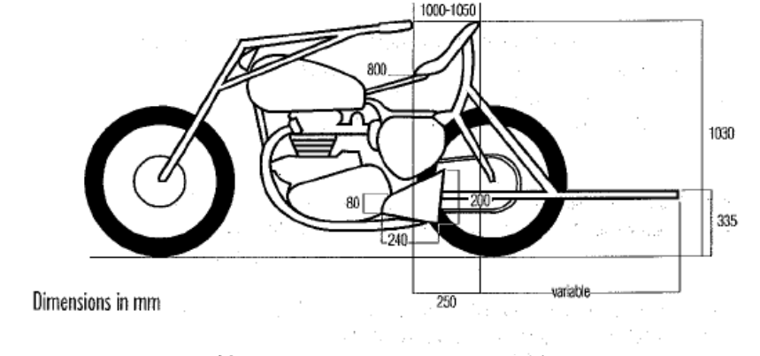

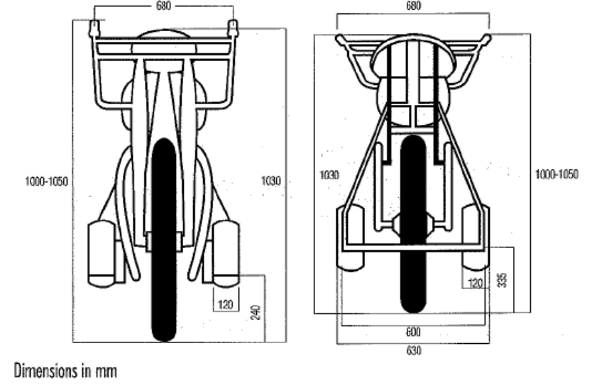
**UCI CYCLING REGULATIONS**

**§ 3** **Mopeds**

**3.6.029** As the moped is meant to replace human pacing, the shelter that it affords shall be
fundamentally the same as that afforded by a bicycle.

**3.6.030** No part of the moped may be surrounded by leather, rubber, felt or other materials
that could act as an artificial wind-break.

**3.6.031** The moped shall comply strictly with the following provisions.

**Engine**
**3.6.032** The machine shall be fitted with an engine of 100 cc maximum which will serve merely
to help the pacer pedal.

**3.6.033** The use of a free wheel shall be absolutely forbidden; a fixed front chain-wheel shall
be mandatory.

**Frame**
**3.6.034** The machine shall be a single-track one-seater.

**3.6.035** The machine, including the front fork, shall be made of tubing, similar in every respect
to that used for the construction of an ordinary bicycle.

**3.6.036** The height of the frame with a rake similar to that of a bicycle shall be between 560
mm minimum and 580 mm maximum (distance taken from the chainset spindle to the
axis of the upper tube).

**3.6.037** The height of the chainset spindle above the ground shall be from 230 mm minimum
to 290 mm maximum.

**3.6.038** The width of the chainset (including pedals) shall be 380 mm maximum.

**Saddle**
**3.6.039** The saddle shall be of a commercially available racing model in leather; it shall
measure 300 mm maximum in length by 150 to 180 mm in width. The saddle shall
overhang the frame by an equal distance on each side.

**3.6.040** The saddle may not be in any way modified. The addition of cushions, leather, cloth,
etc. to provide additional shelter shall be absolutely forbidden.

**3.6.041** The foremost tip of the saddle peak shall be placed:
a) 450 mm from the axis of the steering expander tightening bolt on tracks of 200
metres and more;
b) 400 mm from the axis of the steering expander tightening bolt on tracks of less
than 200 metres.

**3.6.042** The height of the rear of the saddle above the ground shall be 870 mm minimum.

**Handlebar**
**3.6.043** The handlebar shall be made in one piece and be a maximum 500 mm across
(distance measured at the extremities of the grips).

**3.6.044** The handlebar shall be 30 mm below the level of the steering expander tightening bolt
which bolt shall itself be 900 mm above the ground. The handlebar grips shall
therefore be 870 mm from the ground (distance measured from the top of the grips).

E0126 TRACK RACES 91

**UCI CYCLING REGULATIONS**

For tracks of less than 200 m, the handlebar grips shall be 920 mm from the ground
(distance measured from the top of the grips).

**3.6.045** The rearmost points of the handlebar shall be 200 mm maximum to the rear of the
steering expander tightening bolt. The tube ends shall be filled and the grips may be
clad in insulating tape. Rubber grips shall be absolutely forbidden.

**Wheels**
**3.6.046** The wheels shall comprise metal rims. They shall be of 650 mm diameter and fitted
with a 55 mm section tyre.

**3.6.047** The rear wheel shall be of 700 mm diameter and shall be fitted with a 42 mm section
tyre.

**Tank**
**3.6.048** The tank, being cylindrical, measuring 180 mm in diameter by 265 mm in length and
taking a petrol (gasoline) and oil mixture, shall be fixed to the steering pin.

**Mudguard**
**3.6.049** The mudguard shall be made of steel.

**3.6.050** The width of the rear mudguard shall be 70 mm maximum. It shall be made as a single
piece and form a protective shield on both sides. Its foremost point shall be fixed to
the frame tubes and its rearmost point to the rear wheel spindle. It shall be 140 mm
high. The distance between the steering expander button and the perpendicular with
the ground passing through the rear end of the mudguard shall be 1250 mm. The
distance between the rear of the saddle and the perpendicular with the ground,
passing through the rear end of the mudguard, shall therefore be 500 mm minimum.

**3.6.051**

E0126 TRACK RACES 92

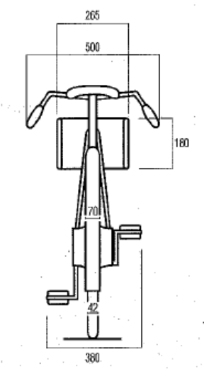
**UCI CYCLING REGULATIONS**

**§ 4** **Attire of motor-pacers**

**3.6.052** Motor-pacers shall wear a leather jacket of the following dimensions:

           - length of the back without collar 67 cm

           - width of the back at sleeve level 45 cm

           - width of chest at sleeve level 35 cm

           - circumference of chest taken under the arms 120 cm

           - circumference of the bottom of the jacket 120 cm

           - length of sleeve from shoulder seam to elbow 60 cm

           - circumference of sleeve around biceps 40 cm

           - circumference of sleeve around wrist 28 cm

           - circumference of collar 44 cm

           - height of collar 3.5 cm

**3.6.053** The collar shall be closed by two hooks. The jacket shall zip up the back (from the
bottom up).

**3.6.054** The jacket may not be opened during the race or in any way modified for the purpose
of favouring a rider.

**3.6.055** Pacers shall wear leather trousers, without gaiters, and of the following dimensions:

           - length of outer leg 94 cm

           - length of inner leg 68 cm

           - circumference of waist 102 cm

           - circumference of hip across the buttocks 114 cm

           - circumference of thigh 72 cm

           - circumference above the knee 48 cm

           - circumference below the knee 36 cm

           - circumference of calf 40 cm

           - circumference of ankle 30 cm

**3.6.056** The leather trousers shall also have a 22 cm wide cloth belt with, to the rear and
pointing downward, a rubber tail 48 cm long by 9 cm wide.

**3.6.057** The trousers shall have no openings other than on the outside of each leg, running
40 cm up from the ankle. These openings shall be secured by zip fasteners closing
from the top down.

**3.6.058** The trousers shall be held up by straps crossing and secured behind with rubberised
loops.

**3.6.059** Under their leather suits, pacers shall wear only a light, tight-fitting jersey and cyclist’s
racing shorts. The jacket must close without straining the seams or the zipper. The
jerseys shall be of equal thickness throughout and may in no way be padded. There
may be no openings in underclothes and jerseys.

**3.6.060** Pacers may wear only one pair of socks. They must be held up by suspenders.

**3.6.061** Only normal-size, fully enclosed leather boots shall be permitted.

**3.6.062** A rigid helmet shall be worn at all times during racing and training. It may not be
unstrapped or removed during the race. Ear-flaps, which may be fixed to the helmet,
may not protrude by more than 1 cm by 3 cm.

E0126 TRACK RACES 93

**UCI CYCLING REGULATIONS**

**§ 5** **Attire of moped pacers**

**3.6.063** All pacers shall wear the same attire:
a) a light, short-sleeved pullover
b) a clinging rider’s jersey with patch pockets; long sleeves shall be allowed; the
commissaires may permit the wearing of a supplementary racing jersey
c) shorts (tight black descending to mid-thigh)
d) special black shoes known as “cyclists’ shoes” and all-white or all-black socks
e) a pair of racing gloves or a pair of normal unlined gloves but not gauntlet gloves
f) a moulded shell hat of the type worn by stayers; it may have neither ear-flaps
nor leather, felt or cloth strips that could act as artificial wind-breakers.

**TECHNICAL SPECIFICATIONS AND VELODROMES HOMOLOGATION**

**§ 6** **Velodromes**

**3.6.064** Track competitions included on the UCI International calendar must be held at a UCIhomologated velodrome. As an exception to the above, the UCI may accept inclusion
of non-homologated velodromes on the International Calendar, provided that they
fulfil all required guarantees in terms of safety.

Track competitions included on a national calendar may be held at a nationally
homologated or a UCI-homologated velodrome.

_(text modified on 14.10.16)_

**3.6.065** A velodrome will not normally be homologated by the UCI unless it meets the following
conditions.

_(text modified on 14.10.16)_

**3.6.066** The stability and resistance of the materials and fixings which make up the structure
of the velodrome shall meet the legislation regarding construction and safety of the
country in which it is built and shall take account of specific geological and climatic
conditions.

These elements, along with general compliance of the construction and construction
materials with technical standards and good practice, remain the exclusive
responsibility of the owner, contractor, architect, consulting engineer, proprietor,
operator, user, organiser or others, in accordance with local legislation or regulations.
The UCI is exempt from any responsibility in this regard.

Homologation of the velodrome by the UCI rests not on the technical and structural
characteristics of the velodrome, but solely on the compliance of its external features
with the provisions of the present paragraph at the time of the inspection. The UCI is
not liable for any faults or defects which lie out-side the scope of such homologation,
or which appear or come to light subsequent to the inspections on which such
homologation is based.

_(text modified on 01.01.02)_

E0126 TRACK RACES 94

**UCI CYCLING REGULATIONS**

**Track geometry**
**Form**
**3.6.067** The inner edge of the track shall consist of two bends connected by two parallel
straight lines. The entrance and exit of the bends shall be designed so that the
transition is gradual.

The banking of the track shall be determined by taking into account the radius of the
bends and the maximum speeds achieved in the various disciplines.

**Length**
**3.6.068** The length of the track must lie between 133 metres and 500 metres inclusive.

The length of a track shall be such that a whole number of laps or half laps shall give
a distance of precisely 1 kilometre, with a tolerance of + 5 centimetres.

For the _World Championships_ and the Olympic Games the length must be 250
metres. In the interest of the development of track cycling, the UCI may grant a special
dispensation for Velodromes already in use.

_(text modified on 01.01.02, 24.09.09)_

**3.6.069** The length of the track shall be measured 20 cm above the inner edge of the track
(the upper edge of the blue band).

**Width**
**3.6.070** The width of the track must be constant throughout its length. Tracks approved in
category A must have a minimum width of 7 metres. Tracks approved in category B
must have a width proportional to its length of 5 metres minimum.

_(text modified on 01.01.02, 01.01.26)_

**Blue band**
**3.6.071** A rideable area sky-blue in colour known as the “blue band” must be provided along
the inside edge of the track. The width of this band must be at least 10% of the width
of the track and its surface must have the same properties as of the track. No
advertising inscription is permissible in this area.

With the exception of mounted riders, no person or unauthorised object may be on
the blue band while one or more riders are on the track.

_(text modified on 01.01.02, 01.08.23)_

**Safety zone**
**3.6.072** Immediately inside the blue band there shall be a prepared and marked safety zone.
The combined width of the blue band and the safety zone shall be at least 4 metres
for tracks of 250 metres and over, and 2.5 metres for tracks shorter than 250 metres.

With the exception of the commissaires, mounted riders or other persons authorised
by the president of the commissaires’ panel, no person or object (including starting
blocks) may be inside the safety zone when a rider is on the track.

_(text modified on 01.01.02; 26.08.04, 01.08.23)_

E0126 TRACK RACES 95

**UCI CYCLING REGULATIONS**

**3.6.072** A fence (inner fence) of a construction ensuring the adequate safety for riders to a
**bis** height of at least 120 cm above the level of the safety zone must be permanently
installed on the inner edge of the safety zone. This requirement applies both during
track competitions and outside of them, except in cases where there is no height
difference or abrupt gradient between the safety zone and the track centre or within
the track centre itself. In such cases, the inner fence must be installed during
competitions for all velodromes that received their initial homologation after 1 January
2026.

The inner fence must be stable, solidly mounted, and transparent and in no
circumstances may any advertising boards be attached to it. It must present no
protrusions or projecting parts and the upper edge of the inner fence shall be fitted
with protective covering.

The inner fence must support at least the following loads:

           - 4 kN applied at any point up to a height of 65 cm

           - 1.5 kN applied at any point above 65 cm and up to the top

The loads calculation must be certified by a structural engineer and provided during
the homologation process, prior to the installation of the track.

The inner fence shall be continuous and free of gaps wherever possible. Where
unavoidable, any gaps shall be less than 1 cm, including those between the bottom
of the fence and the safety zone.

In places where the level of the safety zone is at a level 1.5 m or more than the actual
track centre, additional protective measures such as nets, panels, or the like, shall be
~~erected~~ installed in order to prevent athletes being subjected to injury. In velodromes
requesting their initial homologation after 1 [st] January 2026, in places where the level
of the safety zone is at a level 1.5 m or more than the actual track centre, the inner
fence must have a minimum height of 2 m. This minimum height shall be measured
at the location of the drop.

Where there is a difference in the height of the inner fence, the transition between
these heights must not exceed an angle of 45°.

E0126 TRACK RACES 96

**UCI CYCLING REGULATIONS**

Diagram showing the inner fence at different heights

E0126 TRACK RACES 97

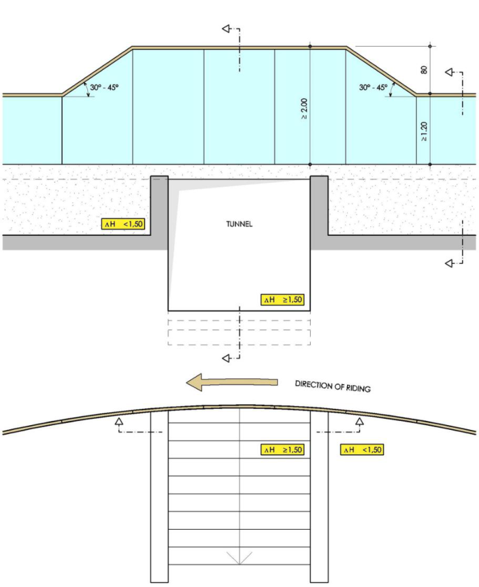

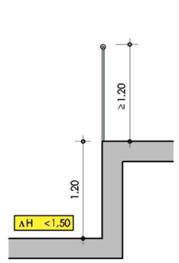

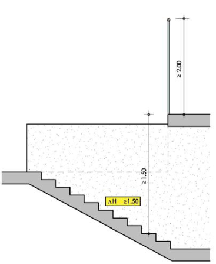
**UCI CYCLING REGULATIONS**

Any gates provided in the fencing must be fitted with simple and reliable fastenings.
They must be kept closed while racing and training is in progress.

_(text modified on 01.01.02; 26.08.04; 01.01.25, 01.01.26)_

**Profile**
**3.6.073** At any point on the track, a cross section of the track surface must present a straight
line. In the bankings, the inner edge should have a curved transition onto the blue
band.

**3.6.073** At any point of the track or safety zone surface, a perpendicular distance from the
**bis** surface of at least 3 metres must be guaranteed free of any obstacle.

_(text modified on 01.01.02)_

**Surface**
**3.6.074** The surface of the track shall be completely flat, homogenous, non-abrasive. The
tolerance of flatness for the track surface shall be 5 mm over 2 metres. The track
surface must be capable of withstanding a minimum load of 5 kN at any point on the
track. The load calculation must be certified by a structural engineer and provided
during the homologation process, prior to the installation of the track. The surface of
the track shall be made of wood, concrete or asphalt. The use of other materials is
permitted only upon submission of a dossier to the UCI for approval, demonstrating
that all essential surface characteristics relevant to the discipline are ensured. The
coating shall be uniform in all its aspects over the entire track surface. Coatings
intended to improve the rolling qualities of one part of the track only are not permitted.

_(text modified on 01.01.02, 01.01.26)_

**3.6.075** The surface colour of the track must leave the track marking lines clearly visible.

**Marking**
**Painting**
**3.6.076** Any demarcation, line, advertisement or other marking on the track must be applied
with a paint or product which is non-slip and which does not alter the adhesion
properties, consistency or homogeneity of the surface.

_(text modified on 01.01.02)_

**3.6.077** Advertisements on the track surface must be placed above the stayers’ line within a
longitudinal band between 50 cm of the stayers’ line and 50 cm from the fence (the
outside edge of the track). No advertisement may be placed within 1m either side of
the pursuit and the 200 m lines, or within 3 m either side of the finish line, measured
from the outside edge of the white band.

_(text modified on 01.01.02)_

**3.6.078** The longitudinal lines covered by articles 3.6.079 to 3.6.081 shall have a constant
width of 5 cm. The perpendicular lines covered by articles 3.6.082 to 3.6.084 shall
have a constant width of 4 cm and shall not be drawn within the safety zone or the
blue band.

_(text modified on 01.01.26)_

**Longitudinal markings:**

E0126 TRACK RACES 98

**UCI CYCLING REGULATIONS**

**Measuring line**
**3.6.079** A line, in black on a light background or in white on a dark background, known as the
“measuring line” shall be drawn at 20 cm from the inside edge of the track, numbered
every 10 metres and marked every 5 metres. The measurement of the measuring line
shall be taken on its inside edge.

**Sprinters’ line**
**3.6.080** A red line, known as the “sprinters’ line” shall be marked out 85 cm from the inner
edge of the track.

The distance is to be measured to the inner edge of the red line.

_(text modified on 21.01.06)_

**Stayers’ line**
**3.6.081** A blue line, known as the “stayers’ line” shall be drawn at one third of the total width
of the track or 2.45 m (whichever is the greater) from the inner edge of the track.

The distance is to be measured to the inner edge of the blue line.

_(text modified on 21.01.06)_

**Perpendicular markings:**
**Finish line**
**3.6.082** The finish line shall be situated towards the end of one of the straights but at least a
few metres before the entrance of the banking, and in principle in front of the main
grandstand.

It shall be marked by a perpendicular black line 4 cm in width at the centre of a white
band 72 cm in width, thus leaving 34 cm of white on each side of the black line.

The finish line marking on the track shall continue up to the top of the flat surface of
the fencing.

_(text modified on 01.01.26)_

**200 metre line**
**3.6.083** A white line shall be drawn across the track 200 metres before the finish line, from
which point the times will be taken for sprint events.

**Pursuit lines**
**3.6.084** Two white lines 4 m in length, perpendicular to the track and precisely in line with one
another, shall be drawn at the precise midpoint of each of the straights to mark the
finish points for pursuit events.

_(text modified on 01.01.26)_

**3.6.084** Starting position marks, for the Team Pursuit and Team Sprint events shall be drawn
**bis** at 11 cm from the pursuit lines.

             - Team Pursuit: four white square markings (each a 9 cm [2] ), spaced 1 m apart,
shall be used. The first marking, positioned on the inside of the track and
defining the position of the others, shall be located halfway between the
measuring and sprinters’ line.

E0126 TRACK RACES 99

**UCI CYCLING REGULATIONS**

             - Team Sprint: three square markings (each a 9 cm [2] ), spaced 1.5 m apart, shall
be used. The first marking, positioned on the inside of the track and defining
the position of the others, shall coincide with the first marking used for the
Team Pursuit. The third marking shall coincide with the fourth Team Pursuit
starting position marking. The second marking, positioned between the first
and third, is the only marking applied exclusively for the Team Sprint event
and shall be coloured red.

Diagram of the Starting Position Track Markings

(article introduced on 01.01.26)

**EQUIPMENT**
**Access tunnel**
**3.6.085** The track centre, which is located inside the safety zone, must be obligatorily
accessible via one or more tunnels.

**Riders’ area**
**3.6.086** Within the track centre areas must be provided for riders to change and warm up, as
well as waiting areas near the pursuit and finish lines.

E0126 TRACK RACES 100

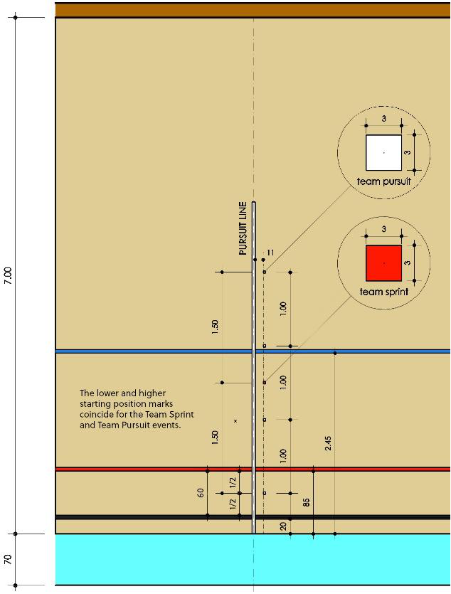
**UCI CYCLING REGULATIONS**

**Outer fence**
**3.6.087** The outside edge of the track must be surrounded by a safety fence (outer fence) to
protect riders and spectators. It must be stable and solidly mounted, with an overall
height of at least 140 cm above the track for velodromes requesting their initial
homologation after 1 [st] July 2025. The inside part must be smooth, unbroken and with
no projecting parts.

The outer fence must support at least the following loads:

           - 4 kN applied at any point up to a height of 65 cm

           - 1.5 kN applied at any point above 65 cm and up to the top.

The loads calculation must be certified by a structural engineer and provided during
the homologation process, prior to the installation of the track.

At the places where the area outside the track is at a level 1.5 metres or more below
the outside edge of the track surface, additional protective measures (nets, panels,
etc.) must be provided to reduce the risks resulting from riders accidentally leaving
the track. In velodromes requesting their initial homologation after 1 [st] January 2026,
it is mandatory as part of the additional measures the installation of an outer fence,
with a minimum height of 2 m. This minimum height shall be measured at the location
of the drop.

Where there is a difference in the height of the outer fence, the transition between
these heights must not exceed an angle of 45°.

E0126 TRACK RACES 101

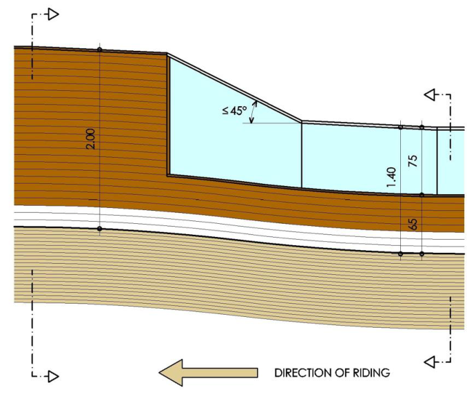
**UCI CYCLING REGULATIONS**

Diagram showing the outer fence at different heights

The colour of the outside fencing must contrast clearly with that of the track. When
the outer fence is made entirely of transparent material, the lower part (up to a
minimum height of 65 cm from the track side) should be made non-transparent.

Any gates provided in the outside fencing must open outwards and be fitted with
simple and reliable fastenings. They must be kept closed while racing and training is
in progress.

_(text modified on 01.01.02; 01.01.25, 01.01.26)_

**Miscellaneous**
**3.6.088** A lap counter clearly visible to riders and spectators and a bell audible through-out
the track area shall be placed near the finish line.

For pursuit events, bells and lap counters shall be placed on both side of the track,
near the pursuit lines, in accordance with article 3.2.066.

_(text modified on 01.01.02)_

**3.6.089** A timing system including starting blocks, contact bands and an electronic display
(times to the thousandth of second, laps, points, etc.), a photofinish or video-finish
system to assist in judging finishes, and a general public address system clearly
audible throughout the entire velodrome area must be provided.

Contact strips must be laid over the width of the track or an acceptable timing detector
such as light beams installed.

_(text modified on 01.01.02)_

**Lighting**
**3.6.090** Suitable lighting must be provided which meets the safety conditions into force in that
country.

The lighting system must be supplemented by an emergency lighting system
operating independently of mains electricity, capable of providing an intensity of at
least 100 Lux for 5 minutes which must be effective instantaneously.

E0126 TRACK RACES 102

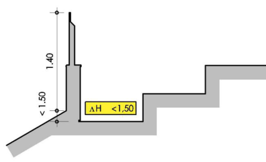

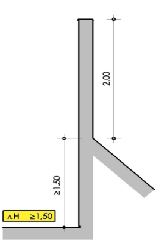
**UCI CYCLING REGULATIONS**

During training sessions without spectators, vertical lighting must be at least 300 lux
(maintained average).

During competitions, vertical maintained average of at least 1000 Lux is required for
category A velodromes and 500 Lux for category B velodromes.

For the World Cup, UCI World Championships, Continental Championships and the
Olympic Games, the vertical maintained lighting level shall be at least 1400 Lux and
evenly distributed.

Luminaires and positioning must be designed and angled to avoid glare for riders,
spectators and television broadcast.

_(text modified on 01.01.02, 01.01.26)._

**ACCOMMODATION FOR OFFICIALS**
**Commissaires’ platform**
**3.6.091** A platform must be provided for the commissaires, located in the track centre in line
with the finish line.

_(text modified on 01.01.26)._

**Judge-referee platform:**
**3.6.093** A platform must be provided for the judge-referee on the outside of the track. It must
be in a quiet, isolated location overlooking the track with an unimpeded view, e.g. at
the top of the stand above the finish line. Cable ducting must be provided from that
location to the infield. During competitions, there must be a radio link between the
referees and the other commissaires, including the starter and the president of the
commissaires’ panel.

_(text modified on 01.10.19, 01.01.26)_

**Starter’s platform:**
**3.6.093** In the middle of the track centre in line with the pursuit lines, a platform must
**bis** be provided for the starter. It must have an area of between 3 and 4 m [2] and must be
raised above track level, to ensure the starter has an unobstructed view along the full
length of both pursuit lines.

_(text modified on 01.01.02, 01.01.26)_

**HOMOLOGATION OF VELODROMES**
**3.6.094** At the time of their homologation, velodromes shall be classified into two categories
on the basis of the technical quality of the track and installations, as shown in the
following table:

E0126 TRACK RACES 103

**UCI CYCLING REGULATIONS**

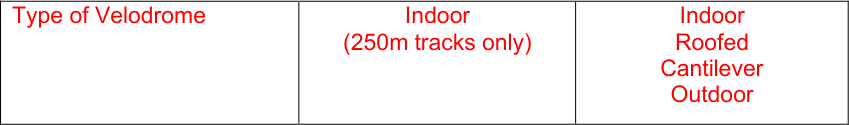

_(text modified on 01.01.26)_

**3.6.095** All tracks must meet the following criteria (calculated for a minimum safe speed of at
least 85 km/h):

|Length of the track|250 m|285.714 m|333.33 m|400 m|
|---|---|---|---|---|
|Radius of bends|19-25 m|22-28 m|25-35 m|28-50 m|
|Width|7-8 m|7-8 m|7-9 m|7-10 m|

_(text modified on 01.01.02, 01.01.26)_

**3.6.096** [abrogated on 01.01.26]

**3.6.097** The request for homologation must be sent to the UCI at least 2 months before the
planned inspection date, by completing the homologation application form. It must be
accompanied by a technical file complying with the UCI’s standard model. In any case,
the national federation of the country, in which the velodrome is located, shall be
informed and involved in the homologation process.

The UCI may require any additional document or information.

_(text modified on 01.01.02, 01.01.26)_

**3.6.098** The applicant for the homologation shall organise the inspection of the velodrome in
the presence of a specialist responsible for carrying out the regulation measurements
under the direction of a UCI delegate. On this occasion, a test of the track by a group
of riders must be carried out.

All expenses incurred in connection with the inspection of the velodrome are to be
covered by the applicant, the national federation being held jointly liable.

The costs of the UCI delegate are covered in accordance with the conditions specified
in the UCI financial obligations in force.

_(text modified on 01.01.02; 01.01.26)_

**3.6.099** A detailed inspection report shall be drawn up by the UCI delegate and countersigned
by the persons responsible for the measurement of the track and a representative of
the national federation.

**3.6.100** Should the UCI consider that there are aspects which might lead to homologation
being withheld, it shall invite the parties requesting homologation to justify these
aspects before a decision is reached. Failing this, and in the event that homologation
for the velodrome is withheld, the Federation concerned may appeal to CAS.

E0126 TRACK RACES 104

**UCI CYCLING REGULATIONS**

_(text modified on 01.01.10)_

**3.6.101** Any changes to or renovation of the facilities following the inspection of the velodrome
shall nullify the homologation. The new homologation of existing facilities is subject to
the procedure described in articles 3.6.097 and following, as well as the UCI
homologation procedure available on the UCI website.

_(text modified on 01.01.02; 01.01.25)_

E0126 TRACK RACES 105

**UCI CYCLING REGULATIONS**

### **Chapter VII TRACK TEAMS**

(Chapter introduced on 31.05.04)

**§ 1** **Identity**

**3.7.001** A UCI Track Team is an entity, comprising at least three riders each of whom must
be of the age of 19 years and older.

Any person, company, foundation, association or other entity which operate and act
as the person or entity responsible for managing the UCI Track Team is hereinafter
referred to as the team representative and/or the employer. The team representative
shall represent the UCI Track Team for all purposes as regards the UCI Regulations.

_(text modified on 30.03.09; 25.10.21)_

**3.7.002** The UCI Track Team shall comprise all the riders registered with the UCI as part of
the team, the team representative, the sponsors and all the other persons (Team
Manager, Ass. Team Manager, Coach, Mechanic, Paramedical Staff, Press)
contracted by the team representative and/or the sponsors for the functioning of the
team. The UCI Track Team shall be designated by a special name and be registered
with the UCI as provided in these regulations.

_(text modified on 25.10.21)_

**3.7.003** UCI Track Teams riders may take part in all track events for their team, when not
racing for the National Federation.

_(text modified on 25.10.21)_

**3.7.004** Sponsors shall be persons, companies or bodies which contribute to the funding of
the UCI Track Team. Of these sponsors, no more than two may be designated as the
principal partners of the UCI Track Team. Should neither of the two principal partners
be the employer of the UCI Track Team then the employer (team representative) may
be only a person or body corporate, whose sole commercial income is derived from
advertising.

_(text modified on 25.10.21)_

**3.7.005** The principal partner(s) and team representative shall commit themselves to the UCI
Track Team for a full track season as defined in article 3.2.001.

_(text modified on 25.10.21)_

**Team Name**
**3.7.006** The name of the UCI Track Team must either be that of the company or brand name
of the principal partner or that of one or both of the two principal partners, or the name
of its team representative.

Upon specific request, the UCI may authorise another designation which is linked to
the UCI Track Team project. The UCI may refuse the UCI Track Team’s registration
because of a resemblance of the name of a new UCI Track Team, its team
representative or its principal partners which is likely to create confusion with another
UCI Track Team.

E0126 TRACK RACES 106

**UCI CYCLING REGULATIONS**

_(text modified on 01.10.11; 25.10.21)_

**3.7.007** Two UCI Track Teams, their principal partners or team representative, may not bear
the same name. Should application for a new and identical name be simultaneously
made by two or more UCI Track Teams, priority shall be given to the UCI Track Team
which has used the name for the longer or longest time. In case of first registration,
the UCI Track Team that first submitted its application to the UCI shall receive priority
for the name.

_(text modified on 25.10.21)_

**Transfer period**
**3.7.008** During the season, a rider cannot join a UCI Track Team outside from the UCI Track
Team registration period going from 2 months to 2 weeks before the start of the new
Track Individual Classification, January 1 [st] .

_(text modified on 30.09.10; 25.10.21; 17.10.202_ ~~_2)_~~

**§ 2** **Legal and Financial Status**

**3.7.009** The team representative shall represent the UCI Track Team for all purposes relating
to the UCI Regulations. His registered office/main residence must be in the same
country where the UCI Track Team is registered.

The team representative has the power to hire staff. He shall sign the contracts with
the UCI Track Team's riders and other employees.

_(text modified on 25.10.21)_

**3.7.009** Any person, company, foundation, association or other entity that becomes the team
**bis** representative or principal partner of a UCI Track Team for the first time shall no later
than the date of the application for the registration of that UCI Track Team submit the
following to the National Federation:

            - For individuals: proof of residence;

            - For incorporated bodies and other organisations:

               - Constitution or articles of association;

               - Proof of an entry on the business register or the register of companies or
associations, or any other official document demonstrating the legal
existence of the organisation;

               - List of officers or directors with their full names, occupations and addresses;

               - Annual accounts (balance sheet and profit and loss account for the last
financial year in the current legal form.

Furthermore, the team representative and the principal partners must inform the
National Federation without delay of any of the following: a change of domicile or
registered offices, reduction in capital, change of legal form or identity (merger,
takeover), request for or implementation of any agreement or any measure
concerning all creditors.

_(article introduced on 25.10.21)_

**§ 3** **Requirements imposed on the UCI Track Team for the registration**

**Registration with the National Federation**

E0126 TRACK RACES 107

**UCI CYCLING REGULATIONS**

**3.7.010** The application for the status of UCI Track Team must be made to the National
Federation of the nationality of the majority of the riders of the team in accordance
with the procedures set out below (articles 3.7.010bis to 3.7.028bis).

_(text modified on 25.10.21)_

**3.7.010** Each National Federation may register a maximum of 3 UCI Track Teams each year.
**bis** For the development of track cycling, the UCI may grant dispensation of this
requirement.

_(article introduced on 25.10.21; modified on 17.10.22)_

**3.7.010** The National Federations may set the deadlines for the procedure as set out in the
**ter** registration manual as they wish, as long as the deadlines for registration with the
UCI are respected.
The conditions set out in this paragraph are minimum conditions. National
Federations are permitted to set stricter conditions.

_(article introduced on 25.10.21)_

**3.7.010** The UCI Track Team must submit the following to the National Federation:
**quarter** 1. Original copies of the contracts signed with the riders;
2. Original copies of the contracts signed with other UCI Track Team staff;
3. An original copy of a bank guarantee, as described in article 3.7.030 to 3.7.035;
4. A detailed budget following the model set out in the manual for the registration
of UCI Track Teams;
5. Proof that the insurance cover required under article 3.7.023bis has been taken
out for all the riders in the UCI Track Team;
6. A copy of the sponsorship contract or, if no such contract exists, documentary
evidence of the UCI Track Team's income.

_(article introduced on 25.10.21)_

**3.7.010** The National Federation shall register the UCI Track Team only if it considers that the

**quinquies** documentation submitted meets all the conditions above and that its budget is

adequate for such a team.

_(article introduced on 25.10.21)_

**3.7.011** The National Federation shall be solely responsible for checking compliance with
regulatory and legal requirements, both on registration and throughout the registration
year.

_(text modified on 25.10.21)_

**3.7.012** [abrogated on 25.10.21]

**3.7.013** The UCI Track Team shall communicate the complete registration documentation of
UCI Track Teams (including their list of staff and riders) 15 days prior to the UCI Track
Individual Classification period start, for verification and registration.

The UCI Track Team registration must include the following information:
1. the exact name of the UCI Track Team.
2. the complete contact details (address, e-mail, telephone and fax numbers) to
which all communications for the UCI Track Team can be sent.

E0126 TRACK RACES 108

**UCI CYCLING REGULATIONS**

3. the names and addresses of the principal partners, team representative and the
team manager.
4. the surnames, first names, addresses, nationalities and dates of birth of the
riders, and UCI ID of the riders.
5. Scanned copies of contracts between the UCI Track Team and the respective
riders.

The registration of UCI Track Teams is valid for a full track season as defined in article
3.2.001.

_(text modified on 25.10.21)_

**3.7.014** Article 3.7.013 shall also apply to any amendment to the list. Such amendments shall
immediately be submitted by the Teams to the UCI for approval.

**3.7.015** Only Teams on the registered list of the UCI may receive benefits such as those listed
in article 3.7.019.

**3.7.016** By their annual registration with the UCI, UCI Track Teams and especially the team
representative and sponsors shall undertake to respect the Constitution and
Regulations of the UCI and their respective National Federation and to participate in
cycling events in a loyal and sporting manner. The team representative and principal
partners shall be held jointly and severally liable for all the financial commitments of
the UCI Track Team to the UCI and the National Federations, including any relevant
fines.

_(text modified on 25.10.21)_

**3.7.017** The registration of the UCI Track Team with the UCI shall involve a registration fee
that the UCI Track Team shall pay 15 days prior to the UCI Track Individual
Classification period start. The amount shall be set annually by the UCI Management
Committee.

_(text modified on 04.03.2019)_

**3.7.018** With their registration application, each UCI Track Team must submit to the UCI a
colour graphic design of their team jersey, complete with sponsor logos.

**3.7.019** Those UCI Track Teams registered with the UCI will receive the following benefits:
1. Information services and publications in addition to the regular distributions.
2. Where applicable, advertising space on specific series jerseys

_(text modified on 25.10.21, 01.01.26)_

**§ 4** **Teams and Riders**

**3.7.020** The UCI Track Team shall be the totality of the team riders in the elite and/or under
23 categories to take part in events and specialisations as specified in article 3.7.003.

**3.7.021** [abrogated on 25.10.21].

**3.7.022** A rider shall not enter into any commitment with an organiser, whomsoever that
organiser may be, with a view to participating in a race, without having firstly obtained
the agreement of his team representative. That agreement shall be considered to

E0126 TRACK RACES 109

**UCI CYCLING REGULATIONS**

have been granted if, on being duly requested, the team representative has not replied
within ten days.

_(text modified on 25.10.21)_

**§ 5** **Contract of Employment & Insurance**

**3.7.023** A rider’s membership of a UCI Track Team shall be subject to a contract which must
at least contains the stipulations of the standard contract presented in article 3.7.029.
It does not include bonus/incentive programs, race schedules, equipment provisions
and other details. These are subject to negotiations between the team representative
and the rider(s).

A rider who is already employed or a member of another UCI registered team (racing
in another discipline), may be registered in a UCI Track Team, only if a signed threeparty agreement (rider, UCI Track Team and the other UCI Team) is provided during
the registration process.

The insurance cover, as set out in article 3.7.023bis must be guaranteed and specified
in detail in the contract.

_(text modified on 25.10.21)_

**3.7.023** Insurance against the following risks is compulsory for all events occurring in the
**bis** course of the rider's activities for the UCI Track Team (racing, training, travel,
promotion, etc.). The insurances must be valid in all countries in which the rider is
susceptible of performing activities for the UCI Track Team, whether individually or
jointly with other UCI Track Team members:
1. Civil responsibility (of the rider; for an adequate amount);
2. Accidents (costs of treatment until recovery with no amount limit);
3. Sickness (costs of treatment and hospitalisation with no amount limit);
4. Repatriation (unlimited cover);
5. Death (minimum value EUR 100’000.- due to the beneficiaries designated by
the rider).
UCI Track Teams shall take out and cover the costs for the insurances listed above
insofar as the rider does not have such insurances through his licence or his
compulsory national social security system.

_(article introduced on 25.10.21)_

**3.7.024** Any clause concluded between the rider and the team representative that clearly
impinges on the basic rights of the rider as provided for in the UCI regulations shall
be considered null and void.

_(text modified on 25.10.21)_

**3.7.025** Any contract between a UCI Track Team and a rider shall be drawn up in duplicate at
least in a language which can be understood by both the rider and the National
Federation. One signed scanned copy shall be forwarded to the UCI with a translation
in French or English.

_(text modified on 01.07.17; 25.10.21)_

**§ 6** **End of Contract**

E0126 TRACK RACES 110

**UCI CYCLING REGULATIONS**

**3.7.026** On the expiration of the foreseen term of the contract, the rider shall be free to enter
the service of some other employer. No system of transfer fees shall be permitted.

**§ 7** **Dissolution of a UCI Track Team**

**3.7.027** A UCI Track Team shall announce its dissolution or the end of its activity or its inability
to respect its obligations, as soon as possible to the riders, to its other members, to
the UCI and its National Federation.

Once this announcement has been made, riders shall be fully entitled to contract with
third parties for the following season or for the period starting at the moment
announced for the dissolution, the end of activities or the inability to perform.

**§ 8** **Penalties**

**3.7.028** Should a UCI Track Team, as a whole, fail or cease to meet all the conditions of the
relevant UCI regulations, it may no longer participate in cycling events.

**3.7.028** The UCI shall have the right to refuse or withdraw the registration of a UCI Track
**bis** Team which does not meet all the minimum conditions set in the present regulations
or by another regulatory provision.

Notwithstanding the above, in the event of delay in payment and/or receipt of the
registration file by the UCI, the registration fee shall be automatically increased up to
CHF 100 per day. Furthermore, the UCI will not proceed with the registration of the
UCI Track Team without receipt of the entire application for registration and full
settlement of all registration fees, including any applicable increases.

Moreover, the UCI Track Team may only claim the rights related to the UCI Track
Team status once its registration has been granted.

_(article introduced on 25.10.21)_

E0126 TRACK RACES 111

**UCI CYCLING REGULATIONS**

**§ 9** **UCI Model Contract Between a Rider and a UCI Track Team**

**3.7.029** Between the undersigned,

(name and address of employer)

employer of the Track Team (name of the Track Team), affiliated by the (name of the
National Federation) and whose principal partners are:

1. (name and address) (if appropriate, the employer)
2. (name and address)

hereafter called « the team representative »,

ON ONE PART

And: (name and address of the rider)

born in on

nationality

holder of a licence issued by

hereafter called «the Rider»

ON THE OTHER PART

Do hereby recall that:

           - The team representative employs a team of cyclists who, forming the ….. (name
of the UCI Track Team) and under the direction of Mr. (name of the Team
Manager), participate in track events governed by the Regulations of the Union
Cycliste Internationale;

           - The Rider wishes to join the (name of the UCI Track Team)

           - Both parties are acquainted with and declare that they will abide wholly by the
UCI Constitution and Regulations, and those of its affiliated National Federation.

This having been established, it is hereby agreed as follows:

ARTICLE 1 – Engagement
The Employer shall engage the Rider, and the Rider shall agree to be engaged as a
Track rider.

The participation of the Rider in competitions in other disciplines shall be agreed upon
by the Parties case by case.

ARTICLE 2 – Duration
The present contract shall be concluded for a fixed period commencing on … (start
date) and expiring on … (end date, if possible, end of track season)

ARTICLE 3 – Remuneration
**a) Paid rider**
The Rider shall be entitled to an annual gross salary of … (amount in figures and
words) This remuneration may not be lower than (choose one):

           - The legal minimum wage of the country of the nationality of the UCI Track Team;

E0126 TRACK RACES 112

**UCI CYCLING REGULATIONS**

           - Where there is no legal minimum, than the usual salary that is paid or should
be paid to full-time workers employed in the country whose National Federation
issued the Rider’s licence

           - The amount set by (name of NF) in its national regulations;

           - The minimum salary negotiated by (name of NF) with (e.g. name of riders’
union) of the country.

If the duration of that contract is to be less than one year, the Rider shall, over that
period, earn at least the full annual salary provided for in the preceding paragraph,
less the contractual salary that he would have been able to earn, as a rider with
professional status, with some other employer in the course of the year preceding the
final date of the present contract. This provision shall not apply if the present contract
is extended.
**b) Unpaid rider**
The Rider receives no salary or remuneration but receives expenses as per the scale
below for the activities carried out for the UCI Track Team and/or at its request:
(Suggestions, examples →)

           - (currency and amount) per kilometre travelled;

           - reimbursement of air tickets for distances greater than (number) km;

           - reimbursement of the cost of a 2-star hotel room for the nights before and after
the event if the competition venue is more than (number) km from the rider's
home;

           - on presentation of receipts, reimbursement for all meals taken during travel up
to a maximum price of (currency and total amount) per meal;

           - on presentation of invoices, reimbursement for minor mechanical expenses to
a maximum total amount of (currency and total amount) per year.

ARTICLE 4 - Payment of remuneration and/or expenses
**a) Paid rider**
1. The UCI Track Team shall pay the remuneration determined under article 3 in
12 equal monthly instalments on or before the 5 [th] day of the following month.
2. Should the Rider be suspended under the terms of the UCI Regulations or those
of one of its affiliate Federations, he/she shall not be entitled to the said
remuneration referred to in article 3 for the part of the suspension exceeding
one month.
3. In the event of failure to make payment of the remuneration referred to in article
3, the rider is, without summoning the employer to make payment, fully entitled
to an extra benefit of 5% interest per year.
**b) Unpaid rider**
1. The UCI Track Team must pay the sums specified in article 3 no later than the
last working day of each month as long as it has received the expenses claim
from the rider before the 20 [th] of that month.
2. In the event of a failure to make payment of any sum by its due date, the rider
has the right, without notice, to the interest and supplements commonly applied
in that country. Any sum due to the rider from the UCI Track Team must be paid
by transfer to the rider's bank account no (number) at the (name of the bank) at
(branch where the account is held). Only the proof of the execution of the bank
transfer is accepted as proof of payment.

ARTICLE 5 - Insurance
The Employer shall provide the rider with an appropriate insurance to ensure a
reasonable allowance in the event of an unforeseen injury or illness which affects the
rider's ability to fulfil the competition aspects of his/her contractual obligations.

E0126 TRACK RACES 113

**UCI CYCLING REGULATIONS**

ARTICLE 6 - Premiums and prizes
The Rider shall be entitled to premiums and prizes won during cycling competitions
in which he/she participated for the UCI Track Team, in accordance with the
Regulations of the UCI and its Affiliated Federations.
Premiums and prizes shall be paid as promptly as possible, but at latest on the last
working day of the month following that in which said premiums and prizes were won.

ARTICLE 7 - Miscellaneous Obligations
1. The Rider may not, for the duration of the present contract, work for any other
UCI Track Team or advertise for any other sponsors than those belonging to
the (name of the UCI Track Team), except in such cases as are provided for in
the Regulations of the UCI and of its affiliated Federation.
2. The Employer hereby undertakes to allow the Rider properly to perform his
occupation by providing him with the necessary equipment and apparel and by
permitting him/her to participate in a sufficient number of cycling events, either
as a member of the UCI Track Team or individually.
3. The Rider may not participate individually in a race without the express
agreement of the Employer. The Employer shall be deemed to have given its
agreement if it has not replied within a period of ten days from the date of the
request. In no case may the Rider take part in a race within any other structure
or a mixed team if the (name of the UCI Track Team) has already entered for
that race.
4. The Parties undertake to respect the riders’ health protection programme of the
UCI and/or the (name of NF).

In case of a national selection, the Employer shall be required to permit the Rider to
participate in preparatory races and programmes decided upon by the National
Federation. The Employer shall authorise the National Federation to give the Rider
any instructions it deems necessary in connection with and for the duration of the
selection provided that it does so solely in connection with sporting matters, in its own
name and on its own behalf.

In none of the aforementioned cases shall the Contract be suspended.

ARTICLE 8 - Transfers
On the expiry of the present contract, the Rider shall be entirely free to sign a new
contract with another employer, subject to the provisions of the UCI Regulations.

ARTICLE 9 - End of contract
Notwithstanding the legislation governing the present contract, it may terminate
before expiration, in the following cases and on the following conditions:
1. The Rider may terminate the present contract, without notice nor liability for
damages:
(a) if the employer be declared bankrupt, insolvent or goes into liquidation.
(b) if the employer or a principal partner withdraw from the UCI Track Team

and the continuity of the UCI Track Team is not guaranteed or else if the
UCI Track Team announces its dissolution, the winding up of its activities
or its inability to meet its commitments; if the announcement be made for
a given date, the Rider shall perform the contract until that date.
2. The Employer may terminate the present contract, without notice or liability for
damages, in the case of serious defaulter on the part of the Rider and of the
suspension of the Rider under the terms of the UCI Regulations for the duration
of the present contract remaining to run.
Serious defaulter is considered, in particular, refusal to participate in cycling races,
despite being constantly summoned to do so by the Employer.

E0126 TRACK RACES 114

**UCI CYCLING REGULATIONS**

If need be, the Rider shall have to prove that he was in no state to participate in a

race.
3. Either party shall be entitled to terminate the present contract, without notice or
liability, should the Rider be rendered permanently unable to exercise the
occupation of professional cyclist.

ARTICLE 10 - Unreasonable demand
Any clause agreed upon between the parties that runs counter to the terms of the UCI
Model Contract between a Rider and a UCI Track Team and/or to the provisions of
the UCI Constitution or Regulations and which would in any way restrict the rights of
the Rider shall be null and void.

ARTICLE 11 - Arbitration
Any dispute between the Parties arising from the present Contract shall be submitted
to arbitration, to the exclusion of the courts, by the UCI arbitral board.

Made in on

in as many copies as required by the legislation applicable to the present Contract,
that is to say,..... plus one scanned copy to be sent to the UCI.
(Each page of the contract and annexes has been signed by both parties.)

The Rider The Employer

Approved for joint and several liability for three (3) months salary payment

Principal Partner Principal Partner
of the UCI Track Team of the UCI Track Team

_(text modified on 01.01.10; 14.10.16; 25.10.21)_

**§ 10** **Bank guarantee of UCI Track Team**
(articles introduced on 25.10.21)

**3.7.030** For each registration year, a UCI Track Team or any formation applying for this status
must set up a first-demand bank guarantee (abstract guarantee) in favour of its
National Federation, using the model set out in article 3.7.040.

**3.7.031** The purpose of that guarantee shall be:
1. to defray debts incurred for the year of registration, in accordance with the
procedure set out below, incurred by the sponsors and the team representative
to firstly the riders and secondly any other person contracted for the operation
of the UCI Track Team and to cover the payment of any fines imposed as a
result of the application of the UCI regulations;

2. to defray the payment of expenses, indemnities, fines and sanctions or
sentences imposed under or as a result of the application of the regulations of
the UCI or the responsible National Federation or associated with their
application. For the application of provisions regarding the bank guarantee
companies through whom the licence holders concerned carry out their activity
for the operation of the UCI Track Team shall be considered as members of that
UCI Track Team.

E0126 TRACK RACES 115

**UCI CYCLING REGULATIONS**

**3.7.032** The minimum total amount of the bank guarantee shall be the higher of:

           - 15% of the total pay due to the riders and other staff (whether employees or
self-employed);

           - a minimum sum of EUR 10,000 (ten thousand euros) – to be indexed by country
in accordance with the UCI table.

**3.7.033** For the first registration year, the guarantee shall be valid from 15 days prior to the
UCI Track Individual Classification period start of the first registration year until 31
December of the following year. From the second registration year, and for the
following years, the bank guarantee may stipulate that it may be called upon at the
latest as of 1 [st] April following the registration, including for the sums due in January,
February and March. In any case, the bank guarantee shall be valid until 31 December
after the registration year covered by the guarantee.

**Calling up the bank guarantee**
**3.7.034** The National Federation shall call up the bank guarantee in favour of the creditor
specified in article 3.7.031 except where there are clearly no grounds for the claim.
The UCI Track Team shall be notified of the creditor's claim and the call on the
guarantee.

The National Federation may set an appropriate indemnity for any call on the
guarantee.

**3.7.035** The actual payment to the creditor shall not take place until one month after the calling
up of the guarantee. If, in the interim, the UCI Track Team raises a reasonably
justifiable objection to the payment of the money to the creditor, the National
Federation shall pay the sum at issue into a special account and shall subsequently
distribute it in accordance with any agreement reached between the parties or
according to an enforceable legal decision.

**3.7.036** If the creditor has not introduced his claim against the team representative before the
body designated in his contract or the body which he regards as competent on some
other basis during the three months following the date of his call on the guarantee,
the team representative may apply to the National Federation to have the blocked
funds released in his favour.

The funds shall be released should the creditor fail to take proceedings within one
month of the despatch of notice by the National Federation or to submit proof of such
proceedings within the following fifteen days. Should the body before which
proceedings are taken declare itself not competent to rule, the creditor shall resubmit
his claim within one month of being informed of the decision.

Failing this the team representative may apply to the National Federation to have the
blocked funds released in his favour. The funds shall be released should the creditor
fail to take further proceedings within one month of the despatch of notice by the
National Federation or to submit proof of such proceedings within the following fifteen
days.

**3.7.036** Any creditor having called-up the bank guarantee shall keep the National Federation
**bis** informed of all follow-up action and proceedings initiated before the competent
decision-making body. If the creditor fails to provide the National Federation with
information regarding the status of proceedings before the competent decisionmaking body during a period of three years as from blocking of the funds by the
National Federation or as from the last notification from the creditor, the UCI shall
release the funds in favour of the team representative after having deducted any

E0126 TRACK RACES 116

**UCI CYCLING REGULATIONS**

amounts due to the UCI or the National Federation in accordance with article 3.7.034
to 3.7.037.

**3.7.037** If the debt submitted exceeds a sum equal to 15 percent of the annual contractual
benefits, only a total amount corresponding to 15 percent of the annual contractual
benefits shall be paid out in the first instance, provided that the conditions of payment
are fulfilled. The acknowledged balance of the debt may be paid from the global
guarantee on condition that the latter would not be exhausted at the end of its period
of validity. In the event that there are several creditors, the available balance of the
guarantee will be allocated proportionally between them.

**3.7.038** A UCI Track Team whose guarantee is drawn upon shall be automatically suspended
if the guarantee is not made up to its full amount within one month.

**3.7.038** Whenever a competent authority pronounces the opening of liquidation or bankruptcy
**bis** proceedings against the team representative, the National Federation may release
the bank guarantee in favour of the liquidation or bankruptcy administration, upon
request from the competent authority.

**3.7.039** The creditor must submit his application to the National Federation for the guarantee
to be called up by 30 days before its expiry date at the latest. Documentary evidence
must be provided with the application. Failing this the National Federation is not
obliged to call up the guarantee.

**Model bank guarantee**
**3.7.040** The present bank guarantee is issued under the terms of Article 3.7.030 of the Cycling
Regulations of the UNION CYCLISTE INTERNATIONALE for the purpose of
guaranteeing, within the limits set in those regulations, the payment of sums due by
the UCI Track Team [name] (team representative: [name of team representative]) to
riders and other creditors covered in article 3.7.031 of those Regulations as well as
the payment of expenses, indemnities, fines and sanctions or sentences imposed
under or by consequence of the regulations of the UCI.

The amount of the present Guarantee is limited to [currency] X].

The bank,

           - Exact name;

           - Full address to which any call on the guarantee can be sent;

           - Telephone and fax numbers of the department of the bank which handles the
calling up of the guarantee;

           - E-mail address.

hereby undertakes, on first demand and within fifteen days of receiving the demand,
to pay [the responsible National Federation of the UCI Track Team] any amount in

[currency] requested up to a maximum of [currency] X up to the exhaustion of the
present guarantee.

The aforementioned payments shall be made on reception of a simple request
regardless of any objection raised or exception taken by anyone whomsoever. The
request shall require no justification.

The present Guarantee shall remain in effect until [the last day of the third month
following the end of the relevant season]

E0126 TRACK RACES 117

**UCI CYCLING REGULATIONS**

Any call on the present guarantee must be received by the bank no later than [last
day of the third month following the end of the relevant season].

### **Chapter VIII CALENDAR**

**General observations**
**3.8.001** Track competitions are entered on the calendars in accordance with their
classification and criterias as per articles 3.8.003 and 3.8.005.

The UCI Management Committee allocate a classification in the international calendar
to each competition in accordance with the criteria which it shall draw up, taking into
account the criterias set in article 3.8.003.

_(article introduced on 01.01.04)_

**3.8.001** Every entity organising a track competition shall conduct the event in strict compliance
**bis** with the UCI Constitution and UCI Regulations. All competitions registered on the UCI
Track Calendar must respect the UCI financial obligations (in particular calendar fee,
entry fees and prize money) approved by the UCI Management Committee and
published on the UCI website.

Entry fees for competitions on the UCI Track Calendar may only be demanded for
Class 1 and Class 2 competitions, as well as the Masters World Championships and
the Masters Continental Championships, in accordance with the UCI’s Financial
Obligations.

Any new competition will be registered in Class 2 for one year of probation. From the
second edition, the organiser will be allowed to request an upgrade to Class 1.

The status of a competition in Class 1 or 2 is yearly evaluated. Upgrade is accepted
only if all the conditions are respected, that the organisation does not present any
major issue and after UCI approval.

_(text modified on 15.03.16; 01.07.17; 25.10.21; 01.01.26)_

**3.8.001** Class 1 competition may not be registered on the UCI Calendar after the prescribed
**ter** deadline.

Class 2 competition may be registered on the UCI Calendar after the prescribed
deadline as late entry. In this case, a minimum of three months between the
registration date and the actual date of the competition is required. A late registration
fee will apply as per the UCI financial obligations.

Modification in the entered events may be possible. In this case, a minimum of one
month between the registration date and the actual date of the event is required. A
late registration fee will apply for events entered after the prescribed deadline.

_(article introduced on 15.03.16; modified on 05.03.18; 25.10.21)_

**3.8.002** Without prejudice to the provisions of article 1.2.014, if a competition registered in
class 1 as specified by article 3.8.003 is not held and did not obtain a UCI approval
beforehand, it shall be relegated to class 2 for the following edition.

Similarly, if a Class 1 competition as specified in article 3.8.003 does not comply with
all the minimum requirements, the complete competition might be relegated to Class

E0126 TRACK RACES 118

**UCI CYCLING REGULATIONS**

2 the following edition. If a specific event as specified in article 3.8.003 does not
comply with the minimum requirements, only this event might be relegated to Class 2
the following edition.

For Class 2 competition as specified in article 3.8.003 not complying with all the
minimum requirements, the complete competition might be relegated to national level
the following edition. If a specific event as specified in article 3.8.003 does not comply
with the minimum requirements, this event might directly be relegated to national level
and will not attribute UCI points.

Any organisation not fulfilling the requirements above will be individually evaluated by
a UCI working group.

_(text modified on 01.01.04; 26.08.04; 15.03.16; 25.10.21, 01.08.23)_

**World Calendar**
**3.8.003**

Type of competition Criteria
Olympic Games       - As per the regulations for cycling events at
the Olympic Games
UCI World Championships        - As per World Championships regulations
UCI World Cup        - As per articles 3.4.004 to 3.4.007
Continental Championships        - See article 3.8.004
Regional Games

Over the competition:

                                  - CL1 events for Men Elite and Women
Elite [3)]

                                  - Additional events: for: Junior (M/W), U23
(M/W), or Para-cycling (minimum 1
category) [4)]

                                  - Minimum 5 events of Class 1 [2)]
Per event:

                                  - Minimum 4 participating nations [1)]

Class 1

                                  - Minimum distance as per UCI regulations

                                  - Minimal number of riders per event Elite
and U23: [5][)]

                              - Sprint: 8 riders (article 3.2.031)

                             - Keirin: 10 riders (article 3.2.135)

                          - Bunch events: 15 riders

                        - Madison: 10 teams

                                  - Prize money for Elite events (as per the
UCI Financial Obligations)
Class 2 Over the competition:

                                  - CL2 events for Men Elite or Women Elite

                                  - Additional events for: Junior (M/W), U23
(M/W), Elite (M/W) or Para-cycling
(minimum 1 category) [4)]

                                  - Minimum 3 events of Class 2 [2)]
Per event:

                                  - Minimum 3 participating nations [1)]

                                  - Minimum distance as per UCI regulations

                                  - Minimal number of riders per event Elite and
U23: [5)]

                              - Sprint: 8 riders (article 3.2.031)

E0126 TRACK RACES 119

**UCI CYCLING REGULATIONS**

- Keirin: 10 riders (article 3.2.135)

- Bunch events: 12 riders

- Madison: 8 teams

_1) In team events (Madison excluded), if a team is composed of riders from different_
_nations (mixed team), the nation of the majority of riders shall prevail. In team events_
_(Madison excluded), where no majority is possible, the nation of the participating rider_
_shall not count. In Madison, the nations of all the riders taking part in the event shall_
_be counted._
_2) Events from the Elite World Championships programme, organised for Men Elite_
_and Women Elite categories._
_3) Both categories must reach Class 1 requirements to maintain the event in class 1_
_the following year._
_4) Additional events can be of the competition class or lower (Class 1, Class 2 or_
_National)_
_5) No minimum is necessary in other events (Individual Pursuit, Time Trial, Team_
_Pursuit and Team Sprint)_

_(article modified on 01.01.04; 01.10.13; 3.03.14; 15.03.16; 05.03.18; 25.10.21;_
_01.01.25, 01.01.26)_

**3.8.004** To be able to be registered on the International Calendar, the Continental
Championships have to guarantee participation of riders of at least 6 federations of
that continent, exception being where the Continental Confederation does not have 6
federations.

To count for the qualification to the Elite World Championships as per article 9.2.027
and 9.2.027bis, the Elite Continental Championships (Men and Women) must be
scheduled after the last Elite World Championship or at least six weeks before the
next Elite World Championships.

_(article modified on 01.01.04; 25.10.21)_

**National Calendars**
**3.8.005**

Type of competition Participation
National Championships Governed by National Federations
Other competitions Governed by National Federations

_(article introduced on 01.01.04)_

Type of competition Participation
National Championships Governed by National Federations
Other competitions Governed by National Federations

E0126 TRACK RACES 120

**UCI CYCLING REGULATIONS**

### **Chapter IX MASTERS**

(chapter introduced on 10.06.05)

**Participation in the UCI Masters Track World Championships**
**3.9.001** All 35 years old and older riders holding a master license shall be entitled to participate
in the UCI Masters Track World Championships, except the following:
1. Any rider who was a member of any track team registered with the UCI in the
current season. The season is the period referred to in the second indent of
article 3.3.003.
2. Any rider who has participated in any World Championships, Olympic Games,
Continental Championships, Regional Games or World Cup in the current year
in the track discipline (para excluded), except for the races that are open to
masters only.
3. [abrogated on 04.06.16]

_(text modified on 19.09.06; 30.01.09; 04.06.16; 05.03.18, 01.08.23, 01.01.26)_

**Licenses**
**3.9.002** All participants for the UCI Masters Track World Championships must present a valid
license to the competition’s headquarters in order to be given a race number and be
permitted to participate. The license must have been issued by the rider’s UCIaffiliated national federation and must be valid for an entire calendar year.

_(text modified on 01.08.23, 01.01.26)_

**3.9.003** In races other than the UCI Masters Track World Championships, riders may
participate with a temporary or daily license, issued by their national federation.

The license must clearly state the starting and finishing dates of its period of validity.
The national federation shall make sure that the holder of a temporary license will, for
the duration of his license, benefit from the same insurance cover and other benefits
as those attached to an annual license.

_(text modified on 01.08.23)_

**3.9.004** Riders entered to compete in the UCI Masters Track World Championships represent
their country but are permitted to wear the clothing of their own choice.

_(text modified on 01.08.23)_

**3.9.005** All the details applying specifically to each UCI Masters Track World Championships
in each of the categories must be obtained from the competition website. The events
on the competition programme are defined by the UCI.

_(text modified on 21.06.18, 01.08.23)_

**3.9.006** UCI Masters Track World Championships are normally organised in age groups of
five years: 35-39, 40-44, 45-49 etc. Depending on the number of participants in each
age group, the latter may be regrouped with an adjoining age group. In this instance,
separate classifications will be drawn up.

E0126 TRACK RACES 121

**UCI CYCLING REGULATIONS**

There shall be no separate race for an age group if there are less than 12 participants
in mass start events (i.e. points race) or less than 8 participants in the other events.

For team events, a team may include riders from more than one age category.
However, the team must compete in the age category corresponding to the youngest
rider.

_(text modified on 25.01.08; 30.01.09; 05.03.18; 21.06.18, 01.08.23, 01.01.26)_

**Races** **distances**
**3.9.006** **A. Points Race**
**bis** The races shall be held over the following distances:

|Gender|Event|35-39|40-44|45-49|50-54|55-59|60-64|65-69|70-74|75+|
|---|---|---|---|---|---|---|---|---|---|---|
|**Men**|PR|30km|20km|20km|15km|15km|10km|10km|10km|10km|
|**Women**|PR|15km|10km|10km|10km|10km|10km|10km|10km|10km|
|If more than 24 riders, qualifyings (half distance) as per 3.2.117 // 10 points for gaining/losing a lap for races under 20km|If more than 24 riders, qualifyings (half distance) as per 3.2.117 // 10 points for gaining/losing a lap for races under 20km|If more than 24 riders, qualifyings (half distance) as per 3.2.117 // 10 points for gaining/losing a lap for races under 20km|If more than 24 riders, qualifyings (half distance) as per 3.2.117 // 10 points for gaining/losing a lap for races under 20km|If more than 24 riders, qualifyings (half distance) as per 3.2.117 // 10 points for gaining/losing a lap for races under 20km|If more than 24 riders, qualifyings (half distance) as per 3.2.117 // 10 points for gaining/losing a lap for races under 20km|If more than 24 riders, qualifyings (half distance) as per 3.2.117 // 10 points for gaining/losing a lap for races under 20km|If more than 24 riders, qualifyings (half distance) as per 3.2.117 // 10 points for gaining/losing a lap for races under 20km|If more than 24 riders, qualifyings (half distance) as per 3.2.117 // 10 points for gaining/losing a lap for races under 20km|If more than 24 riders, qualifyings (half distance) as per 3.2.117 // 10 points for gaining/losing a lap for races under 20km|If more than 24 riders, qualifyings (half distance) as per 3.2.117 // 10 points for gaining/losing a lap for races under 20km|

**B. Scratch**
The races shall be held over the following distances:

|Gender|Event|35-39|40-44|45-49|50-54|55-59|60-64|65-69|70-74|75+|
|---|---|---|---|---|---|---|---|---|---|---|
|**Men**|SH|10km|10km|10km|7.5km|7.5km|5km|5km|5km|5km|
|**Women**|SH|5km|5km|5km|5km|5km|5km|5km|5km|5km|
|If more than 24 riders, qualifyings (half distance) as per 3.2.175|If more than 24 riders, qualifyings (half distance) as per 3.2.175|If more than 24 riders, qualifyings (half distance) as per 3.2.175|If more than 24 riders, qualifyings (half distance) as per 3.2.175|If more than 24 riders, qualifyings (half distance) as per 3.2.175|If more than 24 riders, qualifyings (half distance) as per 3.2.175|If more than 24 riders, qualifyings (half distance) as per 3.2.175|If more than 24 riders, qualifyings (half distance) as per 3.2.175|If more than 24 riders, qualifyings (half distance) as per 3.2.175|If more than 24 riders, qualifyings (half distance) as per 3.2.175|If more than 24 riders, qualifyings (half distance) as per 3.2.175|

**C. Sprint**
The races shall be held over the following number of laps:

|Gender|Event|35-39|40-44|45-49|50-54|55-59|60-64|65-69|70-74|75+|
|---|---|---|---|---|---|---|---|---|---|---|
|**Men**|SP|3 laps|3 laps|3 laps|3 laps|3 laps|3 laps|3 laps|3 laps|3 laps|
|**Women**|SP|3 laps|3 laps|3 laps|3 laps|3 laps|3 laps|3 laps|3 laps|3 laps|
|As per table in art. 3.2.050|As per table in art. 3.2.050|As per table in art. 3.2.050|As per table in art. 3.2.050|As per table in art. 3.2.050|As per table in art. 3.2.050|As per table in art. 3.2.050|As per table in art. 3.2.050|As per table in art. 3.2.050|As per table in art. 3.2.050|As per table in art. 3.2.050|

E0126 TRACK RACES 122

**UCI CYCLING REGULATIONS**

**D. Individual Pursuit**
The races shall be held over the following distances:

|Gender|Event|35-39|40-44|45-49|50-54|55-59|60-64|65-69|70-74|75+|
|---|---|---|---|---|---|---|---|---|---|---|
|**Men**|IP|3km|3km|3km|2km|2km|2km|2km|2km|2km|
|**Women**|IP|3km|3km|3km|2km|2km|2km|2km|2km|2km|
|Qualification and best 4 in finals|Qualification and best 4 in finals|Qualification and best 4 in finals|Qualification and best 4 in finals|Qualification and best 4 in finals|Qualification and best 4 in finals|Qualification and best 4 in finals|Qualification and best 4 in finals|Qualification and best 4 in finals|Qualification and best 4 in finals|Qualification and best 4 in finals|

**E. Time Trial**
The races shall be held over the following distances:

|Gender|Event|35-39|40-44|45-49|50-54|55-59|60-64|65-69|70-74|75+|
|---|---|---|---|---|---|---|---|---|---|---|
|**Men**|TT|1km|750m|750m|500m|500m|500m|500m|500m|500m|
|**Women**|TT|1km|750m|750m|500m|500m|500m|500m|500m|500m|
|Direct finals|Direct finals|Direct finals|Direct finals|Direct finals|Direct finals|Direct finals|Direct finals|Direct finals|Direct finals|Direct finals|

**F. Team Pursuit**
The races shall be held over the following distances:

|Gender|Event|35-39|40-44|45-49|50-54|55-59|60-64|65-69|70-74|75+|
|---|---|---|---|---|---|---|---|---|---|---|
|**Men**|TP|4km, 4 riders|4km, 4 riders|4km, 4 riders|4km, 4 riders|4km, 4 riders|4km, 4 riders|4km, 4 riders|4km, 4 riders|4km, 4 riders|
|**Women**|TP|4km, 4 riders|4km, 4 riders|4km, 4 riders|4km, 4 riders|4km, 4 riders|4km, 4 riders|4km, 4 riders|4km, 4 riders|4km, 4 riders|
|Qualification and best 4 in finals|Qualification and best 4 in finals|Qualification and best 4 in finals|Qualification and best 4 in finals|Qualification and best 4 in finals|Qualification and best 4 in finals|Qualification and best 4 in finals|Qualification and best 4 in finals|Qualification and best 4 in finals|Qualification and best 4 in finals|Qualification and best 4 in finals|

**G. Team Sprint**
The races shall be held over the following number of laps:

|Gender|Event|35-39|40-44|45-49|50-54|55-59|60-64|65-69|70-74|75+|
|---|---|---|---|---|---|---|---|---|---|---|
|**Men**|TS|3 laps, 3 riders|3 laps, 3 riders|3 laps, 3 riders|3 laps, 3 riders|3 laps, 3 riders|3 laps, 3 riders|3 laps, 3 riders|3 laps, 3 riders|3 laps, 3 riders|
|**Women**|TS|3 laps, 3 riders|3 laps, 3 riders|3 laps, 3 riders|3 laps, 3 riders|3 laps, 3 riders|3 laps, 3 riders|3 laps, 3 riders|3 laps, 3 riders|3 laps, 3 riders|
|Qualification and best 4 in finals|Qualification and best 4 in finals|Qualification and best 4 in finals|Qualification and best 4 in finals|Qualification and best 4 in finals|Qualification and best 4 in finals|Qualification and best 4 in finals|Qualification and best 4 in finals|Qualification and best 4 in finals|Qualification and best 4 in finals|Qualification and best 4 in finals|

_(article introduced on 01.01.26)_

**Best Performances**
**3.9.007** The UCI shall draw up a list of the best performances for masters set in time trial, 200
metres, individual pursuit and the hour for all men’s and women’s age groups.

_(text modified on 25.01.08; 17.10.22)_

E0126 TRACK RACES 123

**UCI CYCLING REGULATIONS**

**3.9.008** The UCI must be informed of the best performances recorded in the UCI Masters
Track World Championships, using a confirmation request form for masters. The
request must be accompanied by the following documents: proof of electronic or
manual time-keeping; the place; the date and the nature of the competition; the result
of the race in which the performance was recorded. The form must be countersigned
by a UCI commissaire or Elite National commissaire appointed for the event in
question.

_(article introduced on 13.06.08; modified on 17.10.22, 01.08.23; 01.01.25)_

**3.9.009** The UCI must be informed of the best performances recorded in masters events,
using a confirmation request form for masters. The request must be accompanied by
the following documents: doping control form, proof of electronic or manual timekeeping; the place; the date and the nature of the competition; the result of the race
in which the performance was recorded. The form must be countersigned by a UCI
commissaire appointed for the event in question.

_(text modified on 19.09.06; 17.10.22)_

**3.9.010** The UCI must also be informed of best performances recorded out of competition (ex.:
best hour performance) using a confirmation request form. The following documents
must accompany the request: doping control form, proof of electronic or manual timekeeping; the place; the date and nature of the performance. The form must be
countersigned by a UCI commissaire or Elite National commissaire who attended the
performance.

_(text modified on 19.09.06; 17.10.22; 01.01.25)_
**3.9.011** The best performances shall be confirmed by the UCI.
_(text modified on 17.10.22)_

**3.9.012** For anti-doping matters, see Part 14, and in all other respects, the rules for World
Records apply (chapter V).

_(text modified on 13.06.08)_

E0126 TRACK RACES 124

**UCI CYCLING REGULATIONS**

### **Chapter X RACE INCIDENTS AND SPECIFIC INFRINGEMENTS**

(chapter introduced on 12.06.20)

**§ 1 Race incidents concerning riders, teams and other licence holders in the context**

**of track competitions**

**General provisions**
**3.10.001** The infringements related to race incidents observed in the context of track events are
sanctioned as set out in the table of race incidents defined in article 3.10.008, in
accordance with article 12.4.001.

Warnings, relegations and disqualifications may also be imposed for non-regulation
sporting conduct that impacts, or has the potential to impact, the outcome of the race,
notwithstanding the fine provided for in article 3.10.008. Proper sporting conduct is
described in Part 3 Chapter 2 of these regulations.

Sanctions given by commissaires shall be noted in the communiqué of the commissaires’
panel and will be sent to the UCI.

**3.10.002** The provisions of Part 12 of the UCI Regulations apply to infringements committed in the
context of track competitions.

**Warnings - disqualification**
**3.10.003** Any offence not specifically penalised and any dangerous or unsportsmanlike behaviour
may be punished by a warning, indicated by a yellow flag, or by disqualification, indicated
by a red flag, according to the gravity of the fault, notwithstanding the fine provided for
in article 12.3.005. On each occasion the commissaires will indicate at the same time
the race number of the faulting rider. The warning and disqualification are relative to one
competition only.

If a rider is relegated in an event, that relegation may also carry with it a warning,
depending on the gravity, intent and impact of the fault.

If a rider is issued a warning in an event, the warning will also be carried to the other
events within the same competition. A rider receiving a second warning, within the same
event is disqualified from the event and for the rest of the competition. A rider receiving
3 warnings in a competition, or being relegated for the third time, is disqualified for the
rest of the competition.

A rider disqualified in an event for dangerous or unsportsmanlike behaviour is effectively
disqualified for the entire competition.

_(text modified on 26.08.04;10.06.05; 01.02.11, 01.10.19; 12.06.20, 01.08.23, 01.01.25)_

**3.10.003** Subject to the limitations imposed by article 3.2.011, for any irregularities noted during
**bis** a competition:

       - the president of the commissaires’ panel may issue a warning;

       - every individual commissaire may request the president of the commissaires’ panel
to issue a warning. In such cases, the president of the commissaires’ panel shall be
the final decision maker on whether to issue the warning;

       - the commissaires’ panel may issue a warning.
The judge-referee may issue warnings as described in article 3.2.011.

E0126 TRACK RACES 125

**UCI CYCLING REGULATIONS**

The licence holder is directly informed of warnings verbally, or by displaying his race
number together with a yellow flag after the warning has been issued. An additional
sanction may be applied by the person issuing the warning if the irregularity for which
the warning was issued during the race turns out to be an infringement related to a
race incident.
Warnings shall be noted in the communiqué of the commissaires’ panel and will be sent
to the UCI.

E0126 TRACK RACES 126

**UCI CYCLING REGULATIONS**

**Relegations**
**3.10.004** Subject to the limitations imposed by article 3.2.011, for any irregularities noted during a
competition:

      - the president of the commissaires’ panel may issue a relegation;

      - every individual commissaire may request the president of the commissaires’ panel
to issue a relegation. In such cases, the president of the commissaires’ panel shall be
the final decision maker on whether to issue the relegation;

      - the commissaires’ panel may issue a relegation.
The judge-referee may issue relegations as described in article 3.2.011.
The person issuing the relegation shall at the same time decide whether or not to also
issue a warning for that irregularity. In such as case, the communication of the warning
will be according to article 3.10.003.
The licence holder is directly informed of relegations verbally after the relegation has
been issued. An additional sanction may be applied by the person issuing the relegation,
possibly together with a warning, if the irregularity for which the relegation was issued
during the race turns out to be an infringement related to a race incident.
Relegations shall be noted in the communiqué of the commissaires’ panel and will be
sent to the UCI.

**Penalties and sanctions imposed by the commissaires’ panel**
**3.10.005** Without prejudice to the sanctions of the table below, any licence holder who is involved
in a serious race incident may be immediately disqualified by the commissaires’ panel or
in the cases described in article 3.2.011, by the judge-referee.

In the case of behaviour which represents an infringement that can be referred to the
Disciplinary Commission under the terms of articles 12.4.002 and subsequent, the
licence holder may be summoned to appear before the Disciplinary Commission.

**3.10.006** Without prejudice to the competence of the Disciplinary Commission to impose sanctions
for the same circumstances, if applicable, in the case of the infringement of articles
12.4.002 and subsequent, the race incidents described by the table below shall be
sanctioned by the commissaires.

**3.10.007** The table below applies to all track competitions. However, for national calendar
competitions, the respective national federations can set lower fines than those
stipulated in Column 3 of the table, which includes ‘’other competitions’’.

_(text modified on 19.09.06; 17.10.2022)_

E0126 TRACK RACES 127

**UCI CYCLING REGULATIONS**

**3.10.008** **Table of race incidents and specific infringements relating to track competitions**

|Col1|Column 1|Column 2|Column 3|
|---|---|---|---|
||Olympic Games Elite World Championships WorldCup|Junior World Championships Continental Championships Continental Games Class 1 and 2 Men, U23 and Elite Class 1 and 2 Women, U23 and Elite   Para-cycling: Paralympic Games World Championships WorldCup|Class 1 and 2 Men, Junior Class 1 and 2 Women, Junior National events Other events     Para-cycling:  Other competitions |
| **1.** **Procedures at the official meeting and ceremonies**| **1.** **Procedures at the official meeting and ceremonies**| **1.** **Procedures at the official meeting and ceremonies**| **1.** **Procedures at the official meeting and ceremonies**|
|1.1 Failing to attend official ceremonies (including press conference, etc.)|Rider: 500 fine and forfeiture of prizes and points for respective UCI rankings earned during the event.|Rider:200 fine and forfeiture of prizes and points for respective UCI rankings earned during the event.|Rider:100 fine and forfeiture of prizes and points for respective UCI rankings earned during the event.|
|1.2 Non-compliant clothing during podium and protocol ceremonies|Rider: 500 fine per rider involved   |Rider:200 fine per rider involved |Rider:100 fine per rider involved   |
|1.3 Failing to attend required Team Managers’ meeting|Team Manager: 300 fine|Team Manager:200 fine|Team Manager: 100 fine|
| **2.** **Equipment and innovations**| **2.** **Equipment and innovations**| **2.** **Equipment and innovations**| **2.** **Equipment and innovations**|
|2.1 Attempting to start a race with a bicycle that does not comply with the regulations|Rider: Start refused|Rider:Start refused|Rider:Start refused|
|2.2 Starting a race on a bicycle that has not been checked by the commissaires for that race|Team: 200 fine and warning |Team:100 fine and warning |Team:50 fine and warning |

E0126 TRACK RACES 128

|Col1|UCI CYCLING RE|EGULATIONS|Col4|Col5|
|---|---|---|---|---|
|2.3 Use of a bicycle that does not comply with the regulations|Rider: 500 fine and disqualification|Rider:200 fine and disqualification|Rider:100 fine and disqualification||
|2.4 Use or presence of a bicycle that does not comply with article 1.3.010|Rider: Disqualification Team: Disqualification|Rider:Disqualification Team:Disqualification|Rider:Disqualification Team:Disqualification|Rider:Disqualification Team:Disqualification|
|2.5 Use of a prohibited remote communication system by a rider|Rider: Start refused, or disqualification Team Manager/Coach: Exclusion|Rider: Start refused, or disqualification Team Manager/Coach: Exclusion|Rider:Start refused, or disqualification Team Manager/Coach: Exclusion|Rider:Start refused, or disqualification Team Manager/Coach: Exclusion|
| 2.6 Use of an electronic device with display on a bicycle that can be read by a rider during a race| Rider: Start refused, or disqualification| Rider:Start refused, or disqualification| Rider:Start refused, or disqualification| Rider:Start refused, or disqualification|
|2.7 Use of a technical innovation, innovative clothing or equipment not yet approved by the UCI during an event|Rider: Start refused, or disqualification |Rider:Start refused, or disqualification |Rider:Start refused, or disqualification |Rider:Start refused, or disqualification |
|2.8 Evading, refusing or obstructing an equipment/ clothing check|Rider: Disqualification Other team member: Exclusion |Rider:Disqualification Other team member:Exclusion |Rider:Disqualification Other team member: Exclusion .|Rider:Disqualification Other team member: Exclusion .|
|2.9 Modifying equipment/ clothing to be used in a race after it has been checked by the commissaires for that race|Rider: 500 fine and disqualification Other team member: 500 fine and exclusion| Rider:200 fine and disqualification Other team member:200 fine and exclusion| Rider:100 fine and disqualification Other team member: 100 fine and exclusion| Rider:100 fine and disqualification Other team member: 100 fine and exclusion|
|2.10 Carrying equipment on the bicycle or rider that falls, or can fall onto the track during a race|Rider: Start refused, or 300 fine, and/or warning or disqualification|Rider:Start refused, or 200 fine, and/or warning or disqualification|Rider:Start refused, or 100 fine, and/or warning or disqualification|Rider:Start refused, or 100 fine, and/or warning or disqualification|
|2.11 Use of forbidden onboard technology device |Rider: Elimination or disqualification Other team member: Exclusion|Rider:Elimination or disqualification Other team member: Exclusion|Rider: Elimination or disqualification Other team member: Exclusion|Rider: Elimination or disqualification Other team member: Exclusion|

E0126 TRACK RACES 129

|UCI CYCLING REGULATIONS|Col2|Col3|Col4|Col5|
|---|---|---|---|---|
| **3.** **Riders’ clothing and rider identification**| **3.** **Riders’ clothing and rider identification**| **3.** **Riders’ clothing and rider identification**| **3.** **Riders’ clothing and rider identification**||
|3.1 Non-compliant clothing design(form, colour, layout)|Rider: 200 to 500* fine, and/or start refused or disqualification|Rider:100 to 300 fine*, and/or start refused or disqualification|Rider:50 to 100 fine*, and/or start refused or disqualification|Rider:50 to 100 fine*, and/or start refused or disqualification|
|3.2 Use of non-compliant clothing, helmet or accessories|Rider: Start refused or disqualification or elimination|Rider: Start refused or disqualification or elimination|Rider: Start refused or disqualification or elimination|Rider: Start refused or disqualification or elimination|
|3.3     Rider at the start without mandatory helmet|Rider: Start refused|Rider:Start refused|Rider:Start refused|Rider:Start refused|
|3.4  Rider taking off mandatory helmet during the race|Rider: 200 fine and disqualification|Rider:100 fine and disqualification|Rider:50 fine and disqualification|Rider:50 fine and disqualification|
|3.5  Rider taking off mandatory helmet after passing the finish line|Rider: 200 fine, and/or warning or disqualification|Rider:100 fine, and/or warning or disqualification|Rider:50 fine, and/or warning or disqualification|Rider:50 fine, and/or warning or disqualification|
|3.6  Body number replicated on a medium other than that provided by the organiser|Rider: Start refused|Rider:Start refused|Rider:Start refused|Rider:Start refused|
|3.7  Body number or transponder missing, not visible, modified, incorrectly positioned|Rider: 200 to 500 fine *|Rider:100 to 200 fine *|Rider:50 to 100 fine *|Rider:50 to 100 fine *|
|3.8  Incorrect body number or incorrect transponder|Rider: 200 to 500 fine *|Rider:100 to 200 fine *|Rider:50 to 100 fine *|Rider:50 to 100 fine *|
|3.9Different clothing (jersey, shorts, skinsuit) for the different riders of a team|Rider: 200 fine per rider involved|Rider:100 fine per rider involved|Rider:50 per rider involved|Rider:50 per rider involved|
|3.10Wearing tinted glasses or visors while seated in the waiting area for a race|Rider: 200 |Rider:200 |Rider:200 |Rider:200 |
|3.11Riders in the same team and race failing to wear a distinguishing item on them |Rider: 100 fine per rider involved and/or warning|Rider:100 fine per rider involved and/or warning|Rider:50 fine per rider involved and/or warning|Rider:50 fine per rider involved and/or warning|

E0126 TRACK RACES 130

**UCI CYCLING REGULATIONS**

|4. Irregular feeding|Col2|Col3|Col4|Col5|
|---|---|---|---|---|
|4.1 Unauthorised feeding|Rider: 200 fine Other licence holder: 200 fine|Rider:100 fine Other licence holder: 100 fine|Rider:50 fine Other licence holder: 50 fine|Rider:50 fine Other licence holder: 50 fine|
|       **5.** **Non-regulation movement of riders on the track – For particularly serious cases, in addition to any warning, relegation or** **disqualification that may be issued**|       **5.** **Non-regulation movement of riders on the track – For particularly serious cases, in addition to any warning, relegation or** **disqualification that may be issued**|       **5.** **Non-regulation movement of riders on the track – For particularly serious cases, in addition to any warning, relegation or** **disqualification that may be issued**|       **5.** **Non-regulation movement of riders on the track – For particularly serious cases, in addition to any warning, relegation or** **disqualification that may be issued**|       **5.** **Non-regulation movement of riders on the track – For particularly serious cases, in addition to any warning, relegation or** **disqualification that may be issued**|
|5.1 Deviation from the chosen line that obstructs or endangers another rider or irregular sprint (including pulling the jersey or saddle of another rider, moving down to quickly on another rider|Rider: 200 fine |Rider:100 fine|Rider:50 fine|Rider:50 fine|
|5.2 Non-regulation use of the blue band during the race|Rider: 200 fine |Rider:100 fine|Rider:50 fine|Rider:50 fine|
|5.3 Non-regulation movement of a rider during the race that obstructs a rider, or prevents that rider from passing|Rider: 200 fine |Rider:100 fine|Rider:50 fine|Rider:50 fine|
|5.4 Irregular movement causing the crash of a rider|Rider: 200 to 500* fine|Rider: 200 fine|Rider: 100 fine|Rider: 100 fine|
|5.5 Attempting to have a race stopped|Rider: 200 to 500* fine Other licence holder: 200 fine |Rider:100 to 200* fine Other licence holder:200 fine |Rider:50 to 100* fine Other licence holder: 200 fine |Rider:50 to 100* fine Other licence holder: 200 fine |
| **6.** **Irregular behaviour, in particular behaviour that affords a team or rider a sporting advantage or that is dangerous**| **6.** **Irregular behaviour, in particular behaviour that affords a team or rider a sporting advantage or that is dangerous**| **6.** **Irregular behaviour, in particular behaviour that affords a team or rider a sporting advantage or that is dangerous**| **6.** **Irregular behaviour, in particular behaviour that affords a team or rider a sporting advantage or that is dangerous**| **6.** **Irregular behaviour, in particular behaviour that affords a team or rider a sporting advantage or that is dangerous**|
|6.1 Rider refusing to quit the race after being withdrawn by the commissaires|Rider: 200 fine, and disqualification|Rider:100 fine and disqualification|Rider:50 fine, and disqualification|Rider:50 fine, and disqualification|
|6.2 Rider refusing to quit the race after being disqualified by commissaires|Rider: 200 to 500* fine|Rider:100 to 200* fine|Rider:50 to 100 fine|Rider:50 to 100 fine|

E0126 TRACK RACES 131

**UCI CYCLING REGULATIONS**

|6.3 6.4 Encouraging a rider to remain in the race or on the track after they have been withdrawn or disqualified by the commissaires|Other licence holder: 500 fine and exclusion|Other licence holder: 200 fine and exclusion|Other licence holder: 100 fine and exclusion|Col5|
|---|---|---|---|---|
|6.5 Cheating, attempted cheating, collusion between riders or other licence holders who are involved or complicit. For particularly serious cases, in addition to any warning, relegation or disqualification that may be issued|Rider: 500 fine for each rider involved Other licence holder: 500 fine |Rider:200 fine for each rider involved Other licence holder:200 fine|Rider:100 fine for each rider involved Other licence holder: 100 fine|Rider:100 fine for each rider involved Other licence holder: 100 fine|
|6.6 Unauthorised person on the safety zone during a race|Other licence holder: 200 fine and warning|Other licence holder:100 fine and warning|Other licence holder: 50 fine and warning|Other licence holder: 50 fine and warning|
|6.7 Team personnel or equipment blocking access to the track|Other licence holder:500 fine, and in serious cases, or for second offence, exclusion|Other licence holder: 300 fine, and in serious cases, or for second offence, exclusion|Other licence holder: 200 fine, and in serious cases, or for second offence, exclusion|Other licence holder: 200 fine, and in serious cases, or for second offence, exclusion|
| **7.** **Failure to respect instructions, improper or dangerous behaviour; damage to the environment or the image of the sport**| **7.** **Failure to respect instructions, improper or dangerous behaviour; damage to the environment or the image of the sport**| **7.** **Failure to respect instructions, improper or dangerous behaviour; damage to the environment or the image of the sport**| **7.** **Failure to respect instructions, improper or dangerous behaviour; damage to the environment or the image of the sport**| **7.** **Failure to respect instructions, improper or dangerous behaviour; damage to the environment or the image of the sport**|
|7.1 Failing to respect the instructions of the organiser or commissaires|Rider: 100 to 500* fine Other licence holder: 200 to 500* fine |Rider:100 to 200* fine Other licence holder:100 to 200* fine|Rider:50 to 100* fine Other licence holder: 50 to 100* fine|Rider:50 to 100* fine Other licence holder: 50 to 100* fine|
|7.2  Failing to respect instructions regarding participation and conduct during the official training and warm-up sessions|Rider: 200 to 500* fine Other licence holder: 200 to 500* fine|Rider:100 to 200* fine Other licence holder:100 to 200* fine |Rider:50 to 100* fine Other licence holder: 100 to 200* fine |Rider:50 to 100* fine Other licence holder: 100 to 200* fine |

E0126 TRACK RACES 132

|Col1|UCI CYCLING RE|EGULATIONS|Col4|Col5|
|---|---|---|---|---|
|7.3  Use of a road bike on the track or safety zone during any part of the competition program (including official training sessions, warm-up sessions, etc)|Rider: 100 to 200* fine|Rider:100 to 200* fine|Rider:50 to 100* fine||
|7.4  Failing to exit the track in a proper manner after the event (too many warm-down laps, using the wrong gate, etc)|Rider: 200 to 500* fine|Rider:100 to 200* fine|Rider:50 to 100* fine|Rider:50 to 100* fine|
|7.5  Being late at the start, including not having appropriate spares at the start that leads to the delay of the start|Rider: 100 to 500* fine, and/or warning or elimination Other licence holder: 200 to 500* fine |Rider:100 to 200* fine, and/or warning or elimination Other licence holder:200 to 500* fine |Rider:50 to 100* fine, and/or warning or elimination Other licence holder: 200 to 500* fine |Rider:50 to 100* fine, and/or warning or elimination Other licence holder: 200 to 500* fine |
|7.6  Qualified or entered for a round of an event but not starting without regulatory justification|Rider: 100 to 500* fine, and disqualification from competition|Rider:100 to 200* fine, and disqualification from competition|Rider:50 to 100* fine, and disqualification from competition|Rider:50 to 100* fine, and disqualification from competition|
|7.7  Failing to maintain proper control of the bicycle|Rider: 100 to 500* fine, and/or warning or disqualification|Rider:100 to 200* fine, and/or warning or disqualification|Rider:50 to 100* fine, and/or warning or disqualification|Rider:50 to 100* fine, and/or warning or disqualification|
|7.8  Behaviour that causes damage to the environment|Rider or any other license holder:  200 to 500* fine and/or warning or disqualification|Rider or any other license holder: 100 to 500* fine and/or warning or disqualification|Rider or any other license holder:  50 to 100* fine and/or warning or disqualification|Rider or any other license holder:  50 to 100* fine and/or warning or disqualification|

E0126 TRACK RACES 133

|UCI CYCLING REGULATIONS|Col2|Col3|Col4|Col5|
|---|---|---|---|---|
| **8. Assault, intimidation, insults, threats, improper conduct (including pulling the jersey or saddle of another rider, blow with the** **helmet, knee, elbow, shoulder, foot or hand, etc.), or behaviour that is indecent or that endangers others. For particularly serious** **cases, in addition to any warning, relegation or disqualification that may be issued.**| **8. Assault, intimidation, insults, threats, improper conduct (including pulling the jersey or saddle of another rider, blow with the** **helmet, knee, elbow, shoulder, foot or hand, etc.), or behaviour that is indecent or that endangers others. For particularly serious** **cases, in addition to any warning, relegation or disqualification that may be issued.**| **8. Assault, intimidation, insults, threats, improper conduct (including pulling the jersey or saddle of another rider, blow with the** **helmet, knee, elbow, shoulder, foot or hand, etc.), or behaviour that is indecent or that endangers others. For particularly serious** **cases, in addition to any warning, relegation or disqualification that may be issued.**| **8. Assault, intimidation, insults, threats, improper conduct (including pulling the jersey or saddle of another rider, blow with the** **helmet, knee, elbow, shoulder, foot or hand, etc.), or behaviour that is indecent or that endangers others. For particularly serious** **cases, in addition to any warning, relegation or disqualification that may be issued.**||
|8.1 Between riders or directed at a rider|Riders: 200 to 1,000* fine per infringement Other licence holder: 500 to 2,000* fine|Riders:100 to 500* fine per infringement Other licence holder:200  to 1,000* fine|Riders:50 to 200* fine per infringement Other licence holder: 200 fine |Riders:50 to 200* fine per infringement Other licence holder: 200 fine |
|8.1 Between riders or directed at a rider|In addition to the above provisions, in serious cases, in cases of repeated infringement or aggravating circumstances or if an infringement offers an advantage, the commissaires’ panel may exclude a licence holder from the competition.|In addition to the above provisions, in serious cases, in cases of repeated infringement or aggravating circumstances or if an infringement offers an advantage, the commissaires’ panel may exclude a licence holder from the competition.|In addition to the above provisions, in serious cases, in cases of repeated infringement or aggravating circumstances or if an infringement offers an advantage, the commissaires’ panel may exclude a licence holder from the competition.|In addition to the above provisions, in serious cases, in cases of repeated infringement or aggravating circumstances or if an infringement offers an advantage, the commissaires’ panel may exclude a licence holder from the competition.|
|8.2 Directed at any other person (including spectators)|Rider: 200 to 1,000* fine per infringement Other licence holder: 500 to 2,000 fine*|Rider:100 to 500* fine per infringement Other licence holder:200 to 1,000 fine*|Rider:50 to 200* fine per infringement Other licence holder: 200 fine|Rider:50 to 200* fine per infringement Other licence holder: 200 fine|
|8.2 Directed at any other person (including spectators)|In addition to the above provisions, in serious cases, in cases of repeated infringement or aggravating circumstances or if an infringement offers an advantage, the commissaires’ panel may exclude a licence holder from the competition.|In addition to the above provisions, in serious cases, in cases of repeated infringement or aggravating circumstances or if an infringement offers an advantage, the commissaires’ panel may exclude a licence holder from the competition.|In addition to the above provisions, in serious cases, in cases of repeated infringement or aggravating circumstances or if an infringement offers an advantage, the commissaires’ panel may exclude a licence holder from the competition.|In addition to the above provisions, in serious cases, in cases of repeated infringement or aggravating circumstances or if an infringement offers an advantage, the commissaires’ panel may exclude a licence holder from the competition.|
|8.3 Unseemly or inappropriate behaviour (for example, undressing in public in the infield of a velodrome)|Rider or any other licence holder:  200 to 500 fine*|Rider or any other licence holder:  100 to 200 fine*|Rider or any other licence holder:  50 to 100 fine*|Rider or any other licence holder:  50 to 100 fine*|
|8.3 Unseemly or inappropriate behaviour (for example, undressing in public in the infield of a velodrome)|_Note: The penalty is applied to the team if the licence holder cannot be specifically identified_|_Note: The penalty is applied to the team if the licence holder cannot be specifically identified_|_Note: The penalty is applied to the team if the licence holder cannot be specifically identified_|_Note: The penalty is applied to the team if the licence holder cannot be specifically identified_|

_* When there is a scale of sanctions, the commissaire must take into account any extenuating or aggravating circumstances, including:_

            - _Whether the sanction follows a warning;_

            - _Whether the licence holder has already been sanctioned for the same infringement during the same competition;_

            - _Whether the infringement afforded the licence holder an advantage;_

            - _Whether the infringement led to a dangerous situation for the licence holder or others;_

            - _Whether the infringement happened at a key moment of the race;_

            - _Any other extenuating or aggravating circumstances according to the commissaire’s judgement._

_(text modified on 10.06.21, 01.01.26)_

E0126 TRACK RACES 134

**UCI CYCLING REGULATIONS**

**3.10.008** Unless otherwise stated, sanctions are to be applied “per infringement” and “for the
**bis** licence holder involved”. When a penalty is imposed regarding “points from UCI
rankings”, the points will be removed from the event specific UCI rankings in which
the rider/team may be ranked. As a consequence, the sanction will also impact other
UCI rankings that are calculated on the basis of the points scored by the rider/team
in an event ranking.

Unless otherwise stated, sanctions for a Team Manager and/or Coach are given to
the Team Manager in charge of the team.

If a licence holder cannot be specifically identified by the Commissaire(s), a fine may
be imposed directly on the team or the Team Manager in charge of the team.

Upon the request of the sanctioned licence holder, the president of the commissaires’
panel will provide the reasoning behind the sanction applied.

E0126 TRACK RACES 135

**UCI CYCLING REGULATIONS**

Appendix 1

**UCI REQUEST FOR WORLD RECORD / BEST PERFORMANCE HOMOLOGATION**

Category `☐` MEN `☐` ELITE `☐` JUNIOR `☐` MASTERS
`☐` WOMEN `☐` ELITE `☐` JUNIOR `☐` MASTERS
Age group
Event/Distance
Start (standing or flying)

Performance

Date of performance

COMPLETE NAME OF THE RIDER:
Nationality
UCI ID
Date of birth

VELODROME:
Location of Track
(City and Country)
Track Measurement (m)
Material
Covered or Open
UCI Homologation Date

LABORATORY IN CHARGE OF DOPING CONTROL ANALYSIS:
Time of the attempt or event
During a competition or Special Attempt
Resume of record

Attestation of the result by Officials: We, the undersigned officials confirm that the record information as set out within

this document was achieved according to the UCI Regulation.

|Position|Family Name|Given Name|Signature|
|---|---|---|---|
|UCI International Commissaires||||
|||||
|||||
|Official Timekeepers||||
|||||
|(manual)||||
|(electronic)||||
|UCI Doping Control Agent||||

**To be enclosed** **– Print out electronic timing slips**

**– Doping control form (if available)**

**– Material approval (confirmation sent from UCI Material Department 30 days before at the latest)**

Place and date:
UCI International Commissaire Signature:

Date of the request sent to UCI:

(The request SHALL REACH the UCI no later than 1 month after the performance - Immediate notification by email to UCI)
NB: This document is established in accordance with the world records **/** best performances regulations.

E0126 TRACK RACES 136

