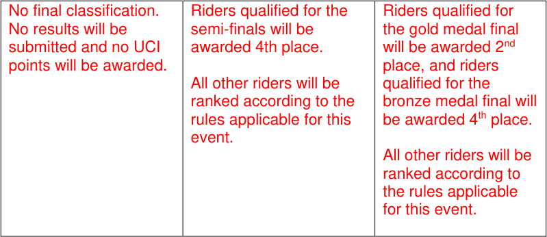
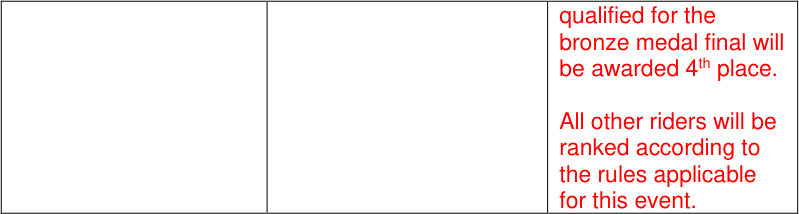

# MEMORANDUM

27.09.2024

### **Regulation amendments applying on 01.01.25**

## **PART 3 TRACK RACES**

#### **Chapter I ORGANISATION**

**3.1.009** The number of riders on track in competition shall in no case exceed:
16 (12 teams for Madison) on a 166m track
20 (15 teams for Madison) on a 200 m track
24 (18 teams for Madison) on a 250 m track
36 (20 teams for Madison) on a 333.33 m track

_(text modified on 01.01.03; 17.10.22; 01.01.25)_

#### **Chapter II TRACK RACES**

**§ 1** **General observations**

**Lap counter and bell**
**3.2.017** Unless otherwise provided in a specific provision, the start of the sprint lap(s),
**bis** including the last lap, of a race shall be indicated by a bell. The bell shall be rung
~~once only~~ when the leader on the track crosses the finish line, and again for any
rider or group of riders who may also be eligible for points in a sprint. Points will be
awarded, or the race will be over upon the next time the leader on the track crosses
the finish line. The final determination as to who the leader on the track is shall be
made by the president of the commissaires’ panel. Either the president, or a
commissaire designated by the president, shall indicate the leader on the track
during bunch races.

_(article introduced on 04.03.19; modified on 01.10.19; 01.01.25)_

**§ 3** **Sprint**

**3.2.048** In the case the event is interrupted for any reason, and it is not possible to
restart the
**bis** event before the end of the competition, the commissaires’ panel shall decide
pursuant to the table below:

|DECISIONS|Col2|Col3|
|---|---|---|
|Interrupted before completion of the 1/4 finals|Interrupted after completion of the 1/4 finals, but before the completion of the semi- finals|Interruption after the completion of the semi-finals|

Allée Ferdi Kübler 12
1860 Aigle
Switzerland

T: +41 24 468 58 11
E: admin@uci.ch

Page **1** / **29**

_(article introduced on 01.01.25)_

**§ 4** **Individual pursuit**

**Race stoppages**
**3.2.073** In the case the event is interrupted for any reason, and it is not possible to restart
**bis** and complete the event before the end of the competition, the commissaires’ panel
shall decide pursuant to the table below:

|DECISIONS|Col2|
|---|---|
|Interrupted before completion of the qualification round|Interrupted after completion of the qualification round|
|No final classification. No results will be submitted and no UCI points will be awarded.|Classification according to the results from the qualification round.|

_(article introduced on 01.01.25)_

**§ 5** **Team pursuit**

**Race stoppages**
**3.2.098** In the case the event interrupted for any reason, and it is not possible to restart
**bis** and complete the event before the end of the competition, the commissaires’ panel
shall decide pursuant to the table below:

|DECISIONS|Col2|Col3|
|---|---|---|
|Interrupted before completion of the qualification round|Interrupted after completion of the qualification round, before completion of the First round|Interruption after the completion of the First round|
|No final classification. No results will be submitted and no UCI points will be awarded.|Classification according to the results from the qualification round.|Riders qualified for the gold medal final will be awarded 2nd  place, and riders|

Page **2** / **29**

Allée Ferdi Kübler 12
1860 Aigle
Switzerland

T: +41 24 468 58 11
E: admin@uci.ch

_(article introduced on 01.01.25)_

**§ 6** **Kilometre and 500 metres** **Time Trial**

**Race Stoppages**
**3.2.108** All competitors must compete in the same session. If it is not possible for all the
participants to ride this race, for example because of atmospheric conditions, the
entire race shall be rerun in the following session and no account shall be taken of
the times previously made.

In the case the event is interrupted for any reason, and it is not possible to restart
and complete the event before the end of the competition, the commissaires’ panel
shall decide pursuant to the table below:

|DECISIONS|Col2|
|---|---|
|Interrupted before completion of the qualification round, or completion of the final in case of a direct final|Interrupted after completion of the qualification round|
|No final classification. No results will be submitted and no UCI points will be awarded.|Classification according to the results from the qualification round.|

_(text modified on 01.08.23; 01.01.25)_

**§ 7** **Points Race**

**Races Stoppages**
**3.2.133** If the race is interrupted for any reason, including if more than half the riders fall,
the commissaires’ panel shall determine the duration of the interruption. If the race
is restarted in the same session, it shall be restarted as follows:

        - The riders will restart with their already accumulated points;

        - The number of laps remaining in the race shall be adjusted to indicate the
number following the previously held sprint (for example, if the previously
held sprint was on 40 laps remaining and the race was stopped with 33 laps
remaining, the race shall be restarted with 39 laps remaining);

        - All riders will start together in a single group. In exceptional cases, the
commissaires’ panel my decide to allow riders who where more than a half
lap ahead of the declared main bunch to start a half lap ahead of the
remaining riders on the track.

Allée Ferdi Kübler 12
1860 Aigle
Switzerland

T: +41 24 468 58 11
E: admin@uci.ch

Page **3** / **29**

If it is not possible to restart the race in the same session, the commissaires’ panel
shall decide pursuant to the table below:

|DISTANCE|DECISIONS|Col3|Col4|
|---|---|---|---|
|~~**DISTANCE**~~|~~Complete rerun~~ ~~the same day~~|~~Resume race with~~ ~~points accumulated~~|~~Let results stand~~|
||~~Stopped before~~|~~Stopped between~~|~~Stopped after~~|
|~~10 km~~|~~8 km~~|~~/ ~~|~~8 km~~|
|~~15 / 16 km~~|~~10 km~~|~~/ ~~|~~10 km~~|
|~~20 km~~|~~10 km~~|~~10-15 km~~|~~15 km~~|
|~~24 / 25 km~~|~~10 km~~|~~10-20 km~~|~~20 km~~|
|~~30 km~~|~~15 km~~|~~15-25 km~~|~~25 km~~|
|~~40 km~~|~~15 km~~|~~15-30 km~~|~~30 km~~|

|DECISIONS|Col2|
|---|---|
|Race stopped before 40%|Complete rerun|
|Race stopped between 40-80%|Resume race with points accumulated/lost|
|Race stopped after 80%|Let results stand|

If less than 80% of the race is completed by the end of the competition, there will
be no final classification. No results will be submitted and no UCI points will be
awarded.

_(text modified on 01.01.02; 01.01.03, 01.08.23; 01.01.25)_

**§ 8** **Keirin**

**Race stoppages**
**3.2.143** In the case the event is stopped for any reason, and it is not possible to restart and
**bis** complete the event before the end of the competition, the commissaires’ panel
shall decide pursuant to the table below:

|DECISIONS|Col2|
|---|---|
|Interrupted before completion of the qualification round, 1/4 finals*, 1/2 finals*       *if applicable|Interrupted after completion of the qualification round, 1/4 finals*, 1/2 finals*, but before completion of the finals   *if applicable|
|No final classification. No results will be submitted and no UCI points will be awarded.|The last available position in the respective finals is attributed to the riders who qualified for the finals|

_(article introduced on 01.01.25)_

Allée Ferdi Kübler 12
1860 Aigle
Switzerland

T: +41 24 468 58 11
E: admin@uci.ch

Page **4** / **29**

**§ 9** **Team Sprint**

**Race stoppages**
**3.2.153** In the case the event is stopped for any reason, and it is not possible to restart and
**bis** complete the event before the end of the competition, the commissaires’ panel
shall decide pursuant to the table below:

|DECISIONS|Col2|Col3|
|---|---|---|
|Interrupted before completion of the qualification round|Interrupted after completion of the qualification round, before completion of the First round|Interruption after the completion of the First round|
|No final classification. No results will be submitted and no UCI points will be awarded.|Classification according to the results from the qualification round|Riders qualified for the gold medal final will be awarded 2nd  place, and riders qualified for the bronze medal final will be awarded 4th place.   All other riders will be ranked according to the rules applicable for this event|

_(article introduced on 01.01.25)_

**§ 10** **Madison**

**Organisation of the event**
**3.2.157** If the number of teams entered exceeds the track limit, qualifying heats shall take
place according to the tables below. The heats shall be run in such a way as to
qualify up to the track maximum number of teams, without necessarily qualifying
the maximum number of teams permitted. An equal number of teams shall be
eliminated from each heat, at a minimum of 2 teams per heat, among the teams
who have started the race.

The event shall be held over at least the following distances (number of laps), and
number of sprints as shown in the following table:

|TRACK LENGTH (in m)|Event|MEN ELITE|Col4|Col5|WOMEN ELITE|Col7|Col8|MEN JUNIOR|Col10|Col11|WOMEN JUNIOR|Col13|Col14|
|---|---|---|---|---|---|---|---|---|---|---|---|---|---|
|TRACK LENGTH (in m)|_Event_|_Distance_ _(km)_|_Laps_|_Sprint_|_Distance_ _(km)_|_Laps_|_Sprints_|_Distanc_ _(km)_|_Laps_|_Sprints_|_Distance_ _(km)_|_Laps_|_Sprints_|
|166|Qualif|15|90|9|10|60|6|10|60|6|10|60|6|
|166|Final|30|180|18|20|120|12|20|12|12|15|90|9|
|200|Qualif|14|70|7|10|50|5|10|50|5|8|40|4|
|200|Final|30|150|15|20|100|10|20|10|10|16|80|8|

Allée Ferdi Kübler 12
1860 Aigle
Switzerland

T: +41 24 468 58 11
E: admin@uci.ch

Page **5** / **29**

|250|Qualif|15|60|6|10|40|4|10|40|4|10|40|4|
|---|---|---|---|---|---|---|---|---|---|---|---|---|---|
|250|Final|30|120|12|20|80|8|20|80|8|15|60|6|
|285.714|Qualif|16|56|5|12|42|4|12|42|4|10|35|3|
|285.714|Final|30|105|10|20|70|7|20|70|7|16|56|5|
|333.33|Qualif|14|42|8|10|30|6|10|30|6|10|30|6|
|333.33|Final|30|90|18|20|60|12|20|60|12|16|48|9|
|400|Qualif|14|35|7|10|25|5|10|25|5|8|20|4|
|400|Final|30|75|15|20|50|10|20|50|10|16|40|8|

_At Nations Cup, Continental Championships, World Championships and Olympic_
_Games, the distances, number of laps and number of sprints shall be as shown in_
_the following table:_

|TRACK LENGT H (in m)|Event|MEN ELITE|Col4|Col5|WOMEN ELITE|Col7|Col8|MEN JUNIOR|Col10|Col11|WOMEN JUNIOR|Col13|Col14|
|---|---|---|---|---|---|---|---|---|---|---|---|---|---|
|TRACK LENGT H  (in m)|_Event_|_Distanc_ _e (km)_|_Laps_|_Sprints_|_Distanc_ _e (km)_|_Laps_|_Sprints_|_Distance_ _(km)_|_Laps_|_Sprints_|_Distanc_ _e (km)_|_Laps_|_Sprints_|
|200|Qualif.|25|125|12|15|75|7|15|75|7|10|50|5|
|200|Final|50|250|25|30|150|15|30|150|15|20|100|10|
|250|Qualif.|25|100|10|15|60|6|15|60|6|10|40|4|
|250|Final|50|200|20|30|120|12|30|120|12|20|80|8|
|285.71 4|Qualif.|25.1|88|8|15.1|53|5|15.1|53|5|10|35|3|
|285.71 4|Final|50|175|17|30|105|10|30|105|10|20|70|7|
|333.33|Qualif.|25|75|15|14|42|8|14|42|8|10|30|6|
|333.33|Final|50|150|30|30|90|18|30|90|18|20|60|12|
|400|Qualif.|26|65|12|14|35|7|14|35|7|10|25|5|
|400|Final|50|125|25|30|75|15|30|75|15|20|50|10|

There shall be an equal number of laps between all sprints, starting from the final
sprint, according to the following:
Tracks of less than 333.33m – 10 laps
Tracks of 333.3m or more – 5 laps

In the case where the total number of laps is not divisible by the indicated number
of laps between sprints, the “additional” laps shall be ridden prior to the first sprint.
(For example, on a 285.7m track, sprints are held every 10 laps. If the race is 56
laps, the first sprint will take place after 16 laps, and then every 10 laps thereafter).

_(text modified on 01.01.02; 30.03.09; 01.07.17; 04.03.19; 01.10.19; 17.10.22,_
_01.08.23; 01.01.25)_

**Race Stoppages**
**3.2.172** If the race is stopped for any reason, including if more than half the teams fall
(calculated on the basis of one rider per team), the commissaires’ panel shall
determine the duration of the interruption. If the race is restarted in the same
session, it shall be restarted as follows:

             - The teams will restart with their already accumulated points (or laps
depending on the type of race).

Allée Ferdi Kübler 12
1860 Aigle
Switzerland

T: +41 24 468 58 11
E: admin@uci.ch

Page **6** / **29**

            - The number of laps remaining in the race shall be adjusted to indicate the
number following the previously held sprint (for example, if the previously
held sprint was on 40 laps remaining, and the race was stopped with 33
laps remaining, the race shall be restarted with 39 laps remaining);

            - The restart will be held as for a normal Madison race start. No account shall
be taken of any team who were off the front or back of the main bunch at
the time the race was stopped. The racing riders shall start as a single
group.

If it is not possible to restart the race in the same session, the commissaires’ panel
shall decide pursuant to the table below:

|CATEGORY|DECISIONS|Col3|Col4|
|---|---|---|---|
|~~**CATEGORY**~~|~~Complete rerun~~|~~Resume race with points~~ ~~accumulated~~ ~~(or laps gained or lost)~~|~~Let results stand~~|
||~~Stopped before~~|~~Stopped between~~|~~Stopped after~~|
|~~MEN & WOMEN ELITE~~|~~20 km~~|~~20-40 km~~|~~40 km~~|
|~~MEN & WOMEN JUNIOR~~|~~10 km~~|~~10-25 km~~|~~25 km~~|
|~~Percentage of the race~~ ~~distance~~|~~Stopped before 40%~~|~~Stopped between 40-80%~~|~~Stopped after 80%~~|

|DECISIONS|Col2|
|---|---|
|Race stopped before 40%|Complete rerun|
|Race stopped between 40-80%|Resume race with points accumulated/lost|
|Race stopped after 80%|Let results stand|

If less than 80% of the race is completed by the end of the competition, there will
be no final classification. No results will be submitted and no UCI points will be
awarded.

_(text modified on 01.01.03; 14.10.16, 01.08.23; 01.01.25)_

**§ 15** **Six-Day Races**

**3.2.227** ~~A “Six-Day Race” shall last six consecutive days with at least 24 hours’ racing time.~~

[abrogated on 01.01.25]

**3.2.228** The organiser shall be free to set the duration and the programme of the “Six-Day
Race” within the limits set in the ~~article 3.2.227~~ articles of this section.

_(text modified on 01.01.04; 01.01.25)_

**§ 16** **Omnium**
(chapter introduced on 07.07.06)

**3.2.247** In competitions for which the number or riders entered exceeds the track limit and
**bis** there is no existing qualification system to establish the number of participating
riders, their selection shall be determined as follows:

Allée Ferdi Kübler 12
1860 Aigle
Switzerland

T: +41 24 468 58 11
E: admin@uci.ch

Page **7** / **29**

All riders entered shall first participate in qualifying Points Race heats run over the
distance and with the number of sprints, as per the regulations for Points Race
qualifying heats. The heats shall be ~~over half of the distance of the final Points~~
~~Race and~~ run in such a way so as to qualify up to the track maximum number of
riders, without necessarily qualifying the maximum number of riders permitted. An
equal number of riders shall be eliminated from each heat, at a minimum of 2 riders
per heat, among the riders who have started the race.

All riders not qualifying to participate in the Omnium shall be placed jointly in last
position. Any riders not finishing any of the qualifying rounds shall not be placed
(DNF).

_(article introduced on 18.06.10, text modified on 01.08.23; 01.01.25)_

**Race Stoppages**
**3.2.252** During the Omnium, in the case one of the races is stopped for any reason, and
**bis** the omnium can’t be completed before the end of the competition, the
commissaires shall decide as follow:

During the final Points Race, article 3.2.133 shall be applied. In the case where
less than 80% of the distance of the Points Race has been completed, but cannot
be restarted, the intermediate standings after the Elimination Race will become the
final classification of the Omnium.

If the track becomes impracticable after the Elimination Race has been completed,
but before the start of the final Points Race, the intermediate standings will become
the final classification of the omnium.

If the track becomes impracticable before the Elimination Race has been
completed, no final classification will be considered for the omnium. As a result, no
results will be submitted and no UCI points will be awarded for the Omnium.

_(article introduced on 01.01.25)_

Allée Ferdi Kübler 12
1860 Aigle
Switzerland

T: +41 24 468 58 11
E: admin@uci.ch

Page **8** / **29**

#### **Chapter III UCI TRACK RANKINGS**

**3.3.001** The UCI has created an individual classification system for riders of elite and junior
categories participating in the races referred to in article 3.3.009.

Points won in competitions for the under 23 category will be integrated in the elite
classification.

This classification shall be called the “UCI Track Ranking” and shall be the
exclusive property of the UCI.

The UCI Track Ranking is composed of the following rankings:
UCI Nation Rankings

             - Endurance ranking

`o` includes the Omnium, Scratch Race, Points Race & Elimination Race

events

             - Sprint ranking

`o` includes the Sprint & Keirin events

             - Madison ranking

             - Team Pursuit ranking

             - Team Sprint ranking

UCI Individual Rankings

             - Endurance ranking

`o` includes the Omnium, Scratch Race, Points Race & Elimination Race

events

             - Sprint ranking

`o` includes the Sprint & Keirin events

             - Madison ranking

             - Team Pursuit ranking

             - Team Sprint ranking

_(text modified on 25.09.07; 15.03.16; 01.01.25)_

**UCI Nation Ranking**
**3.3.002** A classification by nation for men and women, of elite and junior categories, is also
drawn up for each competition referred to in article 3.3.009 and shall be the
exclusive property of the UCI.

~~A rider’s or team’s points are counted both in the UCI Nation Ranking and UCI~~
~~Track Team Ranking, whether a rider or team competes in an event with a national~~
~~team or UCI Track Team. As an exception, for Nations Cup, the points of a rider or~~
~~team participating with the national team are only counted in the UCI Nation~~
~~Ranking and the points of a rider or team participating with a UCI Track Team are~~
~~only counted in the UCI Track Team Ranking.~~

For team events (Madison excluded), the UCI Ranking by Nations is calculated by
summing the points in each competition up to the following maximum quota, equal
to the regular number of riders composing the team.

MEN WOMEN
Team Pursuit: 4 Team Pursuit: 4
Team Sprint: 3 Team Sprint: 3

Allée Ferdi Kübler 12
1860 Aigle
Switzerland

T: +41 24 468 58 11
E: admin@uci.ch

Page **9** / **29**

Once a nation has reached its maximum quota in an event, its riders over quota
will not receive any points.

For ~~individual events and~~ the Madison ranking, the Endurance ranking and the
Sprint ranking, the UCI Nation Ranking is calculated by summing the points in each
competition as follows:

          - when applicable, the best Olympic Games result in each of the events
included in the respective ranking

          - the best World Championships result (as per the maximum number of riders
by nationality stipulated in article 9.2.022) in each of the events included in
the respective ranking

          - the best Continental Championships result (as per the maximum number of
riders by nationality stipulated in article 10.1.005) in each of the events
included in the respective ranking

          - the best Nations Cup result (as per the maximum number of riders by
nationality stipulated in article 3.4.007) in each of the events included in the
respective ranking

          - the best ~~9~~ 3 Class 1 results (including Regional Games) in each of the events
included in the respective ranking

          - the best ~~9~~ 3 Class 2 results (including Regional Games) in each of the events
included in the respective ranking

          - the best National Championships result in each of the events included in the
respective ranking

Tied nations shall have their positions determined as per article 3.3.011.

_(text modified on 30.09.10; 14.10.16; 05.03.18; 21.06.18; 12.06.20;_ _25.10.21,_
_01.08.23; 01.01.25)_

**UCI Track Team Ranking**
**3.3.002** ~~A classification by team for men and women, of elite categories, is also drawn up~~
**bis** ~~for each competition referred to in article 3.3.009 and shall be the exclusive~~
~~property of the UCI.~~

~~A rider’s or team’s points are counted both in the UCI Nation Ranking and UCI~~
~~Track Team Ranking, whether a rider or team competes in an event with a national~~
~~team or UCI Track Team. As an exception, for Nations Cup, the points of a rider or~~
~~team participating with the national team are only counted in the UCI Nation~~
~~Ranking and the points of a rider or team participating with a UCI Track Team are~~
~~only counted in the UCI Track Team Ranking.~~

~~For team events (Madison excluded), the UCI Track Team Ranking is calculated~~
~~by summing the points in each competition up to the following maximum quota,~~
~~equal to the regular number of riders composing the team.~~

~~MEN~~ ~~WOMEN~~
~~Team Pursuit: 4~~ ~~Team Pursuit: 4~~
~~Team Sprint: 3~~ ~~Team Sprint: 3~~

~~Once a UCI Track Team has reached its maximum quota in an event, its riders~~
~~over quota will not receive any points.~~

~~For individual events and the Madison, the UCI Track Team Ranking is calculated~~
~~by summing the points in each competition as follows:~~

Allée Ferdi Kübler 12
1860 Aigle
Switzerland

T: +41 24 468 58 11
E: admin@uci.ch

Page **10** / **29**

~~-~~ ~~when applicable, the best Olympic Games result~~

~~-~~ ~~the best UCI World Championships result (as per the maximum number of~~
~~riders by nationality stipulated in article 9.2.022)~~

~~-~~ ~~the best Continental Championships result (as per the maximum number of~~
~~riders by nationality stipulated in article 10.1.005)~~

~~-~~ ~~the best UCI Nations Cup result (as per the maximum number of riders by~~
~~UCI Track Team stipulated in article 3.4.007bis)~~

~~-~~ ~~the best 9 Class 1 results (including Regional Games)~~

~~-~~ ~~the best 9 Class 2 results (including Regional Games)~~

~~-~~ ~~the best National Championships result~~

~~Tied UCI Track Teams shall have their positions determined as per article 3.3.011.~~

~~(article introduced on 25.10.21, text modified on 01.08.23)~~

[abrogated on 01.01.25]

**3.3.003** The classification shall be established according to the points obtained by riders
participating in Track competitions on the International calendar, divided into
classes according to article 3.8.003.

~~Track competitions on the International calendar having 50% and more of the riders~~
~~per category being invited~~ ~~will be awarded Class 2 points.~~

The classification is drawn up over a period of one year by adding the points won
since the preceding ranking was drawn up. At the same time, the remaining points
obtained up to the same day of the previous year by each rider in international
track cycling competitions are deducted.

If during the one-year period two national, continental or World Championships are
held in the same category, only the points of the most recent one will be taken into
account. Points of the continental and World championships remain on the track
classification until the next edition or for a maximum period of 18 months.

The UCI may grant dispensation in case of unpredictable late change of the Elite
World Championships dates.

_(text modified on 10.06.05; 25.09.08; 01.10.12; 14.10.16; 21.06.18; 04.03.19;_
_17.10.2022)_

**UCI** **Individual Ranking**
**3.3.010** Points are awarded according to the following scale, with only the best results of
each rider in each of the events included in the respective rankings taken into
account as follows:

          - when applicable, the Olympic Games result

          - the UCI World Championships result

          - the Continental Championships result

          - the best UCI Nations Cup result

          - the UCI Track Champions League results

          - the best 3 Class 1 results (including Regional Games)

          - the best 3 Class 2 results (including Regional Games)

          - the National Championships result

_(text modified on 12.06.20; 25.10.21; 01.08.23; 01.01.25)_

Allée Ferdi Kübler 12
1860 Aigle
Switzerland

T: +41 24 468 58 11
E: admin@uci.ch

Page **11** / **29**

|ELITE / JUNIOR Men and Women|Col2|Col3|Col4|Col5|
|---|---|---|---|---|
||Rank|World Championships Olympic Games*|Nations Cup*|Continental Championships|
|Individual events Omnium, Sprint, Keirin|1|1000|800|600|
|Individual events Omnium, Sprint, Keirin|2|900|720|540|
|Individual events Omnium, Sprint, Keirin|3|800|640|480|
|Individual events Omnium, Sprint, Keirin|4|750|600|450|
|Individual events Omnium, Sprint, Keirin|5|700|560|420|
|Individual events Omnium, Sprint, Keirin|6|650|520|390|
|Individual events Omnium, Sprint, Keirin|7|600|480|360|
|Individual events Omnium, Sprint, Keirin|8|550|440|330|
|Individual events Omnium, Sprint, Keirin|9|500|400|300|
|Individual events Omnium, Sprint, Keirin|10|450|360|270|
|Individual events Omnium, Sprint, Keirin|11|410|328|246|
|Individual events Omnium, Sprint, Keirin|12|380|304|228|
|Individual events Omnium, Sprint, Keirin|13|350|280|210|
|Individual events Omnium, Sprint, Keirin|14|320|256|192|
|Individual events Omnium, Sprint, Keirin|15|290|232|174|
|Individual events Omnium, Sprint, Keirin|16|260|208|156|
|Individual events Omnium, Sprint, Keirin|17|197|192|144|
|Individual events Omnium, Sprint, Keirin|18|181|176|132|
|Individual events Omnium, Sprint, Keirin|19|165|160|120|
|Individual events Omnium, Sprint, Keirin|20|149|144|108|
|Individual events Omnium, Sprint, Keirin|21|133|128|96|
|Individual events Omnium, Sprint, Keirin|22|117|112|84|
|Individual events Omnium, Sprint, Keirin|23|101|96|72|
|Individual events Omnium, Sprint, Keirin|24|85|80|60|
|Individual events Omnium, Sprint, Keirin|25 to X|1|1|1|

*Elite only

Allée Ferdi Kübler 12
1860 Aigle
Switzerland

T: +41 24 468 58 11
E: admin@uci.ch

Page **12** / **29**

|ELITE / JUNIOR Men and Women|Col2|Col3|Col4|Col5|
|---|---|---|---|---|
||Rank|World Championships Olympic Games*|Nations Cup*|Continental Championships|
|Scratch Race, Elimination Race, Points Race|1|750|600|450|
|Scratch Race, Elimination Race, Points Race|2|675|540|405|
|Scratch Race, Elimination Race, Points Race|3|600|480|360|
|Scratch Race, Elimination Race, Points Race|4|560|450|335|
|Scratch Race, Elimination Race, Points Race|5|525|420|315|
|Scratch Race, Elimination Race, Points Race|6|487|390|292|
|Scratch Race, Elimination Race, Points Race|7|450|360|270|
|Scratch Race, Elimination Race, Points Race|8|410|330|248|
|Scratch Race, Elimination Race, Points Race|9|375|300|225|
|Scratch Race, Elimination Race, Points Race|10|335|270|205|
|Scratch Race, Elimination Race, Points Race|11|310|246|185|
|Scratch Race, Elimination Race, Points Race|12|285|228|171|
|Scratch Race, Elimination Race, Points Race|13|262|210|157|
|Scratch Race, Elimination Race, Points Race|14|240|192|144|
|Scratch Race, Elimination Race, Points Race|15|217|174|130|
|Scratch Race, Elimination Race, Points Race|16|195|156|117|
|Scratch Race, Elimination Race, Points Race|17|150|144|108|
|Scratch Race, Elimination Race, Points Race|18|135|132|99|
|Scratch Race, Elimination Race, Points Race|19|125|120|90|
|Scratch Race, Elimination Race, Points Race|20|112|108|81|
|Scratch Race, Elimination Race, Points Race|21|100|96|72|
|Scratch Race, Elimination Race, Points Race|22|87|84|63|
|Scratch Race, Elimination Race, Points Race|23|75|72|54|
|Scratch Race, Elimination Race, Points Race|24|65|60|45|
|Scratch Race, Elimination Race, Points Race|25 to X|1|1|1|

*Elite only

Allée Ferdi Kübler 12
1860 Aigle
Switzerland

T: +41 24 468 58 11
E: admin@uci.ch

Page **13** / **29**

|ELITE / JUNIOR Men and Women|Col2|Col3|Col4|Col5|
|---|---|---|---|---|
||Rank|World Championships Olympic Games*|Nations Cup*|Continental Championships|
|Madison|1|2000 (2 x 1000)|1600 (2 x 800)|1200 (2 x 600)|
|Madison|2|1800 (2 x 900)|1440 (2 x 720)|1080 (2 x 540)|
|Madison|3|1600 (2 x 800)|1280 (2 x 640)|960 (2 x 480)|
|Madison|4|1500 (2 x 750)|1200 (2 x 600)|900 (2 x 450)|
|Madison|5|1400 (2 x 700)|1120 (2 x 560)|840 (2 x 420)|
|Madison|6|1300 (2 x 650)|1040 (2 x 520)|780 (2 x 390)|
|Madison|7|1200 (2 x 600)|960 (2 x 480)|720 (2 x 360)|
|Madison|8|1100 (2 x 550)|880 (2 x 440)|660 (2 x 330)|
|Madison|9|1000 (2 x 500)|800 (2 x 400)|600 (2 x 300)|
|Madison|10|900 (2 x 450)|720 (2 x 360)|540 (2 x 270)|
|Madison|11|820 (2 x 410)|656 (2 x 328)|492 (2 x 246)|
|Madison|12|760 (2 x 380)|608 (2 x 304)|456 (2 x 228)|
|Madison|13|570 (2 x 285)|560 (2 x 280)|420 (2 x 210)|
|Madison|14|522 (2 x 261)|512 (2 x 256)|384 (2 x 192)|
|Madison|15|474 (2 x 237)|464 (2 x 232)|348 (2 x 174)|
|Madison|16|426 (2 x 213)|416 (2 x 208)|312 (2 x 156)|
|Madison|17|394 (2 x 197)|384 (2 x 192)|288 (2 x 144)|
|Madison|18|362 (2 x 181)|352 (2 x 176)|264 (2 x 132)|
|Madison|19 to X|2 (2 x 1)|2 (2 x 1)|2 (2 x 1)|

*Elite only

Allée Ferdi Kübler 12
1860 Aigle
Switzerland

T: +41 24 468 58 11
E: admin@uci.ch

Page **14** / **29**

|ELITE / JUNIOR Men and Women|Col2|Col3|Col4|Col5|
|---|---|---|---|---|
||Rank|World Championships Olympic Games*|Nations Cup*|Continental Championships|
|Team Pursuit|1|2000 (4 x 500)|1600 (4 x 400)|1200 (4 x 300)|
|Team Pursuit|2|1800 (4 x 450)|1440 (4 x 360)|1080 (4 x 270)|
|Team Pursuit|3|1600 (4 x 400)|1280 (4 x 320)|960 (4 x 240)|
|Team Pursuit|4|1500 (4 x 375)|1200 (4 x 300)|900 (4 x 225)|
|Team Pursuit|5|1400 (4 x 350)|1120 (4 x 280)|840 (4 x 210)|
|Team Pursuit|6|1300 (4 x 325)|1040 (4 x 260)|780 (4 x 195)|
|Team Pursuit|7|1200 (4 x 300)|960 (4 x 240)|720 (4 x 180)|
|Team Pursuit|8|1100 (4 x 275)|880 (4 x 220)|660 (4 x 165)|
|Team Pursuit|9|1000 (4 x 250)|800 (4 x 200)|600 (4 x 150)|
|Team Pursuit|10|900 (4 x 225)|720 (4 x 180)|540 (4 x 135)|
|Team Pursuit|11|820 (4 x 205)|656 (4 x 164)|492 (4 x 123)|
|Team Pursuit|12|760 (4 x 190)|608 (4 x 152)|456 (4 x 114)|
|Team Pursuit|13|700 (4 x 175)|560 (4 x 140)|420 (4 x 105)|
|Team Pursuit|14|640 (4 x 160)|512 (4 x 128)|384 (4 x 96)|
|Team Pursuit|15|580 (4 x 145)|464 (4 x 116)|348 (4 x 87)|
|Team Pursuit|16|520 (4 x 130)|416 (4 x 104)|312 (4 x 78)|
|Team Pursuit|17|404 (4 x 101)|384 (4 x 96)|288 (4 x 72)|
|Team Pursuit|18|372 (4 x 93)|352 (4 x 88)|264 (4 x 66)|
|Team Pursuit|19|340 (4 x 85)|320 (4 x 80)|240 (4 x 60)|
|Team Pursuit|20|308 (4 x 77)|288 (4 x 72)|216 (4 x 54)|
|Team Pursuit|21|276 (4 x 69)|256 (4 x 64)|192 (4 x 48)|
|Team Pursuit|22|244 (4 x 61)|224 (4 x 56)|168 (4 x 42)|
|Team Pursuit|23|212 (4 x 53)|192 (4 x 48)|144 (4 x 36)|
|Team Pursuit|24|180 (4 x 45)|160 (4 x 40)|120 (4 x 30)|
|Team Pursuit|25 to X|2 (4 x 0.5)|2 (4 x 0,5)|2 (4 x 0,5)|

*Elite only

Allée Ferdi Kübler 12
1860 Aigle
Switzerland

T: +41 24 468 58 11
E: admin@uci.ch

Page **15** / **29**

|ELITE / JUNIOR Men and Women|Col2|Col3|Col4|Col5|
|---|---|---|---|---|
||Rank|World Championships Olympic Games*|Nations Cup*|Continental Championships|
|Team Sprint|1|1500 (3 x 500)|1200 (3 x 400)|900 (3 x 300)|
|Team Sprint|2|1350 (3 x 450)|1080 (3 x 360)|810 (3 x 270)|
|Team Sprint|3|1200 (3 x 400)|960 (3 x 320)|720 (3 x 240)|
|Team Sprint|4|1125 (3 x 375)|900 (3 x 300)|675 (3 x 225)|
|Team Sprint|5|1050 (3 x 350)|840 (3 x 280)|630 (3 x 210)|
|Team Sprint|6|975 (3 x 325)|780 (3 x 260)|585 (3 x 195)|
|Team Sprint|7|900 (3 x 300)|720 (3 x 240)|540 (3 x 180)|
|Team Sprint|8|825 (3 x 275)|660 (3 x 220)|495 (3 x 165)|
|Team Sprint|9|750 (3 x 250)|600 (3 x 200)|450 (3 x 150)|
|Team Sprint|10|675 (3 x 225)|540 (3 x 180)|405 (3 x 135)|
|Team Sprint|11|615 (3 x 205)|492 (3 x 164)|369 (3 x 123)|
|Team Sprint|12|570 (3 x 190)|456 (3 x 152)|342 (3 x 114)|
|Team Sprint|13|525 (3 x 175)|420 (3 x 140)|315 (3 x 105)|
|Team Sprint|14|480 (3 x 160)|384 (3 x 128)|288 (3 x 96)|
|Team Sprint|15|435 (3 x 145)|348 (3 x 116)|261 (3 x 87)|
|Team Sprint|16|390 (3 x 130)|312 (3 x 104)|234 (3 x 78)|
|Team Sprint|17|303 (3 x 101)|288 (3 x 96)|216 (3 x 72)|
|Team Sprint|18|279 (3 x 93)|264 (3 x 88)|198 (3 x 66)|
|Team Sprint|19|255 (3 x 85)|240 (3 x 80)|180 (3 x 60)|
|Team Sprint|20|231 (3 x 77)|216 (3 x 72)|162 (3 x 54)|
|Team Sprint|21|207 (3 x 69)|192 (3 x 64)|144 (3 x 48)|
|Team Sprint|22|183 (3 x 61)|168 (3 x 56)|126 (3 x 42)|
|Team Sprint|23|159 (3 x 53)|144 (3 x 48)|108 (3 x 36)|
|Team Sprint|24|135 (3 x 45)|120 (3 x 40)|90 (3 x 30)|
|Team Sprint|25 to X|1.5 (3 x 0.5)|1.5 (3 x 0.5)|1.5 (3 x 0.5)|

*Elite only

Allée Ferdi Kübler 12
1860 Aigle
Switzerland

T: +41 24 468 58 11
E: admin@uci.ch

Page **16** / **29**

|ELITE / JUNIOR Men and Women|Col2|Col3|Col4|
|---|---|---|---|
||Rank|Class 1|Class 2 National Championships|
|Individual events  Omnium, Sprint, Keirin|1|200|100|
|Individual events  Omnium, Sprint, Keirin|2|180|90|
|Individual events  Omnium, Sprint, Keirin|3|160|80|
|Individual events  Omnium, Sprint, Keirin|4|150|75|
|Individual events  Omnium, Sprint, Keirin|5|140|70|
|Individual events  Omnium, Sprint, Keirin|6|130|65|
|Individual events  Omnium, Sprint, Keirin|7|120|60|
|Individual events  Omnium, Sprint, Keirin|8|110|55|
|Individual events  Omnium, Sprint, Keirin|9|100|50|
|Individual events  Omnium, Sprint, Keirin|10|90|45|
|Individual events  Omnium, Sprint, Keirin|11|82|41|
|Individual events  Omnium, Sprint, Keirin|12|76|38|
|Individual events  Omnium, Sprint, Keirin|13|70|35|
|Individual events  Omnium, Sprint, Keirin|14|64|32|
|Individual events  Omnium, Sprint, Keirin|15|58|29|
|Individual events  Omnium, Sprint, Keirin|16|52|26|
|Individual events  Omnium, Sprint, Keirin|17|48|24|
|Individual events  Omnium, Sprint, Keirin|18|44|22|
|Individual events  Omnium, Sprint, Keirin|19|40|20|
|Individual events  Omnium, Sprint, Keirin|20|36|18|
|Individual events  Omnium, Sprint, Keirin|21|32|16|
|Individual events  Omnium, Sprint, Keirin|22|28|14|
|Individual events  Omnium, Sprint, Keirin|23|24|12|
|Individual events  Omnium, Sprint, Keirin|24|20|10|
|Individual events  Omnium, Sprint, Keirin|25 to X|1|1|

Allée Ferdi Kübler 12
1860 Aigle
Switzerland

T: +41 24 468 58 11
E: admin@uci.ch

Page **17** / **29**

|ELITE / JUNIOR Men and Women|Col2|Col3|Col4|
|---|---|---|---|
||Rank|Class 1|Class 2 National Championships|
|Scratch Race, Elimination Race, Points Race|1|150|75|
|Scratch Race, Elimination Race, Points Race|2|135|68|
|Scratch Race, Elimination Race, Points Race|3|120|60|
|Scratch Race, Elimination Race, Points Race|4|112|56|
|Scratch Race, Elimination Race, Points Race|5|105|52|
|Scratch Race, Elimination Race, Points Race|6|98|49|
|Scratch Race, Elimination Race, Points Race|7|90|45|
|Scratch Race, Elimination Race, Points Race|8|82|41|
|Scratch Race, Elimination Race, Points Race|9|75|37|
|Scratch Race, Elimination Race, Points Race|10|68|34|
|Scratch Race, Elimination Race, Points Race|11|62|31|
|Scratch Race, Elimination Race, Points Race|12|57|28|
|Scratch Race, Elimination Race, Points Race|13|52|26|
|Scratch Race, Elimination Race, Points Race|14|48|24|
|Scratch Race, Elimination Race, Points Race|15|44|22|
|Scratch Race, Elimination Race, Points Race|16|39|20|
|Scratch Race, Elimination Race, Points Race|17|36|18|
|Scratch Race, Elimination Race, Points Race|18|33|16|
|Scratch Race, Elimination Race, Points Race|19|30|15|
|Scratch Race, Elimination Race, Points Race|20|27|14|
|Scratch Race, Elimination Race, Points Race|21|24|12|
|Scratch Race, Elimination Race, Points Race|22|21|10|
|Scratch Race, Elimination Race, Points Race|23|18|9|
|Scratch Race, Elimination Race, Points Race|24|15|8|
|Scratch Race, Elimination Race, Points Race|25 to X|1|1|

Allée Ferdi Kübler 12
1860 Aigle
Switzerland

T: +41 24 468 58 11
E: admin@uci.ch

Page **18** / **29**

|ELITE / JUNIOR Men and Women|Col2|Col3|Col4|
|---|---|---|---|
||Rank|Class 1|Class 2 National Championships|
|Madison|1|400 (2 x 200)|200 (2 x 100)|
|Madison|2|360 (2 x 180)|180 (2 x 90)|
|Madison|3|320 (2 x 160)|160 (2 x 80)|
|Madison|4|300 (2 x 150)|150 (2 x 75)|
|Madison|5|280 (2 x 140)|140 (2 x 70)|
|Madison|6|260 (2 x 130)|130 (2 x 65)|
|Madison|7|240 (2 x 120)|120 (2 x 60)|
|Madison|8|220 (2 x 110)|110 (2 x 55)|
|Madison|9|200 (2 x 100)|100 (2 x 50)|
|Madison|10|180 (2 x 90)|90 (2 x 45)|
|Madison|11|164 (2 x 82)|82 (2 x 41)|
|Madison|12|152 (2 x 76)|76 (2 x 38)|
|Madison|13|140 (2 x 70)|70 (2 x 35)|
|Madison|14|128 (2 x 64)|64 (2 x 32)|
|Madison|15|116 (2 x 58)|58 (2 x 29)|
|Madison|16|104 (2 x 52)|52 (2 x 26)|
|Madison|17|96 (2 x 48)|48 (2 x 24)|
|Madison|18|88 (2 x 44)|44 (2 x 22)|
|Madison|19 to X|2 (2 x 1)|2 (2 x 1)|

Allée Ferdi Kübler 12
1860 Aigle
Switzerland

T: +41 24 468 58 11
E: admin@uci.ch

Page **19** / **29**

|ELITE / JUNIOR Men and Women|Col2|Col3|Col4|
|---|---|---|---|
||Rank|Class 1|Class 2 National Championships|
|Team Pursuit|1|400 (4 x 100)|200 (4 x 50)|
|Team Pursuit|2|360 (4 x 90)|180 (4 x 45)|
|Team Pursuit|3|320 (4 x 80)|160 (4 x 40)|
|Team Pursuit|4|300 (4 x 75)|150 (4 x 37,5)|
|Team Pursuit|5|280 (4 x 70)|140 (4 x 35)|
|Team Pursuit|6|260 (4 x 65)|130 (4 x 32,5)|
|Team Pursuit|7|240 (4 x 60)|120 (4 x 30)|
|Team Pursuit|8|220 (4 x 55)|110 (4 x 27,5)|
|Team Pursuit|9|200 (4 x 50)|100 (4 x 25)|
|Team Pursuit|10|180 (4 x 45)|90 (4 x 22,5)|
|Team Pursuit|11|164 (4 x 41)|82 (4 x 20,5)|
|Team Pursuit|12|152 (4 x 38)|76 (4 x 19)|
|Team Pursuit|13|140 (4 x 35)|70 (4 x 17,5)|
|Team Pursuit|14|128 (4 x 32)|64 (4 x 16)|
|Team Pursuit|15|116 (4 x 29)|58 (4 x 14,5)|
|Team Pursuit|16|104 (4 x 26)|52 (4 x 13)|
|Team Pursuit|17|96 (4 x 24)|48 (4 x 12)|
|Team Pursuit|18|88 (4 x 22)|44 (4 x 11)|
|Team Pursuit|19|80 (4 x 20)|40 (4 x 10)|
|Team Pursuit|20|72 (4 x 18)|36 (4 x 9)|
|Team Pursuit|21|64 (4 x 16)|32 (4 x 8)|
|Team Pursuit|22|56 (4 x 14)|28 (4 x 7)|
|Team Pursuit|23|48 (4 x 12)|24 (4 x 6)|
|Team Pursuit|24|40 (4 x 10)|20 (4 x 5)|
|Team Pursuit|25 to X|2 (4 x 0.5)|2 (4 x 0.5)|

Allée Ferdi Kübler 12
1860 Aigle
Switzerland

T: +41 24 468 58 11
E: admin@uci.ch

Page **20** / **29**

|ELITE / JUNIOR Men and Women|Col2|Col3|Col4|
|---|---|---|---|
||Rank|Class 1|Class 2 National Championships|
|Team Sprint|1|300 (3 x 100)|150 (3 x 50)|
|Team Sprint|2|270 (3 x 90)|135 (3 x 45)|
|Team Sprint|3|240 (3 x 80)|120 (3 x 40)|
|Team Sprint|4|225 (3 x 75)|112,5 (3 x 37,5)|
|Team Sprint|5|210 (3 x 70)|105 (3 x 35)|
|Team Sprint|6|195 (3 x 65)|97,5 (3 x 32,5)|
|Team Sprint|7|180 (3 x 60)|90 (3 x 30)|
|Team Sprint|8|165 (3 x 55)|82,5 (3 x 27,5)|
|Team Sprint|9|150 (3 x 50)|75 (3 x 25)|
|Team Sprint|10|135 (3 x 45)|67,5 (3 x 22,5)|
|Team Sprint|11|123 (3 x 41)|61,5 (3 x 20,5)|
|Team Sprint|12|114 (3 x 38)|57 (3 x 19)|
|Team Sprint|13|105 (3 x 35)|52,5 (3 x 17,5)|
|Team Sprint|14|96 (3 x 32)|48 (3 x 16)|
|Team Sprint|15|87 (3 x 29)|43,5 (3 x 14,5)|
|Team Sprint|16|78 (3 x 26)|39 (3 x 13)|
|Team Sprint|17|72 (3 x 24)|36 (3 x 12)|
|Team Sprint|18|66 (3 x 22)|33 (3 x 11)|
|Team Sprint|19|60 (3 x 20)|30 (3 x 10)|
|Team Sprint|20|54 (3 x 18)|27 (3 x 9)|
|Team Sprint|21|48 (3 x 16)|24 (3 x 8)|
|Team Sprint|22|42 (3 x 14)|21 (3 x 7)|
|Team Sprint|23|36 (3 x 12)|18 (3 x 6)|
|Team Sprint|24|30 (3 x 10)|15 (3 x 5)|
|Team Sprint|25 to X|1.5 (3 x 0.5)|1.5 (3 x 0.5)|

_(text modified on 10.06.05; 19.09.06; 25.09.07; 13.06.08, 29.03.10; 1.07.12; 1.02.13; 10.04.13;_
_15.03.16; 14.10.16; 01.07.17; 05.03.18; 21.06.18, 12.06.20; 17.10.2022; 01.01.25)_

**3.3.012 Ranking for classification**

Riders who are classified as finishers according to the specific UCI Regulations, will
be ranked, and will score UCI points, according to those specific regulations.

Unless otherwise provided for in a specific provision of the UCI Regulations, riders
who do not start, or who do not finish any of the events will have this indicated in their
results, and will score UCI points, according to the following, based on the event type.
The reason for not finishing will be indicated by one of the following result mar ~~k:~~
DNS – Did Not Start: the rider did not come to the start line and did not start the race.
DNF – Did Not Finish: the rider started the race but did not finish the race due to one
of the following reasons: recognised mishap, withdrawn by the commissaires,
withdrawn by the race doctor
ABD – Abandon: the rider starter the race but did not finish the race due to one of the
following reasons: unrecognised mishap or not finishing the race by their own
decision.
DSQ – Disqualified: the rider may or may not have started the race but was removed
from the classification by the commissaires due to the breach or application of an
article of the UCI Regulations.

Allée Ferdi Kübler 12
1860 Aigle
Switzerland

T: +41 24 468 58 11
E: admin@uci.ch

Page **21** / **29**

**A.** **Bunch Races**

Riders who do not finish qualifying heats will be designated with one of the following
depending on the reason for them not finishing: Did Not Finish (DNF); Abandon
(ABD); Did Not Start (DNS); Disqualified (DSQ). These riders shall not progress to
the next round of the event.

The final classification of the event shall be drawn up in groups in the following order:
1. All riders competing in the final and finishing (based on the UCI Regulations) will be

ranked and will score UCI points according to the UCI Regulations.
2. All riders competing in the final and not finishing due to having been withdrawn by the

commissaires or suffering a mishap (indicated as DNF) will be given a tied ranking for
the next available position after the riders in group 1 and will score the UCI points for
that position.
3. In the case where qualifying heats were held, all riders competing in the final and not

finishing due to abandoning the race (indicated as ~~DNF A~~ BD) will be given a tied
ranking of the last available position in the race, and will score the UCI points for that
position. In all other cases (when qualifying heats are not organised), all riders
competing in the final and not finishing due to abandoning the race (indicated as ~~DNF~~
ABD) will not be assigned a rank, and score no UCI points.
4. All riders qualified for the final through qualifying heats, but not starting (indicated as

DNS) will be given a tied ranking for the next available rank after group 3, and will
score the UCI points for that position.
5. All riders qualified for the final but disqualified (indicated as DSQ) will not be assigned

a rank, and will score no UCI points.
6. All riders competing in the qualifying heats, and finishing, but not qualifying for the

final will be given a tied ranking for the next available rank after group 4, and will
score the UCI points for that position.
7. All riders not finishing the qualifying heats, for whatever reason (grouped first as DNF,

ABD, then DNS, then DSQ) will not be assigned a rank, and will score no UCI points.

_(article introduced on 01.10.19, text modified on 01.08.23; 01.01.25)_

Allée Ferdi Kübler 12
1860 Aigle
Switzerland

T: +41 24 468 58 11
E: admin@uci.ch

Page **22** / **29**

#### **Chapter IV UCI TRACK NATIONS CUP**

**Participation**
**3.4.004** The competitions shall be for national ~~selections and top 5 UCI Track Teams in~~
~~each event, as specified in article 3.4.004bis~~ teams. Riders shall be aged 18 and
over. ~~In a specific event, Top 4 Junior riders at the most recent Junior World~~
~~Championships participate in the UCI Track Nations Cup.~~

~~Riders registered for a UCI Track Nations Cup round with their UCI Track Team~~
~~are allowed to take part in the Team Sprint and/or Team Pursuit with their National~~
~~Team in this same round. This rule does not apply to the other events.~~

The participation in the individual events ~~and in Madison~~ shall be restricted to riders
with at least ~~250~~ 500 points in the respective UCI Track Ranking. Top 4 Junior
riders at the most recent Junior World Championships in the bunch races, Sprint
or Keirin events can participate in the UCI Track Nations Cup without the minimum
points required. For the Madison, participation shall be restricted to riders with at
least 250 points in the respective UCI Track Ranking. To be eligible, each rider
must have the minimum amount of points required either six weeks before the first
~~leg~~ round of the Nations Cup, or in the latest update of the respective UCI Track
Ranking. ~~This does not apply to riders entering the Individual Pursuit and Kilometre~~
~~Time Trial.~~

For the development of track cycling, the UCI may grant dispensation of this
requirement. Any request for dispensation much reach the UCI before the end of
the registration period of each round.

The participation in each event of the Nations Cup determines the eligibility of the
national federations to the corresponding event of the World Championships
according to article 9.2.027bis.

_(text modified on 01.01.03; 21.01.06; 25.02.13; 10.04.13; 20.06.14; 15.03.16;_
_01.07.17; 05.03.18; 12.06.20;_ _25.10.21; 17.10.2022; 01.01.2025)_

**3.4.004** ~~Qualification for the top 5 UCI Track Teams will be defined following the UCI Track~~
**bis** ~~Team Ranking established 6 weeks before the first leg of the UCI Track Nations~~
~~Cup. UCI Track Teams get their qualification for the entire UCI Track Nations Cup~~
~~Series.~~

~~Top 5 UCI Track Teams in each specific ranking will get the maximum number of~~
~~participants in accordance with article 3.4.007bis for this specific event.~~

[abrogated on 01.01.25]

**3.4.005** Enrolment shall be open to UCI-affiliated national federations ~~and qualified UCI~~
~~track teams~~ (as per article 3.4.004).

_(text modified on 25.09.07; 01.10.12; 01.02.13; 10.04.13; 15.03.16; 14.10.16;_
_21.06.18; 12.06.20, 01.08.23; 01.01.25)_

Allée Ferdi Kübler 12
1860 Aigle
Switzerland

T: +41 24 468 58 11
E: admin@uci.ch

Page **23** / **29**

**3.4.007** ~~The maximum~~ ~~number of participants by UCI track team for each event shall be~~
**bis** ~~the~~ ~~following:~~

~~MEN~~ ~~WOMEN~~
~~Team Sprint~~ ~~1 team~~ ~~Team Sprint~~ ~~1 team~~
~~Sprint~~ ~~2 riders~~ ~~Sprint~~ ~~2 riders~~
~~Keirin~~ ~~2 riders~~ ~~Keirin~~ ~~2 riders~~
~~1 km Time Trial~~ ~~2 riders~~ ~~500 m Time Trial~~ ~~2 riders~~
~~Team pursuit~~ ~~1 team~~ ~~Team pursuit~~ ~~1 team~~
~~Individual pursuit~~ ~~2 riders~~ ~~Individual Pursuit~~ ~~2 riders~~
~~Points race~~ ~~1 rider~~ ~~Points race~~ ~~1 rider~~
~~Scratch race~~ ~~1 rider~~ ~~Scratch race~~ ~~1 rider~~
~~Omnium~~ ~~1 rider~~ ~~Omnium~~ ~~1 rider~~
~~Elimination~~ ~~1 rider~~ ~~Elimination~~ ~~1 rider~~
~~Madison~~ ~~1 team~~ ~~Madison~~ ~~1 team~~

~~A maximum of one substitute rider for each event is permitted. Substitute riders~~
~~must be confirmed at the confirmation of starters as per article 3.4.009. Team~~
~~Managers may forward modifications to the secretary of the college of~~
~~commissaires until the start of the first competition session on the day of each~~
~~event.~~

[abrogated on 01.01.25]

**UCI Rankings**
**3.4.021** On completion of each event in each competition, riders shall be awarded the
number of points as per the corresponding scale of article 3.3.010.

~~With regard to UCI Rankings by nation, riders competing for the national selection~~
~~only will score points for the nation. Riders competing for UCI track teams will score~~
~~points for the corresponding track team in the UCI Track Teams Rankings as~~
~~stipulated in article 3.3.002bis.~~

_(text modified on 01.01.02; 25.02.13; 12.06.20; 01.01.25)_

#### **Chapter V WORLD RECORDS**

**General comments**
**3.5.001** The UCI shall recognise solely World Track Records in the following categories
and specialities:

Flying start:
All categories: 200 m and 500 m.

Standing start:
Men: Team Sprint (on 250m track only), 1 km, 4 km, 4 km team, hour record
Women: Team Sprint (on 250m track only), 500 m, 3 km, 4 km team, hour record
Junior Men: Team Sprint (on 250m track only), 1 km, 3 km, 4 km team
Junior Women: Team Sprint (on 250m track only), 500 m, 2 km, 4 km team

For Masters, Best Performances are covered under Chapter IX MASTERS.

_(text modified on 01.01.02; 10.06.05, 24.09.09; 30.09.10; 01.01.25)_

Allée Ferdi Kübler 12
1860 Aigle
Switzerland

T: +41 24 468 58 11
E: admin@uci.ch

Page **24** / **29**

**3.5.005** Records may be set during a competition or during a special attempt that shall also
be ridden in accordance with the relevant UCI regulations.

Any special attempt requires the prior written authorization of the UCI. In this regard
such authorization is subject to the requirements determined by the UCI including,
but not limited to, requirements related to the UCI Anti-Doping Rules. Riders
making a special attempt must be included in the UCI Registered Testing Pool and
provide accurate and up-to-date whereabouts information and must be subjected
to anti-doping controls collected and analysed in accordance with Athlete
Biological Passport programme as implemented by the UCI. If the rider is not in
the Registered Testing Pool or does not have any Athlete Biological Passport, all
the associated costs for testing the rider or any extra controls shall be borne by the
rider.

Moreover a special attempt must be authorized in writing in advance by the national
federation of the rider(s). This authorization must reach the UCI no later than four
months prior to the attempt.

Specific World Record attempts shall not take place during the World
Championships competitions other than for the hour record.

Each application for ~~a World Record~~ the Hour record attempt must state a specific
time and a single date for that attempt. For the other World Record special
attempts, the organiser (rider, national federation, team, or other) must identify a
time window of maximum 2 hours in which the attempt must take place. The rider
may make more than one attempt for the record provided that the attempts start
within the declared 2 hours window. In the event of a mishap, the attempt may be
rescheduled for the day after the fixed date, following the same principle.

If the organiser wishes to alter the date or time after receiving UCI authorisation, it
is imperative that all relevant parties be duly notified by the organiser, particularly
with regards to the facilities, timekeeping, commissaires and doping control.
Furthermore, the organiser shall submit a formal request for authorisation to the
UCI, accompanied by a statement confirming that all necessary measures have
been taken to ensure full compliance with the applicable provisions.

_(text modified on 01.01.02; 15.05.14; 1.02.15; 01.10.19; 01.01.25)_

**3.5.027** The bicycle and other riding components as required in the equipment submission
form available on the UCI website shall be submitted to the UCI for approval no
later than 15 days before the date of the attempt.

(text modified on 15.05.14; 01.01.2025)

Allée Ferdi Kübler 12
1860 Aigle
Switzerland

T: +41 24 468 58 11
E: admin@uci.ch

Page **25** / **29**

#### **Chapter VI EQUIPMENT AND INFRASTRUCTURE**

**TECHNICAL SPECIFICATIONS AND VELODROMES HOMOLOGATION**

**§ 6** **Velodromes**

**3.6.072** A fence (inner fence) of a construction ensuring the adequate safety for riders at a
**bis** height of at least 120 cm must be erected on the inner edge of the safety zone
except if the following conditions are met:
1. there are no height difference or abrupt gradient between the safety zone
and the track centre or within the track centre, and
2. inside the safety zone and at a distance of 10 m of the blue band, is no
unauthorized person or object in accordance with article 3.6.072.

The inner fence must be stable, solidly mounted, and transparent and in no
circumstances may any advertising boards be attached to it. It must present no
protrusions or projecting parts.There must be minimal gap between the bottom of
the fence and the safety zone (less than 1 cm).

In places where the level of the track proper is more than 1.5 m higher than the
actual track centre, additional protective measures such as nets, panels, or the
like, shall be erected in order to prevent athletes being subjected to injury.

Any gates provided in the fencing must be fitted with simple and reliable fastenings.
They must be kept closed while racing and training is in progress.

_(text modified on 01.01.02; 26.08.04; 01.01.25)_

**Fencing**
**3.6.087** The outside edge of the track must be surrounded by a safety fence to protect
riders and spectators. It must be stable and solidly mounted, with an overall height
of at least ~~90 cm~~ 140 cm for velodromes requesting their initial homologation after
1 [st] July 2025. The inside part must be completely smooth and unbroken. ~~to a height~~
~~of at least 65 cm above the track~~ . It must present no protrusions or projecting parts.

At the places where the area outside the track is at a level 1.5 metres or more
below the outside edge of the track surface, additional protective measures (nets,
panels, etc.) must be provided to reduce the risks resulting from riders accidentally
leaving the track.

The colour of the outside fencing must contrast clearly with that of the track.

Any gates provided in the outside fencing must open outwards and be fitted with
simple and reliable fastenings. They must be kept closed while racing and training
is in progress.

_(text modified on 01.01.02; 01.01.25)_

Allée Ferdi Kübler 12
1860 Aigle
Switzerland

T: +41 24 468 58 11
E: admin@uci.ch

Page **26** / **29**

**HOMOLOGATION OF VELODROMES**

**3.6.101** Any changes to or renovation of the facilities following the inspection of the
velodrome shall nullify the homologation. The new homologation of existing
facilities is subject to the procedure described in articles 3.6.097 and following, as
well as the UCI homologation procedure available on the UCI website.

_(text modified on 01.01.02; 01.01.25)_

#### **Chapter VIII CALENDAR**

**World Calendar**
**3.8.003**

Type of competition Criteria
Olympic Games      - As per the regulations for cycling events at
the Olympic Games
UCI World Championships      - As per World Championships regulations
UCI Nations Cup       - As per articles 3.4.004 to 3.4.007
Continental Championships       - See article 3.8.004
Regional Games

UCI Track Champions League As per the regulations for the UCI Track
Champions League

Class 1 Over the competition:

                                - CL1 events for Men Elite and Women Elite [3)]

                                - Additional events: for: Junior (M/W), U23
(M/W), or Para-cycling (minimum 1
category) [4)]

                                - Minimum 5 events [2)]
Per event:

                                - Minimum 4 participating nations [1)]

~~-~~ ~~No nation can represent more than 50~~
~~percent of the peloton~~

                                - A rider needs 10 Track UCI points to
register in Elite and U23 events [5)]

                                - Minimum distance as per UCI regulations

                                - Minimal number of riders per event Elite and
U23: [6)]

                            - Sprint : 8 riders (article 3.2.031)

                            - Keirin : 10 riders (article 3.2.135)

                         - Bunch races: 15 riders

                       - Madison: 10 teams

                                - Prize money for Elite events (as per the UCI
Financial Obligations)
Class 2 Over the competition:

                                - CL2 events for Men Elite or Women Elite

                                - Additional events for: Junior (M/W), U23
(M/W), Elite (M/W) or Para-cycling
(minimum 1 category) [4)]

                                - Minimum 3 events [2)]
Per event:

                                - Minimum 3 participating nations [1)]

                                - Minimum distance as per UCI regulations

Allée Ferdi Kübler 12
1860 Aigle
Switzerland

T: +41 24 468 58 11
E: admin@uci.ch

Page **27** / **29**

                                - Minimal number of riders per event Elite and
U23: [6)]

                            - Sprint : 8 riders (article 3.2.031)

                            - Keirin : 10 riders (article 3.2.135)

                         - Bunch races: 12 riders

                       - Madison: 8 teams

_1) In team events, if a team is composed of riders from different nations (mixed_
_team), the nation of the majority of riders shall prevail. In team events where no_
_majority is possible, the nation of the participating rider shall not count._
_2) Event = specialisations from the Elite World Championships programme,_
_organised in a category._
_3) Both categories must reach Class 1 requirements to maintain the event in class_
_1 the following year._
_4) Additional events can be of the competition class or lower (Class 1, Class 2 or_
_National)_
_5) The rider needs 10 UCI points in any Elite UCI track ranking on the day of the_
_competition to take part in Elite or U23 events. No minimum UCI points is_
_necessary in Individual Pursuit, Time Trial, Team Pursuit and Team Sprint or in_
_Junior and Para-cycling events._
_6) No minimum is necessary in other events (Individual Pursuit, Time Trial, Team_
_Pursuit and Team Sprint)_

_(article modified on 01.01.04; 01.10.13; 3.03.14; 15.03.16; 05.03.18; 25.10.21;_
_01.01.25)_

#### **Chapter IX MASTERS**

**Best Performances**

**3.9.010** The UCI must also be informed of best performances recorded out of competition
(ex.: best hour performance) using a confirmation request form. The following
documents must accompany the request: doping control form, proof of electronic
or manual time-keeping; the place; the date and nature of the performance. The
form must be countersigned by a UCI International commissaire or Elite National
commissaire who attended the performance.

_(text modified on 19.09.06; 17.10.22; 01.01.25)_

Allée Ferdi Kübler 12
1860 Aigle
Switzerland

T: +41 24 468 58 11
E: admin@uci.ch

Page **28** / **29**

#### **Chapter X RACE INCIDENTS AND SPECIFIC INFRINGEMENTS**

**§ 1** **Race incidents concerning riders, teams and other licence holders in the**
**context of track competitions**

**Warnings - disqualification**
**3.10.003** Any offence not specifically penalised and any ~~unsporting~~ dangerous or
unsportsmanlike behaviour may be punished ~~b~~ y a warning, indicated by a yellow
flag, or by disqualification, indicated by a red flag, according to the gravity of the
fault, notwithstanding the fine provided for in article 12.3.005. On each occasion
the commissaires will indicate at the same time the race number of the faulting
rider. The warning and disqualification are relative to one competition only.

If a rider is relegated in an event, that relegation may also carry with it a warning,
depending on the gravity, intent and impact of the fault.

If a rider is issued a warning in an event, the warning will also be carried to the
other events within the same competition. A rider receiving a second warning within
the same event is disqualified from the event and for the rest of the competition. A
rider receiving 3 warnings in a competition, or being relegated for the third time, is
disqualified for the rest of the competition.

A rider disqualified in an event for ~~sporting conduct~~ dangerous or unsportsmanlike
behaviour is effectively disqualified for the entire competition.

_(text modified on 26.08.04;10.06.05; 01.02.11, 01.10.19; 12.06.20, 01.08.23;_
_01.01.25)_

Allée Ferdi Kübler 12
1860 Aigle
Switzerland

T: +41 24 468 58 11
E: admin@uci.ch

Page **29** / **29**

