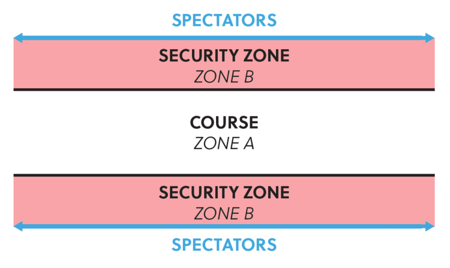
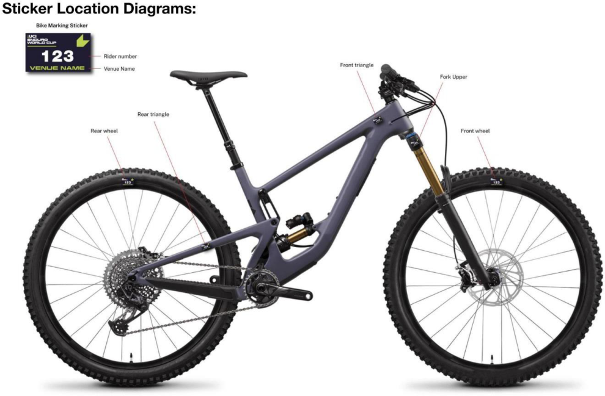
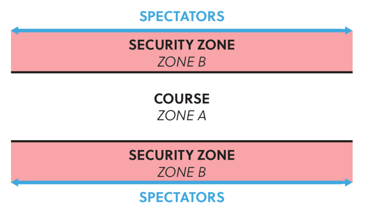
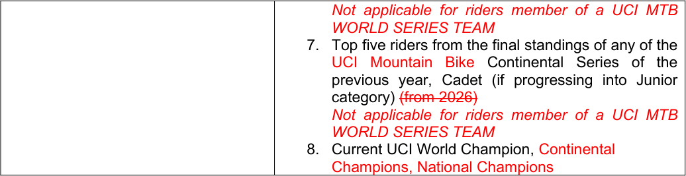
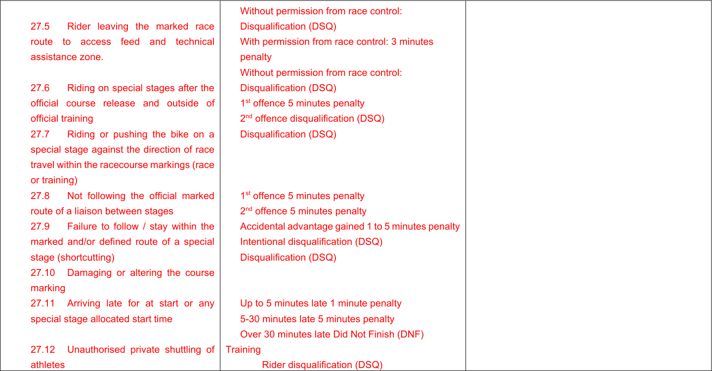

# MEMORANDUM

06.10.2025

## **PART 4 MOUNTAIN BIKE**

**Rules amendments applying on 01.01.2026**

### **Chapter I GENERAL RULES**

**§ 2** **Age categories and participation**

**Cross-country Olympic – XCO**
**4.1.004** Except in the UCI World Championships, Continental Championships, UCI Mountain
Bike Continental Series and, at the discretion of national federations, National
Championships, under 23 men and women can ride the events for elite men and women
respectively, even if a separate event is being run for under 23 riders.

Separate under 23 XCO UCI World Cup events are organised for men and women. The
first 5 men under 23 and the first 5 women under 23 of the last UCI XCO individual
ranking of the preceding year can decide whether they want to race the entire UCI World
Cup season as elite or under 23. All other under 23 riders must race the UCI World Cup
season in the under 23 category. Riders benefitting from the injury status should decide
whether they want to race the entire UCI World Cup season as elite or under 23 if they
were amongst the top 5 men under 23 or top 5 women under 23 of the last UCI XCO
individual ranking before injury.

Separate under 23 XCO hors class and class 1 events may be organized for men and
women, in this case separate results must be submitted for both categories. A rider can
only race in one category in the same competition. During class 2 and class 3 XCO
events under 23, men and women, will compete with the elite categories. As such no
separate results must be submitted for the under 23 categories at class 2 and class 3
XCO events.

_(text modified on 01.10.13; 01.01.22; 01.01.25; 01.01.26)_

**Cross-country marathon – XCM**
**4.1.005** Cross-country marathon events are open to all riders aged 19 or over and include
masters categories. No separate results must be submitted for the under 23 category.

Masters categories shall be listed in a separate results.

**Cross-country short track – XCC**
Cross-country short circuit events are open to all riders aged 19 or over.

At the UCI World Championships, ~~(as from 2024) and~~ UCI World Cup and Continental
Championships, separate under 23 events are organized for men and women.

For other events no separate results must be submitted for the under 23 or elite
categories.

**Cross-country eliminator – XCE**
Cross-country eliminator events are open to all riders aged 17 or over. No separate
results must be submitted for the junior, under 23 or elite categories.

_(text modified on 01.01.17; 01.01.20, 01.01.21; 01.01.23; 01.01.24; 01.01.26)_

**Downhill – DH**
**4.1.006** Except for the UCI World Championships, UCI World Cup and UCI Mountain Bike
Continental Series, downhill events are open to all riders aged 17 or over.

At the UCI World Championships, at the UCI World Cup and at the UCI Mountain Bike
Continental Series, separate junior events must be organized for men and women (aged
17 and 18). Separate results must be sent to the UCI.

At the Continental Championships and at the National Championships, separate junior
events may be organised for men and women (aged 17 and 18). In this case also,
separate results must be sent to the UCI.

For all other downhill events on the international calendar, the UCI points are awarded
in relation to the riders’ time and not to their category. To ensure that this rule is correctly
applied, only one combined result needs to be sent to the UCI.

~~_Comment: When a junior downhill rider would score the best time at the National_~~
~~_Championships, (s)he must wear the elite jersey. The junior jersey is not awarded in this_~~
~~_case._~~

_(text modified on 01.07.12; 01.10.13; 04.04.14; 01.01.17; 01.01.25; 01.01.26)_

**§ 3** **Calendar**

**4.1.011** International mountain bike races are registered on the UCI international calendar in
accordance with the following classification:

A. Olympic Games (OG) :

                 - No other international mountain bike event of cross-country (XC) may
be organised during the mountain bike competition of the Olympic
Games.
B. UCI World Championships (CM):

                 - No other international mountain bike event of the same format may be
organised during the UCI World Championships.
C. UCI World Cup (CDM):

                 - No hors class, UCI Mountain Bike Continental Series or Class 1 event
of the same format may be organised on the same continent on the
same day as a UCI World Cup event.

                 - The Continental Championships (CC) and National Championships
(CN) in a format may not be organised during a UCI World Cup event
in the same format.
D. UCI Masters World Championships (CMM):
E. Continental Championships (CC):

Allée Ferdi Kübler 12
1860 Aigle
Switzerland

T: +41 24 468 58 11
E: admin@uci.ch

          - No hors class, UCI Mountain Bike Continental Series or Class 1 event
of the same format may be organised on the same continent on the
same day as a Continental Championships.
F. UCI Mountain Bike Continental Series (CS):

          - Upon consultation with the respective Continental Confederation, the
UCI will appoint a certain number of events to be part of each UCI
Mountain Bike Continental Series in accordance with the dedicated
document publised by the UCI.

          - The competition name must be UCI Mountain Bike Continental Series
followed by the event name.

          - No UCI Mountain Bike Continental Series may be organised during the
UCI Mountain Bike World Championships, the UCI Mountain Bike
World Cup or the Continental Championships of the same format on the
same continent.
G. Stage races:

          - Class: Hors Class (SHC) / Class 1 (S1) / Class 2 (S2);

          - No stage race Hors Class may be organised during the mountain bike
competition of the Olympic Games, or the UCI World Championships
cross-country (XC) or marathon, ~~UCI World Cup events~~ in the
concerned continent.

          - No stage race, in HC or C1, may be organised during the Continental
Championships of the same format on the same day(s) ~~as any cross-~~
~~country (XC) race~~, on the concerned continent.
H. One day races:

          - Class: Hors Class (HC) / Class 1 (C1) / Class 2 (C2) / Class 3 (C3)
I. UCI XCO junior series:

          - The UCI will appoint a certain number of UCI XCO junior series events
every year in accordance with the dedicated document published by the
UCI.
J. National Championships:

          - National Championships cannot be run during the mountain bike
competition at the Olympic Games, UCI World Championships or UCI
World Cup of the same format and cannot be run during Continental
Championships of the same format on the concerned continent.

          - Cross-country Olympic (XCO) or cross-country short track (XCC)
National Championships cannot be run during an international
mountain bike race. For all other formats, in the event a national
championship is incorporated in an international mountain bike race, a
rider can only receive points once. The riders with the sporting
nationality of the national federation will receive the National
Championships points according to their rank in the race (i.e. including
all riders regardless of their sporting nationality) and other riders will
receive the class event points according to their rank in the race.
K. Regional Games (JR).

The events status for stage races and one-day races are allocated to each event
annually by the UCI on the basis of the commissaires race report from the preceding
year and any other information at disposal of the UCI. A new event may only be given
class 2 or 3 status in its first year.

HC status can only be given with the following cumulative conditions:

Allée Ferdi Kübler 12
1860 Aigle
Switzerland

T: +41 24 468 58 11
E: admin@uci.ch

            - event registered for at least the last three years as C1 on the UCI International
Calendar;

            - a separate under 23 race registered for both genders for XCO;

            - at least eight riders from the top 50 of the UCI ranking for both gender;

            - at least ten nations represented in the last edition of the event;

            - a high level tv production for the Elite categories taking into account the
sporting aspect.

Under exceptional circumstances and justified reasons related to development, the UCI
can grant derogations awarding HC status to events which do not meet the criteria
above.

A detailed technical guide ~~for HC events, stage races and new events~~ must be presented
to UCI during the calendar registration process. A template for such technical guide is
provided by UCI upon request. All events registered on the UCI international calendar
must respect the UCI financial obligations (in particular calendar fee, prize money)
approved by the UCI and published on the UCI website.

Race entry fees, including uplift facilities for downhill and enduro, for events on the
international calendar are waived for any rider belonging to a UCI MTB WORLD SERIES
TEAM. This applies only to the format in which the team has UCI MTB WORLD SERIES
TEAM status and does not apply to stage races, eliminator and enduro events.

_(text modified on 01.02.12; 01.10.13; 04.04.14; 01.01.16; 01.01.17; 01.01.19; 01.01.21;_
_01.01.22; 01.01.23; 01.01.24; 01.01.25; 01.01.26)_

**§ 6** **Event procedure**

**4.1.036** The riders ~~must~~ undertake to respect nature and the environment throughout the course
and ~~must make sure that they do~~ not pollute the ~~course venue~~ site. If a littering ~~drop~~ zone
is implemented on the course, riders must use it and must abide by any instructions given
in this respect.

_(text modified on 01.01.25; 01.01.26)_

**§ 10 UCI International Elite Number System**

**4.1.049** Riders who have won an Elite UCI World Cup race (XCO, DHI, EDR) will be asked to
select a unique career number (2-999) for the UCI Mountain Bike World Cup (XCO, DHI,
EDR).

Upon retirement being confirmed to the UCI or communicated publicly, a rider's unique
career number will be made available for allocation to other riders.

Elite riders will be asked to select their number in descending order starting with the rider
who currently has the highest number of UCI World Cup wins.

For the UCI World Cup, the current UCI World Cup leader will race with number 1,
superseding his unique career number.

_(article introduced on 01.01.25; text modified on 01.01.26)_

Allée Ferdi Kübler 12
1860 Aigle
Switzerland

T: +41 24 468 58 11
E: admin@uci.ch

### **Chapter II CROSS-COUNTRY EVENTS**

**§ 1** **Race characteristics**

**Cross-country eliminator – XCE**
**4.2.010** Course
The course for a cross-country eliminator race must be between 500m and ~~1000~~ 1200m
and include natural and/or artificial obstacles, in conformity with article 4.2.009. The
whole course must be 100% rideable, single track sections normally are avoided and
where possible the course normally has not more than one 180° turn. The start and finish
area must be separated in order to allow short race program.
Obstacles such as trees, stairs (up/down), drops, bridges or wooden constructions can
create a dynamic short race.

The course must be marked according to articles 4.2.020 to 4.2.029. The start/finish
zones must be respected as per articles 4.2.030 to 4.2.034

Apart from XCE UCI World Championships and XCE UCI World Cup, all other XCE
events will be considered as Class 3 events.

_(text modified on 01.10.13; 04.04.14; 01.01.16; 01.01.21; 01.01.22; 01.01.26)_

**§ 5** **Feed/Technical Assistance zone**

**4.2.036** Each feed/technical assistance zone must be located on flat or uphill sections which are
slow and wide enough for the purpose. The zones must be long enough and reasonably
evenly spaced around the course. Double feed/technical assistance zones are
recommended.

For cross-country short track (XCC) events, a feed/technical assistance zone is not
allowed.

For Olympic format cross-country events (XCO) at least 1 single feed/technical
assistance zone shall be set up. For marathon format cross-country events (XCM) at
least 3 feed/technical assistance zones shall be set up. Organisers must anticipate on
the team staff access possibilities during cross-country marathon events.

For the cross-country team relay event during the UCI World Championships and, if
applicable, during the Continental Championships, a feed/technical assistance zone can
be set up for technical support only, at the discretion of the president of the commissaires’
panel. For the sake of clarity, feeding from the feed/technical zone is not permitted for
the cross-country team relay events.

_(text modified on 01.01.17; 01.01.23; 01.01.26)_

**4.2.038** The feed/technical assistance zones must be wide and long enough to allow the passing
of riders not stopping in the zone.

Allée Ferdi Kübler 12
1860 Aigle
Switzerland

T: +41 24 468 58 11
E: admin@uci.ch

In case a pit lane is implemented, the riders are not allowed to use it to gain advantage
in the race. Should the riders take the pit lane for no valid reason, the commissaires may
disqualify them.

For UCI World Cup events they must furthermore include the following ~~four~~ two areas:

            - one part for UCI MTB WORLD SERIES TEAMS;

            - one part for all other groups respecting the order, UCI MTB Teams, National
Federations, all others;

            - ~~one part for UCI MTB TEAMS;~~

~~-~~ ~~one area for national teams;~~

~~-~~ ~~another area for individual riders or members of teams not registered with the~~
~~UCI (who are treated as individual riders).~~

Staff working for riders must wear readily identifiable team clothing.

_(text modified on 01.01.20; 01.01.23; 01.01.25; 01.01.26)_

**4.2.040** For the Olympic Games, UCI World Championships, UCI World Cup events and
Continental Championships nobody may enter a feed/technical assistance zone without
accreditation. This rule does not apply for the marathon UCI World Championships.

For the Olympic Games, UCI World Championships and Continental Championships,
accreditations are issued by the commissaires' panel.

For UCI World Cup events season long accreditations are issued to the UCI MTB
WORLD SERIES TEAMS ~~and UCI MTB TEAMS~~ by the UCI. For the national federations
or individual riders passes are prepared by the organiser and handed out at registration:
they obtain 1 accreditation per registered rider per zone. Note that for a double
feed/technical assistance zone they only obtain 1 accreditation per registered rider.

_(text modified on 01.01.20; 01.01.23; 01.01.24; 01.01.25; 01.01.26)_

**4.2.042** The spraying of water on riders or bicycles by the feeders or mechanics is forbidden.

High pressure washers are forbidden in the feed/technical assistance zone.

_(text modified on 01.01.26)_

**§ 7** **Safety**

**4.2.059** The organiser must provide for cross-country marathon events a motorcycle to mark the
front of the race (“lead bike”), and a motorcycle to mark the rear of the race ("sweep
bike"). ~~For Olympic format events, only a lead bike must be provided and display on its~~
~~front the number of laps remaining in the race.~~

_(text modified on 01.10.13; 01.01.26)_

Allée Ferdi Kübler 12
1860 Aigle
Switzerland

T: +41 24 468 58 11
E: admin@uci.ch

### **Chapter III DOWNHILL EVENTS**

**§ 2** **Course**

**4.3.006** The length of the course and the duration of the event are determined as follows:
Minimum Maximum
Course length 1500m 3500 m
Duration of the event 2 minutes 5 minutes

|Col1|UCI World Championships, UCI World Cup, Continental Championships, UCI Mountain Bike Continental Series, Hors Class, class 1 events|Col3|Class 2 events|Col5|Class 3 events|
|---|---|---|---|---|---|
||Minimum|Maximum|Minimum|Maximum||
|Duration of the event|2  minutes|5 minutes|1 minute|5 minutes|No restriction|

_(text modified on 01.01.16; 01.01.25; 01.01.26)_

**4.3.007** The entire downhill course must be marked and protected with safe and visible course
markers that present no safety risks to riders.

In very fast and dangerous sections, where the riders line is close to the course
boundary, B zones must be installed as per diagram:

Allée Ferdi Kübler 12
1860 Aigle
Switzerland

T: +41 24 468 58 11
E: admin@uci.ch

B zones must be cleaned to avoid any hidden obstacles and to be safe.

No equipment outside the official Host Broadcaster or Timing Company’s equipment can
be installed in the B zones by anybody.

_(text modified on 01.01.17; 01.01.19; 01.01.23; 01.01.24; 01.01.26)_

**§ 4** **Marshals**

**4.3.019** Riders observing a waving red flag during the race must stop immediately.

A stopped rider must continue calmly to the finish and request a re-start from the finish
line commissaire and wait for further instruction.

The re-run should take place before the end of the stopped rider’s category, when
possible.

_(text modified on 01.01.26)_

**§ 6** **Training**

**4.3.021** The following training sessions must be organised:

               - an on-foot inspection of the course must be organised before the first training
session. No bikes are allowed on the course during the on foot downhill course
inspection. The on-foot inspection is reserved exclusively for riders, the team
managers and the coaches who must hold a valid license. Other team staff
are not allowed to attend the on-foot inspection.

               - a training session, the day before competition.

               - a training session on the morning of the race day.

No training is permitted whilst a race is in progress.

_(text modified on 01.01.20; 01.01.26)_

### **Chapter V ENDURO EVENTS**

(chapter reviewed on 01.01.26)

**§ 1** **Race characteristics**

**4.5.001** The race includes several liaison stages and timed stages.

The times achieved in all timed stage will be accumulated to a total time.

An enduro course comprises varied off-road terrain. The track should include a mixture
of narrow and wide, slow and fast paths and tracks over a mixture of off-road surfaces.
Each timed stage must be predominantly descending but small pedalling or uphill
sections are acceptable. Stages must focus on testing the rider’s technical skills.

Allée Ferdi Kübler 12
1860 Aigle
Switzerland

T: +41 24 468 58 11
E: admin@uci.ch

Liaison stages can include either mechanical uplift (e.g. chairlift), pedal powered climbs
or a mixture of both. The emphasis of the track must be on rider enjoyment, technical
and physical ability.

Any other system may be acceptable only under exceptional circumstances and subject
to prior authorisation from the UCI.

_(text modified on 01.01.26)_

**§ 2** **Technical assistance**

**4.5.002** A technical assistance zone can be provided by the organizer.
Riders are allowed to collect and drop equipment or food in the technical assistance
zone.

Outside technical assistance is only allowed in this area.

Riders may access technical assistance whenever the official course route passes
through the technical assistance zone.

Riders seeking to leave the official course to return to the technical assistance zone for
assistance must first seek approval from the race officials. This will incur a 3-minute
penalty.

Riders must then return to the racecourse at the point where they left.

_(text modified on 01.01.20; 01.01.26)_

**4.5.003** Only one frame, one front fork and one pair of wheels can be used by a competitor during
a competition. Frame, fork and wheels will be individually marked by the officials before
the start of the race and checked at the finish. Broken parts ~~can eventually may be~~
~~replaced upon approval with a 5 min penalty if approved by race official~~ may be replaced
after first seeking approval from the PCP or race director with the application of a 3minute penalty if approved by race official.

_(text modified on 01.01.26)_

**§ 3** **Equipment**

**4.5.004** Riders must wear a full-face helmet at all times during competition. This includes during
both Liaison and Special Stages. If a rider dismounts and pushes their bike on a Liaison,
they may remove the helmet. Whilst riding, the helmet must always be worn correctly
with straps fastened. ~~In very technical terrain or on courses that feature steep~~
~~mountainsides or very high-speed trails, the organiser can specify in his particular rules~~
~~that competitors must wear a full-face helmet (either fixed or detachable)~~ .

In addition to the above, the UCI strongly recommends that riders wear the protections
as indicated in art. 4.3.013.

Allée Ferdi Kübler 12
1860 Aigle
Switzerland

T: +41 24 468 58 11
E: admin@uci.ch

Furthermore, it is strongly recommended that all riders carry:

    - suitable backpack;

    - waterproof jacket;

    - emergency blanket;

    - tube / puncture repair kit;

    - multi tool;

    - basic, well maintained first aid kit;

    - course map;

    - food and fluids;

    - eye protection (glasses or goggles);

    - emergency contacts supplied by the organiser;

    - whistle.

Only one frame, fork and one set of wheels can be used by a rider during a race. A rider
may use different/unmarked equipment during Official Training.

Equipment Marking Stickers must be applied on the rider’s right-hand side of the bike.

    - fork crown;

    - swingarm / rear triangle;

    - front triangle;

    - both wheel rims.

_(text modified on 01.01.26)_

Allée Ferdi Kübler 12
1860 Aigle
Switzerland

T: +41 24 468 58 11
E: admin@uci.ch

**§ 5** **Course marking**

**4.5.006** The entire enduro courses must be marked and protected with safe and visible course
markers that present no safety risks to riders.

Course markers installed on opposite sides of the course will create a gate, which riders
must pass between. Gates can be used to clearly mark sections of the course that a rider
must pass through. Missing a gate will be deemed as course cutting.

In very fast and dangerous sections, where the riders’ line is close to the course
boundary, B zones must be installed as per diagram:

_(text modified on 01.01.26)_

Allée Ferdi Kübler 12
1860 Aigle
Switzerland

T: +41 24 468 58 11
E: admin@uci.ch

**4.5.007** Extra care must be taken by the organiser to make sure that the course is clearly marked
and no shortcuts are possible.

Taking shortcuts on course to gain an advantage can damage both the environment and
bring the sport of enduro mountain bike racing into disrepute. Where no defined trail
exists, the organiser should mark the course to keep the riders on the intended
racecourse. If a clear and defined trail exists, the organiser may choose to create gates.
In this instance riders must ride the existing defined trail between gates and not look to
leave the trail to take a short cut and gain an unfair advantage.

Therefore, any rider trying to save time by intentionally choosing a line that lies outside
of the marked, defined racecourse will be disqualified (DSQ).

Any rider found damaging the course or altering a Special Stage without the UCI
approval will be subject to a penalty including DSQ.

_(text modified on 01.01.26)_

**4.5.009** Road crossing and dangerous area must be marked on both sides.

All wooden features (e.g. wall-rides or large bridges), especially those that are situated
in compressions, turns or braking zones, should be covered adequately with an anti-slip
surface material (e.g. Wire mesh & or anti slip paint).

_(text modified on 01.01.26)_

**§ 6** **Organisation of competition**

**4.5.010** Official training must be scheduled by the organiser on all Special Stages before timed
competition begins. Training on all Special Stages is strongly recommended but not
mandatory.

Following the official course release, all Special Stages are closed to riders until official
training commences.

Any rider found riding on a Special Stage outside of official training will be subject to
penalty.

Only competing riders with a number plate issued for that specific race attached to their
bike will be allowed on course during official training. In addition, officials, team staff and
media will also be allowed access providing they display the relevant officially issued
plates.

A maximum of one training run is allowed per Special Stage.

Unless otherwise agreed, official training should not take place more than two days prior
to the start of the race.

During official training times, riders must only access a Special Stage from the start and
are not permitted to push up within the course or create congestion.

Allée Ferdi Kübler 12
1860 Aigle
Switzerland

T: +41 24 468 58 11
E: admin@uci.ch

Any rider found to be riding upwards against the direction of travel will be penalised.
Riders may push up outside of the course marking.

_(article introduced on 01.01.26)_

**4.5.011** The organiser must provide the start times for each timed stage.

_(text modified on 01.01.26)_

**4.5.012** Each rider takes an individual start, the start interval between the riders must be of 10
seconds at least.

Riders must present themselves at the start line in time for their preassigned stage start
time.

All Special Stages will have a check-in point close to, but before the Special Stage start
line. Riders must pass through this check-in point to record a check-in time. The checkin time may be used by Race Control to provide additional evidence of a rider’s arrival
time at a Special Stage start in case of any delay or dispute around stage start time.

All late riders must start only under instructions from the official starter, who will
determine a suitable gap in the start order. No fixed start interval will be applied between
late starters as the goal is to keep late riders in the competition, without affecting other
riders.

In cases where the late starter is delayed further due to insufficient gaps in the start
order, penalties will be calculated based on a rider’s check-in time. If a rider fails to checkin, the penalty will be based on their Special Stage start time.

Late starters will receive a fixed penalty:

            - up to 5 minutes late = 1-minute penalty;

            - 5+ minutes late = 5-minute penalty;

            - 30+ minutes late = DNF.

Any rider arriving at the start of a Special Stage later than 30 minutes after their specified
start time will be assigned a DNF for the race and will not be allowed to continue.

**Start Penalties**
Riders must start from a stationary position with their front wheel on the start line. Run
up starts are not permitted.

Any rider starting before the starter’s orders may be subject to a penalty. Other Start
Violations (example: pushing into queue, delaying start, jumping start etc.) may also be
subject to penalty.

**Delays**
Any delay applied to Special Stage start times must be maintained throughout that day
of racing. Commissaires must not attempt to catch up on delays while racing is underway.

Allée Ferdi Kübler 12
1860 Aigle
Switzerland

T: +41 24 468 58 11
E: admin@uci.ch

Example. If there is a 10-minute course hold on Special Stage 1, 10 minutes must be
added to the start times of all remaining Special Stages, for all riders effected by the
hold, for the remainder of the race.

**Disrupted race stage.**
In the event of a rider being delayed on a Special Stage due to assisting another rider in
a medical emergency or due to some other circumstance outside of their control, such
as a race hold on that Special Stage, **and** **only** if Race Control decide it is appropriate,
a rider may be offered a re-run on that Special Stage.
If Race Control deem that a re-run of the Special Stage in question is not possible then
at the end of the race the rider will be allocated an “average” Special Stage position and
time. This will be calculated as follows:
Race control will take the rider’s actual finishing position across all Special Stages
completed, minus his worst stage result and using this calculate their average stage
finishing position. This average Special Stage position will then be awarded for the
incomplete stage.

_(text modified on 01.01.26)_

**4.5.013** A minimum of 3 and a maximum of 10 timed stages must be raced over one or two days.
The total time for each rider shall correspond to a minimum of 10 minutes.

_(text modified on 01.01.26)_

**4.5.014** A minimum of 2 different courses for the timed stages must be used. Under unforeseen
and exceptional circumstances (e.g. weather), the UCI commissaire may, after
consulting the organiser, cancel a stage or remove it from the general classification.

_(text modified on 01.01.26)_

**4.5.015** There are no restrictions on the nature of liaison stages. Uplift of riders can be either by
mechanical means (chairlift, truck etc) or by pedalling or a mixture of both.

_(text modified on 01.01.26)_

**4.5.016** Adequate training must be provided by the organiser for all timed stages.

_(text modified on 01.01.26)_

**4.5.017** The transport of riders between Special Stages by private/team transport (shuttling) is
strictly limited to official training and may be used only when an official rider shuttle
provided by the organiser operates on the same route. Any rider found using a private
or team vehicle at any other time or on any other route may be subject to penalties.

Any venue specific details or restrictions on shuttling will be outlined in the Race Book
and the official training schedule.

During the race, no private/team transport can be used at any time.

_(article introduced on 01.01.26)_

Allée Ferdi Kübler 12
1860 Aigle
Switzerland

T: +41 24 468 58 11
E: admin@uci.ch

**§ 7** **Results**

**4.5.018** The events General Classification will be calculated by adding all Special Stage times
together for each rider.

In the event of a tie in the General Classification, the highest placed rider on the final
Special Stage will be awarded the higher final placing.

A rider not finishing a Special Stage will not be allowed to rejoin the race at any time.

_(text modified on 01.01.26)_

**§ 6** **Infringements**

**4.5.019** A rider must act in a sporting manner at all times and must permit any faster rider to
overtake without obstructing.

_(text modified on 01.01.26)_

**4.5.020** The president of the commissaries’ panel can consider a rule violation that has not been
witnessed by a race official if it has been reported by at least two riders who are part of
two different teams (e.g. rider getting assistance outside technical assistance zone, rider
cutting course)

_(text modified on 01.01.26)_

**§ 9** **Marshals**

**4.5.021** For marshals, refer to the articles 4.1.017 to 4.1.021.

A small number of special trained marshals or commissaires should move around the
course during competition to undisclosed points. Quad bike can be used to check rules
infringements.

_(text modified on 01.01.26)_

**§ 10** **Medical service**

**4.5.022** For first aid (minimum requirements), refer to the articles 4.2.052 to 4.2.059.
The organizer must set up an adequate medical service. The organizer must supply each
competitor with emergency contact details.

_(text modified on 01.01.26)_

Allée Ferdi Kübler 12
1860 Aigle
Switzerland

T: +41 24 468 58 11
E: admin@uci.ch

### **Chapter VII SNOW BIKE**

**Clothing and protective accessories**
**4.7.004** The protective accessories are ~~recommended~~ mandatory to all competitors according to
articles 4.3.012 and 4.3.013.

_(text modified on 01.01.26)_

### **Chapter X UCI MOUNTAIN BIKE CROSS-COUNTRY WORLD CUP**

**Participation**
**4.10.001** UCI Cross-country World Cup events (XCO and XCC) are open to riders meeting the
following categories and criteria:

|Category|One of the below mentioned criteria needs to be fulfilled|
|---|---|
|XCO - men elite (aged 23 and over) XCO - women elite (aged 23 and over) |1. UCI MTB WORLD SERIES TEAM, maximum 4 riders per race and category 2.Maximum8 UCI MTB TEAM wildcards, maximum 4 riders per race and category decided one month prior the event 3. Any rider ranked in the top 100 of the last UCI XCO individual ranking before the event entry closing date (one month prior to the event) 4. The national federations may enter a maximum of 3 supplementary riders per category. These riders must wear national team clothing. 5. Top~~five~~threeriders of any round of aUCI Mountain BikeContinental Series, limited to 1 round of the ~~current ~~UCI MTB World Cupwithin 52 weeks of the qualification(Golden Ticket) _Not applicable for riders member of a UCI MTB_ _WORLD SERIES TEAM_ 6. Top five riders from the final standings of any of the UCI Mountain Bike Continental Series of the previous year, Elite~~(from 2026) ~~ _Not applicable for riders member of a UCI MTB_ _WORLD SERIES TEAM_ 7. Top five riders from the final standings of any of the UCI Mountain Bike Continental Series of the previous year, U23 (if progressing into Elite category)~~(from~~ ~~2026) ~~ _Not applicable for riders member of a UCI MTB_ _WORLD SERIES TEAM_ 8. Current Olympic Champion, UCI World Champion, Continental Champions, National Champions|
|XCO - men under 23 (aged from 19 to 22)|1. UCI MTB WORLD SERIES, maximum 4 riders per race and category|

Allée Ferdi Kübler 12
1860 Aigle
Switzerland

T: +41 24 468 58 11
E: admin@uci.ch

|XCO - women under 23 (aged from 19 to 22)|2. Maximum 8 UCI MTB TEAM wildcards, maximum 4 riders per race and category decided one month prior to the event 3. Any rider ranked in the top 200 of the last UCI XCO individual ranking before the event entry closing date (one month prior to the event) 4. The national federations may enter a maximum of 4 supplementary riders per category. These riders must wear national team clothing. 5. Top five three riders of any round of a UCI Mountain Bike Continental Series, limited to 1 round of the current UCI MTB World Cup within 52 weeks of the qualification (Golden Ticket) Not applicable for riders member of a UCI MTB WORLD SERIES TEAM 6. Top five riders from the final standings of any of the UCI Mountain Bike Continental Series of the previous year, U23 (from 2026) Not applicable for riders member of a UCI MTB WORLD SERIES TEAM 7. Top five riders from the final standings of any of the UCI Mountain Bike Continental Series of the previous year, Junior (if progressing into U23 category) (from 2026) Not applicable for riders member of a UCI MTB WORLD SERIES TEAM 8. UCI World Champion, Continental Champions, National Champions|
|---|---|
|XCC – men elite (aged 23 and over) XCC – women elite (aged 23 and over) XCC – men under 23 (aged from 19 to 22) XCC – women under 23 (aged from 19 to 22)|~~A maximum of 40R~~iders~~per gender~~already registered and confirmed for the XCO event taking place during the same weekend shall be allowed to start in the XCC event. The riders shall be selected as per article 4.10.003, points 1 and 2, to reach a total number of 40 riders per gender. On top of those 40 riders, wild cards can be awarded as per article 4.10.003, point 3.No online registration is required for the XCC event.   The same bike must be used for XCC and XCO. For XCC, the minimum tyre width must be 45mm.|

**Registration**
Riders registration can be done only by a UCI MTB WORLD SERIES TEAM, a UCI MTB
TEAM or a national federation.

If a rider that confirmed his participation to the XCC event is not starting, he will not be
allowed to start the XCO event on the same world cup round unless if the rider has been
declared ~~incapable~~ medically unfit to ~~of taking the~~ start ~~of~~ the XCC event by the
organiser’s chief medical officer or the team doctor. The rider must then be declared
medically fit prior to starting the XCO, no later than 2 hours prior to the race start time.

Allée Ferdi Kübler 12
1860 Aigle
Switzerland

T: +41 24 468 58 11
E: admin@uci.ch

**Wildcard**
Criteria to award the maximum 8 UCI MTB TEAM wildcards (as per point 2 of the
participation criteria) per event will be based on the:

             - UCI team ranking, current and previous season;

             - profile of any individual riders;

             - UCI Team composition (multi-category, multi-gender);

             - profile of team sponsors (out of industry, global, etc.);

             - media profile of team (social media, etc.);

             - any injury issues during current or previous season;

             - anti-doping history;

             - home country of team;

             - UCI Mountain Bike Continental Series team standing.

Prior to making a decision, the UCI can request the production of information or
documents to assess the criteria above.

_(text modified on 01.01.25; 01.01.26)_

**4.10.003** The start order is determined as follows:
XCC men elite and women elite, XCC men under 23 and women under 23

1. riders ranked in the top 16 of the most recently published XCO UCI World Cup

standings (not applicable for the first UCI World Cup round of the season);
2. as per the most recently published UCI XCO individual ranking;
3. riders ranked in below rankings, unless they are listed on the start order above:

              - top 10 of the UCI cyclo-cross individual ranking;

              - top 20 of the UCI road individual world ranking;
The place 41 [st] and after will be allocated following the rank of each rider,
whatever the ranking: UCI cyclo-cross or UCI road world ranking. If two or
three riders have the same ranking, they will be placed by drawing lots.

Riders with injury status shall be integrated in the start order in accordance with article
4.10.011.

Riders with pregnancy status shall be integrated in the start order in accordance with
article 4.10.012.

XCO men elite and women elite

1. the riders ranked in the top 24 of the XCC race of the same UCI World Cup

round;
2. the place 25th to 32nd will be allocated as per the most recently published

UCI XCO individual ranking;
3. place 33rd to 40th of the start order will be allocated to riders ranked in

below rankings, unless they are listed on the start order between the place
1st to 32nd according to point 1 and 2 above:

              - top 10 of the UCI cyclo-cross individual ranking;

              - top 20 of the UCI road individual world ranking;

Allée Ferdi Kübler 12
1860 Aigle
Switzerland

T: +41 24 468 58 11
E: admin@uci.ch

The place 33rd to 40th will be allocated following the rank of each rider,
whatever the ranking: UCI cyclo-cross or UCI road world ranking. If two or
three riders have the same ranking, they will be placed by drawing lots.
4. as per the most recently published UCI XCO individual ranking;
5. unclassified riders: by drawing lots.

Riders with injury status shall be integrated in the start order in accordance with article
4.10.011.

Riders with pregnancy status shall be integrated in the start order in accordance with
article 4.10.012.

XCO men under 23 and women under 23:

1. the riders ranked in the top 24 of the XCC race of the same UCI World Cup

round;
2. as per the most recently published UCI XCO individual ranking;
3. unclassified riders; by drawing lots.

Riders with injury status shall be integrated in the start order in accordance with article
4.10.011.

Riders with pregnancy status shall be integrated in the start order in accordance with
article 4.10.012.

_(text modified on 01.01.24; 01.01.25; 01.01.26)_

**Official ceremony**
**4.10.007** The official ceremony takes place immediately after each race. Riders arriving later than
5 minutes after they finished their race are fined.

The following riders must attend:

             - the first three riders in the elite XCO events;

             - the first three riders in the elite XCC events;

            - the leader of the elite UCI World Cup standings after the event in question
(XCO, XCC);

            - the first three riders in the under 23 events (XCO, XCC);

            - the leader of the under 23 UCI World Cup standings after the event in question
(XCO, XCC);

            - the team leading the team standings after the event in question (specified in
article 4.10.009);

             - the team of the day.

The first three riders in the race and the leader of the general classification of the UCI
World Cup must attend the podium.

The UCI Mountain Bike World Cup licensee shall award a trophy to the first three of the
final classification of the UCI Mountain Bike World Cup in each category.

N.B - Bicycles cannot be taken onto the podium. However, an area is provided in front
of the podium to display the bicycle of the winner during the official ceremony.

Allée Ferdi Kübler 12
1860 Aigle
Switzerland

T: +41 24 468 58 11
E: admin@uci.ch

_(text modified on 01.01.25; 01.01.26)_

**Injury status**
**4.10.011** If due to injury a rider took part in less than three rounds of the UCI World Cup in a
season, the national federation and the team may apply to the UCI for recognition of
injury status. An application must be received at the UCI in writing no later than October
30 [th] of the disrupted season.

A rider with injury status shall be integrated in the ranking that is used to determine the
start list, with the number of points determined according to following calculation: the
average points gained per round in which the rider took part multiplied by the number of
rounds of the UCI World Cup season during which the rider was absent due to injury.

In case the rider is no longer included in the UCI World Cup standings, his UCI ranking
of the year n-2 on 31 December will be considered.

Such benefit shall be limited to the first two rounds of the UCI World Cup in which the
rider takes part during the following season.

_(text modified on 01.01.24; 01.01.26)_

**Pregnancy status**
**4.10.012** If due to pregnancy a rider took part in less than three rounds of the UCI World Cup in a
season, the national federation and the team may apply to the UCI for recognition of
pregnancy status. An application must be received at the UCI in writing no later than
December 31 [st] of the disrupted season.

A rider with pregnancy status shall be integrated in the ranking that is used to determine
the start list, with the number of points determined according to following calculation: the
average points gained per round in which the rider took part multiplied by the number of
rounds of the UCI World Cup season during which the rider was absent due to
pregnancy.

In case the rider is no longer included in the UCI World Cup standings, his UCI ranking
of the year n-2 on 31 December will be considered.

Such benefit shall be limited to the first two rounds of the UCI World Cup in which the
rider takes part during the following season.

_(article introduced on 01.01.24; text modified on 01.01.26)_

### **Chapter XI UCI MOUNTAIN BIKE DOWNHILL WORLD CUP**

**Participation**
**4.11.001** UCI Downhill World Cup events are open to riders meeting the following categories and
criteria:

Allée Ferdi Kübler 12
1860 Aigle
Switzerland

T: +41 24 468 58 11
E: admin@uci.ch

|DHI - men elite (aged 19 and over) DHI - women elite (aged 19 and over)|1. UCI MTB WORLD SERIES TEAM, maximum 4 riders per race and category 2. Maximum 8 UCI MTB TEAM wildcard, maximum 4 riders per race and category decided one month prior to the event 3. Any rider ranked in the top 50 of the last UCI DHI individual ranking before the event entry closing date (one month prior to the event) 4. The national federations may enter a maximum of 3 supplementary riders per category. These riders must wear national team clothing. 5. Top five three riders of any round of a UCI Mountain Bike Continental Series, limited to 1 round of the current UCI MTB World Cup within 52 weeks of the qualification (Golden Ticket) Not applicable for riders member of a UCI MTB WORLD SERIES TEAM 6. Top five riders from the final standings of any of the UCI Mountain Bike Continental Series of the previous year, Elite (from 2026) Not applicable for riders member of a UCI MTB WORLD SERIES TEAM 7. Top five riders from the final standings of any of the UCI Mountain Bike Continental Series of the previous year, Junior (if progressing into Elite category) (from 2026) Not applicable for riders member of a UCI MTB WORLD SERIES TEAM 8. Current UCI World Champion, Continental Champions, National Champions|
|---|---|
|DHI - men junior (aged 17 and 18) DHI – women junior (aged 17 and 18)|1. UCI MTB WORLD SERIES TEAM, maximum 4 riders per race and category 2.Maximum8 UCI MTB TEAM wildcard, maximum 4 riders per race and category decided one month prior the event 3. Any rider ranked in the top 100 of the last UCI DHI individual ranking before the event entry closing date (one month prior the event) 4. The national federations may enter a maximum of 4 supplementary riders per category. These riders  must wear national team clothing. 5. Top ~~five~~threeriders of any round of aUCI Mountain BikeContinental Series, limited to 1 round of the ~~current ~~UCI MTB World Cupwithin 52 weeks of the qualification  _Not applicable for riders member of a UCI MTB_ _WORLD SERIES TEAM_  6. Top five riders from the final standings of any of the UCI Mountain BikeContinental Series of the previous year, Junior~~(from 2026) ~~|

Allée Ferdi Kübler 12
1860 Aigle
Switzerland

T: +41 24 468 58 11
E: admin@uci.ch

**Registration**
Riders registration can be done only by a UCI MTB WORLD SERIES TEAM, a UCI MTB
TEAM or a national federation.

**Wild card**
Criteria to award the maximum 8 UCI MTB TEAM wildcards (as per point 2 of the
participation criteria) per event will be based on the:

             - UCI team ranking, current and previous season ;

             - profile of any individual riders;

             - UCI Team composition (multi-category, multi-gender);

             - profile of team sponsors (out of industry, global, etc.);

             - media profile of team (social media, etc.);

             - any injury issues during current or previous season;

             - anti-doping history;

             - home country of team;

            - UCI Mountain Bike Continental series team standing.

Prior to making a decision, the UCI can request the production of information or
documents to assess the criteria above.

_(text modified on 01.01.25; 01.01.26)_

**4.11.004** The start order for the qualifying round ~~s~~ 1 is determined as follows:
Men Elite, Women Elite:

1. riders ranked in the top 20 men and the top 10 women of the most recently
published UCI World Cup standings (for the first event, as per the final world
cup standings of the previous year), starting in reverse order.
2. as per the most recently published UCI World Cup standings;
3. as per the most recently published UCI DHI individual ranking ~~, starting in~~
~~reverse order.~~
4. unclassified riders: by drawing lots.

Riders with injury status shall be integrated in the start order in accordance with article
4.11.021.

Riders with pregnancy status shall be integrated in the start order in accordance with
article 4.11.022.

The start order for the qualifying round 2 is determined as follows:
Men Elite, Women Elite:

Allée Ferdi Kübler 12
1860 Aigle
Switzerland

T: +41 24 468 58 11
E: admin@uci.ch

1. reverse order of qualifying round 1 results;
2. riders ranked in the top 20 men and the top 10 women of the most recently
published UCI World Cup standings (for the first event, as per the final UCI
World Cup standings of the previous year), that did not qualify via the
qualifying round 1 will start before the top 10 riders from qualifying round 1,
starting in reverse order.

The start order for the qualifying rounds is determined as follows:
Men Junior, Women Junior:

1. riders ranked in the top 20 men junior and the top 10 women junior of the most
recently published UCI World Cup standings (not applicable for the first UCI
world cup round of the season), starting in reverse order;
2. as per the most recently published UCI World Cup standings;
3. as per the most recently published UCI DHI individual ranking ~~, starting in~~
~~reverse order~~ .
4. unclassified riders: by drawing lots.

Riders with injury status shall be integrated in the start order in accordance with article
4.11.021.

_(text modified on 01.01.24; 01.01.25; 01.01.26)_

**4.11.009** Two forerunners must be designated and be ready to run the course as indicated by the
president of the commissaires' panel before the qualifying round and finals. The
forerunners' bicycles must be fitted with handlebar numbers bearing the letters A and B.
The closing rider, according to article 4.11.008, must be fitted with the handlebar number
bearing the letter C.
Forerunners and closing rider must be at least aged 17 and a UCI license holder
adequately insured.

_(text modified on 01.01.26)_

**Official ceremony**
**4.11.017** The official ceremony takes place immediately after each race. Riders arriving later than
5 minutes after they finished their race are fined.

The following riders must attend:

             - the first three riders in the elite events;

             - the leader of the elite UCI World Cup standings after the event in question;

             - the first three riders in the junior events;

             - the leader of the junior UCI World Cup standings after the event in question;

            - the team leading the team standings after the event in question (specified in
article 4.11.020);

             - the team of the day.

The first three riders in the race and the leader of the general classification of the UCI
World Cup must attend the podium.

The UCI Mountain Bike World Cup licensee shall award a trophy to the first three of the
final classification of the UCI Mountain Bike World Cup in each category.

Allée Ferdi Kübler 12
1860 Aigle
Switzerland

T: +41 24 468 58 11
E: admin@uci.ch

Bicycles cannot be taken onto the podium. However, an area is provided in front of the
podium to display the bicycle of the winner during the official ceremony.

_(text modified on 01.01.25; 01.01.26)_

**Injury status**
**4.11.021** If due to injury a rider took part in less than three rounds of the UCI World Cup in a
season, the national federation and the team may apply for recognition of injury status.
An application must be received at the UCI in writing no later than October 30 [th] of the
disrupted season.

A rider with injury status shall be integrated in the ranking that is used to determine the
start list, with the number of points determined according to following calculation: the
average points gained per round in which the rider took part multiplied by the number of
rounds of the UCI World Cup season during which the rider was absent due to injury.

In case the rider is no longer included in the UCI World Cup standings, his UCI ranking
of the year n-2 on 31 December will be considered.

Such benefit shall be limited to the first two rounds of the UCI World Cup in which the
rider takes part during the following season.

~~This applies only for the DHI start order as per articles 4.11.004 and 4.11.006.~~

_(text modified on 01.01.24; 01.01.26)_

**Pregnancy status**
**4.11.022** If due to pregnancy a rider took part in less than three rounds of the UCI World Cup in a
season, the national federation and the team may apply for recognition of pregnancy
status. An application must be received at the UCI in writing no later than December 31 [st]
of the disrupted season.

A rider with pregnancy status shall be integrated in the ranking that is used to determine
the start list, with the number of points determined according to following calculation: the
average points gained per round in which the rider took part multiplied by the number of
rounds of the UCI World Cup season during which the rider was absent due to
pregnancy.

In case the rider is no longer included in the UCI World Cup standings, his UCI ranking
of the year n-2 on 31 December will be considered.

Such benefit shall be limited to the first two rounds of the UCI World Cup in which the
rider takes part during the following season.

_(article introduced on 01.01.24; text modified on 01.01.26)_

Allée Ferdi Kübler 12
1860 Aigle
Switzerland

T: +41 24 468 58 11
E: admin@uci.ch

### **Chapter XII UCI MOUNTAIN BIKE MARATHON WORLD CUP**

**Age category**
**4.12.005** The age category for the UCI Marathon World Cup is 19 years or over. Holders of elite
licences may participate.

There are no separate races or results for under 23 ~~or masters categories~~ .

Masters categories shall be listed in a separate results.

_(text modified on 01.01.25; 01.01.26)_

**Official ceremony**
**4.12.009** The official ceremony takes place immediately after each race. Riders arriving later than
5 minutes after they finished their race are fined.

The following riders must attend:

               - the first three riders;

               - the leader of the UCI World Cup standings after the event in question;

The first three riders in the race and the leader of the general classification of the UCI
World Cup must attend the podium.

The UCI Mountain Bike World Cup licensee shall award a trophy to the first three of the
final classification of the UCI Mountain Bike World Cup in each category.

N.B. - Bicycles cannot be taken onto the podium. However, an area is provided in front
of the podium to display the bicycle of the winner during the official ceremony.

_(text modified on 01.01.25; 01.01.26)_

### **Chapter XIII UCI MOUNTAIN BIKE ENDURO WORLD CUP**

(Chapter reviewed on 01.01.26)

**Participation**
**4.13.003** UCI Enduro World Cup (Enduro and E-Enduro) events are open to riders meeting the
following categories and criteria:

~~-~~ ~~Having an annual licence issued by a national federation~~

~~-~~ ~~In order to race in the UCI Enduro World Cup, riders must either be on an~~
~~official UCI MTB ENDURO TEAM or have the minimum required number of~~
~~Enduro Global Ranking points~~

|Category|One of the below mentioned criteria needs to be fulfilled|
|---|---|
|EDR - men elite (aged 19 and over) EDR - women elite (aged 19 and over)|1. UCI MTB WORLD SERIES TEAM 2. UCI MTB TEAM 3. Any rider ranked in the top 300 (men) or top 75 (women) of the Enduro Global ranking on 31.12.2025|

Allée Ferdi Kübler 12
1860 Aigle
Switzerland

T: +41 24 468 58 11
E: admin@uci.ch

|Col1|4. Any rider ranked in the top 50 (men) or top 50 (women) of the last UCI EDR individual ranking before the event entry closing date (one month prior to the event) 5. The national federations may enter a maximum of 3 supplementary riders per category. These riders must wear national team clothing. 6. Current UCI World Champion, Continental Champion, National Champions|
|---|---|
|EDR - men junior (aged 17 and 18) EDR – women junior (aged 17 and 18)|1. UCI MTB WORLD SERIES TEAM 2. UCI MTB TEAM 3. Any rider ranked in the top 300 (men) or top 75 (women) of the Enduro Global ranking on 31.12.2025 4. Any rider ranked in the top 50 (men) or top 50 (women) of the last UCI EDR individual ranking before the event entry closing date (one month prior to the event) 5. The national federations may enter a maximum of 4 supplementary riders per category. These riders  must wear national team clothing. 6. Current UCI World Champion|

Details on the participation criteria are included in a dedicated UCI Enduro World Cup
technical guide available on a dedicated website.

_(text modified on 01.01.26)_

~~Age category~~
~~**4.13.005**~~ ~~Specific rules for UCI Enduro World Cup are included in a dedicated UCI Enduro World~~
~~Cup technical guide available on a dedicated website.~~

[article abrogated on 01.01.26]

~~**4.13.006**~~ ~~Specific rules for UCI E-Enduro World Cup are included in a dedicated UCI E-Enduro~~
~~World Cup technical guide available on a dedicated website~~

[article abrogated on 01.01.26]

**Start Order**
**4.13.007** ~~The start order for each race is specified in a dedicated UCI Enduro World Cup technical~~
~~guide available on a dedicated website.~~

Seeding
Riders will be seeded based on a combination of the current UCI Enduro World Cup
standings, the Enduro Global ranking and the UCI EDR individual ranking. Riders will be
seeded in reverse order.

For the first round, the start order will be based on previous UCI Enduro World Cup
overall standings, the Enduro Global ranking and the UCI EDR individual ranking.

Allée Ferdi Kübler 12
1860 Aigle
Switzerland

T: +41 24 468 58 11
E: admin@uci.ch

Riders with injury status shall be integrated in the start order in accordance with article
4.13.012.

Riders with pregnancy status shall be integrated in the start order in accordance with
article 4.13.013.

Group A will consist of the top 30 Men Elite / Top 15 Women Elite from the current UCI
Enduro World Cup standings, plus any riders with a career number.
All other riders are in Group B.

**Reseeding - Final stage**
For one day race, Group A riders will be reseeded for the final stage based on the
General Classification to allow the best rider to start last for this final stage.
For two-day races the reseeding of Group A riders will take place after day one. There
will be no further reseed prior to the final stage.

Riders ranked in the Top 30 (Men) and Top 15 (Women) of the General Classification
may be reseeded to Group A after day one, if applicable.

A mandatory time check may be conducted to ensure riders are reseeded accordingly.

**Start Intervals**
Riders in the UCI Enduro World Cup will have individual preassigned start times for all
the stages. Start intervals between riders will be a minimum of 30 seconds.

A minimum five-minute interval between the Group A Men and the Group A Women
categories must be allocated.

_(text modified on 01.01.26)_

**Official ceremony**
**4.13.008** The official ceremony takes place immediately after each race. Riders arriving later than
5 minutes after they finished their race are fined.

The following riders must attend:

             - the first three riders in the elite events;

             - the leader of the elite UCI World Cup standings after the event in question;

             - the first three riders in the junior events;

             - the leader of the junior UCI World Cup standings after the event in question;

             - the team leading the team standings after the event in question;

             - the team of the day.

The first three riders in the race and the leader of the general classification of the UCI
World Cup must attend the podium.

The UCI Mountain Bike World Cup licensee shall award a trophy to the first three of the
final classification of the UCI Mountain Bike World Cup in each category.

_(article introduced on 01.01.26)_

Allée Ferdi Kübler 12
1860 Aigle
Switzerland

T: +41 24 468 58 11
E: admin@uci.ch

**UCI World Cup standings**
**4.13.009** The UCI World Cup standings are drawn up on the basis of the points won by each rider
in accordance with the table in article 4.13.011.

Riders tying on points are ranked by the greatest number of 1st places, 2nd places, etc.
(total points in the standings of the concerned round) taking account only of places for
which points are awarded for the UCI World Cup. If they are still tied, the points scored
in the most recent UCI World Cup event are used to separate them.

_(article introduced on 01.01.26)_

**UCI MTB Teams Standings**
**4.13.010** A team standing is drawn up for each round of the UCI Enduro World Cup. Only riders
registered in a UCI MTB WORLD SERIES TEAM or a UCI MTB TEAM can score points
for their team in accordance with the team standing table in article 4.13.011.

For enduro, a mixed team classification is drawn up by summing the 4 highest scored
points of each team without making a distinction between men elite, men junior, women
elite and women junior. Tied teams will have their relative positions determined by their
best placed rider. Should there still be a tie, the order is determined as follows: best
placed men elite, best placed women elite, best placed men junior, best placed women
junior.

After each round of the UCI World Cup, the team standings is drawn up by adding the
points won in the team classification per event. In the event of multiple teams finishing
the World Cup on equal points, the team with the highest number of UCI Enduro World
Cup points won in the final round will be placed higher in the final team classification.

The riders of the team leading the team standings are given leaders’ handlebar number
plates which must be used during the UCI World Cup.

_(article introduced on 01.01.26)_

**4.13.011** Points scale

A. Enduro men and women elite

|Position|Men Elite points|Women Elite points|
|---|---|---|
|1|250|250|
|2|210|210|
|3|180|180|
|4|160|150|
|5|140|120|

Allée Ferdi Kübler 12
1860 Aigle
Switzerland

T: +41 24 468 58 11
E: admin@uci.ch

|6|125|90|
|---|---|---|
|7|110|80|
|8|95|70|
|9|80|60|
|10|75|50|
|11|71|48|
|12|68|44|
|13|65|40|
|14|63|35|
|15|60|30|
|16|58||
|17|56||
|18|54||
|19|52||
|20|50||
|21|48||
|22|46||
|23|44||
|24|42||
|25|40||
|26|38||
|27|36||
|28|34||
|29|32||
|30|30 ||
|31|||
|32|||
|33|||
|34|||
|35|||
|36|||
|37|||
|38|||
|39|||
|40|||
|41|||
|42|||
|43|||
|44|||
|45|||
|46|||
|47|||

Allée Ferdi Kübler 12
1860 Aigle
Switzerland

T: +41 24 468 58 11
E: admin@uci.ch

|48|Col2|Col3|
|---|---|---|
|49|||
|50|||
|51|||
|52|||
|53|||
|54|||
|55|||
|56|||
|57|||
|58|||
|59|||
|60|||

B. Enduro men and women junior

|Position|Men Junior points|Women Junior points|
|---|---|---|
|1|60|60|
|2|50|50|
|3|45|45|
|4|40|40|
|5|35|35|
|6|30|30|
|7|28|25|
|8|26|15|
|9|24|10|
|10|22|5|
|11|20||
|12|18||
|13|16||
|14|14||
|15|12||
|16|10||
|17|9||
|18|8||
|19|7||

Allée Ferdi Kübler 12
1860 Aigle
Switzerland

T: +41 24 468 58 11
E: admin@uci.ch

C. Team standing

|Position|Men Elite points|Women Elite points|Men Junior points|Women Junior points|
|---|---|---|---|---|
|1|40|40|20|20|
|2|35|35|15|15|
|3|32|32|10|10|
|4|30|25|8|8|
|5|28|20|6|6|
|6|26|15|5||
|7|24|10|4||
|8|23|8|3||
|9|22|7|2||
|10|21|6|1||
|11|20|5|||
|12|19|4|||
|13|18|3|||
|14|17|2|||
|15|16|1|||
|16|15||||
|17|14||||
|18|13||||
|19|12||||
|20|11||||
|21|10||||
|22|9||||
|23|8||||
|24|7||||
|25|6||||
|26|5||||
|27|4||||
|28|3||||
|29|2||||
|30|1||||

_(article introduced on 01.01.26)_

Allée Ferdi Kübler 12
1860 Aigle
Switzerland

T: +41 24 468 58 11
E: admin@uci.ch

**Injury status**
**4.13.012** If due to injury a rider took part in less than three rounds of the UCI World Cup in a
season, the national federation and the team may apply for recognition of injury status.
An application must be received at the UCI in writing no later than October 30 [th] of the
disrupted season.

A rider with injury status shall be integrated in the ranking that is used to determine the
start list, with the number of points determined according to following calculation: the
average points gained per round in which the rider took part multiplied by the number of
rounds of the UCI World Cup season during which the rider was absent due to injury.

In case the rider is no longer included in the UCI World Cup standings, his UCI ranking
of the year n-2 on 31 December will be considered.

Such benefit shall be limited to the first two rounds of the UCI World Cup in which the
rider takes part during the following season.

_(article introduced on 01.01.26)_

**Pregnancy status**
**4.13.013** If due to pregnancy a rider took part in less than three rounds of the UCI World Cup in a
season, the national federation and the team may apply for recognition of pregnancy
status. An application must be received at the UCI in writing no later than December 31 [st]
of the disrupted season.

A rider with pregnancy status shall be integrated in the ranking that is used to determine
the start list, with the number of points determined according to following calculation: the
average points gained per round in which the rider took part multiplied by the number of
rounds of the UCI World Cup season during which the rider was absent due to
pregnancy.

In case the rider is no longer included in the UCI World Cup standings, his UCI ranking
of the year n-2 on 31 December will be considered.

Such benefit shall be limited to the first two rounds of the UCI World Cup in which the
rider takes part during the following season.

_(article introduced on 01.01.26)_

### **Chapter XIV UCI E-MOUNTAIN BIKE CROSS-COUNTRY WORLD CUP**

**Official ceremony**
**4.14.005** The official ceremony takes place immediately after each race. Riders arriving later than
5 minutes after they finished their race are fined.

The following riders must attend:

               - the first three riders in the elite events;

               - the leader of the elite UCI World Cup standings after the event in question.

Allée Ferdi Kübler 12
1860 Aigle
Switzerland

T: +41 24 468 58 11
E: admin@uci.ch

The first three riders in the race and the leader of the general classification of the UCI
World Cup must attend the podium.

The UCI Mountain Bike World Cup licensee shall award a trophy to the first three of the
final classification of the UCI Mountain Bike World Cup in each category.

_(article introduced on 01.01.26)_

### **Chapter XV UCI MOUNTAIN BIKE ELIMINATOR WORLD CUP**

**Official ceremony**
**4.15.005** The official ceremony takes place immediately after each race. Riders arriving later than
5 minutes after they finished their race are fined.

The following riders must attend:

               - the first three riders in the elite events;

               - the leader of the elite UCI World Cup standings after the event in question.

The first three riders in the race and the leader of the general classification of the UCI
World Cup must attend the podium.

The UCI Mountain Bike World Cup licensee shall award a trophy to the first three of the
final classification of the UCI Mountain Bike World Cup in each category.

_(article introduced on 01.01.26)_

### **Chapter XVI UCI MOUNTAIN BIKE RANKING**

**4.16.002** An individual ranking for men and one for women is drawn up for each of the following
types of event:

              - UCI XCO individual ranking (elite and under 23 combined);

               - UCI XCO junior individual ranking;

               - UCI XCM individual ranking;

               - UCI DHI individual ranking;

              - UCI EDR individual ranking;

               - UCI 4X individual ranking.

_(text modified on 01.02.12; 01.01.21; 01.01.26)_

**4.16.006** A UCI endurance team ranking is calculated by adding the points of the 4 highest scoring
riders of each team without making a distinction between men elite, men under 23,
women elite and women under 23.

A UCI marathon team ranking is calculated by adding the points of the 4 best placed
men and the 4 best placed women of each UCI MTB TEAM in the UCI XCM individual
ranking.

Allée Ferdi Kübler 12
1860 Aigle
Switzerland

T: +41 24 468 58 11
E: admin@uci.ch

A UCI gravity team ranking is calculated using by adding the point of the 4 highest scored
points of each team without making a distinction between men elite, men junior, women
elite and women junior. Only the results of the finals are taken into account.

A UCI enduro team ranking is calculated by adding the point of the 4 highest scored
points of each team without making a distinction between men elite, men junior, women
elite and women junior.

Tied teams have their relative positions determined by the place of their best rider on the
individual ranking.

_(text modified on 01.07.12; 01.01.17, 01.01.21; 01.01.23; 01.01.25; 01.01.26)_

**4.16.007** The number of points to be awarded is shown in the annexes.

For the cross-country Olympic (XCO) ranking only the types of events that meet the
criteria set out in articles 4.2.001, 4.2.002, 4.2.008, 4.2.010 ~~,~~ 4.2.011 to 4.2.013 and
4.2.015 are eligible.

For the cross-country marathon (XCM) ranking only the types of events that meet the
criteria set out in articles 4.2.004 and the general classification of stage races are eligible.
No UCI point is awarded separately for the individual stages forming part of stage races.

The downhill ranking is based purely on individual downhill events ~~including enduro~~
~~events.~~ All ~~enduro,~~ snow bike and pump track events will be considered as class 3
events.

The 4X ranking is calculated from 4X events.

The Enduro ranking is calculated from Enduro events.

All Regional Games events will be considered as Class 2 events.

_(text modified on 01.02.12; 01.10.13; 01.01.16; 01.01.19, 01.01.21; 01.01.26)_

### **Chapter XVII UCI MTB WORLD SERIES TEAMS**

**§ 1** **Identity**

**4.18.001** A UCI MTB WORLD SERIES TEAM is an entity consisting of:

              - minimum 3 riders, maximum 10 riders for cross-country (endurance);

              - minimum 3 riders, maximum 10 riders for downhill or enduro (gravity);

               - minimum 3 riders, maximum 10 riders for mixed teams.

They are employed and/or sponsored by the same entity, for the purpose to take part in
mountain bike events on the International UCI calendar.

**Development Team**
A UCI MTB WORLD SERIES TEAM can link with a UCI MTB Team, to be defined as
their “development team” and shall report such information to the UCI. The UCI may

Allée Ferdi Kübler 12
1860 Aigle
Switzerland

T: +41 24 468 58 11
E: admin@uci.ch

require the production of documents to verify the nature of such link. UCI MTB WORLD
SERIES TEAMS can select one rider per UCI World Cup event from their development
team to compete ~~at a UCI World Cup~~, within the maximum of 4 riders per race per
category.

**Guest rider**
In addition, a UCI MTB WORLD SERIES TEAM will have the opportunity to request to
the UCI for 1 rider to be able to race at two UCI World Cup events within the season in
either Elite, Junior or under 23 categories, within the maximum of 4 riders per race per
category. This can be done outside the transfer period.

_(text modified on 01.01.25; 01.01.26)_

Allée Ferdi Kübler 12
1860 Aigle
Switzerland

T: +41 24 468 58 11
E: admin@uci.ch

### **Chapter XX MTB RACE INCIDENTS TABLE**

**4.20.001** Table of race incidents in accordance with article 12.4.001.

Except if stated differently, the amounts mentioned in the table below are in Swiss Francs (CHF).

|Col1|Column 1|Column 2|
|---|---|---|
|**Discipline**|**Event**|**Event**|
|Mountain Bike|Olympic Games ~~Elite~~UCIWorld Championships UCI World Cup Continental Championships Hors Class UCI Mountain Bike Continental Series|Other events|
|Race incidents|||
|1. Bicycle|||
|1.1. Appearance at the start of a race or stage  with a bicycle that does not comply with the regulations|Start refused|Start refused|
|1.2. Use of a bicycle that does not comply with the regulations in a race|Disqualification (DSQ)|Disqualification (DSQ)|
|1.3. Use or presence of a bicycle that does not comply with article 1.3.010 (cf. art. 12.4.003)|Rider: disqualification (DSQ) |Rider: disqualification (DSQ) |

|2. Clothing, helmet and accessories|Col2|Col3|
|---|---|---|
|2.1 Presentation at the start with non- compliant clothing, helmet or accessories|Start refused|Start refused|
|2.2 Use of non-compliant clothing, helmet or accessories during an event|Disqualification (DSQ)|Disqualification (DSQ)|
|2.3 Rider at the start without mandatory helmet|Start refused|Start refused|
|2.4 Start with damaged or no regular helmet|Start refused|Start refused|
|2.5 Rider taking off mandatory helmet during the race|Disqualification (DSQ)|Disqualification (DSQ)|
|2.6 Use of forbidden onboard technology device|Rider:Elimination or disqualification   Other team member:Exclusion|Rider:Elimination or disqualification   Other team member: Exclusion |
|3. Body number, shoulder number, bicycle number or frame number modified or not positioned in accordance with the  regulations|||
|ONE-DAY RACE|Rider:~~50 ~~100fine|Rider:~~30 ~~50fine|
|STAGE RACE|1st offence:~~50 ~~100fine 2nd offence: 200 fine 3rd offence: elimination|1st offence:~~30 ~~50fine 2nd offence:~~50 ~~100fine 3rd offence: elimination|

Allée Ferdi Kübler 12
1860 Aigle
Switzerland

T: +41 24 468 58 11
E: admin@uci.ch

Page **37** / **50**

|4. Deliberate deviation from the race route, attempting to be placed without having covered the entire race route by bicycle|Rider: 200 fine and elimination|Rider: 100 fine and elimination|
|---|---|---|
|5. Unintentional detour from the race route constituting an advantage|||
| ONE-DAY RACE|Elimination|Elimination|
|STAGE RACE||Time trial: 20’’ penalty Relegation (REL) to last place of the stage|
|6. Failure to respect the instructions of the race organisation or commissaires|Rider:~~30 ~~50to 100 fine Other licence holder: 100 to 200 fine|Rider:~~20 ~~50to 100 fine Other licence holder: 50 to 200 fine|
|7. Recrossing the finish line in the direction of the race while still wearing a body number and/or transponder (chip)|Rider:~~30 ~~50 fine|Rider: warning|
|8. Irregular assistance|||
|8.1 Feeding outside the Feed/Technical   Assistance Zone|||
|ONE-DAY RACE|Disqualification (DSQ) and 100 fine licence holder|Disqualification (DSQ) and 50 fine licence holder|
|STAGE RACE ||1’ penalisation in the stage results rider |

Allée Ferdi Kübler 12
1860 Aigle
Switzerland

T: +41 24 468 58 11
E: admin@uci.ch

Page **38** / **50**

|8.2 Licence holder running in the Feed/Technical Assistance Zone|Col2|Col3|
|---|---|---|
|ONE-DAY RACE|1st offence: warning 2nd offence: Team Manager pass withdrawal and 50 fine |1st offence: warning 2nd offence: Team Manager pass withdrawal |
|STAGE RACE ||1st offence warning 2nd offence Team Manager pass withdrawal and 30” penalisation rider|
|8.3  Spraying water on riders or bicycles   8.4 Irregular mechanic assistance |1st offence: official warning 2nd offense 50 fine |1st offence: official warning 2nd offense 50 fine |
|ONE-DAY RACE|Disqualification (DSQ) and 100 fine mechanic|Disqualification (DSQ) and 50 fine mechanic|
|STAGE RACE ||1st offence 1’ penalisation in stage results rider and 50 fine mechanic 2nd offence disqualification (DSQ) rider and 100 fine mechanic|
|9. Rider turn back on the course to reach   Feed/Technical Assistance Zone|Disqualification (DSQ)|Disqualification (DSQ)|
|10. Rider failing to respect the rules for the start|100 fine|50 fine|
|11. Use of a means of communication|Start refused or disqualification (DSQ) (if find during the race)|Start refused or disqualification (DSQ) (if find during the race)|

Page **39** / **50**

Allée Ferdi Kübler 12
1860 Aigle
Switzerland

T: +41 24 468 58 11
E: admin@uci.ch

|12. Delayed or lapped rider continuing the race in breach of the regulations|Disqualification (DSQ)|Disqualification (DSQ)|
|---|---|---|
|13. Rider fails to return to the course as in art 4.1.035|Disqualification (DSQ)|Disqualification (DSQ)|
|14. Failure to display handlebar number during training|100 fine rider 200 fine team|50 fine rider 100 fine team|
|15. Identification frame number modified|100 fine|50 fine|
|16. Alter the course|Disqualification (DSQ) – accreditation removed|Disqualification (DSQ) – accreditation removed|
|17. Passing through a level crossing that is closed|Disqualification (DSQ)|Disqualification (DSQ)|
|18. Irregular sprint|||
|ONE-DAY RACE|Relegation (REL) to the last place in the rider’s group or Disqualification (DSQ) at sole discretion of the commissaires’ panel in case of serious cases |Relegation (REL) to the last place in the rider’s group or Disqualification (DSQ) at sole discretion of the commissaires’ panel in case of serious cases |
|STAGE RACE ||1st offence Relegation REL and 30” penalisation in the stage results. 2nd offence Disqualification (DSQ)|
|19. Training outside training time during the event and when course stated as “closed” on the event schedule|| |

Page **40** / **50**

Allée Ferdi Kübler 12
1860 Aigle
Switzerland

T: +41 24 468 58 11
E: admin@uci.ch

|ONE-DAY RACE|1st offence: 50 100 fine 2nd offence: Start refused|1st offence: 50 fine 2nd offence: Start refused|
|---|---|---|
|STAGE RACE ||1st offence 30’’ penalisation in the stage results 2nd offence 1’ penalisation in the stage results|
|20. Cutting the course – short cut,using the pit lane to gain advantage|||
|ONE-DAY RACE|Disqualification (DSQ) or relegation (REL) depending on the length of the cut|Disqualification (DSQ) or relegation (REL) depending on the length of the cut|
|STAGE RACE||2’-5’ penalisation in the stage results (or a time major to the gained advantage)|
|21. Failure to wear the race leader’s jersey|||
|ONE-DAY RACE|1st offence 250 fine 2nd offence start refused and 500 fine|1st offence 100 fine 2nd offence start refused and 100 fine|
|STAGE RACE||1st offence 30’’penalisation in stage results 2nd offence start refused|
|22. Failing to attend official ceremonies|500 fine|100 fine|
|23. Non-compliant clothing during podium   ceremony|500 fine|100 fine|
|24. Insult, threats, inappropriate behaviour|Any licence holder~~50 ~~100to 200 fine|Any licence holder 50 to 200 fine|
|25. Act of violence 25.1 Among riders|||

Allée Ferdi Kübler 12
1860 Aigle
Switzerland

T: +41 24 468 58 11
E: admin@uci.ch

Page **41** / **50**

|ONE-DAY RACE|200 fine|100 fine|
|---|---|---|
|STAGE RACE||100 fine plus 1’ penalisation|
|25.2  Towards any other person|||
|ONE-DAY RACE|Rider Disqualification (DSQ) + 200 fine |Rider Disqualification (DSQ) + 100 fine Other licence holder 1000 fine|
|STAGE RACE||Rider Disqualification (DSQ) + 100 fine Other licence holder 1000 fine|
|26. SPECIFIC ON DOWNHILL EVENTS 26.1 Rider no completing at least 2 training  runs 26.2 Start training run below the start line 26.3 Rider no wearing protections imposed  by the national federation| Disqualification (DSQ) Disqualification (DSQ)   Start refused | Disqualification (DSQ) Disqualification (DSQ)   Start refused|
|27. SPECIFIC ON ENDURO EVENTS ~~27.1~~ ~~ Rider without bike mark at the~~ ~~finish~~  ~~27.2~~ ~~ Deliberate obstruction of the~~ ~~fastest rider~~  27.3 Feeding outside the feed/technical assistance Zone 27.4 Changing any marked bicycle component during a  race without permission from the race control.| ~~Not applicable~~        Disqualification (DSQ)   With permission from race control: 3 minutes penalty| ~~1’ penalization~~ ~~1’ penalisation~~|

Allée Ferdi Kübler 12
1860 Aigle
Switzerland

T: +41 24 468 58 11
E: admin@uci.ch

Page **42** / **50**

Allée Ferdi Kübler 12
1860 Aigle
Switzerland

T: +41 24 468 58 11
E: admin@uci.ch

Page **43** / **50**

|Col1|Team 250 fine Race 5 minutes penalty Team 250 fine|Col3|
|---|---|---|
|28. Late entries|UCI World Cup cross-country, cross-country short track, cross-country marathon, downhill and enduro: CHF 300|N/A|
|29. LITTERING 29.1 Rider or team disposing of waste or other objects outside of feed and technical assistance areas or organised littering zone. 29.2 Disposing of waste or other objects in a careless or dangerous manner.|1st offence 250 fine 2nd offence 500 fine and disqualification (DSQ)|1st offence 100 fine 2nd offence 200 fine and disqualification (DSQ)|

_(text modified on 01.01.00; 01.01.02; 01.01.03; 05.05.03; 01.01.04; 01.01.05; 01.01.06; 01.01.07; 01.01.09; 01.07.10; 01.10.10; 01.07.11;_
_01.10.11; 01.10.13; 07.03.14; 16.06.14; 01.01.15; 01.07.15; 01.01.16; 01.01.17; 01.07.17; 01.01.19; 01.01.20; 10.06.21; 01.01.23; 01.01.25;_
_01.01.26)_

Allée Ferdi Kübler 12
1860 Aigle
Switzerland

T: +41 24 468 58 11
E: admin@uci.ch

Page **44** / **50**

### **ANNEX 2 - UCI MTB XCO points**

|Col1|JO OG|Col3|CHAMPIONNATS DU MONDE WORLD CHAMPIONSHIPS|Col5|Col6|Col7|Col8|COUPE DU MONDE WORLD CUP|Col10|CHAMP. CONTINENTAUX CONTINENTAL CHAMP.|Col12|Col13|Col14|
|---|---|---|---|---|---|---|---|---|---|---|---|---|---|
|**_Rang /_** **_Place_**|**Elite H**|**Elite F**|**Elite**|**U23***|**Junior**|**XCE**|**Team** **Relay*****|**Elite**|**U23**|**Elite**|**U23***|**Junior**|**Team** **Relay*****|
|**_1_**|300|300|300|200|200|110|200|250|125|150|75|60|100|
|**_2_**|250|250|250|150|150|90|150|200|100|120|55|40|75|
|**_3_**|200|200|200|120|120|80|120|160|80|100|45|30|60|
|**_4_**|180|180|180|100|100|70|100|150|75|90|40|25|50|
|**_5_**|160|160|160|95|95|60|90|140|70|80|35|20|40|
|**_6_**|140|140|140|90|90|50|80|130|65|70|30|18|30|
|**_7_**|130|130|130|85|85|40|75|120|60|60|25|16|25|
|**_8_**|120|120|120|80|80|35|70|110|55|50|20|14|20|
|**_9_**|110|110|110|75|75|30|65|100|50|40|15|12|10|
|**_10_**|100|100|100|70|70|25|60|95|47|38|10|10|5|
|**_11_**|95|95|95|65|65|20|55|90|45|36|8|8|x|
|**_12_**|90|90|90|60|60|15|50|85|42|34|6|6||
|**_13_**|85|85|85|55|55|10|45|80|40|32|4|4||
|**_14_**|80|80|80|50|50|5|40|78|39|30|2|2||
|**_15_**|78|78|78|45|45|3|35|76|38|28|1|1||
|**_16_**|76|76|76|40|40|1|30|74|37|26|X|x||
|**_17_**|74|74|74|38|38|x|25|72|36|24||||
|**_18_**|72|72|72|36|36||20|70|35|22||||
|**_19_**|70|70|70|34|34||15|68|34|20||||
|**_20_**|68|68|68|32|32||10|66|33|18||||
|**_21_**|66|66|66|30|30||x|64|32|16||||
|**_22_**|64|64|64|28|28|||62|31|14||||
|**_23_**|62|62|62|26|26|||60|30|12||||
|**_24_**|60|60|60|24|24|||58|28|10||||
|**_25_**|58|58|58|22|22|||56|26|8||||
|**_26_**|56|56|56|20|20|||54|24|6||||
|**_27_**|54|54|54|18|18|||52|22|5||||
|**_28_**|52|52|52|16|16|||50|20|4||||
|**_29_**|50|50|50|14|14|||48|18|3||||
|**_30_**|45|45|48|13|13|||46|16|2||||
|**_31_**|40|40|46|12|12|||44|14|x||||
|**_32_**|35|35|44|11|11|||42|12|||||
|**_33_**|30|30|42|10|10|||40|10|||||
|**_34_**|25|25|41|9|9|||38|9|||||
|**_35_**|20|20|40|8|8|||36|8|||||
|**_36_**|15|15|39|7|7|||34|7|||||
|**_37_**|10|10|38|6|6|||32|6|||||
|**_38_**|5|5|37|5|5|||30|5|||||
|**_39_**|x|x|36|4|4|||29|4|||||
|**_40_**|||35|3|3|||28|3|||||
|**_41_**|||34|2**|2**|||27|2**|||||
|**_42_**|||33|||||26||||||
|**_43_**|||32|||||25||||||
|**_44_**|||31|||||24||||||
|**_45_**|||30|||||23||||||
|**_46_**|||29|||||22||||||
|**_47_**|||28|||||21||||||
|**_48_**|||27|||||20||||||
|**_49_**|||26|||||19||||||
|**_50_**|||25|||||18||||||
|**_51_**|||24|||||17||||||
|**_52_**|||23|||||16||||||
|**_53_**|||22|||||15||||||
|**_54_**|||21|||||14||||||
|**_55_**|||20|||||13||||||
|**_56_**|||19|||||12||||||
|**_57_**|||18|||||11||||||
|**_58_**|||17|||||10||||||
|**_59_**|||16|||||9||||||
|**_60_**|||15|||||8||||||
|**_61_**|||5**|||||3**||||||
||* en cas d'épreuve séparée /_in case of split event_|* en cas d'épreuve séparée /_in case of split event_|* en cas d'épreuve séparée /_in case of split event_|* en cas d'épreuve séparée /_in case of split event_|* en cas d'épreuve séparée /_in case of split event_|* en cas d'épreuve séparée /_in case of split event_||||||||
||** nombre de points pour chaque coureur classé / **_amount of points for each ranked rider_|** nombre de points pour chaque coureur classé / **_amount of points for each ranked rider_|** nombre de points pour chaque coureur classé / **_amount of points for each ranked rider_|** nombre de points pour chaque coureur classé / **_amount of points for each ranked rider_|** nombre de points pour chaque coureur classé / **_amount of points for each ranked rider_|** nombre de points pour chaque coureur classé / **_amount of points for each ranked rider_|** nombre de points pour chaque coureur classé / **_amount of points for each ranked rider_|** nombre de points pour chaque coureur classé / **_amount of points for each ranked rider_|** nombre de points pour chaque coureur classé / **_amount of points for each ranked rider_|** nombre de points pour chaque coureur classé / **_amount of points for each ranked rider_||||
||*** les points ne sont pas nominatifs aux coureurs mais à la Nation /_the points are not nominatif to the riders but to the Nation_|*** les points ne sont pas nominatifs aux coureurs mais à la Nation /_the points are not nominatif to the riders but to the Nation_|*** les points ne sont pas nominatifs aux coureurs mais à la Nation /_the points are not nominatif to the riders but to the Nation_|*** les points ne sont pas nominatifs aux coureurs mais à la Nation /_the points are not nominatif to the riders but to the Nation_|*** les points ne sont pas nominatifs aux coureurs mais à la Nation /_the points are not nominatif to the riders but to the Nation_|*** les points ne sont pas nominatifs aux coureurs mais à la Nation /_the points are not nominatif to the riders but to the Nation_|*** les points ne sont pas nominatifs aux coureurs mais à la Nation /_the points are not nominatif to the riders but to the Nation_|*** les points ne sont pas nominatifs aux coureurs mais à la Nation /_the points are not nominatif to the riders but to the Nation_|*** les points ne sont pas nominatifs aux coureurs mais à la Nation /_the points are not nominatif to the riders but to the Nation_|*** les points ne sont pas nominatifs aux coureurs mais à la Nation /_the points are not nominatif to the riders but to the Nation_|*** les points ne sont pas nominatifs aux coureurs mais à la Nation /_the points are not nominatif to the riders but to the Nation_|*** les points ne sont pas nominatifs aux coureurs mais à la Nation /_the points are not nominatif to the riders but to the Nation_||

|Col1|CHAMP. NATIONAUX NATIONAL CHAMP.|Col3|Col4|Hors Classe / Continental Series|Col6|Classe 1|Col8|Classe 2 / COUPE du MONDE XCE / XCE WORLD CUP / Jeux régionaux / Regional Games|Classe 3 / Jeux régionaux /|XCO JUNIOR SERIE|XCO Junior / Continent al Series|
|---|---|---|---|---|---|---|---|---|---|---|---|
||**CHAMP. NATIONAUX** _NATIONAL CHAMP._|**CHAMP. NATIONAUX** _NATIONAL CHAMP._|**CHAMP. NATIONAUX** _NATIONAL CHAMP._| **Hors Classe /** **Continental Series**| **Hors Classe /** **Continental Series**|**Classe 1**|**Classe 1**|**Classe 2 / COUPE du** **MONDE XCE /** XCE WORLD CUP / Jeux régionaux / Regional Games| ~~**Regional**~~ ~~**Games**~~| ~~**Regional**~~ ~~**Games**~~| ~~**Regional**~~ ~~**Games**~~|
|**_Rang /_** **_Place_**|**Elite**|**U23***|**Junior**|**Elite**|**U23***|**Elite**|**U23***|**Elite**|**Elite**|**Junior**|**Junior**|
|**_1_**|100|50|40|100|60|60|15|30|10|90|20|
|**_2_**|90|35|30|80|40|40|10|20|6|70|18|
|**_3_**|70|25|20|60|30|30|5|15|4|60|16|
|**_4_**|60|15|10|50|25|25|3|12|2|50|14|
|**_5_**|50|5|5|40|20|20|1|10|1|40|12|
|**_6_**|40|x|x|35|18|18|x|8|x|35|10|
|**_7_**|30|||30|16|16||6||30|8|
|**_8_**|20|||27|14|14||4||27|6|
|**_9_**|10|||24|12|12||2||24|4|
|**_10_**|5|||22|10|10||1||22|2|
|**_11_**|x|||20|8|8||x||20|x|
|**_12_**||||18|6|6||||18||
|**_13_**||||16|4|4||||16||
|**_14_**||||14|2|2||||14||
|**_15_**||||12|1|1||||12||
|**_16_**||||10|x|x||||10||
|**_17_**||||9||||||9||
|**_18_**||||8||||||8||
|**_19_**||||7||||||7||
|**_20_**||||6||||||6||
|**_21_**||||5||||||5||
|**_22_**||||4||||||4||
|**_23_**||||3||||||3||
|**_24_**||||2||||||2||
|**_25_**||||1||||||1||
|**_26_**||||x||||||x||
|**_27_**||||||||||||
|**_28_**||||||||||||
|**_29_**||||||||||||
|**_30_**||||||||||||
|**_31_**||||||||||||
|**_32_**||||||||||||
|**_33_**||||||||||||
|**_34_**||||||||||||
|**_35_**||||||||||||
|**_36_**||||||||||||
|**_37_**||||||||||||
|**_38_**||||||||||||
|**_39_**||||||||||||
|**_40_**||||||||||||
|**_41_**||||||||||||
|**_42_**||||||||||||
|**_43_**||||||||||||
|**_44_**||||||||||||
|**_45_**||||||||||||
|**_46_**||||||||||||
|**_47_**||||||||||||
|**_48_**||||||||||||
|**_49_**||||||||||||
|**_50_**||||||||||||
|**_51_**||||||||||||
|**_52_**||||||||||||
|**_53_**||||||||||||
|**_54_**||||||||||||
|**_55_**||||||||||||
|**_56_**||||||||||||
|**_57_**||||||||||||
|**_58_**||||||||||||
|**_59_**||||||||||||
|**_60_**||||||||||||
|**_61_**||||||||||||
|||||||||||||
||* en cas d'épreuve séparée /_in case of split event_|* en cas d'épreuve séparée /_in case of split event_|* en cas d'épreuve séparée /_in case of split event_|* en cas d'épreuve séparée /_in case of split event_|* en cas d'épreuve séparée /_in case of split event_|||||||
||** nombre de points pour chaque coureur classé / **_amount of points for each ranked rider_|** nombre de points pour chaque coureur classé / **_amount of points for each ranked rider_|** nombre de points pour chaque coureur classé / **_amount of points for each ranked rider_|** nombre de points pour chaque coureur classé / **_amount of points for each ranked rider_|** nombre de points pour chaque coureur classé / **_amount of points for each ranked rider_|** nombre de points pour chaque coureur classé / **_amount of points for each ranked rider_|** nombre de points pour chaque coureur classé / **_amount of points for each ranked rider_|** nombre de points pour chaque coureur classé / **_amount of points for each ranked rider_||||
||*** les points ne sont pas nominatifs aux coureurs mais à la Nation /_the points are not nominatif to the riders but to the Nation_|*** les points ne sont pas nominatifs aux coureurs mais à la Nation /_the points are not nominatif to the riders but to the Nation_|*** les points ne sont pas nominatifs aux coureurs mais à la Nation /_the points are not nominatif to the riders but to the Nation_|*** les points ne sont pas nominatifs aux coureurs mais à la Nation /_the points are not nominatif to the riders but to the Nation_|*** les points ne sont pas nominatifs aux coureurs mais à la Nation /_the points are not nominatif to the riders but to the Nation_|*** les points ne sont pas nominatifs aux coureurs mais à la Nation /_the points are not nominatif to the riders but to the Nation_|*** les points ne sont pas nominatifs aux coureurs mais à la Nation /_the points are not nominatif to the riders but to the Nation_|*** les points ne sont pas nominatifs aux coureurs mais à la Nation /_the points are not nominatif to the riders but to the Nation_|*** les points ne sont pas nominatifs aux coureurs mais à la Nation /_the points are not nominatif to the riders but to the Nation_|*** les points ne sont pas nominatifs aux coureurs mais à la Nation /_the points are not nominatif to the riders but to the Nation_|*** les points ne sont pas nominatifs aux coureurs mais à la Nation /_the points are not nominatif to the riders but to the Nation_|

Allée Ferdi Kübler 12
1860 Aigle
Switzerland

T: +41 24 468 58 11
E: admin@uci.ch

### **ANNEX 2a - UCI MTB XCC Points**

|Col1|CHAMPIONNATS DU MONDE WORLD CHAMPIONSHIPS|Col3|CHAMP. CONTINENTAUX CONTINENTAL CHAMP.|Col5|CHAMP. NATIONAUX NATIONAL CHAMP.|COUPE DU MONDE WORLD CUP|Col8|Classe 3|
|---|---|---|---|---|---|---|---|---|
|**_Rang /_** **_Place_**|**Elite**|**U23**|**Elite**|**U23**|**Elite**|**Elite**|**U23**|**Elite**|
|**_1_**|150|100|70|35|50|30|15|10|
|**_2_**|125|80|65|32|45|20|10|6|
|**_3_**|100|75|60|30|35|15|7|4|
|**_4_**|90|70|55|28|30|12|6|2|
|**_5_**|80|65|50|25|25|10|5|1|
|**_6_**|70|63|45|22|20|8|4|x|
|**_7_**|65|61|40|20|15|6|3||
|**_8_**|60|59|35|18|10|4|2||
|**_9_**|55|57|30|15|5|2|1||
|**_10_**|50|55|25|13|2|1|1||
|**_11_**|45|53|20|10|x|x|x||
|**_12_**|40|51|19|10|||||
|**_13_**|39|49|18|9|||||
|**_14_**|38|47|17|9|||||
|**_15_**|37|45|16|8|||||
|**_16_**|36|43|15|8|||||
|**_17_**|35|41|14|7|||||
|**_18_**|34|39|13|7|||||
|**_19_**|33|37|12|6|||||
|**_20_**|32|35|11|6|||||
|**_21_**|31|33|10|5|||||
|**_22_**|30|31|9|5|||||
|**_23_**|29|29|8|4|||||
|**_24_**|28|27|7|4|||||
|**_25_**|27|25|6|3|||||
|**_26_**|26|23|5|3|||||
|**_27_**|25|21|4|2|||||
|**_28_**|24|19|3|2|||||
|**_29_**|23|17|2|1|||||
|**_30_**|22|15|1|1|||||
|**_31_**|21|13|X|X|||||
|**_32_**|20|11|||||||
|**_33_**|15|9|||||||
|**_34_**|10|7|||||||
|**_35_**|9|6|||||||
|**_36_**|8|5|||||||
|**_37_**|7|4|||||||
|**_38_**|6|3|||||||
|**_39_**|5|2|||||||
|**_40_**|2|1|||||||
|**_41_**|x|X|||||||

Allée Ferdi Kübler 12
1860 Aigle
Switzerland

T: +41 24 468 58 11
E: admin@uci.ch

### **ANNEX 3 - UCI MTB DHI points**

|Col1|CHAMPIONNATS DU MONDE WORLD CHAMPIONSHIPS|Col3|Col4|COUPE DU MONDE WORLD CUP|Col6|Col7|Col8|Col9|Col10|Col11|Col12|
|---|---|---|---|---|---|---|---|---|---|---|---|
|**_Rang /_** **_Place_**|**Elite**|**Junior**|**Snow Bike**|**Manche** **Qualification 1** **Hommes Elite** _Qualifying Round_ _Men Elite **_| **Manche** **Qualification 1** **Femmes Elite** _Qualifying Round_ _Women Elite**_|**Finale Hommes** **Elite** _Final Men Elite_|**Finale Femmes** **Elite** _Final Women_ _Elite_|**Final event of the** **World Cup** **season** **Finale Hommes** **Elite** _Final Men Elite_|**Final event of** **the World Cup** **season** **Finale Femmes** **Elite** _Final Women_ _Elite_|**Finale Men** **Juniors** _Final Hommes_ _Junior_|**Finale Women** **Juniors** _Final Femmes_ _Juniors_|
|**_1_**|300|80|100|50|50|200|200|250|250|60|60|
|**_2_**|250|60|80|40|40|160|160|200|200|50|50|
|**_3_**|200|40|60|30|30|140|140|170|170|45|45|
|**_4_**|180|30|50|25|25|125|125|150|150|40|40|
|**_5_**|160|25|40|22|20|110|110|132|130|35|35|
|**_6_**|140|20|35|20|16|95|95|115|111|30|30|
|**_7_**|130|18|30|18|14|90|80|108|94|28|25|
|**_8_**|120|16|27|17|12|85|70|102|82|26|15|
|**_9_**|110|14|24|16|10|80|60|96|70|24|10|
|**_10_**|100|12|22|15|5|75|55|90|60|22|5|
|**_11_**|95|10|20|14||70|50|84|50|20||
|**_12_**|90|9|18|13||65|45|78|45|18||
|**_13_**|85|8|16|12||60|40|72|40|16||
|**_14_**|80|7|14|11||55|35|66|35|14||
|**_15_**|78|6|12|10||50|30|60|30|12||
|**_16_**|76|5|10|9||45||54||10||
|**_17_**|74|4|9|8||44||52||9||
|**_18_**|72|3|8|7||43||50||8||
|**_19_**|70|2|7|6||42||48||7||
|**_20_**|68|1|6|5||41||46||6||
|**_21_**|66||5|||40||40||||
|**_22_**|64||4|||39||39||||
|**_23_**|62||3|||38||38||||
|**_24_**|60||2|||37||37||||
|**_25_**|58||1|||36||36||||
|**_26_**|56||1*|||35||35||||
|**_27_**|54|||||34||34||||
|**_28_**|52|||||33||33||||
|**_29_**|50|||||32||32||||
|**_30_**|48|||||31||31||||
|**_31_**|46|||||||||||
|**_32_**|44|||||||||||
|**_33_**|42|||||||||||
|**_34_**|41|||||||||||
|**_35_**|40|||||||||||
|**_36_**|39|||||||||||
|**_37_**|38|||||||||||
|**_38_**|37|||||||||||
|**_39_**|36|||||||||||
|**_40_**|35|||||||||||
|**_41_**|34|||||||||||
|**_42_**|33|||||||||||
|**_43_**|32|||||||||||
|**_44_**|31|||||||||||
|**_45_**|30|||||||||||
|**_46_**|29|||||||||||
|**_47_**|28|||||||||||
|**_48_**|27|||||||||||
|**_49_**|26|||||||||||
|**_50_**|25|||||||||||
|**_51_**|24|||||||||||
|**_52_**|23|||||||||||
|**_53_**|22|||||||||||
|**_54_**|21|||||||||||
|**_55_**|20|||||||||||
|**_56_**|19|||||||||||
|**_57_**|18|||||||||||
|**_58_**|17|||||||||||
|**_59_**|16|||||||||||
|**_60_**|15|||||||||||
|**_61_**|5*|||||||||||
|||||||||||||
||** For the final round, no world cup points will be awared for the qualifying round, those world cup points will be given to the final instead.|** For the final round, no world cup points will be awared for the qualifying round, those world cup points will be given to the final instead.|** For the final round, no world cup points will be awared for the qualifying round, those world cup points will be given to the final instead.|** For the final round, no world cup points will be awared for the qualifying round, those world cup points will be given to the final instead.|** For the final round, no world cup points will be awared for the qualifying round, those world cup points will be given to the final instead.|** For the final round, no world cup points will be awared for the qualifying round, those world cup points will be given to the final instead.||||||

Allée Ferdi Kübler 12
1860 Aigle
Switzerland

T: +41 24 468 58 11
E: admin@uci.ch

|Col1|CHAMP. CONT. CONT. CHAMP.|Col3|CHAMP. NAT. NAT. CHAMP.|Col5|EPREUVE D'UN JOUR ONE DAY RACE|Col7|Col8|Col9|Col10|
|---|---|---|---|---|---|---|---|---|---|
||**CHAMP. CONT.** _CONT. CHAMP._|**CHAMP. CONT.** _CONT. CHAMP._|**CHAMP. NAT.** _NAT. CHAMP._|**CHAMP. NAT.** _NAT. CHAMP._|**Hors Classe /** **Continental Series**|**Hors Classe /** **Continental Series**|**Classe 1**|**Classe 2 /** **COUPE** **DU** **MONDE** **SNOW** **BIKE UCI** **/ **UCI SNOW BIKE WORLD CUP|**Classe 3** |
|**_Rang /_** **_Place_**|**Elite**|**Juniors**|**Elite**|**Juniors**|**Elite**|**Juniors**|**Elite**|**Elite**|**Elite**|
|**_1_**|150|50|100|35|90|30|60|30|10|
|**_2_**|120|40|90|30|70|25|40|20|6|
|**_3_**|100|35|70|25|60|20|30|15|4|
|**_4_**|90|30|60|20|50|18|25|12|2|
|**_5_**|80|25|50|18|40|16|20|10|1|
|**_6_**|70|20|40|16|35|15|18|8||
|**_7_**|60|18|30|14|30|14|16|6||
|**_8_**|50|16|20|12|27|13|14|4||
|**_9_**|40|14|10|10|24|12|12|2||
|**_10_**|38|12|5|8|22|11|10|1||
|**_11_**|36|10|||20|10|8|||
|**_12_**|34|9|||18|9|6|||
|**_13_**|32|8|||16|8|4|||
|**_14_**|30|7|||14|7|2|||
|**_15_**|28|6|||12|6|1|||
|**_16_**|26|5|||10|5||||
|**_17_**|24|4|||9|4||||
|**_18_**|22|3|||8|3||||
|**_19_**|20|2|||7|2||||
|**_20_**|18|1|||6|1||||
|**_21_**|16||||5|||||
|**_22_**|14||||4|||||
|**_23_**|12||||3|||||
|**_24_**|10||||2|||||
|**_25_**|8||||1|||||
|**_26_**|6|||||||||
|**_27_**|5|||||||||
|**_28_**|4|||||||||
|**_29_**|3|||||||||
|**_30_**|2|||||||||
|**_31_**||||||||||
|**_32_**||||||||||
|**_33_**||||||||||
|**_34_**||||||||||
|**_35_**||||||||||
|**_36_**||||||||||
|**_37_**||||||||||
|**_38_**||||||||||
|**_39_**||||||||||
|**_40_**||||||||||
|**_41_**||||||||||
|**_42_**||||||||||
|**_43_**||||||||||
|**_44_**||||||||||
|**_45_**||||||||||
|**_46_**||||||||||
|**_47_**||||||||||
|**_48_**||||||||||
|**_49_**||||||||||
|**_50_**||||||||||
|**_51_**||||||||||
|**_52_**||||||||||
|**_53_**||||||||||
|**_54_**||||||||||
|**_55_**||||||||||
|**_56_**||||||||||
|**_57_**||||||||||
|**_58_**||||||||||
|**_59_**||||||||||
|**_60_**||||||||||
|**_61_**||||||||||
|||||||||||
||** For the final round, no world cup points will be awared for the qualifying round, those world cup points will be given to the final instead.|** For the final round, no world cup points will be awared for the qualifying round, those world cup points will be given to the final instead.|** For the final round, no world cup points will be awared for the qualifying round, those world cup points will be given to the final instead.|** For the final round, no world cup points will be awared for the qualifying round, those world cup points will be given to the final instead.|** For the final round, no world cup points will be awared for the qualifying round, those world cup points will be given to the final instead.|** For the final round, no world cup points will be awared for the qualifying round, those world cup points will be given to the final instead.|** For the final round, no world cup points will be awared for the qualifying round, those world cup points will be given to the final instead.|** For the final round, no world cup points will be awared for the qualifying round, those world cup points will be given to the final instead.|** For the final round, no world cup points will be awared for the qualifying round, those world cup points will be given to the final instead.|

Allée Ferdi Kübler 12
1860 Aigle
Switzerland

T: +41 24 468 58 11
E: admin@uci.ch

### **ANNEX 3a - UCI MTB EDR points**

|Col1|CHAMPIONNATS DU MONDE WORLD CHAMPIONSHIPS|Col3|COUPE DU MONDE WORLD CUPS|Col5|Col6|Col7|CHAMP. CONT. CONT. CHAMP.|CHAMP. NAT. NAT. CHAMP.|EPREUVE D'UN JOUR ONE DAY RACE|
|---|---|---|---|---|---|---|---|---|---|
||**CHAMPIONNATS DU MONDE** _WORLD CHAMPIONSHIPS_|**CHAMPIONNATS DU MONDE** _WORLD CHAMPIONSHIPS_| **COUPE DU MONDE** _WORLD CUPS_| **COUPE DU MONDE** _WORLD CUPS_| **COUPE DU MONDE** _WORLD CUPS_| **COUPE DU MONDE** _WORLD CUPS_|**CHAMP. CONT.** _CONT._ _CHAMP._| **CHAMP. NAT.** _NAT. CHAMP._|**Classe 3** |
|**_Rang /_** **_Place_**|**Elite**|**Junior**|**Hommes Elite** _Men Elite_|**Femmes Elite** _Women Elite_|**Men Juniors** _Hommes Junior_|**Women Juniors** _Femmes_ _Juniors_|**Elite**|**Elite**|**Elite**|
|**_1_**|300|80|200|200|60|60|150|100|10|
|**_2_**|250|60|160|160|50|50|120|90|6|
|**_3_**|200|40|140|140|45|45|100|70|4|
|**_4_**|180|30|125|125|40|40|90|60|2|
|**_5_**|160|25|110|110|35|35|80|50|1|
|**_6_**|140|20|95|95|30|30|70|40||
|**_7_**|130|18|90|80|28|25|60|30||
|**_8_**|120|16|85|70|26|15|50|20||
|**_9_**|110|14|80|60|24|10|40|10||
|**_10_**|100|12|75|55|22|5|38|5||
|**_11_**|95|10|70|50|20||36|||
|**_12_**|90|9|65|45|18||34|||
|**_13_**|85|8|60|40|16||32|||
|**_14_**|80|7|55|35|14||30|||
|**_15_**|78|6|50|30|12||28|||
|**_16_**|76|5|45||10||26|||
|**_17_**|74|4|44||9||24|||
|**_18_**|72|3|43||8||22|||
|**_19_**|70|2|42||7||20|||
|**_20_**|68|1|41||6||18|||
|**_21_**|66||40||||16|||
|**_22_**|64||39||||14|||
|**_23_**|62||38||||12|||
|**_24_**|60||37||||10|||
|**_25_**|58||36||||8|||
|**_26_**|56||35||||6|||
|**_27_**|54||34||||5|||
|**_28_**|52||33||||4|||
|**_29_**|50||32||||3|||
|**_30_**|48||31||||2|||
|**_31_**|46|||||||||
|**_32_**|44|||||||||
|**_33_**|42|||||||||
|**_34_**|41|||||||||
|**_35_**|40|||||||||
|**_36_**|39|||||||||
|**_37_**|38|||||||||
|**_38_**|37|||||||||
|**_39_**|36|||||||||
|**_40_**|35|||||||||
|**_41_**|34|||||||||
|**_42_**|33|||||||||
|**_43_**|32|||||||||
|**_44_**|31|||||||||
|**_45_**|30|||||||||
|**_46_**|29|||||||||
|**_47_**|28|||||||||
|**_48_**|27|||||||||
|**_49_**|26|||||||||
|**_50_**|25|||||||||
|**_51_**|24|||||||||
|**_52_**|23|||||||||
|**_53_**|22|||||||||
|**_54_**|21|||||||||
|**_55_**|20|||||||||
|**_56_**|19|||||||||
|**_57_**|18|||||||||
|**_58_**|17|||||||||
|**_59_**|16|||||||||
|**_60_**|15|||||||||
|**_61_**|5*|||||||||

Allée Ferdi Kübler 12
1860 Aigle
Switzerland

T: +41 24 468 58 11
E: admin@uci.ch

