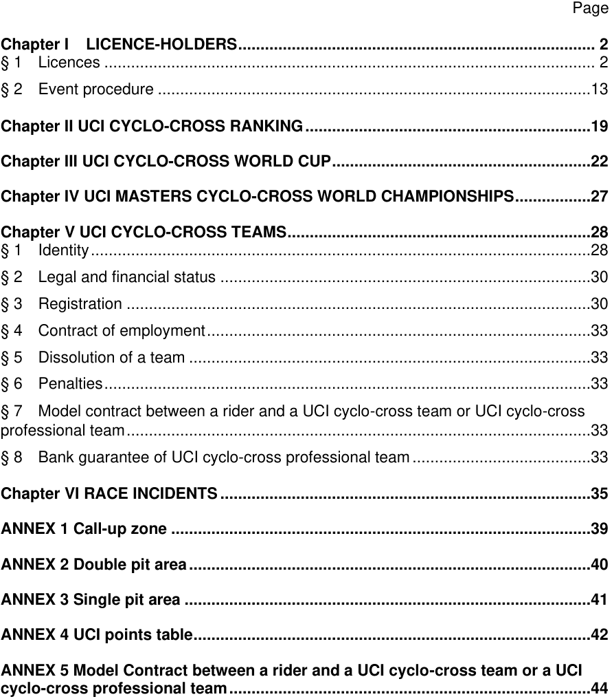
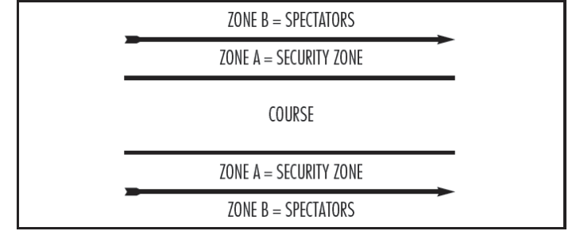
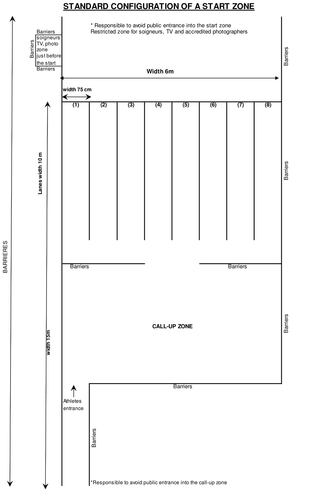
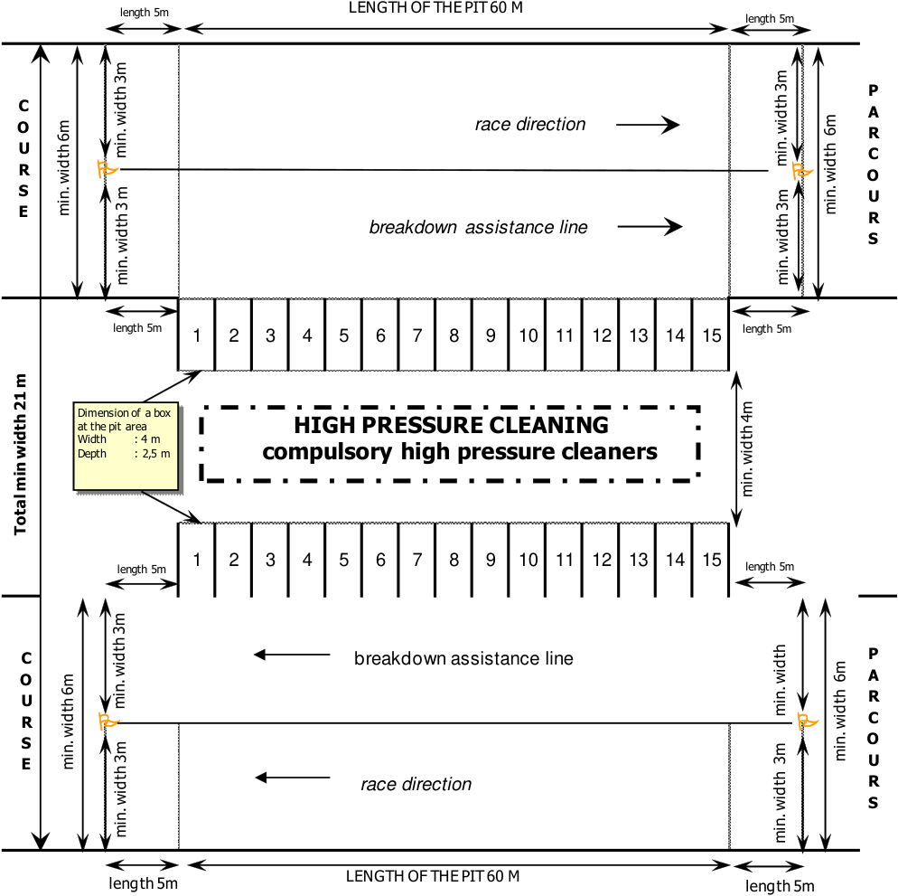
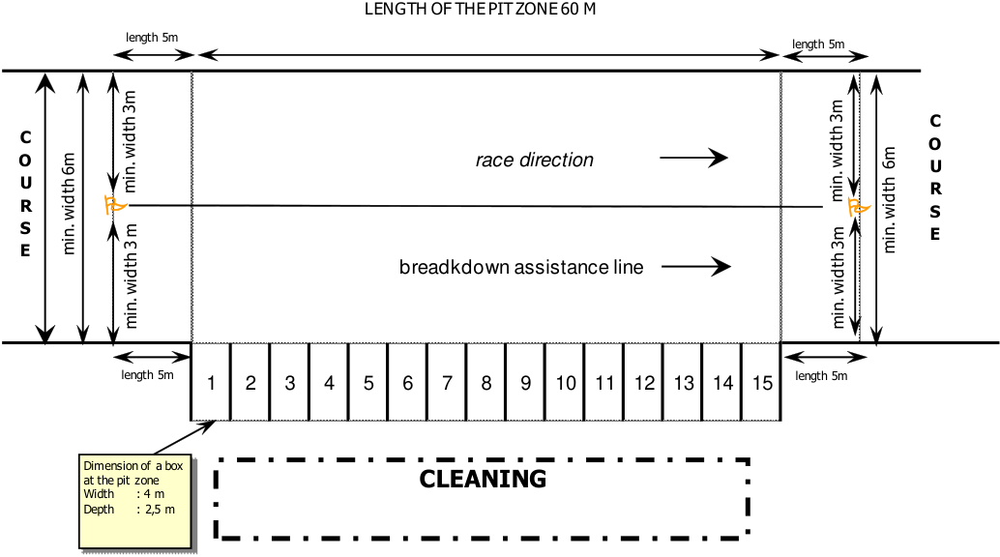

**UCI CYCLING REGULATIONS** 

**PART 5 CYCLO-CROSS Version on 01.07.2025** 

## **TABLE OF CONTENTS** 

**----- Start of picture text -----** 
|||
|---|---|
|Page|
|Chapter I|LICENCE-HOLDERS ................................................................................ 2|
|§ 1|Licences .............................................................................................................. 2|
|§ 2|Event procedure .................................................................................................13|
|Chapter II UCI CYCLO-CROSS RANKING ................................................................19|
|Chapter III UCI CYCLO-CROSS WORLD CUP ..........................................................22|
|Chapter IV UCI MASTERS CYCLO-CROSS WORLD CHAMPIONSHIPS .................27|
|Chapter V UCI CYCLO-CROSS TEAMS ....................................................................28|
|§ 1|Identity ................................................................................................................28|
|§ 2|Legal and financial status ...................................................................................30|
|§ 3|Registration ........................................................................................................30|
|§ 4|Contract of employment ......................................................................................33|
|§ 5|Dissolution of a team ..........................................................................................33|
|§ 6|Penalties .............................................................................................................33|
|§ 7|Model contract between a rider and a UCI cyclo-cross team or UCI cyclo-cross|
|professional team ........................................................................................................33|
|§ 8|Bank guarantee of UCI cyclo-cross professional team ........................................33|
|Chapter VI RACE INCIDENTS ...................................................................................35|
|ANNEX 1 Call-up zone ..............................................................................................39|
|ANNEX 2 Double pit area ..........................................................................................40|
|ANNEX 3 Single pit area ...........................................................................................41|
|ANNEX 4 UCI points table .........................................................................................42|
|ANNEX 5 Model Contract between a rider and a UCI cyclo-cross team or a UCI|
|cyclo-cross professional team .................................................................................44|

**----- End of picture text -----** 

CYCLO-CROSS 

E0725 

1 

**UCI CYCLING REGULATIONS** 

## **PART 5 CYCLO-CROSS** 

## **Chapter I LICENCE-HOLDERS** 

## **§ 1 Licences** 

## **Participation** 

- **5.1.001** The category which will be applied for entries to races for the entire season is the category to which the rider will belong on 1 January of the following calendar year. 

## Men 

The category Men Junior shall comprise riders aged 17 to 18. The category Men Under 23 shall comprise riders aged 19 to 22. The category Men Elite shall comprise riders of 23 and above. 

Except when separate category races are organised, Men under 23 and Men Elite shall race together. 

- Men under 23 riders cannot race with men elite during the following events: 

   - UCI Cyclo-cross World Championships; 

   - UCI Cyclo-cross World Cup events, when those include a separate Men Under 23 race; 

   - Continental and National Championships, at the discretion of Continental Confederations or respectively National Federations. 

In all other events, men under 23 can ride in the race for men elite, even if a separate race is being run for men under 23 riders. 

If men under 23 and men elite compete in the same race, meaning same start time and same race distance: 

- no separate results are made up; 

- UCI points are awarded according to the elite points scale; 

- in case of championships, only one title is awarded (for example, should an under 23 rider win the race, he shall be awarded the elite title). 

## Women 

The category Women Junior shall comprise riders aged 17 to 18. The category Women Under 23 shall comprise riders aged 19 to 22. The category Women Elite shall comprise riders of 23 and above. 

Except when separate category races are organised, women junior, women under 23 and women elite shall race together. 

Women junior riders cannot race with women elite during the following events: 

- UCI cyclo-cross world championships; 

- UCI cyclo-cross world cup events, when those include a separate women junior race; 

- continental and national championships, at the discretion of continental confederations or respectively national federations. 

CYCLO-CROSS 

E0725 

2 

**UCI CYCLING REGULATIONS** 

In all other events, women junior can ride in the race for women elite, even if a separate race is being run for women junior. 

- Women under 23 riders cannot race with women elite during the following events: 

   - UCI cyclo-cross world championships; 

   - continental and national championships, at the discretion of continental confederations or respectively national federations. 

In all other events, women under 23 can ride in the race for women elite. 

If two or three of the categories women junior, women under 23 and women elite compete in the same race, meaning same start time and same race distance: 

- no separate results are made up for the grouped categories; 

- UCI points are awarded according to the elite points scale; 

- in case of championships, only one title is awarded (for example, should an under 23 rider win the race, she shall be awarded the elite title). 

## Masters 

All riders aged 35 and over may ride in the UCI masters cyclo-cross world championships. However the following riders are not eligible: 

1. any rider who has ridden in the UCI cyclo-cross world championships, continental championships or UCI cyclo-cross world cup during the current year; 

2. any rider, who has been a member, during the current cyclo-cross season, of a team registered with the UCI; 

3. any rider classified with at least 100 points in the UCI individual cyclo-cross ranking published after the first UCI cyclo-cross world cup event of the current cyclo-cross season. 

In races other than the UCI masters cyclo-cross world championships, riders may participate with a temporary or daily licence, issued by their national federation. 

The licence must clearly state the starting and finishing dates of its period of validity. The national federation shall make sure that the holder of a temporary licence will, for the duration of his licence, benefit from the same insurance cover and other benefits as those attached to an annual licence. 

## UCI recognised teams 

Riders, men and women, belonging to the following teams are allowed to race cyclocross events under the name and the clothing of their respective team, at the exception of races where the national outfit is mandatory as per the article 1.3.059: 

- UCI cyclo-cross teams and UCI cyclo-cross professional teams, as per Chapter V, Part V Cyclo-cross of the UCI regulations; 

- UCI road teams, as per Chapters XV, XVI and XVII, Part II Road races of the UCI regulations; 

- UCI mountain bike teams, as per Chapters IX and X, Part IV Mountain Bike of the UCI regulations. 

_(text modified on 01.09.99; 01.09.04; 01.09.06; 01.09.08; 16.06.14; 01.07.15; 07.06.16; 28.01.17; 26.06.18; 21.06.19; 12.06.20; 10.06.21; 01.07.22)_ 

- **5.1.002** A rider ranked 21[st] to 50[th] of the most recently published elite UCI cyclo-cross ranking may not take part in national events in a country other than the federation of his sporting nationality according to the UCI regulations. 

CYCLO-CROSS 

E0725 

3 

**UCI CYCLING REGULATIONS** 

A rider ranked in the top 20 of the most recently published elite UCI cyclo-cross ranking may not take part in any national events. 

Infringements to the provisions above shall be sanctioned by a suspension pronounced by the UCI disciplinary commission. A first infringement shall be sanctioned by a suspension for a duration of 7 to 30 days, whereas a repeated infringement shall be sanctioned at the discretion of the UCI disciplinary commission. 

_(article introduced on 01.09.04; text modified on 16.06.14; 01.03.24)_ 

## **Race programme – technical guide** 

- **5.1.003** The programme - technical guide must be written in French or English and in the official local language(s) and include at least the following information: 

   - schedule and times of races and official training; 

   - name and contact of the event’s stakeholders: event’s director, course manager, race doctor, commissaires’ panel; 

   - the prize list and the prize money payment’s process; 

   - description and detailed map of the circuit, showing the circuit length, the start and finish, the pit area and the obstacles; 

   - the location of the secretariat, accreditation issue point, the press room, and antidoping control location; 

   - timing and where applicable photo-finish installations; 

   - policing, security and emergency medical arrangements. 

_(text modified on 01.09.04; 01.09.08; 28.06.17)_ 

## **Calendar** 

- **5.1.004** International cyclo-cross races are registered on the international calendar in accordance with the following classification: 

   - UCI cyclo-cross world championships (CM); 

   - UCI cyclo-cross world cup (CDM); 

   - UCI masters cyclo-cross world championships (CMM); 

   - continental championships (CC); 

   - class 1 event (C1); 

   - class 2 events (C2). 

The allocation of classes shall be carried out annually by the UCI management committee. 

For each season, the UCI will draw up a list of protected UCI cyclo-cross world cup rounds, which will not concern more than half of the rounds of the UCI cyclo-cross world cup. The allocation of the protected status for an event shall be based on an assessment of its relevance in terms of international development of the discipline of cyclo-cross. For any event applying for registration on the UCI international calendar for the day of or the day prior to an event with protected status, the UCI may render a decision in accordance with article 1.2.011. par. 2 ii) and iii) of the UCI Regulations. 

An event will only be given or maintained class 1 status if the previous season's race does not present any major organisational issues and following the UCI’s approval. For all cyclo-cross events registered on the international calendar in class 1 or class 2, the organiser must organise a men junior race, a women race and a men elite race. A derogation for the mandatory organisation of the men junior race may be granted by the UCI if the event is not organised on a Saturday or a Sunday. 

CYCLO-CROSS 

E0725 

4 

**UCI CYCLING REGULATIONS** 

A separate women junior race can be organised during all UCI events, except the UCI cyclo-cross world cup when decided by the UCI. 

A separate women under 23 race can be organised only during UCI cyclo-cross world championships, continental championships and national championships. 

A separate men junior race must be organised during all UCI events, except the masters cyclo-cross world championships and except the UCI cyclo-cross world cup when decided by the UCI. 

A separate men under 23 race can be organised during UCI cyclo-cross world championships, continental championships, national championships and class 1 or class 2 event, and for the latter only if the event is part of a UCI recognised series. 

A continental championship may be organised over two days. 

A new event may only be added to the international calendar in class 2. 

_(article introduced on 01.09.06; text modified on 01.09.08; 01.07.11; 07.06.16, 21.06.19; 12.06.20; 01.07.22; 01.03.24)_ 

## **Cyclo-cross team relay** 

- **5.1.004** One cyclo-cross team relay event must be organized at the UCI cyclo-cross world **bis** championships and may be organised at the continental cyclo-cross championships in accordance with the provisions of article 9.2.045 bis. UCI points are allocated to the nation only and not to the riders individually. A minimum of 5 nations must compete in the cyclo-cross team relay for UCI points to be awarded. 

Each rider shall race during one complete lap of the parcours used for the individual races of the UCI cyclo-cross world championships. At the end of his lap and in the official relay zone, he shall give the relay to the next teammate. The finishing rider must touch the hand, arm or shoulder of the next racing rider, when he is standstill in the relay box. No flying relay shall be accepted. When he is touched by the finishing rider, the next racing rider can start and ride his lap. 

If the rider finishing his relay passes his teammate without touching him, he must immediately make a u-turn and come back to the box allocated to his nation. The riders racing after the last relay shall finish their lap by crossing the finish line of the venue. 

Teams are responsible for determining the order of riders and for their timely presence in the relay zone. 

Failure to comply with these provisions concerning the relay between teammates shall be sanctioned by the disqualification of the team. 

_(article introduced on 01.07.22_ ) 

## **Protection of the dates** 

- **5.1.005** 1.  UCI cyclo-cross world championships 

   - No other international cyclo-cross event may be organised on the days of the UCI cyclocross world championships. 

## 2. UCI cyclo-cross world cup 

No class 1 event may be held on the same day as a UCI cyclo-cross world cup event. 

CYCLO-CROSS 

E0725 

5 

**UCI CYCLING REGULATIONS** 

A class 1 event may be held on the day before or the day after a UCI cyclo-cross world cup event only with UCI’s previous approval. 

No class 2 event may be held on the same day as a UCI cyclo-cross world cup event in the same country. 

## 3. Class 1 

No class 2 event may be held on the same day as a class 1 event in the same country (for Europe) or in the same cycling-defined region (for USA). 

_(article introduced on 01.09.06; text modified on 01.09.08; 01.07.11; 12.06.20)_ 

## **UCI Technical delegate** 

- **5.1.006** At the UCI cyclo-cross world championships and UCI cyclo-cross world cup events a UCI technical delegate is appointed by the UCI. 

Without prejudice to the responsibility of the organiser, the UCI technical delegate shall supervise the preparation of the technical aspects of the event and shall serve as a link with UCI headquarters in this respect. 

_(article introduced on 01.09.06; text modified on 01.07.10; 01.07.11; 12.06.20)_ 

- **5.1.007** If an event is promoted at a new venue, the UCI technical delegate must carry out an inspection well in advance to take the necessary measurements. The inspection will include the course, the distance, determine the double pit area, installations and the security. He will meet the organiser and prepare an inspection report without delay for submission to the UCI cyclo-cross coordinator. 

He must be on site prior to the first official training session and must carry out an inspection of the venue and course in conjunction with the organiser and the president of the commissaires' panel. He shall coordinate the technical preparations for the event and shall ensure that the recommendations made in the inspection report are implemented. The definitive version of the course and any changes, if this is the case, shall be the responsibility of the UCI technical delegate. Where a UCI technical delegate does not have to be appointed under article 5.1.006, this task shall fall to the president of the commissaires' panel. 

The UCI technical delegate shall attend the team managers' meetings during the UCI cyclo-cross world championships. 

_(article introduced on 01.09.06; text modified on 01.09.08; 01.07.22)_ 

## **Security** 

- **5.1.008** A zone of at least 100 metres before and 50 metres after the finish line will be protected with barriers. It will be accessible only to organisational staff, the riders, paramedics, team managers and accredited press. The organiser must strictly control access to this zone. 

Adjacent parts of the course where riders pass in both directions must be separated by a safety net. The safety nets used must have no openings greater than 1 cm x 1 cm. 

For events where large crowds are expected, on technical parts of the course, a safety area must be provided between the spectators and the course, as shown below: 

CYCLO-CROSS 

E0725 

6 

**UCI CYCLING REGULATIONS** 

The zone A sections must be minimum 75 cm wide. 

The use of dangerous items along the course, such as fencing wire (barbed or otherwise) and metal stakes (including those used for advertising banners) is forbidden. The course must also be routed away from any item which presents danger to the riders. 

From 5 minutes before the start of the race, the course may not be ridden by anyone other than the riders in the race. 

The organiser must provide at least 4 crossing points for spectators on the course. Each crossing point must have 2 one-way lanes. The crossings must be marshalled on each side. 

The race organiser must provide enough marshals to ensure the safety of the riders and spectators during competition and official training sessions. 

_(text modified on 01.09.04; 01.09.08; 01.07.11; 01.07.22)_ 

## **First aid** 

- **5.1.008** At least one ambulance and one basic first aid post are required at all races. **bis** For each event, at least one (1) doctor and at least four (4) people qualified to perform first aid under the laws of the country shall be present at the event. 

Basic medical coverage is mandatory during all official training sessions, also if those are planned on the days prior to the race (UCI cyclo-cross world championships, UCI cyclo-cross world cup events and continental championships). 

_(text modified on 01.09.04; 01.09.08; 16.06.14)_ 

## **Inflatable arches** 

- **5.1.009** The use of inflatable arches which cross the course is forbidden. 

_(article introduced on 01.02.07; text modified on 01.09.08)_ 

## **Installations** 

- **5.1.010** The judge's stand at the finish must be covered and mandatory placed right across the finish line. It shall be preferably located on the left of the finish line. 

The organiser shall provide at least four radio sets to the commissaires' panel. These radio sets must have one channel reserved for the sole use of the commissaires' panel and another with which it is possible to contact the organiser. 

_(text modified on 01.09.99; 01.09.04; 01.07.22)_ 

CYCLO-CROSS 

E0725 

7 

**UCI CYCLING REGULATIONS** 

- **5.1.011** The organiser must provide riders with a heated room, showers with hot and cold water and a water supply for cleaning of equipment. These installations must be no more than 2 km from the finish line. 

## **Course** 

- **5.1.012** A cyclo-cross course shall include road, country and forest paths and meadowland alternating in such a way as to ensure changes in the pace of the race and allowing riders to recuperate after difficult sections. 

The course of a cyclo-cross event shall be inspected by the president of the commissaires’ panel together with the course manager appointed by the organising committee, the day before the event when it is a UCI cyclo-cross world cup, continental championships or class 1 event. For a class 2 event, it shall be inspected at the latest 2 hours before the first race. 

_(text modified on 01.08.00; 01.07.22)_ 

- **5.1.013** The course shall be usable in all circumstances, whatever the weather conditions. Clay or easily flooded areas and agricultural land should be avoided. 

- **5.1.014** When the race course is used for purposes other than holding UCI races, the organiser shall take all precautions to keep the course safe and rideable for the UCI categories. 

_(text modified on 21.06.19)_ 

- **5.1.015** The organiser must take steps to avoid damage to the course by spectators. Before the start of each race, the organiser must check the condition of the course and carry out any repairs required. 

For the UCI cyclo-cross world championships, the UCI cyclo-cross world cup events, continental championships and the national championships, a parallel course is required for sections of the course which deteriorate easily. 

_(text modified on 01.09.99; 01.09.03; 01.09.04; 01.07.09; 01.07.10)_ 

- **5.1.016** [article transferred to art. 5.1.008 on 01.09.08] 

- **5.1.017** The course must form a closed circuit of a minimum length of 2.5 km and maximum 3.5 km, of which at least 90% shall be ridable. 

_(text modified on 01.09.99; 01.09.04)_ 

- **5.1.018** The course must be at least 3 metres wide throughout and clearly marked and protected on both sides. 

_(text modified on 01.09.99; 01.09.04; 01.09.08)_ 

## **U-turns** 

- **5.1.018** U-turns on the course shall be installed and protected such as riders may not hold on **bis** the pole or on the barrier in the centre of the U-turns. 

_(article introduced on 07.06.16)_ 

CYCLO-CROSS 

E0725 

8 

**UCI CYCLING REGULATIONS** 

## **Call-up zone** 

- **5.1.019** An assembly area for starters (call-up zone) shall be provided and marked off with barriers behind the start line (see annex 1). 

Eight lanes with a width of 75 cm and a length of 10 m shall be marked out on the ground at right angles to the start line in order to facilitate organising the riders into starting order (see annex 1). 

_(text modified on 01.09.99; 01.09.04; 01.09.06; 01.07.10)_ 

## **Start section** 

- **5.1.020** The start section must be on firm ground, and preferably on surfaced road. It must have a length of at least 150 metres and a width of at least 6 metres. It must be as straight as possible and not include any descent. The first narrowing or obstacle after the start section may not be abrupt, it must be such as to allow all the riders to pass easily. The angle of the first corner must be greater than 90 degrees. U-turns are not allowed. 

If the start section uses the finish section or if barriers are used in the start section, then the barriers must be continuous and be firmly attached to each other. No gaps are allowed. 

A gate system for spectators’ and officials crossing can be installed but only after the finish line. The use of lightweight barriers (e.g. plastic) for the start section is prohibited. The barriers must be weighted down so that they do not move in strong winds or when subject to pressure by spectators or other forces. 

_(text modified on 01.09.03; 01.09.04; 01.09.06; 01.09.08; 16.06.14; 07.06.16; 10.06.21)_ 

## **Finish section** 

- **5.1.021** The finish section must run straight for at least 100 metres. The width must be at least 6 metres for UCI cyclo-cross world championships, UCI cyclo-cross world cup events, continental championships and events in class 1, and at least 4 metres for other events. The section must be flat or uphill. 

The finish banner shall be erected at least 2.5 m above the ground over the finish line and shall cover the whole width of the finish section. 

_(text modified on 01.09.04; 01.09.06; 01.09.08; 01.07.10)_ 

## **Obstacles** 

- **5.1.022** The start and finish sections must be free of obstacles. 

_(text modified on 01.09.04)_ 

- **5.1.023** The course may include no more than six artificial obstacles. Obstacle shall mean any part of the course where riders are likely (but not required) to dismount. 

The artificial obstacles allowed on a cyclo-cross course are restricted to: 

- planks, as described in article 5.1.024; 

- steps; 

- non natural sand pits. 

All other artificial obstacles are not allowed. 

CYCLO-CROSS 

E0725 

9 

**UCI CYCLING REGULATIONS** 

The length of an obstacle may not exceed 80 metres and the height may not exceed 40 cm. The total length of obstacles may not exceed 10% of the course. 

Non-natural sand pits should be minimum 40 metres, maximum 80 metres long and minimum 6 metres wide. The sand pit should be located on a straight section and requests a level entrance and exit. 

Descents of flights of steps may not be used. 

_(text modified on 01.08.00; 01.09.04; 01.07.09; 01.07.10; 01.07.11; 26.06.18)_ 

- **5.1.024** The course may include a single section of planks. This obstacle must consist of two planks placed minimum 4 metres and maximum 6 metres apart and placed on a straight section. The planks must be solid for their entire height, without sharp edges and not made of metal. They must have a maximum height of 40 cm and extend the entire width of the course. 

In the event that the course is abnormally slippery, the plank section must be removed on the decision of the president of the commissaires' panel in consultation with the organiser and, should he be present, the UCI technical delegate or the UCI cyclo-cross coordinator. 

Either or both of the planks referenced above may be replaced by one or two tree logs which ever the case may be. If a tree log is used, its maximum thickness shall be below 40cm. Otherwise, all rules applicable to the specifications of planks shall apply to tree logs as well. 

_(text modified on 01.08.00; 01.09.03; 01.09.04; 01.09.08; 01.07.10; 01.07.11; 07.06.16; 21.06.19)_ 

- **5.1.025** The course may pass over bridges or footbridges as long as they are at least 3 metres wide and have protective barriers on both sides. Bridges or footbridges shall be covered with an anti-slip surface (matting, mesh or anti-slip paint). 

In addition a separate footbridge for spectators must be provided. 

_(text modified on 01.09.99; 01.09.04)_ 

- **5.1.025** Obstacles of cyclo-cross course must be the same for men and women elite race. **bis** 

_(article introduced on 26.06.18)_ 

## **Pit areas** 

- **5.1.026** The pit area is the part of the course where riders can change wheels or bicycles. 

_(text modified on 01.09.04)_ 

- **5.1.027** The pit areas must be straight and may not include an obstacle. They must be located on a part of the course where the speed is not high, excluding gravelled sections and descents. 

_(text modified on 01.09.04)_ 

CYCLO-CROSS 

E0725 

10 

**UCI CYCLING REGULATIONS** 

- **5.1.028** The double pit area (see annex 2) is compulsory for UCI cyclo-cross world championships, UCI cyclo-cross world cup events, continental championships, national championships and events in class 1. 

If it is not possible to design a course such that a double pit area as per article 5.1.029 can be set up, the event may only be organised with the prior consent of the UCI to set up two single pits (see annex 3). 

_(text modified on 01.09.04; 01.07.10; 01.07.22)_ 

- **5.1.029** The double pit area must be set up in an area where two sections of the course are close enough together and the distance along the course between the successive pits is more or less equal each way. 

_(text modified on 01.09.04)_ 

- **5.1.030** For UCI cyclo-cross world championships, the location for the double pit area shall be set by the UCI technical delegate. 

_(article introduced on 01.09.04)_ 

- **5.1.031** In events other than those covered by article 5.1.028, the organiser must make provision for a double pit area or two single pit areas located at suitable distances around the course. 

_(text modified on 01.09.04)_ 

- **5.1.032** For the whole length of the pits the racing lane and the pit lane must be separated, using barriers and marker tape. 

The pit area must be signalled and marked precisely with a yellow flag at the beginning and the end of the separation between the two lanes. 

_(text modified on 01.08.00; 01.09.04)_ 

- **5.1.033** At the side of the pit lane a zone at least 2 metres deep shall be set aside for riders' mechanics and their equipment. 

_(text modified on 01.08.00; 01.02.07; 26.06.07)_ 

- **5.1.034** In double pit areas provision must be made for a water supply for cleaning of equipment. For single pit areas, the water supply must be in the immediate proximity such that mechanics do not have to cross the course to access it. 

If a water tank or connections for high pressure cleaning apparatus are provided, they must be made freely available. 

At UCI cyclo-cross world championships, UCI cyclo-cross world cup and continental championships events the organiser must provide ten high-pressure cleaners in the pit area. 

CYCLO-CROSS 

E0725 

11 

**UCI CYCLING REGULATIONS** 

Personal high pressure cleaners are forbidden in the pit area during the UCI cyclo-cross world championships, the UCI cyclo-cross world cup and the continental cyclo-cross championships. 

_(text modified on 01.09.98; 01.09.04; 28.06.17; 10.06.21)_ 

## **Boxes** 

- **5.1.035** At UCI cyclo-cross world championships _,_ UCI cyclo-cross world cup events and continental championships the pit areas must be at least 70 metres long. 

Along the pit lane provision must be made for 15 boxes marked off by barriers with a width of 4 metres (see annex 2). 

For class 1 events the pits must be at least 60 metres long and at least 12 boxes must be provided. 

Only two accredited assistants per rider shall be allowed in the box of this rider. 

_(text modified on 01.08.00; 01.09.03; 01.09.04; 01.02.07; 01.07.10)_ 

## **Allocation of boxes** 

- **5.1.036** The pit boxes are allocated the day prior to the event for the UCI cyclo-cross world cup events and continental championships, they are allocated during the team managers meeting for the UCI cyclo-cross world championships. For those 3 events, pit boxes are allocated as follows: 

   1. separately for each category on the basis of the most recently published UCI cyclo-cross ranking by nation of the current season for the category concerned (or the final ranking of the previous season if no ranking has yet been published for the current season); 

   2. the allocation of boxes to teams that do not feature in the relevant ranking shall be by drawing lots; 

   3. the president of the commissaires’ panel shall prepare per category the number of pits allocated to each nation, taking into account the number of riders. Three boxes maximum will be allocated to one nation. Nations with a small number of riders may be grouped in the same box; 

   4. the national team managers shall select their preferred boxes in the order determined by points 1 and 2. Any nation that is allocated 2 or 3 boxes must chose the numbers of these boxes back to back; 

   5. in case of absence of reply of the team manager or blocked situation, the president of the commissaires panel shall fix the relevant boxes allocation. The final distribution of boxes per nation will be communicated to teams and commissaires. 

_(text modified on 01.09.99; 01.09.05; 01.09.08; 01.07.09; 01.07.10; 01.07.22)_ 

- **5.1.036** For the class 1 events, the pit boxes must be allocated the day prior to the event with the **bis** 12 boxes minimum requested by the article 5.1.035 and as follows: 

   1. separately for each category, the president of the commissaires’ panel determines the number of riders per box, taking into account the rounded-up ratio between the number of riders and the number of boxes; 

   2. the riders are distributed by drawing lot in each of these boxes, in respect of the maximum of riders per box determined by the point 1; 

   3. the final distribution of riders per box will be communicated to teams and commissaires. 

CYCLO-CROSS 

E0725 

12 

**UCI CYCLING REGULATIONS** 

The provisions 1, 2 and 3 may be applied to a class 2 event where boxes are set-up as per the article 5.1.035. The decision as to whether the boxes allocation by drawing lot in a class 2 event is to be applied will be made by the president of the commissaires' panel after approval of the organiser. 

_(article introduced on 01.07.22)_ 

- **5.1.037** [article abrogated on 01.09.08] 

## **Equipment changes** 

- **5.1.038** A rider may only take the pit lane to change his bicycle, wheel(s) or for other mechanical assistance. 

Should a rider take the pit lane for any other reason, the commissaires shall decide and the decision shall be final. 

_(text modified on 01.09.04; 01.07.10; 16.06.14; 01.07.15; 07.06.16)_ 

- **5.1.039** Equipment changes must be carried out within the confines of the pit lane and at the same point. 

A rider who has passed the end of the pit area must continue to the following pit area for any bicycle or wheel change. A rider who is still in the racing lane may enter the pit lane as long as he retraces his route in the racing lane and enters the other lane at its start without obstructing other competitors. 

_(text modified on 01.08.00; 01.09.03; 01.09.04; 01.09.05)_ 

- **5.1.040** Changes of wheel or bicycle between riders are forbidden. 

## **Attendants** 

- **5.1.041** Each rider may be accompanied by a paramedical assistant and two mechanics. 

The paramedical assistant and the mechanics must be provided by the organiser with a free accreditation, which gives them access to the area reserved for them by virtue of their office. 

The accreditations must be distributed outside the circuit, in a clearly indicated place. 

For the UCI cyclo-cross world cup and UCI cyclo-cross world championships, accreditations for rider’s paramedical assistant and two mechanics will be distributed by commissaires exclusively, after that the license’s check of each paramedical assistant and the mechanics has been completed. 

_(article introduced on 26.06.07; text modified on 07.06.16)_ 

## **§ 2 Event procedure** 

## **Starting procedure** 

- **5.1.042** The riders shall assemble in the call-up zone defined in article 5.1.019 at least 10 minutes before the start. 

Riders must wait for the start with at least one foot on the ground or be penalised by being sent back to the last place in their start lane. 

CYCLO-CROSS 

E0725 

13 

**UCI CYCLING REGULATIONS** 

The start is given by the president of the commissaires’ panel with a whistle, a sound or a light system. In case of a sound or light system, the start must be triggered by the president of the commissaires panel himself, no technical intermediate is allowed. 

The last seconds before the start are not accompanied with any progressive sound or respectively any progressive light sequence. For example: 

- in case of a sound system, the sound turns from silent to the start sound, there is no beep or no other sound indicating that the start is coming in few seconds; 

- - in case of a light system, the light turns from red to green, or form off to on but without any progression indicating that the start is coming in few seconds. 

_(text modified on 01.10.02; 01.09.08; 10.06.21)_ 

## **Start order** 

- **5.1.043** The start order of events is determined as follows: 

## A. UCI cyclo-cross world championships and UCI cyclo-cross world cup 

1. the first 16 riders of the most recently published UCI cyclo-cross world cup standings of the current season. For the women under 23 race of the UCI world championships, the first 16 riders aged 19-22 years from the women elite UCI cyclo-cross world cup standings. This point 1 is not applicable for the first UCI cyclo-cross world cup event of the season; 

2. as per the most recently published UCI cyclo-cross individual rankings of the current season (or the final classification of the previous season if no rankings has yet been published for the current season; 

3. for men elite and women elite races, the place 33[rd] to 40[th] of the start order will be allocated to riders ranked as per the following rankings, unless they are listed on the start order between the place 1[st] to 32[nd] according to point 1 and 2 above: 

- top 10 of the UCI mountain bike cross-country ranking; 

- top 20 of the UCI road world ranking; 

- the place 33[rd] to 40[th] will be allocated following the riders’ ranking in any discipline: UCI mountain bike cross country or UCI road world ranking. If two riders have the same ranking, they will be placed by drawing lot. 

- 4. unclassified riders: by nations in rotation (*). 

## B. Continental championships and other events 

1. as per the most recently published UCI cyclo-cross individual ranking of the current season (or the final ranking of the previous season if no ranking has yet been published for the current season); 

2. unclassified riders by drawing lots. 

C.  Women junior, women under 23 and men under 23 races 

The points A and B of this article fully apply, taking into account: 

- for the women junior races, the UCI cyclo-cross individual ranking of the women category; 

- for the women under 23 races, the UCI cyclo-cross individual ranking of the women category; 

- for the men under 23 races, the UCI cyclo-cross world cup overall standings of the men under 23 category in the case A and the UCI cyclo-cross individual ranking of the men elite category for other cases. 

(*) For unclassified riders, the start order within the team must be confirmed by the national federations during riders confirmation. 

CYCLO-CROSS 

E0725 

14 

**UCI CYCLING REGULATIONS** 

- The start order among the teams is determined as follows: 

   - first, national teams whose order is determined by the nations’ ranking of the concerned category from the recent UCI cyclo-cross world championships; 

   - second, unclassified national teams whose order is determined by drawing lots. 

The teams (in the order as mentioned above) are taken in turn with the teams’ first riders starting in sequence, then the teams’ second riders etc. 

_(text modified on 01.09.99; 01.10.02; 01.09.03; 01.09.04; 01.02.07; 26.06.07; 01.09.08; 01.07.09; 01.07.10; 16.06.14; 01.07.15; 21.06.19; 12.06.20; 01.03.24)_ 

- **5.1.044** [article abrogated on 01.09.08] 

- **5.1.045** [article abrogated on 01.09.08] 

## **Allocation of race numbers** 

- **5.1.046** The allocation of race numbers at UCI cyclo-cross world championships and UCI cyclocross world cup events shall be as follows: 

   - race numbers in sequence from 1 upwards to the country of the world champion of the preceding season; 

   - race number 1 shall only be allocated to the reigning world champion of the category concerned; 

   - the other race numbers are issued to nations on the basis of their classification in the UCI cyclo-cross world championships of the preceding season; 

   - for nations not ranked or not having taken part in the UCI world championship the preceding season, the allocation shall be done by drawing lots by the commissaires’ panel. 

_(text modified on 01.09.99; 01.09.03; 01.09.04; 01.09.06; 01.09.08)_ 

## **False start** 

- **5.1.047** In case of a false start, a new call up procedure and gridding will be done. Riders who cause a false start shall be sent back to the last place in the start order of the new call-up. 

_(text modified on 01.09.06; 10.06.21)_ 

## **Duration of events** 

- **5.1.048** The duration of events must be as close as possible to: 

   - 40 minutes for men junior races; 

   - 40 minutes for women junior races; 

   - 45 minutes for the races where women elite and women junior race together; 

   - 45 minutes for the women under 23 races; 

   - 50 minutes for men under 23 races; 

   - 50 minutes for women elite races without women junior; 

   - 60 minutes for the men elite races. 

The number of laps will be calculated and announced at the end of the second lap. 

_(text modified on 01.09.01; 01.09.06; 16.06.14; 01.07.15; 07.06.16; 28.06.17; 21.06.19; 12.06.20; 10.06.21)_ 

CYCLO-CROSS 

E0725 

15 

**UCI CYCLING REGULATIONS** 

## **Order of events** 

- **5.1.048** For all events schedules on one day, the order of events must be as follows: **bis** 

   1. men junior; 

   2. women junior when appropriate; 

   3. men under 23 when appropriate; 

   4. women; 

   5. men elite. 

The women and men elite races must be organised as stand-alone races. Meaning that no other categories should be added nor any kind of delayed start for another race or category shall be allowed for women and men elite races. 

_(article introduced on 16.06.14; text modified on 28.06.17; 21.06.19)_ 

## **Last lap** 

- **5.1.049** The last lap of the race shall be announced by the bell. 

_(text modified on 01.09.06)_ 

## **Classification** 

- **5.1.050** All riders who cross the finish line after the winner shall have finished the race and will be given a placing on the basis of their position. 

A rider who retires must leave the course immediately and does not have the right to cross the finish line. He shall be listed in the results as «DNF» («did not finish») and shall not be awarded any points for this event. 

_(text modified on 01.09.04; 01.09.08; 01.07.10)_ 

## **80% rule** 

- **5.1.051** Lapped riders must complete the lap during which they were lapped and leave the event via an exit located before the finishing straight or in the “80%” zone as described in article 5.1.052, if that rule applies. They will be listed in the results in the order in which they are pulled out of the race plus number of laps which have not been completed. 

_(text modified on 01.09.98; 01.09.04; 01.09.08; 01.07.10)_ 

- **5.1.052** The decision as to whether the 80% rule is to be applied will be made by the president of the commissaires' panel after discussion with the organiser. Any rider whose time being 80% slower than the race leader's first lap will be pulled out of the race. He shall leave the race at the end of his lap in the zone provided for the purpose (the "80% zone") except when the rider is approaching the final lap and is not susceptible of being lapped by the leaders of the race. At UCI cyclo-cross world championships and UCI cyclo-cross world cup events the 80% rule must be applied. 

_(text modified on 01.07.10; 01.07.11; 01.03.24)_ 

- **5.1.053** [article transferred to 9.2.045 ter on 01.07.22] 

## **Official ceremony** 

- **5.1.054** The official ceremony shall take place as soon as possible and no later than 15 minutes after the finish of the first rider. 

CYCLO-CROSS 

E0725 

16 

**UCI CYCLING REGULATIONS** 

For UCI cyclo-cross world cup events, refer to article 5.3.011. 

_(text modified on 21.06.19; 12.06.20)_ 

- **5.1.055** Those involved in the official ceremony are permitted to wear additional clothing. Presenting rider’s bike on the award ceremony’s podium is not allowed, nor on the scene, nor in front of the scene. 

_(text modified on 26.06.18)_ 

- **5.1.056** [article transferred to art. 1.2.124] 

- **5.1.057** [article transferred to art. 1.2.124] 

## **Cancellation** 

- **5.1.057** In the event of difficult weather conditions (e.g. strong winds, heavy snowfall, temperatures below -15°Celsius) the president of the commissaires' panel may decide to cancel the event, after consulting the UCI technical delegate in case of need and the organiser. 

_(text modified on 01.09.99; 01.09.04)_ 

## **In-race communications** 

- **5.1.059** The use of radio links or other remote means of communication with riders is forbidden. 

For the UCI cyclo-cross world cup and UCI cyclo-cross world championships, men elite and women races only, the use of radio-communication from the rider to his/her mechanics is allowed. The use of radio-communication from staff to the rider is forbidden. The use of such a system is subject to any relevant legal provisions. 

_(article introduced on 01.09.04; text modified on 07.06.16)_ 

- **5.1.060** [article transferred to art. 1.3.071] 

## **Electronic identification** 

- **5.1.061** When an electronic device is provided to riders for their identification or their geolocation by the timing service provider, the riders shall be under the obligation to wear it in addition to the identification numbers listed at article 1.3.073. 

The electronic device provided by the timing service provider shall be identical for all riders participating in the same event. It shall be considered as an identification number, similar to the materials listed at article 1.3.073. 

Articles 1.3.076, 1.3.077, 1.3.080 and points 3 and 4 of the table of race incidents appended to Part XII shall remain applicable. 

_(article introduced on 28.06.17; text modified on 21.06.19)_ 

## **Feeding** 

- **5.1.062** The act of handing out food or drinks is not allowed during cyclo-cross races. Nevertheless, a rider may keep and use food or drinks which they carry on their bikes or in their outfits. 

_(article introduced on 01.03.24)_ 

CYCLO-CROSS 

E0725 

17 

**UCI CYCLING REGULATIONS** 

- **5.1.063** The riders undertake to respect nature and the environment throughout the course and not to pollute the site. The littering zone will be the pit area along its entire length. Waste must be deposited on the side of the course. It is strictly forbidden to throw waste directly onto the course or outside the designated area. 

_(article introduced on 01.07.25)_ 

CYCLO-CROSS 

E0725 

18 

**UCI CYCLING REGULATIONS** 

## **Chapter II UCI CYCLO-CROSS RANKING** 

- **5.2.001** The UCI shall draw up an annual individual ranking of riders who take part in international cyclo-cross events: 

   - a joint ranking for men elite and men under 23; 

   - a joint ranking for women elite, women under 23 and women junior; 

   - a ranking for men junior. 

The ranking shall be called the UCI cyclo-cross ranking. 

_(text modified on 01.09.04; 01.09.08; 01.07.15; 21.06.19)_ 

- **5.2.002** The UCI cyclo-cross ranking is the exclusive property of the UCI. 

_(text modified on 01.09.04)_ 

- **5.2.003** The UCI cyclo-cross ranking is drawn up as follows: 

A. Men under 23 and men elite / women junior, women under 23 and women elite 

The UCI cyclo-cross ranking is drawn up over a period of one year by adding the points won since the preceding ranking was drawn up. At the same time the remaining points obtained up to the same day of the previous year by each rider in international cyclocross events are deducted. The new ranking comes into force on the day of publication and stands until the publication of the subsequent ranking. 

## B. Men junior 

The UCI cyclo-cross ranking for men junior is drawn up by summing the points won by each rider in international cyclo-cross events in the period from 1 September to 28 or 29 February. 

In case of riders placed equal in the ranking, their place in the most recent result of the season, considering only places being rewarded with UCI points will decide between them in the following order: 

   1. UCI cyclo-cross world championships; 

   2. UCI cyclo-cross world cup events; 

   3. continental championships; 

   4. national championships; 

   5. class 1 events; 

   6. class 2 events; 

7. races in the men under 23 and men junior race of the class 1 or class 2 events. 

_(text modified on 01.09.04; 01.09.05; 01.09.06; 01.09.08; 01.07.11; 01.07.15; 26.06.18; 21.06.19)_ 

**5.2.004** The events are classified into 17 categories on the basis of the number of points to be awarded: 

1. UCI cyclo-cross world championships men elite and women elite; 

2. UCI cyclo-cross world championships men under 23 and women under 23; 

3. UCI cyclo-cross world championships men junior and women junior; 

4. UCI cyclo-cross world cup events men elite and women; 

5. UCI cyclo-cross world cup events men under 23; 

6. UCI cyclo-cross world cup events men junior and women junior; 

7. continental championships men elite and women elite; 

8. continental championships men under 23 and women under 23; 

CYCLO-CROSS 

E0725 

19 

**UCI CYCLING REGULATIONS** 

9. continental championships men junior and women junior; 

10. national championships men elite and women elite; 

11. national championships men under 23 and women under 23; 

12. national championships men junior and women junior; 

13. events in class 1 men elite and women; 

14. events in class 2 men elite and women; 

15. race for men under 23 of the class 1 or class 2 events (where there is a separate event for men elite); 

16. race for men junior of the class 1 or class 2 events; 

17. race for women junior of the class 1 or class 2 events (where there is a separate event for women under 23 and women elite). 

_(text modified on 01.09.99; 01.09.03; 01.09.04; 01.09.06; 01.09.08; 01.07.11; 01.07.15; 21.06.19; 12.06.20)_ 

- **5.2.005** The classification of events in the categories specified in points 4 to 9 and from 13 to 17 of article 5.2.004 is carried out annually by the UCI management committee. 

_(text modified on 01.09.03; 01.09.04; 01.09.06; 01.09.08; 01.07.11)_ 

- **5.2.006** The number of points to be awarded in each event is mentioned in the attachment at this chapter. 

   - For all categories except men junior, all results are taken into account. 

   - For men junior riders, only the best results of each rider shall be taken into account: - men junior race of a class 1 or class 2 event: the best 6 results of each rider; 

      - men junior UCI cyclo-cross world cup event: the best 5 results of each rider. 

_(text modified on 01.08.00; 01.09.03; 01.09.04; 01.09.05; 01.09.06; 01.09.08; 01.07.09; 01.07.11; 01.07.15; 21.06.19; 12.06.20)_ 

- **5.2.007** [article abrogated on 01.09.08] 

- **5.2.008** [article transferred to art. 5.1.056 on 01.09.08] 

- **5.2.009** A UCI cyclo-cross individual ranking is published every Tuesday. It is used for the start order of riders in the international events given in article 5.1.043. The date of the first publication for a new season is decided by the UCI. 

_(text modified on 01.09.98; 01.09.04; 01.09.05; 01.09.08; 01.07.10; 01.07.15; 01.07.22)_ 

- **5.2.010** At the same time a UCI cyclo-cross ranking by nation shall be drawn up by totalling the points of the three first ranked riders of each nation, for the following categories: 

   - men elite, with the three first men of 19 years and more; 

   - women elite, with the three first women of 17 years and more; 

   - men under 23, with the three first men of 19-22 years; 

   - women under 23, with the three first women of 19-22 years; 

   - men junior, with the three first men of 17-18 years; 

   - women junior, with the three first women of 17-18 years. 

In case of nations placed equal in the ranking, the place of its best rider in the individual ranking will break the tie. 

CYCLO-CROSS 

E0725 

20 

**UCI CYCLING REGULATIONS** 

The UCI points awarded for the team relay event at the UCI cyclo-cross world championships and eventually at continental cyclo-cross championships are awarded to the nation in the elite ranking and not to the individual riders. 

_(text modified on 01.09.98; 01.09.03; 01.09.04; 01.09.05; 01.09.08; 01.07.09; 01.07.15; 01.07.22)_ 

- **5.2.011** [article abrogated on 01.09.08] 

- **5.2.012** [article abrogated on 01.09.08] 

- **5.2.013** [article transferred to art. 1.3.058 b] 

- **5.2.014** The UCI shall draw up a ranking of UCI cyclo-cross teams for teams as defined at Chapter V of these regulations. 

The UCI cyclo-cross team ranking is calculated by adding the points of the two best male riders and the two best female riders of each UCI cyclo-cross team on the UCI cyclocross individual rankings published every week. 

In the event of a tie between UCI Cyclo-cross teams, the ranking will be made according to the place of their best rider in the women’s individual ranking. 

_(article introduced on 28.01.17; text modified on 26.06.18)_ 

- **5.2.015** As set out in article 1.2.029, national cyclo-cross championships shall be run on the mandatory date fixed annually by the UCI management committee. The UCI may grant dispensations for the southern hemisphere or in cases of force majeure. Concerning the calculation of the UCI rankings, all national championships run before or after the mandatory date shall be considered as being run on the mandatory date. 

_(article introduced on 26.06.18)_ 

- **5.2.016** At any moment, a rider may be declared as officially retired by his national federation and the concerned rider. Within 20 days, the rider will be removed from the UCI rankings. If the rider returns to competition, he must fulfil the conditions of Part XIV of the UCI regulation: Anti-doping Rules. He will not be credited of any of his previous UCI points. 

_(article introduced on 12.06.20)_ 

CYCLO-CROSS 

E0725 

21 

**UCI CYCLING REGULATIONS** 

## **Chapter III UCI CYCLO-CROSS WORLD CUP** 

- **5.3.001** The UCI cyclo-cross world cup is the exclusive property of the UCI. 

_(text modified on 01.09.04)_ 

- **5.3.002** The UCI cyclo-cross world cup is contested over a maximum number of 16 events. One single nation will not host more than 50% of these events. 

If the number of UCI cyclo-cross world cup is between 9 to 13 events, a minimum of 6 different organising nations is required. 

If the number of UCI cyclo-cross world cup is of 14 or 15 events, a minimum of 7 different organising nations is required. 

If the number of UCI cyclo-cross world cup is of 16 events, a minimum of 8 different organising nations is required. 

These events shall be selected annually by the UCI Management Committee as per the procedure set out in the bidding procedure manual and the UCI cyclo-cross world cup licensee organisation guide. 

_(text modified on 01.09.99; 01.09.04; 12.06.20)_ 

- **5.3.003** [article abrogated on 12.06.20] 

- **5.3.004** [article transferred to art. 5.1.005]; _(text modified on 01.09.06)_ 

## **Participation** 

- **5.3.005** UCI cyclo-cross world cup events shall be organised for men elite and women elite. 

In addition to the men and the women elite races, a maximum of 8 UCI cyclo-cross world cup events per season will host the men junior, women junior and men under 23 categories. The UCI cyclo-cross world cup events not hosting those categories may organise events for men under 23, men junior and women junior, on the UCI international cyclo-cross calendar and as such those will not count for the UCI cyclo-cross world cup standings. 

The events of the UCI cyclo-cross world cup for men elite, women, men under 23 men junior and women junior will be specified on the UCI website, and shall be open to the following age categories, referring to the article 5.1.001: 

- men junior: men aged 17 to 18; 

- women junior: women aged 17 to 18; 

- men under 23: men aged 19 to 22; 

- men elite: men of 23 years and above; 

- women elite: women of 19 years and above. 

Entries for riders shall be submitted to the UCI by the federation of their nationality. 

_(text modified on 01.10.02; 01.09.03; 01.09.04; 01.09.08; 12.06.20)_ 

- **5.3.006** In UCI cyclo-cross world cup events for men elite and women elite, riders ranked in the top 50 of the last UCI cyclo-cross ranking published when the registration process starts are pre-qualified. Federations entering less than 8 pre-qualified riders can expand their selection to a total of 8 entries. 

CYCLO-CROSS 

E0725 

22 

**UCI CYCLING REGULATIONS** 

Pre-qualified riders are eligible for selection at the discretion of the federation of their nationality, with a maximum of 12 riders per nation and in respect of the 6 following cases: 

- a federation having 6 prequalified riders will select its 6 best ranked riders and 2 riders of its choice; 

- a federation having 7 prequalified riders will select its 7 best ranked riders and 1 rider of its choice; 

- a federation having 8 prequalified riders will selects its 8 best ranked riders and 1 rider of its choice; 

- a federation having 9 prequalified riders will select its 8 best ranked riders and 2 riders of its choice; 

- a federation having 10 prequalified riders will select its 8 best ranked riders and 3 riders of its choice; 

- a federation having 11 or more prequalified riders will select its 8 best ranked riders and 4 riders of its choice. 

For the women elite race, each national federation entering 8 or more riders, may in addition enter 2 women under 23 riders. 

For the men elite race and when a separate men under 23 race counting for the UCI cyclo-cross world cup overall standings is not organised, each national federation entering 8 or more riders, may in addition enter 2 men under 23 riders. 

No points for the UCI cyclo-cross world cup for men under 23 are awarded for results in men elite events. 

In UCI cyclo-cross world cup events for men under 23, women junior and men junior, each federation may enter 6 riders. The federations concerned may additionally enter the reigning world champions and (except for the first UCI cyclo-cross world cup event of the season) the leaders of the last UCI cyclo-cross world cup ranking published before the closing date for entries. 

For all categories of the UCI cyclo-cross world cup, the national federation of the organising country may register additionally a team of 4 riders, with a maximum of 12 riders in case of nations presenting more than 6 prequalified riders. 

A table listing the opening and closing dates for entries will be published on the UCI website. 

_(text modified on 01.09.99; 01.10.02; 01.09.03; 01.09.04; 26.06.07; 01.09.08; 01.07.09; 01.07.10; 16.06.14; 01.07.15; 21.06.19; 12.06.20; 10.06.21)_ 

- **5.3.007** [article abrogated on 01.09.08] 

- **5.3.008** The national federations must submit entries to the UCI for their riders no later than six days before each event of the UCI cyclo-cross world cup. 

The entry will not be accepted if the hotel where the riders will be staying is not specified at the time of registration. 

In the event of a late entry, the national federation shall be liable to pay a fine of CHF 150 per rider. 

_(text modified on 01.09.04; 01.09.05; 01.09.08; 01.07.09; 01.07.10; 12.06.20)_ 

CYCLO-CROSS 

E0725 

23 

**UCI CYCLING REGULATIONS** 

- **5.3.009** A rider for whom an entry has been submitted to the UCI under article 5.3.008 for a UCI cyclo-cross world cup event may not ride any other cyclo-cross event in any category whatsoever on the same day. Should he do so, he shall be subject to disqualification and a fine of between CHF 500 and CHF 3,000. 

_(text modified on 01.09.99; 01.10.02; 01.09.04; 01.09.08)_ 

## **Clothing** 

- **5.3.010** The national team outfit is mandatory during the men junior, women junior and men under 23 UCI cyclo-cross world cup races, with the exception of national, continental and world champions who must wear their champion jersey, in accordance with the priorities listed in article 1.3.071. 

For men elite and women elite UCI cyclo-cross world cup races, the national federation may impose to wear the national outfit, only if the national federation takes the riders in charge. For the women under 23, some participation allowances will be allocated only to riders wearing the national outfit, in the conditions foreseen by the UCI financial obligations. 

The national team outfit used during the UCI cyclo-cross world cup races will respect the provisions of article 1.3.056 and 1.3.057. 

_(article introduced on 26.06.18; text modified on 12.06.20)_ 

## **Official ceremony** 

- **5.3.011** The first 3 riders in the race and the leader of the general classification of the UCI cyclocross world cup must attend the podium. 

For UCI cyclo-cross world cup events where youth categories races are organised (men junior, women junior and men under 23), the official ceremonies of those categories will be grouped and organised after the men under 23 race. 

_(text modified on 01.09.98; 01.09.08; 21.06.19; 12.06.20)_ 

**5.3.012** [article abrogated on 12.06.20] 

## **Classifications** 

- **5.3.013** A UCI individual UCI cyclo-cross world cup classification will be drawn up for all categories for which points will be awarded to the first 25 riders in each race in accordance with the following scale: 

|Place|Points|Place|Points|Place|Points|
|---|---|---|---|---|---|
|1|40|11|15|21|5|
|2|30|12|14|22|4|
|3|25|13|13|23|3|
|4|22|14|12|24|2|
|5|21|15|11|25|1|
|6|20|16|10|||
|7|19|17|9|||
|8|18|18|8|||
|9|17|19|7|||
|10|16|20|6|||

CYCLO-CROSS 

E0725 

24 

**UCI CYCLING REGULATIONS** 

For the men under 23, women junior and men junior events, only the best results of each rider will be considered to calculate the UCI cyclo-cross world cup classification: 

- if 7 or less UCI cyclo-cross world cup events are organised for those categories, the best 4 results will be considered; 

- if 8 UCI cyclo-cross world cup events are organised for those categories, the best 5 results will be considered. 

Riders tying on points will be ranked by the greatest number of 1st places, 2nd places, etc. taking account only of places for which points are awarded for the UCI cyclo-cross world cup. If they are still tied, the points scored in most recent event shall be used to separate them. 

_(text modified on 01.09.99; 01.09.02; 01.09.04; 01.09.05; 01.09.08; 01.07.15; 07.06.16; 12.06.20)_ 

## **Ranking by nation** 

- **5.3.013** A UCI cyclo-cross world cup ranking by nation is drawn up by totalling the points of the **bis** three first ranked riders of each nation for the following categories: women junior, men junior, women under 23, men under 23, women elite and men elite. In case of nations placed equal in the ranking, the place of its best rider in the individual ranking will break the tie. 

_(article introduced on 12.06.20)_ 

- **5.3.014** [article abrogated on 01.09.04] 

- **5.3.015** [article abrogated on 01.09.03] 

- **5.3.016** [article abrogated on 01.09.04] 

- **5.3.017** [article abrogated on 01.09.04] 

## **Prizes** 

- **5.3.018** The scale of prizes for the individual classification for each event will be determined by the UCI management committee. 

At least three months before the event, the organiser shall provide a bank guarantee to the organiser's national federation equal to the total prize fund. 

In the event that a prize or prizes are unpaid, the event shall not be considered as a UCI cyclo-cross world cup event the following season. 

_(text modified on 01.09.99; 01.09.04)_ 

- **5.3.019** The UCI cyclo-cross world cup licensee shall award prizes to the first 20 men elite and the first 20 women of the final individual classification of the UCI cyclo-cross world cup, with values which will be set out in the financial obligations of the UCI. 

_(article introduced on 01.09.08; text modified on 07.06.16; 28.06.17; 21.06.19; 12.06.20)_ 

- **5.3.020** [article abrogated on 01.09.99] 

- **5.3.021** [article abrogated on 01.09.04] 

CYCLO-CROSS 

E0725 

25 

**UCI CYCLING REGULATIONS** 

## **Trophies** 

- **5.3.022** The UCI cyclo-cross world cup licensee shall award a trophy to the first three of the final classification of the UCI cyclo-cross world cup in each category. 

_(text modified on 01.09.02; 01.09.03; 01.09.04; 01.09.06; 01.09.08; 12.06.20)_ 

## **Leader's outfit** 

- **5.3.023** A leader’s ceremony jersey will be awarded by the world cup licensee during the ceremony for each category. 

The rider leading a world cup standing must wear a leader's outfit in every world cup event concerned, except in the opening event of the concerned category. 

A leader’s outfit must also be worn by the best women U23 rider as defined per article 5.1.001, in the women individual classification of the UCI cyclo-cross world cup. 

The leader's outfit may only be worn at events of the UCI cyclo-cross world cup, and in no other event. 

The concerned rider is allowed to wear a leader’s outfit (short plus jersey or skinsuit) manufactured by his own partner or supplier during the world cup races. In that case the UCI world cup leader’s jersey visual guidelines must be respected. 

For all categories (except the men junior and women junior categories) participating in races of the UCI cyclo-cross world cup, the leaders of the overall UCI cyclo-cross world cup ranking are allowed to add the advertising of their team on the leader’s equipment as per the article 1.3.055 bis, only if all of the following conditions are fulfilled: 

- if they are members of a UCI recognized team as defined in article 5.1.001; 

- for the men elite, women elite, women under 23 categories, excluding the men and women junior category; 

- for the men under 23 category, upon the authorization of the rider’s national federation. 

_(text modified on 01.09.98; 01.09.04; 01.09.05; 01.09.08; 07.06.16; 28.01.17; 26.06.18; 12.06.20)_ 

- **5.3.024** [article transferred to art. 1.3.058 b] 

CYCLO-CROSS 

E0725 

26 

**UCI CYCLING REGULATIONS** 

## **Chapter IV UCI MASTERS CYCLO-CROSS WORLD CHAMPIONSHIPS** 

(chapter introduced on 16.06.14) 

- **5.4.001** Only licence holders under articles 1.1.001 to 1.1.028 and 5.1.001 may take part in the UCI masters cyclo-cross world championships. A race number is only issued on presentation of the licence. 

- **5.4.002** The riders taking part in the UCI masters cyclo-cross world championships represent their country, but are permitted to use the equipment of their choice. 

- **5.4.003** All details specifically relating to the UCI masters world championship must be obtained from the organiser or from the UCI website. 

- **5.4.004** The UCI masters cyclo-cross world championships are usually organised in 5 years age groups: 35-39, 40-44, 45-49 etc. Age groups will be combined when less than 6 riders enter an age group. In case of combined age groups titles for the respective 5 years age groups will be awarded (even when only 1 rider is entered). 

_(text modified on 26.06.18)_ 

CYCLO-CROSS 

E0725 

27 

**UCI CYCLING REGULATIONS** 

## **Chapter V UCI CYCLO-CROSS TEAMS** 

(chapter introduced on 28.01.17) 

## **§ 1 Identity** 

- **5.5.001** Two levels of teams are registered by the UCI as cyclo-cross team: 

   - UCI cyclo-cross professional team; 

   - UCI cyclo-cross team. 

The members of a UCI cyclo-cross team or a UCI cyclo-cross professional team are employed and/or sponsored by the same entity, for the purpose of taking part in cyclocross events on the UCI international cyclo-cross calendar. 

## 1. UCI cyclo-cross team 

A UCI cyclo-cross team is an entity consisting of a minimum of 3 riders, each of whom must be of the age of 19 years and older as defined in article 5.1.001. A UCI cyclo-cross team must include at least one woman rider. 

A rider who is already member of another discipline’s UCI registered team, may be registered in a UCI cyclo-cross team, only if a signed three-party agreement (rider, UCI cyclo-cross team and the other UCI team) is provided during the registration process. 

The nationality of the UCI cyclo-cross team must be that of the country where the head office or the domicile of the paying agent is located. 

UCI cyclo-cross teams have the obligation to participate with at least 1 rider in the women elite or men elite category at a minimum of 5 rounds of the UCI world cup events. If the team fails to meet this requirement, it shall not be entitled to the status of UCI cyclo-cross team or UCI cyclo-cross professional team for the following cyclo-cross season. 

## 2. UCI cyclo-cross professional team 

A UCI cyclo-cross professional team is an entity consisting of a minimum of 10 riders, each of whom must be of the age of 19 years and older as defined in article 5.1.001 and a maximum of 16 riders. The team must respect one of the two obligations below: 

- the UCI cyclo-cross professional team includes a minimum of 10 men riders, or; 

- the UCI cyclo-cross professional team includes a minimum of 8 women riders. 

UCI cyclo-cross professional teams will be allowed to participate to some events of the road UCI international calendar, as described in article 2.1.005: 

- a UCI cyclo-cross professional team including a minimum of 10 men riders may participate to any road event where UCI continental teams participate; 

- a UCI cyclo-cross professional team including a minimum of 8 women riders may participate to any road event where UCI women’s continental teams participate. 

UCI cyclo-cross professional teams have the obligation to participate with at least 3 riders of the women elite or men elite category at each of the UCI world cup events. If this is not the case, the UCI cyclo-cross professional team status is removed immediately and the team is not able to register as a UCI cyclo-cross professional team for the following season. In this case there is no refund of the registration fee. 

CYCLO-CROSS 

E0725 

28 

**UCI CYCLING REGULATIONS** 

The downgrading of the status of UCI professional cyclo-cross team may be reconsidered if the UCI professional cyclo-cross team proves that none of the national federations concerned by its riders has agreed to submit the UCI world cup entry of a rider of the team, in compliance with article 5.3.005. 

UCI cyclo-cross professional teams have the obligation to subscribe to the prize money centralisation system set-up by the UCI. 

A UCI cyclo-cross professional team is recognised and certified by the national federation of the nationality of the majority of its riders. 

UCI cyclo-cross professional teams will not take part in any UCI road team rankings (UCI world ranking, UCI continental rankings). 

_(text modified on 12.06.20; 01.07.22; 01.03.24)_ 

- **5.5.002** A UCI cyclo-cross team or a UCI cyclo-cross professional team comprises all the riders employed by the same paying agent, the paying agent itself, the sponsors and all the other persons contracted by the paying agent and/or the sponsors for the functioning of the team (team manager, coach, assistant, mechanic, etc.). It must be designated by a specific name and be registered with the UCI as provided in these regulations. 

_(text modified on 12.06.20)_ 

- **5.5.003** The sponsors are individuals or incorporated bodies who contribute to the funding of the UCI cyclo-cross team or the UCI cyclo-cross professional team. Among the sponsors, a maximum of two are designated as the principal partners of the team. If neither of the two principal partners is the paying agent for the team, this paying agent may only be an individual or incorporated body whose sole trading income comes from advertising. 

_(text modified on 12.06.20)_ 

- **5.5.004** The principal partner(s) and the paying agent commit themselves to the UCI cyclo-cross team or the UCI cyclo-cross professional team for a number of entire seasons. 

_(text modified on 12.06.20)_ 

- **5.5.005** The name of the UCI cyclo-cross team or the UCI cyclo-cross professional team must either be that of the company or brand of the main partner(s) (up to three), or the name of its team representative. 

Upon specific request, the UCI may authorise another designation which is linked to the UCI cyclo-cross team or UCI cyclo-cross professional team project. 

The UCI may refuse the team’s registration in case of a resemblance of the projected name of the UCI cyclo-cross team or UCI cyclo-cross professional team, which is likely to create confusion with another UCI cyclo-cross team or UCI cyclo-cross professional team, its representatives or its principal partners, or that causes harm to the reputation and/or image of cycling or the UCI. 

_(text modified on 12.06.20; 01.03.24)_ 

- **5.5.006** No two UCI cyclo-cross teams or UCI cyclo-cross professional teams, their principal partners or paying agents, may bear the same name. Should application for a new and identical name be simultaneously made by two or more teams, priority is given to the 

CYCLO-CROSS 

E0725 

29 

**UCI CYCLING REGULATIONS** 

team which has used the name for the longer or longest time. Otherwise, the team that first submitted its application to the UCI shall receive priority for the name. 

_(text modified on 12.06.20)_ 

- **5.5.007** In its request to the UCI for registration, the UCI cyclo-cross team or the UCI cyclo-cross professional team shall submit all the items of its bidding file first to the national federation of the country of which it has the nationality. The approval of all these items by the national federation will be considered by the UCI as the evidence of the team as being of that federation's nationality and of that federation’s support on the team’s registration with the UCI under the terms of these regulations. 

_(text modified on 12.06.20)_ 

## **§ 2 Legal and financial status** 

- **5.5.008** The paying agent of the riders in a UCI cyclo-cross team or a UCI cyclo-cross professional team must be a physical person or incorporated body legally entitled to employ personnel. 

The national federation can choose whether the UCI cyclo-cross professional team which it registers is to be given professional status. 

_(text modified on 12.06.20)_ 

## **§ 3 Registration** 

- **5.5.009** Each year teams must register with the Union Cycliste Internationale for the subsequent cyclo-cross season. 

The registration of UCI cyclo-cross teams is valid for the period between the 15[th] August and the 1[st] March of the next year. 

The registration of UCI cyclo-cross professional teams is valid for the period between the 15[th] August and the 14[th] August of the next year. 

_(text modified on 12.06.20)_ 

- **5.5.010** UCI cyclo-cross teams and UCI cyclo-cross professional teams must register their riders at the same time. 

_(text modified on 12.06.20)_ 

- **5.5.011** UCI cyclo-cross teams and UCI cyclo-cross professional teams must submit their application for registration no later than 31[st] July of the year in question. No application first received by the UCI after 31[st] July is considered. 

When applying for registration, UCI cyclo-cross teams and UCI cyclo-cross professional teams must indicate: 

- A. the exact name of the team; 

- B. address details (including telephone number and email address) to which all communications to the team can be sent; 

CYCLO-CROSS 

E0725 

30 

**UCI CYCLING REGULATIONS** 

   - C. the names and addresses of the principal partners, the paying agent, the manager, the team manager, the assistant team managers, the assistants, the mechanics and other license holders; 

   - D. the surnames, first names, addresses, nationalities and dates of birth of the riders, the dates and numbers of their licenses and the authority that issued them, or a copy of both sides of the license; 

   - E. a copy of the riders’ contracts in accordance with article 5.5.018 must be included. 

- UCI cyclo-cross professional teams must provide in addition to points A to E: 

   - F. an original copy of a bank guarantee, as described in article 5.5.025 et seq.; 

   - G. a detail budget following the model set out in the manual for the registration; 

   - H. proof that the insurance cover required under article 2.17.031 of the Road regulation has been taken out for all the riders in the team; 

   - I. a copy of the sponsorship contract or, if no such contract exists, documentary evidence of the team’s income. 

_(text modified on 12.06.20)_ 

## **Rider’s addition or transfer** 

- **5.5.012** Article 5.5.011 also applies to any changes to the riders and other staff for UCI cyclocross teams and UCI cyclo-cross professional teams. Such changes must be immediately submitted by the teams to the UCI. 

A team may add one or more riders between the 15 August and the 31 December by justifying to its national federation and the UCI the reason for the late addition. The information and contract must be transmitted to the UCI at least two weeks before the first participation of the rider to any UCI event. 

On the expiry of the term of the contract, the rider is free to enter the service of another paying agent. No system of transfer fees is permitted. 

Before the expiry date of the contract, transfers of riders are only permitted if a global agreement in writing is reached between the three parties concerned: the rider, his current paying agent and the new paying agent, and with the authorisation of the UCI. 

However, a rider who is registered with a UCI cyclo-cross professional team will have the right to transfer to another UCI cyclo-cross professional team during the period from 15 March to 15 April only. 

Whether by transfer or addition, a rider may be added to a UCI cyclo-cross professional team with a contract starting between the 02 January and the 15 August only if the duration of his contract runs until the 15 August of the following year. 

_(text modified on 12.06.20; 01.07.22)_ 

- **5.5.013** Only teams on the list approved by the UCI may receive benefits such as those listed in article 5.5.017. 

CYCLO-CROSS 

E0725 

31 

**UCI CYCLING REGULATIONS** 

- **5.5.014** By their annual registration, UCI cyclo-cross teams or UCI cyclo-cross professional teams and inter alia their paying agents and sponsors undertake to respect the Constitution and Regulations of the UCI and their respective national federation and to participate in cycling events in a fair and sporting manner. The paying agent and principal partners are held jointly and severally liable for all the financial commitments of the team to the UCI and the national federations, including any fines. 

_(text modified on 12.06.20)_ 

- **5.5.015** The registration of the UCI cyclo-cross team or a UCI cyclo-cross professional team with the UCI involves a registration fee that the team must pay by 31[st] July before the coming season. The amount is set annually by the UCI management committee. 

_(text modified on 12.06.20)_ 

- **5.5.016** When submitting its registration, each team must submit a colour graphic design of its team jersey, complete with sponsor logos. 

This design can be changed once per season, after the authorization of UCI and only between the 1[st] and the 10[th] January. The UCI shall be informed before the 15[th] December. 

All riders within one UCI cyclo-cross team or a UCI cyclo-cross professional team are obliged to wear clothing that has identical major sponsor placement, identical color scheme, layout and identical overall look, although the minor sponsors of men and women’s outfit can be different. In this case two designs must be submitted, one for men, one for women. 

_(text modified on 26.06.18; 12.06.20)_ 

- **5.5.017** UCI cyclo-cross teams and UCI cyclo-cross professional teams registered with the UCI receive a series of benefits which include, but are not limited to: 

   - A. advertising on leader’s jersey of the UCI cyclo-cross world cup as per article 5.3.023; 

   - B. name of the team on the entry / start lists and results / rankings edited during a UCI cyclo-cross world cup; 

   - C. accreditations for the team managers zone in the pit area and parking passes during UCI cyclo-cross world championships and UCI cyclo-cross world cup, as per the ratio described below; 

   - D. mailing list providing a direct information from UCI; 

   - E. publication of the team’s name, composition, geographical and digital addresses on the UCI website; 

   - F. publication of the UCI cyclo-cross team ranking based on the weekly UCI cyclocross individual ranking as per article 5.2.014. 

During the UCI cyclo-cross world cup events, the number of accredited team managers and parking passes allocated is determined following the number of riders entered under the team’s name in the men elite and women elite races: 

- 1 rider: 1 accreditation and 1 parking pass; 

- 2 to 6 riders: 2 accreditations and 2 parking passes; 

- 7 to 10 riders: 4 accreditations and 4 parking passes; 

- 11 riders or more: 5 accreditations and 5 parking passes. 

During the UCI cyclo-cross world championships, the number of accredited team managers and parking passes allocated is as follows: 

CYCLO-CROSS 

E0725 

32 

**UCI CYCLING REGULATIONS** 

- UCI cyclo-cross team: 2 accreditations and 2 parking passes; 

- UCI cyclo-cross professional team: 4 accreditations and 4 parking passes. 

_(text modified on 12.06.20; 10.06.21; 01.07.22)_ 

## **§ 4 Contract of employment** 

- **5.5.018** A rider's membership of a UCI cyclo-cross team or a UCI cyclo-cross professional team requires a written contract of employment to be concluded which must contain as a minimum the provisions of the standard contract in article 5.5.024. 

The contract must also make provision for the payment of indemnities to the rider in the event of sickness and/or accident. 

- **5.5.019** Any clause agreed between the rider and the paying agent that impinges on the rights of riders as provided for in the standard contract or the joint agreements is null and void. 

- **5.5.020** Any contract between a team and a rider must be drawn up in at least three copies. One original copy must be forwarded to the UCI with exact financial amounts for salary and bonus payments. The confidentiality of these data is ensured. 

- **5.5.021** [article transferred to art. 5.5.012 on 01.07.22] 

## **§ 5 Dissolution of a team** 

- **5.5.022** A team must announce its dissolution or the cessation of its activity or its inability to respect its obligations, at the earliest opportunity. Once this announcement has been made, riders are fully entitled to contract with another team for the following season or for the period starting at the moment announced for the dissolution, the end of activities or the inability to perform. 

## **§ 6 Penalties** 

- **5.5.023** Should a team, as a whole, fail or cease to meet all the conditions of the relevant UCI regulations, it may no longer participate in cycling events. 

## **§ 7 Model contract between a rider and a UCI cyclo-cross team or UCI cyclocross professional team** 

- **5.5.024** The UCI model contract between a rider and a UCI cyclo-cross team or a UCI cyclocross professional team can be found in annex 5 to these regulations. 

## **§ 8 Bank guarantee of UCI cyclo-cross professional team** 

- **5.5.025** For each registration year, a UCI cyclo-cross professional team must set up an unconditional bank guarantee (comprehensive guarantee) in favour of its National Federation, using the model set out in article 5.5.030. 

_(article introduced on 12.06.20)_ 

CYCLO-CROSS 

E0725 

33 

**UCI CYCLING REGULATIONS** 

- **5.5.026** The purpose of that guarantee shall be: 

   1. to defray debts incurred for the year of registration, in accordance with the procedure set out below, incurred by the sponsors and the team representative to firstly the riders and secondly any other person contracted for the operation of the UCI cyclo-cross professional team and to cover the payment of any fines imposed as a result of the application of the UCI regulations; 

   2. to defray the payment of expenses, indemnities, fines and sanctions or sentences imposed under or as a result of the application of the regulations of the UCI or the responsible National Federation or associated with their application. For the application of provisions regarding the bank guarantee companies through whom the licence-holders concerned carry out their activity for the operation of the UCI cyclo-cross professional team shall be considered as members of that UCI cyclo-cross professional team. 

_(article introduced on 12.06.20)_ 

- **5.5.027** The minimum total amount of the bank guarantee shall be the higher of: 

   - 15% of the total pay due to the riders and other staff (whether employees or self-employed); 

   - a minimum sum of EUR 20,000 (twenty thousand euros) – to be indexed by country in accordance with the UCI table. 

_(article introduced on 12.06.20)_ 

- **5.5.028** For the first registration year, the guarantee shall be valid from 1 September of the first registration year until 30 November of the following year. From the second registration year, and for the following years, the bank guarantee may stipulate that it may be called upon at the latest as of 1st December of the registration year, including for the sums due in September, October, November. In any case, the bank guarantee shall be valid until 30 November after the registration year covered by the guarantee. 

_(article introduced on 12.06.20)_ 

## **Calling up the bank guarantee** 

- **5.5.029** The call up of the bank guarantee is handled by the national federation following the articles 2.17.023 to 2.17.028 of the UCI Road regulation, with appropriate adjustments. 

_(article introduced on 12.06.20)_ 

## **Model bank guarantee** 

- **5.5.030** The bank guarantee shall be edited as described in the article 2.17.029 of the Road regulation, with appropriate adjustments. 

_(article introduced on 12.06.20)_ 

CYCLO-CROSS 

E0725 

34 

**UCI CYCLING REGULATIONS** 

## **Chapter VI RACE INCIDENTS** 

(chapter introduced on 10.06.21) 

- **5.6.001** The infringement related to race incidents concerning riders, teams and other licence holders observed in the context of cyclo-cross events are sanctioned as set out in the table of race incidents defined in article 5.6.004, in accordance with article 12.4.001. 

- **5.6.002** The provisions of Part 12 of the UCI Regulations apply to infringements committed in the context of cyclo-cross events. 

- **5.6.003** Should a licence-holder behaves in such a way as to constitute a specific infringement within the meaning of article 12.4.002 and following, he or she may be referred to the Disciplinary Commission, whether or not the act in question has already been sanctioned by the Commissaires’ Panel in accordance with the table of race incidents. 

CYCLO-CROSS 

E0725 

35 

**UCI CYCLING REGULATIONS** 

## **5.6.004 Table of race incidents in accordance with article 12.4.001** 

|**Cyclo-cross**|**UCI World Championships,** **UCI World Cup, class 1,class 2,continental** **championships**|**Other events**|
|---|---|---|
|1. Bicycle|||
|1.1. Appearance at the start of a race with a bicycle that does not comply with the regulations|Start refused|Start refused|
|1.2. Use of a bicycle that does not comply with the regulations in a race|Disqualification (DSQ)|Disqualification (DSQ)|
|1.3. Use or presence of a bicycle that does not comply with article 1.3.010 (cf. art. 12.4.003)|Disqualification (DSQ)|Disqualification (DSQ)|
|2. Clothing, helmet and accessories|||
|2.1 Presentation at the start with non-compliant clothing,helmet or accessories|Start refused|Start refused|
|2.2 Use of non-compliant clothing,helmet or accessoriesduring an event|Disqualification (DSQ)|Disqualification (DSQ)|
|2.3 Rider at the start without mandatory helmet|Start refused|Start refused|
|2.4 Rider taking off mandatory helmet during the race|Disqualification (DSQ)|Disqualification (DSQ)|
|2.5 Use of forbidden onboard technology device|Rider: disqualification (DSQ) Other team member: exclusion|Rider: disqualification (DSQ) Other team member: exclusion|
|3. Body number, shoulder number, bicycle number or frame number modified or not positioned in accordance with the regulations|CHF 50 fine|CHF 30 fine|
|4. Rider failing to respect the starting order established in article 5.1.043|CHF 100|CHF 100|
|5. Irregular change of equipment|Disqualification (DSQ)|Disqualification (DSQ)|
|6. Passing through the pit area without changing equipment|Disqualification (DSQ)|Disqualification (DSQ)|

CYCLO-CROSS 

E0725 

36 

**UCI CYCLING REGULATIONS** 

|**Cyclo-cross**|**UCI World Championships, UCI World Cup,** **class 1,class 2,continental championships**|**Other events**|
|---|---|---|
|7. Rider continuing in the race after having been lapped, in contravention of article 5.1.051|CHF 100|CHF 100|
|8. Unauthorised feeding|Disqualification (DSQ)|Disqualification (DSQ)|
|9. Deliberate deviation from the race route, attempting to be placed without having covered the entire race route by bicycle|Disqualification (DSQ) and CHF 200 fine|Disqualification (DSQ) and CHF 200 fine|
|10. Unintentional detour from the race route constituting an advantage|Disqualification (DSQ)|Disqualification (DSQ)|
|11. Failure to respect the instructions of the race organisation or commissaires|Rider: CHF 30 to 100 fine Other licence holder: CHF 100 to 200 fine|Rider: CHF 20 to 100 fine Other licence holder: CHF 50 to 200 fine|
|12. Irregular sprint|Relegation (REL) to the last place in the rider’s group or Disqualification (DSQ), decision of the commissaires’ panel following the gravity of the infringement|Relegation (REL) to the last place in the rider’s group or Disqualification (DSQ), decision of the commissaires’ panel following the gravity of the infringement|
|13. Training outside training time during the event and when course stated as “closed” on the event schedule|1st offence: CHF 50 fine 2nd offence: Start refused|1st offence: CHF 50 fine 2nd offence: Start refused|
|14. Failure to wear the leader’s jersey|1st offence CHF 250 fine 2nd offence start refused and CHF 500 fine|1st offence CHF 100 fine 2nd offence start refused and CHF 200 fine|
|15. Failing to attend official ceremonies|CHF 500 fine|CHF 100 fine|
|16. Non-compliant clothing during podium ceremony|CHF 500 fine|CHF 100 fine|
|17. Insult, threats, inappropriate behaviour|Any licence holder CHF 50 to 200 fine|Any licence holder CHF 50 to 200 fine|
|18. Act of violence among riders or any other person|Disqualification (DSQ) and CHF 200 fine|Disqualification (DSQ) and CHF 100 fine|
|19. Obstruction by a rider in order to prevent or delay the movement of another rider|Disqualification (DSQ) and CHF 100 fine|Disqualification (DSQ) and CHF 50 fine|

CYCLO-CROSS 

E0725 

37 

**UCI CYCLING REGULATIONS** 

|**Cyclo-cross**|**UCI World Championships,** **UCI World Cup, class 1,class 2,continental** **championships**|**Other events**|
|---|---|---|
|20. Rider or team staff disposing of waste or other objects outside of equipment pit zone or outside any other organised waste zone or waste not returned to team or organisation staff or not collected by team staff. Disposing of waste or other objects in a careless or dangerous manner (e.g. bottle or other object remaining or bouncing back on the track, thrown directly or with excessive force at spectator, causing dangerous manoeuvre by other rider, causing spectator to move onto the track).|1st infringement: CHF 250 fine 2nd infringement: CHF 500 fine and disqualification|1st infringement: CHF 100 fine 2nd infringement: CHF 200 fine and disqualification|

_(text modified on 01.07.22; 01.03.24; 01.07.25)_ 

CYCLO-CROSS 

E0725 

38 

**UCI CYCLING REGULATIONS** 

## **ANNEX 1 Call-up zone** 

**----- Start of picture text -----** 
STANDARD CONFIGURATION OF A START ZONE * Responsible to avoid public entrance into the start zone Barriers Restricted zone for soigneurs, TV and accredited photographers soigneurs TV, photo zone just before the start Barriers Width 6m width 75 cm (1) (2) (3) (4) (5) (6) (7) (8)     Barriers Barriers CALL-UP ZONE Barriers Athletes entrance *Responsible to avoid public entrance into the call-up zone      Barriers width 15m Barriers Barriers Lanes width 10 m BARRIERES Barriers                  Barriers **----- End of picture text -----** 

CYCLO-CROSS 

E0725 

39 

**UCI CYCLING REGULATIONS** 

## **ANNEX 2 Double pit area** 

## **STANDARD CONFIGURATION OF A DOUBLE PIT AREA** 

Total length of the pit area 70 m 

**----- Start of picture text -----** 
LENGTH OF THE PIT 60 M length 5m length 5m P C A O race direction R U C R P P O S U E R breakdown assistance line S length 5m 1 2 3 4 5 6 7 8 9 10 11 12 13 14 15 length 5m Dimension of a box at the pit area HIGH PRESSURE CLEANING Width        : 4 m Depth        : 2,5 m 8 compulsory high pressure cleaners 1 2 3 4 5 6 7 8 9 10 11 12 13 14 15 length 5m length 5m C breakdown assistance line P O A U R R P P C S O E U race direction R S LENGTH OF THE PIT 60 M length 5m length 5m min. width 3m min. width 3m min. width 6m min. width  6m min. width 3 m min. width 3m min. width 4m Total min width 21 m min. width 3m min. width min. width  6m min. width 6m min. width 3m min. width  3m **----- End of picture text -----** 

CYCLO-CROSS 

E0725 

40 

**UCI CYCLING REGULATIONS** 

## **ANNEX 3 Single pit area** 

## **STANDARD CONFIGURATION OF A PIT ZONE** 

Total length of the pit zone 70 m 

**----- Start of picture text -----** 
LENGTH OF THE PIT ZONE 60 M length 5m length 5m C C O O race direction U U R R P P S S E E breadkdown assistance line length 5m 1 2 3 4 5 6 7 8 9 10 11 12 13 14 15 length 5m Dimension of a box at the pit zone CLEANING Width      : 4 m Depth      : 2,5 m min. width 3m min. width 3m min. width 6m min. width  6m min. width 3 m min. width 3m **----- End of picture text -----** 

CYCLO-CROSS 

E0725 

41 

**UCI CYCLING REGULATIONS** 

## **ANNEX 4 UCI points table** 

||**_UCI_**|**_CYCLO-CROSS WORLD_** **_CHAMPIONSHIPS_**|**_CYCLO-CROSS WORLD_** **_CHAMPIONSHIPS_**|**_CYCLO-CROSS WORLD_** **_CHAMPIONSHIPS_**|**UCI CYCLO-CROSS WORLD** **CUP**|**UCI CYCLO-CROSS WORLD** **CUP**|**UCI CYCLO-CROSS WORLD** **CUP**|**CONTINENTAL CHAMPIONSHIPS**|**CONTINENTAL CHAMPIONSHIPS**|**CONTINENTAL CHAMPIONSHIPS**|**CONTINENTAL CHAMPIONSHIPS**|**NATIONAL** **CHAMPIONSHIPS**|**NATIONAL** **CHAMPIONSHIPS**|**NATIONAL** **CHAMPIONSHIPS**|**Class 1**|**Class 2**|**Class 1 or 2**|**Class 1 or 2**|
|---|---|---|---|---|---|---|---|---|---|---|---|---|---|---|---|---|---|---|
|||**_CHAMPIONSHIPS_**||||**CUP**|||||||||||||
||||||||||||||||||||
||||||||||||||||||||
|**Rank**|**_Elite_**|**_U23_**|**_Junior_**|**_Team_** **_Relay_** **_***_**|**Elite**|**U23**|**Junior**|**Elite**|**U23**|**Junior**|**Team** **Relay** *******|**Elite**|**U23***|**Junior***|**Elite**|**Elite**|**U23***|**Junior***|
|**1**|_400_|_200_|_200_|_200_|200|100|100|100|60|60|100|100|60|60|80|40|30|30|
|**2**|_360_|_150_|_150_|_150_|160|60|60|60|40|40|75|60|40|40|60|30|20|20|
|**3**|_320_|_120_|_120_|_120_|140|40|40|40|30|30|60|40|30|30|40|20|15|15|
|**4**|_280_|_100_|_100_|_100_|120|30|30|30|25|25|50|30|25|25|30|15|12|12|
|**5**|_240_|_90_|_90_|_90_|110|25|25|25|20|20|40|25|20|20|25|10|10|10|
|**6**|_200_|_80_|_80_|_80_|100|23|23|20|17|17|30|20|15|15|20|8|8|8|
|**7**|_190_|_70_|_70_|_75_|90|21|21|17|15|15|25|15|10|10|17|6|6|6|
|**8**|_180_|_60_|_60_|_70_|80|19|19|15|12|12|20|10|5|5|15|4|4|4|
|**9**|_170_|_55_|_55_|_65_|70|17|17|12|10|10|10|5|3|3|12|2|2|2|
|**10**|_160_|_50_|_50_|_60_|60|16|16|10|8|8|5|3|x|x|10|1|1|1|
|**11**|_150_|_45_|_45_|_55_|58|15|15|8|6|6|x|x|||8|x|x|x|
|**12**|_140_|_40_|_40_|_50_|56|14|14|6|4|4|||||6||||
|**13**|_130_|_35_|_35_|_45_|54|13|13|4|2|2|||||4||||
|**14**|_120_|_30_|_30_|_40_|52|12|12|2|1|1|||||2||||
|**15**|_110_|_25_|_25_|_35_|50|11|11|1|x|x|||||1||||
|**16**|_100_|_20_|_20_|_30_|48|10|10|x|||||||x||||
|**17**|_90_|_18_|_18_|25|46|9|9||||||||||||
|**18**|_80_|_16_|_16_|20|44|8|8||||||||||||
|**19**|_70_|_14_|_14_|15|42|7|7||||||||||||
|**20**|_60_|_12_|_12_|10|40|6|6||||||||||||
|**21**|_57_|_10_|_10_|x|39|5|5||||||||||||
|**22**|_54_|_9_|_9_||38|4|4||||||||||||
|**23**|_51_|_8_|_8_||37|3|3||||||||||||
|**24**|_48_|_7_|_7_||36|2|2||||||||||||
|**25**|_45_|_6_|_6_||35|1|1||||||||||||
|**26**|_42_|_5_|_5_||34||||||||||||||
|**27**|_39_|_4_|_4_||33||||||||||||||

CYCLO-CROSS 

E0725 

42 

**UCI CYCLING REGULATIONS** 

||**_UCI_**|**_CYCLO-CROSS WORLD_** **_CHAMPIONSHIPS_**|**_CYCLO-CROSS WORLD_** **_CHAMPIONSHIPS_**|**_CYCLO-CROSS WORLD_** **_CHAMPIONSHIPS_**|**UCI CYCLO-CROSS WORLD** **CUP**|**UCI CYCLO-CROSS WORLD** **CUP**|**UCI CYCLO-CROSS WORLD** **CUP**|**CONTINENTAL CHAMPIONSHIPS**|**CONTINENTAL CHAMPIONSHIPS**|**CONTINENTAL CHAMPIONSHIPS**|**CONTINENTAL CHAMPIONSHIPS**|**NATIONAL** **CHAMPIONSHIPS**|**NATIONAL** **CHAMPIONSHIPS**|**NATIONAL** **CHAMPIONSHIPS**|**Class 1**|**Class 2**|**Class 1 or 2**|**Class 1 or 2**|
|---|---|---|---|---|---|---|---|---|---|---|---|---|---|---|---|---|---|---|
|||**_CHAMPIONSHIPS_**||||**CUP**|||||||||||||
||||||||||||||||||||
||||||||||||||||||||
|**Rank**|**_Elite_**|**_U23_**|**_Junior_**|**_Team_** **_Relay_** **_***_**|**Elite**|**U23**|**Junior**|**Elite**|**U23**|**Junior**|**Team** **Relay** *******|**Elite**|**U23***|**Junior***|**Elite**|**Elite**|**U23***|**Junior***|
|**28**|_36_|_3_|_3_||32||||||||||||||
|**29**|_33_|_2_|_2_||31||||||||||||||
|**30**|_30_|_1_|_1_||30||||||||||||||
|**31**|29|_x_|_x_||29||||||||||||||
|**32**|28||||28||||||||||||||
|**33**|27||||27||||||||||||||
|**34**|26||||26||||||||||||||
|**35**|25||||25||||||||||||||
|**36**|24||||24||||||||||||||
|**37**|23||||23||||||||||||||
|**38**|22||||22||||||||||||||
|**39**|21||||21||||||||||||||
|**40**|20||||20||||||||||||||
|**41**|19||||19||||||||||||||
|**42**|18||||18||||||||||||||
|**43**|17||||17||||||||||||||
|**44**|16||||16||||||||||||||
|**45**|15||||15||||||||||||||
|**46**|14||||14||||||||||||||
|**47**|13||||13||||||||||||||
|**48**|12||||12||||||||||||||
|**49**|11||||11||||||||||||||
|**50**|10||||10||||||||||||||
|**51**|5**||||5**||||||||||||||

- _in case of split event_ 

- _** amount of points for each ranked rider / nation_ 

- _*** counting only for the nations ranking of the elite categories, not for the individual ranking_ 

_(text modified on 01.07.11; 16.06.14; 01.07.15; 07.06.16; 21.06.19; 01.07.19; 01.07.22; 01.07.25)_ 

CYCLO-CROSS 

E0725 

43 

**UCI CYCLING REGULATIONS** 

## **ANNEX 5 Model Contract between a rider and a UCI cyclo-cross team or a UCI cyclo-cross professional team** 

(annex introduced on 28.01.17) 

BETWEEN THE UNDERIGNED, 

(name and address of the paying agent), paying agent for the UCI cyclo-cross Team (name of the team), affiliated to the (name of the national federation) 

and whose principal partners are: 

1. (name and address) (where applicable, the paying agent itself) 2. (name and address) 

hereinafter "the paying agent" ON ONE PART 

and: (name and address of the rider) born at (place) on (date) of (nationality) nationality holding a licence issued by (name of the national federation) 

hereinafter "the rider" ON THE OTHER PART 

Whereas: 

1. the paying agent employs a team of cyclists who participate as members of the UCI cyclo-cross team (team name) under the management of Mr./ Mrs (name of the general manager or team manager) in cyclo-cross races governed by the regulations of the Union Cycliste Internationale; 

2. the rider wishes to join the (name of the team); 

3. both parties are acquainted with and declare that they abide wholly by the UCI Constitution and Regulations, and those of its affiliated national federation. 

It is agreed as follows: 

## **ARTICLE 1  Engagement** 

The paying agent hereby engages the rider, and the rider agrees to be engaged as a cyclo-cross rider. Participation by the rider in events in other disciplines is decided by the parties case by case. 

## **ARTICLE 2 Duration** 

The present contract is concluded for a fixed period commencing on (date) and expiring on (date). 

## **ARTICLE 3 Remuneration / reimbursement of expenses** 

## A. Paid rider 

The rider is entitled to an annual gross salary of (amount). This remuneration may not be lower than the legal minimum wage or, where there is no legal minimum, than the usual salary that is paid or has to be paid to full-time workers employed in the country whose national federation issued the rider’s licence or in the country where the team has its head office, whichever is the higher. 

CYCLO-CROSS 

E0725 

44 

**UCI CYCLING REGULATIONS** 

## B. Unpaid rider 

The rider receives no wages or remuneration but receives expenses as per the scale below for the activities carried out for the team and/or at its request; 

## (Suggestions, examples →) 

- (currency and amount) per kilometre travelled; 

- reimbursement of air tickets for distances greater than (number) km; 

- reimbursement of the cost of a 2-stars hotel room for the nights before and after the event if the competition venue is more than (number) km from the rider's home; 

- on presentation of receipts, reimbursement for all meals taken during travel up to a maximum price of (currency and total amount) per meal; 

- on presentation of invoices, reimbursement for minor mechanical expenses (tyres, brakes, cables, lubrication, adjustments, etc.) to a maximum total amount of (currency and total amount) per year. 

## **ARTICLE 4  Payment of salary / reimbursement of expenses^** 

## A. Paid rider 

1. the paying agent must monthly pay the salary referred to in article 3 above, no later than the 5th working day of the next month; 

2. should the rider be suspended under the terms of the UCI Regulations or those of one of its affiliated federations, he is not entitled to the said remuneration referred to in article 3 for the part of the suspension exceeding one month; 

3. in the event of failure to make payment of the remuneration referred to in article 3, the rider is, without summoning the employer to make payment, fully entitled to an extra benefit of 5% interest per year. 

## B. Unpaid rider 

1. the team must pay the sums specified in article 3 no later than the last working day of each month as long as it has received the expenses claim from the rider before the 20th of that month; 

2. in the event of a failure to make payment of any sum by its due date, the rider has the right, without notice, to the interest and supplements commonly applied in that country; 

3. any sum due to the rider from the team must be paid by transfer to the rider's bank account no (number) at the (name of the bank) at (branch where the account is held). Only the proof of the execution of the bank transfer is accepted as proof of payment. 

## **ARTICLE 5  Insurance** 

- In the event of illness or accident affecting the rider's ability to meet his contractual obligations, the rider benefits from the insurance cover specified in the annexes to this contract. 

## **ARTICLE 6  Primes and prizes** 

- The rider is entitled to primes and prizes won during cycling competitions in which he/she rode for the team, in accordance with the regulations of the UCI and its affiliated federations. 

Primes and prizes must be paid as promptly as possible, but at latest on the last working day of the month following that in which said primes and prizes were won. 

CYCLO-CROSS 

E0725 

45 

**UCI CYCLING REGULATIONS** 

## **ARTICLE 7  Miscellaneous obligations** 

1. during cyclo-cross events, the rider may not, for the duration of the present contract, work for any other team or advertise for any other sponsors than those belonging to the (name of team), except in such cases as are provided for in the Regulations of the UCI and of its affiliated federation; 

2. the paying agent undertakes to allow the rider to exercise his activity properly by providing the equipment and clothing required and allowing him to take part in an adequate number of cycling events, either as part of a team or individually; 

3. the rider may not compete in a race as an individual without the express consent of the paying agent. The paying agent is deemed to have given its agreement if it has not replied within a period of ten days from the date of the request. In no case may the rider take part in a race within any other structure or a mixed team if the (name of the team) has already entered for that race; 

4. in the event of selection for a national team, the paying agent is required to permit the rider to participate in such races and preparatory programmes as may be determined by the national federation. The paying agent must authorise the national federation, acting on its own behalf, to give to the rider any instructions of a purely sporting nature that it deems necessary in the context of and for the duration of the selection. 

In none of the aforementioned cases, the present contract is suspended. 

## **ARTICLE 8  Transfers** 

- On the expiry of the present contract, the rider is entirely free to sign a new contract with some other employer, subject to the provisions of the UCI Regulations. 

## **ARTICLE 9  End of contract** 

- Without prejudice to the legislation governing the present contract, it may be terminated before expiry, in the following cases and on the following conditions: 

   1. the rider may terminate the present contract, without notice or liability for damage: 

      - A. if the paying agent is declared bankrupt, insolvent or goes into liquidation; 

      - B. if the paying agent not guaranteed or else if the Team announces its dissolution, the winding up of its activities or its inability to meet its commitments; if the announcement is made for a given date, the Rider must perform the contract until that date. 

   2. the paying agent may terminate the present contract, without notice or liability for damages, in the event of serious misconduct on the part of the rider or of the suspension of the rider under the terms of the UCI Regulations for the remaining duration of the present contract. Serious misconduct is considered to include refusal to ride cycle races, despite being repeatedly called on to do so by the paying agent; 

   3. either party is entitled to terminate the present contract, without notice or liability, notably in case the rider is rendered permanently unable to exercise the occupation of professional cyclist. 

## **ARTICLE 10  Defeasance** 

Any clause agreed upon between the parties that runs counter to the terms of the model contract between a rider and a team and/or to the provisions of the UCI Constitution or Regulations and which would in any way restrict the rights of the Rider is null and void. 

CYCLO-CROSS 

E0725 

46 

**UCI CYCLING REGULATIONS** 

## **ARTICLE 11  Arbitration** 

Any dispute between the parties arising from the present Contract must be submitted to arbitration and must not be brought before any court. It must be settled in accordance with the Regulations of the UCI through the UCI arbitral board or, failing this, according to the regulations of the national federation to which the rider belongs or, failing this, the legislation governing this Contract. 

Made in (place) on (date) 

Made in as many copies as required by the legislation applicable to the present contract, that is to say, (number) plus one copy to be sent to the UCI. 

The Rider or its legal representative 

The Paying Agent 

CYCLO-CROSS 

E0725 

47 

