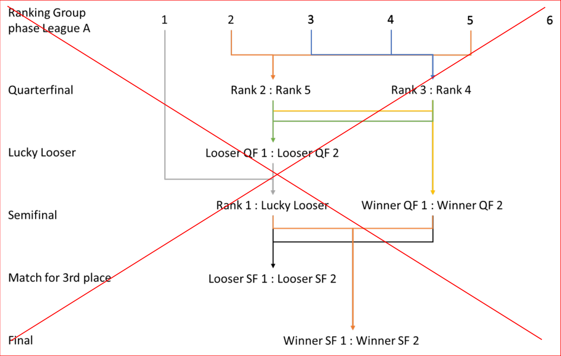
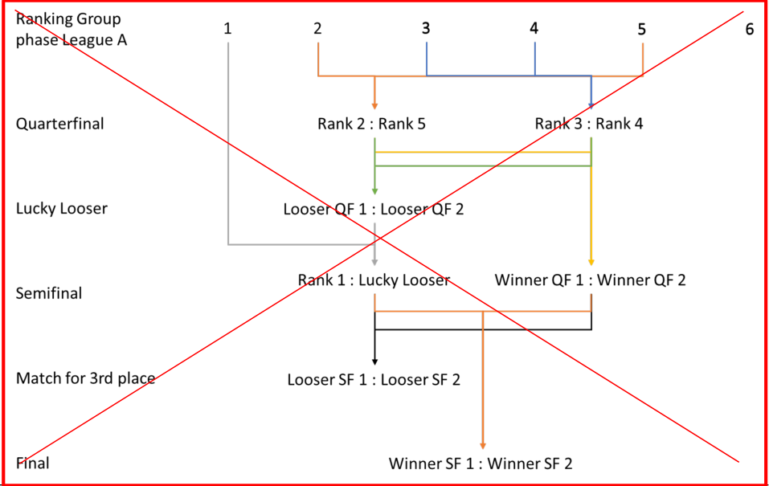

# MEMORANDUM

16 June 2025

## **Regulation amendments applying on 01.07.25** **PART 8 INDOOR CYCLING – CYCLE-BALL**

### **Chapter XI WORLD CHAMPIONSHIPS SET UP**

**8.11.001** Split up of leagues
The following split applies to both, Cycle-ball Women and Cycle-ball Men:

|Col1|N°Games Qualification|Second Round|Quarter-finals|Lucky Loser|Semi-finals|Match for 9th place|Match for 7th place|Match for 5th Place|Final 4|Match for 3rd place|Final|Relegation Game|Total|
|---|---|---|---|---|---|---|---|---|---|---|---|---|---|
|_Men_ _Elite_ _League_||||||||||||||
|_8 Teams_|_12_|_2 _|_0 _|_0 _|_0 _|_0 _|_1 _|_1 _|_6 _|_1 _|_1 _|_1 _|_25_|
|||||||||||||||
|_Challenger_ _League_||||||||||||||
|_3 Teams_|_6 _|_0 _|_0 _|_0 _|_0 _|_0 _|_0 _|_0 _||_0 _|_0 _|_0 _|_6 _|
|_4 Teams_|_6 _|_0 _|_0 _|_0 _|_2 _|_0 _|_0 _|_0 _||_1 _|_1 _|_0 _|_8 _|
|_5 Teams_|_10_|_0 _|_0 _|_0 _|_0 _|_0 _|_0 _|_0 _||_0 _|_0 _|_0 _|_10_|
|_6 Teams_|_6 _|_0 _|_2 _|_0 _|_2 _|_0 _|_0 _|_1 _||_1 _|_1 _|_0 _|_13_|
|_7 Teams_|_7 _|_1 _|_2 _|_0 _|_2 _|_0 _|_0 _|_1 _||_1 _|_1 _|_0 _|_15_|
|_8 Teams_|_12_|_0 _|_0 _|_0 _|_0 _|_0 _|_1 _|_1 _||_1 _|_1 _|_0 _|_16_|
|_9 Teams_|_16_|_0 _|_0 _|_0 _|_0 _|_0 _|_1 _|_1 _||_1 _|_1 _|_0 _|_20_|
|_10 Teams_|_20_|_0 _|_0 _|_0 _|_0 _|_1_|_1_|_1 _||_1 _|_1 _|_0 _|_24_|
|||||||||||||||
|_Women Elite_ _League_||||||||||||||
|_3 Teams_|_3 _|_0 _|_0 _|_0 _|_1 _|_0 _|_0 _|_0 _||_0 _|_1 _|_0 _|_5 _|
|_4 Teams_|_6 _|_0 _|_0 _|_0 _|_2 _|_0 _|_0 _|_0 _||_1 _|_1 _|_0 _|_10_|
|_5 Teams_|_10_|_0 _|_0 _|_0 _|_2 _|_0 _|_0 _|_0 _||_1 _|_1 _|_0 _|_14_|
|_6 Teams_|_6 _|_2 _|_0 _|_0 _|_0 _|_0 _|_0 _|_1 _|_6 _|_1 _|_1 _|_0 _|_17_|
|_7 Teams_|_9 _|_2 _|_0 _|_0 _|_0 _|_0 _|_0 _|_1 _|_6 _|_1 _|_1 _|_0 _|_20_|
|_8 Teams_|_12_|_2 _|_0 _|_0 _|_0 _|_0 _|_1 _|_1 _|_6 _|_1 _|_1 _|_1 _|_25_|

Allée Ferdi Kübler 12
1860 Aigle
Switzerland

T: +41 24 468 58 11
E: admin@uci.ch

Page **1** / **4**

_Format_
_Number is based on the result at the UCI Indoor Cycling World Championships the year_

|e|Col2|
|---|---|
|**Group I**|**Group II**|
|1|2|
|4|3|
|6|5|
|8|7|

_Schedule_

|1|6|:|8|Qualification|
|---|---|---|---|---|
|2|5|:|7|Qualification|
|3|1|:|4|Qualification|
|4|2|:|3|Qualification|
|5|4|:|6|Qualification|
|6|3|:|5|Qualification|
|7|1|:|8|Qualification|
|8|2|:|7|Qualification|
|9|4|:|8|Qualification|
|10|3|:|7|Qualification|
|11|1|:|6|Qualification|
|12|3|:|7|Qualification|
||||||
|13|2A|:|3B|2nd Round|
|14|2B|:|3A|2nd Round|
|||:|||
|15|4A|:|4B|Place 7/8|
|16|L13||L14|Place 5/6|
||||||
|17|L15|:|Winner Challenger League|Relegation|
||||||
|18|1A|:|1B|Final 4|
|19|W13|:|W14|Final 4|
||||||
|20|1A||W14|Final 4|
|21|1B|:|W13|Final 4|
|22|1A||W13|Final 4|
|23|1B||W14|Final 4|
||||||
|24|2nd place F4|:|3rd place F4|Bronze/Silver Game|
|25|1st place F4|:|W24|Gold Game|

Allée Ferdi Kübler 12
1860 Aigle
Switzerland

T: +41 24 468 58 11
E: admin@uci.ch

Page **2** / **4**

|N° teams TOTAL|4|5|10|10|11|12|13|14|15|16|17|18|19|20|21|
|---|---|---|---|---|---|---|---|---|---|---|---|---|---|---|---|
|~~**N° teams League**~~ ~~**A **~~|~~**4 **~~|~~**5**~~|~~**6 **~~|~~**6 **~~|~~**6 **~~|~~**6 **~~|~~**6 **~~|~~**6**~~|~~**6 **~~|~~**6**~~|~~**6 **~~|~~**6 **~~|~~**6**~~|~~**6 **~~|~~**6 **~~|
|~~N° games Group~~ ~~phase~~|~~6 ~~|~~10~~|~~15~~|~~15~~|~~15~~|~~15~~|~~15~~|~~15~~|~~15~~|~~15~~|~~15~~|~~15~~|~~15~~|~~15~~|~~15~~|
|~~Quarterfinal~~||~~2~~|~~2 ~~|~~2 ~~|~~2 ~~|~~2 ~~|~~2 ~~|~~2~~|~~2 ~~|~~2~~|~~2 ~~|~~2 ~~|~~2~~|~~2 ~~|~~2 ~~|
|~~Lucky Loser~~||~~1~~|~~1 ~~|~~1 ~~|~~1 ~~|~~1 ~~|~~1 ~~|~~1~~|~~1 ~~|~~1~~|~~1 ~~|~~1 ~~|~~1~~|~~1 ~~|~~1 ~~|
|~~Semifinal~~|~~2 ~~|~~2~~|~~2 ~~|~~2 ~~|~~2 ~~|~~2 ~~|~~2 ~~|~~2~~|~~2 ~~|~~2~~|~~2 ~~|~~2 ~~|~~2~~|~~2 ~~|~~2 ~~|
|~~Match for 3rd place~~|~~1 ~~|~~1~~|~~1 ~~|~~1 ~~|~~1 ~~|~~1 ~~|~~1 ~~|~~1~~|~~1 ~~|~~1~~|~~1 ~~|~~1 ~~|~~1~~|~~1 ~~|~~1 ~~|
|~~Final~~|~~1 ~~|~~1~~|~~1 ~~|~~1 ~~|~~1 ~~|~~1 ~~|~~1 ~~|~~1~~|~~1 ~~|~~1~~|~~1 ~~|~~1 ~~|~~1~~|~~1 ~~|~~1 ~~|
|~~**N° teams League**~~ ~~**B **~~||||~~**4 **~~|~~**5 **~~|~~**6 **~~|~~**7 **~~|~~**4**~~|~~**5 **~~|~~**5**~~|~~**6 **~~|~~**6 **~~|~~**5**~~|~~**6 **~~|~~**5 **~~|
|~~N° games Group~~ ~~phase~~||||~~6 ~~|~~10~~|~~15~~|~~21~~|~~6~~|~~10~~|~~10~~|~~15~~|~~15~~|~~10~~|~~15~~|~~10~~|
|~~Relegation~~||||~~1 ~~|~~1 ~~|~~1 ~~|~~1 ~~|~~1~~|~~1 ~~|~~1~~|~~1 ~~|~~1 ~~|~~1~~|~~1 ~~|~~1 ~~|
|~~**N° teams League**~~ ~~**C **~~||||||||~~**4**~~|~~**4 **~~|~~**5**~~|~~**5 **~~|~~**6 **~~|~~**4**~~|~~**4 **~~|~~**5 **~~|
|~~N° games Group~~ ~~phase~~||||||||~~6~~|~~6 ~~|~~10~~|~~10~~|~~15~~|~~6~~|~~6 ~~|~~10~~|
|~~Relegation~~||||||||~~1~~|~~1 ~~|~~1~~|~~1 ~~|~~1 ~~|~~1~~|~~1 ~~|~~1 ~~|
|~~**N° teams League**~~ ~~**D **~~|||||||||||||~~**4**~~|~~**4 **~~|~~**5 **~~|
|~~N° games Group~~ ~~phase~~|||||||||||||~~6~~|~~6 ~~|~~10~~|
|~~Relegation~~|||||||||||||~~1~~|~~1 ~~|~~1 ~~|
|~~**N° games TOTAL**~~|~~**10**~~|~~**17**~~|~~**22**~~|~~**29**~~|~~**33**~~|~~**38**~~|~~**44**~~|~~**36**~~|~~**40**~~|~~**44**~~|~~**49**~~|~~**54**~~|~~**47**~~|~~**52**~~|~~**55**~~|

_(article introduced on 01.01.13; text modified on 01.01.24; 01.07.25)_

Allée Ferdi Kübler 12
1860 Aigle
Switzerland

T: +41 24 468 58 11
E: admin@uci.ch

Page **3** / **4**

**8.11.002** _World Championships_ mode

If a match ends in a draw in the rounds from the quarterfinals to the semifinals, a
penalty shoot-out will decide the match.
If the match for 3rd place or the final ends in a draw, extra time will be played,
followed by a penalty shoot-out if the match is still tied after extra time.

_(text modified on 01.01.24; 01.07.25)_

Allée Ferdi Kübler 12
1860 Aigle
Switzerland

T: +41 24 468 58 11
E: admin@uci.ch

Page **4** / **4**

