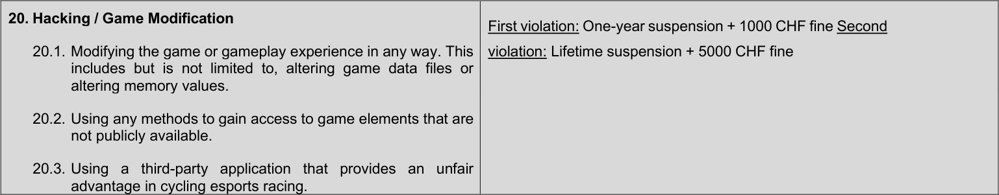

**UCI CYCLING REGULATIONS**

# **PART 17 CYCLING ESPORTS**

**Version on 01.01.2026**

### TABLE OF CONTENTS Page

**Chapter I GENERAL PROVISIONS .................................................................................................. 2**

§ 1 Cycling esports platform ...................................................................................................... 2
§ 2 Categories of riders ............................................................................................................. 3
§ 3 Race types........................................................................................................................... 3
§ 4 Eligibility of participants ........................................................................................................ 4
§ 5 Commissaires ...................................................................................................................... 4
§ 6 Calendar .............................................................................................................................. 4

**Chapter II EQUIPMENT .................................................................................................................... 4**

**Chapter III PERFORMANCE VERIFICATION .................................................................................. 5**

**Chapter IV SPECIFIC REGULATIONS FOR CYCLING ESPORTS EVENTS ................................... 5**

**Chapter V DATA .............................................................................................................................. 6**

**Chapter VI SPECIFIC INFRINGEMENTS FOR CYCLING ESPORTS .............................................. 6**

E0925 CYCLING ESPORTS 1

**UCI CYCLING REGULATIONS**

## **PART 17 CYCLING ESPORTS**
### **Chapter I GENERAL PROVISIONS**

**§ 1** **Cycling esports platform**

**17.1.001** A cycling esports event is held on a cycling esports platform. A cycling esports
platform is a software that, when coupled with certain hardware, allows individuals
to participate in cycling races in a virtual environment. The cycling esports platform
must at minimum provide a form of continuous feedback to the participants as to their
progress within the competition as related to other participants.

**17.1.002** _(abrogated on 01.01.2026)_

**17.1.003** Cycling esports platform providers are responsible for taking all reasonable steps to
ensure that the software used is free from any defects that may interrupt the running
of the event or otherwise produce an unfair result.

**17.1.004** Cycling esports platform shall agree with the UCI a period of no less than 2 weeks
before a sanctioned UCI Cycling Esports event during which no platform updates
shall be released, other than those explicitly agreed with the UCI to address issues
that would materially impact the fairness or outcome of the event.

_(article introduced on 01.01.2026)_

**17.1.005** Cycling esports platform providers shall ensure that their software generates and
retains sufficient data obtained from each cycling esports event to allow any
commissaire and/or official to proceed to performance verification and ensure that
any instances of alleged infringements can be investigated and acted upon. Such
data shall be available on demand after each race.

**17.1.006** Cycling esports platform providers must make reasonable endeavours to ensure
that their software is compatible with a wide range of equipment which may be used
by any riders. The platform shall not offer any advantage to one rider over another
based on the type of equipment used, and shall not offer an advantage to using
equipment that is not widely available for use on other platforms. It remains the
responsibility of the riders to ensure that any equipment they use is compatible with
the event platform they choose to race on.

_(text modified on 01.01.2026)_

**17.1.007** Cycling esports platform providers shall ensure that riders do not gain any
advantage from use of the platform in a manner that precludes other riders
accessing the same. For example:

a) All riders shall be treated equally in the data processing of their

performance to determine the result of an event.

b) No competitive advantage shall be gained from how or whether riders have

used the platform previously (other than knowledge, for example familiarity
with courses), nor from any enrolment fees or other payments or
arrangements with the platform or from the time spent by riders on the
platform and access to different tiers of competition.

c) Where the performance characteristics of any virtual equipment varies, all

E0925 CYCLING ESPORTS 2

**UCI CYCLING REGULATIONS**

riders shall have equal access to each variant.

_(article introduced on 01.01.2026)_

**17.1.008** Cycling esports platform providers shall ensure that the data displayed is both
accurate and precise. The timing of riders at finish / sprint lines shall be made to an
accuracy of 1/1000 [th] of a second or better, and throughout an event the positions of
the riders, whether displayed to all riders, the broadcasters or appearance in results,
shall agree with each other to the closest possible measurement, ensuring visible
and equal clarity on rider position.

_(article introduced on 01.01.2026)_

**17.1.009** Cycling esports platform providers shall ensure that UCI branding and associated
marks (including but not limited to logos and jerseys from the UCI and National
Federations) shall be displayed and entitled as required by the UCI.

_(article introduced on 01.01.2026)_

**17.1.010** Cycling esports platform providers shall provide open access to sufficient data to
enable the UCI and UCI appointed commissaires to oversee the event. This shall
include but is not limited to, the ability to review entries to an event, confirm the
eligibility of riders to participate in the event as determined by the UCI Regulations
and Code of Ethics, monitor the event in real-time for athlete compliance with the
regulations, apply performance verification methodology and/or software, take
actions during the event to relegate or disqualify riders as needed, and review the
results of the event.

_(article introduced on 01.01.2026)_

**§ 2** **Categories of riders**

**17.1.011** Participation in races is organised on the basis of the age and gender categories set
out in articles 1.1.034 to 1.1.037 of the UCI Regulations.

**§ 3** **Race types**

**17.1.012** Two types of cycling esports races may be held, either independently or as a
combination of:

a) In-venue races, in which all participants and the necessary equipment

may be verified by a commissaire at the race location in addition to
whatever verification is conducted by the UCI, the Cycling esports
platform, or the independent performance verification body, prior to,
during, or after the event.

b) Remote races, in which participants and the necessary equipment are not

necessarily present in the same location and verified by a commissaire at
the race location(s), but may be verified remotely by an official qualified
to do so (such as a Commissaire) in addition to whatever verification is
conducted by the UCI, the cycling esports platform, or the independent
performance verification body, prior to, during, or after the event.

c) To avoid doubt, a hybrid event including both in-venue and remote races,
either through any version of a qualification pathway or as a single race

E0925 CYCLING ESPORTS 3

**UCI CYCLING REGULATIONS**

that has riders competing from multiple locations, is available to event
organisers.

_(text modified on 01.01.2026)_

**§ 4** **Eligibility of participants**

**17.1.013** Each participating rider must have a valid license with UCI ID code from the national
federation of their country of residence, in accordance with the UCI Regulations.

**17.1.014** All other eligibility criteria for participating in a cycling esports event are defined by
the organiser of the said cycling esports event.
**§ 5** **Commissaires**

**17.1.015** The UCI may appoint commissaires to officiate each in-venue cycling esports event.
The minimum number of commissaires to be appointed shall be specified in
connection with the technical guide for the cycling esports event.

_(text modified on 01.01.2026)_

**17.1.016** Any commissaire appointed to officiate during an in-venue cycling esports race shall
have the same powers and responsibilities as described by Part 1 of the UCI
Regulations.

_(text modified on 01.01.2026)_

**§ 6** **Calendar**

**17.1.017** Cycling esports events sanctioned by the UCI are entered on the UCI cycling esports
calendar.

**17.1.018** Every entity organising a UCI-sanctioned cycling esports event shall conduct the
event in strict compliance with the UCI Constitution and UCI Regulations.

### **Chapter II EQUIPMENT**

**17.2.001** Subject to any applicable technical guide and applicable UCI Regulations, bicycles
used for cycling esports races shall be (i) bicycles as defined in part 1 of the UCI
Regulations in combination with a smart trainer compatible with the cycling esports
platform, or (ii) smart bicycles or other equipment compatible with the cycling esports
platform.

_(text modified on 01.01.2026)_

**17.2.002** Unless explicitly specified in the technical guide for a race, riders must compete
using a power meter and smart trainer, paired together with a cadence sensor and
heart rate monitor.

_(text modified on 01.01.2026)_

**17.2.003** Riders shall be responsible for following any manufacturer’s specifications on
maintaining the accuracy of their equipment including but not limited to using
approved firmware versions and conducting a spin-down, zeroing or other

E0925 CYCLING ESPORTS 4

**UCI CYCLING REGULATIONS**

calibration or offset procedure for power meters or smart trainers.

_(text modified on 01.01.2026)_

### **Chapter III PERFORMANCE VERIFICATION**

**17.3.001** The organiser of a cycling esports event is required to use an independent third party
performance verification system that is approved by the UCI.

_(text modified on 01.01.2026)_

**17.3.002** The Commissaire, if appointed, may request the verification of any performance.

The third party performance verification body may ask the platform provider and/or
~~a~~ riders for any reasonable data which will aid in verification including but not limited
to previous ride data, video of height/weight verification, live-streamed calibration
and performance tests. The third party performance verification body may also
require riders to perform additional indoor or outdoor tests after the completion of
the event to help verify a performance.

_(text modified on 01.01.2026)_

**17.3.003** Before the start, or after the conclusion of any race, any equipment used by a rider
may be subject to inspection by a commissaire in order to ascertain compliance with
these regulations.

### **Chapter IV SPECIFIC REGULATIONS FOR CYCLING ESPORTS EVENTS**

**17.4.001** The organiser of a cycling esports event shall draw up a set of regulations specific
to each race. The regulations shall inter alia cover sporting aspects particular to the
event. These specific regulations shall comply fully with these regulations.

_(text modified on 01.01.2026)_

**17.4.002** The specific regulations shall be published in connection with the technical guide for
the event.

_(text modified on 01.01.2026)_

**17.4.003** A technical guide shall be defined for each cycling esports event and made available
to all participants. At minimum, the following topics must be included in the
competition guide:

a) The date and time of the competition.

b) A statement of the classification level of the competition.

c) A list of the competition categories, including any specific participation
requirements, including equipment. This may also include a qualification
system, or some other limit on the maximum number of participants.

d) The specific rules for the type of competition. In case an overall result taken

from multiple competition types defines the overall winner such as, for
example a stage race or omnium, then the applicable procedures and rules
used to compile the overall results and break ties must also be defined.

E0925 CYCLING ESPORTS 5

**UCI CYCLING REGULATIONS**

e) Specific performance verification measures and requirements.

f) The prizes and/or titles to be awarded, if any.

_(text modified on 01.01.2026)_

**17.4.004** In the absence of any specific regulations concerning the format of a race, the
analogous UCI regulations will be used. For example, if a race is defined as being
an elimination race, in the absence of any specific regulations in the technical guide
for how the event shall be run, then the UCI track elimination regulations shall apply.
Where there is no analogous UCI event, the technical guide shall fully specify the
regulations for the event.

_(text modified on 01.01.2026)_

**17.4.005** _(abrogated on 01.01.2026)_

### **Chapter V DATA**

**17.5.001** The organiser of a cycling esports event shall be responsible to comply with all
relevant data protection laws.

### **Chapter VI SPECIFIC INFRINGEMENTS FOR CYCLING ESPORTS**

**17.6.001** Commissaires, when present, shall be responsible for determining any
infringements related to cycling esports, including infringements of any rulesets
specified in any applicable competition guide.

**17.6.002** All infringements related to cycling esports are sanctioned as set out in the table of
race incidents defined in article 6.2, in accordance with article 12.4.001.

**17.6.003** In the context of remote races, infringements may be applied ex officio, without the
involvement of commissaires.

_(article introduced on 01.01.2026)_

E0925 CYCLING ESPORTS 6

|17.6.004  Table of infringements for cycling esports:|Col2|
|---|---|
|**INFRINGEMENT**|**SANCTION**|
|**1. Ineligible Physical Equipment**|Refusal to start, elimination or disqualification|
|**2. Incorrect Virtual Equipment** Any in-game equipment on the cycling esports platform that is prohibited in connection with the competition guide.|**2. Incorrect Virtual Equipment** Any in-game equipment on the cycling esports platform that is prohibited in connection with the competition guide.|
|**3. Ineligible Rider**|**3. Ineligible Rider**|
|**4. Out-of-date Firmware**|**4. Out-of-date Firmware**|
|**5. Out-of-date Software**|**5. Out-of-date Software**|
|**6. Other Equipment Violation (No Intent to Gain Advantage)**|**6. Other Equipment Violation (No Intent to Gain Advantage)**|
|**7. Failed Performance Verification (No Intent to Gain Advantage)**|**7. Failed Performance Verification (No Intent to Gain Advantage)**|
|**8. Disconnection/Lag (Unintentional)** Involuntarily disconnecting from the cycling esports platform server for more than one consecutive minute.|**8. Disconnection/Lag (Unintentional)** Involuntarily disconnecting from the cycling esports platform server for more than one consecutive minute.|
|**9. Disconnection/Lag (Intentional)** Voluntarily disconnecting from the cycling esports platform server for any length of time for the purpose of altering the outcome of a race.|First violation:Refusal to start, elimination or disqualification + 200 CHF fine Second violation:One-year suspension + 1000 CHF fine Third violation:Lifetime suspension + 5000 CHF fine|

E0925 CYCLING ESPORTS 7

|10. Race Disruption 10.1. Disrupting or conspiring to disrupt the race or impede the performance of other riders. 10.2. Attempting to remove a rider from an event by disconnecting him/her from the cycling esports platform’s servers or by flagging the rider without cause. 10.3. Inappropriately distracting other riders. 10.4. Tampering with or interfering with the normal operation of another rider’s equipment. 10.5. Tampering with or interfering with the information sent between the platform server a rider’s client software, or between any rider’s equipment and the platform.|First violation: Refusal to start, elimination or disqualification + 200 CHF fine Second violation: One-year suspension + 1000 CHF fine Third violation: Lifetime suspension + 5000 CHF fine|
|---|---|
|**11. Incorrect Rider Height/Weight** Providing inaccurate information about height or weight,including but not limited to intentional or unintentional interference or non-compliance with weigh-in protocols, procedures, and policies and any associated qualifying protocols, procedures, and policies.|**11. Incorrect Rider Height/Weight** Providing inaccurate information about height or weight,including but not limited to intentional or unintentional interference or non-compliance with weigh-in protocols, procedures, and policies and any associated qualifying protocols, procedures, and policies.|
|**12. External Trainer Control** Using any software or hardware device to control trainer resistance besides that provided by the platform.|**12. External Trainer Control** Using any software or hardware device to control trainer resistance besides that provided by the platform.|
|**13. Use of Bots / Simulated Riders** Using bots or simulated riders out-of- competitionthat results in a benefit in-competition.This includes the use of simulAnt or any other ant+ or Bluetooth data simulation software or device as well as any other means of controlling a rider in-game in any way except the use of a human rider.|**13. Use of Bots / Simulated Riders** Using bots or simulated riders out-of- competitionthat results in a benefit in-competition.This includes the use of simulAnt or any other ant+ or Bluetooth data simulation software or device as well as any other means of controlling a rider in-game in any way except the use of a human rider.|

E0925 CYCLING ESPORTS 8

|14. Unfair Collusion Colluding or attempting to collude with another rider who is knowingly providing support to another rider and not solely considering their own sporting interests. Unfair advantage through collusion can also include instances of actively and knowingly cooperating with a rider who is using inaccurate weight or a miscalibrated power source, teams entering ineligible riders in races to aid eligible riders- for instance cooperating with non-resident teammates in a national championship race or applying team strategies related to slipstream (if feature of the platform).|First violation: Refusal to start, elimination or disqualification + 200 CHF fine Second violation: One-year suspension + 1000 CHF fine Third violation: Lifetime suspension + 5000 CHF fine|
|---|---|
|**15. Lying to or Misleading Race Officials**|**15. Lying to or Misleading Race Officials**|
|**16. Use of Another Rider’s Account for Racing**|**16. Use of Another Rider’s Account for Racing**|
|**17. Fabrication** **or** **Modification of** **Data** **Submitted** **to the Performance Verification Entity,or otherwise failing to** **provide accurate information that is reasonably requested. **|First violation:One-year suspension + 1000 CHF fine Second violation:Lifetime suspension + 5000 CHF fine                       |
|**18. Miscalibration / Data Modification / Tampering with Equipment** 18.1. Tampering with or attempting to tamper with any trainer, power meter, heart rate monitor or cadence sensor with intent to gain advantage 18.2. Altering or attempting to alter data transmissions involving equipment used in cycling esports racing or performance verification in any way.|**18. Miscalibration / Data Modification / Tampering with Equipment** 18.1. Tampering with or attempting to tamper with any trainer, power meter, heart rate monitor or cadence sensor with intent to gain advantage 18.2. Altering or attempting to alter data transmissions involving equipment used in cycling esports racing or performance verification in any way.|
|**19. Mechanical / Electronic Fraud** Using any mechanical or electronic device that provides an unfair advantage in-race. This includes but is not limited to, electronic motors, devices which alter equipment signals (power meter, cadence monitor, or heart-rate monitor), devices which broadcast simulated rider data, or devices that interfere with broadcast data**. **|**19. Mechanical / Electronic Fraud** Using any mechanical or electronic device that provides an unfair advantage in-race. This includes but is not limited to, electronic motors, devices which alter equipment signals (power meter, cadence monitor, or heart-rate monitor), devices which broadcast simulated rider data, or devices that interfere with broadcast data**. **|

E0925 CYCLING ESPORTS 9

_(text modified on 01.01.2026)_

E0925 CYCLING ESPORTS 10

