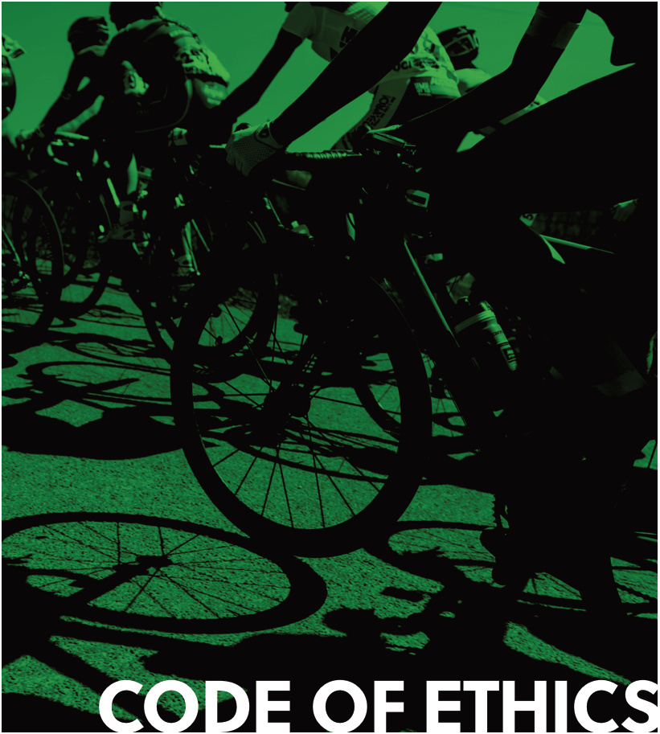
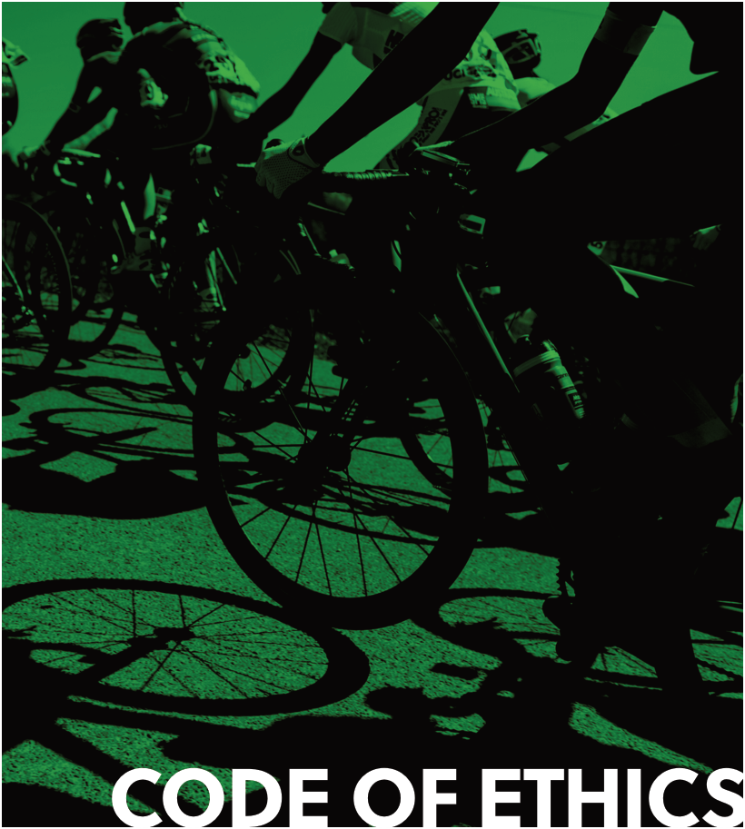

### TABLE OF CONTENTS

**PREAMBLE** **3**

CHAPTER I **SCOPE OF APPLICATION** **4**

CHAPTER II **RULES OF CONDUCT** **6**

CHAPTER III **THE ETHICS COMMISSION** **11**

CHAPTER IV **RULES OF PROCEDURE** **15**

CHAPTER V **FINAL PROVISIONS** **23**

APPENDIX 1 **PROTECTION OF PHYSICAL**

**AND MENTAL INTEGRITY –**

**SEXUAL HARASSMENT AND ABUSE** **24**

APPENDIX 2 **MANIPULATION OF CYCLING EVENTS** **27**

2 UCI CODE OF ETHICS | TABLE OF CONTENTS

### ~~PREAMBLE~~

The UCI acknowledges its responsibility to safeguard the integrity and reputation
of cycling throughout the world. The following Code reflects and defines the most
important core values for behaviour and conduct within UCI and its affiliates. The
conduct of persons bound by this Code shall reflect their support of the principles of
integrity and ethics and their efforts to refrain from anything that could be harmful to
these aims and objectives.

Furthermore, UCI and its continental confederations and national federations, as
well as their officials individually, all licence-holders in the world of cycling and all
organisers and applicants for the organisation of UCI competitions and events restate
their commitment to the UCI Cycling Regulations and undertake to respect and ensure
adherence to the below provisions which form an integral part of the UCI Cycling
Regulations.

_Note: terms referring to natural persons are applicable to both genders. Any term in the_
_singular applies to the plural and vice versa._

UCI CODE OF ETHICS | PREAMBLE

3

4

### ~~CHAPTER I SCOPE OF APPLICATION~~

_**Art. 1 Persons bound by the UCI Code of Ethics**_

The UCI Code of Ethics (hereinafter: the Code) shall apply to the persons
falling within the categories below. With respect to legal persons, the Code
shall apply to its members with authority to represent the entity or to the
entity itself, without prejudice to article 27.2.

_Officials_

All UCI Officials, meaning members of the UCI Management Committee,
honorary members, members of UCI Commissions (including the
Professional Cycling Council) and Judicial bodies, voting delegates at the
UCI Congress, national federation delegates at the UCI Congress, the
executive members of continental confederations and the candidates for
an executive position within the UCI and the continental confederations.

_Licence-holders_

All licence-holders as described in Article 1.1.010 of the UCI Cycling
Regulations.

_Entities subject to the UCI Regulations_

Entities subject to the UCI Cycling Regulations, such as teams registered
with the UCI, organisers of events registered on an international calendar,
national federations and continental confederations affiliated with the UCI,
are also subject to the Code.

_UCI and WCC staff and consultants_

UCI and UCI World Cycling Centre (hereinafter: UCI WCC) staff, consultants
and any person holding a role representing the UCI or UCI WCC or working
on behalf of the UCI or the UCI WCC in connection with the organisation
of cycling competitions, the governance of cycling or anti-doping within
cycling.

_Event organisers_

Organisers and applicants for the organisation of the UCI World
Championships, UCI World Cups and any other UCI competition or event,
regardless of their form or constitution.

National federations are requested to adopt a code of ethics based on the
present Code. National federations may decide to apply the present Code
for their own organisation, subject to the necessary drafting amendments.

UCI CODE OF ETHICS | SCOPE OF APPLICATION

_**Art. 2 Scope of applicability**_

The Code shall apply to conduct that damages the integrity and reputation
of cycling and in particular to illegal, immoral and unethical behaviour. The
Code focuses on general conduct within cycling.

For the avoidance of doubt, the application of the Code shall be subsidiary
to the UCI Cycling Regulations with regard to any behaviour which is
specifically governed therein, such as with respect to in-race actions. In this
regard, the Ethics Commission shall appreciate if a behaviour or action is
likely to constitute a violation to the Code or to the UCI Cycling Regulations.

The application of the Code is also subsidiary regarding any behaviour by a
member of UCI or UCI WCC staff which is governed by internal regulations
applicable pursuant to the relevant contract.

_**Art. 3 Breach of the Code**_

As a general rule, any breach of the Code may be established whether it
was committed deliberately or negligently, whether or not the breach
constitutes an act or an attempted act, and whether the parties acted as
participant, accomplice or instigator.

_**Art. 4 Statute of limitation**_

The investigation of breaches of the provisions of the Code may no longer
be initiated after a period of 10 years. Provided that the investigation is
initiated in a timely manner, the Ethics Commission shall be entitled to
complete pending cases and render decisions.

UCI CODE OF ETHICS | SCOPE OF APPLICATION

5

6

### ~~CHAPTER II RULES OF CONDUCT~~

_**Art. 5 General principles**_

Persons bound by the Code are expected to be aware of the importance of
their duties and concomitant obligations and responsibilities.

Persons bound by the Code shall show commitment to an ethical attitude.
When discharging their duties and responsibilities they shall behave in a
dignified manner and act with complete honesty, credibility, impartiality
and integrity. They shall fulfil their duties with due care and diligence.

Persons bound by the Code may not abuse their position in any way,
especially to take advantage of their position for private aims or gains.

All persons concerned shall at all times act in compliance with the principles
below in any activity related to cycling and shall immediately report any
potential breach of this Code to the Secretariat of the Ethics Commission
(cf. Article 13.1).

_**Art. 6 General rules of integrity**_

_**Art. 6.1. Non-discrimination**_

The persons bound by the Code shall not undertake any action, use any
denigratory words, or any other means, that offend the human dignity of
a person or group of persons, on any grounds including but not limited to
skin colour, race, religion, ethnic or social origin, political opinion, sexual
orientation, disability or any other reason contrary to human dignity.

_**Art. 6.2 Duty of neutrality**_

In dealings with government institutions, national and international
organisations, associations and groupings, persons bound by the Code
shall remain politically neutral, in accordance with the principles and
objectives of the UCI, whenever expressing themselves on behalf of the
organisation they represent.

_**Art. 6.3 Confdentiality**_

Persons bound by the Code shall not disclose information entrusted to them
in confidence and which has not been made public. Disclosure of other
information shall not be for personal gain or benefit, nor be undertaken
maliciously to damage the reputation of any person or organisation.

The obligation to respect confidentiality survives the termination of any
relationship which makes a person subject to the Code.

UCI CODE OF ETHICS | RULES OF CONDUCT

_**Art. 6.4 Protection of physical and mental integrity**_

The persons bound by the Code shall respect the integrity of all persons
with whom they interact in the context of their cycling-related activity. The
personal rights of every individual whom they contact and who are affected
by their actions shall be protected and respected. In particular, sexual
harassment in any form is forbidden and the welfare of young people under
the age of 18 is paramount so as to give them protection from poor practice,
abuse and bullying.

The above shall be considered as the general rule and is supplemented by
Appendix 1.

_**Art. 7 Integrity rules pertaining to conduct of ofce**_

_**Art. 7.1 Ofering and accepting gifs**_

Persons bound by the Code may only offer or accept a gift or other benefits
in the context of their tasks and duties, provided such gift or benefit meets
all the requirements below:

a) It has a symbolic or trivial value, or is exclusively aimed at sharing local

customs;

b) It does not influence any actions undertaken within the roles of either of

the persons or entities concerned;

c) It is not offered or accepted in contravention of the duties of the persons

bound by the Code;

d) It does not create any undue pecuniary or other advantage; and

e) It does not create a conflict of interest.

Gifts or other benefits must not be offered or accepted if it can reasonably
be considered that, at the time of handing over, the gift or other benefit
is likely not to meet the requirements above. Any person bound by the
Code may also ask for the Ethics Commission’s opinion before definitively
accepting a gift or other benefit.

Gifts in the form of money are forbidden in any case.

_**Art. 7.2 Bribery and corruption**_

Persons bound by the Code, shall not, directly or indirectly, offer, promise,
solicit, give or accept any form of undue remuneration or commission, nor
any concealed benefit or service of any nature. The aforementioned rule
shall apply to activities related to the organisation of cycling competitions or
the governance of the sport, whether within or outside the UCI, continental
confederations or national federations and whether in connection with the
person’s official activities or not.

UCI CODE OF ETHICS | RULES OF CONDUCT

7

8

_**Art. 7.3 Votes**_

All persons bound by the Code shall neither give nor accept instructions,
inconsistent with their respective roles and responsibilities, to vote or
intervene in a given manner within the organs of the UCI, continental
confederations or national federations and their affiliates, or any organisation
to which the UCI is affiliated.

_**Art. 7.4 Conficts of interest**_

Persons bound by the Code shall avoid any situation that could lead to a conflict
of interest by taking appropriate measures such as abstaining from taking
part, directly or indirectly, in a decision or an agreement and/or disclosing
potential interests that are susceptible of influencing the decision-making of
the person concerned. A conflict of interest shall arise when the objectivity
of a person bound by the Code, in expressing an opinion, undertaking any
action or taking part in a decision, may be influenced or be perceived as being
influenced due to private or personal interests. Private or personal interests
include gaining any possible advantage for the persons bound by the Code,
their family, relatives, friends and acquaintances. Specific provisions for the
members of the Management Committee are contained in article 56 par. 3
and 4 of the UCI Constitution.

_**Art. 8 Integrity of competitions**_

_**Art. 8.1 Manipulation of cycling events**_

Any undertakings that are aimed at or may potentially modify or influence
the course or result of a competition, or any part thereof, in any manner
contrary to sporting ethics, such as manipulation or corruption, is forbidden.
For the avoidance of doubt, the provisions of the Code and its Appendix 2
shall be subsidiary to article 1.1.088 of the UCI Regulations with respect to
matters governed by said provision.

_The above shall be considered as the general rule and is supplemented by_
_Appendix 2._

_**Art. 8.2 Anti-Doping**_

Persons bound by the Code shall refrain from any action promoting,
facilitating, associating with, or otherwise supporting behaviour or actions
that contravene the provisions and the spirit of the UCI Anti-Doping Rules.
For the avoidance of doubt, the application of the Code shall be subsidiary
to that of the UCI Anti-Doping Rules in respect of any person bound thereto.

UCI CODE OF ETHICS | RULES OF CONDUCT

_**Art. 9 Good governance pertaining to resources**_

_**Art. 9.1 UCI and continental confederation resources**_

The resources of the UCI and continental confederations may only be used
for the benefit of cycling in accordance with their respective statutes. In
particular, persons bound by the Code are prohibited from misappropriating
the UCI and/or continental confederations’ assets, regardless of whether
actions are carried out directly or indirectly through third persons.

_**Art. 9.2 Support from UCI or continental confederations**_

Any support from the UCI or continental confederations to any person
or entity bound by the Code, whether financial, material, or of any other
nature, shall be utilised in strict compliance with the purpose for which it
was granted.

The UCI or the continental confederation shall be entitled to request from
the recipient the production of any appropriate evidence regarding the use
of the resources. Moreover, the recipient shall clearly demonstrate the use
and purpose of the resources if requested.

_**Art. 9.3 Support from UCI or continental confederations**_

Any financial support from an executive member of the UCI or a continental
confederation may only be offered or accepted if the following cumulative
conditions are met :

a) The contribution was not in any way announced prior to the relevant

person taking up his/her role;

b) The contribution is granted to and managed by the Centre Mondial

du Cyclisme foundation or any other entity that is independent from
the UCI and the continental confederations, of which the missions are
exclusively related to the development of the sport of cycling, and
which is authorised by the Ethics Commission;

c) The person concerned is not a member of any body of the organisation

to which the management of the funds is entrusted;

d) The contribution is used in accordance with the objective criteria laid

down by the aforementioned body.

UCI CODE OF ETHICS | RULES OF CONDUCT

9

10

_**Art. 10 Rules pertaining to relations with third parties**_

_**Art. 10.1 Partners**_

The persons bound by the Code shall undertake dealings, negotiations
and decisions regarding relationships with partners, such as broadcasters,
sponsors, suppliers and other supporters of cycling in compliance with the
rules laid down in the present Code and without being influenced in any
manner or accepting any kind of interference.

_**Art. 10.2 Candidatures for UCI events**_

All persons bound by the Code shall in all dealings respect the rules
applicable to the bidding and selection processes for organisers of UCI
competitions and events.

The applicants wishing to organise UCI events shall respect the provisions of
the Code in their entirety as well as all other applicable rules.

_**Art. 10.2.1 Bidding information**_

The applicant’s bidding material shall be complete and absolutely truthful.
Moreover, the information shall not include comparisons of other bids and shall
not insult, denigrate or demean other applicants or organisers of UCI events.

_**10.2.2 Lobbying**_

Applicants shall refrain from approaching any person, party, or third
authority, with a view to obtaining any financial, political or de facto support
inconsistent with the provisions of the Code and regulations relating to the
relevant bidding process.

_**Art. 11 Rules pertaining to elections and candidatures for executive positions**_

In the context of election processes, the persons bound by the Code shall
act with integrity and not make use of any illegitimate means that could
potentially influence the outcome of the election. In this regard, any
promise of a direct or indirect, pecuniary, material, in-kind or other benefit
or assistance, made by a candidate in an election to any person involved in
the election process or in favour of the entity for which the election is being
held, is considered as illegitimate and contrary to the present article.

Persons bound by the Code shall not provide any financial, material, in kind
or other, direct or indirect, assistance to a candidate outside of the scope of
the tasks usually exerted outside of the context of the election. Candidates
shall not accept any such assistance from persons bound by the Code or
from a UCI partner, sponsor, organisers of cycling competitions or any other
third party with a direct interest in cycling.

Candidates in an election shall conduct themselves in a manner consistent
with universal principles of fairness and good faith. They shall not insult,
denigrate or demean any other candidate.

UCI CODE OF ETHICS | RULES OF CONDUCT

### ~~CHAPTER III THE ETHICS COMMISSION~~

**SECTION 1** **FUNCTIONING**

_**Art. 12 Composition**_

The Ethics Commission shall ensure that it functions in an independent
manner.

The Ethics Commission shall be made up of at least five members bearing
recognised competence in the domain of sports and/or law and ethics. All
members of the Ethics Commission shall be fully independent from the
UCI, continental confederations, national federations and any other cycling
stakeholders. In addition, the composition of the Ethics Commission shall
ensure a minimum representation of 25% of each gender.

The members of the Ethics Commission, including the President, shall
be appointed by the UCI Congress, on the proposal of the Management
Committee, two years after the election of the UCI President and UCI
Management Committee and for a four-year term. In case of vacancy of
a member due to resignation, removal or death, the UCI Management
Committee may make a provisional appointment to be approved at the
following UCI Congress. In case the President of the Ethics Commission
may not fulfil his role for any reason whatsoever, the members of the Ethics
Commission shall designate the member who shall act as his deputy.

The President of the Ethics Commission shall be limited to serving a
maximum of two terms of four years, whether continuously or interruptedly.

_**Art. 13 Principles of functioning**_

The Ethics Commission shall ensure that it executes its tasks in an
independent manner.

_**Art. 13.1 Secretariat**_

The Secretariat of the Ethics Commission (hereinafter: the Secretariat) shall
be dealt with by a secretary appointed by the UCI Management Committee
after consultation with the Ethics Commission. The secretary shall be
independent from the UCI and possess adequate legal qualification.

The contact details of the Secretariat shall be published on the UCI website.

UCI CODE OF ETHICS | THE ETHICS COMMISSION

11

12

_**Art. 13.2 Confdentiality**_

The members of the Ethics Commission and the Secretariat shall ensure that
all information disclosed to them during the course of their duty remains
confidential, in particular, facts of a case, contents of investigations and
deliberations and decisions taken as well as private personal data. The Ethics
Commission may nevertheless inform third parties or publish information
pertaining to the initiation of proceeding as well as their status if justified
by a legitimate interest, without prejudice to the rights of the persons
concerned by the proceedings.

_**Art. 13.3 Liability**_

Within the scope of its mission, neither the members of the Ethics
Commission, the Secretariat nor the UCI shall be liable for any action or
omission in connection with proceedings conducted under the Code, unless
the actions or omissions are proven to constitute intentional wrongdoings,
gross negligence or any liability which cannot be excluded by Swiss law.

**SECTION 2** **DUTIES AND TASKS**

_1. General_

The Ethics Commission is vested with the following duties and tasks:

_**Art. 14 Surveillance and investigation**_

1 ) to ensure that the present Code is respected;

2 ) to investigate complaints and denunciations regarding violations of the
rules of the Code;

3 ) to investigate potential breaches of the Code on its own initiative and
ex officio;

_**Art. 15 Assistance, education and counselling**_

1 ) to give advice and assistance on ethical matters, particularly as regards
the application of the Code;

2 ) to set out measures for the application of the Code and the general
principles of ethics and governance;

3 ) to put forward proposals aimed at raising knowledge and awareness in
respect of ethical matters.

UCI CODE OF ETHICS | THE ETHICS COMMISSION

_**Art. 16 Recommendations and reporting**_

1 ) to recommend measures to be taken by the UCI and any of its bodies,

upon request or at its own initiative, on any ethics-related matter;

2 ) to deliver opinions regarding any request from persons bound by the

Code relating to the application of the Code;

3 ) to recommend the transmission of information and/or documentation

in the UCI’s possession to external governing bodies or state
authorities;

4 ) to report to the UCI Congress on its activity (cf. Article 20).

_**Art. 17 Adjudication**_

1 ) to render decisions in relation to disputes regarding potential conflicts

of interests (cf. Article 18);

2 ) to render decisions regarding applications for the elections of the UCI

President and the UCI Management Committee (cf. Article 19.1);

3 ) to render decisions regarding flaws in relation to the conduct of votes

(cf. Article 19.2);

4 ) to render decisions in relation to breaches of the Code (cf. Article 34).

_2. Specific powers_

_**Art. 18 Conficts of interest**_

The Ethics Commission shall address any question submitted to it relating to
potential conflicts of interests regarding members of the UCI Management
Committee, any other UCI Commission or judicial body and any executive
member of continental confederations and national federations. In this
respect, besides the power to open proceedings against a person having
committed an alleged breach of article 7.4, the Ethics Committee may issue
orders imposing specific measures or recommending preventive measures.

_**Art. 19 Elections and votes**_

_**Art. 19.1 Candidatures**_

Prior to the election of the UCI President and the UCI Management
Committee, the Ethics Commission shall be provided with the applicants’
files in order to verify their compliance with the applicable requirements.
Any decision of the Ethics Commission rejecting an application may be
appealed before the Court of Arbitration for Sport.

UCI CODE OF ETHICS | THE ETHICS COMMISSION

13

14

_**Art. 19.2 Vote scrutiny**_

Whenever the external notary/lawyer responsible for the scrutiny of
the votes at elective Congresses of the UCI observes the existence of an
irregularity regarding the vote, it shall report to the three-member panel
of the Ethics Commission present at the UCI Congress. In case a procedural
flaw potentially affecting the regularity of the vote is ascertained, the
panel of the Ethics Commission shall determine whether the vote shall be
cancelled and re-held.

Any decision rendered by the panel of the Ethics Commission cancelling a
vote may be appealed before the Court of Arbitration for Sport.

_**Art. 20 Report to the UCI Congress**_

The Ethics Commission shall submit a yearly report on its activities to the
UCI Congress. The Ethics Commission shall report all asserted violations
of the present Code. The reporting may be adapted in consideration of
personal rights of persons involved and/or to preserve confidentiality of
the information.

UCI CODE OF ETHICS | THE ETHICS COMMISSION

### ~~CHAPTER IV RULES OF PROCEDURE~~

_**Art. 21 Right to complain and procedural rights**_

Any person may address a complaint or report an alleged breach of the
Code to the Ethics Commission. The Secretariat shall acknowledge receipt
of the complaint or denunciation, although the person submitting the file
shall have no entitlement for proceedings to be opened or to be a party to
proceedings.

The Ethics Commission will ensure that any person who is directly concerned
is duly consulted, in particular, as regards establishing facts. The Ethics
Commission shall also inform complainants, provided they are directly
concerned by the facts of the case, of:

1 ) the opening of proceedings in accordance with article 27.2;

2 ) the closing of the investigation phase;

3 ) the findings of the decision as well as any considerations related to the

facts which concern such person directly.

Upon request, such information may also be provided to any other person
who is directly concerned and has a legitimate interest. The information
shall be provided at the same time as notification to the parties to the
proceedings.

Only the persons who are alleged to have committed a violation of the
provisions of the Code and against whom proceedings have been initiated
shall be considered as parties before the Ethics Commission.

_**Art. 22 Obligation to collaborate**_

_**Art. 22.1 General obligation**_

The Ethics Commission is free to consult any person in the context of its
investigation.

At the request of the Ethics Commission, the persons bound by the Code are
obliged to contribute to establishing the facts of the case and, especially,
to provide written or oral information as witnesses as well as evidence at
their disposal or which can reasonably be obtained. Witnesses are obliged
to tell the truth and to answer the questions put to them to the best of their
knowledge and judgement.

_**Art. 22.2 Parties**_

Parties to proceedings before the Ethics Commission are obliged to
collaborate in establishing facts and shall, in particular, comply with the
Ethics Commission’s requests for information and production of evidence.

UCI CODE OF ETHICS | RULES OF PROCEDURE

15

16

_**Art. 22.3 Non-compliance and/or obstruction**_

Any non-compliance with art. 22 or any obstruction to an investigation
carried out by the Ethics Commission, including concealing, tampering
with, destroying any documentation or unduly delaying the production of
information and/or documentation that may be relevant to the investigation
shall be considered a violation of the present Code.

_**Art. 23 Right to be heard**_

The parties shall be granted the right to be heard, the right to present
evidence, the right for evidence leading to a decision to be inspected, the
right to access files and the right to a reasoned decision in case a sanction
should be imposed.

_**Art. 24 Representation**_

Any party may be represented by a counsel of his choice. Any cost related
to his representation before the Ethics Commission shall be borne by the
party concerned.

_**Art. 25 Languages**_

The working languages of the Ethics Commission are English and French.
Only complaints or denunciations remitted in either of the two working
languages shall be taken into consideration. All proceedings before
the Ethics Commission shall be conducted in French or English. Parties
introducing documents in other languages shall bear all costs related to
the translation of such documents as well as oral statements.

_**Art. 26 Requisites for a complaint or denunciation**_

_**Art. 26.1 Form and address**_

Matters shall be brought before the Ethics Commission in writing and
addressed to the Secretariat. Notifications shall only be considered if sent to
the email address of the Secretariat published on the UCI website.

UCI CODE OF ETHICS | RULES OF PROCEDURE

_**Art. 26.2 Content and information**_

The complaint or denunciation regarding a potential breach of the Code
shall include the following information:

       - Name and surname of the sender*;

        - Full contact details of the sender*;

       - Name (and surname) of the person(s) or entity concerned by the

alleged violation*;

        - A full account of the facts of the matter referred;

        - Any and all evidence in the sender’s possession;

        - Provision(s) of the Code potentially breached;

       - Signature of the sender.

Upon request and/or if the circumstances so require, the sender of the
complaint or denunciation shall have a right for his/her personal information
as well as the personal information of the victim of the alleged violation of
the Code, if any, not to be disclosed to the parties. In particular pertaining to
allegations of breaches of the rules of conduct laid down in Appendices 1 and
2 of the Code, the Ethics Commission shall consider the particularly sensitive
nature of such cases when deciding appropriateness of not disclosing the
personal information of the persons concerned.

_**Art. 27 Preliminary proceedings**_

_**Art. 27.1 Registration**_

Upon receipt of a complaint or denunciation, or upon request from the Ethics
Commission, the Secretariat will register a file and send it to the President of
the Ethics Commission.

_**Art. 27.2 Prima facie assessment and initiation of proceedings**_

Upon receipt of the file, the President of the Ethics Commission, or the member
appointed by the President, shall proceed to a prima facie examination of
the case and determine whether there is any indication that a breach of the
Code may have been committed. The President of the Ethics Commission may
request additional information and documentation from the sender of the
complaint or denunciation or any person bound by the Code. If the complaint
or denunciation is deemed to be manifestly groundless, the President of the
Ethics Commission shall decide not to initiate proceedings. In any other case,
proceedings shall be initiated.

When initiating proceedings, the Ethics Commission shall determine which
person(s) and/or entity(ies) are qualified as party. In case the alleged breach
of the Code is committed by or on behalf of a legal entity, the parties shall be
the members with authority to represent the entity concerned. If, however,
none of the representatives may be identified as being responsible for the
alleged breach of the Code and the relevant provision of the Code does not
exclusively relate to individual behaviour, the entity itself shall be considered
as party.

UCI CODE OF ETHICS | RULES OF PROCEDURE

17

18

In accordance with Article 2 above, the Ethics Commission shall determine
the facts that are taken into consideration for the proceedings. The Ethics
Commission shall inform the UCI, a UCI body and the person who submitted
the complaint or denunciation if facts are not considered as falling under
the Ethics Commission’s scope of competence but are likely to constitute a
violation of the UCI Cycling Regulations.

Any decision to initiate proceedings or not shall be made by the Ethics
Commission, at its full and independent discretion and shall not be subject
to appeal.

_**Art. 27.3 Provisional measures**_

Upon initiation of proceedings, the Ethics Commission may impose provisional
measures in accordance with Article 34.2.2.

_**Art. 28 Panel**_

_**Art. 28.1 Constitution**_

After the initiation of proceedings, the President of the Ethics Commission
shall proceed to the constitution of the panel that shall deal with the case. The
panel shall in principle be chaired by the President of the Ethics Commission,
who may also decide to name any other member to act as Chairman of
the panel. The panel shall be composed of three members. In exceptional
cases, upon such request of the President of the Ethics Commission and
agreement of a majority of its members, the Ethics Commission shall sit in
a plenary formation.

_**Art. 28.2 Independence, impartiality and challenge**_

The members of the panel shall be fully impartial and independent from
any of the persons concerned. A member of the panel shall immediately
disclose any circumstance which may affect his independence and
impartiality with respect to any of the persons concerned.

Any challenge of a member of the panel shall be sent to the Secretariat
within 7 days after the grounds for challenge become known or should
reasonably have become known to the challenging person. Any such
challenge shall indicate the grounds of the challenge and include all
relevant facts and supporting documents. Any application to challenge a
member of the panel shall be decided by the other members of the Ethics
Commission, after the challenged member has been invited to submit
written comments. A majority of the members of the Ethics Commission is
required to reject a challenge. The decision on the challenge is final and is
not subject to appeal.

UCI CODE OF ETHICS | RULES OF PROCEDURE

_**Art. 29 Notifcation to parties and to UCI**_

After initiation of proceedings and constitution of the panel, the Secretariat
shall inform the parties of the case as well any other person according to
article 21.

At the same time, the Secretariat shall inform the UCI Legal Department of
the registration of a file.

_**Art. 30 Conduct of proceedings**_

_**Art. 30.1 Investigation**_

The Chairman of the panel shall lead the procedure and manage the
investigation of the case. He shall give appropriate instructions to the
secretary with a view to constituting a full and comprehensive file. The
Chairman of the panel may require the support from an independent third
party to assist the panel with the investigation and make an appointment
for such purpose.

The investigation shall be conducted by means of written inquiries and
written or oral questioning of the parties, witnesses and any other person.
Any further investigative measures relevant to the case may also be taken,
as deemed appropriate.

The panel may, on its own initiative or at the request of a party, summon all
persons and parties concerned to attend a hearing. Unless otherwise decided
by the panel, hearings shall take place by video-conference. The parties shall
be responsible for the appearance at the hearing of any witness or expert they
request to be heard and shall cover all costs and expenses associated with
their appearance. In case of absence of any person summoned to appear, the
panel may proceed and close the investigation phase.

_**Art. 30.2 Evidence**_

As a general rule, the panel may take into consideration any kind of
evidence deemed appropriate. The panel shall determine the admissibility,
relevance, materiality and weight of evidence at its discretion. Any evidence
which is obtained by means of actions which are contrary to human dignity
or which manifestly do not enable to establish relevant facts shall be
considered inadmissible.

Regarding standard of proof, the Ethics Commission shall decide based on
its comfortable satisfaction.

_**Art. 30.3 Witnesses**_

The panel shall take all required measures in order to safeguard the
interests and personal rights of witnesses and, if necessary, ensure they
remain unidentified.

UCI CODE OF ETHICS | RULES OF PROCEDURE

19

20

_**Art. 31 Conclusion of proceedings**_

Once the panel considers the file to be complete or that all available
investigation measures have been taken, the panel shall close the
investigation phase and the secretary shall inform the parties accordingly.

_**Art. 32 Reopening of a case**_

The Ethics Commission may reopen a case at its own discretion.

_**Art. 33 Deliberations**_

Upon conclusion of the investigation, the panel shall deliberate and
determine, if any, which of the sanctions listed in Article 34.2 below should
be imposed.

_**Art. 34 Decisions**_

_**Art. 34.1 Content**_

Any decision rendered by the Ethics Commission shall contain:

a ) the names of the members of the panel;

b ) the names of the parties;

c ) a summary of the relevant facts;

d ) an account of the procedure followed;

e ) the decision on jurisdiction;

f ) the provisions or a reference to the provisions on which the
decision is based;

g ) the reasons of the decision;

h ) a notice indicating the possibility to file an appeal before the

Court of Arbitration for Sport and the relevant time limit.

The Ethics Commission shall determine at its own discretion if the operative
part of the decision shall be communicated in a first instances and followed
by the grounds of the decision.

UCI CODE OF ETHICS | RULES OF PROCEDURE

_**Art. 34.2 Sanctions**_

In relation to breaches of the Code, the Ethics Commission may impose the
following sanctions:

   - reprimand;

   - fine up to a maximum of CHF 1’000’000;

   - return of awards;

   - withdrawal of honorary titles or other distinctions awarded according
to articles 81 and 81 of the UCI Constitution;

   - suspension;

   - disqualification;

   - educational measures;

   - ban from taking part in a specific cycling-related activity, event or
meeting organised by the UCI or any of its affiliates;

   - ban from taking part in any cycling-related activity organised by the
UCI and its affiliates.

_**Art. 34.2.1 Suspended sentence**_

The Ethics Commission may decide, upon request or at its
initiative, to suspend the execution of all or part of the abovementioned sanctions and set out, at its discretion, the conditions
for such suspended sentence, which may include;

        - An absence of violations of the UCI Cycling Regulations

or the Code for a certain period of time;

       - Taking part in training programmes or other courses;

        - Taking part in awareness raising or educational

programmes;

       - Making commitments or undertaking specific actions:

The duration of a probationary period shall be between one and
four years.

If during a probationary period, the person benefiting from a
suspended sentence commits another breach to the Code, such
suspended sentence shall be automatically cancelled and the
initial sanction applied. Such sanction shall be added to the
sanction imposed for the most recent breach.

UCI CODE OF ETHICS | RULES OF PROCEDURE

21

22

_**Art. 34.2.2 Provisional measures**_

The President of the Ethics Commission or the Chairman of the
panel dealing with a case may impose provisional measures,
including provisional suspensions or bans from taking part in
cycling related activities, upon the initiation of proceedings, in
case it is likely that an infringement has been committed but
a decision on the merits cannot be taken sufficiently quickly
and such measure is considered necessary. In such a case, the
President of the Ethics Commission or the Chairman of the
panel dealing with a case shall issue a decision on the basis
of the evidence available at the time of the decision, without
any obligation to hear the parties. The decision shall be taken
as soon as possible, shall be immediately enforceable and
limited to a defined period of time. Provisional measures may
be imposed for a period which shall not exceed 6 months. The
effective duration of the provisional measures shall be deducted
from any definitive suspension.

_**Art. 35 Appeal**_

Any decision of the Ethics Commission imposing a sanction, including
provisional measures, or ordering compulsory measures in accordance with
article 18, may be appealed before the Court of Arbitration for Sport (CAS)
by the parties to the proceedings. A right of appeal is also granted to any
person who is not a party to the proceedings but is directly affected by the
decision and has a legitimate interest in being entitled to appeal.

The deadline to appeal, according the CAS Code of Sports-related
Arbitration, starts to run upon notification of the decision with grounds or,
if applicable, upon receipt of the information related to the decision for any
person who is not a party to the proceedings according to article 21.

_**Art. 36 Procedural costs**_

The procedural costs are made up of the costs and expenses over the
course of the proceedings.

Procedural costs shall be borne by the party that has been sanctioned. If
more than one party is sanctioned, the procedural costs shall be assessed
proportionally in accordance with the degree of guilt of the parties. Part of the
procedural costs, in particular the costs of the preliminary proceedings, may
be borne by the UCI, as appropriate in respect of the imposition of sanctions.
The procedural costs may be reduced or waived in exceptional circumstances,
in particular taking into account the party’s financial circumstances.

_**Art. 37 Publications**_

The UCI may publish decisions, reports and advice rendered by the Ethics
Commission in accordance with Articles 14 to 20, in full or summarised form,
on the UCI website.

UCI CODE OF ETHICS | RULES OF PROCEDURE

### ~~CHAPTER V FINAL PROVISIONS~~

_**Art. 38 Transitional measures**_

The Code applies to infractions committed by a person falling in the
categories of Article 1 at the moment the infraction is committed.

Any affair relating to infraction committed before the entry into force of the
present edition of the Code shall be assessed according to the edition of
the Code of Ethics in force at the time of the violation, unless the present
edition of the Code is more favourable to the party to the proceedings.

The procedural rules enacted in this Code shall come into force immediately,
except in cases where a file has been registered (Art. 27.2) prior to 3 June
2021.

_**Art. 39 Enforcement**_

The present Code was adopted by the UCI Management Committee in
Glasgow on 2 August 2023 and came into force on 4 August 2023.

UCI CODE OF ETHICS | FINAL PROVISIONS 23

### ~~CHAPTER 1 INTRODUCTORY PROVISION~~

_**Art. 1 Purpose of the present Appendix**_

The present Appendix aims at providing specific rules relating to the
protection of physical and mental integrity in the world of cycling and
implementing the International Olympic Committee’s consensus statement
on ‘’Sexual harassment & Abuse in Sport’’.

The present Appendix aims at providing support to licence-holders and
their well-being in relation to their practice of cycling and also serve for the
prevention of harassment and abuse.

The present Appendix supplements art. 6.4 of the Code and provides clear
guidance regarding acts and omissions which are not permitted in relation
to harassment and abuse as well as obligations related thereto, whether in
the context of a person’s cycling-related activities or not.

### ~~CHAPTER 2 RULES OF CONDUCT~~

_**Art. 2 Forbidden Conduct**_

_**Art. 2.1 Psychological abuse**_

Any unwelcome act including confinement, isolation, verbal assault,
humiliation, intimidation, infantilisation, or any other treatment which has
the effect of diminishing the sense of identity, dignity, and self-worth.

_**Art. 2.2 Physical abuse**_

Any deliberate and unwelcome act – such as for example punching,
beating, kicking, biting and burning – that causes physical trauma or injury.
Such act can also consist of forced or inappropriate physical activity (e.g.
age-, or physique- inappropriate training loads; when injured or in pain),
forced alcohol consumption, or forced doping practices.

24 UCI CODE OF ETHICS | APPENDIX 1

_**Art. 2.3 Sexual harassment**_

Any unwanted and unwelcome behaviour of a sexual nature, whether verbal,
non-verbal or physical, with the purpose or effect of violating the dignity of
a person, in particular, when creating an intimidating, hostile, degrading,
humiliating or offensive environment.

_**Art. 2.4 Sexual abuse**_

Any conduct of sexual nature, whether non-contact, contact or penetrative,
where consent is coerced/manipulated or is not or cannot be given.

_**Art. 2.5 Neglect**_

Failure of a coach or another person with a duty of care towards the athlete
to provide a minimum level of care to the athlete, which is causing harm,
allowing harm to be caused, or creating an imminent danger of harm.

_**Art. 2.6 Minors and other dependant persons**_

Any behaviour falling under the definitions of art. 2.1 to 2.5 of the present
Appendix which is directed towards minors or other dependant person
(relationship arising from education, care, employment or any other form of
dependant relationship) shall be considered as an aggravating circumstance.

_**Art. 3 Reporting**_

_**Art. 3.1 Obligation to report**_

All persons bound by the Code of Ethics shall have the obligation to report
any action that may reasonably be considered as a violation of article 2 of
the present Appendix.

_**Art. 3.2 Reporting channels**_

For teams which have appointed a delegate competent to collect
information relating to potential situations of sexual harassment and abuse,
such delegate shall have the right to file a complaint or denunciation before
the UCI Ethics Commission, in accordance with article 26 of the Code, on
behalf of any member of the team.

UCI CODE OF ETHICS | APPENDIX 1

25

### ~~CHAPTER III  FINAL PROVISIONS~~

_**Art. 4 Registration of a case**_

Upon a file being sent to the President of the Ethics Commission according
to art. 27 of the Code, the sender of the complaint or denunciation shall
be informed if it would be appropriate to address the matter to a criminal
authority (instead or in parallel of the proceedings before the Ethics
Commission).

_**Art. 5 Application of the Appendix**_

In case of any discrepancy between the provisions of the present Appendix
and the Code, the provisions contained herein shall prevail.

_The present appendix enters into force on November 1_ _[st]_ _, 2018._

26 UCI CODE OF ETHICS | APPENDIX 1

### ~~CHAPTER 1 INTRODUCTORY PROVISION~~

_**Art. 1 Purpose of the present Appendix**_

The present Appendix aims at tackling the threat of manipulation of cycling
events and implementing the International Olympic Committee’s Code on
the prevention of the manipulation of competitions.

The provisions of this Appendix are based on the essential sporting principle
that athletes must, without exception, participate in cycling events with the
sole and exclusive objective to do their best on a sporting perspective and
their performance may not be influenced by any non-sporting motivation.

The present Appendix supplements art. 8.1 of the Code and art. 1.1.088 of the
UCI Regulations and provides clear guidance regarding acts and omissions
that are not permitted in relation to betting and the manipulation of cycling
events as well as obligations in relation thereto, whether in the context of a
person’s cycling-related activities or not.

### ~~CHAPTER 2 RULES OF CONDUCT~~

_**Art. 2 Forbidden Conduct**_

_**Art. 2.1 Manipulation of events**_

Any intentional arrangement, act or omission aimed at an improper
alteration of the result or the course of a cycling event in order to remove
all or part of the unpredictable nature of the cycling event with a view to
obtaining an undue benefit for oneself or others.

_**Art. 2.2 Corrupt conduct**_

Providing, requesting, receiving, seeking, or accepting a benefit related to
the manipulation of a cycling event or any other form of corruption.

UCI CODE OF ETHICS | APPENDIX 2 27

_**Art. 2.3 Use of inside information**_

a. Using inside information for the purposes of betting, any form

of manipulation of cycling events or any other corrupt purposes
whether by the person himself or via another person and/or entity.

b. Disclosing inside information to any person and/or entity, with or

without benefit, where the person knew or should have known that
such disclosure might lead to the information being used for the
purposes of betting, any form of manipulation of cycling events or
any other corrupt purposes.

c. Giving and/or receiving a benefit for the provision of inside

information regardless of whether any inside information is actually
provided.

_**Art. 3 Obligation to report**_

Any person bound to the Code has the obligation to report, in accordance
with article 26 of the Code, at the first available opportunity, any approach
or invitation received to engage in conduct that could amount to a violation
of article 2 above.

Any person bound by the Code also has the obligation to report, at the first
available opportunity, of any approach or invitation to engage in conduct
that could amount to a violation of article 2 above received by a third person
and that he is aware of or should reasonably be aware of.

_**Art. 4 Obligation to cooperate**_

In accordance with the general rule of art. 22 of the Code, all persons
bound by the Code shall comply with any and all requests for information
and/or documentation by the Ethics Commission. The information and/
or documentation requested can include but is not limited to information
and/or documents related to betting account numbers and information,
itemised telephone bills, bank statements, internet service records,
computers, hard drives and other electronic storage devices.

_**Art. 5 Substantial assistance**_

Substantial assistance provided by a party to proceedings that results in
the discovery or establishment of an offence by another person may reduce
any sanction that the Ethics Commission may be called to apply against the
party who provided such assistance.

28 UCI CODE OF ETHICS | APPENDIX 2

### ~~CHAPTER III  FINAL PROVISION~~

_**Art. 6 Application of the Appendix**_

In case of any discrepancy between the provisions of the present Appendix
and the Code, the provisions contained herein shall prevail.

_The present appendix enters into force on November 1_ _[st]_ _, 2018._

29

UCI CODE OF ETHICS

