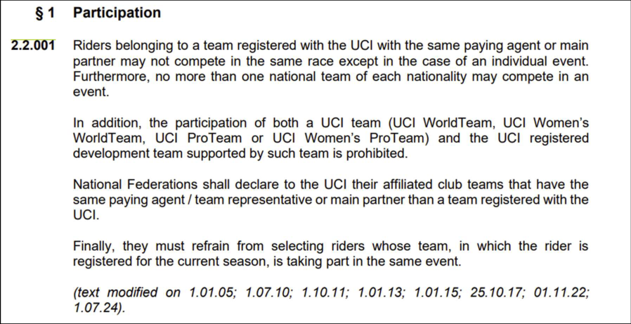
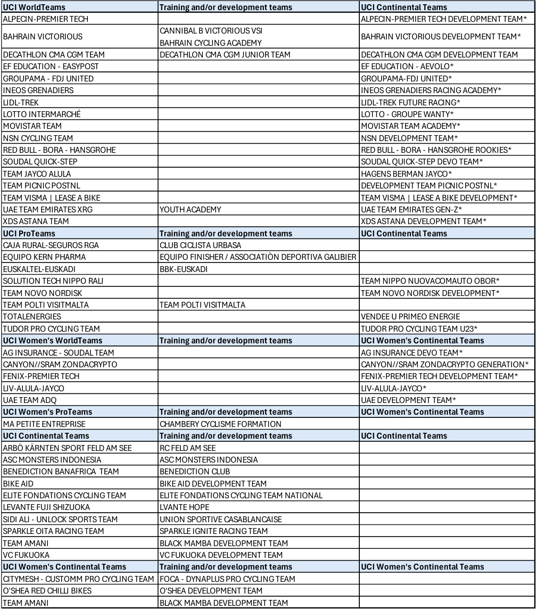

## **Road teams’ participation - 2026 season** 

## _**Participation équipes route - saison 2026**_ 

The teams which are concerned by article 2.2.001 are following. 

Page **1** / **3** 

**Union Cycliste Internationale** 20 mars 2026 

_Veuillez trouver ci-après les équipes concernées par l’article 2.2.001._ 

Page **2** / **3** 

**Union Cycliste Internationale** 20 mars 2026 

Teams on the same line or cell can’t participate to the same race. 

The above information can be updated anytime if UCI receives new elements, especially from National Federations. **Teams having an asterisk * benefit from the participation rules mentioned in article 2.1.005bis of the UCI Regulations.** 

_Les équipes figurant sur la même ligne ou dans la même cellule ne peuvent participer à une même épreuve. Le tableau ci-dessus pourra être mis à jour à tout moment en fonction des nouvelles informations communiquées à l’UCI, en particulier de la part des Fédérations Nationales._ 

_**Les équipes comportant un astérisque * bénéficient des règles de participation mentionnées à l’article 2.1.005bis du Règlement UCI.**_ 

**----- Start of picture text -----** 
UCI WorldTeams Training and/or development teams UCI Continental Teams ALPECIN-PREMIER TECH ALPECIN-PREMIER TECH DEVELOPMENT TEAM* CANNIBAL B VICTORIOUS VSI BAHRAIN VICTORIOUS BAHRAIN VICTORIOUS DEVELOPMENT TEAM* BAHRAIN CYCLING ACADEMY DECATHLON CMA CGM TEAM DECATHLON CMA CGM JUNIOR TEAM DECATHLON CMA CGM DEVELOPMENT TEAM EF EDUCATION - EASYPOST EF EDUCATION - AEVOLO* GROUPAMA - FDJ UNITED GROUPAMA-FDJ UNITED* INEOS GRENADIERS INEOS GRENADIERS RACING ACADEMY* LIDL-TREK LIDL-TREK FUTURE RACING* LOTTO INTERMARCHÉ LOTTO - GROUPE WANTY* MOVISTAR TEAM MOVISTAR TEAM ACADEMY* NSN CYCLING TEAM NSN DEVELOPMENT TEAM* RED BULL - BORA - HANSGROHE RED BULL - BORA - HANSGROHE ROOKIES* SOUDAL QUICK-STEP SOUDAL QUICK-STEP DEVO TEAM* TEAM JAYCO ALULA HAGENS BERMAN JAYCO* TEAM PICNIC POSTNL DEVELOPMENT TEAM PICNIC POSTNL* TEAM VISMA | LEASE A BIKE TEAM VISMA | LEASE A BIKE DEVELOPMENT* UAE TEAM EMIRATES XRG YOUTH ACADEMY UAE TEAM EMIRATES GEN-Z* XDS ASTANA TEAM XDS ASTANA DEVELOPMENT TEAM* UCI ProTeams Training and/or development teams UCI Continental Teams CAJA RURAL-SEGUROS RGA CLUB CICLISTA URBASA EQUIPO KERN PHARMA EQUIPO FINISHER / ASSOCIATIÒN DEPORTIVA GALIBIER EUSKALTEL-EUSKADI BBK-EUSKADI SOLUTION TECH NIPPO RALI TEAM NIPPO NUOVACOMAUTO OBOR* TEAM NOVO NORDISK  TEAM NOVO NORDISK DEVELOPMENT* TEAM POLTI VISITMALTA TEAM POLTI VISITMALTA TOTALENERGIES VENDEE U PRIMEO ENERGIE TUDOR PRO CYCLING TEAM TUDOR PRO CYCLING TEAM U23* UCI Women's WorldTeams Training and/or development teams UCI Women's Continental Teams AG INSURANCE - SOUDAL TEAM AG INSURANCE DEVO TEAM* CANYON//SRAM ZONDACRYPTO CANYON//SRAM ZONDACRYPTO GENERATION* FENIX-PREMIER TECH FENIX-PREMIER TECH DEVELOPMENT TEAM* LIV-ALULA-JAYCO LIV-ALULA-JAYCO* UAE TEAM ADQ UAE DEVELOPMENT TEAM* UCI Women's ProTeams Training and/or development teams UCI Women's Continental Teams MA PETITE ENTREPRISE CHAMBERY CYCLISME FORMATION UCI Continental Teams Training and/or development teams UCI Continental Teams ARBÖ KÄRNTEN SPORT FELD AM SEE RC FELD AM SEE ASC MONSTERS INDONESIA ASC MONSTERS INDONESIA BENEDICTION BANAFRICA  TEAM BENEDICTION CLUB BIKE AID BIKE AID DEVELOPMENT TEAM ELITE FONDATIONS CYCLING TEAM ELITE FONDATIONS CYCLING TEAM NATIONAL LEVANTE FUJI SHIZUOKA LVANTE HOPE SIDI ALI - UNLOCK SPORTS TEAM UNION SPORTIVE CASABLANCAISE SPARKLE OITA RACING TEAM SPARKLE IGNITE RACING TEAM TEAM AMANI BLACK MAMBA DEVELOPMENT TEAM VC FUKUOKA VC FUKUOKA DEVELOPMENT TEAM UCI Women's Continental Teams Training and/or development teams UCI Women's Continental Teams CITYMESH - CUSTOMM PRO CYCLING TEAM FOCA - DYNAPLUS PRO CYCLING TEAM O'SHEA RED CHILLI BIKES O'SHEA DEVELOPMENT TEAM TEAM AMANI BLACK MAMBA DEVELOPMENT TEAM **----- End of picture text -----** 

Page **3** / **3** 

**Union Cycliste Internationale** 20 mars 2026 

