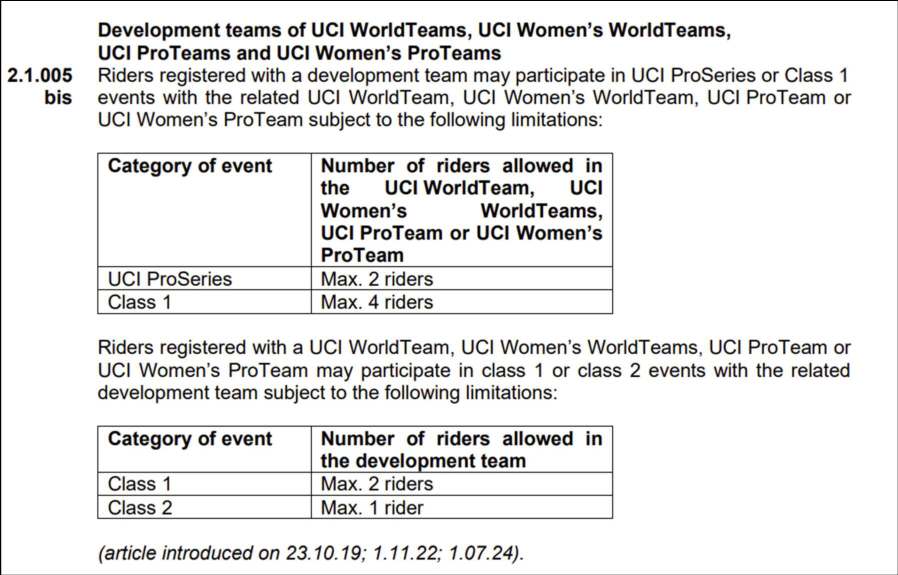
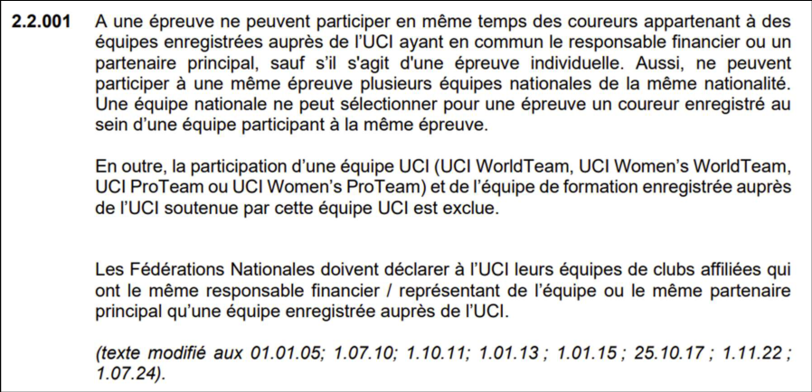
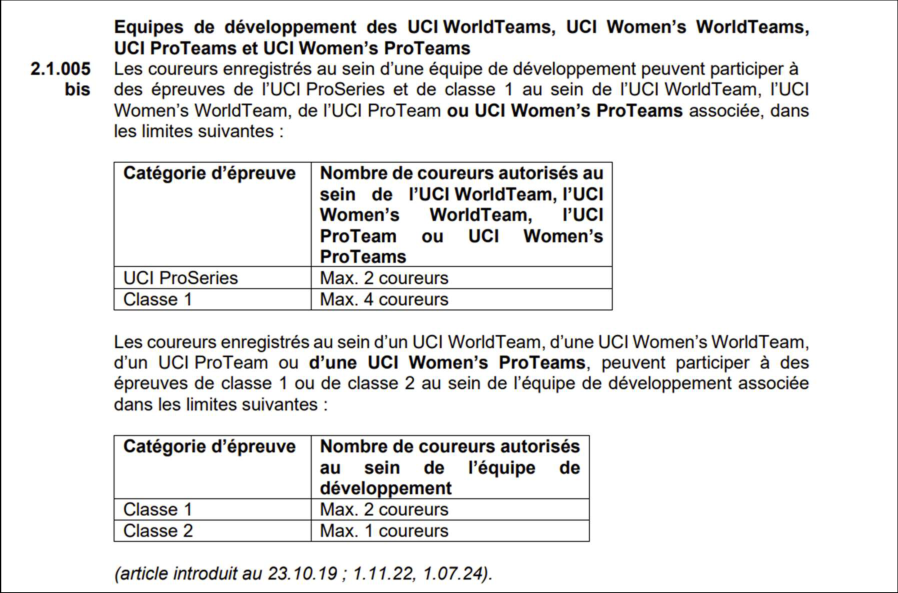
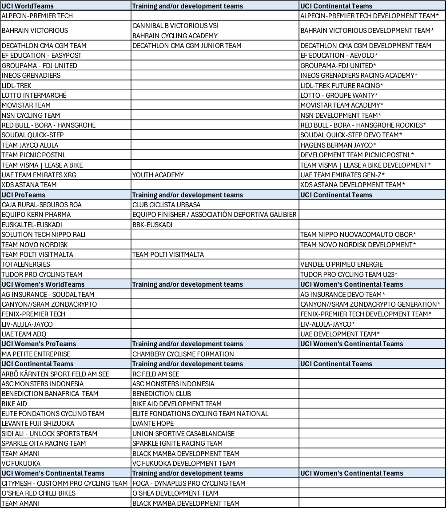

**Road teams’ participation - 2026 season**

_**Participation équipes route - saison 2026**_

The teams which are concerned by article 2.2.001 are following.

**Union Cycliste Internationale**
20 mars 2026

Page **1** / **3**

_Veuillez trouver ci-après les équipes concernées par l’article 2.2.001._

**Union Cycliste Internationale**
20 mars 2026

Page **2** / **3**

Teams on the same line or cell can’t participate to the same race.
The above information can be updated anytime if UCI receives new elements, especially from National Federations.
**Teams having an asterisk * benefit from the participation rules mentioned in article 2.1.005bis of the UCI Regulations.**

_Les équipes figurant sur la même ligne ou dans la même cellule ne peuvent participer à une même épreuve._
_Le tableau ci-dessus pourra être mis à jour à tout moment en fonction des nouvelles informations communiquées à l’UCI,_
_en particulier de la part des Fédérations Nationales._
_**Les équipes comportant un astérisque * bénéficient des règles de participation mentionnées à l’article 2.1.005bis du**_
_**Règlement UCI.**_

**Union Cycliste Internationale**
20 mars 2026

Page **3** / **3**

