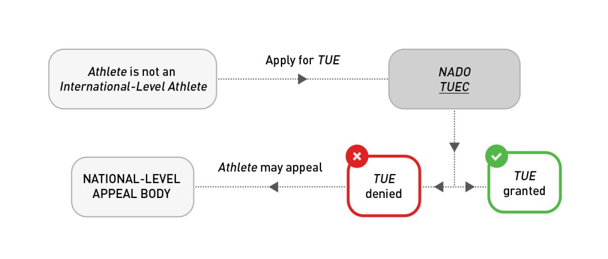
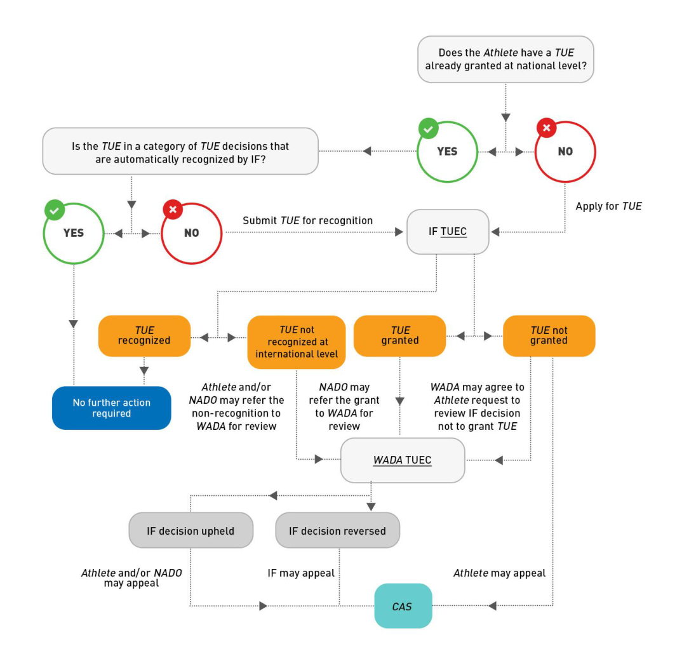

UCI Anti-Doping Regulations 

## **UCI REGULATIONS FOR THERAPEUTIC USE EXEMPTIONS** 

**(“UCI TUER”)** 

Version entering into force on 20 February 2023 

UCI TUER – February 2023 

Page **1** of **23** 

UCI Anti-Doping Regulations 

## **TABLE OF CONTENTS** 

|**PART**|**ONE: INTRODUCTION,****_UCI_ANTI-DOPING RULES AND REGULATIONS PROVISIONS AND**|
|---|---|
|**DEFINITIONS ........................................................................................................................................ 3**||
|1.0|Introduction and Scope .............................................................................................................. 3|
|2.0|_UCI ADR_Provisions ................................................................................................................... 3|
|3.0|Definitions and Interpretation ...................................................................................................... 4|
|**PART**|**TWO: STANDARDS AND PROCESS FOR GRANTING****_TUES_ ................................................ 10**|
|4.0|Obtaining a_TUE_....................................................................................................................... 10|
|5.0|_TUE_Responsibilities of_UCI_..................................................................................................... 13|
|6.0|_TUE_Application Process .......................................................................................................... 15|
|7.0|_TUE_Recognition Process ........................................................................................................ 17|
|8.0|Review of_TUE_Decisions by_WADA_......................................................................................... 18|
|9.0|Confidentiality of Information .................................................................................................... 20|
|**ANNEX 1:****_UCI ADR_Article 4.4 Flowchart ......................................................................................... 22**||

UCI TUER – February 2023 

Page **2** of **23** 

UCI Anti-Doping Regulations 

## **PART ONE: INTRODUCTION,** _**UCI**_ **ANTI-DOPING RULES AND** _**UCI**_ **ANTI-DOPING REGULATIONS PROVISIONS AND DEFINITIONS** 

## **1.0 Introduction and Scope** 

The _UCI_ Regulations for Therapeutic Use Exemptions ( _**UCI TUER**_ ) are mandatory regulations supplementing the _UCI_ Anti-Doping Regulations ( _**UCI ADR**_ ). 

The purpose of the _UCI TUER_ is to establish (a) the conditions that must be satisfied in order for a _Therapeutic Use Exemption_ ( _TUE_ ) to be granted, permitting the presence of a _Prohibited Substance_ in a _Rider’s Sample_ or the _Rider’s Use_ or _Attempted Use_ , _Possession_ and/or _Administration_ or _Attempted Administration_ of a _Prohibited Substance_ or _Prohibited Method_ for Therapeutic reasons; (b) the responsibilities imposed on the _UCI_ in making and communicating _TUE_ decisions; (c) the process for a _Rider_ to apply for a _TUE_ ; (d) the process for a _Rider_ to get a _TUE_ granted by one _AntiDoping Organization_ recognized by the _UCI_ ; (e) the process for _WADA_ to review _TUE_ decisions; and (f) the strict confidentiality provisions that apply to the _TUE_ process _._ 

Terms used in the _UCI TUER_ that are defined terms from the _UCI ADR_ are italicized. Terms that are defined in the _UCI TUER_ or another Regulations are underlined. 

## **2.0** _**UCI ADR**_ **Provisions** 

The following articles in the 2021 _UCI ADR_ are directly relevant to the _UCI TUER_ : 

- Article 4.4 _Therapeutic Use Exemptions ("TUEs")._ 

- Article 13.4 Appeals Relating to _TUEs._ 

UCI TUER – February 2023 

Page **3** of **23** 

UCI Anti-Doping Regulations 

## **3.0 Definitions and Interpretation** 

## **3.1 Defined terms from the 2021** _**UCI ADR**_ **that are used in the** _**UCI TUER**_ 

_**ADAMS**_ **:** The Anti-Doping Administration and Management System is a Web-based database management tool for data entry, storage, sharing, and reporting designed to assist stakeholders and _WADA_ in their anti-doping operations in conjunction with data protection legislation. 

_**Administration**_ **:** Providing, supplying, supervising, facilitating, or otherwise participating in the _Use_ or _Attempted Use_ by another _Person_ of a _Prohibited Substance_ or _Prohibited Method_ . However, this definition shall not include the actions of bona fide medical personnel involving a _Prohibited Substance_ or _Prohibited Method Used_ for genuine and legal therapeutic purposes or other acceptable justification and shall not include actions involving _Prohibited Substances_ which are not prohibited in _Out-of-Competition Testing_ unless the circumstances as a whole demonstrate that such _Prohibited Substances_ are not intended for genuine and legal therapeutic purposes or are intended to enhance sport performance _._ 

_**Adverse Analytical Finding**_ **:** A report from a _WADA-_ accredited laboratory or other _WADA_ - approved laboratory that, consistent with the _International Standard_ for Laboratories, establishes in a _Sample_ the presence of a _Prohibited Substance_ or its _Metabolite_ s or _Marker_ s or evidence of the _Use_ of a _Prohibited Method_ . 

_**Anti-Doping Organization**_ **:** _WADA_ or a _Signatory_ that is responsible for adopting rules for initiating, implementing or enforcing any part of the _Doping Control_ process. This includes, for example, the International Olympic Committee, the International Paralympic Committee, other _Major Event Organizations_ that conduct _Testing_ at their _Events_ , International Federations, and _National Anti-Doping Organizations._ 

_**Attempt**_ **:** Purposely engaging in conduct that constitutes a substantial step in a course of conduct planned to culminate in the commission of an anti-doping rule violation. Provided, however, there shall be no anti-doping rule violation based solely on an _Attempt_ to commit a violation if the _Person_ renounces the _Attempt_ prior to it being discovered by a third party not involved in the _Attempt_ . 

_**CAS**_ **:** The Court of Arbitration for Sport. 

_**Code**_ **:** The World Anti-Doping _Code_ . 

_**Competition**_ **:** A single race organized separately (for example: each of the time trial and road race at the road World Championships; a stage in a stage race; a Cross-country Eliminator heat) or a series of races forming an organizational unit and producing a final winner and/or general classification (for example: a track sprint race tournament, a cyclo-ball tournament). 

_**Education:**_ The process of learning to instill values and develop behaviors that foster and protect the spirit of sport, and to prevent intentional and unintentional doping. 

UCI TUER – February 2023 

Page **4** of **23** 

UCI Anti-Doping Regulations 

_**Event**_ **:** A single _Competition_ organized separately (for example: a one-day road race) or a series of _Competitions_ conducted together as a single organization (for example: road World Championships; a road stage race, a track World Cup _Event_ ); a reference to _Event_ includes reference to _Competition_ , unless the context indicates otherwise. 

_**In-Competition**_ **:** _The Event Period_ . However, for the purpose of the _Prohibited List, InCompetition_ is the period commencing at 11:59 p.m. on the day before a _Competition_ in which the _Rider_ is scheduled to participate through the end of such _Competition_ and the _Sample_ collection process related to such _Competition_ . 

_[Comment to In-Competition: Having a universally accepted definition for In-Competition provides greater harmonization among Riders across all sports, eliminates or reduces confusion among Riders about the relevant timeframe for In-Competition Testing, avoids inadvertent Adverse Analytical Findings in between Competitions during an Event and assists in preventing any potential performance enhancement benefits from Substances prohibited Out-of-Competition being carried over to the Competition period.]_ 

_**International Event**_ **:** An _Event_ or _Competition_ where the International Olympic Committee, the International Paralympic Committee, an International Federation, a _Major Event Organization_ , or another international sport organization is the ruling body for the _Event_ or appoints the technical officials for the _Event_ . 

For the purpose of Article 5.3 _UCI ADR_ exclusively _, International Events_ are _Events_ for which the _UCI_ has _Testing_ responsibility and are referred to as _“UCI International Events”. UCI International Events_ are defined annually by the _UCI._ The list of such _UCI International Events_ is communicated to the relevant _Anti-Doping Organizations_ before the start of the season and whenever required. 

_**International-Level Rider**_ **:** _Riders_ who compete in sport at the international level, as defined in the Introduction of the _UCI ADR._ 

_**International Standard**_ **:** A standard adopted by _WADA_ in support of the _Code_ . Compliance with an _International Standard_ (as opposed to another alternative standard, practice or procedure) shall be sufficient to conclude that the procedures addressed by the _International Standard_ were performed properly. _International Standards_ shall include any _Technical Documents_ issued pursuant to the _International Standard_ . 

_**Major Event Organizations**_ **:** The continental associations of _National Olympic Committee_ s and other international multi-sport organizations that function as the ruling body for any continental, regional or other _International Event_ . 

_**National Anti-Doping Organization**_ **:** The entity(ies) designated by each country as possessing the primary authority and responsibility to adopt and implement anti-doping rules, direct the collection of _Samples_ , manage test results and conduct _Results Management_ at the national level. If this designation has not been made by the competent public authority(ies), the entity shall be the country’s _National Olympic Committee_ or its designee. 

UCI TUER – February 2023 

Page **5** of **23** 

UCI Anti-Doping Regulations 

_**National Event**_ **:** A sport _Event_ or _Competition_ involving _International-_ or _National-Level Riders_ that is not an _International Event_ . 

_**National-Level Rider**_ **:** _Riders_ who compete in sport at the national level, as defined by each _National Anti-Doping Organization,_ consistent with the _International Standard_ for _Testing_ and Investigations. 

## _**Out-of-Competition**_ **:** Any period which is not _In-Competition_ . 

_**Possession**_ **:** The actual, physical _Possession_ , or the constructive _Possession_ (which shall be found only if the _Person_ has exclusive control or intends to exercise control over the _Prohibited Substance_ or _Prohibited Method_ or the premises in which a _Prohibited Substance_ or _Prohibited Method_ exists); provided, however, that if the _Person_ does not have exclusive control over the _Prohibited Substance or Prohibited Method_ or the premises in which a _Prohibited Substance_ or _Prohibited Method_ exists, constructive _Possession_ shall only be found if the _Person_ knew about the presence of the _Prohibited Substance_ or _Prohibited Method_ and intended to exercise control over it. Provided, however, there shall be no antidoping rule violation based solely on _Possession_ if, prior to receiving notification of any kind that the _Person_ has committed an anti-doping rule violation, the _Person_ has taken concrete action demonstrating that the _Person_ never intended to have _Possession_ and has renounced _Possession_ by explicitly declaring it to an _Anti-Doping Organization_ . Notwithstanding anything to the contrary in this definition, the purchase (including by any electronic or other means) of a _Prohibited Substance_ or _Prohibited Method_ constitutes _Possession_ by the _Person_ who makes the purchase. 

_[Comment to Possession: Under this definition, anabolic steroids found in a Rider_ ' _s car would constitute a violation unless the Rider establishes that someone else used the car; in that event, the Anti-Doping Organization must establish that, even though the Rider did not have exclusive control over the car, the Rider knew about the anabolic steroids and intended to have control over them. Similarly, in the example of anabolic steroids found in a home medicine cabinet under the joint control of a Rider and spouse, the Anti-Doping Organization must establish that the Rider knew the steroids were in the cabinet and that the Rider intended to exercise control over them. The act of purchasing a Prohibited Substance alone constitutes Possession, even where, for example, the product does not arrive, is received by someone else, or is sent to a third-party address.]_ 

_**Prohibited List**_ **:** The list identifying the _Prohibited Substances_ and _Prohibited Methods_ . 

_**Prohibited Method**_ **:** Any method so described on the _Prohibited List_ . 

_**Prohibited Substance**_ **:** Any substance, or class of substances, so described on the _Prohibited List_ . 

UCI TUER – February 2023 

Page **6** of **23** 

UCI Anti-Doping Regulations 

_**Rider**_ **:** Any _Person_ subject to the _UCI ADR_ who competes in the sport of cycling at the international level (as defined by each International Federation) or the national level (as defined by each _National Anti-Doping Organization)._ 

An _Anti-Doping Organization_ has discretion to apply anti-doping rules to a _Rider_ who is neither an _International-Level Rider_ nor a _National-Level Rider_ , and thus to bring them within the definition of “ _Rider_ ”. In relation to _Riders_ who are neither _International-Level_ nor _NationalLevel Riders_ , an _Anti-Doping Organization_ may elect to: conduct limited _Testing_ or no _Testing_ at all; analyze _Samples_ for less than the full menu of _Prohibited Substances_ ; require limited or no whereabouts information; or not require advance _TUEs_ . However, if an Article 2.1, 2.3 or 2.5 anti-doping rule violation is committed by any _Rider_ over whom an _Anti-Doping Organization_ has elected to exercise its authority to test and who competes below the international or national level, then the _Consequences_ set forth in the _Code_ must be applied. For purposes of Article 2.8 and Article 2.9 and for purposes of anti-doping information and _Education_ , any _Person_ who participates in sport under the authority of any _Signatory_ , government, or other sports organization accepting the _Code_ is a _Rider_ . 

_[Comment to Rider: Individuals who participate in sport may fall in one of five categories: 1) International-Level Rider, 2) National-Level Rider, 3) individuals who are not International or National-Level Riders but over whom the International Federation or National Anti-Doping Organization has chosen to exercise authority, 4) Recreational Rider, and 5) individuals over whom no International Federation or National Anti-Doping Organization has, or has chosen to, exercise authority. All International and National-Level Riders are subject to the antidoping rules of the Code, with the precise definitions of international and national level sport to be set forth in the anti-doping rules of the International Federations and National AntiDoping Organizations.]_ 

_**Recreational Rider**_ **:** A natural _Person_ who is so defined by the relevant _National Anti-Doping Organization_ ; provided, however, the term shall not include any _Person_ who is or was contracted to a _UCI_ registered Team at the time of the anti-doping rule violation or within the five (5) years prior to committing any anti-doping rule violation, has been an _InternationalLevel Rider_ (as defined by each International Federation consistent with the _International Standard_ for _Testing_ and Investigations) or _National-Level Rider_ (as defined by each _National Anti-Doping Organization_ consistent with the _International Standard_ for _Testing_ and Investigations), has represented any country in an _International Event_ in an open category or has been included within any _Registered Testing Pool_ or other whereabouts information pool maintained by any International Federation or _National Anti-Doping Organization_ . 

_[Comment to Recreational Rider: The term “open category” is meant to exclude competition that is limited to junior or age group categories.]_ 

_**Registered Testing Pool**_ **:** The pool of highest-priority _Rider_ established separately at the international level by International Federations and at the national level by _National AntiDoping Organizations,_ who are subject to focused _In-Competition_ and _Out-of-Competition Testing_ as part of that International Federation's or _National Anti-Doping Organization's_ test distribution plan and therefore are required to provide whereabouts information as provided in Article 5.5 and the _International Standard_ for _Testing_ and Investigations. 

UCI TUER – February 2023 

Page **7** of **23** 

UCI Anti-Doping Regulations 

_**Results Management**_ **:** The process encompassing the timeframe between notification as per Article 5 of the _International Standard_ for _Results Management_ , or in certain cases (e.g., _Atypical Finding_ , _Rider Biological Passport_ , _Whereabouts Failure_ ), such pre-notification steps expressly provided for in Article 5 of the _International Standard_ for _Results Management_ , through the charge until the final resolution of the matter, including the end of the hearing process at first instance or on appeal (if an appeal was lodged). 

_**Sample**_ **or** _**Specimen**_ **:** Any biological material collected for the purposes of _Doping Control_ . 

_[Comment to Sample or Specimen: It has sometimes been claimed that the collection of blood Samples violates the tenets of certain religious or cultural groups. It has been determined that there is no basis for any such claim.]_ 

_**Testing**_ **:** The parts of the _Doping Control_ process involving test distribution planning, _Sample_ 

collection, _Sample_ handling, and _Sample_ transport to the laboratory. 

_**Testing Pool**_ **:** The tier below the _Registered Testing Pool_ which includes _Riders_ from whom some whereabouts information is required in order to locate and _Test_ the _Rider Out-ofCompetition_ . 

_**Therapeutic Use Exemption (TUE)**_ **:** A _Therapeutic Use Exemption_ allows a _Rider_ with a medical condition to use a _Prohibited Substance_ or _Prohibited Method_ , but only if the conditions set out in Article 4.4 and the _International Standard_ for _Therapeutic Use Exemptions_ are met. 

_**UCI**_ **:** Union Cycliste Internationale, the International Federation governing the sport of cycling. 

_**UCI Website**_ **:** a website on which these Anti-Doping Rules and other documents referred to in these Anti-Doping Rules are made available in their current version. 

_**Use**_ **:** The utilization, application, ingestion, injection or consumption by any means whatsoever of any _Prohibited Substance_ or _Prohibited Method_ . 

_**WADA**_ **:** The World Anti-Doping Agency. 

## **3.2 Defined terms from the** _**International Standard**_ **for the Protection of Privacy and Personal Information** 

**Personal Information:** Information, including without limitation Sensitive Personal Information, relating to an identified or identifiable _Participant_ or other _Person_ whose information is Processed solely in the context of an _Anti-Doping Organization’s Anti-Doping Activities_ . 

_[Comment to Personal Information: It is understood that Personal Information includes, but is not limited to, information relating to a Rider’s name, date of birth, contact details and sporting affiliations, whereabouts, designated TUEs (if any), anti-doping test results, and Results Management (including disciplinary hearings, appeals and sanctions). Personal Information also includes personal details and contact information relating to other Persons,_ 

UCI TUER – February 2023 

Page **8** of **23** 

UCI Anti-Doping Regulations 

_such as medical professionals and other Persons working with, treating or assisting a Rider in the context of Anti-Doping Activities. Such information remains Personal Information and is regulated by this International Standard for the entire duration of its Processing, irrespective of whether the relevant individual remains involved in organized sport.]_ 

**Processing** (and its cognates, **Process** and **Processed** ) **:** Collecting, accessing, retaining, storing, disclosing, transferring, transmitting, amending, deleting or otherwise making use of Personal Information. 

## **3.3 Defined terms specific to the** _**UCI TUER**_ 

**Therapeutic:** Of or relating to the treatment of a medical condition by remedial agents or methods; or providing or assisting in a cure. 

_**Therapeutic Use Exemption**_ **Committee (or "TUEC"):** The panel established by an _AntiDoping Organization_ to consider applications for _TUEs_ . 

_**WADA**_ **TUEC:** The panel established by _WADA_ to review the _TUE_ decisions of other _AntiDoping Organizations._ 

## **3.4 Interpretation** 

- **3.4.1** The official text of the _UCI TUER_ shall be published in English and French. In the event of any conflict between the English and French versions, the English version shall prevail. 

- **3.4.2** Like the _UCI ADR_ , the _UCI TUER_ have been drafted giving consideration to the principles of proportionality, human rights, and other applicable legal principles. It shall be interpreted and applied in that light. 

- **3.4.3** The comments annotating various provisions of the _UCI TUER_ shall be used to guide its interpretation. 

- **3.4.4** Unless otherwise specified, references to Sections and Articles are references to Sections and Articles of the _UCI TUER_ . 

- **3.4.5** Where the term “days” is used in these Regulations, it shall mean calendar days unless otherwise specified. 

- **3.4.6** The Annexes to the _UCI TUER_ have the same mandatory status as the rest of these Regulations. 

UCI TUER – February 2023 

Page **9** of **23** 

UCI Anti-Doping Regulations 

## **PART TWO:  STANDARDS AND PROCESS FOR GRANTING** _**TUES**_ 

## **4.0 Obtaining a** _**TUE**_ 

A _Rider_ who needs to Use a _Prohibited Substance_ or _Prohibited Method_ for Therapeutic reasons must apply for and obtain a _TUE_ prior to _Using_ or _Possessing_ the substance or method in question, unless the _Rider_ is entitled to apply for a _TUE_ retroactively under Article 4.1. In both cases, the Article 4.2 conditions must be satisfied. 

_[Comment to Article 4.0: There may be situations where a Rider has a medical condition and is Using or Possessing a Prohibited Substance or Prohibited Method prior to becoming subject to anti-doping rules. In that case, such prior Use/Possession does not require a TUE and a prospective TUE will be sufficient.]_ 

_(text modified on 20.02.2023)_ 

- **4.1** A retroactive _TUE_ provides a _Rider_ the opportunity to apply for a _TUE_ for a _Prohibited Substance_ or _Prohibited Method_ after _Using_ or _Possessing_ the substance or method in question. 

A _Rider_ may apply retroactively for a _TUE_ (but must still meet the conditions in Article 4.2) if any one of the following exceptions applies: 

a) Emergency or urgent treatment of a medical condition was necessary; 

- b) There was insufficient time, opportunity or other exceptional circumstances that prevented the _Rider_ from submitting (or the TUEC to consider) an application for the _TUE_ prior to _Sample_ collection; 

- c) Due to national level prioritization of certain sports or disciplines, the _Rider’s National Anti-Doping Organization_ did not permit or require the _Rider_ to apply for a prospective _TUE_ (see comment to Article 5.1); 

- d) If the _UCI_ chooses to collect a _Sample_ from a _Rider_ who is not an _International-Level Rider_ or _National-Level Rider_ , and that the _Rider_ is _Using_ a _Prohibited Substance_ or _Prohibited Method_ for Therapeutic reasons, the _UCI_ must permit the _Rider_ to apply for a retroactive _TUE_ ; or 

- e) The _Rider Used Out-of-Competition_ , for Therapeutic reasons, a _Prohibited Substance_ that is only prohibited _In-Competition_ . 

_[Comment to Article 4.1: The fulfillment of one of the retroactive exceptions does not mean that a TUE will necessarily be granted; it means that the Rider application may be evaluated under Article 4.2 to determine if the specified TUE conditions have been satisfied]_ 

_[Comment to Articles 4.1(c), (d) and (e): Such Riders are strongly advised to have a medical file prepared and ready to demonstrate their satisfaction of the TUE conditions set out at Article 4.2, in case an application for a retroactive TUE is necessary following Sample collection.]_ 

UCI TUER – February 2023 

Page **10** of **23** 

UCI Anti-Doping Regulations 

_[Comment to Article 4.1(e): This seeks to address situations where, for Therapeutic reasons, a Rider Uses a substance Out-of-Competition that is only prohibited In-Competition, but there is a risk that the substance will remain in his/her system In-Competition. In such situations, the UCI must permit the Rider to apply for a retroactive TUE (where the Rider has not applied in advance). This also seeks to prevent the UCI from having to assess advance TUE applications that may not be necessary.]_ 

_(text modified on 20.02.2023)_ 

- **4.2** A _Rider_ may be granted a _TUE_ if (and only if) they can show, on the balance of probabilities, that each of the following conditions is met: 

   - a) The _Prohibited Substance_ or _Prohibited Method_ in question is needed to treat a diagnosed medical condition supported by relevant clinical evidence. 

_[Comment to Article 4.2(a): The Use of the Prohibited Substance or Prohibited Method may be part of a necessary diagnostic investigation rather than a treatment per se.]_ 

- b) The Therapeutic _Use_ of the _Prohibited Substance_ or _Prohibited Method_ will not, on the balance of probabilities, produce any additional enhancement of performance beyond what might be anticipated by a return to the _Rider’s_ normal state of health following the treatment of the medical condition. 

_[Comment to Article 4.2(b): A Rider’s normal state of health will need to be determined on an individual basis. A normal state of health for a specific Rider is their state of health but for the medical condition for which the Rider is seeking a TUE.]_ 

- c) The _Prohibited Substance_ or _Prohibited Method_ is an indicated treatment for the medical condition, and there is no reasonable permitted Therapeutic alternative. 

_[Comment to Article 4.2(c): The physician must explain why the treatment chosen was the most appropriate, e.g., based on experience, side-effect profiles or other medical justifications, including, where applicable, geographically specific medical practice, and the ability to access the medication. Further, it is not always necessary to try and fail alternatives before using the Prohibited Substance or Prohibited Method.]_ 

- d) The necessity for the _Use_ of the _Prohibited Substance_ or _Prohibited Method_ is not a consequence, wholly or in part, of the prior _Use_ (without a _TUE_ ) of a substance or method which was prohibited at the time of such _Use_ . 

_[Comment to Article 4.2: The WADA documents titled “TUE Physician Guidelines”, posted on WADA’s website, should be used to assist in the application of these criteria in relation to particular medical conditions._ 

_The granting of a TUE is based solely on consideration of the conditions set out in Article 4.2. It does not consider whether the Prohibited Substance or Prohibited Method is the most clinically appropriate or safe, or whether its Use is legal in all jurisdictions._ 

UCI TUER – February 2023 

Page **11** of **23** 

## UCI Anti-Doping Regulations 

_When the UCI_ or _Major Event Organization TUEC is deciding whether or not to recognize a TUE granted by another Anti-Doping Organization (see Article 7), and when WADA is reviewing a decision to grant (or not to grant) a TUE (see Article 8), the issue will be the same as it is for a TUEC that is considering an application for a TUE under Article 6, i.e., has the Rider demonstrated on the balance of probabilities that each of the conditions set out in Article 4.2 is met?]_ 

- **4.3** In exceptional circumstances and notwithstanding any other provision in this _UCI TUER_ , a _Rider_ may apply for and be granted retroactive approval for their Therapeutic _Use_ of a _Prohibited Substance_ or _Prohibited Method_ if, considering the purpose of the _UCI ADR_ , it would be manifestly unfair not to grant a retroactive _TUE_ . For _International-Level Riders_ and _National-Level Riders_ , the _UCI_ may grant a _Rider’s_ application for a retroactive _TUE_ pursuant to this Article only with the prior approval of _WADA_ (and _WADA_ may in its absolute discretion agree with or reject the _UCI’_ s decision). 

For _Riders_ who are not _International-Level Riders_ or _National-Level Riders_ , the relevant _AntiDoping Organization_ may grant a _Rider’s_ application for a retroactive _TUE_ pursuant to this Article without first consulting _WADA_ ; however, _WADA_ may at any time review an _AntiDoping Organization’s_ decision to grant a retroactive _TUE_ pursuant to this Article, and may in its absolute discretion, agree with or reverse the decision. 

Any decision made by _WADA,_ the _UCI_ and/or an _Anti-Doping Organization_ under this Article may not be challenged either as a defense to proceedings for an anti-doping rule violation, or by way of appeal, or otherwise. 

All decisions of an _Anti-Doping Organization_ under this Article 4.3, whether granting or denying a _TUE_ , must be reported through _ADAMS_ in accordance with Article 5.3. 

_[Comment to Article 4.3: For the avoidance of doubt, retroactive approval may be granted under Article 4.3 even if the conditions in Article 4.2 are not met (although satisfaction of such conditions will be a relevant consideration). Other relevant factors might include, without limitation, the reasons why the Rider did not apply in advance; the Rider’s experience; the Education previously received by the Rider; whether the Rider declared the Use of the substance or method on the Doping Control form; and the recent expiration of the Rider’s TUE. In making its decision, WADA may, at its discretion, consult with a member(s) of a WADA TUEC.]_ 

_(text modified on 20.02.2023)_ 

UCI TUER – February 2023 

Page **12** of **23** 

UCI Anti-Doping Regulations 

## **5.0** _**TUE**_ **Responsibilities of** _**the UCI**_ 

- **5.1** Article 4.4 of the _UCI ADR_ specifies (a) the _UCI’_ s authority to make _TUE_ decisions with respect to _International Level Riders_ or participation to _International Event_ ; (b) how _TUE_ decisions granted by _National Anti-Doping Organization_ should be recognized and respected by the _UCI_ ; and (c) when _TUE_ decisions issued by the _UCI_ may be reviewed and/or appealed. 

- **5.2** The _UCI_ shall establish a TUEC to consider whether applications for grant or recognition of _TUEs_ meet the conditions set out in Article 4.2. 

   - a) TUECs should include at least three (3) physicians with experience in the care and treatment of _Rider_ s and a sound knowledge of clinical, sports and exercise medicine. In cases where specific expertise is required (for example, for _Riders_ with impairments where the substance or method pertains to the _Rider’s_ impairment), at least one (1) TUEC member or expert should possess such expertise. One (1) physician member should act as chair of the TUEC. 

   - b) In order to ensure impartiality of decisions, all members of the TUEC must sign a conflict of interest and confidentiality declaration. 

- **5.3** The _UCI_ must promptly report (in English or French) all decisions of its TUEC granting or denying _TUEs_ , and all decisions to recognize or refusing to recognize other _Anti-Doping Organizations' TUE_ decisions, through _ADAMS_ as soon as possible and in any event within twenty-one (21) days of receipt of the decision _._ A decision to deny a _TUE_ shall include an explanation of the reason(s) for the denial. In respect of _TUEs_ granted, the information reported shall include (in English or French): 

   - a) Whether the _Rider_ was permitted to apply for a _TUE_ retroactively under Article 4.1 and an explanation of the reason(s) why, or whether the _Rider_ was permitted to apply for and was granted a _TUE_ retroactively under Article 4.3 and an explanation of the reason(s) why; 

   - b) The approved substance or method, the dosage(s), frequency, route of _Administration_ permitted, the duration of the _TUE_ (and, if different, the duration of prescribed treatment), and any conditions imposed in connection with the _TUE_ ; and 

   - c) The _TUE_ application form (if not completed electronically in _ADAMS_ ) and the relevant clinical information establishing that the Article 4.2 conditions have been satisfied in respect of such _TUE_ (for access only by _WADA_ , the _Rider’s National Anti-Doping Organization_ and _UCI_ , and the _Major Event Organization_ organizing an _Event_ in which the _Rider_ wishes to compete). 

_[Comment to Article 5.3: If a TUE application form is used it may be translated into other languages by the UCI, but the original English or French text must remain on the form, and an English or French translation of the content must be provided._ 

_The full medical file, including diagnostic tests, laboratory results and values must be provided, but need not be translated into English or French. However, a translated summary of all the key information (including key diagnostic tests) must be entered into_ 

UCI TUER – February 2023 

Page **13** of **23** 

## UCI Anti-Doping Regulations 

_ADAMS, with sufficient information to clearly establish the diagnosis. It is strongly suggested that the summary be prepared by a physician or other person with adequate medical knowledge, in order to properly understand and summarize the medical information. More detailed/full translations may be required by the UCI or WADA, upon request.]_ 

_(text modified on 20.02.2023)_ 

- **5.4** The _UCI_ shall publish and keep updated a notice on its website that sets out clearly (1) which _Riders_ under its jurisdiction are required to apply to it for a _TUE_ , and when; (2) which _TUE_ decisions of other _Anti-Doping Organizations_ it will automatically recognize in lieu of such application, in accordance with Article 7.1(a); and (3) which _TUE_ decisions of other _AntiDoping Organizations_ will have to be submitted to it for recognition, in accordance with Article 7.1(b). 

- **5.5** If a _National Anti-Doping Organization_ grants a _TUE_ to a _Rider_ and the _Rider_ subsequently becomes an _International-Level Rider_ or competes in an _International Event_ , the _TUE_ will not be valid unless and until the _UCI_ recognizes that _TUE_ in accordance with Article 7.0. If the _UCI_ grants a _TUE_ to a _Rider_ and the _Rider_ then competes in an _International Event_ organized by a _Major Event Organization_ , the _TUE_ will not be valid unless and until the relevant _Major Event Organization_ recognizes that _TUE_ in accordance with Article 7.0. As a result, if the _UCI_ or _Major Event Organization_ (as applicable) declines to recognize that _TUE_ , then (subject to the _Rider_ ’s rights of review and appeal) that _TUE_ may not be relied upon to excuse the _Presence_ , _Use, Possession_ or _Administration_ of the _Prohibited Substance_ or _Prohibited Method_ mentioned in the _TUE_ vis-à-vis the _UCI_ or _Major Event Organization_ . 

UCI TUER – February 2023 

Page **14** of **23** 

UCI Anti-Doping Regulations 

## **6.0** _**TUE**_ **Application Process** 

- **6.1** A _Rider_ who needs a _TUE_ should apply as soon as possible. For substances prohibited _InCompetition_ only, the _Rider_ should apply for a _TUE_ at least thirty (30) days before his/her next _Competition_ , unless it is an emergency or exceptional situation. 

- **6.2** The _Rider_ shall apply to the _UCI_ online or using the _TUE_ application form _._ 

_(text modified on 20.02.2023)_ 

- **6.3** A _Rider_ may not apply to more than one (1) _Anti-Doping Organization_ for a _TUE_ for the _Use_ of the same _Prohibited Substance_ or _Prohibited Method_ for the same medical condition. Nor may a _Rider_ have more than one (1) _TUE_ at a time for the _Use_ of the same _Prohibited Substance_ or _Prohibited Method_ for the same medical condition (and any such new _TUE_ will supersede the previous _TUE_ , which should be cancelled by the relevant _Anti-Doping Organization_ ). 

- **6.4** The _Rider_ should submit the _TUE_ application to the _UCI_ via _ADAMS_ or otherwise specified by the _UCI_ . 

The form must be completed legibly, in English or French. 

The form must be accompanied by a comprehensive medical history, including documentation from the original diagnosing physician(s) (where possible) and the results of all relevant examinations, laboratory investigations and imaging studies relevant to the application. The application must include the physician’s signature, in the designated area. 

_[Comment to Article 6.4: The information submitted in relation to the diagnosis and treatment should be guided by the relevant WADA documents posted on WADA’s website.]_ 

_(text modified on 20.02.2023)_ 

- **6.5** The _Rider_ should keep a complete copy of the _TUE_ application and of all materials and information submitted to the _UCI_ . 

_(text modified on 20.02.2023)_ 

- **6.6** A _TUE_ application will only be considered by the TUEC following the receipt of a properly completed application, accompanied by all relevant documents. Incomplete applications will be returned to the _Rider_ for completion and re-submission. 

- **6.7** The TUEC may request from the _Rider_ or his/her physician any additional information, examinations or imaging studies, or other information that it deems necessary in order to consider the _Rider’_ s application; and/or it may seek the assistance of such other medical or scientific experts as it deems appropriate. 

- **6.8** Any costs incurred by the _Rider_ in making the _TUE_ application and in supplementing it as required by the TUEC are the responsibility of the _Rider_ . 

UCI TUER – February 2023 

Page **15** of **23** 

UCI Anti-Doping Regulations 

- **6.9** A decision to grant a _TUE_ shall be taken unanimously by the three (3) members of the TUEC. In the event of a lack of unanimity amongst the three members of the TUEC, the _TUE_ will be denied. 

- **6.10** The TUEC shall decide whether or not to grant the application as soon as possible, and usually (i.e. unless exceptional circumstances apply) within no more than twenty-one (21) days of receipt of a complete application. Where a _TUE_ application is made in a reasonable time prior to an _Event_ , the TUEC must use its best endeavors to issue its decision before the start of the _Event_ . 

- **6.11** The TUEC’s decision must be communicated in writing to the _Rider_ and must be made available to _WADA_ and to other _Anti-Doping Organizations_ via _ADAMS_ , in accordance with Article 5.3. 

- **6.12** Each _TUE_ will have a specified duration, as decided by the TUEC, at the end of which the _TUE_ will expire automatically. If the _Rider_ needs to continue to _Use_ the _Prohibited Substance_ or _Prohibited Method_ after the expiry date, they must submit an application for a new _TUE_ well in advance of that expiry date, so that there is sufficient time for a decision to be made on the application before the expiry date. 

_[Comment to Article 6.12: Where applicable, the duration of validity should be guided by the WADA documents titled “TUE Physician Guidelines”.]_ 

- **6.13** A _TUE_ will be withdrawn prior to expiry if the _Rider_ does not promptly comply with any requirements or conditions imposed by the _Anti-Doping Organization_ granting the _TUE_ . Alternatively a _TUE_ may be reversed upon review by _WADA_ or on appeal. 

- **6.14** Where an _Adverse Analytical Finding_ is issued shortly after a _TUE_ for the _Prohibited Substance_ in question has expired or has been withdrawn or reversed, the _UCI_ , in accordance with Article 5.1.1.1 of the _UCI Results Management_ Regulations shall consider whether the finding is consistent with _Use_ of the _Prohibited Substance_ prior to the expiry, withdrawal or reversal of the _TUE_ . If so, such _Use_ (and any resulting presence of the _Prohibited Substance_ in the _Rider’s Sample_ ) is not an anti-doping rule violation. 

- **6.15** In the event that, after his/her _TUE_ is granted, the _Rider_ requires a materially different dosage, frequency, route or duration of _Administration_ of the _Prohibited Substance_ or _Prohibited Method_ to that specified in the _TUE_ , he/she must contact the _UCI_ , who will then determine whether the _Rider_ needs to apply for a new _TUE_ . If the _Presence_ , _Use_ , _Possession_ or _Administration_ of the _Prohibited Substance_ or _Prohibited Method_ is not consistent with the terms of the _TUE_ granted, the fact that the _Rider_ has the _TUE_ will not prevent the finding of an anti-doping rule violation. 

_[Comment to Article 6.15: It is recognized that for certain medical conditions, dosages may fluctuate, particularly during the early stages of the establishment of a treatment regime or for a condition such as insulin-dependent diabetes. Such potential fluctuations should be accounted for in the TUE. However, in the event of a change that is not accounted for in the TUE, the Rider must contact the relevant Anti-Doping Organization to determine whether a new TUE is required.]_ 

UCI TUER – February 2023 

Page **16** of **23** 

UCI Anti-Doping Regulations 

## **7.0** _**TUE**_ **Recognition Process** 

- **7.1** The _UCI_ will recognize _TUEs_ granted by other _Anti-Doping Organizations_ that satisfy the Article 4.2 conditions. Therefore, if a _Rider_ who becomes subject to the _TUE_ requirements of the _UCI_ already has a _TUE_ , he/she should not submit an application for a new _TUE_ to the _UCI._ Instead: 

   - a) The _UCI_ may publish notice on the _UCI_ website that it will automatically recognize certain categories of _TUE_ decisions made pursuant to _UCI ADR_ Article 4.4, provided that such _TUE_ decisions have been reported in accordance with Article 5.3. If the _Rider’s TUE_ falls into a category of _TUEs_ that are automatically recognized in this way at the time the _TUE_ is granted, they do not need to take any further action. The _TUE_ may not be subject to further review by the _UCI_ once automatically recognized. 

   - b) In the absence of such automatic recognition, the _Rider_ shall submit a request for recognition of the granted _TUE_ to the _UCI_ via _ADAMS_ or otherwise specified by the _UCI_ . 

_[Comment to Article 7.1(b): Recognition is based solely on satisfaction of the Article 4.2 conditions. Accordingly, TUE duration alone is not a reason to deny recognition (unless it relates to satisfaction of the Article 4.2 conditions). Where applicable, TUE duration should be guided by the WADA TUE Physician Guidelines.]_ 

_(text modified on 20.02.2023)_ 

- **7.2** Incomplete requests for recognition of a _TUE_ will be returned to the _Rider_ for completion and re-submission. In addition, the TUEC may request from the _Rider_ or his/her physician any additional information, examinations or imaging studies, or other information that it deems necessary in order to consider the _Rider’_ s request for recognition of the _TUE_ ; and/or it may seek the assistance of such other medical or scientific experts as it deems appropriate. 

- **7.3** Any costs incurred by the _Rider_ in making the request for recognition of the _TUE_ and in supplementing it as required by the TUEC are the responsibility of the _Rider_ . 

- **7.4** The TUEC shall decide whether or not to recognize the _TUE_ as soon as possible, and usually (i.e., unless exceptional circumstances apply) within no more than twenty-one (21) days of receipt of a complete request for recognition. Where the request is made a reasonable time prior to an _Event_ , the TUEC must use its best endeavors to issue its decision before the start of the _Event_ . 

- **7.5** The TUEC’s decision will be notified in writing to the _Rider_ and will be made available to _WADA_ and to the _Anti-Doping Organizations_ via _ADAMS_ . A decision not to recognize a _TUE_ must include an explanation of the reason(s) for the non-recognition. 

- **7.6** If the _UCI_ chooses to test a _Rider_ who is not an _International-Level Rider_ , it must recognize a _TUE_ granted by that _Rider’s National Anti-Doping Organization_ unless the _Rider_ is required to apply for recognition of the _TUE_ pursuant to Articles 5.5 and 7.0, i.e., because the _Rider_ is competing in an _International Event_ . 

UCI TUER – February 2023 

Page **17** of **23** 

UCI Anti-Doping Regulations 

## **8.0 Review of** _**TUE**_ **Decisions by** _**WADA**_ 

- **8.1** Article 4.4.8 of the _UCI ADR_ provides that _WADA,_ in certain cases, must review _TUE_ decisions of the _UCI_ , and that it may review any other _TUE_ decisions, in each case to determine compliance with the Article 4.1 and 4.2 conditions. In relation to the Article 4.2 conditions, _WADA_ shall establish a _WADA_ TUEC that meets the requirements of Article 5.2 to carry out such reviews. In relation to the Article 4.1 conditions, these can be reviewed by _WADA_ (which may, at its discretion, consult with a member(s) of a _WADA_ TUEC). 

- **8.2** Each request for review must be submitted to _WADA_ in writing and must be accompanied by payment of the application fee established by _WADA_ , as well as copies of all of the information specified in Article 6.4 (or, in the case of review of a _TUE_ denial, all of the information that the _Rider_ submitted in connection with the original _TUE_ application). The request must be copied to the _Anti-Doping Organization_ whose decision would be the subject of the review, and to the _Rider_ (if he/she is not requesting the review). 

- **8.3** Where the request is for review of a _TUE_ decision that _WADA_ is not obliged to review, _WADA_ shall advise the _Rider_ as soon as practicable following receipt of the request whether or not it will review the _TUE_ decision. Any decision by _WADA_ not to review the _TUE_ decision is final and may not be appealed. However, the _TUE_ decision may still be appealable, as set out in Article 4.4.8 of the _UCI ADR_ . 

- **8.4** Where the request is for review of a _TUE_ decision of the _UCI_ that _WADA_ is obliged to review, _WADA_ may nevertheless refer the decision back to the _UCI_ (a) for clarification (for example, if the reasons are not clearly set out in the decision); and/or (b) for re-consideration by the _UCI_ (for example, if the _TUE_ was only denied because medical tests or other information required to demonstrate satisfaction of the Article 4.2 conditions were missing). 

_[Comment to Article 8.4: If the UCI refuses to recognize a TUE granted by a National AntiDoping Organization only because medical tests or other information required to demonstrate satisfaction of the Article 4.2 conditions are missing, the matter should not be referred to WADA. Instead, the file should be completed and re-submitted to the UCI.]_ 

- **8.5** Where a request for review of a decision of the _UCI_ is referred to the _WADA_ TUEC, the _WADA_ TUEC may seek additional information from the _UCI_ and/or the _Rider_ , including further studies as described in Article 6.7, and/or it may obtain the assistance of other medical or scientific experts as it deems appropriate. 

- **8.6** _WADA_ shall reverse any grant of a _TUE_ that does not comply with the Article 4.1 and 4.2 conditions (as applicable). Where the _TUE_ reversed was a prospective _TUE_ (rather than a retroactive _TUE_ ), such reversal shall take effect upon the date specified by _WADA_ (which shall not be earlier than the date of _WADA’s_ notification to the _Rider_ ). The reversal shall not apply retroactively and the _Rider’s_ results prior to such notification shall not be _disqualified_ . Where the _TUE_ reversed was a retroactive _TUE_ , however, the reversal shall also be retroactive. 

- **8.7** _WADA_ shall reverse any denial of a _TUE_ where the _TUE_ application met the Article 4.1 and 4.2 conditions (as applicable), i.e. it shall grant the _TUE_ . 

UCI TUER – February 2023 

Page **18** of **23** 

## UCI Anti-Doping Regulations 

- **8.8** If applicable, _WADA_ shall communicate the reasoned decision of the _WADA_ TUEC promptly to the _Rider_ and to his/her _National Anti-Doping Organization_ and the _UCI_ (and, if applicable, the _Major Event Organization_ ). 

UCI TUER – February 2023 

Page **19** of **23** 

UCI Anti-Doping Regulations 

## **9.0 Confidentiality of Information** 

- **9.1** The Processing of Personal Information during the _TUE_ process by the _UCI_ shall comply with the _International Standard_ for the Protection of Privacy and Personal Information. The _UCI_ shall ensure that it has a valid legal authority or basis for such Processing, in accordance with the _International Standard_ for the Protection of Privacy and Personal Information and applicable laws. 

- **9.2** The _UCI_ shall communicate in writing the following information to _Riders_ as well as any other relevant information in accordance with Article 7.1 of _the International Standard_ for the Protection of Privacy and Personal Information in connection with a _Rider’s_ application for the grant or recognition of a _TUE_ : 

   - a) All information pertaining to the application will be transmitted to members of all TUECs with authority under the _UCI TUER_ to review the file and, as required, other independent medical or scientific experts, and to all necessary staff (including _WADA_ staff) involved in the management, review or appeal of _TUE_ applications; 

   - b) The _Rider_ must authorize their physician(s) to release to any relevant TUEC upon request any health information that any such TUEC deems necessary in order to consider and determine the _Rider’s_ application; and 

   - c) The decision on the application will be made available to all _Anti-Doping Organizations_ with _Testing_ authority and/or _Results Management_ authority over the _Rider._ 

_[Comment to Article 9.2: Where Anti-Doping Organizations are relying upon the Rider’s consent to Process Personal Information in connection with the TUE process, the Rider applying for the grant or recognition of a TUE shall provide written and explicit consent to the foregoing.]_ 

- **9.3** The _TUE_ application shall be dealt with in accordance with the principles of strict medical confidentiality. The members of all relevant TUECs, any consulted independent experts and the relevant staff of the _UCI_ shall conduct all of their activities relating to the process in strict confidence and shall sign appropriate confidentiality agreements. In particular, they shall keep the following information confidential: 

   - a) All medical information provided by the _Rider_ and physician(s) involved in the _Rider_ ’ _s_ care; and 

   - b) All details of the application, including the name of the physician(s) involved in the process. 

- **9.4** Should the _Rider_ wish to revoke the right of a TUEC to obtain any health information on his/her behalf, the _Rider_ shall notify his/her physician in writing of such revocation; provided that, as a result of that revocation, the _Rider’s_ application for a _TUE_ or for recognition of an existing _TUE_ will be deemed withdrawn without approval/recognition having been granted. 

UCI TUER – February 2023 

Page **20** of **23** 

## UCI Anti-Doping Regulations 

- **9.5** The _UCI_ shall only use information submitted by a _Rider_ in connection with a _TUE_ application to evaluate the application and in the context of potential anti-doping rule violation investigations and proceedings. 

UCI TUER – February 2023 

Page **21** of **23** 

UCI Anti-Doping Regulations 

## **ANNEX 1:** _**UCI ADR**_ **ARTICLE 4.4 FLOWCHART** 

**1.** _**TUE**_ **procedure if** _**Rider**_ **is not an** _**International-Level Rider**_ **and when the need for** _**TUE**_ **does not arise in connection with the** _**Rider**_ **’s participation in an** _**International Event**_ 

UCI TUER – February 2023 

Page **22** of **23** 

UCI Anti-Doping Regulations 

**2.** _**TUE**_ **procedure if the** _**Rider**_ **is an** _**International-Level Rider**_ **(and so subject to the** _**UCI**_ **'s** _**TUE**_ **requirements) when need for** _**TUE**_ **arises, or if the** _**Rider**_ **is not an** _**International-Level Rider**_ **but the need for** _**TUE**_ **arises in connection with the** _**Rider**_ **’s participation in an** _**International Event**_ **.** 

UCI TUER – February 2023 

Page **23** of **23** 

