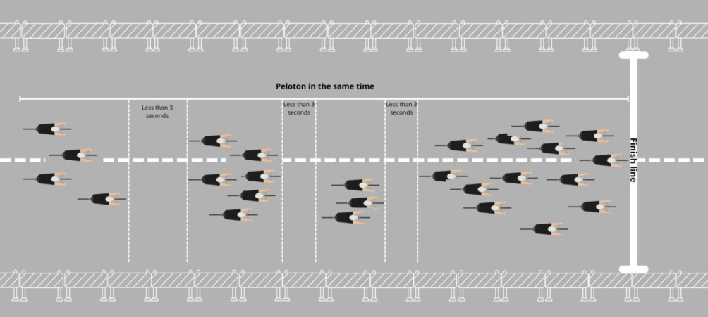
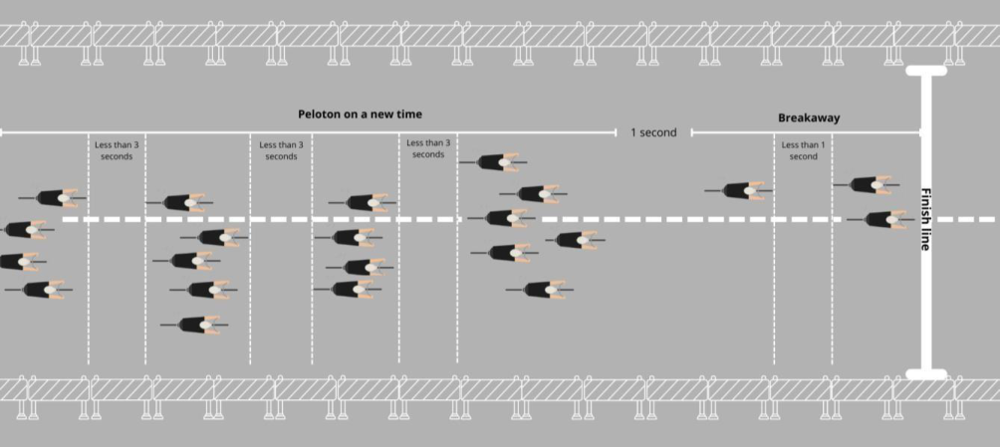

Sprint zone protocol for stages "expected to finish in bunch sprints" Decision of the UCI Management Committee of 18 December 2024 Applicable while published on the UCI website 

## **Implementation of Sprint Zone Protocol** 

## **Introduction and description of the issue** 

The SafeR Commission seeks to reduce the level of danger in bunch sprints during stage races, both for sprinters as well as for riders targeting the general classification and their teams. The definition of the “sprint zone” is when the race enters the final kilometres and specific regulations and protocols will apply as described in this protocol document. 

The causes of dangerous situations can be explained by the following contributing factors: 

- Teams have become more professional and specialised; the standard of riders has become more homogenised and the number of sprinters and sprinters’ teams able to contest the sprint has increased; 

- Most teams form a “train” of riders dedicated to lead out their sprinter; 

- Even teams that do not necessarily have a sprinter are increasingly inclined to use a train to assist their general classification leader, ensuring that they are not on the wrong side of a split at the finish which could cost some seconds. 

- Increase in traffic calming infrastructure - sources of danger for the pelotons - within an ever-greater radius of the race finish sites 

Consequently, the pressure in the final kilometres of stages ending in a bunch sprint is high. The presence of so many riders (sprinters and general classification team leaders) and the jostling for position to get to the front of the peloton increases the danger in certain stages that conclude with a bunch sprint. 

It is nevertheless agreed that the current philosophy of road cycling must be maintained in adapting regulations related to the race finish. Consequently, times must be taken at the finish line; the sprint must also be respected and preserved without being perceived as an exhibition without any sporting consequences. 

In line with the above, the UCI Management Committee approved the implementation of the measures provided for in this protocol according to the terms below. 

Page **1** / 

**Union Cycliste Internationale** 6 janvier 2025 

## **Explanation of changes to the regulations** 

The objective of modifying the time gap calculation is to adapt the method of calculating time gaps at the finish in certain situations (pre-identified bunch sprint) by increasing the time gap required for a split to 3 seconds (instead of 1 second). 

This would mean that a rider who is distanced from the previous rider in front of him by less than 3 seconds would be given the same time. It is useful to translate these time gaps into distances to allow the rule to be clearly visualised. 

Thus, in a sprint at 60 km/h the actual distance between riders represents: 

- A 1-second gap = 17 metres 

- A 3-second gap = 50 metres 

In addition, this protocol shall serve for the application of the **modification, on a trial basis, to the so-called ‘three kilometre’ or ‘sprint zone’ rule** (article 2.6.027 of the UCI Regulations) which applies when a race enters the zone leading to the final sprint and according to which, in the event of a duly noted incident (for example a **fall involving several riders**, mechanical problem or puncture) in the last three kilometres of a road stage (excluding summit finishes), a rider affected is credited with the time of the rider or riders with whom they were riding at the time of the incident. 

It is specified that the incident must be independent of the rider's control of his bicycle or his own physical abilities. 

The organiser (or other stakeholder) who so requests may, if justified, obtain from the UCI an extension of the distance to be taken into account under the aforementioned rule, by extending it up **to a maximum of five kilometres** using 1km increments (e.g.4km or 5km). Any change must be agreed before the start of the race. 

## **Implementation Protocol** 

Provision 1 – Scope of application 

This protocol is implemented by the UCI as from 12 June 2024. The protocol is available for application to approved stage races of the International Calendar. 

Without the application of this protocol, the existing regulations and protocols apply. 

Organisers must request the use of this protocol on their event, and if approved by the UCI will be implemented under the supervision of the Commissaires’ Panel of each concerned event, especially considering: 

- The profile of the stages and the format of the event; 

- The level of the teams; 

- The number of riders in the race and the number of riders per team; 

The UCI may take part in any discussion involving the organiser, teams and riders. 

## Provision 2 – Articles affected 

Appendix 1 below makes this protocol concrete with: 

- Modifications to article 2.6.027, and 

- derogations to both Articles 1.2.107 and 2.3.040 of the UCI Regulations that describe the usual method of calculating time gaps for Road races. 

Page **2** / 

**Union Cycliste Internationale** 6 janvier 2025 

## Provision 3 – “Sprint Zone regulations” 

The extension of the sprint zone must follow the process outlined in the modified article 2.6.027 in appendix 1. The extension must be approved by the UCI during the period. Only stages that are already identified to finish in a bunch sprint and have the time gap extension provision applied in parallel will be accepted. 

The extension of the time gap calculation does not require any extension of the sprint zone, which can remain at 3km. Decisions regarding the application of the time gap calculation during the race are the responsibility of the President of the Commissaires Panel. 

## Provision 4 – Arbitration 

The implementation of this protocol will be conducted by the UCI; the President of the Commissaires’ Panel will interpret situations as necessary and implement any exceptions. 

Provision 5 – The choice of the organiser 

- The organisers who wish to implement this protocol of extending the distances in article 2.6.027 and the calculation of time gaps shall act as follows: 

   - The organiser identifies the stages "expected to finish in bunch sprints"; 

   - The organiser informs the UCI, and if approved; 

   - The organiser informs the President of the Commissaires’ Panel appointed on its event; 

   - The organiser adds the following provision in the special regulations of its event: 

## **Article XX – Stages expected to finish in bunch sprints** 

The following stages have been identified as « expected to finish in bunch sprint » 

- 

   - Stage XX / (sprint zone starts at X km) 

- Stage XX / (sprint zone starts at X km) 

- Etc. 

During these stages, the Sprint zone protocol for stages "expected to finish in bunch sprints" published on the UCI website in the Regulations section will be applied. The distance of the extension provided in article 2.6.027 is noted in the brackets (X km) and the time gap calculation shall apply as provided for the protocol. 

Page **3** / **6** 

**Union Cycliste Internationale** 6 janvier 2025 

## **Appendix 1** 

## **Current Regulations related to time keeping** 

## **Time-keeping** 

- **1.2.107** When several riders finish in a group, all riders in the same group shall be credited with the same time. 

If there is a difference of one second or more between the back of the back wheel of the last rider in a group and the front of the front wheel of the first rider of the following group, the timekeeper-commissaires shall give a new time taken on the first rider of this group. 

Any difference of one second or more (back wheel – front wheel) between riders implies a new time. 

_(text modified on 1.01.05; 1.01.09)_ 

## **Finishes and timekeeping** 

- **2.3.040** All riders in a given bunch shall be credited with the same time when they cross the finishing line. 

Timekeeper-commissaires shall continue to officiate until the broom wagon arrives. They shall also record the times of riders that finish after the set deadlines and shall hand the list of recorded times to the President of the Commissaires' Panel. 

_(text modified on 1.01.05)._ 

## **Derogation from the Regulations** 

## **Timekeeping** 

The timekeeping of stage races shall be conducted in accordance with the provisions established for one-day races at Articles 1.2.107 and 2.3.040 with the exception of stages that fulfil the following condition: 

- The stage is clearly identified as “expected to finish in a bunch sprint” by the organiser in the special regulations of the event; 

## In this situation, the following procedures apply: 

- if a difference of under 3 seconds is noted between the back of the back wheel of a rider and the front of the front wheel of the following rider, the riders are given the same time. This applies for all rider or groups within the race, except where the “special provision for a breakaway rider or group” below applies; 

- If a difference of 3 seconds or more is noted between the back of the back wheel of a rider and the front of the front wheel of the following rider, then the timekeeper shall record a new time gap calculated from the front of the front wheel of the rider and the front of the front wheel of the winner of the stage. 

## Special provisions for a breakaway rider or group: 

- If a clearly established breakaway maintains their advantage until the finish line, and the breakaway rider or group wins the stage, any difference of one second or more (back wheel – front wheel) between riders implies a new time. For the next group and following riders the difference shall be calculated using a difference of 3 seconds as described above. 

Decisions regarding the application of this article shall be issued by the Commissaires' Panel in an independent manner. 

Page **4** / 

**Union Cycliste Internationale** 6 janvier 2025 

## **Regulations for sprint zone with provisions for extension** 

## **Finish** 

- **2.6.027** In the case of a duly noted incident in the last three kilometres of a road race stage, the rider or riders affected shall be credited with the time of the rider or riders in whose company they were riding at the moment of the incident. His or their placing shall be determined by the order in which he or they actually cross the finishing line. 

Is considered as an incident, any event independent of the rider’s control or from ~~the~~ his physical capacity (fall involving several riders, mechanical problem, puncture) and his will of remaining with the riders in whose company he was riding at the moment of the incident. 

Riders affected by an incident, within the meaning of the preceding paragraph, are asked to make themselves known to a commissaire by rising their hand and report to a commissaire after the finish of the stage. 

If, as the result of a duly noted fall and involving several riders in the last three kilometres, a rider cannot cross the finishing line, he shall be placed last in the stage and credited with the time of the rider or riders in whose company he was riding at the time of the fall. 

This article shall not apply where the finish is at the top of a hill-climb. 

Decisions related to this article are taken independently by the commissaires’ panel. 

For stages expected to finish in a bunch sprint, the UCI may decide to extend the distance from three kilometres to five kilometres upon request and if justified by the specific circumstances of the stage, in particular for safety reasons. The organiser of the event and any other stakeholder involved in the event may apply for such extension and submit relevant documentation for assessment of the application, including course map, stage profile, GPX file and any other relevant information or requested by the UCI. 

Applications from the organiser of the event must in principle be submitted prior to the publication of the technical guide. If the application is accepted, the details must be included in the special regulations of the event. 

In case an application is approved after the publication of the technical guide, the details must be published in a race communique prior to the start of the stage. 

_(text modified on 1.01.05; 1.10.11; 1.02.12; 1.01.18, 12.06.24; 01.01.25)._ 

## **Examples of application of time gap extension** 

## – Example no. 1 Finish with compact peloton and bunch sprint 

The rule applies to all riders: 

- any rider who finishes behind the preceding rider with a gap of **less than 3 seconds** is given the **same time** as the preceding rider; 

- any rider who finishes behind the preceding rider with a gap of **3 seconds or more** is given a **new time**. 

Page **5** / 

**Union Cycliste Internationale** 6 janvier 2025 

## – Example no. 2 A clearly established breakaway of a sole rider (or small group of riders) finishes ahead followed by the next group in a bunch sprint 

- The rule applies to the next group after the breakaway in the following manner: 

- if the first rider of the next group is less than 1 second behind the breakaway finishing ahead, the next group is given the **same time** as the rider/group finishing ahead. 

- if the first rider of the next group is **more than 1 second** behind the breakaway finishing ahead, the next group is given a **new time**. 

- Within the next group and all other riders, only time gaps **in excess of 3 seconds** will be considered. 

- For all subsequent groups, only time gaps in excess of 3 seconds will be considered. 

Page **6** / 

**Union Cycliste Internationale** 6 janvier 2025
