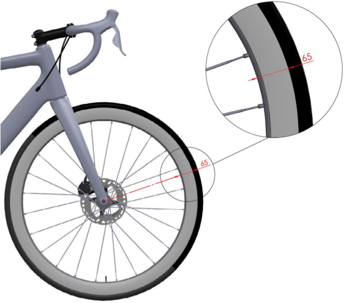

16.06.2025 

## MEMORANDUM 

## **PART 1 GENERAL ORGANISATION OF CYCLING AS A SPORT Rules amendments applying on 01.01.2026** 

## **Chapter III EQUIPMENT** 

## **Section 2: bicycles** 

## **§ 2 Technical specifications** 

- **1.3.017** The distance between ~~the internal extremities of~~ the two legs of the front fork ~~s~~ shall not exceed 11,5 cm, measured from inside to inside; the distance between ~~the internal extremities of~~ the two sides of the rear triangle shall not exceed 14,5 cm, measured from inside to inside. 

For equipment used in track events, the distance between the two legs of the front fork, at the lower extremity, shall not exceed 11,5 cm, measured from inside to inside; the distance between the two sides of the rear triangle, at the rear extremity, shall not exceed 14,5 cm, measured from inside to inside. 

_(text modified on 01.01.16; 01.01.26)_ 

- **1.3.018** Wheels of the bicycle may vary in diameter between 700 mm maximum and 550 mm minimum, including the tyre. For the cyclo-cross the width of the tyre (measured between the widest parts) shall not exceed 33 mm and it may not incorporate any form of spikes or studs. 

In the disciplines road, track and cyclo-cross, only wheel designs granted prior approval by the UCI may be used. 

Wheels approved in mass start competitions in the disciplines of road and cyclocross shall comply with the following requirements: 

- the maximum height of the rim does not measure more than 65 mm (measured as the perpendicular distance from the tangential line passing through any point of the outer extremity of the rim to the inner extremity of the rim), see illustration below; 

- have at least 12 spokes, which can be round, flattened or oval, provided that no dimension of their sections exceeds 10 mm. 

Wheels used in the road, track and cyclo-cross disciplines must meet the impact test requirements as specified in the standard ISO 4210-2:2023 Cycles — Safety requirements for bicycles, section 4.10.7.2.2., paragraph 2. Fulfilment of these requirements concerns both the front wheels and the rear wheels, independent of materials, brake systems and other characteristics. Manufacturers must apply for approval by providing declaration of conformity to the UCI. Detailed procedure and template can be found in the section “Equipment” on the UCI Website. 

In order to comply with the requirements and ensure compatibility between the components, rims must comply with the standard ISO 5775-2 and tyres with the standard ISO 5775-1. 

Wheels which meet the definition of traditional wheels do not need to follow the approval application procedure provided for in this article. 

## **Definition of Traditional wheels:** 

Criteria: Rim height: Less than 25 mm Rim material: Alloy Spokes: Minimum of 20 steel spokes which are detachable General: All components must be identifiable and commercially available 

In track competition, including motor-pacing, the use of a front disc wheel is only permitted in the specialties against the clock. 

Notwithstanding this article, the choice and use of wheels remains subject to articles 1.3.001 to 1.3.003. 

_(text modified on 01.01.02; 01.01.03; 01.09.03; 01.01.05; 01.07.10; 01.10.13; 01.01.16, 25.06.19, 01.01.24; 01.01.26)_
