**UCI CYCLING REGULATIONS** 

## **PART 1 GENERAL ORGANISATION OF CYCLING AS A SPORT Version on 01.07.2026** 

## **TABLE OF CONTENTS** 

||Page|
|---|---|
|**Chapter I** **LICENCE-HOLDERS ................................................................................ 3**||
|§ 1|Licences .............................................................................................................. 3|
|§ 2|Categories of riders ............................................................................................14|
|§ 3|Teams ................................................................................................................16|
|§ 4|Commissaires ....................................................................................................17|
|§ 5|Sports directors ..................................................................................................22|
|§ 6|Technical delegate .............................................................................................24|
|§ 7|Miscellaneous ....................................................................................................24|
|**Chapter II** **RACES .....................................................................................................27**||
|Section 1: administrative provisions ............................................................................27||
|§ 1|Calendar ............................................................................................................27|
|§ 2|Names of races ..................................................................................................32|
|§ 3|Forbidden races .................................................................................................32|
|§ 4|Access to a race .................................................................................................33|
|§ 5|Sanction .............................................................................................................34|
|§ 6|Classifications and cups .....................................................................................34|
|§ 7|National Championships ....................................................................................35|
|Section 2: organisation of races ..................................................................................37||
|§ 1|Organiser ...........................................................................................................37|
|§ 2|Authorisation to organise the event ....................................................................38|
|§ 3|Specific regulations ............................................................................................39|
|§ 4|Programme - technical guide ..............................................................................39|
|§ 5|Invitation – Enrolment.........................................................................................40|
|§ 6|Race headquarters – Secretarial office ..............................................................42|
|§ 7|Course and safety ..............................................................................................42|
|§ 8|Medical service ..................................................................................................43|
|§ 9|Prizes .................................................................................................................43|
|§ 10|Travel and subsistence expenses ......................................................................45|
|Section 3: race procedures ..........................................................................................46||
|§ 1|Supervision of the organisation and competition ................................................46|
|§ 2|Conduct of participants in cycling races..............................................................46|
|§ 3|Team manager ...................................................................................................47|
|§ 4|Team managers' meeting ...................................................................................47|
|§ 5|Entry check ........................................................................................................48|
|§ 6|Start of the race ..................................................................................................48|
|§ 7|Finish .................................................................................................................49|
|§ 8|Awards ceremony ..............................................................................................51|
|Section 4: supervision of races ....................................................................................52||
|§ 1|General provision ...............................................................................................52|
|§ 2|Commissaires' panel ..........................................................................................52|
|§ 3|Powers of the commissaires' panel ....................................................................65|
|Section 5: UCI cups, series and classification .............................................................66||

GENERAL ORGANISATION OF CYCLING AS A SPORT 

E0726 

1 

**UCI CYCLING REGULATIONS** 

|**Chapter III** **EQUIPMENT ............................................................................................67**|**Chapter III** **EQUIPMENT ............................................................................................67**|
|---|---|
|Section 1: general provisions ......................................................................................67||
|§ 1|Principles ...........................................................................................................67|
|§ 2|Technical innovations .........................................................................................68|
|§ 3|Commercialisation ..............................................................................................69|
|Section 2: bicycles.......................................................................................................71||
|§ 1|Principles ...........................................................................................................71|
|§ 2|Technical specifications .....................................................................................72|
|Section 3: riders' clothing ............................................................................................88||
|§ 1|General provisions .............................................................................................88|
|§ 2|Teams registered with the UCI ...........................................................................91|
|§ 3|Regional and club teams ....................................................................................93|
|§ 4|Leaders' clothing ................................................................................................93|
|§ 5|National team clothing ........................................................................................95|
|§ 6|World champion's jersey ....................................................................................95|
|§ 7|National champion's jersey .................................................................................97|
|§ 8|Continental champion's jersey ............................................................................98|
|§ 9|Order of priority ..................................................................................................99|
|§ 10|Sanctions ...........................................................................................................99|
|Section 4: identification of riders ................................................................................ 101||
|**Annexe A UCI LIST OF AUTHORISED BETS ......................................................... 103**||

GENERAL ORGANISATION OF CYCLING AS A SPORT 

E0726 

2 

**UCI CYCLING REGULATIONS** 

## **PART 1 GENERAL ORGANISATION OF CYCLING AS A SPORT** 

## **Chapter I LICENCE-HOLDERS** 

## **§ 1 Licences** 

## **Definition** 

- **1.1.001** The licence is an identity document confirming that its holder undertakes to respect the constitution and regulations and which authorise him to participate in cycling events. 

## **Principles** 

- **1.1.002** No-one who does not hold the requisite licence may participate in a cycling event organised, sanctioned or supervised by the UCI, the UCI continental confederations, the UCI member national federations or their affiliates. 

Participation by a person who does not hold the required licence shall lead to their exclusion or disqualification as well as other penalties and proceedings pursuant to the regulations of the UCI and/or member national federation. Moreover, participation in a cycling event without the required licence shall not allow the individual to escape the jurisdiction of the disciplinary bodies of the UCI or the member national federations. 

_(text modified on 01.01.05; 01.02.26)_ 

- **1.1.003** The licence must be presented whenever requested by a duly authorised person. 

- **1.1.004** Anyone requesting a licence thereby undertakes to respect the constitution and regulations of the UCI, the UCI continental confederations and the UCI member national federations, as well as to participate in cycling events in a sporting and fair manner. They shall undertake, in particular, to respect the obligations referred to in article 1.1.023. 

As from the time of application for a licence and provided that the licence is issued, the applicant is responsible for any breach of the regulations that they commit ~~s~~ and ~~is s~~ ubject to the jurisdiction of the disciplinary bodies. 

Licence holders remain subject to the jurisdiction of the relevant disciplinary bodies for acts committed while applying for or while holding a licence, even if proceedings are started or continue after they cease to hold a licence. 

_(text modified on 01.01.04; 15.10.04; 01.02.26)_ 

- **1.1.005** The licence shall be issued and used under the exclusive responsibility of its holder or his legal representative. 

The granting of the licence shall not imply that the issuing authority recognises or assumes any responsibility as to the aptitude of its holder, or for his compliance with the conditions of any law, statute or regulation. 

- **1.1.006** Federations shall issue licences according to such criteria as they may determine. They shall be responsible for monitoring compliance with these criteria. 

GENERAL ORGANISATION OF CYCLING AS A SPORT 

E0726 

3 

**UCI CYCLING REGULATIONS** 

Before the licence is issued, the applicant and the national federation must ensure _inter alia_ that the applicant is adequately insured against accidents and civil responsibility in every country where they intend to take part in cycling events or train throughout the year for which the licence is issued. 

Once the licence is issued, the licence holder and their team shall be entirely responsible for ensuring that the rider concerned only enters cycling events in countries where the insurance against accidents and for third-party liability are valid. The national federation and the UCI shall not be liable in any manner whatsoever in case a licence holder takes part in a cycling event in a country where their accident insurance or third-party liability insurance are not valid. The licence holder and their team shall be solely and exclusively liable for any such participation in a cycling event. 

_(text modified on 15.10.04; 01.07.11; 01.10.11; 01.01.17; 23.10.19; 01.02.26)_ 

- **1.1.006** A licence as staff or riders’ agent under Article 1.1.010 (1.4 and 1.5) of the UCI **bis** Regulations shall not be granted to a person who has been found guilty or complicit, by a court of law (or other judicial or administrative body), an arbitral tribunal, the UCI AntiDoping Tribunal or any other disciplinary tribunal or authority, in any of the situations defined below. 

   - 1) No licence as staff or riders’ agent shall be granted to a person who: 

      - a. Has been found guilty or complicit of Trafficking or Attempted Trafficking in any Prohibited Substances or Prohibited Method (Article 2.7 UCI Anti-Doping Rules) or equivalent offence, or 

      - b. Has been found guilty or complicit of Administration or Attempted Administration to any rider of a prohibited substance or method (Article 2.8 UCI Anti-Doping Rules) or equivalent offence, or 

      - c. Has been found guilty or complicit of a technological fraud in the sense of Article 12.4.003 of the UCI Regulations or equivalent offense. 

   - 2) No licence as doctor, paramedical assistant or any other health related licenced activity shall be granted to a person who has been found guilty or complicit of any anti-doping rule violation or equivalent offence. 

Notwithstanding the above, the applicant may be granted a licence if the anti-doping rule violation was committed with No Fault or Negligence or no Significant Fault or Negligence and more than 5 years have elapsed since the end of the suspension imposed for the last offense taken into consideration. 

- 3) No licence as riders’ agent, general manager, team manager, coach, sports director or any other managerial, performance or training related licenced activity shall be granted to a person who: 

   - a. Has been found guilty or complicit of an intentional anti-doping rule violation or equivalent offence, or 

   - b. Has been found guilty of multiple non-intentional anti-doping rule violations or equivalent offenses. 

- 4) No licence as mechanic, driver or any other administrative, logistical, support or technical licenced activity shall be granted to a person who: 

GENERAL ORGANISATION OF CYCLING AS A SPORT 

E0726 

4 

**UCI CYCLING REGULATIONS** 

- a. Has been found guilty or complicit at least twice of an intentional anti-doping rule violation or equivalent offence. 

In relation to situations referred to in points 3 and 4 above, a licence may be granted if more than 5 years have elapsed since the end of the suspension imposed for the last offence taken into consideration. 

The National Federation shall immediately inform the UCI of any decision – whether granting or refusing the issuance of a licence - rendered in connection with this article (or for which an assessment of the conditions stated above should reasonably have been made). 

Any such decision may be appealed by the UCI and/or the applicant before the UCI Arbitral Board within 30 days of its notification. 

This article shall apply to all licence applications made after its entry in force. As an exception, the previous version of this article shall be applied whenever any of the offences taken into consideration occurred at least partially before its entry in force and, based on the principle of _Lex Mitior_ , the assessment would be favourable to the applicant. 

As an exception to the above, the waiting period of 5 years to be observed in situations referred to in points 3 and 4 above does not apply to persons having signed an acceptance of consequences with the UCI before the adoption of the present article. 

_(text modified on 15.10.04; 01.07.11; 01.10.11; 01.01.17; 01.10.18; 01.02.26)_ 

- **1.1.007** Federations may make the issue of the licence subject to the payment of a licence fee, the amount of which they shall determine. 

- **1.1.008** The licence shall be valid for one year, from 1 January to 31 December. It shall be valid in all countries where there is a UCI member national federation, without prejudice to article 1.1.006, paragraphs 2 and 3. 

_(text modified on 01.02.26)_ 

- **1.1.009** A licence holder may hold the licence of only one national federation. 

- **1.1.009** National federations shall ensure that all licence-holders are given a UCI ID, which will **bis** appear on their licence. 

The UCI ID is provided by the UCI to the national federation at the time of the first licence application and shall appear on any licence that the person concerned may hold, regardless of the category or the national federation issuing the licence. National federations are then responsible for ensuring that the UCI ID of a licence-holder remains the same. 

_(article introduced on 23.10.19)_ 

## **Categories of licence holders** 

- **1.1.010** A licence shall be required for: 

   - 1.1 A rider (man or woman, all disciplines, all categories) 

   - 1.2 A participant in cycling for all 

   - 1.3 A pacer 

      - A motor-cycle-mounted pacer (motorcycle, moped, derny) 

GENERAL ORGANISATION OF CYCLING AS A SPORT 

E0726 

5 

**UCI CYCLING REGULATIONS** 

## 1.4 Rider’s agent 

- 1.5 Staff 

   1. general manager 

   2. team manager 

   3. coach 

   4. doctor 

   5. paramedical assistant 

   6. mechanic 

   7. driver 

   8. other function to be specified on the licence. 

- 1.6 Officials 

   1. federation administrator (status to be specified on the licence) 

   2. commissaire, judge (status to be specified on the licence) 

   3. Para Cycling classifier (status to be specified on the licence) 

   4. other role (e.g. timing/photo-finish operator, announcer, race radio operator, etc.) to be specified on the licence. 

- 1.7 Organiser 

   1. organisational administrator 

   2. other function to be specified on the licence. 

- 1.8 Other 

   1. Vehicle driver (car, motorbike, etc.) in a road event. 

Should a licence holder carry out multiple roles within cycling, he must apply and be licensed for each of these roles. It shall be the responsibility of the national federation to issue the licence corresponding to the primary role as per the order set out above. In addition to the licence, the national federation shall issue a certificate setting out the other roles for which the licence holder is recognised. 

A rider belonging to a team registered with the UCI may not carry out another role. 

_(text modified on 01.01.00; 15.10.04; 25.06.07; 01.07.11; 01.01.13; 11.02.20)_ 

## **Issuing procedure** 

- **1.1.011** The licence shall be issued by the federation of the country where, according to the legislation of that country, the applicant has their main residence at the time of application. The licence holder shall remain affiliated to that federation until the expiry of the licence, even if they chang ~~es~~ country of residence. 

_(text modified on 01.02.26)_ 

- **1.1.012** National federations shall refuse to issue a licence in the event of an irregular application. 

- **1.1.013** In the case of a country where there is no UCI member federation, the licence shall be issued by the UCI, subject to the applicant taking out the required insurances. 

_(text modified on 01.02.26)_ 

- **1.1.014** Upon receipt of a licence application, the national federation shall respond within 30 days. 

_(text modified on 01.02.26)_ 

- **1.1.015** If the national federation deems that it cannot issue the requested licence, it shall inform the applicant to that effect stating its reasons. Similarly, the applicant shall be invited to defend their application, as appropriate, before such person or commission as may be 

GENERAL ORGANISATION OF CYCLING AS A SPORT 

E0726 

6 

**UCI CYCLING REGULATIONS** 

designated as indicated in the regulations of the federation or, where the regulations contain no such mention, by its president. 

The applicant shall be entitled to consult the application file. They shall be entitled to present their arguments and to enlist the assistance of or be represented by any person of their choice bearing a proper power-of-attorney. 

_(text modified on 01.02.26)_ 

- **1.1.016** The applicant shall be informed of the refusal to issue the licence and provided with the reasons for such decision in writing. 

_(text modified on 01.02.26)_ 

- **1.1.017** A refusal to issue a licence shall be open to appeal before the UCI arbitral board in following cases: 

   - the applicant has had no opportunity to present their arguments; 

   - no reason was given for the decision; 

   - the reasons for the refusal contain factual errors; 

   - the refusal was irregular. 

The appeal shall be lodged within 30 days of reception by the applicant of the refusal. 

The decision of the arbitral board is final and not subject to appeal. 

_(text modified on 01.01.10; 01.02.26)_ 

- **1.1.018** A national federation may bring an appeal, before the UCI arbitral board, against the issuing of a licence by another national federation if the issuing federation did not have territorial jurisdiction or if the licence was irregularly issued. 

This appeal shall be lodged within 15 days of the national federation being informed about the issuanc ~~ee~~ of the licence, but at the latest within three months of the licence being issued. 

The decision of the arbitral board is final and not subject to appeal. 

_(text modified on 01.01.00; 01.01.10; 01.02.26)_ 

- **1.1.019** The issuing of a licence by the UCI shall be subject to the payment of an amount set by the UCI. 

_(text modified on 01.02.26)_ 

- **1.1.020** National federations shall be given access related to information on licences issued by other national federations to individuals which hold the nationality of their country. National Federations are entitled to inform the UCI of any licence which they consider to have been incorrectly issued by another national federation. 

_(text modified on 01.01.00; 01.02.26)_ 

## **Licence** 

- **1.1.021** The licence application shall be made on a form to be prepared by each national federation. The content of such form shall be accepted by the applicant (and the applicant’s legal representative if they are minor), regardless of the form of presentation 

GENERAL ORGANISATION OF CYCLING AS A SPORT 

E0726 

7 

**UCI CYCLING REGULATIONS** 

(electronic or paper). The form must at least include the information and the undertakings stated in the model of articles 1.1.022 and 1.1.023. 

Applications submitted by paper shall be signed and dated by the applicant. 

Electronic application systems shall include as a condition to proceed (i) the full acceptance of the terms of the application form as well as (ii) a traceable report of the details of the application. 

_(text modified on 01.01.18; 25.06.18; 01.02.26)_ 

## **Front (Part I)** 

## **1.1.022 UNION CYCLISTE INTERNATIONALE** 

## **NAME OF THE NATIONAL FEDERATION** 

1. Category for which the licence is requested 

UCI: national: 

2. Surname and first name: 

3. Date of birth: 

4. Nationality: 

5. Gender: 

6. Email address: 

- 6a.  UCI ID (current and past holders of UCI ID): 

- 6b.  UCI ID required (not yet holder of UCI ID but necessary for following season): yes/no 

7. Place and address of main residence at the time of application: 

8. Place and country of the previous main residence if changed in the last year: 

9. Countries in which the applicant has other residences: 

10. Contact person: 

Phone number of the contact person[1] : 

11. National federation that issued the applicant's previous licence: 

12. National federation that has refused to issue a licence during the past three years: 

13.  Applicant's club: 

14.  Applicant's UCI team (name and type): 

15.  If the applicant is currently suspended and will continue to be for all or part of the year of validity of the licence, the name of the authority that imposed the suspension and the starting and ending dates of the suspension: 

16.  Insurance for bodily injury (in and out-patient hospital expenses and medical care, transport costs, permanent disablement, death) and material damages (loss of earnings) in case of accident on the occasion of a cycling competition or event or during training: 

   - name and address of the insurance company: 

   - name and address of the insured party: 

   - duration of validity of the insurance policy, 

   - amount of cover guaranteed 

   - territorial validity. 

17.  Third-party liability insurance for material damage or bodily injury caused to others in the course of a competition or cycling event or during training: 

   - name and address of the insurance company: 

   - name and address of the insured party: 

   - duration of validity of the insurance policy, 

1 I take note that it is strongly recommended to enter a contact person who may be contacted in case of an emergency or an incident involving me during my participation in an event. In this regard, I confirm that the contact person indicated on the form has consented to his identity and contact details being mentioned on my licence. 

GENERAL ORGANISATION OF CYCLING AS A SPORT 

E0726 

8 

**UCI CYCLING REGULATIONS** 

- amount of cover guaranteed 

- territorial validity. 

_(text modified on 15.10.04; 01.01.17; 01.01.18; 01.10.18; 01.02.26)_ 

## **Back (Part II)** 

- **1.1.023** 1. I hereby declare that I am aware of no reason why I should not be granted the requested licence. 

I undertake to spontaneously return my licence in the event of any substantial change to the circumstances existing at the time of the application for a licence. 

I declare that I have not applied for a licence for the same year to the UCI or to any other national federation. 

I assume exclusive liability for this application and for the use that I shall make of the licence. 

2. I hereby undertake to respect the constitution and regulations of the UCI, its continental confederations and its national federations. 

I declare that I have read or have had the opportunity to become acquainted with the aforesaid constitution and regulations. 

I shall participate in cycling competitions or events in a sporting and fair manner. 

I shall comply with all decisions rendered by the UCI and shall take any appeals and litigation before the authorities provided for in the regulations. 

I accept the Court of Arbitration for Sport (CAS) as the sole competent authority for appeals as provided in the UCI Regulations and under the conditions set out in these regulations, and for the rest, by the CAS Code of Arbitration for Sport. 

I agree that any litigation with the UCI shall solely be submitted to the Court of Arbitration for Sport (CAS). 

3. I agree to abide and be bound by the UCI Anti-Doping Rules, as well as all documents adopted by the UCI in connection with its Anti-Doping Rules and in connection with the World Anti-Doping Code. 

I agree to submit to in-competition and out-of-competition testing at any time as provided in the UCI Anti-Doping Rules and related documents. I agree that all samples collected from me under the UCI Anti-Doping Rules are owned by the UCI and that such ownership may be transferred by the UCI to another Anti-Doping Organisation, or ownership transferred from another Anti-Doping Organisation to the UCI. 

4. I acknowledge and consent that my personal data processed as part of my licence application to my national federation shall be passed to and held by the UCI and agree to such information being processed and stored for communication, administration and governance purposes as well as in relation to anti-doping activities, the prevention of the manipulation of competitions and any other governance related-matter. 

I also agree that my personal information may be used and/or transmitted, when necessary and proportionate, subject to appropriate protection and security safeguards, 

GENERAL ORGANISATION OF CYCLING AS A SPORT 

E0726 

9 

**UCI CYCLING REGULATIONS** 

to other entities for the purpose of organising cycling events and promoting cycling, such as but not limited to the organisers of events and service providers, to any entity competent for investigations and/or procedures for a potential violation of the UCI Regulations, such as but not limited to the World Anti-Doping Agency, the national AntiDoping organisations, the Court of Arbitration for Sport, the judicial bodies of the UCI, the national and international authorities as well as in the context of the UCI’s missions related to the administration and governance of cycling. 

I have taken note that I may contact the UCI at the following address in order to exercise my right to request access, rectification or deletion of my personal information: data.protection@uci.ch. 

_(text modified on 01.01.00; 13.08.04; 15.10.04; 01.01.17; 01.01.18; 25.06.18 ; 17.06.24)_ 

## **Form of licence** 

- **1.1.024** The licence shall be in the form of a credit card. It shall include the following data: 

GENERAL ORGANISATION OF CYCLING AS A SPORT 

E0726 

10 

**UCI CYCLING REGULATIONS** 

On the front 

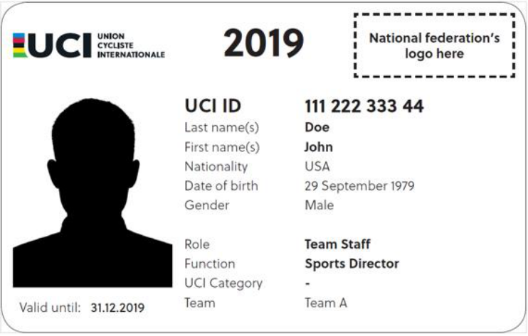

On the back 

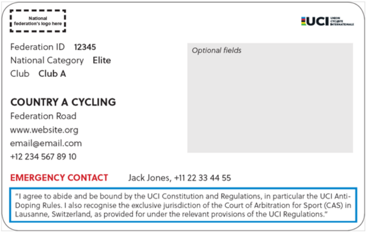

All National Federations must produce licenses which are materially the same as the format presented above. The license year must be in the position and of the font size shown. If a Federation wishes to issue licenses with a QR code or a bar code, space is provided on the reverse of the license for this purpose. 

National Federations may issue electronic licenses (i.e. smart phone compatible) in place of material licences. Electronic licences shall feature the same licence format as presented above. 

National Federations shall be responsible for ensuring the validity of electronic licences and every aspect related to security pursuant to the relevant applicable laws. 

_(text modified on 06.10.97; 01.01.04; 13.08.04; 15.10.04; 01.01.17; 01.01.18; 01.10.18; 05.02.19; 01.01.20)_ 

GENERAL ORGANISATION OF CYCLING AS A SPORT 

E0726 

11 

**UCI CYCLING REGULATIONS** 

- **1.1.025** The licence shall be written in French or English. Other language versions of its text may also appear. 

_(text modified on 06.10.97; 15.10.04)_ 

- **1.1.026** [article abrogated on 01.01.18] 

- **1.1.027** (N) The national federation shall determine whether the photograph of the holder has to appear on the licence. Should the photograph not be required, the holder must always be able to present the licence together with another ID document bearing their photo. 

_(text modified on 01.02.26)_ 

## **Disclosure** 

- **1.1.028** National federations shall ensure that the UCI ID and relevant contact details, such as address and email address, of all licence-holders are disclosed to the UCI and that such information is maintained up-to-date. 

_(text modified on 23.10.19)_ 

- **1.1.028** Each national federation shall inform the UCI within one week of the identity of the **bis** licence-holders whose licence is withdrawn, or who returned their licence. 

_(article introduced on 01.01.09; 01.02.26)_ 

## **Penalties** 

- **1.1.029** The following infringements shall be penalised as indicated below: 

   - 1) participation or attempt to participate, in a cycling competition or event without holding the requisite licence: 

      - start refused, exclusion or disqualification and 

      - if deemed appropriate by the UCI of the national federation, a waiting period of one year before obtaining a licence. 

   - 2) participation or attempt to participate, in a cycling competition or event without carrying the licence: 

      - start refused, exclusion or disqualification 

      - And 

      - fine of CHF 50 to 100. 

_(text modified on 15.10.04; 01.01.18; 01.02.26)_ 

## **Sundry provisions** 

- **1.1.030** National federations may permit, under such conditions as they may determine, persons who take part in cycling events only occasionally to take part in a particular event at national level without holding a licence valid for a whole year. These conditions must include agreement to abide by the regulations of the UCI and the national federation and suitable insurance for the whole day or all days of the event. 

_(text modified on 01.01.05)_ 

- **1.1.031** Articles 1.1.011 to 1.1.029 shall not apply to riders in the youth category, such matters being governed by the national federations. 

- **1.1.032** [article abrogated on 01.02.26] 

GENERAL ORGANISATION OF CYCLING AS A SPORT 

E0726 

12 

**UCI CYCLING REGULATIONS** 

- **1.1.033** All licence ~~-~~ holders shall be assigned the sporting nationality corresponding to their nationality, regardless of the national federation that issues the licence. The sporting nationality shall be assigned upon issuance of the first licence. A rider holding multiple nationalities shall be required to choose between them on the occasion of first applying for a licence. A stateless licence ~~-~~ holder shall be assigned the sporting nationality of the country in which he has continuously resided since at least five years. 

For any cycling event where a rider represents his national team, the rider may only be selected by the federation of their sporting nationality. 

A rider shall be subject to the regulations and disciplinary procedures of the national federation of their nationality in all matters concerning selection for the national team. 

A rider recognised as refugee in their country of residence (by the relevant state authorities or the UNHCR) may choose between the sporting nationality corresponding to their nationality or be classified as “refugee” for the purpose of sporting nationality pursuant to this article. In such a case, the rider shall be entitled to compete in events with participation of national teams when provided for under the UCI Regulations (e.g., participation rules and/or qualification systems). 

_(text modified on 08.06.00; 01.01.04; 01.10.11; 01.05.14; 01.01.19; 05.02.19; 01.03.22; 01.01.23; 01.02.26)_ 

- **1.1.033** A. A rider may request a change of sporting nationality to the UCI in the following cases **bis** and under one of the following conditions: 

   - a. if the civil nationality in question is lost for any reason, the rider may choose the sporting nationality of another nationality which they hold; 

   - b. if the rider was a minor at the time of first applying for a licence, the rider may choose a different nationality which they hold when making a first application for a licence after they reach the age of majority; 

   - c. if the rider holds another nationality without letters a. or b. applying, subject to the following limitations and restrictions: 

      - such a change of nationality may be made no more than twice in a career; 

      - if a rider has previously been entered by their national federation and represented their national team in any of the following events: Olympic Games, Continental or Regional Games, World Championships, Continental Championships, World Cup, in any category (Junior, U23, Elite, Masters), the rider shall not be eligible for selection with another national team in the subsequent edition of each of the World Championships and/or Continental Championships (in all disciplines and categories), starting as from the confirmation of the change of nationality by the UCI. This restriction shall not apply in case of a change of sporting nationality from refugee status to the nationality of the country of residence after being granted nationality in said country. 

      - in case of a second change of nationality under letter c., the rider’s ineligibility for participation in World Championships and Continental Championships shall apply to the two subsequent editions of each event, starting from the confirmation of the change of nationality by the UCI. 

GENERAL ORGANISATION OF CYCLING AS A SPORT 

E0726 

13 

**UCI CYCLING REGULATIONS** 

In addition to the above, restrictions may apply for multi-sport events in accordance with the relevant organisation’s regulations. The determination of a country that a rider can represent at the Olympic Games, Continental Games or Paralympic Games and any potential restriction on participation in such events are governed by either the Rule 41 of the Olympic Charter and its by-laws (for the Olympic and Continental Games) or the Chapter 3.1 of the International Paralympic Committee (IPC) Handbook (for the Paralympic Games). 

- d. if the rider is recognised as a refugee in the country of residence, the rider may choose to be classified under sporting nationality of “refugee” pursuant to article 1.1.033. 

- B. In order to formalise a change of nationality, the following documents must be submitted to the UCI: 

- Proof of eligibility for the nationality chosen ~~,~~ (ex: passport or certificate issued by a ministry, consulate, embassy, etc.) 

- A formal statement by the applicant, signed and dated, expressing the choice of nationality and acknowledging the restrictions imposed on participation, if applicable. If an applicant intends for the change of nationality to be effective from a specific date, the latter shall make such request to the UCI at least three months before the said date. Once the change of nationality is confirmed, the UCI will notify the applicant and the national federations concerned. 

In the event of a change of nationality, the rider retains the individual points acquired until then. The points acquired by the nation of the former nationality are retained by the latter. 

_(article introduced on 01.03.22 and modified on 01.01.23; 01.02.26)_ 

## **§ 2 Categories of riders** 

## **Competitive cycling** 

- **1.1.034** For participation in events on the international calendar, riders' categories are determined by the age of those competing as defined by the difference between the year of the event and the year of birth of the rider, with the exception of cyclo-cross events pursuant to article 5.1.001. 

_(text modified on 01.01.05; 01.01.17; 01.02.26)_ 

- **1.1.034** For participation in events on the international calendar and national championships, **bis** riders shall be required to hold a valid UCI licence as well as a UCI ID. 

_(article introduced on 01.01.17; 01.02.26)_ 

- **1.1.035** Without prejudice to relevant legal provisions and exceptions below, only riders aged 17 or more who hold a licence for one of the international categories under articles 1.1.036 or 1.1.037 have the right to take part in events on the international calendar. 

In international Trials and BMX Racing, BMX Freestyle, Indoor Cycling and Para Cycling events, riders may be aged 16 or less. 

GENERAL ORGANISATION OF CYCLING AS A SPORT 

E0726 

14 

**UCI CYCLING REGULATIONS** 

In events where electrically powered assisted cycles (EPAC) are used, riders shall be 19 or more. 

_(text modified on 01.01.05; 01.01.17; 01.01.19, 01.01.25; 01.02.26)_ 

## **Men** 

## **1.1.036  Youth** 

This category denotes riders aged 16 years or under and is governed by national federations, except as provided for Trials BMX Racing, BMX Freestyle, Indoor Cycling and Para Cycling in article 1.1.035. 

## **Junior (MJ: Men Junior)** 

This category shall comprise riders aged 17 and 18. 

The category is not used in disciplines where riders are considered Elite from such age or younger. 

## **Under 23 (MU: Men Under 23)** 

This category shall comprise riders aged 19 to 22. 

The category is not used in disciplines where riders are considered Elite from such age or younger. 

## **Elite (ME: Men Elite)** 

This category shall comprise riders aged 23 and above, except as provided for BMX Racing, BMX Freestyle and Trials in the respective regulations for the disciplines. 

## **Masters (MO: Men Open)** 

This category shall comprise Men Masters with the addition of all riders who are not eligible to compete in Women Masters events pursuant to the UCI Regulations. This category shall comprise riders of 30 years and above who elect this status. The choice of masters status shall not be open to a rider belonging to a team registered with the UCI. Masters riders shall only be entitled to take part in Masters events. 

## **Para Cyclists** 

This category shall comprise riders with disabilities as specified by the UCI functional classification system described in part 16, chapter V. 

A Para Cyclist may, or may not for health and safety reasons, be issued with an additional category from the current list, regarding the established integration procedure. This depends on the degree and nature of the disability. 

_(text modified on 01.01.03; 01.01.04; 01.01.05; 25.06.07; 01.07.13; 01.01.15; 01.03.16; 01.01.19; 10.06.21; 17.07.23; 01.02.26)_ 

## **Women** 

## **1.1.037  Youth** 

This category denotes riders aged 16 years or under and is governed by national federations, except as provided for Trials, BMX Racing, BMX Freestyle, Indoor Cycling and Para Cycling in article 1.1.035. 

## **Junior (WJ: Women Junior)** 

This category shall comprise riders of 17 and 18 years old. 

The category is not used in disciplines where riders are considered Elite from such age or younger. 

GENERAL ORGANISATION OF CYCLING AS A SPORT 

E0726 

15 

**UCI CYCLING REGULATIONS** 

## **Under 23 (WU: Women Under 23)** 

Unless otherwise provided in the UCI Regulations, this category shall comprise riders aged 19 to 22. 

The category is not used in disciplines where riders are considered Elite from such age or younger. 

## **Elite (WE: Women Elite)** 

This category shall comprise riders aged 23 and above, except as provided for BMX Racing, BMX Freestyle and Trials in the respective regulations for the disciplines. 

## **Masters (WM: Women Masters)** 

Unless otherwise provided in the UCI Regulations, this category shall comprise riders of 30 years and above who elect this status. The choice of masters status shall not be open to a rider belonging to a team registered with the UCI. Masters riders shall only be entitled to take part in Masters events. 

## **Para Cyclists** 

This category shall comprise riders with disabilities as specified by the UCI functional classification system described in part 16, chapter V. 

A Para Cyclist may, or may not for health and safety reasons, be issued with an additional category from the current list, regarding the established integration procedure. This depends on the degree and nature of the disability. 

_(text modified on 01.01.03; 15.10.04; 25.06.07; 01.07.13; 01.01.17; 01.01.19; 10.06.21; 01.02.26)_ 

- **1.1.038** Designations may be adapted in national languages according to linguistic constraints. 

## **Cycling for all** 

- **1.1.039** A cycling for all licence is issued to the cyclists practising cycling as a leisure activity. This licence shall give access only to events on the cycling for all calendar. 

_(text modified on 01.01.05)_ 

## **§ 3 Teams** 

## **Definitions** 

- **1.1.040** Under these regulations a team is a sports organisation comprising riders and persons supporting them with the aim of taking part in cycling events. Depending on the context the term "team" may also denote the riders of a team who are taking part in a given event. 

_(article introduced on 01.01.05)_ 

## **Teams registered with the UCI** 

- **1.1.041** The following teams are teams registered with the UCI: 

UCI WorldTeams: articles 2.15.047 and seq. 

UCI Women’s WorldTeams: articles 2.13.128 and seq. UCI ProTeams: articles 2.16.001 and seq. UCI Women’s ProTeams: articles 2.19.001 et seq. 

UCI continental teams and UCI women’s continental teams: articles 2.17.001 and seq. 

GENERAL ORGANISATION OF CYCLING AS A SPORT 

E0726 

16 

**UCI CYCLING REGULATIONS** 

UCI mountain ~~-b~~ ike teams: articles 4.18.001 and seq. 

UCI track teams: articles 3.7.001 and seq. 

UCI cyclo-cross teams and UCI cyclo-cross professional teams: articles 5.5.001 and seq. 

The reference to the UCI in the name of the categories of teams above refers only to the fact that the team has been registered with the UCI under the present regulations. 

_(text modified on 01.01.05; 01.07.10; 01.01.15; 01.07.18; 01.02.26)_ 

- **1.1.042** Riders who are part of teams registered with the UCI may not enter into commitments with organisers, whoever they may be, to take part in an event unless they have obtained prior consent from their team. That agreement shall be considered to have been granted if, on being duly requested, no answer has been received within ten days. 

Any rider in breach of this regulation shall be fined from CHF 300 to 5,000 and may be disqualified, without prejudice to specific provisions for each discipline and/or category of teams and/or events. 

_(article introduced on 01.01.05; 01.02.26)_ 

- **1.1.043** A rider whose team is entered in a race may not participate independently of the team. Breaches are sanctioned with a fine from CHF 300 to 2,000 and may be disqualified. 

_(article introduced on 01.01.05; 01.02.26)_ 

## **National team** 

- **1.1.044** A national team is a team of riders selected by the national federation of their nationality. 

_(article introduced on 01.01.05)_ 

## **Regional team** 

- **1.1.045** A regional team is a team of riders selected by a territorial or other division of a national federation and composed of riders licensed by that federation who do not belong to a team registered with the UCI in the same discipline. 

_(article introduced on 01.01.05; 01.02.26)_ 

## **Club team** 

- **1.1.046** A club team is a team affiliated to a national federation. Its composition shall be regulated by the national federation, except insofar as the riders may not belong to a team registered with the UCI. 

_(text modified on 01.01.05)_ 

## **§ 4 Commissaires** 

_(numbering of articles modified on 01.01.05)_ 

[articles 1.1.112 and 1.1.122 abrogated on 01.01.04, previous article 1.1.125 on 01.01.05] 

- **1.1.047** The commissaire is an official appointed by the UCI or a national federation to ensure that cycling events comply with the provisions of the regulations that may apply. 

GENERAL ORGANISATION OF CYCLING AS A SPORT 

E0726 

17 

**UCI CYCLING REGULATIONS** 

Such appointment shall be based on the criteria established by the UCI or the national federation, if any, and may be withdrawn at its discretion. 

( _text modified on 25.06.19)_ 

- **1.1.048** Commissaires, both individually and/or in a panel shall direct the sporting aspects of cycling events and ensure that the event be in all respects conducted according to the regulations. They shall, in particular, ensure that the regulations specific to a race, the manner in which it is conducted and all technical provisions relating thereto comply strictly with the applicable provisions of the regulations. 

Commissaires shall record breaches of the regulations and pronounce the foreseen penalties. 

- **1.1.049** The commissaires' panel shall comprise of commissaires appointed to supervise a given cycling event. 

It shall record decisions of individual commissaires and shall apply and/or confirm the penalties imposed. 

_(text modified on 01.01.26)_ 

- **1.1.050** Each commissaire shall act neutrally and independently. They may in no way be involved in the organisation of the race. They shall immediately decline their appointment if they are aware of any aspect that could cast doubt on their neutrality. 

( _text modified on 25.06.19)_ 

- **1.1.051** The title of national commissaire shall be conferred by the national federation competent to issue his licence. 

   - National federations shall determine the eligibility, status and functions of commissaires in accordance with the principles mentioned above. 

_(text modified on 01.01.17)_ 

- **1.1.052** Except where an exemption is granted by the UCI, a commissaire other than a ~~n~~ UCI international commissaire may officiate only in the country of their national federation. 

_(text modified on 01.01.05; 01.02.26)_ 

## **Elite national commissaires** 

- **1.1.052** The title of elite national commissaire shall be conferred by the UCI in the disciplines **bis** determined by the UCI, to persons having successfully completed a course approved by the UCI and given by an instructor appointed by the UCI. Such qualification shall be a requirement for candidates for qualification as UCI international commissaire in the disciplines of Road, Track, MTB and BMX Racing. 

To be able to be admitted to the selection procedure to become an elite national commissaire, the concerned person has to meet the following conditions: 

- be a national commissaire licence holder of a UCI affiliated national federation; 

- - be proposed by that national federation; 

- have a command of the course language (French, English or Spanish). 

_(article introduced on 01.01.17; text modified on 01.01.19; 05.02.19; 01.02.26)_ 

GENERAL ORGANISATION OF CYCLING AS A SPORT 

E0726 

18 

**UCI CYCLING REGULATIONS** 

## **UCI international commissaires** 

## **Conditions of appointment** 

- **1.1.053** The title of UCI international commissaire shall be conferred by the UCI to persons having passed the examination and the practical assessment referred to in article 1.1.058. 

_(text modified on 01.01.07; 11.02.20)_ 

- **1.1.054** To be able to be admitted to the selection procedure to become UCI international commissaire, the concerned person has to meet the following conditions: 

   1. be a national, respectively an elite national commissaire license holder of a UCI affiliated national federation; 

   2. be proposed by that national federation. This federation is required to submit an application signed by its president or a person delegated by its president which shall include the following documentation: 

      - a copy of an official identity document (passport, etc.) showing that the person - is aged between 25 and 50 years in the year of his selection by the UCI; 

      - for the disciplines of Road, Track, MTB and BMX Racing: qualification of elite national commissaire obtained after having successfully completed an elite national commissaire course approved by the UCI given by an instructor appointed by the UCI; 

      - evidence that he has served actively as a national respectively elite national commissaire in the two years preceding the selection; 

   3. have an excellent knowledge of the UCI regulations; 

   4. have a command of the official course language, which will be one of the two official UCI languages (French or English). 

The final selection of candidates is undertaken by the UCI based on the needs, the files received, the places available. Additional criteria might be established specifically for the course. 

If a false statement is made, the candidate shall be excluded from every course or examination. If applicable, he shall be stripped of the title of international commissaire. 

_(text modified on 01.01.03; 01.04.05; 01.01.07; 30.01.09; 01.01.10; 01.02.11; 01.02.13; 01.01.17; 01.01.19; 01.02.26)_ 

- **1.1.055** [article abrogated on 01.01.17] 

## **Training courses** 

- **1.1.056** The training courses shall cover both the theoretical knowledge of the regulations and their practical application in the field. 

_(text modified on 01.01.17)_ 

- **1.1.057** Class and examination sessions shall be organised separately for each different type of programme. 

The syllabus for each training course shall comprise a general part common to all disciplines and a special part specific to each discipline/category: General part: 

- UCI constitution (general) 

- general organisation of cycling as a sport 

- world championships 

GENERAL ORGANISATION OF CYCLING AS A SPORT 

E0726 

19 

**UCI CYCLING REGULATIONS** 

   - continental championships 

   - Olympic and Paralympic Games (for Olympic disciplines) 

   - discipline and procedures 

   - sports safety and conditions 

   - antidoping controls (general) 

   - the psychological aspects and ethics of the position of international commissaire 

- Disciplines / categories 

   - road 

   - track 

   - mountain bike 

   - cyclo-cross 

   - BMX Racing 

   - BMX Freestyle 

   - trials 

   - cycle-ball 

   - artistic cycling 

   - para cycling 

_(text modified on 01.01.05; 01.01.07; 25.06.07; 01.01.17; 01.02.26)_ 

- **1.1.058** The UCI shall set the examination requirements and standards for each course. Examination shall comprise a theoretical part (written and oral) and a practical part. In the event of failure, the candidate shall be permitted to retake the examination a second time, subject to the requirements of article 1.1.054. Two failures in the same discipline shall result in the exclusion for the examinations in that discipline. 

_(text modified on 01.01.03; 01.01.17; 01.01.19)_ 

- **1.1.059** Within 24 months of passing the theoretical examination for international commissaires, the candidate has to pass a practical exam in an international event. 

   - A UCI appointed assessor shall evaluate the candidate. In the event of failure, the candidate shall be permitted to resit the practical exam only once. 

_(text modified on 01.01.07; 30.01.09; 01.01.17; 01.02.26)_ 

- **1.1.060** [article abrogated on 01.01.17] 

- **1.1.061** International commissaires shall be periodically assessed to guarantee that they meet the required skill levels and in order to keep their qualification. 

Commissaires are invited to attend seminars for training and improving skills on a regular basis. These seminars conclude by an assessment of proficiency. 

Commissaires are assessed in writing, orally or in practice at an event. 

The seminars for training and improving skills, as well as assessments, are led by UCI tutors and assessors appointed by the UCI. 

Commissaires who do not take part in the seminars for training and improving skills or are not deemed to hold the required skill levels, are not reappointed by the UCI. 

If necessary, the qualification of UCI international commissaire may be withdrawn. 

_(text modified on 01.01.04; 01.01.07; 01.01.17; 01.02.26)_ 

GENERAL ORGANISATION OF CYCLING AS A SPORT 

E0726 

20 

**UCI CYCLING REGULATIONS** 

## **1.1.061** [article abrogated on 01.01.17] 

## **bis** 

## **Status** 

- **1.1.062** At the maximum, a UCI international commissaire can exercise in two disciplines. Except for Road and Track commissaires who can at the same time exercise in Paracycling. A UCI international commissaire cannot at the same time: 

   - be the holder of a licence as a rider of a team registered with the UCI or be member of a national team; 

   - exercise any technical function (team assistant, mechanic, paramedical assistant, team manager, etc.) for a national federation or a team registered with the UCI. 

   - exercise the function of president or vice president within a national federation or continental confederation. A UCI international commissaire may not carry out another role on the occasion of an international event. 

_(text modified on 01.01.00; 01.01.05; 01.01.07; 01.07.07; 25.06.07; 01.02.13; 01.01.17; 01.01.19; 01.02.26)_ 

- **1.1.063** Members of the UCI management committee as well as UCI staff members may not officiate as international commissaires. 

   - _(text modified on 06.10.97)_ 

- **1.1.064** The active career of an international commissaire and elite national commissaire shall end on 31 December of the year in which he reaches the age of 70. 

_(text modified on 01.01.07; 01.02.11; 01.10.11; 08.02.21; 10.06.21)_ 

- **1.1.065** All international commissaires shall be subject to UCI’s jurisdiction and discipline when appointed on an international event. 

_(text modified on 01.01.17; 01.02.26)_ 

- **1.1.066** International commissaires shall at all times, even when not officiating as such, comply with the UCI Regulations, the Code of conduct for Commissaires and shall not cause any material or moral prejudice whatsoever to cycling as a sport or to the UCI. 

_(text modified on 01.02.07; 26.01.07; 01.01.17; 23.10.19)_ 

- **1.1.067** Any breach of article 1.1.066 may be referred to the UCI Disciplinary Commission which may impose a suspension of up to 12 months, the withdrawal of the status of UCI International Commissaire, as well as any other disciplinary measure provided in Part XII of the UCI Regulations. 

_(text modified on 06.10.97; 01.01.03; 01.01.10; 01.01.17; 23.10.19)_ 

- **1.1.068** [article abrogated on 01.01.17] 

## **Mission** 

- **1.1.069** The title of UCI international commissaire shall not in itself confer the right to be entrusted with a mission. 

- **1.1.070** The commissaires shall be designated by the UCI and/or by the national federation for supervision of races on the international calendar, as indicated in article 1.2.116. 

GENERAL ORGANISATION OF CYCLING AS A SPORT 

E0726 

21 

**UCI CYCLING REGULATIONS** 

Members of the commissaires’ panel for continental championships shall be designated by the continental confederation. 

_(text modified on 15.10.04; 01.02.11; 01.01.17; 23.10.19)_ 

- **1.1.071** An international commissaire, if not appointed by the UCI, may be appointed by their national federation to officiate in their country. 

_(text modified on 01.02.26)_ 

- **1.1.072** A UCI international commissaire may not accept a mission abroad without the agreement of their national federation and of the UCI, other than when appointed by the UCI. Without the agreement of the UCI, the measures listed in article 1.1.066 can be applied. 

_(text modified on 01.02.11; 01.02.26)_ 

- **1.1.073** International commissaires appointed for a mission by the UCI shall be entitled to reimbursement of their expenses, the amounts and payment conditions of which shall be determined by the management committee. 

- **1.1.074** International commissaires appointed by the UCI and national federation in their respective discipline as detailed in article 1.2.116, shall wear the official uniforms provided by the UCI. Such uniforms may be worn solely during such missions. 

_(text modified on 01.01.19)_ 

- **1.1.074** National commissaires and elite national commissaires shall wear the official uniform **bis** provided by the national federation in their respective discipline. The UCI logo should not appear on such uniforms. 

(article introduced on 01.01.19) 

   - **§ 5 Sports directors** 

- **1.1.075** Each team, except regional teams and club teams, must nominate a single person as sports director. 

If, within a team more than one person carries the title of sports director, the team shall designate one person as the head sports director. Other individuals are described as assistant sports director. Without prejudice to the terms of Article 1.1.077, the provisions of this section apply to the head sports director. 

The rules related to each category of UCI registered teams may require other roles, including that of manager. The roles of sports director and manager can either be held by the same persons or by distinct individuals. 

_(text modified on 15.10.04; 01.01.13; 01.02.26)_ 

- **1.1.076** No team shall be registered with the UCI or recognised by it as a national team if no team manager has been appointed. 

No team may take part in events on the international calendar if it has not appointed a team manager. 

_(text modified on 15.10.04)_ 

GENERAL ORGANISATION OF CYCLING AS A SPORT 

E0726 

22 

**UCI CYCLING REGULATIONS** 

- **1.1.077** Sports directors shall hold the appropriate licence. 

Sports directors and assistant sports directors of UCI WorldTeams, UCI Women’s WorldTeams, UCI Women’s ProTeams and UCI ProTeams must also have successfully passed the UCI examination. 

Sports directors and assistant sports directors of UCI WorldTeams, UCI Women’s WorldTeams, UCI Women’s ProTeams and UCI ProTeams who intend to be registered as such for the first time must pass the examination the year before taking on the role. 

The registration of Sports Directors and assistant sports directors of UCI WorldTeams, UCI Women’s WorldTeams, UCI Women’s ProTeams and UCI ProTeams shall only be confirmed by the UCI if the examination is successfully passed. 

_(text modified on 15.10.04; 01.01.13; 01.01.15; 01.01.17; 01.07.18; 01.01.20; 01.10.22; 01.07.24; 01.02.26)_ 

- **1.1.078** Besides the tasks and responsibilities which are provided for in the regulations, the team manager shall be responsible for the organisation of the sporting activities and for the social and human conditions in which the riders practise the sport of cycling within the team. 

_(text modified on 01.01.05)_ 

- **1.1.079** The team manager shall constantly and systematically strive, wherever possible, to improve social and human conditions and protect the health and safety of the team's riders. 

_(text modified on 01.01.05)_ 

- **1.1.080** The team manager shall ensure that the regulations are complied with by all those who belong to the team or who work for it in whatever capacity. 

He shall set an example to the others. 

_(text modified on 01.01.05)_ 

- **1.1.081** The team manager shall ensure that there is specialist assistance for the team in the following areas: medicine, treatment in accordance with article 13.3.001 and equipment. He shall ensure that assistance is given by qualified persons and, where required, holders of a licence in accordance with the regulations. 

_(text modified on 01.01.04; 01.01.05)_ 

- **1.1.082** The team manager shall ensure that tasks are appropriately divided between all the persons mentioned in article 1.1.080, with the exception of the riders. The tasks for each person shall be clearly specified and respect the regulations. Those persons with titles shall be listed by name. The division of tasks shall be in written form. A copy shall be given to all persons mentioned in 1.1.080. A copy shall also be submitted to the national federation. Teams registered with the UCI and national teams shall also submit a copy to the UCI. 

_(text modified on 01.01.05)_ 

GENERAL ORGANISATION OF CYCLING AS A SPORT 

E0726 

23 

**UCI CYCLING REGULATIONS** 

- **1.1.083** The team manager shall regularly consult all persons mentioned in article 1.1.080 regarding human and social conditions, equipment, risks involved in cycling and the competition schedule for each rider. He shall make a report on each consultation. Upon their request, a copy of the reports shall be submitted to the national federation or the UCI. 

_(text modified on 01.01.05)_ 

- **1.1.084** Any failure by a team manager to meet the obligations imposed under this paragraph shall be penalised by a suspension of between 8 days and ten years, and/or a fine of between CHF 500 and 10,000. In the event of a subsequent offence occurring within two years of the first, the team manager shall be suspended for a period of at least six months or excluded permanently and fined between CHF 1,000 and 20,000. 

_(text modified on 01.01.05)_ 

- **1.1.085** Any person or team failing to respect the division of tasks under article 1.1.082 will be penalised by a suspension of between one month and one year and/or a fine of between CHF 750 and 10,000. If a second infraction is committed within two years, it will be penalised with a suspension of between six months minimum or with permanent exclusion and a fine of between CHF 1,500 and 20,000. 

_(text modified on 01.01.05)_ 

- **1.1.086** The team manager may be held responsible for infractions committed by persons indicated in article 1.1.080 and shall be penalised under the provisions for the infraction in question, unless they can demonstrate that the infraction could not have been avoided through reasonable actions and that their actions (or omission) did not contribute to the infraction being committed in any way. 

_(text modified on 01.01.05; 01.02.26)_ 

## **§ 6 Technical delegate** 

- **1.1.087** The UCI may appoint a technical delegate to any cycling event. The role of the technical delegate is defined in the respective Parts of the regulations for each discipline. 

( _article introduced on 01.01.15_ ) 

## **§ 7 Miscellaneous** 

_(§ introduced on 01.01.19)_ 

## **Betting** 

- **1.1.088** Anyone subject to the UCI regulations may not be involved in the organisation of bets on cycling competitions. In particular, it is forbidden to: 

   - hold direct or indirect financial interests in betting activities insofar as such betting activity concerns cycling; 

   - take part in or assist in the determination of the betting odds offered on a cycling event. 

In addition, it is forbidden for licence-holders to place bets or agree with a third person for a bet to be placed in relation to the following events: 

GENERAL ORGANISATION OF CYCLING AS A SPORT 

E0726 

24 

**UCI CYCLING REGULATIONS** 

- a) Events in which their team may participate or in relation to which they are directly involved in another manner; 

- b) All national, continental and world championships of his discipline(s); and 

- c) All multisport events in which they participate ~~s~~ in relation to which they are otherwise involved. 

Violations to the present article may be sanctioned with a fine of CHF 2’000 to CHF 200’000 and/or a suspension of 8 days to 1 year. Violations to the first paragraph of the present article by an organiser may also be sanctioned with a withdrawal of their events’ registration. 

_(text modified on 11.02.20; 01.02.26)_ 

## **Sponsorship** 

- **1.1.089** Without prejudice of the applicable law, no brand of tobacco, spirits, pornographic products or any other products that might damage the image of the UCI or the sport of cycling in general shall be associated directly or indirectly with a licence-holder, a UCI team or a national or international cycling competition. 

As defined in the present article, a spirit is a beverage with a content in alcohol of 15% or more. 

- **1.1.090** 1. Sponsorship by betting companies (including national lotteries) is forbidden if the betting company holds any shares or any contractual arrangements which grant it a right to take part directly or indirectly in the management or decision-making of the organiser, team or licence-holder concerned, unless the betting operator abstains from organising bets in relation to events of the organiser concerned or in relation to the events in which the team or the licence-holder concerned takes part and, with regard to any other cycling event, complies with the list of authorised bets drawn up by the UCI Management Committee.. 

2. In all other cases, sponsorship by betting companies is authorised provided the sponsor complies with the list of authorised bets drawn up by the UCI Management Committee, published as Annexe A of the present Part of the UCI Regulations. It is consequently forbidden to be sponsored by a betting company which organises bets on events which do not appear on the said list and/or types of bets which do not appear on the list. 

3. In addition, any organiser, team or licence-holder wishing to be sponsored by a betting company shall: 

- ensure that the betting operator is affiliated to one or several competent national monitoring authorities for the regulation and supervision of sports betting and holds an authorisation to organise bets in accordance with the definitions of the Council of Europe Convention on the Manipulation of Sports Competitions. In the event of absence of a monitoring authority for the supervision of sports betting in the country or countries where the betting operator is affiliated, the UCI may authorise such sponsorship provided that the betting operator is contractually affiliated to a monitoring agency approved by the UCI and which agrees to provide reports concerning atypical or suspicious betting to the UCI. 

- - ensure that any such sponsorship contract explicitly prohibits the betting company from 

   - i. collecting insider information and/or any other information that could be used to manipulate a cycling event 

   - ii. participating in any decision of a sporting nature. 

GENERAL ORGANISATION OF CYCLING AS A SPORT 

E0726 

25 

**UCI CYCLING REGULATIONS** 

4. The organiser, team or licence-holder wishing to be sponsored by a betting company shall provide documentation establishing compliance with the conditions above along with its request for registration before the UCI or the national federation, if applicable, and as determined by the applicable provisions. In the event the organiser, team or licence-holder is already registered at the time it wishes to obtain sponsorship by a betting operator, the documentation shall be submitted without delay for approval to the UCI or the national federation and in any case no later than two months prior to the event during which the organiser, team or licence-holder wishes to grant visibility to the betting operator. 

_(text modified on 11.02.20; 08.02.21)_ 

- **1.1.091** Breaches of articles 1.1.089 and 1.1.090 may be sanctioned as follows: 

   - Refused start and/or fine of CHF 1’000 to 25’000 for a licence-holder (art. 1.1.089 only); 

   - Refusal or withdrawal of the registration, refused start and/or fine of CHF 5’000 to 500’000 for a team; 

   - Refusal or removal from the calendar and/or fine of CHF 5’000 to 500’000 for an organiser. 

_(text modified on 11.02.20)_ 

GENERAL ORGANISATION OF CYCLING AS A SPORT 

E0726 

26 

**UCI CYCLING REGULATIONS** 

## **Chapter II RACES** 

## **Section 1: administrative provisions** 

## **§ 1 Calendar** 

- **1.2.001** The calendar is the chronological list of cycling races by discipline, category and/or gender which have received prior authorisation by the UCI as regards the international calendar and by a national federation as regards national calendars. 

Authorisation by the UCI or by a national federation for the registration of events on the respective calendars is required in order to ensure the good functioning of the cycling disciplines in particular with respect to the following objectives: 

- uniform and consistent exercise of cycling competitions; 

- sporting merit and consistency in sporting results; 

- sport calendar to the benefit of organisers, teams and riders; 

- protection of riders through anti-doping, health and safety rules; 

- protection of the integrity of competitions; 

- financial stability for organisers, riders and teams; 

- solidarity for the elite level to the training and development of young riders. 

_(text modified on 01.07.22)_ . 

- **1.2.002** A calendar shall be drawn up for the following disciplines: 

   1. road 

   2. track 

   3. mountain bike 

   4. cyclo-cross 

   5. BMX Racing 

   6.  BMX Freestyle (park and flatland) 

   7.  trials 

   8. indoor cycling (cycle ball and artistic cycling) 

   9. cycling for all (granfondo and gravel) 

   10.  Para Cycling (road and track) 

_(text modified on 15.10.04; 01.01.17; 01.07.22)¨_ 

- **1.2.003** The calendar shall be prepared annually for a calendar year or a season, in accordance with the period determined by the UCI management committee for each discipline 

_(text modified on 01.07.22)_ 

- **1.2.004** In each discipline a world calendar and a national calendar by national federation shall be prepared. A continental calendar by continent shall also be established for certain disciplines. 

The international calendar comprises the events which are registered within the different classes of events as set in the respective regulations for each discipline. 

Events which are part of a continental calendar are also part of the international calendar. 

A national race is a race entered on a national calendar. 

GENERAL ORGANISATION OF CYCLING AS A SPORT 

E0726 

27 

**UCI CYCLING REGULATIONS** 

Any race which has not received prior authorisation or is not registered on the international or national calendar shall be considered to be a forbidden event in accordance with article 1.2.019. 

_(text modified on 01.01.01, 01.07.22; 01.02.26)_ 

- **1.2.005** With the exception of UCI WorldTour events, the international calendars are as determined by the UCI management committee. 

The calendar of UCI WorldTour events is drawn up by the Professional Cycling Council, in line with the provisions concerning the UCI WorldTour in Part II, section XV. 

The UCI management committee or the professional cycling council shall assess applications for registration on the international calendar in accordance with the criteria laid down in article 1.2.010 as well as any requirements pursuant to the UCI Regulations and the instructions laid down in the registration procedure for UCI calendars. 

_(text modified on 02.03.00; 15.10.04; 01.07.22; 01.02.26)_ 

- **1.2.006** Each year, organisers shall submit their request for registration on the international calendar to their respective national federations. 

By filing its application, the organiser commits to respecting the UCI constitution and regulations and to irrevocably submitting to the jurisdiction of the Court of Arbitration for Sport (CAS) with respect to any dispute concerning the application. 

The organiser of cyclo-cross, mountain bike or BMX Racing and BMX Freestyle events registered on a national calendar in which riders of three or more foreign federations participated, two foreign federations for a track, trials or an indoor cycling event, must request the inclusion of the next edition of the event on the international calendar. The event shall not be included in the national calendar, except if its inclusion in the international calendar is rejected. 

The organiser of a paracycling event registered on a national calendar in which riders of many foreign federations participated, as per Article 16.18.003, must request the inclusion of the next edition of the event on the international calendar. 

Regarding road, national federations shall pass on applications for inclusion to the UCI no later than July 1st of the year preceding that for which inclusion is requested. For MTB, BMX Racing, BMX Freestyle, trials, track, para-cycling track, para-cycling road, indoor cycling and cycling for all, this date is the last Friday of July as for cyclo-cross, the deadline shall be set at December 15th. 

National federations and continental confederations shall submit applications for their own events directly to the UCI. 

National federations must submit the applications to the UCI in accordance with the instructions laid down in the registration procedures for UCI calendars and, in any case, confirm the organiser’s commitment to abide by the UCI constitution and regulations and to submit any additional documentation requested by the UCI. 

If a race is run over the territory of several countries, the race shall be included on the calendar only with the agreement of the federation of each country concerned. 

GENERAL ORGANISATION OF CYCLING AS A SPORT 

E0726 

28 

**UCI CYCLING REGULATIONS** 

National federations shall submit to the UCI all applications for which their assessment of the criteria of article 1.2.010 is satisfactory. In case of a negative assessment or any other ill-compliance with the UCI regulations identified by the national federation, the latter shall inform the organiser accordingly. 

Any organiser for which the application is not transmitted by the national federation to the UCI may file its request directly with the UCI no later than 30 days after the abovementioned deadline for submission of the application by the national federation to the UCI. Such request may only be considered by the UCI if, based on a _prima facie_ examination, there are no justified reasons for the national federation not submitting the application to the UCI. 

For any application received after expiry of any above-mentioned deadlines, the UCI shall determine if it can be considered at the time of approval of the respective calendar or only subsequently. 

_(text modified on 01.06.98; 01.01.03; 01.01.04; 01.01.05; 01.07.09; 01.07.12; 25.02.13; 01.07.13; 01.01.16; 01.01.17; 08.02.18; 01.07.18; 01.07.22; 04.08.23)_ 

- **1.2.007** [article abrogated on 01.02.26]. 

- **1.2.008** National calendars shall be prepared by the respective national federations. 

National federations shall, when publishing their national calendars, include international calendar races that are run in their countries. 

_(text modified on 01.01.05; 01.07.22)_ 

- **1.2.009** The first time a race is submitted for inclusion on the international calendar, the organiser shall submit the documentation required in the registration procedure for UCI calendars, including at least the following information: 

   - name and contact details of organiser and of representative; 

   - type of race (discipline, speciality, format); 

   - venue of the event or description of the course including total length (in km) and, where applicable, that of stages and circuits; 

   - envisaged number and categories of participating teams and/or riders; 

   - proposed dates of the event; 

   - financial aspects (prizes, travel and subsistence expenses); 

   - references concerning organisation; 

   - confirmation that the event shall be held in accordance with the UCI regulations for the discipline concerned (with any derogation to be requested for authorisation). 

Any request for derogations to the UCI regulations for the discipline concerned shall be reasoned and submitted to the UCI together with the application for the UCI’s consideration. 

For road events, the documentation must be submitted to the UCI no later than three months before the meeting of the UCI management committee at which the calendar in question is finalised (in general, June 25th). For the other disciplines, the documentation must be submitted to the UCI at the latest on the same registration deadline set in Article 1.2.006 for such disciplines. 

GENERAL ORGANISATION OF CYCLING AS A SPORT 

E0726 

29 

**UCI CYCLING REGULATIONS** 

Upon receipt of the application, the UCI shall determine if additional documentation or information is reasonably required in order to assess the criteria laid down in article 1.2.010 and any requirements pursuant to the UCI Regulations and/or the registration procedure for UCI calendars. 

For any application submitted late, the UCI shall determine if it can be considered at the time of approval of the respective calendar or only subsequently. 

_(text modified on 01.01.98; 01.01.04; 01.01.05; 01.07.13; 01.07.22)_ 

- **1.2.010** The UCI shall endeavour to review the application and issue a decision at the UCI management committee (or professional cycling council) meeting planned for approval of the international calendar of the respective discipline, provided the application is submitted to the UCI in accordance with the applicable deadline(s). The UCI reserves the right to extend the period of review in cases where further assessment of the application is necessary to determine compliance with the applicable requirements. 

The UCI management committee (and professional cycling council) shall review the application on a transparent, fair and non-discriminatory basis having regard to the following criteria and in light of the objectives set out in article 1.2.001: 

- Administrative criterion, which includes an assessment of: 

   - Organiser’s company, shareholder(s) and representative(s); 

   - Insurance requirements; 

   - Compliance with UCI regulations pertaining to the administration of events, including but not limited to financial obligations towards the UCI and other stakeholders; 

   - Compliance with applicable laws. 

- Sporting criterion, which includes an assessment of: 

   - Dates requested for event; 

   - Class requested for the event; 

   - Compliance with UCI regulations pertaining to the sporting conduct of events; 

   - Safety requirements; 

   - Specific requirements related to the class of events; 

   - Attractivity of the event for the stakeholders of cycling and third parties; 

   - Respect of scope of competence of commissaires and other stakeholders (e.g., national federations, teams or riders); 

   - Fair and equal treatment of invitations and participating teams and riders; 

- Ethical criterion, which includes an assessment of: 

   - Compliance with the UCI Code of Ethics; 

   - Compliance with UCI’s anti-doping and medical rules; 

   - Compliance with UCI regulations pertaining to integrity of cycling competitions, including but not limited to rules on sponsorship, obligations related to competition manipulation, forbidden association with betting, forbidden links with teams; 

   - Underlying objectives for organisation of event; 

   - Impact on the reputation or image of the UCI and/or the sport of cycling. 

In addition to the above, the UCI shall also consider any provisions of the UCI regulations applicable to event organisers. 

Assessment of the criteria above shall be performed on the basis of the application as well as past editions of the event. The UCI shall consider any relevant documents or information for such purpose. 

_(article introduced on 01.07.22)_ 

GENERAL ORGANISATION OF CYCLING AS A SPORT 

E0726 

30 

**UCI CYCLING REGULATIONS** 

- **1.2.011** Upon review of the application, the UCI management committee or professional cycling council shall adopt one of the following decisions: 

   - (i) Authorise the event where, in its reasonable opinion, the race satisfies all authorisation criteria; or 

   - (ii) Reject the application request where, in its reasonable opinion, one or more of the criteria for authorisation is not satisfied; or 

   - (iii) Authorise the event subject, in its reasonable opinion, to one or more of the following conditions: 

      - Completion of a successful test event in particular where the event involves a derogation from the UCI regulations for the discipline concerned; and/or 

      - Classification in a lower category of events; and/or 

      - Refusal to grant any requested derogation; and/or 

      - Change of date to ensure coherence of the calendar (e.g. to avoid overlaps, avoid unlawful dealings between organisers and/or teams, avoid unreasonable burden on teams and/or riders, ensure geographical coherence with other events on the calendar); and/or 

      - Other conditions to be satisfied within a reasonable timeframe by the organisers. 

The authorisation of an event shall be confirmed through publication of the event on the relevant calendar on the UCI website. Other decisions shall be notified by the UCI to the organiser. 

_(text modified on 01.01.99; 01.07.22)_ 

- **1.2.012** The inclusion of a race on the international calendar shall be subject to the payment of a fee, called the UCI calendar fee, the amount of which shall be set annually by the UCI management committee. 

The total amount of the fee must be paid by the organiser to the UCI upon reception of an invoice from the UCI. Invoices are sent upon approval of the race in the international calendar, whichever is later. 

The UCI reserves the right to remove the race from the international calendar at any moment prior to the event should the calendar fee remain unpaid. In such a circumstance, no UCI International Commissaires will be appointed, respectively no UCI ranking points will be awarded to the participants; should the organiser wish to re-register the event on the calendar on a following season a penalty fee of CHF 250 will be applied. 

Furthermore, a race inscription shall be refused if the enrolment fees for previous season’s races have not been paid or if the organiser does not honour its financial obligations with the UCI and/or to other stakeholders – including the non-payment of prize money – subject to the relevant claim being duly established. This measure also applies to the new organiser of the race and, in general, to the organiser and/or race that the UCI considers to be the successor of another organiser or another race, whether the name of the event remains the same or not. 

_(text modified on 01.06.98; 01.02.03; 01.01.04; 01.01.05; 01.01.21; 01.07.22; 01.02.26_ 

- **1.2.013** In the event of a rejection of an application for registration on the international calendar decided by the UCI management committee or the professional cycling council, the organiser shall be provided with the reasoning for such decision. 

GENERAL ORGANISATION OF CYCLING AS A SPORT 

E0726 

31 

**UCI CYCLING REGULATIONS** 

The UCI may cancel an authorisation decision with immediate effect should the organiser infringe one or more of the criteria or conditions required for authorisation, including in cases where the UCI becomes aware of the relevant information after the registration of the event. 

Decisions by the UCI management committee or the professional cycling council rejecting authorisation or cancelling registration on the international calendar are subject to _de novo_ appeal before the Court of Arbitration for Sport. 

_(text modified on 02.03.00; 01.01.05; 01.01.10; 01.07.22)_ 

- **1.2.014** Any change to the date of an event included on the international calendar shall be subject to prior authorisation by the UCI or, for a UCI WorldTour event, the Professional Cycling Council at the request of the national federation of the organiser. In case an event is held at a date which has not been authorised, the event shall be considered to be a forbidden event in accordance with article 1.2.019. 

_(text modified on 02.03.00; 01.01.05; 01.01.10; 01.07.22)_ 

## **§ 2 Names of races** 

- **1.2.015** An organiser cannot call an event by any name other than that under which it was entered on the calendar. 

_(text modified on 01.02.26)_ 

- **1.2.016** The national federation shall be responsible for verifying that the name for which an application is received does not belong to a third party. 

The national federation and the UCI may ask that the name of the race be altered, for instance to avoid confusion with another race, if the name suggests the race has a status it does not have, if the organiser does not own rights related to the name, or any other justified reason. 

_(text modified on 01.02.26)_ 

- **1.2.017** No race may be designated as a national, regional, continental, world, cup or championship event, save in the cases expressly provided for in the UCI regulations or unless prior and express authorisation has been obtained from the UCI or the competent national federation with respect to races on its national calendar. 

- **1.2.018** An organiser shall not give the impression that their race has a status that it does not have. 

_(text modified on 01.02.26)_ 

## **§ 3 Forbidden races** 

- **1.2.019** Licence-holders shall not participate in an event that has not been registered on a national or international calendar or has not otherwise been granted prior authorisation by a national federation, a continental confederation or the UCI. 

GENERAL ORGANISATION OF CYCLING AS A SPORT 

E0726 

32 

**UCI CYCLING REGULATIONS** 

The UCI may grant authorisations to events which do not meet the criteria for registration on the international calendar in order for licence-holders to participate. Such authorisations shall be conditional upon the following conditions: 

- the event shall not result in any classification points and not be part of a series; and 

- prize money and participation fees shall not exceed the levels of prize money awarded for elite UCI World Championships races of the disciplines concerned; and 

- a reasoned request shall be submitted by the organiser at least two months before the respective event. 

In case of authorisation, the event shall be published by the UCI. 

National federations issue authorisations to licence-holders wishing to take part in events which are not registered on a national of international calendar. However, participation of members of UCI teams shall require the UCI’s approval. 

_(text modified on 25.09.14; 01.07.22; 01.02.26)_ 

- **1.2.020** Licence holders may not participate in activities organised by a national federation that has been suspended, save in application of article 20.4 of the UCI constitution. 

_(text modified on 01.02.26)_ 

- **1.2.021** Breaches of articles 1.2.019 or 1.2.020 shall be sanctioned as follows: For riders and other licence-holders: 

   - Warning in case of a first-time minor infringement (no intention or negligence); 

   - A fine of 100 CHF to 10’000 CHF and/or a suspension up to six months for a firsttime intentional or negligent infringement (e.g. where notice provided in advance by UCI and/or national federation that the event was a forbidden race or where licence-holder was otherwise aware of the absence of authorisation for the event); 

   - - A fine of 1’000 CHF to 100’000 CHF and/or a suspension of up to twelve months in case of recidivism. 

In addition to the sanctions provided for above, a team which participates in an event in breach of article 1.2.019 or 1.2.020 shall be sanctioned as follows: 

- A fine of 500 CHF to 10’000 CHF in case of a first-time minor infringement (no intention or negligence); 

- A fine of 5’000 CHF to 100’000 CHF and/or a suspension of one to six months in case of a first-time intentional or negligent infringement (e.g. where notice provided in advance by UCI and/or national federation that the event was a forbidden race or where licence-holder was otherwise aware of the absence of authorisation for the event); 

- A fine of 10’000 CHF to 200’000 CHF and/or cancellation of the team’s registration or licence in case of recidivism. 

In the case of a UCI team, the sanctions shall be double those provided for above (i.e. amounts of fines and durations of suspensions). 

_(texte modified on 01.07.22)_ 

## **§ 4 Access to a race** 

GENERAL ORGANISATION OF CYCLING AS A SPORT 

E0726 

33 

**UCI CYCLING REGULATIONS** 

- **1.2.022** No suspended licence holder may be admitted to a race or to zones not accessible to the public. 

Anyone knowingly engaging or entering a suspended rider or staff member at a race shall be fined between CHF 2,000 and 10,000. 

_(text modified on 01.02.26)_ 

- **1.2.023** The organiser shall grant accreditation and free access to members of the bodies of its national federation and of the UCI. 

## **Travel authorisations** 

- **1.2.023** The organiser and the national federation must offer support to a team or rider invited to **bis** participate (and to whom an entry form has been provided according to article 1.2.049) regarding any required travel authorisations, if any. 

_(article introduced on 25.06.18)_ 

## **§ 5 Sanction** 

- **1.2.024** [article abrogated on 01.01.21] 

- **1.2.025** [article abrogated on 01.01.21] 

## **§ 6 Classifications and cups** 

- **1.2.026** National federations, their affiliates, event organisers, including all bodies answerable to them, and any licence-holders shall be barred from participating directly or indirectly in the organisation or promotion of any individual or team classification which cumulate points or results from events registered on the UCI International Calendar (i.e. series), whether within the same season or over multiple seasons, other than those drawn up or expressly authorised by the UCI. 

The registration of any event which is part of a series, as defined above, on the UCI International Calendar shall be subject to compliance with the present article. 

Any series which cumulates points or results of events on the UCI International Calendar shall be subject to the UCI approval on a yearly basis. In order to assess such request, the UCI shall be provided with any and all regulations relating to the series, including rules of participation, technical rules, any points system and prize money per event as well as any overall prize money (based on the overall standings, but not limited to those only). 

Event organisers wishing to be part of a series shall indicate their intention in the application form for registration on the UCI International Calendar and provide any information related to the series upon request from the UCI. 

The following specific conditions shall apply for the approval of a series: 

- In all cycling disciplines, any series subject to authorisation under this article shall not include more than eight events. However, series in the discipline of Road that have been established before January 1[st] , 2024, and have been approved for previous seasons, as well as UCI World Cups and UCI Series, are 

GENERAL ORGANISATION OF CYCLING AS A SPORT 

E0726 

34 

**UCI CYCLING REGULATIONS** 

exempt from this limitation. These series are permitted to maintain a greater number of events subject to annual approval by the UCI and provided they continue to meet the other criteria set forth in this article. 

- The name of a series shall not give the impression that the events or the series have a status they do not have. 

Any application for a series shall also be assessed on the following criteria: 

- Fairness and openness of sporting competitions; 

- Equal chances for all participants; 

- Ethical values in sport; 

- The uncertainty of results; 

- The protection of riders’ health and safety; 

- Ensuring a functioning sport calendar; 

- The promotion of recruitment and training of young riders; 

- Ensuring the integrity and objectivity of competitive sport and proper functioning of competitions; 

- Financial stability of event organisers and teams; 

- Solidarity between the various levels of sporting practice; 

- The pyramid structure of competitions from grassroots to elite level. 

_(text modified on 01.08.00; 01.01.05; 01.07.13; 01.01.24; 01.01.26)_ 

## **§ 7 National Championships** 

- **1.2.027** National championships shall be ridden under UCI regulations. 

- **1.2.028** Participation in national championships shall be regulated by the respective national federations. Only riders who hold the sporting nationality of the country according to article 1.1.033 may compete for the title of national champion and the relevant points. The national federation shall ensure that all riders with the sporting nationality of that country are entitled to take part in the national championships, regardless of the national federation that issued their licence. A rider cannot compete for the title of national champion and the relevant points for more than one country during the same season. 

If a national federation organises a separate event to award the national champion's title in a given category, riders in this category may not take part in the national championship event in another category, with the exception of track and para cycling track. As an exception, if a national federation organises separate races for the award of the Elite and U23 national road champion titles, the national federation may determine that U23 riders are authorised to take part in both races. 

A maximum of three national federations may organise their national championships as a joint event. 

_(text modified on 01.01.05; 01.01.19; 01.02.26)_ 

## **Dates of the National Championships** 

- **1.2.029** National road championships shall be organised during the last full week of the month of June. All results must be received by the UCI within UCI DataRide no later than two days 

GENERAL ORGANISATION OF CYCLING AS A SPORT 

E0726 

35 

**UCI CYCLING REGULATIONS** 

after the last day of the event. No result received after that time shall be taken into consideration for the UCI classification. UCI points awarded will be included in the ranking calculated on the week following the receiving of the results. 

The national cyclo-cross championships shall be run on the second weekend of January. 

National mountain bike championships of cross-country Olympic (XCO) and crosscountry short track (XCC) shall be run on the third weekend of July. The year of the Olympic Games, the mandatory date for the Mountain Bike National Championships Cross-country Olympic (XCO) and cross-coutnry short track (XCC) will be set the weekend following the Olympic Games. 

National BMX Racing championships shall be run on the first weekend of July. 

National trials championships shall be run on the last weekend of June. However, it is possible to run them together with the national mountain bike championships. 

National indoor cycling championships should take place 4 weeks before the UCI world 

championships. 

The UCI may grant dispensations for the southern hemisphere or in cases of force majeure. 

Concerning the calculation of the UCI rankings, national championships run before or after the mandatory date shall be considered as being run on the mandatory date, except for road cycling. 

_(text modified on 01.01.04; 01.01.05; 01.09.05; 01.01.06; 01.01.08; 01.07.10; 01.07.12; 01.07.13; 01.01.16; 03.06.16; 01.01.22; 01.01.25; 01.02.26; 01.07.26)_ 

- **1.2.030** [article abrogated on 01.01.19] **1.2.030** [article abrogated on 01.01.19] **bis** 

GENERAL ORGANISATION OF CYCLING AS A SPORT 

E0726 

36 

**UCI CYCLING REGULATIONS** 

## **Section 2: organisation of races** 

_(numbering of articles modified on 01.01.05)_ 

## **§ 1 Organiser** 

- **1.2.031** The organiser of a cycling race shall be licensed as such. The organiser shall be a licence holder of the national federation of the country where the race is run. 

_(text modified on 01.02.26)_ 

- **1.2.032** The organiser shall be entirely and exclusively responsible for the organisation of the race, with respect both to compliance with UCI regulations and to the administrative, financial and legal aspects. 

The organiser alone shall be responsible to the authorities, participants, attendants, officials and spectators. 

The organiser shall be responsible for financial obligations arising from previous occasions on which that event was organised by a third party or from those to which the event is considered to be the successor by the UCI or, where the event in question is a UCI WorldTour or UCI Women’s WorldTour event, by the Professional Cycling Council. 

_(text modified on 02.03.00; 01.01.05; 01.02.26)_ 

- **1.2.033** Monitoring by the UCI, national federations and by the commissaires of the conduct of the race shall concern only the sporting requirements and the organiser alone shall be answerable for the quality and safety of the organisation and installations. 

- **1.2.034** The organiser shall take out insurance covering all risks relating to the holding of the race. The organiser shall be entirely responsible for providing the insurance carrier with detailed information regarding the organisation of its event to ensure appropriate coverage. 

The third-party liability insurance taken out by the organiser shall ensure appropriate coverage of damage caused to third parties such as riders, staff and spectators and shall not make coverage conditional on such third parties discharging the organiser’s liability. 

The third-party liability insurance taken out by the organiser must nominate the UCI as an additional insured party and cover claims which may be made against the UCI in connection with the event and the areas of intervention of UCI officials. 

_(text modified on 01.01.05; 01.03.22; 01.02.26)_ 

- **1.2.035** The organiser shall ensure that the race may take place under the best material conditions for all parties concerned, riders, attendants, officials, commissaires, journalists, security services, medical services, sponsors, the public, etc. 

Unless otherwise specified, the organiser must provide all the equipment required for the organisation of the event, including all timing equipment. 

_(text modified on 01.01.06; 01.03.22)_ 

GENERAL ORGANISATION OF CYCLING AS A SPORT 

E0726 

37 

**UCI CYCLING REGULATIONS** 

- **1.2.035** The organiser shall take whatever safety measures caution demands and, whenever **bis** necessary, shall obtain authorisations from competent authorities and/or rights owners. The organiser’s responsibility shall remain unaffected whether tasks are performed by the organiser itself or a third-party. 

The organiser’s responsibility in terms of safety encompasses any aspect of the event, including but not limited to sporting operational and commercial matters. 

The organiser may authorise the shooting of still photography and/or video by aircrafts, including drones or other small aircrafts, subject to obtaining authorization to operate the relevant equipment safely and securely from the envisaged location. The organizer shall also ensure that any aircraft used does not affect the sporting conduct of the event and shall undertake or require that a detailed risk assessment be undertaken with regard to the riders, officials and spectators attending the event. Furthermore, drones used for the purposes of photography or video recording must in all circumstances maintain a distance of at least five (5) meters from any rider or spectator. Drones are not authorised in velodromes, in Indoor Cycling halls, and BMX Freestyle indoor arenas during official trainings or competitions. 

The organiser must ensure that the use of such equipment on the venue of the event is explicitly foreseen and communicated and fully covered by the relevant insurance carrier. 

Finally, organisers shall take appropriate measures to ensure that aircrafts, including drones and other small aircrafts, are not used by third persons without being duly authorised and do not impede on sporting operations or the exploitation of third-party rights (e.g., image or media rights). 

_(article introduced on 01.03.22, modified on 01.01.24; 01.02.26)_ 

- **1.2.036** The organiser shall always strive to attain the best quality of organisation possible with the means at his disposal. 

## **§ 2 Authorisation to organise the event** 

- **1.2.037** A cycling event may be organised only if it has been included on a national or international calendar. 

The inclusion of the event on the calendar means that its organisation has been authorised, but does not imply that the UCI or the national federation that registered it undertake responsibility for it. 

_(article modified on 01.02.26)_ 

- **1.2.038** In addition, the organiser shall obtain any administrative authorisations required under the laws and regulations of the country where the competition is held. 

_(text modified on 01.01.05)_ 

- **1.2.039** The organiser shall, within the deadline set by their national federation, submit to it the technical file on that race comprising at least the following data (if applicable): 

   - the specific regulations for the race; these regulations may not be published in the programme until they have been approved by the national federation; 

GENERAL ORGANISATION OF CYCLING AS A SPORT 

E0726 

38 

**UCI CYCLING REGULATIONS** 

- programme and schedule of competitions; 

- invited riders (categories of rider, teams, etc.); 

- entry procedure, distribution of identification numbers; 

- list of prizes; 

- financial conditions relating to travel and subsistence expenses; 

- arrangements for in competition feeding (method, number, feed zones, etc.); 

- transport arrangements for participants and baggage; 

- description and detailed plans of the track or circuit, including start and finishing zones; 

- location of podiums and rooms for antidoping tests, secretarial offices, pressroom, etc.; 

- arrangements regarding police and security forces and set-up in case of medical emergency; 

- photo-finish and time-keeping installations; 

- 

   - public announcement facilities and announcers; 

- for para-cycling events, information on accessibility services shall be provided. 

_(text modified on 01.01.05; 01.07.11; 01.02.26)_ 

## **§ 3 Specific regulations** 

- **1.2.040** The organiser shall draw up a set of regulations specific to the event when required by the UCI regulations. 

The regulations shall inter alia cover sporting aspects particular to the event. 

These specific regulations shall comply fully with the present regulations and have been approved beforehand by the national federation of the organiser. 

_(article modified on 01.02.26)_ 

- **1.2.041** (N) The specific regulations shall be published in the programme and/or the technical guide for the event. 

_(article modified on 01.02.26)_ 

## **§ 4 Programme - technical guide** 

- **1.2.042** (N) The organiser shall prepare a programme and/or technical guide for their event, which must be approved in advance by the relevant national federation. 

The contents shall be determined by the provisions governing the various disciplines. 

It shall, at least, be written in French or English; other languages may be added. 

_(article modified on 01.02.26)_ 

- **1.2.043** With the exception of minor alterations to the timetable for the competition, provisions once published in the programme and/or technical guide can no longer be altered save with the agreement of all concerned or where it is necessary to bring them into line with the regulations. 

The organiser may, if necessary, make a substantial change to the timetable for the event subject to the following conditions: 

GENERAL ORGANISATION OF CYCLING AS A SPORT 

E0726 

39 

**UCI CYCLING REGULATIONS** 

1. the teams or riders and the international commissaires must be notified at least 15 days in advance by the organiser; 

2. the irrecoverable costs incurred by teams or riders, commissaires, national federations and the UCI shall be compensated by the organiser. 

_(text modified on 01.01.04; 01.02.26)_ 

- **1.2.044** Any breach of the provisions relating to the programme or technical guide shall render the organiser liable to a fine of between CHF 500 and 2,000. 

- **1.2.045** The organiser shall send the programme and/or technical guide to all teams or riders invited to participate in the race, at the latest when they confirm their enrolment. 

The organiser shall send the programme and/or technical guide to the international commissaire(s) 30 days before the date of the event. 

_(text modified on 01.02.26)_ 

- **1.2.046** The organiser shall provide a sufficient number of copies of the programme and/or technical guide of the race for distribution to the riders. 

_(article modified on 01.02.26)_ 

- **1.2.047** By participating in an event, a rider shall be assumed to know and to have accepted the content of the programme and/or technical guide, including the specific race regulations where applicable. 

_(article modified on 01.02.26)_ 

## **§ 5 Invitation – Enrolment** 

## **General principle** 

- **1.2.048** (N) Unless otherwise specified, the organiser is free to select the teams and riders taking part in the event, and shall not be required to consider any potential national protection. 

Without prejudice to the provision concerning mountain bike, BMX Racing and BMX Freestyle, indoor cycling, para-cycling, cycling for all, track, trials, cyclo-cross and the masters category, organisers of events registered on the international calendar are not allowed to demand from riders and/or teams any participation fee whatsoever (contribution to costs, entry fee, etc.). 

_(text modified on 01.01.02; 01.01.04; 01.01.05; 23.09.05; 01.02.07; 01.07.11; 01.07.13; 05.03.18; 01.07.18; 08.02.21; 01.02.26)_ 

## **Conditions** 

- **1.2.049** The organiser shall, at least 60 days in advance, invite teams or riders by sending general information. In the case of national, regional or club teams, the organiser shall notify the national federation of the invitation. 

At least 50 days before the event, an invited party shall inform the organiser in writing (email sufficient) whether they wish to participate in the event or whether they decline the invitation. 

GENERAL ORGANISATION OF CYCLING AS A SPORT 

E0726 

40 

**UCI CYCLING REGULATIONS** 

At least 40 days before the event, the organiser shall send an official UCI entry form to all invited parties whose participation the organiser accepts. At the same time, the organiser shall inform invited parties whose participation they do not accept to that effect. 

At least 20 days before the event, the invited party shall return to the organiser the duly completed entry form. 

72 hours before the start of the event, the teams must email the organiser a copy of the entry form giving the names of the starting riders plus two reserves. 

Any party failing to meet the prescribed deadlines shall forfeit their rights. 

_(text modified on 01.01.01; 01.01.03; 01.01.04; 01.01.05; 01.10.10; 01.02.26)_ 

- **1.2.050** The organiser shall submit the rider’s entries to the commissaires’ panel for verification. 

_(text modified on 25.06.19; 01.02.26)_ 

## **General provisions** 

- **1.2.051** In a national calendar race, the entry procedures shall be determined by the national federation of the organiser. 

- **1.2.052** National, regional and club teams and their respective riders may not start in competitions abroad unless they hold authorisation in writing issued by their federation (except teams and riders from the same federation as the event organiser). This authorisation must carry the dates of validity and the name(s) of the rider(s) concerned. The provisions in this article shall not apply to riders covered by the provisions of article 2.1.011. 

The provisions in this article shall apply only to road and track events. 

_(text modified on 01.01.01; 01.01.04; 01.01.05; 01.07.18; 01.01.21; 08.02.21; 01.02.26)_ 

- **1.2.053** In the event that a UCI registered team is entered but fails to appear, the signatory of the entry and the team that they represent ~~s~~ shall be jointly and severally liable to pay the organiser an indemnity equal to twice the travel and subsistence expenses agreed in writing. 

In other cases of failure to start, the signatory of the entry and the team which they represent ~~s~~ shall be jointly and severally liable to pay the organiser a penalty charge equal to the travel and subsistence expenses agreed in writing. 

_(text modified on 01.01.02; 01.01.04; 01.01.05; 01.02.14; 01.02.26)_ 

- **1.2.054** The organiser may not accept late entries after the confirmation of starters. The organiser must inform the signatory of the riders’ entry in question of this. The president of the commissaires' panel shall rule in the event of dispute. 

The organiser may not refuse to allow an entered team or a rider ~~t~~ o start. The organiser must submit any objections to the commissaires' panel which shall decide. 

Should the organiser refuse without valid reason to allow an entered team to start in an event of road UCI ProSeries or class 1, the organiser must pay the team an indemnity equal to double the total sum of the allowances for the event. 

GENERAL ORGANISATION OF CYCLING AS A SPORT 

E0726 

41 

**UCI CYCLING REGULATIONS** 

_(text modified on 01.01.02; 01.01.05; 23.10.19; 01.02.26)_ 

## **Penalties** 

- **1.2.055** Riders who are confirmed (identification number issued) and absent at the start shall be sanctioned as follows: 

   - if not participating in any other event: a CHF 50 fine; 

   - if participating in another event: exclusion and a fine of between CHF 500 and 3,000. 

_(text modified on 01.01.05; 01.02.26)_ 

## **§ 6 Race headquarters – Secretarial office** 

- **1.2.056** (N) The organiser shall provide a fully equipped secretarial office for the full duration of the race. A representative of the organiser must be present there at all times. 

_(article introduced on 01.01.05)_ 

- **1.2.057** (N) This race headquarters will be set up at the competition venue. For road races, the race headquarters will be operational at the start location during the two hours that precede the start of the race, as well as at the finish location, during the two hours that precede the finish of the race. 

- **1.2.058** (N) The race headquarters at the finish will remain open until the results are sent to the UCI, or, if the commissaires have not completed their work at that juncture, until such time as that work has been completed. 

_(article introduced on 01.01.05)_ 

- **1.2.059** (N) The race headquarters must be provided with at least an internet connection and electricity. 

_(article introduced on 01.01.05; 01.02.26)_ 

## **§ 7 Course and safety** 

## **Safety** 

- **1.2.060** The organiser must provide an adequate security service and organise efficient cooperation with the police. 

_(article introduced on 01.01.05)_ 

- **1.2.061** Without prejudice to the relevant legal and administrative provisions and the general duty of care, the organiser shall ensure that the race course or the competition grounds include no places or situations that could constitute a particular safety risk to anyone (riders, attendants, officials, spectators, etc.). 

_(text modified on 01.01.05)_ 

- **1.2.062** For events taking place on public roads, and without prejudice to provisions requiring an entirely closed circuit, all road traffic shall be stopped on the course as the race passes through. 

_(article modified on 01.02.26)_ 

GENERAL ORGANISATION OF CYCLING AS A SPORT 

E0726 

42 

**UCI CYCLING REGULATIONS** 

- **1.2.063** In no case can the UCI be held responsible for defects in the course or installations or for any accidents that may occur. 

_(text modified on 01.01.05)_ 

- **1.2.064** Riders shall study the course in advance. 

Unless ordered to do so by a police officer, they may not leave the prescribed course and shall not be able to claim any error in this respect, nor any other motive such as, for example, incorrect directions by any person, badly placed or non-existent signs, etc. 

Conversely, should the rider take a shortcut giving an advantage, the rider shall be penalised in accordance with the table of race incidents for the respective discipline, without prejudice to further potential disciplinary measures. 

_(text modified on 01.01.07; 01.01.19; 01.02.26)_ 

- **1.2.064** [article transferred to article 2.2.025 on 01.01.19] 

   - **bis** 

- **1.2.065** If one or more riders leave the circuit on the orders of a police officer or race officials, they will not be punished. If that detour gives an advantage, the riders concerned shall wait when they return to the normal course and then restart in the positions they occupied before the detour. 

If all or some of the riders take the wrong route, the organiser shall do all they can to direct the riders back to the course at the place where they left it. 

_(text modified on 01.02.26)_ 

- **1.2.065 bis** 

- [article abrogated on 01.03.22] 

## **§ 8 Medical service** 

- **1.2.066** The organiser shall set up an adequate medical service. 

- **1.2.067** The organiser shall appoint one or more doctors to provide riders with medical care. 

- **1.2.068** Facilities for rapid transfer to hospital must be available. At least one ambulance shall follow the competition or be available at the competition venue. 

Prior to the start of the event, the organiser must make available to starting teams a list of the hospitals contacted to handle any injuries. 

No practice or race sessions may take place unless proper medical services are available. 

_(text modified on 01.01.98; 01.01.05 ; 01.01.25)_ 

## **§ 9 Prizes** 

GENERAL ORGANISATION OF CYCLING AS A SPORT 

E0726 

43 

**UCI CYCLING REGULATIONS** 

- **1.2.069** All information on prizes (number, nature, amount, conditions of awarding) shall be clearly stated in the programme or technical guide of the race. 

- **1.2.070** The management committee may set minimum prize levels for events on the international calendar. 

For UCI WorldTour and UCI Women’s WorldTour events, the total minimum prize value is determined by the Professional Cycling Council. 

_(text modified on 02.03.00; 01.01.05; 01.02.26)_ 

- **1.2.071** The event organiser is responsible for paying the prizes to the riders/teams. However, national federations may provide that prizes be paid to them by the organisers prior to the event, in order to proceed themselves with the payment of prizes or require that the organiser sets up a bank guarantee for the total amount of prizes. National Federations may impose such requirements on any event taking place on their territory. 

The organiser is responsible, if applicable, for any tax withholdings required under the tax laws of the country where the event takes place. When such withholdings are made, the organiser is responsible for providing all tax certificates. 

As an exception to the first paragraph, the UCI may provide that prizes shall be paid by the organiser into a specific bank account as part of a centralised platform for the distribution of prizes and managed by the UCI or a third-party designated by the UCI. 

In such a case: 

- Where tax withholdings are applied, the organiser shall be responsible for providing all relevant tax certificates (via electronic upload onto the platform); 

- The payment made by the organiser onto the centralised bank account shall include the entire prize money due for the event less deduction of any withholding taxes; 

- Such payment shall be made upon the obligations related to withholding taxes being fulfilled and no later than 45 days after the event; 

- In the event of a distinct entity (such as the country’s national federation or riders’ association) being borne with a statutory obligation to deal with withholding taxes on behalf of organisers, the UCI shall instruct such entity of the modalities to be complied with in relation to the withholding of taxes and remittance of prize money. 

_(text modified on 01.02.19; 23.10.19; 08.02.21; 01.01.25; 01.02.26)_ 

- **1.2.072** Prizes shall be paid to the beneficiaries or their representatives no later than 90 days after the event. 

   - However, in the case of a centralised platform, ~~-~~ the UCI may withhold payments until such time that they are satisfied that the riders entitled to prizes are not susceptible of being disqualified further to an anti-doping rule violation committed in connection with the event or subsequently being disqualified by a competent decision-making body. In relation to anti-doping, the UCI shall seek verification with the International Testing Agency solely regarding events for which the latter initiated and directed sample collection. 

For events which are not included in the centralised platform, the event organiser shall be responsible for seeking verification with the relevant decision-making body susceptible of disqualifying a rider before proceeding with the payment of the prizes. 

GENERAL ORGANISATION OF CYCLING AS A SPORT 

E0726 

44 

**UCI CYCLING REGULATIONS** 

In particular, where in-competition testing has been conducted, the event organiser shall seek verification with the anti-doping organisation which initiated and directed sample collection. 

_(text modified on 01.02.19; 08.02.21; 01.02.26)_ 

- **1.2.073** At any time prior to payment of prizes, if there is any dispute or ongoing proceeding that might influence placing and hence entitlement to a prize, the prize shall may be withheld until a decision has been reached. 

_(text modified on 01.01.05; 01.10.05; 01.01.09; 01.02.19; 01.01.21)_ 

- **1.2.073bis** In the context of prizes managed through the centralised platform, the relevant funds shall remain on the bank account of the centralized platform for a maximum of two years. In situations where, for any reason whatsoever (e.g. missing data to complete payment), the payment to beneficiaries cannot be completed within such period, the funds shall be transferred to the UCI. Thereupon, the UCI will hold the prize money for a maximum period of three years, during which the UCI shall use reasonable efforts to complete the payment process. Upon expiry of such deadline, the relevant funds shall be paid onto the “CPA career and transition fund”. 

_(article introduced on 16.06.25)_ 

- **1.2.074** If an event or a stage is ridden at an abnormally low average speed, the commissaires' panel may, after consulting the organiser, decide to reduce or cancel prizes. 

_(text modified on 01.02.26)_ 

## **§ 10 Travel and subsistence expenses** 

- **1.2.075** 1. Without prejudice to the provisions below, the contribution made by the organiser to the travel and subsistence expenses of the teams or riders in an event on the international calendar shall be negotiated directly between the parties. 

   - The subsistence allowance shall include accommodation, meals and drinks (only mineral water) during the event. 

2. For certain events, the management committee or the Professional Cycling Council may oblige the organisers to pay a participation allowance and fix the minimum amount of the allowance. 

The participation allowances shall be deemed to cover travel expenses. 

_(text modified on 01.01.02; 01.01.03; 01.01.05; 01.01.06; 01.10.09)_ 

- **1.2.076** The allowance due will be paid no later than the end of the event. For races of 4 days or more, the agreed allowance shall be invoiced by the team and will be paid via bank transfer by the organizer to the team on an agreed upon date. 

## **Special provisions for Road events** 

For Men Elite UCI WorldTour, UCI ProSeries and class 1 events as well as Women Elite UCI Women’s WorldTour, UCI ProSeries and class 1 events, the allowance must be paid within 30 days from the day a corresponding invoice has been issued by the team; this may only be validly issued from the day after the end of the event. 

GENERAL ORGANISATION OF CYCLING AS A SPORT 

E0726 

45 

**UCI CYCLING REGULATIONS** 

In the case of an unjustified delay in payment of the participation allowance, the team is fully entitled to interest on arrears of 15% per year without the requirement for prior notice. Furthermore, unless there has been referral to the UCI Arbitral Board in the meantime, the amounts below shall be payable as a penalty provided that the team issues formal notice to the organiser at least 10 days before the implementation of each penalty: 

- 50% of the agreed allowance in the case of a delay of more than 30 days; 

- 50% of the agreed allowance in the case of a delay of more than 60 days. 

_(text modified on 01.01.05; 01.10.13; 01.01.15; 01.01.16; 01.01.17; 23.10.19; 01.02.26)_ 

## **Section 3: race procedures** 

_(numbering of articles modified on 01.01.05)_ 

## **§ 1 Supervision of the organisation and competition** 

- **1.2.077** The material administration of the race shall be assumed by the organiser or their representative. 

Purely material organisational problems shall be solved by race administration in accordance with applicable regulations and after consulting the commissaires' panel. 

_(text modified on 01.02.26)_ 

- **1.2.078** The president of the commissaires' panel, together with the other commissaires, shall take on the sporting administration and supervision of the competition. 

_(text modified on 01.01.05)_ 

## **§ 2 Conduct of participants in cycling races** 

- **1.2.079** All licence holders shall at all times be properly dressed and behave correctly in all circumstances, even when not racing. 

They shall refrain from any acts of violence, threats or insults or any other improper behaviour or from putting other persons in danger. 

They may not in word, gesture, writing or otherwise harm the reputation or question the honour of other licence holders, officials, sponsors, federations, the UCI or cycling in general. The right of criticism shall be exercised in a motivated and reasonable manner and with moderation. 

- **1.2.080** All licence holders shall, in whatever capacity, participate in cycling races in a sporting and fair manner. They shall look to contributing fairly to the sporting success of the race. 

- **1.2.081** Riders shall sportingly defend their own chances. They shall always act in their own sporting interest in the event and the sporting interest of their team. 

Any collusion or behaviour likely to falsify or go against the interests of the competition shall be forbidden. 

_(text modified on 01.02.26)_ 

GENERAL ORGANISATION OF CYCLING AS A SPORT 

E0726 

46 

**UCI CYCLING REGULATIONS** 

- **1.2.082** Riders shall act with utmost caution. They shall be held responsible for any accidents that they cause. 

They shall, in the way they behave in the race, observe the legislation of the country where the race takes place. 

- **1.2.083** Carrying and using glass containers shall be forbidden during competitions, on the field of play. 

_(text modified on 01.02.26)_ 

## **§ 3 Team manager** 

- **1.2.084** During events, each team, except regional and club teams, shall be managed by a team manager appointed for this purpose. 

_(text modified on 01.01.99; 01.01.05)_ 

- **1.2.085** The team manager or sports director shall ensure that the riders of his team are present at the required times and places (checks before the start, start procedure, awards ceremony, doping control, etc.). 

The team manager or sports director shall respond when summoned by the president of the commissaires' panel or by the organisation’s management. 

_(text modified on 01.01.99; 01.02.26)_ 

- **1.2.086** The team manager or sports director may represent the riders before the commissaires' panel. 

_(text modified on 01.02.26)_ 

## **§ 4 Team managers' meeting** 

- **1.2.087** With the exception of cyclo-cross, no more than 24 hours and no less than two hours before the start of the competition, the organiser must convene a meeting in a suitable room with the representatives of the organisation, the team managers (or sports directors), the commissaires and, where appropriate, the persons responsible for neutral service and the services of public order, to coordinate their respective tasks and to take note of the specific characteristics of the event and safety measures as concern their own fields. 

For mountain bike events at the UCI world championships, UCI World Cup ~~s,~~ continental championships, hors class ~~e~~ stage races and class 1 stage races, the meeting must take place the day before the start of competitions. 

In case a physical meeting does not take place, a presentation including all important information will be shared the day before the start of competitions. 

_(text modified on 01.01.04; 01.01.05; 01.01.06; 01.01.08; 01.01.09; 01.10.13; 01.01.15; 01.01.16; 01.01.18; 04.08.23; 01.02.26)_ 

GENERAL ORGANISATION OF CYCLING AS A SPORT 

E0726 

47 

**UCI CYCLING REGULATIONS** 

- **1.2.088** At the meeting, the commissaires shall reiterate the applicable provisions of the regulations, especially those relating to the specific characteristics of the race. The organiser shall announce any specific legal provisions that may be applicable, e.g. in connection with doping. 

   - The meeting shall take the form determined for that purpose by the UCI. 

_(text modified on 01.01.04; 01.01.05)_ 

## **§ 5 Entry check** 

- **1.2.089** The organiser shall provide the commissaires' panel in due time with a list of riders who have entered for the race and who have been confirmed as starting riders or reserve riders (entry list). 

_(text modified on 01.01.02; 01.02.26)_ 

- **1.2.090** 15 minutes before the team managers' meeting as per article 1.2.087, or before the deadline set in the technical guide, the team manager - or their representative - must confirm the identity of the riders who will be starting to the commissaires' panel. The commissaires' panel shall check the licences of these riders and ensure that they are included on the list of entrants. 

Riders confirmed as starters can no longer be substituted, without prejudice to provisions of the UCI Regulations providing otherwise. 

The commissaires' panel shall also check authorisations to participate from national federations required under article 1.2.052. 

_(text modified on 01.01.02; 01.01.04; 01.01.05, 01.05.16; 01.05.17; 01.01.18; 01.02.26_ 

- **1.2.091** A rider whose licence has been checked shall receive their identification number(s). 

_(text modified on 01.01.04; 01.01.05; 01.02.26)_ 

- **1.2.092** A rider or a staff member whose licence could not be verified and whose status as a nonsuspended licence holder cannot be established in any other manner may not take part in the event. 

_(text modified on 01.01.05; 01.02.26)_ 

- **1.2.093** The licence check shall take place in an area of sufficient size and which is inaccessible to the public. 

## **§ 6 Start of the race** 

- **1.2.094** For road races, the riders must sign the signature sheet under the supervision of a commissaire prior to the start. 

_(text modified on 01.01.04; 01.01.05; 03.06.16)_ 

- **1.2.095** The start shall be given by means of a pistol, a whistle, a bell, a flag or by electronic means. 

GENERAL ORGANISATION OF CYCLING AS A SPORT 

E0726 

48 

**UCI CYCLING REGULATIONS** 

- **1.2.096** The start shall be given by – or under the control of – a commissaire (the starter) who shall judge the validity of the start. 

_(text modified on 01.02.26)_ 

- **1.2.097** A false start shall be indicated by a double pistol shot, a double-whistle, a red flag or a double bell-chime. 

_(text modified on 01.02.26)_ 

- **1.2.098** The commissaires shall verify that riders present on the start line are equipped according to the regulations (bicycle, clothing, identification numbers, etc.) 

_(text modified on 01.01.05)_ 

## **§ 7 Finish** 

## **Finish line** 

- **1.2.099** The finish line shall comprise a line of 4 cm in width, painted in black on a white strip 72 cm wide thus leaving 34 cm of white on each side of the black line. For mountain bike races the white strip must be 20 cm, thus leaving 8 cm on each side of the black line. 

_(text modified on 01.01.04; 01.01.05)_ 

- **1.2.100** The finish occurs at the instant that the tyre of the front wheel meets the vertical plane rising from the starting edge of the finishing line. To this end, the verdict of the photofinish shall be final. 

Unless otherwise specified, the finish may also be observed using any appropriate technical means that is accepted by the commissaires' panel. 

_(text modified on 01.01.00; 01.01.04; 01.09.04; 01.01.05)_ 

- **1.2.101** In road, mountain bike, BMX Racing and cyclo-cross events, a "FINISH" label or an arch must be fixed above the finishing line and perpendicular to the road or course. Should the label or arch have disappeared or been damaged, the finish line shall be indicated by a black and white chequered flag. 

A banner shall also be used for any finish or for the passing of any intermediate point for a classification as well as at the top of mountain passes during road races. Should the banner have disappeared or been damaged, a black and white chequered flag shall be used. 

For road races two panels placed on each side of the road can be used instead of a banner to indicate the intermediate and mountain passes. The panels must be of sufficient height to guarantee their visibility by the riders and follow vehicles. 

_(text modified on 01.01.05; 01.07.11; 01.01.15; 01.02.26)_ 

- **1.2.102** (N) A photo-finish with electronic timing strip is required for the following events: 

   - road races 

   - track races 

   - Olympic and Paralympic Games, UCI world championships and UCI world cup mountain bike events 

GENERAL ORGANISATION OF CYCLING AS A SPORT 

E0726 

49 

**UCI CYCLING REGULATIONS** 

- BMX Racing races. 

- UCI cyclo-cross world cup and UCI cyclo-cross world championships events. 

_(text modified on 01.01.04; 01.01.05; 01.01.06; 01.02.26)_ 

- **1.2.103** The film, the electronic timing strip and any other medium on which the finish is recorded shall be deemed to be valid documents. They may be consulted by all parties concerned if the finishing order should be disputed. 

_(text modified on 01.01.05)_ 

## **Time-keeping** 

- **1.2.104** For each race, the national federation of the organiser shall designate a sufficient number of timekeeper-commissaires duly licensed by it. Timekeeper-commissaires may be helped in matters other than time-keeping operations proper by other persons licensed by the national federation of the organiser. 

_(text modified on 01.01.05)_ 

- **1.2.105** Timekeeper-commissaires shall record the times on a form that they shall sign and hand to the finishing judge. 

_(text modified on 01.01.05)_ 

- **1.2.106** Times shall be taken using an electronic time-keeping machine. 

In track, mountain bike downhill, four cross (4x) and BMX Racing  races, times shall be taken to the nearest 1000th of a second. 

In other races, the times shall be taken to the nearest second at least. Results shall be communicated to the second. 

Moreover, manual time-keeping will be undertaken whenever deemed necessary or useful. 

_(text modified on 01.02.26)_ 

- **1.2.107** When several riders finish in a group, all riders in the same group shall be credited with the same time. 

If there is a difference of one second or more between the back of the back wheel of the last rider in a group and the front of the front wheel of the first rider of the following group, the timekeeper-commissaires shall give a new time taken on the first rider of this group. 

Any difference of one second or more (back wheel – front wheel) between riders implies a new time. 

_(text modified on 01.01.05; 01.01.09)_ 

## **Classification** 

- **1.2.108** Unless otherwise stated, each rider shall, in order to be classified, complete the race entirely through his own effort, without the assistance of any other person. 

- **1.2.109** A rider may cross the finish line on foot, provided that they have their bicycle with them 

_(text modified on 01.01.05; 01.02.26)_ 

GENERAL ORGANISATION OF CYCLING AS A SPORT 

E0726 

50 

**UCI CYCLING REGULATIONS** 

- **1.2.110** The finishing order, the number of points won and the number of laps ridden shall be recorded by the finish line-commissaire. If need be, the classification shall be established using the technical resources available. 

_(text modified on 01.01.05)_ 

- **1.2.111** Without prejudice to any changes resulting from the application of the regulations by the competent bodies, the classification of the race may be corrected by the organiser's national federation or the UCI within 30 days of the end of the race in the event of material errors in the recording of the riders' finishing order. 

The organiser's national federation or the UCI shall notify the organiser and all riders involved of any such correction, if necessary through their team. For races on the international calendar, the national federation shall notify the UCI. The organiser's national federation shall also ensure that any issues resulting from the correction of the classification shall be resolved correctly. 

( _text modified on 01.01.98; 01.01.05; 01.02.26)_ 

## **§ 8 Awards ceremony** 

- **1.2.112** All riders concerned shall, in accordance with their placing, classifications and performances, participate in official ceremonies such as the presentation of jerseys or trophies, bouquets, medals, laps of honour, press conference, etc… 

_(text modified on 01.02.26)_ 

- **1.2.113** Unless otherwise stated, riders shall appear at official ceremonies wearing competition clothing. 

   - For road events riders shall appear at official ceremonies no later than 10 minutes after their arrival, unless under exceptional circumstances. 

Whenever two races on the international calendar are organised on the same day and in the same location, the organiser may hold the official ceremony jointly for both races. The ceremony for the first race shall however be held no more than two hours after the finish. 

_(text modified on 15.10.04; 01.01.13; 01.01.15; 01.01.17)_ 

GENERAL ORGANISATION OF CYCLING AS A SPORT 

E0726 

51 

**UCI CYCLING REGULATIONS** 

## **Section 4:  supervision of races** 

_(numbering of articles modified on 01.01.05)_ 

## **§ 1 General provision** 

- **1.2.114** The supervision of races on national calendars shall be regulated by the national federation of the organiser. 

   - The supervision of races on the international calendar shall be regulated by the present section. 

_(text modified on 01.01.05)_ 

## **§ 2 Commissaires' panel** 

## **Task and composition** 

- **1.2.115** The proceedings at cycling races shall be supervised by a commissaires' panel. 

The organiser shall take particular care to ensure that the commissaires may work in optimum conditions. 

- **1.2.116** The commissaires' panel shall comprise commissaires appointed as per article 1.1.070. The number and status of the commissaires to be appointed for each race shall be as indicated in the tables below. Where applicable, and subject to availability, the panel should represent both genders and the following order of priority should be respected by the national federation when appointing commissaires: international commissaire, elite national commissaire (for Road, Track, MTB and BMX Racing), national commissaire. 

_(text modified on 01.02.26)_ 

GENERAL ORGANISATION OF CYCLING AS A SPORT 

E0726 

52 

## **UCI CYCLING REGULATIONS** 

|||||||**UCI**|||||
|---|---|---|---|---|---|---|---|---|---|---|
||**Olympic**|**UCI World**|**Continental**|**Regional**|**UCI**||**UCI**|||**National**|
|**Road**||||||**Women's**||**Class 1**|**Class 2**||
||**Games**|**Championships**|**Championships**|**Games**|**WorldTour**||**ProSeries**|||**Championships**|
|||||||**WorldTour**|||||
||||||||||||
|President of the Commissaires' Panel|1|1|1|1|1|1|1|1|1||
|||||||||||1|
||||||||||||
|Members of the Commissaires' Panel|7|6|||||||||
||||3 (2)|3 (2)|2/3*|2 (2)|2 (2)|2 (3)|2 (4)|2 (4)|
||||||||||||
|UCI TV Support Commissaires|1 (1)|1 (1)|1 (1)|1 (1)|1 (1)|1 (1)|1 (1)|1 (1)|1 (1)|-|
|UCI Technical Commissaire|1/2 (1)|1/2 (1)|1/2 (1)|1/2 (1)|1/2 (1)|1/2 (1)|1/2 (1)|1/2 (1)|1/2 (1)||
|||||||||||-|
||||||||||||
|Timekeeper (stage races only) 2 are recommended for Time Trials|||||||||||
||1 (4)|1 (4)|1 (4)|1 (4)|1 (4)|1 (4)|1 (4)|1 (4)|1 (4)|1 (4)|
||||||||||||
|Finish line Commissaire|||||||||||
||1 (4)|1 (4)|1 (4)|1 (4)|1 (4)|1 (4)|1 (4)|1 (4)|1 (4)|1 (4)|
||||||||||||
|Minimum Additional Commissaires|||||||||||
||6 (4)|8 (4)|5 (4)|5 (4)|3/4* (3)|3/4* (3)|3 (4)|3 (4)|3 (4)|3 (4)|
||||||||||||

Legend: 

Appointed by the UCI Appointed by the National Federation Appointed by the Continental Confederation 

*+1 for the Grands Tours 

(1) On events determined by the UCI 

(2) UCI international commissaire only 

(3) UCI international commissaire. In absence of UCI international commissaire in the country, one commissaire can be elite national commissaire of the country. (4) UCI international commissaire, Elite national commissaire or national commissaire (following such order) 

GENERAL ORGANISATION OF CYCLING AS A SPORT 

E0726 

53 

## **UCI CYCLING REGULATIONS** 

|||**UCI World**||||||||
|---|---|---|---|---|---|---|---|---|---|
||**Olympic**|| **Continental**|**Regional**|**UCI Nations**|||**UCI Masters World**|**National**|
|**Track**||**Championships**||||**Class 1**|**Class 2**|||
||**Games**|| **Championships**|**Games**|**Cup**|||**Championships**|**Championships**|
|||**Elite+ Junior**||||||||
|||||||||||
|President of the Commissaires' Panel|1|1|1|1|1|1||1||
||||||||1 (2)||1 (4)|
|||||||||||
|Secretary|1|1|||1|||1||
||||1 (2)|1 (2)||1 (3)|1 (4)||1 (4)|
|||||||||||
|Starter|1|1|||1|||||
||||1 (2)|1 (2)||1 (3)|1 (4)|1 (2)|1 (4)|
|||||||||||
|Judge Referee|1/2 (1)|1/2 (1)|1/2||1/2|||||
|||||1 (2)||1 (3)|1 (4)|1 (2)|1 (4)|
|||||||||||
|Members of the Commissaires' Panel|3|3|||1|||||
||||1 (3)|1 (3)||0|0|1 (2)|0|
|||||||||||
|UCI Technical Commissaire| 1/2 (1)|1/2 (1)|1/2 (1)|1/2 (1)|1/2 (1)|1/2 (1)|1/2 (1)|1/2 (1)||
||||||||||-|
|||||||||||
|Minimum Additional Commissaires||||||||||
||11 (4)|11 (4)|10 (4)|10 (4)|13 (4)|5 (4)|5 (4)|10 (4)|5 (4)|
|||||||||||

## Legend: 

Appointed by the UCI Appointed by the National Federation Appointed by the Continental Confederation 

(1) On events determined by the UCI 

(2) UCI international commissaire only 

(3) UCI international commissaire. In absence of UCI international commissaire in the country, one commissaire can be elite national commissaire of the country. (4) UCI international commissaire, Elite national commissaire or national commissaire (following such order) 

GENERAL ORGANISATION OF CYCLING AS A SPORT 

E0726 

54 

## **UCI CYCLING REGULATIONS** 

|||||||||||**UCI World**|||||||
|---|---|---|---|---|---|---|---|---|---|---|---|---|---|---|---|---|
||||||||||||||**Class 1**||||
|||||**UCI Pump**| **UCI MTB**|**UCI**|**UCI Snow**|||**Cup**|**UCI MTB**|**Hors**|||**UCI**||
||**Olympic**|**UCI**|**UCI MTB**||||||**Regional**||||**(C1/S1)**||||
|**MTB**|||| **Track**| **Eliminator**|**Enduro**|**Bike**|**CC**|| **(XCO/XC**|**Eliminator**| **Class**||**Class 3**|**Masters**|**NC**|
|| **Games**|**WCh.**|**Marathon WCh.**|||||| **Games**|||| **Class 2**||||
|||||**WCh.**|**WCh.**|**WCh.**|**WCh.**|||**C/DHI/XC**|**World Cup**|**(HC/SHC)**|||**WCh.**||
||||||||||||||**(C2/S2)**||||
|||||||||||**M/EDR)**|||||||
||||||||||||||||||
|President of the Commissaires' Panel|1|1|1|1|1|1|1|1|1|1|1|1|1|1|1||
|||||||||||||||||1 (4)|
||||||||||||||||||
|Secretary|1|1|1|1 (3)|1 (3)|1 (4)|1|1 (2)|1 (4)|1|1 (3)|1 (4)|1 (4)|1 (4)|1 (2)|1 (4)|
|Assistant President of the Commissaires' Panel|1|1|1||||1|||1 (1)|||||||
|||||1 (3)|1 (3)|1 (3)||1 (2)|1 (3)||1 (3)|1 (3)|1 (3)|1 (3)|1 (3)|1 (4)|
||||||||||||||||||
|Start line commissaire|1|2|1||||||||||||||
|||||1 (4)|1 (3)|1 (4)|1 (4)|2 (2)|1 (4)|1-2* (2)|1 (3)|2* (4)|2* (4)|2* (4)|2* (4)|2* (4)|
||||||||||||||||||
|Finish line commissaire|1|2|1||||||||||||||
|||||1 (4)|1 (3)|1 (4)|1 (4)|1 (2)|1 (4)|1-2* (2)|1 (3)|1 (4)|1 (4)|1 (4)|1 (4)|1 (4)|
||||||||||||||||||
|UCI Technical Commissaire|1 (1)|1 (1)|1 (1)|1 (1)|1 (1)|1 (1)|1 (1)|1 (1)|1 (1)|1 (1)|1 (1)|1 (1)|1 (1)|1 (1)|1 (1)||
|||||||||||||||||-|
||||||||||||||||||
|Minimum Additional Commissaires|||||||||||||||||
||2 (3)|6 (4)|6 (4)|1 (4)|0|2-4 (4)|0|4-6 (4)|0|2-4 (4)|0|2 (4)|1 (4)|0|6 (4)|2 (4)|
||||||||||||||||||

## Legend: 

Appointed by the UCI Appointed by the National Federation Appointed by the Continental Confederation 

WCh. = World Championships / CC = Continental Championships / NC = National Championships 

*2 if more than 1 event 

(1) On events determined by the UCI 

(2) UCI international commissaire only 

(3) UCI international commissaire. In absence of UCI international commissaire in the country, one commissaire can be elite national commissaire of the country. (4) UCI international commissaire, Elite national commissaire or national commissaire (following such order) 

GENERAL ORGANISATION OF CYCLING AS A SPORT 

E0726 

55 

## **UCI CYCLING REGULATIONS** 

||||||||||||
|---|---|---|---|---|---|---|---|---|---|---|
|||||**Continental**|||||||
|**BMX Freestyle**|**Specialty**|**Olympic Games**|**UCI World**| **Championships** |**Regional**|**UCI World Cup**|**HC** **(1)**|**Class 1**|**Class 2**|**National**|
||||**Championships**|| **Games**|||||**Championships**|
|||||**(1)**|||||||
||||||||||||
|Head Judge|Park|1|1|1|1|1|||||
||||||||1|1|1|1|
||||||||||||
||Flatland|0|1|||1|||||
|||||1|1||1|1|1|1|
||||||||||||
|Secretary|Both|1|1|0|0|1|0|0|0|0|
||Park|5|5|||5|||||
|||||3|3||3-5|3|3|3|
||||||||||||
|Judges|Flatland|0|3|||3|||||
|||||3|3||3|3|3|3|
||||||||||||

## Legend: 

Appointed by the UCI Appointed by the National Federation Appointed by the Continental Confederation 

- (1) For HC Events and Continental Championships, at least one judge must be qualified as a UCI Judge 

GENERAL ORGANISATION OF CYCLING AS A SPORT 

E0726 

56 

## **UCI CYCLING REGULATIONS** 

||||||||||
|---|---|---|---|---|---|---|---|---|
|||||||||**National**|
|**Indoor Cycling**|**Specialty**|**UCI World**|**UCI World Cup**|**Continental**| **Regional Games**| **Class A**|**Class B**||
|||**Chihi**||**Chihi**||||**Championships**|
|||**amponsps**||**amponsps**|||||
||||||||||
|President of the Commissaires' Panel|CB|1(1)|1(1)|1|1||||
|||||||1(1)|1|1|
||||||||||
||ART|1(1)|||||||
||||1(1)|1(1)|1(1)|1(1)|1|1|
||||||||||
|Members of the Commissaires' Panel|CB|5(1)|||||||
|||||||||Depending of|
||||3/4*(1)|2|2|2|2||
||||||||| the participation|
||||||||||
||||||||||
||ART|6(1)||||||Depending of|
||||4/6*(1)|4|4|4|4||
||||||||| theparticipation|
||||||||||

Legend: 

Minimum appointed by the UCI Minimum appointed by the National Federation 

*4/6 for the final and the preparation for the UCI World Championship 

(1) UCI international commissaire only 

GENERAL ORGANISATION OF CYCLING AS A SPORT 

E0726 

57 

## **UCI CYCLING REGULATIONS** 

|||||||||||
|---|---|---|---|---|---|---|---|---|---|
|||**UCI World**|**Continental**|**Regional**|||||**National**|
|**BMX Racing**|**Olympic Games**||||**UCI World Cup**|**Hors Class**|**Class 1**|**Class 2**||
|||**Championships**|**Championships**| **Games**|||||**Championships**|
|||||||||||
|||||||||||
|President of the Commissaires'Panel|1|1|1|1|1|1|1|1||
||||||||||1 (3)|
|||||||||||
|Secretary|1|1|||1|||||
||||1 (1)|1 (1)||1 (2)|1 (2)|1 (2)|1 (3)|
|||||||||||
|Assistant President of the Commissaires' Panel| 1|1|||1|||||
||||1 (1)|1 (1)||1 (2)|1 (2)|1 (2)|1 (3)|
|||||||||||
|Members of the Commissaires'Panel|2|4|||1|||||
||||0|0||0|0|0|1 (3)|
|||||||||||
|Starter||||||||||
||1 (3)|2 (3)|1 (3)|1 (3)|2 (3)|1 (3)|1 (3)|1 (3)|1 (3)|
|||||||||||
|Minimum Additional Commissaires||||||||||
||3 (3)|8 (3)|4 (3)|4 (3)|3 (3)|4 (3)|4 (3)|4 (3)|0|
|||||||||||

## Legend: 

Appointed by the UCI Appointed by the National Federation Appointed by the Continental Confederation 

## (1) UCI international commissaire only 

(2) UCI international commissaire. In absence of UCI international commissaire in the country, one commissaire can be elite national commissaire of the country. (3) UCI international commissaire, Elite national commissaire or national commissaire (following such order) 

GENERAL ORGANISATION OF CYCLING AS A SPORT 

E0726 

58 

## **UCI CYCLING REGULATIONS** 

||||||||||
|---|---|---|---|---|---|---|---|---|
||||||||**UCI Masters**||
||**UCI World**|**Continental**||||||**National**|
|**Cyclo-cross**|||**Regional Games**| **UCI World Cup**|**Class 1**|**Class 2**|**World**||
||**Championships**|**Championships**||||||**Championships**|
||||||||**Championships**||
||||||||||
||||||||||
|President of the Commissaires' Panel|1|1|1|1|1|1|1||
|||||||||1 (3)|
||||||||||
|Finish Judge|1||||||||
|||1 (2)|1 (3)|1 (2)|1 (3)|1 (3)|1 (3)|1 (3)|
||||||||||
|Members of the Commissaires' Panel|2||||||||
|||1 (2)|1 (3)|2 (2)|1 (2)|1 (3)|1 (2)|1 (3)|
||||||||||
|UCI Technical Commissaire|1 (1)|1 (1)|1 (1)|1 (1)|1 (1)|1 (1)|1 (1)||
|||||||||-|
||||||||||
|Minimum Additional Commissaires|||||||||
||4 (3)|4 (3)|2 (3)|3 (3)|3 (3)|2 (3)|3 (3)|3 (3)|
||||||||||

## Legend: 

Appointed by the UCI Appointed by the National Federation Appointed by the Continental Confederation 

(1) On events determined by the UCI 

(2) UCI international commissaire only 

(3) UCI international commissaire or national commissaire (following such order) 

GENERAL ORGANISATION OF CYCLING AS A SPORT 

E0726 

59 

## **UCI CYCLING REGULATIONS** 

||||||||||
|---|---|---|---|---|---|---|---|---|
||**UCI World**|**Continental**|||||**UCI World Youth**| **National**|
|**Trials**|||**Regional Games**| **UCI World Cup**|**Hors Class**|**Class 1**|||
||**Championships**|**Championships**|||||**Games**|**Championships**|
||||||||||
||||||||||
|President of the Commissaires' Panel|1|1|1|1|1|1|1||
|||||||||1|
||||||||||
|Secretary|1|1|||||1|0|
||||1|1|1|1|||
||||||||||
|Members of the Commissaires' Panel|4|0||4|0|0|0|0|
||||0||||||
||||||||||
|Minimum Additional Commissaires|||||||||
||5|5|5|5|5|5|10 (1)|5|
||||||||||

Legend: 

Appointed by the UCI Appointed by the National Federation Appointed by the Continental Confederation 

(1) UCI Trials International Commissaire or Trials National Commissaire (following such order). 

GENERAL ORGANISATION OF CYCLING AS A SPORT 

E0726 

60 

**UCI CYCLING REGULATIONS** 

|||||||||
|---|---|---|---|---|---|---|---|
|||**UCI World**|**Continental**|| **UCI Gran Fondo**| **UCI Gravel**|**National**|
|**Gravel & Gran Fondo**|**Specialty**|||**Regional Games**||||
|||**Championships**|**Championships**|| **World Series**|**World Series**|**Championships**|
|||||||||
|||||||||
|President of the Commissaires' Panel|Gravel|1|1|1||||
||||||0|1|1|
|||||||||
||Gran Fondo|1|1|1|1|0|1|
|Members of the Commissaires' Panel|Gravel|||||||
|||2 (2)|2 (2)|2 (2)|0|2 (2)|2|
|||||||||
||Gran Fondo|2 (2)|2 (2)|2 (2)|2 (2)|0|2|
|UCI Technical Commissaire|Gravel|2 (1)|1 (1)|0|0|0|0|
||Gran Fondo|2 (1)|1 (1)|0|0|0|0|
|Minimum Additional|Gravel|6 (3)|3 (3)|3 (3)|0|3 (3)|3|
|Commissaires|Gran Fondo|6 (3)|3 (3)|3 (3)|3 (3)|0|3|

## Legend: 

## Appointed by the UCI Appointed by the National Federation 

- (1) On events determined by the UCI 

(2) UCI international commissaire only 

(3) UCI international commissaire or national commissaire (following such order) 

GENERAL ORGANISATION OF CYCLING AS A SPORT 

E0726 

61 

**UCI CYCLING REGULATIONS** 

|||||||
|---|---|---|---|---|---|
||**UCI World**||**National**|**Continental**||
|**E-sport**||**Other events**|||**Regional Games**|
||**Championships**||**Championships**|**Championships**||
|||||||
|||||||
|President of the Commissaires' Panel|1|||1|1|
|||1|1|||
|||||||

Legend: 

## Appointed by the UCI Appointed by the National Federation 

GENERAL ORGANISATION OF CYCLING AS A SPORT 

E0726 

62 

## **UCI CYCLING REGULATIONS** 

||||||||||
|---|---|---|---|---|---|---|---|---|
||**Paralmpic**|**UCI World**|**Continental**|**Reional**|**UCI World**|||**National**|
|**Para Cycling (Road + Track)**|**y**|||**g**||**Class 1**|**Class 2**||
||**Games**|**Championships**|**Championships**|**Games**|**Cup**|||**Championships**|
||||||||||
||||||||||
|President of the Commissaires' Panel|1|1|1|1|1|1|||
||||||||1 (2)|1|
||||||||||
|Secretary|1|1||1|1||||
||||1 (2)|||1|1|1|
||||||||||
|Members of the Commissaires' Panel|6|4||1|1||||
||||1|||0|0|0|
||||||||||
|UCI Technical Commissaire|1 (1)|1 (1)|1 (1)|1 (1)|1 (1)|1 (1)|1 (1)||
|||||||||0|
||||||||||
|Minimum Additional Commissaires|||||||||
||10|7|5|5|7|3|3|3|
||||||||||

## Legend: 

Appointed by the UCI Appointed by the National Federation Appointed by the Continental Confederation 

(1) On events determined by the UCI 

## (2) UCI international commissaire only 

_(text modified on 15.07.08; 01.02.10; 01.07.12; 15.03.16; 01.03.18; 05.02.19; 23.10.19; 11.02.20 ; 10.06.21; 01.10.21; 20.02.23; 01.02.25; 01.01.26)_ 

GENERAL ORGANISATION OF CYCLING AS A SPORT 

E0726 

63 

**UCI CYCLING REGULATIONS** 

- **1.2.117** (N) The commissaires' panel shall be assisted by timekeeper-commissaire- and a commissaire secretary, appointed and licensed by the national federation of the organiser. 

_(text modified on 01.01.05)_ 

## **President of the commissaires' panel** 

- **1.2.118** The president of the commissaires' panel shall be appointed by the national federation of the organiser or by the UCI, as appropriate. 

_(text modified on 01.01.05; 01.02.26)_ 

## **Finish line commissaire** 

- **1.2.119** One of the members of the commissaires' panel shall act as finish line-commissaire. 

The finish line commissaire shall be the sole judge of the finish. The finish line commissaire shall note the finishing order, the number of points won and the number of laps covered. This shall be reported on a special form signed by the finish line commissaire and handed over to the president of the commissaires’ panel. 

_(text modified on 01.01.05; 01.03.18; 01.02.26)_ 

- **1.2.120** (N) The finish line commissaire shall be provided with a raised and sheltered podium level with the finish line. 

_(text modified on 01.01.00; 01.01.05; 01.03.18)_ 

## **TV Support-Commissaire** 

- **1.2.121** One of the member of the commissaires’ panel shall act as support-commissaire when required as per article 1.2.116. 

_(text modified on 01.03.18; 01.02.26)_ 

## **Meeting** 

- **1.2.122** The commissaires' panel shall meet before the start of each race. Its members shall also attend the meeting with the organiser and team managers. 

## **Report** 

- **1.2.123** (N) The commissaires' panel shall draw up a detailed report on the event using the form provided for this purpose by the UCI. This report must be accompanied by the following documents: 

   - list of entered riders 

   - list of riders taking the start 

   - the classification(s) 

   - a copy of the technical guide 

The timekeeper-commissaire's sheets and reports by individual commissaires shall be appended thereto. 

_(text modified on 01.01.05; 01.02.26)_ 

- **1.2.124** UCI international commissaires have, furthermore, to provide a detailed report on the form provided for that purpose, giving their evaluation of the race, and to send it to the UCI in a maximum of 14 days. They must upload the results to the UCI DataRide platform at the earliest opportunity and within 2 hours at the latest. 

GENERAL ORGANISATION OF CYCLING AS A SPORT 

E0726 

64 

**UCI CYCLING REGULATIONS** 

_(text modified on 01.01.04; 01.01.05; 01.02.26)_ 

## **Expenses** 

- **1.2.125** Commissaires shall be entitled to reimbursement of their expenses. Except in the case of international commissaires appointed by the UCI to sit on the commissaires' panel, the amounts and modes of payment shall be determined by the national federation of the organiser. 

## **§ 3 Powers of the commissaires' panel** 

- **1.2.126** The commissaires' panel shall verify that the specific race regulations comply with the present regulations. It shall rectify or have rectified any provisions that do not comply and shall mention that fact during the meeting with the organiser and team managers. 

- **1.2.127** The commissaires' panel shall have any irregularity it may observe in the organisation of the race rectified. 

- **1.2.128** The commissaires shall note infringements and impose penalties in matters within their authority. 

Each commissaire shall individually observe infringements and note them in a report bearing their signature. Commissaires' reports shall constitute conclusive evidence of the facts they observe, in the absence of proof to the contrary. 

Penalties shall be imposed by the commissaires' panel by a majority vote. 

_(text modified on 01.02.26)_ 

- **1.2.129** Moreover each of the commissaires shall be individually entitled to take the following measures: 

   1. to refuse to allow riders to start who do not comply with the regulations or who are manifestly not in any condition to participate in the race; 

   2. to give warnings and to inflict an admonition; 

   3. to immediately remove from the competition a rider who commits a serious fault, who is manifestly not in any condition to continue the competition, who has dropped so far behind as not to be able to catch up again or who constitutes a danger to other persons. 

Such decisions shall be set down in a signed report. 

_(text modified on 01.01.00; 01.01.05)_ 

- **1.2.130** The commissaires' panel or, if necessary, each individual commissaire, shall take all decisions that may be required to ensure the proper conduct of the race. Those decisions shall be taken in keeping with the applicable provisions of the regulations and, to the extent of the possible, after consulting the race administration. 

In the event of any non-compliance that cannot be rectified in good time, the start of the event may be delayed or cancelled or the event may be stopped. The Commissaires' Panel may withdraw if necessary, either at its own initiative or upon the instruction of the UCI. 

_(text modified on 01.02.11)_ 

GENERAL ORGANISATION OF CYCLING AS A SPORT 

E0726 

65 

**UCI CYCLING REGULATIONS** 

- **1.2.131** Licence holders who do not follow the instructions of commissaires shall be penalised by a suspension of between one day and six months and/or by a fine of CHF 100 to 10,000. 

- **1.2.132** Without prejudice to article 12.4.001 on disciplinary matters, no appeal shall be admitted against observations of fact, assessments of the situation in races and application of the competition regulations by the commissaires' panel or, where appropriate, an individual commissaire, or against any other decision taken by them. 

_(text modified on 01.01.00; 01.01.05)_ 

## **Section 5: UCI cups, series and classification** 

- **1.2.133** [article abrogated on 01.01.21] 

- **1.2.134** [article abrogated on 01.01.21] 

GENERAL ORGANISATION OF CYCLING AS A SPORT 

E0726 

66 

**UCI CYCLING REGULATIONS** 

## **Chapter III EQUIPMENT** 

_(sections 1 and 2 introduced on 01.01.00)_ 

## **Section 1: general provisions** 

## **§ 1 Principles** 

- **1.3.001** Each licence holder shall ensure that their equipment (bicycle with accessories and other devices fitted, headgear, clothing, etc.) does not, by virtue of its quality, functionality, materials or design, constitute any danger to themselves or to others. 

Each licence holder and each team shall also be responsible to ensure compliance with the UCI Regulations of any equipment they intend to use in events. 

Commissaires shall have discretion to apply the provisions related to equipment and forbid the use of any equipment deemed non-compliant in the events they officiate. The UCI may also determine that equipment may not be used and shall communicate such decision to the manufacturer and, as the case may be, to relevant teams. The UCI shall not be held liable for any such decision by Commissaires or the UCI, whether the equipment has been used previously in events or not. 

_(text modified on 01.02.25; 01.01.26)_ 

- **1.3.001bis** The UCI shall implement Approval Protocols for the disciplines of road, track, cyclo-cross and for EPAC events. For such disciplines and events, the respective Approval Protocol shall set out the process and rules for the UCI’s approval of bicycles and authorised drive units for EPAC events. 

Riders and teams shall be responsible for ensuring that any equipment used at an event complies with the requirements set out therein and is listed among the list of authorised equipment, as published by the UCI. 

_(article introduced on 01.01.11 and modified on 01.01.25)_ 

- **1.3.002** The UCI shall not be liable for any consequences deriving from the choice of the equipment used by licence holders, nor for any defects it may have or its noncompliance. Equipment used must meet all relevant ISO quality and safety requirements (as referenced for illustration purposes in the Clarification Guide published on the UCI website) as well as any other standards applicable in the country of the event. 

The licence-holder shall use the equipment which is certified and compliant with quality and safety standards as provided by the manufacturer, without any modification whatsoever. The licence-holder shall be entirely and exclusively liable for any modification made to the equipment, in particular in the event of an incident, and may be subject to disciplinary sanctions in accordance with the UCI Regulations. 

_(text modified on 01.04.07; 01.10.11; 01.01.19; 01.01.24)_ 

- **1.3.003** In no event shall the fact that a rider has been able to take part in the competition give rise to liability on the part of the UCI; checks on equipment that may be carried out by the commissaires or by an agent or a body of the UCI being limited to compliance with purely sporting and technical requirements. Where required, checks on equipment and 

GENERAL ORGANISATION OF CYCLING AS A SPORT 

E0726 

67 

**UCI CYCLING REGULATIONS** 

material may be carried out, before, during or after the race, at the request of the president of the commissaires’ panel, or that of an agent or body of the UCI. 

For that purpose, the commissaire or an agent or body of the UCI can seize equipment for a subsequent check, if necessary before, during or after the race, irrespective of whether the equipment was used during the competition. 

If the seized equipment is found not to comply with the requirements of the UCI Regulations, the UCI may retain such item of equipment until the conclusion of any related disciplinary proceedings. 

Besides the authority of the commissaires to render decision with regard to equipment pursuant to the UCI Regulations and the race incidents tables of each discipline, a third party person appointed by the UCI also have authority to decide on whether equipment may be used in competition or not. The UCI shall inform the organiser and the commissaires’ panel whenever the third party person is appointed on an event. 

_(text modified on 01.01.05; 01.07.10; 01.10.11; 06.02.17; 01.01.23)_ 

- **1.3.003** Evading, refusing or failing to allow or enable a commissaire or other competent body to **bis** conduct an equipment check shall be sanctioned as follows: 

Rider or other team member: suspension of between one month and one year and/or a fine of between CHF 1’000.- and CHF 100’000.- 

Team: suspension of between one and six months and/or a fine of between CHF 5’000 and CHF 100’000. 

_(text introduced on 06.02.17)_ 

- **1.3.003** In order to verify compliance with the UCI Regulations of equipment that riders and teams **ter** intend to use in competition, the UCI may issue dedicated registration procedures setting out the process and requirements for equipment to be used. 

( _text introduced on 01.01.23)_ 

## **§ 2 Technical innovations** 

- **1.3.004** Except in mountain bike racing, no technical innovation regarding anything used, worn or carried by any rider or license holder during a competition (bicycles, equipment mounted on them, accessories, helmets, clothing, means of communication, telemetry device, sensors, etc.) may be used until approved by the UCI. Requests for approval shall be submitted to the UCI, accompanied by all necessary documentation. 

All associated examination costs are to be paid by the applicant and are determined by the UCI according to the complexity of the submitted technical innovation. 

The UCI will study the application of the technical innovation from a sporting and technical point of view and respond within 6 months from the date of submission of a complete file, including the application, all relevant exhibits and any additional documents requested by the UCI. The innovation comes into force as from the acceptance date. 

GENERAL ORGANISATION OF CYCLING AS A SPORT 

E0726 

68 

**UCI CYCLING REGULATIONS** 

There is no technical innovation in the sense of the present article if the innovation entirely falls within the specifications foreseen in the regulations. 

_(text modified on 01.01.02; 01.01.04; 01.01.05; 01.02.11, 10.06.21)_ 

- **1.3.005** If at the start of a competition or stage the commissaires' panel considers that a rider arrives with a technical innovation or an equipment not yet accepted by the UCI, it shall refuse to permit the rider to start with such an innovation. 

In the event of use in competition, the rider shall automatically be expelled from the competition or disqualified. There shall be no right to appeal against the decision of the commissaire's panel. 

If this technical innovation or the equipment not yet accepted by the UCI are not noticed or sanctioned by the commissaire's panel, the UCI disciplinary commission shall order the disqualification. 

The UCI shall refer to the disciplinary commission, either automatically or at the request of all interested. The disciplinary commission will only apply sanctions after having received the opinion of the equipment commission. 

In out of competition situations, the UCI shall decide whether an item should be considered a technical innovation and whether the procedure provided for in article 1.3.004 is to be followed. 

_(text modified on 01.01.05; 01.02.12)_ 

## **§ 3 Commercialisation** 

_(§ introduced on 15.10.18)_ 

- **1.3.006** Equipment shall be of a type that is sold for use by anyone practicing cycling as a sport. 

Any equipment in development phase and not yet available for purchase (prototype) must be subject of an authorisation request to the UCI Equipment Unit before its use. Authorisation will be granted only for equipment which is in the final stage of development and for which commercialisation will take place no later than 12 months after the first use in competition. The manufacturer may request a single prolongation of the prototype status if based on relevant justified grounds. Upon expiry of the prototype authorisation, the equipment must be commercially available. 

When assessing a request for use of equipment which is not yet available for sale, the UCI Equipment Unit will pay particular attention to the safety of the equipment which will be submitted to it for authorisation. 

Use of equipment under prototype authorisation in track events and/or in the context of a particular performance (best performance, world record, hour record or other) shall not be authorised. 

Without prejudice to prototypes (equipment not yet available for purchase), any item of equipment must be commercially available in order to be used in cycling events. The requirement of commercial availability shall be understood as equipment having to be available for purchase through a direct and publicly available order system (whether with manufacturer, distributor or retailer). Upon an order being placed, the order shall be confirmed within 30 days and the relevant equipment shall be made available for delivery 

GENERAL ORGANISATION OF CYCLING AS A SPORT 

E0726 

69 

**UCI CYCLING REGULATIONS** 

within a further 90-day deadline. In addition, the retail price of the equipment shall be publicly advertised, shall not render the equipment _de facto_ unavailable to the general public and shall not unreasonably exceed the market value for equipment of a similar standard. 

Any equipment which is neither commercially available, nor under a valid prototype authorisation at the time of the event, may not be used. Commissaires may refuse the start or disqualify any rider using such equipment. 

Any breach of the provisions of this article, not limited to the use of equipment which is not commercially available or under prototype authorisation, shall be sanctioned with a fine ranging from CHF 5’000 to 100’000. Such fine shall be in addition of any sanction imposed by Commissaires, if any. 

_(text modified on 01.11.10; 01.10.11; 01.01.17; 15.10.18; 01.01.23; 01.02.25)_ 

## **§ 4 Onboard technology** 

- **1.3.006** Onboard technology devices, which capture or transmit data, may be fitted on bicycles **bis** or worn by riders subject to being authorised under the present article, without prejudice to other provisions of the UCI Regulations. The present article concerns any device which captures or transmits data as described below, including but not limited to sensors (worn or ingested), transponders, rider information systems, telemetry devices. 

   **1.** Devices which capture or transmit the following types of data are authorised: 

      - Positioning: information related to the location of the rider or the bicycle; 

      - Image: still or moving images or footage captured from the bicycle (such devices may only be fitted on the bicycle unless specific regulations of a given discipline authorise devices being worn by riders); 

      - Mechanical: information captured from the bicycle or any of its components, including but not limited to power, speed, cadence, accelerometer, gyroscope, gearing, tyre pressure. 

   **2.** Devices which capture or transmit the following physiological data are  authorised: heartrate, body temperature, sweat rate. The authorisation is, however, limited to transmission protocols which enable only the rider concerned to view the data during a competition. 

   **3.** Devices which capture other physiological data, including any metabolic values such as but not limited to glucose or lactate are not authorised in competition. 

The authorised capturing and transmitting of data as provided under this article shall not enable a rider to view data of another rider. Likewise, teams shall only access data of their riders, where such transmission is authorised, unless information pertaining to riders of other teams is publicly available. 

Any onboard technology device fitted on a bicycle must: 

- Be installed on a system designed for bicycles and not affect the certification of any item of the bicycle; 

- Not cause a risk for the safety of any rider and, therefore, be affixed in a manner that ensures it is not susceptible of inadvertently dismounting or is non-removable. 

GENERAL ORGANISATION OF CYCLING AS A SPORT 

E0726 

70 

**UCI CYCLING REGULATIONS** 

The UCI may grant derogations to any envisaged use of onboard technology which is not authorised by the present article. Derogation requests shall be assessed, inter alia, in consideration of criteria of equal access to equipment, sporting fairness and integrity, and shall also comply with articles 1.3.001 to 1.3.006. Derogations may be limited to specific events and riders or teams. 

The UCI shall not be liable for any consequences deriving from the installation and use of onboard technology equipment by licence holders, nor for any defects it may hold or its non-compliance. 

For the sake of clarity, the present article does not govern or affect the ownership of the various data, meaning that the capturing, use and/or exploitation of the data remains subject to consent of the relevant rights’ holder. 

_(Article introduced on 10.06.21)_ 

## **Section 2: bicycles** 

## **Preamble** 

Bicycles shall comply with the spirit and principle of cycling as a sport. The spirit presupposes that cyclists will compete in competitions on an equal footing. The principle asserts the primacy of man over machine. 

## **§ 1 Principles** 

- **1.3.007** The bicycle is a vehicle with two wheels of equal diameter. The front wheel shall be steerable; the rear wheel shall be driven through a system comprising pedals and a chain. 

Exceptions to this rule may exist for certain cycling disciplines, in which case specific rules are provided for in the respective discipline. 

_(text modified on 01.01.19)_ 

## **Position** 

- **1.3.008** The rider shall normally assume a sitting position on the bicycle. This position requires that the only points of support are the following: the feet on the pedals, the hands on the handlebars and the seat on the saddle. Furthermore, the rider must ensure firm control over the bicycle at all times. 

_(text modified on 01.01.09; 01.01.26)_ 

## **Steering** 

- **1.3.009** The bicycle should have handlebars which allow it to be ridden and manoeuvred in any circumstances and in complete safety. 

## **Propulsion** 

**1.3.010** The bicycle shall be propelled solely, through a chainset, by the legs (inferior muscular chain) moving in a circular movement, without electric or other assistance. 

Exceptions to this rule may exist for certain cycling disciplines, which shall be governed by the provisions of article 1.3.010bis and the specific rules provided for the respective disciplines, if any. 

GENERAL ORGANISATION OF CYCLING AS A SPORT 

E0726 

71 

**UCI CYCLING REGULATIONS** 

In Para Cycling, mechanical prostheses/orthopaedic braces for upper or lower limbs can only be used by athletes who have been evaluated in accordance with the UCI classification procedure and who have Review (R) or Confirmed (C) status. 

In no case may a mechanical prosthesis/orthopaedic brace for the lower limbs be used outside paracycling events. 

_(text modified on 01.01.05; 01.10.13; 01.01.19; 01.01.25)_ 

## **1.3.010bis Electrically Power Assisted Cycle (EPAC)** 

A ~~n E~~ PA ~~C i~~ s a bicycle operated with two energy sources: 1) inferior muscular chain as described in article 1.3.010 -paragraph 1- and 2) an electric drive unit. The EPAC ~~m~~ ust meet the following requirements: 

The EPAC’s electric drive unit must comply with the following requirements: 

- It shall only provide assistance to a maximum speed of 25 km/h unless provided otherwise in the event’s technical guide if the event takes place in a country where the European specifications EN15194 do not apply. 

- It shall only provide assistance when the rider pedals forward. 

- Assistance shall be cut off when the rider stops pedalling forward. 

- The cut-off distance shall not exceed two meters. 

- The maximum weight shall be 3.1kg. This weight refers to all mechanical and electronical components which are necessary to transform the electrical energy provided by the battery into mechanical energy delivered to the chainring excluding screws for installation into the bike, chainring, chainring fixation, cable from the battery, cranks, etc. 

The battery of an EPAC must have a maximum weight of 4.5kg and must conform with UN3480. 

The requirements above are based on the European Standard on EPAC bicycles EN15194 and may be reviewed in case of any change made by the competent authority to said standards. In case of contradiction between the requirements above and the provisions of EN15194, the former shall prevail. 

Event organisers may, upon authorisation from the UCI, authorise EPAC drive units which differ from the requirements above provided that they comply with the European Standard EN15194 for events taking place in Europe and, for other countries, with standards that apply in such countries. 

_(article introduced on 01.01.25)_ 

## **§ 2 Technical specifications** 

Except where stated to the contrary, the following technical specifications shall apply to bicycles used in road, track and cyclo-cross competitions ~~racing.~~ 

The specific characteristics of bicycles used in mountain bike, gravel, BMX Racing, BMX Freestyle, trials, indoor cycling and paracycling for riders with disabilities are set out in the part regulating the discipline in question. 

GENERAL ORGANISATION OF CYCLING AS A SPORT 

E0726 

72 

**UCI CYCLING REGULATIONS** 

_(text modified on 01.01.05; 25.06.07; 01.01.17; 01.07.26)_ 

- **1.3.011 a) Measurements** 

   - (see diagram «Measurements (1)») 

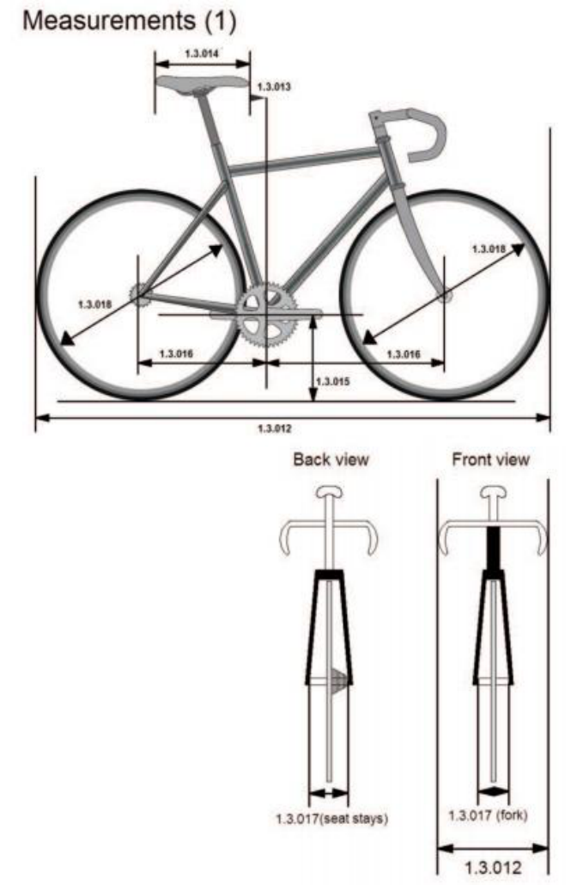

- **1.3.012** A bicycle shall not measure more than 185 cm in length and 50 cm in width overall. 

A tandem shall not measure more than 270 cm in length and 50 cm in width overall. 

- **1.3.013** The tip of the saddle shall be positioned behind the vertical plane passing through the center of the bottom bracket axle and must under no circumstances cross this plane. 

GENERAL ORGANISATION OF CYCLING AS A SPORT 

E0726 

73 

**UCI CYCLING REGULATIONS** 

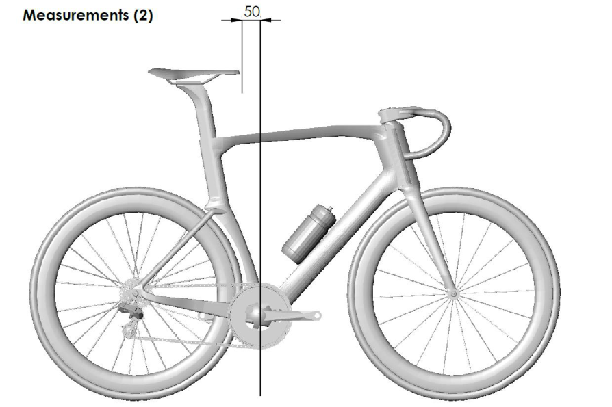

_(text modified on 01.10.10; 01.02.12; 01.10.12; 23.10.19; 01.01.23; 01.01.25)_ 

- **1.3.014** The plane passing through the highest points at the front and rear of the saddle can have a maximum angle of nine degrees from horizontal. 

   - The length of the saddle shall be 24 cm minimum and 30 cm maximum. A tolerance of 5mm is allowed. 

_(text modified on 01.01.03; 01.02.12; 01.12.15)_ 

- **1.3.015** The distance between the bottom bracket spindle and the ground shall be between 24 cm minimum and maximum 30 cm. 

- **1.3.016** The distance between the vertical passing through the bottom bracket spindle and the front wheel spindle shall be between 54 cm minimum and 65 cm maximum (1). 

The distance between the vertical passing through the bottom bracket spindle and the rear wheel spindle shall be between 35 cm minimum and maximum 50 cm. 

- **1.3.017** The distance between the two legs of the front fork shall not exceed 11,5 cm, measured from inside to inside; the distance between the two sides of the rear triangle shall not exceed 14,5 cm, measured from inside to inside. 

For equipment used in track events, the distance between the two legs of the front fork, at the lower extremity, shall not exceed 11,5 cm, measured from inside to inside; the distance between the two sides of the rear triangle, at the rear extremity, shall not exceed 14,5 cm, measured from inside to inside. 

_(text modified on 01.01.16; 01.01.26)_ 

GENERAL ORGANISATION OF CYCLING AS A SPORT 

E0726 

74 

**UCI CYCLING REGULATIONS** 

- **1.3.018** Wheels of the bicycle may vary in diameter between 700 mm maximum and 550 mm minimum, including the tyre. For the cyclo-cross the width of the tyre (measured between the widest parts) shall not exceed 33 mm and it may not incorporate any form of spikes or studs. 

In the disciplines road, track and cyclo-cross, only wheel designs granted prior approval by the UCI may be used. 

Wheels approved in mass start competitions in the disciplines of road and cyclo-cross shall comply with the following requirements: 

- the maximum height of the rim does not measure more than 65 mm (measured as the perpendicular distance from the tangential line passing through any point of the outer extremity of the rim to the inner extremity of the rim), see illustration below; 

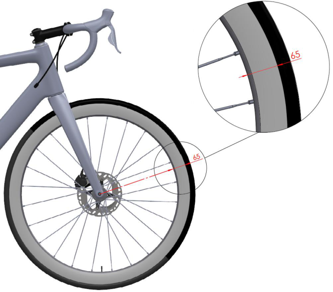

- have at least 12 spokes, which can be round, flattened or oval, provided that no dimension of their sections exceeds 10 mm. 

Wheels used in the road, track and cyclo-cross disciplines must meet the impact test requirements as specified in the standard ISO 4210-2:2023 Cycles — Safety requirements for bicycles, section 4.10.7.2.2., paragraph 2. Fulfillment of these requirements concerns both the front wheels and the rear wheels, independent of materials, brake systems and other characteristics. Manufacturers must apply for approval by providing declaration of conformity to the UCI. Detailed procedure and template can be found in the section “Equipment” on the UCI Website. 

GENERAL ORGANISATION OF CYCLING AS A SPORT 

E0726 

75 

**UCI CYCLING REGULATIONS** 

In order to comply with the requirements and ensure compatibility between the components, rims must comply with the standard ISO 5775-2 and tyres with the standard ISO 5775-1. 

Wheels which meet the definition of traditional wheels do not need to follow the approval application procedure provided for in this article. 

## **Definition of Traditional wheels:** 

Criteria: Rim height: Less than 25 mm Rim material: Alloy Spokes: Minimum of 20 steel spokes which are detachable General: All components must be identifiable and commercially available 

In track competition, including motor-pacing, the use of a front disc wheel is only permitted in the specialties against the clock. 

Notwithstanding this article, the choice and use of wheels remains subject to articles 1.3.001 to 1.3.003. 

_(text modified on 01.01.02; 01.01.03; 01.09.03; 01.01.05; 01.07.10; 01.10.13; 01.01.16, 25.06.19, 01.01.24; 01.01.26)_ 

## **b) Weight** 

**1.3.019** The weight of the bicycle cannot be less than 6.8 kilograms. 

## **c) Configuration** 

**1.3.020** For road, track and for cyclo-cross competitions, the frame of the bicycle shall be of a traditional pattern, i.e. built around a main triangle. It shall be constructed of straight or tapered tubular elements (which may be round, oval, flattened, teardrop shaped or otherwise in cross-section) such that the form of each element except the chain stays and the seat stays encloses a straight line. The elements of the frame shall be laid out such that the joining points shall follow the following pattern: the top tube (1) connects the top of the head tube (2) to the top of the seat tube (4); the seat tube shall connect to the bottom bracket shell; the down tube (3) shall connect the bottom bracket shell to the bottom of the head tube. The rear triangles shall be formed by the chain stays (6), the seat stays (5) and the seat tube (4) with the seat stays anchored to the seat tube at points falling within the limits laid down for the slope of the top tube. (See diagram «Shape (1)»). The seat post shall comply with the dimensional restrictions that apply to the seat tube and may be attached to the frame anywhere on the seat tube and/or top tube. (See diagram «Shape (2)»). 

The maximum height of the elements shall be 8 cm and the minimum thickness 1 cm. The minimum thickness of the elements of the front fork shall be 1 cm; these may be straight or curved (7). (See diagram «Shape (1)»). 

The top tube (1) may slope, provided that this element fits within a horizontal template defined by a maximum height of 16 cm. 

The effective width of the head tube zone may not exceed 16 cm at the narrowest point between the inner join of the top tube and down tube and the front of the box for the head tube. 

Additional frame components can be added between the head tube and the handlebar stem. These must be inside the dimension of the head tube box. 

GENERAL ORGANISATION OF CYCLING AS A SPORT 

E0726 

76 

**UCI CYCLING REGULATIONS** 

Isosceles compensation triangles with two 8 cm sides are authorized at the joints between frame elements except at the joints between the chain stays and seat stays where triangles are not authorised (See diagram «Shape (3)»). 

_(text modified on 07.06.00; 01.01.05; 01.02.12; 01.01.16; 01.01.21)_ 

GENERAL ORGANISATION OF CYCLING AS A SPORT 

E0726 

77 

**UCI CYCLING REGULATIONS** 

## **Position of boxes and laid out Shape (1)** 

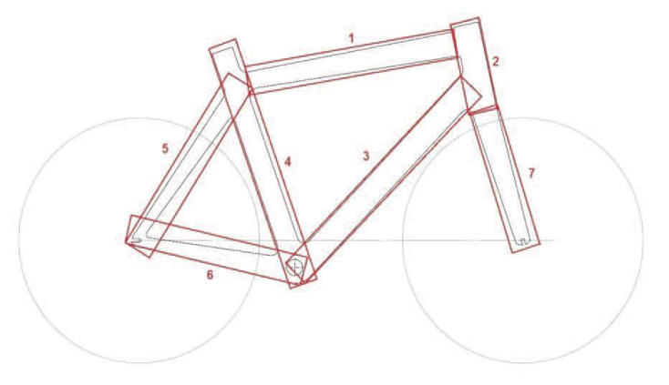

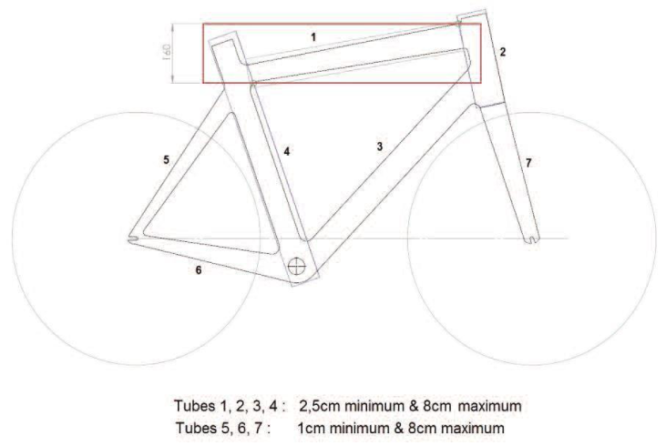

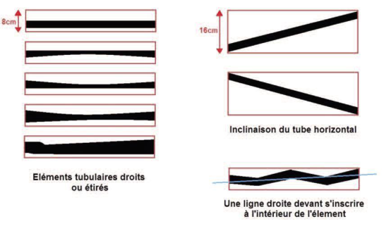

GENERAL ORGANISATION OF CYCLING AS A SPORT 

E0726 

78 

**UCI CYCLING REGULATIONS** 

## **Position of the seat post box Shape (2)** 

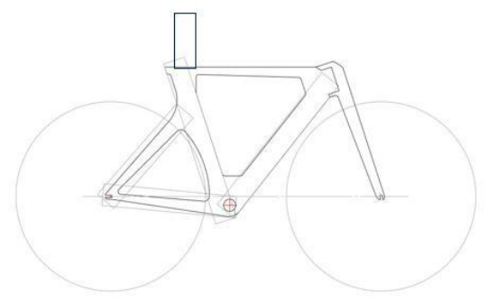

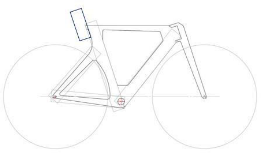

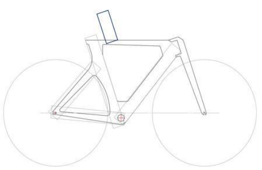

GENERAL ORGANISATION OF CYCLING AS A SPORT 

E0726 

79 

**UCI CYCLING REGULATIONS** 

## **Position of compensation triangles Shape (3)** 

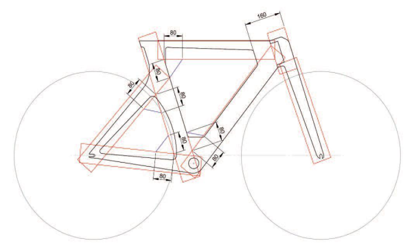

## **1.3.021** [article abrogated on 01.01.21] 

## **d) Structure** 

- **1.3.022** In competitions other than those covered by article 1.3.023, only the traditional type of handlebars (see diagram «structure 1A») may be used. The handlebars must be positioned in an area defined as follows: above, by the horizontal plane of the point of support of the saddle (B); below, by the horizontal plane passing 100 mm below the highest point of the two wheels (these being of equal diameter) (C); at the rear by the axis of the steerer tube (D) and at the front by a vertical plane passing at horizontal distance of 100 mm from the axis of the front wheel spindle (see diagram «Structure (1A)»). 

In addition, all handlebars must conform to the following: 

- The maximum dimension of the cross section of the handlebars is 80 mm for track, and 65 / 80 mm for road and cyclo-cross  (see diagram «structure 1.0 Track» and «structure 1.0 Road, Cyclo-cross») 

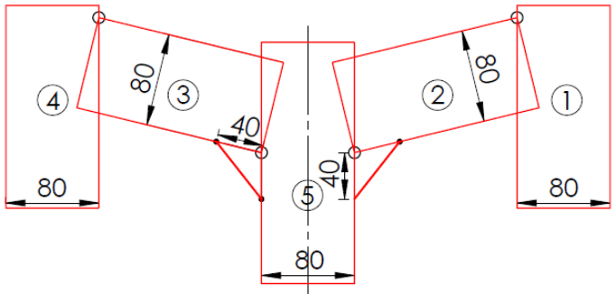

**Structure (1.0) Track** 

GENERAL ORGANISATION OF CYCLING AS A SPORT 

E0726 

80 

**UCI CYCLING REGULATIONS** 

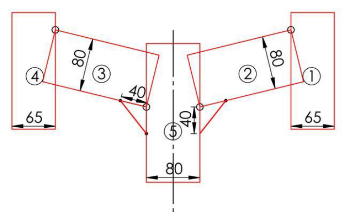

**Structure (1.0) Road, Cyclo-cross** 

- The maximum dimension of the cross section of the stem is 80 mm 

- The minimum dimension of the cross section of all fork accessories is 10 mm 

- Two isosceles compensation triangles with two 40 mm sides are authorised at the joints between the stem and the handlebars. 

- The minimum overall width of handlebars, measured from outside to outside, is 400 mm for road and cyclo-cross 

- The maximum dimension from the external extremity of the handlebar and the internal extremity of the same side of the handlebar shall not exceed 65 mm for road and cyclo-cross, (see diagram «structure 1»). 

GENERAL ORGANISATION OF CYCLING AS A SPORT 

E0726 

81 

**UCI CYCLING REGULATIONS** 

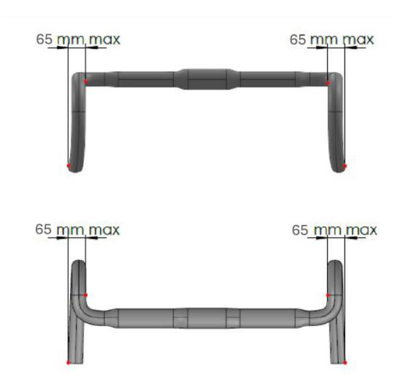

**Structure (1)** 

The brake controls attached to the handlebars shall consist of two supports with levers. It must be possible to operate the brakes by pulling on the levers with the hands on the lever supports in a safe manner. The maximum inclination of brake levers shall be 10° and the minimum measurement between the inside of the extremities of the brake levers shall be 280 mm. Any extension to or reconfiguration of the supports to enable an alternative use is prohibited. A combined system of brake and gear controls is authorised. 

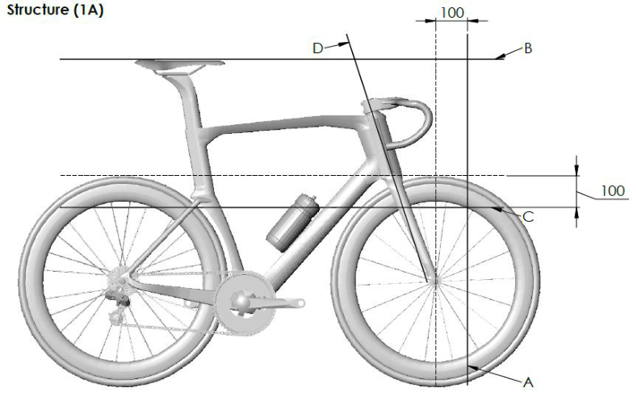

_(text modified on 01.01.05; 01.02.12; 01.11.14; 01.01.23; 01.04.24; 01.01.26)_ 

GENERAL ORGANISATION OF CYCLING AS A SPORT 

E0726 

82 

**UCI CYCLING REGULATIONS** 

## **Fixed time trial extension handlebar** 

- **1.3.023** For road time trials and for track individual pursuit, team pursuit and Kilometre time trial, a fixed time trial extension handlebar (consisting of 2 extensions with sections for each hand to hold and two forearm supports) may be used. 

## Position and measurements 

A fixed time trial extension handlebar may be added or integrated to the traditional handlebar. 

A base bar steering system can only be used if a fixed time trial extension handlebar is added or integrated to it. The minimum overall width, measured from outside to outside, of the base bar steering system is 350 mm. 

Traditional handlebars or base bar steering systems must be positioned in the area defined in article 1.3.022 (A, B, C, D). 

A fixed time trial extension handlebar must be positioned in compliance with one of the four categories presented below and the measurements shown in diagram “Structure (1B)”: 

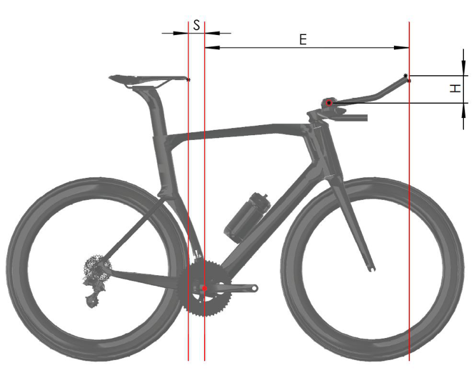

**Structure (1B)** 

Measurement E corresponds to the horizontal distance between vertical planes passing through the center of the bottom bracket axle and the extremity of the fixed time trial extension handlebar, including accessories. 

Measurement H corresponds to the vertical height difference between the midpoint of the forearm support and the highest or lowest point of the fixed time trial extension handlebar, including accessories. 

GENERAL ORGANISATION OF CYCLING AS A SPORT 

E0726 

83 

**UCI CYCLING REGULATIONS** 

Measurement S corresponds to the horizontal distance between the tip of the saddle and the vertical plane passing through the center of the bottom bracket axle. 

## Height Category 1 – riders less than 180 cm tall 

## Measurements 

- E may not exceed 800 mm 

- H may not exceed 100 mm. 

- S may not be less than 50mm 

## Height Category 2 – riders 180 cm to 189 cm tall 

## Measurements 

- E may not exceed 830 mm 

- H may not exceed 120 mm. 

- S may not be less than 50 mm 

These measurements shall apply subject to eligible riders appearing on the relevant list published on the UCI website. 

To be added to the list, riders shall fill a “rider height attestation application form” available from the UCI website no later than 15 days prior to the start of an event. 

Without prejudice to verifications carried out by Commissaires, riders on the relevant list published on the UCI website are entitled to use bicycles with the corresponding measurements. 

## Height Category 3 – riders 190 cm or taller 

## Measurements 

- E may not exceed 850 mm 

- H may not exceed 140 mm. 

- S may not be less than 50 mm 

These measurements shall apply subject to eligible riders appearing on the relevant list published on the UCI website. 

To be added to the list, riders shall fill a “rider height attestation application form” available from the UCI website no later than 15 days prior to the start of an event. 

Without prejudice to verifications carried out by Commissaires, riders on the relevant list published on the UCI website are entitled to use bicycles with the corresponding measurements. 

## Default Height Category 

The measurements below shall apply: 

- a) for any rider who is 180 cm or taller and who does not appear on the relevant list published on the UCI website. 

- b) for any rider who presents a bicycle with measurements for E and S which do not comply with the corresponding requirements for their height category. 

   - 

- E may not exceed 750 mm 

GENERAL ORGANISATION OF CYCLING AS A SPORT 

E0726 

84 

**UCI CYCLING REGULATIONS** 

- H may not exceed the vertical height difference (H) set for the rider’s height category as provided above 

- S shall comply with article 1.3.013. 

## Equipment requirements 

All fixed time trial extension handlebars and forearm supports must conform to the following: 

- Forearm supports must be made up of two parts (one part for each forearm) and are only allowed if fixed time trial extensions handlebars are added; 

- The maximum width of each forearm support is 125 mm; 

- The maximum length of each forearm support is 125 mm; 

- The minimum length of each forearm support is 60 mm; 

- The maximum height of each forearm support is 85 mm; 

- The maximum inclination of each forearm support (measured on the support surface of the arm) is 30 degrees; 

- The minimum horizontal distance between the vertical plane passing in front of the forearm support and the vertical plane passing through the extremity of the fixed time trial extension handlebar including accessories is 180 mm; 

- The maximum dimension of the cross section of each extension is 50 mm; 

- If both sections of the fixed time trial extension handlebar are joined by part, the maximum dimension of the cross section permitted is 80 mm; 

- The maximum dimension of the cross section of each mounting accessory is 80 mm; 

- For integrated equipment, an isosceles compensation triangle of 40 mm sides is authorised at the joint between each extension and the mounting accessory. 

- - Two isosceles compensation triangles of 40 mm sides are authorised at the joints between the stem and the base bar; 

- The maximum dimension of the cross section of the base bar is 80 mm; 

- The minimum dimension of the cross section of all fork accessories is 10 mm; 

- - The maximum dimension of the cross section of the stem is 80 mm. 

_(text modified on 07.06.00; 01.01.05; 01.04.07; 01.01.09; 01.02.12; 01.10.12; 29.04.14; 15.10.18; 25.06.19; 01.01.23; 01.01.25; 01.01.26)_ 

- **1.3.024** Any device, added or blended into the structure, that is destined to decrease, or which has the effect of decreasing, resistance to air penetration or artificially to accelerate propulsion, such as a protective screen, fuselage form fairing or the like, shall be prohibited. 

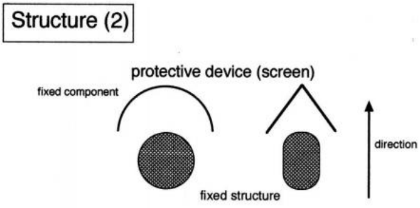

GENERAL ORGANISATION OF CYCLING AS A SPORT 

E0726 

85 

**UCI CYCLING REGULATIONS** 

A protective screen shall be defined as a fixed component that serves as a windscreen or windbreak designed to protect another fixed element of the bicycle in order to reduce its wind resistance. 

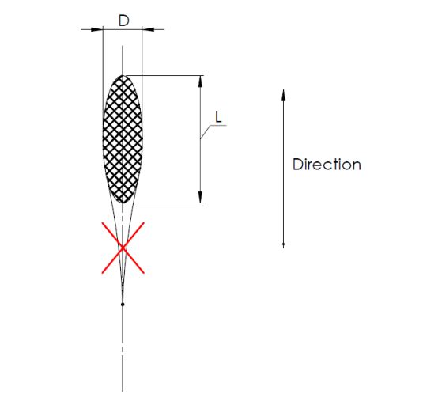

A fuselage form shall be defined as an extension or streamlining of a section. This shall be tolerated as long as the ratio between the length L and the diameter D does not exceed established dimensional requirements as defined in articles 1.3.020 (framesets), 1.3.022 and 1.3.023 (handlebars, base bars and fixed time trial extension). 

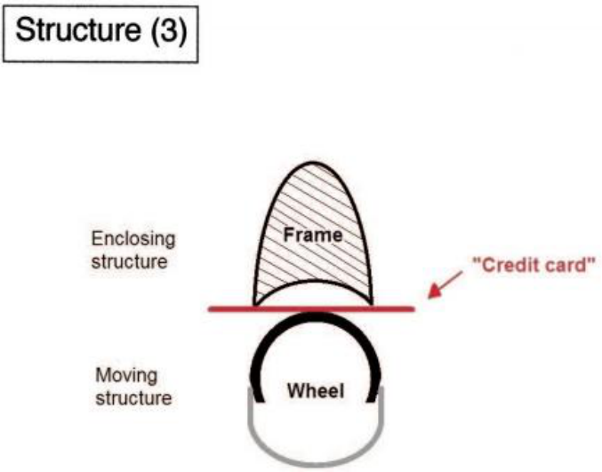

GENERAL ORGANISATION OF CYCLING AS A SPORT 

E0726 

86 

**UCI CYCLING REGULATIONS** 

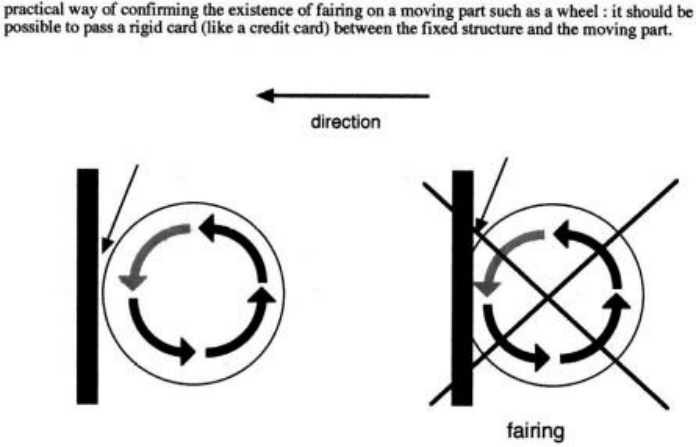

A fairing shall be defined as the use or adaptation of a component of the bicycle in such a fashion that it encloses a moving part of the bicycle such as the wheels or the chainset. Therefore, it should be possible to pass a rigid card (like a credit card) between the fixed structure and the moving part. 

_(text modified on 01.01.17; 01.01.23)_ 

- **1.3.024** Bottles shall not be integrated in the frame and may only be located on the down and **bis** seat tubes on the inside of the frame and cannot be integrated to the frame. The dimensions of the cross sections of a bottle used in competition must not exceed 10 cm or be less than 4 cm and their capacity must be a minimum of 400 ml and a maximum of 800 ml. 

_(article introduced on 01.10.11; text modified on 01.01.13)_ 

- **1.3.024** [article abrogated on 10.06.21] **ter** 

- **1.3.024** The UCI may fit, or appoint its agents or commissaires to fit, onboard technology **quarter** devices for the purpose of detecting technological fraud during competition. Refusal by a team or rider to comply with instructions to carry such onboard technology devices may lead to the imposition of disciplinary measures in accordance with article 1.3.003bis. 

_(article introduced on 15.02.19)_ 

- **1.3.025** Freewheels, multiple gears and brakes are not permitted for use on the track during competition or training. 

Disc brakes are allowed in cyclo-cross training and competition. Disc brakes are allowed in mountain bike training and competition. Disc brakes are allowed in road race and time trial training and competition. Disc brakes are allowed in BMX racing training and competition. Disc brakes are allowed in BMX Freestyle training and competition. Disc brakes are allowed in Trials training and competition. 

For races on the road and cyclo-cross, the use of fixed sprocket is forbidden: a braking system that acts on both wheels is required. 

GENERAL ORGANISATION OF CYCLING AS A SPORT 

E0726 

87 

**UCI CYCLING REGULATIONS** 

_(text modified on 01.09.04; 01.01.05; 01.01.09, 01.07.09; 01.07.10; 27.03.17; 01.07.18; 01.02.26)_ 

## **Section 3: riders' clothing** 

## **§ 1 General provisions** 

- **1.3.026** When competing, all riders shall wear a jersey with sleeves and a pair of shorts, possibly in the form of a one-piece skinsuit. By shorts it is understood that these are shorts that come above the knee. 

   - Sleeveless jerseys shall be forbidden. 

However, for downhill, four-cross and Enduro mountain bike events, BMX Racing, BMX Freestyle, trials and indoor cycling, specific provisions are laid down in the part of the regulations concerning the discipline in question. 

_(text modified on 01.01.02; 01.01.04; 01.01.05; 01.01.20; 01.02.26)_ 

- **1.3.027** Jerseys shall be sufficiently distinct from world champions', UCI cup and classification leaders' and national jerseys to avoid confusion. 

- **1.3.028** Save in cases expressly provided for in the regulations, no distinctive jersey may be awarded or worn. 

- **1.3.029** No item of clothing may hide the lettering on the jersey or the rider's identification number, particularly in competition and at official ceremonies. 

_(text modified on 01.01.05)_ 

- **1.3.030** Rain jackets must be either transparent, the same colour as the team jersey or display the team’s name or logo on their front and back. The minimum size of the inscription shall be at least 20cm in height or width. 

_(text modified on 01.01.00; 01.01.15; 23.10.19)_ 

- **1.3.031** 1. Wearing a rigid safety helmet shall be mandatory during competitions and official training sessions in all disciplines except indoor cycling and BMX Freestyle Flatland. 

   2. In all disciplines wearing a rigid safety helmet is recommended outside of competitions and official training sessions. In any case, legal provisions must be complied with. 

   3. Each rider shall be responsible for: 

      - ensuring that the helmet is approved in compliance with an official security standard and that the helmet can be identified as approved; 

      - wearing the helmet in accordance with the security regulations in order to ensure full protection, including but not limited to a correct adjustment on the head as well as a correct adjustment of the chin strap; 

      - avoiding any manipulation which could compromise the protective characteristics of the helmet and not wearing a helmet which has been undergone manipulation or an incident which might have compromised its protective characteristics; 

      - using only an approved helmet that has not suffered any accident or shock; 

      - - using only a helmet that has not been altered or had any element added or removed in terms of design or form; 

GENERAL ORGANISATION OF CYCLING AS A SPORT 

E0726 

88 

**UCI CYCLING REGULATIONS** 

- using only accessories approved by the helmet manufacturer. 

4. The tables below set out requirements related to helmets in the disciplines of road, track and cyclo-cross. 

The table below provides for two categories of helmets: Traditional Helmets and Time Trial Helmets. It also sets out the specifications for each category of helmet. 

|**Specifications**|**Traditional Helmet**|**Time Trial Helmet**|
|---|---|---|
|**Maximum dimensions** (L x W x H) mm (as per diagram below)|450 x 300 x 210|450 x 300 x 210|
|**Ventilation**|The helmet must have at least three (3) distinct air inlet openings on the shell structure|No restriction|
|**Ear coverage**|The helmet shell and any accessories must not extend to cover, obstruct, or enclose the rider’s ears (looking from the lateral view)|No restriction|
|**Visor** A “visor” refers to any fixed or attached shield that cannot be worn independently of the helmet.|Integrated or detachable visors are not permitted. Helmets must be used without any visor attachments or shield-like accessories|Integrated or detachable visors are permitted|

The table below sets out the disciplines in which Traditional Helmets and Time Trial Helmets are permitted. 

|**Road**|**Traditional Helmet**|**Time Trial Helmet**|
|---|---|---|
|Individual Time trial, Team Trime Trial|Permitted|Permitted|
|Other events|Permitted|Not permitted|
|**Track**|**Traditional Helmet**|**Time Trial Helmet**|
|All events|Permitted|Permitted|
|**Cyclo-cross**|**Traditional Helmet**|**Time Trial Helmet**|
|All events|Permitted|Not permitted|

The diagram below illustrates the measurement of dimensions for Traditional Helmets and Time Trial Helmets: 

GENERAL ORGANISATION OF CYCLING AS A SPORT 

E0726 

89 

**UCI CYCLING REGULATIONS** 

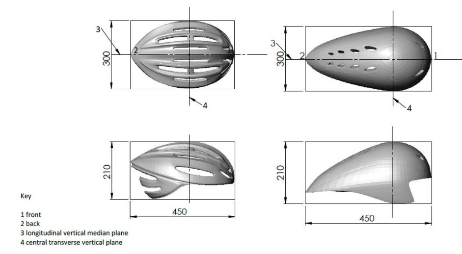

_(text modified on 05.05.03; 01.01.04; 01.08.04; 01.01.05; 01.02.07; 01.07.11; 01.01.15; 01.01.17; 27.03.17; 01.01.23; 01.01.26)_ 

- **1.3.032** Clothing and other items or accessories worn by a rider (including but not limited to helmets, glasses, shoes or in-race communication devices) may not modify the morphology of the rider. 

- Moreover, ~~and a~~ ny non-essential element ~~or device~~ which is added on (or under) or integrated in any clothing, or other item or accessory worn by a rider shall be forbidden. A non-essential element shall be any element which does not have a purpose which is exclusively of clothing or protection, or which is not strictly necessary for the functionality of the clothing, or other item or accessory. This shall also apply regarding any material or substance applied onto the skin or clothing and which is not itself an item of clothing or another item or accessory worn by a rider. 

_(text modified on 01.02.25)_ 

- **1.3.033** Modifications to the surface roughness of clothing are authorised but may only be the result of threading, weaving or assembling of the fabric. Surface roughness modifications shall be limited to a profile difference of 1mm at most. 

The measure of surface roughness modification shall be made without pressure or traction on the clothing. 

All clothing must maintain the original texture of the textile and may not be adapted in a manner to integrate form constraints. Therefore, when not worn, clothing may in no case contain any self-supporting element or rigid parts. 

GENERAL ORGANISATION OF CYCLING AS A SPORT 

E0726 

90 

**UCI CYCLING REGULATIONS** 

_(text modified on 01.01.02; 01.01.04; 01.04.07; 01.10.10; 01.02.12; 04.03.19; 01.02.25)_ 

- **1.3.033** Socks and overshoes used in competition may not rise above the height defined **bis** by half the distance between the middle of the lateral malleolus and the middle of the fibula head. 

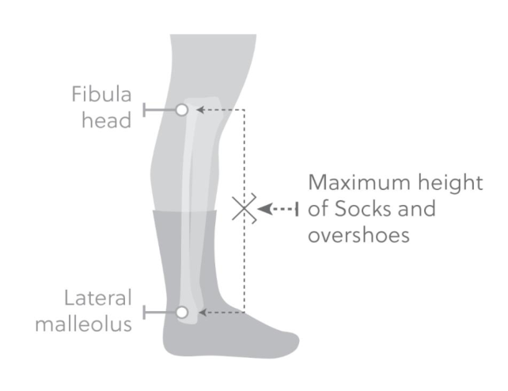

_(article introduced on 15.10.18)_ 

- **1.3.034** During competitions, riders' attendants may not bear any advertising matter on their clothing other than that authorised for their team's riders for the race in question. 

## **§ 2 Teams registered with the UCI** 

## **General observations** 

- **1.3.035** Each team may have only a single design for clothing - colours and layout - which may not be altered for the duration of the calendar year. 

   - UCI WorldTeams and UCI professional continental teams must submit for approval, before production, their clothing to UCI no later than December 1st before the year in question. Other teams shall submit for approval their clothing to the national federation of the team at the moment of the team registration no later than December 10[th] before the year in question. 

_(text modified on 01.01.00; 01.01.05; 01.10.09; 01.01.15; 03.06.16; 25.10.17)_ 

- **1.3.036  Provisions for permanent change during the season** Any permanent change to clothing must be duly justified and submitted for approval to the UCI at least 30 days before the expected date of coming into effect. The UCI will provide the team with an answer no later than 15 days prior to the expected date of coming into effect. 

## **Provisions for a temporary change during the season** 

GENERAL ORGANISATION OF CYCLING AS A SPORT 

E0726 

91 

**UCI CYCLING REGULATIONS** 

Each Road team may use an alternative design of clothing at a maximum of three full events each year. Such alternative clothing must be submitted for approval to the UCI, at least 60 days before the start date of the event at which it shall be worn. The UCI will provide the team with an answer no later than 30 days prior to the start date of the event in question. 

Applications either for a permanent or temporary change will be considered in the order in which they are received by the UCI. Applications may be rejected for reasons considered valid, including without being limited to similarity to other team’s clothing, similarity to leaders’ jerseys, ill-compliance with UCI regulations pertaining to jerseys, potential harm to image of cycling, the events or the UCI. 

These provisions do not apply to the clothing of National Champions and Continental Champions; the modifications of which are subject to approval from respectively, national federations and continental confederation _._ 

_(text modified on 01.01.00; 01.01.04; 01.01.05; 01.10.11; 01.01.15; 25.10.17; 01.11.22)_ 

- **1.3.037** Riders' clothing shall always be identical to the specimen lodged. 

_(text modified on 01.01.99)_ 

## **Advertising matter** 

- **1.3.038** The name, company logo or trade mark of the principal partner shall be preponderant (thicker characters) and placed in the upper part of the jersey, both on the front and the back. 

If there are two principal partners registered with the UCI, at least one of them shall appear as mentioned above. 

- **1.3.039** The order in which the two principal partners appear on the jersey may be inverted from one race to another during the calendar year. 

- **1.3.040** [article abrogated on 01.01.98] 

- **1.3.041** [article abrogated] 

- **1.3.042** Other advertising inscriptions may be freely used and can vary from one race or country to another. 

- **1.3.043** In all cases, the advertising matter and its layout shall be the same for all riders of a given team in the same competition. 

_(text modified on 01.01.00; 01.01.05)_ 

- **1.3.044** In track events, by mutual agreement between the race organiser and the team, the team jersey may be replaced by a jersey devoid of advertising matter, not even bearing the name of the team itself. 

In six-day races, the organiser may impose jerseys with the advertisement of his choice, while allowing the rider's sponsor to place its name in a rectangle of maximum 6 cm in height. 

_(text modified on 01.01.00; 01.01.05)_ 

GENERAL ORGANISATION OF CYCLING AS A SPORT 

E0726 

92 

**UCI CYCLING REGULATIONS** 

## **§ 3 Regional and club teams** 

## **General observations** 

- **1.3.045** For the events on the national calendar, the team may only use a single design of clothing (colours and arrangement) which must remain unaltered throughout the calendar year. In other respects, the matter shall be decided by the national federation of the country where the race is run. 

For events on the international calendar, the rules below shall apply to riders belonging to a regional or club team, with the exception of riders who are also members of a team registered with the UCI. 

_(text modified on 01.01.05)_ 

- **1.3.046** Each regional or club team for whom one or more riders take part in an event on the international calendar must, at the start of the year, notify the details of their clothing to their national federation specifying in detail the colours and their arrangement and the main sponsors. 

The name of the region and/or club may appear, in full or in abbreviated form, on the jersey. 

_(text modified on 01.01.05)_ 

- **1.3.047** Riders for the club shall wear uniform clothing complying exactly with that described in the notification referred to in article 1.3.046. Unless specifically provided for, no rider shall be permitted to ride in the colours of any association or company other than those of the club given on his licence. 

## **Advertising matter** 

- **1.3.048** Clubs may display the names (logo or trademark) of their commercial sponsors on their clothing by way of advertising. 

A prior written agreement has to be concluded between the club and the sponsor. 

- **1.3.049** The name, logo or trade mark of the sponsor(s) may be used freely on the jersey. In addition the jersey may bear other lettering which may even differ from one race or country to another, without any limitation on the number. 

_(text modified on 01.01.00)_ 

- **1.3.050** [article abrogated on 01.01.05] 

## **§ 4 Leaders' clothing** 

## **Stage races** 

- **1.3.051** Organisers are responsible for ensuring that the leader’s jerseys for all classifications in stage races, whether compulsory or not, are sufficiently distinct from those of the teams and clubs, as well as from national jerseys, world champions' jerseys and those of leaders of UCI cups, series or other rankings. 

As an exception, teams shall be responsible for ensuring that their jerseys are sufficiently different from the leaders’ jerseys for the individual general classification, points 

GENERAL ORGANISATION OF CYCLING AS A SPORT 

E0726 

93 

**UCI CYCLING REGULATIONS** 

classification, king of mountain classification and youth classification in Grand Tours and events of the UCI Women’s WorldTour identified by the UCI. The obligation incumbent on teams shall be subject to organisers publishing information regarding their leaders’ jerseys at least six months prior to the relevant event. 

_(text modified on 01.01.05; 01.01.16; 17.06.24)_ 

- **1.3.052** (N) An individual general classification leader's jersey shall be mandatory. 

- **1.3.053** (N) Advertising on a leader's jersey shall be reserved for the organiser of the race. 

However, spaces are reserved for use by the riders/teams, as described in the “UCI jerseys visual guidelines” brochure published on the UCI Website. The principal partner(s) of a team shall stand out there from all other advertisements. 

This provision shall also apply to the skinsuit worn by the leader on which spaces are also reserved for use by riders/teams on the lower part (shorts), as described in the “UCI jerseys visual guidelines” brochure published on the UCI Website. 

_(text modified on 01.01.00; 01.01.05; 01.01.16; 08.02.21)_ 

- **1.3.054** The wearer of the leader's jersey shall be entitled to match the colour of his shorts to that of the jersey. 

_(text modified on 01.01.99)_ 

- **1.3.055** In time trial stages, leaders may wear the aerodynamic jersey or skinsuit of their teams if the organiser does not provide an aerodynamic leader's jersey or skinsuit. 

_(text modified on 01.01.05)_ 

## **UCI cups, series and classifications** 

- **1.3.055** 1. The designs of the leader's jerseys for UCI cups, series and classifications are 

   - **bis** determined by the UCI and are their exclusive property. They may not be reproduced without UCI authorisation. 

      - They may not be altered, except as regards the advertising space reserved for the wearer's team. 

2. Advertising on the leader’s jerseys of UCI cups, series and classifications is reserved for the UCI. 

However, spaces are reserved for use by the riders/teams, as described in the “UCI jerseys visual guidelines” brochure published on the UCI Website. The principal partner(s) of a team shall stand out there from all other advertisements. 

This provision shall also apply to the skinsuit worn by the leader on which spaces are also reserved for use by riders/teams on the lower part (shorts) as described in the “UCI jerseys visual guidelines” brochure published on the UCI Website. 

3. The wearer of the leader's jersey shall be entitled to match the colour of his shorts to that of the jersey. 

4. In time trial stages, leaders may wear the aerodynamic jersey or skinsuit of their teams if the UCI does not provide an aerodynamic leader's jersey or skinsuit. 

_(text modified on 01.01.05; 01.09.05; 01.01.06; 01.01.09; 01.07.17; 08.02.21)_ 

GENERAL ORGANISATION OF CYCLING AS A SPORT 

E0726 

94 

**UCI CYCLING REGULATIONS** 

## **§ 5 National team clothing** 

- **1.3.056** National federations shall submit to the commissaires’ panel of events as specified in art. 1.3.059, a sample of their national team clothing for validation. The design, color, place and size of the advertising spaces of the validated equipment must be identical for all athletes participating to the applicable events. 

For events where riders are required to participate with a national jersey but have qualified and/or register individually, the regulations of each discipline shall set out if the requirement of all riders wearing the same national jersey applies (e.g. Gravel, Enduro, Marathon, etc.). National Federations may submit to the UCI any additional approved jersey to be worn by the riders of their nationality. 

_(text modified on 17.07.98; 01.01.04; 25.06.07; 01.02.26)_ 

- **1.3.057** Advertising matter, as detailed in the “UCI jerseys visual guidelines” brochure published on the UCI Website, shall be used at the national federation’s discretion. Advertising matter on jersey and shorts may vary from one rider to another. The design of the jersey and shorts may vary from one category of rider to another. 

Advertising on protective leggings worn for downhill mountain bike, trials and BMX Racing events is not subject to the advertising restrictions on shorts. 

Additionally, the rider's name may appear on the back of the jersey. 

The above measures also apply to other items of clothing worn during competition (rain jackets, etc.). 

_(text modified on 01.01.00; 01.01.03; 01.01.04; 01.01.05; 08.02.18; 08.02.21; 01.02.26)_ 

- **1.3.058** The advertising spaces shall be reserved for the use of the national federation except as determined in the specific regulations of the discipline or in the “UCI jerseys visual guidelines”. 

_(text modified on 17.07.98; 01.01.05; 14.10.08; 19.06.09; 01.07.18; 04.03.19; 08.02.21; 01.02.26)_ 

- **1.3.059** The wearing of national team clothing shall be mandatory, unless provided otherwise in specific regulations (including but not limited to article 1.3.071): 

   - at world championships 

   - at challenge and masters world championships (BMX Racing) 

   - at continental championships at the discretion of the continental confederation 

   - during Olympic and Paralympic Games, in accordance with the IOC and IPC Regulations, as well as the respective NOC’s rules. 

_(text modified on 01.01.98; 01.01.04; 01.01.05; 01.01.06; 01.10.10; 26.07.17; 01.02.26)_ 

## **§ 6 World champion's jersey** 

- **1.3.060** The right to the «rainbow colours» is the exclusive property of the UCI. Any commercial use of the rainbow colours is strictly prohibited. 

GENERAL ORGANISATION OF CYCLING AS A SPORT 

E0726 

95 

**UCI CYCLING REGULATIONS** 

_(text modified on 01.10.10)_ 

- **1.3.061** The design, including colours and layout, of each world champion's jersey according to category and/or discipline, as well as the distinctive logo of the UCI Team Time Trial World Champions, are the exclusive property of the UCI. The jersey, and the distinctive logo for the UCI Team Time Trial World Champions, may not be reproduced without UCI authorisation. The design may in no way be modified. 

_(text modified on 01.10.10; 01.07.12)_ 

- **1.3.062** [article abrogated on 01.01.05] 

- **1.3.063** World champions must wear their jersey in all events in the discipline, speciality and category in which they won their title, and no other event, until the evening of the day before the commencement of the next edition of the world championships of said discipline, speciality and category. 

The world champion in the individual time trial is authorised to wear the world champion’s jersey during team time trial events. 

In track races, in Madison, if one of the teammates is not World Champion, then both riders shall wear the same team jersey or one World Champion jersey with one plain white jersey. 

In six-day races, only madison world champions may wear the jersey, even if they are not paired together. 

In Para Cycling, for Tandem (B), Team Relay (TR) and Team Sprint (TS), only world champion athletes must wear the rainbow jerseys even if the pair or the team subsequently dissolve. 

In non-individual events in Indoor Cycling, if one of the teammates is not World Champion, then no rider shall wear the World Champion jersey. 

In Cycling Esports the UCI defines the World Champion jersey as having two states; 1) physical and 2) virtual.  As such, the rainbow jersey must be worn in Cycling Esports events (physical state), both In-real life and remote races, and In-game by means of a digital avatar (virtual state). The obligation to wear the World Champion jersey in virtual state remains subject to the creation of such a digital avatar by the respective Cycling Esports platforms 

The world champion jersey must be worn at every opportunity with public exposure, in particular during competitions, awards ceremonies, press conferences, television interviews, autograph sessions, photo sessions and other occasions. 

_(text modified on 01.01.05; 01.01.06; 01.10.10; 01.07.12; 01.10.13; 04.03.19; 11.02.20; 08.02.21, 01.02.25)_ 

- **1.3.064** Without prejudice to paragraph 2 below, only the current world champion rider may wear rainbow piping on their equipment (such as bike, helmet, shoes) as per the technical specifications in the “UCI jerseys visual guidelines” brochure published on the UCI Website. However, they may use the equipment bearing the rainbow piping only in events of the discipline, speciality and category in which they won the title and in no other event. 

GENERAL ORGANISATION OF CYCLING AS A SPORT 

E0726 

96 

**UCI CYCLING REGULATIONS** 

The current individual time trial world champion is authorised to use rainbow stripes on their time trial bicycle for individual time trial and team time trial events. 

When a rider no longer holds the title of world champion, they may wear rainbow piping on the collar and cuffs of their jersey, to the exclusion of any other equipment, as per the technical specifications in the “UCI jerseys visual guidelines” brochure published on the UCI Website. However, they may wear such a jersey only in events of the discipline, speciality and category in which they won the title and in no other event. Former individual time trial world champions are authorised to use rainbow piping on their time trial skinsuit in individual time trial and team time trial events. 

In accordance with the articles 1.3.056 and 1.3.059, they are not authorised to add the rainbow piping on national team clothing. 

Any equipment bearing the rainbow piping shall be submitted to UCI for approval before production. 

_(text modified on 01.01.05; 01.09.05; 24.09.07; 01.10.10; 01.01.15; 08.02.21, 01.02.25)_ 

- **1.3.065** [article abrogated on 01.07.17] 

- **1.3.066** The world champion's jersey awarded at the official ceremony may carry no advertising matter other than that determined by the UCI. 

- **1.3.067** The world champion shall be entitled to have advertising matter placed on his jersey from the day following the official ceremony. 

The exact location of advertising space is defined in the “UCI jerseys visual guidelines” brochure provided by the UCI to each national federation of which a rider becomes world champion, respectively published on the UCI website. 

The wearer of the world champion's jersey shall be entitled to match the colour of his shorts to that of the jersey. 

_(text modified on 01.01.01; 01.10.10; 12.06.20; 08.02.21)_ 

## **§ 7 National champion's jersey** 

- **1.3.068** National champions must wear their jersey in all events in the discipline, speciality and category in which they won their title and no other event until the evening of the day before the commencement of the next edition of the national championships of said discipline, speciality and category. 

The national champion in the individual time trial is authorised to wear the distinctive 

national champion’s jersey during team time trial events. 

In Madison track races if one of the teammates is not national champion, then both riders shall wear the same team jersey. In a six-day event, only madison national champions must wear the jersey even if they are not paired together. 

(N) When a rider no longer holds the title of national champion, they can wear piping in national colours on the collar and cuffs of his jersey and shorts as per the technical specifications determined by the national federation. However, they can wear such a jersey only in events of the discipline, speciality and category in which they won the title 

GENERAL ORGANISATION OF CYCLING AS A SPORT 

E0726 

97 

**UCI CYCLING REGULATIONS** 

and in no other event; nevertheless, former individual time trial national champions are authorised to use piping in national colour on their time trial skinsuit for individual time trial and team time trial events. 

The national champion jersey must be worn whenever a rider is engaged in activities on the track, awards ceremonies, press conferences, television interviews, autograph sessions and other occasions which require a good presentation. 

_(text modified on 01.01.99; 01.01.04; 01.01.05; 01.01.06; 01.10.10; 01.01.13; 01.01.15; 01.07.17; 22.10.18; 01.01.19; 23.10.19; 12.06.20, 01.02.25)_ 

- **1.3.069** The specificities concerning the design of the national champion jersey are described in the “UCI jerseys visual guidelines” brochure available on the UCI website. 

Before production, the national champion jersey design (colours, flag, drawing) reproduced by the titled rider must be approved by the concerned national federation and must respect the latter’s dispositions. 

Each national federation must have its national champion jersey design registered by the UCI, for each discipline, at least 21 days before the national championships of the discipline in question. 

The wearer of a national champion's jersey shall be entitled to match the colour of his shorts to that of the jersey. 

However, under the prior approval of the concerned National Federation and instead of wearing a traditional national champions jersey in the sense of the provision 1.3.068, the national champions in MTB DHI, MTB 4X, MTB Enduro, BMX Racing, BMX Freestyle and Trials have the possibility to wear a distinct national champion jersey with the left arm sleeve representing the flag of the rider’s country. No advertising is authorized on that left arm sleeve of the national champion jersey. Apart from the left arm sleeve and without prejudice to the provisions 1.3.026 to 1.3.044, the remaining spaces (e.g. front, back and right arm sleeve) are let at the disposal of the riders for their usual sponsors. The specificities are described in the “UCI jerseys visual guidelines” brochure available on the UCI website. 

_(text modified on 01.01.01; 01.01.04; 01.10.10; 01.07.11; 01.01.20; 08.02.21; 01.01.23; 01.02.26)_ 

## **§ 8 Continental champion's jersey** 

- **1.3.070** If a jersey is awarded at a continental championship, riders may wear it in all races in the discipline, speciality and category in which they won the title and no other event, until the evening of the day before the commencement of the next edition of the continental championships of said discipline, speciality and category. 

The continental champion in the individual time trial is authorised to wear the distinctive continental champion’s jersey during team time trial events. 

(N) When a rider no longer holds the title of continental champion, they can wear piping in continental colours on the collar and cuffs of his jersey and shorts as per the technical specifications determined by the continental confederation. However, they can wear such a jersey only in events of the discipline, speciality and category in which they won the title and in no other event; nevertheless, former individual time trial continental 

GENERAL ORGANISATION OF CYCLING AS A SPORT 

E0726 

98 

**UCI CYCLING REGULATIONS** 

champions are authorised to use piping in continental colours on their time trial skinsuit for individual time trial and team time trial events. 

Continental confederations may impose the mandatory wearing of their continental champion’s jersey in the discipline, specialty and category of their choosing. In Madison track races, if one of the teammates is not Continental Champion, then both riders shall wear the same team jersey. 

The authorised advertising spaces are described in the “UCI jerseys visual guidelines” brochure published on the UCI Website. 

Before production, the continental champion jersey design (colours, flag, drawing) reproduced by the titled rider must be approved by the concerned continental confederation and must respect the latter’s dispositions. 

_(text modified on 01.01.04; 01.01.05; 01.09.05; 01.01.16; 01.07.17; 23.10.19;12.06.20; 08.02.21; 01.02.25)_ 

## **§ 9 Order of priority** 

- **1.3.071** Without prejudice to relevant provisions but applicable for all the disciplines, should various provisions requiring the wearing of different jerseys apply to the same rider, the order of priority shall be as follows: 

   1. the leader's jerseys of the stage race 

   2. the world champion's jersey 

   3. the leader's jersey of the cup, series or UCI classification 

   4. the continental champion's jersey 

   5. the national champion's jersey 

   6.  the national jersey 

_(text modified on 26.08.04; 01.01.05; 01.01.06; 01.02.07; 01.09.08; 01.01.09; 01.10.09; 01.10.10; 01.10.13; 01.01.15; 01.01.17; 26.07.17)_ 

## **§ 10 Sanctions** 

- **1.3.072** The following infringements shall be penalised as indicated below: (the sums are the fine in CHF) 

   1. Non-regulation clothing (colour and layout) 

         - rider: 50 to 200 and start not permitted 

         - team: 250 to 500 per rider 

   2. Non-regulation advertising 

      - 2.1 Team, per rider bearing non-regulation advertising 

         - jersey: 500 to 2,100 and start of the rider concerned not permitted 

         - shorts: 300 to 1,050 and start of the rider concerned not permitted 

         - skinsuit: 700 to 3,000 and start of the rider concerned not permitted 

      - 2.2 Leader’s jersey 

         - organiser: 1,000 to 2,100 per rider concerned and rider not obliged to wear the jersey 

         - team: 1,000 to 2,100 per rider concerned and start of the riders concerned not permitted 

GENERAL ORGANISATION OF CYCLING AS A SPORT 

E0726 

99 

**UCI CYCLING REGULATIONS** 

3. Leader's jersey 

   - 3.1 Unavailability of jerseys or skinsuits as required by the race regulations • organiser: 1,000 to 2,100 per rider concerned 

   - 3.2 Leader's jersey or skinsuit not fit to wear 

         - organiser: 1,000 to 2,100 per rider concerned 

   - 3.3 Allocation of unauthorised jerseys 

         - organiser: 1,000 to 2,100 per jersey concerned 

4. Rider not wearing (if required pursuant to articles 1.3.059, 1.3.063, 1.3.068 or 1.3.070) 

   - world champion's jersey 

         - team: 2,500 to 5,000 and start of the rider concerned not permitted 

   - leader's jersey of a UCI cup, circuit, series or classification 

         - team: 2,500 to 5,000 and start of the rider concerned not permitted 

         - rider: start not permitted and loss of 50 points in the UCI classification concerned 

   - continental champion's jersey 

         - team: 2,500 to 5,000 

      - national champion's jersey 

         - team: 2,500 to 5,000 

   - national clothing 

         - team: 500 to 1,000 per rider and start of the riders concerned not permitted 

5. National team clothing 

   - failure to submit to the UCI (article 1.3.056) 

         - national federation: 500 to 10,000 

6. World champion's equipment 

   - in breach of article 1.3.066 or 1.3.067 

         - rider: 2,000 to 100,000 

   - wearing of the jersey in a discipline, speciality or category other than that in which it was won 

         - rider: 2,000 to 10,000 

   - in breach of article 1.3.064 

         - rider 2,000 to 10,000 

   - logo of UCI Team Time Trial World Champions not worn 

         - team: 10,000 

_The amounts of the fines set above are doubled in the event of an offence during a world championship._ 

_(text modified on 01.03.01; 01.01.04; 01.01.05; 01.10.10; 01.07.11; 01.07.12; 01.02.25; 01.01.26)_ 

GENERAL ORGANISATION OF CYCLING AS A SPORT 

E0726 

100 

**UCI CYCLING REGULATIONS** 

## **Section 4: identification of riders** 

## **Identification number** 

- **1.3.073** During competitions, the following provisions shall be made for the identification of riders. 

|Discipline/speciality|Body number|Frame number|Shoulder number*|Handlebar number|
|---|---|---|---|---|
|Road|||||
|One-day races|2|1|||
|Stage races|2|1|||
|Time trials|1||||
|Cyclo-cross|1||2||
|Track : timed events|1||||
|Track : other events|2||||
|BMXRacing||2 (lateral)**||1|
|Mountain bike (all events)|1|||1|
|Trials|1|||1|

* The shoulder numbers shall be worn on the upper forearm so it’s visible frontally. 

** Frame numbers shall be used in BMX Racing only if required as stated in the event technical guide. 

A bicycle, or rider, may be fitted with an electronic device for the purposes of tracking the position of the rider within a race. Riders and teams shall comply with any such request from organisers and/or the UCI, its agents and commissaires. 

_(text modified on 01.01.01; 01.01.04; 01.01.05; 01.09.05; 01.01.06; 01.02.11; 01.02.12; 05.02.15; 15.02.19; 17.10.22; 01.02.26)_ 

- **1.3.074** Unless otherwise stipulated the number panels and plates shall bear black characters on a white background. 

- **1.3.075** The characters, panels and plates shall be of the following dimensions: 

|Body number|Frame number & Helmet stickers for handcycle|Shoulder number|Handlebar number|
|---|---|---|---|
|18 cm 15 cm MTB|9 cm|9 cm|15 cm MTB 15cm BMX Racing 11 cm Trials|
|16 cm 14 cm MTB|13 cm|7 cm|14 cm MTB 20cm BMX Racing 16 cm Trials|
|10 cm|6 cm|5 cm|8 cm MTB 6cm BMXRacing 10 cm Trials|
|1,5 cm|0,8 cm|0,8 cm|1.5 cm MTB 1.5 cm BMX Racing 1.5 cm Trials|
|height 6 cm on the lower part|rectangle of 11x2 cm on the lower or upper part|height 1.5 cm on the lower and upper part|- MTB height 2.5 cm on the upper and lower part|

GENERAL ORGANISATION OF CYCLING AS A SPORT 

E0726 

101 

**UCI CYCLING REGULATIONS** 

||MTB height 2.5 cm on the upper and lower part|||- BMXRacing6 cm on the upper part - Trials 2.5 cm on the lower part|
|---|---|---|---|---|

_(text modified on 01.01.01; 01.01.04; 01.10.09; 01.01.11; 13.03.15; 01.07.17; 01.01.19; 01.02.26)_ 

- **1.3.076** Riders shall ensure that their identification number is visible and legible at all times. The identification number shall be well fixed and may not be folded or altered. 

_(text modified on 01.01.05)_ 

- **1.3.077** The identification numbers provided by the organiser shall be used by riders without any kind of alteration. They shall be issued free of charge by the organiser, after the rider's licence has been checked by the commissaires' panel. 

_(text modified on 01.01.05; 01.01.17)_ 

- **1.3.078** At World Championships, the identification numbers shall be provided by the Organising Committee. The advertising space shall be reserved for the UCI. 

_(text modified on 01.01.05; 01.02.26)_ 

- **1.3.079** [article abrogated on 01.01.05] 

- **1.3.080** [article abrogated on 01.02.26] 

GENERAL ORGANISATION OF CYCLING AS A SPORT 

E0726 

102 

**UCI CYCLING REGULATIONS** 

## **Annexe A UCI LIST OF AUTHORISED BETS** - Annexe to Article 1.1.090 of the UCI Regulations - Last update: 10 September 2024 

After carrying out an assessment of the risks associated with sports betting in cycling, the UCI Management Committee has defined a list of authorised bets (events and types of bets) for any betting company wishing to act as a sponsor of an organiser, team or licence-holder. **Sponsorship is authorised subject to bets being organised exclusively on the events listed in the first table and the types of bets being in compliance with those listed in the second table below.** 

|**Discipline**|**Men Elite Events**|**Women Elite Events**|
|---|---|---|
|**ROAD**|UCI Road World Championships - Road Race UCI Road World Championships - Individual Time Trial UCI Road World Championships - Team Time Trial Mixed Relay UCI WorldTour Events UCI ProSeries Events Class 1 Events (C1) approved prior to each season1 Olympic Games UEC Road European Championships - Road Race UEC Road European Championships - Individual Time Trial UEC Road European Championships - Team Time Trial Mixed Relay National Championships of the top 15 nations of the UCI Road World Ranking by Nations|UCI Road World Championships - Road Race UCI Road World Championships - Individual Time Trial UCI Road World Championships - Team Time Trial Mixed Relay UCI Women’s WorldTour Events UCI ProSeries Events approved prior to each season1 Olympic Games UEC Road European Championships - Road Race UEC Road European Championships - Individual Time Trial UEC Road European Championships - Team Time Trial Mixed Relay National Championships of the top 15 nations of the UCI Road World Ranking by Nations|
|**TRACK CYCLING**~~**2**~~|UCI Track Cycling World Championships UCI Track Cycling Nations Cup UCI Track Champions League Olympic Games|UCI Track Cycling World Championships UCI Track Cycling Nations Cup UCI Track Champions League Olympic Games|
|**MOUNTAIN BIKE**|UCI Mountain Bike World Championships (XCO and DHI only) UCI Mountain Bike World Cup (XCO and DHI only) Olympic Games|UCI Mountain Bike World Championships (XCO and DHI only) UCI Mountain Bike World Cup (XCO and DHI only) Olympic Games|
|**BMX RACING**|UCI BMXRacingWorld Championships UCI BMXRacingWorld Cup Olympic Games|UCI BMXRacingWorld Championships UCI BMXRacingWorld Cup Olympic Games|
|**CYCLO-CROSS**|UCI Cyclo-cross World Championships UCI Cyclo-cross World Cup UEC Cyclo-cross European Championships Class 1 Events (C1) Class 2 Events (C2) approved prior to each season2 National Championships of the top 3 nations of the UCI Cyclo-cross World Ranking by Nations|UCI Cyclo-cross World Championships UCI Cyclo-cross World Cup UEC Cyclo-cross European Championships Class 1 Events (C1) Class 2 Events (C2) approved prior to each season2 National Championships of the top 3 nations of the UCI Cyclo-cross World Ranking by Nations|

- 1-2 Events in the disciplines and classes concerned may be authorised by the UCI, subject to an assessment of the following criteria: 

   - a) participation in previous editions and planned participation for the edition of the season in question, and 

   - b) live television broadcast during previous editions and scheduled for the edition of the season in question. 

Any organiser, team or licence holder may submit a request to add an event to the list of authorised events to the UCI at the following address: legal@uci.ch 

Applications for Road C1 men's and UCI ProSeries women's events must be submitted to the UCI no later than 1 December preceding the season of the event for which an authorisation is requested. For the 2021 season, applications may be submitted until 15 March 2021 at the latest. 

Applications for Cyclo-cross C2 events must be submitted to the UCI no later than 30 June preceding the season of the event for which an authorisation is requested. 

GENERAL ORGANISATION OF CYCLING AS A SPORT 

E0726 

103 

**UCI CYCLING REGULATIONS** 

For the 2024-2025 Cyclo-cross season, the following authorisations have been granted for C2 men and women elite events: 

- Be‐Mine Cross, Beringen 

- Kermiscross, Ardooie 

- Robotland Cyclo‐cross, Essen 

- Internationale Cyclo‐cross Heerderstrand, Heerde 

- Internationale Cyclo‐Cross Rucphen, Rucphen 

- X²O Badkamers Trofee – Rapencross, Lokeren 

- Urban Cross, Kortrijk 

- X²O Badkamers Trofee – Herentals Cross, Herentals 

- Telenet Superprestige – Zilvermeercross, Mol 

- Telenet Superprestige – Hexia Cyclo‐cross, Gullegem 

- Cyclocross, Otegem 

- Parkcross, Maldegem 

- Waaslandcross, Sint‐Niklaas 

For the 2024 season, the following authorisations have been granted for Road Class 1 men’s events: 

- Le Samyn 1.1 

- Grand Prix Criquielion 1.1 

- Grote prijs Jean - Pierre Monseré 1.1 

- Elfstedenronde Brugge 1.1 

- Circuit de Wallonie 1.1 

- Heylen Vastgoed Heistse Pijl 1.1 

- Tour of Leuven - Memorial Jef Scherens 

- Kampioenschap van Vlaanderen 1.1 

- Binche - Chimay - Binche / Mémorial Frank Vandenbroucke 1.1 

Any request for inclusion of an event for the following calendar year shall be submitted to the UCI by no later than 30 June. 

GENERAL ORGANISATION OF CYCLING AS A SPORT 

E0726 

104 

**UCI CYCLING REGULATIONS** 

|**Discipline**||**Bet Types**|
|---|---|---|
|**ROAD**||**One-day races:** Event top 10 (including winner, podium and any other combination related to the top 10 results) **Stage races:** Final general classification top 10 (including winner, podium and any other combination related to the top 10 results) Stage podium (including winner and any other combination related to the top 3 results) Final official secondary classification podium (including winner and any other combination related to the top 3 results) Team of final general classification and/or secondary classification winner Leader of general classification or any secondary classification Stage winner’s team Intermediate sprint winner **Team time trial events:** Event podium (including winner and any other combination related to the top 3 results) **World Championships and Olympic Games:** Event top 10 (including winner, podium and any other combination related to the top 10 results) Number of medals per nation|
|**TRACK CYCLING**||Event podium (including winner and any other combination related to the top 3 results) **Tournament competitions:** Qualification for phase of final tournament (quarter-final, semi-final etc.) **World Championships and Olympic Games:** Event podium (including winner and any other combination related to the top 3 results) Number of medals per nation|
|**MOUNTAIN BIKE**||Event podium (including winner and any other combination related to the top 3 results) **World Championships and Olympic Games:** Event podium (including winner and any other combination related to the top 3 results) Number of medals per nation|
|**BMXRACING**||Event podium (including winner and any other combination related to the top 3 results) Qualification for phase of final tournament (quarter-final, semi-final etc.) **World Championships and Olympic Games:** Event podium (including winner and any other combination related to the top 3 results) Number of medals per nation|
|**CYCLO-CROSS**||Event top 5 (including winner, podium and any other combination related to the top 5 results) **World Championships:** Event top 5 (including winner, podium and any other combination related to the top 5 results) Number of medals per nation|

The present document shall be reviewed and confirmed on a yearly basis. Any request for inclusion of an event or type of bet for the following calendar year shall be submitted to the UCI by no later than 30 June. 

GENERAL ORGANISATION OF CYCLING AS A SPORT 

E0726 

105 

