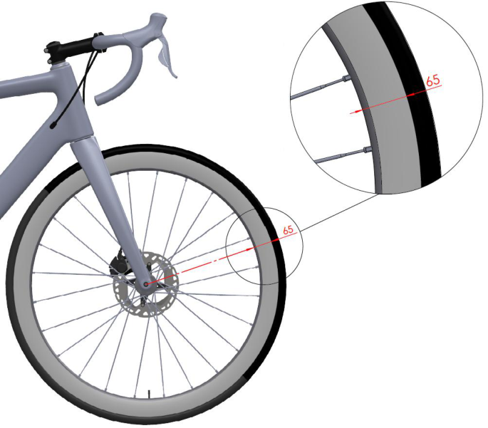

MEMORANDUM 08.06.2026 

## **PART 1 GENERAL ORGANISATION OF CYCLING AS A SPORT** 

## **Rules amendments applying on 01.01.2028** 

## **Chapter III EQUIPMENT** 

## **Section 2: bicycles** 

## **§ 4 Onboard technology** 

- **1.3.006 bis** Onboard technology devices, which capture or transmit data, may be fitted on bicycles or worn by riders subject to being authorised under the present article, without prejudice to other provisions of the UCI Regulations. The present article concerns any device which captures or transmits data as described below, including but not limited to sensors (worn or ingested), transponders, rider information systems, telemetry devices. 

   **1.** Devices which capture or transmit the following types of data are authorised: 

      - Positioning: information related to the location of the rider or the bicycle; 

      - − Image: still or moving images or footage captured from the bicycle  (such devices may only be fitted on the bicycle and may not be worn by the rider unless authorised under the specific regulations of a given discipline in the discipline-specific part of the UCI Regulations ~~authorise devices being worn by riders~~ ); 

      - Mechanical: information captured from the bicycle or any of its components, including but not limited to power, speed, cadence, accelerometer, gyroscope, gearing, tyre pressure. 

   **2.** Devices which capture or transmit the following physiological data are authorised: heartrate, body temperature, sweat rate. The authorisation is, however, limited to transmission protocols which enable only the rider concerned to view the data during a competition. 

   **3.** Devices which capture other physiological data, including any metabolic values such as but not limited to glucose or lactate are not authorised in competition. 

The authorised capturing and transmitting of data as provided under this article shall not enable a rider to view data of another rider. Likewise, teams shall only access data of their riders, where such transmission is authorised, unless information pertaining to riders of other teams is publicly available. 

Any onboard technology device fitted on a bicycle must: 

- Be installed on a system designed for bicycles and not affect the certification of any item of the bicycle; 

- Not cause a risk for the safety of any rider and, therefore, be affixed in a manner that ensures it is not susceptible of inadvertently dismounting or is non-removable. 

The UCI may grant derogations to any envisaged use of onboard technology which is not authorised by the present article. Derogation requests shall be assessed, inter alia, in consideration of criteria of equal access to equipment, sporting fairness and integrity, and shall also comply with articles 1.3.001 to 1.3.006. Derogations may be limited to specific events and riders or teams. 

The maximum permitted dimensions of any head unit device used may not exceed 126 x 71 mm across length/width. 

Any protective case or integrated enclosure must not exceed the dimensions of the head unit by more than 5 mm in any direction. 4 permitted mount types are allowed: 

− Standard mount with elastics or clamps; 

- Out-front mount; 

- Mountain bike mount; 

- Time-trial extension mount (without prejudice to Article 1.3.023) 

The UCI shall not be liable for any consequences deriving from the installation and use of onboard technology equipment by licence holders, nor for any defects it may hold or its non-compliance. 

For the sake of clarity, the present article does not govern or affect the ownership of the various data, meaning that the capturing, use and/or exploitation of the data remains subject to consent of the relevant rights’ holder. 

In respect of devices capturing moving or still images, whether specific to such function or integrated equipment worn by riders, their use is prohibited in the absence of written authorisation from the competition organiser. 

_(Article introduced on 10.06.21; 01.01.28_ 

## **Section 2: bicycles** 

## **§ 2 Technical specifications** 

- **1.3.018 (a) Wheel specification – Approval protocol** 

In the disciplines road, track and cyclo-cross, only wheel designs granted prior approval by the UCI as per the Approval Protocol may be used. 

Wheels which meet the definition of traditional wheels are assumed to be compliant and do not need to follow the Approval Protocol ~~application procedure provided for in this article~~. 

~~**Definition of Traditional wheels:**~~ **Traditional wheels are defined as meeting the criteria below:** 

~~Criteria:~~ 

- Rim height: Less than 25 mm; 

- Rim material: Alloy; 

- Spokes: Minimum of 20 steel spokes which are detachable; 

- General: All components must be identifiable and commercially available. 

All other wheel designs and/or wheel that do not meet all the above criteria, shall be considered non ‑ traditional and shall need to follow the Approval Protocol. 

## **(b) Rim specification** 

The front and rear wheels shall use rims of the same nominal diameter. For road, track, cyclo cross, the nominal rim diameter shall be: 

- Minimum: 500 mm; 

- − Maximum: 622 mm. 

Wheels approved in mass start competitions in the disciplines of road and cyclocross shall comply with the following requirements: 

- the maximum height of the rim does not measure more than 65 mm (measured as the perpendicular distance from the tangential line passing through any point of the outer extremity of the rim to the inner extremity of the rim), see illustration below; 

- have at least 12 spokes, which can be round, flattened or oval, provided that no dimension of their sections exceeds 10 mm. 

## **(c) Tyre specification** 

Tyres used on road, track and cyclo-cross may not incorporate any form of spikes or studs. 

The following dimensional limits apply per discipline: 

- Road and Track: the overall wheel diameter (including installed and inflated tyre) shall not exceed 700 mm; 

- Cyclo-cross: The width of the tyre (measured at the the section) shall not exceed 33 m ~~m and the tyre shall not incorporate any form of spikes or studs~~. 

~~Wheels of the bicycle may vary in diameter between 700 mm maximum and 550 mm minimum, including the tyre.~~ 

## **(d) Rim / Tyre compatibility** 

In order to comply with the requirements and ensure compatibility between the components, rims must comply with the standard ISO 5775-2 and tyres with the standard ISO 5775-1. The tyre’s nominal width and the rim’s internal width shall match the compatibility ranges defined by ISO 5775. 

## **(e) Impact test requirements** 

Wheels used in the road, track and cyclo-cross disciplines must meet the impact test requirements as specified in the standard ISO 4210-2:2023 Cycles — Safety requirements for bicycles, section 4.10.7.2.2., paragraph 2. Fulfillment of these requirements concerns both the front wheels and the rear wheels, independent of materials, brake systems and other characteristics. ~~Manufacturers must apply for approval by providing declaration of conformity to the UCI. Detailed procedure and template can be found in the section~~ “ ~~Equipment~~ ” ~~on the UCI Website.~~ 

~~Notwithstanding this article, the choice and use of wheels remains subject to articles 1.3.001 to 1.3.003.~~ 

In track competition, including motor-pacing, the use of a front disc wheel is only permitted in the specialties against the clock. 

_(text modified on 01.01.02; 01.01.03; 01.09.03; 01.01.05; 01.07.10; 01.10.13; 01.01.16, 25.06.19, 01.01.24; 01.01.26; 01.01.28)_
