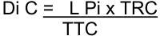

8 June 2026 

## MEMORANDUM 

## **Regulation amendments applying on 01.09.26** 

## **PART 3 TRACK RACES** 

## **Chapter II TRACK RACES** 

## **§ 1 General observations** 

## **Participation** 

- **3.2.001** The track season starts on January 1[st] and ends on December 31[st] . 

   - Track competitions shall be held in the categories as defined in article 1.1.036 and 1.1.037. 

Only riders aged 17 or more can take part in competitions on the international calendar, as defined in article 1.1.035. 

Junior riders of 18 years old can take part in competition for categories under 23 and elite. 

Riders of the under 23 category can take part in elite competitions. 

||Eligibility by|Eligibility by|~~CompetitionC~~ategory|
|---|---|---|---|
||~~Competition~~Category of the event|Eligible Riders||
||Elite|Elite, under-23, & junior riders aged 18 (2ndyear junior)||
||Under 23|Under 23 & junior riders aged 18 (2ndyear junior)||
||Junior|Junior riders||

Riders can take part in only one category by event within a competition registered on the international calendar. 

_(text modified on 25.09.07; 12.06.20; 17.10.22; 01.01.26; 01.09.26)_ 

## **Warnings – disqualification** 

- **3.2.014** In the event that bicycles are checked in conformity with articles 1.3.006 to ~~1.3.020~~ 1.3.023 with dedicated measuring devices, commissaires are entitled to doublecheck positions after the race on a random basis. Should the bicycle or positions have been modified in infringement with this regulation, the rider will be disqualified from the event and the remainder of the competition. 

_(article introduced on 10.06.05; modified on 01.09.26)_ 

Page **1** / **13** 

Allée Ferdi Kübler 12 1860 Aigle Switzerland 

T: +41 24 468 58 11 E: admin@uci.ch 

## **Start** 

**3.2.016** The starter shall give the start by means of a pistol shot or whistle, as specified in the regulations of the relevant event. In cases where the start is to be taken from a starting block, the following procedure shall apply: the brakes of the machine shall be released by the electronic system that simultaneously triggers the chronometer. Once the bicycle has been fixed, a clock placed before the rider, counts down the last 50 seconds before the start. 

_(article modified on 01.09.26)_ 

## **Sprints** 

**3.2.017** Sprints in all bunch events as well as the keirin shall be run according to the rules **quinquies** governing sprint races. 

_(article introduced on 01.09.26)_ 

## **§ 3 Sprint** 

## **Organisation of the event** 

**3.2.030** ~~The event shall be organised according to the table in article 3.2.050.~~ [abrogated on 01.09.26] 

**3.2.033** During World Cup and World Championships, 28 riders shall participate in the sprint tournament and it shall be conducted in accordance with the table in article 3.2.050. For other competitions, the same format can be used with a lower number of riders based on the table of article 3.2.050 qualifying either 16 or 8 riders. 

Prior to the first round, a qualifying 200 m time trial shall be run to determine the fastest 28 riders taking part to the sprint tournament and the makeup of the heats. 

_(text modified on 26.08.04; 10.06.05; 01.02.11; 20.06.14; 14.10.16; 01.09.26)_ 

## **§ 5 Team pursuit** 

- **3.2.087** Incomplete teams shall not take the start. 

In the qualifying round, incomplete teams shall be recorded as DNS with no assigned rank and shall not score UCI points ~~furthermore be disqualified~~ . 

If a team fails to take the start in the first round, no substitution shall be made. The team failing to start shall be classified in 8[th] place. 

If several teams fail to start, they shall be classified in 8th place and above in order of their times in the qualifying round. If the reason for failing to ride is not accepted by the commissaires’ panel, the absent team shall be disqualified, and its place shall remain vacant. The team that takes the start must ride alone to set a time to determine the composition of the finals. 

Page **2** / **13** 

Allée Ferdi Kübler 12 1860 Aigle Switzerland 

T: +41 24 468 58 11 E: admin@uci.ch 

_(text modified on 26.06.07; 01.10.11; 01.09.26)_ 

## **Race procedure** 

**3.2.092** The riders of each team shall start side by side behind the start line. 

The lateral distance between riders shall be one metre. 

(N) The rider, placed on the inside of the track, shall be held by a starting block and shall be the leading rider. The other riders shall be held at the start, with the hands of the holder as the only contact point. Any additional contact or any act of pushing is prohibited. Teams infringing this rule shall be disqualified. _(text modified on 03.03.14; 01.09.26)_ 

## **§ 7 Points Race** 

## **3.2.116** 

On tracks shorter than 333.33m, intermediate sprints shall be run off every 10 laps. 

On tracks of 333.33m, intermediate sprints shall be run off every 8 laps. 

On tracks ~~of 333.33m or~~ longer than 333.33m, intermediate sprints shall be run off every 5 laps. 

_(text modified on 01.08.23; 01.09.26)_ 

**3.2.117** The race shall be held over at least the following ~~the~~ distances, number of laps and number of sprints as shown in the following table: 

|TRACK LENGTH (in m)|_Event_|MEN ELITE|MEN ELITE|MEN ELITE|WOMEN ELITE|WOMEN ELITE|WOMEN ELITE|MEN|JUNIOR|JUNIOR|WOMEN JUNIOR|WOMEN JUNIOR|WOMEN JUNIOR|
|---|---|---|---|---|---|---|---|---|---|---|---|---|---|
|||_Distance_ _(km)_|_Laps_|_Sprints_|_Distanc_ _(km)_|_Laps_|_Sprints_|_Distance_ _(km)_|_La_|_Sprint_|_Distance_ _(km)_|_Lap_|_Sprints_|
|166|Qualif|15|90|9|10|60|6|10|60|6|10|60|6|
||Final|30|180|18|20|120|12|20|12|12|15|90|9|
|200|Qualif|14|70|7|10|50|5|10|50|5|8|40|4|
||Final|30|150|15|20|100|10|20|10|10|16|80|8|
|250|Qualif|15|60|6|10|40|4|10|40|4|10|40|4|
||Final|30|120|12|20|80|8|20|80|8|15|60|6|
|285.714|Qualif|16|56|5|10|42|4|12|42|4|10|35|3|
||Final|30|105|10|20|70|7|20|70|7|16|56|5|
|333.33|Qualif|14|42|~~8~~5|10|30|~~6~~3|10|30|~~6~~3|10|30|~~6~~3|
||Final|30||~~18~~|20|60|~~12~~7|20|60|~~12~~7|16|48|~~9~~6|
||||90|||||||||||
|||||||||||||||
|400|Qualif|14|35|7|10|25|5|10|25|5|8|20|4|
||Final|30|75|15|20|50|10|20|50|10|16|40|8|

Page **3** / **13** 

Allée Ferdi Kübler 12 1860 Aigle Switzerland 

T: +41 24 468 58 11 E: admin@uci.ch 

_During World Cup, Continental Championships, and World Championships the distances, number of laps and number of sprints shall be as shown in the following table:_ 

|TRACK LENGTH (in m)|_Event_|MEN ELITE|MEN ELITE|MEN ELITE|WOMEN ELITE|WOMEN ELITE|WOMEN ELITE|MEN JUNIOR|MEN JUNIOR|MEN JUNIOR|WOMEN JUNIOR|WOMEN JUNIOR|WOMEN JUNIOR|
|---|---|---|---|---|---|---|---|---|---|---|---|---|---|
|||_Distance_ _(km)_|_Laps_|_Sprints_|_Distanc_ _e_ _(km)_|_Laps_|_Sprints_|_Distance_ _(km)_|_Laps_|_Sprints_|_Distance_ _(km)_|_Laps_|_Sprints_|
|200|Qualif.|20|100|10|15|75|7|15|75|7|10|50|5|
||Final|40|200|20|25|125|12|25|125|12|20|100|10|
|250|Qualif.|20|80|8|15|60|6|15|60|6|10|40|4|
||Final|40|160|16|25|100|10|25|100|10|20|80|8|
|285.71|Qualif.|20|70|7|16|56|5|16|56|5|10|35|3|
||Final|40|140|14|25|84|8|25|84|8|20|70|7|
|333.33|Qualif.|20|60|~~12~~7|16|48|~~9~~6|16|48|~~9~~6|10|30|~~6~~3|
||Final|40|120|~~24~~15|25|75|~~15~~9|25|75|~~15 9~~|20|60|~~12~~7|
||Qualif.|20|50|10|16|40|8|16|40|8|10|25|5|
|400|Final|40|100|20|25|65|13|25|60|12|20|50|10|

In the case where the total number of laps is not divisible by the indicated number of laps between sprints, the “additional” laps shall be ridden prior to the first sprint. (For example, on a 285.7m track, sprints are held every 10 laps. If the race is 56 laps, the first sprint will take place after 16 laps, and then every 10 laps thereafter). 

_(text modified on 01.01.02; 01.01.03; 30.03.09; 04.03.19; 01.10.19; 12.06.20; 17.10.2022, 01.08.23; 01.09.26)_ 

- **3.2.122** ~~Sprints shall be run according to the rules governing sprint races~~ [abrogated on 01.09.26] 

## **§ 8 Keirin** 

## **Organisation of the event** 

- **3.2.135** (N) The event shall at least include: 

   - 10 riders 

   - a qualifying round, 2 heats of 5 riders; 

   - a final for places 7 to 10; 

   - a final for places 1 to 6. 

   - During the World Cup and World Championships, the event shall at least include: 

   - a 1[st] round, 2[nd] round (1/4 finals), semi-finals (1/2 finals); 

   - a final for places 7 to 12; 

   - a final for places 1 to 6. 

_(text modified on 04.03.19; 01.09.26)_ 

**3.2.139** The start shall be given by the mean of a whistle when the pacer approaches the pursuit line in the sprinters’ lane. At the start, riders shall take their positions determined by the draw, for at least the first lap, failing which the race shall be 

Page **4** / **13** 

Allée Ferdi Kübler 12 1860 Aigle Switzerland 

T: +41 24 468 58 11 E: admin@uci.ch 

stopped and riders that failed to comply shall be disqualified. In the restart, the remaining riders shall again take their same relative positions behind the pacer. 

_(text modified on 01.01.02; 1.02.03; 19.06.09; 14.10.16; 01.01.26; 01.09.26)_ 

- **3.2.141** ~~The race shall be run according to the Sprint Regulations~~ [abrogated on 01.09.26] 

## **§ 9 Team Sprint** 

- **3.2.151** The riders of each team shall start side by side behind the start line. The lateral distance between riders shall be 1.5 metres. 

(N) The rider, placed on the inside of the track, shall be held by a starting block and shall be the leading rider. The other riders shall be held at the start, with the hands of the holder as the only contact point. Any additional contact or any act of pushing is prohibited. Teams infringing this rule shall be disqualified. 

_(text modified on 01.01.02; 26.08.04; 10.06.05; 03.03.14; 01.09.26)_ 

## **§ 10 Madison** 

## **Organisation of the event** 

- **3.2.157** If the number of teams entered exceeds the track limit, qualifying heats shall take place according to the tables below. The heats shall be run in such a way as to qualify up to the track maximum number of teams, without necessarily qualifying the maximum number of teams permitted. An equal number of teams shall be eliminated from each heat, at a minimum of 2 teams per heat, among the teams who have started the race. 

The event shall be held over at least the following distances (number of laps), and number of sprints as shown in the following table: 

|TRACK LENGTH (in m)|_Event_|MEN ELITE|MEN ELITE|MEN ELITE|WOMEN ELITE|WOMEN ELITE|WOMEN ELITE|MEN JUNIOR|MEN JUNIOR|MEN JUNIOR|WOMEN JUNIOR|WOMEN JUNIOR|WOMEN JUNIOR|
|---|---|---|---|---|---|---|---|---|---|---|---|---|---|
|||_Distance_ _(km)_|_Laps_|_Sprints_|_Distance_ _(km)_|_Laps_|_Sprints_|_Distanc_ _(km)_|_Laps_|_Sprints_|_Distance_ _(km)_|_Laps_|_Sprints_|
|166|Qualif|15|90|9|10|60|6|10|60|6|10|60|6|
||Final|30|180|18|20|120|12|20|12|12|15|90|9|
|200|Qualif|14|70|7|10|50|5|10|50|5|8|40|4|
||Final|30|150|15|20|100|10|20|10|10|16|80|8|
|250|Qualif|15|60|6|10|40|4|10|40|4|10|40|4|
||Final|30|120|12|20|80|8|20|80|8|15|60|6|
|285.714|Qualif|16|56|5|12|42|4|12|42|4|10|35|3|
||Final|30|105|10|20|70|7|20|70|7|16|56|5|

Page **5** / **13** 

Allée Ferdi Kübler 12 1860 Aigle Switzerland 

T: +41 24 468 58 11 E: admin@uci.ch 

|333.33 400|Qualif|14|42|~~8~~5|10|30|~~6~~3|10|30|~~6~~3|10|30|~~6~~3|
|---|---|---|---|---|---|---|---|---|---|---|---|---|---|
||Final|30|90|~~18~~11|20|60|~~12~~7|20|60|~~12~~7|16|48|~~9~~6|
||Qualif|14|35|7|10|25|5|10|25|5|8|20|4|
||Final|30|75|15|20|50|10|20|50|10|16|40|8|

_At World Cup, Continental Championships, World Championships and Olympic Games, the distances, number of laps and number of sprints shall be as shown in the following table:_ 

|TRACK LENGT H (in m)|_Event_|MEN ELITE|MEN ELITE|MEN ELITE|WOMEN ELITE|WOMEN ELITE|WOMEN ELITE|MEN JUNIOR|MEN JUNIOR|MEN JUNIOR|WOMEN JUNIOR|WOMEN JUNIOR|WOMEN JUNIOR|
|---|---|---|---|---|---|---|---|---|---|---|---|---|---|
|||_Distanc_ _e (km)_|_Laps_|_Sprints_|_Distanc_ _e (km)_|_Laps_|_Sprints_|_Distance_ _(km)_|_Laps_|_Sprints_|_Distanc_ _e (km)_|_Laps_|_Sprints_|
|200|Qualif.|25|125|12|15|75|7|15|75|7|10|50|5|
||Final|50|250|25|30|150|15|30|150|15|20|100|10|
|250|Qualif.|25|100|10|15|60|6|15|60|6|10|40|4|
||Final|50|200|20|30|120|12|30|120|12|20|80|8|
|285.71 4|Qualif.|25.1|88|8|15.1|53|5|15.1|53|5|10|35|3|
||Final|50|175|17|30|105|10|30|105|10|20|70|7|
|333.33|Qualif.|25|75|~~15~~9|14|42|~~8~~5|14|42|~~8~~5|10|30|~~6~~3|
||Final|50|150|~~30~~18|30|90|~~18 ~~11|30|90|~~18 ~~11|20|60|~~12~~7|
||Qualif.|26|65|12|14|35|7|14|35|7|10|25|5|
|400|Final|50|125|25|30|75|15|30|75|15|20|50|10|

There shall be an equal number of laps between all sprints, starting from the final sprint, according to the following: Tracks of less than 333.33m – 10 laps Tracks of 333.33m – 8 laps Tracks of more than 333.3m ~~or more~~ – 5 laps 

In the case where the total number of laps is not divisible by the indicated number of laps between sprints, the “additional” laps shall be ridden prior to the first sprint. (For example, on a 285.7m track, sprints are held every 10 laps. If the race is 56 laps, the first sprint will take place after 16 laps, and then every 10 laps thereafter). 

_(text modified on 01.01.02; 30.03.09; 01.07.17; 04.03.19; 01.10.19; 17.10.22, 01.08.23; 01.01.25; 01.09.26)_ 

**3.2.165** ~~Sprints shall be run according to the Regulations governing Sprint~~ [abrogated on 01.09.26] 

## **§ 11 Scratch Race** 

## **Mishaps** 

**3.2.182** Any rider not ~~ending f~~ inishing the race ~~will not be placed~~ shall be recorded in accordance with article 3.3.012. A rider not finishing the race due to a fall in the final kilometre, or not being able to return to the track during the final kilometre, will be allocated the next available ranking (and points) after the riders who finished 

Page **6** / **13** 

Allée Ferdi Kübler 12 1860 Aigle Switzerland 

T: +41 24 468 58 11 E: admin@uci.ch 

the race, and shall then be ranked considering the laps gained or lost and the number of riders remaining on the track at this moment. 

_(text modified on 26.08.04; 20.09.05; 30.09.10; 04.03.19; 01.09.26)_ 

## **§ 16** 

## **Omnium** 

**3.2.247** In competitions for which the number or riders entered exceeds the track limit and **bis** there is no existing qualification system to establish the number of participating riders, their selection shall be determined as follows: 

All riders entered shall first participate in Points Race qualifying heats run over the distance and with the number of sprints, specified in the first table of the article 3.2.117, which applies to qualifying heats of international competitions, regardless of the class of competition. The heats shall be run in such a way so as to qualify up to the track maximum number of riders, without necessarily qualifying the maximum number of riders permitted. An equal number of riders shall be eliminated from each heat, at a minimum of 2 riders per heat, among the riders who have started the race. 

~~All riders not qualifying to participate in the Omnium shall be placed jointly in last position. Any riders not finishing any of the qualifying rounds for whatever reason shall not be placed.~~ 

_(article introduced on 18.06.10, text modified on 01.08.23, 01.01.25, 01.01.26)_ 

- **3.2.251** In the case of the Scratch Race, any rider not finishing the race due to a fall in the **ter** final kilometre, or not being able to return to the track during the final kilometre, will be allocated the next available ranking (and points) after the riders who finished the race, and shall then be ranked considering the laps ~~taken~~ gained or lost and the number of riders remaining on the track at this moment. 

_(article introduced on 15.03.16; modified on 14.10.16; 01.07.17; 01.10.17; 12.06.20; 01.01.26; 01.09.26)_ 

## **Chapter III UCI TRACK RANKINGS** 

- **3.3.006** All national federations shall immediately communicate any facts or decisions that could result in an amendment to the points obtained by a rider. 

Should such information not be transmitted, the ~~Management Committee~~ UCI may declassify the competition in question or exclude it from the Calendar, notwithstanding any other penalties provided for in the Regulations. 

_(text modified on 25.10.21, 01.08.23, 01.09.26)_ 

- **3.3.008** The UCI ~~Management Committee~~ may award prizes to riders, in accordance with such criteria as it may establish and with their placing within the system of Ranking. 

_(text modified on 01.01.21; 01.09.26)_ 

Page **7** / **13** 

Allée Ferdi Kübler 12 1860 Aigle Switzerland 

T: +41 24 468 58 11 E: admin@uci.ch 

## **National championships** 

**3.3.010** The points for the national championships are those awarded to an international **ter** competition of Class 2. 

Points will only be awarded to the national championships registered beforehand and appearing on the UCI Track Calendar. The results must reach the UCI electronically after the competition is finished on the specified deadline for calculating quota for the various competitions, or the deadline for submission of results to DataRide, whichever is sooner. Results submitted after this deadline will not be considered. 

When two or three nations are organising joint national championships, each nation must register their championships on the UCI Track Calendar in order to consider results distinctively for the purposes of awarding points. 

Where elite and under 23 ~~men~~ riders compete in the national championships in the same event, points are awarded according to their position in the classification of the event. 

For national federations organizing a separate event for the under-23 category, the points are awarded as for the corresponding elite event. 

~~Any rider can claim the award of points in only one category by event, where applicable, his own.~~ 

~~Where the title of national champion for an event is awarded at an international competition, the riders, regardless of their nationality, shall be awarded the points relative to their position in the classification of that event.~~ It is not possible for the classification of an event to be used to award points in more than one competition, such as for an international competition and national championships. 

_(text modified on 04.03.19; 01.10.19; 01.09.26)_ 

## **Chapter IV UCI TRACK WORLD CUP** 

**3.4.007** The maximum number of participants by national team for each event shall be the following: 

|MEN||WOMEN||
|---|---|---|---|
|Team Sprint|~~2 ~~1team~~s ~~|Team Sprint|~~2 ~~1team~~s~~|
|Sprint|2 riders|Sprint|2 riders|
|Keirin|2 riders|Keirin|2 riders|
|1 km Time Trial|2 riders|1 km Time Trial|2 riders|
|Team pursuit|~~2 ~~1team~~s ~~|Team pursuit|~~2 ~~1team~~s~~|
|Individual pursuit|2 riders|Individual Pursuit|2 riders|
|Points race|1 rider|Points race|1 rider|
|Scratch race|1 rider|Scratch race|1 rider|
|Omnium|1 rider|Omnium|1 rider|
|Elimination|1 rider|Elimination|1 rider|
|Madison|1 team|Madison|1 team|

Page **8** / **13** 

Allée Ferdi Kübler 12 1860 Aigle Switzerland 

T: +41 24 468 58 11 E: admin@uci.ch 

A maximum of one substitute rider for each event is permitted. Substitute riders must be confirmed at the confirmation of starters as per article 3.4.009. 

Team Managers may forward modifications to the secretary of the ~~college of~~ commissaires’ panel ~~until~~ up to 30 minutes before the start of the first competition session on the day of each event. 

Rider registered and confirmed for a specific race and not showing up at the start will be sanctioned as per art. 1.2.055, unless a medical certificate prepared by the race doctor is presented to the race secretary prior to the start of the race. Upon presentation of a medical certificate, the unfit rider may be replaced by the substitute rider. The replaced rider shall be declared unfit to compete for a minimum period of forty-eight (48) hours, calculated from the start time of the event concerned. 

~~For the sake of clarity, in team events, only the best ranked team of the same nationality will score points as per article 3.3.002.~~ 

_(text modified on 01.01.02; 01.01.03; 26.08.04; 19.09.06; 25.09.07; 29.03.10; 18.06.10; 25.02.13; 10.04.13; 14.10.16; 12.06.20; 01.01.25; 01.09.26)_ 

## **3.4.016** 

A meeting shall be convened before the first event of the competition. It shall be attended by all the officials and the Team ~~Leaders~~ Managers. It shall be chaired by the president of the commissaires’ panel in the presence of the UCI Technical Delegate and the persons responsible for the organisation. 

_(text modified on 21.06.18, 01.08.23, 01.09.26)_ 

## **Chapter V WORLD RECORDS** 

## **General comments** 

## **3.5.001** 

The UCI shall recognise solely World ~~Track~~ Records for Track in the following categories and specialities: 

Flying start: 

All categories: 200 m and 500 m. 

Standing start: 

Men: Team Sprint (on 250m track only), 1 km, 4 km, 4 km team, hour record Women: Team Sprint (on 250m track only), 1 km, 4 km, 4 km team, hour record Junior Men: Team Sprint (on 250m track only), 1 km, 3 km, 4 km team Junior Women:  Team Sprint (on 250m track only), 1km, 3 km, 4 km team 

For Masters, Best Performances are covered under Chapter IX MASTERS. 

_(text modified on 01.01.02; 10.06.05, 24.09.09; 30.09.10; 01.01.25; 01.09.26)_ 

Page **9** / **13** 

Allée Ferdi Kübler 12 1860 Aigle Switzerland 

T: +41 24 468 58 11 E: admin@uci.ch 

**3.5.005** Records may only be set during a competition ~~or during a special attempt~~ that shall ~~also b~~ e ridden in accordance with the relevant UCI regulations, with the exception of the Hour record attempt. 

Any ~~special attempt~~ Hour record requires the prior written authorization of the UCI. In this regard such authorization is subject to the requirements determined by the UCI including, but not limited to, requirements related to the UCI Anti-Doping Rules. Riders making a ~~special~~ Hour record attempt must be included in the UCI Registered Testing Pool and provide accurate and up-to-date whereabouts information and must be subjected to doping controls collected and analysed in accordance with Athlete Biological Passport programme as implemented by the UCI. If the rider is not in the Registered Testing Pool or does not have any Athlete Biological Passport, all the associated costs for testing the rider or any extra controls shall be borne by the rider. 

Moreover, an ~~special attempt~~ Hour record attempt must be authorized in writing in advance by the national federation of the rider(s). This authorization must reach the UCI no later than four months prior to the attempt. 

~~Specific World~~ Hour record attempts shall not take place during the World Championships. ~~competitions other than for the hour record.~~ 

~~Each application for the Hour record attempt must state a specific time and a single date for that attempt. For the other World Record special attempts, the organiser (rider, national federation, team, or other) must identify a time window of maximum 2 hours in which the attempt must take place. The rider may make more than one attempt for the record provided that the attempts start within the declared 2 hours window. In the event of a recognised mishap, the attempt may be rescheduled for the day after the fixed date, following the same principle.~~ 

~~If the organiser wishes to alter the date or time after receiving UCI authorisation, it is imperative that all relevant parties be duly notified by the organiser, particularly with regards to the facilities, timekeeping, commissaires and doping control. Furthermore, the organiser shall submit a formal request for authorisation to the UCI, accompanied by a statement confirming that all necessary measures have been taken to ensure full compliance with the applicable provisions.~~ 

_(text modified on 01.09.2026)_ 

- **3.5.005** Each application for the Hour record attempt must state a specific time and a **bis** single date for that attempt. For Hour record attempts, in the event of a recognised mishap within the first half-lap, the attempt shall be stopped and restarted immediately; if such a mishap occurs after the first half-lap, the attempt may be rescheduled for the day after the fixed date, following the same principle. 

If the organiser wishes to alter the date or time after receiving UCI authorisation, it is imperative that all relevant parties be duly notified by the organiser, particularly with regards to the facilities, timekeeping, commissaires and doping control. Furthermore, the organiser shall submit a formal request for authorisation to the UCI, accompanied by a statement confirming that all necessary measures have been taken to ensure full compliance with the applicable provisions. 

Page **10** / **13** 

Allée Ferdi Kübler 12 1860 Aigle Switzerland 

T: +41 24 468 58 11 E: admin@uci.ch 

_(article introduced 01.09.26)_ 

- **3.5.007** For hour record attempts ~~outside competition,~~ the rider ~~or the team~~ shall take the track alone. Circulation on the track by any other rider or person is prohibited, except for the rider undertaking the attempt, in the hour preceding it. 

_(text modified on 01.01.02; 01.09.26)_ 

- **3.5.027** The bicycle and other riding components as required in the equipment submission form available on the UCI website shall be submitted to the UCI for approval no later than ~~15~~ 30 days before the date of the attempt. 

(text modified on 15.05.14; 01.01.25; 01.09.26) 

- **3.5.031** The distance covered in the hour shall be calculated as follows: 

D = (L Pi x TC) + Di C 

Where: D = distance covered in the hour 

L Pi = length of track 

TC = number of complete laps before the last lap 

Di C = additional distance TTC = time of the last complete lap after the the bell is rung TRC = time remaining to ride at the beginning of the last lap 

_(text modified on 01.09.26)_ 

## ~~**Best hour performance behind derny**~~ 

**3.5.034** ~~The best hour performance behind derny is the greatest distance achieved in one hour on a bicycle in compliance with articles 1.3.006 to 1.3.010.~~ 

~~The moped (derny) must comply with articles 3.6.029 to 3.6.051 and the attire of the moped pacers must comply with article 3.6.063. In no case the machine may be fitted with a roll behind the rear wheel.~~ 

~~The bicycle and the moped (derny) shall be submitted to the Equipment Unit for approval at least 15 days before the date of the attempt.~~ 

[abrogated on 01.09.26] 

**3.5.035** ~~The articles 3.5.028 to 3.5.033 of the hour record regulation shall apply.~~ 

[abrogated on 01.09.26] 

Page **11** / **13** 

Allée Ferdi Kübler 12 1860 Aigle Switzerland 

T: +41 24 468 58 11 E: admin@uci.ch 

## **Chapter VI EQUIPMENT AND INFRASTRUCTURE** 

## **§ 6 Velodromes** 

## **Safety zone** 

**3.6.072** Immediately inside the blue band there shall be a prepared and marked safety zone. Its colour must be clearly distinguishable from that of the blue band. The combined width of the blue band and the safety zone shall be at least 4 metres for tracks of 250 metres and over, and 2.5 metres for tracks shorter than 250 metres. 

With the exception of the commissaires, mounted riders or other persons authorised by the president of the commissaires’ panel, no person or object (including starting blocks) may be inside the safety zone when a rider is on the track. 

_(text modified on 01.01.02; 26.08.04, 01.08.23; 01.09.26)_ 

## **200 metre line** 

- **3.6.083** A white line shall be drawn, across the full width of the track, 200 metres before the finish line, from which point the times will be taken for sprint events. 

_(text modified on 01.09.26)_ 

## **100 metre line** 

- **3.6.083** A white line, 4 m in length, shall be drawn on the track 100 metres before the finish **bis** line. From this point, the partial time for the 200 metres time trial shall be taken. 

(article introduced on 01.09.26) 

## **Chapter X RACE INCIDENTS AND SPECIFIC INFRINGEMENTS** 

## **Warnings - disqualification** 

- **3.10.003** Any offence not specifically penalised and any dangerous or unsportsmanlike behaviour may be punished by a warning, indicated by a yellow flag, or by disqualification, indicated by a red flag, according to the gravity of the fault, notwithstanding the fine provided for in article 12.3.005. On each occasion the commissaires will indicate at the same time the race number of the faulting rider. The warning and disqualification are relative to one competition only. 

If a rider is relegated in an event, that relegation may also carry with it a warning, depending on the gravity, intent and impact of the fault. 

If a rider is issued a warning in an event, the warning will also be carried to the other events within the same competition. A rider receiving a second warning, within the same event is disqualified from the event and for the rest of the competition. A rider receiving 3 warnings in a competition, or being relegated for the third time, is disqualified for the rest of the competition. 

In the Madison, any warning issued during the event shall be attributed both to the rider at fault and to his team. A team receiving two warnings within the same event 

Page **12** / **13** 

Allée Ferdi Kübler 12 1860 Aigle Switzerland 

T: +41 24 468 58 11 E: admin@uci.ch 

shall be disqualified from that event. The rider shall be subject to the provisions set out above in respect of the accumulation of warnings in events / competitions and the applicable sanctions. 

A rider disqualified in an event for dangerous or unsportsmanlike behaviour is effectively disqualified for the entire competition. 

_(text modified on 26.08.04;10.06.05; 01.02.11; 01.10.19; 12.06.20; 01.08.23; 01.01.25; 01.09.26)_ 

Page **13** / **13** 

Allée Ferdi Kübler 12 1860 Aigle Switzerland 

T: +41 24 468 58 11 E: admin@uci.ch 

