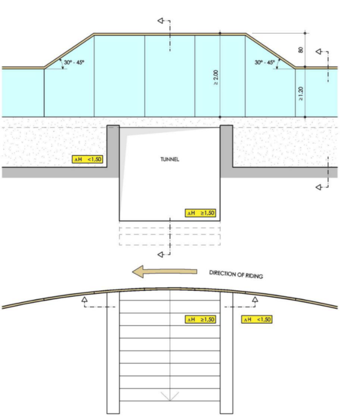
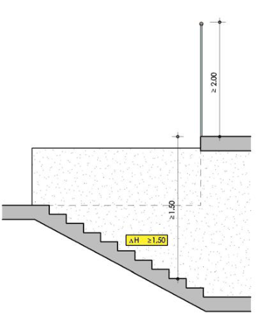
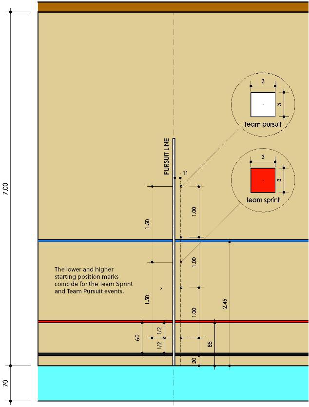
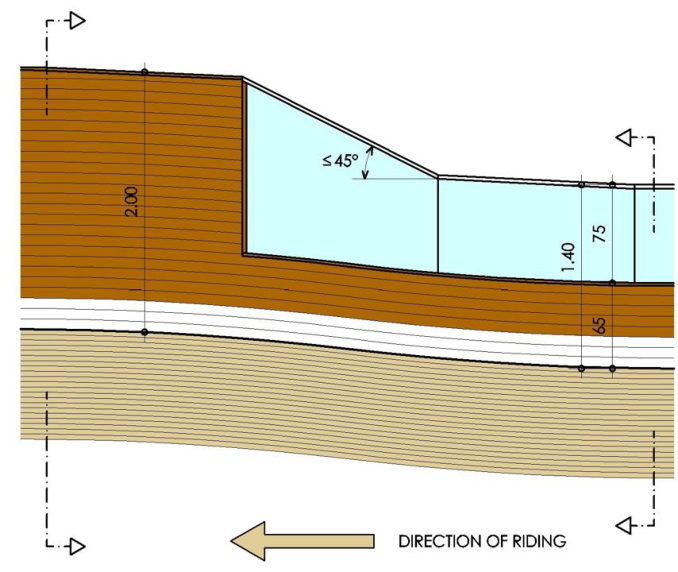
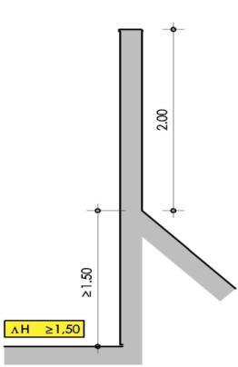
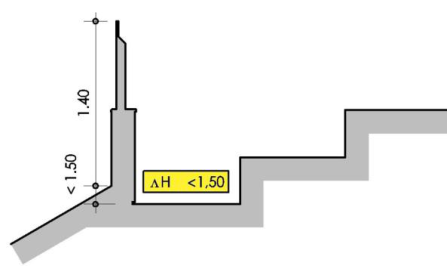

16.06.2025 

## MEMORANDUM 

## **Regulation amendments applying on 01.01.26** 

## **PART 3 TRACK RACES** 

## **Chapter II TRACK RACES** 

## **§ 1 General observations** 

## **Participation** 

- **3.2.001** The track season starts on January 1[st] and ends on December 31[st]. 

Track competitions shall be held in the categories as defined in article 1.1.036 and 1.1.037. 

Only riders aged 17 or more can take part in competitions on the international calendar, as defined in article 1.1.035. 

Junior riders of 18 years old can take part in competition for categories under 23 and elite. 

Riders of the under 23 category can take part in elite competitions. 

|**Eligibility by Competition Category**|**Eligibility by Competition Category**|
|---|---|
|**Competition Category**|**Eligible Riders**|
|Elite|Elite, Under-23, & junior riders aged 18 (2ndyear junior)|
|Under 23|Under 23 & junior riders aged 18 (2ndyear junior)|
|Junior|Junior riders|

_(text modified on 25.09.07; 12.06.20; 17.10.22, 01.01.26)_ 

## **Conduct of riders** 

**3.2.004** Other than when prevented by circumstances beyond their control, all riders qualifying for the following round of an event must participate or else they will be disqualified for the event and the remainder of the competition. 

_(text modified on 14.10.16; 01.01.26)_ 

## **Lap counter and bell** 

**3.2.017** Unless otherwise provided in a specific provision, the start of the sprint lap(s), **bis** including the last lap, of a race shall be indicated by a bell. The bell shall be rung when the ~~leader on the track~~ head of the race crosses the finish line, and again for any rider or group of riders who may also score points in a sprint. Points will be awarded, or the race will be over upon the next time the ~~leader on the track~~ head of the race crosses the finish line. The final determination as to who the ~~leader on the track~~ head of the race shall be made by the president of the commissaires’ panel. Either the president, or a commissaire designated by the president, shall indicate the ~~leader on the track~~ head of the race during bunch events ~~races.~~ 

_(article introduced on 04.03.19; modified on 01.10.19; 01.01.25, 01.01.26)_ 

Page **1** / **38** 

Allée Ferdi Kübler 12 1860 Aigle Switzerland 

T: +41 24 468 58 11 E: admin@uci.ch 

## **Neutralisation** 

## **3.2.020 bis** 

Unless otherwise provided in a specific provision, in a bunch event, in the case of a recognised mishap of a rider, or both riders of a team in Madison, the rider, or team, shall be entitled to a neutralisation for the number of laps closest to 1250 metres (5 laps on a 250m-track), counted from the moment of the mishap until they resumed their position that they occupied before the mishap. 

Beyond the distance of 1250 metres, neutralised riders or teams begin to lose laps until they resumed their position that they occupied before the mishap. 

Neutralised riders or teams may not return to the track within the last kilometre. Should this last kilometre start during the allowed neutralisation period of a recognised mishap, and the riders not be able to return prior to the start of the last kilometre, these neutralised riders or teams shall appear in the final placings depending on the points and laps accumulated prior to the mishap, unless otherwise provided in a specific provision. 

_(article introduced on 04.03.19; modified on 01.10.19; 12.06.20; 01.01.26)_ 

## **Seeding** 

**3.2.021** For all competitions, other than ~~Nations~~ World Cup, World Championships and **bis** Olympic Games, rider and teams shall be seeded according to the following table: ~~their current UCI Individual Track Ranking Classification.~~ 

||**Events**||**UCI Ranking to use**|
|---|---|---|---|
|- Sprint - Keirin - Kilometre Time Trial||UCI Individual Ranking (Sprint)||
|- Elimination Race - Omnium - Scratch Race - Points Race - Individual Pursuit||UCI Individual Ranking (Endurance)||
|- Madison - Team Pursuit - Team Sprint||UCI Nation Rankings (specific to the event)||

Riders/teams with no ranking shall be seeded last in random order by the commissaires’ panel. In the case where qualification heats are held for a bunch ~~race~~ event, riders in the subsequent race and finals shall be seeded according to the results from these heats. 

For ~~Nations~~ _World Cup_, _World Championships_ and _Olympic Games_, riders and teams shall be seeded by the UCI. When applicable, the current World Champion will have the best seed. 

_(article introduced on 01.02.11; text modified on 01.10.12; 12.06.20, 01.01.26)_ 

Allée Ferdi Kübler 12 1860 Aigle Switzerland 

T: +41 24 468 58 11 E: admin@uci.ch 

## **Restart in standing start events** 

**3.2.021** In each round of a standing start event, a team or a rider is only permitted two starts. **ter** A restart shall only be given in the result of a false start, or in the event of a recognised mishap as per article 3.2.021. 

A team or a rider which causes a further false start or suffer a further recognised mishap in the qualifying round shall be eliminated (DNF). 

A team or a rider which causes a further false start or suffer a further recognised mishap in the first round shall be relegated. 

A team or a rider which causes a further false start or suffer a further recognised mishap during the finals loses the final. 

If a team or rider stops after suffering a mishap and the starter determines it is not a recognised mishap, the team or rider shall be ~~disqualified~~ eliminated (DNF) from the qualifying round of the event, or be relegated in the following rounds. 

_(article introduced on 04.03.19; text modified on 01.08.23; 01.01.26)_ 

## **3.2.039** 

The rider on the inside of the track, unless overtaken, shall lead at least at walking pace and make no manoeuvre to force his opponent through until reaching the pursuit line on the opposite side of the track. Should the leading rider not respect this requirement, the race shall be restarted and the rider not at fault shall decide their starting position. In a three or four up heat, the riders not at fault shall decide their starting positions according to the order of the last draw. 

_(text modified on 01.01.02; 01.01.04; 01.10.11; 01.08.23; 01.01.26)_ 

## **Race stoppages** 

## **3.2.048** 

1. In the case of a fall, the starter may stop the race. 

If the fall is caused by a competitor riding too slowly in a ~~curve~~ bend or by any other unintentional fault, the race shall be restarted and the rider not at fault shall decide their starting position. In a three or four up heat, the riders not at fault shall decide their starting positions according to the order of the last draw. 

If the fall ~~be~~ is intentionally caused by a competitor, that competitor shall be relegated or disqualified from the competition according to the gravity of the fault committed and the other competitor declared the winner. In three or four up heat, the race shall be immediately restarted with the remaining two or three riders. 

If the fall is not caused by a competitor committing a fault, the commissaires’ panel shall decide whether the race is to be restarted with the riders in the same order or whether the positions at the time of the fall should be considered final. 

2. In the case of a puncture or the breakage of an essential part of the bicycle, the starter may stop the race. Even if the race is not stopped, the commissaires’ panel shall decide whether the race is to be restarted with the riders in the same order or whether the positions at the time of the incident should be considered final. 

3. In the case of a rider losing their balance or touching their opponent or barrier before the start of the sprint, the starter may stop the race. The race shall be 

Allée Ferdi Kübler 12 1860 Aigle Switzerland 

T: +41 24 468 58 11 E: admin@uci.ch 

restarted, and the rider not a fault shall decide their starting position. In a three or four up heat, the riders not at fault shall decide their starting positions according to the order of the last draw. 

4. In the case where a rider commits a flagrant infringement before the bell rings to indicate the start of the final lap or before the start of the sprint, whichever is sooner, the starter shall stop the race and the commissaires’ panel may relegate or disqualify the rider committing the infringement. In a three or four up heat, the race shall be immediately restarted with the remaining two or three riders in their same positions. 

If the rider committing the infringement is not relegated or disqualified, the race shall be restarted, and the opponent shall decide their starting position. In a three or four up heat, the riders not at fault shall decide their starting positions according to the order of the last draw. 

_(text modified on 01.01.02; 01.08.23; 01.01.26)_ 

## **§ 5 Team pursuit** 

## **3.2.085** 

This event shall be organised in two phases: 

1. The qualifying round to select the 4 best teams on the basis of their times; 2. The finals. 

The teams having made the two best times shall ride off the final for ~~first~~ 1[st] and ~~second~~ 2[nd] places, the two others shall ride off the final for ~~third~~ 3[rd] and ~~fourth~~ 4[th] places. 

First round: 

At ~~Nations~~ World Cup, Continental Championships, the World Championships and the Olympic Games, the 8 teams recording the best times in the qualifying rounds shall be matched in the first round as follows: 

The team having obtained the 7 ~~6~~[t][h] fastest time against the one having obtained the ~~7~~ 8[th] fastest time. 

The team having obtained the 5[th] fastest time against the one having obtained the 6 ~~8~~[t][h] fastest time. 

The team having obtained the 2[nd] fastest time against the one having obtained the 3[rd] fastest time. 

The team having obtained the fastest time against the one having obtained the 4[th] fastest time. 

~~The heats shall be ridden in the inverse order to that stated below. If an odd number of teams qualify to the first round (5 or 7 teams), the team to take the track alone must be the qualified team that recorded the slowest time.~~ 

## Finals: 

The winners of the last two heats in the first round shall ride the final for ~~first~~ 1[st] and ~~second~~ 2[nd] places. 

The remaining 6 teams shall be ranked according to their times from the first round and shall dispute the finals as follows: 

The two fastest teams shall ride the final for 3[rd] and 4[th] places. 

## **At the Olympic Games, only:** 

The next two fastest teams shall ride the final for 5[th] and 6[th] places. The final two teams shall ride the final for 7[th] and 8[th] places. 

Allée Ferdi Kübler 12 1860 Aigle Switzerland 

T: +41 24 468 58 11 E: admin@uci.ch 

_(text modified on 01.01.02; 26.08.04; 26.06.07; 01.02.11; 20.06.14; 14.10.16, 01.08.23; 01.01.26)_ 

**3.2.086** In the last two heats of the first round, if one team catches the other, the starter shall fire the gun and the catching team is declared the winner. The catching team ~~and~~ shall stop as soon as possible in order to allow the other team to finish the distance and thus to record a time. In this case, if one or both teams catch their opponents, the times from the qualifying round shall be used to determine which of the two teams shall finish in the home straight. 

During the finals, if one team is caught by the other, the race is over, and the catching team shall be declared the winner. The starter shall fire the gun to indicate that the race is over. Additionally, the Starter shall also fire the gun for each team as they finish their race if neither team catches the other. 

~~In both situations above, a pistol shot marks the end of the race at the moment on which the team crosses its finish line at the full distance or at the moment on which one team catches the other.~~ 

_(text modified on 20.06.19; 01.10.19, 01.01.26)_ 

## **§ 8 Keirin** 

## **Organisation of the event** 

## **3.2.135** (N) The event shall at least include: 

- 10 riders 

- a qualifying round, 2 heats of 5 riders; 

- a final for places 7 to 10; 

- a final for places 1 to 6. 

_(text modified on 04.03.19)_ 

Allée Ferdi Kübler 12 1860 Aigle Switzerland 

T: +41 24 468 58 11 E: admin@uci.ch 

## The event shall be organised as shown in the following tables: 

||1stround|1stround||
|---|---|---|---|
|No of riders|No of heats|No of riders per heat||
|10 à 14|2|5-7|Top 3 in final 1-6 4th to 6th in final 7-12|

|||1stround|1stround||Repechages|Repechages|1/2 finals|1/2 finals||
|---|---|---|---|---|---|---|---|---|---|
|No of riders|No of heats|No of riders per heat|Riders qualified per heat for the 1/2 finals|No of heats|No of riders per heat|Riders qualified per heat for the 1/2 finals|No of heats|No of riders per heat||
|15 to 21|3|5-7|2|2-3|5-7|2-3|||Top 3 in final 1-6 Others in final 7-12|
|22 to 28|4|5-7|2|4|3-5|1|2|6||
|29 to42|6|4-7|1|6|3-6|1||||

|||1stround|1stround||Repechages|Repechages||1/4 finals|1/4 finals|Repechages|Repechages|Repechages|1/2 finals|1/2 finals||
|---|---|---|---|---|---|---|---|---|---|---|---|---|---|---|---|
|No of riders|No of heats|No of riders per heat|Riders qualified per heat for the 1/4 finals|No of heats|No of riders per heat|Riders qualified per heat for the 1/4 finals|No of heats|No of riders per heat|Riders qualified per heat for the 1/2 finals|No of heats|No of riders per heat|Riders qualified per heat for the 1/2 finals|No of heats|No of riders per heat||
|43 to 49|7|6-7|1|6|6-7|2|3|6-7|2|2|6-7|3|2|6|Top 3 in final 1-6 Others in final 7-12|
|50 to 56|8|6-7|1|7|6-7|2|4|5-6|2|2|7|2||||
|57 to 63|9|6-7|1|8|6-7|2|4|6-7|2|4|4-5|1||||
|64 to 70|10|6-7|1|9|6-7|2|4|7|2|4|5|1||||

|TRACK LENGTH|NO. OF LAPS|PACER (No. of laps to the finish)|
|---|---|---|
|250|6|3|

Page **6** / **38** 

Allée Ferdi Kübler 12 1860 Aigle Switzerland 

T: +41 24 468 58 11 E: admin@uci.ch 

## **COMPOSITION EXAMPLE OF KEIRIN EVENTS INVOLVING 28 RIDERS** 

|**COMPOSITION EXAMPLE OF KEIRIN EVENTS INVOLVING 28 RIDERS**|**COMPOSITION EXAMPLE OF KEIRIN EVENTS INVOLVING 28 RIDERS**|**COMPOSITION EXAMPLE OF KEIRIN EVENTS INVOLVING 28 RIDERS**|**COMPOSITION EXAMPLE OF KEIRIN EVENTS INVOLVING 28 RIDERS**|**COMPOSITION EXAMPLE OF KEIRIN EVENTS INVOLVING 28 RIDERS**|**COMPOSITION EXAMPLE OF KEIRIN EVENTS INVOLVING 28 RIDERS**|**COMPOSITION EXAMPLE OF KEIRIN EVENTS INVOLVING 28 RIDERS**|
|---|---|---|---|---|---|---|
||||||||
|1st ROUND|Composition: 4 HEATS of 7 riders A B C D R1 R2 R3 R4 R8 R7 R6 R5 R9 R10 R11 R12 R16 R15 R14 R13 R17 R18 R19 R20 R24 R23 R22 R21 R25 R26 R27 R28 Abbreviations: «R» Rank on the last UCI Individual ~~Keirin~~SprintRanking. In the absence of rank, drawing lots. Results: *QA1 *QB1 *QC1 *QD1 *QA2 *QB2 *QC2 *QD2 QA3 QB3 QC3 QD3 QA4 QB4 QC4 QD4 QA5 QB5 QC5 QD5 QA6 QB6 QC6 QD6 QA7 QB7 QC7 QD7 *Riders qualified for 2nd Round (Semi-finals) – the other riders participate in the repechages|4 HEATS of 7 riders A||B C D|||
|||R1||R2|R3|R4|
|||R8||R7|R6|R5|
|||R9||R10|R11|R12|
|||R16||R15|R14|R13|
|||R17||R18|R19|R20|
|||R24||R23|R22|R21|
|||R25||R26|R27|R28|
|||||~~Keirin~~SprintRanking. In the absence of rank, drawing lots.|||
|||*QA1||*QB1|*QC1|*QD1|
|||*QA2||*QB2|*QC2|*QD2|
|||QA3||QB3|QC3|QD3|
|||QA4||QB4|QC4|QD4|
|||QA5||QB5|QC5|QD5|
|||QA6||QB6|QC6|QD6|
|||QA7||QB7|QC7|QD7|
|REPECHAGES|Composition: 4 HEATS of 5 riders QA3 QB3 QC3 QD3 QD4 QC4 QB4 QA4 QC5 QB5 QA5 QD5 QB6 QA6 QD6 QC6 QA7 QD7 QC7 QB7 Results: *RA1 *RB1 *RC1 *RD1 All ranked 13 RA2 RB2 RC2 RD2 All ranked 17 RA3 RB3 RC3 RD3 All ranked 21 RA4 RB4 RC4 RD4 All ranked 25 RA5 RB5 RC5 RD5 *Riders qualified for 2nd Round (Semi-finals) – the other riders are ranked relative to the finish order of each of the heats (to be adapted depending on the number of heats)|4 HEATS of 5 riders|||||
|||QA3|QB3||QC3|QD3|
|||QD4|QC4||QB4|QA4|
|||QC5|QB5||QA5|QD5|
|||QB6|QA6||QD6|QC6|
|||QA7|QD7||QC7|QB7|
||||||||
|||*RA1|*RB1||*RC1|*RD1|
|||RA2|RB2||RC2|RD2|
|||RA3|RB3||RC3|RD3|
|||RA4|RB4||RC4|RD4|
|||RA5|RB5||RC5|RD5|
|2nd ROUND: (1/2 finals)|Composition: 2 heats of 6 riders FA FB QA1 QB1 QD1 QC1 QB2 QA2 QC2 QD2 RA1 RB1 RD1 RC1 Results: *FA1 *FB1 *FA2 *FB2 *FA3 *FB3 **FA4 **FB4 **FA5 **FB5 **FA6 **FB6 *Riders qualified for the FINAL 1 – 6 **Riders qualified for the FINAL 7 – 12||||||

Page **7** / **38** 

Allée Ferdi Kübler 12 1860 Aigle Suisse 

T: +41 24 468 58 11 E: admin@uci.ch 

## **COMPOSITION EXAMPLE OF KEIRIN EVENTS INVOLVING 30 RIDERS AT OLYMPIC GAMES AND UCI TRACK WORLD CHAMPIONSHIPS** 

|**COMPOSITION EXAMPLE OF KEIRIN EVENTS INVOLVING 30 RIDERS AT OLYMPIC GAMESAND UCI TRACK WORLD** **CHAMPIONSHIPS**|**COMPOSITION EXAMPLE OF KEIRIN EVENTS INVOLVING 30 RIDERS AT OLYMPIC GAMESAND UCI TRACK WORLD** **CHAMPIONSHIPS**|**COMPOSITION EXAMPLE OF KEIRIN EVENTS INVOLVING 30 RIDERS AT OLYMPIC GAMESAND UCI TRACK WORLD** **CHAMPIONSHIPS**|**COMPOSITION EXAMPLE OF KEIRIN EVENTS INVOLVING 30 RIDERS AT OLYMPIC GAMESAND UCI TRACK WORLD** **CHAMPIONSHIPS**|**COMPOSITION EXAMPLE OF KEIRIN EVENTS INVOLVING 30 RIDERS AT OLYMPIC GAMESAND UCI TRACK WORLD** **CHAMPIONSHIPS**|**COMPOSITION EXAMPLE OF KEIRIN EVENTS INVOLVING 30 RIDERS AT OLYMPIC GAMESAND UCI TRACK WORLD** **CHAMPIONSHIPS**|**COMPOSITION EXAMPLE OF KEIRIN EVENTS INVOLVING 30 RIDERS AT OLYMPIC GAMESAND UCI TRACK WORLD** **CHAMPIONSHIPS**|**COMPOSITION EXAMPLE OF KEIRIN EVENTS INVOLVING 30 RIDERS AT OLYMPIC GAMESAND UCI TRACK WORLD** **CHAMPIONSHIPS**|
|---|---|---|---|---|---|---|---|
|||||||||
|1st ROUND|Composition: 5 HEATS of 6 riders A B C D E R1 R2 R3 R4 R5 R10 R9 R8 R7 R6 R11 R12 R13 R14 R15 R20 R19 R18 R17 R16 R21 R22 R23 R24 R25 R30 R29 R28 R27 R26 Abbreviations: «R» Rank on the last UCI Individual~~Keirin~~SprintRanking. In the absence of rank, drawing lots. Results: *QA1 *QB1 *QC1 *QD1 *QE1 *QA2 *QB2 *QC2 *QD2 *QE2 QA3 QB3 QC3 QD3 QE3 QA4 QB4 QC4 QD4 QE4 QA5 QB5 QC5 QD5 QE5 QA6 QB6 QC6 QD6 QE6 *Riders qualified for 2nd Round (1/4-finals) – the other riders participate in the repechages|5 HEATS of 6 riders A B C D|||||E|
|||R1|R2||R3|R4|R5|
|||R10|R9||R8|R7|R6|
|||R11|R12||R13|R14|R15|
|||R20|R19||R18|R17|R16|
|||R21|R22||R23|R24|R25|
|||R30|R29||R28|R27|R26|
|||on the last UCI Individual||~~Keirin~~SprintRanking. In the absence of rank, drawing||||
|||*QA1|*QB1||*QC1|*QD1|*QE1|
|||*QA2|*QB2||*QC2|*QD2|*QE2|
|||QA3|QB3||QC3|QD3|QE3|
|||QA4|QB4||QC4|QD4|QE4|
|||QA5|QB5||QC5|QD5|QE5|
|||QA6|QB6||QC6|QD6|QE6|
|||||||||
|REPECHAGES|Composition: 4 HEATS of5riders QA3 QB3 QC3 QD3 QD4 QC4 QB4 QE3 QE4 QA4 QA5 QB5 QB6 QE5 QD5 QC5 QC6 QD6 QE6 QA6 Results: *RA1 *RB1 *RC1 *RD1 *RA2 *RB2 *RC2 *RD2 All ranked 19 RA3 RB3 RC3 RD3 All ranked 23 RA4 RB4 RC4 RD4 All ranked 27 RA5 RB5 RC5 RD5 *Riders qualified for 2nd Round (1/4-finals) – the other riders are ranked relative to the finish order of each of the heats|4 HEATS of5riders||||||
|||QA3|QB3||QC3|QD3||
|||QD4|QC4||QB4|QE3||
|||QE4|QA4||QA5|QB5||
|||QB6|QE5||QD5|QC5||
|||QC6|QD6||QE6|QA6||
|||||||||
|||*RA1|*RB1||*RC1|*RD1||
|||*RA2|*RB2||*RC2|*RD2||
|||RA3|RB3||RC3|RD3||
|||RA4|RB4||RC4|RD4||
|||RA5|RB5||RC5|RD5||
|2nd ROUND 1/4 finals|Composition: 3 heats of 6 riders A B C QA1 QB1 QC1 QD1 QE1 QA2 QB2 QC2 QD2 RB1 RA1 QE2 RC1 RD1 RA2 RD2 RC2 RB2 Results: *SA1 *SB1 *SC1 *SA2 *SB2 *SC2 *SA3 *SB3 *SC3 *SA4 *SB4 *SC4 All ranked 13 SA5 SB5 SC5 All ranked 16 SA6 SB6 SC6 *Riders qualified for ½ finals – the other riders are ranked relative to the finish order of each of the heats|||||||

Page **8** / **38** 

Allée Ferdi Kübler 12 1860 Aigle Suisse 

T: +41 24 468 58 11 

E: admin@uci.ch 

|3rd ROUND 1/2 finals||
|---|---|
||Composition: 2 heats of 6 riders SA SB SA1 SB1 SA2 SC1 SB2 SC2 SB3 SA3 SC3 SA4 SC4 SB4 Results: *FA1 *FB1 *FA2 *FB2 *FA3 *FB3 **FA4 **FB4 **FA5 **FB5 **FA6 **FB6 *Riders qualified for the FINAL 1 – 6 **Riders qualified for the FINAL 7 – 12|

_(text modified on 01.01.02; 30.03.09; 19.06.09; 21.06.18; 04.03.19; 12.06.20, 01.01.26)_ 

- **3.2.139** The start shall be given when the pacer approaches the pursuit line in the sprinters’ lane. At the start, riders shall take their positions determined by the draw ~~, directly behind the pacer,~~ for at least the first lap, failing which the race shall be stopped and riders that failed to comply shall be disqualified. In the restart, the remaining riders shall again take their same relative positions behind the pacer. 

_(text modified on 01.01.02; 1.02.03; 19.06.09; 14.10.16; 01.01.2026)_ 

- **3.2.143** A restart will take place immediately if a recognised mishap occurs within the first halflap. After the first half-lap no mishap will be taken into consideration. 

_(text modified on 01.01.02; 20.09.05; 04.03.19; 01.01.26)_ 

## **§ 9 Team Sprint** 

## **Organisation of the event** 

- **3.2.145** This event shall be organised in three phases at ~~Nations~~ World Cup, Continental Championships, World Championships and Olympic Games: 

   1. The qualifying round to select the 8 best teams on the basis of their times; 

   2. In the first round, the 8 best teams shall be matched as follows: The team having obtained the 4th fastest time against the one having obtained the 5th fastest time 

      - The team having obtained the 3rd fastest time against the one having obtained the 6th fastest time 

      - The team having obtained the 2nd fastest time against the one having obtained the 7th fastest time 

      - The team having obtained the fastest time against the one having obtained the 8th fastest time. 

   3. The finals The four winning teams from the first round shall dispute the finals. The teams having made the two best times shall ride the final for first and second places and the other two teams shall ride the final for third and fourth places. 

Page **9** / **38** 

Allée Ferdi Kübler 12 1860 Aigle Suisse 

T: +41 24 468 58 11 E: admin@uci.ch 

Teams beaten during the first round shall be placed fifth to eighth according to their times from the first round. 

Should there be less than 8 teams taking part in the event, the event shall be run as follows: 

|**7 teams**|**6 teams**|**5 teams**|**4 or less teams**|
|---|---|---|---|
|Qualifyinground|Qualifyinground|Qualifyinground|Qualifying round (no first round)|
|First round, based on the results of the qualifying round: a. 4th against 5th b. 3rd against 6th c. 2nd against 7th d. 1st alone|First round, based on the results of the qualifying round: a. 4th against 6th b. 3rd against 5th c. 2nd alone d. 1st alone|First round, based on the results of the qualifying round: a. 4th against 5th b. 3rd alone c. 2nd alone d. 1st alone||
|Final: Winners of each heat of the first round (4 teams)|Final: Winners of each heat of the first round (4 teams)|Final: Winners of each heat of the first round (4 teams)|Final: 4 best teams of the qualifying round|

_(text modified on 01.01.02; 14.10.16, 01.08.23; 01.01.26)_ 

## **§ 16** 

## **Omnium** 

**3.2.247** In competitions for which the number or riders entered exceeds the track limit and **bis** there is no existing qualification system to establish the number of participating riders, their selection shall be determined as follows: 

All riders entered shall first participate in ~~qualifying~~ Points Race qualifying heats run over the distance and with the number of sprints, ~~as per the regulations for Points Race qualifying heats~~ specified in the first table of the article 3.2.117, which applies to qualifying heats of international competitions, regardless of the class of competition. The heats shall be run in such a way so as to qualify up to the track maximum number of riders, without necessarily qualifying the maximum number of riders permitted. An equal number of riders shall be eliminated from each heat, at a minimum of 2 riders per heat, among the riders who have started the race. 

All riders not qualifying to participate in the Omnium shall be placed jointly in last position. Any riders not finishing any of the qualifying rounds for whatever reason shall not be placed ( ~~DNF~~ ). 

_(article introduced on 18.06.10, text modified on 01.08.23, 01.01.25, 01.01.26)_ 

- **3.2.249** [abrogated on 01.01.26] 

~~Any rider failing to attempt to start in one of the events shall not be allowed to take part in the subsequent events but shall be considered to have abandoned the omnium. He shall therefore figure last in the final classification with the provision~~ “ ~~DNF~~ ” ~~(did not finish~~ ). 

~~_(text modified on 01.08.23)_~~ 

- **3.2.249** For all the races, riders shall be lined up in single file along the railing and in the 

Page **10** / **38** 

Allée Ferdi Kübler 12 1860 Aigle Suisse 

T: +41 24 468 58 11 E: admin@uci.ch 

- **bis** sprinters lane in the order listed on the start list. For the Scratch Race, this order shall be based on the latest UCI ~~Omnium~~ Endurance Ranking. For the Points Race, Elimination, and Tempo Race, this order shall be based on the current intermediate Omnium classification. 

_(article introduced on 01.02.11; modified on 01.07.17; 01.10.17: 01.01.26)_ 

- **3.2.251** ~~Any rider abandoning any of the events shall be considered to have abandoned the~~ **bis** ~~omnium and shall be recorded in the final classification after the last placed rider with the provision~~ “ ~~DNF~~ ” ~~(did not finish) and no rank, as per article 3.3.012.~~ 

Any rider failing to start in one of the events or abandoning any of the events shall not be allowed to continue in the Omnium and shall be recorded in the final classification, in accordance with article 3.3.012. 

In the case of the Scratch Race and the Tempo Race, a rider losing two laps shall be withdrawn. That rider will be penalised with a deduction of 40 points in the classification of the Omnium and will be allocated the next available rank determined by the number of riders remaining on the track at this moment. If for any reason the rider is not withdrawn, they will be classified as though they had been at the point at which they lost their second lap (including the deduction of points). 

_(text modified on 18.06.10; 01.02.11; 20.06.14; 15.03.16; 01.10.19; 12.06.20, 01.08.23, 01.01.26)_ 

- **3.2.251** In the case of the Scratch Race, any rider not finishing the race due to a fall in the **ter** final kilometre, or not being able to return to the track during the final kilometre, will be allocated the next available ranking (and points) after the riders who finished the race considering the laps taken and the number of riders remaining on the track at this moment. 

   - _(article introduced on 15.03.16; modified on 14.10.16; 01.07.17; 01.10.17; 12.06.20; 01.01.26)_ 

## **Chapter III UCI TRACK RANKINGS** 

(Chapter introduced on 31.05.04; modified on 15.03.16) 

## **UCI Nation Ranking** 

- **3.3.002** A classification by nation for men and women, of elite and junior categories, is also drawn up for each competition referred to in article 3.3.009 and shall be the exclusive property of the UCI. 

For team events (Madison excluded), points for the ~~Ranking by Nations is calculated by summing the points in each competition~~ UCI Nation Ranking in a competition are summed up to the following maximum quota, equal to the regular number of riders composing the team. 

MEN WOMEN Team Pursuit: 4 Team Pursuit: 4 Team Sprint: 3 Team Sprint: 3 

Once a nation has reached its maximum quota in an event, its riders over quota will not receive any points. 

Page **11** / **38** 

Allée Ferdi Kübler 12 1860 Aigle Suisse 

T: +41 24 468 58 11 E: admin@uci.ch 

For ~~the Madison ranking, the Endurance ranking and the Sprint ranking~~ all events, the UCI Nation Ranking is calculated by summing the points in each competition as follows: 

- when applicable, the best Olympic Games result in each of the events included in the respective ranking. 

- the best World Championships result (as per the maximum number of riders by nationality stipulated in article 9.2.022) in each of the events included in the respective ranking. 

- the best Continental Championships result (as per the maximum number of riders by nationality stipulated in article 10.1.005) in each of the events included in the respective ranking. 

- the best ~~Nations~~ World Cup result (as per the maximum number of riders by nationality stipulated in article 3.4.007) in each of the events included in the respective ranking. 

- the best 3 Class 1 results (including Regional Games) in each of the events included in the respective ranking. 

- the best 3 Class 2 results (including Regional Games) in each of the events included in the respective ranking. 

- the best National Championships result in each of the events included in the respective ranking. 

_(text modified on 30.09.10; 14.10.16; 05.03.18; 21.06.18; 12.06.20; 25.10.21, 01.08.23; 01.01.25, 01.01.26)_ 

**3.3.003** The classification shall be established according to the points obtained by riders participating in Track competitions on the International Calendar, divided into classes according to article 3.8.003. 

The classification is drawn up over a period of one year by adding the points won since the preceding ranking was drawn up. At the same time, the remaining points obtained up to the same day of the previous year by each rider in international track cycling competitions are deducted. 

If during the one-year period two national, continental or World Championships are held in the same category, only the points of the most recent one will be taken into account. Points of the national, continental and World championships remain on the track classification until the next edition or for a maximum period of 18 months. 

The UCI may grant dispensation in case of unpredictable late change of the Elite World Championships dates. 

_(text modified on 10.06.05; 25.09.08; 01.10.12; 14.10.16; 21.06.18; 04.03.19; 17.10.2022, 01.01.26)_ 

Page **12** / **38** 

Allée Ferdi Kübler 12 1860 Aigle Suisse 

T: +41 24 468 58 11 E: admin@uci.ch 

## **Classification of competitions** 

- **3.3.009** Olympic Games UCI World Championships UCI ~~Nations~~ World Cup Continental Championships ~~UCI Track Champions League~~ 

   - Class 1 & Class 2 competitions (including Regional Games) National Championships 

_(text modified au 25.02.13; 15.03.16; 25.10.21, 01.08.23, 01.01.26)_ 

## **UCI Individual Ranking** 

- **3.3.010** Points are awarded according to the following scale, with only the best results of each rider in each of the events included in the respective rankings taken into account as follows: 

   - when applicable, the Olympic Games result 

   - the UCI World Championships result 

   - the Continental Championships result 

   - the best UCI ~~Nations~~ World Cup result 

   - ~~the UCI Track Champions League results~~ 

   - the best 3 Class 1 results (including Regional Games) 

   - the best 3 Class 2 results (including Regional Games) 

   - the National Championships result 

_(text modified on 12.06.20; 25.10.21, 01.08.23; 01.01.25, 01.01.26)_ 

## **UCI Track Team Ranking** 

## ~~**UCI Track Champions League**~~ 

- **3.3.010** [abrogated on 01.01.26] ~~The points for each event of the UCI Track Champions~~ **quarter** ~~League are those awarded to an international competition of class 2. Points are awarded for each event to the specific UCI Individual Ranking per event. Additional UCI points are awarded for the overall standings at the end of the UCI Track Champions League. Overall standings are established for Sprint events (Sprint and Keirin), and for Endurance events (Scratch and Elimination), for both categories Men and Women. Points of these overall standings are then equally divided and added to the UCI Individual Rankings. For Sprint events, points are allocated to UCI Individual Rankings of Sprint and Keirin, and for Endurance events to UCI Individual Rankings of Scratch, Elimination, Points race and Omnium, as per the following table:~~ 

Page **13** / **38** 

Allée Ferdi Kübler 12 1860 Aigle Suisse 

T: +41 24 468 58 11 E: admin@uci.ch 

|||||||~~ELITE~~ ~~Men and Women~~|~~ELITE~~ ~~Men and Women~~|~~ELITE~~ ~~Men and Women~~|~~ELITE~~ ~~Men and Women~~|~~ELITE~~ ~~Men and Women~~|~~ELITE~~ ~~Men and Women~~|
|---|---|---|---|---|---|---|---|---|---|---|---|
||~~Rank~~||~~**Overall**~~||~~**Points Allocation per specialisation in the UCI Individual**~~ ~~**Rankings**~~|||||||
|||||||||||||
||||||~~Sprint events~~||||~~Endurance events~~|||
|||||||||||||
||~~1~~|||~~900(2 x 450)~~|||||||~~900(4 x 225)~~|
||~~2~~|||~~800(2 x 400)~~|||||||~~800(4 x 200)~~|
||~~3~~|||~~750(2 x 375)~~||||||~~750(4 x 187.5)~~||
|||||||||||||
||~~4~~|||~~700(2 x 350)~~|||||||~~700(4 x 175)~~|
||~~5~~|||~~650(2 x 325)~~||||||~~650(4 x 162.5)~~||
|||||||||||||
||~~6~~|||~~600(2 x 300)~~|||||||~~600(4 x 150)~~|
||~~7~~|||~~550(2 x 275)~~||||||~~550(4 x 137.5)~~||
|||||||||||||
||~~8~~|||~~500(2 x 250)~~|||||||~~500(4 x 125)~~|
||~~9~~|||~~450(2 x 225)~~||||||~~450(4 x 112.5)~~||
|||||||||||||
||~~10~~|||~~400(2 x 200)~~|||||||~~400(4 x 100)~~|
||~~11~~|||~~360(2 x 180)~~|||||||~~360(4 x 90)~~|
||~~12~~|||~~320(2 x 160)~~|||||||~~320(4 x 80)~~|
||~~13~~|||~~280(2 x 140)~~|||||||~~280(4 x 70)~~|
||~~14~~|||~~240(2 x 120)~~|||||||~~240(4 x 60)~~|
||~~15~~|||~~200(2 x 100)~~|||||||~~200(4 x 50)~~|
||~~16~~|||~~175(2 x 87.5)~~||||||~~175(4 x 43.75)~~||
|||||||||||||
||~~17~~||||~~150(2 x 75)~~||||||~~150(4 x 37.5)~~|
||~~18~~|||~~125(2 x 62.5)~~||||||~~125(4 x 31.25)~~||

~~_(article introduced on 25.10.21)_~~ 

**3.3.011** The order of precedence between riders, nations or ~~UCI Track Teams~~ on equal points in the respective rankings shall be determined according to their classification of competitions in the following order: 

1. UCI World Championships; 

2. UCI ~~Nations~~ World Cup; 

3. Continental Championships; 

~~4. Ligue des Champions Piste UCI~~ 

4. ~~5~~ International competition of Class 1; 

5. ~~6~~ International competition of Class 2; 

6. ~~7~~ National Championships. 

If they still stand equal, precedence shall be awarded to the rider with the best classification in the most recent event of the same class of competitions. 

In a combined ranking, the tiebreaker shall be determined by comparing the best result, regardless of the event, following the same order. 

_(text modified on 13.06.08; 25.02.13; 15.03.16; 12.06.20; 25.10.21, 01.01.26)_ 

Page **14** / **38** 

Allée Ferdi Kübler 12 1860 Aigle Suisse 

T: +41 24 468 58 11 

E: admin@uci.ch 

## **Chapter IV UCI TRACK** ~~**NATIONS**~~ **WORLD CUP** 

## **Participation** 

**3.4.004** The competitions shall be for national teams. Riders shall be aged 18 (2[nd] year juniors) and over. 

The participation in the individual events shall be restricted to riders with at least 500 points in the respective UCI Track Ranking. Top 4 Junior riders at the most recent Junior World Championships in the bunch ~~races~~ events, Sprint or Keirin events can participate in the UCI Track ~~Nations W~~ orld Cup without the minimum points required, provided they are 2[nd] year juniors. 

For the Madison, participation shall be restricted to riders with at least 250 points in the respective UCI Track Ranking, or for riders who were in the top 4 teams in the Madison at the most recent Junior World Championships, provided they are 2[nd] year juniors. 

To be eligible, each rider must have the minimum amount of points required either six weeks before the first round of the ~~Nations W~~ orld Cup, or in the latest update of the respective UCI Track Ranking. 

For the development of track cycling, the UCI may grant dispensation of this requirement. Any request for dispensation must reach the UCI before the end of the registration period of each round. 

The participation in each event of the ~~Nations W~~ orld Cup determines the eligibility of the national federations to the corresponding event of the World Championships according to article 9.2.027bis. 

_(text modified on 01.01.03; 21.01.06; 25.02.13; 10.04.13; 20.06.14; 15.03.16; 01.07.17; 05.03.18; 12.06.20; 25.10.21; 17.10.22; 01.01.25, 01.01.26)_ 

## **Chapter V WORLD RECORDS** 

- **3.5.005** Records may be set during a competition or during a special attempt that shall also be ridden in accordance with the relevant UCI regulations. 

Any special attempt requires the prior written authorization of the UCI. In this regard such authorization is subject to the requirements determined by the UCI including, but not limited to, requirements related to the UCI Anti-Doping Rules. Riders making a special attempt must be included in the UCI Registered Testing Pool and provide accurate and up-to-date whereabouts information and must be subjected to doping controls collected and analysed in accordance with Athlete Biological Passport programme as implemented by the UCI. If the rider is not in the Registered Testing Pool or does not have any Athlete Biological Passport, all the associated costs for testing the rider or any extra controls shall be borne by the rider. 

Moreover, a special attempt must be authorized in writing in advance by the national federation of the rider(s). This authorization must reach the UCI no later than four months prior to the attempt. 

Specific World Record attempts shall not take place during the World Championships competitions other than for the hour record. 

Page **15** / **38** 

Allée Ferdi Kübler 12 1860 Aigle Suisse 

T: +41 24 468 58 11 E: admin@uci.ch 

Each application for the Hour record attempt must state a specific time and a single date for that attempt. For the other World Record special attempts, the organiser (rider, national federation, team, or other) must identify a time window of maximum 2 hours in which the attempt must take place. The rider may make more than one attempt for the record provided that the attempts start within the declared 2 hours window. In the event of a recognised mishap, the attempt may be rescheduled for the day after the fixed date, following the same principle. 

If the organiser wishes to alter the date or time after receiving UCI authorisation, it is imperative that all relevant parties be duly notified by the organiser, particularly with regards to the facilities, timekeeping, commissaires and doping control. Furthermore, the organiser shall submit a formal request for authorisation to the UCI, accompanied by a statement confirming that all necessary measures have been taken to ensure full compliance with the applicable provisions. 

_(text modified on 01.01.02; 15.05.14; 01.02.15; 01.10.19, 01.01.25, 01.01.26)_ 

## **Chapter VI EQUIPMENT AND INFRASTRUCTURE** 

## **§ 6 Velodromes** 

## **Width** 

- **3.6.070** The width of the track must be constant throughout its length. Tracks approved in category A ~~categories 1 and 2~~ must have a minimum width of 7 metres. Tracks approved in category B ~~Other tracks~~ must have a width proportional to its length of 5 metres minimum. 

_(text modified on 01.01.02, 01.01.26)_ 

- **3.6.072** A fence (inner fence) of a construction ensuring the adequate safety for riders to ~~at~~ a **bis** height of at least 120 cm above the level of the safety zone must be permanently installed ~~erected~~ on the inner edge of the safety zone. This requirement applies both during track competitions and outside of them, except in cases where there is no height difference or abrupt gradient between the safety zone and the track centre or within the track centre itself. In such cases, the inner fence must be installed (possibly temporarily) during competitions for all velodromes that received their initial homologation after 1 January 2026. 

~~except if the following conditions are met:~~ 

~~1. there are no height difference or abrupt gradient between the safety zone and the track centre or within the track centre, and~~ 

~~2. inside the safety zone and at a distance of 10 m of the blue band, is no unauthorized person or object in accordance with article 3.6.072.~~ 

The inner fence must be stable, solidly mounted, and transparent and in no circumstances may any advertising boards be attached to it. It must present no protrusions or projecting parts and the upper edge of the inner fence shall be fitted with protective covering. 

The inner fence must support at least the following loads: 

- 4 kN applied at any point up to a height of 65 cm 

- 1.5 kN applied at any point above 65 cm and up to the top 

Page **16** / **38** 

Allée Ferdi Kübler 12 1860 Aigle Suisse 

T: +41 24 468 58 11 E: admin@uci.ch 

The loads calculation must be certified by a structural engineer and provided during the homologation process, prior to the installation of the track. 

~~There must minimal gap between the bottom of the fence and the safety zone (less than 1 cm).~~ 

The inner fence shall be continuous and free of gaps wherever possible. Where unavoidable, any gaps shall be less than 1 cm, including those between the bottom of the fence and the safety zone. 

In places where the level of the ~~track proper s~~ afety zone is at a level 1.5 m or more ~~more than 1.5 m higher~~ than the actual track centre, additional protective measures such as nets, panels, or the like, shall be ~~erected~~ installed in order to prevent athletes being subjected to injury. In velodromes requesting their initial homologation after 1[st] January 2026, in places where the level of the safety zone is at a level 1.5 m or more than the actual track centre, the inner fence must have a minimum height of 2 m. This minimum height shall be measured at the location of the drop. 

Where there is a difference in the height of the inner fence, the transition between these heights must not exceed an angle of 45°. 

Page **17** / **38** 

Allée Ferdi Kübler 12 1860 Aigle Suisse 

T: +41 24 468 58 11 E: admin@uci.ch 

Diagram showing the inner fence at different heights 

Page **18** / **38** 

Allée Ferdi Kübler 12 T: +41 24 468 58 11 1860 Aigle E: admin@uci.ch Suisse 

Any gates provided in the fencing must be fitted with simple and reliable fastenings. They must be kept closed while racing and training is in progress. 

_(text modified on 01.01.02; 26.08.04; 01.01.25, 01.01.26)_ 

## **Surface** 

**3.6.074** The surface of the track shall be completely flat, homogenous, non-abrasive. The tolerance of flatness for the track surface shall be 5 mm over 2 metres. The track surface must be capable of withstanding a minimum load of 5 kN at any point on the track. The load calculation must be certified by a structural engineer and provided during the homologation process, prior to the installation of the track. The surface of the track shall be made of wood, concrete or asphalt. The use of other materials is permitted only upon submission of a dossier to the UCI for approval, demonstrating that all essential surface characteristics relevant to the discipline are ensured. The coating shall be uniform in all its aspects over the entire track surface. Coatings intended to improve the rolling qualities of one part of the track only are not permitted. 

_(text modified on 01.01.02, 01.01.26)_ 

- **3.6.078** The longitudinal lines covered by articles 3.6.079 to 3.6.081 shall have a constant width of 5 cm. The perpendicular lines covered by articles 3.6.082 to 3.6.084 shall have a constant width of 4 cm and shall not be drawn within the safety zone or the blue band. 

_(text modified on 01.01.26)_ 

## **Perpendicular markings:** 

## **Finish line** 

**3.6.082** The finish line shall be situated towards the end of one of the straights but at least a few metres before the entrance of the banking, and in principle in front of the main grandstand. 

It shall be marked by a perpendicular black line 4 cm in width at the centre of a white band 72 cm in width, thus leaving 34 cm of white band on each side of the black line. The finish line marking on the track shall continue up to the top of the flat surface of the fencing. 

_(text modified on 01.01.26)_ 

## **Pursuit lines** 

**3.6.084** Two ~~red~~ white lines ~~half the width of the track~~ 4 m in length, perpendicular to the track and precisely in line with one another, shall be drawn at the precise midpoint of each of the straights to mark the finish points for pursuit events. 

_(text modified on 01.01.26)_ 

Page **19** / **38** 

Allée Ferdi Kübler 12 1860 Aigle Suisse 

T: +41 24 468 58 11 E: admin@uci.ch 

- **3.6.084** Starting position marks, for the Team Pursuit and Team Sprint events shall be drawn **bis** at 11 cm from the pursuit lines. 

   - Team Pursuit: four white square markings (each a 9 cm[2] ), spaced 1 m apart, shall be used. The first marking, positioned on the inside of the track and defining the position of the others, shall be located halfway between the measuring and sprinters’ line. 

   - Team Sprint: three square markings (each a 9 cm[2] ), spaced 1.5 m apart, shall be used. The first marking, positioned on the inside of the track and defining the position of the others, shall coincide with the first marking used for the Team Pursuit. The third marking shall coincide with the fourth Team Pursuit starting position marking. The second marking, positioned between the first and third, is the only marking applied exclusively for the Team Sprint event and shall be coloured red. 

Diagram of the Starting Position Track Markings 

(article introduced on 01.01.26) 

Page **20** / **38** 

Allée Ferdi Kübler 12 1860 Aigle Suisse 

T: +41 24 468 58 11 E: admin@uci.ch 

## ~~**Fencing**~~ **Outer fence** 

**3.6.087** The outside edge of the track must be surrounded by a safety fence (outer fence) to protect riders and spectators. It must be stable and solidly mounted, with an overall height of at least 140 cm above the track for velodromes requesting their initial homologation after 1[st] July 2025. The inside part must be ~~completely~~ smooth, ~~and~~ unbroken and with n ~~o. It must present no protrusions or~~ projecting parts. 

The outer fence must support at least the following loads: 

- 4 kN applied at any point up to a height of 65 cm 

- 1.5 kN applied at any point above 65 cm and up to the top. 

The loads calculation must be certified by a structural engineer and provided during the homologation process, prior to the installation of the track. 

At the places where the area outside the track is at a level 1.5 metres or more below the outside edge of the track surface, additional protective measures (nets, panels, etc.) must be provided to reduce the risks resulting from riders accidentally leaving the track. In velodromes requesting their initial homologation after 1[st] January 2026, it is mandatory as part of the additional measures the installation of an outer fence, with a minimum height of 2 m. This minimum height shall be measured at the location of the drop. 

Where there is a difference in the height of the outer fence, the transition between these heights must not exceed an angle of 45°. 

Page **21** / **38** 

Allée Ferdi Kübler 12 1860 Aigle Suisse 

T: +41 24 468 58 11 E: admin@uci.ch 

Diagram showing the outer fence at different heights 

The colour of the outside fencing must contrast clearly with that of the track. When the outer fence is made entirely of transparent material, the lower part (up to a minimum height of 65 cm from the track side) should be made non-transparent. 

Any gates provided in the outside fencing must open outwards and be fitted with simple and reliable fastenings. They must be kept closed while racing and training is in progress. 

_(text modified on 01.01.02; 01.01.25, 01.01.26)_ 

## **Lighting** 

**3.6.090** Suitable lighting must be provided which meets the safety conditions into force in that country. 

The lighting system must be supplemented by an emergency lighting system operating independently of mains electricity, capable of providing an intensity of at least 100 Lux for 5 minutes which must be effective instantaneously. 

During training sessions without spectators, vertical lighting must be at least 300 lux (maintained average). 

During competitions, vertical maintained average of at least 1000 Lux is required for category A velodromes and 500 Lux for category B velodromes. 

For the World Cup, UCI World Championships, Continental Championships and the Olympic Games, the vertical maintained lighting level shall be at least 1400 Lux and evenly distributed. 

Luminaires and positioning must be designed and angled to avoid glare for riders, spectators and television broadcast. 

~~During competitions, at least 1400 Lux is required for the Elite World Championships and the Olympic Games (category 1 velodromes), at least 1000 Lux for category 2 velodromes and at least 500 Lux for category 3 and 4 velodromes.~~ 

_(text modified on 01.01.02, 01.01.26)._ 

Page **22** / **38** 

Allée Ferdi Kübler 12 1860 Aigle Suisse 

T: +41 24 468 58 11 E: admin@uci.ch 

## **ACCOMMODATION FOR OFFICIALS** 

## **Commissaires’ platform** ~~**Finish judge’s podium**~~ 

- **3.6.091** A platform ~~podium~~ must be provided for the commissaires ~~judge at the finish~~, located in the track centre in line with the finish line. 

_(text modified on 01.01.26)._ 

## ~~**Box for the commissaires’ panel**~~ 

- **3.6.092** [abrogated on 01.01.26] 

   - ~~Adequate accommodation must be provided for the commissaires on the track centre~~ 

   - ~~adjacent to the finish line.~~ 

~~_(text modified on 01.01.02)_~~ 

## ~~**Box for the j**~~ **Judge-referee platform:** 

- **3.6.093** ~~Provision~~ A platform must be provided for the judge-referee on the outside of the track. It must be in a quiet, isolated location overlooking the track with an unimpeded view, e.g. at the top of the stand above the finish line. Cable ducting must be provided from that location to the infield. During competitions, there must be a radio link between the referees and the other commissaires, including the starter and the president of the commissaires’ panel. 

_(text modified on 01.10.19, 01.01.26)_ 

## ~~**Centre podium platform for the starter**~~ **Starter’s platform:** 

- **3.6.093** In the middle of the track centre in line with the pursuit lines, a ~~podium~~ platform must **bis** be provided for the starter. It must have an area of between 3 and 4 m[2] and must be raised above track level, to ensure the starter has an unobstructed view along the full length of both pursuit lines. 

_(text modified on 01.01.02, 01.01.26)_ 

## **HOMOLOGATION OF VELODROMES** 

**3.6.094** At the time of their homologation, velodromes shall be classified into ~~four~~ two categories on the basis of the technical quality of the track and installations, ~~The category determines the level of competition which can be organised in the velodrome,~~ as shown in the following table: 

||~~**CATEGORY**~~||~~**HOMOLOGATION**~~|~~**HOMOLOGATION**~~|~~**HOMOLOGATION**~~|~~**HOMOLOGATION**~~|||~~**LEVEL OF COMPETITIONS**~~|~~**LEVEL OF COMPETITIONS**~~|~~**LEVEL OF COMPETITIONS**~~|~~**LEVEL OF COMPETITIONS**~~|
|---|---|---|---|---|---|---|---|---|---|---|---|---|
||||||||||||||
||~~1~~||||~~UCI~~|||||~~Elite World Championships~~ ~~and Olympic Games~~|||
||||||||||||||
||~~2~~||||~~UCI~~||||~~Nations Cup~~ ~~Continental Championships~~ ~~Junior World Championships~~||||
||~~3~~||||~~UCI~~|||~~Other international competitions~~|||||
||||||||||||||
||~~4~~|||~~NATIONAL~~ ~~FEDERATION~~|||||||~~National competitions~~||
||||||||||||||
||||||||||||||
||||||||||||||
|**CATEGORY**||||||**CATEGORY A**||||||**CATEGORY B**|

Page **23** / **38** 

Allée Ferdi Kübler 12 1860 Aigle Suisse 

T: +41 24 468 58 11 E: admin@uci.ch 

|Type of Velodrome|Indoor (250m tracks only)|Indoor Roofed Cantilever Outdoor|
|---|---|---|

_(text modified on 01.01.26)_ 

**3.6.095** ~~Category 1 and 2 tracks~~ All tracks must meet the following criteria (calculated for a ~~maximum~~ minimum safe spee ~~ds~~ of at least ~~in the range~~ 85 km/h ~~to 110 km/h~~ ): 

|Length of the track|250 m|285.714 m|333.33 m|400 m|
|---|---|---|---|---|
|Radius of bends|19-25 m|22-28 m|25-35 m|28-50 m|
|Width|7-8 m|7-8 m|7-9 m|7-10 m|

~~Other tracks must be designed to guarantee a minimum safe speed of at least 75 km/h.~~ 

_(text modified on 01.01.02, 01.01.26)_ 

- **3.6.096** [abrogated on 01.01.26] ~~Requests for homologation shall be submitted to the UCI by the national federation of the country, in which the velodrome is located.~~ 

**3.6.097** The request for homologation must be sent to the UCI at least 2 months before the planned inspection date, by completing the homologation application form. It must be accompanied by a technical file complying with the UCI’s standard model. In any case, the national federation of the country, in which the velodrome is located, shall be informed and involved in the homologation process. 

The UCI may require any additional document or information. 

_(text modified on 01.01.02, 01.01.26)_ 

**3.6.098** The ~~national federation~~ applicant for the homologation shall organise the inspection of the velodrome in the presence of a specialist responsible for carrying out the regulation measurements under the direction of a UCI delegate. On this occasion, a test of the track by a group of riders must be carried out. 

All expenses incurred in connection with the inspection of the velodrome are to be covered by the applicant, the national federation being held jointly liable. 

The costs of the UCI delegate are covered in accordance with the conditions specified in the UCI financial obligations in force. 

_(text modified on 01.01.02; 01.01.2026)_ 

## **Chapter VII TRACK TEAMS** 

(Chapter introduced on 31.05.04) 

## **§ 3 Requirements imposed on the UCI Track Team for the registration Registration with the National Federation** 

Page **24** / **38** 

Allée Ferdi Kübler 12 1860 Aigle Suisse 

T: +41 24 468 58 11 E: admin@uci.ch 

- **3.7.019** Those UCI Track Teams registered with the UCI will receive the following benefits: 

   ~~1. Inclusion on the UCI Track Team Ranking. (as per article 3.3.002bis)~~ 

   1. Information services and publications in addition to the regular distributions. 

   ~~3. Direct entry services for major UCI competitions. (in compliance with article 3.4.004)~~ 

   2. Where applicable, advertising space on specific series jerseys 

_(text modified on 25.10.21, 01.01.26)_ 

Page **25** / **38** 

Allée Ferdi Kübler 12 1860 Aigle Suisse 

T: +41 24 468 58 11 E: admin@uci.ch 

## **Chapter VIII CALENDAR** 

**3.8.001** Every entity organising a track competition shall conduct the event in strict compliance **bis** with the UCI Constitution and UCI Regulations. All competitions registered on the UCI Track Calendar must respect the UCI financial obligations (in particular calendar fee, entry fees and prize money) approved by the UCI Management Committee and published on the UCI website. 

Entry fees for competitions on the UCI Track Calendar may only be demanded for Class 1 and Class 2 competitions, as well as the Masters World Championships and the Masters Continental Championships, in accordance with the UCI’s Financial Obligations. 

Any new competition will be registered in Class 2 for one year of probation. From the second edition, the organiser will be allowed to request an upgrade to Class 1. 

The status of a competition in Class 1 or 2 is yearly evaluated. Upgrade is accepted only if all the conditions are respected, that the organisation does not present any major issue and after UCI approval. 

_(text modified on 15.03.16; 01.07.17; 25.10.21; 01.01.26)_ 

Page **26** / **38** 

Allée Ferdi Kübler 12 1860 Aigle Suisse 

T: +41 24 468 58 11 E: admin@uci.ch 

## **World Calendar** 

## **3.8.003** 

||Type of competition|Type of competition|Criteria|Criteria|
|---|---|---|---|---|
||Olympic Games||-|As per the regulations for cycling events at the Olympic Games|
||UCI|World Championships|-|As per World Championships regulations|
||UCI|~~Nations~~WorldCup|-|As per articles 3.4.004 to 3.4.007|
||Continental Championships Regional Games||-|See article 3.8.004|
||~~UCI Track Champions League~~|||~~As per the regulations for the UCI Track~~ ~~Champions League~~|
||Class 1||Over the competition: - CL1 events for Men Elite and Women Elite3) - Additional events: for: Junior (M/W), U23 (M/W), or Para-cycling (minimum 1 category)4) - Minimum 5 events ofClass 12) Per event: - Minimum 4 participating nations1) ~~-~~ ~~A rider needs 10 Track UCI points to~~ ~~register in Elite and U23 events5)~~ - Minimum distance as per UCI regulations - Minimal number of riders per event Elite and U23:5) •Sprint: 8 riders (article 3.2.031) •Keirin: 10 riders (article 3.2.135) •Bunchevents ~~races:~~15 riders •Madison: 10 teams - Prize money for Elite events (as per the UCI Financial Obligations)||
||||~~-~~ - - • • • • -||
||Class 2||Over the competition: - CL2 events for Men Elite or Women Elite - Additional events for: Junior (M/W), U23 (M/W), Elite (M/W) or Para-cycling (minimum 1 category)4) - Minimum 3 eventsof Class 22) Per event: - Minimum 3 participating nations1) - Minimum distance as per UCI regulations - Minimal number of riders per event Elite and U23:5) •Sprint: 8 riders (article 3.2.031) •Keirin: 10 riders (article 3.2.135) •Bunchevents~~races:~~12 riders •Madison: 8 teams||

_1) In team events (Madison excluded), if a team is composed of riders from different nations (mixed team), the nation of the majority of riders shall prevail. In team events (Madison excluded), where no majority is possible, the nation of the participating rider shall not count. In Madison, the nations of all the riders taking part in the event shall be counted._ 

Page **27** / **38** 

Allée Ferdi Kübler 12 1860 Aigle Suisse 

T: +41 24 468 58 11 E: admin@uci.ch 

- _2) Events_ ~~_= specialisations_~~ _from the Elite World Championships programme, organised_ ~~_in a category_~~ _for Men Elite and Women Elite categories. 3) Both categories must reach Class 1 requirements to maintain the event in class 1 the following year._ 

- _4) Additional events can be of the competition class or lower (Class 1, Class 2 or National)_ 

~~_5) The rider needs 10 UCI points in any Elite UCI track ranking on the day of the competition to take part in Elite or U23 events. No minimum UCI points is necessary in Individual Pursuit, Time Trial, Team Pursuit and Team Sprint or in Junior and Paracycling events._~~ 

_5) No minimum is necessary in other events (Individual Pursuit, Time Trial, Team Pursuit and Team Sprint)_ 

_(article modified on 01.01.04; 01.10.13; 3.03.14; 15.03.16; 05.03.18; 25.10.21; 01.01.25, 01.01.26)_ 

## **Chapter IX MASTERS** 

(chapter introduced on 10.06.05) 

## **Participation in the UCI Masters Track World Championships** 

- **3.9.001** All 35 years old and older riders holding a master license shall be entitled to participate in the UCI Masters Track World Championships, except the following: 

   1. Any rider who was a member of any track team registered with the UCI in the current season. The season is the period referred to in the second indent of article 3.3.003. 

   2. Any rider who has participated in any World Championships, Olympic Games, Continental Championships, Regional Games or ~~Nations~~ World Cup in the current year in the track discipline (para excluded), except for the races that are open to masters only. 

   3. [abrogated on 04.06.16] 

_(text modified on 19.09.06; 30.01.09; 04.06.16; 05.03.18, 01.08.23, 01.01.26)_ 

**3.9.002** All ~~applicants~~ participants for the UCI Masters Track World Championships must present a valid license to the competition’s headquarters in order to be given a race number and be permitted to participate. The license must have been issued by the rider’s UCI-affiliated national federation and must be valid for an entire calendar year. 

_(text modified on 01.08.23, 01.01.26)_ 

- **3.9.006** UCI Masters Track World Championships are normally organised in age groups of five years: 35-39, 40-44, 45-49 etc. Depending on the number of participants in each age group, the latter may be regrouped with an adjoining age group. In this instance, separate classifications will be drawn up. 

There shall be no separate race for an age group if there are less than 12 participants in mass start events (i.e. points race) or less than 8 participants in the other events. 

For team events, ~~a majority of the riders of a team shall have the same age group. Only one rider maximum in each team may be older than the age group.~~ 

a team may include riders from more than one age category. However, the team must compete in the age category corresponding to the youngest rider. 

Page **28** / **38** 

Allée Ferdi Kübler 12 1860 Aigle Suisse 

T: +41 24 468 58 11 E: admin@uci.ch 

_(text modified on 25.01.08; 30.01.09; 05.03.18; 21.06.18, 01.08.23, 01.01.26)_ 

## **Races distances** 

## **3.9.006 A. Points Race** 

**bis** The races shall be held over the following distances: 

|**Gender**|**Event**|**35-39**|**40-44**|**45-49**|**50-54**|**55-59**|**60-64**|**65-69**|**70-74**|**75+**|
|---|---|---|---|---|---|---|---|---|---|---|
|**Men**|PR|30km|20km|20km|15km|15km|10km|10km|10km|10km|
|**Women**|PR|15km|10km|10km|10km|10km|10km|10km|10km|10km|
|If more than 24 riders,qualifyings(half distance)asper 3.2.117 // 10points forgaining/losinga lapfor races under 20km|||||||||||

## **B. Scratch** 

The races shall be held over the following distances: 

|**Gender**|**Event**|**35-39**|**40-44**|**45-49**|**50-54**|**55-59**|**60-64**|**65-69**|**70-74**|**75+**|
|---|---|---|---|---|---|---|---|---|---|---|
|**Men**|SH|10km|10km|10km|7.5km|7.5km|5km|5km|5km|5km|
|**Women**|SH|5km|||||||||
|If more than 24 riders,qualifyings (half distance) asper 3.2.175|||||||||||

## **C. Sprint** 

The races shall be held over the following number of laps: 

|**Gender**|**Event**|**35-39**|**40-44**|**45-49**|**50-54**|**55-59**|**60-64**|**65-69**|**70-74**|**75+**|
|---|---|---|---|---|---|---|---|---|---|---|
|**Men**|SP|3 laps|||||||||
|**Women**|SP|3 laps|||||||||
|Asper table in art. 3.2.050|||||||||||

## **D. Individual Pursuit** 

The races shall be held over the following distances: 

|**Gender**|**Event**|**35-39**|**40-44**|**45-49**|**50-54**|**55-59**|**60-64**|**65-69**|**70-74**|**75+**|
|---|---|---|---|---|---|---|---|---|---|---|
|**Men**|IP|3km|3km|3km|2km|2km|2km|2km|2km|2km|
|**Women**|IP|3km|3km|3km|2km|2km|2km|2km|2km|2km|
|Qualification and best 4 in finals|||||||||||

Page **29** / **38** 

Allée Ferdi Kübler 12 T: +41 24 468 58 11 1860 Aigle E: admin@uci.ch Suisse 

## **E. Time Trial** 

The races shall be held over the following distances: 

|**Gender**|**Event**|**35-39**|**40-44**|**45-49**|**50-54**|**55-59**|**60-64**|**65-69**|**70-74**|**75+**|
|---|---|---|---|---|---|---|---|---|---|---|
|**Men**|TT|1km|750m|750m|500m|500m|500m|500m|500m|500m|
|**Women**|TT|1km|750m|750m|500m|500m|500m|500m|500m|500m|
|Direct finals|||||||||||

## **F. Team Pursuit** 

The races shall be held over the following distances: 

|**Gender**|**Event**|**35-39**|**40-44**|**45-49**|**50-54**|**55-59**|**60-64**|**65-69**|**70-74**|**75+**|
|---|---|---|---|---|---|---|---|---|---|---|
|**Men**|TP|4km, 4 riders|||||||||
|**Women**|TP|4km, 4 riders|||||||||
|Qualification and best 4 in finals|||||||||||

## **G. Team Sprint** 

The races shall be held over the following number of laps: 

|**Gender**|**Event**|**35-39**|**40-44**|**45-49**|**50-54**|**55-59**|**60-64**|**65-69**|**70-74**|**75+**|
|---|---|---|---|---|---|---|---|---|---|---|
|**Men**|TS|3 laps, 3 riders|||||||||
|**Women**|TS|3 laps, 3 riders|||||||||
|Qualification and best 4 in finals|||||||||||

_(article introduced on 01.01.26)_ 

Page **30** / **38** 

Allée Ferdi Kübler 12 1860 Aigle Suisse 

T: +41 24 468 58 11 E: admin@uci.ch 

## **Chapter X RACE INCIDENTS AND SPECIFIC INFRINGEMENTS** 

(chapter introduced on 12.06.20) 

|**3.10.008** **Table of race incidents and specific infringements relating to track competitions**|**3.10.008** **Table of race incidents and specific infringements relating to track competitions**|**3.10.008** **Table of race incidents and specific infringements relating to track competitions**|**3.10.008** **Table of race incidents and specific infringements relating to track competitions**|**3.10.008** **Table of race incidents and specific infringements relating to track competitions**|**3.10.008** **Table of race incidents and specific infringements relating to track competitions**|||
|---|---|---|---|---|---|---|---|
|||**Column 1**||**Column 2**|||**Column 3**|
|||Olympic Games Elite World Championships ~~Nations~~WorldCup||Junior World Championships Continental Championships Continental Games Class 1 and 2 Men, U23 and Elite Class 1 and 2 Women, U23 and Elite Para-cycling: Paralympic Games World Championships World~~Nations~~Cup|||Class 1 and 2 Men, Junior Class 1 and 2 Women, Junior National events Other events Para-cycling: Other competitions|
|**1.** **Procedures at the official meeting and ceremonies**||||||||
|1.1 Failing to attend official ceremonies (including press conference, etc.)||Rider:500 fine and forfeiture of prizes and points for respective UCI rankings earned during the event.||Rider:|||Rider:100 fine and forfeiture of prizes and points for respective UCI rankings earned during the event.|
|1.2 Non-compliant clothing during podium and protocol ceremonies||Rider:500 fine per rider involved||Rider:200 fine per rider involved|||Rider:100 fine per rider involved|
|1.3 Failing to attend required Team Managers’meeting||Team Manager:300 fine||Team Manager:200 fine|||Team Manager:100 fine|
|**2.** **Equipment and innovations**||||||||
|2.1 Attempting to start a race with a bicycle that does not comply with the regulations||Rider:Start refused||Rider:Start refused|||Rider:Start refused|
|2.2 Starting a race on a bicycle that has not been checked||Team:200 fine and warning||Team:100 fine and warning|||Team:50 fine and warning|

Page **31** / **38** 

Allée Ferdi Kübler 12 T: +41 24 468 58 11 1860 Aigle E: admin@uci.ch Suisse 

|by the commissaires for that race|||||||
|---|---|---|---|---|---|---|
|2.3 Use of a bicycle that does not comply with the regulations||Rider:500 fine and disqualification||Rider:200 fine and disqualification||Rider:100 fine and disqualification|
|2.4 Use or presence of a bicycle that does not comply with article 1.3.010||Rider:Disqualification Team:Disqualification||Rider:Disqualification Team:Disqualification||Rider:Disqualification Team:Disqualification|
|2.5 Use of a prohibited remote communication system by a rider||Rider:Start refused, or disqualification Team Manager/Coach: Exclusion||Rider: Start refused, or disqualification Team Manager/Coach: Exclusion||Rider:Start refused, or disqualification Team Manager/Coach: Exclusion|
|2.6 Use of an electronic device with display on a bicycle that can be read by a rider during a race|| Rider:Start refused, or disqualification|| Rider:Start refused, or disqualification|| Rider:Start refused, or disqualification|
|2.7 Use of a technical innovation, innovative clothing or equipment not yet approved by the UCI during an event||Rider:Start refused, or disqualification||Rider:Start refused, or disqualification||Rider:Start refused, or disqualification|
|2.8 Evading, refusing or obstructing an equipment/ clothing check||Rider:Disqualification Other team member:Exclusion||Rider:Disqualification Other team member:Exclusion||Rider:Disqualification Other team member:Exclusion .|
|2.9 Modifying equipment/ clothing to be used in a race after it has been checked by the commissaires for that race||Rider:500 fine and disqualification Other team member:500 fine and exclusion||Rider:200 fine and disqualification Other team member:200 fine and exclusion||Rider:100 fine and disqualification Other team member:100 fine and exclusion|
|2.10 Carrying equipment on the bicycle or rider that falls, or can fall onto the track during a race||Rider:Start refused, or 300 fine, and/or warning or disqualification||Rider:Start refused, or 200 fine, and/or warning or disqualification||Rider:Start refused, or 100 fine, and/or warning or disqualification|
|2.11 Use of forbidden onboard technology device||Rider:Elimination or disqualification Other team member: Exclusion||Rider:Elimination or disqualification Other team member: Exclusion||Rider: Elimination or disqualification Other team member: Exclusion|

Page **32** / **38** 

Allée Ferdi Kübler 12 T: +41 24 468 58 11 1860 Aigle E: admin@uci.ch Suisse 

T: +41 24 468 58 11 

|||||||||
|---|---|---|---|---|---|---|---|
|**3.**|**Riders’ clothing and rider identification**|||||||
|3.1|~~Use of~~Non-compliant clothingdesign(form, colour, layout)||Rider:200 to 500* fine, and/or start refused or disqualification||Rider:100 to 300 fine*, and/or start refused or disqualification||Rider:50 to 100 fine*, and/or start refused or disqualification|
|3.2|Use of non-compliant clothing, helmet or accessories||Rider:Start refused or disqualification or elimination||Rider:Start refused or disqualification or elimination||Rider:Start refused or disqualification or elimination|
|3.3~~2~~Riderat the start without mandatory helmet|||Rider:Start refused||Rider:Start refused||Rider:Start refused|
|3.4~~3 ~~Rider taking off mandatory helmet during the race|||Rider:200 fine and disqualification||Rider:100 fine and disqualification||Rider:50 fine and disqualification|
|3.5~~4 ~~Rider taking off mandatory helmet after passing the finish line|||Rider:200 fine, and/or warning or disqualification||Rider:100 fine, and/or warning or disqualification||Rider:50 fine, and/or warning or disqualification|
|3.6~~5 ~~Body number replicated on a medium other than that provided by the organiser|||Rider:Start refused||Rider:Start refused||Rider:Start refused|
|3.7~~6 ~~Body number or transponder missing, not visible, modified, incorrectly positioned|||Rider:200 to 500 fine *||Rider:100 to 200 fine *||Rider:50 to 100 fine *|
|3.8~~7 ~~Incorrect body number or incorrect transponder|||Rider:200 to 500 fine *||Rider:100 to 200 fine *||Rider:50 to 100 fine *|
|3.9~~8~~ Different clothing (jersey, shorts, skinsuit) for the different riders of a team|||Rider:200 fine per rider involved||Rider:100 fine per rider involved||Rider:50 per rider involved|
|3.10~~9 ~~Wearing tinted glasses or visors while seated in the waiting area for a race|||Rider:200||Rider:200||Rider:200|
|3.11~~10~~ Riders in the same team and race failing to wear a distinguishing item on them|||Rider:100 fine per rider involved and/or warning||Rider:100 fine per rider involved and/or warning||Rider:50 fine per rider involved and/or warning|

Page **33** / **38** 

Allée Ferdi Kübler 12 T: +41 24 468 58 11 1860 Aigle E: admin@uci.ch Suisse 

||||||||
|---|---|---|---|---|---|---|
|**4.** **Irregular feeding**|||||||
|4.1 Unauthorised feeding||Rider:200 fine Other licence holder: 200 fine||Rider:100 fine Other licence holder: 100 fine||Rider:50 fine Other licence holder: 50 fine|
|**5.** **Non-regulation movement of riders on the track – For particularly serious cases, in addition to any warning, relegation or** **disqualification that may be issued**|||||||
|5.1 Deviation from the chosen line that obstructs or endangers another rider or irregular sprint (including pulling the jersey or saddle of another rider, moving down to quickly on another rider||Rider:200 fine||Rider:100 fine||Rider:50 fine|
|5.2 Non-regulation use of the blue band during the race||Rider:200 fine||Rider:100 fine||Rider:50 fine|
|5.3 Non-regulation movement of a rider during the race that obstructs a rider, or prevents that rider from passing||Rider:200 fine||Rider:100 fine||Rider:50 fine|
|5.4 Irregular movement causing the crash of a rider||Rider: 200 to 500*fine||Rider: 200 fine||Rider: 100 fine|
|5.5 Attempting to have a race stopped||Rider:200 to 500* fine Other licence holder:200 fine||Rider:100 to 200* fine Other licence holder:200 fine||Rider:50 to 100* fine Other licence holder:200 fine|
|**6.** **Irregular behaviour, in particular behaviour that affords a team**||||**or rider a sporting advantage or that is dangerous**|||
|6.1 Rider refusing to quit the race after being withdrawn by the commissaires||Rider:200 fine, and disqualification||Rider:100 fine and disqualification||Rider:50 fine, and disqualification|

Page **34** / **38** 

Allée Ferdi Kübler 12 1860 Aigle Suisse 

T: +41 24 468 58 11 E: admin@uci.ch 

|6.2 Rider refusing to quit the race after being disqualified by commissaires||Rider:200 to 500* fine||Rider:100 to 200* fine||Rider:50 to 100 fine|
|---|---|---|---|---|---|---|
|6.3 Encouraging a rider to remain in the race or on the track after they have been withdrawn or disqualified by the commissaires||Other licence holder:500 fine and exclusion||Other licence holder:200 fine and exclusion||Other licence holder:100 fine and exclusion|
|6.4 Cheating, attempted cheating, collusion between riders or other licence holders who are involved or complicit. For particularly serious cases, in addition to any warning, relegation or disqualification that may be issued||Rider:500 fine for each rider involved Other licence holder:500 fine||Rider:200 fine for each rider involved Other licence holder:200 fine||Rider:100 fine for each rider involved Other licence holder:100 fine|
|6.5 Unauthorised person on the safety zone during a race||Other licence holder:200 fine and warning||Other licence holder:100 fine and warning||Other licence holder:50 fine and warning|
|6.6 Team personnel or equipment blocking access to the track||Other licence holder:500 fine, and in serious cases, or for second offence, exclusion||Other licence holder:300 fine, and in serious cases, or for second offence, exclusion||Other licence holder: 200 fine, and in serious cases, or for second offence, exclusion|
|**7.** **Failure to respect instructions, improper or dangerous behaviour; damage to the environment or**||||||**the image of the sport**|
|7.1 Failing to respect the instructions of the organiser or commissaires||Rider:100 to 500* fine Other licence holder:200 to 500* fine||Rider:100 to 200* fine Other licence holder:100 to 200* fine||Rider:50 to 100* fine Other licence holder:50 to 100* fine|
|7.2  Failing to respect instructions regarding participation and conduct||Rider:200 to 500* fine Other licence holder:200 to 500* fine||Rider:100 to 200* fine Other licence holder:100 to 200* fine||Rider:50 to 100* fine Other licence holder:100 to 200* fine|

Page **35** / **38** 

Allée Ferdi Kübler 12 T: +41 24 468 58 11 1860 Aigle E: admin@uci.ch Suisse 

T: +41 24 468 58 11 

|during the official training and warm-up sessions|||||||
|---|---|---|---|---|---|---|
|7.3  Use of a road bike on the track or safety zone during any part of the competition program (including official training sessions, warm-up sessions, etc)||Rider:100 to 200* fine||Rider:100 to 200* fine||Rider:50 to 100* fine|
|7.4  Failing to exit the track in a proper manner after the event (too many warm-down laps, using the wrong gate, etc)||Rider:200 to 500* fine||Rider:100 to 200* fine||Rider:50 to 100* fine|
|7.5  Being late at the start, including not having appropriate spares at the start that leads to the delay of the start||Rider:100 to 500* fine, and/or warning or elimination Other licence holder:200 to 500* fine||Rider:100 to 200* fine, and/or warning or elimination Other licence holder:200 to 500* fine||Rider:50 to 100* fine, and/or warning or elimination Other licence holder:200 to 500* fine|
|7.6  Qualified or entered for a round of an event but not starting without regulatory justification||Rider:100 to 500* fine, and disqualification from competition||Rider:100 to 200* fine, and disqualification from competition||Rider:50 to 100* fine, and disqualification from competition|
|7.7  Failing to maintain proper control of the bicycle||Rider:100 to 500* fine, and/or warning or disqualification||Rider:100 to 200* fine, and/or warning or disqualification||Rider:50 to 100* fine, and/or warning or disqualification|
|7.8  Behaviour that causes damage to the environment||Rider or any other license holder: 200 to 500* fine and/or warning or disqualification||Rider or any other license holder: 100 to 500* fine and/or warning or disqualification||Rider or any other license holder: 50 to 100* fine and/or warning or disqualification|

E: admin@uci.ch 

Page **36** / **38** 

Allée Ferdi Kübler 12 1860 Aigle Suisse 

T: +41 24 468 58 11 

||||||||
|---|---|---|---|---|---|---|
|**8. Assault, intimidation, insults, threats, improper conduct (including pulling the jersey or saddle of another rider, blow with the** **helmet, knee, elbow, shoulder, foot or hand, etc.), or behaviour that is indecent or that endangers others. For particularly serious** **cases, in addition to any warning, relegation or disqualification that may be issued.**|||||||
|8.1 Between riders or directed at a rider||Riders:200 to 1,000* fine per infringement Other licence holder:500 to 2,000*fine||Riders:100 to 500* fine per infringement Other licence holder:200 to 1,000*fine||Riders:50 to 200* fine per infringement Other licence holder:200 fine|
|||In addition to the above provisions, in serious cases, in cases of repeated infringement or aggravating circumstances or if an infringement offers an advantage, the commissaires’ panel may exclude a licence holder from the competition.|||||
|8.2 Directed at any other person (including spectators)||Rider:200 to 1,000* fine per infringement Other licence holder:500 to 2,000 fine*||Rider:100 to 500* fine per infringement Other licence holder:200 to 1,000 fine*||Rider:50 to 200* fine per infringement Other licence holder:200 fine|
|||In addition to the above provisions, in serious cases, in cases of repeated infringement or aggravating circumstances or if an infringement offers an advantage, the commissaires’ panel may exclude a licence holder from the competition.|||||
|8.3 Unseemly or inappropriate behaviour (for example, undressing in public in the infield of a velodrome)||Rider or any other licence holder: 200 to 500 fine*||Rider or any other licence holder: 100 to 200 fine*||Rider or any other licence holder: 50 to 100 fine*|
|||_Note: The penalty is applied to the team if the licence holder cannot be specifically identified_|||||

- _When there is a scale of sanctions, the commissaire must take into account any extenuating or aggravating circumstances, including:_ - _Whether the sanction follows a warning;_ 

   - _Whether the licence holder has already been sanctioned for the same infringement during the same competition;_ 

   - _Whether the infringement afforded the licence holder an advantage;_ 

   - _Whether the infringement led to a dangerous situation for the licence holder or others;_ 

   - _Whether the infringement happened at a key moment of the race;_ 

   - _Any other extenuating or aggravating circumstances according to the commissaire’s judgement._ 

## _(text modified on 10.06.21, 01.01.26)_ 

Page **37** / **38** 

Allée Ferdi Kübler 12 1860 Aigle Suisse 

T: +41 24 468 58 11 E: admin@uci.ch 

Page **38** / **38** 

Allée Ferdi Kübler 12 T: +41 24 468 58 11 1860 Aigle E: admin@uci.ch Suisse
