**version on 01.01.2026** 

## **PART 4 MOUNTAIN BIKE** 

E0126 

**1** 

MOUNTAIN BIKE 

E0126 

**2** 

MOUNTAIN BIKE 

## **PART 4 MOUNTAIN BIKE** 

## **Chapter I GENERAL RULES** 

## **§ 1 Race types** 

**4.1.001** The mountain bike discipline includes the following events comprising the formats listed below: 

- A.  Cross-country: XC (Chapter II cross-country events) 

   - Cross-country Olympic: XCO 

Cross-country marathon: XCM 

Cross-country point-to-point: XCP (point to point) 

Cross-country short track: XCC (Short Track) 

Cross-country eliminator: XCE 

Cross-country time trial: XCT (Time Trial) 

Cross-country team relay: XCR (Team Relay) 

Cross-country stage race: XCS (Stage races) 

- B.  Downhill: DH (downhill) (Chapter III downhill events) 

   - Downhill individual: DHI 

   - Downhill marathon: DHM 

- C.  Four cross: 4X (Chapter IV four cross events) 

- D.  Enduro: EDR / E-EDR (Chapter V enduro events) 

- E.  Pump track: PUM (Chapter VI pump track events) 

- F.  Snow Bike: SNO (Chapter VII snow bike events) 

- G.  E-Mountain Bike: E-MTB (Chapter VIII E-mountain bike events) 

_(text modified on 1.10.13; 1.01.16; 1.01.19; 1.01.20; 1.01.23)_ 

## **§ 2 Age categories and participation** 

**4.1.002** Participation in races is organised on the basis of the age categories set out in articles 1.1.034 to 1.1.037. 

## **Women under 23** 

- **4.1.003** [article abrogated on 1.01.18] 

## **Cross-country Olympic – XCO** 

**4.1.004** Except in the UCI World Championships, continental championships, UCI Mountain Bike Continental Series and, at the discretion of national federations, national championships, under 23 men and women can ride the events for elite men and women respectively, even if a separate event is being run for under 23 riders. 

Separate under 23 XCO UCI World Cup events are organised for men and women. The first 5 men under 23 and the first 5 women under 23 of the last UCI XCO individual ranking of the preceding year can decide whether they want to race the entire UCI 

E0126 

**3** 

MOUNTAIN BIKE 

World Cup season as elite or under 23. All other under 23 riders must race the UCI World Cup season in the under 23 category. Riders benefitting from the injury status should decide whether they want to race the entire UCI World Cup season as elite or under 23 if they were amongst the top 5 men under 23 or top 5 women under 23 of the last UCI XCO individual ranking before injury. 

Separate under 23 XCO hors class and class 1 events may be organized for men and women, in this case separate results must be submitted for both categories. A rider can only race in one category in the same competition. During class 2 and class 3 XCO events under 23, men and women, will compete with the elite categories. As such no separate results must be submitted for the under 23 categories at class 2 and class 3 XCO events. 

_(text modified on 01.10.13; 01.01.22; 01.01.25; 01.01.26)_ 

## **Cross-country marathon – XCM** 

## **4.1.005** 

Cross-country marathon events are open to all riders aged 19 or over and include masters categories. No separate results must be submitted for the under 23 category. 

Masters categories shall be listed in a separate results. 

## **Cross-country short track – XCC** 

Cross-country short circuit events are open to all riders aged 19 or over. 

At the UCI World Championships UCI World Cup and Continental Championships, separate under 23 events are organized for men and women. 

For other events no separate results must be submitted for the under 23 or elite categories. 

## **Cross-country eliminator - XCE** 

Cross-country eliminator events are open to all riders aged 17 or over. No separate results must be submitted for the juniors, under 23 or elite categories. 

_(text modified on 1.01.17; 1.01.20, 1.01.21; 1.01.23; 1.01.24; 01.01.26)_ 

## **Downhill – DH** 

**4.1.006** Except for the UCI World Championships, UCI World Cup UCI Mountain Bike Continental Series, downhill events are open to all riders aged 17 or over. 

At the UCI World Championships, at the UCI World Cup and at the UCI Mountain Bike Continental Series, separate junior events must be organized for men and women (aged 17 and 18). Separate results must be sent to the UCI. 

At the Continental Championships and at the National Championships, separate junior events may be organised for men and women (aged 17 and 18). In this case also, separate results must be sent to the UCI. 

For all other downhill events on the international calendar, the UCI points are awarded in relation to the riders’ time and not to their category. To ensure that this rule is correctly applied, only one combined result needs to be sent to the UCI. _(text modified on 01.07.12; 01.10.13; 04.04.14; 01.01.17; 01.01.25; 01.01.26)_ 

## **Four cross – 4X** 

E0126 

**4** 

MOUNTAIN BIKE 

- **4.1.007** 4X events are open to all riders aged 17 or over. No separate results must be submitted for the juniors, under 23 or elite categories. 

## **Enduro - EDR** 

- **4.1.007bis** Except for the UCI World Championships and UCI World Cup, enduro events are open to all riders aged 17 or over. 

At the UCI World Championships and at the UCI World Cup, separate enduro junior events must be organized for men and women (aged 17 and 18). 

For all other enduro events on the international calendar, the UCI points are awarded in relation to the riders’ time and not to their category. To ensure that this rule is correctly applied, only one combined result shall be sent to the UCI. 

_(article introduced on 1.01.13; text modified on 1.01.23; 1.01.25)_ 

## **Stage races - XCS** 

- **4.1.008** Stage races are open to all riders aged 19 or over. No separate results must be submitted for the under 23 categories. 

## **Masters** 

- **4.1.009** All riders aged 35 or over who hold a masters licence are allowed to ride mountain bike events on the UCI international masters calendar, apart from: 

   1. riders who, during the current season starting January 1st, have scored 1 or more 

      - UCI points during the same calendar year as a UCI masters event; 

   2. riders who during the current year have been a member of a team registered with the UCI. 

_(text modified on 1.01.18; 1.01.20, 1.01.21)_ 

- **4.1.010** In cross-country marathon events and enduro events, master riders may ride with a temporary or day licence issued by the competent national federation. 

The licence sets out clearly the start and end dates of the period for which it is valid. The national federation ensures that a holder of a temporary or day licence benefits for the  duration of that licence from the same insurance coverage and other advantages as those granted with an annual licence. 

To compete at the UCI Masters World Championships, master riders must hold an annual masters licence. 

_(text modified on 1.10.13; 1.01.23)_ 

## **§ 3 Calendar** 

**4.1.011** International mountain bike races are registered on the UCI international calendar in accordance with the following classification: 

- Olympic Games (OG) 

   - No other international mountain bike event of cross-country (XC) may be organised during the mountain bike competition of the Olympic Games. 

- UCI World Championships (CM) 

   - No other international mountain bike event of the same format may be organised during the UCI World Championships. 

- UCI World Cup (CDM) 

E0126 

MOUNTAIN BIKE 

**5** 

   - No hors class, UCI Mountain Bike Continental Series or class 1 event of the same format may be organised on the same continent on the same day as a UCI World Cup event. 

   - The continental championships (CC) and national championships (CN) in a format may not be organised during a UCI World Cup event in the same format. 

- UCI Masters World Championships (CMM) 

- Continental championships (CC) 

   - No hors class, UCI Mountain Bike Continental Series or class 1 event of the same format may be organised on the same continent on the same day as a continental championships. 

- UCI Mountain Bike Continental Series (CS) 

   - Upon consultation with the respective Continental Confederation, the UCI will appoint a certain number of events to be part of each UCI Mountain Bike Continental Series in accordance with the dedicated document publised by the UCI. 

   - The competition name must be UCI Mountain Bike Continental Series followed by the event name. 

   - No UCI Mountain Bike Continental Series may be organised during the UCI Mountain Bike World Championships, the UCI Mountain Bike World Cup or the Continental Championships of the same format on the same continent. 

- Stage races 

   - Class: Hors class (SHC) / Class 1 (S1) / Class 2 (S2) 

   - No stage race Hors Class may be organised during the mountain bike competition of the Olympic Games, or the UCI World Championships crosscountry (XC) or marathon, in the concerned continent. 

   - No stage race, in HC or C1, may be organised during the Continental Championships of the same format on the concerned continent. 

- One-day races 

   - Class: Hors class (HC) / Class 1 (C1) / Class 2 (C2) / Class 3 (C3) 

- UCI XCO junior series: 

   - The UCI will appoint a certain number of UCI XCO junior series events every year in accordance with the dedicated document published by the UCI. 

- National Championships: 

   - National championships cannot be run during the mountain bike competition at the Olympic Games, UCI World Championships or UCI World Cup of the same format and cannot be run during continental championships of the same format on the concerned continent. 

   - Cross-country Olympic (XCO) or cross-country short track (XCC) national championships cannot be run during an international mountain bike race. For all other formats, in the event a national championship is incorporated in an international mountain bike race, a rider can only receive points once. The riders with the sporting nationality of the national federation will receive the national championships points according to their rank in the race (i.e. including all riders regardless of their sporting nationality) and other riders will receive the class event points according to their rank in the race. 

- Regional Games (JR) 

The events status for stage races and one-day races are allocated to each event annually by the UCI on the basis of the commissaires race report from the preceding year and any other information at disposal of the UCI. A new event may only be given class 2 or 3 status in its first year. 

HC status can only be given with the following cumulative conditions: 

- Event registered for at least the last three years as C1 on the UCI International Calendar 

E0126 

**6** 

MOUNTAIN BIKE 

- A separate under 23 race registered for both genders for XCO 

- At least eight riders from the top 50 of the UCI ranking for both gender 

- At least ten nations represented in the last edition of the event 

- A high level tv production for the Elite categories taking into account the sporting aspect 

Under exceptional circumstances and justified reasons related to development, the UCI can grant derogations awarding HC status to events which do not meet the criteria above. 

A detailed technical guide must be presented to UCI during the calendar registration process. A template for such technical guide is provided by UCI upon request. All events registered on the UCI international calendar must respect the UCI financial obligations (in particular calendar fee, prize money) approved by the UCI and published on the UCI website. 

Race entry fees, including uplift ticket for downhill and enduro, for events on the international calendar are waived for any rider belonging to a UCI MTB WORLD SERIES TEAM. This applies only to the format in which the team has UCI MTB WORLD SERIES TEAM status and does not apply to stage races, eliminator and enduro events. 

_(text modified on 1.02.12; 1.10.13; 4.04.14; 1.01.16; 1.01.17; 1.01.19, 1.01.21; 1.01.22; 1.01.23; 1.01.24; 1.01.25; 1.01.26)._ 

## **§ 4 Technical delegate** 

- **4.1.012** For the Olympic Games, UCI World Championships, UCI World Cup events and continental championships a technical delegate is appointed by the UCI. The UCI may delegate the appointment of a technical delegate to the third party of its choice. _(text modified on 1.01.25)_ 

- **4.1.013** Without prejudice to the responsibility of the organiser, the technical delegate supervises the preparation of the technical aspects of the event and serves as a link with UCI headquarters in this respect. 

- **4.1.014** If an event is promoted at a new venue, the technical delegate must carry out an inspection in advance (course, distance, location of feed/technical assistance zones, installations, safety, event race schedule, etc.). He meets the organiser and prepares an inspection report without delay for submission to the UCI mountain bike coordinator. 

- **4.1.015** The technical delegate must be on site at least one day prior to the first official training session and must carry out an inspection of the venue and course in conjunction with the organiser and the president of the commissaires' panel. He coordinates the technical preparations for the event and ensures that the recommendations made in the inspection report are implemented. The definitive version of the course and any changes are the responsibility of the technical delegate. In cases where a technical delegate does not have to be appointed under article 4.1.012, this task falls to the president of the commissaires' panel. 

## **4.1.016** 

The technical delegate must attend the team managers' meetings. 

## **§ 5** 

## **Marshals** 

- **4.1.017** All organisers must employ a marshal coordinator, who must speak one of the two official languages of the UCI. The president of the commissaires' panel and, where 

E0126 

MOUNTAIN BIKE 

**7** 

applicable, the UCI technical delegate meet the marshal coordinator before the event in order to optimise the procedure for giving instructions to the marshals (emergency plans, equipment, whistles, flags, radios, etc.) 

The race organiser must provide enough marshals to ensure the safety of the riders and spectators during competition and official training sessions. 

All organisers must establish a detailed marshal map for their event. For events where a technical delegate is appointed by UCI, article 4.1.012, a marshal map must be submitted to UCI for approbation prior to the event. For events where no technical delegate is appointed a marshal map must be submitted for prior approbation to the appointed UCI president of the commissaires’ panel. 

- **4.1.018** The minimum age for marshals is the age of legal majority of the country where the competition takes place. Marshals may officiate for as long as they are able to carry out their tasks and organisers shall be responsible for verifying their ability. 

_(text modified on 1.01.24)_ 

- **4.1.019** 

   - The marshals must be readily identifiable by a badge or distinctive uniform. 

- **4.1.020** Marshals must all be equipped with a whistle and those located at strategic points (to be defined by the organiser) must be equipped with a radio. They must be positioned so as to provide a radio link covering the whole course. 

- **4.1.021** Marshals must be properly briefed on their role and issued with course maps which provide simple reference points for locating accidents. 

A marshal briefing must be organised in the morning of each day and a marshal debriefing must be organised at the end of each day. 

_(text modified on 1.01.24)_ 

## **§ 6 Event procedure** 

## **Safety** 

**4.1.022** The course must only be ridden by the riders during the events and official training periods. During official training periods marshals and medical covering will be present. All other persons must be kept clear of the course. 

_(text modified on 1.02.12)._ 

## **Cancellation** 

- **4.1.023** In the event of bad weather the president of the commissaires' panel may decide to cancel the event after consulting the organiser and, where appointed, the UCI technical delegate. 

## **Before the start** 

**4.1.024** The course of each event must be clearly defined before the start, and displayed at registration. Access to the course is under UCI control from the time that the UCI technical delegate or, where applicable, the president of the commissaires' panel appointed for the event arrives (course inspection). 

E0126 

**8** 

MOUNTAIN BIKE 

Before they arrive, access to the course must be subject to the laws in force and local rules governing the event venue. The organiser may not refuse access to the course for any other reason. 

- **4.1.025** Before the official training periods start, the UCI technical delegate must check that the course is properly and safely marked. A report of this check is made to the president of the commissaires’ panel and the organiser. In the absence of the UCI technical delegate the course check and report is made by the president of the commissaires' panel. 

- **4.1.026** At the Olympic Games, UCI World Championships, continental championships, hors class events and all stage races team managers or their representative must attend the team managers meeting(s) in case such a meeting is indicated on the official program of the event. 

## _(text modified on 1.01.23)._ 

- **4.1.027** The checking and control of licences and the signing on take place in an office at the event. Official training is only permitted after licences have been checked, other registration formalities completed and handlebar numbers distributed. 

- **4.1.028** The definitive list of starters must be drawn up before the start of the race. As well as the riders' names, it must also accurately list their UCI team, UCI ID, category, the race type and the start time. 

- **4.1.029** The organiser of the event must provide at least six (6) radio sets to the commissaires' panel, one (1) for the UCI technical delegate if applicable and one (1) for the UCI secretary, to allow the commissaires to communicate properly. These radio sets must have one channel reserved for the sole use of the commissaires' panel and another with which it is possible for the commissaires to contact the director of the organisation. For 4X events the organiser must provide headsets for the radios. 

## **The start** 

- **4.1.030** For Olympic Games, UCI World Championships, UCI World Cup, continental championship events and hors class events the organiser must make provision for a call-up area which is sufficiently large for riders to warm up in, close to the start zone. Other organisers are also encouraged to install a call-up area. 

- **4.1.031** In mass start events, riders must be called to the start no earlier than 20 minutes before the scheduled start of the race. This period can be reduced where the number of riders allows. 

The riders line up in the order in which they are to be called to the start line. The number of riders on each line is decided by the president of the commissaires' panel and supervised by a commissaire. The rider himself decides which position on the line to take. 

Once the riders are lined up, warm-up (by rollers, turbo trainer, etc.) is excluded inside or outside the start area. 

The start is given by the commissaire using the following procedure: warnings 3, 2, 1 minutes and 30 seconds before the start, then a final announcement that the start is given within the next 15 seconds. 

A starting pistol or start lights, if none is available, a whistle, is used to give the start. 

E0126 

**9** 

MOUNTAIN BIKE 

_(text modified on 1.01.20; 1.01.23)._ 

- **4.1.032** 

[article abrogated on 1.01.20] 

**4.1.033** The start briefing is given in at least one of the official languages of the UCI. 

## **Conduct of riders** 

- **4.1.034** A rider must act in a sporting manner at all times and must permit any faster rider to overtake without obstructing. 

- **4.1.035** If a rider exits the course for any reason, he/she must return to the course between the same two course markers where he/she exited. 

In case a rider fails to return to the course as provided for in this article, the commissaires’ panel can disqualify the rider. 

_(text modified on 1.01.16; 1.01.19)._ 

- **4.1.036** The riders undertake to respect nature and the environment throughout the course and not pollute the site. If a littering zone is implemented on the course, riders must use it and must abide by any instructions given in this respect. _(text modified on 01.01.25; 01.01.26)_ 

- **4.1.037** Anyone who is found to have altered the course has his/her accreditation removed or, in case of a rider, is disqualified (DSQ). 

## **§ 7 Equipment** 

- **4.1.038** The use of radio links or other remote means of communication with riders is forbidden except at UCI World Cups and subject to UCI authorisation. 

_(text modified on 1.01.23)._ 

- **4.1.039** The use of tyres fitted with metal spikes or screws is not permitted, except for Snow Bike and should not exceed 5mm (excluding rubber). 

_(text modified on 1.01.19)._ 

**4.1.040** During MTB races no traditional road handlebars may be used. Clips-on extensions or inner bar ends are forbidden but traditional bar ends are authorized. 

_(article introduced on 1.02.12; text modified on 1.01.16; 1.01.22)._ 

- **4.1.041** In the context of MTB races riders registered for the event are not permitted to use an EPAC, in the sense of article 1.3.010bis, on the course at any time during training or competition. 

EPACs are exclusively allowed in training and competition at E-Mountain Bike events pursuant to Chapter VIII. 

_(article introduced on 1.01.18, text modified on 1.01.19; 1.01.20; 1.01.23; 1.01.25)._ 

E0126 

**10** 

MOUNTAIN BIKE 

- **4.1.042** Cameras are not permitted during final for cross-country and during qualifying rounds and final for downhill/four cross/cross-country eliminator. The riders are responsible for securing the fixation of the cameras on the bike or on the visor/peak of the helmet in order to avoid any danger. The UCI can decide to allow a camera during final but only for the usage of the TV production company 

   - _Comment:_ 

   _1. see also, in particular, articles 1.3.001-1.3.003 and 1.3.031 Part 1 of the UCI Regulations_ 

   _2. cameras may be used during training sessions in DHI (article 4.3.021) under the conditions laid down in this article._ 

_(article introduced on 1.01.18; 1.01.19; text modified on 1.01.24)_ 

**4.1.043** When an electronic device is provided to riders for their identification or their geolocation by the timing service provider, the riders shall be under the obligation to wear it in addition to the identification numbers listed at article 1.3.073. 

The electronic device provided by the timing service provider shall be identical for all riders participating in the same event. It shall be considered as an identification number similar to the materials listed at article 1.3.073. Articles 1.3.076, 1.3.077, 1.3.080 and points 2.6, 3 and 15 of the table of race incidents in Chapter XX remain applicable. 

_(article introduced on 1.01.18; text modified on 1.01.23)._ 

- **4.1.044** For Mountain Bike downhill and enduro events, as opposed to the general rule defined in article 1.3.007, the two wheels can be of a different diameter. 

For Mountain Bike downhill, the bicycle may be driven either by a chain or a belt of onepiece construction. 

_(article introduced on 1.01.19; text modified on 1.01.23)._ 

## **§ 8 Installations** 

- **4.1.045** Inflatable arches crossing the course are prohibited, unless held up by a solid structure. 

_(text modified on 1.01.16)._ 

**4.1.046** The organiser must provide a bike washing area. 

## **§ 9 Course** 

- **4.1.047** As far as possible, the course for cross-country, four cross and downhill events must be totally separate from that of all other events organised on the same site. If this is not the case, the training and race timetable must be drawn up so that the courses cannot be used simultaneously. 

- **4.1.048** There must not be any obstacles which might cause a crash or a collision in the start and finish zones. 

## **§ 10 UCI International Elite Number System** 

- **4.1.049** Riders who have won an Elite UCI World Cup race (XCO, DHI, EDR) will be asked to select a career number (2-999) for the UCI Mountain Bike World Cup (XCO, DHI, EDR). 

E0126 

**11** 

MOUNTAIN BIKE 

Upon retirement being confirmed to the UCI or communicated publicly, a rider's unique career number will be made available for allocation to other riders. 

Elite riders will be asked to select their number in descending order starting with the rider who currently has the highest number of UCI World Cup wins. 

For the UCI World Cup, the current UCI World Cup leader will race with number 1, superseding his unique career number. 

_(article introduced on 01.01.25; text modified on 01.01.26)_ 

E0126 

**12** 

MOUNTAIN BIKE 

## **Chapter II CROSS-COUNTRY EVENTS** 

## **§ 1 Race characteristics** 

## **Cross-country Olympic – XCO** 

- **4.2.001** The duration and lap length of cross-country Olympic event in the different race classifications in the table below must lie within the following ranges or as close as possible to the race length (in hours and minutes). 

||UCI World Championships, UCI World Cup, Continental championships, Continental Series, Hors class, Class 1 events|UCI World Championships, UCI World Cup, Continental championships, Continental Series, Hors class, Class 1 events|Class 2 events|Class 2 events|Class 3 events|Class 3 events|
|---|---|---|---|---|---|---|
||Race time|Lap length|Race time|Lap length|Race time|Lap length|
|Men juniors|1:00 - 1:15|3.5km - 6km|1:00 - 1:15|4km - 10km|1:00 - 1:15|No restriction, and any race format|
|Women juniors|1:00 - 1:15||1:00 - 1:15||1:00 - 1:15||
|Men under 23|1:15 - 1:30||N/A*||N/A*||
|Women under 23|1:15 - 1:30||N/A*||N/A*||
|Men elite|1:20 - 1:40||1:30 - 2:00||No restriction||
|Women elite|1:20 - 1:40||1:30 - 2:00||||

*under 23 compete with elite 

_(text modified on 1.10.13; 4.04.14; 1.01.17; 1.01.23; 1.01.25)_ 

**4.2.002** The course for a cross-country Olympic event should use an attractive lay-out to encourage easy viewing for spectators and any television coverage. 

Double feed/technical assistance zones are strongly recommended. 

_(text modified on 1.10.13; 1.01.17; 1.01.23)_ 

- **4.2.003** Riders must start in a single group. 

## **Cross-country marathon – XCM** 

**4.2.004** The cross-country marathon format races must respect the minimum distance of 60km and maximum 160km. 

Any organiser wishing to use distances outside those stated must obtain preliminary permission from UCI. 

The course must be marked every ten kilometres by a sign indicating the distance remaining to be raced. 

E0126 

**13** 

MOUNTAIN BIKE 

The race can be run over a single lap, or multi-lap with a maximum number of laps of three (3). 

In the event of a single lap the course may not include any section to be covered twice. Only the start and finish lines may be located at the same place. 

_(text modified on 1.02.12; 1.10.13; 4.04.14; 1.01.21; 1.01.23)._ 

- **4.2.005** Riders must start in a single group, divided into categories (women and men) with a sufficient gap between the two starts so neither event will interfere with the other. 

_(text modified on 1.02.12; 4.04.14, 1.01.21)._ 

## **Cross-country point-to-point - XCP** 

**4.2.006** The course for a cross-country point to point event must start in one place and finish elsewhere. 

XCP format is only used during stage races (XCS). 

_(text modified on 1.02.12; 1.10.13; 1.01.16, 1.01.21)._ 

- **4.2.007** Riders must start in a single group. 

## **Cross-country short track – XCC (Short Track)** 

- **4.2.008** The start and finish must be in the same area. The distance of the course must not be more than 2 km with a race duration of 20 to 30 minutes. 

Apart from XCC UCI World championships, XCC continental championships and XCC national championships, all XCC events will be considered as Class 3 events on the international calendar. 

The XCC national champions must wear their XCC national champion jersey, and the XCC UCI World Champions their XCC UCI World Champions jersey. 

_(text modified on 1.02.12; 1.07.12; 1.10.13; 1.01.16; 1.01.17; 1.01.20, 1.01.21; 1.01.22)_ 

- **4.2.009** Natural and/or artificial obstacles are only permitted if their use has been preliminary approved by the UCI technical delegate or in his absence, the president of the commissaires' panel. 

## **Cross-country eliminator – XCE** 

## **Course** 

- **4.2.010** The course for a cross-country eliminator race must be between 500m and 1200m and include natural and/or artificial obstacles, in conformity with article 4.2.009. The whole course must be 100% rideable, single track sections normally are avoided and where possible the course normally has not more than one 180° turn. The start and finish area must be separated in order to allow short race program. 

Obstacles such as trees, stairs (up/down), drops, bridges or wooden constructions can create a dynamic short race. 

The course must be marked according to articles 4.2.020 to 4.2.029. The start/finish zones must be respected as per articles 4.2.030 to 4.2.034 

Apart from XCE UCI World Championships and XCE UCI World Cup, all other XCE events will be considered as Class 3 events. 

E0126 

**14** 

MOUNTAIN BIKE 

_(text modified on 1.10.13; 4.04.14; 1.01.16; 1.01.21; 1.01.22; 1.01.26)._ 

## **Organisation of competition** 

## **Qualifying round** 

## **4.2.011** 

At least 6 riders must be entered for the qualifying round, otherwise no XCE event may be held. 

The complete program, qualifying round and main event shall be organized on the same day. Upon reasoned request, the UCI may allow the race program to be split over 2 different days (one day for the qualifying round and one day for the main event). 

The qualifying round takes the form of an individual timed run of one lap of the course. The best 32 riders (8x4) go through to the main event. 

In case of a tie between riders during the qualifying round, their order is determined by the last UCI XCO individual ranking. If the riders are not ranked in the UCI XCO individual ranking, lots are drawn to determine their order. 

The race numbers for the qualifying round are in sequence starting from 33 on the basis of the most recent UCI XCE World Cup standing and UCI XCO individual ranking and in the following order: 

1. riders ranked in the top 32 men and the top 16 women of the most recent UCI World Cup standing (for the first event, as per the final UCI World Cup standing of the previous year) 

2. standings of the previous year 

3. classified elite and under 23 riders with ascending rank 

4. classified juniors with ascending rank 

5. unclassified elite and under 23 riders random 

6. unclassified juniors random 

The riders start in sequence by their race number, the highest number starting first. The women ride before the men. 

_(text modified on 1.02.12; 1.07.12; 1.01.21; 1.01.22; 1.01.23)_ 

## **Main event** 

## **4.2.012** 

The race numbers for the main event are allocated on the basis of the results of the qualifying round, starting with the number 1 for the winner of the qualifying round. 

The main event comprises elimination heats in which the groups of riders are matched as shown in the tables in Annexes 5 - XCE competition formats. 

## Heat order: 

- men first until women come to equal heat system; 

- finals: women small final followed by; 

- men small final followed by women big final and followed by men big final. 

Intentional contact by pushing, pulling or other means which causes another competitor to slow down, fall or exit the course is not allowed and results in disqualification for breach of UCI rules (DSQ) of the originator. 

At the sole discretion of the commissaires’ panel, a rider can be announced relegated (REL) and will be given a heat position different to that of his actual finish. 

E0126 

**15** 

MOUNTAIN BIKE 

Riders who are DNF, DSQ or DNS in the semi-finals may not enter the small final. 

- The final classification of the competition is drawn up in groups in the following order: 1. all riders competing in the big final, except for riders DSQ. 

2. all riders competing in the small final, except for riders DSQ. 

3. riders DNF or DNS in the semi-finals. 

4. the classification of the other riders is determined by the round reached, then by the classification in their heat, then by their race number. 

Within each of the above-mentioned groups, riders DNF are classified before DNS. In case of multiple DNF or DNS, the tiebreaker is the race number. 

Riders DNF or DNS in the first round of the main event are listed without classification. 

Riders DSQ in the main event are listed without classification. 

All riders ranked after a rider DSQ are re-ranked one place higher within the affected phase only. No rider eliminated in an earlier phase can move up in the final classification. For example, in case of a DSQ in the big final, all riders ranked after the DSQ rider will be ranked one place higher and the rank four in the final classification will remain unallocated. 

Riders not qualified for the main event are not listed in the final classification. 

_(text modified on 1.02.12; 1.01.19; 1.01.22)_ 

## **Specific rules** 

**4.2.013** A start grid must be drawn on the ground. The riders must be lined up next to each other on one line. The riders in each heat may choose their starting position in order of their race number. The rider with the lowest race number gets first choice. 

The XCE national champions must wear their XCE national jersey, and the XCE world champions their XCE world champions jersey. 

_(text modified on 1.02.12; 1.07.12; 1.10.13)._ 

## **Cross-country time trial - XCT** 

- **4.2.014** 

XCT events are only used during stage races (XCS). 

_(text modified on 1.10.13; 4.04.14)_ 

## **Cross-country team relay - XCR** 

**4.2.015** Cross-country team relay must be organised at the UCI World Championships and may be organised at continental championships as described in articles 9.2.032 and 9.2.033. 

Only during UCI World Championships and continental championships UCI points are allocated. A minimum of 5 nations must compete in the XCR for UCI points to be awarded. The UCI points are allocated to the nation and not to the riders individually. 

_(text modified on 1.10.13)_ 

## **§ 2 Course** 

E0126 

**16** 

MOUNTAIN BIKE 

- **4.2.016** The course for a cross-country race normally includes a variety of terrain such as road sections, forest tracks, fields, and natural or gravel paths, and include significant amounts of climbing and descending. Paved or tarred/asphalt roads cannot exceed 15% of the total course. 

## _(text modified on 1.01.21)_ 

- **4.2.017** The course must be wholly rideable even in difficult weather conditions. Parallel sections must be provided on sections of the course likely to deteriorate easily. 

- **4.2.018** Extended single-track sections must have periodic passing sections. 

- **4.2.019** On the course for a cross-country event at UCI World Championships, continental championships, UCI World Cup and hors class events, provision must be made for at least 6 crossing points for spectators. The crossings must be marshalled on each side. 

## **§ 3 Course marking** 

- **4.2.020** The complete course must be marked and indicated according to the following system. 

- **4.2.021** Direction arrows (black arrows on white or yellow panels) indicate the route to be followed showing changes of course, intersections, and all potentially dangerous situations. The minimum dimensions of direction arrows must be 40 cm by 20 cm and they must not be sited more than 1.5m above ground level. 

- **4.2.022** The arrows must be on the right-hand side of the course except for right turns in which case arrows before and at the turn must be on the left-hand side of the course. 

- **4.2.023** An arrow is located 10 m before each junction, at the junction and 10 m after the junction to confirm that the correct route has been followed. 

   - A clearly visible "X" sign is used to mark wrong directions. 

- **4.2.024** In a potentially dangerous situation, one or more arrows pointing downwards are placed 10 m to 20 m before the obstacle or potential danger, and also where the obstacle or potential danger is. 

Two arrows pointing downwards are used for a more dangerous situation. 

A serious hazard requiring great caution must be marked with three arrows pointing downwards 

- **4.2.025** Copies of the following signs must be used: 

E0126 

**17** 

MOUNTAIN BIKE 

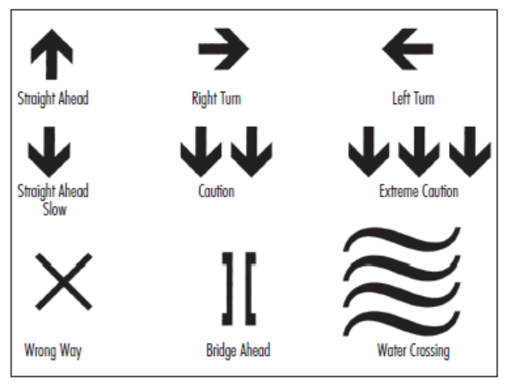

- **4.2.026** The sections of a cross-country course that involve steep or potentially dangerous slopes must be marked and protected with safe and visible course markers that present no safety risks to riders. 

In very fast sections of the course where the riders’ line is close to the course boundary, B zones must be installed as per diagram: 

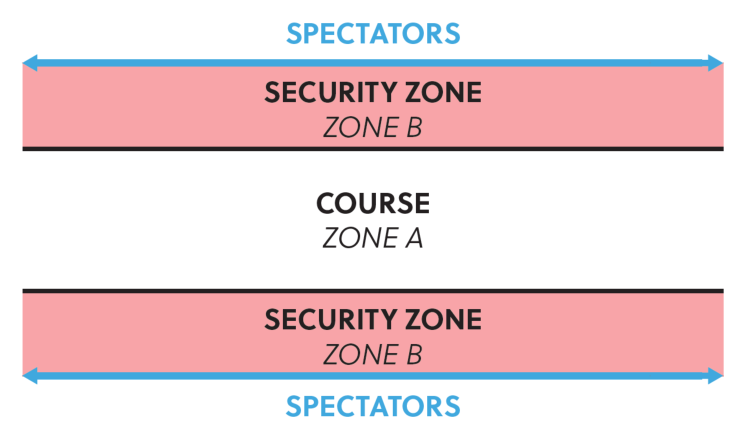

_(text modified on 1.01.17; 1.01.23)_ 

- **4.2.027** Where course sections involve obstacles such as walls, tree stumps or tree trunks or suitable padding must be used to protect the riders. Such protective measures must not restrict the rideability of the course. 

E0126 

**18** 

MOUNTAIN BIKE 

In appropriate areas, such as along the edge of steep drops, catch nets which comply with safety standards must be used. Nets or mesh fencing with openings greater than 5 cm x 5 cm may not be used, unless covered. 

Any wooden bridges or ramps must be covered with non-slip surface (carpet, chicken wire or special anti-slip paint). 

_(text modified on 1.01.16; 1.01.23)._ 

- **4.2.028** For Olympic format races at the Olympic Games, UCI World Championships, UCI World Cup, continental championships and hors class events, the course must be marked out and protected for its entire length. 

For all marathon format races, the course must be marked out well enough to ensure that it can be followed without problems. 

_(text modified on 1.10.13; 1.01.23)_ 

- **4.2.029** Wherever possible, roots, tree stumps, protruding rocks, etc. should be highlighted in biodegradable fluorescent paint. 

_(text modified on 1.01.16)._ 

## **§ 4 Start and finish zones** 

**4.2.030** The start and/or finish banners must be placed immediately above the start and finish lines at least 2.5 metres above ground level. 

_(text modified on 1.01.23)_ 

**4.2.031** The start zone for a cross-country event (massed start events) must: 

- a) for UCI World Championships and UCI World Cup events: 

- be at least 8 metres wide for at least 50 metres before the start line; 

- − be at least 8 metres wide for at least 100 metres after the start line; 

## b) for all other events: 

- be at least 6 metres wide for at least 50 metres before the start line; 

- − be at least 6 metres wide for at least 100 metres after the start line; 

For all events the start must be on a flat or uphill section of the course. 

The first narrowing after the start must allow riders to pass through together easily. 

_(text modified on 1.10.13)_ 

**4.2.032** The finish zone for a cross-country event (massed start event) must: 

- be at least 4 metres wide for at least 50 metres before the finish line; for UCI World Championships and UCI World Cup events this zone is at least 8 metres wide for 

- at least 80 metres. 

- be at least 4 metres wide for at least 20 metres after the finish line; for UCI World Championships and UCI World Cup events this zone is at least 8 metres wide for 

- at least 50 metres. 

- 

- be on a flat or uphill section of the course. 

E0126 

**19** 

MOUNTAIN BIKE 

**4.2.033** Barriers must be in place on both sides of the course for a minimum of 100 metres before and 50 metres after the start and finish line(s). 

## **4.2.034** 

The final kilometre of the race must be clearly and precisely indicated. 

## **§ 5 Feed/Technical Assistance zone** 

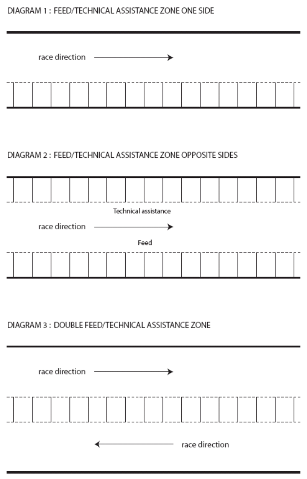

E0126 

**20** 

MOUNTAIN BIKE 

## DIAGRAM 4: FEED/TECHNICAL ASSISTANCE ZONE WITH A PIT LANE 

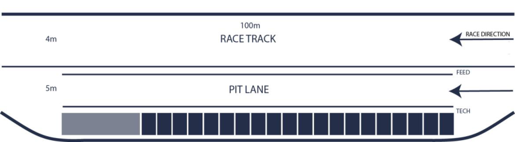

- **4.2.035** Feeding is permitted only in the zones designated for that purpose, which are also used as technical assistance zones. The zone is called feed/technical assistance zone. 

- **4.2.036** Each feed/technical assistance zone must be located on flat or uphill sections which are slow and wide enough for the purpose. The zones must be long enough and reasonably evenly spaced around the course. Double feed/technical assistance zones are recommended. 

For cross-country short track (XCC) events, a feed/technical assistance zone is not allowed. 

For Olympic format cross-country events (XCO) at least 1 single feed/technical assistance zone shall be set up. For marathon format cross-country events (XCM) at least 3 feed/technical assistance zones shall be set up. Organisers must anticipate on the team staff access possibilities during cross-country marathon events. 

For the cross-country team relay event during the UCI World Championships and, if applicable, during the Continental Championships, a feed/technical assistance zone can be set up for technical support only, at the discretion of the president of the commissaires’ panel. For the sake of clarity, feeding from the feed/technical zone is not permitted for the cross-country team relay events. 

_(text modified on 01.01.17; 01.01.23; 01.01.26)_ 

- **4.2.037** The UCI technical delegate or, in his absence, the president of the commissaires' panel, in collaboration with the organiser, decides on the distribution and location of feed/technical assistance zones. 

- **4.2.038** The feed/technical assistance zones must be wide and long enough to allow the passing of riders not stopping in the zone. 

In case a pit lane is implemented, the riders are not allowed to use it to gain advantage in the race. Should the riders take the pit lane for no valid reason, the commissaires may disqualify them. 

For UCI World Cup events they must furthermore include the following two areas: 

- one part for UCI MTB WORLD SERIES TEAMS; 

- one part for all other groups respecting the order, UCI MTB Teams, National Federations, all others 

Staff working for riders must wear readily identifiable team clothing. 

E0126 

**21** 

MOUNTAIN BIKE 

_(text modified on 01.01.20; 01.01.23; 01.01.25; 01.01.26)_ 

- **4.2.039** The feed/technical assistance zones must be clearly identified and numbered. They must be in an enclosure completely separated from spectators. Access must be strictly controlled by commissaires and/or marshals. 

- **4.2.040** For the Olympic Games, UCI World Championships, UCI World Cup events and continental  championships nobody may enter a feed/technical assistance zone without accreditation. This rule does not apply for the marathon UCI World Championships. 

For the Olympic Games, UCI World Championships and continental championships, accreditations are issued by the commissaires' panel. 

For UCI World Cup events season long accreditations issued to the UCI MTB WORLD SERIES TEAMS by the UCI. For the national federations or individual riders, passes are prepared by the organiser and handed out at registration: they obtain 1 accreditation per registered rider per zone. Note that for a double feed/technical assistance zone they only obtain 1 accreditation per registered rider. 

_(text modified on 1.01.20; 1.01.23; 1.01.24; 1.01.25; 1.01.26)._ 

- **4.2.041** Physical contact between feeders/mechanics and riders is permitted only in feed/technical assistance zones. 

Water bottles and food must be passed up to the rider by hand by the feeder or the mechanic. The feeder or mechanic is not permitted to run alongside his rider. 

- **4.2.042** The spraying of water on riders or bicycles by the feeders or mechanics is forbidden. 

   - High pressure washers are forbidden in the Feed/Technical Assistance zone. 

_(text modified on 1.01.26)_ 

- **4.2.043** Eyewear may only be changed in the feed/technical assistance zones. An area where glasses may be exchanged may be set up at the end of the zone. 

- **4.2.044** No rider may turn back on the course to reach a feed/technical assistance zone. Any rider doing so is disqualified. Only within the feed/technical assistance zone itself, a rider may turn back without obstructing other competitors. _(text modified on 1.02.12)._ 

## **§ 6 Technical assistance** 

- **4.2.045** Technical assistance during a race is permitted subject to the conditions below. 

- **4.2.046** Authorised technical assistance during a race consists of repairs to or the replacement of any part of the bicycle other than the frame. Bike changes are not permitted and the rider must cross the finish line with the same handlebar number plate that he had at the start. 

- **4.2.047** Technical assistance can only be given in the feed/technical assistance zones. 

- **4.2.048** Spare equipment and tools for repairs must be kept in these zones. Repairs and equipment changes can be carried out by the rider himself or with the help of a teammate, team mechanic or neutral technical assistance. 

E0126 

**22** 

MOUNTAIN BIKE 

_(text modified on 1.01.16)._ 

- **4.2.049** In addition to technical assistance in feed zones, technical assistance is permitted outside these zones only between riders who are members of the UCI MTB WORLD SERIES TEAM, UCI MTB TEAM or of the same national team. For the UCI World Championships, technical assistance is permitted only between riders of the same national team. 

Riders may carry tools and spare parts provided that these do not involve any danger to the rider himself or the other competitors. 

_(text modified on 1.01.20; 1.01.23; 1.01.25)_ 

## **§ 7 Safety** 

## **Marshals** 

- **4.2.050** Wherever possible each marshal is located in direct line of sight of the next. They signal the arrival of riders with a short, loud blast on a whistle. 

- **4.2.051** All marshals working on potentially hazardous sections of the course must carry a yellow flag which is waved in the event of a crash in order to warn other riders. 

## **First aid (minimum requirements)** 

- **4.2.052** At least one ambulance and one basic first aid post are required at all races. 

For each event, at least one (1) doctor and at least six (6) people qualified to perform first aid under the laws of the country must be present at the venue. 

- **4.2.053** The first aid post must be centrally located and readily identifiable by all participants. 

- **4.2.054** The first aid posts and the members of the first aid service must be in radio communication with each other, the organisers, the marshal coordinator and the president of the commissaires' panel. 

- **4.2.055** All first aid personnel must be easily identifiable with an appropriate mark or uniform. This must be unique. 

- **4.2.056** First aid personnel must be placed in key locations on the courses that are in use for each day of competition. 

There must also be a first aid crew in place for official training days. 

- **4.2.057** The organiser must take the measures required to facilitate the rapid evacuation of injured persons from any point of the course. All-terrain vehicles (motorcycles, quads, etc.) and experienced drivers must be available to reach difficult areas quickly. 

Potential hazard areas must be clearly identified and must be accessible by ambulance (four-wheel drive if necessary). 

- **4.2.058** A briefing with the organising director, the persons in charge of the first aid and marshalling services and the president of the commissaires' panel must be held before the event. The organiser must issue maps of the course to the staff of the first aid service. 

E0126 

**23** 

MOUNTAIN BIKE 

**4.2.059** The organiser must provide for cross-country marathon events a motorcycle to mark the front of the race (“lead bike”), and a motorcycle to mark the rear of the race ("sweep bike"). 

_(text modified on 1.10.13; 1.01.26)_ 

## **§ 8 Event procedure** 

## **Training** 

## **4.2.060** 

The organiser must make the courses available and fully marked for training at least 24 hours before the start of the first race. For UCI World Cup XCO events the deadline is at least 48 hours before the start of the first race. 

Riders must display their handlebar numbers during training sessions. 

## **Starting grid** 

## **4.2.061** 

The start order is determined as follows: 

- A. XCO events (other than UCI World Championships and UCI World Cup events) 

- 1 as per the last published UCI XCO individual ranking; 

- 2 unclassified riders: by drawing lots. 

- B. XCM events 

- 1 as per the last published UCI XCM individual ranking; 

- 2 as per the last published UCI XCO individual ranking; 

- 3 unclassified riders: by drawing lots. 

_(text modified on 1.02.12; 1.01.21)_ 

## **Classification** 

**4.2.062** Riders who abandon the race are marked on the result sheet as "DNF" (did not finish) and are not awarded any points for this event. 

**4.2.063** Lapped riders must complete the lap during which they were lapped and leave the event via an exit located before the finishing straight or in the "80%" zone as described in article 4.2.064, if that rule applies. They are listed in the results in the order in which they are pulled out of the race showing the number of laps down. 

_(text modified on 1.02.12)._ 

**4.2.064** The decision as to whether the 80% rule is to be applied for Olympic cross-country events (XCO) or cross-country short track events (XCC) is made by the president of the commissaires' panel after discussion with the organiser. Any rider whose time being 80% slower of that of the race leader's first lap is pulled out of the race. He is required to leave the race at the end of his lap in the zone provided for the purpose (the "80% zone") except when the rider is on his final lap. For Olympic cross-country events at continental championships, UCI World Cups, UCI World Championships and the Olympic Games, the 80% rule must be applied. 

_(text modified on 1.01.25)_ 

**4.2.065** Riders pulled out of the race under article 4.2.064 are listed in the results in the order in which they are pulled out of the race showing the number of laps down. 

E0126 

**24** 

MOUNTAIN BIKE 

_(text modified on 1.02.12)._ 

## **§ 9 Stage races** 

## **General rules** 

- **4.2.066** A stage race is a series of cross-country races in which teams, national federation riders and individual riders may take part. Riders must complete each stage according to the specific procedures for the event in order to be eligible for the next stage. 

- **4.2.067** Organisers must provide the detailed technical guide of their event to the UCI for approval during the international calendar registration process. In the absence of such approval the event will not be included in the international calendar. 

   - A template for such technical guide is provided by UCI upon request. 

_(text modified on 1.10.13)_ 

- **4.2.068** A stage race may take place on the territory of several countries provided that the national federations of the countries concerned have approved the organisation and the course. Evidence of such approval must be submitted with the application to have the race included on the calendar. 

- **4.2.069** Teams are composed of at least two and a maximum of 6 riders. 

- **4.2.070** Stages races are assimilated to XCM, therefore XCM UCI World Champions and national XCM champions must wear their champion jersey on the occasion of stage races. 

_(text modified on 1.02.12, 1.01.21)._ 

## **Duration and stages** 

- **4.2.071** Unless decided otherwise by the UCI, Stage races are run over at least four days, with a maximum of nine days. 

Only one stage per day may be run. 

In addition, the events must include at least one long distance stage  that meet the minimum distance of a cross-country marathon event as per article 4.2.004. 

( _text modified on 1.01.23)._ 

- **4.2.072** The different types of cross-country events mentioned in articles 4.2.001 to 4.2.009 and 4.2.014, except cross-country eliminator (XCE) can be chosen for the stages. 

- **4.2.073** For each race type (XCO, XCM, XCP, XCC, XCT), distances are as per the technical guide. Regarding team time trial, the team time is that of the second rider and counts towards the team general classification. 

_(text modified on 4.04.14; 1.01.21)_ 

## **Classifications** 

**4.2.074** The individual men's and women's general classification on time are obligatory. UCI points are awarded for the general classification only. * 

- For stage races which are competed with teams of 2 riders, the UCI points are allocated to both riders (not distributed between riders). 

E0126 

**25** 

MOUNTAIN BIKE 

The individual general classification is based on an individual competitor's cumulative time for each stage. 

Where two or more riders make the same time in the general individual time classification, the fractions of a second registered during individual time trials (including the prologue) are added back into the total time to decide the order. 

If the result is still tied or if there are no individual time trial stages the classifications obtained in each stage are added and, as a last resort, the place obtained in the last stage ridden is taken into consideration. 

_(text modified on 4.04.14)_ 

- **4.2.075** Other general classifications for men and women, such as points general classification, mountains general classification, and the men's and women's team general classifications are optional. 

In stage races where there is a team general classification, there are only three types of teams that may compete for the classification: 

- UCI MTB WORLD SERIES TEAMS 

- UCI MTB TEAMS 

- National teams. 

Except in the case of team time trials, both the men's and women's team general classification is established by adding the times of the two best riders in each stage. 

_(text modified on 1.01.23; 1.01.25)._ 

- **4.2.076** Bonuses and time penalties are taken into account. Bonuses are shown only in individual general classifications by time. No bonuses are awarded for individual or team time trial events. 

## **Technical arrangements** 

- **4.2.077** A stage event may not include more than one vehicle transfer per three days of event. The duration of each of vehicle transfer may not exceed three hours. A transfer less than one hour is not taken into account. 

- **4.2.078** Neutralised linking sections may be included in no more than 75% of the stages. No linking section may exceed 35 km in length. A lead vehicle must control the speed of the field until the start line is reached. The start must take place from a stationary position at the start line. The start must be given within 30 minutes following the arrival of the lead vehicle. 

- **4.2.079** There must be two motorcycles (a lead bike and a 'sweep' bike) for all stages except the individual time trial. 

- **4.2.080** The organiser must provide clothing for the leader of the individual men’s and women’s general classification. 

E0126 

**26** 

MOUNTAIN BIKE 

## **Chapter III   DOWNHILL EVENTS** 

## **§ 1 Organisation of competition** 

**4.3.001** Downhill events are composed of: 

A single run format for the final must be used. Prior thereto, there shall be either: 

   - One or two ~~a~~ qualifying run(s), called the qualifying round(s) following which a predetermined number of riders set by the particular race regulations are admitted to a final. The fastest rider of the final is declared the winner. 

   - a seeding run that determines the start order for a single run in which the rider with the fastest time wins. 

- For Mass start, events are composed of a: 

   - qualifying round (time trial where a number of riders qualify for the final, number of riders to qualify must be set by the organiser in his technical guide), which will also serve to determine the start order. 

   - marathon downhill (mass start downhill) 

Each organizer should state in their technical guide which one of the two options will be applied to their event. 

_(text modified on 1.07.12; 1.10.13; 4.04.14; 1.01.23; 1.01.25)_ 

- **4.3.002** A two runs system (with the fastest single time from either run counting to the result) may be acceptable under exceptional circumstances subject to prior authorisation from the UCI. 

- **4.3.003** A system based on two runs using the average or combined times of both is not permitted. 

- **4.3.003** Any rider whose time being 100% slower of that of the first established time is listed in **bis** the results as DNF (did not finish) and is not awarded any points. This rule is applied for qualifying round and finals. 

Under exceptional circumstances, the maximum allowed time limit for finishing may be altered during the race. This decision is made by the president of the commissaires’ panel after consultation with the technical delegate. 

_(article introduced on 1.02.12)._ 

## **§ 2 Course** 

- **4.3.004** The course for a downhill must follow a descending route. 

**4.3.005** The course comprises varied terrain sections: narrow and broad tracks, woodland roads and paths, field paths and rocky tracks. There normally are a mixture of fast and technical sections. The emphasis of the course is to test the riders' technical skills and their physical ability. 

**4.3.006** The length of the course and the duration of the event are determined as follows: Minimum Maximum Course length 1500m 3500 m Duration of the event 2 minutes 5 minutes 

E0126 

**27** 

MOUNTAIN BIKE 

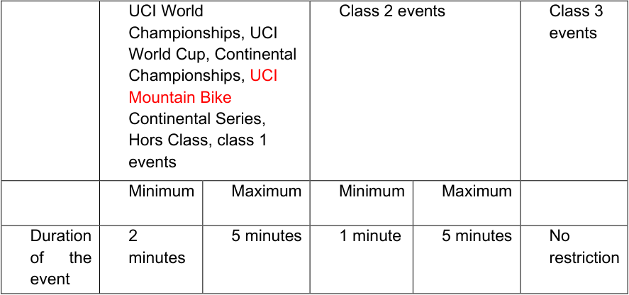

**----- Start of picture text -----** 
UCI World  Class 2 events  Class 3 Championships, UCI  events World Cup, Continental Championships, UCI Mountain Bike Continental Series, Hors Class, class 1 events Minimum  Maximum  Minimum  Maximum Duration  2  5 minutes  1 minute  5 minutes  No of  the  minutes  restriction event **----- End of picture text -----** 

_(text modified on 1.01.16; 1.01.25; 1.01.26)_ 

**4.3.007** The entire downhill course must be marked and protected with safe and visible course markers that present no safety risks to riders. 

In very fast and dangerous sections, where the riders line is close to the course boundary, B zones must be installed as per diagram: 

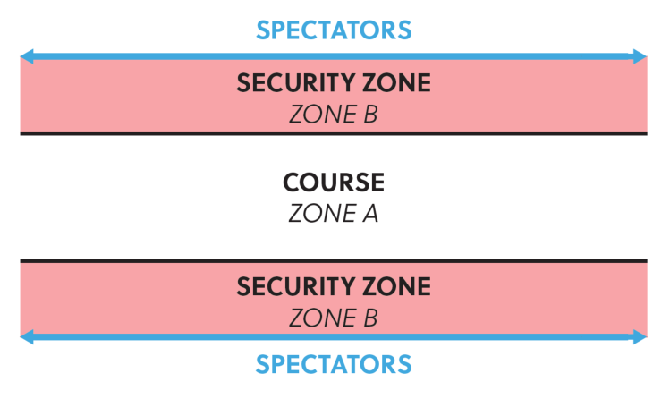

B zones must be cleaned to avoid any hidden obstacles and to be safe. 

No equipment outside the official Host Broadcaster or Timing Company’s equipment can be installed in the B zones by anybody. 

_(text modified on 01.01.17; 01.01.19; 01.01.23; 01.01.24; 01.01.26)_ 

## **4.3.008** 

The use of straw bales to mark off the course is not permitted. 

E0126 

**28** 

MOUNTAIN BIKE 

**4.3.009** The start area must be at least 1 meter and no more than 2 meters wide. A suitable handrail must be installed, the floor must be covered with a non-slip surface and the start area must be covered. 

## **4.3.010** 

The finish area must be at least 6 meters wide. 

There must be a braking area of minimum 35-50 m after the finish line with adequate protection and completely cordoned off from the public. The riders exit must be designed in that way that the speed is kept to a minimum. 

This area must be free of obstacles. 

## **§ 3 Clothing and protective accessories** 

## **4.3.011 Jersey** 

The jersey shall be a long-sleeved shirt whose sleeves extend down to the rider's wrists. Jerseys used in downhill events should be of a type specifically designed and sold for use in BMX Racing or Mountain Bike downhill events. Jerseys designed for road cycling, skinsuits, or one-piece suits comprising the jersey and the pants/shorts are not permitted for use in downhill events. 

The jersey must be either close fitting around the waist or must be tucked into the pants before the start to not cause interference. 

## **Pants** 

Long pants or short pants combined with suitable knee and shin protection are authorised. Such long or short pants should be of a type that is specifically designed and sold for use in BMX Racing or Mountain Bike downhill events. Long pants of the type described above must be of one-piece construction and made of tear-resistant material. They should cover the entire length of both legs until just above the shoe or ankle. Short pants of the type described above must be of one-piece construction and made of tear-resistant material. They should be worn together with suitable leg protection, that covers the entire knee and the entire shin until just above the ankle. 

_(text modified on 1.01.23)._ 

## **4.3.012** 

A full-face helmet must be worn properly both when racing and when training on the course. The helmet must be fitted with a peak. Open-face helmets may not be worn. 

- **4.3.013** The UCI strongly recommends that riders wear the following protection: 

   - back, elbow, knee and shoulder protectors made of rigid materials; 

   - protection for the nape of the neck and the cervical vertebrae; 

   - padding on shins and thighs; 

   - broad full-length trousers made from rip-resistant material incorporating protection 

      - for the knees and calves, or broad-cut shorts made from rip-resistant material plus knee and calf protectors with a rigid surface; 

   - long sleeved shirt; 

   - full finger gloves. 

National federations may impose in their national regulations and under their responsibility the use of other protections than helmets including for international events on their territory. The national federations are responsible for monitoring compliance with such regulations to the exclusion of UCI. 

A rider not wearing the protection imposed by the national federation in an international event shall be banned from the race by the commissaires’ panel only at the request of a representative of the national federation and under the responsibility of the latter. 

E0126 

**29** 

MOUNTAIN BIKE 

## _Comment:_ 

_The riders shall inquire about any applicable national federation regulation. The use of protective gear other than helmets may also be imposed by national legislation. The rider shall inquire about  this. Compliance with such legislation is the exclusive responsibility of the rider._ 

_A wide variety of equipment is available on the market that is presented and sold as protective gear._ 

_Some of these are provided by reputable manufacturers that may be expected to produce quality products._ 

_Yet, and except for helmets, there seem to exist no official technical norms for protective gear as referred to in the above article._ 

_Therefore, it is not known at this time to what extent items that are sold as protective gear provide effective protection, as the concept, the quality, etc. have not been tested and compared with an applicable official technical standard._ 

_It is not known either whether gear that provides protection in a certain type of crash might provide or fail to provide the expected protection in another type of crash._ 

_Likewise, the combination of different types of protections may not be adequate. For example, a neck protection may not fit with a back protector._ 

_Therefore, riders must pay attention to the quality and characteristics of the gear, seek advice of experienced riders, coaches or technicians, procure the gear from professional and reliable suppliers and rely on their own judgment._ 

_The rider shall be responsible for the choice of the gear and for its use, in accordance with articles 1.3.001 to 1.3.003._ 

_(text modified on 1.07.12)_ 

## **4.3.014** 

[article abrogated on 1.01.18] 

## **§ 4 Marshals** 

- **4.3.015** Each marshal must be located in direct line of sight of the next. They signal the arrival of riders with a short, loud blast on a whistle. 

- **4.3.016** The marshals must be provided with flags so that the safety system below can be used. 

- **4.3.017** During official training every marshal must carry a yellow flag which must be waved in the event of a crash to warn other riders who must slow down. 

**4.3.018** Some marshals specifically appointed by the organiser and the marshal coordinator must carry a red flag and have a radio link on the same frequency as those of the president of the commissaires' panel, the organising director, the medical team, the marshal coordinator and, where present, the UCI technical delegate. They must be stationed at strategic points on the course such that they are in direct line of sight with their two closest colleagues earlier and later on the course. 

E0126 

**30** 

MOUNTAIN BIKE 

The red flags are used in training and racing. 

Red flag marshals who see a serious accident must immediately notify the marshal coordinator by radio, who must as soon as possible notify the president of the commissaires' panel, the organising director, the medical team and, where present, the UCI technical delegate. 

Red flag holders must immediately assess the situation of the crashed rider and continue reporting by radio to the marshal coordinator. 

Red flag marshals who are not directly affected by an accident must follow the relevant radio transmissions. If they note that one of their colleagues further down the course is waving their red flag, they must immediately do the same. 

## **4.3.019** 

Riders observing a waving red flag during the race must stop immediately. 

A stopped rider must continue calmly to the finish and request a re-start from the finish line commissaire and wait for further instruction. 

The re-run should take place before the end of the stopped rider’s category, when possible. 

_(text modified on 01.01.26)_ 

## **§ 5 First aid (minimum requirements)** 

## **4.3.020** 

- The first aid service must be organised in accordance with articles 4.2.052 to 4.2.058 it being understood that the number of people qualified under the laws of the country to give first aid must be at least seven. 

A medic must be stationed at the exit of the finish bowl during racing. The organiser must submit an evacuation and medical plan to UCI prior to UCI World Championships, UCI World Cup and continental championships. The organisers medical coordinator must meet the technical delegate if applicable or the president of the  commissaires’ panel before the first training. 

_(text modified on 1.02.12)._ 

## **§ 6** 

## **Training** 

## **4.3.021** 

The following training sessions must be organised: 

- an on-foot inspection of the course must be organised before the first training session. No bikes are allowed on the course during the on foot downhill course inspection. The on-foot inspection is reserved exclusively for riders, the team managers and the coaches who must hold a valid license. Other team staff are not allowed to attend the on-foot inspection. 

- a training session, the day before competition. 

- a training session on the morning of the race day. 

No training is permitted whilst a race is in progress. 

_(text modified on 1.01.20; 1.01.26)._ 

**4.3.022** Each rider must complete at least two training runs or they will be disqualified from the race. The start commissaire must ensure that this rule is applied. 

E0126 

**31** 

MOUNTAIN BIKE 

_(text modified on 1.01.23)._ 

- **4.3.023** Riders must start all training runs at the official start gate. Any rider starting a training run below the start line must be disqualified from the competition. 

At the discretion of the President of the Commissaires’ Panel, riders may be permitted to start at a designated point on the course. 

_(text modified on 1.01.25)._ 

- **4.3.024** Riders must display their handlebar number while training as well as their back number during the qualifying round and the final. 

## **§ 7** 

## **Transport** 

- **4.3.025** The organiser must provide transport capable of carrying 250 riders and their bikes per hour to the top of the course. 

_(text modified on 1.01.25)._ 

E0126 

**32** 

MOUNTAIN BIKE 

## **Chapter IV   FOUR CROSS EVENTS** 

## **§ 1 Nature** 

- **4.4.001** Four cross is an elimination event where three or four riders (called a heat) compete side by side on the same downhill course. The nature of this competition is such that there may be some unintentional contact between the riders. This is tolerated if the president of the commissaires' panel considers that it remains within the spirit of the event, fair play and a sporting attitude to other competitors. 

## **§ 2 Organisation of competition** 

- **4.4.002** Practice runs must take place on the same day as the finals. 

- **4.4.003** A qualifying round is organised, preferably the same day as the main event. 

- **4.4.004** The qualifying round takes the form of a timed run over the course by each rider. In the event of a tie between riders during the qualifying round, their order is determined by the most recent UCI 4X individual ranking. If the riders are not ranked, lots are drawn to determine their order. 

Riders who are DNF, DSQ or DNS in the qualifying round cannot enter the main event. 

The riders start on the start commissaire's orders, in the sequence determined by the start list. The women ride before the men. 

The race numbers used for the qualifying round are in sequence starting from 33 or 65 on the basis of the most recent UCI 4X individual ranking. 

- **4.4.005** 

The number of riders qualifying for the first round of the main event is determined by the number of heats of three or four that can be made up. 

A maximum of 16 heats is possible (maximum 64 riders). 

If fewer than 64 riders ride the qualifying round, the number of heats can be 16, 8, 4 or 2, respecting the minimum of three riders per heat. 

Heat order (men first until women come to equal heat system, finals: women small final followed by women big final, then men small final followed by men big final). 

|**Number of classified riders** **in the qualifying round**|**Ladder**|
|---|---|
|48+|64 riders|
|24-47|32 riders|
|12-23|16 riders|
|6-11|8 riders|

The number of riders in the qualifying round may not be fewer than six, otherwise no 4X event may be held. 

The race numbers for the main event are allocated on the basis of the results of the qualifying round; starting with number 1 for the rider with the best time during the qualifying round and so on. 

E0126 

**33** 

MOUNTAIN BIKE 

**4.4.006** The main event comprises elimination heats in which the groups of riders are matched as shown in the table below, in order to ensure that the first and second in the qualifying round can only meet in the final. 

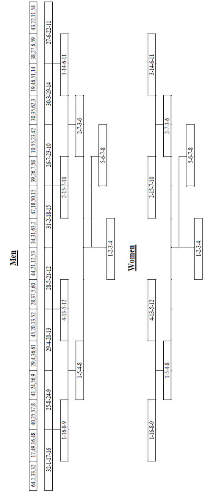

- **4.4.007** 

The riders in each heat ride only once per round. The third and the fourth rider in each heat are eliminated. The first and the second qualify for the next round. 

E0126 

**34** 

MOUNTAIN BIKE 

**4.4.008** In addition to the final, a small final round is held for the riders ranked third and fourth in the semi-finals. Riders who are DNF, DSQ or DNS in the semi-finals may not enter the small final. 

## **4.4.009** 

- The final classification of the competition is drawn up in groups in the following order: 

1. all riders competing in the small final, except for riders DSQ. 

2. riders DNF or DNS in the semi-finals. 

3. all riders competing in the big final, except for riders DSQ. 

4. the classification of the other riders is determined by the round reached, then by the classification in their heat, then by their race number. 

Within each of the above-mentioned groups, riders DNF are classified before DNS. In case of multiple DNF or DNS, the tiebreaker is the race number. 

Riders DNF or DNS in the first round of the main event are listed without classification. 

Riders DSQ in the main event are listed without classification. 

All riders ranked after a rider DSQ are re-ranked one place higher within the affected phase only. No rider eliminated in an earlier phase can move up in the final classification. For example, in case of a DSQ in the big final, all riders ranked after the DSQ rider will be ranked one place higher and the rank four in the final classification will remain unallocated. 

Riders not qualified for the main event are not listed in the final classification. 

When for any reason the 4X main event (elimination heats) needs to be cancelled the results of the qualifying round stands as final result. 

_(text modified on 1.01.19)_ 

- **4.4.010** The riders in each heat may choose their starting position in order of their race number. The rider with the lowest race number gets first choice. 

## **4.4.011** 

The riders take the start from a stationary position. 

If a part of the front wheel passes the start line before the starting signal the rider is relegated (classified in a heat different from the actual finish). 

## **4.4.012** 

The riders are required to pass through each gate without straddling it, i.e. both wheels of the bicycle must trace a path inside each gate. This is determined by judges located along the course or in the TV compound if applicable. A missed or straddled gate in the main event results in relegation unless the rider goes to the trouble of returning to pass it correctly. 

- **4.4.013** If all the riders in heat fall or fail to cross the finish line in a preliminary round, the winner is the rider who covered the greatest distance. 

## **§ 3 Course** 

- **4.4.014** Ideally, the course is set up on moderate slopes with regular gradients. It must also include a mixture of jumps, humps, banked turns, berms, dips, natural tables and other 

E0126 

**35** 

MOUNTAIN BIKE 

special features. It may also include unbanked turns. There is normally no climbing requiring the riders to pedal. 

The course must also be wide enough to allow four riders to line up side by side, and to enable overtaking. 

The course must be fully marked out in accordance with the diagram in article 4.2.026 (zone A and zone B). Zone A must be at least 2 meters from the course and is at least 2 meters wide. 

- **4.4.015** The duration of the race must be between 30 seconds and 60 seconds with an optimum time between 45 and 60 seconds for the winner of the qualifying round. 

- **4.4.016** For the first 5 meters of the course, four lanes of an equal width must be marked by white lines (using tape, biodegradable paint or flour). Any rider crossing or riding on these white lines is relegated. In case a rider is crossing or riding on these white lines when he is placed behind his neighbour riders and does not hinder them and has no advantage the relegation can be transformed in a warning. 

- **4.4.017** The start straight must be at least 30 metres long. Obstacles in the first 30 meters must be the same across the entire width of the course. 

- **4.4.018** The gates on the course must be made of non-metallic stakes (slalom stakes), preferably in PVC, 1.5 to 2 metres high. 

The gates must be set up with the lower part inwards and the higher part outwards. 

- **4.4.019** 

   - The last gate on the course must be located at least 10 meters from the finish line. 

- **4.4.020** The organiser must provide a raised platform from which the 4X judge has an unobstructed view of the entire course. The platform must be located in a zone to which spectators do not have access. 

## **§ 4 Transport** 

- **4.4.021** The organiser must provide transport which is capable of bringing the riders to the start of the course promptly. A course running alongside a useable ski lift or cable car run is to be preferred. 

## **§ 5 Clothing and protective accessories** 

- **4.4.022** A full-face helmet must be worn properly both when racing and when training on the course. The helmet must be fitted with a visor. Open-face helmets may not be worn. 

- **4.4.023** The UCI strongly recommends the wearing of the clothing and protective accessories specified in article 4.3.011 and 4.3.013 to 4.3.014 during 4X events. 

## **§ 6 First aid (minimum requirements)** 

- **4.4.024** The first aid service must be organised in accordance with articles 4.2.052 to 4.2.058, it being understood that the number of people qualified under the laws of the country to give first aid must be at least eight. 

A medic must be stationed at the exit of the finish bowl during racing. 

The organiser must submit an evacuation and medical plan to UCI prior to world championships, world cup and continental championships. The organiser’s medical 

E0126 

**36** 

MOUNTAIN BIKE 

coordinator must meet the technical delegate if applicable or the president of the commissaires’ panel before the first training session. 

## **§ 7 Training - competition** 

- **4.4.025** The following training sessions must be organised: 

   - a training session, the day before competition. 

   - a training session on the race day. 

When the 4X event is taking place at night, a night practise session must be provided for the riders. 

No training is permitted whilst a race is in progress. 

**4.4.026** Riders must display their handlebar number while training and their back number during 4X finals. 

## **§ 8 Card procedure** 

**4.4.027** During the main event, a system of coloured cards is used by a commissaire at the finish. His decisions must be confirmed by the president of the commissaires' panel. 

|**Card**|**Meaning**|**Code**|**Penalty**|
|---|---|---|---|
|Yellow|Warning Rider gained NO advantage but behaviour was against regulations.|WRN|1sttime > no penalty.|
|Blue|Relegation Specified in articles: 4.4.011, 4.4.012 and 4.4.016|REL|a heat classification different from the actual finish.|
|Red|Disqualification Specified in article 4.2.012|DSQ|excluded from further competition, no classification|

− A rider who receives a second card, whatever the colour, in the same event is disqualified. 

− Cards must be shown by the designated commissaire (card commissaire) after confirmation by the president of the commissaires’ panel and must be communicated directly via TV and the event speaker. 

E0126 

**37** 

MOUNTAIN BIKE 

## **Chapter V   ENDURO EVENTS** 

(chapter reviewed on 01.01.26) 

## **§ 1 Race characteristics** 

## **4.5.001** 

The race includes several liaison stages and timed stages. 

The times achieved in all timed stage will be accumulated to a total time. 

An enduro course comprises varied off-road terrain. The track should include a mixture of narrow and wide, slow and fast paths and tracks over a mixture of off-road surfaces. Each timed stage must be predominantly descending but small pedalling or uphill sections are acceptable. Stages must focus on testing the rider’s technical skills. 

Liaison stages can include either mechanical uplift (e.g. chairlift), pedal powered climbs or a mixture of both. The emphasis of the track must be on rider enjoyment, technical and physical ability. 

Any other system may be acceptable only under exceptional circumstances and subject to prior authorisation from the UCI. 

_(text modified on 01.01.26)_ 

## **§ 2 Technical assistance** 

## **4.5.002** 

A technical assistance zone can be provided by the organizer. 

Riders are allowed to collect and drop equipment or food in the technical assistance zone. 

Outside technical assistance is only allowed in this area. 

Riders may access technical assistance whenever the official course route passes through the technical assistance zone. 

Riders seeking to leave the official course to return to the technical assistance zone for assistance must first seek approval from the race officials. This will incur a 3-minute penalty. 

Riders must then return to the racecourse at the point where they left. 

_(text modified on 01.01.20; 01.01.26)_ 

## **4.5.003** 

Only one frame, one front forkand one pair of wheels can be used by a competitor during a competition. Frame, fork and wheels will be individually marked by the officials before the start of the race and checked at the finish. Broken parts may be replaced after first seeking approval from the PCP or race director with the application of a 3- minute penalty if approved by race official. 

_(text modified on 01.01.26)_ 

## **§ 3 Equipment** 

**4.5.004** Riders must wear a full-face helmet at all times during competition. This includes during both Liaison and Special Stages. If a rider dismounts and pushes their bike on a 

E0126 

**38** 

MOUNTAIN BIKE 

Liaison, they may remove the helmet. Whilst riding, the helmet must always be worn correctly with straps fastened. 

In addition to the above, the UCI strongly recommends that riders wear the protections as indicated in art. 4.3.013. 

- Furthermore, it is strongly recommended that all riders carry: 

   - suitable backpack; 

   - waterproof jacket; 

   - emergency blanket; 

   - tube / puncture repair kit; 

   - multi tool; 

   - basic, well maintained first aid kit; 

   - course map; 

   - food and fluids; 

   - eye protection (glasses or goggles); 

   - emergency contacts supplied by the organiser; 

   - whistle. 

Only one frame, fork and one set of wheels can be used by a rider during a race. A rider may use different/unmarked equipment during Official Training. 

Equipment Marking Stickers must be applied on the rider’s right-hand side of the bike. 

- fork crown; 

- swingarm / rear triangle; 

- front triangle; 

- both wheel rims. 

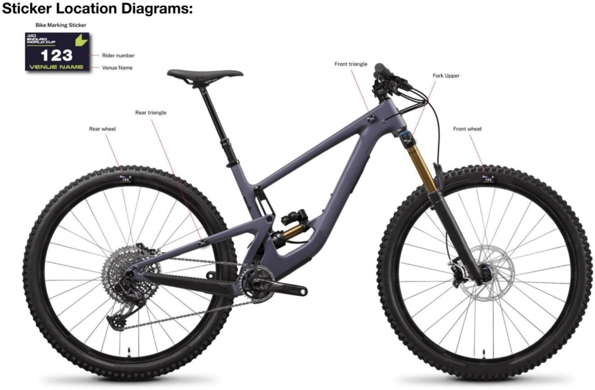

E0126 

**39** 

MOUNTAIN BIKE 

_(text modified on 01.01.26)_ 

## **§ 4 Course map** 

- **4.5.005** A course map must be produced by the organizer and made available to all competitors before the first training session begins. On longer courses or in terrain that is hard to navigate through, course maps should be available for riders to carry with them. 

## **§ 5 Course marking** 

**4.5.006** The entire enduro courses must be marked and protected with safe and visible course markers that present no safety risks to riders. 

Course markers installed on opposite sides of the course will create a gate, which riders must pass between. Gates can be used to clearly mark sections of the course that a rider must pass through. Missing a gate will be deemed as course cutting. 

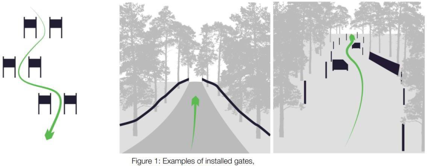

In very fast and dangerous sections, where the riders’ line is close to the course boundary, B zones must be installed as per diagram: 

_(text modified on 1.01.23; 1.01.26)._ 

E0126 

**40** 

MOUNTAIN BIKE 

**4.5.007** Extra care must be taken by the organiser to make sure that the course is clearly and no shortcuts are possible. 

Taking shortcuts on course to gain an advantage can damage both the environment and bring the sport of enduro mountain bike racing into disrepute. Where no defined trail exists, the organiser should mark the course to keep the riders on the intended racecourse. If a clear and defined trail exists, the organiser may choose to create gates. In this instance riders must ride the existing defined trail between gates and not look to leave the trail to take a short cut and gain an unfair advantage. 

Therefore, any rider trying to save time by intentionally choosing a line that lies outside of the marked, defined racecourse will be disqualified (DSQ). 

Any rider found damaging the course or altering a Special Stage without the UCI approval will be subject to a penalty including DSQ. 

_(text modified on 01.01.26)_ 

**4.5.008** In sections of the course that are marked by course tape, both sides of the track must be marked. 

**4.5.009** Road crossing and dangerous area must be marked on both sides. 

All wooden features (e.g. wall-rides or large bridges), especially those that are situated in compressions, turns or braking zones, should be covered adequately with an antislip surface material (e.g. Wire mesh & or anti-slip paint). 

_(text modified on 1.01.20)._ 

## **§ 6 Organisation of competition** 

**4.5.010** Official training must be scheduled by the organiser on all Special Stages before timed competition begins. Training on all Special Stages is strongly recommended but not mandatory. 

Following the official course release, all Special Stages are closed to riders until official training commences. 

Any rider found riding on a Special Stage outside of official training will be subject to penalty. 

Only competing riders with a number plate issued for that specific race attached to their bike will be allowed on course during official training. In addition, officials, team staff and media will also be allowed access providing they display the relevant officially issued plates. 

A maximum of one training run is allowed per Special Stage. 

Unless otherwise agreed, official training should not take place more than two days prior to the start of the race. 

During official training times, riders must only access a Special Stage from the start and are not permitted to push up within the course or create congestion. 

E0126 

**41** 

MOUNTAIN BIKE 

Any rider found to be riding upwards against the direction of travel will be penalised. Riders may push up outside of the course marking. 

_(article introduced on 01.01.26)_ 

- **4.5.011** The organiser must provide the start times for each timed stage. 

_(text modified on 01.01.26)_ 

- **4.5.012** Each rider takes an individual start, the start interval between the riders must be of 10 seconds at least. 

Riders must present themselves at the start line in time for their preassigned stage start time. 

All Special Stages will have a check-in point close to, but before the Special Stage start line. Riders must pass through this check-in point to record a check-in time. The checkin time may be used by Race Control to provide additional evidence of a rider’s arrival time at a Special Stage start in case of any delay or dispute around stage start time. 

All late riders must start only under instructions from the official starter, who will determine a suitable gap in the start order. No fixed start interval will be applied between late starters as the goal is to keep late riders in the competition, without affecting other riders. 

In cases where the late starter is delayed further due to insufficient gaps in the start order, penalties will be calculated based on a rider’s check-in time. If a rider fails to check-in, the penalty will be based on their Special Stage start time. 

Late starters will receive a fixed penalty: 

- up to 5 minutes late = 1-minute penalty; 

- 5+ minutes late = 5-minute penalty; 

- 30+ minutes late = DNF. 

Any rider arriving at the start of a Special Stage later than 30 minutes after their specified start time will be assigned a DNF for the race and will not be allowed to continue. 

## **Start Penalties** 

Riders must start from a stationary position with their front wheel on the start line. Run up starts are not permitted. 

Any rider starting before the starter’s orders may be subject to a penalty. Other Start Violations (example: pushing into queue, delaying start, jumping start etc.) may also be subject to penalty. 

## **Delays** 

Any delay applied to Special Stage start times must be maintained throughout that day of racing. Commissaires must not attempt to catch up on delays while racing is underway. 

Example. If there is a 10-minute course hold on Special Stage 1, 10 minutes must be added to the start times of all remaining Special Stages, for all riders effected by the hold, for the remainder of the race. 

## **Disrupted race stage.** 

E0126 

**42** 

MOUNTAIN BIKE 

In the event of a rider being delayed on a Special Stage due to assisting another rider in a medical emergency or due to some other circumstance outside of their control, such as a race hold on that Special Stage, **and only** if Race Control decide it is appropriate, a rider may be offered a re-run on that Special Stage. 

If Race Control deem that a re-run of the Special Stage in question is not possible then at the end of the race the rider will be allocated an “average” Special Stage position and time. This will be calculated as follows: 

Race control will take the rider’s actual finishing position across all Special Stages completed, minus his worst stage result and using this calculate their average stage finishing position. This average Special Stage position will then be awarded for the incomplete stage. 

_(text modified on 01.01.26)_ 

- **4.5.013** A minimum of 3 and a maximum of 10 timed stages must be raced over one or two days. 

The total time for each rider shall correspond to a minimum of 10 minutes. 

_(text modified on 01.01.26)_ 

- **4.5.014** A minimum of 2 different courses for the timed stages must be used. Under unforeseen and exceptional circumstances (e.g. weather), the UCI commissaire may, after consulting the organiser, cancel a stage or remove it from the general classification. 

_(text modified on 01.01.26)_ 

- **4.5.015** There are no restrictions on the nature of liaison stages. Uplift of riders can be either by mechanical means (chairlift, truck etc) or by pedalling or a mixture of both. 

_(text modified on 01.01.26)_ 

- **4.5.016** Adequate training must be provided by the organiser for all timed stages. 

_(text modified on 01.01.26)_ 

- **4.5.017** The transport of riders between Special Stages by private/team transport (shuttling) is strictly limited to official training and may be used only when an official rider shuttle provided by the organiser operates on the same route. Any rider found using a private or team vehicle at any other time or on any other route may be subject to penalties. 

Any venue specific details or restrictions on shuttling will be outlined in the Race Book and the official training schedule. 

During the race, no private/team transport can be used at any time. 

_(article introduced on 01.01.26)_ 

## **§ 7 Results** 

- **4.5.018** The events General Classification will be calculated by adding all Special Stage times together for each rider. 

In the event of a tie in the General Classification, the highest placed rider on the final Special Stage will be awarded the higher final placing. 

E0126 

**43** 

MOUNTAIN BIKE 

A rider not finishing a Special Stage will not be allowed to rejoin the race at any time. 

_(text modified on 01.01.26)_ 

## **§ 8 Infringements** 

- **4.5.019** A rider must act in a sporting manner at all times and must permit any faster rider to overtake without obstructing. 

_(text modified on 01.01.26)_ 

- **4.5.020** The president of the commissaries’ panel can consider a rule violation that has not been witnessed by a race official if it has been reported by at least two riders who are part of two different teams (e.g. rider getting assistance outside technical assistance zone, rider cutting course) 

_(text modified on 01.01.26)_ 

## **§ 9 Marshals** 

## **4.5.021** 

For marshals, refer to the articles 4.1.017 to 4.1.021. 

A small number of special trained marshals or commissaires should move around the course during competition to undisclosed points. Quad bike can be used to check rules infringements. 

_(text modified on 01.01.26)_ 

## **§ 10 Medical service** 

**4.5.022** For first aid (minimum requirements), refer to the articles 4.2.052 to 4.2.059. The organizer must set up an adequate medical service. The organizer must supply each competitor with emergency contact details. 

_(text modified on 01.01.26)_ 

E0126 

**44** 

MOUNTAIN BIKE 

## **Chapter VI   PUMP TRACK** 

_(chapter introduced on 1.01.19)_ 

## **§ 1 Definition and nature** 

**4.6.001** A pump track is a track that consists of rollers and steep turns in various sizes and shapes. The rollers and turns are used to generate speed by pumping the bike, not by pedalling. A pump track is built in a way that promotes technical skills. Speed on a pump track is generated by pumping the bike - not by pedalling and not by gravity. Large flat sections that promote pedalling are to be avoided. 

## **§ 2 Categories** 

- **4.6.002** International categories are “open men” and “open women”. Riders must be 17 years of age in order to compete. No separate results shall be submitted for the juniors, under 23 or Elite categories. 

All Pump Track events will be considered as Class 3 events. 

Event organisers are free to have either age or ability categories for other riders. 

Categories for children shall follow any age limits set by the local laws. 

For participation in events on the international calendar, riders' categories are determined by the age of those competing as defined by the difference between the year of the event and the year of  birth of the rider. 

_(text modified on 1.01.20; 1.01.25)._ 

## **§ 3** 

## **Equipment** 

## Bike 

- **4.6.003** A minimum wheel size of 20 inches is required for the men and women open categories. Children’s categories can use smaller wheels. 

   - The bike should have at least 1 rear brake. 

No bikes with any kind of automatic transmission, pedal assist motors or engines are allowed. 

No protruding parts on the bike, which can injure other riders (such as pegs) are permitted. 

Riders are not allowed to use pedals where their shoes are fixed to the pedal through a clipless system. Flat pedals only. 

_(text modified on 1.01.21)_ 

Clothing and protective accessories 

- **4.6.004** The following clothing and protective gear should be worn by all riders: 

   - A helmet must be worn properly both when racing and when training on the track. An open face helmet is mandatory while a full-face helmet is strongly recommended. 

   - A shirt is mandatory while long sleeve shirt and elbow pads are recommended. 

   - Regular shoes are mandatory, sandals or other open shoes are not permitted. 

   - Full finger gloves are recommended. 

   - Long pants and/or knee protection is recommended 

E0126 

**45** 

MOUNTAIN BIKE 

_(text modified on 1.01.21)_ 

## **§ 4 Course** 

## **4.6.005** 

A pump track can be defined by either a start and a finish, or by a properly marked closed circuit design. It is recommended that a pump track has a compact, hard surface that withstands weather and erosion. 

Generally, the pump track should be on a flat ground or on a moderate slope. It should include a mixture of rollers and banked turns.  The design is free and can include uphills and downhills, as long as “pumping” is more efficient than pedalling. Pedalling shall not be an advantage. 

_(text modified on 1.01.25)._ 

## **§ 5 Competition Format** 

## **Race Formats** 

## **4.6.006** 

A competition consists of a free practice session, qualification and elimination heats. 

At the start riders are positioned at least 30 meters from the start/finish line and get ready with one foot on the ground. The distance between the starting point and start/finish line shall contain an adequate number of rollers and turns to gain maximum speed (without pedaling). The starting point should be a marked rectangular area, adequate to fit a bike in length and width (170 cm x 50 cm). Alternatively, a BMX type start gate may be used. If so, it should be used without the automated start procedure (no lights, nor sound) and still with one foot on the ground for the rider. The only start procedure notification should be a verbal “Riders Ready” from the starter. 

_(text modified on 1.01.21; 1.01.22)_ 

## **Free practice session** 

**4.6.007** A free practice session can take place the day before or on the same day as the competition. The duration of the practice session depends on the race schedule. 

_(text modified on 1.01.21)_ 

## **Qualification** 

**4.6.008** The qualification shall consist of one or several timed runs by each rider that shall be run in a flying lap format: The rider gets up to speed, time starts running as soon as the rider crosses the start / finish timing unit, time stops when the rider crosses the unit again. 

_(text modified on 1.01.21)_ 

**4.6.009** Timed runs can be either solo runs or managed in an open session format. The starting order of the timed run is determined: 

- A. according to the order in which riders registered for the race on-site, or 

- B. by the overall standings of the series 

- C. women’s category will be run first, followed by men. 

- D. Each rider shall get at least 1 timed run. Starting in all timed runs is mandatory 

E0126 

**46** 

MOUNTAIN BIKE 

Other qualifying formats are allowed. The qualifying formats must be described in the technical guide. 

If a rider shortcuts the track, the rider will be scored as a DNF (did not finish). The parameters of the track will be defined by the commissaire and communicated to all riders on the day of the competition. This is especially important on tracks that have different line options. 

If a rider does not complete a full run, rider will be scored as a DNF and placed last in that phase of the competition. 

The commissaire has the final decision on rider disqualification. 

The timed run rankings can be determined by the fastest single run time of a rider or by the sum of all run times, if several timed runs are held. The fastest 32 riders per category progress to the elimination heats. 

- If there are 31 and less riders in a category, the fastest 16 riders advance to elimination heats. 

- If there are 15 and less riders in a category, the fastest 8 riders advance to the elimination heats. 

- If there are 7 and less riders in a category, the fastest 4 riders advance to the elimination heats. 

_(text modified on 1.01.21)_ 

## **Elimination heats** 

## **4.6.010** 

The main event compromises of elimination heats. Riders advancing from the qualification will go head-to-head in the main event heats. 

The elimination heats can be run with all kinds of race formats explained below. 

Rider pairings will be determined based on their ranking following the qualification. The fastest rider (1[st] placed) will go head-to-head against the slowest rider (8[th] / 16[th] / 32[nd] placed). 

The fastest rider from reach heat advances to the next round, until there are only 2 riders remaining who will compete in the final. 

The main event heats can be run in 4 formats: 

- Head-to-head – Pursuit 

- Head-to-head – Dual 

- Solo runs 

- Open Session 

For the UCI World Championships, there is a special open session format as detailed in the technical guide of the event. 

_(text modified on 1.01.21; 1.01.25)_ 

## **Head-to-head - Pursuit** 

**4.6.011** The track needs to be equipped with 1 or 2 timing units (depending on the track layout). The timing units shall be placed in co-operation with the commissaire. 

E0126 

**47** 

MOUNTAIN BIKE 

- Riders will go head-to-head riding on the track at the same time, starting at different positions and ride in the same direction. 

- The rider with the fastest qualification time has priority on their start position (1 or 2). 

- The rider must line up at the start line, with one foot on the ground. 

- The time starts running as soon as the riders cross their start / finish timing line and stops when they cross it again. 

- The fastest rider will advance to the next round. 

- If a rider does not complete a full run, rider will be scored DNF without re-run. 

- In the event of a tiebreak (two or more riders have the same time) the time from the 

- previous round or the qualification rounds will determine the winner. 

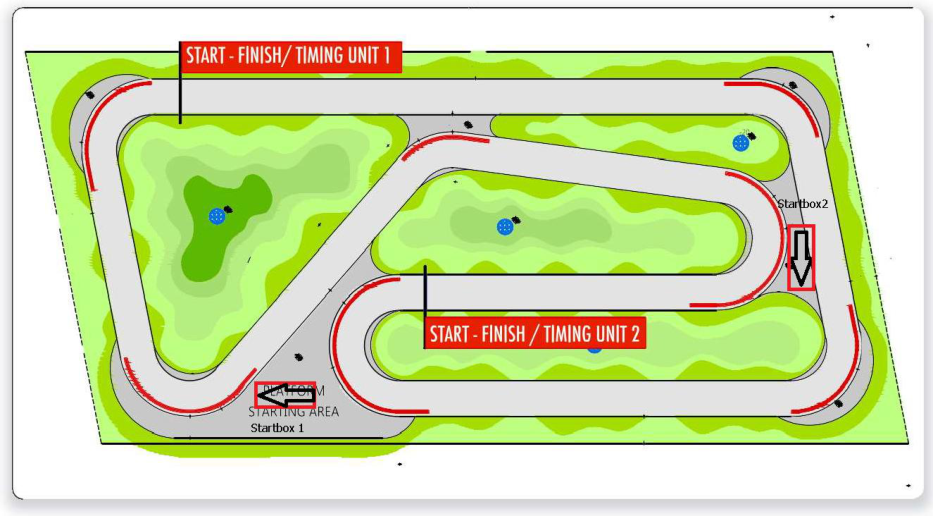

Example of track and timing layout. 

_(text modified on 1.01.21; 1.01.25)_ 

## **Head-to-head - Dual** 

**4.6.012** The track needs to be equipped with 1 timing unit and 2 start mechanisms (preferred). The timing units shall be placed in co-operation with the commissaire. 

- Riders will go head-to-head at the same time. 

- The rider with the fastest qualification time has priority on its start position (1 or 2) 

- The rider must line up at the start line, with one foot on the ground. 

- The race starts as soon as the start mechanism starts the time and stops when the riders cross the finish line. 

- The rider who crosses the finish line 1st advances to the next round 

- Depending on the track layout, this format requires 2 runs per elimination heat (to be defined by the commissaire). 

- Run 1: The rider with the fasted timed run will start on the left course, at the same time the other rider starts on the right course. The riders go head-to-head and they both set a time. The maximum time difference / penalty is 1.5 sec (for example if a rider crashes). 

E0126 

**48** 

MOUNTAIN BIKE 

- Run 2: Both riders switch lanes. The riders go head-to-head for the second time and they both set a 2nd time. 

- The combination of both times (left and right course) per rider determines the riders overall time. 

- The winner of the heat is the rider with the fastest combined time and they advance to the next round. 

- In the event of a tiebreak (two or more riders have the same time) the time from 

- the Qualification round will determine the winner. 

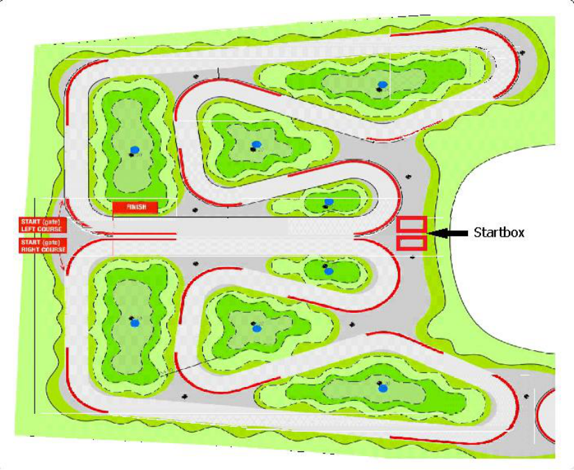

Example of track and timing layout. 

_(text modified on 1.01.21; 1.01.25)_ 

## **Solo runs** 

**4.6.013** The track needs to be equipped with 1 timing unit. Timing units to be placed in co-operation with the commissaire. 

- 2 riders will race against each other, in a separate run on the exact same track. 

- The rider must line up at the start line, with one foot on the ground. 

- The rider with the slower qualification time starts first in each of the rounds in the elimination heats down to the finals. 

- The riders only have 1 run to set a time. 

- The rider with the fastest time advances to the next round. 

- If a rider does not complete a full run, rider will be scored DNF without re-run. 

- In the event of a tiebreak (two or more riders have the same time) the time from 

- the Qualification round will determine the winner. 

E0126 

**49** 

MOUNTAIN BIKE 

(article modified on 1.01.21; 1.01.25) 

- **4.6.014** 

- **4.6.015** 

_(article abrogated on 1.01.21)_ 

Running order 

- Women's rounds followed by men’s rounds of 32nd rider 

- Starting with rounds of 32nd rider 

- Round of 16, round of 8 

- 

- 

- 

- Women big final 

- Men big final 

Heat order (men follow the running order until they reach the round where women will start). 

_(article modified on 1.01.25)_ 

E0126 

**50** 

MOUNTAIN BIKE 

Example of competition grid. 

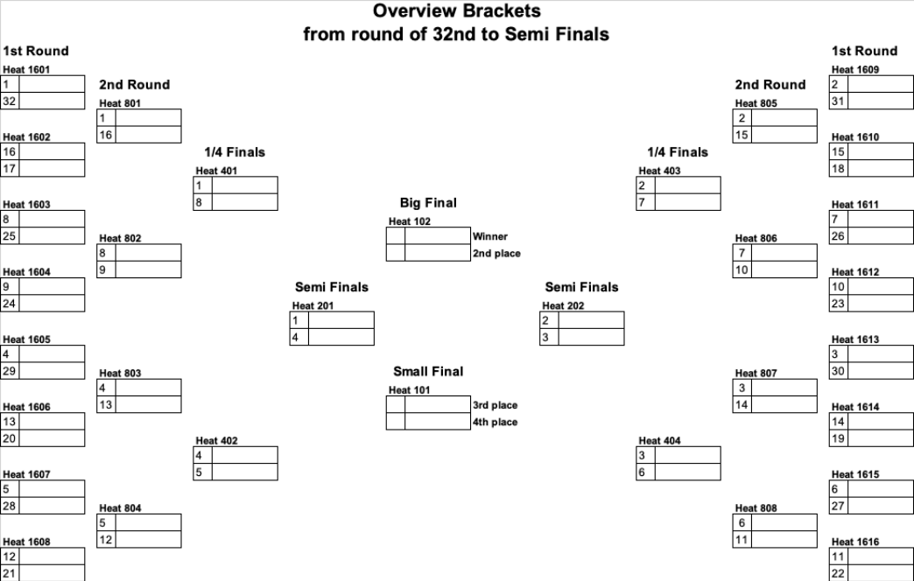

E0126 

**51** 

MOUNTAIN BIKE 

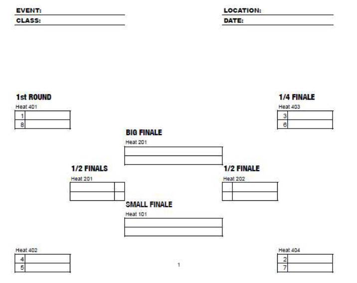

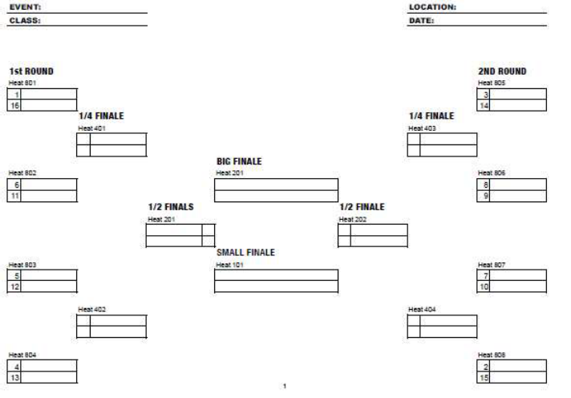

## **4.6.016 Open session** 

- An active transponder timing system and a screen are required to run this format. Qualification session 

- The track is open for a fixed pre-determined session time (length of session is 

- based on average lap time, track layout and number of riders). 

- Start order for the first run (in session) determined by plate number. 

- Riders can do as many laps as they want during the session. 

E0126 

**52** 

MOUNTAIN BIKE 

- 

   - The fastest lap of each rider counts. 

- After the open session, the fastest 32 riders advance to the elimination session. 

- If there are 31 and less riders in the open session, the fastest 16 advance to the 

- elimination session. 

- If there are 15 and less riders in the open session, the fastest 8 advance to the 

   - elimination session. 

- If there are 7 and less riders in the open session, the fastest 4 advance to 

   - the elimination session. 

## Elimination heats 

- The track is open for a fixed pre-determined session time during elimination 

- (length of session is based on average lap time and track layout). 

- Start order for the first run (in session) determined by results from the 

- qualification session. Fastest qualifier starts first in each round and session. 

- Top32 - fastest 16 riders advance to the next round. 

- Top16 - fastest 8 riders advance to the next round. 

- Quarter final - fastest 4 riders advance to the semi-final. 

- Semi-final - fastest 2 riders advance to the big final - slowest 2 riders to the small 

- final. 

- Small final - 2 riders, one run each - fastest rider got 3[rd] overall. 

- Big final - 2 riders, one run each - fastest rider wins overall. 

- If a rider fails to start in a particular round, they cannot advance to the next round. 

- - In the event of a tiebreak (two or more riders have the same time) the time from 

- the previously completed round will determine the winner. As an exception, in the Small Final and Big Final, a re-run will determine a winner 

_(text modified on 1.01.21; 1.01.25)._ 

E0126 

**53** 

MOUNTAIN BIKE 

## **Chapter VII   SNOW BIKE** 

_(chapter introduced on 1.01.19)_ 

## **§ 1 General** 

- **4.7.001** The snow bike is a downhill mountain bike snow event. 

Except the UCI Snow Bike World Championships and the UCI Snow Bike World Cup, the events will be considered as class 3 events. UCI points are awarded in relation to the rider's time. To ensure that this rule is correctly applied, only one combined result need to be sent to the UCI. 

## **Age Category** 

**4.7.002** The snow bike events are open to all riders from aged 17 or over. All riders therefore enter in the Men Elite and Women Elite categories. 

For participation in events on the international calendar, riders' categories are determined by the age of those competing as defined by the difference between the year of the event and the year of birth of the rider. 

## **Registration** 

- **4.7.003** The riders’ registration for the events is handled by the organiser. 

The number of riders registered is regulated by the organiser. 

## **Clothing and protective accessories** 

**4.7.004** The protective accessories are mandatory to all competitors according to articles 4.3.012 and 4.3.013. 

_(text modified on 01.01.26)_ 

## **Events formats characteristics** 

**4.7.005** The characteristics and format of each event will be determined in the technical guide for each event. 

## **Tyres** 

**4.7.006** The day before the competition, the organiser will give information and recommendations about the tyres to be used according to the snow characteristics. 

E0126 

**54** 

MOUNTAIN BIKE 

## **Chapter VIII   E-MOUNTAIN BIKE** 

_(chapter introduced on 1.01.19)_ 

## **§ 1 General** 

## **Use of EPACs** 

- **4.8.001** Only EPACs, in the sense of article 1.3.010bis, are authorized for use in E-Mountain Bike events. 

_(text modified on 1.01.25)_ 

## **Age category** 

- **4.8.002** Except if stated otherwise in the UCI Regulations for specific events or series, E- Mountain Bike events are open to all riders aged 19 and over and include Masters categories. No separate results must be submitted for the Under 23, Elite or Masters categories. 

_(text modified on 1.01.23)_ 

## **Events format and characteristics** 

**4.8.003** E-Mountain Bike events will be organised in the cross-country and Enduro formats and will be registered as Class 3 events. No UCI points will be awarded for E-Mountain Bike events. 

The characteristics and formats of events, specifications of EPACs, and verification procedures will be determined in the technical guide for each E-Mountain Bike event. The technical guide serves as regulation for each specific event in such matter not governed by the UCI Regulations. 

_(text modified on 1.01.25)_ 

## **Registration** 

- **4.8.004** The rider’s registration procedure is handled by the organizer of an E-Mountain Bike event. 

## **Battery** 

- **4.8.005** Riders can only use the battery fitted on their bike at the start and cannot carry an additional battery during the competition. 

_(text modified on 1.01.25)_ 

E0126 

MOUNTAIN BIKE **55** 

## **Chapter IX   UCI MOUNTAIN BIKE WORLD SERIES** 

_(Chapter reviewed on 1.01.23)._ 

## **§ 1 General** 

**4.9.001** The UCI Mountain Bike World Series is the exclusive property of the UCI. 

The UCI Mountain Bike World Series is made up of the UCI World Cup in the race types: 

- Cross-country (see Chapter X); 

- Downhill (see Chapter XI); 

- Enduro (see Chapter XIII). 

The UCI World Cups of each of the above-mentioned race types are the exclusive property of the UCI. 

_(text modified on 1.01.25)._ 

- **4.9.002** Each year the UCI designates the races, types of events and the age categories for each UCI World Cup which is part of the UCI Mountain Bike World Series. 

## **Registration** 

- **4.9.003** All riders must be registered using the online registration system through a dedicated website provided by the UCI or its promoter, if any. UCI MTB WORLD SERIES TEAMS and wildcards UCI MTB TEAMS register their riders. National federations register the other riders who qualify under provisions on participation. 

A table showing the opening and closing dates for entries is published on the UCI website. 

_(text modified on 1.01.25)._ 

- **4.9.004** All riders or their team managers must attend the riders’ confirmation presenting the rider licenses and picking up the race numbers within the deadlines indicated on the official program published on the dedicated website for the UCI Mountain Bike World Series. Riders who are not confirmed before the indicated deadline are considered not to have completed the registration procedure and will not be allowed to compete in the event. 

- **4.9.005** Late entries from UCI MTB WORLD SERIES TEAMS, UCI MTB TEAMS, national federations and riders are refused unless authorised and subject to compliance with provisions for participation as well as payment of a fine of EUR 300. 

Late entries are entries handled after the on-line registration deadline and before the riders’ confirmation deadline. Passed the riders’ confirmation deadline late entries are not considered. 

_(text modified on 1.01.25)._ 

## **Press conference** 

**4.9.006** At the request of the organiser, the three best placed riders in the event and the leader in the world cup standings must attend the press conference. 

## **Leader's jersey** 

- **4.9.007** The leader’s jersey is compulsory for the rider leading a UCI World Cup standing. 

E0126 

**56** 

MOUNTAIN BIKE 

- **4.9.008** The colours and the design of the leaders' jerseys shall be communicated to the riders concerned once approved by the UCI. 

E0126 

MOUNTAIN BIKE 

**57** 

## **Chapter X UCI MOUNTAIN BIKE CROSS-COUNTRY WORLD CUP** 

_(Chapter reviewed on 1.01.23)._ 

## **Participation** 

**4.10.001** UCI Cross-country World Cup events (XCO and XCC) are open to riders corresponding to the following categories and criteria: 

|**Category**|**One of the below mentioned criteria needs to be** **fulfilled**|
|---|---|
|XCO - men elite (aged 23 and over) XCO - women elite (aged 23 and over)|1. UCI MTB WORLD SERIES TEAM, maximum 4 riders per race and category 2.Maximum8 UCI MTB TEAM wildcards, maximum 4 riders per race and category decided one month prior the event 3. Any rider ranked in the top 100 of the last UCI XCO individual ranking before the event entry closing date (one month prior to the event) 4. The national federations may enter a maximum of 3 supplementary riders per category. These riders must wear national team clothing. 5. Topthreeriders of any round of aUCI Mountain Bike Continental Series, limited to 1 round of the UCI MTB World Cupwithin 52 weeks of the qualification (Golden Ticket) _Not applicable for riders member of a UCI MTB_ _WORLD SERIES TEAM_ 6. Top five riders from the final standings of any of the UCI Mountain BikeContinental Series of the previous year, Elite _Not applicable for riders member of a UCI MTB_ _WORLD SERIES TEAM_ 7. Top five riders from the final standings of any of the UCI Mountain BikeContinental Series of the previous year, U23 (if progressing into Elite category) _Not applicable for riders member of a UCI MTB_ _WORLD SERIES TEAM_ 8. Current Olympic Champion, UCI World Champion, Continental Champions, National Champions|
|XCO - men under 23 (aged from 19 to 22) XCO - women under 23 (aged from 19 to 22)|1. UCI MTB WORLD SERIES, maximum 4 riders per race and category 2.Maximum8 UCI MTB TEAM wildcards, maximum 4 riders per race and category decided one month prior to the event 3. Any rider ranked in the top 200 of the last UCI XCO individual ranking before the event entry closing date (one month prior to the event) 4. The national federations may enter a maximum of 4 supplementary riders per category. These riders must wear national team clothing. 5. Topthreeriders of any round of aUCI Mountain Bike Continental Series, limited to 1 round of the UCI MTB World Cupwithin 52 weeks of the qualification (Golden Ticket)|

E0126 

**58** 

MOUNTAIN BIKE 

||_Not applicable for riders member of a UCI MTB_ _WORLD SERIES TEAM_ 6. Top five riders from the final standings of any of the UCI Mountain BikeContinental Series of the previous year, U23 _Not applicable for riders member of a UCI MTB_ _WORLD SERIES TEAM_ 7. Top five riders from the final standings of any of the UCI Mountain BikeContinental Series of the previous year, Junior (if progressing into U23 category) _Not applicable for riders member of a UCI MTB_ _WORLD SERIES TEAM_ 8. UCI World Champion, Continental Champions, National Champions|
|---|---|
|XCC – men elite (aged 23 and over) XCC – women elite (aged 23 and over) XCC – men under 23 (aged from 19 to 22) XCC – women under 23 (aged from 19 to 22)|Riders already registered and confirmed for the XCO event taking place during the same weekend shall be allowed to start in the XCC event. The riders shall be selected as per article 4.10.003, points 1 and 2,to reach a total number of 40 riders per gender.On top of those 40 riders, wild cards can be awarded as per article 4.10.003, point 3.No online registration is required for the XCC event. The same bike must be used for XCC and XCO. For XCC, the minimum tyre width must be 45mm.|

## **Registration** 

Riders registration can be done only by a UCI MTB WORLD SERIES TEAM, a UCI MTB TEAM or a national federation. 

If a rider that confirmed his participation to the XCC event is not starting, he will not be allowed to start the XCO event on the same world cup round unless if the rider has been declared medically unfit to start the XCC event by the organiser’s chief medical officer or the team doctor. The rider must then be declared medically fit prior to starting the XCO, no later than 2 hours prior to the race start time. 

## **Wildcard** 

Criteria to award the maximum 8 UCI MTB TEAM wildcards (as per point 2 of the participation criteria) per event will be based on the: 

- UCI team ranking, current and previous season 

- Profile of any individual riders 

- UCI Team composition (multi-category, multi-gender) 

- Profile of team sponsors (out of industry, global, etc.) 

- Media profile of team (social media, etc.) 

- Any injury issues during current or previous season 

- Anti-doping history 

- Home country of team 

- UCI Mountain Bike Continental Series team standing 

Prior to making a decision, the UCI can request the production of information or documents to assess the criteria above. 

E0126 

**59** 

MOUNTAIN BIKE 

_(text modified on 1.01.25; 1.01.26)._ 

- **4.10.002** Riders must display their handlebar numbers during training sessions and also their back number during the race. 

A coach of a national team or a UCI MTB WORLD SERIES TEAM or a UCI MTB TEAM wishing the reconnoitre the course must request a handlebar number. The coach must also hold a valid licence and wear a helmet. 

_(text modified on 1.01.25)._ 

- **4.10.003** The start order is determined as follows: 

XCC men elite and women elite, XCC men under 23 and women under 23 

1. riders ranked in the top 16 of the most recently published XCO UCI World Cup standings (not applicable for the first UCI World Cup round of the season) 

2. as per the most recently published UCI XCO individual ranking 

3. riders ranked in below rankings, unless they are listed on the start order above: 

   - top 10 of the UCI cyclo-cross individual ranking; 

   - top 20 of the UCI road individual world ranking; 

The place 41[st] and after will be allocated following the rank of each rider, whatever the ranking: UCI cyclo-cross or UCI road world ranking. If two or three riders have the same ranking, they will be placed by drawing lots. 

Riders with injury status shall be integrated in the start order in accordance with article 4.10.011. 

Riders with pregnancy status shall be integrated in the start order in accordance with article 4.10.012. 

XCO men elite and women elite 

1. the riders ranked in the top 24 of the XCC race of the same UCI World Cup round 

2. the place 25th to 32nd will be allocated as per the most recently published UCI XCO individual ranking. 

3. Place 33rd to 40th of the start order will be allocated to riders ranked in below rankings, unless they are listed on the start order between the place 1st to 32nd according to point 1 and 2 above: 

   - top 10 of the UCI cyclo-cross individual ranking 

   - top 20 of the UCI road individual world ranking 

The place 33rd to 40th will be allocated following the rank of each rider, whatever the ranking: UCI cyclo-cross or UCI road world ranking. If two or three riders have the same ranking, they will be placed by drawing lots. 

4. as per the most recently published UCI XCO individual ranking. 

5. unclassified riders: by drawing lots. 

Riders with injury status shall be integrated in the start order in accordance with article 4.10.011. 

Riders with pregnancy status shall be integrated in the start order in accordance with article 4.10.012. 

E0126 

**60** 

MOUNTAIN BIKE 

XCO men under 23 and women under 23: 

1. the riders ranked in the top 24 of the XCC race of the same UCI World Cup round 

2. as per the most recently published UCI XCO individual ranking 

3. unclassified riders; by drawing lots 

Riders with injury status shall be integrated in the start order in accordance with article 4.10.011. 

Riders with pregnancy status shall be integrated in the start order in accordance with article 4.10.012. 

_(text modified on 1.01.24; 1.01.25; 1.01.26)_ 

- **4.10.004** In cross-country Olympic (XCO) and cross-country short track (XCC), any rider whose time being 80% slower of that of the race leader's first lap is pulled out of the  race. He is required to leave the race at the end of his lap in the zone provided for the  purpose (the "80% zone") except when the rider is on his final lap. 

- **4.10.005** Lapped riders must complete the lap on which they were lapped and then leave the race via 80% zone. 

- **4.10.006** Riders pulled out of the race under article 4.10.004 and lapped riders are listed in the results in the order in which they are pulled out of the race showing the number of laps down. 

## **Official ceremony** 

**4.10.007** The official ceremony takes place immediately after each race. Riders arriving later than 5 minutes after they finished their race are fined. 

The following riders must attend: 

- the first three riders in the elite XCO events; 

- the first three riders in the elite XCC events; 

- the leader of the elite UCI World Cup standings after the event in question (XCO, XCC); 

- the first three riders in the under 23 events (XCO, XCC); 

- the leader of the under 23 UCI World Cup standings after the event in question (XCO, XCC); 

- the team leading the team standings after the event in question (specified in article 4.10.009); 

- the team of the day. 

The first three riders in the race and the leader of the general classification of the UCI World Cup must attend the podium. 

The UCI Mountain Bike World Cup licensee shall award a trophy to the first three of the final classification of the UCI Mountain Bike World Cup in each category. 

N.B - Bicycles cannot be taken onto the podium. However, an area is provided in front of the podium to display the bicycle of the winner during the official ceremony. 

_(text modified on 01.01.25; 01.01.26)_ 

## **World cup standings** 

E0126 

**61** 

MOUNTAIN BIKE 

- **4.10.008** The UCI World Cup standings are drawn up on the basis of the points won by each rider in accordance with the table in article 4.10.010. 

For the sake of clarity, the cross-country world cup standings are drawn up by summing the points scored in the XCC and XCO events. 

Riders tying on points are ranked by the greatest number of 1st places, 2nd places, etc. (total points in the standings of the concerned round) taking account only of places for which points are awarded for the UCI World Cup. If they are still tied, the points scored in the most recent UCI World Cup event are used to separate them. 

In the event of a tie on points for cross-country after the XCC and XCO events, the riders’ positions are determined by the result in the XCO event. 

**4.10.009** A team standing is drawn up for each round of the UCI World cup. Only riders registered in a UCI MTB WORLD SERIES TEAM or a UCI MTB TEAM can score points for their team in accordance with the team standing table in article 4.10.010. 

For cross-country, a mixed team classification is drawn up. The team classification is drawn up by summing the total points (XCC and XCO) of the 4 highest scoring riders of each team without making a distinction between men elite, men under 23, women elite and women under 23. Teams with only one or two or three riders scoring points are also included in the team classification. Tied teams will have their relative positions determined by their best ranked rider within the top 30 of the XCO event. Should there still be a tie, the order is determined by the best ranked rider within the top 30 of the XCC event. 

After each round of the UCI World Cup, the team standings is drawn up by adding the points won in the team classification per event. Ties are separated by the largest number of 1st places, 2nd places, etc. Should there still be a tie, the order is determined by the team classification for the most recent UCI World Cup round. 

The riders of the team leading the team standings are given leaders handlebar number plates which must be used during the UCI World Cup. 

_(text modified on 1.01.25)._ 

**4.10.010** Points scale A. Cross-country Olympic (XCO) and cross-country short track (XCC) events 

|**Position**|**XCO men** **and women** **elite points**|**XCO men** **and women** **under 23** **points**|**XCC men** **and women** **elite points**|**XCC men** **and women** **elite (points** **allocated to** **the XCO** **standing)**|**XCC men** **and women** **under 23** **points**|**XCC men** **and women** **under 23** **(points** **allocated to** **the XCO** **standing)**|
|---|---|---|---|---|---|---|
|1|250|125|250|80|125|40|
|2|200|100|200|65|100|30|
|3|160|80|160|50|80|25|
|4|150|75|150|40|75|20|
|5|140|70|140|38|70|19|
|6|130|65|130|37|65|18|

E0126 

MOUNTAIN BIKE **62** 

|7|120|60|120|36|60|17|
|---|---|---|---|---|---|---|
|8|110|55|110|35|55|16|
|9|100|52|100|34|52|15|
|10|95|51|95|33|51|14|
|11|90|50|90|32|50|13|
|12|85|49|85|31|49|12|
|13|80|48|80|30|48|11|
|14|78|47|78|29|47|10|
|15|76|46|76|28|46|9|
|16|74|45|74|27|45|8|
|17|72|44|72|26|44|7|
|18|70|43|70|25|43|6|
|19|68|42|68|24|42|5|
|20|66|41|66|23|41|4|
|21|64|40|64|22|40||
|22|62|39|62|21|39||
|23|60|38|60|20|38||
|24|58|37|58|19|37||
|25|56|36|56|18|36||
|26|54|35|54|17|35||
|27|52|34|52|16|34||
|28|50|33|50|15|33||
|29|48|32|48|14|32||
|30|46|31|46|13|31||
|31|44|30|44|12|30||
|32|42|29|42|11|29||
|33|40|28|40|10|28||
|34|38|27|38|9|27||
|35|36|26|36|8|26||
|36|34|25|34|7|25||
|37|32|24|32|6|24||
|38|30|23|30|5|23||
|39|29|22|29|4|22||
|40|28|21|28|3|21||
|41|27|20|||||
|42|26|19|||||
|43|25|18|||||
|44|24|17|||||
|45|23|16|||||
|46|22|15|||||
|47|21|14|||||
|48|20|13|||||
|49|19|12|||||
|50|18|11|||||
|51|17|10|||||

E0126 

**63** 

MOUNTAIN BIKE 

|52|16|9|||||
|---|---|---|---|---|---|---|
|53|15|8|||||
|54|14|7|||||
|55|13|6|||||
|56|12|5|||||
|57|11|4|||||
|58|10|3|||||
|59|9|2|||||
|60|8|1|||||

B. Team standing 

|nding|||||
|---|---|---|---|---|
|**Position**|**XCO** **men** **and** **women** **elite** **points**|**XCC** **men** **and** **women** **elite** **points**|**XCO** **men** **and** **women** **under** **23** **points**|**XCC** **men** **and** **women** **under** **23** **points**|
|1|80|40|40|20|
|2|75|39|39|19|
|3|72|38|38|18|
|4|70|37|37|17|
|5|68|36|36|16|
|6|66|35|35|15|
|7|64|34|34|14|
|8|62|33|33|13|
|9|60|32|32|12|
|10|58|31|31|11|
|11|56|30|30|10|
|12|54|29|29|9|
|13|52|28|28|8|
|14|50|27|27|7|
|15|48|26|26|6|
|16|46|25|25|5|
|17|44|24|24|4|
|18|43|23|23|3|
|19|42|22|22|2|
|20|41|21|21|1|
|21|40|20|20||
|22|39|19|19||
|23|38|18|18||
|24|37|17|17||
|25|36|16|16||
|26|35|15|15||
|27|34|14|14||
|28|33|13|13||

E0126 

**64** 

MOUNTAIN BIKE 

|29|32|12|12||
|---|---|---|---|---|
|30|31|11|11||
|31|30|10|10||
|32|29|9|9||
|33|28|8|8||
|34|27|7|7||
|35|26|6|6||
|36|25|5|5||
|37|24|4|4||
|38|23|3|3||
|39|22|2|2||
|40|21|1|1||
|41|20||||
|42|19||||
|43|18||||
|44|17||||
|45|16||||
|46|15||||
|47|14||||
|48|13||||
|49|12||||
|50|11||||
|51|10||||
|52|9||||
|53|8||||
|54|7||||
|55|6||||
|56|5||||
|57|4||||
|58|3||||
|59|2||||
|60|1||||
|60|1||||

## **Injury status** 

**4.10.011** If due to injury a rider took part in less than three rounds of the UCI World Cup in a season, the national federation and the team may apply to the UCI for recognition of injury status. An application must be received at the UCI in writing no later than October 30[th] of the disrupted season. 

A rider with injury status shall be integrated in the ranking that is used to determine the start list, with the number of points determined according to following calculation: the average points gained per round in which the rider took part multiplied by the number of rounds of the UCI World Cup season during which the rider was absent due to injury. In case the rider is no longer included in the UCI World Cup standings, his UCI ranking of the year n-2 on 31 December will be considered. 

E0126 

**65** 

MOUNTAIN BIKE 

Such benefit shall be limited to the first two rounds of the UCI World Cup in which the rider takes part during the following season. 

_(text modified on 01.01.24; 01.01.26)_ 

## **Pregnancy status** 

**4.10.012** If due to pregnancy a rider took part in less than three rounds of the UCI World Cup in a season, the national federation and the team may apply to the UCI for recognition of pregnancy status. An application must be received at the UCI in writing no later than December 31[st] of the disrupted season. 

A rider with pregnancy status shall be integrated in the ranking that is used to determine the start list, with the number of points determined according to following calculation: the average points gained per round in which the rider took part multiplied by the number of rounds of the UCI World Cup season during which the rider was absent due to pregnancy. 

In case the rider is no longer included in the UCI World Cup standings, his UCI ranking of the year n-2 on 31 December will be considered. 

Such benefit shall be limited to the first two rounds of the UCI World Cup in which the rider takes part during the following season. 

_(article introduced on 01.01.24; text modified on 01.01.26)_ 

E0126 

**66** 

MOUNTAIN BIKE 

## **Chapter XI UCI MOUNTAIN BIKE DOWNHILL WORLD CUP** 

_(Chapter reviewed on 1.01.23)._ 

## **Participation** 

**4.11.001** UCI Downhill World Cup events are open to riders corresponding to the following categories and criteria: 

|**Category**|**One of the below mentioned criteria needs to be** **fulfilled**|
|---|---|
|DHI - men elite (aged 19 and over) DHI - women elite (aged 19 and over)|1. UCI MTB WORLD SERIES TEAM, maximum 4 riders per race and category 2.Maximum8 UCI MTB TEAM wildcard, maximum 4 riders per race and category decided one month prior to the event 3. Any rider ranked in the top 50 of the last UCI DHI individual ranking before the event entry closing date (one month prior to the event) 4. The national federations may enter a maximum of 3 supplementary riders per category. These riders must wear national team clothing. 5. Topthreeriders of any round of aUCI Mountain BikeContinental Series, limited to 1 round of the UCI MTB World Cupwithin 52 weeks of the qualification(Golden Ticket) _Not applicable for riders member of a UCI MTB_ _WORLD SERIES TEAM_ 6. Top five riders from the final standings of any of the UCI Mountain BikeContinental Series of the previous year, Elite _Not applicable for riders member of a UCI MTB_ _WORLD SERIES TEAM_ 7. Top five riders from the final standings of any of the UCI Mountain BikeContinental Series of the previous year, Junior (if progressing into Elite category) _Not applicable for riders member of a UCI MTB_ _WORLD SERIES TEAM_ 8. Current UCI World Champion, Continental Champions, National Champions|
|DHI - men juniors (aged 17 and 18) DHI – women juniors (aged 17 and 18)|1. UCI MTB WORLD SERIES TEAM, maximum 4 riders per race and category 2.Maximum8 UCI MTB TEAM wildcard, maximum 4 riders per race and category decided one month prior the event 3. Any rider ranked in the top 100 of the last UCI DHI individual ranking before the event entry closing date (one month prior the event) 4. The national federations may enter a maximum of 4 supplementary riders per category. These riders must wear national team clothing. 5. Topthreeriders of any round of aUCI Mountain Bike Continental Series, limited to 1 round of the UCI MTB World Cupwithin 52 weeks of the qualification|

E0126 

**67** 

MOUNTAIN BIKE 

- _Not applicable for riders member of a UCI MTB WORLD SERIES TEAM_ 

- 6. Top five riders from the final standings of any of the UCI Mountain Bike Continental Series of the previous year, Junior _Not applicable for riders member of a UCI MTB WORLD SERIES TEAM_ 

- 7. Top five riders from the final standings of any of the UCI Mountain Bike Continental Series of the previous year, Cadet (if progressing into Junior category) _Not applicable for riders member of a UCI MTB WORLD SERIES TEAM_ 

- 8. Current UCI World Champion, Continental Champions, National Champions 

## **Registration** 

Riders registration can be done only by a UCI MTB WORLD SERIES TEAM, a UCI MTB TEAM or a national federation. 

## **Wildcard** 

Criteria to award the maximum 8 UCI MTB TEAM wildcards (as per point 2 of the participation criteria) per event will be based on the: 

- UCI team ranking, current and previous season 

- Profile of any individual riders 

- UCI Team composition (multi-category, multi-gender) 

- Profile of team sponsors (out of industry, global, etc.) 

- Media profile of team (social media, etc.) 

- Any injury issues during current or previous season 

- Anti-doping history 

- Home country of team 

- UCI Mountain Bike Continental series team standing 

Prior to making a decision, the UCI can request the production of information or documents to assess the criteria above. 

_(text modified on 1.01.25; 1.01.26)._ 

- **4.11.002** _(article abrogated on 1.01.25)._ 

- **4.11.003** Riders must display their handlebar numbers during training sessions. 

- **4.11.004** The start order for the qualifying round 1 is determined as follows: Men Elite, Women Elite: 

   1. riders ranked in the top 20 men and the top 10 women of the most recently published UCI World Cup standings (for the first event, as per the final world cup standings of the previous year), starting in reverse order. 

   2. as per the most recently published UCI World Cup standings; 

   3. as per the most recently published UCI DHI individual ranking 

   4. unclassified riders: by drawing lots. 

E0126 

MOUNTAIN BIKE **68** 

Riders with injury status shall be integrated in the start order in accordance with article 4.11.021. 

Riders with pregnancy status shall be integrated in the start order in accordance with article 4.11.022. 

The start order for the qualifying round 2 is determined as follows: Men Elite, Women Elite: 

1. reverse order of qualifying round 1 results; 

2. riders ranked in the top 20 men and the top 10 women of the most recently published UCI World Cup standings (for the first event, as per the final UCI World Cup standings of the previous year), that did not qualify via the qualifying round 1 will start before the top 10 riders from qualifying round 1, starting in reverse order. 

The start order for the qualifying rounds is determined as follows: Men Junior, Women Junior: 

1. riders ranked in the top 20 men junior and the top 10 women junior of the most recently published UCI World Cup standings (not applicable for the first UCI world cup round of the season), starting in reverse order; 

2. as per the most recently published UCI World Cup standings; 

3. as per the most recently published UCI DHI individual ranking. 

4. unclassified riders: by drawing lots. 

Riders with injury status shall be integrated in the start order in accordance with article 4.11.021. 

_(text modified on 01.01.24; 01.01.25; 01.01.26)_ 

**4.11.005** A transport system capable of carrying 250 riders per hour up to the start line must be provided at all world cup venues. All loading and unloading bicycles onto this transport system must be carried out by staff of the organisation. 

_(text modified on 1.01.25)._ 

## **Training** 

- **4.11.006** The organiser must ensure that the following minimum training program is provided. 

Three days before the final an on foot downhill course inspection period must be provided for the riders. The course must be fully marked and cordoned off. No bikes are allowed on the course during the on foot downhill course inspection. 

One day before the final a training period will be provided. 

A training period that is reserved only for the riders qualified for the finals must be provided, on the day of the final. This training period must last for at least 30 minutes. 

_(text modified on 1.01.24)_ 

- **4.11.007** 

   - Riders must have completed 2 training runs before starting the qualifying round. 

- **4.11.008** Riders who ride on the course outside the specified training periods are disqualified from the event. 

E0126 

**69** 

MOUNTAIN BIKE 

The transport system closes 15 minutes before the end of the training times unless otherwise specified. A closing rider needs to be supplied by the organiser to clear the course between training sessions under the instructions of the president of the commissaires’ panel. 

_(text modified on 1.01.25)._ 

- **4.11.009** Two forerunners must be designated and be ready to run the course as indicated by the president of the commissaires' panel before the qualifying round and finals. The forerunners' bicycles must be fitted with handlebar numbers bearing the letters A and B. 

The closing rider, according to article 4.11.008, must be fitted with the handlebar number bearing the letter C. 

Forerunners and closing rider must be at least aged 17 and a UCI license holder adequately insured. 

_(text modified on 01.01.26)_ 

## **Competition** 

## **4.11.010** 

The downhill competition must include at minimum one qualifying round and a final. 

The top 20 men juniors and top 10 women juniors from the qualifying round qualify for the final. 

The top 20 men elite and top 10 women elite from the qualifying round 1 qualify for the final. 

The top ~~30~~ 10 men elite and top ~~10~~ 5 women elite from the qualifying round 2 qualify for the final. 

If the final cannot take place due to unforeseen circumstances, the first qualifying round to take place determines the final result. 

_(text modified on 1.01.25)._ 

- **4.11.011** The start area is drawn up according article 4.3.009 and a covered warm-up area must be provided close to the start area for the riders. Details on the start area and the start rails are indicated in the world cup organizers guide. 

- **4.11.012** Riders in the qualifying rounds must start at intervals of no less than 30 seconds. The intervals between the riders can be modified only by the president of the commissaires’ panel upon consultation with the UCI’s appointee. 

_(text modified on 1.01.25)._ 

- **4.11.013** In the qualifying round 1 and final round, riders are awarded UCI World Cup standing points as per the scale in article 4.11.020. However, in the last round of the UCI World Cup season, no standing points for the qualifying round will be given. The standing and UCI points will be awarded to the riders according to their position in the final only, as per points scale in article 4.11.020. 

UCI points will be awarded to the qualifying round 1 and final as per annex 3. 

E0126 

**70** 

MOUNTAIN BIKE 

No points are awarded during the juniors qualifying rounds. 

_(text modified on 1.01.25)._ 

- **4.11.014** _(article abrogated on 1.01.25)._ 

- **4.11.015** The start order for the final for elite will be determined on the basis of the reverse results of the qualifying round 2 followed by the reverse results of the qualifying round 1. The start order for the final for junior will be determined on the basis of the reverse results of the qualifying round. 

_(text modified on 1.01.24; 1.01.25)_ 

- **4.11.016** Riders in the final must start at intervals of no less than one minute. The last 10 riders must start at intervals of at least 2 minutes. The intervals between the riders can be modified only by the president of the commissaires’ panel upon consultation with the UCI’s appointee. 

_(text modified on 1.01.25)._ 

## **Official ceremony** 

**4.11.017** The official ceremony takes place immediately after each race. Riders arriving later than 5 minutes after they finished their race are fined. 

The following riders must attend: 

- the first three riders in the elite events; 

- the leader of the elite UCI World Cup standings after the event in question; 

- the first three riders in the juniors events; 

- the leader of the juniors UCI World Cup standings after the event in question; 

- the team leading the team standings after the event in question (specified in article 4.11.020); 

- the team of the day. 

The first three riders in the race and the leader of the general classification of the UCI World Cup must attend the podium. 

The UCI Mountain Bike World Cup licensee shall award a trophy to the first three of the final classification of the UCI Mountain Bike World Cup in each category. 

Bicycles cannot be taken onto the podium. However, an area is provided in front of the podium to display the bicycle of the winner during the official ceremony. 

_(text modified on 01.01.25; 01.01.26)_ 

## **UCI World Cup standings** 

**4.11.018** The UCI World Cup standings are drawn up on the basis of the points won by each rider in accordance with the table in article 4.11.020. 

Riders tying on points are ranked by the greatest number of 1st places, 2nd places, etc. (total points in the standings of the concerned round) taking account only of places for which points are awarded for the UCI World Cup. If they are still tied, the points scored in the most recent UCI World Cup event are used to separate them. 

In the event of a tie on points in the downhill after the qualifying round and the final, the riders’ positions are determined by the result of the final. 

E0126 

**71** 

MOUNTAIN BIKE 

- **4.11.019** A team standing is drawn up for each round of the UCI Downhill World Cup. Only riders registered in a UCI MTB WORLD SERIES TEAM or a UCI MTB TEAM can score points for their team in accordance with the team standing table in article 4.11.020. 

For downhill, a mixed team classification is drawn up by summing the 4 highest scored points of each team without making a distinction between men elite, men juniors, women elite and women juniors. Only the results of the finals are taken into account. Teams with only one, two or three riders scoring points are also included in the team classification. Tied teams will have their relative positions determined by their best placed rider. Should there still be a tie, the order is determined as follows: best placed men elite, best placed women elite, best placed men juniors, best placed women juniors. 

After each round of the UCI World Cup, the team standings is drawn up by adding the points won in the team classification per event. Ties are separated by the largest number of 1st places, 2nd places, etc. Should there still be a tie, the order is determined by the team classification for the most recent UCI World Cup round. 

The riders of the team leading the team standings are given leaders’ handlebar number plates which must be used during the world cup. 

_(text modified on 1.01.25)._ 

## **4.11.020** Points scale 

A. Downhill men and women elite 

N.B. – In accordance with article 4.11.013, in the last round of the UCI World Cup season, no point for the qualifying round will be given. 

|**Position**|**Men elite** **Qualifying** **round 1** **points**|**Men** **Elite** **Final** **points**|**Women** **elite** **Qualifying** **round 1** **points**|**Women** **Elite** **Final** **points**|
|---|---|---|---|---|
|1|50|250|50|250|
|2|40|210|40|210|
|3|30|180|30|180|
|4|25|160|25|150|
|5|22|140|20|120|
|6|20|125|16|90|
|7|18|110|14|80|
|8|17|95|12|70|
|9|16|80|10|60|
|10|15|75|5|50|
|11|14|71||48|
|12|13|68||44|
|13|12|65||40|
|14|11|63||35|
|15|10|60||30|

E0126 

**72** 

MOUNTAIN BIKE 

|16|9|58|||
|---|---|---|---|---|
|17|8|56|||
|18|7|54|||
|19|6|52|||
|20|5|50|||
|21||48|||
|22||46|||
|23||44|||
|24||42|||
|25||40|||
|26||38|||
|27||36|||
|28||34|||
|29||32|||
|30||30|||
|31|||||
|32|||||
|33|||||
|34|||||
|35|||||
|36|||||
|37|||||
|38|||||
|39|||||
|40|||||
|41|||||
|42|||||
|43|||||
|44|||||
|45|||||
|46|||||
|47|||||
|48|||||
|49|||||
|50|||||
|51|||||
|52|||||
|53|||||
|54|||||
|55|||||
|56|||||
|57|||||
|58|||||
|59|||||
|60|||||

E0126 

**73** 

MOUNTAIN BIKE 

B. 

## Downhill men and women juniors (finals only) 

|**Position**|**Men** **juniors** **points**|**Women** **juniors** **points**|
|---|---|---|
|1|60|60|
|2|50|50|
|3|45|45|
|4|40|40|
|5|35|35|
|6|30|30|
|7|28|25|
|8|26|15|
|9|24|10|
|10|22|5|
|11|20||
|12|18||
|13|16||
|14|14||
|15|12||
|16|10||
|17|9||
|18|8||
|19|7||
|20|6||

C. Team standing 

|standing|||||
|---|---|---|---|---|
|**Position**|**Men** **Elite** **points**|**Women** **Elite** **points**|**Men** **Juniors** **points**|**Women** **Juniors** **points**|
|1|40|40|20|20|
|2|35|35|15|15|
|3|32|32|10|10|
|4|30|25|8|8|
|5|28|20|6|6|
|6|26|15|5||
|7|24|10|4||
|8|23|8|3||

E0126 

**74** 

MOUNTAIN BIKE 

|9|22|7|2||
|---|---|---|---|---|
|10|21|6|1||
|11|20|5|||
|12|19|4|||
|13|18|3|||
|14|17|2|||
|15|16|1|||
|16|15||||
|17|14||||
|18|13||||
|19|12||||
|20|11||||
|21|10||||
|22|9||||
|23|8||||
|24|7||||
|25|6||||
|26|5||||
|27|4||||
|28|3||||
|29|2||||
|30|1||||

_(text modified on 1.01.24; 1.01.25)_ 

## **Injury status** 

**4.11.021** If due to injury a rider took part in less than three rounds of the UCI World Cup in a season, the national federation and the team may apply for recognition of injury status. An application must be received at the UCI in writing no later than October 30[th] of the disrupted season. 

A rider with injury status shall be integrated in the ranking that is used to determine the start list, with the number of points determined according to following calculation: the average points gained per round in which the rider took part multiplied by the number of rounds of the UCI World Cup season during which the rider was absent due to injury. 

In case the rider is no longer included in the UCI World Cup standings, his UCI ranking of the year n-2 on 31 December will be considered. 

Such benefit shall be limited to the first two rounds of the UCI World Cup in which the rider takes part during the following season. 

_(text modified on 01.01.24; 01.01.26)_ 

## **Pregnancy status** 

**4.11.022** If due to pregnancy a rider took part in less than three rounds of the UCI World Cup in a season, the national federation and the team may apply for recognition of pregnancy status. An application must be received at the UCI in writing no later than December 31[st] of the disrupted season. 

E0126 

MOUNTAIN BIKE 

**75** 

A rider with pregnancy status shall be integrated in the ranking that is used to determine the start list, with the number of points determined according to following calculation: the average points gained per round in which the rider took part multiplied by the number of rounds of the UCI World Cup season during which the rider was absent due to pregnancy. 

In case the rider is no longer included in the UCI World Cup standings, his UCI ranking of the year n-2 on 31 December will be considered. 

Such benefit shall be limited to the first two rounds of the UCI World Cup in which the rider takes part during the following season. 

_(article introduced on 01.01.24; text modified on 01.01.26)_ 

E0126 

**76** 

MOUNTAIN BIKE 

## **Chapter XII UCI MOUNTAIN BIKE MARATHON WORLD CUP** 

_(Chapter reviewed on 1.01.23; 1.01.25)._ 

- **4.12.001** The UCI Mountain Bike Marathon World Cup is the exclusive property of the UCI. 

- **4.12.002** Each year the UCI designates the races which are part of the UCI Mountain Bike Marathon World Cup. 

## **Registration** 

- **4.12.003** All riders must be registered using the online registration system through a dedicated website provided by the UCI or its promoter, if any. UCI MTB WORLD SERIES TEAMS and UCI MTB TEAMS register their riders. National federations register the other riders who qualify under provisions on participation. 

## **Participation** 

- **4.12.004** UCI Marathon World Cup events are open to riders following these conditions: 

   - having an annual licence issued by a national federation; 

   - there is no requirement in terms of UCI points to participate; 

   - unlimited participation for national federations or teams as riders can participate in their UCI MTB TEAM jersey or regional club jersey 

## **Age category** 

- **4.12.005** The age category for the UCI Marathon World Cup is 19 years or over. Holders of elite licences may participate. 

There are no separate races or results for under 23. 

Masters categories shall be listed in a separate results. 

_(text modified on 01.01.25; 01.01.26)._ 

- **4.12.006** Top 20 men and women of each round of the UCI Marathon World Cup as well as the top 80 of the UCI XCM individual ranking obtain a qualification for the UCI Marathon World Championships. 

- **4.12.007** UCI Marathon World Cup events include cross-country marathon (XCM) events as per article 4.2.004. 

- **4.12.008** The start order is determined as follows: 

   1. Riders ranked in the top 24 of the most recently published UCI Marathon World Cup standing (not applicable for the first UCI Marathon World Cup round of the season) 

   2. As per the most recently published UCI XCM individual ranking. 

   3. As per the most recently published UCI XCO individual ranking. 

   4. Unclassified riders: by drawing lots. 

## **Official ceremony** 

**4.12.009** The official ceremony takes place immediately after each race ~~involved.~~ Riders arriving later than 5 minutes after they finished their race are fined. 

The following riders must attend: 

- the first three riders; 

- the leader of the UCI World Cup standings after the event in question; 

E0126 

MOUNTAIN BIKE 

**77** 

The first three riders in the race and the leader of the general classification of the UCI World Cup must attend the podium. 

The UCI Mountain Bike World Cup licensee shall award a trophy to the first three of the final classification of the UCI Mountain Bike World Cup in each category. 

N.B. - Bicycles cannot be taken onto the podium. However, an area is provided in front of the podium to display the bicycle of the winner during the official ceremony. 

_(text modified on 01.01.25; 01.01.26)_ 

## **UCI World Cup standings** 

**4.12.010** The UCI World Cup standings are drawn up on the basis of the points won by each rider in accordance with the table in article 4.12.013. 

For the sake of clarity, the UCI Marathon World Cup standings are drawn up by summing the points scored in the UCI Marathon World Cup events. 

Riders tied on points are separated by the greatest number of 1st places, 2nd places, etc. (total points in the standings of the concerned UCI Marathon World Cup round) taking into account only the places for which points are awarded for the UCI Marathon World Cup. If they are still tied, the points scored in the most recent UCI Marathon World Cup event are used to separate them. 

A UCI marathon team standing is calculated by adding the points of the 4 best placed men and the 4 best placed women of each UCI ELITE MTB TEAM UCI MTB TEAM in the UCI XCM individual ranking. 

_(text modified on 1.01.25)._ 

- **4.12.011** Points scale: 

|**Position**|**UCI Marathon** **World Cup** **points**|**Position**|**UCI Marathon** **World Cup** **points**|
|---|---|---|---|
|1|250|31|44|
|2|200|32|42|
|3|160|33|40|
|4|150|34|38|
|5|140|35|36|
|6|130|36|34|
|7|120|37|32|
|8|110|38|30|
|9|100|39|29|
|10|95|40|28|
|11|90|41|27|
|12|85|42|26|
|13|80|43|25|
|14|78|44|24|
|15|76|45|23|
|16|74|46|22|
|17|72|47|21|

E0126 

MOUNTAIN BIKE **78** 

|18|70|48|20|
|---|---|---|---|
|19|68|49|19|
|20|66|50|18|
|21|64|51|17|
|22|62|52|16|
|23|60|53|15|
|24|58|54|14|
|25|56|55|13|
|26|54|56|12|
|27|52|57|11|
|28|50|58|10|
|29|48|59|9|
|30|46|60|8|

E0126 

**79** 

MOUNTAIN BIKE 

## **Chapter XIII UCI MOUNTAIN BIKE ENDURO WORLD CUP** 

(Chapter reviewed on 01.01.26) 

- **4.13.001** The UCI Enduro World Cup is made up of events in the race types: 

   - Enduro 

   - E-Enduro 

- **4.13.002** UCI Enduro World Cup events must comply with the enduro rules set up in Chapter V. UCI E-Enduro World Cup events must comply with the E-Mountain Bike rules set up in Chapter VIII and EPAC rules in articles 1.1.035 and 1.3.010bis. 

_(text modified on 1.01.25)._ 

## Participation 

**4.13.003** UCI Enduro World Cup (Enduro and E-Enduro) events are open to riders following these conditions: 

|**Category**|**One of the below mentioned criteria needs to be** **fulfilled**|
|---|---|
|EDR - men elite (aged 19 and over) EDR - women elite (aged 19 and over)|1. UCI MTB WORLD SERIES TEAM 2. UCI MTB TEAM 3. Any rider ranked in the top 300 (men) or top 75 (women) of the Enduro Global ranking on 31.12.2025 4. Any rider ranked in the top 50 (men) or top 50 (women) of the last UCI EDR individual ranking before the event entry closing date (one month prior to the event) 5. The national federations may enter a maximum of 3 supplementary riders per category. These riders must wear national team clothing. 6. Current UCI World Champion, Continental Champion, National Champions|
|EDR - men junior (aged 17 and 18) EDR – women junior (aged 17 and 18)|1. UCI MTB WORLD SERIES TEAM 2. UCI MTB TEAM 3. Any rider ranked in the top 300 (men) or top 75 (women) of the Enduro Global ranking on 31.12.2025 4. Any rider ranked in the top 50 (men) or top 50 (women) of the last UCI EDR individual ranking before the event entry closing date (one month prior to the event) 5. The national federations may enter a maximum of 4 supplementary riders per category. These riders must wear national team clothing. 6. Current UCI World Champion|

Details on the participation criteria are included in a dedicated UCI Enduro World Cup technical guide available on a dedicated website. 

_(text modified on 01.01.26)_ 

- **4.13.004** [article abrogated on 01.01.26] 

E0126 

MOUNTAIN BIKE **80** 

- **4.13.005** [article abrogated on 01.01.26] 

- **4.13.006** [article abrogated on 01.01.26] 

## **Start Order** 

## **4.13.007 Seeding** 

Riders will be seeded based on a combination of the current UCI Enduro World Cup standings, the Enduro Global ranking and the UCI EDR individual ranking. Riders will be seeded in reverse order. 

For the first round, the start order will be based on previous UCI Enduro World Cup overall standings, the Enduro Global ranking and the UCI EDR individual ranking. 

Riders with injury status shall be integrated in the start order in accordance with article 4.13.012. 

Riders with pregnancy status shall be integrated in the start order in accordance with article 4.13.013. 

Group A will consist of the top 30 Men Elite / Top 15 Women Elite from the current UCI Enduro World Cup standings, plus any riders with a career number. All other riders are in Group B. 

## **Reseeding - Final stage** 

For one day race, Group A riders will be reseeded for the final stage based on the General Classification to allow the best rider to start last for this final stage. 

For two-day races the reseeding of Group A riders will take place after day one. There will be no further reseed prior to the final stage. 

Riders ranked in the Top 30 (Men) and Top 15 (Women) of the General Classification may be reseeded to Group A after day one, if applicable. 

A mandatory time check may be conducted to ensure riders are reseeded accordingly. 

## **Start Intervals** 

Riders in the UCI Enduro World Cup will have individual preassigned start times for all the stages. Start intervals between riders will be a minimum of 30 seconds. 

A minimum five-minute interval between the Group A Men and the Group A Women categories must be allocated. 

_(text modified on 01.01.26)_ 

## **Official ceremony** 

**4.13.008** The official ceremony takes place immediately after each race. Riders arriving later than 5 minutes after they finished their race are fined. 

The following riders must attend: 

- the first three riders in the elite events; 

- the leader of the elite UCI World Cup standings after the event in question; 

- the first three riders in the junior events; 

- the leader of the junior UCI World Cup standings after the event in question; 

E0126 

**81** 

MOUNTAIN BIKE 

- the team leading the team standings after the event in question; 

- the team of the day. 

The first three riders in the race and the leader of the general classification of the UCI World Cup must attend the podium. 

The UCI Mountain Bike World Cup licensee shall award a trophy to the first three of the final classification of the UCI Mountain Bike World Cup in each category. 

_(article introduced on 01.01.26)_ 

## **UCI World Cup standings** 

**4.13.009** The UCI World Cup standings are drawn up on the basis of the points won by each rider in accordance with the table in article 4.13.011. 

Riders tying on points are ranked by the greatest number of 1st places, 2nd places, etc. (total points in the standings of the concerned round) taking account only of places for which points are awarded for the UCI World Cup. If they are still tied, the points scored in the most recent UCI World Cup event are used to separate them. 

_(article introduced on 01.01.26)_ 

## **UCI MTB Teams Standings** 

- **4.13.010** A team standing is drawn up for each round of the UCI Enduro World Cup. Only riders registered in a UCI MTB WORLD SERIES TEAM or a UCI MTB TEAM can score points for their team in accordance with the team standing table in article 4.13.011. 

For enduro, a mixed team classification is drawn up by summing the 4 highest scored points of each team without making a distinction between men elite, men junior, women elite and women junior. Tied teams will have their relative positions determined by their best placed rider. Should there still be a tie, the order is determined as follows: best placed men elite, best placed women elite, best placed men junior, best placed women junior. 

After each round of the UCI World Cup, the team standings is drawn up by adding the points won in the team classification per event. In the event of multiple teams finishing the World Cup on equal points, the team with the highest number of UCI Enduro World Cup points won in the final round will be placed higher in the final team classification. 

The riders of the team leading the team standings are given leaders’ handlebar number plates which must be used during the UCI World Cup. 

_(article introduced on 01.01.26)_ 

- **4.13.011** Points scale 

   - B. Enduro men and women elite 

E0126 

**82** 

MOUNTAIN BIKE 

|**Position**|**Men** **Elite** **points**|**Women** **Elite** **points**|
|---|---|---|
|1|250|250|
|2|210|210|
|3|180|180|
|4|160|150|
|5|140|120|
|6|125|90|
|7|110|80|
|8|95|70|
|9|80|60|
|10|75|50|
|11|71|48|
|12|68|44|
|13|65|40|
|14|63|35|
|15|60|30|
|16|58||
|17|56||
|18|54||
|19|52||
|20|50||
|21|48||
|22|46||
|23|44||
|24|42||
|25|40||
|26|38||
|27|36||
|28|34||
|29|32||
|30|30||
|31|||
|32|||
|33|||
|34|||
|35|||
|36|||
|37|||
|38|||
|39|||

E0126 

**83** 

MOUNTAIN BIKE 

40 41 42 43 44 45 46 47 48 49 50 51 52 53 54 55 56 57 58 59 60 

D. Enduro men and women junior 

|**Position**|**Men** **Junior** **points**|**Women** **Junior** **points**|
|---|---|---|
|1|60|60|
|2|50|50|
|3|45|45|
|4|40|40|
|5|35|35|
|6|30|30|
|7|28|25|
|8|26|15|
|9|24|10|
|10|22|5|
|11|20||
|12|18||
|13|16||
|14|14||

E0126 

**84** 

MOUNTAIN BIKE 

E. 

|15|12||
|---|---|---|
|16|10||
|17|9||
|18|8||
|19|7||
|20|6||

## Team standing 

|**Position**|**Men** **Elite** **points**|**Women** **Elite** **points**|**Men** **Junior** **points**|**Women** **Junior** **points**|
|---|---|---|---|---|
|1|40|40|20|20|
|2|35|35|15|15|
|3|32|32|10|10|
|4|30|25|8|8|
|5|28|20|6|6|
|6|26|15|5||
|7|24|10|4||
|8|23|8|3||
|9|22|7|2||
|10|21|6|1||
|11|20|5|||
|12|19|4|||
|13|18|3|||
|14|17|2|||
|15|16|1|||
|16|15||||
|17|14||||
|18|13||||
|19|12||||
|20|11||||
|21|10||||
|22|9||||
|23|8||||
|24|7||||
|25|6||||
|26|5||||
|27|4||||
|28|3||||
|29|2||||
|30|1||||

E0126 

**85** 

MOUNTAIN BIKE 

_(article introduced on 01.01.26)_ 

## **Injury status** 

**4.13.012** If due to injury a rider took part in less than three rounds of the UCI World Cup in a season, the national federation and the team may apply for recognition of injury status. An application must be received at the UCI in writing no later than October 30[th] of the disrupted season. 

A rider with injury status shall be integrated in the ranking that is used to determine the start list, with the number of points determined according to following calculation: the average points gained per round in which the rider took part multiplied by the number of rounds of the UCI World Cup season during which the rider was absent due to injury. 

In case the rider is no longer included in the UCI World Cup standings, his UCI ranking of the year n-2 on 31 December will be considered. 

Such benefit shall be limited to the first two rounds of the UCI World Cup in which the rider takes part during the following season. 

_(article introduced on 01.01.26)_ 

## **Pregnancy status** 

**4.13.013** If due to pregnancy a rider took part in less than three rounds of the UCI World Cup in a season, the national federation and the team may apply for recognition of pregnancy status. An application must be received at the UCI in writing no later than December 31[st] of the disrupted season. 

A rider with pregnancy status shall be integrated in the ranking that is used to determine the start list, with the number of points determined according to following calculation: the average points gained per round in which the rider took part multiplied by the number of rounds of the UCI World Cup season during which the rider was absent due to pregnancy. 

In case the rider is no longer included in the UCI World Cup standings, his UCI ranking of the year n-2 on 31 December will be considered. 

Such benefit shall be limited to the first two rounds of the UCI World Cup in which the rider takes part during the following season. 

_(article introduced on 01.01.26)_ 

E0126 

**86** 

MOUNTAIN BIKE 

## **Chapter XIV UCI E-MOUNTAIN BIKE CROSS-COUNTRY WORLD CUP** 

_(Chapter introduced on 1.01.23)._ 

- **4.14.001** UCI E-MTB Cross-country World Cup events must comply with the E-Mountain Bike rules set up in Chapter VIII and EPAC rules in articles 1.1.035 and 1.3.010bis. 

_(text modified on 1.01.25)._ 

## **Participation** 

- **4.14.002** UCI E-MTB Cross-country World Cup events are open to riders following these conditions: 

   - having an annual licence issued by a national federation; 

   - athletes belonging to Elite Teams and Teams affiliated to World E-bike Series, as well as to wildcard applicants. 

   - holders of daily licences issued by the national federation of the country of the event 

## **Age category** 

- **4.14.003** E-Mountain Bike events are open to all riders aged 19 and over and include Masters categories. No separate results must be submitted for the Under 23, Elite or Masters categories. 

- **4.14.004** Specific rules for UCI E-MTB Cross-country World Cup are included in a dedicated UCI E-MTB Cross-country World Cup technical guide available on a dedicated website. 

## **Official ceremony** 

**4.14.005** The official ceremony takes place immediately after each race. Riders arriving later than 5 minutes after they finished their race are fined. 

The following riders must attend: 

- the first three riders in the elite events; 

- the leader of the elite UCI World Cup standings after the event in question. 

The first three riders in the race and the leader of the general classification of the UCI World Cup must attend the podium. 

The UCI Mountain Bike World Cup licensee shall award a trophy to the first three of the final classification of the UCI Mountain Bike World Cup in each category. 

_(article introduced on 01.01.26)_ 

E0126 

**87** 

MOUNTAIN BIKE 

## **Chapter XV UCI MOUNTAIN BIKE ELIMINATOR WORLD CUP** 

_(Chapter introduced on 1.01.23)._ 

**4.15.001** UCI Eliminator World Cup events must comply with the Cross-country eliminator rules set up in articles 4.2.010 to 4.2.013. 

## **Participation** 

- **4.15.002** UCI Eliminator World Cup events are open to riders following these conditions: 

   - having an annual licence issued by a national federation 

   - there is no requirement in terms of UCI points to participate 

   - unlimited participation for national federations or teams 

## **Age category** 

- **4.15.003** The age category for the UCI Eliminator World Cup is 17 years old or over. No separate results must be submitted for the juniors, under 23 or elite categories. 

- **4.15.004** Specific rules for UCI Eliminator World Cup are included in a dedicated UCI Eliminator World Cup technical guide available on a dedicated website 

## **Official ceremony** 

**4.15.005** The official ceremony takes place immediately after each race. Riders arriving later than 5 minutes after they finished their race are fined. 

The following riders must attend: 

- the first three riders in the elite events 

- the leader of the elite UCI World Cup standings after the event in question. 

The first three riders in the race and the leader of the general classification of the UCI World Cup must attend the podium. 

The UCI Mountain Bike World Cup licensee shall award a trophy to the first three of the final classification of the UCI Mountain Bike World Cup in each category. 

_(article introduced on 01.01.26)_ 

E0126 

**88** 

MOUNTAIN BIKE 

## **Chapter XVI    UCI MOUNTAIN BIKE RANKING** 

_(articles numbering reviewed on 1.01.23)._ 

## **4.16.001** 

The UCI has created the UCI mountain bike ranking. The UCI is its exclusive owner. 

The UCI mountain bike ranking is drawn up over a period of one year, in accordance with the conditions set out below, by adding the points won since the preceding ranking was drawn up, and respecting the provisions of article 4.16.008. At the same time the remaining points obtained up to the same day of the previous year by each rider in international mountain bike races are deducted. The new ranking comes into force on the day of publication and stands until the publication of the subsequent ranking. 

The UCI mountain bike ranking will take into account only one UCI World Championships and one continental championships for a defined format. The UCI points allocated for UCI World Championships and continental championships remain valid until the date they are organised again in the following year. If there is no continental championships registered on the calendar for a particular season, the validity of the UCI points shall stand for 12 months. 

The UCI mountain bike ranking for XCO juniors is drawn up over a period of one year. For juniors only UCI points are allocated for XCO UCI World Championships, XCO continental championships, XCO juniors series races, XCO national championships and XCO juniors events. As from January 1st, the XCO juniors riders who change category to under 23 category will keep only the UCI points won during the XCO juniors world championships. 

_(text modified on 1.11.13; 4.04.14; 1.01.16; 1.01.17; 1.01.18; 1.01.23)._ 

## **4.16.002** 

An individual ranking for men and one for women is drawn up for each of the following types of event: 

- UCI XCO individual ranking (elite and under 23 combined) 

- UCI XCO juniors individual ranking 

- UCI XCM individual ranking 

- UCI DHI individual ranking 

- UCI EDR & E-EDR individual ranking 

- UCI 4X individual ranking 

_(text modified on 1.02.12; 1.01.21; 1.01.26)._ 

**4.16.003** If an under 23 rider rides a cross-country Olympic event as an elite rider when a separate event is being organised for under 23 riders, as per Art. 4.1.004, he is awarded only the points as per the scale applicable to the elite event. UCI points for under 23 riders are only awarded where there is a separate event from that for elite riders. 

_(text modified on 1.02.12; 1.10.13; 4.04.14; 1.01.16)._ 

**4.16.004** Riders who are tied in the individual ranking have their positions decided by their ranking in the most recent event, in the following order: 

- 1 world championships 

- 2 world cup events 

- 3 continental championships 

- 4 national championships 

- 5 continental series 

- 6 hors class events 

E0126 

**89** 

MOUNTAIN BIKE 

7 events in class 1 8 events in class 2 9 events in class 3 

_(text modified on 1.01.18; 1.01.21; 1.01.22; 1.01.23; 1.01.25)._ 

**4.16.005** A ranking by nation for men and women is drawn up for cross-country Olympic and marathon. The ranking by nation is calculated by summing the points of three best placed riders from each nation. 

The UCI points awarded for the team relay event at the UCI World championships and continental championships are awarded to the nation in the elite ranking and not to the individual riders. 

The UCI points awarded for the cross-country stage races are added to the crosscountry marathon individual ranking. 

A rider's points are awarded to the nation of his nationality, even if he is a licenceholder of the federation of another country. 

Tied nations have their relative positions determined by the place of their best rider on the Individual ranking. 

(text modified on 1.10.13. 1.01.21). 

**4.16.005** The Olympic Qualification Ranking which determines the qualification quota for the **bis** Olympic Games, is calculated for a specific Olympic Qualification Period using the ranking by nation as set in article 4.16.005 above. The Olympic Qualification Period is defined in the Olympic Games qualification system for mountain bike published on the UCI website when available. 

_(text modified on 1.01.18)._ 

**4.16.006** A UCI endurance team ranking is calculated by adding the points of the 4 highest scoring riders of each team without making a distinction between men elite, men under 23, women elite and women under 23. 

A UCI marathon team ranking is calculated by adding the points of the 4 best placed men and the 4 best placed women of each UCI MTB TEAM in the UCI XCM individual ranking. 

A UCI gravity team ranking is calculated using by adding the point of the 4 highest scored points of each team without making a distinction between men elite, men juniors, women elite and women juniors. Only the results of the finals are taken into account. 

A UCI enduro team ranking is calculated by adding the point of the 4 highest scored points of each team without making a distinction between men elite, men junior, women elite and women junior. 

Tied teams have their relative positions determined by the place of their best rider on the individual ranking. 

_(text modified on 01.07.12; 01.01.17, 01.01.21; 01.01.23; 01.01.25; 01.01.26)_ 

- **4.16.007** The number of points to be awarded is shown in the annexes. 

E0126 

**90** 

MOUNTAIN BIKE 

For the cross-country Olympic (XCO) ranking only the types of events that meet the criteria set out in articles 4.2.001, 4.2.002, 4.2.008, 4.2.010 ~~,~~ 4.2.011 to 4.2.013 and 4.2.015 are eligible. 

For the cross-country marathon (XCM) ranking only the types of events that meet the criteria set out in articles 4.2.004 and the general classification of stage races are eligible. No UCI point is awarded separately for the individual stages forming part of stage races. 

The downhill ranking is based purely on individual downhill events. All snow bike and pump track events will be considered as class 3 events. 

The 4X ranking is calculated from 4X events. 

The Enduro and E-Enduro ranking is calculated from Enduro and E-Enduro events. 

All Regional Games events will be considered as class 2 events. 

_(text modified on 1.02.12; 1.10.13; 1.01.16; 1.01.19, 1.01.21; 1.01.26)._ 

**4.16.008** For events in the categories below, only the best results of each rider are taken into account: 

- class HC one-day events: the best 5 results 

- class Continental Series one-day events: the best 5 results 

- class 1 one-day events: the best 5 results 

- class 2 one-day events: the best 5 results 

- class 3 one-day events: the best 5 results 

- stage races (SHC, S1 and S2): the best 3 results regardless the class (based on UCI points) 

- class XCO juniors series one-day events: the best 4 results 

- class XCO juniors one-day events: the best 4 results 

_(text modified on 1.10.13; 1.01.16; 1.01.18; 1.01.25)._ 

**4.16.009** Unless otherwise announced by the UCI, the UCI mountain bike rankings are updated weekly on Tuesday, and also on 31[st] December. 

_(text modified on 1.02.12, 1.01.21)._ 

- **4.16.010** As set out in article 1.2.029, national mountain bike championships of cross-country Olympic (XCO) and cross-country Short Track (XCC) shall be run on the 29th weekend of the year until 2024 and the third weekend of July starting from 2025 (mandatory date). The UCI may grant dispensations for the southern hemisphere or in cases of force majeure. Concerning the calculation of the UCI rankings, the national championships of crosscountry Olympic (XCO) or cross-country short track (XCC) run before or after the mandatory date shall be considered as being run on the mandatory date. 

For all other national mountain bike championship formats, the UCI points allocated shall remain valid until the next national championships or for a maximum of 12 months if no national championships are organised. 

_(article introduced on 1.02.12; 1.01.16; 1.01.22)._ 

E0126 

**91** 

MOUNTAIN BIKE 

## **Chapter XVII   MASTERS WORLD CHAMPIONSHIPS** 

_(articles numbering reviewed on 1.01.23)._ 

- **4.17.001** Only licence holders under articles 1.1.001 to 1.1.028 and 4.1.009 to 4.1.010 may take part in the masters world championships. A race number is only issued on presentation of the licence. 

_(text modified on 4.04.14)_ 

- **4.17.002** The riders taking part in the masters world championships represent their country, but are permitted to use the equipment of their choice. 

- **4.17.003** All details specifically relating to the masters world championships must be obtained directly from the organiser or from the UCI web site. 

- **4.17.004** The championships are usually organised in 5 year age groups: 35-39, 40-44, etc. Age groups will be combined when less than 6 riders enter an age group. In case of combined age groups titles for the respective 5 years age groups will be awarded (even when only 1 rider is entered). 

_(text modified on 4.04.14; 1.01.20)_ 

E0126 

**92** 

MOUNTAIN BIKE 

## **Chapter XVIII  UCI MTB WORLD SERIES TEAMS** 

_(Chapter revised on 1.01.23; 1.01.25)._ 

## **§ 1 Identity** 

- **4.18.001** 

- A UCI MTB WORLD SERIES TEAM is an entity consisting of: 

- minimum 3 riders, maximum 10 riders for cross-country (endurance); 

- minimum 3 riders, maximum 10 riders for downhill or enduro (gravity); 

- minimum 3 riders, maximum 10 riders for mixed teams. 

They are employed and/or sponsored by the same entity, for the purpose to take part in mountain bike events on the International UCI calendar. 

## **Development Team** 

A UCI MTB WORLD SERIES TEAM can link with a UCI MTB Team, to be defined as their “development team” and shall report such information to the UCI. The UCI may require the production of documents to verify the nature of such link. UCI MTB WORLD SERIES TEAMS can select one rider per UCI World Cup event from their development team to compete, within the maximum of 4 riders per race per category. 

## **Guest rider** 

In addition, a UCI MTB WORLD SERIES TEAM will have the opportunity to request to the UCI for 1 rider to be able to race at two UCI World Cup events within the season in either Elite, Junior or under 23 categories, within the maximum of 4 riders per race per category. This can be done outside the transfer period. 

_(text modified on 1.01.25; 1.01.26)._ 

- **4.18.001bis** Conditions for application for UCI MTB WORLD SERIES TEAMS: 

   - Teams may apply for registration as a UCI MTB WORLD SERIES CROSSCOUNTRY TEAM if the team is ranked with 75 points or more in the UCI endurance team ranking calculated as per article 4.18.002. 

   - Teams may apply for registration as a UCI MTB WORLD SERIES DOWNHILL or ENDURO TEAM if the team is ranked with 75 points or more in the UCI gravity team ranking calculated as per article 4.18.002. 

_(text modified on 1.01.25)._ 

## Application 

**4.18.002** A maximum of 15 UCI MTB WORLD SERIES TEAMS (per format endurance, gravity) are recognized, on the basis of the UCI MTB TEAM rankings set out as per below: 

- The UCI endurance team ranking is based on the individual UCI points of the riders in the team on the ranking on the last Tuesday of October of the previous year calculated as per article 4.16.006 and will be used to determine the UCI MTB WORLD SERIES CROSS-COUNTRY TEAM status. 

- The UCI gravity team ranking, is based on the individual UCI points of the riders in the team on the ranking on the last Tuesday of October of the previous year calculated as per article 4.16.006 and will be used to determine the UCI MTB WORLD SERIES DOWNHILL TEAM status. 

E0126 

**93** 

MOUNTAIN BIKE 

Three (3) weekends after the UCI MTB TEAM registration deadline (as defined in article 4.19.011) the UCI will release the above teams ranking linked to the new team composition. 

The top 15 ranked teams in the UCI MTB TEAM rankings are offered the opportunity to register as a UCI MTB WORLD SERIES TEAM. If these teams decline the opportunity, then the invitation is offered to the next team in the UCI MTB TEAM ranking. Invitations are only extended to teams ranked in the top 20. 

## Wild cards 

A maximum of five wild card invitations to be granted UCI MTB WORLD SERIES TEAM status can be issued at the discretion of the UCI during the registration process. Criteria to award the wild cards will be based on the: 

- UCI team ranking, current and previous season 

- Profile of any individual riders 

- UCI Team composition (multi-category, multi-gender) 

- Profile of team sponsors (out of industry, global, etc.) 

- Media profile of team (social media, etc.) 

- Any injury issues during current or previous season 

- Anti-doping history 

Prior to issuing a decision, the UCI can request the production of information or documents to assess the criteria above. 

## Multi-year UCI MTB WORLD SERIES TEAM status 

From 2026, the UCI will award multi-year UCI MTB WORLD SERIES TEAM status. The status will be awarded as follows: 

- Top 10 teams ranked in the 2025 UCI Team Ranking are offered a 2-years status (2026-2027) 

- For the sake of clarity, teams ranked 11[th] to 15[th] are offered a 1-year status (2026) 

- - Top 10 teams ranked in the 2027 UCI Team Ranking are offered a 3-years status (2028-2030) 

For the sake of clarity, teams ranked 11[th] to 15[th] are offered a 1-year status (2028) 

_(text modified on 1.01.25)._ 

**4.18.003** A UCI MTB WORLD SERIES TEAM comprises of all the riders employed by the same paying agent, the paying agent itself, the sponsors and all the other persons contracted by the paying agent and/or the sponsors for the functioning of the team (team manager, coach, soigneur, mechanic, etc.). It must be designated by a specific name and registered with the UCI as provided in these regulations. 

_(text modified on 1.01.25)._ 

- **4.18.004** The sponsors are individuals or incorporated bodies who contribute to the funding of the UCI MTB WORLD SERIES TEAM. Among the sponsors, a maximum of two are designated as the principal partners of the UCI MTB WORLD SERIES TEAM. If neither of the two principal partners is the paying agent for the team, this paying agent may only be an individual or incorporated body whose sole trading income comes from advertising. 

_(text modified on 1.01.25)._ 

E0126 

**94** 

MOUNTAIN BIKE 

- **4.18.005** The principal partner(s) and the paying agent commit themselves to the UCI MTB WORLD SERIES TEAM for a whole number of calendar years. 

- **4.18.006** The name of the UCI MTB WORLD SERIES TEAM must be that of the company or brand name of the principal partner or that of one of both of the two principal partners. 

_(text modified on 1.01.25)._ 

**4.18.007** No two UCI MTB WORLD SERIES TEAMS, their principal partners or paying agents, may bear the same name. Should application for a new and identical name be simultaneously made by two or more teams, priority is given to the team which has used the name for the longest time. 

_(text modified on 1.01.25)._ 

- **4.18.008** The nationality of the UCI MTB WORLD SERIES TEAM must be that of the country where the head office or the domicile of the paying agent is located. 

_(text modified on 1.01.25)._ 

   - **§ 2 Legal and financial status** 

- **4.18.009** The paying agent in a UCI MTB WORLD SERIES TEAM must be a physical person or incorporated body legally entitled to employ personnel. _(text modified on 1.01.25)._ 

   - **§ 3 Registration** 

- **4.18.010** Each year UCI MTB WORLD SERIES TEAMS must register for the subsequent year directly with the Union Cycliste Internationale. 

_(text modified on 1.01.25)._ 

- **4.18.011** UCI MTB WORLD SERIES TEAMS must register their riders at the same time. 

_(text modified on 1.01.25)._ 

- **4.18.012** UCI MTB WORLD SERIES TEAMS must submit their application for registration no later than 15 November of the previous year. No application received by the UCI after 15 November is considered. 

When applying for registration, UCI MTB WORLD SERIES TEAM must indicate: 

- 1 the exact name of the team; 

- 2 address details (including telephone number, email address and fax number) to 

   - which all communications to the UCI MTB WORLD SERIES TEAM can be sent; 

- 3 the names and addresses of the principal partners, the paying agent, the manager, the team manager, the assistant team manager, the mechanics and other licenceholders; 

- 4 the surnames, first names, addresses, nationalities and dates of birth of the riders, 

   - the dates and numbers of their licences and the authority that issued them, or a copy of both sides of the licence; 

- 5 a copy of the riders’ contracts in accordance with article 4.18.020 must be included. 

_(text modified on 1.07.12; 1.01.25)._ 

E0126 

**95** 

MOUNTAIN BIKE 

- **4.18.013** Article 4.18.012 also applies to any changes to the riders and other staff for UCI MTB WORLD SERIES TEAMS. 

   - Such changes are immediately submitted by the UCI MTB WORLD SERIES TEAMS to the UCI. During the season, no rider already registered with a UCI MTB WORLD SERIES TEAM or UCI MTB TEAM for the current season may join another UCI MTB WORLD SERIES TEAM or UCI MTB TEAM outside the transfer period as in the team benefits document sent at registration confirmation unless approved as a replacement or additional rider (article 4.18.001) 

During the season, a rider who is not registered in another team can be added to a UCI MTB WORLD SERIES TEAM or UCI MTB TEAM only during the transfer period set every season. 

_(text modified on 1.01.25)._ 

- **4.18.014** Only UCI MTB WORLD SERIES TEAMS on the list approved by the UCI may receive benefits. 

_(text modified on 1.01.25)._ 

- **4.18.015** By their annual registration, UCI MTB WORLD SERIES TEAMS and inter alia their paying agents and sponsors undertake to respect the Constitution and Regulations of the UCI and their respective National Federation and to participate in cycling events in a fair and sporting manner. The paying agent and principal partners are held jointly and severally liable for all the financial commitments of the UCI MTB WORLD SERIES TEAM to the UCI and the National Federations, including any fines. 

_(text modified on 1.01.25)._ 

- **4.18.016** The registration of the UCI MTB WORLD SERIES TEAM with the UCI involves a registration fee that the team must pay by 15 November of the previous year. The amount is set annually by the UCI. After the publication of the UCI team rankings, as per art 4.18.002, the UCI MTB WORLD SERIES TEAM have to pay their remaining fee. 

_(text modified on 1.01.25)._ 

- **4.18.017** When submitting their registration, each UCI MTB WORLD SERIES TEAM must submit a colour graphic design of their Team race outfit, complete with sponsor logos. 

_(text modified on 1.01.25)._ 

- **4.18.018** UCI MTB WORLD SERIES TEAMS have the obligation to participate with minimum 1 rider at all UCI World Cup events. If this is not the case the UCI MTB WORLD SERIES TEAM status is removed immediately and the team is not able to register as a UCI MTB WORLD SERIES TEAM for the following season. In this case there is no refund of the registration fees. 

_(text modified on 1.01.25)._ 

## **§ 4 Contract of Employment** 

- **4.18.019** A rider's membership of a UCI MTB WORLD SERIES TEAM requires a written contract of employment to be concluded which must contain as a minimum the provisions of the standard contract in article 4.18.025. 

E0126 

**96** 

MOUNTAIN BIKE 

The contract must also make provision for the payment of indemnities to the rider in the event of sickness and/or accident. 

_(text modified on 1.01.25)._ 

- **4.18.020** Any clause agreed between the rider and the paying agent that impinges on the rights of riders as provided for in the standard contract or the joint agreements is null and void. 

- **4.18.021** Any contract between a team and a rider must be drawn up in duplicate at least. One scan copy must be forwarded to the UCI with exact financial amounts for salary and bonus payments. The confidentiality of these data is ensured. 

- **4.18.022** On the expiry of the term of the contract, the rider is free to enter the service of another paying agent. No system of transfer fees are permitted. 

Before the expiry date of the contract, transfers of riders are only permitted if a global agreement in writing is reached between the three parties concerned: the rider, his current paying agent and the new paying agent, and with the preliminary authorisation of the UCI. 

## **§ 5 Dissolution of a team** 

- **4.18.023** A team must announce its dissolution or the cessation of its activity or its inability to respect its obligations, at the earliest opportunity. Once this announcement has been made, riders are fully entitled to contract with another Team for the following season or for the period starting at the moment announced for the dissolution, the end of activities or the inability to perform. 

   - **§ 6 Penalties** 

- **4.18.024** Should a team, as a whole, fail or cease to meet all the conditions of the relevant UCI regulations, it may no longer participate in cycling events. 

   - **§ 7 Model contract between a rider and a UCI MTB WORLD SERIES TEAM** _(text modified on 1.01.25)._ 

- **4.18.025** The UCI model contract between a rider and a UCI MTB WORLD SERIES TEAM can be found in annex 1 to these regulations. 

_(text modified on 1.01.25)._ 

E0126 

**97** 

MOUNTAIN BIKE 

## **Chapter XIX  UCI MTB TEAMS** _**(Chapter revised on 1.01.23).**_ 

## **§ 1 Identity** 

- **4.19.001** A UCI MTB TEAM is an entity consisting of: 

   - minimum 3 riders, maximum 10 riders for cross-country (endurance); 

   - minimum 3 riders, maximum 10 riders for cross-country marathon; 

   - minimum 3 riders, maximum 10 riders for downhill (gravity); 

   - minimum 3 riders, maximum 10 riders for enduro teams (gravity); 

   - minimum 3 riders, maximum 10 riders for mixed teams. 

They are employed and/or sponsored by the same entity, for the purpose to take part in mountain bike events on the International UCI calendar. 

- **4.19.001bis** Conditions for application for UCI MTB TEAMS: 

   - Teams may apply for registration as a UCI MTB CROSS-COUNTRY TEAM, only if the team is ranked with 75 points or more in the endurance team ranking calculated as per article 4.18.002. 

   - Teams may apply for registration as a UCI MTB MARATHON TEAM according to article 4.19.001. 

   - Teams may apply for registration as a UCI MTB DOWNHILL TEAM, only if the team is ranked with 75 points or more in the gravity team ranking calculated as per article 4.18.002. 

   - Teams may apply for registration as a UCI MTB ENDURO TEAM according to article 4.19.001. 

_(text modified on 1.01.25)._ 

- **4.19.002** A UCI MTB TEAM comprises all the riders employed by the same paying agent, the paying agent itself, the sponsors and all the other persons contracted by the paying agent and/or the sponsors for the functioning of the team (team manager, coach, soigneur, mechanic, etc.). It must be designated by a specific name and be registered with the UCI as provided in these regulations. 

- **4.19.003** The sponsors are individuals or incorporated bodies who contribute to the funding of the UCI MTB TEAM. Among the sponsors, a maximum of two are designated as the principal partners of the UCI MTB TEAM. If neither of the two principal partners is the paying agent for the team, this paying agent may only be an individual or incorporated body whose sole trading income comes from advertising. 

- **4.19.004** The principal partner(s) and the paying agent commit themselves to the UCI MTB TEAM for a whole number of calendar years. 

- **4.19.005** The name of the UCI MTB TEAM must be that of the company or brand name of the principal partner or that of one of both of the two principal partners. 

- **4.19.006** No two UCI MTB TEAMS, their principal partners or paying agents, may bear the same name. Should application for a new and identical name be simultaneously made by two 

E0126 

**98** 

MOUNTAIN BIKE 

or more Teams, priority is given to the Team which has used the name for the longer or longest time. 

- **4.19.007** The nationality of the UCI MTB TEAM must be that of the country where the head office or the domicile of the paying agent is located.  The national federation of the country of which the team has the nationality must validate the team registration in the UCI DataRide Team Registration platform. Such a validation recognises the UCI MTB TEAM as being of that Federation's nationality and support its registration with the UCI under the terms of these regulations. 

_(text modified on 1.01.22)_ 

## **§ 2 Legal and financial status** 

- **4.19.008** The paying agent in a UCI MTB TEAM must be a physical person or  incorporated body legally entitled to employ personnel. 

   - **§ 3 Registration** 

- **4.19.009** Each year UCI MTB TEAMS must register for the subsequent year with the Union Cycliste Internationale. 

- **4.19.010** 

   - UCI MTB TEAMS must register their riders at the same time. 

- **4.19.011** UCI MTB TEAMS must submit their application for registration no later than 15 November of the previous year. No application first received by the UCI after 15 November is considered. 

When applying for registration, UCI MTB TEAMS must indicate: 

- 1 the exact name of the team; 

- 2 address details (including telephone number, email address and fax number) to which all communications to the UCI MTB TEAM can be sent; 

- 3 the names and addresses of the principal partners, the paying agent, the manager, the team manager, the assistant team manager, the mechanics and other licenceholders, the minimum age for the above list of staff is the age of legal majority in the country where the competition takes place; 

- 4 the surnames, first names, addresses, nationalities and dates of birth of the riders, 

   - the dates and numbers of their licences and the authority that issued them, or a copy of both sides of the licence; 

- 5 a copy of the riders’ contracts in accordance with article 4.14.018 must be included. 

_(text modified on 1.07.12; 1.01.25)._ 

- **4.19.012** Article 4.19.011 also applies to any changes to the riders and other staff for UCI MTB TEAMS. 

   - Such changes must be immediately submitted by the UCI MTB TEAMS to the UCI. During the season, no rider already registered with a UCI MTB WORLD SERIES TEAM or UCI MTB TEAM for the current season may join another UCI MTB WORLD SERIES TEAM or UCI MTB TEAM outside the transfer period as specified in the team registration form. 

During the season, a rider can be added to a UCI MTB WORLD SERIES TEAM or UCI MTB TEAM only during the transfer period set every season. 

_(text modified on 1.01.25)._ 

E0126 

**99** 

MOUNTAIN BIKE 

- **4.19.013** Only UCI MTB TEAMS on the list approved by the UCI may receive benefits. 

   - List of benefits: 

   - Legal support through UCI 

   - Inclusion in the UCI Team Ranking 

   - Invite opportunities to each UCI MTB World Cup 

   - 30m2 paddock allocation at UCI World Cup events (invite only) 

   - Accreditation and team media rights at World Cup events (invite only) 

   - Access to UCI MTB team area at selected UCI World Cup events 

   - UCI Continental Series paddock space: 30m2 for free 

   - Inclusion in the Continental Series Team Standings 

   - Join the pathway to attending UCI World Cup races and qualifying to become a UCI MTB WORLD SERIES 

   - UCI MTB World Championship paddock space 

   - Negotiated registration fee at Continental Series 

   - Accreditations for UCI MTB World Championships 

_(text modified on 1.01.25)._ 

**4.19.014** By their annual registration, UCI MTB TEAMS and inter alia their paying agents and sponsors undertake to respect the constitution and regulations of the UCI and their respective national federation and to participate in cycling events in a fair and sporting manner. The paying agent and principal partners are held jointly and severally liable for all the financial commitments of the UCI MTB TEAM to the UCI and the national federations, including any fines. 

- **4.19.015** The registration of the UCI MTB TEAM with the UCI involves a registration fee that the team must pay by 15 November of the previous year. The amount is set annually by the UCI. 

_(text modified on 1.01.25)._ 

- **4.19.016** When submitting their registration, each UCI MTB TEAM must submit a colour graphic design of their Team jersey, complete with sponsor logos. 

_(text modified on 1.01.25)._ 

## **§ 4 Contract of employment** 

- **4.19.017** A rider's membership of a UCI MTB TEAM requires a written contract of employment to be concluded which must contain as a minimum the provisions of the standard contract in Article 4.19.024. 

The contract must also make provision for the payment of indemnities to the rider in the event of sickness and/or accident. 

- **4.19.018** Any clause agreed between the rider and the paying agent that impinges on the rights of riders as provided for in the standard contract or the joint agreements is null and void. 

- **4.19.019** Any contract between a team and a rider must be drawn up in duplicate at least. One scan copy must be forwarded to the UCI with exact financial amounts for salary and bonus payments. The confidentiality of these data is ensured. 

E0126 

MOUNTAIN BIKE **100** 

- **4.19.020** On the expiry of the term of the contract, the rider is free to enter the service of another paying agent. No system of transfer fees are permitted. 

Before the expiry date of the contract, transfers of riders are only permitted if a global agreement in writing is reached between the three parties concerned: the rider, his current paying agent and the new paying agent, and with the authorisation of the UCI. 

## **§ 5 Dissolution of a team** 

- **4.19.021** A team must announce its dissolution or the cessation of its activity or its inability to respect its obligations, at the earliest opportunity. Once this announcement has been made, riders are fully entitled to contract with another team for the following season or for the period starting at the moment announced for the dissolution, the end of activities or the inability to perform. 

## **§ 6 Penalties** 

- **4.19.022** Should a team, as a whole, fail or cease to meet all the conditions of the relevant UCI regulations, it may no longer participate in cycling events. 

## **§ 7 Model contract between a rider and a UCI MTB TEAM** 

**4.19.023** The UCI model contract between a rider and a UCI MTB TEAM can be found in annex 1 to these regulations. 

E0126 

**101** 

MOUNTAIN BIKE 

## **Chapter XX   MTB RACE INCIDENTS TABLE** 

_(chapter introduced on 1.01.20; chapter revised on 1.01.23)._ 

## **4.20.001 Table of race incidents in accordance with article 12.4.001** 

Except if stated differently, the amounts mentioned in the table below are in Swiss Francs (CHF). 

||**Column 1**|**Column 2**|
|---|---|---|
|**Discipline**|**Event**|**Event**|
|Mountain Bike|Olympic Games UCIWorld Championships UCI World Cup Continental Championships Hors Class UCI Mountain Bike Continental Series|Other events|
|Race incidents|||
|1. Bicycle|||
|1.1. Appearance at the start of a race or stage  with a bicycle that does not comply with the regulations|Start refused|Start refused|
|1.2. Use of a bicycle that does not comply with the regulations in a race|Disqualification (DSQ)|Disqualification (DSQ)|
|1.3. Use or presence of a bicycle that does not comply with article 1.3.010 (cf. art. 12.4.003)|Rider: disqualification (DSQ)|Rider: disqualification (DSQ)|
|2. Clothing, helmet and accessories|||
|2.1 Presentation at the start with non- compliant clothing, helmet or accessories|Start refused|Start refused|

E0123 

**102** 

MOUNTAIN BIKE 

|2.2 Use of non-compliant clothing, helmet or accessories during an event||Disqualification (DSQ)|Disqualification (DSQ)||Disqualification (DSQ)|
|---|---|---|---|---|---|
|2.3 Rider at the start without mandatory helmet||Start refused|||Start refused|
|2.4 Start with damaged or no regular helmet||Start refused|||Start refused|
|2.5 Rider taking off mandatory helmet during the race||Disqualification (DSQ)|||Disqualification (DSQ)|
|2.6 Use of forbidden onboard technology device||Rider:Elimination or disqualification Other team member:Exclusion|||Rider:Elimination or disqualification Other team member:Exclusion|
|||||||
|3. Body number, shoulder number, bicycle number or frame number modified or not positioned in accordance with the  regulations||||||
|ONE-DAY RACE|||Rider:100fine||Rider:50fine|
|STAGE RACE|||1stoffence:100fine 2ndoffence: 200 fine 3rdoffence: elimination||1stoffence:50fine 2ndoffence:100fine 3rdoffence: elimination|
|4. Deliberate deviation from the race route,  attempting to be placed without having  covered the entire race route by bicycle|||Rider: 200 fine and elimination||Rider: 100 fine and elimination|
|5. Unintentional detour from the race route  constituting an advantage||||||
|ONE-DAY RACE|||Elimination||Elimination|
|STAGE RACE|||||Time trial: 20’’ penalty Relegation (REL) to last place of the stage|

E0123 

**103** 

MOUNTAIN BIKE 

|6. Failure to respect the instructions of the race organisation or commissaires|Rider:50to 100 fine Other licence holder: 100 to 200 fine|Rider:50to 100 fine Other licence holder: 50 to 200 fine|
|---|---|---|
|7. Recrossing the finish line in the direction of the race while still wearing a body number and/or transponder (chip)|Rider:50fine|Rider: warning|
|8. Irregular assistance|||
|8.1 Feeding outside the Feed/Technical Assistance Zone|||
|ONE-DAY RACE|Disqualification (DSQ) and 100 fine licence holder|Disqualification (DSQ) and 50 fine licence holder|
|STAGE RACE||1’ penalisation in the stage results rider|
|8.2 Licence holder running in the Feed/Technical Assistance Zone|||
|ONE-DAY RACE|1stoffence:  warning 2ndoffence:  Team Manager pass withdrawal and 50 fine|1stoffence: warning 2ndoffence: Team Manager pass withdrawal|
|STAGE RACE||1stoffence warning 2ndoffence Team Manager pass withdrawal and 30” penalisation rider|
|8.3    Spraying water on riders or bicycles 8.4 Irregular mechanic assistance|1stoffence: official warning 2ndoffense 50 fine|1stoffence: official warning 2ndoffense 50 fine|
|ONE-DAY RACE|Disqualification (DSQ) and 100 fine mechanic|Disqualification (DSQ) and 50 fine mechanic|

E0123 

**104** 

MOUNTAIN BIKE 

|STAGE RACE||1stoffence 1’ penalisation in stage results rider and 50 fine mechanic 2ndoffence disqualification (DSQ) rider and 100 fine mechanic|
|---|---|---|
|9. Rider turn back on the course to reach Feed/Technical Assistance Zone|Disqualification (DSQ)|Disqualification (DSQ)|
|10. Rider failing to respect the rules for the start|100 fine|50 fine|
|11. Use of a means of communication|Start refused or disqualification (DSQ) (if find during the race)|Start refused or disqualification (DSQ) (if find during the race)|
|12. Delayed or lapped rider continuing the race  in breach of the regulations|Disqualification (DSQ)|Disqualification (DSQ)|
|13. Rider fails to return to the course as in art 4.1.035|Disqualification (DSQ)|Disqualification (DSQ)|
|14. Failure to display handlebar number during  training|100 fine rider 200 fine team|50 fine rider 100 fine team|
|15. Identification frame number modified|100 fine|50 fine|
|16. Alter the course|Disqualification (DSQ)–accreditation removed|Disqualification (DSQ)–accreditation removed|
|17. Passing through a level crossing that is closed|Disqualification (DSQ)|Disqualification (DSQ)|
|18. Irregular sprint|||
|ONE-DAY RACE|Relegation (REL) to the last place in the rider’s group or Disqualification (DSQ) at sole discretion of the commissaires’ panel in case of serious cases|Relegation (REL) to the last place in the rider’s group or Disqualification (DSQ) at sole discretion of the commissaires’ panel in case of serious cases|
|STAGE RACE||1stoffence Relegation REL and 30” penalisation in the stage results. 2ndoffence Disqualification (DSQ)|

E0123 

**105** 

MOUNTAIN BIKE 

|19. Training outside training time during the event and when course stated as “closed”on  the event schedule|||
|---|---|---|
|ONE-DAY RACE|1stoffence:100fine 2ndoffence: Start refused|1stoffence: 50 fine 2ndoffence:  Start refused|
|STAGE RACE||1stoffence 30’’ penalisation in the stage results 2ndoffence 1’ penalisation in the stage results|
|20. Cutting the course – short cut,using the pit lane to gain advantage|||
|ONE-DAY RACE|Disqualification (DSQ) or relegation (REL) dependingon the length of the cut|Disqualification (DSQ) or relegation (REL) dependingon the length of the cut|
|STAGE RACE||2’-5’ penalisation in the stage results (or a time major to the gained advantage)|
|21. Failure to wear the race leader’s jersey|||
|ONE-DAY RACE|1stoffence 250 fine 2ndoffence start refused and 500 fine|1stoffence 100 fine 2ndoffence start refused and 100 fine|
|STAGE RACE||1stoffence 30’’penalisation in stage results 2ndoffence start refused|
|22. Failing to attend official ceremonies|500 fine|100 fine|
|23. Non-compliant clothing during podium ceremony|500 fine|100 fine|
|24. Insult, threats, inappropriate behaviour|Any licence holder100to 200 fine|Any licence holder 50 to 200 fine|
|25. Act of violence 25.1 Among riders|||
|ONE-DAY RACE|200 fine|100 fine|

E0123 

**106** 

MOUNTAIN BIKE 

|STAGE RACE||100 fine plus 1’ penalisation|
|---|---|---|
|25.2  Towards anyotherperson|||
|ONE-DAY RACE|Rider Disqualification (DSQ) + 200 fine|Rider Disqualification (DSQ) + 100 fine Other licence holder 1000 fine|
|STAGE RACE||Rider Disqualification (DSQ) + 100 fine Other licence holder 1000 fine|
|26. SPECIFIC ON DOWNHILL EVENTS 26.1 Rider no completing at least 2 training  runs 26.2 Start training run below the start line 26.3 Rider no wearing protections imposed  by the national federation|Disqualification (DSQ) Disqualification (DSQ) Start refused|Disqualification (DSQ) Disqualification (DSQ) Start refused|
|27. SPECIFIC ON ENDURO EVENTS 27.1 Feeding outside the feed/technical assistance Zone 27.2 Changing any marked bicycle component during a race without permission from the race control. 27.3 Rider leaving the marked race route to access feed and technical assistance zone. 27.4 Riding on special stages after the official course release and outside of official training 27.5 Riding or pushing the bike on a special stage against the direction of race|Disqualification (DSQ) With permission from race control: 3 minutes penalty Without permission from race control: Disqualification (DSQ) With permission from race control: 3 minutes penalty Without permission from race control: Disqualification (DSQ) 1stoffence 5 minutes penalty 2ndoffence disqualification (DSQ) Disqualification (DSQ)||

E0123 

**107** 

MOUNTAIN BIKE 

|travel within the racecourse markings (race or training) 27.6 Not following the official marked route of a liaison between stages 27.7 Failure to follow / stay within the marked and/or defined route of a special stage (shortcutting) 27.8 Damaging or altering the course marking 27.9 Arriving late for at start or any special stage allocated start time 27.10 Unauthorised private shuttling of athletes|1stoffence 5 minutes penalty 2ndoffence 5 minutes penalty Accidental advantage gained 1 to 5 minutes penalty Intentional disqualification (DSQ) Disqualification (DSQ) Up to 5 minutes late 1 minute penalty 5-30 minutes late 5 minutes penalty Over 30 minutes late Did Not Finish (DNF) Training Rider disqualification (DSQ) Team 250 fine Race 5 minutes penalty Team 250 fine||
|---|---|---|
|28. Late entries|UCI World Cup cross-country, cross-country short track, cross-country marathon, downhill and enduro: CHF 300|N/A|
|29. LITTERING 29.1 Rider or team disposing of waste or other objects outside of feed and technical assistance areas or organised littering zone. 29.2 Disposing of waste or other objects in a careless or dangerous manner.| 1stoffence 250 fine 2ndoffence 500 fine and disqualification (DSQ)|1stoffence 100 fine 2ndoffence 200 fine and disqualification (DSQ)|

E0123 

**108** 

MOUNTAIN BIKE 

_(text modified on 1.01.00; 1.01.02; 1.01.03; 5.05.03; 1.01.04; 1.01.05; 1.01.06; 1.01.07; 1.01.09; 1.07.10; 1.10.10; 1.07.11; 1.10.11; 1.10.13; 7.03.14; 16.06.14; 1.01.15; 1.07.15; 1.01.16; 1.01.17; 1.07.17; 1.01.19; 1.01.20; 10.06.21; 1.01.23; 1.01.25; 1.01.26)_ 

E0123 

**109** 

MOUNTAIN BIKE 

## **ANNEX 1 - Model contract between a rider and a UCI MTB TEAM** 

Between the undersigned, 

(name and address of the paying agent) 

paying agent for the UCI MTB WORLD SERIES TEAM or UCI MTB TEAM (name of the team), affiliated to the (name of the national federation) and whose principal partners are: 

1. (name and address) (where applicable, the paying agent itself) 2. (name and address) 

hereinafter "the paying agent" 

## ON ONE PART 

and: (name and address of the rider) 

## ON THE OTHER PART 

Where as: 

- the rider wishes to join the……………… (name of the team); 

- both parties are acquainted with and declare that they abide wholly by the UCI constitution and regulations, and those of its affiliated national federation. 

It is agreed as follows: 

ARTICLE 1 - Engagement 

The paying agent hereby engages the rider, and the rider agrees to be engaged as a mountain bike rider. 

Participation by the rider in events in other disciplines is decided by the parties case by case. 

## ARTICLE 2 - Duration 

ARTICLE 3 - Remuneration / reimbursement of expenses 

a) Paid rider 

If the duration of that contract is to be less than one year, the rider must, over that period, earn at least the full annual salary provided for in the preceding paragraph, less the salary that he earned as a rider with some other employer in the course of the same year. 

E0123 

**110** 

MOUNTAIN BIKE 

This provision does not apply if the present contract is extended. 

## b)  Unpaid rider 

The rider receives no wages or remuneration but receives expenses as per the scale below for the activities carried out for the team and/or at its request: 

(Suggestions, examples ) 

- (currency and amount) per kilometre travelled; 

- reimbursement of air tickets for distances greater than (number) km; 

- reimbursement of the cost of a 2-star hotel room for the nights before and after the event 

   - if the competition venue is more than (number) km from the rider's home; 

- on presentation of receipts, reimbursement for all meals taken during travel up to a maximum price of (currency and total amount) per meal; 

- on presentation of invoices, reimbursement for minor mechanical expenses (tyres, brakes, cables, lubrication, adjustments, etc.) to a maximum total amount of (currency and total amount) per year. 

## ARTICLE 4 - Payment of salary / reimbursement of expenses 

- a) Paid rider 

1. The paying agent must pay the salary referred to in article 3 above in at least four instalments, no later than the last working day of each three-month period. 

2. Should the rider be suspended under the terms of the UCI regulations or those of one of its affiliated federations, he is not entitled to the said remuneration referred to in article 3 for the part of the suspension exceeding one month. 

3. In the event of failure to make payment of the  remuneration referred to in article 3, the rider is, without summoning the employer to make payment, fully entitled to an extra benefit of 5% interest per year. 

- b) Unpaid rider 

1. The team must pay the sums specified in article 3 no later than the last working day of each month as long as it has received the expenses claim from the rider before the 20th of that month. 

2. In the event of a failure to make payment of any sum by its due date, the rider has the right, without notice, to the interest and supplements commonly applied in that country. 

Any sum due to the rider from the team must be paid by transfer to the rider's bank account no (number) at the (name of the bank) at (branch where the account is held). Only the proof of the execution of the bank transfer is accepted as proof of payment. 

## ARTICLE 5 - Insurance 

In the event of illness or accident affecting the rider's ability to meet his contractual obligations, the rider benefits from the insurance cover specified in the annexes to this contract. 

## ARTICLE 6 - Primes and prizes 

The rider is entitled to primes and prizes won during cycling competitions in which he/she rode for the team, in accordance with the regulations of the UCI and its affiliated federations. Primes and prizes must be paid as promptly as possible, but at latest on the last working day of the month following that in which said primes and prizes were won. 

- ARTICLE 7 - Miscellaneous obligations 

1. The rider may not, for the duration of the present contract, work for any other team or advertise for any other sponsors than those belonging to the (name of team), except in such cases as are provided for in the Regulations of the UCI and of its affiliated federation. 

2. The paying agent undertakes to allow the rider to exercise his activity properly by providing the equipment and clothing required and allowing him to take part in an adequate number of cycling events, either as part of a team or individually. 

E0123 

**111** 

MOUNTAIN BIKE 

3. The rider may not compete in a race as an individual without the express consent of the paying agent. The paying agent is deemed to have given its agreement if it has not replied within a period of ten days from the date of the request. In no case may the rider take part in a race within any other structure or a mixed team if the (name of the team) has already entered for that race. 

   - In the event of selection for a national team, the paying agent is required to permit the rider to participate in such races and preparatory programmes as may be determined by the national federation. The paying agent must authorise the national federation, acting on its own behalf, to give to the rider any instructions of a purely sporting nature that it deems necessary in the context of and for the duration of the selection. 

   - In none of the aforementioned cases, the present contract is suspended. 

## ARTICLE 8 - Transfers 

On the expiry of the present contract, the rider is entirely free to sign a new contract with some other employer, subject to the provisions of the UCI regulations. 

## ARTICLE 9 - End of contract 

Without prejudice to the legislation governing the present contract, it may be terminated before expiry, in the following cases and on the following conditions: 

1. The rider may terminate the present contract, without notice or liability for damages: (a) if the paying agent is declared bankrupt, insolvent or goes into liquidation. 

      - (b) if the paying agent or a principal partner withdraws from the team and the continuity of the team is not guaranteed or else if the team announces its dissolution, the winding up of its activities or its inability to meet its commitments; if the announcement is made for a given date, the rider must perform the contract until that date. 

2. The paying agent may terminate the present contract, without notice or liability for damages, in the event of serious misconduct on the part of the rider or of the suspension of the rider under the terms of the UCI Regulations for the remaining duration of the present contract. 

   - Serious misconduct is considered to include refusal to ride cycle races, despite being repeatedly called on to do so by the paying agent. 

3. Either party is entitled to terminate the present contract, without notice or liability, notably in case the rider is rendered permanently unable to exercise the occupation of professional cyclist. 

## ARTICLE 10 - Defeasance 

Any clause agreed upon between the parties that runs counter to the terms of the model contract between a rider and a team and/or to the provisions of the UCI constitution or regulations and which would in any way restrict the rights of the rider is null and void. 

## ARTICLE 11 - Arbitration 

Any dispute between the parties arising from the present contract must be submitted to arbitration and must not be brought before any court. It must be settled in accordance with the regulations of the UCI through the UCI arbitral board or, failing this, according to the regulations of the national federation to which the rider belongs or, failing this, the legislation governing this contract. 

Made in 

on 

The rider 

The paying agent 

E0123 

**112** 

MOUNTAIN BIKE 

Legal representative (for juniors riders) 

E0123 

**113** 

MOUNTAIN BIKE 

## **ANNEX 2 - UCI MTB XCO points** 

|| **JO** _OG_| **JO** _OG_|   **CHAMPIONNATS DU MONDE** _WORLD CHAMPIONSHIPS_|   **CHAMPIONNATS DU MONDE** _WORLD CHAMPIONSHIPS_|   **CHAMPIONNATS DU MONDE** _WORLD CHAMPIONSHIPS_|   **CHAMPIONNATS DU MONDE** _WORLD CHAMPIONSHIPS_|   **CHAMPIONNATS DU MONDE** _WORLD CHAMPIONSHIPS_| **COUPE DU** **MONDE** WORLD CUP| **COUPE DU** **MONDE** WORLD CUP| **CHAMP. CONTINENTAUX** CONTINENTAL CHAMP.| **CHAMP. CONTINENTAUX** CONTINENTAL CHAMP.| **CHAMP. CONTINENTAUX** CONTINENTAL CHAMP.| **CHAMP. CONTINENTAUX** CONTINENTAL CHAMP.|
|---|---|---|---|---|---|---|---|---|---|---|---|---|---|
|**_Rang /_** **_Place_**|**Elite H**|**Elite F**|**Elite**|**U23***|**Junior**|**XCE**|**Team** **Relay*****|**Elite**|**U23**|**Elite**|**U23***|**Junior**|**Team** **Relay*****|
|**_1_**|300|300|300|200|200|110|200|250|125|150|75|60|100|
|**_2_**|250|250|250|150|150|90|150|200|100|120|55|40|75|
|**_3_**|200|200|200|120|120|80|120|160|80|100|45|30|60|
|**_4_**|180|180|180|100|100|70|100|150|75|90|40|25|50|
|**_5_**|160|160|160|95|95|60|90|140|70|80|35|20|40|
|**_6_**|140|140|140|90|90|50|80|130|65|70|30|18|30|
|**_7_**|130|130|130|85|85|40|75|120|60|60|25|16|25|
|**_8_**|120|120|120|80|80|35|70|110|55|50|20|14|20|
|**_9_**|110|110|110|75|75|30|65|100|50|40|15|12|10|
|**_10_**|100|100|100|70|70|25|60|95|47|38|10|10|5|
|**_11_**|95|95|95|65|65|20|55|90|45|36|8|8|x|
|**_12_**|90|90|90|60|60|15|50|85|42|34|6|6||
|**_13_**|85|85|85|55|55|10|45|80|40|32|4|4||
|**_14_**|80|80|80|50|50|5|40|78|39|30|2|2||
|**_15_**|78|78|78|45|45|3|35|76|38|28|1|1||
|**_16_**|76|76|76|40|40|1|30|74|37|26|X|x||
|**_17_**|74|74|74|38|38|x|25|72|36|24||||
|**_18_**|72|72|72|36|36||20|70|35|22||||
|**_19_**|70|70|70|34|34||15|68|34|20||||
|**_20_**|68|68|68|32|32||10|66|33|18||||
|**_21_**|66|66|66|30|30||x|64|32|16||||
|**_22_**|64|64|64|28|28|||62|31|14||||
|**_23_**|62|62|62|26|26|||60|30|12||||
|**_24_**|60|60|60|24|24|||58|28|10||||
|**_25_**|58|58|58|22|22|||56|26|8||||
|**_26_**|56|56|56|20|20|||54|24|6||||
|**_27_**|54|54|54|18|18|||52|22|5||||
|**_28_**|52|52|52|16|16|||50|20|4||||
|**_29_**|50|50|50|14|14|||48|18|3||||
|**_30_**|45|45|48|13|13|||46|16|2||||
|**_31_**|40|40|46|12|12|||44|14|x||||
|**_32_**|35|35|44|11|11|||42|12|||||
|**_33_**|30|30|42|10|10|||40|10|||||
|**_34_**|25|25|41|9|9|||38|9|||||
|**_35_**|20|20|40|8|8|||36|8|||||
|**_36_**|15|15|39|7|7|||34|7|||||
|**_37_**|10|10|38|6|6|||32|6|||||
|**_38_**|5|5|37|5|5|||30|5|||||
|**_39_**|x|x|36|4|4|||29|4|||||
|**_40_**|||35|3|3|||28|3|||||
|**_41_**|||34|2**|2**|||27|2**|||||
|**_42_**|||33|||||26||||||
|**_43_**|||32|||||25||||||
|**_44_**|||31|||||24||||||
|**_45_**|||30|||||23||||||
|**_46_**|||29|||||22||||||
|**_47_**|||28|||||21||||||
|**_48_**|||27|||||20||||||
|**_49_**|||26|||||19||||||
|**_50_**|||25|||||18||||||
|**_51_**|||24|||||17||||||
|**_52_**|||23|||||16||||||
|**_53_**|||22|||||15||||||
|**_54_**|||21|||||14||||||
|**_55_**|||20|||||13||||||
|**_56_**|||19|||||12||||||
|**_57_**|||18|||||11||||||
|**_58_**|||17|||||10||||||
|**_59_**|||16|||||9||||||
|**_60_**|||15|||||8||||||
|**_61_**|||5**|||||3**||||||
||* en cas d'épreuve séparée /_in case of split event_|||||||||||||
||**nombre de points pour chaque coureur classé /** _amount ofpoints for each ranked rider_|||||||||||||
||***les points ne sont pas nominatifs aux coureurs mais à la Nation /_thepoints are not n_|||||||||_ominatif to the riders but to the Nation_||||

E0123 

**114** 

MOUNTAIN BIKE 

||**CHAMP. NATIONAUX** _NATIONAL CHAMP._|**CHAMP. NATIONAUX** _NATIONAL CHAMP._|**CHAMP. NATIONAUX** _NATIONAL CHAMP._| **Hors Classe /** **Continental Series**| **Hors Classe /** **Continental Series**|**Classe 1**|**Classe 1**|**Classe 2 / COUPE du** **MONDE XCE /** XCE WORLD CUP/ Jeux régionaux / Regional Games|**Classe 3  /** ~~**Jeux**~~ ~~**réionaux /**~~|**XCO** **JUNIOR** **SERIE**|**XCO** **Junior  /** **Continent** **al Series**|
|---|---|---|---|---|---|---|---|---|---|---|---|
||||||||||~~**g**~~ ~~**Regional**~~ ~~**Games**~~|||
|**_Rang /_** **_Place_**|**Elite**|**U23***|**Junior**|**Elite**|**U23***|**Elite**|**U23***|**Elite**|**Elite**|**Junior**|**Junior**|
|**_1_**|100|50|40|100|60|60|15|30|10|90|20|
|**_2_**|90|35|30|80|40|40|10|20|6|70|18|
|**_3_**|70|25|20|60|30|30|5|15|4|60|16|
|**_4_**|60|15|10|50|25|25|3|12|2|50|14|
|**_5_**|50|5|5|40|20|20|1|10|1|40|12|
|**_6_**|40|x|x|35|18|18|x|8|x|35|10|
|**_7_**|30|||30|16|16||6||30|8|
|**_8_**|20|||27|14|14||4||27|6|
|**_9_**|10|||24|12|12||2||24|4|
|**_10_**|5|||22|10|10||1||22|2|
|**_11_**|x|||20|8|8||x||20|x|
|**_12_**||||18|6|6||||18||
|**_13_**||||16|4|4||||16||
|**_14_**||||14|2|2||||14||
|**_15_**||||12|1|1||||12||
|**_16_**||||10|x|x||||10||
|**_17_**||||9||||||9||
|**_18_**||||8||||||8||
|**_19_**||||7||||||7||
|**_20_**||||6||||||6||
|**_21_**||||5||||||5||
|**_22_**||||4||||||4||
|**_23_**||||3||||||3||
|**_24_**||||2||||||2||
|**_25_**||||1||||||1||
|**_26_**||||x||||||x||
|**_27_**||||||||||||
|**_28_**||||||||||||
|**_29_**||||||||||||
|**_30_**||||||||||||
|**_31_**||||||||||||
|**_32_**||||||||||||
|**_33_**||||||||||||
|**_34_**||||||||||||
|**_35_**||||||||||||
|**_36_**||||||||||||
|**_37_**||||||||||||
|**_38_**||||||||||||
|**_39_**||||||||||||
|**_40_**||||||||||||
|**_41_**||||||||||||
|**_42_**||||||||||||
|**_43_**||||||||||||
|**_44_**||||||||||||
|**_45_**||||||||||||
|**_46_**||||||||||||
|**_47_**||||||||||||
|**_48_**||||||||||||
|**_49_**||||||||||||
|**_50_**||||||||||||
|**_51_**||||||||||||
|**_52_**||||||||||||
|**_53_**||||||||||||
|**_54_**||||||||||||
|**_55_**||||||||||||
|**_56_**||||||||||||
|**_57_**||||||||||||
|**_58_**||||||||||||
|**_59_**||||||||||||
|**_60_**||||||||||||
|**_61_**||||||||||||
||* en cas d'épreuve séparée /_in_|||_case of split event_||||||||
||**nombre de points pour chaque coureur classé /|||||** _amount ofpoints for each ranked rider_||||||
||***les points ne sont pas nominatifs aux coureurs|||||mais à la Nation /_thepoints are not nominat_|||_if to the riders_|_but to the_|_Nation_|

E0123 

**115** 

MOUNTAIN BIKE 

## **ANNEX 2a - UCI MTB XCC points** 

||**CHAMPIONNATS DU MONDE** _WORLD CHAMPIONSHIPS_|**CHAMPIONNATS DU MONDE** _WORLD CHAMPIONSHIPS_|**CHAMP. CONTINENTAUX** CONTINENTAL CHAMP.|**CHAMP. CONTINENTAUX** CONTINENTAL CHAMP.|**CHAMP.** **NATIONAUX** _NATIONAL CHAMP._| **COUPE DU MONDE** WORLD CUP| **COUPE DU MONDE** WORLD CUP|**Classe 3**|
|---|---|---|---|---|---|---|---|---|
|**_Rang /_** **_Place_**|**Elite**|**U23**|**Elite**|**U23**|**Elite**|**Elite**|**U23**|**Elite**|
|**_1_**|150|100|70|35|50|30|15|10|
|**_2_**|125|80|65|32|45|20|10|6|
|**_3_**|100|75|60|30|35|15|7|4|
|**_4_**|90|70|55|28|30|12|6|2|
|**_5_**|80|65|50|25|25|10|5|1|
|**_6_**|70|63|45|22|20|8|4|x|
|**_7_**|65|61|40|20|15|6|3||
|**_8_**|60|59|35|18|10|4|2||
|**_9_**|55|57|30|15|5|2|1||
|**_10_**|50|55|25|13|2|1|1||
|**_11_**|45|53|20|10|x|x|x||
|**_12_**|40|51|19|10|||||
|**_13_**|39|49|18|9|||||
|**_14_**|38|47|17|9|||||
|**_15_**|37|45|16|8|||||
|**_16_**|36|43|15|8|||||
|**_17_**|35|41|14|7|||||
|**_18_**|34|39|13|7|||||
|**_19_**|33|37|12|6|||||
|**_20_**|32|35|11|6|||||
|**_21_**|31|33|10|5|||||
|**_22_**|30|31|9|5|||||
|**_23_**|29|29|8|4|||||
|**_24_**|28|27|7|4|||||
|**_25_**|27|25|6|3|||||
|**_26_**|26|23|5|3|||||
|**_27_**|25|21|4|2|||||
|**_28_**|24|19|3|2|||||
|**_29_**|23|17|2|1|||||
|**_30_**|22|15|1|1|||||
|**_31_**|21|13|X|X|||||
|**_32_**|20|11|||||||
|**_33_**|15|9|||||||
|**_34_**|10|7|||||||
|**_35_**|9|6|||||||
|**_36_**|8|5|||||||
|**_37_**|7|4|||||||
|**_38_**|6|3|||||||
|**_39_**|5|2|||||||
|**_40_**|2|1|||||||
|**_41_**|x|X|||||||

E0123 

**116** 

MOUNTAIN BIKE 

## **ANNEX 2b - UCI MTB XCM points** 

||**CHAMPIONNATS DU** **MONDE** _WORLD_| **COUPE DU MONDE** **MARATHON** MARATHON WORLD |**CHAMP.** **CONTINENTAUX** |**CHAMP. NATIONAUX** _NATIONAL CHAMP._| **EPREUVE D'UN JOUR MARATHON** _ONE DAY RACE MARATHON_| **EPREUVE D'UN JOUR MARATHON** _ONE DAY RACE MARATHON_| **EPREUVE D'UN JOUR MARATHON** _ONE DAY RACE MARATHON_| **EPREUVE PAR ETAPES** _STAGE RACE_| **EPREUVE PAR ETAPES** _STAGE RACE_| **EPREUVE PAR ETAPES** _STAGE RACE_|||
|---|---|---|---|---|---|---|---|---|---|---|---|---|
|||||| **Hors**|||**Hors Classe**|**Classe 1**|**Classe 2**|||
||_CHAMPIONSHIPS_|CUP|CONTINENTAL CHAMP.|| **Classe**|**Classe 1**|**Classe 2**|**General** **classification**|**General** **classification**|**General** **classification**|||
|**_Rang /_** **_Place_**|**Elite**|**Elite**|**Elite**|**Elite**|**Elite**|**Elite**|**Elite**|**Elite**|**Elite**|**Elite**|||
|**_1_**|300|250|150|100|100|60|30|200|150|80|||
|**_2_**|250|200|120|90|80|40|20|180|120|70|||
|**_3_**|200|160|100|70|60|30|15|160|100|60|||
|**_4_**|180|150|90|60|50|25|12|140|80|55|||
|**_5_**|160|140|80|50|40|20|10|130|75|50|||
|**_6_**|140|130|70|40|35|18|8|120|65|45|||
|**_7_**|130|120|60|30|30|16|6|110|60|40|||
|**_8_**|120|110|50|20|27|14|4|100|55|35|||
|**_9_**|110|100|40|10|24|12|2|90|50|30|||
|**_10_**|100|95|38|5|22|10|1|80|45|25|||
|**_11_**|95|90|36|x|20|8|x|70|40|20|||
|**_12_**|90|85|34||18|6||65|35|19|||
|**_13_**|85|80|32||16|4||60|30|18|||
|**_14_**|80|78|30||14|2||55|28|17|||
|**_15_**|78|76|28||12|1||50|26|16|||
|**_16_**|76|74|26||10|x||45|24|15|||
|**_17_**|74|72|24||9|||40|22|14|||
|**_18_**|72|70|22||8|||38|20|13|||
|**_19_**|70|68|20||7|||36|18|12|||
|**_20_**|68|66|18||6|||34|15|10|||
|**_21_**|66|64|16||5|||32|10|8|||
|**_22_**|64|62|14||4|||28|9|6|||
|**_23_**|62|60|12||3|||26|8|4|||
|**_24_**|60|58|10||2|||24|7|2|||
|**_25_**|58|56|8||1|||22|6|1|||
|**_26_**|56|54|6||x|||20|5|x|||
|**_27_**|54|52|5|||||18|4||||
|**_28_**|52|50|4|||||16|3||||
|**_29_**|50|48|3|||||14|2||||
|**_30_**|48|46|2|||||12|1||||
|**_31_**|46|44|x|||||10|X||||
|**_32_**|44|42||||||9|X||||
|**_33_**|42|40||||||8|||||
|**_34_**|41|38||||||7|||||
|**_35_**|40|36||||||6|||||
|**_36_**|39|34||||||5|||||
|**_37_**|38|32||||||4|||||
|**_38_**|37|30||||||3|||||
|**_39_**|36|29||||||2|||||
|**_40_**|35|28||||||1|||||
|**_41_**|34|27||||||x|||||
|**_42_**|33|26|||||||||||
|**_43_**|32|25|||||||||||
|**_44_**|31|24|||||||||||
|**_45_**|30|23|||||||||||
|**_46_**|29|22|||||||||||
|**_47_**|28|21|||||||||||
|**_48_**|27|20|||||||||||
|**_49_**|26|19|||||||||||
|**_50_**|25|18|||||||||||
|**_51_**|24|17|||||||||||
|**_52_**|23|16|||||||||||
|**_53_**|22|15|||||||||||
|**_54_**|21|14|||||||||||
|**_55_**|20|13|||||||||||
|**_56_**|19|12|||||||||||
|**_57_**|18|11|||||||||||
|**_58_**|17|10|||||||||||
|**_59_**|16|9|||||||||||
|**_60_**|15|8|||||||||||
|**_61_**|5**|x|||||||||||
||||||||||||||
|||||**nombre de points|pour chaque coureur classé /** _a_|||_mount ofpoints for each ranked rider_|||||
|||||***les points ne sont|pas nominatifs aux coureurs mai|||s à la Nation /_thepoints are not nominatif to the rid_|||_ers but to the Nation_||

E0123 

**117** 

MOUNTAIN BIKE 

## **ANNEX 3 - UCI MTB DHI points** 

||**CHAMPIONNATS DU MONDE** _WORLD CHAMPIONSHIPS_|**CHAMPIONNATS DU MONDE** _WORLD CHAMPIONSHIPS_|**CHAMPIONNATS DU MONDE** _WORLD CHAMPIONSHIPS_|**COUPE DU MONDE** _WORLD CUP_|**COUPE DU MONDE** _WORLD CUP_|**COUPE DU MONDE** _WORLD CUP_|**COUPE DU MONDE** _WORLD CUP_|**COUPE DU MONDE** _WORLD CUP_|**COUPE DU MONDE** _WORLD CUP_|**COUPE DU MONDE** _WORLD CUP_|**COUPE DU MONDE** _WORLD CUP_|
|---|---|---|---|---|---|---|---|---|---|---|---|
|**_Rang /_** **_Place_**|**Elite**|**Junior**|**Snow Bike**|**Manche** **Qualification 1** **Hommes Elite** _Qualifying Round_ _Men Elite **_| **Manche** **Qualification 1** **Femmes Elite** _Qualifying Round_ _Women Elite**_|**Finale Hommes** **Elite** _Final Men Elite_|**Finale Femmes** **Elite** _Final Women_ _Elite_|**Final event of the** **World Cup** **season** **Finale Hommes** **Elite** _Final Men Elite_|**Final event of** **the World Cup** **season** **Finale Femmes** **Elite** _Final Women_ _Elite_|**Finale Men** **Juniors** _Final Hommes_ _Junior_|**Finale Women** **Juniors** _Final Femmes_ _Juniors_|
|**_1_**|300|80|100|50|50|200|200|250|250|60|60|
|**_2_**|250|60|80|40|40|160|160|200|200|50|50|
|**_3_**|200|40|60|30|30|140|140|170|170|45|45|
|**_4_**|180|30|50|25|25|125|125|150|150|40|40|
|**_5_**|160|25|40|22|20|110|110|132|130|35|35|
|**_6_**|140|20|35|20|16|95|95|115|111|30|30|
|**_7_**|130|18|30|18|14|90|80|108|94|28|25|
|**_8_**|120|16|27|17|12|85|70|102|82|26|15|
|**_9_**|110|14|24|16|10|80|60|96|70|24|10|
|**_10_**|100|12|22|15|5|75|55|90|60|22|5|
|**_11_**|95|10|20|14||70|50|84|50|20||
|**_12_**|90|9|18|13||65|45|78|45|18||
|**_13_**|85|8|16|12||60|40|72|40|16||
|**_14_**|80|7|14|11||55|35|66|35|14||
|**_15_**|78|6|12|10||50|30|60|30|12||
|**_16_**|76|5|10|9||45||54||10||
|**_17_**|74|4|9|8||44||52||9||
|**_18_**|72|3|8|7||43||50||8||
|**_19_**|70|2|7|6||42||48||7||
|**_20_**|68|1|6|5||41||46||6||
|**_21_**|66||5|||40||40||||
|**_22_**|64||4|||39||39||||
|**_23_**|62||3|||38||38||||
|**_24_**|60||2|||37||37||||
|**_25_**|58||1|||36||36||||
|**_26_**|56||1*|||35||35||||
|**_27_**|54|||||34||34||||
|**_28_**|52|||||33||33||||
|**_29_**|50|||||32||32||||
|**_30_**|48|||||31||31||||
|**_31_**|46|||||||||||
|**_32_**|44|||||||||||
|**_33_**|42|||||||||||
|**_34_**|41|||||||||||
|**_35_**|40|||||||||||
|**_36_**|39|||||||||||
|**_37_**|38|||||||||||
|**_38_**|37|||||||||||
|**_39_**|36|||||||||||
|**_40_**|35|||||||||||
|**_41_**|34|||||||||||
|**_42_**|33|||||||||||
|**_43_**|32|||||||||||
|**_44_**|31|||||||||||
|**_45_**|30|||||||||||
|**_46_**|29|||||||||||
|**_47_**|28|||||||||||
|**_48_**|27|||||||||||
|**_49_**|26|||||||||||
|**_50_**|25|||||||||||
|**_51_**|24|||||||||||
|**_52_**|23|||||||||||
|**_53_**|22|||||||||||
|**_54_**|21|||||||||||
|**_55_**|20|||||||||||
|**_56_**|19|||||||||||
|**_57_**|18|||||||||||
|**_58_**|17|||||||||||
|**_59_**|16|||||||||||
|**_60_**|15|||||||||||
|**_61_**|5*|||||||||||
|||||||||||||
||** For the final round,no world cup points will be awared for thequa|||lifyinground,those world cup points will begiven to the final instead.||||||||

E0123 

**118** 

MOUNTAIN BIKE 

||**CHAMP. CONT.** _CONT. CHAMP._|**CHAMP. CONT.** _CONT. CHAMP._|**CHAMP. NAT.** _NAT. CHAMP._|**CHAMP. NAT.** _NAT. CHAMP._|**EPREUVE D'UN JOUR** _ONE DAY RACE_|**EPREUVE D'UN JOUR** _ONE DAY RACE_|**EPREUVE D'UN JOUR** _ONE DAY RACE_|**EPREUVE D'UN JOUR** _ONE DAY RACE_|**EPREUVE D'UN JOUR** _ONE DAY RACE_|
|---|---|---|---|---|---|---|---|---|---|
||||||**Hors Classe /** **Continental Series** ||**Classe 1**|**Classe 2 /** **COUPE** **DU** **MONDE** **SNOW** **BIKE UCI** **/**UCI SNOW BIKE WORLD CUP|**Classe 3** |
|**_Rang /_** **_Place_**|**Elite**|**Juniors**|**Elite**|**Juniors**|**Elite**|**Juniors**|**Elite**|**Elite**|**Elite**|
|**_1_**|150|50|100|35|90|30|60|30|10|
|**_2_**|120|40|90|30|70|25|40|20|6|
|**_3_**|100|35|70|25|60|20|30|15|4|
|**_4_**|90|30|60|20|50|18|25|12|2|
|**_5_**|80|25|50|18|40|16|20|10|1|
|**_6_**|70|20|40|16|35|15|18|8||
|**_7_**|60|18|30|14|30|14|16|6||
|**_8_**|50|16|20|12|27|13|14|4||
|**_9_**|40|14|10|10|24|12|12|2||
|**_10_**|38|12|5|8|22|11|10|1||
|**_11_**|36|10|||20|10|8|||
|**_12_**|34|9|||18|9|6|||
|**_13_**|32|8|||16|8|4|||
|**_14_**|30|7|||14|7|2|||
|**_15_**|28|6|||12|6|1|||
|**_16_**|26|5|||10|5||||
|**_17_**|24|4|||9|4||||
|**_18_**|22|3|||8|3||||
|**_19_**|20|2|||7|2||||
|**_20_**|18|1|||6|1||||
|**_21_**|16||||5|||||
|**_22_**|14||||4|||||
|**_23_**|12||||3|||||
|**_24_**|10||||2|||||
|**_25_**|8||||1|||||
|**_26_**|6|||||||||
|**_27_**|5|||||||||
|**_28_**|4|||||||||
|**_29_**|3|||||||||
|**_30_**|2|||||||||
|**_31_**||||||||||
|**_32_**||||||||||
|**_33_**||||||||||
|**_34_**||||||||||
|**_35_**||||||||||
|**_36_**||||||||||
|**_37_**||||||||||
|**_38_**||||||||||
|**_39_**||||||||||
|**_40_**||||||||||
|**_41_**||||||||||
|**_42_**||||||||||
|**_43_**||||||||||
|**_44_**||||||||||
|**_45_**||||||||||
|**_46_**||||||||||
|**_47_**||||||||||
|**_48_**||||||||||
|**_49_**||||||||||
|**_50_**||||||||||
|**_51_**||||||||||
|**_52_**||||||||||
|**_53_**||||||||||
|**_54_**||||||||||
|**_55_**||||||||||
|**_56_**||||||||||
|**_57_**||||||||||
|**_58_**||||||||||
|**_59_**||||||||||
|**_60_**||||||||||
|**_61_**||||||||||
|||||||||||
||** For the final round,no world cup points will be awared for thequalifyinground,||||those world cup points will begiven to the final instead.|||||

E0123 

**119** 

MOUNTAIN BIKE 

## **ANNEX 3a - UCI MTB EDR points** 

||**CHAMPIONNATS DU MONDE** _WORLD CHAMPIONSHIPS_|**CHAMPIONNATS DU MONDE** _WORLD CHAMPIONSHIPS_| **COUPE DU MONDE** _WORLD CUPS_| **COUPE DU MONDE** _WORLD CUPS_| **COUPE DU MONDE** _WORLD CUPS_| **COUPE DU MONDE** _WORLD CUPS_|**CHAMP. CONT.** _CONT._ _CHAMP._| **CHAMP. NAT.** _NAT. CHAMP._|**EPREUVE D'UN JOUR** _ONE DAY RACE_|
|---|---|---|---|---|---|---|---|---|---|
||||||||||**Classe 3** |
|**_Rang /_** **_Place_**|**Elite**|**Junior**|**Hommes Elite** _Men Elite_|**Femmes Elite** _Women Elite_|**Men Juniors** _Hommes Junior_|**Women Juniors** _Femmes_ _Juniors_|**Elite**|**Elite**|**Elite**|
|**_1_**|300|80|200|200|60|60|150|100|10|
|**_2_**|250|60|160|160|50|50|120|90|6|
|**_3_**|200|40|140|140|45|45|100|70|4|
|**_4_**|180|30|125|125|40|40|90|60|2|
|**_5_**|160|25|110|110|35|35|80|50|1|
|**_6_**|140|20|95|95|30|30|70|40||
|**_7_**|130|18|90|80|28|25|60|30||
|**_8_**|120|16|85|70|26|15|50|20||
|**_9_**|110|14|80|60|24|10|40|10||
|**_10_**|100|12|75|55|22|5|38|5||
|**_11_**|95|10|70|50|20||36|||
|**_12_**|90|9|65|45|18||34|||
|**_13_**|85|8|60|40|16||32|||
|**_14_**|80|7|55|35|14||30|||
|**_15_**|78|6|50|30|12||28|||
|**_16_**|76|5|45||10||26|||
|**_17_**|74|4|44||9||24|||
|**_18_**|72|3|43||8||22|||
|**_19_**|70|2|42||7||20|||
|**_20_**|68|1|41||6||18|||
|**_21_**|66||40||||16|||
|**_22_**|64||39||||14|||
|**_23_**|62||38||||12|||
|**_24_**|60||37||||10|||
|**_25_**|58||36||||8|||
|**_26_**|56||35||||6|||
|**_27_**|54||34||||5|||
|**_28_**|52||33||||4|||
|**_29_**|50||32||||3|||
|**_30_**|48||31||||2|||
|**_31_**|46|||||||||
|**_32_**|44|||||||||
|**_33_**|42|||||||||
|**_34_**|41|||||||||
|**_35_**|40|||||||||
|**_36_**|39|||||||||
|**_37_**|38|||||||||
|**_38_**|37|||||||||
|**_39_**|36|||||||||
|**_40_**|35|||||||||
|**_41_**|34|||||||||
|**_42_**|33|||||||||
|**_43_**|32|||||||||
|**_44_**|31|||||||||
|**_45_**|30|||||||||
|**_46_**|29|||||||||
|**_47_**|28|||||||||
|**_48_**|27|||||||||
|**_49_**|26|||||||||
|**_50_**|25|||||||||
|**_51_**|24|||||||||
|**_52_**|23|||||||||
|**_53_**|22|||||||||
|**_54_**|21|||||||||
|**_55_**|20|||||||||
|**_56_**|19|||||||||
|**_57_**|18|||||||||
|**_58_**|17|||||||||
|**_59_**|16|||||||||
|**_60_**|15|||||||||
|**_61_**|5*|||||||||

E0123 

**120** 

MOUNTAIN BIKE 

## **ANNEX 4- UCI MTB 4X points** 

|**CHAMP. CONT.** **_CONT. CHAMP._**|**CHAMP. CONT.** **_CONT. CHAMP._**| **CHAMP. NAT.** **_NAT. CHAMP._**|**EPREUVE D'UN JOUR****_ONE DAY RACE_**|**EPREUVE D'UN JOUR****_ONE DAY RACE_**|**EPREUVE D'UN JOUR****_ONE DAY RACE_**|**EPREUVE D'UN JOUR****_ONE DAY RACE_**|
|---|---|---|---|---|---|---|
|||| **Hors Classe**|**Classe 1**|**Classe 2**|**Classe 3**|
|**_Rang /_** **_Place_** **Elite**||**Elite**|**Elite**|**Elite**|**Elite**|**Elite**|
|**_1_**|200|110|90|60|30|10|
|**_2_**|150|90|70|40|20|6|
|**_3_**|120|70|60|30|15|4|
|**_4_**|100|60|50|25|12|2|
|**_5_**|95|50|40|20|10|x|
|**_6_**|90|40|35|18|8||
|**_7_**|85|30|30|16|6||
|**_8_**|80|20|27|14|4||
|**_9_**|75|10|24|12|x||
|**_10_**|70|5|22|10|||
|**_11_**|65|x|20|8|||
|**_12_**|60||18|6|||
|**_13_**|55||16|4|||
|**_14_**|50||14|3|||
|**_15_**|45||12|2|||
|**_16_**|40||10|1|||
|**_17_**|38||9|x|||
|**_18_**|36||8||||
|**_19_**|34||7||||
|**_20_**|32||6||||
|**_21_**|30||5||||
|**_22_**|28||4||||
|**_23_**|26||3||||
|**_24_**|24||2||||
|**_25_**|22||x||||
|**_26_**|20||||||
|**_27_**|18||||||
|**_28_**|16||||||
|**_29_**|14||||||
|**_30_**|13||||||
|**_31_**|12||||||
|**_32_**|11||||||
|**_33_**|x||||||
|**_34_**|||||||
|**_35_**|||||||
|**_36_**|||||||
|**_37_**|||||||
|**_38_**|||||||
|**_39_**|||||||
|**_40_**|||||||
|**_41_**|||||||
|**_42_**|||||||
|**_43_**|||||||
|**_44_**|||||||
|**_45_**|||||||
|**_46_**|||||||
|**_47_**|||||||
|**_48_**|||||||
|**_49_**|||||||
|**_50_**|||||||
|**_51_**|||||||

E0123 

MOUNTAIN BIKE **121** 

## **ANNEX 5 – XCE SCHEDULE (32 riders, 4 per heat)** 

## **1/8 FINALS** 

|QR|**Bib**|**Heat 1**|**Rank**|
|---|---|---|---|
|1.|1|||
|16.|16|||
|17.|17|||
|32.|32|||
|||||
|QR|**Bib**|**Heat 2**|**Rank**|
|8.|8|||
|9.|9|||
|24.|24|||
|25.|25|||

|QR|**Bib**|**Heat 3**|**Rank**|
|---|---|---|---|
|4.|4|||
|13.|13|||
|20.|20|||
|29.|29|||
|||||
|QR|**Bib**|**Heat 4**|**Rank**|
|5.|5|||
|12.|12|||
|21.|21|||
|28.|28|||

|||||||||
|---|---|---|---|---|---|---|---|
||**1/4 FINALS**||||**1/2 FINALS**|||
||**Bib**|**Heat 9**|**Rank**|||||
|Heat 1>1.||||||||
|Heat 1>2.||||||||
|Heat 2>1.||||||||
|Heat 2>2.||||||||
||||||**Bib**|**Semi Final 1**|**Rank**|
|||||||||
|||||Heat 9>1.||||
|||||Heat 9>2.||||
|||||Heat 10>1.||||
|||||Heat 10> 2.||||
|||||||||
||||||**Bib**|**Semi Final 2**|**Rank**|
|||||Heat 11>1.||||
|||||Heat 11>2.||||
|||||Heat 12>1.||||
|||||Heat 12>2.||||
|||||||||
||**Bib**|**Heat 10**|**Rank**|||||
|Heat 3>1.||||||||
|Heat 3>2.||||||||
|Heat 4>1.||||||||
|Heat 4 > 2.||||||||

|QR|**Bib**|**Heat 5**|**Rank**|
|---|---|---|---|
|2.|2|||
|15.|15|||
|18.|18|||
|31.|31|||

||||**Rank**|**Rank**|||**Bib**|**Heat 11**|**Rank**|||**FINALS**||
|---|---|---|---|---|---|---|---|---|---|---|---|---|---|
|QR|**Bib**|**Heat 6**|**Rank**|||||||||||
|||||||Heat 5>1.||||||||
|7.|7|||||||||||||
|||||||Heat5> 2. ||||||||
|10.|10|||||||||||||
|23.|23|||||Heat 6>1. |||||**Bib**|**Small Final**|**Rank**|
|26.|26|||||Heat 6>2.||||Semi Final 1>3.||||
|||||||||||Semi Final 1>4.||||
|||||||||||Semi Final 2>3.||||
|||||||||||Semi Final 2>4.||||
|QR|**Bib**|**Heat 7**|**Rank**|||||||||||
|3.|3|||||||||||||
|14.|14|||||||||||||
|19.|19||||||||||**Bib**|**Big Final**|**Rank**|
|30.|30|||||||||Semi Final 1>1.||||
|||||||||||Semi Final 1>2.||||
|||||||||||Semi Final 2>1.||||
|||||||||||Semi Final 2>2.||||
|QR|**Bib**|**Heat 8**|**Rank**|||||||||||
|6.|6|||||||||||||
|11.|11||||||**Bib**|**Heat 12**|**Rank**|||||
|22.|22||||Heat 7>1.|||||||||
|27.|27||||Heat 7>2.|||||||||
||||||Heat 8>1.|||||||||
||||||Heat 8>2.|||||||||

|||||**Bib**|**Heat**|**11**|**Rank**||||||||||
|---|---|---|---|---|---|---|---|---|---|---|---|---|---|---|---|---|
|Heat|5|>|1.||||||||||||||
|Heat|5|>|2.||||||||||||**FINALS**||
|Heat Heat|6 6|>   >|1. 2.||||||Semi|Final|1|>|3.|**Bib**|**Small Final**|**Rank**|
||||||||||Semi|Final|1|>|4.||||
||||||||||Semi|Final|2|>|3.||||
||||||||||Semi|Final|2|>|4.||||

|||||**Bib**|**Big Final**|**Rank**|
|---|---|---|---|---|---|---|
|Semi Final|1|>|1.||||
|Semi Final|1|>|2.||||
|Semi Final|2|>|1.||||
|Semi Final|2|>|2.||||

Notes: 

- If fewer than 24 riders are ranked in the qualifying round (QR), the first round will be the ¼ finals: Heat 1 > Bib 1-8-9-16, Heat 2 > 4-5-12-13, Heat 3 > 2-7-10-15, Heat 4 > 3-6-11-14. - The competition shall not be held if fewer than 6 riders are entered for the qualifying round. 

E0123 

**122** 

MOUNTAIN BIKE
