> **Amendment — tracked changes.** This document shows UCI’s amendments as tracked changes: <del>struck-through</del> text is being removed and the adjacent plain text is its replacement. Some character-level edits (numbers, word fragments) from the source PDF may display imperfectly — for the clean, in-force wording see the consolidated regulation in the sidebar or the [official PDF](https://www.uci.org/regulations/3MyLDDrwJCJJ0BGGOFzOat).

## **PART 8  INDOOR CYCLING** 

## **Version 01.01.26** 

INDOOR CYCLING 

E0126 

1 

INDOOR CYCLING 

E0126 

2 

INDOOR CYCLING 

E0126 

3 

## **PART 8 INDOOR CYCLING - ARTISTIC CYCLING** 

## **TABLE OF ABBREVIATIONS AND TERMS** 

Abbreviations and terms used in the regulations: 

1 leg with one leg 2 con. connection of 2 3 con. connection of 3 4 con. connection of 4 50cm 50 centimetres 8 eight a.r. alternate ring(s) bw. backward C. circle cm centimetres con. connected count. C counter circle count. dir. counter direction count. 8 counter eight dir. direction f.e.o. following each other frh. free-hand HC. half circle HD. half drive indiv. individual m metres mm millimetres n.e.o. next to each other opp. opposite P. passage reg. regular rev. reverse S half eight sdw. sideward sim. simultaneous spin. 50cm-spinnings s.r. single rings s.r.l. single rings left s.r.r. single rings right T tactical figure _(text modified on 01.01.26)_ 

INDOOR CYCLING 

E0126 

4 

## **Chapter I GENERAL RULES** 

## **§ 1 Organisation** 

- **8.1.001** Organisation of competitions 

   - Competitions can be organised by the Union Cycliste International (UCI), the continental federations, the national federations and their subordinate bodies. The rules and regulations of the organising bodies apply as well as the UCI regulations. 

_(text modified on 01.01.20)_ 

- **8.1.001** Definitions **bis** For the sake of clarity, the following terms have the following meaning within the context of and throughout Part 8 of the UCI regulations: 

Competition: Refers to any Indoor Cycling competition registered on the UCI Calendar. Discipline: Refers to the type of Indoor Cycling discipline: Artistic Cycling or Cycle-ball. Event: Refers to the different categories of each discipline, as identified in article 8.1.009 for Artistic Cycling and Matches/Games for Cycle-ball. 

_(article introduced on 01.01.26)_ 

- **8.1.002** Ranking lists At all competitions, the organiser has to publish the results at the end of each event. 

_(text modified on 01.01.16)_ 

## **§ 2 UCI World Championships** 

- **8.1.003** World Championships 

   - World Championships will be organised in the age-group Elite (women, men, open). 

At World Championships, all events with 7 or more registered riders/teams are organised with a preliminary round as qualification round and the final. 

In events with 6 or less registered riders/teams, only a final will be organised. In events where qualifying rounds and final are organised, the riders/teams who achieve rank 1 to 4 in the preliminary round are qualified for the final. 

Each National Federation can register a maximum of riders/teams for the events as follows: 

|-|single women:|2 riders|
|---|---|---|
|-|single men:|2 riders|
|-|pair women:|2 teams|
|-|pair open:|2 teams|
|-|Artistic Cycling Team 4:|1 team|

INDOOR CYCLING 

E0126 

5 

The registration procedure for the riders/teams shall be fulfilled by the National Federations according to the announcement by the UCI. 

The competition programme will be composed by the UCI technical delegate. The registered difficulty points are valid for the starting order of the preliminary round. 

According to article 8.1.023 the riders/coaches are required to check, if needed to correct and to sign the evaluation sheet. The deadline and the procedure for the return of the evaluation sheets are announced by the UCI technical delegate on site. 

Registered difficulty points may not be raised for the preliminary round of World Championships and may not be reduced more than 7.5%. The starting order will be kept even if some registered difficulty points have changed. 

The riders are allowed to register a new evaluation sheet for the final, without a limit for increasing or reducing the registered difficulty points. The registered difficulty points for the final are valid for the starting order of the final. 

_(text modified on 01.01.18; 01.01.26)_ 

## **§ 3 UCI ranking competitions** 

## **8.1.004** UCI registration 

UCI competitions can be registered on the UCI calendar in the following categories and the following requirement shall be fulfilled: 

## Class A competitions: 

- Minimum of 4 participating nations 

- Minimum of 8 riders for single events (total of age groups elite and juniors) 

- Minimum of 4 teams for pair events (total of age groups elite and juniors) 

- Minimum of 4 teams for Artistic Cycling Team 4 (total of age groups elite and juniors) 

- Members of the commissaires panel according to article 1.2.116 (UCI Regulations, Part I, General organisation of cycling as a sport): 1 UCI international commissaire as president of the commissaires’ panel, 2 UCI international commissaires from 2 different nations as announcing commissaires, 2 licensed writing commissaires 

Class A competitions organisers who are unable to fulfil all requirements, will not be entitled to register any class A competitions for the following two years. 

## Class B competitions: 

- Minimum of 2 participating nations 

- Minimum of 5 riders for single events (total of age groups elite and juniors) 

- Minimum of 3 teams for pair events (total of age groups elite and juniors) 

- Minimum of 3 teams for Artistic Cycling Team 4 (total of age groups elite and juniors) 

- Members of the commissaires panel according to article 1.2.116 (UCI Regulations, Part I): 1 UCI international commissaire or national 

INDOOR CYCLING 

E0126 

6 

commissaire as president of the commissaires’ panel, 2 international commissaires or national commissaires as announcing commissaires, 2 licensed writing commissaires 

The procedure, rules and deadlines for the registration are published by the UCI. 

_(text modified on 01.01.18; 11.02.20)_ 

- **8.1.005** UCI ranking 

   - The UCI ranking is calculated by adding all the points obtained by riders and teams (pair, Artistic Cycling Team 4) in all competitions listed below: 

   1. World Championships (CM) 

   2. World Cup competitions (CDM) 

Point scale UCI ranking: 

|Position|_World_ _Championships_|World Cup|
|---|---|---|
|1|60|50|
|2|55|45|
|3|50|40|
|4|45|35|
|5|40|30|
|6|35|25|
|7|32|20|
|8|29|18|
|9|26|16|
|10|23|14|
|11|20|12|
|12|18|10|
|13|16|8|
|14|14|6|
|15|12|4|
|16|10||
|17|9||
|18|8||
|19|7||
|20|6||
|21|5||
|22|4||
|23|3||
|24|2||
|25|1||

Points will be awarded to riders and attributed to the team in which they are registered. If two riders from different teams earn points together, the points will be split equally, with each rider receiving 50% of the total points for their respective team. 

INDOOR CYCLING 

E0126 

7 

Points can only be awarded to riders and teams (pair, Artistic Cycling Team 4) in the age group elite. For the sake of clarity, no points are awarded for teams in the age groups U11, U13, U15 and/or U19. 

If there is a tie for the first place, the ranking of the concerned riders and teams (pair, Artistic Cycling Team 4) shall be decided by their ranking in the most recent competition of the season, in the following order: 

1. World Championships (CM) 

2. World Cup competitions (CDM) 

_(text modified on 01.01.18; 11.02.20; 01.01.21; 01.01.26)_ 

- **8.1.006** Results The National Federation in charge or the president of the commissaires’ panel are required to submit the results according to the UCI DataRide procedure in place for each discipline. 

   - Results of class A and class B competitions as well as Continental and National Championships: 

      - The National Federation in charge/president of the commissaires’ panel shall submit the results to the UCI. 

   - World Cup and World Championships results: The president of the commissaires’ panel shall submit the results to the UCI. 

_(text modified on 01.01.18)_ 

- **8.1.007** Publication UCI ranking 

   - The UCI ranking shall be drawn up at least once a week. 

If need be, the classification of preceding weeks will be corrected. 

_(text modified on 01.01.18; 01.01.26)_ 

## **§ 4 World records** 

- **8.1.008** World records 

   - World records can only be achieved: 

      - In the age-groups elite and juniors 

      - At _World Championships_ 

      - At Continental Championships 

      - At international competitions registered in the UCI calendar 

      - When the commissaires’ panel is composed as follows: 

         - 1 Chief Commissaire, minimum 2 UCI international commissaires from 

         - 2 different nations as announcing commissaires, minimum 2 writing commissaires 

## Confirmation of world records: 

- The Chief Commissaire shall fill in and sign the appropriate form. 

- The request for confirmation shall be sent by the organiser or Chief Commissaire within 48 hours after the end of the competition to the UCI Indoor Cycling Coordinator. 

INDOOR CYCLING 

E0126 

8 

- After review by the coordinator the world record will be confirmed and published. World records achieved at _World Championships_ can be confirmed and published without any further review. 

_(text modified on 01.01.18)_ 

## **§ 5 Events and age-groups** 

**8.1.009** Events 

- Single artistic cycling: Men Elite and Women Elite 

- - Pair artistic cycling: Women Elite and Open - Artistic Cycling Team 4 (ACT4): Open 

Each rider is allowed to enter only once per event at a competition. 

International competitions for Artistic Cycling Team 4 are held as an open event. 

_(text modified on 01.01.16; 01.01.17; 01.01.26)_ 

- **8.1.010** Age-groups Artistic cycling competitions will be announced to: 

   - A. Elite over 18 years 

   - B. Juniors, female/male U19 

   - C. Youth, female/male, U15 

   - D. Youth, female/male, U13 

   - E. Youth, female/male, U11 

A rider’s age-group is determined by the difference between the rider’s year of birth and the year that the competition is being held. 

It is possible to compete in the next higher age-group. Youth of age-group U13 or U11 are also allowed to compete two age-groups higher. 

It is possible for 1 rider Elite under 23 years to compete in ACT4 juniors. It is possible for 1 rider under 17 to compete in ACT4 youth. 

_(text modified on 01.01.16, 01.01.17, 01.01.23, 01.01.26)_ 

INDOOR CYCLING 

E0126 

9 

## **§ 6 Competition area** 

**8.1.011** Competition surface 

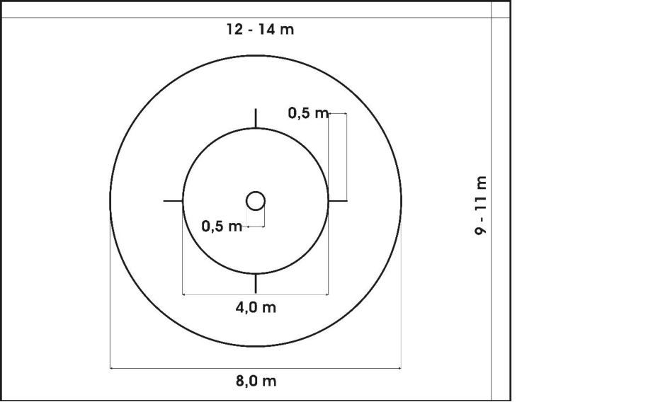

- **Inner circle:** Circle around the middle point of the competition surface with a diametre of 50 centimetres. 

- **Quarter stripes:** The quarter stripes (4) start at the outside of the middle circle and are positioned on the middle lines A and B. They each have a length of 50 centimetres. 

- **Middle circle:** Circle in the middle of the competition surface with a diametre of 4.0 metres. 

- **Outer circle:** Circle in the middle of the competition surface with a diametre of 8.0 metres. 

- All measures are taken at the outside of the markings. All mentioned markings have to be applied at the competition surface exactly according to the drawing above. 

- Any markings have to have the width of 3.0 to 5.0 cm. They may be applied by tape, paint or can be inserted in the floor. 

- At international championships and competitions, the competition surface must have the maximum dimensions. 

- The markings must be visible for all commissaires. 

- The matchfield-railings and the goals used for Cycle-ball must be placed at least 0.5 metres outside the competition surface markings during artistic cycling competitions. 

- The minimum distance of the competition surface from walls, columns or nonremovable objects must be at international championships 2.0 metres, at other competitions 0.5 metres. 

- The composition of the competition surface has to allow a correct performance. 

_(text modified on 01.01.16)_ 

INDOOR CYCLING 

E0126 

10 

- **8.1.012** Placement of the commissaires The commissaires must be placed at the competition surface, where they have a good view to the competition surface and their independence is guaranteed. 

_(text modified on 01.01.16)_ 

- **8.1.013** Coaching area 

   - A coaching area (for a coach and an assistant) has to be defined before the start of the competition by the Chief-Commissaire in cooperation with the organiser (at least 2 metres width and with at least a distance of 0.5 metres to the border of the competition surface). In case of electronic judging the display of the official time must be seen from the coaching area. 

_(text modified on 01.01.16; 01.01.20)_ 

- **8.1.014** Time measurement In case of electronic judging the display shows the official time. In case of manual judging the time and the acoustic signal has to occur with another visual display or a timekeeper has to announce the first minute. 

_(article introduced on 01.01.16)_ 

- **8.1.015** Support lines 

   - It is not allowed to apply the support lines at the competition surface. They only are used here to understand the following explanations. 

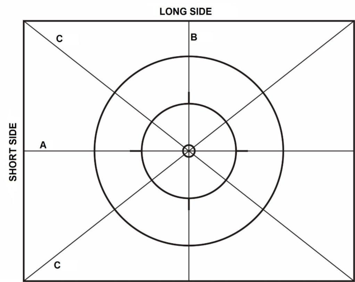

- **Middle longitudinal axis (support line A):** Line parallel to the long side of the competition surface through the middle of the competition surface. 

- **Middle transversal axis (support line B):** Line parallel to the short side of the competition surface through the middle of the competition surface. 

INDOOR CYCLING 

E0126 

11 

- **Diagonal axis (support line C):** Lines from one corner to the opposite corner through the middle of the competition surface. 

_(text modified on 01.01.16)_ 

## **§ 7 Equipment** 

- **8.1.016** Bicycle 

   - All aids which are not shown in the drawing below are forbidden. The construction of the bicycles must correspond to the following rules and measures. All deviations which do not correspond with the stated measures have to be approved in advance by the UCI. 

   - The bicycle has to be constructed in a way that it is not possible to damage the competition surface. 

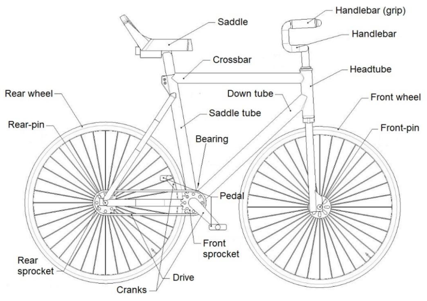

- **Cranks:** Length from centre bottom bracket bearing to centre pedal pivot shaft 130 – 170 mm. 

- **Handlebar:** The end of the handlebar must be rounded off or closed by grips. The use of handlebar-tape instead of grips is allowed. 

- **Saddle:** The saddle must be a manufactured part. Maximum length 300 mm, maximum width 220 mm, maximum bent (without weight) 60 mm. 

- **Wheels:** Front and rear wheel must have the same diametre. From the height of frame of 46 cm the wheels must have a diametre of at least 24 inches, from 50 cm height of frame the wheels diametre must be at least 25 inches. 

- **Transmission:** The front sprocket may not have fewer teeth than the rear sprocket. 

- **Sprocket:** Alternative mechanical drives are permitted, taking into account the transmission ratios. 

- **Rear-pin and front-pin:** It is allowed to equipe the axis of both wheels, on both sides, with pins, each with a maximum length of 50 mm. 

_(text modified on 01.01.16)_ 

INDOOR CYCLING 

E0126 

12 

- **8.1.017** Sports wear 

   - At Artistic Cycling competitions, the riders must wear appropriate clothes. 

- **8.1.018** Musical accompaniment 

   - Any riding performance may be shown accompanied by music. If riders want to perform to a particular piece of music, the riders themselves have to provide the music. 

## **§ 8 Evaluation sheet** 

- **8.1.019** Completion of the evaluation sheet and compilation of riding performance The top part of the evaluation sheet has to be fully completed. The figure number, the name of figure and the point values have to be filled in on the evaluation sheet exactly as in the list of figures. The point values have to be added and the total of points have to be filled in into the field difficulty points. Only figures from the corresponding list of figures in chapter V may be used in all events to create the riding performance, taking into account the respective maximum number of figures. 

   - Only one figure of each group of figures (a, b, c etc.) can be listed on the evaluation sheet. 

It is free for the riders to sequence the figures on the evaluation sheet according to their wishes, but during the competition the written order has to be followed exactly. 

_(text modified on 01.01.16)_ 

- **8.1.020** Exceptions 

   - After a raiser passage a raiser figure according to the corresponding end position of the passage has always to be showed. 

Pairs are allowed to show a maximum of 3 turns on the spot. 

- The same maximum of 3 figures is valid for figures with the affix “separate” (Exception: Passages on two bicycles). 

_(text modified on 01.01.16)_ 

INDOOR CYCLING 

E0126 

13 

- **8.1.021** Evaluation sheet sample 

   - In all competitions or championships, it is only allowed to use the evaluation sheet shown on this page. 

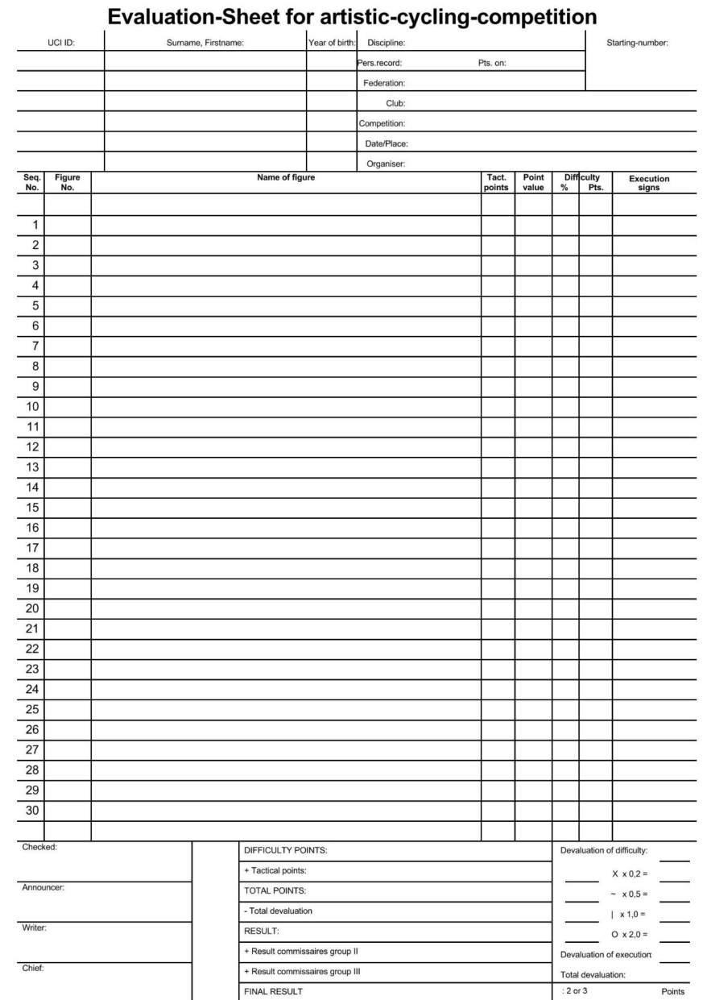

_(text modified on 01.01.16; 01.01.18)_ 

INDOOR CYCLING 

E0126 

14 

- **8.1.022** Check of evaluation sheet Is an electronic judging system used in a competition the rider/coach is required to check, correct and sign the evaluation sheet he received. 

   - From 1 hour before start of the corresponding event it is not allowed to change the evaluation sheet anymore. 

   - Possible disadvantages due to mistakes on the evaluation sheet are in the responsibility of the rider. 

_(text modified on 01.01.16)_ 

- **8.1.023** Evaluation of the results The total points are the result of the difficulty points and the respective tactical points. 

The total devaluation is being calculated from the devaluation of difficulty and the devaluation of execution. The total devaluation subtracted from the total points is the result. 

Any devaluation of difficulty for tactical figures has to be calculated from the point value of the figure including the attempted tactical points. 

The final result is being calculated by the total of the single results from the commissaires groups, divided by the number of commissaires groups and has <del>is</del> to be rounded to two digits after the point. 

If two or more riders end up with the same final result, the lower devaluation of execution will decide about the ranking. In the case it is the same, the riders will receive the same place in the ranking. 

The final result of each competition has to be published as soon as possible by the Chief Commissaire or organiser. 

No results below zero will be published. Only the rankings, based on the subtractions, will be published. 

_(text modified on 01.01.16; 01.01.18)_ 

- **8.1.024** Release of evaluation sheets 

After finishing an event, the evaluation sheets or electronic judging documents have to be submitted to the corresponding person. The evaluation sheets have to be treated confidentially and may only be submitted to the concerning head of delegation, rider or coach. 

At _World Championships_, the evaluation sheets have to be submitted to the head of delegation. 

_(text modified on 01.01.16)_ 

## **§ 9 Commissaires panel** 

## **8.1.025** Appointment of commissaires 

All commissaires appointed at artistic cycling competitions or championships must hold an adequate license, corresponding to the respective category. 

The commissaires for international championships will be appointed by the authorized international federations or corresponding their guidelines. For all other competitions, the national federations or their subordinate bodies will be responsible for the appointment of the commissaires. 

INDOOR CYCLING 

E0126 

15 

- **8.1.026** Responsibility of commissaires 

   - Any evaluation has to be conducted under the personal responsibility of the commissaire without influence from anybody else and has to be based only on the valid regulations. 

All commissaires are obliged to be totally neutral towards riders. 

The published result is a total decision of the commissaires’ panel. Individual members of the commissaires’ panel do not communicate differing opinions towards outside parties. 

## **Composition of commissaires panel** 

**8.1.027** International Championships: 

- 1 commissaire as Chief Commissaire; 

- 3 announcing commissaires; 

- 3 writing commissaires; 

Each commissaires group consists of 1 announcing commissaire and 1 writing commissaire. 

_(text modified on 01.01.20)_ 

## **8.1.028** Other competitions: **bis** - 

   - 1 commissaire as Chief Commissaire; 

   - 2-3 announcing commissaires; 

   - 2-3 writing commissaires; 

- Each commissaires group consists of 1 announcing commissaire and 1 writing commissaire. 

_(text modified on 01.01.20)_ 

## **Tasks of commissaires** 

- **8.1.029** Commissaires panel 

   - Commissaires are responsible for the evaluation and are required to sign the evaluation sheet (not necessary when an electronic judging system is used). 

   - Commissaires have to check and approve the measures and the condition of the competition surface. 

   - Commissaires are required to check and to sign the evaluation sheets when the manual judging system (paper) is used. Faults in the evaluation sheet must be corrected in advance of the competition, if possible, together with the rider or his coach. 

_(text modified on 01.01.16; 01.01.17)_ 

## **8.1.030** The Chief Commissaire 

- decides on the composition of the commissaires groups. 

- is allowed to assemble meetings of the commissaires panel to guarantee the performance of the panel. 

- Hands over the evaluation sheets to the commissaires. 

- gives a signal (acoustically or visually) to enable the start. 

- starts the timekeeping and times the length of the performance mechanically or electronically and will give an acoustic signal at the end of the official maximum time. It is possible to transfer this task to a separate time-keeper, who has to be situated next to the Chief Commissaire. 

- a second (spare) time system has to be used in case of malfunctions. 

INDOOR CYCLING 

E0126 

16 

- in case a rider forgets the “START” call at the beginning of the performance, the Chief Commissaire will determine the moment of starting the time. 

- is observing the performance closely in order to be able to decide in case of interruptions or extra ordinary occurrences. 

- after the end of each performance the Chief Commissaire verifies the evaluation sheets. 

- is responsible that obvious judging mistakes will be corrected (if possible before the start of the next rider) by majority decision of the entire commissaires panel. 

- the Chief Commissaire has to sign the evaluation sheet in case of manual judging. The Chief Commissaire is responsible for publishing the official final result and to release the evaluation sheet. 

- in case of a defect bicycle and/or an injured or ill rider the Chief Commissaire has to stop the official time. In such a case the Chief Commissaire has to determine the time left. It is up to the Chief Commissaire to decide whether or not a riding performance can be continued. When the riding performance is continued, the rider who fell, has to stand on the floor, next to his bicycle. The bicycle is in the same place and in the same direction as at the moment of the time stop. In pair artistic cycling and ACT4, the other riders take the positions they had immediately before the interruption. 

_(text modified on 01.01.16; 01.01.17; 01.01.20, 01.01.2023)_ 

- **8.1.031** Announcing commissaire 

   - The announcing commissaire follows the progress of the riding performance to evaluate the difficulty and execution of the figures. After each figure he announces the respective devaluations. 

_(text modified on 01.01.16)_ 

- **8.1.032** Writing commissaire 

   - reads the name of the figure according to the sequence on the evaluation sheet to the announcing commissaire. 

   - writes the announced devaluation on the corresponding line of the figure on the evaluation sheet. 

_(text modified on 01.01.16; 01.01.17)_ 

INDOOR CYCLING 

E0126 

17 

## **Chapter II SPECIFIC RULES** 

## **§ 1 Length of riding perfomance** 

- **8.2.001** Length of the riding performance 

   - For all events and age-groups the maximum time is 5 minutes. 

_(text modified on 01.01.16)_ 

## **§ 2 Number of figures** 

- **8.2.002** Age-groups Elite and Junior 

   - Single artistic cycling: max. 30 figures 

   - Pair artistic cycling: max. 25 figures (with a minimum of 8, but a maximum of 15 figures on one bicycle). It is required to perform figures on one and on two bicycles. 

   - Artistic Cycling Team 4: max. 25 figures 

- **8.2.003** Age-group youth 

   - Single artistic cycling: max. 25 figures 

   - Pair artistic cycling: max. 20 figures (with a minimum of 4, but a maximum of 12 figures on one bicycle). It is required to perform figures on one and on two bicycles. 

   - Artistic Cycling Team 4: max. 25 figures 

_(text modified on 01.01.23, 01.01.26)_ 

## **§ 3 Riding performance** 

- **8.2.004** Start of the riding performance 

   - As soon as one of the riders enters the competition surface the evaluation will start. Before the start of the riding performance the riders present themselves on the competition surface, standing on the surface. Then the riding performance must be started with the clear call “START”; the riders being on the bicycle without touching the competition surface. With the call “START” the timekeeping starts. 

_(text modified on 01.01.16)_ 

- **8.2.005** End of the riding performance and descent from bicycle 

   - At the end of the performance all riders have to descend from their bicycle correctly ( **ACT4:** descend correctly and simultaneously) and present themselves, while standing on the competition surface towards the audience. The evaluation ends at this moment (even after the maximum time). 

_(text modified on 01.01.16; 01.01.17, 01.01.23)_ 

- **8.2.006** Leaving bicycles 

   - During the riding performance the riders are not allowed to leave the bicycle. **Exception pair artistic cycling:** The one-time change from two bicycles to one, or from one bicycle to two. 

INDOOR CYCLING 

E0126 

18 

|**8.2.007**|Interruption of the riding performance|
|---|---|
||The rider/coach will announce a defect of his bicycle, an injury or illness by|
||raising the arm or/and by a clear call “STOP”.|
|**8.2.008**|Commands of execution|
||Commands of execution can be given only by the respective riders on the|
||competition surface.|
||_(text modified on 01.01.16)_|

- **8.2.009** Announcing figures During all events announcing and/or showing the figures by outsiders is not allowed. _(text modified on 01.01.16)_ 

- **8.2.010** Tactical figures (T) 

   - For figures which are described as tactical (T) in the tables of figures it is allowed to extend these figures during the performance of this figure as described. 

_(text modified on 01.01.16)_ 

- **8.2.011** Final figures Final figures can only be performed as the last figure before the change of bicycles in pair artistic cycling or as the last figure of the riding performance. Final figures are part of the riding performance. 

   - The riders have to end the final figure standing on the competition surface, holding the bike with one hand, while stretching the other arm sidewards and horizontally (exception: handstand bicycle lying down). 

_(text modified on 01.01.16)_ 

- **8.2.012** Deviations If deviations in these regulations occur between the drawing and the applicable text, the text will prevail in such a case. 

## **Complement for pair artistic cycling** 

- **8.2.013** Changing bicycles pair artistic cycling The descent from the bicycle has to be performed correctly. During the hand over / hand in of the bicycle from/to the rider, the coach has to stay within the coaching area. The bicycle has to be stored within the coaching area. 

The ascent on the bicycle(s) has to be performed without assistance. 

_(text modified on 01.01.16; 01.01.17)_ 

## **§ 4 Sequence of the figure** 

## **8.2.014** Execution of the figure 

All figures have to be executed within the competition surface and in accordance with chapter II specific rules, the name of the figure and chapter III explanations of the figures. 

_(text modified on 01.01.16)_ 

INDOOR CYCLING 

E0126 

19 

## **8.2.015** Body posture 

- During the execution of the figures a correct body posture is required in the sense of sportmenlike artistic cycling which may not be changed during the whole execution of a figure. Exceptions are the figures where a changing of the body posture is necessary. 

_(text modified on 01.01.16)_ 

## **8.2.016** Free-hand (frh.) 

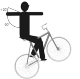

If free-hand (frh.) is written in the name of a figure all riders have to ride the entire way of stretch free-hand. 

A way of stretch is considered to be a freehand distance if all riders have no contact with their hands to the handlebar, the bicycle or another rider, unless a grip connection is prescribed in the explanations of figures. 

Arms which are not connected by a grip connection have to be stretched, horizontally, sidewards by an angle of 90° to 110° towards the body (see drawing). ( **ACT4**: with exception of door-figures, surrounding and compass). 

_(text modified on 01.01.16, 01.01.23)_ 

**8.2.017** Position of the arms Figures which do not have the term “frh.” in the name of the figure, riders have to be connected with one hand to a rider with a grip connection. The other hand is connected to the handlebar (or frh.). The position of the arms has to be identical. 

When riders are not connected to a partner and are connected to the handlebar with a hand, the other hand/arm has to be stretched sidewards. Possible deviations are described in the explanations of figures. 

_(text modified on 01.01.16)_ 

## **8.2.018** Stretching of arms and legs 

- If in the specific rules or in the explanations of figures is mentioned: - “arm” or “arms”, it refers to the elbow, wrist and finger. 

   - “leg” or “legs”, it refers to the knee and ankle. 

_(text modified on 01.01.16)_ 

## **8.2.019** Both wheels on floor 

Except figures with the text “raiser” all figures have to be performed with both wheels on the floor during the total way of stretch of the figure. 

Exceptions are described in the explanations of figures. 

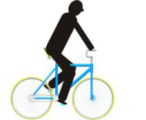

_(text modified on 01.01.16)_ 

INDOOR CYCLING 

E0126 

20 

## **8.2.020** Raiser 

If “raiser” is written in the name of a figure, the total way of stretch of the figure has to be performed in the described raiser-position. Only the rear wheel is in contact with the floor. 

## _(text modified on 01.01.16)_ 

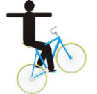

## **8.2.021** Forward 

All figures have to be performed in forward direction, if they are not marked in the name of the figure as backward. Exceptions are described in the explanations of figures. 

At all figures with both wheels on the floor, turns, squats and jumps forward is determined by the bicycle. At all raiser figures the direction of the riders’ face is decisive for the forward direction. 

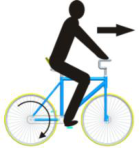

## _(text modified on 01.01.16)_ 

## **8.2.022** Backward (bw.) 

When figures are marked in the name of the figure with “backward” they have to be performed during the total way of stretch of the figure in the backward direction. Exceptions are described in the explanations of figures. 

At all figures with both wheels on the floor, turns, squats and jumps the backward motion is determined by the movement of the rolling bicycle. At all raiser figures the direction against the riders’ face is decisive for the backward direction. 

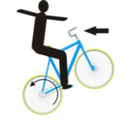

## _(text modified on 01.01.16)_ 

## **Complement for single and pair artistic cycling** 

- **8.2.023** Figures with straight line 

   1. Bendstands and backstand: Straight line from head over trunk and free leg. The foot of the free leg has to be at least on the same level as the foot of the supporting leg. 

   2. Knee on saddle: Straight line from head over trunk and free leg. 

   3. Waterscale: Straight line of trunk and legs. 

_(text modified on 01.01.16; 01.01.20)_ 

- **8.2.024** Saddle handlebarstands, handlebarstands and saddlestands These figures have to be performed in an upright, free-hand position, with sidewards stretched arms and hands. 

_(text modified on 01.01.16)_ 

## **8.2.025** L-shape hoDed, scales and straddles 

1. L-shape hold has to be performed with closed and horizontally stretched legs. 

2. Scales have to be performed with closed and horizontally stretched legs. The legs and the upper part of the body have to build a straight line. 

3. At straddles the stretched legs have to be in a horizontally position to the floor or at right angle to the bicycle. The opening angle of the straddle has to be at least 70°. Exceptions: No 70 degrees required with free support balance legs spread. 

INDOOR CYCLING 

E0126 

21 

_(text modified on 01.01.16; 01.01.20; 01.01.25)_ 

- **8.2.026** Squats and turning jumps 

   - All these figures have to be performed without bracing, pushing off and leaning onto the handlebars, frame or saddle with legs or feet. 

_(text modified on 01.01.16)_ 

- **8.2.027** Stillstands and handstand bicycle lying down These figures have to be performed at least 3 seconds. 

_(text modified on 01.01.16)_ 

- **8.2.028** Passages (P.) 

   - All passages can be performed in any way, without touching the floor and without any other assistance. The figure has to be shown from the starting position to the endposition without taking another figure position. If the described endposition is a raiser-position, the following figure must be shown in the same kind of raiser. 

The start and the end of the passage has to be shown according the description of the start- and endposition in the explanations of figures. **Pair artistic cycling:** passages on two bicycles must be performed in grip connection (except the passages backhang raiser headtube reverse / standraiser). 

_(text modified on 01.01.16)_ 

- **8.2.029** Counterwise If the term “counterwise” appears in the text this means the same position is possible with the opposite foot or leg, with opposite pedal and/or opposite rearor frontpin. 

## **Complement for pair artistic cycling** 

- **8.2.030** Stands and shoulderseats on one bicycle All the pin-, saddle handlebar-, handlebar-, saddle-, shoulderstands and shoulderseats must be performed with horizontally, sidewards, stretched arms (except ring-grip), without support from the partner and in an upright body posture. 

For the figure Saddle handlebarstand/Saddle handlebarstand, it is not required to have sidewards stretched arms for one rider. During this figure, it is allowed to touch or hold the partner. 

For the figure Raiser regular seat/Stand on pins, it is not required to have sidewards stretched arms for the position Stand on pins. It is allowed to touch or hold the partner which is in the raiser-position. 

_(text modified on 01.01.16)_ 

- **8.2.031** Headstands, shoulderstands and handstands on one bicycle Figures with these positions have to be performed without support. It is not allowed to touch or hold the partner during the execution of these figures. 

_(text modified on 01.01.16)_ 

INDOOR CYCLING 

E0126 

22 

- **8.2.032** Simultaneous execution of figures 

   - All the figures on two bicycles have to be performed simultaneously. 

_(text modified on 01.01.16)_ 

- **8.2.033** Figures performed “separate” 

   - During circles or half circles, which have to be executed separately (in pair), the distance between the two riders has to be identical. 

## **Complement for pair artistic cycling and ACT4** 

- **8.2.034** Grip connections 

   - The following kinds of grip connections are allowed: 

      - hand-in-hand grip, 

      - double-arm grip, 

      - double-shoulder grip 

      - shoulder grip (only ACT4) 

Other grip connections are not allowed. Exceptions are described in the explanations of figures. 

**Pair artistic cycling:** When in the explanations of figures or in the name of figures the term “separate” is not prescribed for a figure on two bicycles, or in these regulations just a touch of hands is being asked for, the figure must be shown totally or partially in grip connection. 

_(text modified on 01.01.16, 01.01.23)_ 

## **8.2.035** Forehead-line 

- The required number of riders (2 con., 3 con., 4 con.) ride and/or stand, side by side, in the same direction. They are connected to each other by a grip connection. The distance between the riders has to be identical. 

_(text modified on 01.01.16; 01.01.26)_ 

## **Complement for ACT4** 

- **8.2.036** Counter direction (count. dir.) 

   - If the term “counter direction” is prescribed in the name of the figure, a rider or a group of riders have to ride in clockwise direction and the other rider or group of riders have to ride in anti-clockwise direction. The way of execution is described in the respective explanation of the figure. The riding-direction (forward or backward) has to be identical. 

_(text modified on 01.01.20, 01.01.23)_ 

- **8.2.037** Figures next to each other and following each other 

   1. Next to each other (n.e.o.) 

      - a) For figures, which are performed next to each other, the distance between the riders has to be identical. 

      - b) For figures, where riders ride next to each other, the way of stretch is to be measured according to the position of the outside riding rider (exception for line-figures and pull-figures). 

   2. Following each other (f.e.o.) 

      - a) For figures, which are performed following each other, the distance between the riders has to be identical. 

INDOOR CYCLING 

E0126 

23 

   - b) For line-figures, pull-figures, S and 8, the distance between the riders may not be more than 2 metres. Exceptions are described in the explanations of figures. 

- **8.2.038** Rules for figures performed “inside individual”, “turn on” and “outside individual” Explanation: 

Inside individual, turn on and outside individual are extensions of a figure as it is described in the explanations of figures. The riders ride with a uniform way of riding to the position of the figure, grap simultaneously the position of the figure (inside individual or turn on) and leave the position of the figure uniformly (outside individual). A figure can be performed either only inside individual or turn on or inside and outside individual or turn on and outside individual. For this, the following rules apply: 

1. Inside individual: 

   - a) All riders ride at least 2 metres in the respective way of riding according to the name of figure, separate and without grip connection into the position which is described in the explanation of figures. 

   - b) After the inside individual, the grip connections have to be closed simultaneously and in motion. Exception: For “Stars” the grip connection doesn’t have to be closed in motion. 

   - c) For figures, which have to be performed within the middle circle or around the inner circle, the inside individual has to be started outside of the middle circle. 

   - d) For “Stars” which are performed 2 con., 4 con. as inside individual, the inside individual has to be performed in grip connection. 

2. Turn on: 

   - a) The turn on has to be executed after the inside individual (see 1. a) within a diametre of maximum 50cm. The turn on motion can be less than 360°. 

   - b) After the turn on the riders have to ride free-handed and separate into the position which is described in the explanation of figures. The grip connections have to be closed, simultaneously and in motion. 

   - c) The tactical enlargement has to be awarded after closing all grip connections within 2 metres after the turn on. 

   - d) For figures, which have to be perfomed within the 4-metre-circle, the inside individual has to be started outside the middle circle. 

3. Outside individual: 

   - a) After the corresponding figure, the riders have to release the grip connections simultaneously and in motion. 

   - b) All riders have to perform the outside individual at least 2 metres in the respective way of riding according to the name of the figure. 

   - c) For figures, which have to be perfomed within the middle circle the outside individual has to end outside of the middle circle. 

## Rules for the way of riding: 

1. inside individual or inside and outside individual 

   - a) inside individual (inside indiv.) 

The inside individual and the figure can be executed in any way: free-hand, with one or both hands on the handlebar. The way of riding of all riders has to be uniform. 

- b) inside and outside individual (in- a. outside indiv.) 

INDOOR CYCLING 

E0126 

24 

Execution of inside individual (see a). The outside individual can be executed in any way. The way of riding of all riders has to be uniform. 

2. free-hand inside individual / free-hand inside and outside individual: a) free-hand inside individual (frh. inside indiv.) 

      - The figure which is described in the explanation of figures has to be executed free-hand. The inside individual can be executed in any way. The way of riding of all riders has to be uniform. 

   - b) free-hand inside and outside individual (frh. in- a. outside indiv.) Execution of frh. inside individual (see a). The outside individual can be executed in any way. The way of riding of all riders has to be uniform. 

3. inside individual free-hand / inside and outside individual free-hand a) inside individual free-hand (inside indiv. frh.) 

      - The inside individual into the figure which is described in the explanation of figures and the figure has to be executed free-hand. 

   - b) inside and outside individual free-hand (in- a. outside indiv. frh.) Execution of inside individual frh. (see a). The outside individual has to be executed free-hand, too. 

4. turn on free-hand / turn on and outside individual free-hand a) turn on free-hand (turn on frh.) 

      - The turn on into the figure which is described in the explanation of figures and the figure has to be executed free-hand. 

   - b) turn on and outside individual free-hand (turn on a. outside indiv. frh.) 

      - The turn on frh. (see a). The outside individual has to be executed free-hand, too. 

_(text modified on 01.01.16; 01.01.17; 01.01.22; 01.01.26)_ 

- **8.2.039** Lowering and rising of the frontwheel If riders before the first figure, or between figures obviously lower or rise the frontwheel, it has to occur simultaneously. 

_(text modified on 01.01.16)_ 

- **8.2.040** Grab and release of the bicycle If riders before the first figure, or between figures obviously release or grab the bicycle, it has to occur simultaneously. 

_(text modified on 01.01.16)_ 

## **§ 5 Way of stretch** 

- **8.2.041** Explanation way of stretch 

   - Way of stretch is the designation for the progress of figures on the competition surface. All figures have to be performed within the competition surface. The distance ridden at the outside of the competition surface has to be repeated inside. 

- **8.2.042** Circle (C.) 

Only the distance ridden outside the middle circle is valid for the evaluation. During the execution of a circle the distance to the centre of the competition surface have to stay the same for the total way of stretch. A circle ends after at least one complete drive around the middle circle. 

INDOOR CYCLING 

E0126 

25 

_(text modified on 01.01.16)_ 

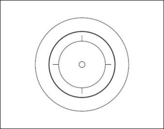

## **8.2.043** Half circle (HC.) 

Only the distance ridden outside the middle circle is valid for the evaluation. During the execution of a half circle the distance to the centre of the competition surface have to stay the same for the total way of stretch. A half circle ends after at least a half drive around the middle circle. 

## _(text modified on 01.01.16)_ 

## **8.2.044** Eight (8) 

An eight is formed by two circles. Both circles must have the same diametre with a minimum of 4 metres. One circle has to be performed clockwise, the other circle has to be performed anti-clockwise. The change of direction has to be performed within the inner circle. The inner circle has to be crossed twice during the execution of an 8. 

The circles have to be executed each in one half of the competition surface. The competition surface is split in two by an imaginary straight line, which runs through the inner circle. 

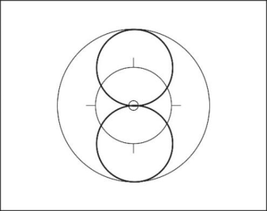

## **8.2.045** Half eight (S) 

A half eight is formed by two half circles. Both half circles must have the same diametre with a minimum of 4 metres. One circle has to be performed clockwise, the other half circle has to be performed anti-clockwise. The change of direction has to be performed within the inner circle. The inner circle has to be crossed once during the execution of a S. The sequence of the figure starts at the longitudinal or transversal axis of the competition surface. The half circles have to be executed at two, across from each other, placed quarters of the competition surface (one half circle in each quarter). 

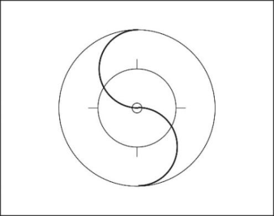

The competition surface is split in 4 quarters by the longitudinal and transversal axis. 

_(text modified on 01.01.16)_ 

## **8.2.046** 50cm-spinnings (spin.) 

Spinnings have to be performed on a spot with a maximum diametre of 50cm. The spinnings start being judged when the diametre has been achieved by all 

INDOOR CYCLING 

E0126 

26 

riders. At least 3 complete, successive, spinnings, within the mentioned diametre of 50cm, have to be performed simultaneously by all riders. 

When spinnings are performed as part of a figure with described grip connection at the beginning and/or at the end of the figure the release and grapple of the grip connection must be performed simultaneously and in motion. For pair artistic cycling it is allowed to change the riding-direction. 

**ACT4:** All figures with the term “spinnings“ in the name of the figure have to be executed at least 2 metres before and after the 50cm-spinnings in the described position of the figure. 

The tactical enlargement has to be awarded after closing all grip connections within 2 metres after the 50cm-spinnings. 

Exception “Remmlinger spinnings”: This figure has to be executed according to the explanations of the figure. 

_(text modified on 01.01.16; 01.01.17; 01.01.22, 01.01.23)_ 

- **8.2.047** Turn on the spot During the figure, the grip connections have to be released from the corresponding position of the figure simultaneously. Then, all riders have to turn on the spot immediately for ½ turn, 1 turn or multiple times, simultaneously and without pedalling. The riders rotate around their own body longitudinal axis. After the turn on the spot the grip connections have to be closed simultaneously, and the riders have to stand without moving. The distances between the riders have to be identical. 

_(text modified on 01.01.16)_ 

- **8.2.048** Single rings (s.r.) A single ring is a small circle, completely performed around a spot on the competition surface. 

   - The release of the starting position in single rings, and the grapple into the end position have to be performed in motion. The single ring ends, when the point is rounded completely with released grip connection and when the riders have reached the starting position. 

For the following figures the riders have to touch one of their hands, before and after the single rings, indicating the start and the end of the figure: Saddlehandlebarstand, Handlebarstand and Saddlestand. 

- During the performance of single rings in mills the riders have to leave the middle circle. 

- Single rings may only be as large as the other rider cannot be rounded. 

_(text modified on 01.01.16)_ 

- **8.2.049** Figures which may be shown anywhere on the competition surface: Handlebar spinnings, handlebarstand turns, stillstands, turns, squats, jumps, 50cm-spinnings, turns on the spot, single rings out of forehead-line, passages and final figures. 

   - Exceptions for ACT4 are described in chapter II specific rules and in the explanations of figures. 

_(text modified on 01.01.16, 01.01.23)_ 

INDOOR CYCLING 

E0126 

27 

## **Complement for pair artistic cycling** 

- **8.2.050** Counter eight (Count. 8) 

Each rider executes an eight. The sequence of the figure starts on the inner circle, where both riders ride from opposite directions, with a touch of hands of the riders (except handstand). The figure ends after completing the total way of stretch with a touch of hands (except handstand) of the riders, again on the inner circle. 

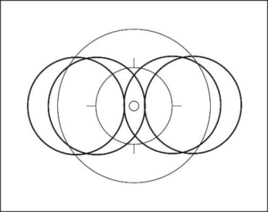

- **8.2.051** Counter circle (Count. C) 

Each rider executes each on a separate half of the competition surface a complete circle with a minimum diametre of 4 metres around a point. The points are located with the same distance to the inner circle on the longitudinal axis. The competition surface is imaginary split, by the transversal axis. 

The sequence of the figure starts and ends on the inner circle with a touch of hands of the riders. The way of stretch which is executed during the handlebar-turn belongs to the content of the total way of stretch of the counter circle. 

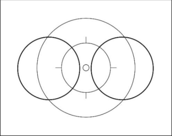

_(text modified on 01.01.16)_ 

- **8.2.052** Mill 

   1. Connected by hand-in-hand grip with their left or right hands, the riders show the figure in the middle of the competition surface. A way of stretch with at least one complete drive around the inner circle has to be performed. 

   2. At performing a mill with single-rings (s.r.) or mill-spinnings (mill. spin.) the riders have to show a grip connection at the middle of the competition surface at the start of the figure. Then the riders release their hands; execute the single-rings or mill-spinnings; and grab back to the hand-in-hand grip connection in the middle of the competition surface in motion. For single rings, combined with a mill, the riders have to leave the middle circle during the single ring. 

_(text modified on 01.01.16)_ 

## **Complement for ACT4** 

- **8.2.053** Single ring left (s.r.l.) / single ring left through (s.r.l. through) 

      1. Single ring left: a single ring left is performed with a way of stretch of a complete drive around a spot. In forward direction the riding direction is anti-clockwise. In backward direction, the riding direction is clockwise. A single ring ends after all riders have performed a complete drive and reached the starting position again. 

      2. Single ring left through: execution similar to single ring left, except that the single rings of the riders have to overlap. 

   - Execution of single rings left during a figure: 

      - simultaneously, in same size and form 

INDOOR CYCLING 

E0126 

28 

- before and after the single rings left, at least 2 metres have to be performed in the starting position (exception: stars) The way of stretch has to be measured on the outside riding rider. 

- before the single rings left, the required grip connections have to be released simultaneously and in motion. 

- after the single rings left, the required grip connections have to be closed simultaneously and in motion. 

_(article introduced on 01.01.16; text modified on 01.01.17; 01.01.20)_ 

- **8.2.054** Single ring right (s.r.r.) / single ring right through (s.r.r. through) 

      1. Single ring right: a single ring right is performed with a way of stretch of a complete drive around a spot. In forward direction the riding direction is clockwise. In backward direction, the riding direction is anticlockwise. A single ring ends after all riders have performed a complete drive and reached the starting position again. 

      2. Single ring right through: execution similar to single ring right, except that the single rings of the riders have to overlap. 

   - Execution of single rings right during a figure: 

      - simultaneously, in same size and form 

      - before and after the single rings right, at least 2 metres have to be performed in the starting position exception: stars) The way of stretch has to be measured on the outside riding rider. 

      - before the single rings right, the required grip connections have to be released simultaneously and in motion. 

      - after the single rings right, the required grip connections have to be closed simultaneously and in motion. 

_(article introduced on 01.01.16; text modified on 01.01.20; 01.01.26)_ 

- **8.2.055** 2 connected single ring left (2 con. s.r.l.) 

   - A 2 connected single ring left is performed with a way of stretch of a complete drive around a common point. Two riders ride with grip connection and in same direction side by side. In forward direction the riding direction is anti-clockwise. In backward direction the riding direction is clockwise. The single ring ends after all riders have performed a complete drive and reached the starting position again. 

   - Execution of 2 connected single rings left during a figure: 

      - simultaneously, in same size and form 

      - before and after the 2 con. single rings left, at least 2 metres have to be performed in the starting position. The way of stretch has to be measured on the outside riding rider. 

      - before the 2 con. single rings left the required grip connections have to be released simultaneously and in motion. 

      - after the 2 con. single rings left the required grip connections have to be closed simultaneously and in motion. 

_(article introduced on 01.01.16)_ 

- **8.2.056** 2 connected single ring right (2 con. s.r.r.) 

   - A 2 connected single ring right is performed with a way of stretch of a complete drive around a common point. Two riders ride with grip connection and in same direction side by side. In forward direction the riding direction is clockwise. In backward direction the riding direction is anti-clockwise. The single ring ends 

INDOOR CYCLING 

E0126 

29 

after all riders have performed a complete drive and reached the starting position again. 

- Execution of 2 connected single rings right during a figure: 

   - simultaneously, in same size and form 

   - before and after the 2 con. single rings right, at least 2 metres have to be performed in the starting position. The way of stretch has to be measured on the outside riding rider. 

   - before the 2 con. single rings right the required grip connections have to be released simultaneously and in motion. 

   - after the 2 con. single rings right the required grip connections have to be closed simultaneously and in motion. 

_(article introduced on 01.01.16)_ 

- **8.2.057** Half alternate ring (half a.r.) 

A half alternate ring consists of two half drives, around a spot each. Both half drives have to be performed in same size and uniform. One of the two half drives have to be performed clockwise; the other half drive has to be performed anticlockwise. 

_(article introduced on 01.01.16; text modified on 01.01.20)_ 

- **8.2.058** Alternate ring (a.r.) / alternate ring overlapping (a.r. overlapping) 

   1. Alternate ring: An alternate ring consists of two drives, around a spot each. Both drives have to be performed in same size and uniform. One of the two drives has to be performed clockwise; the other drive has to be performed anti-clockwise. 

   2. Alternate ring overlapping: The way of stretch of the second drive overlaps with the first drive of the rider riding behind or riding ahead. 

_(article introduced on 01.01.16; text modified on 01.01.17, 01.01.20; 01.01.22)_ 

- **8.2.059** Half shortline opposite direction alternate ring (half shortline opp. dir. a.r.) Two or three riders ride, next to each other, without grip connection on an axis which runs parallel to the long side of the competition surface. They form a pair of riders or a group of riders. The pair of riders or group of riders have to perform a half shortline opposite direction alternate ring (see article **8.2.057** ) with the same speed during the figure and they ride from one other long side of the border of the competition surface to the respectively opposite side. 

- **8.2.060** Shortline opposite direction alternate ring (shortline opp. dir. a.r.) Two or three riders ride, next to each other, without grip connection on an axis which runs parallel to the long side of the competition surface. They form a pair of riders or a group of riders. The pair of riders or group of riders have to perform a shortline opposite direction alternate ring (see article **8.2.058** No. 1) with the same speed during the figure and they ride from one other long side of the border of the competition surface to the respectively opposite side and back. 

INDOOR CYCLING 

E0126 

30 

- **8.2.061** Star inside 

All riders are standing, at the same distances between each other, without moving, around the inner circle. All are connected to each other by hand-in-hand grip connection. The bicycle head tubes have to point to the inner circle. 

_(article introduced on 01.01.16, 01.01.23)_ 

**8.2.062** Star outside All riders are standing, at the same distances between each other, without moving, around the inner circle. All are connected to each other by hand-in-hand grip connection. The bicycle rear wheels have to point to the inner circle. 

_(article introduced on 01.01.16, 01.01.23)_ 

**8.2.063** Alternate-star All riders stand, without moving and the same distance between each other, around the inner circle. They are connected by a hand-in-hand grip connection. The head tube is alternately directed to the inner circle by a rider and the rear wheel by the following rider. 

**8.2.064** Shortline At a shortline the riders, pairs of rider or groups of riders are aligned parallel to the long side of the competition surface. They ride from a long side of the border of the competition surface to the other side on an axis which runs parallel to the short side of the competition surface. 

At a shortline following each other all riders ride on a common axis. At a shortline next to each other the riders ride on an own axis each. 

All line figures start 1 metre of the riders’ distance to the border of the competition surface and they end 1 metre from the opposite border of the competition surface. The way of stretch has to be straight. At line figures the way of stretch has to be measured at the front wheel or rear wheel which is the nearest to the border of the competition surface. 

_(article introduced on 01.01.16)_ 

- **8.2.065** Shortline opposite direction 

At a shortline opposite direction the riders, pairs of rider or groups of riders are aligned parallel to the long side of the competition surface. They ride from one other long side of the border of the competition surface to the respectively opposite side, on an axis which runs parallel to the short side of the competition surface, at the same speed in the opposite direction, passing each other. At a shortline opposite direction following each other all riders ride on a common axis. At a shortline opposite direction next to each other the riders ride on an own axis each. 

All line figures start 1 metre from the riders' distance to the border of the competition surface, and they end 1 metre from the opposite border of the competition surface. The way of stretch has to be straight. For line figures the way of stretch has to be measured from the front wheel or rear wheel which is the nearest to the border of the competition surface. 

INDOOR CYCLING 

E0126 

31 

## **8.2.066** Longline 

At a longline the riders, pairs of rider or groups of riders are aligned parallel to the short side of the competition surface. They ride from a short side of the border of the competition surface to the other side, on an axis which runs parallel to the long side of the competition surface. 

At a longline following each other all riders ride on a common axis. At a longline next to each other the riders ride on an own axis each. 

All line figures start 1 metre from the riders’ distance to the border of the competition surface, and they end 1 metre from the opposite border of the competition surface. The way of stretch has to be straight. For line figures the way of stretch has to be measured from the front wheel or rear wheel which is the nearest to the border of the competition surface. 

## **8.2.067** Longline opposite direction 

At a longline opposite direction, the riders, pairs of rider or groups of riders are aligned parallel to the short side of the competition surface. They ride from one other short side of the border of the competition surface to the respectively opposite side, on an axis which runs parallel to the long side of the competition surface, at the same speed in the opposite direction, passing each other. At a longline opposite direction following each other all riders ride on a common axis. At a longline opposite direction next to each other the riders ride on an own axis each. 

All line figures start 1 metre from the riders’ distance to the border of the competition surface, and they end 1 metre from the opposite border of the competition surface. The way of stretch has to be straight. For line figures the way of stretch has to be measured from the front wheel or rear wheel which is the nearest to the border of the competition surface. 

## **8.2.068** Diagonal pull 

At a diagonal pull, the riders, pairs of rider or groups of riders, ride in a straight line from one corner of the border of the competition surface to the diagonal opposite corner. All line figures start 1 metre from the riders’ distance to the border of the competition surface, and they end 1 metre from the opposite border of the competition surface. The way of stretch has to be straight. For line figures the way of stretch has to be measured from the front wheel or rear wheel which is the nearest to the border of the competition surface. 

## **8.2.069** Diagonal pull opposite direction 

At a diagonal pull opposite direction the riders, pairs of rider or groups of riders, ride in a straight line from one corner of the border of the competition surface to the diagonal opposite corner, at the same speed in the opposite direction, passing each other. All line figures start 1 metre from the riders’ distance to the border of the competition surface, and they end 1 metre from the opposite border of the competition surface. The way of stretch has to be straight. For line figures the way of stretch has to be measured from the front wheel or rear wheel which is the nearest to the border of the competition surface. 

## **8.2.070** Mill 

For a mill all riders have to ride, with same distances and following each other, a complete drive around the inner circle. They are connected by a grip connection with their left hands. The figure has to be performed within the middle circle. 

## **8.2.071** 2 Mills 

Two riders have to ride, with same distances and following each other, a complete drive around one point each. They are connected by a grip connection 

INDOOR CYCLING 

E0126 

32 

with their left hands. All mills have to be performed uniformly distributed on the longitudinal or transversal axis. The mills start when all riders are connected. Each rider has to be on a common axis, which runs parallel to the long or short side of the competition surface, with one rider of the other mill/s. The mills have to be performed simultaneously. 

Exceptions applicable to the end of the figure are described in the explanations of figures. 

If the mills have to be performed during another figure, the starting position has to be shown at least 2 metres before and after the mills. 

_(text modified on 01.01.20; 01.01.24, 01.01.26)_ 

- **8.2.072** 2 con. wingmill 

Two riders have to ride with grip connection, next to each other on an axis. They form a pair of riders. The pairs of riders have to ride with same distances and following each other, a half / a complete drive around the inner circle. The inside riding riders are connected with their left hands by a hand-in-hand grip connection, which is located above the inner circle. 

Exceptions applicable to the end of the figure are described in the explanations of figures. 

_(text modified on 01.01.26)_ 

## **8.2.073** Insidering 

For insidering all riders have to ride, with same distances and following each other a complete drive around the inner circle. Each rider has to take his right hand forward and grip the left hand of the rider in front of him. The insidering starts when all riders are connected. The insidering has to be performed within the middle circle. 

Exceptions applicable to the end of the figure are described in the explanations of figures. 

## **8.2.074** 2 insiderings 

Two riders have to ride, with same distances and following each other, a complete drive around one point each. They form a pair of riders. Each rider has to take his right hand forward and grip the left hand of the rider in front of him. All rings have to be performed uniformly distributed on the longitudinal or transversal axis. The insiderings start when all riders are connected. Each rider has to be on a common axis, which runs parallel to the long or short side of the competition surface, with one rider of the other ring/s. The insiderings has to be performed simultaneously. 

Exceptions applicable to the end of the figure are described in the explanations of figures. 

_(text modified on 01.01.20; 01.01.26)_ 

- **8.2.075** 2 con. wingring 

Two riders have to ride, with grip connection, next to each other on an axis. They form a pair of riders. The pairs of riders ride with same distances and following each other, a complete drive around the inner circle. Each inside riding rider grip with the right hand to the left hand of the rider in front of him. The outside riding riders grip with the left hand on the shoulder of one of the inside riding rider. 

INDOOR CYCLING 

E0126 

33 

Exceptions applicable to the end of the figure are described in the explanations of figures. 

_(text modified on 01.01.26)_ 

## **8.2.076** Outsidering 

For outsidering all riders have to ride, with same distances and following each other, a complete drive around the inner circle. Each rider has to take his left hand forward and grip the right hand of the rider in front of him. The outsidering starts when all riders are connected. The outsidering has to be performed within midlle circle. 

Exceptions applicable to the end of the figure are described in the explanations of figures. 

## **8.2.077** 2 outsidering 

Two riders have to ride, with same distances and following each other, a complete drive around one point each. They form a pair of riders. Each rider takes his left hand forward and grips the right hand of the rider in front of him. All rings have to be performed uniformly distributed on the longitudinal or transversal axis. The outsiderings start when all riders are connected. Each rider has to be on a common axis, which runs parallel to the long or short side of the competition surface, with one rider of the other ring/s. The outsiderings have to be performed simultaneously. 

Exceptions applicable to the end of the figure are described in the explanations of figures. 

_(text modified on 01.01.20; 01.01.26)_ 

## **8.2.078** Ring with alternate grips 

For ring with alternate grips all riders have to ride, with same distances and following each other, a complete drive around the inner circle. Rider 1 and 3 have to take their left hand forward and grip the left hand of the rider in front of them. Rider 2 and 4 grip with the right hand the right hand of the rider in front of them. The ring with alternate grips starts when all riders are connected. The figure has to be performed within the middle circle. 

Exceptions applicable to the end of the figure are described in the explanations of figures. 

_(text modified on 01.01.26)_ 

## **8.2.079** Door 

Two riders have to stand on the longitudinal or transversal axis. They are connected by a hand-in-hand grip connection. The arms which are not connected have to be stretched sideward and horizontally. The grip connections are above the inner circle. Thus, the riders form a door. 

## **8.2.080** Double door 

Three riders have to stand on the longitudinal or transversal axis, the central rider has to stand on the inner circle. The three riders are connected by a hand-inhand grip connection. The arms which are not connected have to be stretched sideward and horizontally. Thus, the riders form a double door. The distance between the riders has to be identical. 

INDOOR CYCLING 

E0126 

34 

## **8.2.081** Turbine 

Three riders have to ride on a common axis, the center rider has to be located on the inner circle. The two outside riders are connected by a hand-in-hand grip with the center rider and ride around him. The center rider has to turn on his spot without pedalling, while the two outside riders rotate the center rider around his body longitudinal axis. Thus, the riders form a turbine. 

_(article modified on 01.01.20)_ 

- **8.2.082** [abrogated on 01.01.26] 

## **Chapter III EXPLANATIONS OF FIGURES** 

## **§ 1 Single artistic cycling** 

- **8.3.001** Figures with both wheels on the floor 

**Reg. seat 1001** Seat on the saddle, chest directed to the handlebar, feet on **1002** the pedals. **1002c:** with continuous handlebarspinning, a complete single ring has to be performed free-hand. **Reg. seat rev. 1003** Seat on the saddle, back directed to the handlebar, feet on **1004** the pedals. **1004e:** with continuous handlebarspinning, a complete single ring has to be performed free-hand. **Steering with feet 1011** Seat on the saddle, chest directed to the handlebar, feet on the handlebar. **Lady seat 1012** Seat on the saddle, chest directed to the handlebar, one foot **1013** on a pedal. The free leg stretched over the crossbar to the opposite side of the bicycle and below the handlebar, without touching the handlebar with the leg. **Handlebarseat 1016** Seat on the handlebar, back directed to the saddle. The free leg stretched forward, horizontally. Other foot on the down tube. **Handlebarseat rev. 1017** 

Seat on the handlebar, chest directed to the saddle, feet on the pedals. 

INDOOR CYCLING 

E0126 

35 

## **Split** 

**Split 1021** Left foot standing on the left rear-pin, right foot standing on **1022** the right front-pin (or counterwise). Chest directed to the handlebar, without touching the handlebar with the leg. 

## **Split rev.** 

**Split rev. 1023** Right foot standing on the left rear-pin, left foot standing on **1024** the right-frontpin (or counterwise). Chest directed to the saddle, without touching the handlebar with the leg. 

## **Frontstand** 

Stand in front of the handlebar, back directed to the saddle. One foot on the frontpin, other foot on the down tube. 

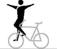

## **1031** 

## **Backstand** 

Stand with one foot on the frontpin, handlebar in front of the rider, chest directed to the saddle. The free leg has to be stretched in moving direction, without touching the handlebar with the legs. 

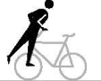

**1032** 

## **Side pedal stand** 

Stand with feet and closed legs on one pedal, chest directed to the handlebar. 

## **Sidestand foot cranking** 

Stand with one foot on the left rear-pin, other foot on the left pedal (or counterwise), chest directed to the handlebar. 

## **Sidestand** 

Stand with one foot on the left rear-pin, other foot on the left front-pin (or counterwise), chest directed to the handlebar, without touching the handlebar with the leg. 

## **Sidestand rev.** 

Stand with one foot on the left rear-pin, other foot on the left front-pin (or counterwise), chest directed to the saddle, without touching the handlebar with the leg. 

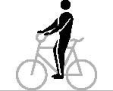

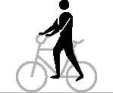

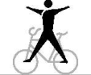

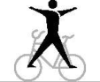

**1036 1037 1038 1039** 

## **Side kneeling foot cranking** 

Knee of one leg across the saddle, without extending the outer edge of the saddle. Foot of the other leg on a pedal. 

## **Frameseat** 

Pushing one foot through the frame and placing foot on the front-pin. Free leg stretched forward, seat in the frame. 

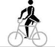

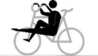

**1040 1041** 

INDOOR CYCLING 

E0126 

36 

## **Stand on pins** 

**Stand on pins 1046** Stand with feet each on a rear-pin. Both knees behind the saddle. **Stand bent on pin 1047** Stand with one foot on the rear-pin, trunk bent-forward to the **1048** handlebar, free leg stretched backwards. **Bent knee seat 1051** In squat position with one foot on the crossbar, free leg horizontally stretched forward, back directed to the saddle. **Knee on saddle 1053** Knee on the saddle, trunk bent-forward to the handlebar, free **1054** leg stretched backwards in straight line with trunk and head. **Stand bent on saddle 1061** Stand with one foot on the saddle, trunk bent-forward to the **1062** handlebar, free leg stretched backwards. 

## **Stand bent on frame** 

**Stand bent on frame 1063** Stand with one foot on the crossbar, trunk bent-forward to the **1064** handlebar, free leg stretched backwards. **Stand bent on frame rev. 1065** Stand with one foot on the crossbar, trunk bent-forward to the saddle, free leg stretched in moving direction. **Stand bent on handlebar rev. 1066** 

## **Stand bent on handlebar rev.** 

Stand with one foot on the handlebar, trunk bent-forward to the saddle, free leg stretched in moving direction, one hand on the saddle, other hand on the handlebar. 

## **Pedal side stand rev.** 

One leg through the frame, feet standing on the pedals, chest directed to the saddle. 

## **Framestand** 

Standing upright with one foot solely on the down tube, other foot solely on the saddle tube, chest directed to the handlebar. Without touching the feet each other and without touching the handlebar with the leg. 

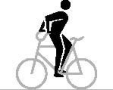

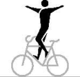

**1071 1076** 

INDOOR CYCLING 

E0126 

37 

## **Framestand rev.** 

Standing upright with one foot solely on the down tube, other foot solely on the saddle tube, chest directed to the saddle. Without touching the feet each other and without touching the handlebar with the leg. 

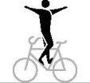

**1077** 

**Fronthang 1081** Both hands behind the back on the handlebar, frontwheel **1082** between the legs, feet on the pedals. 

**Backhang 1083** In front of the headtube hanging on the handlebar, chest **1084** directed to the saddle, frame between the legs, feet on the pedals. 

## **Lying on handlebar** 

Lying with front of the body on the handlebar, head directed to the saddle, closed legs stretched horizontally in moving direction. 

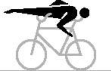

**1091** 

## **Lying on saddle, Lying on saddle and handlebar** 

**a-b:** Lying with front of on the saddle, closed legs stretched horizontally backwards. 

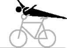

**1092** 

**c-d:** Lying with front of the body on the saddle, arms stretched sidewards free-hand on the handlebar-grips. Closed legs stretched horizontally backwards. 

## **Waterscale** 

Lying with back of the body in a straight line on the handlebar, stretched legs or feet under ( **a** and **b** ), or on ( **c** and **d** ) the saddle. 

## **Walk on front wheel ¼ circle** 

Walking with feet on the front wheel tyre, both hands on the handlebar, chest directed to the saddle. The way of stretch for this figure has to be ¼ circle. 

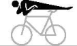

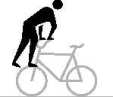

**1093 1096** 

## **Saddle handlebarstand** 

Stand free with one foot on the saddle and the other foot on the handlebar. 

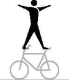

**1101 1102** 

## **Saddlestand** 

Stand free with feet on the saddle. 

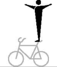

## **1103** 

INDOOR CYCLING 

E0126 

38 

## **Fronthandlebarstand, Fronthandlebarstand turn (T) 1104** 

Stand free with feet on the handlebar-grips, back directed to the saddle. 

From one turn a tactical enlargement of the fronthandlebarstand turn(s) is possible up to four half-turns in maximum. 

**e - h:** The rider jumps from regular seat to fronthandlebarstand. 

**i - l:** From fronthandlebarstand with half or multiple front wheel turn(s) to the fronthandlebarstand or handlebarstand reverse. After the last turn, the end position has to be held for at least 2 metres. 

**m - p:** The rider jumps from regular seat to the fronthandlebarstand; further according figure **i – l**. 

## **Handlebarstand rev. 1105** Stand free with feet on the handlebar-grips, chest directed to the saddle. **Saddle support scale 1111** 

One hand on the saddle, elbow supporting the body, other hand on the handlebar (handlebar-grip may be used as support for the forearm). Head in moving direction, legs stretched backwards. 

**Handlebar support scale 1112 a** One hand on the handlebar, elbow supporting the body, other **1112 b** hand on the saddle. Head to the saddle, legs stretched in **1112 c** moving direction. **Handlebar grip scale, legs front 1112 d** Both hands on the handlebar, elbows supporting the body. **1112 e** Head to the saddle, legs stretched in moving direction. **1112 f 1112 g Handlebar grip scale, legs rear 1112 h** Both hands on the handlebar, elbows supporting the body. **1112 i** Head in moving direction, legs stretched above the saddle. **1112 j 1112 k** 

INDOOR CYCLING 

E0126 

39 

## **Free support balance one leg extended** 

The free support balance one leg extended must be performed for at least 2 seconds. Both hands on the handlebars. The arms are stretched. Upper body and one leg are stretched horizontally and form a straight line. The other leg is bent. The bike and the outstretched arms must not touch the bent leg. 

## **Free support balance legs spread** 

The free support balance legs spread must be performed for at least 2 seconds. Both hands on the handlebars. The arms are stretched. The upper body and the stretched and spread legs are stretched horizontally in one line. 

## **Free support balance closed legs** 

The free support balance closed legs must be performed for at least 2 seconds. Both hands on the handlebars. The arms are extended. The upper body and the outstretched, closed legs are horizontally in a line. 

## **Handlebar L-shape hold** 

Arms stretched, hands placed on the handlebar-grips, legs stretched, back directed to the saddle. 

## **Handlebar L-shape hold rev.** 

Arms stretched, hands placed on the handlebar-grips, legs stretched, chest directed to the saddle. 

## **L-shape hold sidewards** 

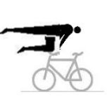

**1113a** 

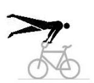

## **1113b** 

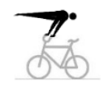

**1113c** 

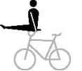

## **1115** 

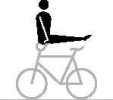

**1116** 

**1117** 

Arms stretched, one hand placed on the saddle, other hand placed on the handlebar. Legs stretched, without leaning against the handlebar-grip with the forearm or wrist. 

## **Handlebar support straddle, Saddle support straddle.** 

**a-b:** Arms stretched, hands placed on the handlebargrips. Legs stretched, straddled on the outside of the arms. **c-d:** Arms stretched, hands placed on the saddle. Legs stretched, straddled on the outside of the arms, without touching the handlebar. 

## **Headstand** 

Headstand on the saddle, both hands on the handlebar. Legs closed and stretched straight upwards. 

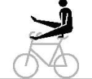

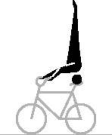

**1118** 

**----- Start of picture text -----** 
1121 **----- End of picture text -----** 

INDOOR CYCLING 

E0126 

40 

## **Shoulderstand** 

Shoulderstand with one shoulder on the saddle or crossbar, boths hands on the handlebar. Legs closed and stretched straight upwards. 

## **1122** 

## **Saddle handlebar handstand** 

**Saddle handlebar handstand 1123 a** Handstand with one hand on the handlebar and other hand **1123 b** on the saddle. Arms stretched, legs closed and stretched **1123 c** straight upwards, without leaning against the handlebar-grip **1123 d** with the forearm or wrist. 

## **L-shape hold sidewards saddle handlebar handstand (T)** 

From L-shape hold sidewards, which has to be performed for at least 2 metres, going directly to the handstand without touching the frame with foot/feet. The handstand has to be performed as described in **1123a-d**. The way of stretch HC., C., S or 8 starts in the position of the saddle handlebar handstand. 

**1123 e 1123 f 1123 g 1123 h** 

The tactical enlargement is possible for the kind of execution as Swiss saddle handlebar handstand which has to be performed as described in **1123i-l**. 

The tactical enlargement is possible for the kind of execution as German saddle handlebar handstand which has to be performed as described in **1123m-p**. 

## **L-shape hold sidewards Swiss saddle handlebar handstand** 

From L-shape hold sidewards, which has to be performed for at least 2 metres, going directly to the handstand with stretched legs over the frame but without touching the frame with foot/feet. After passing the frame, with stretched and straddled legs and stretched arms to the handstand, which has to be performed as described in **1123a-d**. The way of stretch HC., C., S or 8 starts in the position of the saddle handlebar handstand. 

**1123 i 1123 j 1123 k 1123 l** 

## **L-shape hold sidewards German saddle handlebar handstand** 

From L-shape sidewards, which has to be performed for at least 2 metres, going directly to the handstand with stretched legs over the frame without touching the frame or else with foot/feet. After passing the frame with stretched, closed legs and stretched arms to the handstand, which has to be performed as described in **1123a-d.** The way of stretch HC., C., S or 8 starts in the position of the saddle handlebar handstand. 

**1123m 1123 n 1123 o 1123 p** 

INDOOR CYCLING 

E0126 

41 

**Handlebar handstand 1124 a** Handstand with both hands on the handlebar-grips. Arms **1124 b** stretched, legs closed and stretched straight upwards. **1124 c 1124 d** 

## **L-shape hold handlebar handstand (T)** 

**L-shape hold handlebar handstand (T) 1124 e** From L-shape hold or L-shape hold rev., which has to be **1124 f** performed for at least 2 metres, going directly to the **1124 g** handstand without touching the handlebar and/or frame with **1124 h** foot/feet. The handstand has to be performed as described in **1124a-d**. The way of stretch HC., C., S or 8 starts in the position of the handlebar handstand. 

The tactical enlargement is possible for the kind of execution as Swiss handlebar handstand, which has to be performed as described in **1124i-l**. 

The tactical enlargement is possible for the kind of execution as German handlebar handstand, which has to be performed as described in **1124m-p**. 

## **L-shape hold Swiss handlebar handstand** 

From L-shape hold or L-shape hold rev., which has to be performed for at least 2 metres, going directly to the handstand with stretched legs over the handlebar without touching the handlebar and/or frame with foot/feet. After passing the handlebar, with stretched and straddled legs and stretched arms to the handstand, which has to be performed as described in **1124a-d**. The way of stretch HC., C., S or 8 starts in the position of the handlebar handstand. 

**1124 i 1124 j 1124 k 1124 l** 

## **L-shape hold German handlebar handstand** 

From L-shape hold or L-shape hold rev., which has to be performed for at least 2 metres, going directly to the handstand with stretched legs over the handlebar without touching the handlebar or else with foot/feet. After passing the handlebar with stretched, closed legs and stretched arms to the handstand, which has to be performed as described in **1124a-d**. The way of stretch HC., C., S or 8 starts in the position of the handlebar handstand. 

**1124m 1124 n 1124 o 1124 p** 

**Handlebar support straddle handlebar handstand 1124 q** From handlebar support straddle, which has to be performed **1124 r** for at least 2 metres, with stretched legs and stretched arms **1124 s** directly to the handstand, which has to be performed as **1124 t** described in **1124a-d**. The way of stretch of HC., C., S or 8 starts in the position of the handlebar handstand. 

INDOOR CYCLING 

E0126 

42 

**Stillstand on pedals, Stillstand pedal front wheel 1141 a-b:** Stand with feet, solely, on the pedals, back directed to the saddle. The stillstand has to be performed for at least 3 seconds. **c-d:** Standing with one foot, solely, on a pedal, the other foot on the front wheel tyre, back directed to the saddle. The stillstand has to be performed for at least 3 seconds. _(text modified on 01.01.12; 01.01.16; 01.01.17; 01.01.20; 01.01.25)_ **8.3.002** Sidestand turn, squats and jumps **Sidestand turn 1151 a** Chest directed to the handlebar, right foot on the right frontpin, left foot on the right pedal (or counterwise). With half turn of the handlebar and the front wheel to the backhang. While performing the turn, the foot must not leave the pedal. **Reg. seat squat 1156** Squat from regular seat over the handlebar to the fronthang. **Fronthang squat 1157 a**: Squat from fronthang over the handlebar to the regular seat. Pushing off with one foot from a front-pin is allowed. **b-c**: Like **a**: but without pushing off from the front-pin. **Backhang squat 1158 a:** Squat from backhang over the handlebar to the handlebarseat reverse. Pushing off with one foot from a frontpin is allowed. **b-c:** Like **a:** but without pushing off from the front-pin. **Handlebarseat rev. squat 1159** Squat from handlebarseat reverse over the handlebar to the backhang. **Handlebarseat rev. scissors jump 1171 a** From handlebarseat reverse crossing stretched legs above the saddle. Then changing grips to regular seat. Turning the upper part of the body while crossing or grip-changing. Intermediate sitting, after crossing, on the frame or the handlebar is allowed. **1171 b** 

## **Backhang scissors jump** 

Squat from backhang over the handlebar without an intermediate seat in position handlebarseat rev., crossing stretched legs above the saddle. Then changing grips to regular seat. Turning the upper part of the body while crossing or grip-changing. Intermediate sitting, after crossing, on the frame or the handlebar is allowed. 

INDOOR CYCLING 

E0126 

43 

## **Turning jump / Turning-scissors jump** 

**a:** From sidestand foot-cranking jump with half turn of the front wheel, then squat over the handlebar to handlebarseat reverse. The foot has to be removed from the pedal during the jump. 

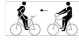

**1172** 

**b**: From regular seat jump with half turn of the front wheel, then squat over the handlebar to the handlebarseat reverse. 

**c**: From handlebarseat reverse squat over the handlebar, immediately followed by jump with half turn of the front wheel to the regular seat. 

**d**: From regular seat jump with half turn of the front wheel to stand bent on frame reverse. 

**e:** From regular seat jump with half turn of the front wheel over the handlebar, without an intermediate seat in position handlebarseat rev., crossing stretched legs above the saddle, and changing grips to the regular seat. Turning the upper part of the body while crossing or grip-changing. Intermediate sitting, after crossing, on the frame or the handlebar is allowed. 

## **Turning jump** 

**a:** From sidestand foot cranking jump with half turn of the front wheel to walking on the front wheel. The foot has to be removed from the pedal during the jump. **b:** From regular seat jump with half turn of the front wheel to walking on the front wheel. 

## **Turning jump** 

**a:** From sidestand foot cranking with half turn of the front wheel to backhang. The foot has to be removed from the pedal during the jump. 

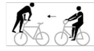

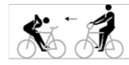

**1173** 

**1174** 

**b:** From regular seat with half turn of the front wheel to the backhang. **c:** From backhang with half turn of the front wheel to the regular seat. 

## **Turning jump (T)** 

The tactical enlargement of the turning jumps is possible from two to seven, three to eight, from four to nine and from five to ten turning jumps. 

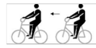

**1175** 

**a:** From regular seat jump with complete turn of the front wheel to the regular seat. **b-e:** From regular seat jump with, continuous multiple turns to the regular seat. 

INDOOR CYCLING 

E0126 

44 

**Pedal jump 1181** From side pedal stand jump simultaneously with feet over the crossbar to side pedal stand on the other side of the bicycle. **Jump Saddle handlebarstand  to fronthandlebarstand 1184** Jump from the Saddle handlebarstand to the fronthandlebarstand that must be performed after the jump, for at least 2 metres. **1186** 

## **Maute jump** 

Jump from the saddlestand to the fronthandlebarstand which has to be performed, after the jump, for at least 2 metres. 

## _(text modified on 01.01.16; 01.01.26)_ 

**8.3.003** Raiser figures **Raiser reg. seat 1201 a-d/i:** Seat on the saddle, chest directed to the handlebar, **1202** feet on the pedals. **e-h:** Seat on the saddle, chest directed to the handlebar, one foot on a pedal. The free leg has to be stretched without touching the bicycle. **Raiser reg. seat rev. 1203 a-d/g**: Seat on the saddle, back directed to the handlebar, **1204** feet on the pedals. **1203e-f:** Seat on the saddle, back directed to the handlebar, one foot on a pedal. The free leg has to be stretched without touching the bicycle. **Raiser lady seat 1211** Seat on the saddle, chest directed to the handlebar, one foot **1212** on a pedal. The free leg has to be stretched over the crossbar to the opposite side of the bicycle and below the handlebar without holding on the front wheel with the foot. **Raiser stand on pin / raiser stand on pin bw. 1216 1216a-d/1217a-e:** Stand with the left foot on the left rear-pin **1217** and with the right foot on the right pedal (or counterwise), chest directed to the handlebar. 

## **Raiser sidestand / raiser sidestand bw.** 

**Raiser sidestand / raiser sidestand bw. 1216 1216e-h/1217f-g:** Stand with one foot on the right rear-pin and with the other **1217** on the right pedal (or counterwise), chest directed to the handlebar. 

INDOOR CYCLING 

E0126 

45 

**Raiser stand on pin rev. 1219 a** Stand with the right foot on the left rear-pin and the left foot **1219 b** on the right pedal (or counterwise), back directed to the handlebar. 

**Raiser sidestand rev. 1219 c** Stand with one foot on the right rear-pin and the other foot on the right pedal **1219 d** (or counterwise), back directed to the handlebar. 

**Raiser handlebarseat 1226** Seat in the lower part of the handlebar, chest directed to the **1227** front wheel, feet on the pedals. 

**Raiser handlebarseat rev. 1228** Seat in the lower part of the handlebar, back directed to the **1229** front wheel, feet on the pedals. 

**Raiser head tube 1236 a** Seat on the head tube, front wheel in front of oneself, feet on **1236 b** the pedals. **1236 e 1237 Raiser head tube 1 leg 1236 c** Seat on the head tube, front wheel in front of oneself, one foot on the pedal. **1236 d** The free leg has to be stretched, whithout touching the bicycle. **Raiser head tube rev. 1238** Seat on the head tube, front wheel behind oneself, feet on the **1239** pedals. 

## **Standraiser** 

**Standraiser 1246** Saddle directed downwards, holding the front wheel in front **1247** of oneself, standing with feet on the pedals. 

## **Standraiser rev.** 

**Standraiser rev. 1248** Saddle directed downwards, holding the front wheel behind **1249** oneself, standing with feet on the pedals. 

## _(text modified on 01.01.17)_ 

**8.3.004** Raiser passages 

**Passages 1281-** Execution according **8.2.028. 1293** 

INDOOR CYCLING 

E0126 

46 

## **8.3.005** Final figures 

A final figure can only be performed as last figure of the riding performance. The rider has to finish the figure standing on the competition surface (except for figure **o** and **p** ), holding the bicycle in one hand. The other arm has to be stretched, horizontally sidewards. **Reg. seat handlebar squat 1301 a** From position regular seat squat over the handlebar with feet standing on the floor. During the jump, the handlebar has to be held with both hands. **Side pedal stand squat over the bicycle 1301 b** Feet on one pedal, squat over the frame with feet standing on the floor. During the jump the handlebar has to be held with both hands. **Reg. seat handlebar straddle 1301 c** From position regular seat jump with straddled legs over the handlebar <del>to</del> with feet standing on the floor. The handlebar has to be released during the jump. **Reg. seat handlebar squat ½ twist 1301 d** From position regular seat squat over the handlebar with a ½ twist with feet standing on the floor. The ½ twist has to end before the rider is standing on the floor. After the jump over the handlebar the rider has to release the handlebar until the end of the ½ twist. **Handlebarseat rev. handlebar squat 1301 e** From position handlebarseat reverse squat over the handlebar with feet standing on the floor. During the jump the handlebar has to be held with both hands. **Handlebarseat rev. handlebar straddle 1301 f** From position handlebarseat reverse jump with straddled legs over the handlebar with feet standing on the floor. The handlebar has to be released during the jump. **Stand bent on saddle handstandloop 1301 g** From position stand bent on saddle with handstandloop with feet standing on the floor in front of the handlebar. The handstand has to be performed with stretched arms, stretched and closed legs above the handlebar. A short stop of the loop at this position is no obligation. After the handstand both hands have to be released from the handlebar, after the following rotation around the body width axis the rider has to land on the floor. 

INDOOR CYCLING 

E0126 

47 

## **Reg. seat handstandloop** 

## **1301 h** 

From position regular seat jump, without an intermediate position, with handstandloop to standing with feet on the floor in front of the handlebar. The handstand has to be performed with stretched arms, stretched and closed legs above the handlebar. A short stop of the loop at this position is no obligation. After the handstand both hands have to be released from the handlebar, after the following rotation of the body the rider has to land with feet on the floor. 

**Fronthandlebarstand stretchjump behind the bicycle 1301 i** From position fronthandlebarstand with stretchjump upwards, with complete stretched body and closed legs, to stand on the floor with feet behind the bicycle. At the highest position of the jump the arms have to be stretched vertically upwards. **Fronthandlebarstand stretchjump ½ twist in front of the bicycle 1301 j** From position fronthandlebarstand with stretchjump upwards, with complete stretched body and closed legs, and a ½ twist to stand on the floor with feet in front of the bicycle. At the highest position of the jump the arms have to be stretched vertically upwards. **Fronthandlebarstand straddlejump behind the bicycle 1301 k** From position fronthandlebarstand with straddle-jump, with straddled and horizontally stretched legs, to stand on the floor with feet behind the bicycle. At the stretched-straddled position the hands have to touch the feet. **Handlebarstand rev. stretchjump in front of the bicycle 1301 l** From position handlebarstand reverse with stretchjump upwards, with complete stretched body and closed legs, to stand on the floor with feet in front of the bicycle. At the highest position of the jump the arms have to be stretched vertically upwards. **Handlebarstand rev. stretchjump 1 twist in front of the bicycle 1301 m** From position handlebarstand reverse with stretchjump upwards, with complete stretched body and closed legs, and 1 twist, to stand on the floor with feet in front of the bicycle. At the highest position of the jump the arms have to be stretched vertically upwards. **Handlebarstand rev. somersault bw. hooked legs 1301 n** From position handlebarstand reverse somersault-jump backwards with hooked legs, to stand on the floor with feet in front of the bicycle. **Fronthandlebarstand** <del>**rev.**</del> **somersault bw. hooked legs 1301 q** From position fronthandlebarstand <del>reverse</del> somersault-jump backwards with hooked legs, to stand on the floor with feet behind the bicycle. 

INDOOR CYCLING 

E0126 

48 

|**Handstand bicycle lying down**|**1301 o**|
|---|---|
|Handstand, on the frame of the bicycle, which is lying on the||
|floor, with stretched arms, legs closed and stretched straight||
|upwards without leaning on the handlebar, saddle or pedal||
|with the forearms or wrists. The handstand has to be||
|performed for at least 3 seconds.||
|**L-shape hold swiss handstand bicycle lying down**|**1301 p**|

From position L-shape hold performed on the frame of the bicycle, which is lyin <del>g o</del> n the floor. The L-shape hold has to be shown for at least 3 seconds, then going to the handstand with stretched legs, without touching the bicycle with foot/feet. After passing the frame/bicycle, with stretched and straddled legs and stretched arms direct to the handstand, which has to be performed as described in **1301o**. The handstand has to be performed for at least 3 seconds. 

_(text modified on 01.01.16; 01.01.17, 01.01.25)_ 

## **§ 2 Pair artistic cycling** 

**8.3.006** Figures with both wheels on floor on two bicycles **Reg. seat 2001** Seat on the saddle, chest directed to the handlebar, feet on **2002** the pedals. **2003 2004 Reg. seat rev. 2005** Seat on the saddle, back directed to the handlebar, feet on the pedals. **Steering with feet 2011** Seat on the saddle, chest directed to the handlebar, feet on the handlebar. **Lady seat 2012** Seat on the saddle, chest directed to the handlebar, one foot **2013** on a pedal. The free leg stretched over the crossbar to the opposite side of the bicycle and below the handlebar, without touching the handlebar with the leg. **Handlebarseat 2021** 

Seat on the handlebar, back directed to the saddle. The free leg stretched forward, horizontally. Other foot on the down tube. 

INDOOR CYCLING 

E0126 

49 

## **Handlebarseat rev.** 

Seat on the handlebar, chest directed to the saddle, feet on the pedals. 

## **Split** 

Left foot standing on the left rear-pin, right foot standing on the right front-pin (or counterwise). Chest directed to the handlebar, without touching the handlebar with the leg. 

## **Split rev.** 

Right foot standing on the left rear-pin, left foot standing on the right-frontpin (or counterwise). Chest directed to the saddle, without touching the handlebar with the leg. 

## **Frontstand** 

Stand in front of the handlebar, back directed to the saddle. One foot on the frontpin, other foot on the down tube. 

## **Sidestand foot cranking** 

Stand with one foot on the left rear-pin, other foot on the left pedal (or counterwise), chest directed to the handlebar. 

## **Sidestand** 

Stand with one foot on the left rear-pin, other foot on the left front-pin (or counterwise), chest directed to the handlebar, without touching the handlebar with the leg. 

## **Stand on pins** 

Stand with feet each on a rear-pin. Both knees behind the saddle. 

## **Stand bent on pin** 

Stand with one foot on the rear-pin, trunk bent forward directed to the handlebar, free leg stretched backwards. 

## **Bent knee seat** 

In squat position with one foot on the crossbar, free leg horizontally stretched forward, back directed to the saddle. 

## **Knee on saddle** 

Knee on the saddle, trunk bent-forward to the handlebar, free leg stretched backwards in straight line with trunk and head. 

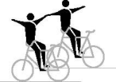

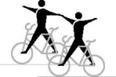

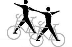

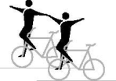

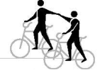

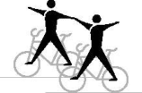

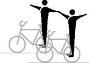

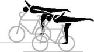

## **2022** 

## **2026** 

## **2027** 

**2031 2036 2037 2046 2047 2051** 

**2052** 

INDOOR CYCLING 

E0126 

50 

## **Lying on saddle; Lying on saddle and handlebar** 

**a-b:** Lying with front of the body on the saddle, closed legs stretched horizontally backwards. 

**c-d:** Lying with front of the body on the saddle, arms stretched sidewards free-hand on the handlebar-grips. Closed legs stretched horizontally backwards. 

## **Waterscale** 

Lying with back of the body in a straight line on the handlebar, stretched legs or feet under ( **a** and **b** ), or on ( **c** and **d** ) the saddle. 

## **Framestand** 

Stand upright with one foot solely on the down tube, other foot solely on the saddle tube, chest directed to the handlebar. Without touching the feet each other and without touching the handlebar with the leg. 

## **Saddle handlebarstand** 

Stand free with one foot on the saddle and the other foot on the handlebar. 

## **Saddlestand** 

Stand free with feet on the saddle. 

## **Fronthandlebarstand, Fronthandlebarstand turn (T)** 

From one turn a tactical enlargement of the fronthandlebarstand turn(s) is possible up to four half-turns in maximum. 

**a-f:** Stand free with feet on the handlebar-grips, back directed to the saddle. 

## **2061** 

**2062** 

**2066** 

**2067 2068** 

**2069** 

**2070** 

**g-j:** From fronthandlebarstand after releasing grip connection with half or multiple front wheel turn(s) to the fronthandlebarstand or handlebarstand reverse. After the last turn, and before the grip connection, at least 2 metres must be ridden in the handlebar position. The exercise ends with the grip connection. 

**aa-ja:** The riders jump simultaneously from regular seat to fronthandlebarstand; further according figure **a-f**; **g-j.** 

INDOOR CYCLING 

E0126 

51 

**Counter circle fronthandlebarstand (T) 2070 k k-n:** From fronthandlebarstand with half or multiple front **2070 l** wheel turn(s) to the fronthandlebarstand or handlebarstand **2070 m** reverse. Execution of the figure according to the rule for **2070 n** counter circle **8.2.051**. After the last handlebarstand turn, but before the required hand touch, the end position has to be held for at least 2 metres. **ka-na:** The riders jump simultaneously from regular seat to the fronthandlebarstand; further according figure **k-n**. 

## **Handlebarstand rev.** 

Stand free with feet on the handlebar-grips, chest directed to the saddle. 

**2071** 

## **Headstand** 

Separate performed headstand on the saddle, both hands on the handlebar. Legs closed and stretched straight upwards. 

## **2073** 

## **Shoulderstand** 

Separate performed shoulderstand with one shoulder on the saddle or crossbar, both hands on the handlebar. Legs closed and stretched straight upwards. 

**2074** 

## **Saddle handlebar handstand** 

Separate performed handstand with one hand on the handlebar and the other hand on the saddle. Arms stretched, legs closed and stretched straight upwards, without leaning against handlebar-grip with the forearm and wrist. 

**2076 a 2076 b 2076 c** 

## **L-shape hold sidewards saddle handlebar handstand (T)** 

From L-shape hold sidewards, which has to be performed for at least 2 metres, going directly to the handstand without touching the frame with foot/feet. The handstand has to be performed as described in **2076a-c.** The way of stretch HC., C. or count. 8 starts in the position of the saddle handlebar handstand. 

**2076 d 2076 e 2076 f** 

The tactical enlargement is possible for the kind of execution as Swiss saddle handlebar handstand, which has to be performed as described in **2076g-i**. The tactical enlargement is possible for the kind of execution as German saddle handlebar handstand, which has to be performed as described in **2076j-l**. 

INDOOR CYCLING 

E0126 

52 

**L-shape hold sidewards Swiss saddle handlebar 2076 g handstand 2076 h** From L-shape hold sidewards, which has to be performed for **2076 i** at least 2 metres, going directly to the handstand with stretched legs over the frame but without touching the frame and/or handlebar with foot/feet. After passing the frame, with stretched and straddled legs and stretched arms to the handstand, which has to be performed as described in **2076ac.** The way of stretch HC., C. or count. 8 starts in the position of the saddle handlebar handstand. **L-shape hold sidewards German saddle handlebar 2076 j handstand 2076 k** From L-shape sidewards, which has to be performed for at **2076 l** least 2 metres, going directly to the handstand with stretched legs over the frame without touching the frame or else with foot/feet. After passing the frame with stretched, closed legs and stretched arms to the handstand, which has to be performed as described in **2076a-c.** The way of stretch HC., C. or count. 8 starts in the position of the saddle handstand. 

**Handlebar handstand 2077 a** Separate performed handstand with both hands on the **2077 b** handlebar-grips. Arms stretched, legs closed and stretched **2077 c** straight upwards. **L-shape hold handlebar handstand (T) 2077 d** From L-shape hold or L-shape hold rev, which has to be **2077 e** performed for at least 2 metres, going directly to the **2077 f** handstand without touching the handlebar and/or frame with foot/feet. The handstand has to be performed as described in **2077a-c.** The way of stretch HC., C. or count. 8 starts in the position of the handlebar handstand. The tactical enlargement is possible for the kind of execution as Swiss handlebar handstand, which has to be performed as described in **2077g-i**. The tactical enlargement is possible for the kind of execution as German handlebar handstand, which has to be performed as described in **2077j-l**. 

**L-shape hold Swiss handlebar handstand 2077 g** From L-shape hold or L-shape hold rev, which has to be **2077 h** performed for at least 2 metres, going directly to the **2077 i** handstand with stretched legs over the handlebar without touching the handlebar and/or frame with foot/feet. After passing the handlebar, with stretched and straddled legs and stretched arms to the handstand, which has to be performed as described in **2077a-c.** The way of stretch HC, C or count. 8 starts in the position of the handlebar handstand. 

INDOOR CYCLING 

E0126 

53 

**L-shape hold German handlebar handstand 2077 j** From L-shape hold or L-shape hold rev, which has to be **2077 k** performed for at least 2 metres, going directly to the **2077 l** handstand with stretched legs over the handlebar without touching the handlebar or else with foot/feet. After passing the handlebar with stretched, closed legs and stretched arms to the handstand, which has to be performed as described in **2077a-c.** The way of stretch HC., C. or count. 8 starts in the position of the handlebar handstand. 

**Handlebar support straddle handlebar handstand 2077 m** From handlebar support straddle, which has to be performed **2077 n** for at least 2 metres with stretched legs and stretched arms **2077 o** directly to the handstand, which has to be performed as described in **2077a-c**. The way of stretch of HC., C., S or 8 starts in the position of the handlebar handstand. **Jump Saddle handlebarstand to fronthandlebarstand 2079** Jump from the Saddle handlebarstand to the fronthandlebarstand that must be performed after the jump, for at least 2 metres. It is only allowed to perform the jumps riding opposite to each other during execution of a circle or after a counter eight. The jumps have to be performed simultaneously. Riders do not have to touch hands before and after the jump. **Maute jump 2081** Jump from the saddlestand separate to the fronthandlebarstand which has to be performed, after the jump, for at least 2 metres. It is only allowed to perform the jumps riding opposite to each other during execution of a circle or after a counter eight. The jumps have to be performed simultaneously. Riders do not have to touch hands before and after the jump. **Stillstand on pedals, Stillstand pedal front wheel 2091 a-b:** Stand with feet, solely, on the pedals, back directed to the saddle. The stillstand has to be performed for at least 3 seconds. **c-d:** Stand with one foot, solely, on a pedal, the other foot on front wheel tyre, back directed to saddle. The stillstand has to be performed for at least 3 seconds. 

_(text modified on 01.01.12; 01.01.16; 01.01.17; 01.01.20; 01.01.26)_ 

**8.3.007** Raiser figures on two bicycles **Raiser reg. seat 2131** Seat on the saddle, chest directed to the handlebar, feet on **2132** the pedals. **2133 2134** 

INDOOR CYCLING 

E0126 

54 

**Raiser reg. seat rev. 2135** Seat on the saddle, back directed to the handlebar, feet on **2136** the pedals. **2137 2138** 

## **Raiser lady seat** 

Seat on the saddle, chest directed to the handlebar, one foot on a pedal. The free leg has to be stretched over the crossbar to the opposite side of the bicycle and below the handlebar without holding on the front wheel with the foot. 

**2147** 

**Raiser stand on pins 2151** Stand with the left foot on the left rear-pin and with the right **2152** foot on the right pedal (or counterwise), chest directed to the **2154** handlebar. **Raiser handlebarseat 2161** Seat in the lower part of the handlebar, chest directed to the **2162** front wheel, feet on the pedals. **2163 2164 Raiser handlebarseat rev. 2165** Seat in the lower part of the handlebar, back directed to the **2166** front wheel, feet on the pedals. **2167 2168 Raiser head tube 2176** Seat on the head tube, front wheel in front of oneself, feet on **2177** the pedals. **2178 2179** 

**Raiser head tube rev. 2180** Seat on the head tube, front wheel behind oneself, feet on the **2181** pedals. **2182 2183** 

## **Standraiser** 

**Standraiser 2191** Saddle directed downwards, holding front wheel in front of **2192** oneself, standing with feet on the pedals. **2193 2194** 

## **Standraiser rev.** 

**Standraiser rev. 2195** Saddle directed downwards, holding front wheel behind **2196** oneself, standing with feet on the pedals. **2197 2198** 

_(text modified on 01.01.17)_ 

INDOOR CYCLING 

E0126 

55 

|**8.3.008**|Turns on the spot on two bicycles||
|---|---|---|
||**Turns on the spot (T)**|**2211**|
||The tactical enlargement of the turns on the spot is possible|**2212**|
||from 2 turns up to 4 turns.|**2213**|
||Execution according**8.2.047.**|**2214**|
|||**2215**|
|||**2216**|
|**8.3.009**|Passages on two bicycles||
||**Passages**|**2236**|
||Execution according**8.2.028. **|**2237**|
|||**2238**|
|||**2239**|
|||**2240**|
|||**2241**|
|||**2242**|
|||**2243**|
|**8.3.010**|Final figures on two bicycles||
||**Handlebarstand rev. somersault bw. hooked legs**|**2250 a**|
||From position handlebarstand reverse somersault-jump||
||backwards with hooked legs to stand on the floor with feet in||
||front of the bicycle. Both somersaults have to be performed||
||simultaneously. It is only allowed to perform the somersault||
||riding opposite to each other during execution of a circle or||
||after a counter eight. It is not necessary to touch hands before||
||and after the somersault.||
||_(text modified on 01.01.16)_||
|**8.3.011**|Figures on one bicycle||
||**Reg. seat / Stand on pins; Saddlestand**|**2261**|
||**a-b:** Seat on the saddle, chest directed to the handlebar,||
||feet on the pedals. / Stand with feet each on a rear-pin. Both||
||knees behind the saddle.||
||**c-d:** Like**a-b**until slash / Stand with feet on the saddle.||
||**Reg. seat / Shoulderseat**|**2266**|
||Seat on the saddle, chest directed to the handlebar, feet on|**2267**|
||the pedals. / Seat on the partner’s shoulders.||
||**Reg. seat / Shoulderstand**|**2268**|
||Seat on the saddle, chest directed to the handlebar, feet on|**2269**|
||the pedals. / Stand with feet on the partner’s shoulders.||

INDOOR CYCLING 

E0126 

56 

## **Reg. seat / Chest suspended hang** 

Seat on the saddle, chest directed to the handlebar, feet on the pedals. / Hanging with chest-grip on the partner’s back, head downwards, upwards stretched and closed legs in straight line with the body. 

**2270 2271** 

## **Reg. seat / Handlebarstand** 

Seat on the saddle, chest directed to the handlebar, feet on the pedals. / Stand with feet on the handlebar-grips. 

**2276** 

## **Reg. seat / Handlebar handstand** 

Seat on the saddle, chest directed to the handlebar, feet on the pedals. / Handstand with both hands on the handlebargrips, arms stretched, legs closed and stretched straight upwards. 

**2277 a 2277 b** 

## **Reg. seat / Handlebar support straddle handlebar handstand** 

**2277 c 2277 d** 

Seat on the saddle, chest directed to the handlebar, feet on the pedals / From handlebar support straddle, which has to be performed for at least 2 metres, with stretched legs and stretched arms directly to the handstand. The handstand has to be performed as described in **2277a-b.** The way of stretch of HC. or C. starts in the position of the handlebar handstand. 

## **Reg. seat rev. / Shoulderseat** 

Seat on the saddle, back directed to the handlebar, feet on the pedals. / Seat on the partner’s shoulders. 

**2281 2282** 

## **Reg. seat rev. / Shoulderstand** 

**Reg. seat rev. / Shoulderstand 2283** Seat on the saddle, back directed to the handlebar, feet on the pedals. / Stand with feet on the partner’s shoulders. **Reg. seat rev. / Chest suspended hang 2285** Seat on the saddle, back directed to the handlebar, feet on **2286** the pedals. / Hanging with chest-grip on the partner’s back, head downwards, upwards stretched and closed legs in straight line with the body. 

INDOOR CYCLING 

E0126 

57 

## **Handlebarseat / Stand on pins; Saddlestand** 

**a-d:** Seat on the handlebar, back directed to the saddle. The free leg stretched forward, horizontally. Other foot on the down tube. / Stand with feet each on a rear-pin. Both knees behind the saddle. 

**2296** 

**e-h:** Like **a-d** until slash / Stand with feet on the saddle. 

## **Handlebarseat rev. / Stand on pins** 

Seat on the handlebar, chest directed to the saddle, feet on the pedals. / Stand with feet each on a rear-pin. Both knees behind the saddle. 

## **Handlebarseat rev. / Saddle handlebarstand; Saddlestand** 

**a-d:** Seat on the handlebar, chest directed to the saddle, feet on the pedals. / Stand with one foot on the saddle and with the other foot on the handlebar. **e-h:** Like **a-d** until slash / Stand with both feet on the saddle. 

## **Handlebarseat rev. / Shoulderseat** 

Seat on the handlebar, chest directed to the saddle, feet on the pedals. / Seat on the partner’s shoulders. 

## **Handlebarseat rev. / Shoulderstand** 

Seat on the handlebar, chest directed to the saddle, feet on the pedals. / Stand with feet on the partner’s shoulders. 

## **Handlebarseat rev. / Chest suspended hang** 

Seat on the handlebar, chest directed to the saddle, feet on the pedals. / Hanging with chest-grip on the partner’s back, head downwards, upwards stretched and closed legs in straight line with the body. 

## **Handlebarseat rev. / Headstand** 

Seat on the handlebar, chest directed to the saddle, feet on the pedals. / Headstand on the saddle, both hands on the handlebar. Legs closed and stretched straight upwards. 

**2301 2302** 

**----- Start of picture text -----** 
2303 2304 2305 2306 **----- End of picture text -----** 

INDOOR CYCLING 

E0126 

58 

## **Frontstand / Stand on pins; Saddlestand** 

**a-d:** Stand in front of the handlebar, back directed to the saddle. One foot on the front-pin, other foot on the down tube. / Stand with feet each on a rear-pin. Both knees behind the saddle. 

**e-h:** Like **a-d** until slash / Stand with feet on the saddle. 

## **Split / Shoulderseat** 

Left foot standing on the left rear-pin, right foot standing on the right front-pin (or counterwise). Chest directed to the handlebar, without touching the handlebar with the leg. / Seat on the partner’s shoulders. 

## **Sidestand / Sidestand, Ring grip** 

Stand with one foot on the left rear-pin, other foot on the left front-pin (or counterwise). Chest directed to the handlebar, without touching the handlebar with the leg. / Similar stand on the opposite side of the bicycle. Partners are connected by hand-in-hand grip to a ring, with stretched arms. 

## **Stand bent on saddle / Stand bent on handlebar rev.** 

Stand with one foot on the saddle, trunk bent-forward to the handlebar, free leg stretched backwards. / Stand with one foot on the handlebar, trunk bent-forward to the saddle, free leg stretched in moving direction, one hand on the saddle, other hand on the handlebar. 

## **Frameseat / Stand bent on saddle** 

Pushing one foot through the frame and placing the foot on the front-pin. Free leg stretched forward, seat in the frame. / Stand with one foot on the saddle, trunk bent-forward to the handlebar, free leg stretched backwards. 

## **Frameseat / Saddle handlebarstand; Saddlestand** 

**a-b:** Pushing one foot through the frame and placing the foot on the front-pin. Free leg stretched forward, seat in the frame. / Stand with one foot on the saddle and the other foot on the handlebar. **c-d:** Like **a-b** until slash / Stand with feet on the saddle. 

## **Frameseat / Saddle support scale** 

Pushing one foot through the frame and placing the foot on the front-pin. Free leg stretched forward, seat in the frame. / One hand on the saddle, elbow supporting the body, other hand on the handlebar (handlebar-grip may be used as support for the forearm). Head in moving-direction, legs stretched backwards. 

**2311 2316** 

**2317** 

**2319** 

**2321 2322** 

**2323** 

INDOOR CYCLING 

E0126 

59 

## **Fronthang / Stand bent on saddle** 

Both hands behind the back on the handlebar, front wheel between the legs, feet on the pedals. / Stand with one foot on the saddle, trunk bent-forward to the handlebar, free leg stretched backwards. 

## **Fronthang / Saddle handlebarstand; Saddlestand** 

**a-b:** Both hands behind the back on the handlebar, front wheel between the legs, feet on the pedals. / Stand with one foot on the saddle and the other foot on the handlebar. **c-d:** Like **a-b** until slash / Stand with feet on the saddle. 

## **Fronthang / Headstand; Saddle handlebar handstand** 

**a-b:** Both hands behind the back, on the handlebar, front wheel between the legs, feet on the pedals. / Headstand on the saddle, both hands on the handlebar. Legs closed and stretched straight upwards. 

**2331** 

**2332 2334** 

**c-d:** Like **a-b** until slash / Handstand with one hand on the handlebar and the other hand on the saddle. Arms stretched, legs closed and stretched straight upwards, without leaning against the handlebar-grip with the forearm or wrist. 

## **Backhang / Stand on pins** 

In front of the headtube hanging on the handlebar, chest directed to the saddle, frame between the legs, feet on the pedals. / Stand with feet each on a rear-pin. Both knees behind the saddle. 

## **Backhang / Saddle handlebarstand; Saddlestand** 

**a-b:** In front of the headtube hanging on the handlebar, chest directed to the saddle, frame between the legs, feet on the pedals. / Stand with one foot on the saddle and the other foot on the handlebar. **c-d:** Like **a-b** until slash / Stand with feet on the saddle. 

## **Backhang / Handlebarstand** 

In front of the headtube hanging on the handlebar, chest directed to the saddle, frame between the legs, feet on the pedals. / Stand with feet on the handlebar-grips. 

**Backhang / Headstand; Saddle handlebar handstand a-b:** In front of the headtube hanging on the handlebar, chest directed to the saddle, frame between the legs, feet on the pedals. / Headstand on the saddle, both hands on the handlebar. Legs closed and stretched straight upwards. **c-d:** Like **a-b** until slash / Handstand with one hand on the handlebar and the other hand on the saddle. Arms stretched, legs closed and stretched straight upwards, without leaning against the handlebar-grips with the forearm or wrist. 

**2341** 

**2342** 

**2343** 

**2346** 

INDOOR CYCLING 

E0126 

60 

## **Lying on handlebar / Stand bent on saddle; Saddlestand** 

**a-b:** Lying with front of the body on the handlebar, head directed to the saddle, closed legs stretched horizontally in moving direction. / Stand with one foot on the saddle, trunk bent-forward directed to the handlebar, free leg stretched backwards. 

**c-d:** Like **a-b** until slash / Stand with feet on the saddle. 

## **Lying on saddle / Handlebarstand; Handlebar handstand** 

**a-b:** Lying with front of the body on the saddle, closed legs stretched horizontally backwards. / Stand with feet on the handlebar-grips. 

**c-d:** Like **a-b** until slash / Handstand with both hands on the handlebar-grips. Arms stretched, legs closed and stretched straight upwards. 

## **Waterscale / Stand bent on saddle; Saddlestand** 

**a-b:** Lying with back of the body in a straight line on the handlebar, stretched legs or feet under the saddle. / Stand with one foot on the saddle, trunk bent-forward to the handlebar, free leg stretched backwards. **c-d:** Like **a-b**: until slash / Stand with feet on the saddle. 

## **Saddle handlebarstand / Saddle handlebarstand** 

Both stand with one foot on the saddle and the other foot on the handlebar. 

## **Saddle handlebarstand / Stand on pins; Saddlestand; Handlebarstand** 

**a-b:** Stand with one foot on the saddle and the other foot on the handlebar. / Stand with feet each on a rear-pin. Both knees behind the saddle. 

**2351 2352** 

**2353 2356** 

**2357** 

**c-d:** Like **a-b** until slash / Stand with feet on the saddle. **e-f:** Like **a-b**: until slash / Stand with feet on the handlebar-grips. 

## **Handlebarstand / Stand on pins** 

Stand with feet on the handlebar-grips. / Stand with feet each on a rear-pin. Both knees behind the saddle. **g-h:** The rider jumps from regular seat to the fronthandlebarstand; further according **a-b**. 

**2358 a 2358 b 2358 g 2358 h** 

INDOOR CYCLING 

E0126 

61 

## **Handlebarstand-turn ½ to multiple (T) / Stand on pins** 

From one turn a tactical enlargement of the handlebarstand turn(s) is possible up to four half-turns in maximum. **c-f:** From the respective handlebarstand with half or multiple front wheel turn(s) to the fronthandlebarstand or handlebarstand reverse. After the last turn, the end position has to be held for at least 2 metres. / Stand with feet each on a rear-pin. Both knees behind the saddle, during the complete sequence of the figure. 

**2358 c 2358 d 2358 e 2358 f 2358 i 2358 j 2358 k 2358 l** 

**i-l:** The rider jumps from regular seat to the fronthandlebarstand; further according **c-f.** 

## **Handlebarstand / Saddlestand** 

**a-b:** Stand with feet on the handlebar-grips. / Stand with feet on the saddle. Riders are connected by hand-in-hand grip connection to a ring with stretched arms. **c-f:** Like **a-b** but without grip-connection. 

## **Handlebar L-shape hold / Stand on pins; Saddlestand; Saddle support straddle** 

**a-b:** Arms stretched, hands placed on the handlebargrips, legs stretched, back directed to the saddle. / Stand with feet each on a rear-pin. Both knees behind the saddle. **c-d:** Like **a-b** until slash / Stand with feet on the saddle. **e-f:** Like **a-b** until slash / Arms stretched, hands placed on the saddle. Legs horizontally stretched, straddled on the outside of the arms, without touching the partner or the handlebar. 

## **Handlebar support straddle / Saddle support straddle** 

Arms stretched, hands placed on the handlebar-grips. Legs stretched, straddled on the outside of the arms. / Arms stretched, hands placed on the saddle. Legs stretched, straddled on the outside of the arms, without touching the partner or the handlebar. 

## **Headstand / Handlebarstand** 

Headstand on the saddle, both hands on the handlebar. Legs closed and stretched straight upwards. / Stand with feet on the handlebar-grips. 

## **Headstand / Frame shoulderstand** 

Headstand on the saddle, both hands on the handlebar. Legs closed and stretched straight upwards. / Shoulderstand with one shoulder on the crossbar, boths hands on the handlebar. Legs closed and stretched straight upwards. 

**2359** 

**2366 a 2366 b 2366 c 2366 d 2366 e 2366 f** 

**2366 g 2366 h** 

**2371** 

**2372** 

INDOOR CYCLING 

E0126 

62 

## **Headstand / Handlebar support straddle** 

**2373** 

Headstand on the saddle, both hands on the handlebar. Legs closed and stretched straight upwards. / Arms stretched, hands placed on the handlebar-grips. Legs horizontally stretched, straddled on the outside of the arms. 

## **Headstand / Handlebar handstand** 

**Headstand / Handlebar handstand 2374 a** Headstand on the saddle, both hands on the handlebar. Legs **2374 b** closed and stretched straight upwards. / Handstand with both **2374 c** hands on the handlebar-grips. Arms stretched, legs closed **2374 d** and stretched straight upwards. 

## **Headstand / Handlebar support straddle handlebar handstand** 

**Headstand / Handlebar support straddle handlebar 2374 e handstand 2374 f** Headstand on the saddle, both hands on the handlebar. Legs **2374 g** closed and stretched straight upwards. / From handlebar **2374 h** support straddle, which has to be performed for at least 2 metres (partner in headstand), with stretched legs and stretched arms directly to the handstand. The handstand has to be performed as described in **2374a-d.** The way of stretch of HC., C., S or 8 starts in the position of the handlebar handstand. 

## **Saddle handlebar handstand / Handlebarstand** 

**Saddle handlebar handstand / Handlebarstand 2376 a** Handstand with one hand on the handlebar and other hand **2376 b** on the saddle. Arms stretched, legs closed and stretched straight upwards without leaning against the handlebar-grip with the forearm or wrist. / Stand with feet on the handlebargrips. 

## **Handlebar handstand / Saddlestand** 

Handstand with both hands on the handlebar-grips. Arms stretched, legs closed and stretched straight upwards. / Stand with feet on the saddle. 

**2376 c 2376 d** 

## **Handlebar handstand / Saddle handlebar handstand** 

Handstand with both hands on the handlebar-grips. Arms stretched, legs closed and stretched straight upwards. / Handstand with one hand on the handlebar and the other hand on the saddle. Arms stretched, legs closed and stretched straight upwards, without leaning against handlebar-grip with the forearm or wrist. 

**2377** 

INDOOR CYCLING 

E0126 

63 

**Stillstand on pedals / Shoulderseat, Shoulderstand 2391 a-b:** Stand with feet, solely on the pedals, back directed to the saddle. The stillstand has to be performed for at least 3 seconds. / Seat on the partner’s shoulders. **c-d:** Like **a-b** until slash / Stand with feet on the partner’s shoulders. 

_(text modified on 01.01.16; 01.01.17; 01.01.20)_ 

## **8.3.012** Raiser figures on one bicycle 

**Raiser reg. seat / Stand on pins 2411** Seat on the saddle, chest directed to the handlebar, feet on the pedals. / Stand with one foot on a rear-pin or stand with feet each on a rear-pin. **Raiser reg. seat / Shoulderseat 2412** Seat on the saddle, chest directed to the handlebar, feet on **2413** the pedals. / Seat on the partner’s shoulders. **Raiser reg. seat / Chest suspended hang 2414** Seat on the saddle, chest directed to the handlebar, feet on **2415** the pedals. / Hanging with chest-grip on the partner’s back, head downwards, upwards stretched and closed legs in straight line with the body. **Raiser reg. seat / Shoulderstand 2416** Seat on the saddle, chest directed to the handlebar, feet on **2417** the pedals. / Stand with feet on the partner’s shoulders. **Raiser reg. seat rev. / Shoulderseat 2418** Seat on the saddle, back directed to the handlebar, feet on **2419** the pedals. / Seat on the partner’s shoulders. **Raiser reg. seat rev. / Chest suspended hang 2420** Seat on the saddle, back directed to the handlebar, feet on **2421** the pedals. / Hanging with chest-grip on the partner’s back, head downwards, upwards stretched and closed legs in straight line with the body. 

INDOOR CYCLING 

E0126 

64 

## **Raiser reg. seat rev. / Shoulderstand** 

**Raiser reg. seat rev. / Shoulderstand 2422** Seat on the saddle, back directed to the handlebar, feet on the pedals. / Stand with feet on the partner’s shoulders. **Raiser handlebarseat / Shoulderseat 2426** Seat in the lower part of the handlebar, chest directed to the **2427** front wheel, feet on the pedals. / Seat on the partner’s shoulders. 

## **Raiser handlebarseat / Shoulderstand** 

**Raiser handlebarseat / Shoulderstand 2428** Seat in the lower part of the handlebar, chest directed to the **2429** front wheel, feet on the pedals. / Stand with feet on the partner’s shoulders. 

## **Raiser head tube / Shoulderseat** 

**Raiser head tube / Shoulderseat 2436** Seat on the head tube, front wheel in front of oneself, feet on **2437** the pedals. / Seat on the partner’s shoulders. 

## **Raiser head tube / Shoulderstand** 

**Raiser head tube / Shoulderstand 2438** Seat on the head tube, front wheel in front of oneself, feet on **2439** the pedals. / Stand with feet on the partner’s shoulders. 

## **Raiser head tube rev. / Shoulderseat** 

Seat on the head tube, front wheel behind oneself, feet on the pedals. / Seat on the partner’s shoulders. 

**2446 2447** 

## **Raiser head tube rev. / Shoulderstand** 

Seat on the head tube, front wheel behind oneself, feet on the pedals. / Stand with feet on the partner’s shoulders. 

**2448 2449** 

_(text modified on 01.01.16; 01.01.17; 01.01.20)_ 

INDOOR CYCLING 

E0126 

65 

## **8.3.013** 

Passages on one bicycle **Passages 2471** Execution according **8.2.028. 2472 2473** 

## **§ 3 Artistic Cycling Team 4** 

**8.3.014** Artistic Cycling Team 4 

**4 f.e.o. half circle / circle 4001** All riders have to ride, following each other, a **4002** half circle / a circle. **4003 4004** Half circle **(8.2.043)** Circle **(8.2.042)** 

A **4 f.e.o. half circle / circle 4 s.r.l.** 4001 c-d During the figure, each rider has to 4002 c-d perform a single ring left. 4003 e-f 4003 g-h Single ring left **(8.2.053)** 4004 c-d B **4 f.e.o. half circle / circle 4 s.r.r.** 4001 e-f During the figure, each rider has to 4004 e-f perform a single ring right. Single ring right **(8.2.054)** C **4 f.e.o. half circle / circle 2 s.r.l. 2** 4001 g-h **s.r.r.** 4004 g-h During the figure, two riders have to perform each a single ring left and two riders have to perform each a single ring right. The riders who ride on the same axis have to perform the same type of single ring. Single ring left **(8.2.053)** Single ring right **(8.2.054)** 

INDOOR CYCLING 

E0126 

66 

## **4 alternate ring overlapping** 

All riders have to ride with equal distances between each other and at same distances to the middle circle, outside of the middle circle. 

**4001i 4002e 4005a** 

During the figure, each rider has to perform an alternate ring. Each second ring has to overlap with the first ring of the rider riding behind or riding ahead. 

Alternate ring **(8.2.058)** 

## **4 f.e.o. diagonal pull** 

All riders have to ride, following each other, performing a diagonal pull. 

Diagonal pull **(8.2.068)** 

## A **4 f.e.o. diagonal pull 2 s.r.l. 2 s.r.r.** 

During the figure, two riders have to perform each a single ring left and two riders have to perform each a single ring right. Rider 1 and 3 and rider 2 and 4 have to perform the same type of single ring. 

**4006** 

4006 b 

Single ring left **(8.2.053)** Single ring right **(8.2.054)** 

## **4 f.e.o. half eight (S)** 

All riders have to ride, following each other, performing a half eight (S). 

Half eight **(8.2.045)** 

## **4 f.e.o. eight (8)** 

All riders have to ride, following each other, performing an eight (8). 

Eight **(8.2.044)** 

**4007 a 4008 a 4010 a** 

**4007 b 4008 b 4010 b** 

INDOOR CYCLING 

E0126 

67 

## **4 f.e.o. eight through** 

**4 f.e.o. eight through 4007 c** All riders have to ride, following each other, **4008 c** around a spot on a half of the competition **4010 c** surface (starting position). Rider 1 and 3 have to perform an eight without changing the distances between each other. After completing the eight they have to circle the spot at least once. Rider 2 and 4 have to circle the spot at least once. After circling the spot, they perform an eight without changing the distance between each other. 

**End of figure:** When all riders have reached the starting position again. 

## Eight **(8.2.044)** 

## **4 f.e.o. longline** 

All riders have to ride, following each other, performing a longline. 

## Longline **(8.2.066)** 

A **4 f.e.o. longline 2 s.r.l. 2 s.r.r.** During the figure, two riders have to perform each a single ring left and two riders have to perform each a single ring right. Rider 1 and 3 and rider 2 and 4 have to perform the same type of single ring. Single ring left **(8.2.053)** Single ring right **(8.2.054)** 

**4011** 4011 b 

**2 f.e.o. longline opposite direction 4012** Each two riders have to ride, following each other, performing a longline opposite direction. Lonline opposite direction **(8.2.067)** A 4012 b 

A **2 f.e.o. longline opposite direction 2 mills** During the figure, two mills have to be performed. At the moment that all riders are on the same level, they have to connect into two mills. 2 mills **(8.2.071)** 

## **2 n.e.o. longline opposite direction** 

**4013** 

Each two riders have to ride, next to each other, without grip connection performing a longline opposite direction. 

Lonline opposite direction **(8.2.067)** 

A **2 n.e.o. longline opposite direction 4 s.r.l.** 4013 b During the figure, each rider has to perform a single ring left. Single ring left **(8.2.053)** 

INDOOR CYCLING 

E0126 

68 

|B|**2 n.e.o. longline opposite direction through**|4013 c|
|---|---|---|
||After half of the way of stretch one rider of each group has to ride||
||through the space between the two other riders.||
|C|**2 n.e.o. longline opposite direction through 4 s.r.l.**|4013 d|
||After half of the way of stretch one rider of each group has to ride||
||through the space between the two other riders. During the figure,||
||each rider has to perform a single ring left.||

Single ring left **(8.2.053)** D **2 n.e.o. longline opposite direction through 4 s.r.r.** 4013 e After half of the way of stretch one rider of each group has to ride through the space between the two other riders. During the figure, each rider has to perform a single ring right. 

## Single ring right **(8.2.054)** 

E **2 n.e.o. longline opposite direction through 2 mills** 4013 f After half of the way of stretch one rider of each group has to ride through the space between the two other riders. During the figure, two mills have to be performed. At the moment that all riders are on the same level, they have to connect into two mills. 

2 mills **(8.2.071)** 

## **2 f.e.o diagonal pull opposite direction** 

**4014** 

Each two riders have to ride, following each other, performing a diagonal pull opposite direction. 

Diagonal pull opp. dir. **(8.2.069)** 

## **4 n.e.o. half shortline alternate ring** 

**4 n.e.o. half shortline alternate ring 4015 a** All riders have to ride, next to each other, **4016 a** without grip connection on a common axis which runs parallel to the long side of the competition surface to the other side. Each rider has to perform a half alternate ring. Half alternate ring **(8.2.057) 4 n.e.o. shortline alternate ring 4015 b** All riders have to ride, next to each other, **4016 b** without grip connection on a common axis which runs parallel to the long side of the competition surface. Each rider has to perform an alternate ring. 

Alternate ring **(8.2.058)** 

INDOOR CYCLING 

E0126 

69 

**4 n.e.o. shortline 4017** All riders have to ride, next to each other, **4018** without grip connection performing a shortline. 

Shortline **(8.2.064)** 

A **4 n.e.o shortline 4 s.r.l.** 

**4 n.e.o shortline 4 s.r.l.** 4017 b During the figure, each rider has to 4018 b perform a single ring left. 

Single ring left **(8.2.053)** 

## **2 con wingmill HD. spinnings (T) / 2 con. wingmill spinnings (T)** 

All riders have to perform a 2 connnected wingmill. During the figure, each rider has to perform 50cm-spinnings on a common axis which runs through the inner circle. 

2 con. wingmill **(8.2.072)** 50cm-spinnings **(8.2.046)** 

**4024 a 4024 b** 

## **Remmlinger spinnings (T)** 

All riders have to form the grip connection of a 2 connected wingmill and have to release the grip connection in motion, then all riders have to perform 50cm-spinnings on the longitudinal axis or on the transversal axis. After completing the 50cm-spinnings the inside riders have to grip each other with their left hands above the inner circle and have to 

**4024 c** 

perform one mill. Then they release the grip connection again and all riders perform one 50cm-spinning (360°) on a common axis. The outside riders have to perform the 50cm-spinnings continuously. All spinnings have to be performed on the same axis. 

The tactical enlargement has to be awarded after all grip connections have been closed within 2 metres after all 50cm-spinnings. 

**End of figure:** At the moment that all riders have reached the grip connection to the position 2 mills, simultaneously. 

2 con. wingmill **(8.2.072)** 50cm-spinnings **(8.2.046)** 2 mills **(8.2.071)** 

INDOOR CYCLING 

E0126 

70 

## **2 f.e.o. half double circle / double circle** 

**2 f.e.o. half double circle / double circle 4026** Two riders each have to ride, with same **4027** distances, following each other, a half circle / **4028** a complete circle around a common point, **4029** thus they form a group of riders. The points are located on the longitudinal or transversal axis with equal distances to the inner circle. One rider of each group has to ride with a rider on the other half of the competition surface on 

a common axis which runs parallel to the long side of the competition surface. The diametre of each half double circle / double circle has to be at least 4 metres. 

A **2 f.e.o. half double circle / double** 4026 d-e **circle 4 s.r.l.** 4027 d-e During the figure, each rider has to 4028 g-h perform a single ring left. 4028 j-k 4029 d-e 

Single ring left **(8.2.053)** 

B **2 f.e.o. double circle through** 4026 c During the figure, each rider has to ride through the space between 4027 c the other group of riders. 4028 c 4028 f 4029 c 

C **2 f.e.o. double circle through 4 s.r.l.** 4026 f During the figure, each rider has to ride through the space between 4027 f the other group of riders. During the figure, each rider has to perform 4028 i a single ring left. 4028 l 4029 f 

## Single ring left **(8.2.053)** 

**2 f.e.o. shortline 4031** Two riders each have to ride, following each **4032** other, without grip connection performing a shortline, next to each other. Shortline **(8.2.064)** A **2 f.e.o. shortline 4 s.r.l.** 4031 b During the figure, each rider has to 4032 b perform a single ring left. 

Single ring left **(8.2.053)** 

INDOOR CYCLING 

E0126 

71 

|B|**2 f.e.o. shortline 2 s.r.l. 2 s.r.r.**|4031 c|
|---|---|---|
||During the figure, two riders have to perform each a single ring left|4032 c|
||and two riders have to perform each a single ring right. Rider 1 and||
||3 and rider 2 and 4 have to perform the same type of a single ring.||
||Single ring left**(8.2.053)**||
||Single ring right**(8.2.054)**||
|**2 n.e.o. shortline opposite direction**||**4044 a-e**|
|Two riders each have to ride, next to each||**4045 a-c**|
|other, without grip connection performing a|||
|shortline opposite direction.|||
|Shortline opposite direction**(8.2.065)**|||
|A|**2 n.e.o. shortline opposite direction**|4044 b|
||**4 s.r.l.**|4045 c|
||During the figure, each rider has to||
||perform a single ring left.||
||Single ring left**(8.2.053)**||
|B|**2 n.e.o. shortline opposite direction**|4044 c|
||**through**|4045 b|
||After half of the way of stretch one rider||
||of each group has to ride through the||
||space between the two other riders.||
|C|**2 n.e.o. shortline opposite direction**|4044 d|
||**through 4 s.r.l.**||
||After half of the way of stretch one rider||
||of each group has to ride through the||
||space between the two other riders.||
||During the figure, each rider has to||
||perform a single ring left.||
||Single ring left**(8.2.053)**||
|D|**2 n.e.o. shortline opposite direction through 2 mills**|4044 e|
||After half of the way of stretch one rider of each group has to ride||
||through the space between the two other riders. During the figure||
||two mills have to be performed. At the moment that all riders are on||
||the same level, they have to connect into two mills.||
||2 mills**(8.2.071)**||

INDOOR CYCLING 

E0126 

72 

**2 n.e.o. half shortline opposite direction 4044 f alternate ring 4045 d** Two riders each have to ride, next to each **4048 a** other, without grip connection performing a half shortline opposite direction alternate ring. 

Half alternate ring **(8.2.057)** 

Half shortline opp. dir. alternate ring **(8.2.059)** 

**2 n.e.o. shortline opposite direction 4044 g alternate ring 4045 e** Two riders each have to ride, next to each **4048 b** other, without grip connection performing a shortline opposite direction alternate ring. 

Alternate ring **(8.2.058)** Shortline opp. dir. alternate ring **(8.2.060)** 

## **2 n.e.o. shortline opposite direction alternate ring through (T)** 

**4048 c** 

Two riders each have to ride, next to each other, without grip connection performing a shortline opposite direction alternate ring. During the figure, one rider each has to ride through the space between the two other riders. At that moment all riders have to be situated on the longitudinal axis (= crossing). 

The tactical enlargement has to be awarded after all riders have crossed within the middle circle. For each crossing a tactical enlargement is possible. 

Alternate ring **(8.2.058)** Shortline opp. dir. alternate ring **(8.2.060)** 

**2 con. half circle / circle 4071** Two riders each have to ride, next to each **4072** other, and are connected by a grip connection, **4073** thus they form a pair of riders. Both pairs have **4074** to ride a half circle / circle, following each other. 

Half circle **(8.2.043)** Circle **(8.2.042)** 

A **2 con. half circle / circle 2 con. s.r.l.** 4071 c-d During the figure, each pair of riders 4072 c-d have to perform a 2 connected single 4073 e-h ring left. 4074 c-d 2 con. single ring left **(8.2.055)** 

INDOOR CYCLING 

E0126 

73 

B **2 con. half circle / circle 4 s.r.l.** 4071 e-f During the figure, each rider has to 4072 e-f perform a single ring left. 4073 i-l 4074 e-f Single ring left **(8.2.053)** 

- C **2 con. half circle / circle 4 s.r.l. through** 4073 m-p During the figure, each rider has to perform a single ring left. The 4074 g-h single rings left of the riders have to overlap. During the single rings one rider of each pair of riders has to ride through the space which is formed by the other pair of riders. 

## Single ring left through **(8.2.053)** 

**2 con. f.e.o. longline 4081** Two riders each have to ride, next to each **4082** other, and are connected by a grip connection, thus they form a pair of riders. Both pairs have to perform a longline, following each other. Longline **(8.2.066)** A **2 con f.e.o. longline 2 con. s.r.l.** 4081 b During the figure, each pair of riders have to perform a 2 connected single ring left. 2 con. single ring left **(8.2.055)** B **2 con. f.e.o. longline 2 con s.r.r.** 4081 c During the figure, each pair of riders have to perform a 2 connected single ring right. 2 con. single ring right **(8.2.056)** C **2 con. f.e.o. longline 4 s.r.l.** 4081 d During the figure, each rider has to perform a single ring left. Single ring left **(8.2.053)** 

INDOOR CYCLING 

E0126 

74 

- D **2 con. f.e.o. longline 2 s.r.l. 2 s.r.r.** During the figure, two riders each have to perform a single ring left and two riders each have to perform a single ring right. Rider 1 and 3 and rider 2 and 4 have to perform the same type of single ring. 

4082 b 

Single ring left **(8.2.053)** Single ring right **(8.2.054)** 

## **2 con. longline opposite direction** 

**4083** 

Two riders each have to ride, next to each other, and are connected by a grip connection, thus they form a pair of riders. Both pairs have to perform a longline opposite direction. 

Longline opposite direction **(8.2.067)** 

A **2 con longline opposite direction through 4 s.r.l.** During the figure, each rider has to perform a single ring left on the transversal axis. During the single ring left each pair has to ride through the space between the two other riders. 

4083 a 

Single ring left **(8.2.053)** 

B **2 con. longline opposite direction** 4083 b **through 4 s.r.r.** 

During the figure, each rider has to perform a single ring right on the transversal axis. During the single ring right, each pair has to ride through the space between the two other riders. 

Single ring right **(8.2.054)** 

C **2 con. longline opposite direction through 2 mills** After half of the way of stretch, one rider each has to ride through the space between the two other riders. During the figure, two mills have to be performed. At the moment that all riders are on the same level, they have to connect into 2 mills. 

4083 c 

## 2 mills **(8.2.071)** 

**2 con. shortline 4086** Two riders each have to ride, next to each **4087** other, and are connected by a grip connection, **4088** thus they form a pair of riders. Both pairs have **4089** to perform a shortline. 

Shortline **(8.2.064)** 

INDOOR CYCLING 

E0126 

75 

A **2 con. shortline 2 con. s.r.l.** 4086 b During the figure, each pair of riders 4087 b has to perform a 2 connected single 4088 c-d ring left. 4089 b 

2 con. single ring left **(8.2.055)** 

B **2 con. shortline 2 con. s.r.r.** 4086 c During the figure, each pair of riders 4088 e has to perform a 2 connected single 4089 c ring right. 2 con. single ring right **(8.2.056)** 

C **2 con. shortline 4 s.r.l.** During the figure, each rider has to perform a single ring left. 

Single ring left **(8.2.053)** 

4086 d 4087 c 4088 f-g 4089 d 

## **2 con. half shortline alternate ring** 

**2 con. half shortline alternate ring 4096 a** Two riders each have to ride, next to each **4097 a** other, and are connected by a grip connection, **4098 a** thus they form a pair of riders. Both pairs of **4098 c** riders, ride on a common axis which runs **4099 a** parallel to the long side of the competition surface, from the long side of the competition surface to the other side. Both pairs have to perform a half alternate ring. 

## Half alternate ring **(8.2.057)** 

**2 con. shortline alternate ring 4096 b** Two riders each have to ride, next to each **4097 b** other, and are connected by a grip connection, **4098 b** thus they form a pair of riders. Both pairs of **4098 d** riders, ride on a common axis which runs **4099 b** parallel to the long side of the competition surface and have to perform an alternate ring. 

Alternate ring **(8.2.058)** 

INDOOR CYCLING 

E0126 

76 

**2 con. shortline opposite direction 4105** Two riders each have to ride, next to each **4106** other, and are connected by a grip connection, **4107** thus they form a pair of riders. Both pairs **4108** perform a shortline opposite direction. 

Shortline opposite direction **(8.2.065)** 

A **2 con. shortline opposite direction 2** 4105 b **con. s.r.l.** 4106 b During the figure, each pair of riders 4107 c-d has to perform a 2 connected single ring left. 2 con. single ring left **(8.2.055)** B **2 con. shortline opposite direction 4** 4105 c **s.r.l.** 4106 c During the figure, each rider has to 4107 e-f perform a single ring left. 4108 b Single ring left **(8.2.053)** 

- C **2 con. shortline opposite direction 2 s.r.l. 2 s.r.r.** During the figure, two riders have to perform each a single ring left and two riders have to perform each a single ring right. From each pair of riders one rider has to perform a single ring left and the other rider has to perform a single ring right. 

4108 c 

Single ring left **(8.2.053)** Single ring right **(8.2.054)** 

## **Surrounding 1 around 1** 

Two riders each are connected by hand-inhand-grip, thus they form a pair of riders. Both pairs of riders are on the same, imaginary axis, which runs through the inner circle or parallel to the long or short side of the competition surface. The distance between the pairs of riders has to be equal. One rider of each pair has to stand on a spot, without 

**4116 4117** 

pedalling, while the partner has to circle the standing rider completely. The way of riding has to be identical. 

INDOOR CYCLING 

E0126 

77 

|**2 mills**|**2 mills**|**4121**|
|---|---|---|
|Two|riders each have to perform a mill.|**4122**|
|||**4123**|
|2 mills**(8.2.071)**||**4124**|
|A|**Two mills 4 s.r.r.**|4121 b|
||During the figure, each rider has to|4124 e|
||perform a single ring right.||
||Single ring right**(8.2.054)**||
|B|**Two mills spinnings (T)**|4124 d|
||During the figure, each rider has to||
||perform 50cm-spinnings.||
||50cm-spinnings**(8.2.046)**||
|**Two**|**insiderings**|**4133**|
|Two|riders each have to perform an insidering.|**4134**|
|2 insiderings**(8.2.074)**|||
|A|**Two insiderings 4 s.r.r.**|4134 d|
||During the figure, each rider has to perform a single ring right.||
||Single ring right**(8.2.054)**||
|B|**Two insiderings spinnings (T)**|4134 e|
||During the figure, each rider has to||
||perform 50cm-spinnings.||
||50cm-spinnings**(8.2.046)**||

INDOOR CYCLING 

E0126 

78 

**Two outsiderings 4135** Two riders each have to perform an outsidering. **4136** 

2 outsiderings **(8.2.077)** 

A **Two outsiderings 4 s.r.r.** 4136 d During the figure, each rider has to perform a single ring right. Single ring right **(8.2.054)** 

B **Two outsiderings spinnings (T)** During the figure, each rider has to perform 50cm-spinnings. 50cm-spinnings **(8.2.046)** 

4136 e 

**4 con. half circle / circle 4151** All riders are connected by a grip connection **4152** and have to ride, next to each other, on an **4153** imaginary axis which runs through the inner **4154** circle, a half circle / circle. Half circle **(8.2.043)** Circle **(8.2.042)** A **4 con. half circle / circle 2 con. s.r.l.** 4151 c-d During the figure, the grip connection 4152 c-d between rider 2 and 3 has to be 4153 e-h released. Thus, two pairs of riders are 4154 c-d formed, and each pair has to perform a 2 connected single ring left. 2 con. single ring left **(8.2.055)** B **4 con. half circle / circle 4 s.r.l.** 4151 e-f During the figure, each rider has to 4152 e-f perform a single ring left. 4153 i-l 4154 e-f Single ring left **(8.2.053)** 

INDOOR CYCLING 

E0126 

79 

C **4 con. half circle / circle spinnings** 4154 g-h During the figure, each rider has to perform 50cm-spinnings. 50cm-spinnings **(8.2.046) 4 con. shortline 4161** All riders are connected by a grip connection **4162** performing a shortline, next to each other. **4163 4164** Shortline **(8.2.064)** A **4 con. shortline 2 con s.r.l.** 4161 b During the figure, the grip connection 4162 b between rider 2 and 3 has to be 4163 c-d released. Thus, two pairs of riders are 4164 b formed, and each pair has to perform a 2 connected single ring left. 2 con. single ring left **(8.2.055)** B **4 con. shortline 2 con. s.r.r.** 4161 c During the figure, the grip connection 4162 c between rider 2 and 3 has to be released. Thus, two pairs of riders are formed, and each has to perform a 2 connected single ring right. 2 con. single ring right **(8.2.056)** 

C **4 con. shortline 4 s.r.l.** 4161 d During the figure, each rider has to 4162 d perform a single ring left. 4163 e-f 4164 c 

Single ring left **(8.2.053)** 

INDOOR CYCLING 

E0126 

80 

D **4 con. shortline 2 s.r.l. 2 s.r.r.** 4164 d During the figure, rider 1 and 2 have to perform each a single ring left. Rider 3 and 4 have to perform each a single ring right. Single ring left **(8.2.053)** Single ring right **(8.2.054)** E **4 con. shortline spinnings** 4164 e During the figure, each rider has to perform 50cm-spinnings. 50cm-spinnings **(8.2.046)** 

## **Surrounding 3 around 1** 

**Surrounding 3 around 1 4171** All riders are connected by a grip connection. **4172** One rider has to stand on a spot, without **4173** pedalling, while the other riders have to circle **4174** the standing rider completely. The other three riders have to ride, next to each other on the same, imaginary axis, which runs through the standing rider. 

## **Coach half circle / circle** 

All riders have to ride around the middle circle. Rider 1 has to grip with the right hand to the left handlebar-grip of rider 2. 

Rider 2 has to grip with the left hand backwards to the right shoulder of rider 3. Rider 3 has to grip with the left hand forward to the right shoulder of rider 4. 

**4181** 

Rider 4 has to grip with the right hand to the left shoulder of rider 1. 

Half circle **(8.2.043)** Circle **(8.2.042)** 

## **Coach raiser half circle / circle** 

All riders have to ride around the middle circle. Rider 1 has to grip with the right hand to the right hand of rider 2. 

Rider 2 has to grip with the left hand to the right hand of rider 3. 

Rider 3 has to grip with the left hand to the right hand of rider 4. 

**4182** 

Rider 4 has to grip with the left hand to the left hand of rider 1. 

Half circle **(8.2.043)** Circle **(8.2.042)** 

INDOOR CYCLING 

E0126 

81 

## **Snake half circle / circle** 

All riders have to ride around the middle circle in a left-right position, shifted in steps to the back. 

Rider 1 has to grip with the right hand to the left handlebar-grip of rider 2. Rider 2 has to grip with the left hand to the right handlebar-grip of rider 3. Rider 3 has to grip with the right hand to the left handlebar-grip of rider 4. Rider 4 has to grip with both hands to the handlebar. 

**4183** 

Half circle **(8.2.043)** Circle **(8.2.042)** 

## **Chain half circle / circle** 

All riders have to ride around the middle circle in right-left position, shifted in steps to the back. 

Rider 1 has to grip with both hands to the own handlebar-grip. Rider 2 has to grip with the left hand the right shoulder of rider 1. Rider 3 has to grip with the right hand the left shoulder of rider 2. 

**4191** 

Rider 4 has to grip with the left hand the right shoulder of rider 3. 

Half circle **(8.2.043)** Circle **(8.2.042)** 

## **Chain raiser half circle / circle** 

**4192** 

All riders have to ride around the middle circle in right-left position, shifted in steps to the back. 

Rider 1 has to grip with the right hand to the right hand of rider 2. Rider 2 has to grip with the left hand to the left hand of rider 3. Rider 3 has to grip with the right hand the right hand of rider 4. The arms which are not connected have to be stretched sidewards. 

Half circle **(8.2.043)** Circle **(8.2.042)** 

INDOOR CYCLING 

E0126 

82 

**Saddlegrip half circle / circle 4196** All riders have to ride around the middle circle, **4197** shifted in steps to the back. Rider 1 has to grip with both hands to the handlebar. 

Rider 2 has to grip with the left hand to the saddle of rider 1. 

Rider 3 has to grip with the left hand to the saddle of rider 2. Rider 4 has to grip with the left hand to the saddle of rider 3. 

Half circle **(8.2.043)** Circle **(8.2.042)** 

A **Saddlegrip pass through** Starting position is the saddlegrip. Rider 1 and 2 are connected by their left hands. 

Rider 2, 3, and 4 are still connected to each other by saddlegrip and have to pass rider 1 at the inside. 

Thus, the riders perform a pass through. 

4197 a 

**End of figure:** When the saddlegrip or saddlegrip-ring is reached (see figure 4198). 

## **Saddlegrip-ring** 

**Saddlegrip-ring 4198** All riders have to ride, following each other, **4199** around the inner circle. 

Rider 1 has to grip with the left hand to the saddle of rider 4. 

Rider 2 has to grip with the left hand to the saddle of rider 1. 

Rider 3 has to grip with the left hand to the saddle of rider 2. 

Rider 4 has to grip with the left hand to the saddle of rider 3. **End of figure:** After a complete drive around the inner circle. 

A **Saddlegrip-ring 4 s.r.r.** 4198 b During the figure, each rider has to perform a single ring right. 

Single ring right **(8.2.054)** 

INDOOR CYCLING 

E0126 

83 

|**2 con. wingmill**|**2 con. wingmill**|**4211**|
|---|---|---|
|All riders have to perform a 2 con. wingmill.||**4212**|
|||**4213**|
|2 con. wingmill**(8.2.072)**||**4214**|
|||**4233 c**|
|A|**2 con. wingmill HD. 2 con. s.r.r. / 2**|4211 b-c|
||**con. wingmill 2 con s.r.r.**|4212 b-c|
||During the figure, the grip connection|4214 e-f|
||between the inside riders has to be||
||released. Each of the two pairs has to||
||perform a 2 connected single ring right.||
||2 con. single ring right**(8.2.056)**||
|B|**2 con. wingmill HD. 4 s.r.r. / 2 con.**|4211 d-e|
||**wingmill 4 s.r.r.**|4214 g-l|
||During the figure, each rider has to||
||perform a single ring right.||
||Single ring right**(8.2.054)**||
|C|**2 con. wingmill HD. mill with 2 s.r.r.**|4214 d|
||During the figure, the two outside riders||
||have to release their grip connections||
||and have to perform each a single ring||
||right. The two inside riders have to||
||perform a mill.||
||Mill**(8.2.070)**||
||Single ring right**(8.2.054)**||
|D|**2 con. wingmill HD. mill with**|4233 c|
||**spinnings (T)**||
||During the figure, the two outside riders||
||have to release their grip connections||
||and have to perform 50cm-spinnings||
||each, on a common axis which runs||
||through the inner circle. The two inside||
||riders have to perform a mill.||
||50cm-spinnings**(8.2.046)**||
||Mill**(8.2.070)**||

INDOOR CYCLING 

E0126 

84 

**2 con. wingring 4223** All riders have to perform a 2 connected **4224** wingring. 

2 con. wingring **(8.2.075)** 

## **2 con. wingmill mill with 2 f.e.o circle** 

**2 con. wingmill mill with 2 f.e.o circle 4230** The riders have to connect to the grip **4231** connection of a 2 connected wingmill. The two **4232 a-b** outside riders have to release their grip **4233 a** connections simultaneously and in motion and have to perform, following each other, one complete circle. The two inside riders have to perform a mill. 

**End of figure:** When the riders have reached the starting position simultaneously and in motion again. 

Mill **(8.2.070)** Circle **(8.2.042)** 

**2 con. wingring insidering with 2 f.e.o. 4232 c-d circle 4233 b** 

The riders have to connect to the grip connection of a 2 connected wingring. The two outside riders have to release their grip connections simultaneously and in motion and have to perform, following each other, one complete circle. The two inside riders have to perform an insidering. 

**End of figure:** When the riders have reached the starting position simultaneously and in motion again. 

Insidering **(8.2.073)** 

Circle **(8.2.042)** 

**Mill 4241** All riders have to perform a mill. **4242 4243** Mill **(8.2.070) 4244** 

INDOOR CYCLING 

E0126 

85 

- A **Mill 4 s.r.r.** 

**Mill 4 s.r.r.** 4241 b During the figure, each rider has to 4244 d-e perform a single ring right. 

Single ring right **(8.2.054)** 

**Insidering around 1 4251** Three riders have to perform an insidering **4252** around the fourth rider. The fourth rider is connected by any grip with one of the three other riders and turns on the spot around his longitudinal axis, without pedalling. 

The figure has to be performed within the middle circle. 

Insidering **(8.2.073)** 

- A **Insidering around 1 – 3 s.r.r. around spinnings 4252 e** During the figure, the 3 Insidering-driving riders have to perform a single ring right simultaneously, while the 4[th] rider has to perform 50 cm spinnings in the middle point. The spinnings must be performed within the 4-meter-circle 

50cm-spinnings **(8.2.046)** Single ring right **(8.2.054)** 

## **Insidering / Insidering (T)** 

All riders have to perform an insidering. 

Insidering **(8.2.073)** 

**4258 4259** 

## **Ring with alternate grips / Ring with alternate grips (T)** 

**Ring with alternate grips / Ring with 4267 a alternate grips (T) 4267 c-f** All riders have to perform a ring with alternate **4268 a** grips. **4268 c-e** 

Ring with alternate grips **(8.2.078)** 

INDOOR CYCLING 

E0126 

86 

**Ring with alternate grips HD. / insidering 4267 b HD. 4268 b** Starting position is the ring with alternate grips. After a half drive all riders have to change their grip connection into the position insidering. The change of grips has to be performed simultaneously and in motion. **End of figure:** After a further half drive in the position insidering. Ring with alternate grips **(8.2.078)** Insidering **(8.2.073) Outsidering 4272 a-e** All riders have to perform an outsidering. **4273 a-c** Outsidering **(8.2.076)** 

**Outsidering HD. / insidering HD. 4272 f** Starting position is the outsidering. After a half **4273 d** drive all riders have to change their grip connection into the position insidering. The change of grips has to be performed simultaneously and in motion. **End of figure:** After a further half drive in the position insidering. Outsidering **(8.2.076)** Insidering **(8.2.073) Outsidering 4 s.r.r. 4273 e** All riders have to perform an outsidering. During the figure, each rider has to perfom a single ring right. Outsidering **(8.2.076)** Single ring right **(8.2.054) Door / synchronous door / opposite direction door simultaneously / 4280 Single-ring-door simultaneously 4281 a-e** Two riders have to form a door. **4282 Start of figure:** 2 metres before the first passing through the door. **4283 End of figure:** 2 metres after the last rider passing through. The door has **4284 a** to stand at least until the riders who are passing the door, have finished the **4285** total way of stretch. **4286 4287** Door **(8.2.079) 4290** 

INDOOR CYCLING 

E0126 

87 

## A **Half door / door** 

A **Half door / door** 4280 a-b The two other riders have to ride, with 4281 a-b equal distances, following each other, 4282 a-d through the door each once (half door) 4283 a-b / each twice (door). These two riders have to ride around one of the two riders who are forming the door. B **Half synchronous door /** 4280 c-d **synchronous door** 4281 c-d The two other riders have to ride on a 4285 a-d common axis, which runs parallel to the 4286 a-b short or long side of the competition surface. Both riders have to pass through the door once (half synchronous door) / twice (synchronous door). These two riders have to ride each around one rider, who are forming the door. 

C **Opposite direction door** 4280 e **simultaneously** 4281 e The two other riders have to ride each 4284 a around one of the two riders, who are 4287 a-b forming the door and they pass twice simultaneously through the space between the door. D 4290 a 

## D **Single-ring-door simultaneously** 

One of the two other riders has to ride around one of the riders who are forming the door, performing two single rings left. The other rider has to ride around the other rider who is forming the door, performing two single rings right. Thus, both riders have to ride simultaneously through the space between the door. 

Single ring left **(8.2.053)** Single ring right **(8.2.054)** 

INDOOR CYCLING 

E0126 

88 

## **Opposite direction door alternate rings 4281 f simultaneously 4298 a** 

Two riders have to form a door. 

The two other riders have to perform a counter single ring with same size and same form. They each pass twice and simultaneously the space between the door. Each of the alternate rings has to start on one half of the competition surface. The competition surface is divided by the longitudinal or transversal axis. 

**Start of figure:** At the latest 2 metres before the first passing through the door. 

**End of figure:** At the earliest 2 metres after the last rider passing through. The door has to stand at least until the riders who are passing the door, have reached the starting position again. 

## Door **(8.2.079)** 

Alternate ring **(8.2.058)** 

**Mill with half synchronous door / with synchronous door / with 4284 b opposite direction door simultaneously 4288** Two riders have to perform a mill. **4289** 

**Start of figure:** 2 metres before the first passing through the space which is formed by the mill. 

**End of figure:** 2 metres after the last rider passing through. The mill has to ride at least until the riders who are passing through the space, which is formed by the mill, have finished the total way of stretch. 

## Mill **(8.2.070)** 

## A **Mill with half synchronous door** 

The two other riders are shifted a half way of their stretch, each on one half of the competition surface. Each rider is riding once through the space between the mill. The competition surface is split by the longitudinal or transversal axis. To pass the mill the own half of the competition surface may be left. 

4288 a 

## B **Mill with synchronous door** 

The two other riders are shifted a half way of their stretch, each on one half of the competition surface. Each rider is riding twice through the space between the mill. The competition surface is split by the longitudinal or transversal axis. To pass the door, the own half of the competition surface may be left. 

4288 b 4289 a 

INDOOR CYCLING 

E0126 

89 

C **Mill with opposite direction door** 4284 b **simultaneously** 4289 b 

The two other riders ride each around a point, passing twice simultaneously through the space which is formed by the mill. 

**Double door 4291 a** Three riders have to form a double door. **4292 a** The fourth rider has to pass each of the two **4293 a** spaces between the doors twice and alternately. 

**Start of figure:** 2 metres before the first passing through the double door. **End of figure:** 2 metres after the the last rider passing through. The double door has to stand at least until the rider who is passing the double door, has finished the total way of stretch. 

## Double door **(8.2.080)** 

**Snake double door 4292 b** Three riders have to form a double door. **4294 a** The fourth rider has to pass each of the two spaces between the double door twice and has to change the moving direction each time he is passing the door. **Start of figure:** 2 metres before the first passing through the double door. **End of figure:** 2 metres after the last rider passing through. The double door has to stand at least until the rider who is passing the double door, has finished the total way of stretch. 

Double door **(8.2.080)** 

**Turbine double door counter direction 4293 b** Three riders have to perform a turbine. The fourth rider has to pass each of the two moving spaces between the turbine alternately. During the figure, both spaces have to be passed through at least twice. **Start of figure:** 2 metres before the first passing through the turbine. **End of figure:** 2 metres after the last rider 

passing through. The turbine has to ride at least until the rider who is passing the turbine, has finished the total way of stretch. 

## Turbine **(8.2.081)** 

Counter direction **(8.2.036)** 

INDOOR CYCLING 

E0126 

90 

## **Turbine snake double door counter direction** 

**4294 b** 

Three riders have to perform a turbine. 

The fourth rider has to pass each of the two moving spaces between the turbine twice and has to change the moving direction each time he is passing through. 

**Start of figure:** 2 metres before the first passing through the turbine. **End of figure:** 2 metres after the last rider passing through. The turbine has to ride at least until the rider who is passing the turbine has finished the total way of stretch. 

Turbine **(8.2.081)** Counter direction **(8.2.036)** 

**Alternate ring door 4296 a** Two riders have to form a door. **4297 a** 

The two other riders have to perform, following each other with equal distances, an alternate ring which has to have the same size and same form. Thus, they have to pass the space between the door twice. **Start of figure:** At the latest 2 metres before the first passing through the door. 

**End of figure:** At the earliest 2 metres after the last rider passing through. The door has to stand at least until the riders who are passing the door, have reached the starting position again. 

Door **(8.2.079)** Alternate ring **(8.2.058)** 

## **Mill with opposite direction door alternate 4298 b ring simultaneous** 

Two riders have to perform a mill. 

The two other riders have to perform an alternate ring which has to have the same size and same form. They have to pass the space between the mill twice and simultaneously. The alternate rings have to start each on one half of the competition surface. The competition surface is split by the longitudinal or transversal axis. **Start of figure:** At the latest 2 metres before the first passing through the mill. 

**End of figure:** At the earliest 2 metres after the last rider passing through. The mill has to ride at least until the riders who are passing the mill have reached the starting position again. 

Mill **(8.2.070)** Alternate ring **(8.2.058)** 

INDOOR CYCLING 

E0126 

91 

## **Half door ring / door ring** 

Two riders have to form a door. 

The two other riders have to ride at equal distances, following each other, each once (half door ring) / each twice (door ring) through the space between the door. Thus, the riders who are passing the door perform an insidering. 

**4307 a-b** 

**End of figure:** The door has to stand at least 

until the riders who are passing the door have finished the total way of stretch. 

Door **(8.2.079)** Insidering **(8.2.073)** 

## **Compass with insidering counter direction** 

**4307 c** 

Two riders are within the middle circle. They are connected by hand-inhand-grip. The inside compass rider has to stand in the inner circle and turn on a spot around his longitudinal axis without pedalling, while the outside compass rider has to perform a complete circle around the stationary inside compass rider. Thus, the riders form a compass. The two ring riders have to ride in counter direction  at equal distances following each other each once through the space which is formed by the compass. They form an insidering around the compass rider in the inner circle. One part of the figure has to be performed in clockwise direction, the other part of the figure has to be performed in anti-clockwise direction. 

**End of figure:** After a complete rotation of the compass and after the insidering riders have finished the total way of stretch. 

Insidering **(8.2.073)** Counter direction **(8.2.036)** 

## **Star inside** 

All riders have to perform a star inside. 

Star inside **(8.2.061)** 

## **Star inside 4 s.r.l.** 

All riders have to ride with equal distances, following each other, around the middle circle. During the figure all riders have to perform a single ring left. After finishing the single ring left all riders have to form a star inside around the inner circle. 

**4316 a 4317 a-f** 

**4316 b 4317 g** 

Single ring left **(8.2.053)** Star inside **(8.2.061)** 

INDOOR CYCLING 

E0126 

92 

## **Star inside 4.s.r.r.** 

## **4317 h** 

All riders have to ride with equal distances, following each other, around the middle circle. During the figure, all riders have to perform a single ring right. After finishing the single ring right all riders have to form a star inside around the inner circle. 

Single ring right **(8.2.054)** Star inside **(8.2.061)** 

## **Star outside** 

All riders have to perform a star outside. 

Star outside **(8.2.062)** 

## **Star outside 4 s.r.l.** 

All riders have to ride with equal distances, following each other, around the middle circle. During the figure, all riders have to perform a single ring left. After finishing the single ring left all riders have to form a star outside around the inner circle. 

**4326 a-b 4328 a-d** 

**4326 c 4328 e** 

Single ring left **(8.2.053)** Star outside **(8.2.062)** 

## **Star outside 4.s.r.r.** 

## **4328 f** 

All riders have to ride with equal distances, following each other, around the middle circle. During the figure, all riders have to perform a single ring right. After finishing the single ring right all riders have to form a star outside around the inner circle. 

Single ring right **(8.2.054)** Star outside **(8.2.062)** 

## **Alternate-star** 

All riders have to perform an alternate-star. 

Alternate-star **(8.2.063)** 

**4327** 

INDOOR CYCLING 

E0126 

93 

## **Star inside ½ / 1 turn on the spot** 

Starting position is the star inside. During the figure, all riders have to release the grip connection and each rider has to perform ½ / 1 turn on the spot. 

**End of figure:** In the position star outside / star inside. 

**----- Start of picture text -----** 
4331 **----- End of picture text -----** 

Star inside **(8.2.061)** Star outside **(8.2.062)** Turn on the spot **(8.2.047)** 

## **2 con. raiser turn on the spot** 

Each two riders are connected by a grip connection. During the figure, the grip connections have to be released, and all riders have to turn on the spot ½ turn up to 4 half turns. 

Turn on the spot **(8.2.047)** 

## **4 con. raiser turn on the spot** 

All riders are connected by a grip connection and have to stand on a common axis. During the figure, the grip connections have to be released, and all riders have to turn on the spot ½ turn up to 4 half turns. 

Turn on the spot **(8.2.047)** 

**4341 4342** 

_(text modified on 01.01.16; 01.01.17; 01.01.20; 01.02.21; 01.01.26)_ 

INDOOR CYCLING 

E0126 

94 

## **Chapter IV EVALUATION** 

## **§ 1 General rules for evaluation** 

- **8.4.001** Start of the evaluation As soon as one of the riders enter the competition surface the evaluation starts (see article **8.2.004** ). 

- **8.4.002** End of the evaluation Regulations regarding the end of the evaluation, see article **8.2.005** 

_(article introduced on 01.01.16)_ 

## **§ 2 Evaluation of difficulty** 

- **8.4.003** Decisive for the evaluation of difficulty are: The general rules (chapter I), the specific rules (chapter II) and the explanations of figures (chapter III). With the evaluation of difficulty all faults have to be devalued if they occur during the performance. 

_(text modified on 01.01.16)_ 

- **8.4.004** Sequence If the sequence of figures is not performed according to the riding performance, the left out figures have to be devalued with: **100%** 

If there are mixed up figures the commissaires panel will decide about the devaluations by majority decision. 

_(text modified on 01.01.16)_ 

**8.4.005** Presentation If the riders are not presenting themselves standing on the competition surface, the first figure will be devalued by: **100%** 

_(text modified on 01.01.16)_ 

- **8.4.006** Start of riding performance The riding performance will start with a clear “START” call, announced by the performing rider. If not, the first figure has to be devalued by: **100%** 

_(text modified on 01.01.16; 01.01.20)_ 

## **8.4.007** Start of a figure 

1. Each figure starts with its prescribed position, if necessary, with its prescribed grip connection and described conditions in the explanations of figures. Deviations from this have to be devalued: **100%** 

2. Line figures start independently of the riders’ distance to the border of the competition surface, but they end 1 metre before the end of the border of the competition surface. A devaluation occurs corresponding the missing way of stretch. 

3. Half eights start independently from the longitudinal or transverse axis after reaching the starting position of the figure, a devaluation occurs corresponding the missing way of stretch. 

INDOOR CYCLING 

E0126 

95 

4. Counter circles and counter eights start independently from the touch of hands always on the inner circle, a devaluation occurs corresponding the missing way of stretch. 

5. If a touch of hands over the inner circle at the beginning and/or at the end of a figure is required, but is not shown, devaluation of: **10%** 

_(text modified on 01.01.16)_ 

- **8.4.008** Not recognisability of figures 

   - All figures listed on the evaluation sheet have to be shown according to the explanations in these regulations. Figures which cannot be recognised have to be devalued: **100%** 

_(text modified on 01.01.16)_ 

- **8.4.009** Way of stretch 

“Way of stretch” is the description for the whole process of a figure which is determined in chapter II specific rules, in the explanations of figures (chapter III) or in the corresponding list of figures (chapter V). 

All figures on the evaluation sheet must be entirely shown by all riders together from beginning until the end of a figure in the defined manner of riding and modality over the entire way of stretch. For the start and end of a figure, the body balance point is relevant. 

1. If the figure is shown less than half of the way of stretch, devaluation of: **100%** 

2. If the figure is shown less than 9/10 of the way of stretch, devaluation of: **50%** 

3. If the figure is shown less than the total way of stretch, devaluation of: **10%** 

4. With an incorrect descending of the front wheel over more than 1 second, the way of stretch ends. 

5. With falling or standing on the floor over more than 1 second the way of stretch ends. 

6. With forbidden leaning and/or pushing of over more than 1 second the figure ends. 

7. If a rider at a half eight or 8 is missing the middle point more than 75 centimetres, a devaluation occurs corresponding the missing way of stretch. 

8. If a rider touches the handlebar, the bicycle, or other riders during freehand figures for more than 1 second, the way of stretch ends. 

_(text modified on 01.01.16; 01.01.20)_ 

- **8.4.010** Tactical figures (single and pair artistic cycling) 

   - The tactical enlargement has to be awarded as soon as it has become recognisable that a tactical extension is attempted by the increase in number If a tactical extension is possible in the form of an altered execution method, this will only be evaluated and recognized when the tactical extension has been fully executed. A devaluation of difficulty occurs corresponding to the rules for the missing way of stretch according article 8.4.009. The required way of stretch includes the tactical enlargement. 

_(article introduced on 01.01.18; text modified on 01.01.22; 01.01.24)_ 

INDOOR CYCLING 

E0126 

96 

**8.4.011** Announced figures Figures which are announced or shown from outside the competition surface have to be devalued: **100%** 

_(text modified on 01.01.16)_ 

- **8.4.012** End of maximum time 

All figures of a riding performance have to be performed within the maximum time. After the maximum time has elapsed the missing way of stretch of the corresponding figure/figures has to be devalued ( **Exception:** star figures, article **8.4.025** applies). 

The maximum time ends with finishing the last figure. 

_(text modified on 01.01.16; 01.01.20)_ 

## **Complement for single and pair** 

## **8.4.013** Body posture 

1. Stretched legs: Deviations of stretched knees (that means straight line) of more than 20° have to be devalued: **100%** 

2. Bendstands, backstand and knee on saddle: Deviations of the free leg more than 20° downwards in comparison with the prescribed straight line have to be devalued: **100%** 

3. Bendstands and backstand: the foot of the free leg is lower than the foot of the supporting leg, it has to be devalued: **100%** 

4. Waterscale and free support balance: Deviations of the upper part of the body more than 10° of the prescribed straight line have to be devalued: **100%** 

5. Scales and free support balance: Deviations of the prescribed straight line from more than 10° have to be devalued: **100%** 

6. L-shape holds and all other figures with a mandatory horizontally, stretched position of the leg(s): 

   - a) Deviations of the position of the legs downwards in comparison with the prescribed position have to be devalued: **100%** 

- b) Deviations of the position of the legs more than 20° upwards in comparison with the prescribed position have to be devalued: **100%** 

- 7. Straddles 

   - a) Deviations of the position of the legs downwards in comparison with the prescribed position have to be devalued: **100%** 

   - b) Deviations of the position of the legs more than 20° upwards in comparison with the prescribed position have to be devalued: **100%** 

   - c) The angle of the straddle (“opening angle” of the legs) must have a minimum of 70°. Deviations have to be devalued: **100%** 

8. Free balance support **:** Deviation of the upper body leg line downwards from the prescribed position have to be devalued: **100%.** 

_(text modified on 01.01.16; 01.01.20; 01.01.25)_ 

## **8.4.014** Passages 

1. During a passage, it is not allowed – according to chapter II specific rules and chapter V list of figures – to stay (show) longer than 1 second in a position which is a known figure. Deviations have to be devalued: **50%** 

INDOOR CYCLING 

E0126 

97 

2. During passages, it is not allowed to stay (show) longer, in a position which is an unknown figure (according to chapter II specific rules and chapter V list of figures) more than a way of stretch of 2 metres. Deviations have to be devalued: **50%** 

## _(text modified on 01.01.16)_ 

- **8.4.015** Maute jump, jump Saddle handlebarstand to fronthandlebarstand and fronthandlebarstand turn 

   1. If the rider does not reach the handlebar with his feet or only with one foot while performing the Maute jump or the jump Saddle handlebarstand to fronthandlebarstand. Devaluation: **100%** 

   2. If the rider reaches the handlebar with his feet while performing the Maute jump or the jump Saddle handlebarstand to fronthandlebarstand but can’t stand. Devaluation: **50%** 

   3. If the two metres or parts of it are missing. Devaluation: **10%** 

_(article introduced on 01.01.16; text modified on 01.01.20; 01.01.26)_ 

- **8.4.016** Final figures 

   1. If during a straddlejump one or both hands do not touch the feet. Devaluation: **100%** 

   2. Stretchjumps have to be performed with closed legs. At the highest position of the jump the arms have to be stretched vertically upwards. If not, devaluation: **100%** 

   3. If the handstandloop is not performed above the handlebars with closed legs (a stop is not required). Devaluation: **100%** 

   4. If at the end of a final figure, the rider is standing, but the bicycle cannot be held. Devaluation: **10%** 

_(text modified on 01.01.16; 01.01.20)_ 

## **Complement for pair** 

- **8.4.017** Figures within the middle circle 

If part of figures which have to be performed according to chapter II § 5 way of stretch with a grip connection above the inner circle are executed outside the middle circle, they have to be devalued: **50%** 

The centre of the figure is decisive. 

_(text modified on 01.01.16)_ 

- **8.4.018** Simultaneous performance of figures on two bicycles 

   1. Passages / jumps out of regular seat 

      - a) Passages and jumps out of regular seat on two bicycles which are performed one after another have to be devalued: **50%** 

      - b) If one rider has reached the end position before the partner has started with the passage/jump out of regular seat, the figure is perfomed one after another. 

   2. Maute jump, jump Saddle handlebarstand to fronthandlebarstand and fronthandlebarstand turn 

      - a) The second rider has to start performing the Maute jump before the first rider has finished the described 2 metres way of stretch after 

INDOOR CYCLING 

E0126 

98 

the Maute jump or the jump Saddle handlebarstand to fronthandlebarstand otherwise devaluation: **50%** 

   - b) The second rider has to start performing the fronthandlebarstand turn before the first rider has finished the described 2 metres way of stretch after the fronthandlebarstand turn otherwise devaluation: **50%** 

3. Somersault 

The second rider is required to jump before the first rider is standing on the competition surface. If not devaluation: **50%** 

_(text modified on 01.01.12; 01.01.16; 01.01.26)_ 

- **8.4.019** Grip connection into starting position If the grip connection back to the starting position is not executed in motion (exception turns on the spot), devaluation: **10%** 

_(text modified on 01.01.16)_ 

- **8.4.020** Single rings 

   - Single rings may not be performed rounding the partner. Deviations have to be devalued: **50%** 

## **Complement for pair and ACT4** 

- **8.4.021** Turns on the spot 

   1. Pedalling during turning from one or more riders more than ¼ crankturn, a devaluation occurs corresponding the missing way of stretch. 

   2. Turns on the spot have to be performed by each rider on an own spot with a maximum diameter of 50 cm. Deviations have to be devalued corresponding the missing way of stretch. 

   3. If the required standing after the turns on the spot is missing, it has to be devalued: **10%** 

_(text modified on 01.01.12; 01.01.16, 01.01.23)_ 

## **Complement for ACT4** 

- **8.4.022** Simultaneous performance of figures 

   - Simultaneous releasing and closing of grip connection: If the releasing and closing of grip connections are not performed simultaneously, only a devaluation of difficulty has to be made. 

      1. If the connection and disconnection process of the grips at the start and/or the end of the figure and if described during the figure are not performed simultaneously, this has to be devalued: **10%** 

      2. If the last grip connection is connected, after the first rider already has performed 2 metres, devaluation: **50%** 

      3. If the grip connection(s) as described is not performed while the bicycle is riding (chapter II specific rules and chapter III explanations of figures), devaluation: **10%** 

   - Simultaneous passing through at door and mill with door: 

   - If the simultaneous passing or crossing through is performed more than 25cm outside of the door, this has to be devalued: 

      4. If maximum half of the passing through is not simultaneous: **50%** 

      5. If more than half of the passing through is not simultaneous: **100%** 

INDOOR CYCLING 

E0126 

99 

_(text modified on 01.01.16; 01.01.20; 01.01.22, 01.01.23)_ 

## **8.4.023** Figures within the middle circle 

1. If figures which have to be performed in the middle circle are executed outside the middle circle, they have to be devalued: **50%**. The centre of the figure is decisive. 

2. If the prescribed inside individual of figures, which has to be performed inside the middle circle, did not start outside the middle circle, devaluation: **100%** 

3. If the prescribed outside individual of figures, which has to be performed inside the middle circle, is not leading out of the middle circle, devaluation: **10%** 

_(text modified on 01.01.16)_ 

- **8.4.024** Turn on, inside and outside individual 

   1. If the required 2 metres of inside individual have not been performed, then the figure didn’t start, devaluation: **100%** 

   2. If the required 2 metres of inside individual have not been performed completely, devaluation: **10%** 

   3. If the required 2 metres of outside individual have not been performed completely, devaluation: **10%** 

   4. If the required 2 metres of inside individual and of outside individual have not been performed completely, devaluation **10%** 

   5. If the turn on has not been performed within a diametre of 50 cm, devaluation: 

      - a) more than a half of the riders, devaluation: **100%** 

      - b) a maximum of a half of the riders, devaluation: **50%** 

_(article introduced on 01.01.16; text modified on 01.01.17; 01.01.20; 01.01.22)_ 

## **8.4.025** Stars 

1. If in the required endposition of the figure the headtubes of the bicycle resp. the back wheels (star outside resp. alternate-star) are not directed to the inner circle, a positional error occurs 

   - a) more than a half of the riders, devaluation: **100%** 

   - b) a maximum of a half of the riders, devaluation: **50%** 

2. If in the required endposition of the figure the required grip connection doesn’t occur from all riders, devaluation: **100%** 

3. Riding in grip connection to the endposition of the figure, it has to be devalued: **100%** 

4. If the required standing after the turns on the spot is missing, it has to be devalued: **10%** 

_(article introduced on 01.01.16)_ 

## **8.4.026** Mill with door 

- If during a “mill with door”, the riders performing the mill are standing, it has to be devalued: 

   1. Standing at maximum half of the passing through: **50%** 

   2. Standing at more than half of the passing through: **100%** 

_(article introduced on 01.01.20; text modified 01.01.22)_ 

INDOOR CYCLING 

E0126 

100 

## **§ 3 Evaluation of execution** 

- **8.4.027** The following elements are decisive for the evaluation of execution: 

   - The general rules (chapter I), specific rules (chapter II), the explanations of figures (chapter III), and the following elements of the evaluation of execution which have to be used when noted mistakes occur during the performance of the riders. 

   - Exceptions: 

      - mistake-group 1f-1g (valid from entering until leaving the competition surface) 

      - mistake-group 2 and 3 (valid from entering the competition surface until the end of the maximum time). 

Touching the floor or standing on the floor which is part of the presentation cannot be devalued. 

## _(text modified on 01.01.16)_ 

- **8.4.028** Mistake-groups 1a, 1b and 1f Mistakes of these mistake-groups have to be devalued as they happen. A. Slight, short, arising shortly: mistake sign x (X) devaluation value: 0.2 point 

- B. Fierce, permanently, arising longer: mistake sign ~ (wave) devaluation value: 0.5 point 

- **8.4.029** Mistake-groups 1c, 1d, 1e and 1g 

   - A. Mistakes of these mistake-groups have to be devalued by: mistake sign ~ (wave) devaluation value: 0.5 point 

- **8.4.030** Mistake-group 2 A. mistake sign I (line) 

- **8.4.031** Mistake-group 3 A. mistake sign O (circle) 

- **8.4.032** Remark on mistake-groups 1 and 2 

   - A. Mistakes of this mistake group have to be devalued by: mistake sign I (line) devaluation value: 1.0 point 

   - A. Mistakes of this mistake-group have to be devalued by: mistake sign O (circle) devaluation value: 2.0 points 

If mistakes which are described in mistake-groups 1 and 2 are directly followed by mistakes of mistake-group 3, only the devaluation of mistake-group 3 may be devalued. 

## **Mistake-group 1** 

**8.4.033** Mistake-group 1a (x, ~) 

- Devaluation per kind of mistake, per rider and figure only once: 

   1. Hands and/or arms not stretched, or having an incorrect position; 

   2. Rowing or rotating movements of arms; 

   3. Jerky pedalling; 

   4. Incorrect posture of the upper part of the body; 

   5. Unsteadiness; 

   6. Wandering during 50 cm spinnings; 

   7. Post motion of bicycle, correction step, or hopping at final figures; 8. Incorrect position of legs, less than 20°; 

   9. Knee not stretched, less than 20° 

INDOOR CYCLING 

E0126 

101 

10. Feet not stretched or having an incorrect position. 

_(text modified on 01.01.16; 01.01.17)_ 

- **8.4.034** Mistake-group 1b (x, ~) 

   - Devaluation per kind of mistake and figure only once: 

      1. Different sizes of circles during half eight and all kinds of an eight; 

      2. Different size at half alternate rings, alternate rings and all kind of single rings; 

      3. Displacement of circles during a half eight and all kinds of an eight; 

      4. Non-simultaneous execution of figures; 

      5. Incorrect direction; 

      6. Unequal distances; 

      7. Correction movings within grip connections during standing after turns on the spot and stars. 

_(text modified on 01.01.16; 01.01.20)_ 

- **8.4.035** Mistake-group 1c (~) 

   - Devaluation per kind of mistake and figure only once: 

      1. Wrong positions on the competition surface; 

      2. Deviation of the constant distance to the inner circle during circles or half circles (only single and pair) from more than 2 metres. 

_(text modified on 01.01.16; 01.01.17; 01.01.26)_ 

- **8.4.036** Mistake-group 1d (~) 

   - Devaluation per kind of mistake per rider only once: 

      1. Incorrect changing of the bicycle(s) (only pair); 

      2. Incorrect descending from the bicycle; 

      3. Incorrect presentation of the rider(s) before the start of the maximum time; 

      4. Incorrect descending from the bicycle after the end of the maximum time; 

      5. Incorrect presentation of the rider(s) after the end of the maximum time. 

_(text modified on 01.01.16; 01.01.20)_ 

- **8.4.037** Mistake-group 1e (~) 

   - Devaluation of this kind of mistake as often as it appears; only between the figures. 

      1. Crossing the border of the competition surface. 

_(text modified on 01.01.16)_ 

- **8.4.038** Mistake-group 1f (x, ~) Devaluation when this kind of mistake occurs, before the first and between the figures, only once: 

   1. Unsteadiness. 

_(text modified on 01.01.16; 01.01.20)_ 

- **8.4.039** Mistake-group 1g (~) 

   - Devaluation when this kind of mistake occurs, before the first and between the figures, only once: 

INDOOR CYCLING 

E0126 

102 

1. Arms not stretched, or have a wrong position between free-hand figures; 

2. Non-synchronous grapple and/or release of the bicycle; 

3. Non-synchronous lowering and/or rising of the frontwheel during raiser figures. 

_(text modified on 01.01.16; 01.01.17; 01.01.20, 01.01.23, 01.02.26)_ 

## **8.4.039** Mistake-group 1h (~) 

- **bis** Devaluation per kind of mistake, per rider and figure only once: 

   1. Only once or not crossing the inner circle during an eight; 

   2. Not crossing the inner circle during a half eight. 

_(article integrated on 01.01.26, modified on 01.02.26)_ 

## **Mistake-group 2** 

## **8.4.040** Mistake-group 2 (I) 

- Devaluation of mistakes per rider and kind of mistake, as often they arise (also before the first and between the figures): 

   1. Grab and release the handlebar, bicycle or team members with, one or two hands, during free-hand figures (not more than 1 second); 

   2. Lowering and raising of the front wheel during raiser figures (not more than 1 second); 

   3. Lowering and raising of the front wheel during raiser passages; 

   4. Touching the floor or standing on the competition surface, each foot (not more than 1 second); 

   5. Leaning on/pushing of, resting on handlebar, frame or saddle with either leg(s) or foot/feet during squats and turning jumps; 

   6. Catching (with parts of body) the frame after finishing a turning jump before taking the pedals; 

   7. Rider is standing, but the bicycle falls on the competition surface (only final figures); 

   8. Unauthorised touching of the partner (not more than 1 second and only during the performance of a figure). 

_(text modified on 01.01.16; 01.01.17; 01.01.20)_ 

## **Mistake-group 3** 

- **8.4.042** Mistake-group 3 (O) 

   - Devaluation of mistakes per rider and kind of mistake, as often they arise, also before the first and between the figures: 

      1. Falling; from entering the competition surface until the end of the maximum time; 

      2. Standing on the floor (more than 1 second) from start of the maximum time until the end of the maximum time; 

      3. Holding on objects not belonging to the team; 

      4. Persons entering the competition surface in order to hand over the bicycle(s) during the change of bicycle(s) at pair artistic cycling; 

      5. Rider ends not standing on the competition surface (final figures); 

      6. Parking or leaving the bicycle(s) outside the coaching area in pair artistic cycling (the bicycle is parked when the riders have started the next figure). 

_(text modified on 01.01.16; 01.01.17)_ 

INDOOR CYCLING 

E0126 

103 

## **Chapter V LIST OF FIGURES** 

**8.5.001** The values mentioned after ”T” can be reached by tactical enlargement of the belonging figure. 

## **§ 1 Single artistic cycling** 

|**8.5.002**|Figures|with both wheels on the floor|with both wheels on the floor||
|---|---|---|---|---|
||Figure No.||/ Name of figure|Point value|
||1001|a|Reg. seat HC.|0,5|
||1001|b|Reg. seat C.|0,7|
||1001|c|Reg. seat frh. HC.|0,7|
||1001|d|Reg. seat frh. C.|0,9|
||1002|a|Reg. seat bw. HC.|2,1|
||1002|b|Reg. seat bw. C.|2,3|
||1002|c|Reg. seat bw. frh. handlebar spinning s.r.|3,0|
||1003|a|Reg. seat rev. HC.|1,2|
||1003|b|Reg. seat rev. C.|1,4|
||1004|a|Reg. seat rev. bw. HC.|1,9|
||1004|b|Reg. seat rev. bw. C.|2,1|
||1004|c|Reg. seat rev. bw. S|2,8|
||1004|d|Reg. seat rev. bw. 8|3,6|
||1004|e|Reg. seat rev. bw. frh. handlebar spinning s.r.|3,6|
||1011|a|Steering with feet HC.|0,7|
||1011|b|Steering with feet C.|0,9|
||1011|c|Steering with feet frh. HC.|0,9|
||1011|d|Steering with feet frh. C.|1,1|
||1012|a|Lady seat HC.|0,8|
||1012|b|Lady seat C.|1,0|
||1012|c|Lady seat frh. HC.|1,2|
||1012|d|Lady seat frh. C.|1,4|
||1013|a|Lady seat bw. HC.|2,5|
||1013|b|Lady seat bw. C.|2,7|
||1016|a|Handlebarseat HC.|1,8|
||1016|b|Handlebarseat C.|2,0|
||1016|c|Handlebarseat frh. HC.|2,0|
||1016|d|Handlebarseat frh. C.|2,2|
||1016|e|Handlebarseat frh. S|2,6|
||1016|f|Handlebarseat frh. 8|3,4|
||1017|a|Handlebarseat rev. HC.|1,2|
||1017|b|Handlebarseat rev. C.|1,4|
||1017|c|Handlebarseat rev. frh. HC.|1,4|
||1017|d|Handlebarseat rev. frh. C.|1,6|
||1021|a|Split HC.|0,9|

INDOOR CYCLING 

E0126 

104 

|Figure|No.|/ Name of figure|Point value|
|---|---|---|---|
|1021| b|Split C.|1,1|
|1021| c|Split frh. HC.|1,1|
|1021| d|Split frh. C.|1,3|
|1022|a|Split bw. HC.|2,6|
|1022| b|Split bw. C.|2,8|
|1023|a|Split rev. HC.|1,3|
|1023| b|Split rev. C.|1,5|
|1023| c|Split rev. frh. HC.|1,5|
|1023| d|Split rev. frh. C.|1,7|
|1024|a|Split rev. bw. HC.|2,6|
|1024| b|Split rev. bw. C.|2,8|
|1031|a|Frontstand HC.|1,8|
|1031| b|Frontstand C.|2,0|
|1031| c|Frontstand frh. HC.|2,0|
|1031| d|Frontstand frh. C.|2,2|
|1031| e|Frontstand frh. S|2,6|
|1031| f|Frontstand frh. 8|3,4|
|1032|a|Backstand HC.|2,0|
|1032| b|Backstand C.|2,2|
|1036|a|Side pedal stand HC.|1,3|
|1036| b|Side pedal stand C.|1,5|
|1037|a|Sidestand foot cranking HC.|1,2|
|1037| b|Sidestand foot cranking C.|1,4|
|1038|a|Sidestand HC.|1,2|
|1038| b|Sidestand C.|1,4|
|1038| c|Sidestand frh. HC.|1,4|
|1038| d|Sidestand frh. C.|1,6|
|1039|a|Sidestand rev. HC.|1,6|
|1039| b|Sidestand rev. C.|1,8|
|1039| c|Sidestand rev. frh. HC.|1,8|
|1039| d|Sidestand rev. frh. C.|2,0|
|1040| a|Side kneeling foot cranking HC.|1,2|
|1040| b|Side kneeling foot cranking C.|1,4|
|1041|a|Frameseat HC.|1,3|
|1041| b|Frameseat C.|1,5|
|1046|a|Stand on pins HC.|1,3|
|1046| b|Stand on pins C.|1,5|
|1046| c|Stand on pins frh. HC.|2,1|
|1046| d|Stand on pins frh. C.|2,3|
|1046| e|Stand on pins frh. S|2,7|

INDOOR CYCLING 

E0126 

105 

|Figure|No.|/ Name of figure|Point value|
|---|---|---|---|
|1047|a|Stand bent on pin HC.|1,6|
|1047| b|Stand bent on pin C.|1,8|
|1047| c|Stand bent on pin frh. HC.|3,0|
|1047| d|Stand bent on pin frh. C.|3,2|
|1048|a|Stand bent on pin bw. HC.|3,0|
|1048| b|Stand bent on pin bw. C.|3,2|
|1051|a|Bent knee seat HC.|1,3|
|1051| b|Bent knee seat C.|1,5|
|1053|a|Knee on saddle HC.|1,9|
|1053| b|Knee on saddle C.|2,1|
|1054|a|Knee on saddle bw. HC.|3,8|
|1054| b|Knee on saddle bw. C.|4,0|
|1061|a|Stand bent on saddle HC.|1,7|
|1061| b|Stand bent on saddle C.|1,9|
|1062|a|Stand bent on saddle bw. HC.|3,4|
|1062| b|Stand bent on saddle bw. C.|3,6|
|1063|a|Stand bent on frame HC.|1,7|
|1063| b|Stand bent on frame C.|1,9|
|1064|a|Stand bent on frame bw. HC.|3,4|
|1064| b|Stand bent on frame bw. C.|3,6|
|1065|a|Stand bent on frame rev. HC.|2,1|
|1065| b|Stand bent on frame rev. C.|2,3|
|1066|a|Stand bent on handlebar rev. HC.|2,2|
|1066| b|Stand bent on handlebar rev. C.|2,3|
|1071|a|Pedal side stand rev. HC,|1,2|
|1071| b|Pedal side stand rev. C.|1,4|
|1076|a|Framestand HC.|1,1|
|1076| b|Framestand C.|1,3|
|1076| c|Framestand frh. HC.|2,5|
|1076| d|Framestand frh. C.|2,7|
|1076| e|Framestand frh. S|3,1|
|1077|a|Framestand rev. frh. HC.|3,1|
|1077| b|Framestand rev. frh. C.|3,3|
|1081|a|Fronthang HC.|1,5|
|1081| b|Fronthang C.|2,1|
|1082|a|Fronthang bw. HC.|3,4|
|1083|a|Backhang HC.|1,3|

INDOOR CYCLING 

E0126 

106 

|Figure|No.|/ Name of figure|Point value|
|---|---|---|---|
|1083| b|Backhang C.|1,5|
|1083| c|Backhang frh. HC.|1,5|
|1083| d|Backhang frh. C.|1,7|
|1084| a|Backhang bw. HC.|2,4|
|1091| a|Lying on handlebar HC.|2,1|
|1091| b|Lying on handlebar C.|2,3|
|1092| a|Lying on saddle HC.|1,3|
|1092| b|Lying on saddle C.|1,5|
|1092| c|Lying on saddle handlebar HC.|1,5|
|1092| d|Lying on saddle handlebar C.|1,7|
|1093| a|Waterscale under saddle HC.|1,6|
|1093| b|Waterscale under saddle C.|1,8|
|1093| c|Waterscale on saddle HC.|1,8|
|1093| d|Waterscale on saddle C.|2,0|
|1096|a|Walk on frontwheel ¼ circle|2,4|
|1101| a|Saddle handlebarstand HC.|2,9|
|1101| b|Saddle handlebarstand C.|3,1|
|1101| c|Saddle handlebarstand S|3,6|
|1101| d|Saddle handlebarstand 8|4,1|
|1102|a|Saddle handlebarstand bw. HC.|6,5|
|1102| b|Saddle handlebarstand bw. C.|6,9|
|1102| c|Saddle handlebarstand bw. S|7,8|
|1102| d|Saddle handlebarstand bw. 8|9,2|
|1103| a|Saddlestand HC.|5,7|
|1103| b|Saddlestand C.|6,1|
|1103| c|Saddlestand S|6,5|
|1103| d|Saddlestand 8|7,3|
|1104| a|Fronthandlebarstand HC.|4,0|
|1104| b|Fronthandlebarstand C.|4,2|
|1104| c|Fronthandlebarstand S|4,7|
|1104| d|Fronthandlebarstand 8|5,2|
|1104| e|Fronthandlebarstand HC. out of reg. seat|4,6|
|1104| f|Fronthandlebarstand C. out of reg. seat|4,8|
|1104| g|Fronthandlebarstand S out of reg. seat|5,3|
|1104| h|Fronthandlebarstand 8 out of reg. seat.|5,8|
|1104| i|Fronthandlebarstand ½ turn|5,1|
|1104| j|Fronthandlebarstand 1 turn T (6,4 - 6,9 - 7,4 - 7,9)|5,9|
|1104| k|Fronthandlebarstand 1½ turn T (7,2 - 7,7 - 8,2 - 8,7)|6,7|
|1104| l|Fronthandlebarstand 2 turns T (8,0 - 8,5 - 9,0 - 9,5)|7,5|
|1104| m|Fronthandlebarstand ½ turn out of reg. seat|5,7|
|1104| n|Fronthandlebarstand 1 turn out of reg. seat T|6,5|
|||(7,0 - 7,5 - 8,0 - 8,5)||
|1104| o|Fronthandlebarstand 1½ turn out of reg. seat T|7,3|
|||(7,8 - 8,3 - 8,8 - 9,3)||

INDOOR CYCLING 

E0126 

107 

|Figure|Figure|No. / Name of figure|||||||||||Point value|Point value|Point value|
|---|---|---|---|---|---|---|---|---|---|---|---|---|---|---|---|
|1104|| p  Fronthandlebarstand||2 turns out of reg. seat T||||||||||8,1||
|||(8,6 - 9,1 - 9,6 - 10,1)||||||||||||||
|||**Given**|||||||||**Given**|||||
|||1104i 1104j 1104k||1104l||||||1104m|1104n||1104o|1104p||
|||½ 1 1 ½||2||||||½|1||1 ½|2||
|||½ **5,1**||||||½||**5,7**||||||
|||1 **5,9**||||||1|||**6,5**|||||
|**Shown**||1½ **6,4** **6,7** 2 **6,9** **7,2**||**7,5**||**Shown**||1½ 2|||**7,0** **7,5**||**7,3** **7,8**|**8,1**||
|||2½ **7,4** **7,7**||**8,0**||||2½|||**8,0**||**8,3**|**8,6**||
|||3 **7,9** **8,2**||**8,5**||||3|||**8,5**||**8,8**|**9,1**||
|||3½ **8,7**||**9,0**||||3½|||||**9,3**|**9,6**||
|||4||**9,5**||||4||||||**10,1**||
|Figure No. / Name of figure|||||||||||||Point value|||
|1105|| a Handlebarstand rev.|HC.|||||||||||4,4||
|1105|| b Handlebarstand rev.|C.|||||||||||4,6||
|1105|| c Handlebarstand rev.|S|||||||||||5,1||
|1105|| d Handlebarstand rev.|8|||||||||||5,6||
|1111|| a Saddle support scale||HC.||||||||||2,5||
|1111|| b Saddle support scale||C.||||||||||3,1||
|1111|| c Saddle support scale||S||||||||||3,5||
|1111|| d Saddle support scale||8||||||||||5,1||
|1112|| a Handlebar support scale HC.||||||||||||2,5||
|1112|| b Handlebar support scale C.||||||||||||3,1||
|1112|| c Handlebar support scale S||||||||||||3,5||
|1112|| d Handlebar grip scale,||legs front HC.||||||||||3,5||
|1112|| e Handlebar grip scale,||legs front C.||||||||||4,2||
|1112|| f  Handlebar grip scale,||legs front S||||||||||4,6||
|1112|| g Handlebar grip scale,||legs front 8||||||||||6,4||
|1112|| h Handlebar grip scale,||legs rear||HC.||||||||4,1||
|1112|| i  Handlebar grip scale,||legs rear||C.||||||||4,8||
|1112|| j  Handlebar grip scale,||legs rear||S||||||||5,2||
|1112|| k Handlebar grip scale,||legs rear||8||||||||7,0||
|1113|| a Free support balance||one leg extended (2||||||seconds)||||6,0||
|1113|| b Free support balance||legs spread (2||||seconds)||||||7,5||
|1113|| c Free support balance||closed legs (2||||seconds)||||||9,0||
|1115|| a Handlebar L-shape hold HC.||||||||||||2,8||
|1115|| b Handlebar L-shape hold C.||||||||||||3,2||
|1115|| c Handlebar L-shape hold S||||||||||||3,6||
|1115|| d Handlebar L-shape hold 8||||||||||||4,8||
|1116|| a Handlebar L-shape hold rev. HC.||||||||||||3,2||
|1116|| b Handlebar L-shape hold rev. C.||||||||||||3,6||

INDOOR CYCLING 

E0126 

108 

|Figure|No.|/ Name of figure|Point|value|
|---|---|---|---|---|
|1116|c|Handlebar L-shape hold rev. S||4,0|
|1116|d|Handlebar L-shape hold rev. 8||5,2|
|1117|a|L-shape hold sidewards HC.||3,8|
|1117|b|L-shape hold sidewards C.||4,4|
|1117|c|L-shape hold sidewards bw. HC.||6,5|
|1117|d|L-shape hold sidewards bw. C.||7,1|
|1118|a|Handlebar support straddle HC.||3,3|
|1118|b|Handlebar support straddle C.||3,9|
|1118|c|Saddle support straddle HC.||4,2|
|1118|d|Saddle support straddle C.||4,8|
|1121|a|Headstand HC.||4,4|
|1121|b|Headstand C.||4,6|
|1122|a|Shoulderstand HC.||4,2|
|1122|b|Shoulderstand C.||4,4|
|1123|a|Saddle handlebar handstand HC.||7,0|
|1123|b|Saddle handlebar handstand C.||7,8|
|1123|c|Saddle handlebar handstand S||8,6|
|1123|d|Saddle handlebar handstand 8||10,2|
|1123|e|L-shape hold sdw. saddle handlebar handstand HC.||8,6|
|||T (9,8 - 10,4)|||
|1123|f|L-shape hold sdw. saddle handlebar handstand C. T (10,6 - 11,2)||9,4|
|1123|g|L-shape hold sdw. saddle handlebar handstand S T (11,4 - 12,0)||10,2|
|1123|h|L-shape hold sdw. saddle handlebar handstand 8 T (13,0 - 13,6)||11,8|
|1123|i|L-shape hold sdw. Swiss saddle handlebar handstand HC.||10,4|
|1123|j|L-shape hold sdw. Swiss saddle handlebar handstand C.||11,2|
|1123|k|L-shape hold sdw. Swiss saddle handlebar handstand S||12,0|
|1123|l|L-shape hold sdw. Swiss saddle handlebar handstand 8||13,6|
|1123|m|L-shape hold sdw. German saddle handlebar handstand HC.||11,0|
|1123|n|L-shape hold sdw. German saddle handlebar handstand C.||11,8|
|1123|o|L-shape hold sdw. German saddle handlebar handstand S.||12,6|
|1123|p|L-shape hold sdw. German saddle handlebar handstand 8.||14,2|

||||**Given**|||
|---|---|---|---|---|---|
|**Shown**||1123e|1123f|1123g|1123h|
||1123i|**9,8**||||
||1123j||**10,6**|||
||1123k|||**11,4**||
||1123l||||**13,0**|
||1123m|**10,4**||||
||1123n||**11,2**|||
||1123o|||**12,0**||
||1123p||||**13,6**|

Figure No. / Name of figure 1124  a  Handlebar handstand HC. 

Point value 

7,2 

INDOOR CYCLING 

E0126 

109 

|Figure|No.|/ Name of figure|Point value|
|---|---|---|---|
|1124|b|Handlebar handstand C.|8,0|
|1124|c|Handlebar handstand S|8,8|
|1124|d|Handlebar handstand 8|10,4|
|1124|e|L-shape hold handlebar handstand HC. T (10,0 - 10,6)|8,8|
|1124|f|L-shape hold handlebar handstand C. T (10,8 - 11,4)|9,6|
|1124|g|L-shape hold handlebar handstand S T (11,6 - 12,2)|10,4|
|1124|h|L-shape hold handlebar handstand 8 T (13,2 – 13,8)|12,0|
|1124|i|L-shape hold Swiss handlebar handstand HC.|10,6|
|1124|j|L-shape hold Swiss handlebar handstand C.|11,4|
|1124|k|L-shape hold Swiss handlebar handstand S|12,2|
|1124|l|L-shape hold Swiss handlebar handstand 8|13,8|
|1124|m|L-shape hold German handlebar handstand HC.|11,2|
|1124|n|L-shape hold German handlebar handstand C.|12,0|
|1124|o|L-shape hold German handlebar handstand S.|12,8|
|1124|p|L-shape hold German handlebar handstand 8.|14,4|
|1124|q|Handlebar support straddle handlebar handstand HC.|10,0|
|1124|r|Handlebar support straddle handlebar handstand C.|10,8|
|1124|s|Handlebar support straddle handlebar handstand S|11,6|
|1124|t|Handlebar support straddle handlebar handstand 8|13,2|

||**Given**||||
|---|---|---|---|---|
||1124e 1124f 1124g|1124h|||
||1124i **10,0**||||
||1124j **10,8**||||
||**Shown** 1124k **11,6** 1124l 1124m **10,6**|**13,2**|||
||1124n **11,4**||||
||1124o **12,2**||||
||1124p|**13,8**|||
||Figure No. / Name of figure|||Point value|
||1141  a  Stillstand on pedals|||1,0|
||1141 b  Stillstand on pedals frh.|||1,2|
||1141 c  Stillstand pedal frontwheel|||1,3|
||1141 d  Stillstand pedal frontwheel frh.|||1,5|
||_(text modified on 01.01.12; 01.01.16; 01.01.20; 01.01.25)_||||
|**8.5.003**|Sidestand turn, squats and jumps||||
||Figure No. / Name of figure|||Point value|
||1151  a  Sidestand turn|||1,7|
||1156  a  Reg. seat squat|||1,7|
||1156 b  Reg. seat squat bw.|||3,1|
||1157  a  Fronthang squat with use of pin|||1,8|
||1157 b  Fronthang squat|||2,0|
||1157 c  Fronthang squat bw.|||3,5|

INDOOR CYCLING 

E0126 

110 

|Figure|No.|/ Name of figure|Point value|
|---|---|---|---|
|1158|a|Backhang squat with use of pin|1,7|
|1158| b|Backhang squat|1,9|
|1158| c|Backhang squat bw.|3,5|
|1159|a|Handlebarseat rev. squat|1,7|
|1159| b|Handlebarseat rev. squat bw.|2,9|
|1171|a|Handlebarseat rev. scissors jump|2,2|
|1171| b|Backhang scissors jump|2,6|
|1172|a|Turning jump sidestand handlebarseat rev.|2,0|
|1172| b|Turning jump reg. seat handlebarseat rev.|2,3|
|1172| c|Turning jump handlebarseat rev. reg. seat|2,3|
|1172| d|Turning jump reg. seat stand bent on frame rev.|2,8|
|1172| e|Turning reg. seat, jump, scissors jump|3,8|
|1173|a|Turning jump sidestand front wheel walk|2,2|
|1173| b|Turning jump reg. seat front wheel walk|2,8|
|1174|a|Turning jump sidestand backhang|1,8|
|1174| b|Turning jump reg. seat backhang|2,2|
|1174| c|Turning jump backhang reg. seat|2,3|
|1175|a|Turning jump 1 turn|4,8|
|1175| b|Turning jump 2 turns T (7,5 - 8,2 - 8,9 - 9,6 - 10,3)|6,8|
|1175| c|Turning jump 3 turns T (9,5 - 10,2 - 10,9 - 11,6 - 12,3)|8,8|
|1175| d|Turning jump 4 turns T (10,7 - 11,4 - 12,1 - 12,8 - 13,5)|10,0|
|1175| e|Turning jump 5 turns T (11,8 - 12,5 - 13,2 - 13,9 - 14,6)|11,1|

||||**Given**|**Given**|||
|---|---|---|---|---|---|---|
|**Shown**||1175a|1175b|1175c|1175d|1175e|
|||1|2|3|4|5|
||1|**4,8 **|||||
||2||**6,8 **||||
||3||**7,5 **|**8,8 **|||
||4||**8,2 **|**9,5 **|**10,0 **||
||5||**8,9 **|**10,2 **|**10,7 **|**11,1 **|
||6||**9,6 **|**10,9 **|**11,4 **|**11,8 **|
||7||**10,3 **|**11,6 **|**12,1 **|**12,5 **|
||8|||**12,3 **|**12,8 **|**13,2 **|
||9||||**13,5 **|**13,9 **|
||10|||||**14,6 **|

|Figure|No.|/ Name of figure|Point value|
|---|---|---|---|
|1181|a|Pedal jump|1,9|
|1184|a|Jump Saddle handlebarstand to fronthandlebarstand|6,0|
|1186|a|Maute jump|7,3|
|_(text modified on 01.01.16;01.01.26) _||||

INDOOR CYCLING 

E0126 

111 

|**8.5.004**|Raiser|figures|figures||
|---|---|---|---|---|
||Figure|No. /|Name of figure|Point value|
||1201|a|Raiser reg. seat HC.|2,4|
||1201| b|Raiser reg. seat C.|2,6|
||1201| c|Raiser reg. seat frh. HC.|2,5|
||1201| d|Raiser reg. seat frh. C.|2,7|
||1201| e|Raiser reg. seat 1 leg HC.|3,1|
||1201| f|Raiser reg. seat 1 leg C.|3,3|
||1201| g|Raiser reg. seat 1 leg frh. HC.|3,4|
||1201| h|Raiser reg. seat 1 leg frh. C.|3,6|
||1202|a|Raiser reg. seat bw. HC.|4,3|
||1202| b|Raiser reg. seat bw. C.|4,5|
||1202| c|Raiser reg. seat bw. frh. HC.|4,6|
||1202| d|Raiser reg. seat bw. frh. C.|4,8|
||1202| e|Raiser reg. seat bw. 1 leg HC.|5,7|
||1202| f|Raiser reg. seat bw. 1 leg C.|6,5|
||1202| g|Raiser reg. seat bw. 1 leg frh. HC.|6,7|
||1202| h|Raiser reg. seat bw. 1 leg frh. C.|7,5|
||1202| i|Raiser reg. seat spin. bw. frh.|5,3|
||1203|a|Raiser reg. seat rev. frh. HC.|3,1|
||1203| b|Raiser reg. seat rev. frh. C.|3,5|
||1203| c|Raiser reg. seat rev. frh. S|3,9|
||1203| d|Raiser reg. seat rev. frh. 8|5,1|
||1203| e|Raiser reg. seat rev. frh. 1 leg frh. HC.|3,9|
||1203| f|Raiser reg. seat rev. frh. 1 leg frh. C.|4,6|
||1203| g|Raiser reg. seat rev. spin. frh.|5,7|
||1204|a|Raiser reg. seat rev. bw. frh. HC.|4,8|
||1204| b|Raiser reg. seat rev. bw. frh. C.|5,2|
||1204| c|Raiser reg. seat rev. bw. frh. S|6,3|
||1204| d|Raiser reg. seat rev. bw. frh. 8|7,8|
||1211|a|Raiser lady seat HC.|3,1|
||1211| b|Raiser lady seat C.|3,3|
||1211| c|Raiser lady seat frh. HC.|3,4|
||1211| d|Raiser lady seat frh. C.|3,6|
||1212|a|Raiser lady seat bw. HC.|5,4|
||1212| b|Raiser lady seat bw. C.|6,2|
||1212| c|Raiser lady seat bw. frh. HC.|6,4|
||1212| d|Raiser lady seat bw. frh. C.|7,2|
||1216|a|Raiser stand on pin HC.|3,0|
||1216| b|Raiser stand on pin C.|3,2|
||1216| c|Raiser stand on pin frh. HC.|3,3|
||1216| d|Raiser stand on pin frh. C.|3,5|
||1216| e|Raiser sidestand HC.|3,2|
||1216| f|Raiser sidestand C.|3,4|
||1216| g|Raiser sidestand frh. HC.|3,5|
||1216| h|Raiser sidestand frh. C.|3,7|
||1217|a|Raiser stand on pin bw. HC.|5,2|

INDOOR CYCLING 

E0126 

112 

|Figure|No.|/ Name of figure|Point value|
|---|---|---|---|
|1217| b|Raiser stand on pin bw. C.|6,0|
|1217| c|Raiser stand on pin bw. frh. HC.|6,2|
|1217| d|Raiser stand on pin bw. frh. C.|7,0|
|1217| e|Raiser stand on pin spin. bw.|7,2|
|1217| f|Raiser sidestand bw. HC.|4,8|
|1217| g|Raiser sidestand bw. C.|5,6|
|1219|a|Raiser stand on pin rev. bw. HC.|3,9|
|1219| b|Raiser stand on pin rev. bw. C.|4,7|
|1219| c|Raiser sidestand rev. bw. HC.|4,2|
|1219| d|Raiser sidestand rev. bw. C.|5,0|
|1226|a|Raiser handlebarseat HC.|2,5|
|1226| b|Raiser handlebarseat C.|2,7|
|1226| c|Raiser handlebarseat frh. HC.|2,6|
|1226| d|Raiser handlebarseat frh. C.|2,8|
|1227|a|Raiser handlebarseat bw. HC.|4,3|
|1227| b|Raiser handlebarseat bw. C.|4,5|
|1227| c|Raiser handlebarseat bw. frh. HC.|4,4|
|1227| d|Raiser handlebarseat bw. frh. C.|4,6|
|1227| e|Raiser handlebarseat spin. bw. frh.|5,1|
|1228| a|Raiser handlebarseat rev. frh. HC.|3,0|
|1228| b|Raiser handlebarseat rev. frh. C.|3,4|
|1228| c|Raiser handlebarseat rev. frh. S|3,8|
|1228| d|Raiser handlebarseat rev. frh. 8|5,0|
|1228| e|Raiser handlebarseat rev. spin. frh.|5,5|
|1229| a|Raiser handlebarseat rev. bw. frh. HC.|4,8|
|1229| b|Raiser handlebarseat rev. bw. frh. C.|5,2|
|1229| c|Raiser handlebarseat rev. bw. frh. S|5,9|
|1229| d|Raiser handlebarseat rev. bw. frh. 8|7,4|
|1236|a|Raiser headtube frh. HC.|2,6|
|1236| b|Raiser headtube frh. C.|2,8|
|1236| c|Raiser headtube 1 leg frh. HC.|3,0|
|1236| d|Raiser headtube 1 leg frh. C.|3,2|
|1236| e|Raiser headtube spin. frh.|5,1|
|1237| a|Raiser headtube bw. frh. HC.|4,4|
|1237| b|Raiser headtube bw. frh. C.|4,6|
|1237| c|Raiser headtube spin. bw. frh.|5,1|
|1238| a|Raiser headtube rev. frh. HC.|3,0|
|1238| b|Raiser headtube rev. frh. C.|3,4|
|1238| c|Raiser headtube rev. spin. frh.|5,5|
|1239|a|Raiser headtube rev. bw. frh. HC.|4,8|
|1239| b|Raiser headtube rev. bw. frh. C.|5,2|
|1246| a|Standraiser HC.|4,0|
|1246| b|Standraiser C.|4,6|

INDOOR CYCLING 

E0126 

113 

||Figure|No. / Name of figure|No. / Name of figure|Point value|
|---|---|---|---|---|
||1247| a|Standraiser bw. HC.|5,3|
||1247| b|Standraiser bw. C.|5,9|
||1247| c|Standraiser spin. bw.|6,5|
||1248| a|Standraiser rev. HC.|4,2|
||1248| b|Standraiser rev. C.|4,8|
||1248| c|Standraiser rev. spin.|6,5|
||1249| a|Standraiser rev. bw. HC.|5,5|
||1249| b|Standraiser rev. bw. C.|6,1|
||1249| c|Standraiser rev. bw. S|6,8|
||1249| d|Standraiser rev. bw. 8|8,8|
||_(text modified on 01.01.16; 01.01.17)_||||
|**8.5.005**|Raiser|passages|||
||Figure|No. / Name of figure||Point value|
||1281| a|P. fronthang raiser headtube|5,0|
||1281| b|P. raiser headtube fronthang|2,4|
||1282|a|P. fronthang standraiser rev.|7,0|
||1282| b|P. standraiser rev. fronthang|3,0|
||1283|a|P. raiser reg. seat raiser handlebarseat|3,1|
||1283| b|P. raiser handlebarseat raiser reg. seat|2,1|
||1284|a|P. raiser reg. seat raiser headtube|5,3|
||1284| b|P. raiser headtube raiser reg. seat|4,3|
||1285|a|P. raiser reg. seat standraiser rev.|6,4|
||1285| b|P. standraiser rev. raiser reg. seat|4,7|
||1286|a|P. raiser handlebarseat raiser headtube|3,6|
||1286| b|P. raiser headtube raiser handlebarseat|2,7|
||1287|a|P. raiser headtube standraiser rev.|4,1|
||1287| b|P. standraiser rev. raiser headtube|1,9|
||1288|a|P. backhang raiser headtube rev.|3,7|
||1288| b|P. raiser headtube rev. backhang|1,4|
||1289|a|P. backhang standraiser|6,1|
||1289| b|P. standraiser backhang|2,4|
||1290|a|P. reg. seat rev. raiser handlebarseat rev.|5,1|
||1290| b|P. raiser handlebarseat rev. reg. seat rev.|1,7|
||1291|a|P. raiser handlebarseat rev. standraiser|6,8|
||1291| b|P. standraiser raiser handlebarseat rev.|5,1|
||1292|a|P. raiser headtube rev. raiser handlebarseat rev.|3,9|
||1292| b|P. raiser handlebarseat rev. raiser headtube rev.|5,8|

INDOOR CYCLING 

E0126 

114 

Figure No. / Name of figure 

|||||||
|---|---|---|---|---|---|
||Figure|No. /|Name of figure|Point|value|
||1293|a|P. standraiser raiser headtube rev.||1,8|
||1293| b|P. raiser headtube rev. standraiser||3,6|
||_(text modified on 01.01.16; 01.01.17)_|||||
|**8.5.006**|Final figures|||||
||Figure|No. /|Name of figure|Point|value|
||1301|a|Reg. seat handlebar squat||1,4|
||1301| b|Side pedal stand squat over the bicycle||1,9|
||1301| c|Reg. seat handlebar straddle||3,5|
||1301| d|Reg. seat handlebar squat ½ twist||2,5|
||1301| e|Handlebarseat rev. handlebar squat||1,6|
||1301| f|Handlebarseat rev. handlebar straddle||3,7|
||1301| g|Stand bent on saddle handstandloop||9,1|
||1301| h|Reg. seat handstandloop||10,2|
||1301| i|Fronthandlebarstand stretchjump behind the bicycle||4,3|
||1301| j|Fronthandlebarstand stretchjump ½ twist in front of the bicycle||5,1|
||1301| k|Fronthandlebarstand straddlejump behind the bicycle||4,7|
||1301| l|Handlebarstand rev. stretchjump in front of the bicycle||4,6|
||1301| m|Handlebarstand rev. stretchjump 1 twist in front of the bicycle||6,2|
||1301| n|Handlebarstand rev. somersault bw. hooked legs||11,1|
||1301| o|Handstand bicycle lying down||4,1|
||1301| p|L-shape hold Swiss handstand bicycle lying down||6,1|
||1301| q|Fronthandlebarstand rev. somersault bw. Hooked legs||11,1|

_(text modified on 01.01.16; 01.01.25)_ 

## **§ 2 Pair artistic cycling** 

|**8.5.007**|Figures with both wheels on the floor on two bicycles|Figures with both wheels on the floor on two bicycles||
|---|---|---|---|
||Figure No.|/ Name of figure|Point value|
||2001  a|Reg. seat HC.|0,4|
||2001  b| Reg. seat C.|0,5|
||2001  c| Reg. seat frh. HC.|0,8|
||2001  d| Reg. seat frh. C.|0,9|
||2001  e| Reg. seat mill|0,5|
||2001  f|Reg. seat mill frh.|0,9|
||2001  g| Reg. seat mill s.r. frh.|1,5|
||2002  a|Reg. seat bw. HC.|0,8|
||2002  b| Reg. seat bw. C.|1,0|
||2002  c| Reg. seat s.r. bw.|2,4|
||2004  a|Reg. seat mill bw.|0,9|
||2004  b| Reg. seat mill s.r. bw.|2,0|
||2005  a|Reg. seat rev. HC.|0,7|
||2005  b| Reg. seat rev. C.|0,8|
||2005  c| Reg. seat rev. frh. HC.|1,1|

INDOOR CYCLING 

E0126 

115 

|Figure|No.|/ Name of figure|Point value|
|---|---|---|---|
|2005|d| Reg. seat rev. frh. C.|1,2|
|2011|a|Steering with feet HC.|0,8|
|2011|b| Steering with feet C.|0,9|
|2011|c| Steering with feet frh. HC.|1,0|
|2011|d| Steering with feet frh. C.|1,2|
|2012|a|Lady seat HC.|0,7|
|2012|b| Lady seat C.|0,8|
|2012|c| Lady seat frh. HC.|1,1|
|2012|d| Lady seat frh. C.|1,2|
|2013|a|Lady seat bw. HC.|1,4|
|2013|b| Lady seat bw. C.|1,5|
|2021|a|Handlebarseat HC.|1,8|
|2021|b| Handlebarseat C.|2,0|
|2021|c| Handlebarseat frh. HC.|2,0|
|2021|d| Handlebarseat frh. C.|2,2|
|2022|a|Handlebarseat rev. HC.|0,9|
|2022|b| Handlebarseat rev. C.|1,0|
|2022|c| Handlebarseat rev. frh. HC.|1,3|
|2022|d| Handlebarseat rev. frh. C.|1,5|
|2026|a|Split HC.|0,7|
|2026|b| Split C.|0,8|
|2026|c| Split frh. HC.|1,1|
|2026|d| Split frh. C.|1,2|
|2027|a|Split rev. HC.|1,3|
|2027|b| Split rev. C.|1,5|
|2027|c| Split rev. frh. HC.|1,5|
|2027|d| Split rev. frh. C.|1,7|
|2031|a|Frontstand HC.|1,8|
|2031|b| Frontstand C.|2,0|
|2031|c| Frontstand frh. HC.|2,0|
|2031|d| Frontstand frh. C.|2,2|
|2036|a|Sidestand foot cranking HC.|0,9|
|2036|b| Sidestand foot cranking C.|1,0|
|2037|a|Sidestand HC.|0,8|
|2037|b| Sidestand C.|1,0|
|2037|c| Sidestand frh. HC.|1,2|
|2037|d| Sidestand frh. C.|1,4|
|2046|a|Stand on pins HC.|0,8|
|2046|b| Stand on pins C.|1,0|
|2046|c| Stand on pins frh. HC.|1,7|
|2046|d| Stand on pins frh. C.|1,9|

INDOOR CYCLING 

E0126 

116 

|Figure|No. /|Name of figure|Point value|
|---|---|---|---|
|2047|a|Stand bent on pin HC.|1,1|
|2047|b|Stand bent on pin C.|1,2|
|2047|c|Stand bent on pin frh. HC.|1,9|
|2047|d|Stand bent on pin frh. C.|2,1|
|2051|a|Bent knee seat HC.|1,2|
|2051|b|Bent knee seat C.|1,3|
|2052|a|Knee on saddle HC.|1,2|
|2052|b|Knee on saddle C.|1,3|
|2061|a|Lying on saddle HC.|1,1|
|2061|b|Lying on saddle C.|1,2|
|2061|c|Lying on saddle handlebar HC.|1,9|
|2061|d|Lying on saddle handlebar C.|2,1|
|2062|a|Waterscale under saddle HC.|1,5|
|2062|b|Waterscale under saddle C.|1,7|
|2062|c|Waterscale on saddle HC.|2,2|
|2062|d|Waterscale on saddle C.|2,4|
|2066|a|Framestand HC.|1,1|
|2066|b|Framestand frh. HC.|1,9|
|2066|c|Framestand frh. C.|2,1|
|2067|a|Saddle handlebarstand separate HC.|2,9|
|2067|b|Saddle handlebarstand separate C.|3,3|
|2067|c|Saddle handlebarstand HC.|2,9|
|2067|d|Saddle handlebarstand C.|3,3|
|2067|e|Saddle handlebarstand s.r.|3,9|
|2067|f|Saddle handlebarstand count. 8|4,4|
|2068|a|Saddle handlebarstand bw. separate HC.|5,8|
|2068|b|Saddle handlebarstand bw. separate C.|6,4|
|2069|a|Saddlestand separate HC.|4,2|
|2069|b|Saddlestand separate C.|4,5|
|2069|c|Saddlestand HC.|4,1|
|2069|d|Saddlestand C.|4,3|
|2069|e|Saddlestand s.r.|5,8|
|2069|f|Saddlestand count. 8|6,7|
|2070|a|Fronthandlebarstand separate HC.|3,7|
|2070| aa|Fronthandlebarstand separate HC. out of regular seat|4,5|
|2070|b|Fronthandlebarstand separate C.|3,9|
|2070| ba|Fronthandlebarstand separate C. out of regular seat|4,7|
|2070|c|Fronthandlebarstand HC.|3,7|
|2070| ca|Fronthandlebarstand HC. out of regular seat|4,5|
|2070|d|Fronthandlebarstand C.|3,9|
|2070| da|Fronthandlebarstand C. out of regular seat|4,7|
|2070|e|Fronthandlebarstand s.r.|4,8|
|2070| ea|Fronthandlebarstand s.r. out of regular seat|5,6|
|2070|f|Fronthandlebarstand count. 8|5,4|

INDOOR CYCLING 

E0126 

117 

|Figure|No. /|Name of figure|Point value|
|---|---|---|---|
|2070| fa|Fronthandlebarstand count. 8 out of regular seat|6,2|
|2070|g|Fronthandlebarstand ½ turn|6,8|
|2070| ga|Fronthandlebarstand ½ turn out of regular seat|7,6|
|2070|h|Fronthandlebarstand 1 turn T (8,0 - 8,5 - 9,0 - 9,5)|7,5|
|2070| ha|Fronthandlebarstand 1 turn out of reg. seat T|8,3|
|||(8,8 - 9,3 - 9,8 - 10,3)||
|2070|i|Fronthandlebarstand 1½ turns T (8,8 - 9,3 - 9,8 - 10,3)|8,3|
|2070| ia|Fronthandlebarstand 1½ turns out of reg. seat T|9,1|
|||(9,6 - 10,1 - 10,6 - 11,1)||
|2070|j|Fronthandlebarstand 2 turns T (9,5 - 10,0 - 10,5 - 11,0)|9,0|
|2070| ja|Fronthandlebarstand 2 turns out of reg. seat T|9,8|
|||(10,3 - 10,8 - 11,3 - 11,8)||
|2070|k|Count. C fronthandlebarstand ½ turn|6,5|
|2070| ka|Count. C fronthandlebarstand ½ turn out of reg. seat|7,3|
|2070|l|Count. C fronthandlebarstand 1 turn T (7,7 - 8,2 - 8,7 - 9,2)|7,2|
|2070| la|Count. C fronthandlebarstand 1 turn out of reg. seat T|8,0|
|||(8,5 - 9,0 - 9,5 - 10,0)||
|2070|m|Count. C fronthandlebarstand 1½ turns T|8,0|
|||(8,5 - 9,0 - 9,5 - 10,0)||
|2070| ma|Count. C fronthandlebarstand 1½ turns out of regular seat T|8,8|
|||(9,3 - 9,8 - 10,3 - 10,8)||
|2070|n|Count. C fronthandlebarstand 2 turns T|8,7|
|||(9,2 - 9,7 - 10,2 - 10,7)||
|2070| na|Count. C fronthandlebarstand 2 turns out of regular seat T|9,5|
|||(10,0 - 10,5 - 11,0 - 11,5)||

||||**Given**|**Given**||||||**Given**|**Given**||
|---|---|---|---|---|---|---|---|---|---|---|---|---|
|**Shown**||2070g|2070h|2070i|2070j||**Shown**||2070k|2070l|2070m|2070n|
|||½|1|1 ½|2||||½|1|1 ½|2|
||½|**6,8**||||||½|**6,5**||||
||1||**7,5**|||||1||**7,2**|||
||1½||**8,0**|**8,3**||||1½||**7,7**|**8,0**||
||2||**8,5**|**8,8**|**9,0**|||2||**8,2**|**8,5**|**8,7**|
||2½||**9,0**|**9,3**|**9,5**|||2½||**8,7**|**9,0**|**9,2**|
||3||**9,5**|**9,8**|**10,0**|||3||**9,2**|**9,5**|**9,7**|
||3½|||**10,3**|**10,5**|||3½|||**10,0**|**10,2**|
||4||||**11,0**|||4||||**10,7**|

INDOOR CYCLING 

E0126 

118 

||||**Given**|||||**Given**|**Given**||
|---|---|---|---|---|---|---|---|---|---|---|
||||2070ga 2070ha 2070ia 2070ja||||2070ka|2070la|2070ma|2070na|
||||½ 1 1 ½ 2||||½|1|1 ½|2|
||½||**7,6**|||½|**7,3**||||
||1||**8,3**|||1||**8,0**|||
|**Shown** 1½ 2|||**8,8** **9,1** **9,3** **9,6** **9,8**||**Shown**|1½ 2||**8,5** **9,0**|**8,8** **9,3**|**9,5**|
|2½|||**9,8** **10,1** **10,3**|||2½||**9,5**|**9,8**|**10,0**|
||3||**10,3** **10,6** **10,8**|||3||**10,0**|**10,3**|**10,5**|
|3½|||**11,1** **11,3**|||3½|||**10,8**|**11,0**|
||4||**11,8**|||4||||**11,5**|
|Figure No. / Name of figure|||||||||Point|value|
|2071|a|| Handlebarstand rev. separate HC.|||||||3,9|
|2071|b||Handlebarstand rev. separate C.|||||||4,1|
|2071|c||Handlebarstand rev. HC.|||||||3,9|
|2071|d||Handlebarstand rev. C.|||||||4,1|
|2071|e||Handlebarstand rev. s.r.|||||||5,0|
|2071|f|| Handlebarstand rev. count. 8|||||||5,7|
|2073|a|| Headstand separate HC.|||||||4,4|
|2073|b||Headstand separate C.|||||||4,6|
|2074|a|| Shoulderstand separate HC.|||||||4,2|
|2074|b||Shoulderstand separate C.|||||||4,4|
|2076|a|| Saddle handlebar handstand separate HC.|||||||9,2|
|2076|b||Saddle handlebar handstand separate C.|||||||9,6|
|2076|c||Saddle handlebar handstand count. 8|||||||11,4|
|2076|d||L-shape hold sdw. saddle handlebar|||handstand||||10,8|
||||separate HC. T (12,0 - 12,6)||||||||
|2076|e|| L-shape hold sdw. saddle handlebar|||handstand||||11,2|
||||separate C. T (12,4 - 13,0)||||||||
|2076|f|| L-shape hold sdw. saddle handlebar|||handstand||||13,0|
||||count. 8 T (14,2 - 14,8)||||||||
|2076|g||L-shape hold sdw. Swiss saddle handlebar handstand|||||||12,6|
||||separate HC.||||||||
|2076|h||L-shape hold sdw. Swiss saddle handlebar handstand|||||||13,0|
||||separate C.||||||||
|2076|i|| L-shape hold sdw. Swiss saddle handlebar handstand count. 8|||||||14,8|
|2076| j||L-shape hold sdw. German saddle handlebar handstand|||||||13,2|
||||separate HC.||||||||
|2076| k|| L-shape hold sdw. German saddle handlebar handstand|||||||13,6|
||||separate C.||||||||
|2076| l||L-shape hold sdw. German saddle handlebar handstand count. 8|||||||15,4|

INDOOR CYCLING 

E0126 

119 

|||||**Given**|**Given**||||
|---|---|---|---|---|---|---|---|---|
|||||2076d|2076e 2076f||||
|||2076g||**12,0**|||||
|**Shown**||2076h 2076i 2076j||**12,6**|**12,4** **14,2**||||
|||2076k|||**13,0**||||
|||2076l|||**14,8**||||
|Figure No.|||/|Name of figure|||Point|value|
|2077||a|Handlebar handstand separate HC.|||||9,1|
|2077||b|Handlebar handstand separate C.|||||9,5|
|2077||c|Handlebar handstand count. 8|||||11,3|
|2077||d|L-shape hold handlebar handstand separate HC. T (11,9 -||||12,5)|10,7|
|2077||e|L-shape hold handlebar handstand separate C. T (12,3 - 12,9)|||||11,1|
|2077||f|L-shape hold handlebar handstand count. 8 T (14,1 - 14,7)|||||12,9|
|2077||g|L-shape hold Swiss handlebar handstand separate HC.|||||12,5|
|2077||h|L-shape hold Swiss handlebar handstand separate C.|||||12,9|
|2077||i|L-shape hold Swiss handlebar handstand count. 8|||||14,7|
|2077|| j|L-shape hold German handlebar handstand separate HC.|||||13,1|
|2077|| k|L-shape hold German handlebar handstand separate C.|||||13,5|
|2077|| l|L-shape hold German handlebar handstand count. 8|||||15,3|
|2077|| m|Handlebar support straddle handlebar handstand HC.|||||11,9|
|2077|| n|Handlebar support straddle handlebar handstand separate||||C.|12,3|
|2077|| o|Handlebar support straddle handlebar handstand separate|||||14,1|
||||count. 8||||||

|**Given**|**Given**||||
|---|---|---|---|---|
|2077d|2077e|2077f|||
|2077g **11,9**|||||
|**Shown** 2077h 2076i 2076j **12,5**|**12,3**|**14,1**|||
|2076k|**12,9**||||
|2076l||**14,7**|||
|Figure No. / Name|of figure|||Point value|
|2079 a Jump Saddle handlebarstand to fronthandlebarstand||||8,4|
|2081 a Maute jump separate||||10,2|
|2091  a Stillstand on pedals||||0,8|
|2091  b  Stillstand on pedals frh.||||1,2|
|2091  c  Stillstand pedal frontwheel||||1,1|
|2091  d  Stillstand pedal frontwheel frh.||||1,6|

_(text modified on 01.01.12; 01.01.16; 01.01.20; 01.01.26)_ 

**8.5.008** Raiser figures on two bicycles 

INDOOR CYCLING 

E0126 

120 

|Figure|No.|/ Name of figure|Point value|
|---|---|---|---|
|2131|a|Raiser reg. seat HC.|1,5|
|2131|b|Raiser reg. seat C.|1,7|
|2131|c|Raiser reg. seat frh. HC.|1,9|
|2131|d|Raiser reg. seat frh. C.|2,1|
|2131|e|Raiser reg. seat s.r.|3,1|
|2131|f|Raiser reg. seat s.r. frh.|3,6|
|2132|a|Raiser reg. seat bw. frh. HC.|2,3|
|2132|b|Raiser reg. seat bw. frh. C.|2,5|
|2132|c|Raiser reg. seat s.r. bw. frh.|4,5|
|2133|a|Raiser reg. seat mill|1,6|
|2133|b|Raiser reg. seat mill frh.|2,0|
|2133|c|Raiser reg. seat mill s.r.|2,7|
|2133|d|Raiser reg. seat mill s.r. frh.|3,3|
|2134|a|Raiser reg. seat mill bw. frh.|2,3|
|2134|b|Raiser reg. seat mill bw. s.r. frh.|4,1|
|2134|c|Raiser reg. seat mill spin. bw. frh.|5,5|
|2135|a|Raiser reg. seat rev. frh. HC.|2,3|
|2135|b|Raiser reg. seat rev. frh. C.|2,5|
|2135|c|Raiser reg. seat rev. s.r. frh.|4,7|
|2136|a|Raiser reg. seat rev. bw. frh. HC.|2,9|
|2136|b|Raiser reg. seat rev. bw. frh. C.|3,1|
|2136|c|Raiser reg. seat rev. s.r. bw. frh.|5,7|
|2137|a|Raiser reg. seat rev. mill frh.|2,4|
|2137|b|Raiser reg. seat rev. mill s.r. frh.|4,3|
|2137|c|Raiser reg. seat rev. mill spin. frh.|6,0|
|2138|a|Raiser reg. seat rev. mill bw. frh.|2,9|
|2138|b|Raiser reg. seat rev. mill s.r. bw. frh.|5,3|
|2147|a|Raiser lady seat s.r. bw. frh.|6,6|
|2151|a|Raiser stand on pin HC.|2,2|
|2151|b|Raiser stand on pin C.|2,4|
|2152|a|Raiser stand on pin s.r. bw.|5,4|
|2154|a|Raiser stand on pin mill s.r. bw.|5,0|
|2161|a|Raiser handlebarseat HC.|1,7|
|2161|b|Raiser handlebarseat C.|1,9|
|2161|c|Raiser handlebarseat frh. HC.|2,1|
|2161|d|Raiser handlebarseat frh. C.|2,3|
|2161|e|Raiser handlebarseat s.r. frh.|3,8|
|2162|a|Raiser handlebarseat bw. frh. HC.|2,5|
|2162|b|Raiser handlebarseat bw. frh. C.|2,7|
|2162|c|Raiser handlebarseat s.r. bw. frh.|4,7|

INDOOR CYCLING 

E0126 

121 

## Figure No. / Name of figure 

|||||
|---|---|---|---|
|igure|No.|/ Name of figure|Point value|
|2163|a|Raiser handlebarseat mill|1,8|
|2163|b|Raiser handlebarseat mill frh.|2,2|
|2163|c|Raiser handlebarseat mill s.r. frh.|3,4|
|2164|a|Raiser handlebarseat mill bw. frh.|2,9|
|2164|b|Raiser handlebarseat mill s.r. bw. frh.|4,3|
|2164|c|Raiser handlebarseat mill spin. bw. frh.|5,5|
|2165|a|Raiser handlebarseat rev. frh. HC.|2,3|
|2165|b|Raiser handlebarseat rev. frh. C.|2,5|
|2165|c|Raiser handlebarseat rev. s.r. frh.|4,4|
|2166|a|Raiser handlebarseat rev. bw. frh. HC.|2,8|
|2166|b|Raiser handlebarseat rev. bw. frh. C.|3,0|
|2166|c|Raiser handlebarseat rev. s.r. bw. frh.|5,0|
|2167|a|Raiser handlebarseat rev. mill frh.|2,4|
|2167|b|Raiser handlebarseat rev. mill s.r. frh.|4,0|
|2167|c|Raiser handlebarseat rev. mill spin. frh.|5,6|
|2168|a|Raiser handlebarseat rev. mill bw. frh.|3,2|
|2168|b|Raiser handlebarseat rev. mill s.r. bw. frh.|4,8|
|2176|a|Raiser headtube frh. HC.|1,6|
|2176|b|Raiser headtube frh. C.|1,8|
|2176|c|Raiser headtube s.r. frh.|3,2|
|2177|a|Raiser headtube bw. frh. HC.|2,1|
|2177|b|Raiser headtube bw. frh. C.|2,3|
|2177|c|Raiser headtube s.r. bw. frh.|4,1|
|2178|a|Raiser headtube mill frh.|1,8|
|2178|b|Raiser headtube mill s.r. frh.|2,7|
|2179|a|Raiser headtube mill bw. frh.|2,1|
|2179|b|Raiser headtube mill s.r. bw. frh.|3,7|
|2179|c|Raiser headtube mill spin. bw. frh.|5,0|
|2180|a|Raiser headtube rev. frh. HC.|2,4|
|2180|b|Raiser headtube rev. frh. C.|2,6|
|2180|c|Raiser headtube rev. s.r. frh.|4,2|
|2181|a|Raiser headtube rev. bw. frh. HC.|2,9|
|2181|b|Raiser headtube rev. bw. frh. C.|3,1|
|2181|c|Raiser headtube rev. s.r. bw. frh.|5,1|
|2182|a|Raiser headtube rev. mill frh.|2,5|
|2182|b|Raiser headtube rev. mill s.r. frh.|3,8|
|2182|c|Raiser headtube rev. mill spin. frh.|5,9|
|2183|a|Raiser headtube rev. mill bw. frh.|3,0|
|2183|b|Raiser headtube rev. mill s.r. bw. frh.|4,7|

INDOOR CYCLING 

E0126 

122 

||Figure|No. / Name of figure|No. / Name of figure|Point value|
|---|---|---|---|---|
||2191|a|Standraiser HC.|2,6|
||2191|b|Standraiser C.|2,8|
||2191|c|Standraiser s.r.|4,4|
||2192|a|Standraiser bw. HC.|2,9|
||2192|b|Standraiser bw. C.|3,1|
||2192|c|Standraiser s.r. bw.|4,9|
||2193|a|Standraiser mill|2,7|
||2193|b|Standraiser mill s.r.|4,0|
||2194|a|Standraiser mill bw.|2,9|
||2194|b|Standraiser mill s.r. bw.|4,5|
||2194|c|Standraiser mill spin. bw.|5,9|
||2195|a|Standraiser rev. HC.|2,9|
||2195|b|Standraiser rev. C.|3,1|
||2195|c|Standraiser rev. s.r.|4,7|
||2196|a|Standraiser rev. bw. HC.|3,2|
||2196|b|Standraiser rev. bw. C.|3,4|
||2196|c|Standraiser s.r. bw.|5,4|
||2197|a|Standraiser rev. mill|3,0|
||2197|b|Standraiser rev. mill s.r.|4,3|
||2197|c|Standraiser rev. mill spin.|6,3|
||2198|a|Standraiser rev. mill bw.|3,2|
||2198|b|Standraiser rev. mill s.r. bw.|5,0|
|**8.5.009**|Turns|on the spot on two bicycles|||
||Figure|No. / Name of figure||Point value|
||2211|a|Raiser handlebarseat 1 turn|4,6|
||2211|b|Raiser handlebarseat 2 turns T (6,8 - 7,3)|6,3|
||2211|c|Raiser handlebarseat 3 turns T (7,8)|7,2|
||2212|a|Raiser handlebarseat rev. 1 turn|4,9|
||2212|b|Raiser handlebarseat rev. 2 turns T (7,0 - 7,5)|6,5|
||2212|c|Raiser handlebarseat rev. 3 turns T (8,1)|7,5|
||2213|a|Raiser headtube 1 turn|4,4|
||2213|b|Raiser headtube 2 turns T (6,5 - 7,0)|6,0|
||2213|c|Raiser headtube 3 turns T (7,6)|7,0|
||2214|a|Raiser headtube rev. 1 turn|4,9|
||2214|b|Raiser headtube rev. 2 turns T (7,0 - 7,5)|6,5|
||2214|c|Raiser headtube rev. 3 turns T (8,1)|7,5|
||2215| a|Standraiser 1 turn|5,2|
||2215| b|Standraiser 2 turns T (7,4 - 7,9)|6,9|
||2215| c|Standraiser 3 turns T (8,4)|7,8|

INDOOR CYCLING 

E0126 

123 

||Figure No. / Name of figure|Figure No. / Name of figure|Point value|
|---|---|---|---|
||2216  a|Standraiser rev. 1 turn|5,5|
||2216  b|Standraiser rev. 2 turns T (7,7 - 8,2)|7,2|
||2216  c|Standraiser rev. 3 turns T (8,7)|8,1|
||_(text modified 01.01.12)_|||
|**8.5.010**|Passages on two bicycles|||
||Figure No. / Name of figure||Point value|
||2236  a|P. raiser reg. seat raiser handlebarseat|1,9|
||2236  b|P. raiser handlebarseat raiser reg. seat|1,9|
||2237  a|P. raiser reg. seat raiser headtube|2,9|
||2237  b|P. raiser headtube raiser reg. seat|2,9|
||2238  a|P. raiser handlebarseat raiser headtube|2,4|
||2238  b|P. raiser headtube raiser handlebarseat|2,4|
||2239  a|P. raiser headtube standraiser rev.|2,1|
||2239  b|P. standraiser rev. raiser headtube|2,1|
||2240  a|P. standraiser raiser headtube rev.|2,1|
||2240  b|P. raiser headtube rev. standraiser|2,2|
||2241  a|P. raiser headtube rev. raiser handlebarseat rev.|3,4|
||2241  b|P. raiser handlebarseat rev. raiser headtube rev.|3,5|
||2242  a|P. backhang standraiser separate|5,7|
||2243  a|P. backhang raiser headtube rev. separate|4,6|
||_(text modified on 01.01.17)_|||
|**8.5.011**|Final figures on two bicycles|||
||Figure No. / Name of figure||Point value|
||2250  a|Handlebarstand rev. somersault bw. hooked legs|12,1|
||_(text modified on 01.01.16)_|||

INDOOR CYCLING 

E0126 

124 

|**8.5.012**|Figures|on one bicycle|on one bicycle||
|---|---|---|---|---|
||Figure No. / Name of figure|||Point value|
||2261|a|Reg. seat / Stand on pins HC.|0,3|
||2261|b|Reg. seat / Stand on pins C.|0,4|
||2261|c|Reg. seat / Saddlestand HC.|0,7|
||2261|d|Reg. seat / Saddlestand C.|0,9|
||2266|a|Reg. seat / Shoulderseat HC.|0,7|
||2266|b|Reg. seat / Shoulderseat C.|0,9|
||2266|c|Reg. seat frh. / Shoulderseat HC.|1,6|
||2266|d|Reg. seat frh. / Shoulderseat C.|1,9|
||2267|a|Reg. seat bw. / Shoulderseat HC.|1,9|
||2267|b|Reg. seat bw. / Shoulderseat C.|2,2|
||2268|a|Reg. seat / Shoulderstand HC.|2,0|
||2268|b|Reg. seat / Shoulderstand C.|2,3|
||2268|c|Reg. seat frh. / Shoulderstand HC.|3,0|
||2268|d|Reg. seat frh. / Shoulderstand C.|3,4|
||2269|a|Reg. seat bw. / Shoulderstand HC.|3,7|
||2269|b|Reg. seat bw. / Shoulderstand C.|4,1|
||2270|a|Reg. seat / Chest suspended hang HC.|1,3|
||2270|b|Reg. seat / Chest suspended hang C.|1,5|
||2270|c|Reg. seat frh. / Chest suspended hang HC.|2,1|
||2270|d|Reg. seat frh. / Chest suspenden hang C.|2,4|
||2271|a|Reg. seat bw. / Chest suspended hang HC.|2,3|
||2271|b|Reg. seat bw. / Chest suspended hang C.|2,6|
||2276|a|Reg. seat / Handlebarstand HC.|1,2|
||2276|b|Reg. seat / Handlebarstand C.|1,3|
||2277|a|Reg. seat / Handlebar handstand HC.|5,0|
||2277|b|Reg. seat / Handlebar handstand C.|5,4|
||2277|c|Reg. seat / Handlebar support straddle handlebar handstand| 6,5|
||||HC.||
||2277|b|Reg. seat / Handlebar support straddle handlebar handstand| 6,9|
||||C.||
||2281|a|Reg. seat rev. / Shoulderseat HC.|1,1|
||2281|b|Reg. seat rev. / Shoulderseat C.|1,3|
||2282|a|Reg. seat rev. bw. / Shoulderseat HC.|1,9|
||2282|b|Reg. seat rev. bw. / Shoulderseat C.|2,1|
||2283|a|Reg. seat rev. / Shoulderstand HC.|2,7|
||2283|b|Reg. seat rev. / Shoulderstand C.|3,0|
||2285|a|Reg. seat rev. / Chest suspended hang HC.|1,7|
||2285|b|Reg. seat rev. / Chest suspended hang C.|1,9|
||2286|a|Reg. seat rev. bw. / Chest suspended hang HC.|2,5|

INDOOR CYCLING 

E0126 

125 

|Figure|No.|/ Name of figure|Point value|
|---|---|---|---|
|2286|b|Reg. seat rev. bw. / Chest suspended hang C.|2,7|
|2296|a|Handlebarseat / Stand on pins HC.|1,1|
|2296|b|Handlebarseat / Stand on pins C.|1,2|
|2296|c|Handlebarseat frh. / Stand on pins HC.|1,6|
|2296|d|Handlebarseat frh. / Stand on pins C.|1,8|
|2296|e|Handlebarseat / Saddlestand HC.|1,8|
|2296|f|Handlebarseat / Saddlestand C.|2,0|
|2296|g|Handlebarseat frh. / Saddlestand HC.|2,3|
|2296|h|Handlebarseat frh. / Saddlestand C.|2,5|
|2301|a|Handlebarseat rev. / Stand on pins HC.|0,8|
|2301|b|Handlebarseat rev. / Stand on pins C.|0,9|
|2301|c|Handlebarseat rev. frh. / Stand on pins HC.|1,3|
|2301|d|Handlebarseat rev. frh. / Stand on pins C.|1,4|
|2302|a|Handlebarseat rev. / Saddle handlebarstand HC.|1,3|
|2302|b|Handlebarseat rev. / Saddle handlebarstand C.|1,4|
|2302|c|Handlebarseat rev. frh. / Saddle handlebarstand HC.|1,8|
|2302|d|Handlebarseat rev. frh. / Saddle handlebarstand C.|1,9|
|2302|e|Handlebarseat rev. / Saddlestand HC.|1,4|
|2302|f|Handlebarseat rev. / Saddlestand C.|1,7|
|2302|g|Handlebarseat rev. frh. / Saddlestand HC.|2,0|
|2302|h|Handlebarseat rev. frh. / Saddlestand C.|2,3|
|2303|a|Handlebarseat rev. / Shoulderseat HC.|1,3|
|2303|b|Handlebarseat rev. / Shoulderseat C.|1,5|
|2303|c|Handlebarseat rev. frh. / Shoulderseat HC.|1,9|
|2303|d|Handlebarseat rev. frh. / Shoulderseat C.|2,2|
|2304|a|Handlebarseat rev. / Shoulderstand HC.|2,9|
|2304|b|Handlebarseat rev. / Shoulderstand C.|3,2|
|2304|c|Handlebarseat rev. frh. / Shoulderstand HC.|3,6|
|2304|d|Handlebarseat rev. frh. / Shoulderstand C.|3,9|
|2305|a|Handlebarseat rev. / Chest suspended hang HC.|1,8|
|2305|b|Handlebarseat rev. / Chest suspended hang C.|2,0|
|2305|c|Handlebarseat rev. frh. / Chest suspended hang HC.|2,4|
|2305|d|Handlebarseat rev. frh. / Chest suspended hang C.|2,6|
|2306|a|Handlebarseat rev. / Headstand HC.|2,7|
|2306|b|Handlebarseat rev. / Headstand C.|2,9|
|2311|a|Frontstand / Stand on pins HC.|0,9|
|2311|b|Frontstand / Stand on pins C.|1,0|
|2311|c|Frontstand frh. / Stand on pins HC.|1,4|
|2311|d|Frontstand frh. / Stand on pins C.|1,6|
|2311|e|Frontstand / Saddlestand HC.|1,6|
|2311|f|Frontstand / Saddlestand C.|1,8|
|2311|g|Frontstand frh. / Saddlestand HC.|2,1|
|2311|h|Frontstand frh. / Saddlestand C.|2,3|
|2316|a|Split / Shoulderseat HC.|1,0|

INDOOR CYCLING 

E0126 

126 

|Figure|No.|/ Name of figure|Point value|
|---|---|---|---|
|2316|b|Split / Shoulderseat C.|1,2|
|2316|c|Split frh. / Shoulderseat HC.|1,6|
|2316|d|Split frh. / Shoulderseat C.|1,8|
|2317|a|Sidestand / Sidestand ring grip HC.|1,4|
|2317|b|Sidestand / Sidestand ring grip C.|1,6|
|2319|a|Stand bent on saddle / Stand bent on handlebar rev. HC.|1,8|
|2319|b|Stand bent on saddle / Stand bent on handlebar rev. C.|2,0|
|2321|a|Frameseat / Stand bent on saddle HC.|1,1|
|2321|b|Frameseat / Stand bent on saddle C.|1,2|
|2322|a|Frameseat / Saddle handlebarstand HC.|1,5|
|2322|b|Frameseat / Saddle handlebarstand C.|1,7|
|2322|c|Frameseat / Saddlestand HC.|1,8|
|2322|d|Frameseat / Saddlestand C.|2,0|
|2323|a|Frameseat / Saddle support scale HC.|2,4|
|2323|b|Frameseat / Saddle support scale C.|2,8|
|2331|a|Fronthang / Stand bent on saddle HC.|1,0|
|2331|b|Fronthang / Stand bent on saddle C.|1,2|
|2332|a|Fronthang / Saddle handlebarstand HC.|1,5|
|2332|b|Fronthang / Saddle handlebarstand C.|1,7|
|2332|c|Fronthang / Saddlestand HC.|1,8|
|2332|d|Fronthang / Saddlestand C.|2,0|
|2334|a|Fronthang / Headstand HC.|2,8|
|2334|b|Fronthang / Headstand C.|3,0|
|2334|c|Fronthang / Saddle handlebar handstand HC.|6,1|
|2334|d|Fronthang / Saddle handlebar handstand C.|6,5|
|2341|a|Backhang / Stand on pins HC.|0,9|
|2341|b|Backhang / Stand on pins C.|1,0|
|2342|a|Backhang / Saddle handlebarstand HC.|1,4|
|2342|b|Backhang / Saddle handlebarstand C.|1,5|
|2342|c|Backhang / Saddlestand HC.|1,7|
|2342|d|Backhang / Saddlestand C.|1,9|
|2343|a|Backhang / Handlebarstand HC.|1,8|
|2343|b|Backhang / Handlebarstand C.|1,9|
|2346|a|Backhang / Headstand HC.|2,7|
|2346|b|Backhang / Headstand C.|2,9|
|2346|c|Backhang / Saddle handlebar handstand HC.|6,1|
|2346|d|Backhang / Saddle handlebar handstand C.|6,5|
|2351|a|Lying on handlebar / Stand bent on saddle HC.|1,3|
|2351|b|Lying on handlebar / Stand bent on saddle C.|1,5|
|2351|c|Lying on handlebar / Saddlestand HC.|2,2|

INDOOR CYCLING 

E0126 

127 

|Figure|No.|/ Name of figure|Point|value|
|---|---|---|---|---|
|2351|d|Lying on handlebar / Saddlestand C.||2,4|
|2352|a|Lying on saddle / Handlebarstand HC.||1,9|
|2352|b|Lying on saddle / Handlebarstand C.||2,0|
|2352|c|Lying on saddle / Handlebar handstand HC.||5,5|
|2352|d|Lying on saddle / Handlebar handstand C.||5,9|
|2353|a|Waterscale / Stand bent on saddle HC.||1,5|
|2353|b|Waterscale / Stand bent on saddle C.||1,6|
|2353|c|Waterscale / Saddlestand HC.||2,2|
|2353|d|Waterscale / Saddlestand C.||2,4|
|2356|a|Saddle handlebarstand / Saddle handlebarstand HC.||3,0|
|2356|b|Saddle handlebarstand / Saddle handlebarstand C.||3,2|
|2356|c|Saddle handlebarstand / Saddle handlebarstand S||3,6|
|2356|d|Saddle handlebarstand / Saddle handlebarstand 8||4,1|
|2357|a|Saddle handlebarstand / Stand on pins HC.||2,5|
|2357|b|Saddle handlebarstand / Stand on pins C.||2,6|
|2357|c|Saddle handlebarstand / Saddlestand HC.||3,1|
|2357|d|Saddle handlebarstand / Saddlestand C.||3,2|
|2357|e|Saddle handlebarstand / Handlebarstand HC.||3,7|
|2357|f|Saddle handlebarstand / Handlebarstand C.||3,8|
|2358|a|Handlebarstand / Stand on pins HC.||3,2|
|2358|b|Handlebarstand / Stand on pins C.||3,4|
|2358|c|Handlebarstand ½ turn / Stand on pins||5,9|
|2358|d|Handlebarstand 1 turn / Stand on pins T (7,2 - 7,7 - 8,2 - 8,7)||6,7|
|2358|e|Handlebarstand 1½ turns / Stand on pins T||7,5|
|||(8,0 - 8,5 - 9,0 - 9,5)|||
|2358|f|Handlebarstand 2 turns / Stand on pins T (8,8 - 9,3 - 9,8 - 10,3)||8,3|
|2358|g|Handlebarstand out of reg. seat / Stand on pins HC.||4,0|
|2358|h|Handlebarstand out of reg. seat / Stand on pins C.||4,1|
|2358|i|Handlebarstand ½ turn out of reg. seat / Stand on pins||6,7|
|2358|j|Handlebarstand 1 turn out of reg. seat / Stand on pins T||7,5|
|||(8,0 - 8,5 - 9,0 - 9,5)|||
|2358|k|Handlebarstand 1½ turns out of reg. seat / Stand on pins T||8,3|
|||(8,8 - 9,3 - 9,8 - 10,3)|||
|2358|l|Handlebarstand 2 turns out of reg. seat / Stand on pins T||9,1|
|||(9,6 - 10,1 - 10,6 - 11,1)|||

INDOOR CYCLING 

E0126 

128 

||||**Given**||**Given**|**Given**||||
|---|---|---|---|---|---|---|---|---|---|
||||2358c 2358d 2358e 2358f|2358i|2358j|2358k||2358l||
||||½ 1 1 ½ 2|½|1|1 ½||2||
|||½|**5,9** ½|**6,7**||||||
|||1|**6,7** 1||**7,5**|||||
|**Shown**||1½ 2|**Shown** **7,2** **7,5** 1½ **7,7** **8,0** **8,3** 2||**8,0** **8,5**|**8,3** **8,8**||**9,1**||
|||2½|**8,2** **8,5** **8,8** 2½||**9,0**|**9,3**||**9,6**||
|||3|**8,7** **9,0** **9,3** 3||**9,5**|**9,8**||**10,1**||
|||3½|**9,5** **9,8** 3½|||**10,3**||**10,6**||
|||4|**10,3** 4|||||**11,1**||
|Figure No. / Name of figure||||||Point value||||
|2359||a|Handlebarstand / Saddlestand ring grip HC.|||||3,6||
|2359||b|Handlebarstand / Saddlestand ring grip C.|||||3,7||
|2359||c|Handlebarstand / Saddlestand HC.|||||4,9||
|2359||d|Handlebarstand / Saddlestand C.|||||5,1||
|2359||e|Handlebarstand / Saddlestand S|||||5,6||
|2359||f|Handlebarstand / Saddlestand 8|||||6,1||
|2366||a|Handlebar L-shape hold / Stand on pins HC.|||||3,0||
|2366||b|Handlebar L-shape hold / Stand on pins C.|||||3,5||
|2366||c|Handlebar L-shape hold / Saddlestand HC.|||||3,8||
|2366||d|Handlebar L-shape hold / Saddlestand C.|||||4,2||
|2366||e|Handlebar L-shape hold / Saddle support|straddle HC.||||5,0||
|2366||f|Handlebar L-shape hold / Saddle support|straddle C.||||5,4||
|2366||g|Handlebar support straddle / Saddle support straddle HC.|||||6,0||
|2366||h|Handlebar support straddle / Saddle support straddle C.|||||6,4||
|2371||a|Headstand / Handlebarstand HC.|||||3,8||
|2371||b|Headstand / Handlebarstand C.|||||4,1||
|2372||a|Headstand / Frame shoulderstand HC.|||||5,1||
|2372||b|Headstand / Frame shoulderstand C.|||||5,5||
|2373||a|Headstand / Handlebar support straddle HC.|||||6,1||
|2373||b|Headstand / Handlebar support straddle C.|||||6,5||
|2374||a|Headstand / Handlebar handstand HC.|||||8,5||
|2374||b|Headstand / Handlebar handstand C.|||||9,0||
|2374||c|Headstand / Handlebar handstand S|||||9,8||
|2374||d|Headstand / Handlebar handstand 8|||||10,6||
|2374||e|Headstand / Handlebar support straddle handlebar handstand|||||11,0||
||||HC.|||||||
|2374||f|Headstand / Handlebar support straddle handlebar handstand C.|||||11,5||
|2374||g|Headstand / Handlebar support straddle handlebar handstand S|||||12,3||
|2374||h|Headstand / Handlebar support straddle handlebar handstand 8|||||13,1||
|2376||a|Saddle handlebar handstand / Handlebarstand HC.|||||7,7||
|2376||b|Saddle handlebar handstand / Handlebarstand C.|||||8,1||
|2376||c|Handlebar handstand / Saddlestand HC.|||||7,6||

INDOOR CYCLING 

E0126 

129 

||Figure No. / Name of figure|Point value|
|---|---|---|
||2376  d  Handlebar handstand / Saddlestand C.|8,0|
||2377  a  Handlebar handstand / Saddle handlebar handstand HC.|10,6|
||2377  b  Handlebar handstand / Saddle handlebar handstand C.|11,0|
||2391  a  Stillstand on pedals / Shoulderseat|1,3|
||2391  b  Stillstand on pedals frh. / Shoulderseat|1,8|
||2391  c  Stillstand on pedals / Shoulderstand|2,7|
||2391  d  Stillstand on pedals frh. / Shoulderstand|3,2|
||_(text modified on 01.01.16; 01.01.20)_||
|**8.5.013**|Raiser figures on one bicycle||
||Figure No. / Name of figure|Point value|
||2411  a  Raiser reg. seat / Stand on pins HC.|2,2|
||2411  b  Raiser reg. seat / Stand on pins C.|2,4|
||2412  a  Raiser reg. seat / Shoulderseat HC.|2,9|
||2412  b  Raiser reg. seat / Shoulderseat C.|3,1|
||2412  c  Raiser reg. seat frh. / Shoulderseat HC.|3,5|
||2412  d  Raiser reg. seat frh. / Shoulderseat C.|3,8|
||2413  a  Raiser reg. seat bw. frh. / Shoulderseat HC.|4,1|
||2413  b  Raiser reg. seat bw. frh. / Shoulderseat C.|4,4|
||2413  c  Raiser reg. seat spin. bw. frh. / Shoulderseat|6,1|
||2414  a  Raiser reg. seat / Chest suspended hang HC.|3,1|
||2414  b  Raiser reg. seat / Chest suspended hang C.|3,3|
||2414  c  Raiser reg. seat frh. / Chest suspended hang HC.|3,8|
||2414  d  Raiser reg. seat frh. / Chest suspended hang C.|4,2|
||2415  a  Raiser reg. seat bw. frh. / Chest suspended hang HC.|4,4|
||2415  b  Raiser reg. seat bw. frh. / Chest suspended hang C.|4,6|
||2416  a  Raiser reg. seat / Shoulderstand HC.|4,8|
||2416  b  Raiser reg. seat / Shoulderstand C.|5,1|
||2416  c  Raiser reg. seat frh. / Shoulderstand HC.|5,6|
||2416  d  Raiser reg. seat frh. / Shoulderstand C.|6,0|
||2417  a  Raiser reg. seat bw. frh. / Shoulderstand HC.|6,5|
||2417  b  Raiser reg. seat bw. frh. / Shoulderstand C.|7,0|
||2418  a  Raiser reg. seat rev. frh. / Shoulderseat HC.|3,9|
||2418  b  Raiser reg. seat rev. frh. / Shoulderseat C.|4,3|
||2418  c  Raiser reg. seat rev. spin. frh. / Shoulderseat|6,5|
||2419  a  Raiser reg. seat rev. bw. frh. / Shoulderseat HC.|4,9|
||2419  b  Raiser reg. seat rev. bw. frh. / Shoulderseat C.|5,3|
||2420  a  Raiser reg. seat rev. frh. / Chest suspended hang HC.|4,1|
||2420  b  Raiser reg. seat rev. frh. / Chest suspended hang C.|4,5|
||2421  a  Raiser reg. seat rev. bw. frh. / Chest suspended hang HC.|5,1|

INDOOR CYCLING 

E0126 

130 

||Figure No. / Name of figure|Point value|
|---|---|---|
||2421  b  Raiser reg. seat rev. bw. frh. / Chest suspended hang C.|5,5|
||2422  a  Raiser reg. seat rev. frh. / Shoulderstand HC.|6,7|
||2422  b  Raiser reg. seat rev. frh. / Shoulderstand C.|7,1|
||2426  a  Raiser handlebarseat / Shoulderseat HC.|3,4|
||2426  b  Raiser handlebarseat / Shoulderseat C.|3,7|
||2426  c  Raiser handlebarseat frh. / Shoulderseat HC.|4,0|
||2426  d  Raiser handlebarseat frh. / Shoulderseat C.|4,4|
||2427  a  Raiser handlebarseat bw. frh. / Shoulderseat HC.|4,7|
||2427  b  Raiser handlebarseat bw. frh. / Shoulderseat C.|5,0|
||2427  c  Raiser handlebarseat spin. bw. frh. / Shoulderseat|6,9|
||2428  a  Raiser handlebarseat / Shoulderstand HC.|5,5|
||2428  b  Raiser handlebarseat / Shoulderstand C.|5,9|
||2428  c  Raiser handlebarseat frh. / Shoulderstand HC.|6,3|
||2428  d  Raiser handlebarseat frh. / Shoulderstand C.|6,7|
||2429  a  Raiser handlebarseat bw. frh. / Shoulderstand HC.|7,4|
||2429  b  Raiser handlebarseat bw. frh. / Shoulderstand C.|8,0|
||2436  a  Raiser headtube frh. / Shoulderseat HC.|3,6|
||2436  b  Raiser headtube frh. / Shoulderseat C.|4,0|
||2437  a  Raiser headtube bw. frh. / Shoulderseat HC.|4,2|
||2437  b  Raiser headtube bw. frh. / Shoulderseat C.|4,6|
||2437  c  Raiser headtube spin. bw. frh. / Shoulderseat|6,4|
||2438  a  Raiser headtube frh. / Shoulderstand HC.|6,0|
||2438  b  Raiser headtube frh. / Shoulderstand C.|6,4|
||2439  a  Raiser headtube bw. frh. / Shoulderstand HC.|7,0|
||2439  b  Raiser headtube bw. frh. / Shoulderstand C.|7,6|
||2446  a  Raiser headtube rev. frh. / Shoulderseat HC.|4,3|
||2446  b  Raiser headtube rev. frh. / Shoulderseat C.|4,7|
||2446  c  Raiser headtube rev. spin. frh. / Shoulderseat|7,0|
||2447  a  Raiser headtube rev. bw. frh. / Shoulderseat HC.|5,3|
||2447  b  Raiser headtube rev. bw. frh. / Shoulderseat C.|5,7|
||2448  a  Raiser headtube rev. frh. / Shoulderstand HC.|6,4|
||2448  b  Raiser headtube rev. frh. / Shoulderstand C.|6,8|
||2449  a  Raiser headtube rev. bw. frh. / Shoulderstand HC.|7,9|
||2449  b  Raiser headtube rev. bw. frh. / Shoulderstand C.|8,5|
|**8.5.014**|Passages on one bicycle||
||Figure No. / Name of figure|Point value|
||2471  a  P. raiser reg. seat raiser handlebarseat / Shoulderseat|4,8|
||2471  b  P. raiser reg. seat raiser handlebarseat / Shoulderstand|6,7|

INDOOR CYCLING 

E0126 

131 

||Figure|No. / Name of figure|No. / Name of figure|Point value|
|---|---|---|---|---|
||2472|a|P. raiser reg. seat raiser headtube / Shoulderseat|7,0|
||2472|b|P. raiser reg. seat raiser headtube / Shoulderstand|9,7|
||2473|a|P. raiser handlebarseat raiser headtube / Shoulderseat|5,9|
||2473|b|P. raiser handlebarseat raiser headtube / Shoulderstand|8,2|
|**§ 3**|**Artistic Cycling Team 4**||||
|**8.5.015**|Artistic|Cycling Team 4|||
||Figure|No. / Name of figure||Point value|
||4001|a|4 f.e.o. HC.|0,8|
||4001|b|4 f.e.o. C.|1,0|
||4001|c|4 f.e.o. HC. 4 s.r.l.|1,4|
||4001|d|4 f.e.o. C. 4 s.r.l.|1,6|
||4001|e|4 f.e.o. HC. 4 s.r.r.|1,4|
||4001|f|4 f.e.o. C. 4 s.r.r.|1,6|
||4001|g|4 f.e.o. HC. 2 s.r.l. 2 s.r.r.|1,6|
||4001|h|4 f.e.o. C. 2 s.r.l. 2 s.r.r.|1,8|
||4001|i|4 a.r. overlapping|2,7|
||4002|a|4 f.e.o. HC. bw.|1,6|
||4002|b|4 f.e.o. C. bw.|2,0|
||4002|c|4 f.e.o. HC. 4 s.r.l. bw.|2,7|
||4002|d|4 f.e.o. C. 4 s.r.l. bw.|3,1|
||4002|e|4 a.r. overlapping bw.|4,9|
||4003|a|4 f.e.o. HC. Raiser|2,0|
||4003|b|4 f.e.o. C. raiser|2,5|
||4003|c|4 f.e.o. HC. raiser frh.|2,6|
||4003|d|4 f.e.o. C. raiser frh.|3,3|
||4003|e|4 f.e.o. HC. 4 s.r.l. raiser|3,4|
||4003|f|4 f.e.o. C. 4 s.r.l. raiser|3,9|
||4003|g|4 f.e.o. HC. 4 s.r.l. raiser frh.|4,4|
||4003|h|4 f.e.o. C. 4 s.r.l. raiser frh.|5,1|
||4004|a|4 f.e.o. HC. raiser bw. frh.|3,4|
||4004|b|4 f.e.o. C. raiser bw. frh.|4,3|
||4004|c|4 f.e.o. HC. 4 s.r.l. raiser bw. frh.|5,8|
||4004|d|4 f.e.o. C. 4 s.r.l. raiser bw. frh.|6,6|
||4004|e|4 f.e.o. HC. 4 s.r.r raiser bw. frh.|6,0|
||4004|f|4 f.e.o. C. 4 s.r.r. raiser|6,8|
||4004|g|4 f.e.o. HC. 2 s.r.l. 2 s.r.r. raiser bw. frh.|6,6|
||4004|h|4 f.e.o. C. 2 s.r.l. 2 s.r.r. raiser bw. frh.|7,5|
||4005|a|4 a.r. overlapping raiser bw. frh.|9,4|
||4006|a|4 f.e.o. diagonal pull|1,0|
||4006|b|4 f.e.o. diagonal pull 2 s.r.l. 2 s.r.r.|1,8|
||4007|a|4 f.e.o. S|1,8|
||4007|b|4 f.e.o. 8|2,2|
||4007|c|4 f.e.o. 8 through|2,6|

INDOOR CYCLING 

E0126 

132 

|Figure|No.|/ Name of figure|Point value|
|---|---|---|---|
|4008| a|4 f.e.o. S bw.|3,6|
|4008| b|4 f.e.o. 8 bw.|4,4|
|4008| c|4 f.e.o. 8 through bw.|5,2|
|4010| a|4 f.e.o. S raiser bw. frh.|7,7|
|4010| b|4 f.e.o. 8 raiser bw. frh.|9,4|
|4010| c|4 f.e.o. 8 through raiser bw. frh.|10,6|
|4011| a|4 f.e.o. longline|1,0|
|4011| b|4 f.e.o. longline 2 s.r.l. 2 s.r.r.|1,8|
|4012| a|2 f.e.o. longline opp. dir.|1,6|
|4012| b|2 f.e.o. longline opp. dir. two mills|2,7|
|4013| a|2 n.e.o. longline opp. dir.|1,2|
|4013| b|2 n.e.o. longline opp. dir. 4 s.r.l.|1,7|
|4013| c|2 n.e.o. longline opp. dir. through|1,6|
|4013| d|2 n.e.o. longline opp. dir. through 4 s.r.l.|2,1|
|4013| e|2 n.e.o. longline opp. dir. through 4 s.r.r.|2,2|
|4013| f|2 n.e.o. longline opp. dir. through two mills|2,7|
|4014| a|2 f.e.o. diagonal pull opp. dir.|1,6|
|4015|a|4 n.e.o. half shortline a.r.|2,0|
|4015|b|4 n.e.o. shortline a.r.|2,4|
|4016| a|4 n.e.o. half shortline a.r. raiser bw. frh.|8,7|
|4016| b|4 n.e.o. shortline a.r. raiser bw. frh.|10,4|
|4017| a|4 n.e.o. shortline|1,0|
|4017| b|4 n.e.o. shortline 4 s.r.l.|1,6|
|4018| a|4 n.e.o. shortline bw.|2,1|
|4018| b|4 n.e.o. shortline 4 s.r.l. bw.|3,2|
|4024| a|2 con. wingmill HD.spin. raiser bw. frh. T (10,3)|9,3|
|4024| b|2 con. wingmill spin. raiser bw.frh. T (11,2)|10,2|
|4024| c|Remmlinger spin. raiser bw. frh. T (13,6)|12,6|
|4026| a|2 f.e.o. half double circle|0,8|
|4026| b|2 f.e.o. double circle|1,2|
|4026| c|2 f.e.o. double circle through|1,6|
|4026| d|2 f.e.o. half double circle 4 s.r.l.|1,4|
|4026| e|2 f.e.o. double circle 4 s.r.l.|1,8|
|4026| f|2 f.e.o. double circle through 4 s.r.l.|2,2|
|4027| a|2 f.e.o. half double circle bw.|1,7|
|4027| b|2 f.e.o. double circle bw.|2,5|
|4027| c|2 f.e.o. double circle through bw.|3,3|
|4027| d|2 f.e.o. half double circle 4 s.r.l. bw.|2,8|
|4027| e|2 f.e.o. double circle 4 s.r.l. bw.|3,6|
|4027| f|2 f.e.o. double circle through 4 s.r.l. bw.|4,4|

INDOOR CYCLING 

E0126 

133 

Figure No. / Name of figure 

|Figure No. / Name of figure Point value 4028 a 2 f.e.o. half double circle raiser 2,1 4028 b 2 f.e.o. double circle raiser 3,1 4028 c 2 f.e.o. double circle through raiser 4,1 4028 d 2 f.e.o. half double circle raiser frh. 2,7 4028 e 2 f.e.o. double circle raiser frh. 3,5 4028 f 2 f.e.o. double circle through raiser frh. 5,3 4028 g 2 f.e.o. half double circle 4 s.r.l. raiser 3,5 4028 h 2 f.e.o. double circle 4 s.r.l. raiser 4,5 4028 i 2 f.e.o. double circle through 4 s.r.l. raiser 5,5 4028 j 2 f.e.o. half double circle 4 s.r.l. raiser frh. 4,6 4028 k 2 f.e.o. double circle 4 s.r.l. raiser frh. 5,4 4028 l 2 f.e.o. double circle through 4 s.r.l. raiser frh. 7,2 4029 a 2 f.e.o. half double circle raiser bw. frh. 4,1 4029 b 2 f.e.o. double circle raiser bw. frh. 5,3 4029 c 2 f.e.o. double circle through raiser bw. frh. 7,0 4029 d 2 f.e.o. half double circle 4 s.r.l. raiser bw. frh. 6,5 4029 e 2 f.e.o. double circle 4 s.r.l. raiser bw. frh. 7,7 4029 f 2 f.e.o. double circle through 4 s.r.l. raiser bw. frh. 9,4 4031 a 2 f.e.o. shortline 1,0 4031 b 2 f.e.o. shortline 4 s.r.l. 1,6 4031 c 2 f.e.o. shortline 2 s.r.l. 2 s.r.r. 1,8 4032 a 2 f.e.o. shortline bw. 2,0 4032 b 2 f.e.o. shortline 4 s.r.l. bw. 3,1 4032 c 2 f.e.o. shortline 2 s.r.l. 2 s.r.r. bw. 3,5 4044 a 2 n.e.o. shortline opp. dir. 1,2 4044 b 2 n.e.o. shortline opp. dir. 4 s.r.l. 1,7 4044 c 2 n.e.o. shortline opp. dir. through 1,6 4044 d 2 n.e.o. shortline opp. dir. through 4 s.r.l. 2,1 4044 e 2 n.e.o. shortline opp. dir. through 2 mills 2,7 4044 f 2 n.e.o. half shortline opp. dir. a.r. 2,0 4044 g 2 n.e.o. shortline opp. dir. a.r. 2,4 4045 a 2 n.e.o. shortline opp. dir. bw. 2,3 4045 b 2 n.e.o. shortline opp. dir. through bw. 3,1 4045 c 2 n.e.o. shortline opp. dir. 4 s.r.l. bw. 3,4 4045 d 2 n.e.o. half shortline opp. dir. a.r. bw. 3,9 4045 e 2 n.e.o. shortline opp. dir. a.r. bw. 4,7 4048 a 2 n.e.o. half shortline opp. dir. a.r. raiser bw. frh. 9,0 4048 b 2 n.e.o. shortline opp. dir. a.r. raiser bw. frh. 10,0 4048 c 2 n.e.o. shortline opp. dir. a.r. through raiser bw. frh. T (11,3 - 12,1) 10,5 **Given** **Shown** 4048c no crossing **10,5** 1 x crossing **11,3**|Figure No. / Name of figure Point value 4028 a 2 f.e.o. half double circle raiser 2,1 4028 b 2 f.e.o. double circle raiser 3,1 4028 c 2 f.e.o. double circle through raiser 4,1 4028 d 2 f.e.o. half double circle raiser frh. 2,7 4028 e 2 f.e.o. double circle raiser frh. 3,5 4028 f 2 f.e.o. double circle through raiser frh. 5,3 4028 g 2 f.e.o. half double circle 4 s.r.l. raiser 3,5 4028 h 2 f.e.o. double circle 4 s.r.l. raiser 4,5 4028 i 2 f.e.o. double circle through 4 s.r.l. raiser 5,5 4028 j 2 f.e.o. half double circle 4 s.r.l. raiser frh. 4,6 4028 k 2 f.e.o. double circle 4 s.r.l. raiser frh. 5,4 4028 l 2 f.e.o. double circle through 4 s.r.l. raiser frh. 7,2 4029 a 2 f.e.o. half double circle raiser bw. frh. 4,1 4029 b 2 f.e.o. double circle raiser bw. frh. 5,3 4029 c 2 f.e.o. double circle through raiser bw. frh. 7,0 4029 d 2 f.e.o. half double circle 4 s.r.l. raiser bw. frh. 6,5 4029 e 2 f.e.o. double circle 4 s.r.l. raiser bw. frh. 7,7 4029 f 2 f.e.o. double circle through 4 s.r.l. raiser bw. frh. 9,4 4031 a 2 f.e.o. shortline 1,0 4031 b 2 f.e.o. shortline 4 s.r.l. 1,6 4031 c 2 f.e.o. shortline 2 s.r.l. 2 s.r.r. 1,8 4032 a 2 f.e.o. shortline bw. 2,0 4032 b 2 f.e.o. shortline 4 s.r.l. bw. 3,1 4032 c 2 f.e.o. shortline 2 s.r.l. 2 s.r.r. bw. 3,5 4044 a 2 n.e.o. shortline opp. dir. 1,2 4044 b 2 n.e.o. shortline opp. dir. 4 s.r.l. 1,7 4044 c 2 n.e.o. shortline opp. dir. through 1,6 4044 d 2 n.e.o. shortline opp. dir. through 4 s.r.l. 2,1 4044 e 2 n.e.o. shortline opp. dir. through 2 mills 2,7 4044 f 2 n.e.o. half shortline opp. dir. a.r. 2,0 4044 g 2 n.e.o. shortline opp. dir. a.r. 2,4 4045 a 2 n.e.o. shortline opp. dir. bw. 2,3 4045 b 2 n.e.o. shortline opp. dir. through bw. 3,1 4045 c 2 n.e.o. shortline opp. dir. 4 s.r.l. bw. 3,4 4045 d 2 n.e.o. half shortline opp. dir. a.r. bw. 3,9 4045 e 2 n.e.o. shortline opp. dir. a.r. bw. 4,7 4048 a 2 n.e.o. half shortline opp. dir. a.r. raiser bw. frh. 9,0 4048 b 2 n.e.o. shortline opp. dir. a.r. raiser bw. frh. 10,0 4048 c 2 n.e.o. shortline opp. dir. a.r. through raiser bw. frh. T (11,3 - 12,1) 10,5 **Given** **Shown** 4048c no crossing **10,5** 1 x crossing **11,3**|Figure No. / Name of figure Point value 4028 a 2 f.e.o. half double circle raiser 2,1 4028 b 2 f.e.o. double circle raiser 3,1 4028 c 2 f.e.o. double circle through raiser 4,1 4028 d 2 f.e.o. half double circle raiser frh. 2,7 4028 e 2 f.e.o. double circle raiser frh. 3,5 4028 f 2 f.e.o. double circle through raiser frh. 5,3 4028 g 2 f.e.o. half double circle 4 s.r.l. raiser 3,5 4028 h 2 f.e.o. double circle 4 s.r.l. raiser 4,5 4028 i 2 f.e.o. double circle through 4 s.r.l. raiser 5,5 4028 j 2 f.e.o. half double circle 4 s.r.l. raiser frh. 4,6 4028 k 2 f.e.o. double circle 4 s.r.l. raiser frh. 5,4 4028 l 2 f.e.o. double circle through 4 s.r.l. raiser frh. 7,2 4029 a 2 f.e.o. half double circle raiser bw. frh. 4,1 4029 b 2 f.e.o. double circle raiser bw. frh. 5,3 4029 c 2 f.e.o. double circle through raiser bw. frh. 7,0 4029 d 2 f.e.o. half double circle 4 s.r.l. raiser bw. frh. 6,5 4029 e 2 f.e.o. double circle 4 s.r.l. raiser bw. frh. 7,7 4029 f 2 f.e.o. double circle through 4 s.r.l. raiser bw. frh. 9,4 4031 a 2 f.e.o. shortline 1,0 4031 b 2 f.e.o. shortline 4 s.r.l. 1,6 4031 c 2 f.e.o. shortline 2 s.r.l. 2 s.r.r. 1,8 4032 a 2 f.e.o. shortline bw. 2,0 4032 b 2 f.e.o. shortline 4 s.r.l. bw. 3,1 4032 c 2 f.e.o. shortline 2 s.r.l. 2 s.r.r. bw. 3,5 4044 a 2 n.e.o. shortline opp. dir. 1,2 4044 b 2 n.e.o. shortline opp. dir. 4 s.r.l. 1,7 4044 c 2 n.e.o. shortline opp. dir. through 1,6 4044 d 2 n.e.o. shortline opp. dir. through 4 s.r.l. 2,1 4044 e 2 n.e.o. shortline opp. dir. through 2 mills 2,7 4044 f 2 n.e.o. half shortline opp. dir. a.r. 2,0 4044 g 2 n.e.o. shortline opp. dir. a.r. 2,4 4045 a 2 n.e.o. shortline opp. dir. bw. 2,3 4045 b 2 n.e.o. shortline opp. dir. through bw. 3,1 4045 c 2 n.e.o. shortline opp. dir. 4 s.r.l. bw. 3,4 4045 d 2 n.e.o. half shortline opp. dir. a.r. bw. 3,9 4045 e 2 n.e.o. shortline opp. dir. a.r. bw. 4,7 4048 a 2 n.e.o. half shortline opp. dir. a.r. raiser bw. frh. 9,0 4048 b 2 n.e.o. shortline opp. dir. a.r. raiser bw. frh. 10,0 4048 c 2 n.e.o. shortline opp. dir. a.r. through raiser bw. frh. T (11,3 - 12,1) 10,5 **Given** **Shown** 4048c no crossing **10,5** 1 x crossing **11,3**|
|---|---|---|
||**Given**||
|**Shown**||4048c|
||no crossing|**10,5**|
||1 x crossing|**11,3**|

INDOOR CYCLING 

E0126 

134 

|Figure No. /|Figure No. /|Name of figure||Point value|
|---|---|---|---|---|
|2 x|crossing **12,1**||||
|4071|a|2 con. HC.||0,4|
|4071|b|2 con. C.||0,6|
|4071|c|2 con. HC. 2 con. s.r.l.||0,6|
|4071|d|2 con. C. 2 con. s.r.l.||1,0|
|4071|e|2 con. HC. 4 s.r.l.||1,2|
|4071|f|2 con. C. 4 s.r.l.||1,4|
|4072|a|2 con. HC. bw.||0,8|
|4072|b|2 con. C. bw.||1,2|
|4072|c|2 con. HC. 2 con. s.r.l. bw.||1,1|
|4072|d|2 con. C. 2 con. s.r.l. bw.||1,5|
|4072|e|2 con. HC. 4 s.r.l. bw.||2,9|
|4072|f|2 con. C. 4 s.r.l. bw.||3,3|
|4073|a|2 con. HC. Raiser||1,0|
|4073|b|2 con. C. raiser||1,5|
|4073|c|2 con. HC. raiser frh.||1,3|
|4073|d|2 con. C. raiser frh.||2,0|
|4073|e|2 con. HC. 2 con. s.r.l. raiser||1,9|
|4073|f|2 con. C. 2 con. s.r.l. raiser||2,4|
|4073|g|2 con. HC. 2 con. s.r.l. raiser frh.||2,3|
|4073|h|2 con. C. 2 con. s.r.l. raiser frh.||3,0|
|4073|i|2 con. HC. 4 s.r.l. raiser||2,9|
|4073|j|2 con. C. 4 s.r.l. raiser||3,4|
|4073|k|2 con. HC. 4 s.r.l. raiser frh.||3,6|
|4073|l|2 con. C. 4 s.r.l. raiser frh.||4,3|
|4073|m|2 con. HC. 4 s.r.l. through raiser||3,9|
|4073|n|2 con. C. 4 s.r.l.|through raiser|4,4|
|4073|o|2 con. HC. 4 s.r.l. through raiser frh.||4,4|
|4073|p|2 con. C. 4 s.r.l.|through raiser|5,1|
|4074|a|2 con. HC. raiser bw. frh.||1,7|
|4074|b|2 con. C. raiser bw. frh.||2,6|
|4074|c|2 con. HC. 2 con. s.r.l. raiser bw. frh.||2,4|
|4074|d|2 con. C. 2 con. s.r.l. raiser bw. frh.||3,2|
|4074|e|2 con. HC. 4 s.r.l. raiser bw. frh.||5,1|
|4074|f|2 con. C. 4 s.r.l. raiser bw. frh.||5,9|
|4074|g|2 con. HC. 4 s.r.l. through raiser bw. frh.||6,8|
|4074|h|2 con. C. 4 s.r.l. through raiser bw. frh.||7,6|
|4081|a|2 con. f.e.o. longline raiser frh.||2,0|
|4081|b|2 con. f.e.o. longline 2 con. s.r.l. raiser frh.||2,5|
|4081|c|2 con. f.e.o. longline 2 con. s.r.r. raiser frh.||2,7|
|4081|d|2 con. f.e.o. longline 4 s.r.l. raiser frh.||3,8|
|4082|a|2 con. f.e.o. longline raiser bw. frh.||2,6|
|4082|b|2 con. f.e.o. longline 2 s.r.l. 2 s.r.r. raiser bw. frh.||6,8|
|4083|a|2 con. longline|opp. dir. through 4 s.r.l. raiser bw. frh.|9,2|
|4083|b|2 con. longline|opp. dir. through 4 s.r.r. raiser bw. frh.|10,4|
|4083|c|2 con. longline|opp. dir. through 2 mills raiser bw. frh.|11,6|

INDOOR CYCLING 

E0126 

135 

## Figure No. / Name of figure 

|||||
|---|---|---|---|
|igure|No.|/ Name of figure|Point value|
|4086| a|2 con. Shortline|0,6|
|4086| b|2 con. shortline 2 con. s.r.l.|0,8|
|4086| c|2 con. shortline 2 con. s.r.r.|0,8|
|4086| d|2 con. shortline 4 s.r.l.|1,7|
|4087| a|2 con. shortline bw.|1,2|
|4087| b|2 con. shortline 2 con. s.r.l. bw.|1,7|
|4087| c|2 con. shortline 4 s.r.l. bw.|2,5|
|4088| a|2 con. shortline raiser|1,5|
|4088| b|2 con. shortline raiser frh.|2,0|
|4088| c|2 con. shortline 2 con. s.r.l. raiser|1,9|
|4088| d|2 con. shortline 2 con. s.r.l. raiser frh.|2,5|
|4088| e|2 con. shortline 2 con. s.r.r. raiser frh.|2,7|
|4088| f|2 con. shortline 4 s.r.l. raiser|3,9|
|4088| g|2 con. shortline 4 s.r.l. raiser frh.|4,8|
|4089| a|2 con. shortline raiser bw. frh.|2,6|
|4089| b|2 con. shortline 2 con. s.r.l. raiser bw. frh.|3,2|
|4089| c|2 con. shortline 2 con. s.r.r. raiser bw. frh.|3,6|
|4089| d|2 con. shortline 4 s.r.l. raiser bw. frh.|6,4|
|4096| a|2 con. half shortline a.r.|0,7|
|4096| b|2 con. shortline a.r.|1,1|
|4097| a|2 con. half shortline a.r. bw.|1,4|
|4097| b|2 con. shortline a.r. bw.|2,2|
|4098| a|2 con. half shortline a.r. raiser|1,8|
|4098| b|2 con. shortline a.r. raiser|2,8|
|4098| c|2 con. half shortline a.r. raiser frh.|2,3|
|4098| d|2 con. shortline a.r. raiser frh.|3,6|
|4099| a|2 con. half shortline a.r. raiser bw. frh.|3,0|
|4099| b|2 con. shortline a.r. raiser bw. frh.|4,7|
|4105| a|2 con. shortline opp. dir.|1,2|
|4105| b|2 con. shortline opp. dir. 2 con. s.r.l.|1,4|
|4105| c|2 con. shortline opp. dir. 4 s.r.l.|1,8|
|4106| a|2 con. shortline opp. dir. bw.|2,4|
|4106| b|2 con. shortline opp. dir. 2 con. s.r.l. bw.|2,7|
|4106| c|2 con. shortline opp. dir. 4 s.r.l. bw.|3,5|
|4107| a|2 con. shortline opp. dir. raiser|3,0|
|4107| b|2 con. shortline opp. dir. raiser frh.|3,9|
|4107| c|2 con. shortline opp. dir. 2 con. s.r.l. raiser|3,4|
|4107| d|2 con. shortline opp. dir. 2 con. s.r.l. raiser frh.|4,4|
|4107| e|2 con. shortline opp. dir. 4 s.r.l. raiser|4,9|
|4107| f|2 con. shortline opp. dir. 4 s.r.l. raiser frh.|5,7|
|4108| a|2 con. shortline opp. dir. raiser bw. frh.|4,1|
|4108| b|2 con. shortline opp. dir. 4 s.r.l. raiser bw. frh.|7,5|

INDOOR CYCLING 

E0126 

136 

|Figure|No.|/ Name of figure|Point value|
|---|---|---|---|
|4108| c|2 con. shortline opp. dir. 2 s.r.l. 2 s.r.r. raiser bw. frh.|8,3|
|4116| a|Surrounding 1 around 1|1,6|
|4117| a|Surrounding 1 around 1 bw.|2,2|
|4121| a|Two mills|0,8|
|4121| b|Two mills 4 s.r.r.|1,4|
|4122| a|Two mills bw.|1,7|
|4122| b|Two mills bw. inside indiv.|2,6|
|4122| c|Two mills bw. in- a. outside indiv.|3,1|
|4123| a|Two mills raiser|2,1|
|4123| b|Two mills raiser frh.|2,7|
|4123| c|Two mills raiser frh. inside indiv.|4,3|
|4123| d|Two mills raiser inside indiv. frh.|4,3|
|4123| e|Two mills raiser frh. in- a. outside indiv.|4,6|
|4123| f|Two mills raiser in- a. outside indiv. frh.|5,1|
|4124| a|Two mills raiser bw. frh.|3,6|
|4124| b|Two mills raiser bw. inside indiv. frh.|5,6|
|4124| c|Two mills raiser bw. in- a. outside indiv. frh.|6,6|
|4124| d|Two mills spin. raiser bw. in- a. outside indiv. frh. T (10,4)|9,4|
|4124| e|Two mills 4 s.r.r. raiser bw. in- a. outside indiv. frh.|7,7|
|4133| a|Two insiderings raiser|1,7|
|4133| b|Two insiderings raiser inside indiv.|2,9|
|4133| c|Two insiderings raiser inside indiv. frh.|3,8|
|4133| d|Two insiderings raiser in- a. outside indiv.|3,5|
|4133| e|Two insiderings raiser in- a. outside indiv. frh.|4,6|
|4134| a|Two insiderings raiser bw.|2,4|
|4134| b|Two insiderings raiser bw. inside indiv. frh.|4,9|
|4134| c|Two insiderings raiser bw. in- a. outside indiv. frh.|6,0|
|4134| d|Two insiderings 4 s.r.r. raiser bw. in- a. outside indiv. frh.|8,5|
|4134| e|Two insiderings spin. raiser bw. in- a. outside indiv. frh.|10,7|
|||T (11,7)||
|4135| a|Two outsiderings raiser|2,5|
|4135| b|Two outsiderings raiser inside indiv.|3,7|
|4135| c|Two outsiderings raiser inside indiv. frh.|4,8|
|4135| d|Two outsiderings raiser in- a. outside indiv.|4,3|
|4135| e|Two outsiderings raiser in- a. outside indiv. frh.|5,6|
|4136| a|Two outsiderings raiser bw.|3,5|
|4136| b|Two outsiderings raiser bw. inside indiv. frh.|6,3|
|4136| c|Two outsiderings raiser bw. in- a. outside indiv. frh.|7,3|
|4136| d|Two outsiderings 4 s.r.r. raiser bw. in- a. outside indiv. frh.|9,9|
|4136| e|Two outsiderings spin. raiser bw. in- a. outside indiv. frh.|12,1|
|||T (13,1)||
|4151| a|4 con. HC.|0,8|
|4151| b|4 con. C.|1,0|

INDOOR CYCLING 

E0126 

137 

|Figure|No.|/ Name of figure|Point value|
|---|---|---|---|
|4151| c|4 con. HC. 2 con. s.r.l.|1,2|
|4151| d|4 con. C. 2 con. s.r.l.|1,4|
|4151| e|4 con. HC. 4 s.r.l.|2,4|
|4151| f|4 con. C. 4 s.r.l.|2,8|
|4152| a|4 con. HC. bw.|1,7|
|4152| b|4 con. C. bw|2,1|
|4152| c|4 con. HC. 2 con. s.r.l. bw.|2,4|
|4152| d|4 con. C. 2 con. s.r.l. bw.|2,8|
|4152| e|4 con. HC. 4 s.r.l. bw.|3,8|
|4152| f|4 con. C. 4 s.r.l. bw.|4,2|
|4153| a|4 con. HC. Raiser|2,1|
|4153| b|4 con. C. raiser|2,6|
|4153| c|4 con. HC. raiser frh.|2,7|
|4153| d|4 con. C. raiser frh.|3,4|
|4153| e|4 con. HC. 2 con. s.r.l. raiser|3,0|
|4153| f|4 con. C. 2 con. s.r.l. raiser|3,5|
|4153| g|4 con. HC. 2 con. s.r.l. raiser frh.|3,9|
|4153| h|4 con. C. 2 con. s.r.l. raiser frh.|3,6|
|4153| i|4 con. HC. 4 s.r.l. raiser|4,5|
|4153| j|4 con. C. 4 s.r.l. raiser|5,0|
|4153| k|4 con. HC. 4 s.r.l. raiser frh.|5,6|
|4153| l|4 con. C. 4 s.r.l. raiser frh.|6,2|
|4154| a|4 con. HC. raiser bw. frh.|3,6|
|4154| b|4 con. C. raiser bw. frh.|4,4|
|4154| c|4 con. HC. 2 con. s.r.l. raiser bw. frh.|5,1|
|4154| d|4 con. C. 2 con. s.r.l. raiser bw. frh.|6,0|
|4154| e|4 con. HC. 4 s.r.l. raiser bw. frh.|7,0|
|4154| f|4 con. C. 4 s.r.l. raiser bw. frh.|7,8|
|4154| g|4 con. HC. spin. raiser bw. frh.|9,3|
|4154| h|4 con. C. spin. raiser bw. frh.|10,2|
|4161|a|4 con. Shortline|1,0|
|4161|b|4 con. shortline 2 con. s.r.l.|1,4|
|4161|c|4 con. shortline 2 con. s.r.r.|1,5|
|4161|d|4 con. shortline 4 s.r.l.|1,6|
|4162| a|4 con. shortline bw.|2,1|
|4162| b|4 con. shortline 2 con. s.r.l. bw.|2,8|
|4162| c|4 con. shortline 2 con. s.r.r. bw.|3,0|
|4162| d|4 con. shortline 4 s.r.l. bw.|3,2|
|4163| a|4 con. shortline raiser|2,6|
|4163| b|4 con. shortline raiser frh.|3,4|
|4163| c|4 con. shortline 2 con. s.r.l. raiser|3,5|
|4163| d|4 con. shortline 2 con. s.r.l. raiser frh.|4,1|
|4163| e|4 con. shortline 4 s.r.l. raiser|5,0|
|4163| f|4 con. shortline 4 s.r.l. raiser frh.|5,2|
|4164| a|4 con. shortline raiser bw. frh.|3,4|
|4164| b|4 con. shortline 2 con. s.r.l. raiser bw. frh|5,0|
|4164| c|4 con. shortline 4 s.r.l. raiser bw. frh.|6,8|

INDOOR CYCLING 

E0126 

138 

|Figure|No.|/ Name of figure|Point value|
|---|---|---|---|
|4164| d|4 con. shortline 2 s.r.l. 2 s.r.r. raiser bw. frh.|7,7|
|4164| e|4 con. shortline spin. raiser bw. frh.|10,2|
|4171| a|Surrounding 3 con. around 1|1,1|
|4172| a|Surrounding 3 con. around 1 bw.|2,2|
|4173| a|Surrounding 3 con. around 1 raiser|2,8|
|4173| b|Surrounding 3 con. around 1 raiser frh.|3,6|
|4174| a|Surrounding 3 con. around 1 raiser bw. frh.|4,8|
|4181| a|Coach HC.|0,6|
|4181| b|Coach C.|0,8|
|4182| a|Coach HC. Raiser|1,5|
|4182| b|Coach C. raiser|2,0|
|4183| a|Snake HC.|0,6|
|4183| b|Snake C.|0,8|
|4191| a|Chain HC.|0,6|
|4191| b|Chain C.|0,8|
|4192| a|Chain HC. raiser frh.|2,0|
|4192| b|Chain C. raiser frh.|2,6|
|4196| a|Saddlegrip HC.|1,0|
|4196| b|Saddlegrip C.|1,2|
|4197| a|Saddlegrip pass through|1,2|
|4198| a|Saddlegripring|0,8|
|4198| b|Saddlegripring 4 s.r.r.|1,8|
|4199| a|Saddlegripring bw.|1,6|
|4199| b|Saddlegripring bw. inside indiv.|2,6|
|4199| c|Saddlegripring bw. in- a. outside indiv.|3,0|
|4211| a|2 con. Wingmill|1,3|
|4211| b|2 con. wingmill HD. 2 con. s.r.r.|1,7|
|4211| c|2 con. wingmill 2 con. s.r.r.|1,9|
|4211| d|2 con. wingmill HD. 4 s.r.r.|2,1|
|4211| e|2 con. wingmill 4 s.r.r.|2,4|
|4212| a|2 con. wingmill bw.|1,6|
|4212| b|2 con. wingmill HD. 2 con. s.r.r. bw.|2,4|
|4212| c|2 con. wingmill 2 con. s.r.r. bw.|3,1|
|4212| d|2 con. wingmill bw. inside indiv.|2,6|
|4212| e|2 con. wingmill bw. in- a. outside indiv.|3,0|
|4213| a|2 con. wingmill raiser|2,0|
|4213| b|2 con. wingmill raiser frh.|2,6|
|4213| c|2 con. wingmill raiser frh. inside indiv.|4,2|

INDOOR CYCLING 

E0126 

139 

|Figure|No.|/ Name of figure|Point value|
|---|---|---|---|
|4213| d|2 con. wingmill raiser inside indiv. frh.|4,2|
|4213| e|2 con. wingmill raiser frh. in- a. outside indiv.|4,4|
|4213| f|2 con. wingmill raiser in- a. outside indiv. frh.|4,9|
|4214| a|2 con. wingmill raiser bw. frh.|3,4|
|4214| b|2 con. wingmill raiser bw. inside indiv. frh.|5,4|
|4214| c|2 con. wingmill raiser bw. in- a. outside indiv. frh.|6,0|
|4214| d|2 con. wingmill HD. mill with 2 s.r.r. raiser bw. frh.|5,1|
|4214| e|2 con. wingmill HD. 2 con. s.r.r. raiser bw. frh.|4,1|
|4214| f|2 con. wingmill 2 con. s.r.r. raiser bw. frh.|5,4|
|4214| g|2 con. wingmill HD. 4 s.r.r. raiser bw. frh.|5,6|
|4214| h|2 con. wingmill HD. 4 s.r.r. raiser bw. inside indiv. frh.|6,6|
|4214| i|2 con. wingmill HD. 4 s.r.r. raiser bw. in- a. outside indiv. frh.|7,2|
|4214| j|2 con. wingmill 4 s.r.r. raiser bw. frh.|6,0|
|4214| k|2 con. wingmill 4 s.r.r. raiser bw. inside indiv. frh.|7,5|
|4214| l|2 con. wingmill 4 s.r.r. raiser bw. in- a. outside indiv. frh.|8,5|
|4223| a|2 con. wingring raiser|2,0|
|4223| b|2 con. wingring raiser frh.|2,6|
|4223| c|2 con. wingring raiser frh. inside indiv.|3,7|
|4223| d|2 con. wingring raiser inside indiv. frh.|4,2|
|4223| e|2 con. wingring raiser frh. in- a. outside indiv.|4,4|
|4223| f|2 con. wingring raiser in- a. outside indiv. frh.|4,9|
|4224| a|2 con. wingring raiser bw. frh.|3,4|
|4224| b|2 con. wingring raiser bw. inside indiv. frh.|5,4|
|4224| c|2 con. wingring raiser bw. in- a. outside indiv. frh.|6,5|
|4230| a|2 con. wingmill mill with 2 f.e.o. C.|1,7|
|4231| a|2 con. wingmill mill with 2 f.e.o. C. bw.|3,4|
|4232| a|2 con. wingmill mill with 2 f.e.o. C. raiser|3,8|
|4232| b|2 con. wingmill mill with 2 f.e.o. C. raiser frh.|4,6|
|4232| c|2 con. wingring insidering with 2 f.e.o. C. raiser|3,9|
|4232| d|2 con. wingring insidering with 2 f.e.o. C. raiser frh.|4,9|
|4233| a|2 con. wingmill mill with 2 f.e.o. C. raiser bw. frh.|5,3|
|4233| b|2 con. wingring insidering with 2 f.e.o. C. raiser bw. frh.|5,6|
|4233| c|2 con. wingmill mill HD. with spin. raiser bw. frh. T (9,0)|8,2|
|4241| a|Mill|2,0|
|4241| b|Mill 4 s.r.r.|2,6|
|4242| a|Mill bw.|3,1|
|4242| b|Mill bw. inside indiv.|4,0|
|4242| c|Mill bw. in- a. outside indiv.|4,5|
|4243| a|Mill raiser|2,6|
|4243| b|Mill raiser frh.|3,4|
|4243| c|Mill raiser frh. inside indiv.|4,4|
|4243| d|Mill raiser inside indiv. frh.|4,9|
|4243| e|Mill raiser frh. in- a. outside indiv.|5,2|
|4243| f|Mill raiser in- a. outside indiv. frh.|5,7|

INDOOR CYCLING 

E0126 

140 

|Figure|No.|/ Name of figure|Point value|
|---|---|---|---|
|4244| a|Mill raiser bw. frh.|4,4|
|4244| b|Mill raiser bw. inside indiv. frh.|6,5|
|4244| c|Mill raiser bw. in- a. outside indiv. frh.|7,0|
|4244| d|Mill 4 s.r.r. raiser bw. frh.|8,0|
|4244| e|Mill 4 s.r.r. raiser bw. in- a. outside indiv. frh.|9,0|
|4251| a|Insidering around 1 raiser|2,8|
|4251| b|Insidering around 1 raiser inside indiv.|4,0|
|4251| c|Insidering around 1 raiser inside indiv. frh.|4,7|
|4251| d|Insidering around 1 raiser in- a. outside indiv.|4,6|
|4251| e|Insidering around 1 raiser in- a. outside indiv. frh.|5,5|
|4252| a|Insidering around 1 raiser bw.|3,9|
|4252| b|Insidering around 1 raiser bw. inside indiv. frh.|6,8|
|4252| c|Insidering around 1 raiser bw. in- a. outside indiv. frh.|7,8|
|4252| d|Insidering around 1 raiser bw. turn on a. outside indiv. frh. T (9,8)| 8,8|
|4252| e|Insidering around 1 – 3 s.r.r. around spin. raiser bw. frh.|11,5|
|4258| a|Insidering raiser|2,2|
|4258| b|Insidering raiser inside indiv.|3,4|
|4258| c|Insidering raiser inside indiv. frh.|3,9|
|4258| d|Insidering raiser in- a. outside indiv.|4,0|
|4258| e|Insidering raiser in- a. outside indiv. frh.|5,2|
|4259| a|Insidering raiser bw.|3,1|
|4259| b|Insidering raiser bw. inside indiv. frh.|5,8|
|4259| c|Insidering raiser bw. in- a. outside indiv. frh.|6,3|
|4259| d|Insidering raiser bw. turn on frh. T (8,0)|7,0|
|4259| e|Insidering raiser bw. turn on a. outside indiv. frh. T (8,5)|7,5|
|4267| a|Ring with alternate grips raiser|2,7|
|4267| b|Ring with alternate grips HD. / Insidering HD. raiser|4,1|
|4267| c|Ring with alternate grips raiser inside indiv.|3,9|
|4267| d|Ring with alternate grips raiser inside indiv. frh.|4,6|
|4267| e|Ring with alternate grips raiser in- a. outside indiv.|4,5|
|4267| f|Ring with alternate grips raiser in- a. outside indiv. frh.|5,9|
|4268| a|Ring with alternate grips raiser bw.|3,8|
|4268| b|Ring with alternate grips HD. / Insidering HD. raiser bw.|5,7|
|4268|c|Ring with alternate grips raiser bw. inside indiv. frh.|6,6|
|4268|d|Ring with alternate grips raiser bw. in- a. outside indiv. frh.|7,7|
|4268|e|Ring with alternate grips raiser bw. turn on a. outside indiv. frh. T (8,8)| 7,8|
|4272| a|Outsidering raiser|3,0|
|4272| b|Outsidering raiser inside indiv.|4,2|
|4272| c|Outsidering raiser inside indiv. frh.|5,0|
|4272| d|Outsidering raiser in- a. outside indiv.|4,8|
|4272| e|Outsidering raiser in- a. outside indiv. frh.|5,7|
|4272| f|Outsidering HD. / Insidering HD. raiser|4,4|
|4273| a|Outsidering raiser bw.|4,2|
|4273| b|Outsidering raiser bw. inside indiv. frh.|7,1|
|4273| c|Outsidering raiser bw. in- a. outside indiv. frh.|8,2|

INDOOR CYCLING 

E0126 

141 

|Figure|No.|/ Name of figure|Point value|
|---|---|---|---|
|4273| d|Outsidering HD. / Insidering HD. raiser bw.|6,2|
|4273| e|Outsidering 4 s.r.r. raiser bw. in- a. outside indiv. frh.|10,7|
|4280| a|Half door|0,8|
|4280| b|Door|1,2|
|4280| c|Half synchronous door|1,4|
|4280| d|Synchronous door|2,8|
|4280| e|Opp. dir. door sim.|3,4|
|4281| a|Half door bw.|1,6|
|4281| b|Door bw.|2,4|
|4281| c|Half synchronous door bw.|2,8|
|4281| d|Synchronous door bw.|3,6|
|4281| e|Opp. dir. door sim. bw.|4,8|
|4281| f|Opp. dir. door a.r. sim. bw.|6,6|
|4282| a|Half door raiser|2,0|
|4282| b|Door raiser|3,0|
|4282| c|Half door raiser frh.|2,6|
|4282| d|Door raiser frh.|3,9|
|4283| a|Half door raiser bw. frh.|4,4|
|4283| b|Door raiser bw. frh.|5,1|
|4284| a|Opp. dir. door sim. raiser bw. frh.|8,2|
|4284| b|Mill with opp. dir. door sim. raiser bw. frh.|9,2|
|4285| a|Half synchronous door raiser|3,0|
|4285| b|Synchronous door raiser|4,0|
|4285| c|Half synchronous door raiser frh.|4,1|
|4285| d|Synchronous door raiser frh.|4,9|
|4286| a|Half synchronous door raiser bw. frh.|6,0|
|4286| b|Synchronous door raiser bw. frh.|6,7|
|4287| a|Opp. dir. door sim. Raiser|6,0|
|4287| b|Opp. dir. door sim. raiser frh.|6,8|
|4288| a|Mill with half synchronous door raiser bw. frh.|6,0|
|4288| b|Mill with synchronous door raiser bw. frh.|7,2|
|4289| a|Mill with synchronous door raiser|5,1|
|4289| b|Mill with opp. dir. door sim. raiser|6,6|
|4290| a|Single-ring-door sim. raiser bw. frh.|9,4|
|4291| a|Double door|1,4|
|4292| a|Double door bw.|3,8|
|4292| b|Snake double door bw.|5,1|
|4293| a|Double door raiser bw. frh.|7,0|
|4293| b|Turbine double door count. dir. raiser bw. frh.|9,9|

INDOOR CYCLING 

E0126 

142 

|Figure|No.|/ Name of figure|Point value|
|---|---|---|---|
|4294| a|Snake double door raiser bw. frh.|7,7|
|4294| b|Turbine snake double door count dir. raiser bw. frh.|9,6|
|4296| a|Alternate ring door bw.|5,2|
|4297| a|Alternate ring door raiser bw. frh.|9,6|
|4298| a|Opp. dir. door a.r. sim. raiser bw. frh.|11,2|
|4298| b|Mill with opp. dir. door a.r. sim. raiser bw. frh.|12,2|
|4307| a|Half doorring raiser bw.|5,1|
|4307|b|Doorring raiser bw.|6,5|
|4307|c|Compass with insidering count. dir. raiser bw.|8,4|
|4316| a|Star inside|1,7|
|4316| b|Star inside 4 s.r.l.|2,2|
|4317| a|Star inside raiser|3,2|
|4317| b|Star inside raiser 2 con. inside indiv. frh.|4,2|
|4317| c|Star inside raiser 4 con. inside indiv. frh.|5,2|
|4317| d|Star inside raiser inside indiv.|5,4|
|4317| e|Star inside raiser inside indiv. frh.|6,0|
|4317| f|Star inside raiser bw. inside indiv. frh.|9,2|
|4317| g|Star inside 4 s.r.l. raiser bw. inside indiv. frh.|10,6|
|4317| h|Star inside 4 s.r.r. raiser bw. inside indiv. frh.|11,2|
|4326| a|Star outside|1,0|
|4326| b|Star outside bw. inside indiv.|3,0|
|4326| c|Star outside 4 s.r.l. bw. inside indiv.|4,1|
|4327| a|Alternate-star|1,4|
|4327| b|Alternate-star raiser|3,5|
|4327| c|Alternate-star raiser inside indiv.|4,7|
|4327| d|Alternate-star raiser inside indiv. frh.|5,1|
|4327| e|Alternate-star raiser bw. inside indiv. frh.|8,0|
|4328| a|Star outside raiser|2,5|
|4328| b|Star outside raiser bw. 2 con. inside indiv. frh.|4,6|
|4328| c|Star outside raiser bw. 4 con. inside indiv. frh.|3,9|
|4328| d|Star outside raiser bw. inside indiv. frh.|6,3|
|4328| e|Star outside 4 s.r.l. raiser bw. inside indiv. frh.|8,2|
|4328| f|Star outside 4 s.r.r. raiser bw. inside indiv. frh.|8,8|
|4331| a|Star inside raiser ½ turn on the spot|6,7|
|4331| b|Star inside raiser 1 turn on the spot|9,7|
|4341|a|2 con. raiser ½ turn on the spot|6,0|
|4341|b|2 con. raiser 1 turn on the spot|7,0|
|4341|c|2 con. raiser 1½ turns on the spot|8,0|
|4341|d|2 con. raiser 2 turns on the spot|9,0|
|4342|a|4 con. raiser ½ turn on the spot|7,1|
|4342|b|4 con. raiser 1 turn on the spot|8,1|
|4342|c|4 con. raiser 1½ turns on the spot|9,1|

INDOOR CYCLING 

E0126 

143 

|Figure|No. / Name of figure|Point value|
|---|---|---|
|4342|d 4 con. raiser 2 turns on the spot|10,1|
|_(text modified on 01.01.16; 01.01.17; 01.01.20; 01.01.22,01.01.26) _|||

INDOOR CYCLING 

E0126 

144 

## **Chapter VI UCI Artistic Cycling World Cup** 

- **8.6.001** The UCI Artistic Cycling World Cup shall be the exclusive property of the UCI. 

- **8.6.002** The UCI Artistic Cycling World Cup is contested over a maximum of 4 competitions. The World Cup Series is about three preliminaries and a World Cup final. 

- **8.6.003** UCI Artistic Cycling World Cup competitions shall be organised in the age-group Elite. The events shall be as follows: 

   - Single Women 

   - Single Men 

   - Pair Women 

   - Pair Open 

   - Artistic Cycling Team 4 (ACT4) 

## **Participation** 

- **8.6.004** Preliminaries 

The eligibility of participation in the preliminaries of the UCI Artistic Cycling World Cup depends on the highest ranking of the National Federations in the respective event at the recent UCI Indoor Cycling World Championships. The National Federations are entitled to register a maximum number of riders or teams for the UCI Artistic Cycling World Cup as follows: 

|Event|Ranking UCI Indoor Cycling World Championships place 1 to 3 place 4 to 5 fromplace 6|Ranking UCI Indoor Cycling World Championships place 1 to 3 place 4 to 5 fromplace 6|Ranking UCI Indoor Cycling World Championships place 1 to 3 place 4 to 5 fromplace 6|
|---|---|---|---|
||Maximum number of riders / teams for|||
|Single Women|3|2|1|
|Single Men|3|2|1|
|Pair Women|3|2|1|
|Pair Open|3|2|1|
|ACT4|2|1|1|

If the maximum entries are not fully used by the eligible National Federations, other National Federations that have no or only one entry may register for the available entries. In this case a National Federation may only get a maximum of 2 entries per event. The application for additional entries is made by the registration for the respective preliminary round. 

The allocation of the free entries is as follows: 

1. National Federations which do not have a regular entry in the corresponding event will be considered with one entry first. 

2. Then all National Federations with one regular entry will receive one additional entry. 

3. Then National Federations from 1) can get a second entry. 

4. If there are more registrations than there are free entries available, the date of receipt of the registration is decisive. 

_(text modified on 11.02.20)_ 

INDOOR CYCLING 

E0126 

145 

## **8.6.005** Final 

   - Riders or teams (pairs, ACT4) who achieve place 1 to 10 in the World Cup rankings after the three preliminaries are qualified for the final competition in the respective event. 

- **8.6.006** The registration procedure for the riders and teams shall be fulfilled by the National Federations as requested by the UCI. 

## **World Cup rankings** 

- **8.6.007** The World Cup rankings are drawn up on the basis of the points won by each rider or team (pair, ACT4) in accordance with the tables in articles 8.12.012 and 8.12.013. 

- **8.6.008** The points awarded to the riders and teams (pair, ACT4) in the preliminaries are also valid for the final. 

- **8.6.009** In the event of a tie on points, the ranking of riders and teams shall be determined based on the final results obtained at World Cup competitions in the respective event. 

## **Organisation** 

- **8.6.010** The commissaires’ panel shall comprise 2 UCI international commissaires and 3 national commissaires. 

- **8.6.011** [abrogated on 01.02.26] 

## **Point scale** 

- **8.6.012** Points scale preliminaries 

|**Place**|**Points**|**Place**|**Points**|
|---|---|---|---|
|1|100|16|23|
|2|80|17|21|
|3|70|18|19|
|4|65|19|17|
|5|60|20|15|
|6|55|21|13|
|7|50|22|11|
|8|45|23|9|
|9|40|24|7|
|10|35|25|6|
|11|33|26|5|
|12|31|27|4|
|13|29|28|3|
|14|27|29|2|
|15|25|30|1|

## **8.6.013** Points scale final 

|**Place**|**Points**|
|---|---|
|1|200|

INDOOR CYCLING 

E0126 

146 

|2|160|
|---|---|
|3|140|
|4|130|
|5|120|
|6|110|
|7|100|
|8|90|
|9|80|
|10|70|

_(chapter introduced on 01.11.18)_ 

INDOOR CYCLING 

E0126 

147 

## **PART 8 INDOOR CYCLING - CYCLE BALL** 

## **Chapter VII TECHNICAL CONDITIONS** 

## **§ 1 Type of sport** 

- **8.7.001** Cycle-ball is played in gyms or sport halls. The following surfaces are suitable for Cycle-ball: wood, parquet, chipboard, triplex and synthetic floors. The game is played by two teams of two players. 

- **8.7.001** Definitions **bis** For the sake of clarity, the following terms have the following meaning within the context of and throughout Part 8 of the UCI regulations: 

   - Competition: Refers to any Indoor Cycling competition registered on the UCI Calendar. 

Discipline: Refers to the type of Indoor Cycling discipline: Artistic Cycling or Cycle-ball. Event: Refers to the different categories of each discipline, as identified in article 8.1.009 for Artistic Cycling and Matches/Games for Cycle-ball. 

_(article introduced on 01.01.26)_ 

## **§ 2 Jury** 

- **8.7.002** Cycle-ball competitions shall have at least two commissaires on the field acting with the same power, one time-keeper and a secretary. 

_(text modified on 01.01.25)_ 

- **8.7.003** If no President of the Commissaire is appointed before the competition, one should be appointed before the start of the competition. The President of the Commissaire is responsible for the running of the competitions or tournament in accordance with the regulations. 

- **8.7.004** The commissaire is responsible for ensuring that the games are played according to the regulations. 

- **8.7.005** [abrogated on 01.01.25] 

- **8.7.006** The time-keeper is responsible for the length of both halves and should indicate the end of each half with a clearly audible whistle or horn. He shall stop the clock when determined by the commissaire. The time recorded by the timekeeper shall be definitive. He shall keep track of the time between the two halves and inform the commissaire after 1’45”. 

_(text modified on 01.01.25)_ 

INDOOR CYCLING 

E0126 

148 

- **8.7.007** The secretary shall record the goals and make up the results list. The secretary or the hall speaker shall announce the result or other relevant information. 

## **§ 3 Match field and size** 

- **8.7.008** The size of the field for international competitions must be 14 x 11 metres. 

- **8.7.009** For national competitions however a minimum size of 12 x 9 metres is permissible. 

- **8.7.010** On each side of the goal (elongated goal line) there must be a free zone of 0.60 metres over the whole width. The dimension is measured between the outer site of the elongated goal line and the boarding. 

- **8.7.011** On each edge of the field there should be a free zone of at least 0.60 metres in width (distance between field boarding and wall or crowd). 

## **§ 4 Match field boarding** 

- **8.7.012** Wood or plastic boarding shall surround the entire field. 

_(text modified on 01.09.25)_ 

- **8.7.013** The boarding must have the following dimensions: 

   - Height 0.30 meters Angle towards horizontal surface 65° to 70° (see sketch below). 

   - The upper edge must be rounded and free of burrs. 

_(text modified on 01.01.18)_ 

- **8.7.014** The boarding must not be fastened to the floor. 

- **8.7.015** Advertising may be displayed on the boarding. 

## **§ 5 Marking of the match field** 

- **8.7.016** The field must be marked according to the regulations and should be drawn up with clear lines and points as shown on the drawing below. 

- **8.7.017** The width of the lines should be between 3 and 5 cm. The dots (points) should have a diameter between 10 and 15 cm. 

INDOOR CYCLING 

E0126 

149 

- **8.7.018** All dimensions are external dimensions. 

The 8 meter and 0.5 meter circles are only used for artistic cycling. Advertising is allowed in the shaded area as long as the surface conditions are equal to the none shaded area 

## **§ 6 Goals** 

- **8.7.019** The goals must have the dimensions and construction as shown in the drawing below. 

- **8.7.020** The goals must be fitted with a net (no wire). The net meshes must be capable of stopping the ball. 

- **8.7.021** The goals must not be fixed to the floor. 

- **8.7.022** Cycle–ball goal 

   - The internal measurements must be 2x2 metres. The diameter of the tubes must be between 3 and 5 cm. The fixing of the net must be constructed in a way that no injuries occur. 

(the following sketch serves as an example) 

INDOOR CYCLING 

E0126 

150 

_(text modified on 01.01.18)_ 

## **§ 7 Ball** 

- **8.7.023** A Cycle-ball ball should have a textile surface and have a diameter between 17 and 18 cm. It must be spherical. 

   - The weight shall be between 500 and 600 gram. It is the responsibility of the commissaire to decide if the condition of the ball is acceptable. 

## **§ 8 Clothing** 

- **8.7.024** Clothing shall consist of a jersey or T-shirt, shorts or cycling shorts. The top must be tucked into the shorts (to avoid accidents). A one-piece skinsuit is permissible. Where cycling shorts are worn, the jersey may be worn on top of the shorts. Both team members must wear identical outfits. 

- **8.7.025** High-top sports shoes or ankle protections should be worn in order to protect the ankles. 

- **8.7.026** Knee-high socks or stockings must be worn. Shinbone protectors are recommended. 

- **8.7.027** Gloves, sweat-band and cycling helmets are permitted. 

- **8.7.028** No articles which might endanger other players may be worn. Piercings must be taped. 

- **8.7.029** If both teams are dressed identically, one team should change their outfit. If neither volunteers the commissaire shall decides by the toss of a coin. If the team still refuses it shall be deemed to have lost the game by 5 goals to 0. 

- **8.7.030** Advertising on sportswear is allowed as long as it meets the UCI regulations. 

INDOOR CYCLING 

E0126 

151 

## **§ 9 Cycle-ball bicycles** 

- **8.7.031** The bicycles used shall be constructed in accordance with following guidelines and dimensions: 

|Dimensions:|A = 150 - 180 mm|B = 395 - 455 mm|
|---|---|---|
||C = 560 - 610 mm|D = 500 - 550 mm|
||E = 400 - 500 mm|F = 370 - 410 mm|
||G = 360 - 410 mm|H = 815 - 960 mm|
||J = 530 - 580 mm|K = 920 - 970 mm|

For smaller bicycles these dimensions can be adapted in line with the wheel sizes. 

Frame tubes may be round or oval. Curved tubes are allowed. The largest cross section of the tubes may not exceed 50 mm. 

Tube fittings may not have reinforcements or supports which are bigger than the diameter of the ball itself. 

New developments of bicycles which deviate from these norms may only be used with approval by the UCI. 

- **8.7.032** Bottom bracket 

The distance between the lowest point of the front gear and the floor must be at least 220 mm +- 2 mm. 

- **8.7.033** Cranks 

   - The length of the cranks between center of the bracket axle and pedal spindle center must be between 135 to 170 mm. 

## **8.7.034** Handlebars 

The overall width of the handlebars may not exceed 380 mm. The ends of the handlebars shall be plugged to prevent accidents. 

INDOOR CYCLING 

E0126 

152 

- **8.7.035** Saddle 

   - Saddles made of leather or plastic may be used. The maximum length shall be 300 mm and the maximum width 200 mm. The saddle should be fitted directly above the seat tube (an extension of the top tube of the frame). The highest point of the saddle must be above the top-edge of the horizontal frame tube, with a maximum of 100mm. Playing without a saddle is forbidden. 

- **8.7.036** Pedals 

   - The pedals shall have rubber or plastic coverings over all exposed metal surfaces. 

- **8.7.037** Wheels The diameter of the front and rear wheels shall be equal. In no circumstances shall the diameter be bigger than 26 inches or smaller than 20 inches. Only wheels with spokes are permitted; disc wheels may not be used. Wheel diameter front and rear may vary according to DIN norm 7168. i.e. for 26 “ wheel +- 3 mm. 

- **8.7.038** Gearing 

   - For one complete turn of the cranks, the bicycle must moved at least 2.0 metres and no more than 3.20 m metres. 

- **8.7.039** In general 

   - Dangerous equipment or any other aids like additional frame members, footholds etc. are not allowed. The front and rear axle ends and the chain tensioners must be well protected with enclosed nuts. 

## **§ 10 Defects / Changing bicycle** 

- **8.7.040** It is not permissible to continue playing with a damaged bicycle which might be dangerous to the other players. If the commissaire decides that the bicycle should be replaced because of the risk of injury to other players, the time will be stopped during the replacement. 

   - The player concerned shall continue to play immediately after having changed the bicycle. It is not permitted to wait until the bicycle has been repaired. 

- **8.7.041** A change of bicycle must be take place outside the match field area behind the player’s own pro longed goal line (coaching area) without impeding the opponent. If the player does not live up to this he will be warned and in case of repetition a yellow card will be given. No coaches nor mechanics may enter the match field area (pass the match field boarding) during the match (unless the game is interrupted by the commissaire) nor may they interfere. If they do so, and the game will be influenced, the team shall be penalized with a penalty kick (4 meters). 

## **§ 11 Planning of the games** 

- **8.7.042** Prior to the competition each team should be informed on the enrolment of the competition i.e. split up into groups, sequence and timing. 

INDOOR CYCLING 

E0126 

153 

## **§ 12 Age categories / Game time and additional playing time** 

**8.7.043** Cycle-ball is divided into following age categories: 

- **A. Youth Leagues** 

|**A.**|**Youth Leagues**|||
|---|---|---|---|
|-| Up to 14 years|=|U15|
|-| Up to 16 years|=|U17|
|**B.**|**Junior League**|||
|-| Up to 18 years|=|U19|
|**C.**|**Elite Leagues**|||
|-| Up to 23 years|=|U23|
|-| From 19 years on =||Elite|

The league depends on the year of birth, i.e. throughout the year of a player’s 18th birthday he may play in the Junior league. 

The leagues may if necessary, at the discretion of the national federations, be divided further in order to restrict the number of competitors or be combined where there are too few. 

_(text modified on 01.01.26)_ 

|**8.7.044**|The game (match) time depends on the different age categories:|The game (match) time depends on the different age categories:|The game (match) time depends on the different age categories:|
|---|---|---|---|
||A.|Elite andU23|2 x 7 minutes|
||B.|Juniors(U19)|2 x 6 minutes|
||C.|All others|2 x 5 minutes|

The match times can be reduced to a minimum of 2 x 5 minutes for certain tournaments or prequalifying rounds. The game time shall be taken to mean the two halves excluding a two-minute break between halves. 

_(text modified on 01.01.26)_ 

- **8.7.045** A game of decision shall comprise only a single half (without changing ends). 1 x 7, 1 x 6 or 1 x 5 minutes as per normal game time. The game of decision will start with a neutral ball. 

_(text modified on 01.01.25)_ 

- **8.7.046** The maximum time allowed to change ends may not exceed 2 minutes. Infractions of the rule should, after two verbal warnings, be penalized by an official warning to the team (both players). 

Should the team ignore the official warning a second warning should be given and as a consequence the match be stopped. 

- **8.7.047** Intentional time-wasting, match breaks or interruptions to the game attributable to one player or a team may lead to a stoppage after a warning by the commissaire. In such a case the commissaire announce via the time-keeper the additional time to be played (minimum of 20 seconds). 

The remaining time must be clearly announced. Where the time is displayed electronically, a verbal announcement is not required. 

INDOOR CYCLING 

E0126 

154 

The commissaire shall restart the game by blowing a whistle. He shall also whistle at an out ball, in order to give the time-keeper the precise signal. 

- **8.7.048** In case of differences of opinion regarding the exact time remaining it shall always be the time keepers’ time that is definitive. At half time and the end of the match it is the beginning of the timekeeper’s signal which determines the end of play. 

Any goal scored during an accidental extension of play shall not be cancelled. If the end signal is given too early, the remaining match time shall be played after an announcement of the remaining time. In case of a dispute concerning the time the commissaire shall decide after consulting the timekeeper. 

_(text modified on 01.01.25)_ 

INDOOR CYCLING 

E0126 

155 

## **Chapter VIII GAME RULES** 

## **§ 1 General rules** 

- **8.8.001** Match field marking is neutral. 

- **8.8.002** The players may drive the ball into the opponent goal by knocking the ball with the bicycles. One hand must be on the handlebars and one foot on the bicycle pedal. If such is not the case,  the goal is not valid and the action cannot lead to a penalty or a corner. The game must continue with an out ball from the right corner marking. 

   - A ball which rebounds from a bicycle or the body of a player shall be considered as a valid kick. Headers are allowed. 

_(text modified on 01.01.18)_ 

- **8.8.003** Obstruction of the opponent (purposely riding into his bicycle, pushing or grasping), leaning on a goal-post or wall, leaning on the other player with hands or body, loud shouting (within the team, towards the coach, towards the opponent or any other person), objections (against a fellow player, opponent, commissaire, jury, coaches or public), shall be considered as against the rules and will be penalized. 

For the sake of clarity and as a matter of example, if a player of the attacking team, not controlling the ball, is riding actively in the direct path of the defender towards the ball and hinders him,  is blocking the opponent, then such a behaviour is considered an obstruction and  will lead to a free kick. 

_(text modified on 01.01.21)_ 

- **8.8.004** Only the ball and never the opponent or his bicycles may be tackled. A player having the ball may only be tackled on the ball side. 

- **8.8.005** Inside the match field or on the field boarding the ball may not be blocked unless an opponent is obstructing. 

   - If a player is not obstructed by an opponent and fails to continue the game after the commissaire gives a warning it shall be considered a breach of the rules. 

_(text modified on 01.01.25)_ 

- **8.8.006** If the ball is stuck to the bicycle or to the body of a player, this causes a neutral ball. 

_(text modified on 01.01.18)_ 

- **8.8.007** It is not permissible to jump from the bicycle in order to catch an unreachable ball. In the event that this occurs repeatedly it shall be penalized with an official warning. 

- **8.8.008** Coaching area 

   - Only two responsible persons of the team are allowed to take place on the chairs in the coaching area (see sketch point 8.1.018). 

INDOOR CYCLING 

E0126 

156 

- **8.8.009** Time-wasting 

   - If a commissaire is convinced that a team is trying to keep the ball, and by doing this gain time, he shall inform the players with a hand signal (picture 4). 

   - The team shall have approximately 20 seconds to attempt an attack. Should the team not finish the attack within this time, the commissaire decides on foul, which will be penalized by a free kick in the centre of the match field. 

_(text modified 01.01.25)_ 

## **§ 2 Kick off** 

- **8.8.010** To start a game the commissaire shall toss a coin to determine which team shall start the game. The winning team shall begin the first half. The other team shall start the second half. 

   - After each goal the team against which the goal was scored shall have the right to restart the game. 

## **§ 3 Start of the match** 

- **8.8.011** The ball shall be placed on the centre point at the beginning of a game and after each valid goal scored. 

- **8.8.012** At the start of the first or the second half and after each goal the players may stay wherever they want in the field except in the centre circle and in the penalty area of the opposing team. 

- **8.8.013** After the starting whistle the attacking team may ride into the centre circle and move the ball. The ball may be touched more than once by the first player. 

   - The defending team may enter the centre circle as soon as one of the attackers have touched the ball. 

- **8.8.014** If a member of the defending team enters the centre circle and remains there at starting of the game (touch of the ball), the defender will be penalized by a free kick on the nearest place of the defenders goal (center line). The commissaire may optionally give advantage to the attacking team if the attack can be continued without delay. 

## **§ 4 Interruption / Whistling signal / Neutral ball** 

- **8.8.015** The start of each half time and any other interruption shall be given by whistle by the commissaire. On each goal the commissaire shall blow a long whistle. 

   - Half time and the end of the game shall be given by a signal from the timekeeper. The commissaire shall whistle to confirm the end of the first half and the end of the game with two long whistles but the definitive signal is that from the timekeeper. 

- **8.8.016** The commissaire must interrupt the game in the event of: 

      - Any breach of the rules. 

      - The ball leaving the match field. 

      - A goal. 

      - The ball hitting the ceiling. 

The commissaire must interrupt the game and stop the time by giving a hand sign (according to picture nr 6) and a short whistle in the event of: 

INDOOR CYCLING 

E0126 

157 

- A player, the jury or other persons have to be verbally notified. 

- The score or time is not clear. 

- A player is injured or an injury is suspected. 

- Official warnings 

- Disqualification. 

- The match field being not set up properly or in line with the rules. 

_(text modified on 01.01.18)_ 

- **8.8.017** The time shall not be stopped in the event of a problem to bicycle equipment or incorrect sportswear. 

   - An exception shall be made if any scattered object is on the match field or if sportswear has become indecent. 

- **8.8.018** If the match has been interrupted for some reason and the ball has not left the match field, or no offence against the rules has been noticed, the game should be continued by means of a neutral ball. A neutral ball shall be given in the event that the ball hits the ceiling or any other foreign object. In all cases the neutral ball shall be given on the centre point of the field. The players have to wait outside the centre circle and can enter the centre circle and touch the ball after the commissaires whistle. A player may touch the ball several times. 

## **§ 5 Advantage rule** 

- **8.8.019** Since a player who commits an offence should never gain an advantage from the situation; the commissaire may decide not to interrupt the game and to give the advantage to the none-offending team although the other team has committed an offence. 

   - If advantage is given, the commissaire shall give a signal by showing the direction of the game and to say “Go on” (see picture number 2). If the advantage is lost during the same game situation, the commissaire may decide to withdraw the advantage by interrupting the game in favour of the team which is not at fault. 

_(text modified on 01.01.18)_ 

## **§ 6 Riding behind goal line / Permission to participate the game** 

- **8.8.020** If during a match (except at interruptions or at half time) a player falls, touches the floor, leans against another player, leans against the wall, leans on the match field boarding, leans on the ball or the goal that player shall not be permitted to continue playing. 

- **8.8.021** To become eligible to play again, the player concerned has to ride or walk immediately behind his goal line and re-enter the match field on the same side. He must cross the goal line with one wheel outside the penalty area. 

- **8.8.022** If a player who is not allowed to participate in the game disrupts the game by lying down or standing, or by covering or holding his opponent or touching the ball with the intention of disadvantaging his opponent, the player shall be penalized with a free kick. 

_(text modified on 01.01.18)_ 

INDOOR CYCLING 

E0126 

158 

- **8.8.023** If a player in his own penalty area touches the floor or leans against the goal, he must leave his penalty area immediately and cross the goal line in order to get permission to return to the game. 

The player concerned has to cross the goal line in such a way that both wheels have left the penalty area and at least one wheel has crossed the goal line outside the penalty area. 

- **8.8.024** Should an ineligible defender remain in the penalty area, a penalty (4 m.) kick shall be given if he touches the ball or impedes his opponents. 

- **8.8.025** Offences against riding behind the goal line in the field shall be penalized with a free kick, in the penalty area with a penalty kick. 

## **§ 7 Scoring a goal** 

- **8.8.026** A goal shall be valid if the ball passes the goal line between the goal posts. 

If the ball rolls on the floor the central contact point of the ball has to pass the back of the goal line. 

The same principle shall apply to any ball in the air. 

The goal is still valid even if the player falls off his bicycle after striking. 

- **8.8.027** If a goal is being moved from its normal position during the game and a goal is scored, the determining item shall be the imaginary line between goal posts and not the floor marking. If the ball passes an imaginary line between the goal posts, the goal shall be valid. 

- **8.8.028** A ball struck or deviated into a player’s own goal shall count towards his opponent’s score. 

- **8.8.029** After a disallowed goal the ball shall be put on the right corner point and may be played by the defending team. 

## **§ 8 Out ball** 

- **8.8.030** If the ball leaves the match field over the long sidelines on the ground or in the air the match should be interrupted. The commissaire should collect the ball and place it 1 meter away from the sideline where the ball crossed. The team which did not put the ball out of play shall serve. The opponent must keep a distance of at least 2 meters from the ball and the commissaire shall allow the game to restart without any signal. If the opponent is less than 2 meters from the ball a free kick shall be given. 

- **8.8.031** If the attacking team kicks the ball over the goal line outside the goal, the ball shall be put on the corner marking on the side where the ball went out. When the ball crosses the goal line the commissaire shall whistle. The defending team may restart the game without any signal from the commissaire. 

- **8.8.032** An out ball may be touched several times by the serving player. 

INDOOR CYCLING 

E0126 

159 

- **8.8.033** Should the half time or match time be finished the out ball regardless on the goal line or sideline is not executed. 

## **§ 9 Corner ball** 

- **8.8.034** If a ball is hit by a defending player or comes off the defender’s body or bicycle and crosses his own goal line, the commissaire shall whistle to stop the game and a corner will be awarded to the opponent. 

A corner ball must be served from the corner point after a whistle signal from the commissaire. 

All players should be on their correct position. 

- **8.8.035** For the execution of a corner ball the defending player (goalkeeper) should have both wheels in his penalty area while his partner should stay behind the centre line on the opposite side of the corner point. Outside the dotted defence line he should keep a minimum distance of 4 meters. 

   - After the ball has been touched, the defenders are allowed to leave their position. The ball is considered as being hit as soon as the ball is touched by the attacking player after the whistle from the commissaire. The second attacking player is not allowed to be in the defending teams’ penalty area nor on the opposite side between the penalty area and the dotted defence line. 

   - The middle line between the penalty spot and the centre of the penalty area is considered as being a “wall” even in the penalty area. This means that this “wall” may not be passed by neither the offence nor the defensive player prior to the serve of the corner. This does not only concern the floor contact area of the wheel but also the foremost point of the wheel, bicycle or body. 

- **8.8.036** The corner ball may be touched only once. A served corner ball being bounced on the goal frame or the boarding may not be touched for a second time by the serving player as long until some other player has touched the ball. 

- **8.8.037** A corner must be executed even if the match time (half and full time) is over. (last kick) 

   - A goal by last kick shall only count, if the goal is scored directly or because of a mistake at the goalkeeper’s defence. 

   - During execution of a last kick the other players may not interfere, not even pretending an action. 

- **8.8.038** A last kick corner may not lead to a further corner. If the corner is not defended according to the rules a penalty kick shall be awarded and executed. 

## **§ 10 Goal defence** 

- **8.8.039** All offences against the rules of the goalkeeper within the penalty area should be penalized by a penalty kick. 

- **8.8.040** The goal defence can be executed by either player of the team. The goalkeeper is entitled to use one or both hands to defend his goal as long as both wheels are in the penalty area, both feet are on the bicycle pedals and he is eligible. 

INDOOR CYCLING 

E0126 

160 

- **8.8.041** A ball caught by the goalkeeper within the penalty area may not be thrown out further than the dotted defence line and the ball must touch the floor within 3 seconds. The ball may not be thrown towards the co-player (the head, the body or the bicycle) as long as the co-player is outside the defence line. 

Should a beaten off ball bounce off in front of the defence line and then roll over this line, no offence has been committed. 

- **8.8.042** The ball may be beaten away with the hands (even a double beat), even if it passes the defence line as long as the ball has not been caught first with one or two hands. 

- **8.8.043** A ball that was beaten off with hands and continues to roll, either inside or outside the defence line, may only lead to a goal if it was defended correctly and touched by another player. 

Thus, a direct goal from the hand cannot occur, except for an own goal resulting from incorrect defence from the goalkeeper. 

- **8.8.044** If the goalkeeper catches the ball he may bounce it once on the floor and catch it again. Then the ball must be thrown or kicked. 

## **§ 11 Penalty area** 

- **8.8.045** During the game only one player of the team may be in the penalty area and act as goalkeeper. A player is considered as being in the penalty area as soon as a part of his bicycle or body touches the floor in the penalty area. 

- **8.8.046** At any time only one player from the attacking team may be in the opponents’ penalty area providing the ball is in the penalty area. A player is considered as being in the opponents’ penalty area as soon as a part of his bicycle or body touches the floor in the penalty area. 

   - If a player gains possession of the ball, on the floor, from inside the penalty area although he stays outside the penalty area he shall be considered as being inside the penalty area. 

   - The elongated line from the penalty area behind the goal line is not considered as part of the penalty area. 

- **8.8.047** If a ball is kicked away from the penalty area so that the attacking player is left inside the penalty area without a ball, this shall not constitute an offence as long as the ball rolls away from the goal and the goalkeeper is not hindered by the attacker in any way. 

   - Should the attacking team gain the ball, no advantage shall be given but considered as “offside”. The attacking player in the opponents’ penalty area shall regain his eligibility if he leaves the penalty area. 

- **8.8.048** If the commissaire decides that there has been a breach of the rules, this offence will be penalized with a free kick from the centre of the penalty area at the beginning of the middle line (offside point). 

- **8.8.049** If both attacking players are in the opponents’ penalty area, even if the ball is inside, it is considered as an offence to the rules and be penalised with a free kick on the offside point. The ball has to be kicked after the whistle from the commissaire by one of the defending players. He may touch the ball only once. 

INDOOR CYCLING 

E0126 

161 

- **8.8.050** The goal area is considered as being part of the penalty area 

## **§ 12 Free kick** 

- **8.8.051** A free kick is granted for offences committed outside the penalty area. The ball is placed at the point the offence happened, but at least one meter from the boarding. After the defender has reached a distance of at least 4 meters from the ball, the commissaire whistles. Should this distance not be kept, before the ball is kicked, a new offence against the rules shall be given. 

If the free kick is less than 4 meters from the goalkeeper the following is obligated: Before the whistle, the defending goalkeeper has to stay in the penalty area parallel to the goal line, and no more than 15 cm in front of his goal line. He may leave this position only after the ball is has been hit by his opponent. 

A free kick may only be served once; prior to a second serve, the ball must be touched by another player or his bicycle. A player shall not be eligible for a second serve if the ball touches the goal frame or the field boarding. 

- **8.8.052** A free kick must be served even if the normal time (half and full time) is over. There will be a “last kick”. 

A last kick results in a goal, if kicked directly on the goal or through a defensive error. 

A last kick will not lead to a corner. During execution of a one shot the other players may not interfere, not even pretending an action. 

Offences against the defence rules must be penalized with a penalty kick. 

## **§ 13 Penalty kick** 

- **8.8.053** A penalty is the punishment for offences committed within a player’s own penalty area. 

A player is considered to be within his own penalty area as soon as part of his bicycle or his body touches the floor of the penalty area even if the offence is done outside the penalty area. 

- Offences outside a player’s own penalty area leading to a penalty kick: 

   - A. If a player, not having the possibility to reach for the ball, stops his opponent with the intention to prevent a goal with a ruthless foul (e.g. fouling the not ball-keeping opponent) 

   - B. If a player who is not allowed to participate in the game stops an opponent or the ball by walking, running, jumping or using the bicycle to avoid an attack. (leaving a stable position) 

   - C. Playing the ball purposely by hand outside the penalty area. 

   - D. Purposely pushing or pulling the goal away by a defending player or his coach or teammates. 

   - E. When a player does not hold his bike and on purpose holds or deviates the ball or obstruct the opponent. 

INDOOR CYCLING 

E0126 

162 

- F. When a player is ready to kick the ball in an empty goal and is obstructed by his opponent. 

_(text modified on 01.01.21)_ 

- **8.8.054** At a penalty kick all players with exception of the goalkeeper and the player kicking the ball should take up position behind the penalty spot. After the whistle the ball has to be directed directly towards the goal. The other two players may in no circumstances interfere. 

   - The defending player (not the goalkeeper) must keep a distance from 4 meters towards the ball and has to be on the other side from where the attacking player is going towards the ball. Both non active players can come into the game as soon as the ball has been touched. 

   - If the defending player breaks the rule a new penalty kick shall be given. If the second attacking player commits an offence he will be penalized by a free kick. 

- **8.8.055** A penalty kick can only be served once and must be kicked directly towards the goal. Riding past the ball and “breaking“ during the attack is not permitted. Offences hereto are penalized by a free kick. 

   - The rebound of the ball from the goal post does not entitle the penalty kicker to a second serve. 

- **8.8.056** The defence against a penalty kick must be such that the goalkeeper prior to the whistle signal is situated with front and rear wheel parallel to the goal line and maximum 15 cm in front of it. 

   - The defender may leave this position from the moment on the ball has been served. 

   - Offences against are penalized by a new penalty kick. 

- **8.8.057** A penalty kick must be executed even if the half or full time has been reached. If the finishing signal sounds before the execution of the penalty kick, the commissaire will give a whistle signal to serve if the goalkeeper is in position. If the finishing signal sounds when the ball is in the air but has not past the goal line, the goal does not count and the penalty kick will not be repeated. 

A penalty kick goal executed after the end of game time will only be counted if the ball goes into the goal without help of the other players not involved in the execution of the penalty kick. The players directly involved in a penalty kick are the serving player and the defending goalkeeper. The serving player may not kick a second time if the ball rebounds from the goal post or goalkeeper. 

A penalty kick correctly executed after regular time which crosses the goal out line will not lead to a corner ball. 

If a penalty kick has been defended incorrectly and no goal has been scored a new penalty kick shall be given. 

Should the penalty kick not be executed correctly while served after the regular time, e.g. like stopping, braking during the attack etc, there will be no further punishment. The penalty kick shall not be repeated and the game is over. 

INDOOR CYCLING 

E0126 

163 

## **§ 14 Whistle signals** 

- **8.8.058** At the start of the half, a corner, a penalty kick, a free kick and a neutral ball the ball will be put into play after a whistle signal. 

A corner ball, penalty kick and free kick can only be served once, after which the ball has to be touched by another player or his bicycle. After serving all other players are allowed to continue playing. 

- **8.8.059** If any ball which can only be served after a whistle signal is served prior to that signal, it shall be repeated. 

- **8.8.060** If the ball goes out of play during the match, a whistling signal is given to interrupt the game. The ball will be put by the commissaire on the spot that the ball left the match field. If the ball went out on the extended goal line the ball shall be placed on that corner spot on the side where the ball went out. Under no circumstances shall a whistle signal be given to restart the game. 

The release of the ball does not depend on the security of the goal; it is playable immediately. 

- **8.8.061** In case of any offence, the commissaire must very clearly show against which team a free kick or penalty kick is given. The same procedure has to be followed for corner ball and out balls. 

- **8.8.062** The signals for free kick, penalty ball, corner ball and neutral ball shall be given as soon as all players have taken their positions at the required distances from the ball. 

## **§ 15 Complaints / Improper behaviour / Unsporting behaviour** 

- **8.8.063** In the event of improper behaviour of a player or team the commissaire should warn the concerned party by a verbal warning or a yellow card. 

   - Improper behaviour shall include cases when: 

      - One player or more players repeatedly criticizes a decision taken by the commissaire. 

      - A player seeks to argue with his opponent, partner, the tournament jury and/or spectators. 

      - Repeated unjustified protest by raising one hand. 

      - Repeated on purpose violations of the rules. 

      - Quitting the game or leaving the match field without justified reason. 

_(text modified on 01.01.18)_ 

- **8.8.064** Should the coach of a team repeatedly disrupt the progress of a match or repeatedly criticize a commissaire, the commissaire may sanction the coach with a yellow or red card. In the case of a red card, the coach must leave the hall. 

_(text modified on 01.01.18)_ 

- **8.8.065** If warnings are being issued the match must be interrupted, the time stopped (picture 6) and the concerned person(s) shown the yellow card. The commissaire must inform the jury of the reason of this yellow card. The jury must 

INDOOR CYCLING 

E0126 

164 

announce the warning and the remaining match time. With electronic time panel the time announcement has not to be given **.** After this the commissaire can continue the game. 

- **8.8.066** If the behaviour of a player is cause for a second yellow card during the same game, the commissaire must act as per article 8.2.066. 

   - The referee will then show him the red card and the concerned player has to leave the match field. 

   - The result of the game will be 5:0 against the team in question, unless the score of the opponent is already higher. 

- **8.8.067** In case of extreme unsportmanship the concerned player may be sent off without prior warning and should receive directly the red card. 

## Unsporting behavior includes: 

- A player stopping or holding back his opponent violently, not having a possibility to reach for the ball and consciously acknowledging the risk of causing an injury for his opponent. 

- Violence against players, jury, commissaires or public. 

- Insulting the commissaire. 

- Throwing or kicking the ball at the commissaire. 

- Purposely riding the bicycle towards or pushing the commissaire. 

In the above cases the game will be stopped and the game lost 0:5 unless the opponent’s score at that point is better. 

_(text modified on 01.01.21)_ 

- **8.8.068** A warning shall always be followed by a yellow card. 

## **§ 16 Injuries and suspension of players and teams** 

- **8.8.069** In case of non-attendance or late arrival or the elimination of a team the following rules are applicable. 

- **8.8.070** Any game where both players are not on the match field at the starting signal of the game shall be considered as lost with a score of 0:5. 

- **8.8.071** The jury is permitted to change the order of play where a team arrives late due to force majeure. 

- **8.8.072** A team which arrives late at the contest hall may play their remaining matches if not all games of his group have been played. The matches already missed shall however still be considered as 0:5 defeats. 

- **8.8.073** If a team stops competition by not appearing in a tournament or series, all games shall be deemed lost by 0:5 goals. 

- **8.8.074** Should a team or a player be suspended under article 8.2.067 the player or team may start the next game. 

- **8.8.075** If a player is suspended according to art. 8.2.068 he may not play in the next two games. He can be replaced by a substitute. 

INDOOR CYCLING 

E0126 

165 

In the event of very serious infractions disciplinary procedures can be started against the person concerned in line with chapter 12 ‘’Discipline and Procedures’’ of the UCI Regulations 

- **8.8.076** If both players are suspended under article 8.2.068 all games for this team should be abandoned. 

   - The team shall be excluded from rankings and prizes. 

- **8.8.077** If both players are suspended during a championship series or ranking series under article 8.2.068 they retain the points already scored. The remaining games shall be lost with a score of 0:5. 

- **8.8.078** If a team drops out of the tournament due to injuries, illness or lack of a substitute, the team’s results up to that point shall be counted. The remaining games shall be lost 0:5. 

- **8.8.079** If a player indicates an injury by raising his hand the commissaire may stop the game. 

If the commissaire cannot clearly identify the injury, he has to give a signal by raising his hand showing that he noticed his signal but there is no obligation to stop the game. The commissaire must be sure that the wound is not feigned for diverse reasons such as a damaged bicycle. In the latter case, there is no interruption of the game. 

If the commissaire comes to the conclusion that there is a real injury, he has to interrupt the game. He gives by hand the signal to the responsible person (coach) or and to the doctor that he can enter the field. Only one responsible person, a doctor or another person belonging to the medical service is authorized to enter on the field of play. 

If the responsible person or the doctor enters the field before the commissaire gives the signal by raising his hand, the team concerned shall be punished with a penalty kick (4 meters). 

During time interruptions due to injuries, bicycles can be exchanged and or repaired outside the boarding (coaching zone) 

The linesmen shall follow these actions very scrupulously in order to recognize any irregularity or to clarify the situation. 

- **8.8.080** If a player is seriously injured and has to leave the field, the substitute player may replace him immediately. The game shall continue within the next 5 minutes (time of interruption). In some special cases, the commissaire may increase the time of interruption to a maximum of 10 minutes. 

The injured player can, after having been replaced by a substitute, continue the tournament after having informed the commissaire or President of the Commissaire. If the same player gets injured for the second time he may not participate in the tournament any longer. 

One player from the original team must always remain in the team. None of the other players are allowed to leave the field. 

INDOOR CYCLING 

E0126 

166 

During the injury-interruption, responsible members of the adversary team are not allowed to enter the field. They shall stay behind the boarding surface. 

## **Chapter IX RESULTS / CLASSIFICATION BY POINTS / OBJECTIONS** 

## **§ 1 Results** 

- **8.9.001** Every valid kick into the goal shall be counted as being scored. 

- **8.9.002** After each valid goal and after each half the score should be clearly announced. 

- **8.9.003** The goals scored must be recorded as they happen by the secretary of the tournament jury. 

   - The scoreboard should display the actual score to players and spectators. 

- **8.9.004** The winner of a game is the team who score the most goals. In the event of equal scores, the match shall be drawn. 

## **§ 2 Classification by points** 

- **8.9.005** For each game won the winners are awarded 3 points. For a drawn game both teams are awarded 1 point. The losing team is awarded no points. 

- **8.9.006** The result for a tournament or championship is calculated by summing up all the points scored by each team. 

- **8.9.007** If qualifying matches etc. are played, the points awarded for them are only calculated for that particular round. It is however permissible to add points from the preliminary or semi-finals together if participants are notified in advance. 

- **8.9.008** The winner shall be the team with highest points total. 

## **§ 3 Ties / Final matches** 

- **8.9.009** Days of matches, rounds of a competition over several days In the event of a tie on points, goal difference shall determine the ranking. Goal difference is calculated by subtracting goals scored against the team from the goals scored by the team. The goal difference may be positive, negative or zero. 

If two teams are still tied on goal difference, the team with the highest number of goals scored shall be given the higher ranking. 

Should the result remain tied, a game of decision under article 8.1.046 should be arranged if the result determines the next round or promotion or relegation between divisions. 

_(text last modified on 01.01.23)_ 

- **8.9.010** Final round in championships, national and international competitions In the event that two teams are tied on points for first place a game of decision will be played under article 8.7.045. Is the result of this game is also tied, the result shall be determined by penalty kicks as per paragraph 4. 

INDOOR CYCLING 

E0126 

167 

Should more than two teams be tied for first place, the results of games between these teams shall be considered. The two highest in this ranking shall play a game of decision under article 8.7.045. Should this match be drawn the result shall be determined by penalty kicks under paragraph 4. 

If more than two teams are equal on points after the above calculation the two teams with the best goal difference shall be placed first and second. In the event of a tie on goal difference the team with the highest number of goals scored shall be the winner. 

The top two teams shall play a game of decision as per article 8.7.045 to determine the winner. Should this match be drawn the result shall be determined by penalty kicks under paragraph 4. 

If more than two teams are still tied after considering goal difference, the result in the total final round shall determine the leading team. The two teams with the highest goal difference, if it should be the same between more than two teams, and the highest total number of goals scored shall play a game of decision as per article 8.7.045. Should this match be drawn, once again the result shall be determined by penalty kicks under paragraph 4. 

If and only if more than two teams in this final round are tied on points and the top two teams cannot be determined as described above, then all these teams shall play a game of decision against each other as per article 8.7.045, etc. 

The order in which these matches are played shall be determined by draw, as well as the right to serve. 

The team with the most points from the games of decision shall be the winner. 

If two or more teams are equal in points after the games of decision, then penalty kicks shall determine the winner as per paragraph 4. 

In each penalty kick competition the winners shall be awarded three points, and the loser no points. The team with the highest points total shall be the winner. 

In the event that the teams are still tied on points the winner shall be the team with the best goal difference of the penalty kick decision and should that not be decisive the team with most goals scored. In the event of a tie further penalty kicks shall be taken until the winner is known. 

The teams taking part in the games of decision shall be ranked after the games of decision are completed. The other teams shall be ranked according to points scored, goal difference and total goals scored. Should that method result in a tie, the matches between the tied teams shall be considered. Should that fail to break the tie, a games of decision will be played should the result be critical in determining which team progresses to the next round or is promoted or relegated in a division. 

_(text last modified on 01.01.23)_ 

INDOOR CYCLING 

E0126 

168 

- **8.9.011** _World_ and continental _championships_ / world and continental cups 

   - During these competitions the procedure in article 8.9.010 shall be followed for all medal places. 

Teams not in a medal-winning position shall be classified by points, goal difference and goals scored. If two teams are still tied then the direct result between them shall be counted. If that game was a draw then a game of decision must be played. 

_(text last modified on 01.01.23)_ 

## **§ 4 Penalty kicks** 

- **8.9.012** In the event that two or more teams have equal points after deciding matches, penalty kicks shall be taken. In the first penalty kick round each player of the team has to attempt two penalty kicks on the opponent’s goal. 

- **8.9.013** The commissaire shall determine which team goes first by draw., Each team shall then announce which player is to kick first, and then they will alternate. The players must serve their kicks in the same order towards the goal as their opponent. 

The goalkeeper may be changed within the team. 

- **8.9.014** The winning team shall be awarded three points. 

   - If after the first round of penalty kicks does not produce a result, the teams it shall continue to alternate kicks until a result has been reached. 

## **§ 5 Objections** 

- **8.9.015** Objections against facts and decisions by the commissaire may not be submitted. 

   - No objections may be made to the allocation of commissaires to games. 

- **8.9.016** Objections against the groupings for a series or group, the arrangements for or order of matches must be submitted as soon as they are received. 

- **8.9.017** Objections concerning the field of play, ball, goals etc. must be submitted prior to the matches. 

INDOOR CYCLING 

E0126 

169 

## **Handsigns Commissaire** 

Picture 1 - Goal 

Picture 4 - Time wasting 

Picture 2 - Advantage 

Picture 5 – Goal not valid 

Picture 6 - Time out 

INDOOR CYCLING 

E0126 

170 

## **Chapter X CLASSIFICATION OF RACES / UCI RANKINGS** 

## **§1 Classification of races** 

- **8.10.001** Category A competitions 

   - minimum of 4 participating nations; 

   - minimum of 8 participating teams; 

   - one president, UCI international commissaire; 

   - two UCI or national commissaires from two different countries; 

   - results list signed by the president of commissaires’ panel to be sent to the UCI within 48 hours, at the organizers expense (stamped envelope handed to the president or sent by fax or e-mail). 

Note: Any organizer who, when registering his competition, asks to be put in Category A and is unable to fulfill all the requirements, will not be able to register any Category A competition for the following two years. 

_(article introduced on 01.01.05; text modified on 01.01.13; 11.02.20)_ 

## **8.10.002** Category B competition 

- minimum of 2 participating nations; 

- minimum of 5 participating teams; 

- one president, UCI international or national commissaire; 

- one UCI or national commissaire; 

- results list signed by president of commissaires’ panel to be sent to the UCI within 4 days, at the organizers expense (stamped envelope handed to the president or sent by fax or e-mail). 

_(article introduced on 01.01.05; text modified on 01.01.13; 11.02.20)_ 

## **§ 2 UCI Rankings** 

**8.10.003** UCI ranking 

- The UCI ranking is calculated by adding all the points obtained by teams in all competitions listed below: 

1. World Championships (CM) 

2. World Cup competitions (CDM) 

Points will be awarded to riders and attributed to the team in which they are registered. If two riders from different teams earn points together, the points will be split equally, with each rider receiving 50% of the total points for their respective team. 

Points can only be awarded to teams in the age group elite. For teams with riders in the age groups U15, and/or U17 and/or U19 no points can be awarded. 

The UCI shall be the sole owner of this ranking. 

_(article introduced on 01.01.05; modified on 01.02.20; 01.01.26)_ 

INDOOR CYCLING 

E0126 

171 

- **8.10.004** Publication UCI ranking 

   - The UCI ranking shall be drawn up at least once a week. 

If need be, the classification of preceding weeks will be corrected. 

_(article introduced on 01.01.05, modified on 01.01.26)_ 

- **8.10.005** National federations or the president of the commissaires’ panel <del>and organizers</del> are required to submit the results according to the UCI DataRide procedure in place for each discipline. 

Any national federation must immediately notify the UCI of any fact or decision resulting in an alteration to the points scored. 

In the event of a failure to do so, the UCI Management Committee may downgrade the event in question or exclude it from the calendar, without prejudice to other penalties applicable under the regulations. 

_(article introduced on 01.01.05; modified on 01.01.13, 01.01.26)_ 

- **8.10.006** Points scale 

|Place|_World Championships_|World Cup|
|---|---|---|
|1|60|50|
|2|55|45|
|3|50|40|
|4|45|35|
|5|40|30|
|6|35|25|
|7|32|20|
|8|29|18|
|9|26|16|
|10|23|14|
|11|20|12|
|12|18|10|
|13|16|8|
|14|14|6|
|15|12|4|
|16|10||
|17|9||
|18|8||
|19|7||
|20|6||
|21|5||
|22|4||
|23|3||
|24|2||
|25|1||
|_(text modified on 01.01.05; 11.02.20)_|||

INDOOR CYCLING 

E0126 

172 

## **Chapter XI WORLD CHAMPIONSHIPS SET UP** 

**8.11.001** Split up of leagues 

The following split applies to both, Cycle-ball Women and Cycle-ball Men: 

||_N°Games Qualification_|_Second Round_|_Quarter-finals_|_Lucky Loser_|_Semi-finals_|_Match for 9th place_|_Match for 7th place_|_Match for 5th Place_|_Final 4_|_Match for 3rd place_|_Final_|_Relegation Game_|_Total_|
|---|---|---|---|---|---|---|---|---|---|---|---|---|---|
|_Men_ _Elite_ _League_||||||||||||||
|_8 Teams_|_12_|_2_|_0_|_0_|_0_|_0_|_1_|_1_|_6_|_1_|_1_|_1_|_25_|
|||||||||||||||
|_Challenger_ _League_||||||||||||||
|_3 Teams_|_6_|_0_|_0_|_0_|_0_|_0_|_0_|_0_||_0_|_0_|_0_|_6_|
|_4 Teams_|_6_|_0_|_0_|_0_|_2_|_0_|_0_|_0_||_1_|_1_|_0_|_8_|
|_5 Teams_|_10_|_0_|_0_|_0_|_0_|_0_|_0_|_0_||_0_|_0_|_0_|_10_|
|_6 Teams_|_6_|_0_|_2_|_0_|_2_|_0_|_0_|_1_||_1_|_1_|_0_|_13_|
|_7 Teams_|_7_|_1_|_2_|_0_|_2_|_0_|_0_|_1_||_1_|_1_|_0_|_15_|
|_8 Teams_|_12_|_0_|_0_|_0_|_0_|_0_|_1_|_1_||_1_|_1_|_0_|_16_|
|_9 Teams_|_16_|_0_|_0_|_0_|_0_|_0_|_1_|_1_||_1_|_1_|_0_|_20_|
|_10 Teams_|_20_|_0_|_0_|_0_|_0_|_1_|_1_|_1_||_1_|_1_|_0_|_24_|
|||||||||||||||
|_Women_ _Elite_ _League_||||||||||||||
|_3 Teams_|_3_|_0_|_0_|_0_|_1_|_0_|_0_|_0_||_0_|_1_|_0_|_5_|
|_4 Teams_|_6_|_0_|_0_|_0_|_2_|_0_|_0_|_0_||_1_|_1_|_0_|_10_|
|_5 Teams_|_10_|_0_|_0_|_0_|_2_|_0_|_0_|_0_||_1_|_1_|_0_|_14_|
|_6 Teams_|_6_|_2_|_0_|_0_|_0_|_0_|_0_|_1_|_6_|_1_|_1_|_0_|_17_|
|_7 Teams_|_9_|_2_|_0_|_0_|_0_|_0_|_0_|_1_|_6_|_1_|_1_|_0_|_20_|
|_8 Teams_|_12_|_2_|_0_|_0_|_0_|_0_|_1_|_1_|_6_|_1_|_1_|_1_|_25_|

INDOOR CYCLING 

E0126 

173 

## _Format_ 

_Number is based on the result at the UCI Indoor Cycling World Championships the year before_ 

|**Group I**|**Group II**|
|---|---|
|1|2|
|4|3|
|6|5|
|8|7|

## _Schedule_ 

|1|6|:|8|Qualification|
|---|---|---|---|---|
|2|5|:|7|Qualification|
|3|1|:|4|Qualification|
|4|2|:|3|Qualification|
|5|4|:|6|Qualification|
|6|3|:|5|Qualification|
|7|1|:|8|Qualification|
|8|2|:|7|Qualification|
|9|4|:|8|Qualification|
|10|3|:|7|Qualification|
|11|1|:|6|Qualification|
|12|3|:|7|Qualification|
||||||
|13|2A|:|3B|2ndRound|
|14|2B|:|3A|2ndRound|
|||:|||
|15|4A|:|4B|Place 7/8|
|16|L13||L14|Place 5/6|
||||||
|17|L15|:|Winner Challenger League|Relegation|
||||||
|18|1A|:|1B|Final 4|
|19|W13|:|W14|Final 4|
||||||
|20|1A||W14|Final 4|
|21|1B|:|W13|Final 4|
|22|1A||W13|Final 4|
|23|1B||W14|Final 4|
||||||
|24|2ndplace F4|:|3rdplace F4|Bronze/Silver Game|
|25|1stplace F4|:|W24|Gold Game|

_(article introduced on 01.01.13; text modified on 01.01.24; 01.07.25)_ 

## **8.11.002** _World Championships_ mode 

If a match ends in a draw in the rounds from the quarterfinals to the semifinals, a penalty shoot-out will decide the match. 

If the match for 3rd place or the final ends in a draw, extra time will be played, followed by a penalty shoot-out if the match is still tied after extra time. 

_(text modified on 01.01.24; 01.07.25)_ 

INDOOR CYCLING 

E0126 

174 

## **Chapter XII UCI Cycle-ball World Cup** 

## **Men** 

- **8.12.001** The UCI Cycle-ball World Cup shall be the exclusive property of the UCI. 

- **8.12.002** The UCI Cycle-ball World Cup consists of European Qualification competitions, a minimum of 1 Asian qualifying competition and a UCI World Cup Final. 

_(text modified on 01.01.26)_ 

- **8.12.003** UCI Cycle-ball World Cup competitions shall be organised in the age-group Elite. 

   - The discipline shall be Cycle-ball. 

## **Participation** 

- **8.12.004** The eligibility of participation in the preliminaries of the UCI Cycle-ball World Cup is determined using the UCI Cycle-ball Ranking and the highest ranked team of a nation, according to the table below: 

|||||
|---|---|---|---|
|UCI Cycle-Ball Ranking (highest ranked team of a nation) European Rounds:||||
|rank 1 to 3|rank 4|rank 5 & 6|rank 7,8 & 9|
||Maximum number of teams|||
|3 (3 Rounds)|2 (3 Rounds)|1 (3 Rounds)|1 (1 Round)|

If the maximum entries are not fully used by the eligible National Federations, other National Federations that have no or only one entry may register for the available entries. In this case a National Federation may only get a maximum of 2 entries per discipline. The application for additional entries is made by the registration for the respective preliminary round. 

The allocation of the additional entries is as follows: 

1. National Federations which do not have a regular entry in the corresponding discipline will be considered with one entry first in order of the quota. 

2. Then all National Federations with one regular entry will receive one additional entry. 

3. Then National Federations from 1) can get a second entry. 

4. If there are more registrations than there are additional entries available, the date of receipt of the registration is decisive. 

_(text modified on 01.01.26)_ 

## **8.12.005** Final 

Teams who achieve place 1 to 6 in the World Cup rankings after the preliminary rounds are qualified for the UCI Cycle-ball World Cup Final. The organizer of the Final gets one wild card and the best ranked Asian team qualifies for the Final as well. 

_(text modified on 01.01.26)_ 

INDOOR CYCLING 

E0126 

175 

- **8.12.006** The registration procedure for the riders and teams shall be fulfilled by the National Federations as requested by the UCI. 

## **World Cup rankings** 

- **8.12.007** The World Cup rankings are drawn up based on the points won by each team in accordance with the table in article 8.10.006. 

- **8.12.008** In the event of a tie-on points, the ranking of teams shall be determined based on the individual ranking obtained at World Cup competitions. 

In the event of a tie of points and same individual rankings the individual ranking of a UCI World Cup round that both teams compete at decides over the overall ranking. 

## **Organisation** 

**8.12.009** The commissaires’ panel shall comprise 4 UCI International Commissaires. At the UCI Cycle-ball World Cup Final one additional UCI International Commissaire shall be appointed. 

- **8.12.010** [abrogated on 01.02.26] 

## **Tournament mode** 

**8.12.011** At a UCI Cycle-ball World Cup competition 8 teams compete against each other following the competition model detailed below. Each UCI Cycle-ball World Cup competition consists of a preliminary round, a second round and a final. For the preliminary round the teams are separated in 2 groups, 4 teams each. The ranking in the preliminary round is determined as follows: 

The groups will be determined by the UCI Cycle-ball Ranking based on the season before. 

|**Group I**|**Group II**|
|---|---|
|1sthighest rank in UCI Ranking|2nd highest rank in UCI Ranking|
|4th highest rank in UCI Ranking|3rd highest rank in UCI Ranking|
|6th highest rank in UCI Ranking|5th highest rank in UCI Ranking|
|8th highest rank in UCI Ranking|7th highest rank in UCI Ranking|

If 3 teams from the same nation are in the same group, the second team will be changed with the first possible team from another nation in order of the UCI Ranking. 

INDOOR CYCLING 

E0126 

176 

|1|1sthighest rank in UCI Ranking|:|8th highest rank in UCI Ranking|Qualification|
|---|---|---|---|---|
|2|2nd highest rank in UCI Ranking|:|7th highest rank in UCI Ranking|Qualification|
|3|4th highest rank in UCI Ranking|:|6th highest rank in UCI Ranking|Qualification|
|4|3rd highest rank in UCI Ranking|:|5th highest rank in UCI Ranking|Qualification|
|5|1sthighest rank in UCI Ranking|:|6th highest rank in UCI Ranking|Qualification|
|6|2nd highest rank in UCI Ranking|:|5th highest rank in UCI Ranking|Qualification|
|7|4th highest rank in UCI Ranking|:|8th highest rank in UCI Ranking|Qualification|
|8|3rd highest rank in UCI Ranking|:|7th highest rank in UCI Ranking|Qualification|
||||Break||
|9|1sthighest rank in UCI Ranking|:|4th highest rank in UCI Ranking|Qualification|
|10|2nd highest rank in UCI Ranking|:|3rd highest rank in UCI Ranking|Qualification|
|11|6th highest rank in UCI Ranking|:|8th highest rank in UCI Ranking|Qualification|
|12|5th highest rank in UCI Ranking|:|7th highest rank in UCI Ranking|Qualification|
||||Finals||
|13|1A|:|2B|Semi-finals|
|14|1B|:|2A|Semi-finals|
|15|4A|:|4B|Place 7/8|
|16|3A|:|4B|Place 5/6|
|17|L13|:|L14|Bronze Game|
|18|W13|:|W14|Gold Game|

The points achieved are decisive for the placement in the preliminary round. 

If two or more teams are equal on points, the placement is determined by an internal table of the teams concerned. If in this table points and goals between teams are equal, the placement is decided through penalty kicks. Further details are regulated in articles 8.9.012 to 8.9.014. 

Final mode 

In case of a draw in the games for the places 1 to 4, a play-off will decide. If the play-off leads to a draw, penalty-kicks follow. 

In case of a draw in the games for the places 5 – 8, the teams shoot penaltykicks. 

_(text modified on 01.01.26)_ 

INDOOR CYCLING 

E0126 

177 

- **8.12.012** UCI Cycle-ball World Cup Final 

The groups for the preliminary round at the UCI Cycle-ball World Cup Final will be separated according to the current UCI World Cup ranking: 

|**Group I**|**Group II**|
|---|---|
|Rank 1|Rank 2|
|Rank 4|Rank 3|
|Rank 5|Rank 6|
|Wild Card participant|Asia representative|

If two teams from the same nation qualify for the final, they will be set in different groups. 

_(text modified on 01.01.26)_ 

## **Women** 

- **8.12.013** At a UCI Cycle-ball World Cup competition, 6 teams compete against each other in a qualification round. Each UCI Cycle-ball World Cup competition consists of a preliminary round, semi-finals and a final. 

If 2 teams from the same nation are in the same group, the second teams will be changed with the first possible team from another nation in order of the UCI Ranking. 

The order of teams will be determined by the UCI Ranking based on 1 month before the competition. 

|**Group I**|**Group II**|
|---|---|
|1sthighest rank in UCI Ranking|2nd highest rank in UCI Ranking|
|4th highest rank in UCI Ranking|3rd highest rank in UCI Ranking|
|5th highest rank in UCI Ranking|6th highest rank in UCI Ranking|

|Schedule|Schedule|Schedule|||
|---|---|---|---|---|
|1|1sthighest rank in UCI Ranking|:|5th highest rank in UCI Ranking|Qualification|
|2|2nd highest rank in UCI Ranking|:|6th highest rank in UCI Ranking|Qualification|
|3|4th highest rank in UCI Ranking|:|5th highest rank in UCI Ranking|Qualification|
|4|3rd highest rank in UCI Ranking|:|6th highest rank in UCI Ranking|Qualification|
|5|1sthighest rank in UCI Ranking|:|4th highest rank in UCI Ranking|Qualification|
|6|2nd highest rank in UCI Ranking|:|3rd highest rank in UCI Ranking|Qualification|
||||||
|7|2A|:|3B|Quarter-finals|
|8|2B|:|3A|Quarter-finals|
|||:|||
|9|L7|:|L8|Place 5/6|
||||||
|10|1A|:|W8|Semi-finals|
|11|1B|:|W7|Semi-finals|
||||||
|12|L10|:|L11|Bronze Game|
|13|W10|:|W11|Final|

_(article introduced on 01.01.26)_ 

INDOOR CYCLING 

E0126 

178
