> **Amendment — tracked changes.** This document shows UCI’s amendments as tracked changes: <del>struck-through</del> text is being removed and the adjacent plain text is its replacement. Some character-level edits (numbers, word fragments) from the source PDF may display imperfectly — for the clean, in-force wording see the consolidated regulation in the sidebar or the [official PDF](https://www.uci.org/regulations/3MyLDDrwJCJJ0BGGOFzOat).

## MEMORANDUM 

8 June 2026 

## **Regulation amendments applying on 01.01.27** 

## **PART 8 INDOOR CYCLING** 

## **ARTISTIC CYCLING Chapter III EXPLANATIONS OF FIGURES** 

## **§ 2 Pair artistic cycling** 

## **8.3.011 Figures on one bicycle** 

**Reg. seat / Stand on pins; Saddlestand 2261 a-b:** Seat on the saddle, chest directed to the handlebar, feet on the pedals. / Stand with feet each on a rear-pin. Both knees behind the saddle. **c-d:** Like **a-b** until slash / Stand with feet on the saddle. Stands and shoulderseats on one bicycle **8.2.030 Reg. seat / Shoulderseat 2266** Seat on the saddle, chest directed to the handlebar, feet on **2267** the pedals. / Seat on the partner’s shoulders. Stands and shoulderseats on one bicycle **8.2.030** 

## **Reg. seat / Shoulderstand** 

**Reg. seat / Shoulderstand 2268** Seat on the saddle, chest directed to the handlebar, feet on **2269** the pedals. / Stand with feet on the partner’s shoulders. Stands and shoulderseats on one bicycle **8.2.030** 

## **Reg. seat / Chest suspended hang** 

**Reg. seat / Chest suspended hang 2270** Seat on the saddle, chest directed to the handlebar, feet on **2271** the pedals. / Hanging with chest-grip on the partner’s back, head downwards, upwards stretched and closed legs in straight line with the body. 

## **Reg. seat / Handlebarstand** 

Seat on the saddle, chest directed to the handlebar, feet on the pedals. / Stand with feet on the handlebar-grips. Stands and shoulderseats on one bicycle **8.2.030** 

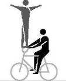

**2276** 

Page **1** / **60** 

Allée Ferdi Kübler 12 1860 Aigle Switzerland 

T: +41 24 468 58 11 E: admin@uci.ch 

## **Reg. seat / Handlebar handstand** 

**Reg. seat / Handlebar handstand 2277 a** Seat on the saddle, chest directed to the handlebar, feet on **2277 b** the pedals. / Handstand with both hands on the handlebargrips, arms stretched, legs closed and stretched straight upwards. Headstands, shoulderstands and handstands on one bicycle **8.2.031 Reg. seat / Handlebar support straddle handlebar 2277 c handstand 2277 d** 

Seat on the saddle, chest directed to the handlebar, feet on the pedals / From handlebar support straddle, which has to be performed for at least 2 meters, with stretched legs and stretched arms directly to the handstand. The handstand has to be performed as described in **2277a-b.** The way of stretch of HC. or C. starts in the position of the handlebar handstand. L-shape hold, scales and straddles **8.2.025** Headstands, shoulderstands and handstands on one bicycle **8.2.031 Reg. seat rev. / Shoulderseat 2281** Seat on the saddle, back directed to the handlebar, feet on **2282** the pedals. / Seat on the partner’s shoulders. Stands and shoulderseats on one bicycle **8.2.030 Reg. seat rev. / Shoulderstand 2283** Seat on the saddle, back directed to the handlebar, feet on the pedals. / Stand with feet on the partner’s shoulders. Stands and shoulderseats on one bicycle **8.2.030 Reg. seat rev. / Chest suspended hang 2285** Seat on the saddle, back directed to the handlebar, feet on **2286** the pedals. / Hanging with chest-grip on the partner’s back, head downwards, upwards stretched and closed legs in straight line with the body. **Handlebarseat / Stand on pins; Saddlestand 2296 a-d:** Seat on the handlebar, back directed to the saddle. The free leg stretched forward, horizontally. Other foot on the down tube. / Stand with feet each on a rear-pin. Both knees behind the saddle. **e-h:** Like **a-d** until slash / Stand with feet on the saddle. Stands and shoulderseats on one bicycle **8.2.030 Handlebarseat rev. / Stand on pins 2301** 

## **Handlebarseat rev. / Stand on pins** 

Seat on the handlebar, chest directed to the saddle, feet on the pedals. / Stand with feet each on a rear-pin. Both knees behind the saddle. 

Page **2** / **60** 

Allée Ferdi Kübler 12 1860 Aigle Switzerland 

T: +41 24 468 58 11 E: admin@uci.ch 

**Handlebarseat rev. / Saddle handlebarstand; 2302 Saddlestand a-d:** Seat on the handlebar, chest directed to the saddle, feet on the pedals. / Stand with one foot on the saddle and with the other foot on the handlebar. **e-h:** Like **a-d** until slash / Stand with both feet on the saddle. Stands and shoulderseats on one bicycle **8.2.030 Handlebarseat rev. / Shoulderseat 2303** Seat on the handlebar, chest directed to the saddle, feet on the pedals. / Seat on the partner’s shoulders. Stands and shoulderseats on one bicycle **8.2.030 Handlebarseat rev. / Shoulderstand 2304** Seat on the handlebar, chest directed to the saddle, feet on the pedals. / Stand with feet on the partner’s shoulders. Stands and shoulderseats on one bicycle **8.2.030 Handlebarseat rev. / Chest suspended hang 2305** Seat on the handlebar, chest directed to the saddle, feet on the pedals. / Hanging with chest-grip on the partner’s back, head downwards, upwards stretched and closed legs in straight line with the body. **Handlebarseat rev. / Headstand 2306** Seat on the handlebar, chest directed to the saddle, feet on the pedals. / Headstand on the saddle, both hands on the handlebar. Legs closed and stretched straight upwards. Headstands, shoulderstands and handstands on one bicycle **8.2.031 Frontstand / Stand on pins; Saddlestand 2311 a-d:** Stand in front of the handlebar, back directed to the saddle. One foot on the front-pin, other foot on the down tube. / Stand with feet each on a rear-pin. Both knees behind the saddle. **e-h:** Like **a-d** until slash / Stand with feet on the saddle. Stands and shoulderseats on one bicycle **8.2.030 Split / Shoulderseat 2316** 

## **Split / Shoulderseat** 

Left foot standing on the left rear-pin, right foot standing on the right front-pin (or counterwise). Chest directed to the handlebar, without touching the handlebar with the leg. / Seat on the partner’s shoulders. Stands and shoulderseats on one bicycle **8.2.030** 

Page **3** / **60** 

Allée Ferdi Kübler 12 1860 Aigle Switzerland 

T: +41 24 468 58 11 E: admin@uci.ch 

**Sidestand / Sidestand, Ring grip 2317** Stand with one foot on the left rear-pin, other foot on the left front-pin (or counterwise). Chest directed to the handlebar, without touching the handlebar with the leg. / Similar stand on the opposite side of the bicycle. Partners are connected by hand-in-hand grip to a ring, with stretched arms. **Stand bent on saddle / Stand bent on handlebar rev. 2319** Stand with one foot on the saddle, trunk bent-forward to the handlebar, free leg stretched backwards. / Stand with one foot on the handlebar, trunk bent-forward to the saddle, free leg stretched in moving direction, one hand on the saddle, other hand on the handlebar. Straight line **8.2.023 Frameseat / Stand bent on saddle 2321** Pushing one foot through the frame and placing the foot on the front-pin. Free leg stretched forward, seat in the frame. / Stand with one foot on the saddle, trunk bent-forward to the handlebar, free leg stretched backwards. Straight line **8.2.023 Frameseat / Saddle handlebarstand; Saddlestand 2322 a-b:** Pushing one foot through the frame and placing the foot on the front-pin. Free leg stretched forward, seat in the frame. / Stand with one foot on the saddle and the other foot on the handlebar. **c-d:** Like **a-b** until slash / Stand with feet on the saddle. Stands and shoulderseats on one bicycle **8.2.030 Frameseat / Saddle support scale 2323** Pushing one foot through the frame and placing the foot on the front-pin. Free leg stretched forward, seat in the frame. / One hand on the saddle, elbow supporting the body, other hand on the handlebar (handlebar-grip may be used as support for the forearm). Head in moving-direction, legs stretched backwards. L-shape hold, scales and straddles **8.2.025 2331** 

## **Fronthang / Stand bent on saddle** 

Both hands behind the back on the handlebar, front wheel between the legs, feet on the pedals. / Stand with one foot on the saddle, trunk bent-forward to the handlebar, free leg stretched backwards. Straight line **8.2.023** 

## **Fronthang / Saddle handlebarstand; Saddlestand** 

**a-b:** Both hands behind the back on the handlebar, front wheel between the legs, feet on the pedals. / Stand with one foot on the saddle and the other foot on the handlebar. **c-d:** Like **a-b** until slash / Stand with feet on the saddle. Stands and shoulderseats on one bicycle **8.2.030** 

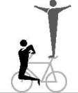

**----- Start of picture text -----** 
2332 **----- End of picture text -----** 

Page **4** / **60** 

Allée Ferdi Kübler 12 1860 Aigle Switzerland 

T: +41 24 468 58 11 E: admin@uci.ch 

**Fronthang / Headstand; Saddle handlebar handstand 2334 a-b:** Both hands behind the back, on the handlebar, front wheel between the legs, feet on the pedals. / Headstand on the saddle, both hands on the handlebar. Legs closed and stretched straight upwards. **c-d:** Like **a-b** until slash / Handstand with one hand on the handlebar and the other hand on the saddle. Arms stretched, legs closed and stretched straight upwards, without leaning against the handlebar-grip with the forearm or wrist. Stands and shoulderseats on one bicycle **8.2.030** Headstands, shoulderstands and handstands on one bicycle **8.2.031 Backhang / Stand on pins 2341** In front of the headtube hanging on the handlebar, chest directed to the saddle, frame between the legs, feet on the pedals. / Stand with feet each on a rear-pin. Both knees behind the saddle. Stands and shoulderseats on one bicycle **8.2.030 Backhang / Saddle handlebarstand; Saddlestand 2342 a-b:** In front of the headtube hanging on the handlebar, chest directed to the saddle, frame between the legs, feet on the pedals. / Stand with one foot on the saddle and the other foot on the handlebar. **c-d:** Like **a-b** until slash / Stand with feet on the saddle. Stands and shoulderseats on one bicycle **8.2.030 Backhang / Handlebarstand 2343** In front of the headtube hanging on the handlebar, chest directed to the saddle, frame between the legs, feet on the pedals. / Stand with feet on the handlebar-grips. Stands and shoulderseats on one bicycle **8.2.030 Backhang / Headstand; Saddle handlebar handstand 2346 a-b:** In front of the headtube hanging on the handlebar, chest directed to the saddle, frame between the legs, feet on the pedals. / Headstand on the saddle, both hands on the handlebar. Legs closed and stretched straight upwards. **c-d:** Like **a-b** until slash / Handstand with one hand on the handlebar and the other hand on the saddle. Arms stretched, legs closed and stretched straight upwards, without leaning against the handlebar-grips with the forearm or wrist. Headstands, shoulderstands and handstands on one bicycle **8.2.031 Lying on handlebar / Stand bent on saddle; Saddlestand 2351 a-b:** Lying with front of the body on the handlebar, head directed to the saddle, closed legs stretched horizontally in moving direction. / Stand with one foot on the saddle, trunk bent-forward directed to the handlebar, free leg stretched backwards. **c-d:** Like **a-b** until slash / Stand with feet on the saddle. Straight line **8.2.023** Stands and shoulderseats on one bicycle **8.2.030** 

Page **5** / **60** 

Allée Ferdi Kübler 12 1860 Aigle Switzerland 

T: +41 24 468 58 11 E: admin@uci.ch 

**Lying on saddle / Handlebarstand; Handlebar 2352 handstand a-b:** Lying with front of the body on the saddle, closed legs stretched horizontally backwards. / Stand with feet on the handlebar-grips. **c-d:** Like **a-b** until slash / Handstand with both hands on the handlebar-grips. Arms stretched, legs closed and stretched straight upwards. Stands and shoulderseats on one bicycle **8.2.030** Headstands, shoulderstands and handstands on one bicycle **8.2.031 Waterscale / Stand bent on saddle; Saddlestand 2353 a-b:** Lying with back of the body in a straight line on the handlebar, stretched legs or feet under the saddle. / Stand with one foot on the saddle, trunk bent-forward to the handlebar, free leg stretched backwards. **c-d:** Like **a-b**: until slash / Stand with feet on the saddle. Straight line **8.2.023** Stands and shoulderseats on one bicycle **8.2.030 Saddle handlebarstand / Saddle handlebarstand 2356** Both stand with one foot on the saddle and the other foot on the handlebar. Stands and shoulderseats on one bicycle **8.2.030 Saddle handlebarstand / Stand on pins; Saddlestand; 2357 Handlebarstand a-b:** Stand with one foot on the saddle and the other foot on the handlebar. / Stand with feet each on a rear-pin. Both knees behind the saddle. **c-d:** Like **a-b** until slash / Stand with feet on the saddle. **e-f:** Like **a-b**: until slash / Stand with feet on the handlebar-grips. Stands and shoulderseats on one bicycle **8.2.030 Handlebarstand / Stand on pins 2358 a** Stand with feet on the handlebar-grips. / Stand with feet each **2358 b** on a rear-pin. Both knees behind the saddle. **2358 g g-h:** The rider jumps from regular seat to the **2358 h** fronthandlebarstand; further according to **a-b**. Stands and shoulderseats on one bicycle **8.2.030** 

Page **6** / **60** 

Allée Ferdi Kübler 12 1860 Aigle Switzerland 

T: +41 24 468 58 11 E: admin@uci.ch 

|**Handlebarstand-turn ½ to multiple (T) / Stand on pins**|**2358 c**|
|---|---|
|From one turn a tactical enlargement of the handlebarstand|**2358 d**|
|turn(s) is possible up to four half-turns in maximum.|**2358 e**|
|**c-f:** From the respective handlebarstand with half or|**2358 f**|
|multiple front wheel turn(s) to the fronthandlebarstand or|**2358 i**|
|handlebarstand reverse. After the last turn, the end position|**2358 j**|
|has to be held for at least 2 meters. / Stand with feet each on|**2358 k**|
|a rear-pin. Both knees behind the saddle, during the complete|**2358 l**|
|sequence of the figure.||
|**i-l:** The rider jumps from regular seat to the||
|fronthandlebarstand; further according to**c-f.**||
|Stands and shoulderseats on one bicycle**8.2.030**||
|**Handlebarstand / Saddlestand**|**2359**|
|**a-b:** Stand with feet on the handlebar-grips. / Stand with||
|feet on the saddle. Riders are connected by hand-in-hand||
|grip connection to a ring with stretched arms.||
|**c-f:** Like**a-b**but without grip-connection.||
|Stands and shoulderseats on one bicycle**8.2.030**||
|**Handlebar L-shape hold / Stand on pins; Saddlestand;**|**2366 a**|
|**Saddle support straddle**|**2366 b**|
|**a-b:** Arms stretched, hands placed on the handlebar-|**2366 c**|
|grips, legs stretched, back directed to the saddle. / Stand with|**2366 d**|
|feet each on a rear-pin. Both knees behind the saddle.|**2366 e**|
|**c-d:** Like**a-b**until slash / Stand with feet on the saddle.|**2366 f**|
|**e-f:** Like**a-b**until slash / Arms stretched, hands placed||
|on the saddle. Legs horizontally stretched, straddled on the||
|outside of the arms, without touching the partner or the||
|handlebar.||
|L-shape hold, scales and straddles**8.2.025**||
|Stands and shoulderseats on one bicycle**8.2.030**||
|**Handlebar support straddle / Saddle support straddle**|**2366 g**|
|Arms stretched, hands placed on the handlebar-grips. Legs|**2366 h**|
|stretched, straddled on the outside of the arms. / Arms||
|stretched, hands placed on the saddle. Legs stretched,||
|straddled on the outside of the arms, without touching the||
|partner or the handlebar.||
|L-shape hold, scales and straddles**8.2.025**||
|**Headstand / Handlebarstand**|**2371**|
|Headstand on the saddle, both hands on the handlebar. Legs||
|closed and stretched straight upwards. / Stand with feet on||
|the handlebar-grips.||
|Stands and shoulderseats on one bicycle**8.2.030**||
|Headstands, shoulderstands and handstands on one bicycle||
|**8.2.031**||

Page **7** / **60** 

Allée Ferdi Kübler 12 1860 Aigle Switzerland 

T: +41 24 468 58 11 E: admin@uci.ch 

|**Headstand / Frame shoulderstand**|**2372**|
|---|---|
|Headstand on the saddle, both hands on the handlebar. Legs||
|closed and stretched straight upwards. / Shoulderstand with||
|one shoulder on the crossbar, boths hands on the handlebar.||
|Legs closed and stretched straight upwards.||
|Headstands, shoulderstands and handstands on one bicycle||
|**8.2.031**||
|**Headstand / Handlebar support straddle**|**2373**|
|Headstand on the saddle, both hands on the handlebar. Legs||
|closed and stretched straight upwards. / Arms stretched,||
|hands placed on the handlebar-grips. Legs horizontally||
|stretched, straddled on the outside of the arms.||
|L-shape hold, scales and straddles**8.2.025**||
|Headstands, shoulderstands and handstands on one bicycle||
|**8.2.031**||
|**Headstand / Handlebar handstand**|**2374 a**|
|Headstand on the saddle, both hands on the handlebar. Legs|**2374 b**|
|closed and stretched straight upwards. / Handstand with both|**2374 c**|
|hands on the handlebar-grips. Arms stretched, legs closed|**2374 d**|
|and stretched straight upwards.||
|Headstands, shoulderstands and handstands on one bicycle||
|**8.2.031**||
|**Headstand / Handlebar support straddle handlebar**|**2374 e**|
|**handstand**|**2374 f**|
|Headstand on the saddle, both hands on the handlebar. Legs|**2374 g**|
|closed and stretched straight upwards. / From handlebar|**2374 h**|
|support straddle, which has to be performed for at least 2||
|meters (partner in headstand), with stretched legs and||
|stretched arms directly to the handstand. The handstand has||
|to be performed as described in**2374a-d.**The way of stretch||
|of HC., C., S or 8 starts in the position of the handlebar||
|handstand.||
|L-shape hold, scales and straddles**8.2.025**||
|Headstands, shoulderstands and handstands on one bicycle||
|**8.2.031**||
|**Saddle handlebar handstand / Handlebarstand**|**2376 a**|
|Handstand with one hand on the handlebar and other hand|**2376 b**|
|on the saddle. Arms stretched, legs closed and stretched||
|straight upwards without leaning against the handlebar-grip||
|with the forearm or wrist. / Stand with feet on the handlebar-||
|grips.||
|Stands and shoulderseats on one bicycle**8.2.030**||
|Headstands, shoulderstands and handstands on one bicycle||
|**8.2.031**||
|**Handlebar handstand / Saddlestand**|**2376 c**|
|Handstand with both hands on the handlebar-grips. Arms|**2376 d**|
|stretched, legs closed and stretched straight upwards. / Stand||
|with feet on the saddle.||
|Stands and shoulderseats on one bicycle**8.2.030**||
|Headstands, shoulderstands and handstands on one bicycle||
|**8.2.031**||

Page **8** / **60** 

Allée Ferdi Kübler 12 1860 Aigle Switzerland 

T: +41 24 468 58 11 E: admin@uci.ch 

**Handlebar handstand / Saddle handlebar handstand 2377** Handstand with both hands on the handlebar-grips. Arms stretched, legs closed and stretched straight upwards. / Handstand with one hand on the handlebar and the other hand on the saddle. Arms stretched, legs closed and stretched straight upwards, without leaning against handlebar-grip with the forearm or wrist. Headstands, shoulderstands and handstands on one bicycle **8.2.031** 

## **Lying on saddle / Headstand** 

**2378a** 

Lying with front of the body on the saddle, closed legs stretched horizontally backwards. 

Headstand on the back of the rider performing lying on saddle, both hands on the handlebar. Legs closed and stretched straight upwards. Straight Line **8.2.023** 

Exception: Headstands, shoulderstands and handstands on one bicycle **8.2.031** does not apply in this case. 

## **Stillstand on pedals / Shoulderseat, Shoulderstand** 

**a-b:** Stand with feet, solely on the pedals, back directed to the saddle. The stillstand has to be performed for at least 3 seconds. / Seat on the partner’s shoulders. 

**c-d:** Like **a-b** until slash / Stand with feet on the partner’s shoulders. 

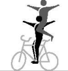

**2391** 

Stillstands and handstand bicycle lying down **8.2.027** Stands and shoulderseats on one bicycle **8.2.030** 

_(text modified on 01.01.16; 01.01.17; 01.01.20; 01.01.27)_ 

Page **9** / **60** 

Allée Ferdi Kübler 12 1860 Aigle Switzerland 

T: +41 24 468 58 11 E: admin@uci.ch 

## **§ 3 Artistic Cycling Team 4** 

**8.3.014** Artistic Cycling Team 4 **4 f.e.o. half circle / circle 4001** All riders have to ride, following each other, a **4002** half circle / a circle. **4003 4004** Half circle **(8.2.043)** Circle **(8.2.042)** A **4 f.e.o. half circle / circle 4 s.r.l.** 4001 c-d During the figure, each rider has to 4002 c-d perform a single ring left. 4003 e-f 4003 g-h Single ring left **(8.2.053)** 4004 c-d B **4 f.e.o. half circle / circle 4 s.r.r.** 4001 e-f During the figure, each rider has to 4004 e-f perform a single ring right. Single ring right **(8.2.054)** C **4 f.e.o. half circle / circle 2 s.r.l. 2** 4001 g-h **s.r.r.** 4004 g-h During the figure, two riders have to perform each a single ring left and two riders have to perform each a single ring right. The riders who ride on the same axis have to perform the same type of single ring. Single ring left **(8.2.053)** Single ring right **(8.2.054)** 

**4 alternate rings overlapping 4001i** All riders have to ride with equal distances between each other and at same **4002e** distances to the middle circle, outside of the middle circle. **4005a** During the figure, each rider has to perform an alternate ring. Each second ring has to overlap with the first ring of the rider riding behind or riding ahead. 

Alternate ring **(8.2.058)** 

Page **10** / **60** 

Allée Ferdi Kübler 12 1860 Aigle Switzerland 

T: +41 24 468 58 11 E: admin@uci.ch 

## **4 f.e.o. diagonal pull** 

All riders have to ride, following each other, performing a diagonal pull. 

Diagonal pull **(8.2.068)** 

- A **4 f.e.o. diagonal pull 2 s.r.l. 2 s.r.r.** During the figure, two riders have to perform each a single ring left and two riders have to perform each a single ring right. Rider 1 and 3 and rider 2 and 4 have to perform the same type of single ring. 

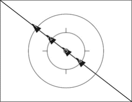

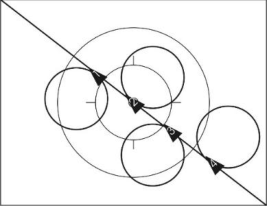

**----- Start of picture text -----** 
4006 **----- End of picture text -----** 

4006 b 

Single ring left **(8.2.053)** Single ring right **(8.2.054)** 

## **4 f.e.o. half eight (S)** 

All riders have to ride, following each other, performing a half eight (S). 

Half eight **(8.2.045)** 

## **4 f.e.o. eight (8)** 

All riders have to ride, following each other, performing an eight (8). 

## Eight **(8.2.044)** 

## **4 f.e.o. eight through** 

All riders have to ride, following each other, around a spot on a half of the competition surface (starting position). 

Rider 1 and 3 have to perform an eight without changing the distances between each other. After completing the eight they have to circle the spot at least once. 

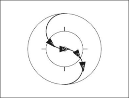

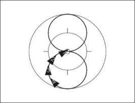

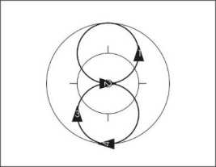

**4007 a 4008 a 4010 a** 

**4007 b 4008 b 4010 b** 

**4007 c 4008 c 4010 c** 

Rider 2 and 4 have to circle the spot at least 

once. After circling the spot, they perform an eight without changing the distance between each other. 

**End of figure:** When all riders have reached the starting position again. 

## Eight **(8.2.044)** 

Page **11** / **60** 

Allée Ferdi Kübler 12 1860 Aigle Switzerland 

T: +41 24 468 58 11 E: admin@uci.ch 

**4011** 

## **4 f.e.o. longline** 

All riders have to ride, following each other, performing a longline. 

## Longline **(8.2.066)** 

|A **4 f.e.o. longline 2 s.r.l. 2 s.r.r.**|4011 b|
|---|---|
|During the figure, two riders have to perform each a single ring left||
|and two riders have to perform each a single ring right. Rider 1 and||
|3 and rider 2 and 4 have to perform the same type of single ring.||
|Single ring left**(8.2.053)**||
|Single ring right**(8.2.054)**||
|**2 f.e.o. longline opposite direction**|**4012**|
|Each two riders have to ride, following each other, performing a longline||
|opposite direction.||
|Longline opposite direction**(8.2.067)**||
|A **2 f.e.o. longline opposite direction 2 mills**|4012 b|
|During the figure, two mills have to be performed. At the moment that||
|all riders are on the same level, they have to connect into two mills.||
|2 mills**(8.2.071)**||
|**2 n.e.o. longline opposite direction**|**4013**|
|Each two riders have to ride, next to each other, without grip connection||
|performing a longline opposite direction.||

## Longline opposite direction **(8.2.067)** 

|A|**2 n.e.o. longline opposite direction 4 s.r.l.**|4013 b|
|---|---|---|
||During the figure, each rider has to perform a single ring left.||
||Single ring left**(8.2.053)**||
|B|**2 n.e.o. longline opposite direction through**|4013 c|
||After half of the way of stretch one rider of each group has to ride||
||through the space between the two other riders.||
|C|**2 n.e.o. longline opposite direction through 4 s.r.l.**|4013 d|
||After half of the way of stretch one rider of each group has to ride||
||through the space between the two other riders. During the figure,||
||each rider has to perform a single ring left.||
||Single ring left**(8.2.053)**||

Page **12** / **60** 

Allée Ferdi Kübler 12 1860 Aigle Switzerland 

T: +41 24 468 58 11 E: admin@uci.ch 

- D **2 n.e.o. longline opposite direction through 4 s.r.r.** 4013 e After half of the way of stretch one rider of each group has to ride through the space between the two other riders. During the figure, each rider has to perform a single ring right. 

## Single ring right **(8.2.054)** 

- E **2 n.e.o. longline opposite direction through 2 mills** After half of the way of stretch one rider of each group has to ride through the space between the two other riders. During the figure, two mills have to be performed. At the moment that all riders are on the same level, they have to connect into two mills. 

4013 f 

## 2 mills **(8.2.071)** 

## **2 f.e.o diagonal pull opposite direction** 

**4014** 

Each two riders have to ride, following each other, performing a diagonal pull opposite direction. 

Diagonal pull opp. dir. **(8.2.069)** 

## **4 n.e.o. half shortline alternate ring** 

**4 n.e.o. half shortline alternate ring 4015 a** All riders have to ride, next to each other, **4016 a** without grip connection on a common axis which runs parallel to the long side of the competition surface to the other side. Each rider has to perform a half alternate ring. 

Half alternate ring **(8.2.057)** 

**4 n.e.o. shortline alternate ring 4015 b** All riders have to ride, next to each other, **4016 b** without grip connection on a common axis which runs parallel to the long side of the competition surface. Each rider has to perform an alternate ring. 

Alternate ring **(8.2.058)** 

**4 n.e.o. shortline 4017** All riders have to ride, next to each other, **4018** without grip connection performing a shortline. Shortline **(8.2.064)** 

Page **13** / **60** 

Allée Ferdi Kübler 12 1860 Aigle Switzerland 

T: +41 24 468 58 11 E: admin@uci.ch 

A **4 n.e.o shortline 4 s.r.l.** 4017 b During the figure, each rider has to 4018 b perform a single ring left. 

Single ring left **(8.2.053)** 

**2 con wingmill HD. spinnings (T) / 2 con. 4024 a wingmill spinnings (T) 4024 b** 

All riders have to perform a 2 connected wingmill. During the figure, each rider has to perform 50cm-spinnings on a common axis which runs through the inner circle. 

2 con. wingmill **(8.2.072)** 50cm-spinnings **(8.2.046)** 

## **Remmlinger spinnings (T)** 

All riders have to form the grip connection of a 2 connected wingmill and have to release the grip connection in motion, then all riders have to perform 50cm-spinnings on the longitudinal axis or on the transversal axis. After completing the 50cm-spinnings the inside riders have to grip each other with their left hands above the inner circle and have to 

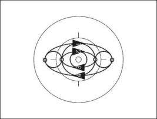

**4024 c** 

perform one mill. Then they release the grip connection again and all riders perform one 50cm-spinning (360°) on a common axis. The outside riders have to perform the 50cm-spinnings continuously. All spinnings have to be performed on the same axis. 

The tactical enlargement has to be awarded after all grip connections have been closed within 2 meters after all 50cm-spinnings. 

**End of figure:** At the moment that all riders have reached the grip connection to the position 2 mills, simultaneously. 

2 con. wingmill **(8.2.072)** 50cm-spinnings **(8.2.046)** 2 mills **(8.2.071)** 

Page **14** / **60** 

Allée Ferdi Kübler 12 1860 Aigle Switzerland 

T: +41 24 468 58 11 E: admin@uci.ch 

**2 f.e.o. half double circle / double circle 4026** Two riders each have to ride, with same **4027** distances, following each other, a half circle / **4028** a complete circle around a common point, **4029** thus they form a group of riders. The points are located on the longitudinal or transversal axis with equal distances to the inner circle. One rider of each group has to ride with a rider on the other half of the competition surface on 

a common axis which runs parallel to the long side of the competition surface. The diameter of each half double circle / double circle has to be at least 4 meters. 

A **2 f.e.o. half double circle / double** 4026 d-e **circle 4 s.r.l.** 4027 d-e During the figure, each rider has to 4028 g-h perform a single ring left. 4028 j-k 4029 d-e Single ring left **(8.2.053)** B **2 f.e.o. double circle through** 4026 c During the figure, each rider has to ride through the space between 4027 c the other group of riders. 4028 c 4028 f 4029 c C **2 f.e.o. double circle through 4 s.r.l.** 4026 f During the figure, each rider has to ride through the space between 4027 f the other group of riders. During the figure, each rider has to perform 4028 i a single ring left. 4028 l 4029 f Single ring left **(8.2.053)** 

**2 f.e.o. shortline 4031** Two riders each have to ride, following each **4032** other, without grip connection performing a shortline, next to each other. Shortline **(8.2.064)** A **2 f.e.o. shortline 4 s.r.l.** 4031 b During the figure, each rider has to 4032 b perform a single ring left. 

Single ring left **(8.2.053)** 

Page **15** / **60** 

Allée Ferdi Kübler 12 1860 Aigle Switzerland 

T: +41 24 468 58 11 E: admin@uci.ch 

## B 

**2 f.e.o. shortline 2 s.r.l. 2 s.r.r.** 4031 c During the figure, two riders have to perform each a single ring left 4032 c and two riders have to perform each a single ring right. Rider 1 and 3 and rider 2 and 4 have to perform the same type of a single ring. 

Single ring left **(8.2.053)** Single ring right **(8.2.054)** 

|**2 n.e.o. shortline opposite direction**|**2 n.e.o. shortline opposite direction**|**4044 a-e**|
|---|---|---|
|Two riders each have to ride, next to each||**4045 a-c**|
|other, without grip connection performing a|||
|shortline opposite direction.|||
|Shortline opposite direction**(8.2.065)**|||
|A|**2 n.e.o. shortline opposite direction**|4044 b|
||**4 s.r.l.**|4045 c|
||During the figure, each rider has to||
||perform a single ring left.||
||Single ring left**(8.2.053)**||
|B|**2 n.e.o. shortline opposite direction**|4044 c|
||**through**|4045 b|
||After half of the way of stretch one rider||
||of each group has to ride through the||
||space between the two other riders.||
|C|**2 n.e.o. shortline opposite direction**|4044 d|
||**through 4 s.r.l.**||
||After half of the way of stretch one rider||
||of each group has to ride through the||
||space between the two other riders.||
||During the figure, each rider has to||
||perform a single ring left.||
||Single ring left**(8.2.053)**||
|D|**2 n.e.o. shortline opposite direction through 2 mills**|4044 e|
||After half of the way of stretch one rider of each group has to ride||
||through the space between the two other riders. During the figure||
||two mills have to be performed. At the moment that all riders are on||
||the same level, they have to connect into two mills.||
||2 mills**(8.2.071)**||

Page **16** / **60** 

Allée Ferdi Kübler 12 1860 Aigle Switzerland 

T: +41 24 468 58 11 E: admin@uci.ch 

## **2 n.e.o. half shortline opposite direction alternate ring** 

Two riders each have to ride, next to each other, without grip connection performing a half shortline opposite direction alternate ring. 

Half alternate ring **(8.2.057)** Half shortline opp. dir. alternate ring **(8.2.059)** 

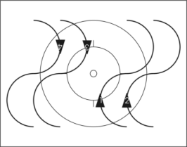

**4044 f 4045 d 4048 a** 

**2 n.e.o. shortline opposite direction 4044 alternate ring 4045** Two riders each have to ride, next to each **4048 b** other, without grip connection performing a shortline opposite direction alternate ring. 

Alternate ring **(8.2.058)** Shortline opp. dir. alternate ring **(8.2.060)** 

## **2 n.e.o. shortline opposite direction alternate ring through** 

**4044 h** 

Two riders each have to ride, next to each other, without grip connection performing a shortline opposite direction alternate ring. During the figure, one rider each has to ride through the space between the two other riders. At that moment all riders have to be situated on the longitudinal axis (= crossing). 

Alternate ring **(8.2.058)** Shortline opp. dir. a.r. **(8.2.060)** 

## **2 n.e.o. shortline opposite direction alternate ring through (T)** 

**4048 c** 

Two riders each have to ride, next to each other, without grip connection performing a shortline opposite direction alternate ring. During the figure, one rider each has to ride through the space between the two other riders. At that moment all riders have to be situated on the longitudinal axis (= crossing). 

The tactical enlargement has to be awarded after all riders have crossed within the middle circle. For each crossing a tactical enlargement is possible. 

Alternate ring **(8.2.058)** Shortline opp. dir. alternate ring **(8.2.060)** 

## **2 con. half circle / circle** 

**2 con. half circle / circle 4071** Two riders each have to ride, next to each **4072** other, and are connected by a grip connection, **4073** thus they form a pair of riders. Both pairs have **4074** to ride a half circle / circle, following each other. 

Half circle **(8.2.043)** 

Circle **(8.2.042)** 

Page **17** / **60** 

Allée Ferdi Kübler 12 1860 Aigle Switzerland 

T: +41 24 468 58 11 E: admin@uci.ch 

A **2 con. half circle / circle 2 con. s.r.l.** 4071 c-d During the figure, each pair of riders 4072 c-d have to perform a 2 connected single 4073 e-h ring left. 4074 c-d 2 con. single ring left **(8.2.055)** B **2 con. half circle / circle 4 s.r.l.** 4071 e-f During the figure, each rider has to 4072 e-f perform a single ring left. 4073 i-l 4074 e-f Single ring left **(8.2.053)** C **2 con. half circle / circle 4 s.r.l. through** 4073 m-p During the figure, each rider has to perform a single ring left. The 4074 g-h single rings left of the riders have to overlap. During the single rings one rider of each pair of riders has to ride through the space which is formed by the other pair of riders. 

## Single ring left through **(8.2.053)** 

|**2 con. f.e.o. longline**|**2 con. f.e.o. longline**|**4081**|
|---|---|---|
|Two riders each have to ride, next to each||**4082**|
|other, and are connected by a grip connection,|||
|thus they form a pair of riders. Both pairs have|||
|to perform a longline, following each other.|||
|Longline**(8.2.066)**|||
|A|**2 con f.e.o. longline 2 con. s.r.l.**|4081 b|
||During the figure, each pair of riders have to perform a 2 connected||
||single ring left.||
||2 con. single ring left**(8.2.055)**||
|B|**2 con. f.e.o. longline 2 con s.r.r.**|4081 c|
||During the figure, each pair of riders have to perform a 2 connected||
||single ring right.||
||2 con. single ring right**(8.2.056)**||
|C|**2 con. f.e.o. longline 4 s.r.l.**|4081 d|
||During the figure, each rider has to perform a single ring left.||
||Single ring left**(8.2.053)**||

Page **18** / **60** 

Allée Ferdi Kübler 12 1860 Aigle Switzerland 

T: +41 24 468 58 11 E: admin@uci.ch 

D **2 con. f.e.o. longline 2 s.r.l. 2 s.r.r.** During the figure, two riders each have to perform a single ring left and two riders each have to perform a single ring right. Rider 1 and 3 and rider 2 and 4 have to perform the same type of single ring. 

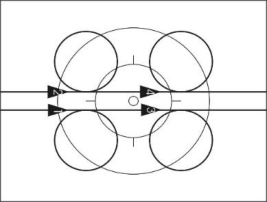

4082 b 

Single ring left **(8.2.053)** Single ring right **(8.2.054)** 

## **2 con. longline opposite direction** 

**4083** 

Two riders each have to ride, next to each other, and are connected by a grip connection, thus they form a pair of riders. Both pairs have to perform a longline opposite direction. 

Longline opposite direction **(8.2.067)** 

A **2 con longline opposite direction through 4 s.r.l.** During the figure, each rider has to perform a single ring left on the transversal axis. During the single ring left each pair has to ride through the space between the two other riders. 

4083 a 

Single ring left **(8.2.053)** 

## B **2 con. longline opposite direction through 4 s.r.r.** 

During the figure, each rider has to perform a single ring right on the transversal axis. During the single ring right, each pair has to ride through the space between the two other riders. 

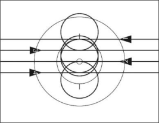

4083 b 

Single ring right **(8.2.054)** 

C **2 con. longline opposite direction through 2 mills** After half of the way of stretch, one rider each has to ride through the space between the two other riders. During the figure, two mills have to be performed. At the moment that all riders are on the same level, they have to connect into 2 mills. 

4083 c 

## 2 mills **(8.2.071)** 

**2 con. shortline 4086** Two riders each have to ride, next to each **4087** other, and are connected by a grip connection, **4088** thus they form a pair of riders. Both pairs have **4089** to perform a shortline. 

Shortline **(8.2.064)** 

Page **19** / **60** 

Allée Ferdi Kübler 12 1860 Aigle Switzerland 

T: +41 24 468 58 11 E: admin@uci.ch 

A **2 con. shortline 2 con. s.r.l.** 4086 b During the figure, each pair of riders 4087 b has to perform a 2 connected single 4088 c-d ring left. 4089 b 2 con. single ring left **(8.2.055)** 

B **2 con. shortline 2 con. s.r.r.** 4086 c During the figure, each pair of riders 4088 e has to perform a 2 connected single 4089 c ring right. 2 con. single ring right **(8.2.056)** 

C **2 con. shortline 4 s.r.l.** During the figure, each rider has to perform a single ring left. 

Single ring left **(8.2.053)** 

## **2 con. half shortline alternate ring** 

Two riders each have to ride, next to each other, and are connected by a grip connection, thus they form a pair of riders. Both pairs of riders, ride on a common axis which runs parallel to the long side of the competition surface, from the long side of the competition surface to the other side. Both pairs have to perform a half alternate ring. 

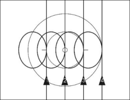

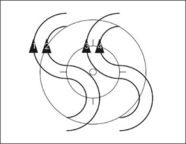

4086 d 4087 c 4088 f-g 4089 d 

**4096 a 4097 a 4098 a 4098 c 4099 a** 

Half alternate ring **(8.2.057)** 

## **2 con. shortline alternate ring** 

Two riders each have to ride, next to each other, and are connected by a grip connection, thus they form a pair of riders. Both pairs of riders, ride on a common axis which runs parallel to the long side of the competition surface and have to perform an alternate ring. 

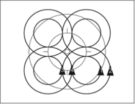

**4096 b 4097 b 4098 b 4098 d 4099 b** 

Alternate ring **(8.2.058)** 

Page **20** / **60** 

Allée Ferdi Kübler 12 1860 Aigle Switzerland 

T: +41 24 468 58 11 E: admin@uci.ch 

**2 con. shortline opposite direction 4105** Two riders each have to ride, next to each **4106** other, and are connected by a grip connection, **4107** thus they form a pair of riders. Both pairs **4108** perform a shortline opposite direction. Shortline opposite direction **(8.2.065)** A **2 con. shortline opposite direction 2** 4105 b **con. s.r.l.** 4106 b During the figure, each pair of riders 4107 c-d has to perform a 2 connected single ring left. 2 con. single ring left **(8.2.055)** B **2 con. shortline opposite direction 4** 4105 c **s.r.l.** 4106 c During the figure, each rider has to 4107 e-f perform a single ring left. 4108 b Single ring left **(8.2.053)** 

C **2 con. shortline opposite direction 2 s.r.l. 2 s.r.r.** During the figure, two riders have to perform each a single ring left and two riders have to perform each a single ring right. From each pair of riders one rider has to perform a single ring left and the other rider has to perform a single ring right. 

4108 c 

Single ring left **(8.2.053)** Single ring right **(8.2.054)** 

## **Surrounding 1 around 1** 

Two riders each are connected by hand-inhand-grip, thus they form a pair of riders. Both pairs of riders are on the same, imaginary axis, which runs through the inner circle or parallel to the long or short side of the competition surface. The distance between the pairs of riders has to be equal. One rider of each pair has to stand on a spot, without 

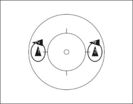

**4116 4117** 

pedalling, while the partner has to circle the standing rider completely. The way of riding has to be identical. 

Page **21** / **60** 

Allée Ferdi Kübler 12 1860 Aigle Switzerland 

T: +41 24 468 58 11 E: admin@uci.ch 

|**2 mills**|**2 mills**|**4121**|
|---|---|---|
|Two|riders each have to perform a mill.|**4122**|
|||**4123**|
|2 mills**(8.2.071)**||**4124**|
|A|**Two mills 4 s.r.r.**|4121 b|
||During the figure, each rider has to|4124 e|
||perform a single ring right.||
||Single ring right**(8.2.054)**||
|B|**Two mills spinnings (T)**|4124 d|
||During the figure, each rider has to||
||perform 50cm-spinnings.||
||50cm-spinnings**(8.2.046)**||
|**Two**|**insiderings**|**4133**|
|Two|riders each have to perform an insidering.|**4134**|
|2 insiderings**(8.2.074)**|||
|A|**Two insiderings 4 s.r.r.**|4134 d|
||During the figure, each rider has to perform a single ring right.||
||Single ring right**(8.2.054)**||
|B|**Two insiderings spinnings (T)**|4134 e|
||During the figure, each rider has to||
||perform 50cm-spinnings.||
||50cm-spinnings**(8.2.046)**||

Page **22** / **60** 

Allée Ferdi Kübler 12 1860 Aigle Switzerland 

T: +41 24 468 58 11 E: admin@uci.ch 

**Two outsiderings 4135** Two riders each have to perform an outsidering. **4136** 

## 2 outsiderings **(8.2.077)** 

A **Two outsiderings 4 s.r.r.** 4136 d During the figure, each rider has to perform a single ring right. Single ring right **(8.2.054)** B **Two outsiderings spinnings (T)** 4136 e During the figure, each rider has to perform 50cm-spinnings. 50cm-spinnings **(8.2.046) 4 con. half circle / circle 4151** All riders are connected by a grip connection **4152** and have to ride, next to each other, on an **4153** imaginary axis which runs through the inner **4154** circle, a half circle / circle. Half circle **(8.2.043)** Circle **(8.2.042)** A **4 con. half circle / circle 2 con. s.r.l.** 4151 c-d During the figure, the grip connection 4152 c-d between rider 2 and 3 has to be 4153 e-h released. Thus, two pairs of riders are 4154 c-d formed, and each pair has to perform a 2 connected single ring left. 2 con. single ring left **(8.2.055)** B **4 con. half circle / circle 4 s.r.l.** 4151 e-f During the figure, each rider has to 4152 e-f perform a single ring left. 4153 i-l 4154 e-f Single ring left **(8.2.053)** 

Page **23** / **60** 

Allée Ferdi Kübler 12 1860 Aigle Switzerland 

T: +41 24 468 58 11 E: admin@uci.ch 

|C|**4 con. half circle / circle spinnings**|4154 g-h|
|---|---|---|
||During the figure, each rider has to||
||perform 50cm-spinnings.||
||50cm-spinnings**(8.2.046)**||
|**4 con. shortline**||**4161**|
|All riders are connected by a grip connection||**4162**|
|performing a shortline, next to each other.||**4163**|
|||**4164**|
|Shortline**(8.2.064)**|||
|A|**4 con. shortline 2 con s.r.l.**|4161 b|
||During the figure, the grip connection|4162 b|
||between rider 2 and 3 has to be|4163 c-d|
||released. Thus, two pairs of riders are|4164 b|
||formed, and each pair has to perform a||
||2 connected single ring left.||
||2 con. single ring left**(8.2.055)**||
|B|**4 con. shortline 2 con. s.r.r.**|4161 c|
||During the figure, the grip connection|4162 c|
||between rider 2 and 3 has to be||
||released. Thus, two pairs of riders are||
||formed, and each has to perform a 2||
||connected single ring right.||
||2 con. single ring right**(8.2.056)**||
|C|**4 con. shortline 4 s.r.l.**|4161 d|
||During the figure, each rider has to|4162 d|
||perform a single ring left.|4163 e-f|
|||4164 c|
||Single ring left**(8.2.053)**||

Page **24** / **60** 

Allée Ferdi Kübler 12 1860 Aigle Switzerland 

T: +41 24 468 58 11 E: admin@uci.ch 

D **4 con. shortline 2 s.r.l. 2 s.r.r.** 4164 d During the figure, rider 1 and 2 have to perform each a single ring left. Rider 3 and 4 have to perform each a single ring right. Single ring left **(8.2.053)** Single ring right **(8.2.054)** E 4164 e 

## E **4 con. shortline spinnings** 

During the figure, each rider has to perform 50cm-spinnings. 

50cm-spinnings **(8.2.046)** 

## F **4 con. shortline 1 s.r.l around spinnings, 1 s.r.r, around spinnings** 

**4164 f** 

During the figure, rider 1 has to perform a single ring left around rider 2 who has to perform 50cm-spinnings. Simultaneously rider 4 has to perform a single ring right around rider 3 who has to perform 50cmspinnings. 

50cm-spinnings **(8.2.046)** Single ring left **(8.2.053)** Single ring right **(8.2.054)** 

## **Surrounding 3 around 1** 

**Surrounding 3 around 1 4171** All riders are connected by a grip connection. **4172** One rider has to stand on a spot, without **4173** pedalling, while the other riders have to circle **4174** the standing rider completely. The other three riders have to ride, next to each other on the same, imaginary axis, which runs through the standing rider. 

## **Coach half circle / circle** 

All riders have to ride around the middle circle. Rider 1 has to grip with the right hand to the left handlebar-grip of rider 2. 

Rider 2 has to grip with the left hand backwards to the right shoulder of rider 3. Rider 3 has to grip with the left hand forward to the right shoulder of rider 4. 

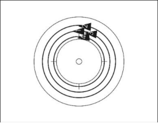

**4181** 

Rider 4 has to grip with the right hand to the left shoulder of rider 1. 

## Half circle **(8.2.043)** 

Circle **(8.2.042)** 

Page **25** / **60** 

Allée Ferdi Kübler 12 1860 Aigle Switzerland 

T: +41 24 468 58 11 E: admin@uci.ch 

**Coach raiser half circle / circle 4182** All riders have to ride around the middle circle. Rider 1 has to grip with the right hand to the right hand of rider 2. Rider 2 has to grip with the left hand to the right hand of rider 3. Rider 3 has to grip with the left hand to the right hand of rider 4. Rider 4 has to grip with the left hand to the left hand of rider 1. Half circle **(8.2.043)** Circle **(8.2.042) Snake half circle / circle 4183** All riders have to ride around the middle circle in a left-right position, shifted in steps to the back. Rider 1 has to grip with the right hand to the left handlebar-grip of rider 2. Rider 2 has to grip with the left hand to the right handlebar-grip of rider 3. Rider 3 has to grip with the right hand to the left handlebar-grip of rider 4. Rider 4 has to grip with both hands to the handlebar. 

Half circle **(8.2.043)** Circle **(8.2.042)** 

**Chain half circle / circle 4191** 

All riders have to ride around the middle circle in right-left position, shifted in steps to the back. Rider 1 has to grip with both hands to the own handlebar-grip. Rider 2 has to grip with the left hand the right shoulder of rider 1. Rider 3 has to grip with the right hand the left shoulder of rider 2. Rider 4 has to grip with the left hand the right shoulder of rider 3. 

Half circle **(8.2.043)** Circle **(8.2.042)** 

Page **26** / **60** 

Allée Ferdi Kübler 12 1860 Aigle Switzerland 

T: +41 24 468 58 11 E: admin@uci.ch 

## **Chain raiser half circle / circle 4192** 

All riders have to ride around the middle circle in right-left position, shifted in steps to the back. 

Rider 1 has to grip with the right hand to the right hand of rider 2. Rider 2 has to grip with the left hand to the left hand of rider 3. Rider 3 has to grip with the right hand the right hand of rider 4. The arms which are not connected have to be stretched sidewards. 

Half circle **(8.2.043)** Circle **(8.2.042)** 

**Saddlegrip half circle / circle 4196** All riders have to ride around the middle circle, **4197** shifted in steps to the back. Rider 1 has to grip with both hands to the handlebar. 

Rider 2 has to grip with the left hand to the saddle of rider 1. Rider 3 has to grip with the left hand to the saddle of rider 2. Rider 4 has to grip with the left hand to the saddle of rider 3. 

Half circle **(8.2.043)** Circle **(8.2.042)** 

A **Saddlegrip pass through** 4197 a Starting position is the saddlegrip. Rider 1 and 2 are connected by their left hands. Rider 2, 3, and 4 are still connected to each other by saddlegrip and have to pass rider 1 at the inside. Thus, the riders perform a pass through. 

**End of figure:** When the saddlegrip or saddlegrip-ring is reached (see figure 4198). 

Page **27** / **60** 

Allée Ferdi Kübler 12 1860 Aigle Switzerland 

T: +41 24 468 58 11 E: admin@uci.ch 

**Saddlegrip-ring 4198** All riders have to ride, following each other, **4199** around the inner circle. Rider 1 has to grip with the left hand to the saddle of rider 4. Rider 2 has to grip with the left hand to the saddle of rider 1. Rider 3 has to grip with the left hand to the saddle of rider 2. Rider 4 has to grip with the left hand to the saddle of rider 3. **End of figure:** After a complete drive around the inner circle. 

A **Saddlegrip-ring 4 s.r.r.** During the figure, each rider has to perform a single ring right. 

A **Saddlegrip-ring 4 s.r.r.** 4198 b During the figure, each rider has to perform a single ring right. Single ring right **(8.2.054) 2 con. wingmill 4211** All riders have to perform a 2 con. wingmill. **4212 4213** 2 con. wingmill **(8.2.072) 4214 4233 c** A **2 con. wingmill HD. 2 con. s.r.r. / 2** 4211 b-c **con. wingmill 2 con s.r.r.** 4212 b-c During the figure, the grip connection 4214 e-f between the inside riders has to be released. Each of the two pairs has to perform a 2 connected single ring right. 2 con. single ring right **(8.2.056)** B **2 con. wingmill HD. 4 s.r.r. / 2 con.** 4211 d-e **wingmill 4 s.r.r.** 4214 g-l 

During the figure, each rider has to perform a single ring right. Single ring right **(8.2.054)** 

Page **28** / **60** 

Allée Ferdi Kübler 12 1860 Aigle Switzerland 

T: +41 24 468 58 11 E: admin@uci.ch 

C **2 con. wingmill HD. mill with 2 s.r.r.** 4214 d During the figure, the two outside riders have to release their grip connections and have to perform each a single ring right. The two inside riders have to perform a mill. Mill **(8.2.070)** Single ring right **(8.2.054)** D **2 con. wingmill HD. mill with** 4233 c **spinnings (T)** 

During the figure, the two outside riders have to release their grip connections and have to perform 50cm-spinnings each, on a common axis which runs through the inner circle. The two inside riders have to perform a mill. 

50cm-spinnings **(8.2.046)** Mill **(8.2.070)** 

## **2 con. wingring** 

All riders have to perform a 2 connected wingring. 

2 con. wingring **(8.2.075)** 

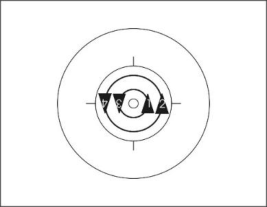

**4223 4224** 

## **2 con. wingmill mill with 2 f.e.o circle** 

The riders have to connect to the grip connection of a 2 connected wingmill. The two outside riders have to release their grip connections simultaneously and in motion and have to perform, following each other, one complete circle. The two inside riders have to perform a mill. 

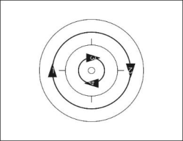

**4230 4231 4232 a-b 4233 a** 

**End of figure:** When the riders have reached 

the starting position simultaneously and in motion again. 

## Mill **(8.2.070)** Circle **(8.2.042)** 

Page **29** / **60** 

Allée Ferdi Kübler 12 1860 Aigle Switzerland 

T: +41 24 468 58 11 E: admin@uci.ch 

**2 con. wingring insidering with 2 f.e.o. 4232 c-d circle 4233 b** The riders have to connect to the grip connection of a 2 connected wingring. The two outside riders have to release their grip connections simultaneously and in motion and have to perform, following each other, one complete circle. The two inside riders have to perform an insidering. **End of figure:** When the riders have reached the starting position simultaneously and in motion again. Insidering **(8.2.073)** Circle **(8.2.042)** 

**Mill 4241** All riders have to perform a mill. **4242 4243** Mill **(8.2.070) 4244** A **Mill 4 s.r.r.** 4241 b During the figure, each rider has to 4244 d-e perform a single ring right. Single ring right **(8.2.054) Insidering around 1 4251** Three riders have to perform an insidering **4252** around the fourth rider. The fourth rider is connected by any grip with one of the three other riders and turns on the spot around his longitudinal axis, without pedalling. The figure has to be performed within the middle circle. 

Insidering **(8.2.073)** 

A **Insidering around 1 – 3 s.r.r. around spinnings** During the figure, the 3 Insidering-driving riders have to perform a single ring right simultaneously, while the 4[th] rider has to perform 50 cm spinnings within the middle circle. 50cm-spinnings **(8.2.046)** Single ring right **(8.2.054)** 

**4252 e** 

Page **30** / **60** 

Allée Ferdi Kübler 12 1860 Aigle Switzerland 

T: +41 24 468 58 11 E: admin@uci.ch 

**Insidering / Insidering (T) 4258** All riders have to perform an insidering. **4259** Insidering **(8.2.073) Ring with alternate grips / Ring with 4267 a alternate grips (T) 4267 c-f** All riders have to perform a ring with alternate **4268 a** grips. **4268 c-e** Ring with alternate grips **(8.2.078) Ring with alternate grips HD. / insidering 4267 b HD. 4268 b** Starting position is the ring with alternate grips. After a half drive all riders have to change their grip connection into the position insidering. The change of grips has to be performed simultaneously and in motion. **End of figure:** After a further half drive in the position insidering. Ring with alternate grips **(8.2.078)** Insidering **(8.2.073) Outsidering 4272 a-e** All riders have to perform an outsidering. **4273 a-c** Outsidering **(8.2.076) Outsidering HD. / insidering HD. 4272 f 4273 d** 

Starting position is the outsidering. After a half drive all riders have to change their grip connection into the position insidering. The change of grips has to be performed simultaneously and in motion. **End of figure:** After a further half drive in the position insidering. 

Outsidering **(8.2.076)** Insidering **(8.2.073)** 

Page **31** / **60** 

Allée Ferdi Kübler 12 1860 Aigle Switzerland 

T: +41 24 468 58 11 E: admin@uci.ch 

**Outsidering 4 s.r.r. 4273 e** All riders have to perform an outsidering. During the figure, each rider has to perfom a single ring right. Outsidering **(8.2.076)** Single ring right **(8.2.054) Door / synchronous door / opposite direction door simultaneously / 4280 Single-ring-door simultaneously 4281 a-e** Two riders have to form a door. **4282 Start of figure:** 2 meters before the first passing through the door. **4283 End of figure:** 2 meters after the last rider passing through. The door has **4284 a** to stand at least until the riders who are passing the door, have finished the **4285** total way of stretch. **4286 4287** Door **(8.2.079) 4290** A **Half door / door** 4280 a-b The two other riders have to ride, with 4281 a-b equal distances, following each other, 4282 a-d through the door each once (half door) 4283 a-b / each twice (door). These two riders have to ride around one of the two riders who are forming the door. B **Half synchronous door /** 4280 c-d **synchronous door** 4281 c-d The two other riders have to ride on a 4285 a-d common axis, which runs parallel to the 4286 a-b short or long side of the competition surface. Both riders have to pass through the door once (half synchronous door) / twice (synchronous door). These two riders have to ride each around one rider, who are forming the door. 

## C **Opposite direction door simultaneously** 

**Opposite direction door** 4280 e **simultaneously** 4281 e The two other riders have to ride each 4284 a around one of the two riders, who are 4287 a-b forming the door and they pass twice simultaneously through the space between the door. 

Page **32** / **60** 

Allée Ferdi Kübler 12 1860 Aigle Switzerland 

T: +41 24 468 58 11 E: admin@uci.ch 

## D **Single-ring-door simultaneously** 

4290 a 

One of the two other riders has to ride around one of the riders who are forming the door, performing two single rings left. The other rider has to ride around the other rider who is forming the door, performing two single rings right. Thus, both riders have to ride simultaneously through the space between the door. 

Single ring left **(8.2.053)** Single ring right **(8.2.054)** 

**Opposite direction door alternate rings 4281 f simultaneously 4298 a** 

Two riders have to form a door. 

The two other riders have to perform a counter single ring with same size and same form. They each pass twice and simultaneously the space between the door. Each of the alternate rings has to start on one half of the competition surface. The competition surface is divided by the longitudinal or transversal axis. 

**Start of figure:** At the latest 2 meters before the first passing through the door. 

**End of figure:** At the earliest 2 meters after the last rider passing through. The door has to stand at least until the riders who are passing the door, have reached the starting position again. 

## Door **(8.2.079)** 

Alternate ring **(8.2.058)** 

**Mill with half synchronous door / with synchronous door / with 4284 b opposite direction door simultaneously 4288** Two riders have to perform a mill. **4289** 

**Start of figure:** 2 meters before the first passing through the space which is formed by the mill. 

**End of figure:** 2 meters after the last rider passing through. The mill has to ride at least until the riders who are passing through the space, which is formed by the mill, have finished the total way of stretch. 

## Mill **(8.2.070)** 

A **Mill with half synchronous door** The two other riders are shifted a half way of their stretch, each on one half of the competition surface. Each rider is riding once through the space between the mill. The competition surface is split by the longitudinal or transversal axis. To pass the mill the own half of the competition surface may be left. 

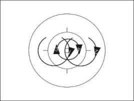

4288 a 

Page **33** / **60** 

Allée Ferdi Kübler 12 1860 Aigle Switzerland 

T: +41 24 468 58 11 E: admin@uci.ch 

B **Mill with synchronous door** 4288 b The two other riders are shifted a half 4289 a way of their stretch, each on one half of the competition surface. Each rider is riding twice through the space between the mill. The competition surface is split by the longitudinal or transversal axis. To pass the door, the own half of the competition surface may be left. C **Mill with opposite direction door** 4284 b 4289 b 

## C **Mill with opposite direction door simultaneously** 

The two other riders ride each around a point, passing twice simultaneously through the space which is formed by the mill. 

D **Mill with opposite direction door simultaneously (alternate mill) 4284 c** Two riders form a mill and the two other riders ride each around a point, passing once simultaneously through the space which is formed by the mill. Then they change position: the two other riders forming a mill, release the mill and ride each around a point, passing also once simultaneously through the space which is formed by the mill of the other two riders. 

Each rider has to perform 2 meters before the passing through the space which is formed by the mill and 2 meters after the passing through the space which is formed by the mill. The mill has to ride at least until the riders who are passing through the space, which is formed by the mill, have finished the total way of stretch. 

**Double door 4291 a** Three riders have to form a double door. **4292 a** The fourth rider has to pass each of the two **4293 a** spaces between the doors twice and alternately. 

**Start of figure:** 2 meters before the first passing through the double door. **End of figure:** 2 meters after the the last rider passing through. The double door has to 

stand at least until the rider who is passing the double door, has finished the total way of stretch. 

## Double door **(8.2.080)** 

Page **34** / **60** 

Allée Ferdi Kübler 12 1860 Aigle Switzerland 

T: +41 24 468 58 11 E: admin@uci.ch 

**Snake double door 4292 b** Three riders have to form a double door. **4294 a** The fourth rider has to pass each of the two spaces between the double door twice and has to change the moving direction each time he is passing the door. 

**Start of figure:** 2 meters before the first passing through the double door. **End of figure:** 2 meters after the last rider passing through. The double door has to stand at least until the rider who is passing the double door, has finished the total way of stretch. 

Double door **(8.2.080)** 

**Turbine double door counter direction 4293 b** 

Three riders have to perform a turbine. The fourth rider has to pass each of the two moving spaces between the turbine alternately. During the figure, both spaces have to be passed through at least twice. **Start of figure:** 2 meters before the first passing through the turbine. 

**End of figure:** 2 meters after the last rider 

passing through. The turbine has to ride at least until the rider who is passing the turbine, has finished the total way of stretch. 

Turbine **(8.2.081)** Counter direction **(8.2.036)** 

**Turbine snake double door counter direction 4294 b** Three riders have to perform a turbine. 

The fourth rider has to pass each of the two moving spaces between the turbine twice and has to change the moving direction each time he is passing through. 

**Start of figure:** 2 meters before the first passing through the turbine. **End of figure:** 2 meters after the last rider passing through. The turbine has to ride at least until the rider who is passing the turbine has finished the total way of stretch. 

Turbine **(8.2.081)** Counter direction **(8.2.036)** 

Page **35** / **60** 

Allée Ferdi Kübler 12 1860 Aigle Switzerland 

T: +41 24 468 58 11 E: admin@uci.ch 

**Alternate ring door 4296 a** Two riders have to form a door. **4297 a** 

The two other riders have to perform, following each other with equal distances, an alternate ring which has to have the same size and same form. Thus, they have to pass the space between the door twice. **Start of figure:** At the latest 2 meters before the first passing through the door. 

**End of figure:** At the earliest 2 meters after the last rider passing through. The door has to stand at least until the riders who are passing the door, have reached the starting position again. 

Door **(8.2.079)** Alternate ring **(8.2.058)** 

## **Mill with opposite direction door alternate ring simultaneous** 

**4298 b** 

Two riders have to perform a mill. The two other riders have to perform an alternate ring which has to have the same size and same form. They have to pass the space between the mill twice and simultaneously. The alternate rings have to start each on one half of the competition surface. The competition surface is split by the longitudinal or transversal axis. **Start of figure:** At the latest 2 meters before the first passing through the mill. 

**End of figure:** At the earliest 2 meters after the last rider passing through. The mill has to ride at least until the riders who are passing the mill have reached the starting position again. 

Mill **(8.2.070)** Alternate ring **(8.2.058)** 

## **Half door ring / door ring** 

Two riders have to form a door. 

The two other riders have to ride at equal distances, following each other, each once (half door ring) / each twice (door ring) through the space between the door. Thus, the riders who are passing the door perform an insidering. 

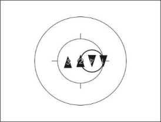

**4307 a-b** 

**End of figure:** The door has to stand at least 

until the riders who are passing the door have finished the total way of stretch. 

## Door **(8.2.079)** 

Insidering **(8.2.073)** 

Page **36** / **60** 

Allée Ferdi Kübler 12 1860 Aigle Switzerland 

T: +41 24 468 58 11 E: admin@uci.ch 

**4307 c** 

## **Compass with insidering counter direction** 

Two riders are within the middle circle. They are connected by hand-inhand-grip. The inside compass rider has to stand in the inner circle and turn on a spot around his longitudinal axis without pedalling, while the outside compass rider has to perform a complete circle around the stationary inside compass rider. Thus, the riders form a compass. The two ring riders have to ride in counter direction at equal distances following each other each once through the space which is formed by the compass. They form an insidering around the compass rider in the inner circle. One part of the figure has to be performed in clockwise direction, the other part of the figure has to be performed in anti-clockwise direction. 

**End of figure:** After a complete rotation of the compass and after the insidering riders have finished the total way of stretch. 

Insidering **(8.2.073)** Counter direction **(8.2.036)** 

## **Star inside** 

All riders have to perform a star inside. 

Star inside **(8.2.061)** 

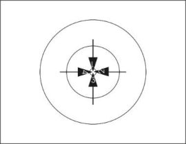

**4316 a 4317 a-f** 

## **Star inside 4 s.r.l.** 

**Star inside 4 s.r.l. 4316 b** All riders have to ride with equal distances, **4317 g** following each other, around the middle circle. During the figure all riders have to perform a single ring left. After finishing the single ring left all riders have to form a star inside around the inner circle. 

Single ring left **(8.2.053)** Star inside **(8.2.061)** 

## **Star inside 4.s.r.r.** 

**4317 h** 

All riders have to ride with equal distances, following each other, around the middle circle. During the figure, all riders have to perform a single ring right. After finishing the single ring right all riders have to form a star inside around the inner circle. 

Single ring right **(8.2.054)** Star inside **(8.2.061)** 

Page **37** / **60** 

Allée Ferdi Kübler 12 1860 Aigle Switzerland 

T: +41 24 468 58 11 E: admin@uci.ch 

**Star outside 4326 a-b** All riders have to perform a star outside. **4328 a-d** Star outside **(8.2.062) Star outside 4 s.r.l. 4326 c** All riders have to ride with equal distances, **4328 e** following each other, around the middle circle. During the figure, all riders have to perform a single ring left. After finishing the single ring left all riders have to form a star outside around the inner circle. Single ring left **(8.2.053)** Star outside **(8.2.062)** 

## **Star outside 4.s.r.r.** 

## **4328 f** 

All riders have to ride with equal distances, following each other, around the middle circle. During the figure, all riders have to perform a single ring right. After finishing the single ring right all riders have to form a star outside around the inner circle. 

Single ring right **(8.2.054)** Star outside **(8.2.062)** 

**Alternate star 4327** All riders have to perform an alternate star. Alternate-star **(8.2.063)** 

**Star inside ½ / 1 turn on the spot 4331** Starting position is the star inside. During the figure, all riders have to release the grip connection, and each rider has to perform ½ / 1 turn on the spot. **End of figure:** In the position star outside / star inside. Star inside **(8.2.061)** Star outside **(8.2.062)** Turn on the spot **(8.2.047)** 

Page **38** / **60** 

Allée Ferdi Kübler 12 1860 Aigle Switzerland 

T: +41 24 468 58 11 E: admin@uci.ch 

## **2 con. raiser turn on the spot** 

Each two riders are connected by a grip connection. During the figure, the grip connections have to be released, and all riders have to turn on the spot ½ turn up to 4 half turns. 

Turn on the spot **(8.2.047)** 

**4341** 

## **4 con. raiser turn on the spot** 

All riders are connected by a grip connection and have to stand on a common axis. During the figure, the grip connections have to be released, and all riders have to turn on the spot ½ turn up to 4 half turns. 

Turn on the spot **(8.2.047)** 

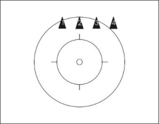

**4342** 

_(text modified on 01.01.16; 01.01.17; 01.01.20; 01.02.21; 01.01.26; 01.01.27)_ 

## **Chapter V LIST OF FIGURES** 

|**8.5.005**|Raiser|passages|passages||
|---|---|---|---|---|
||Figure|No. /|Name of figure|Point value|
||1281| a|P. fronthang raiser headtube|5,0|
||1281| b|P. raiser headtube fronthang|2,4|
||1282|a|P. fronthang standraiser rev.|7,0|
||1282| b|P. standraiser rev. fronthang|3,0|
||1283|a|P. raiser reg. seat raiser handlebarseat|3,1|
||1283| b|P. raiser handlebarseat raiser reg. seat|2,1|
||1283|c|P. raiser stand on pin raiser handlebarseat|3,2|
||1284|a|P. raiser reg. seat raiser headtube|5,3|
||1284| b|P. raiser headtube raiser reg. seat|4,3|
||1285|a|P. raiser reg. seat standraiser rev.|6,4|
||1285| b|P. standraiser rev. raiser reg. seat|4,7|
||1286|a|P. raiser handlebarseat raiser headtube|3,6|
||1286| b|P. raiser headtube raiser handlebarseat|2,7|
||1287|a|P. raiser headtube standraiser rev.|4,1|
||1287| b|P. standraiser rev. raiser headtube|1,9|
||1288|a|P. backhang raiser headtube rev.|3,7|
||1288| b|P. raiser headtube rev. backhang|1,4|
||1289|a|P. backhang standraiser|6,1|

Page **39** / **60** 

Allée Ferdi Kübler 12 1860 Aigle Switzerland 

T: +41 24 468 58 11 E: admin@uci.ch 

|Figure|No. / Name of figure|Point value|
|---|---|---|
|1289| b  P. standraiser backhang|2,4|
|1290|a  P. reg. seat rev. raiser handlebarseat rev.|5,1|
|1290| b  P. raiser handlebarseat rev. reg. seat rev.|1,7|
|1291|a  P. raiser handlebarseat rev. standraiser|6,8|
|1291| b  P. standraiser raiser handlebarseat rev.|5,1|
|1292|a  P. raiser headtube rev. raiser handlebarseat rev.|3,9|
|1292| b  P. raiser handlebarseat rev. raiser headtube rev.|5,8|
|1293|a  P. standraiser raiser headtube rev.|1,8|
|1293| b  P. raiser headtube rev. standraiser|3,6|
|_(text modified on 01.01.16; 01.01.17,01.01.27) _|||

|**§**|**2**||**Pair artistic cycling**|**Pair artistic cycling**||
|---|---|---|---|---|---|
|||**8.5.012**|Figures|on one bicycle||
||||Figure No. / Name of figure||Point value|
||||2261|a  Reg. seat / Stand on pins HC.|0,3|
||||2261|b  Reg. seat / Stand on pins C.|0,4|
||||2261|c  Reg. seat / Saddlestand HC.|0,7|
||||2261|d  Reg. seat / Saddlestand C.|0,9|
||||2266|a  Reg. seat / Shoulderseat HC.|0,7|
||||2266|b  Reg. seat / Shoulderseat C.|0,9|
||||2266|c  Reg. seat frh. / Shoulderseat HC.|1,6|
||||2266|d  Reg. seat frh. / Shoulderseat C.|1,9|
||||2267|a  Reg. seat bw. / Shoulderseat HC.|1,9|
||||2267|b  Reg. seat bw. / Shoulderseat C.|2,2|
||||2268|a  Reg. seat / Shoulderstand HC.|2,0|
||||2268|b  Reg. seat / Shoulderstand C.|2,3|
||||2268|c  Reg. seat frh. / Shoulderstand HC.|3,0|
||||2268|d  Reg. seat frh. / Shoulderstand C.|3,4|
||||2269|a  Reg. seat bw. / Shoulderstand HC.|3,7|
||||2269|b  Reg. seat bw. / Shoulderstand C.|4,1|
||||2270|a  Reg. seat / Chest suspended hang HC.|1,3|
||||2270|b  Reg. seat / Chest suspended hang C.|1,5|
||||2270|c  Reg. seat frh. / Chest suspended hang HC.|2,1|
||||2270|d  Reg. seat frh. / Chest suspended hang C.|2,4|
||||2271|a  Reg. seat bw. / Chest suspended hang HC.|2,3|
||||2271|b  Reg. seat bw. / Chest suspended hang C.|2,6|
||||2276|a  Reg. seat / Handlebarstand HC.|1,2|
||||2276|b  Reg. seat / Handlebarstand C.|1,3|

Page **40** / **60** 

Allée Ferdi Kübler 12 1860 Aigle Switzerland 

T: +41 24 468 58 11 E: admin@uci.ch 

|Figure|No.|/ Name of figure|Point value|
|---|---|---|---|
|2277|a|Reg. seat / Handlebar handstand HC.|5,0|
|2277|b|Reg. seat / Handlebar handstand C.|5,4|
|2277| c|Reg. seat / Handlebar support straddle handlebar handstand| 6,5|
|||HC.||
|2277| d|Reg. seat / Handlebar support straddle handlebar handstand| 6,9|
||b|C.||
|2281|a|Reg. seat rev. / Shoulderseat HC.|1,1|
|2281|b|Reg. seat rev. / Shoulderseat C.|1,3|
|2282|a|Reg. seat rev. bw. / Shoulderseat HC.|1,9|
|2282|b|Reg. seat rev. bw. / Shoulderseat C.|2,1|
|2283|a|Reg. seat rev. / Shoulderstand HC.|2,7|
|2283|b|Reg. seat rev. / Shoulderstand C.|3,0|
|2285|a|Reg. seat rev. / Chest suspended hang HC.|1,7|
|2285|b|Reg. seat rev. / Chest suspended hang C.|1,9|
|2286|a|Reg. seat rev. bw. / Chest suspended hang HC.|2,5|
|2286|b|Reg. seat rev. bw. / Chest suspended hang C.|2,7|
|2296|a|Handlebarseat / Stand on pins HC.|1,1|
|2296|b|Handlebarseat / Stand on pins C.|1,2|
|2296|c|Handlebarseat frh. / Stand on pins HC.|1,6|
|2296|d|Handlebarseat frh. / Stand on pins C.|1,8|
|2296|e|Handlebarseat / Saddlestand HC.|1,8|
|2296|f|Handlebarseat / Saddlestand C.|2,0|
|2296|g|Handlebarseat frh. / Saddlestand HC.|2,3|
|2296|h|Handlebarseat frh. / Saddlestand C.|2,5|
|2301|a|Handlebarseat rev. / Stand on pins HC.|0,8|
|2301|b|Handlebarseat rev. / Stand on pins C.|0,9|
|2301|c|Handlebarseat rev. frh. / Stand on pins HC.|1,3|
|2301|d|Handlebarseat rev. frh. / Stand on pins C.|1,4|
|2302|a|Handlebarseat rev. / Saddle handlebarstand HC.|1,3|
|2302|b|Handlebarseat rev. / Saddle handlebarstand C.|1,4|
|2302|c|Handlebarseat rev. frh. / Saddle handlebarstand HC.|1,8|
|2302|d|Handlebarseat rev. frh. / Saddle handlebarstand C.|1,9|
|2302|e|Handlebarseat rev. / Saddlestand HC.|1,4|
|2302|f|Handlebarseat rev. / Saddlestand C.|1,7|
|2302|g|Handlebarseat rev. frh. / Saddlestand HC.|2,0|
|2302|h|Handlebarseat rev. frh. / Saddlestand C.|2,3|
|2303|a|Handlebarseat rev. / Shoulderseat HC.|1,3|
|2303|b|Handlebarseat rev. / Shoulderseat C.|1,5|
|2303|c|Handlebarseat rev. frh. / Shoulderseat HC.|1,9|
|2303|d|Handlebarseat rev. frh. / Shoulderseat C.|2,2|
|2304|a|Handlebarseat rev. / Shoulderstand HC.|2,9|

Page **41** / **60** 

Allée Ferdi Kübler 12 1860 Aigle Switzerland 

T: +41 24 468 58 11 E: admin@uci.ch 

|Figure|No.|/ Name of figure|Point value|
|---|---|---|---|
|2304|b|Handlebarseat rev. / Shoulderstand C.|3,2|
|2304|c|Handlebarseat rev. frh. / Shoulderstand HC.|3,6|
|2304|d|Handlebarseat rev. frh. / Shoulderstand C.|3,9|
|2305|a|Handlebarseat rev. / Chest suspended hang HC.|1,8|
|2305|b|Handlebarseat rev. / Chest suspended hang C.|2,0|
|2305|c|Handlebarseat rev. frh. / Chest suspended hang HC.|2,4|
|2305|d|Handlebarseat rev. frh. / Chest suspended hang C.|2,6|
|2306|a|Handlebarseat rev. / Headstand HC.|2,7|
|2306|b|Handlebarseat rev. / Headstand C.|2,9|
|2311|a|Frontstand / Stand on pins HC.|0,9|
|2311|b|Frontstand / Stand on pins C.|1,0|
|2311|c|Frontstand frh. / Stand on pins HC.|1,4|
|2311|d|Frontstand frh. / Stand on pins C.|1,6|
|2311|e|Frontstand / Saddlestand HC.|1,6|
|2311|f|Frontstand / Saddlestand C.|1,8|
|2311|g|Frontstand frh. / Saddlestand HC.|2,1|
|2311|h|Frontstand frh. / Saddlestand C.|2,3|
|2316|a|Split / Shoulderseat HC.|1,0|
|2316|b|Split / Shoulderseat C.|1,2|
|2316|c|Split frh. / Shoulderseat HC.|1,6|
|2316|d|Split frh. / Shoulderseat C.|1,8|
|2317|a|Sidestand / Sidestand ring grip HC.|1,4|
|2317|b|Sidestand / Sidestand ring grip C.|1,6|
|2319|a|Stand bent on saddle / Stand bent on handlebar rev. HC.|1,8|
|2319|b|Stand bent on saddle / Stand bent on handlebar rev. C.|2,0|
|2321|a|Frameseat / Stand bent on saddle HC.|1,1|
|2321|b|Frameseat / Stand bent on saddle C.|1,2|
|2322|a|Frameseat / Saddle handlebarstand HC.|1,5|
|2322|b|Frameseat / Saddle handlebarstand C.|1,7|
|2322|c|Frameseat / Saddlestand HC.|1,8|
|2322|d|Frameseat / Saddlestand C.|2,0|
|2323|a|Frameseat / Saddle support scale HC.|2,4|
|2323|b|Frameseat / Saddle support scale C.|2,8|
|2331|a|Fronthang / Stand bent on saddle HC.|1,0|
|2331|b|Fronthang / Stand bent on saddle C.|1,2|
|2332|a|Fronthang / Saddle handlebarstand HC.|1,5|
|2332|b|Fronthang / Saddle handlebarstand C.|1,7|
|2332|c|Fronthang / Saddlestand HC.|1,8|
|2332|d|Fronthang / Saddlestand C.|2,0|
|2334|a|Fronthang / Headstand HC.|2,8|

Page **42** / **60** 

Allée Ferdi Kübler 12 1860 Aigle Switzerland 

T: +41 24 468 58 11 E: admin@uci.ch 

|Figure|No.|/ Name of figure|Point value|
|---|---|---|---|
|2334|b|Fronthang / Headstand C.|3,0|
|2334|c|Fronthang / Saddle handlebar handstand HC.|6,1|
|2334|d|Fronthang / Saddle handlebar handstand C.|6,5|
|2341|a|Backhang / Stand on pins HC.|0,9|
|2341|b|Backhang / Stand on pins C.|1,0|
|2342|a|Backhang / Saddle handlebarstand HC.|1,4|
|2342|b|Backhang / Saddle handlebarstand C.|1,5|
|2342|c|Backhang / Saddlestand HC.|1,7|
|2342|d|Backhang / Saddlestand C.|1,9|
|2343|a|Backhang / Handlebarstand HC.|1,8|
|2343|b|Backhang / Handlebarstand C.|1,9|
|2346|a|Backhang / Headstand HC.|2,7|
|2346|b|Backhang / Headstand C.|2,9|
|2346|c|Backhang / Saddle handlebar handstand HC.|6,1|
|2346|d|Backhang / Saddle handlebar handstand C.|6,5|
|2351|a|Lying on handlebar / Stand bent on saddle HC.|1,3|
|2351|b|Lying on handlebar / Stand bent on saddle C.|1,5|
|2351|c|Lying on handlebar / Saddlestand HC.|2,2|
|2351|d|Lying on handlebar / Saddlestand C.|2,4|
|2352|a|Lying on saddle / Handlebarstand HC.|1,9|
|2352|b|Lying on saddle / Handlebarstand C.|2,0|
|2352|c|Lying on saddle / Handlebar handstand HC.|5,5|
|2352|d|Lying on saddle / Handlebar handstand C.|5,9|
|2353|a|Waterscale / Stand bent on saddle HC.|1,5|
|2353|b|Waterscale / Stand bent on saddle C.|1,6|
|2353|c|Waterscale / Saddlestand HC.|2,2|
|2353|d|Waterscale / Saddlestand C.|2,4|
|2356|a|Saddle handlebarstand / Saddle handlebarstand HC.|3,0|
|2356|b|Saddle handlebarstand / Saddle handlebarstand C.|3,2|
|2356|c|Saddle handlebarstand / Saddle handlebarstand S|3,6|
|2356|d|Saddle handlebarstand / Saddle handlebarstand 8|4,1|
|2357|a|Saddle handlebarstand / Stand on pins HC.|2,5|
|2357|b|Saddle handlebarstand / Stand on pins C.|2,6|
|2357|c|Saddle handlebarstand / Saddlestand HC.|3,1|
|2357|d|Saddle handlebarstand / Saddlestand C.|3,2|
|2357|e|Saddle handlebarstand / Handlebarstand HC.|3,7|
|2357|f|Saddle handlebarstand / Handlebarstand C.|3,8|
|2358|a|Handlebarstand / Stand on pins HC.|3,2|
|2358|b|Handlebarstand / Stand on pins C.|3,4|
|2358|c|Handlebarstand ½ turn / Stand on pins|5,9|
|2358|d|Handlebarstand 1 turn / Stand on pins T (7,2 - 7,7 - 8,2 - 8,7)| 6,7|
|2358|e|Handlebarstand 1½ turns / Stand on pins T|7,5|

Page **43** / **60** 

Allée Ferdi Kübler 12 1860 Aigle Switzerland 

T: +41 24 468 58 11 E: admin@uci.ch 

|Figure|No.|/ Name of figure|Point|value|
|---|---|---|---|---|
|||(8,0 - 8,5 - 9,0 - 9,5)|||
|2358|f|Handlebarstand 2 turns / Stand on pins T (8,8 - 9,3 - 9,8 - 10,3)||8,3|
|2358|g|Handlebarstand out of reg. seat / Stand on pins HC.||4,0|
|2358|h|Handlebarstand out of reg. seat / Stand on pins C.||4,1|
|2358|i|Handlebarstand ½ turn, out of reg. seat / Stand on pins||6,7|
|2358|j|Handlebarstand 1 turn, out of reg. seat / Stand on pins T||7,5|
|||(8,0 - 8,5 - 9,0 - 9,5)|||
|2358|k|Handlebarstand 1½ turns out of reg. seat / Stand on pins T||8,3|
|||(8,8 - 9,3 - 9,8 - 10,3)|||
|2358|l|Handlebarstand 2 turns out of reg. seat / Stand on pins T||9,1|
|||(9,6 - 10,1 - 10,6 - 11,1)|||

||||**Given**||**Given**|**Given**||||
|---|---|---|---|---|---|---|---|---|---|
||||2358c 2358d 2358e 2358f|2358i|2358j||2358k|2358l||
||||½ 1 1 ½ 2|½|1||1 ½|2||
|||½|**5,9** ½|**6,7**||||||
|**Shown**||1 1½ 2|**Shown** **6,7** 1 **7,2** **7,5** 1½ **7,7** **8,0** **8,3** 2||**7,5** **8,0** **8,5**||**8,3** **8,8**|**9,1**||
|||2½|**8,2** **8,5** **8,8** 2½||**9,0**||**9,3**|**9,6**||
|||3|**8,7** **9,0** **9,3** 3||**9,5**||**9,8**|**10,1**||
|||3½|**9,5** **9,8** 3½||||**10,3**|**10,6**||
|||4|**10,3** 4|||||**11,1**||
|Figure No. / Name of figure|||||||Point value|||
|2359||a|Handlebarstand / Saddlestand ring grip HC.|||||3,6||
|2359||b|Handlebarstand / Saddlestand ring grip C.|||||3,7||
|2359||c|Handlebarstand / Saddlestand HC.|||||4,9||
|2359||d|Handlebarstand / Saddlestand C.|||||5,1||
|2359||e|Handlebarstand / Saddlestand S|||||5,6||
|2359||f|Handlebarstand / Saddlestand 8|||||6,1||
|2366||a|Handlebar L-shape hold / Stand on pins HC.|||||3,0||
|2366||b|Handlebar L-shape hold / Stand on pins C.|||||3,5||
|2366||c|Handlebar L-shape hold / Saddlestand HC.|||||3,8||
|2366||d|Handlebar L-shape hold / Saddlestand C.|||||4,2||
|2366||e|Handlebar L-shape hold / Saddle support|straddle HC.||||5,0||
|2366||f|Handlebar L-shape hold / Saddle support|straddle C.||||5,4||
|2366||g|Handlebar support straddle / Saddle support straddle HC.|||||6,0||
|2366||h|Handlebar support straddle / Saddle support straddle C.|||||6,4||
|2371||a|Headstand / Handlebarstand HC.|||||3,8||
|2371||b|Headstand / Handlebarstand C.|||||4,1||
|2372||a|Headstand / Frame shoulderstand HC.|||||5,1||
|2372||b|Headstand / Frame shoulderstand C.|||||5,5||
|2373||a|Headstand / Handlebar support straddle HC.|||||6,1||
|2373||b|Headstand / Handlebar support straddle C.|||||6,5||

Page **44** / **60** 

Allée Ferdi Kübler 12 1860 Aigle Switzerland 

T: +41 24 468 58 11 E: admin@uci.ch 

|Figure|No.|/ Name of figure|Point|value|
|---|---|---|---|---|
|2374|a|Headstand / Handlebar handstand HC.||8,5|
|2374|b|Headstand / Handlebar handstand C.||9,0|
|2374|c|Headstand / Handlebar handstand S||9,8|
|2374|d|Headstand / Handlebar handstand 8||10,6|
|2374|e|Headstand / Handlebar support straddle handlebar handstand||11,0|
|||HC.|||
|2374|f|Headstand / Handlebar support straddle handlebar handstand C.||11,5|
|2374|g|Headstand / Handlebar support straddle handlebar handstand S||12,3|
|2374|h|Headstand / Handlebar support straddle handlebar handstand 8||13,1|
|2376|a|Saddle handlebar handstand / Handlebarstand HC.||7,7|
|2376|b|Saddle handlebar handstand / Handlebarstand C.||8,1|
|2376|c|Handlebar handstand / Saddlestand HC.||7,6|
|2376|d|Handlebar handstand / Saddlestand C.||8,0|
|2377|a|Handlebar handstand / Saddle handlebar handstand HC.||10,6|
|2377|b|Handlebar handstand / Saddle handlebar handstand C.||11,0|
|2378|a|Lying on saddle / Headstand||3,5|
|2391|a|Stillstand on pedals / Shoulderseat||1,3|
|2391|b|Stillstand on pedals frh. / Shoulderseat||1,8|
|2391|c|Stillstand on pedals / Shoulderstand||2,7|
|2391|d|Stillstand on pedals frh. / Shoulderstand||3,2|

_(text modified on 01.01.16; 01.01.20, 01.01.27)_ 

## **§ 3 Artistic Cycling Team 4** 

|**8.5.015**|Artistic|Cycling Team 4|Cycling Team 4||
|---|---|---|---|---|
||Figure|No. /|Name of figure|Point value|
||4001|a|4 f.e.o. HC.|0,8|
||4001|b|4 f.e.o. C.|1,0|
||4001|c|4 f.e.o. HC. 4 s.r.l.|1,4|
||4001|d|4 f.e.o. C. 4 s.r.l.|1,6|
||4001|e|4 f.e.o. HC. 4 s.r.r.|1,4|
||4001|f|4 f.e.o. C. 4 s.r.r.|1,6|
||4001|g|4 f.e.o. HC. 2 s.r.l. 2 s.r.r.|1,6|
||4001|h|4 f.e.o. C. 2 s.r.l. 2 s.r.r.|1,8|
||4001|i|4 a.r. overlapping|2,7|
||4002|a|4 f.e.o. HC. bw.|1,6|
||4002|b|4 f.e.o. C. bw.|2,0|
||4002|c|4 f.e.o. HC. 4 s.r.l. bw.|2,7|
||4002|d|4 f.e.o. C. 4 s.r.l. bw.|3,1|
||4002|e|4 a.r. overlapping bw.|4,9|
||4003|a|4 f.e.o. HC. raiser|2,0|
||4003|b|4 f.e.o. C. raiser|2,5|

Page **45** / **60** 

Allée Ferdi Kübler 12 1860 Aigle Switzerland 

T: +41 24 468 58 11 E: admin@uci.ch 

|Figure|No.|/ Name of figure|Point value|
|---|---|---|---|
|4003| c|4 f.e.o. HC. raiser frh.|2,6|
|4003| d|4 f.e.o. C. raiser frh.|3,3|
|4003| e|4 f.e.o. HC. 4 s.r.l. raiser|3,4|
|4003| f|4 f.e.o. C. 4 s.r.l. raiser|3,9|
|4003| g|4 f.e.o. HC. 4 s.r.l. raiser frh.|4,4|
|4003| h|4 f.e.o. C. 4 s.r.l. raiser frh.|5,1|
|4004| a|4 f.e.o. HC. raiser bw. frh.|3,4|
|4004| b|4 f.e.o. C. raiser bw. frh.|4,3|
|4004| c|4 f.e.o. HC. 4 s.r.l. raiser bw. frh.|5,8|
|4004| d|4 f.e.o. C. 4 s.r.l. raiser bw. frh.|6,6|
|4004| e|4 f.e.o. HC. 4 s.r.r raiser bw. frh.|6,0|
|4004| f|4 f.e.o. C. 4 s.r.r. raiser bw. frh.|6,8|
|4004| g|4 f.e.o. HC. 2 s.r.l. 2 s.r.r. raiser bw. frh.|6,6|
|4004| h|4 f.e.o. C. 2 s.r.l. 2 s.r.r. raiser bw. frh.|7,5|
|4005| a|4 a.r. overlapping raiser bw. frh.|9,4|
|4006| a|4 f.e.o. diagonal pull|1,0|
|4006| b|4 f.e.o. diagonal pull 2 s.r.l. 2 s.r.r.|1,8|
|4007| a|4 f.e.o. S|1,8|
|4007| b|4 f.e.o. 8|2,2|
|4007| c|4 f.e.o. 8 through|2,6|
|4008| a|4 f.e.o. S bw.|3,6|
|4008| b|4 f.e.o. 8 bw.|4,4|
|4008| c|4 f.e.o. 8 through bw.|5,2|
|4010| a|4 f.e.o. S raiser bw. frh.|7,7|
|4010| b|4 f.e.o. 8 raiser bw. frh.|9,4|
|4010| c|4 f.e.o. 8 through raiser bw. frh.|10,6|
|4011| a|4 f.e.o. longline|1,0|
|4011| b|4 f.e.o. longline 2 s.r.l. 2 s.r.r.|1,8|
|4012| a|2 f.e.o. longline opp. dir.|1,6|
|4012| b|2 f.e.o. longline opp. dir. two mills|2,7|
|4013| a|2 n.e.o. longline opp. dir.|1,2|
|4013| b|2 n.e.o. longline opp. dir. 4 s.r.l.|1,7|
|4013| c|2 n.e.o. longline opp. dir. through|1,6|
|4013| d|2 n.e.o. longline opp. dir. through 4 s.r.l.|2,1|
|4013| e|2 n.e.o. longline opp. dir. through 4 s.r.r.|2,2|
|4013| f|2 n.e.o. longline opp. dir. through two mills|2,7|
|4014| a|2 f.e.o. diagonal pull opp. dir.|1,6|
|4015| a|4 n.e.o. half shortline a.r.|2,0|
|4015| b|4 n.e.o. shortline a.r.|2,4|
|4016| a|4 n.e.o. half shortline a.r. raiser bw. frh.|8,7|

Page **46** / **60** 

Allée Ferdi Kübler 12 1860 Aigle Switzerland 

T: +41 24 468 58 11 E: admin@uci.ch 

|Figure|No.|/ Name of figure|Point value|
|---|---|---|---|
|4016| b|4 n.e.o. shortline a.r. raiser bw. frh.|10,4|
|4017| a|4 n.e.o. shortline|1,0|
|4017| b|4 n.e.o. shortline 4 s.r.l.|1,6|
|4018| a|4 n.e.o. shortline bw.|2,1|
|4018| b|4 n.e.o. shortline 4 s.r.l. bw.|3,2|
|4024| a|2 con. wingmill HD.spin. raiser bw. frh. T (10,3)|9,3|
|4024| b|2 con. wingmill spin. raiser bw.frh. T (11,2)|10,2|
|4024| c|Remmlinger spin. raiser bw. frh. T (13,6)|12,6|
|4026| a|2 f.e.o. half double circle|0,8|
|4026| b|2 f.e.o. double circle|1,2|
|4026| c|2 f.e.o. double circle through|1,6|
|4026| d|2 f.e.o. half double circle 4 s.r.l.|1,4|
|4026| e|2 f.e.o. double circle 4 s.r.l.|1,8|
|4026| f|2 f.e.o. double circle through 4 s.r.l.|2,2|
|4027| a|2 f.e.o. half double circle bw.|1,7|
|4027| b|2 f.e.o. double circle bw.|2,5|
|4027| c|2 f.e.o. double circle through bw.|3,3|
|4027| d|2 f.e.o. half double circle 4 s.r.l. bw.|2,8|
|4027| e|2 f.e.o. double circle 4 s.r.l. bw.|3,6|
|4027| f|2 f.e.o. double circle through 4 s.r.l. bw.|4,4|
|4028| a|2 f.e.o. half double circle raiser|2,1|
|4028| b|2 f.e.o. double circle raiser|3,1|
|4028| c|2 f.e.o. double circle through raiser|4,1|
|4028| d|2 f.e.o. half double circle raiser frh.|2,7|
|4028| e|2 f.e.o. double circle raiser frh.|3,5|
|4028| f|2 f.e.o. double circle through raiser frh.|5,3|
|4028| g|2 f.e.o. half double circle 4 s.r.l. raiser|3,5|
|4028| h|2 f.e.o. double circle 4 s.r.l. raiser|4,5|
|4028| i|2 f.e.o. double circle through 4 s.r.l. raiser|5,5|
|4028| j|2 f.e.o. half double circle 4 s.r.l. raiser frh.|4,6|
|4028| k|2 f.e.o. double circle 4 s.r.l. raiser frh.|5,4|
|4028| l|2 f.e.o. double circle through 4 s.r.l. raiser frh.|7,2|
|4029| a|2 f.e.o. half double circle raiser bw. frh.|4,1|
|4029| b|2 f.e.o. double circle raiser bw. frh.|5,3|
|4029| c|2 f.e.o. double circle through raiser bw. frh.|7,0|
|4029| d|2 f.e.o. half double circle 4 s.r.l. raiser bw. frh.|6,5|
|4029| e|2 f.e.o. double circle 4 s.r.l. raiser bw. frh.|7,7|
|4029| f|2 f.e.o. double circle through 4 s.r.l. raiser bw. frh.|9,4|
|4031| a|2 f.e.o. shortline|1,0|
|4031| b|2 f.e.o. shortline 4 s.r.l.|1,6|
|4031| c|2 f.e.o. shortline 2 s.r.l. 2 s.r.r.|1,8|
|4032| a|2 f.e.o. shortline bw.|2,0|
|4032| b|2 f.e.o. shortline 4 s.r.l. bw.|3,1|

Page **47** / **60** 

Allée Ferdi Kübler 12 1860 Aigle Switzerland 

T: +41 24 468 58 11 E: admin@uci.ch 

|Figure|No.|/ Name of figure|Point value|
|---|---|---|---|
|4032| c|2 f.e.o. shortline 2 s.r.l. 2 s.r.r. bw.|3,5|
|4044| a|2 n.e.o. shortline opp. dir.|1,2|
|4044| b|2 n.e.o. shortline opp. dir. 4 s.r.l.|1,7|
|4044| c|2 n.e.o. shortline opp. dir. through|1,6|
|4044| d|2 n.e.o. shortline opp. dir. through 4 s.r.l.|2,1|
|4044| e|2 n.e.o. shortline opp. dir. through 2 mills|2,7|
|4044| f|2 n.e.o. half shortline opp. dir. a.r.|2,0|
|4044| g|2 n.e.o. shortline opp. dir. a.r.|2,4|
|4044|h|2 n.e.o. shortline opp. dir. a.r. through|2,6|
|4045| a|2 n.e.o. shortline opp. dir. bw.|2,3|
|4045| b|2 n.e.o. shortline opp. dir. through bw.|3,1|
|4045| c|2 n.e.o. shortline opp. dir. 4 s.r.l. bw.|3,4|
|4045| d|2 n.e.o. half shortline opp. dir. a.r. bw.|3,9|
|4045| e|2 n.e.o. shortline opp. dir. a.r. bw.|4,7|
|4048| a|2 n.e.o. half shortline opp. dir. a.r. raiser bw. frh.|9,0|
|4048| b|2 n.e.o. shortline opp. dir. a.r. raiser bw. frh.|10,0|
|4048| c|2 n.e.o. shortline opp. dir. a.r. through raiser bw. frh.|10,5|
|||T (11,3 - 12,1)||

|||**Given**|||
|---|---|---|---|---|
|**Shown** 4048c no crossing **10,5** 1 x crossing **11,3**|||||
|2 x crossing **12,1**|||||
|4071|a|2 con. HC.||0,4|
|4071|b|2 con. C.||0,6|
|4071|c|2 con. HC. 2 con. s.r.l.||0,6|
|4071|d|2 con. C. 2 con. s.r.l.||1,0|
|4071|e|2 con. HC. 4 s.r.l.||1,2|
|4071|f|2 con. C. 4 s.r.l.||1,4|
|4072|a|2 con. HC. bw.||0,8|
|4072|b|2 con. C. bw.||1,2|
|4072|c|2 con. HC. 2 con. s.r.l. bw.||1,1|
|4072|d|2 con. C. 2 con. s.r.l. bw.||1,5|
|4072|e|2 con. HC. 4 s.r.l. bw.||2,9|
|4072|f|2 con. C. 4 s.r.l. bw.||3,3|
|4073|a|2 con. HC. raiser||1,0|
|4073|b|2 con. C. raiser||1,5|
|4073|c|2 con. HC. raiser frh.||1,3|
|4073|d|2 con. C. raiser frh.||2,0|
|4073|e|2 con. HC. 2 con. s.r.l. raiser||1,9|
|4073|f|2 con. C. 2 con. s.r.l. raiser||2,4|
|4073|g|2 con. HC. 2 con. s.r.l. raiser frh.||2,3|
|4073|h|2 con. C. 2 con. s.r.l. raiser frh.||3,0|
|4073|i|2 con. HC. 4 s.r.l. raiser||2,9|

Page **48** / **60** 

Allée Ferdi Kübler 12 1860 Aigle Switzerland 

T: +41 24 468 58 11 E: admin@uci.ch 

|Figure|No.|/ Name of figure|Point value|
|---|---|---|---|
|4073| j|2 con. C. 4 s.r.l. raiser|3,4|
|4073| k|2 con. HC. 4 s.r.l. raiser frh.|3,6|
|4073| l|2 con. C. 4 s.r.l. raiser frh.|4,3|
|4073| m|2 con. HC. 4 s.r.l. through raiser|3,9|
|4073| n|2 con. C. 4 s.r.l. through raiser|4,4|
|4073| o|2 con. HC. 4 s.r.l. through raiser frh.|4,4|
|4073| p|2 con. C. 4 s.r.l. through raiser frh.|5,1|
|4074| a|2 con. HC. raiser bw. frh.|1,7|
|4074| b|2 con. C. raiser bw. frh.|2,6|
|4074| c|2 con. HC. 2 con. s.r.l. raiser bw. frh.|2,4|
|4074| d|2 con. C. 2 con. s.r.l. raiser bw. frh.|3,2|
|4074| e|2 con. HC. 4 s.r.l. raiser bw. frh.|5,1|
|4074| f|2 con. C. 4 s.r.l. raiser bw. frh.|5,9|
|4074| g|2 con. HC. 4 s.r.l. through raiser bw. frh.|6,8|
|4074| h|2 con. C. 4 s.r.l. through raiser bw. frh.|7,6|
|4081| a|2 con. f.e.o. longline raiser frh.|2,0|
|4081| b|2 con. f.e.o. longline 2 con. s.r.l. raiser frh.|2,5|
|4081| c|2 con. f.e.o. longline 2 con. s.r.r. raiser frh.|2,7|
|4081| d|2 con. f.e.o. longline 4 s.r.l. raiser frh.|3,8|
|4082| a|2 con. f.e.o. longline raiser bw. frh.|2,6|
|4082| b|2 con. f.e.o. longline 2 s.r.l. 2 s.r.r. raiser bw. frh.|6,8|
|4083| a|2 con. longline opp. dir. through 4 s.r.l. raiser bw. frh.|9,2|
|4083| b|2 con. longline opp. dir. through 4 s.r.r. raiser bw. frh.|10,4|
|4083| c|2 con. longline opp. dir. through 2 mills raiser bw. frh.|11,6|
|4086| a|2 con. Shortline|0,6|
|4086| b|2 con. shortline 2 con. s.r.l.|0,8|
|4086| c|2 con. shortline 2 con. s.r.r.|0,8|
|4086| d|2 con. shortline 4 s.r.l.|1,7|
|4087| a|2 con. shortline bw.|1,2|
|4087| b|2 con. shortline 2 con. s.r.l. bw.|1,7|
|4087| c|2 con. shortline 4 s.r.l. bw.|2,5|
|4088| a|2 con. shortline raiser|1,5|
|4088| b|2 con. shortline raiser frh.|2,0|
|4088| c|2 con. shortline 2 con. s.r.l. raiser|1,9|
|4088| d|2 con. shortline 2 con. s.r.l. raiser frh.|2,5|
|4088| e|2 con. shortline 2 con. s.r.r. raiser frh.|2,7|
|4088| f|2 con. shortline 4 s.r.l. raiser|3,9|
|4088| g|2 con. shortline 4 s.r.l. raiser frh.|4,8|
|4089| a|2 con. shortline raiser bw. frh.|2,6|
|4089| b|2 con. shortline 2 con. s.r.l. raiser bw. frh.|3,2|
|4089| c|2 con. shortline 2 con. s.r.r. raiser bw. frh.|3,6|
|4089| d|2 con. shortline 4 s.r.l. raiser bw. frh.|6,4|
|4096| a|2 con. half shortline a.r.|0,7|

Page **49** / **60** 

Allée Ferdi Kübler 12 1860 Aigle Switzerland 

T: +41 24 468 58 11 E: admin@uci.ch 

|Figure|No.|/ Name of figure|Point value|
|---|---|---|---|
|4096| b|2 con. shortline a.r.|1,1|
|4097| a|2 con. half shortline a.r. bw.|1,4|
|4097| b|2 con. shortline a.r. bw.|2,2|
|4098| a|2 con. half shortline a.r. raiser|1,8|
|4098| b|2 con. shortline a.r. raiser|2,8|
|4098| c|2 con. half shortline a.r. raiser frh.|2,3|
|4098| d|2 con. shortline a.r. raiser frh.|3,6|
|4099| a|2 con. half shortline a.r. raiser bw. frh.|3,0|
|4099| b|2 con. shortline a.r. raiser bw. frh.|4,7|
|4105| a|2 con. shortline opp. dir.|1,2|
|4105| b|2 con. shortline opp. dir. 2 con. s.r.l.|1,4|
|4105| c|2 con. shortline opp. dir. 4 s.r.l.|1,8|
|4106| a|2 con. shortline opp. dir. bw.|2,4|
|4106| b|2 con. shortline opp. dir. 2 con. s.r.l. bw.|2,7|
|4106| c|2 con. shortline opp. dir. 4 s.r.l. bw.|3,5|
|4107| a|2 con. shortline opp. dir. raiser|3,0|
|4107| b|2 con. shortline opp. dir. raiser frh.|3,9|
|4107| c|2 con. shortline opp. dir. 2 con. s.r.l. raiser|3,4|
|4107| d|2 con. shortline opp. dir. 2 con. s.r.l. raiser frh.|4,4|
|4107| e|2 con. shortline opp. dir. 4 s.r.l. raiser|4,9|
|4107| f|2 con. shortline opp. dir. 4 s.r.l. raiser frh.|5,7|
|4108| a|2 con. shortline opp. dir. raiser bw. frh.|4,1|
|4108| b|2 con. shortline opp. dir. 4 s.r.l. raiser bw. frh.|7,5|
|4108| c|2 con. shortline opp. dir. 2 s.r.l. 2 s.r.r. raiser bw. frh.|8,3|
|4116| a|Surrounding 1 around 1|1,6|
|4117| a|Surrounding 1 around 1 bw.|2,2|
|4121| a|Two mills|0,8|
|4121| b|Two mills 4 s.r.r.|1,4|
|4122| a|Two mills bw.|1,7|
|4122| b|Two mills bw. inside indiv.|2,6|
|4122| c|Two mills bw. in- a. outside indiv.|3,1|
|4123| a|Two mills raiser|2,1|
|4123| b|Two mills raiser frh.|2,7|
|4123| c|Two mills raiser frh. inside indiv.|4,3|
|4123| d|Two mills raiser inside indiv. frh.|4,3|
|4123| e|Two mills raiser frh. in- a. outside indiv.|4,6|
|4123| f|Two mills raiser in- a. outside indiv. frh.|5,1|
|4124| a|Two mills raiser bw. frh.|3,6|
|4124| b|Two mills raiser bw. inside indiv. frh.|5,6|

Page **50** / **60** 

Allée Ferdi Kübler 12 1860 Aigle Switzerland 

T: +41 24 468 58 11 E: admin@uci.ch 

|Figure|No.|/ Name of figure|Point value|
|---|---|---|---|
|4124| c|Two mills raiser bw. in- a. outside indiv. frh.|6,6|
|4124| d|Two mills spin. raiser bw. in- a. outside indiv. frh. T (10,4)|9,4|
|4124| e|Two mills 4 s.r.r. raiser bw. in- a. outside indiv. frh.|7,7|
|4133| a|Two insiderings raiser|1,7|
|4133| b|Two insiderings raiser inside indiv.|2,9|
|4133| c|Two insiderings raiser inside indiv. frh.|3,8|
|4133| d|Two insiderings raiser in- a. outside indiv.|3,5|
|4133| e|Two insiderings raiser in- a. outside indiv. frh.|4,6|
|4134| a|Two insiderings raiser bw.|2,4|
|4134| b|Two insiderings raiser bw. inside indiv. frh.|4,9|
|4134| c|Two insiderings raiser bw. in- a. outside indiv. frh.|6,0|
|4134| d|Two insiderings 4 s.r.r. raiser bw. in- a. outside indiv. frh.|8,5|
|4134| e|Two insiderings spin. raiser bw. in- a. outside indiv. frh.|10,7|
|||T (11,7)||
|4135| a|Two outsiderings raiser|2,5|
|4135| b|Two outsiderings raiser inside indiv.|3,7|
|4135| c|Two outsiderings raiser inside indiv. frh.|4,8|
|4135| d|Two outsiderings raiser in- a. outside indiv.|4,3|
|4135| e|Two outsiderings raiser in- a. outside indiv. frh.|5,6|
|4136| a|Two outsiderings raiser bw.|3,5|
|4136| b|Two outsiderings raiser bw. inside indiv. frh.|6,3|
|4136| c|Two outsiderings raiser bw. in- a. outside indiv. frh.|7,3|
|4136| d|Two outsiderings 4 s.r.r. raiser bw. in- a. outside indiv. frh.|9,9|
|4136| e|Two outsiderings spin. raiser bw. in- a. outside indiv. frh.|12,1|
|||T (13,1)||
|4151| a|4 con. HC.|0,8|
|4151| b|4 con. C.|1,0|
|4151| c|4 con. HC. 2 con. s.r.l.|1,2|
|4151| d|4 con. C. 2 con. s.r.l.|1,4|
|4151| e|4 con. HC. 4 s.r.l.|2,4|
|4151| f|4 con. C. 4 s.r.l.|2,8|
|4152| a|4 con. HC. bw.|1,7|
|4152| b|4 con. C. bw|2,1|
|4152| c|4 con. HC. 2 con. s.r.l. bw.|2,4|
|4152| d|4 con. C. 2 con. s.r.l. bw.|2,8|
|4152| e|4 con. HC. 4 s.r.l. bw.|3,8|
|4152| f|4 con. C. 4 s.r.l. bw.|4,2|
|4153| a|4 con. HC. raiser|2,1|
|4153| b|4 con. C. raiser|2,6|
|4153| c|4 con. HC. raiser frh.|2,7|
|4153| d|4 con. C. raiser frh.|3,4|
|4153| e|4 con. HC. 2 con. s.r.l. raiser|3,0|
|4153| f|4 con. C. 2 con. s.r.l. raiser|3,5|
|4153| g|4 con. HC. 2 con. s.r.l. raiser frh.|3,9|
|4153| h|4 con. C. 2 con. s.r.l. raiser frh.|3,6|

Page **51** / **60** 

Allée Ferdi Kübler 12 1860 Aigle Switzerland 

T: +41 24 468 58 11 E: admin@uci.ch 

|Figure|No.|/ Name of figure|Point value|
|---|---|---|---|
|4153| i|4 con. HC. 4 s.r.l. raiser|4,5|
|4153| j|4 con. C. 4 s.r.l. raiser|5,0|
|4153| k|4 con. HC. 4 s.r.l. raiser frh.|5,6|
|4153| l|4 con. C. 4 s.r.l. raiser frh.|6,2|
|4154| a|4 con. HC. raiser bw. frh.|3,6|
|4154| b|4 con. C. raiser bw. frh.|4,4|
|4154| c|4 con. HC. 2 con. s.r.l. raiser bw. frh.|5,1|
|4154| d|4 con. C. 2 con. s.r.l. raiser bw. frh.|6,0|
|4154| e|4 con. HC. 4 s.r.l. raiser bw. frh.|7,0|
|4154| f|4 con. C. 4 s.r.l. raiser bw. frh.|7,8|
|4154| g|4 con. HC. spin. raiser bw. frh.|9,3|
|4154| h|4 con. C. spin. raiser bw. frh.|10,2|
|4161| a|4 con. Shortline|1,0|
|4161| b|4 con. shortline 2 con. s.r.l.|1,4|
|4161| c|4 con. shortline 2 con. s.r.r.|1,5|
|4161| d|4 con. shortline 4 s.r.l.|1,6|
|4162| a|4 con. shortline bw.|2,1|
|4162| b|4 con. shortline 2 con. s.r.l. bw.|2,8|
|4162| c|4 con. shortline 2 con. s.r.r. bw.|3,0|
|4162| d|4 con. shortline 4 s.r.l. bw.|3,2|
|4163| a|4 con. shortline raiser|2,6|
|4163| b|4 con. shortline raiser frh.|3,4|
|4163| c|4 con. shortline 2 con. s.r.l. raiser|3,5|
|4163| d|4 con. shortline 2 con. s.r.l. raiser frh.|4,1|
|4163| e|4 con. shortline 4 s.r.l. raiser|5,0|
|4163| f|4 con. shortline 4 s.r.l. raiser frh.|5,2|
|4164| a|4 con. shortline raiser bw. frh.|3,4|
|4164| b|4 con. shortline 2 con. s.r.l. raiser bw. frh|5,0|
|4164| c|4 con. shortline 4 s.r.l. raiser bw. frh.|6,8|
|4164| d|4 con. shortline 2 s.r.l. 2 s.r.r. raiser bw. frh.|7,7|
|4164| e|4 con. shortline spin. raiser bw. frh.|10,2|
|4164|f|4 con. shortline 1 s.r.l. around spin. 1 s.r.r. around spin. raiser|9,0|
|||bw. frh.||
|4171| a|Surrounding 3 con. around 1|1,1|
|4172| a|Surrounding 3 con. around 1 bw.|2,2|
|4173| a|Surrounding 3 con. around 1 raiser|2,8|
|4173| b|Surrounding 3 con. around 1 raiser frh.|3,6|
|4174| a|Surrounding 3 con. around 1 raiser bw. frh.|4,8|
|4181| a|Coach HC.|0,6|
|4181| b|Coach C.|0,8|
|4182| a|Coach HC. raiser|1,5|

Page **52** / **60** 

Allée Ferdi Kübler 12 1860 Aigle Switzerland 

T: +41 24 468 58 11 E: admin@uci.ch 

|Figure|No.|/ Name of figure|Point value|
|---|---|---|---|
|4182| b|Coach C. raiser|2,0|
|4183| a|Snake HC.|0,6|
|4183| b|Snake C.|0,8|
|4191| a|Chain HC.|0,6|
|4191| b|Chain C.|0,8|
|4192| a|Chain HC. raiser frh.|2,0|
|4192| b|Chain C. raiser frh.|2,6|
|4196| a|Saddlegrip HC.|1,0|
|4196| b|Saddlegrip C.|1,2|
|4197| a|Saddlegrip pass through|1,2|
|4198| a|Saddlegripring|0,8|
|4198| b|Saddlegripring 4 s.r.r.|1,8|
|4199| a|Saddlegripring bw.|1,6|
|4199| b|Saddlegripring bw. inside indiv.|2,6|
|4199| c|Saddlegripring bw. in- a. outside indiv.|3,0|
|4211| a|2 con. wingmill|1,3|
|4211| b|2 con. wingmill HD. 2 con. s.r.r.|1,7|
|4211| c|2 con. wingmill 2 con. s.r.r.|1,9|
|4211| d|2 con. wingmill HD. 4 s.r.r.|2,1|
|4211| e|2 con. wingmill 4 s.r.r.|2,4|
|4212| a|2 con. wingmill bw.|1,6|
|4212| b|2 con. wingmill HD. 2 con. s.r.r. bw.|2,4|
|4212| c|2 con. wingmill 2 con. s.r.r. bw.|3,1|
|4212| d|2 con. wingmill bw. inside indiv.|2,6|
|4212| e|2 con. wingmill bw. in- a. outside indiv.|3,0|
|4213| a|2 con. wingmill raiser|2,0|
|4213| b|2 con. wingmill raiser frh.|2,6|
|4213| c|2 con. wingmill raiser frh. inside indiv.|4,2|
|4213| d|2 con. wingmill raiser inside indiv. frh.|4,2|
|4213| e|2 con. wingmill raiser frh. in- a. outside indiv.|4,4|
|4213| f|2 con. wingmill raiser in- a. outside indiv. frh.|4,9|
|4214| a|2 con. wingmill raiser bw. frh.|3,4|
|4214| b|2 con. wingmill raiser bw. inside indiv. frh.|5,4|
|4214| c|2 con. wingmill raiser bw. in- a. outside indiv. frh.|6,0|
|4214| d|2 con. wingmill HD. mill with 2 s.r.r. raiser bw. frh.|5,1|
|4214| e|2 con. wingmill HD. 2 con. s.r.r. raiser bw. frh.|4,1|
|4214| f|2 con. wingmill 2 con. s.r.r. raiser bw. frh.|5,4|
|4214| g|2 con. wingmill HD. 4 s.r.r. raiser bw. frh.|5,6|
|4214| h|2 con. wingmill HD. 4 s.r.r. raiser bw. inside indiv. frh.|6,6|
|4214| i|2 con. wingmill HD. 4 s.r.r. raiser bw. in- a. outside indiv. frh.|7,2|
|4214| j|2 con. wingmill 4 s.r.r. raiser bw. frh.|6,0|

Page **53** / **60** 

Allée Ferdi Kübler 12 T: +41 24 468 58 11 1860 Aigle E: admin@uci.ch Switzerland 

|Figure|No.|/ Name of figure|Point value|
|---|---|---|---|
|4214| k|2 con. wingmill 4 s.r.r. raiser bw. inside indiv. frh.|7,5|
|4214| l|2 con. wingmill 4 s.r.r. raiser bw. in- a. outside indiv. frh.|8,5|
|4223| a|2 con. wingring raiser|2,0|
|4223| b|2 con. wingring raiser frh.|2,6|
|4223| c|2 con. wingring raiser frh. inside indiv.|3,7|
|4223| d|2 con. wingring raiser inside indiv. frh.|4,2|
|4223| e|2 con. wingring raiser frh. in- a. outside indiv.|4,4|
|4223| f|2 con. wingring raiser in- a. outside indiv. frh.|4,9|
|4224| a|2 con. wingring raiser bw. frh.|3,4|
|4224| b|2 con. wingring raiser bw. inside indiv. frh.|5,4|
|4224| c|2 con. wingring raiser bw. in- a. outside indiv. frh.|6,5|
|4230| a|2 con. wingmill mill with 2 f.e.o. C.|1,7|
|4231| a|2 con. wingmill mill with 2 f.e.o. C. bw.|3,4|
|4232| a|2 con. wingmill mill with 2 f.e.o. C. raiser|3,8|
|4232| b|2 con. wingmill mill with 2 f.e.o. C. raiser frh.|4,6|
|4232| c|2 con. wingring insidering with 2 f.e.o. C. raiser|3,9|
|4232| d|2 con. wingring insidering with 2 f.e.o. C. raiser frh.|4,9|
|4233| a|2 con. wingmill mill with 2 f.e.o. C. raiser bw. frh.|5,3|
|4233| b|2 con. wingring insidering with 2 f.e.o. C. raiser bw. frh.|5,6|
|4233| c|2 con. wingmill mill HD. with spin. raiser bw. frh. T (9,0)|8,2|
|4241| a|Mill|2,0|
|4241| b|Mill 4 s.r.r.|2,6|
|4242| a|Mill bw.|3,1|
|4242| b|Mill bw. inside indiv.|4,0|
|4242| c|Mill bw. in- a. outside indiv.|4,5|
|4243| a|Mill raiser|2,6|
|4243| b|Mill raiser frh.|3,4|
|4243| c|Mill raiser frh. inside indiv.|4,4|
|4243| d|Mill raiser inside indiv. frh.|4,9|
|4243| e|Mill raiser frh. in- a. outside indiv.|5,2|
|4243| f|Mill raiser in- a. outside indiv. frh.|5,7|
|4244| a|Mill raiser bw. frh.|4,4|
|4244| b|Mill raiser bw. inside indiv. frh.|6,5|
|4244| c|Mill raiser bw. in- a. outside indiv. frh.|7,0|
|4244| d|Mill 4 s.r.r. raiser bw. frh.|8,0|
|4244| e|Mill 4 s.r.r. raiser bw. in- a. outside indiv. frh.|9,0|
|4251| a|Insidering around 1 raiser|2,8|
|4251| b|Insidering around 1 raiser inside indiv.|4,0|
|4251| c|Insidering around 1 raiser inside indiv. frh.|4,7|
|4251| d|Insidering around 1 raiser in- a. outside indiv.|4,6|
|4251| e|Insidering around 1 raiser in- a. outside indiv. frh.|5,5|

Page **54** / **60** 

Allée Ferdi Kübler 12 T: +41 24 468 58 11 1860 Aigle E: admin@uci.ch Switzerland 

Figure No. / Name of figure 

|||||
|---|---|---|---|
|igure|No.|/ Name of figure|Point value|
|4252| a|Insidering around 1 raiser bw.|3,9|
|4252| b|Insidering around 1 raiser bw. inside indiv. frh.|6,8|
|4252| c|Insidering around 1 raiser bw. in- a. outside indiv. frh.|7,8|
|4252| d|Insidering around 1 raiser bw. turn on a. outside indiv. frh. T (9,8)| 8,8|
|4252| e|Insidering around 1 – 3 s.r.r. around spin. raiser bw. in- a.| 11,5|
|||outside indiv. frh.||
|4258| a|Insidering raiser|2,2|
|4258| b|Insidering raiser inside indiv.|3,4|
|4258| c|Insidering raiser inside indiv. frh.|3,9|
|4258| d|Insidering raiser in- a. outside indiv.|4,0|
|4258| e|Insidering raiser in- a. outside indiv. frh.|5,2|
|4259| a|Insidering raiser bw.|3,1|
|4259| b|Insidering raiser bw. inside indiv. frh.|5,8|
|4259| c|Insidering raiser bw. in- a. outside indiv. frh.|6,3|
|4259| d|Insidering raiser bw. turn on frh. T (8,0)|7,0|
|4259| e|Insidering raiser bw. turn on a. outside indiv. frh. T (8,5)|7,5|
|4267| a|Ring with alternate grips raiser|2,7|
|4267| b|Ring with alternate grips HD. / Insidering HD. raiser|4,1|
|4267| c|Ring with alternate grips raiser inside indiv.|3,9|
|4267| d|Ring with alternate grips raiser inside indiv. frh.|4,6|
|4267| e|Ring with alternate grips raiser in- a. outside indiv.|4,5|
|4267| f|Ring with alternate grips raiser in- a. outside indiv. frh.|5,9|
|4268| a|Ring with alternate grips raiser bw.|3,8|
|4268| b|Ring with alternate grips HD. / Insidering HD. raiser bw.|5,7|
|4268| c|Ring with alternate grips raiser bw. inside indiv. frh.|6,6|
|4268| d|Ring with alternate grips raiser bw. in- a. outside indiv. frh.|7,7|
|4268| e|Ring with alternate grips raiser bw. turn on a. outside indiv. frh.| 7,8|
|||T (8,8)||
|4272| a|Outsidering raiser|3,0|
|4272| b|Outsidering raiser inside indiv.|4,2|
|4272| c|Outsidering raiser inside indiv. frh.|5,0|
|4272| d|Outsidering raiser in- a. outside indiv.|4,8|
|4272| e|Outsidering raiser in- a. outside indiv. frh.|5,7|
|4272| f|Outsidering HD. / Insidering HD. raiser|4,4|
|4273| a|Outsidering raiser bw.|4,2|
|4273| b|Outsidering raiser bw. inside indiv. frh.|7,1|
|4273| c|Outsidering raiser bw. in- a. outside indiv. frh.|8,2|
|4273| d|Outsidering HD. / Insidering HD. raiser bw.|6,2|
|4273| e|Outsidering 4 s.r.r. raiser bw. in- a. outside indiv. frh.|10,7|
|4280| a|Half door|0,8|
|4280| b|Door|1,2|
|4280| c|Half synchronous door|1,4|
|4280| d|Synchronous door|2,8|
|4280| e|Opp. dir. door sim.|3,4|

Page **55** / **60** 

Allée Ferdi Kübler 12 1860 Aigle Switzerland 

T: +41 24 468 58 11 E: admin@uci.ch 

|Figure|No.|/ Name of figure|Point value|
|---|---|---|---|
|4281| a|Half door bw.|1,6|
|4281| b|Door bw.|2,4|
|4281| c|Half synchronous door bw.|2,8|
|4281| d|Synchronous door bw.|3,6|
|4281| e|Opp. dir. door sim. bw.|4,8|
|4281| f|Opp. dir. door a.r. sim. bw.|6,6|
|4282| a|Half door raiser|2,0|
|4282| b|Door raiser|3,0|
|4282| c|Half door raiser frh.|2,6|
|4282| d|Door raiser frh.|3,9|
|4283| a|Half door raiser bw. frh.|4,4|
|4283| b|Door raiser bw. frh.|5,1|
|4284| a|Opp. dir. door sim. raiser bw. frh.|8,2|
|4284| b|Mill with opp. dir. door sim. raiser bw. frh.|9,2|
|4284|c|Mill with opp. dir. door sim. raiser bw. (alternate mill)|10,2|
|4285| a|Half synchronous door raiser|3,0|
|4285| b|Synchronous door raiser|4,0|
|4285| c|Half synchronous door raiser frh.|4,1|
|4285| d|Synchronous door raiser frh.|4,9|
|4286| a|Half synchronous door raiser bw. frh.|6,0|
|4286| b|Synchronous door raiser bw. frh.|6,7|
|4287| a|Opp. dir. door sim. raiser|6,0|
|4287| b|Opp. dir. door sim. raiser frh.|6,8|
|4288| a|Mill with half synchronous door raiser bw. frh.|6,0|
|4288| b|Mill with synchronous door raiser bw. frh.|7,2|
|4289| a|Mill with synchronous door raiser|5,1|
|4289| b|Mill with opp. dir. door sim. raiser|6,6|
|4290| a|Single-ring-door sim. raiser bw. frh.|9,4|
|4291| a|Double door|1,4|
|4292| a|Double door bw.|3,8|
|4292| b|Snake double door bw.|5,1|
|4293| a|Double door raiser bw. frh.|7,0|
|4293| b|Turbine double door count. dir. raiser bw. frh.|9,9|
|4294| a|Snake double door raiser bw. frh.|7,7|
|4294| b|Turbine snake double door count dir. raiser bw. frh.|9,6|
|4296| a|Alternate ring door bw.|5,2|

Page **56** / **60** 

Allée Ferdi Kübler 12 1860 Aigle Switzerland 

T: +41 24 468 58 11 E: admin@uci.ch 

|Figure|No.|/ Name of figure|Point value|
|---|---|---|---|
|4297| a|Alternate ring door raiser bw. frh.|9,6|
|4298| a|Opp. dir. door a.r. sim. raiser bw. frh.|11,2|
|4298| b|Mill with opp. dir. door a.r. sim. raiser bw. frh.|12,2|
|4307| a|Half doorring raiser bw.|5,1|
|4307| b|Doorring raiser bw.|6,5|
|4307| c|Compass with insidering count. dir. raiser bw.|8,4|
|4316| a|Star inside|1,7|
|4316| b|Star inside 4 s.r.l.|2,2|
|4317| a|Star inside raiser|3,2|
|4317| b|Star inside raiser 2 con. inside indiv. frh.|4,2|
|4317| c|Star inside raiser 4 con. inside indiv. frh.|5,2|
|4317| d|Star inside raiser inside indiv.|5,4|
|4317| e|Star inside raiser inside indiv. frh.|6,0|
|4317| f|Star inside raiser bw. inside indiv. frh.|9,2|
|4317| g|Star inside 4 s.r.l. raiser bw. inside indiv. frh.|10,6|
|4317| h|Star inside 4 s.r.r. raiser bw. inside indiv. frh.|11,2|
|4326| a|Star outside|1,0|
|4326| b|Star outside bw. inside indiv.|3,0|
|4326| c|Star outside 4 s.r.l. bw. inside indiv.|4,1|
|4327| a|Alternate-star|1,4|
|4327| b|Alternate-star raiser|3,5|
|4327| c|Alternate-star raiser inside indiv.|4,7|
|4327| d|Alternate-star raiser inside indiv. frh.|5,1|
|4327| e|Alternate-star raiser bw. inside indiv. frh.|8,0|
|4328| a|Star outside raiser|2,5|
|4328| b|Star outside raiser bw. 2 con. inside indiv. frh.|4,6|
|4328| c|Star outside raiser bw. 4 con. inside indiv. frh.|3,9|
|4328| d|Star outside raiser bw. inside indiv. frh.|6,3|
|4328| e|Star outside 4 s.r.l. raiser bw. inside indiv. frh.|8,2|
|4328| f|Star outside 4 s.r.r. raiser bw. inside indiv. frh.|8,8|
|4331| a|Star inside raiser ½ turn on the spot|6,7|
|4331| b|Star inside raiser 1 turn on the spot|9,7|
|4341| a|2 con. raiser ½ turn on the spot|6,0|
|4341| b|2 con. raiser 1 turn on the spot|7,0|
|4341| c|2 con. raiser 1½ turns on the spot|8,0|
|4341| d|2 con. raiser 2 turns on the spot|9,0|
|4342| a|4 con. raiser ½ turn on the spot|7,1|
|4342| b|4 con. raiser 1 turn on the spot|8,1|
|4342| c|4 con. raiser 1½ turns on the spot|9,1|
|4342| d|4 con. raiser 2 turns on the spot|10,1|

_(text modified on 01.01.16; 01.01.17; 01.01.20; 01.01.22, 01.01.26; 01.01.27)_ 

Page **57** / **60** 

Allée Ferdi Kübler 12 1860 Aigle Switzerland 

T: +41 24 468 58 11 E: admin@uci.ch 

Page **58** / **60** 

Allée Ferdi Kübler 12 T: +41 24 468 58 11 1860 Aigle E: admin@uci.ch Switzerland 

## **CYCLE-BALL Chapter VIII GAME RULES** 

## **§ 1 General rules** 

## **8.8.003** 

Obstruction of the opponent (purposely riding into his bicycle, pushing or grasping), leaning on a goal-post or wall, leaning on the other player with hands or body, loud shouting (within the team, towards the coach, towards the opponent or any other person), objections (against a fellow player, opponent, commissaire, jury, coaches or public), shall be considered as against the rules and will be penalized. 

For the sake of clarity and as a matter of example, if a player of the attacking team, not controlling the ball, is riding actively in the direct path of the defender towards the ball and hinders him, is blocking the opponent, then such a behaviour is considered an obstruction and will lead to a free kick. 

For the sake of clarity, blocking refers to the non-ball-carrying attacker obstructing the defender from getting to the ball, considering the following: 

1. Proximity – The defending player must be able to reach the non-ball-carrying attacker. 

2. Direction – The defender must point with their front wheel at the ball. 

3. Movement – At the moment of blocking, both players must be in motion. 

_(text modified on 01.01.25, 01.01.27)_ 

**8.8.005** Inside the match field or on the field boarding the ball may not be blocked unless an opponent is obstructing. 

If a player is not obstructed by an opponent and fails to continue the game after the commissaire gives a warning it shall be considered a breach of the rules. 

If a player rides intentionally in the boarding to get a clear advantage, the widening of the field is considered as against the rules and will be penalized by a free kick. 

_(text modified on 01.01.25, 01.01.27)_ 

## **§ 3 Start of the match** 

## **8.8.012** 

At the start of the first or the second half and after each goal the defending players may stay wherever they want in the field except in the centre circle and in the penalty area of the opposing team. The attacking players may stand wherever they want except in the penalty area of the opposing team as this is considered as offside. 

_(text modified on 01.01.27)_ 

Page **59** / **60** 

Allée Ferdi Kübler 12 1860 Aigle Switzerland 

T: +41 24 468 58 11 E: admin@uci.ch 

## **§ 6 Riding behind goal line / Permission to participate to the game** 

## **8.8.021** 

To become eligible to play again, the player concerned <del>has to</del> must ride or walk immediately behind <del>his</del> their goal line <del>and re-enter the match field on the same side. He must cross the goal line with one wheel outside the penalty area. T</del> hey must cross the goal line with one wheel outside the penalty area. They must re-enter the match field on the same side of the goal to stay eligible. 

_(text modified 01.01.27)_ 

## **§ 13 Penalty kick** 

**8.8.053** A penalty is the punishment for offences committed within a player’s own penalty area. A player is considered to be within his own penalty area as soon as part of his bicycle or his body touches the floor of the penalty area even if the offence is done outside the penalty area. 

## Offences outside a player’s own penalty area leading to a penalty kick: 

- A. If a player, not having the possibility to reach for the ball, stops their opponent with the intention to prevent a goal with a ruthless foul (e.g. fouling the not ball-keeping opponent) 

- B. If a player who is not allowed to participate in the game stops an opponent or the ball b <del>y walking, running, jumping or using the bicycle to avoid an attack. (leaving a stable position)</del> intentionally leaving their stable position. A stable position is considered left if the player intentionally moves both feet off their original placement. Using the bike to stop the opponent or ball is only allowed if one hand is on the handlebar. 

- C. Playing the ball purposely by hand outside the penalty area. 

- D. Purposely pushing or pulling the goal away by a defending player or his coach or teammates. 

- E. When a player does not hold his bike and on purpose holds or deviates the ball or obstruct the opponent. 

- F. <del>When a player is ready to kick the ball in an empty goal and is obstructed by his opponent.</del> 

   - When a player, who has the ball next to the player’s front wheel, is ready to kick the ball in an empty goal and is obstructed by his opponent. 

_(text modified on 01.01.21, 01.01.27)_ 

Page **60** / **60** 

Allée Ferdi Kübler 12 1860 Aigle Switzerland 

T: +41 24 468 58 11 E: admin@uci.ch
