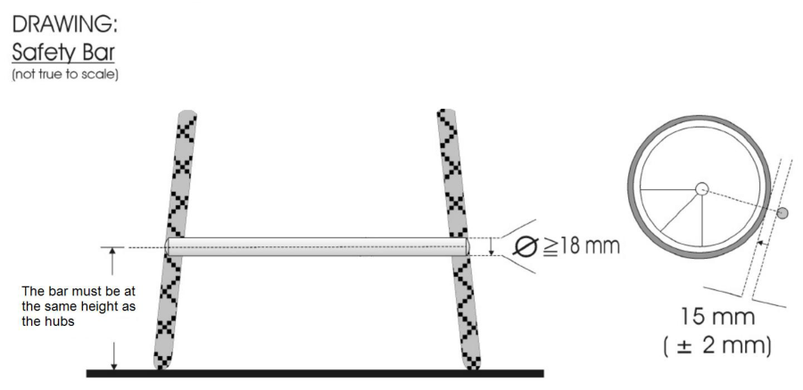
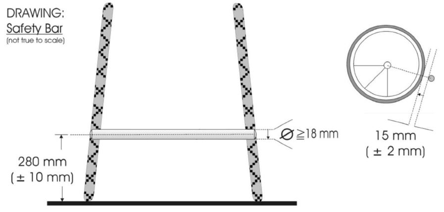

> **Amendment — tracked changes.** This document shows UCI’s amendments as tracked changes: <del>struck-through</del> text is being removed and the adjacent plain text is its replacement. Some character-level edits (numbers, word fragments) from the source PDF may display imperfectly — for the clean, in-force wording see the consolidated regulation in the sidebar or the [official PDF](https://www.uci.org/regulations/3MyLDDrwJCJJ0BGGOFzOat).

## **PART 16 PARA CYCLING** 

**Version on 01.01.2026** 

E0126 

1 

PARA CYCLING 

|**Chapter XX PARA CYCLING WORLD CUP**|**88**|
|---|---|
|**Chapter XXI WORLD CHAMPIONSHIPS QUALIFICATION SYSTEM**|**94**|
|**Chapter XXII PARALYMPIC GAMES**|**95**|
|**Chapter XXIII PARA CYCLING TECHNICAL NOTES**|**96**|
|**Chapter XXIV PARA CYCLING CALENDAR**|**97**|
|Appendix 1|99|
|Appendix 2|101|

E0126 

2 

PARA CYCLING 

## **PART 16 PARA CYCLING** 

## **Chapter I GOVERNANCE** 

- **16.1.001** The International Paralympic Committee (IPC) is the supreme authority governing para cycling at Paralympic standard where it relates to Paralympic summer Games. 

_(text modified on 26.06.07)_ 

- **16.1.002** Should no mention of a regulation exist in the UCI Para Cycling Regulations then decision should be made based on interpretation from the relevant UCI Regulation (i.e. General Organisation of cycling as a sport, Road Races, Track Races, etc.) 

_(article introduced on 01.01.2022)_ 

- **16.1.003** [article abrogated on 26.06.07] 

## **Viability of events** 

- **16.1.004** In para cycling competitions, except the Paralympic Games and the World Championships, an organizer in consultation with the UCI, may mix divisions, sport classes, age groups and gender, as necessary to produce a viable event. 

_(text modified on 26.06.07; 01.01.09; 01.10.12)_ 

## **Factored events** 

- **16.1.005** In case of factored event (gender and/or sport class), standard performance factors in the table must be applied to ensure equity between the combined sport classes.  The most recent update of the Table of standard performance factors for road and track events can be found on the Para Cycling section of the UCI website. 

_(text modified on 01.02.11; 01.10.12; 01.02.14; 01.01.16, 01.02.19, 01.01.22)_ 

- **16.1.006** _[Abrogated on 01.01.2022]_ 

E0126 

3 

PARA CYCLING 

## **Chapter II CATEGORIES** 

- **16.2.001** In para cycling competitions, except the Paralympic Games, UCI age categories described at article 1.1.034 and the following of the UCI regulations rules shall apply for both men and women. Different age categories may compete together. In para cycling combined age competitions, age category awards are not mandatory: 

   - In para cycling track and road competitions, the minimum age shall be the year of the rider’s 14[th] birthday. 

   - All road circuits for riders under 16 years old must be completely closed to other traffic. 

_(text modified on 26.06.07; 01.02.08; 01.02.11, 01.01.19, 01.01.2022)_ 

- **16.2.002** [article abrogated on 01.01.25] 

E0126 

PARA CYCLING 

4 

## **Chapter III ELIGIBILITY FOR PARA CYCLING COMPETITIONS** 

## **Athletes** 

- **16.3.001** Only athletes who have an Eligible Impairment that is permanent, and who meet the Minimum Impairment Criteria under these rules are eligible for para cycling competitions. 

Tandem pilots who are eligible under article 16.3.003 are considered athletes and must obey these regulations except when it concerns classification. 

_(text modified on 26.06.07; 01.01.09; 01.10.12; 01.07.13; 01.02.17; 01.02.18)_ 

- **16.3.002** All athletes, including tandem pilots, must hold a valid international racing license from their UCI recognised national cycling federation. This license must be presented at all para cycling competitions. 

_(text modified on 26.06.07)_ 

## **Tandem Pilots** 

- **16.3.003** Professional cyclists being members of a UCI registered team may not take part as a tandem pilot. 

_(text modified on 26.06.07)_ 

- **16.3.004** Cyclists who were members of a UCI World Team or UCI Professional Continental Team must respect a waiting period of 12 months after their contract expires before taking part as a tandem pilot. 

This waiting period comes on 1[st] January the next year after the end of the contract for cyclists who were members of one of the other UCI teams described at article 1.1.041 of the UCI rules, except for UCI Continental Teams or UCI Women’s Teams which are not subject to the waiting period. 

_(text modified on 01.01.09; 01.10.13; 01.01.16; 01.01.21)_ 

- **16.3.005** Men and women cyclists over 18 years of age, may race as tandem pilots, provided they have not been selected by their national federation in one of the following events (all disciplines): 

   - UCI World Championships (except Masters, E sports, Para Cycling and Junior) and Olympic Games – at least 12 months preceding the para cycling event; 

   - UCI series events, regional games and continental championships (i.e. Commonwealth Games, Pan-American Games, Asian Games, Mediterranean Games, European Championships, ...) – the same year of the para cycling event (except Junior). 

_(text modified on 26.06.07; 01.01.09; 01.10.11; 01.10.13; 01.01.16, 01.01.2022, 01.01.23)_ 

E0126 

PARA CYCLING 

5 

- **16.3.006** Each visually impaired athlete is allowed a maximum of one pilot for any para cycling competition. The athlete and his pilot shall have the same sporting nationality. 

_(text modified on 26.06.07; 01.01.09; 01.02.11; 01.01.16; 01.02.17)_ 

- **16.3.007** In the event of an injury or illness and upon presentation of a medical certificate, the pilot may be replaced by another pre-registered pilot up to 24 hours before the official start of the competition in which the tandem is taking part. After this deadline, no change will be allowed. 

_(article introduced on 01.02.08; text modified on 01.10.12)._ 

E0126 

6 

PARA CYCLING 

## **Chapter IV UCI CLASSIFICATION RULES AND REGULATIONS** 

## **Part One: General Provisions** 

- **16.4.001 Scope and Application** 

   - These UCI Classification Rules and Regulations are referred to throughout this document as the ‘Classification Rules’. 

They implement the requirements of the IPC Athlete Classification Code and International Standards in force. 

The Classification Rules apply to the following competitions: 

a) The Paralympic Games 

- b) World Championships 

- c) Any competition that is part of the direct qualification pathway to participate in the Paralympic Games 

- d) Any competition where Observation Assessment may take place as part of a Classification process; and 

- e) Any other Classification opportunity, event or Competition listed on the UCI Para Cycling International Calendar or specified by the UCI 

The Classification Rules may also apply to out-of-competition classification opportunity. 

The Classification Rules are supplemented by a number of Classification forms which assist Athlete Evaluation. 

## **Classification** 

Classification is undertaken to: 

- a) Define who is eligible to compete in Para Cycling and consequently who has the opportunity to reach the goal of becoming a Paralympic Athlete; and 

- b) Group eligible Athletes into Sport Classes based on the extent to which their impairment(s) impact(s) their ability to execute the specific tasks and activities fundamental to Para Cycling. 

## **Application** 

These Classification Rules apply to 

- a) The UCI and its representatives 

- b) Athletes and Athlete Support Personnel who hold a valid racing license issued by their UCI recognised national federation as defined in the UCI Cycling Regulations, and/or who participate in International Competitions and competitions sanctioned by the UCI 

- c) Classification Personnel taking part in Evaluation Sessions (whether in person or virtual) 

- d) Any other person such as (but not limited to) interpreters, trainees or experts who agrees in writing to be bound by these rules. 

## **International Classification** 

UCI will only permit an Athlete to compete in an International Competition if that Athlete has been allocated a Sport Class (other than Sport Class Not Eligible) and designated with a Sport Class Status in accordance with these Classification Rules. 

UCI will provide opportunities for Athletes to be allocated a Sport Class and designated with a Sport Class Status in accordance with these Classification Rules at International 

E0126 

PARA CYCLING 

7 

Competitions. The UCI will advise Athletes, National Federations and National Paralympic Committees in advance as to such International Competitions. 

An Athlete will only be permitted to undergo International Classification if he or she: 

- Holds a valid UCI racing license pursuant to the relevant provisions in the UCI Para Cycling Regulations, and 

- Has been entered into and competes in the UCI Para Cycling International Competition where International Classification is to take place. 

## **Interpretation and Relationship to the Code** 

Capitalised terms used in these Classification Rules have the meaning given to them in the Glossary to these Classification Rules (Appendix 2). 

These Classification Rules are to be applied and interpreted as an independent text in a manner that is consistent with the IPC Athlete Classification Code and International Standards in force. 

_(text modified on 01.02.18; 01.01.25)_ 

## **16.4.002 Roles and Responsibilities** 

These Classification Rules are to be applied and interpreted as an independent text in a manner that is consistent with the IPC Athlete Classification Code and International Standards in force. 

## **Athlete Responsibilities** 

The roles and responsibilities of Athletes include to: 

- a) be knowledgeable of and comply with all applicable policies, rules and processes established by these Classification Rules; 

- b) participate in Athlete Evaluation in good faith; 

- c) ensure when appropriate that adequate information related to Health Conditions and Eligible Impairments is provided and/or made available to the UCI; 

- d) cooperate with any investigations concerning violations of these Classification Rules; and 

- e) actively participate in the process of education and awareness, and Classification research, through exchanging personal experiences and expertise. The participation of Athletes in a Research Information Session organised by UCI when research is conducted at an event is mandatory. If research is organised during an event, it is the Athletes’ responsibility to check if their Sport Class has been selected to participate in the research. If Athletes do not attend the Research Information Session, the UCI Commissaires’ Panel may impose a fine of CHF 200. 

- f) attend their scheduled Classification appointment/slot. If an Athlete fails to attend Athlete Evaluation, the consequences specified in Article 16.4.029 apply. 

## **Athlete Support Personnel Responsibilities** 

The roles and responsibilities of Athlete Support Personnel include to: 

- a) be knowledgeable of and comply with all applicable policies, rules and processes established by these Classification Rules; 

- b) use their influence on Athlete values and behaviour to foster a positive and collaborative Classification attitude and communication; 

E0126 

8 

PARA CYCLING 

- c) assist in the development, management and implementation of Classification Systems; and 

- d) cooperate with any investigations concerning violations of these Classification Rules. 

## **Classification Personnel Responsibilities** 

The roles and responsibilities of Classification Personnel include to: 

- a) have a complete working knowledge of all applicable policies, rules and processes established by these Classification Rules; 

- b) use their influence to foster a positive and collaborative Classification attitude and communication; 

- c) assist in the development, management and implementation of Classification Systems, including participation in education and research; and 

- d) cooperate with any investigations concerning violations of these Classification Rules. 

_(text modified on 01.07.13; 01.02.17; 01.02.18, 01.02.19; 01.01.21; 01.01.25)_ 

## **16.4.003 Para Cycling Sport Classes** 

|**Handcycle**|**Tricycle**|**Cycle**|**Tandem**|
|---|---|---|---|
|H1|T1|C1|B|
|H2|T2|C2||
|H3||C3||
|H4||C4||
|H5||C5||

The UCI recommends using the codes below on UCI para-cyclists licenses: 

|Tandem|MB|WB|
|---|---|---|
||||
|Handcycle H1|MH1|WH1|
|Handcycle H2|MH2|WH2|
|Handcycle H3|MH3|WH3|
|Handcycle H4|MH4|WH4|
|Handcycle H5|MH5|WH5|
||||
|Tricycle T1|MT1|WT1|
|Tricycle T2|MT2|WT2|
||||
|Cycle C1|MC1|WC1|
|Cycle C2|MC2|WC2|
|Cycle C3|MC3|WC3|
|Cycle C4|MC4|WC4|
|Cycle C5|MC5|WC5|

The rider’s code is read as follows: 

− 1[st] letter: gender 

− 2[nd] – 3[rd] letter and number: sport class 

_(text modified on 01.02.14; 01.02.18)_ 

E0126 

9 

PARA CYCLING 

## **Part Two: Classification Personnel** 

## **16.4.004 Classification Personnel** 

- Classification Personnel are fundamental to the effective implementation of these Classification Rules. The UCI will appoint a number of Classification Personnel, each of whom will have a key role in the organisation, implementation and administration of Classification for the UCI. 

## **Head of Classification** 

The Head of Classification is a person appointed by the UCI to be responsible for the direction, administration, co-ordination and implementation of Classification matters for Para Cycling. 

If a Head of Classification cannot be appointed, the UCI may appoint another person, or group of persons collectively (provided such person or group of persons agrees to comply with the Classifier Code of Conduct), to act as the Head of Classification. 

The Head of Classification is not required to be a certified Classifier. If not a certified Classifier, the Head of Classification will work closely together with experienced Classifiers in Para Cycling. 

The Head of Classification may delegate specific responsibilities and/or transfer specific tasks to designated Classifiers, or other persons authorised by the UCI. 

Nothing in these Classification Rules prevents the Head of Classification (If certified as a Classifier) from also being appointed as a Classifier and/or Chief Classifier. 

## **Classifier** 

A Classifier is an official appointed by the UCI to conduct some or all components of Athlete Evaluation as a member of a Classification Panel. 

Such appointment shall be based on the criteria established by the UCI and may be withdrawn at its discretion. 

## **Chief Classifier** 

A Chief Classifier is a Classifier appointed by the UCI to direct, administer, co-ordinate and implement Classification matters for a specific Competition, or Classification opportunity. A Chief Classifier may be required by UCI to do the following: 

- supervise Classifiers to ensure that these Classification Rules are properly applied during Classification; 

- manage Protests in consultation with the UCI; 

- liaise with the relevant Competition organisers to ensure that all logistics are arranged in order that Classifiers may carry out their duties at the Competition. 

. 

## **Trainee Classifiers** 

A Trainee Classifier is a person who is in the process of formal training to become a Classifier for the UCI. 

The UCI may appoint Trainee Classifiers to participate in some or all components of Athlete Evaluation under the supervision of a Classification Panel, to develop the necessary Classifier competencies in order to be certified by the UCI as a Classifier. 

_(text modified on 01.05.16; 01.02.17; 01.02.18; 23.10.19; 01.01.25)_ 

E0126 

10 

PARA CYCLING 

- **16.4.005 Classifier Competencies, Training and Certification** A Classifier will be authorised to act as a Classifier if that Classifier has been certified by the UCI as having the relevant Classifier Competencies. 

The UCI will provide training and education to Classifiers to ensure Classifiers obtain and/or maintain Classifier Competencies. 

Classifier Competencies include that a Classifier must have: 

- 

   - a thorough understanding of these Classification Rules; 

- an understanding of Para Cycling, including an understanding of the technical rules of the sport; 

- an understanding of the IPC Athlete Classification Code and the International Standards in force; 

- a professional qualification(s), level of experience, skills and/or competencies to act as a Classifier for the UCI. These include that a Classifier must either: 

   - a) be a certified health professional in a field relevant to the Eligible Impairment category which the UCI at its sole discretion deems acceptable, such as a medical doctor or physiotherapist for Athletes with a Physical Impairment, who has knowledge and experience in dealing with people with physical impairments; and/or an ophthalmologist or optometrist for Athletes with a Vision Impairment; or 

   - b) have an extensive coaching or other relevant background in the sport of cycling; or a recognised and reputable academic background which encompasses a requisite level of anatomical, biomechanical and sport specific expertise, such as certified coaches, bike fit experts or experts in human movement science with the ability to analyse gait and assess the athlete on the bicycle/tricycle/handcycle, which the UCI at its sole discretion deems to be acceptable. 

The UCI has established a process of Classifier Certification by which Classifier Competencies are assessed. The Classifier Education Pathway is available on the UCI website. This process is only applicable for Classifiers being certified to classify Athletes with a Physical Impairment. 

Ophthalmologists and optometrists who classify athletes with a Vision Impairment are trained and certified by the International Blind Sports Association (IBSA) and the International Paralympic Committee (IPC). The certification awarded by IBSA and the IPC is recognised by the UCI. 

_(text modified on 01.05.16; 01.02.17; 01.02.18; 01.01.25)_ 

## **16.4.006  Classifier Code of Conduct** 

The integrity of Classification in Para Cycling depends on the conduct of Classification Personnel. The UCI has therefore adopted a set of professional conduct standards referred to as the ‘Classifier Code of Conduct’. 

All Classification Personnel must comply with the UCI Code of Ethics and the Classifier Code of Conduct. 

Classification Personnel shall at all times: 

E0126 

11 

PARA CYCLING 

- a) act as neutral evaluators in determining Sport Class and Sport Class Status for all Athletes; 

- b) Perform their duties courteously, competently, consistently and objectively for all Athletes, regardless of team affiliation or national origin; 

- c) Perform duties without yielding to any economic, political, sporting or human pressure; 

- d) Maintain confidentiality of any Classification information; 

- e) Declare any actual, perceived or potential conflicts of interest; 

- f) Refrain from assuming any other role and responsibility that conflicts with their duties as Classification Personnel at a Competition 

Any person who believes that any Classification Personnel may have acted in a manner that contravenes the Classifier Code of Conduct must report this to the UCI. 

The UCI has the discretion to determine whether or not a Classifier has an actual, perceived and/or potential conflict of interest. 

_(text modified on 01.02.18; 01.01.25)_ 

- **16.4.006bis** Classifiers shall at all times, even when not officiating as such, comply with the UCI Regulations, the Code of conduct for Classifiers and shall not cause any material or moral prejudice whatsoever to cycling as a sport or to the UCI. 

_(text introduced on 23.10.19)_ 

- **16.4.006ter** Any breach of article 16.4.006bis may be referred to the UCI Disciplinary Commission which may impose a suspension of up to 12 months, the withdrawal of the status of Classifier, as well as any other disciplinary measure provided in Part XII of the UCI Regulations. 

_(text introduced on 23.10.19)_ 

## **Part Three: The Classification Process** 

## **16.4.007 General Provisions** 

Classification is the process by which an Athlete is assessed in accordance with these Classification Rules in order to be allocated a Sport Class and designated a Sport Class Status. 

The Classification process encompasses four main assessment stages and these Classification Rules therefore include provisions regarding: 

- a) An assessment to verify that the Athlete has (or has had) at least one medically and/or clinically diagnosed Underlying Health Condition; 

- b) An assessment to verify that the Athlete has an Eligible Impairment for para cycling and that there are no inconsistencies with such reported Underlying Health Condition(s); 

- c) An assessment to determine whether the Athlete complies with the Minimum Impairment Criteria (MIC) for para cycling; and 

- d) the allocation of a Sport Class (and designation of a Sport Class Status) depending on the extent to which the Athlete is able to execute the specific tasks and activities fundamental to para cycling (with the exception for athletes with 

E0126 

12 

PARA CYCLING 

Vision Impairment where the current assessment criteria is not yet sport specific and does not include a requirement that the athletes are assessed in respect of the ‘extent to which the Athlete is able to execute the specific tasks and activities fundamental to the sport’). 

_(text modified on 01.02.18; 01.01.26)_ 

## **16.4.008 Underlying Health Condition (UHC) Assessment** 

## **Diagnostic Information** 

The UCI requires all Athletes to demonstrate that he or she has an Underlying Health Condition. Article 16.5.010 lists non-exhaustive examples of Health Conditions that are not Underlying Health Conditions. 

If the UCI becomes aware that the Athlete has a Health Condition and believes that the impact of that Health Condition may be that it is unsafe for that Athlete to compete or there is a risk to the health of the Athlete (or other Athletes) if that Athlete competes, it may designate the Athlete as Classification Not Completed (CNC) in accordance with article 16.4.012 of these Classification Rules. In such instances the UCI will explain the basis of its designation (CNC) to the relevant NF and/or NPC. 

The NF/NPC must supply the UCI with Diagnostic Information on behalf of each Athlete that must be provided as follows: 

- a) The relevant NF/NPC must submit a Medical Diagnostic Form (MDF) to the UCI, prior to the close of entries of the Competition in which the Athlete is to be classified; 

- b) the Medical Diagnostic Form (MDF) must be completed in English and dated and signed by a certified health care professional in the relevant medical field; 

- c) the Medical Diagnostic Form (MDF) must be submitted with supportive Diagnostic Information. 

The UCI may require the NF/NPC to re-submit the Medical Diagnostic Form on behalf of an Athlete (with necessary supportive Diagnostic Information) if the UCI at its sole discretion considers the Medical Diagnostic Form and/or the Diagnostic Information to be incomplete or inconsistent. 

## **UHC Assessment** 

The UCI will appoint a UHC Assessor to conduct the UHC Assessment. 

- a) The UHC Assessor is comprised of a person or persons who represent and/or work on behalf of the UCI, including staff, Classifiers, and/or external experts. The members of the UHC Assessor are bound by a confidentiality clause. 

- b) The UHC Assessor will conduct the UHC Assessment based only on the Diagnostic Information provided by the Athlete’s National Federation. 

- c) The individual members of the UHC Assessor must initially review the Athlete’s Diagnostic Information independently of each other. If the members are unable to reach a unanimous decision, the UHC Assessor must make its decision by majority. 

E0126 

13 

PARA CYCLING 

- d) If the UHC Assessor is satisfied that the Athlete has (or has had) at least one medically and/or clinically diagnosed Underlying Health Condition, they must notify the UCI of the outcome of their assessment in writing. The UCI must provide the Diagnostic Information and the UHC Assessor’s written outcome to the Classification Panel and will then proceed with scheduling an Evaluation Session. 

- e) If the UHC Assessor is not satisfied that the Athlete has (or has had) at least one medically and/or clinically diagnosed Underlying Health Condition, they must notify the UCI of the outcome and provide a written explanation for the decision. The UCI will provide a copy of the written explanation to the Athlete’s National Federation and designate the Athlete as “Not Eligible – Underlying Health Condition (Re-evaluation)” with the resulting consequences specified in Article 16.4.020. The UCI will arrange for a second independent UHC Assessor to repeat the UHC Assessment as soon as reasonably practicable. 

- f) If a second UHC Assessor is required, the second UHC Assessor may comprise one or more members. Any members of the first UHC Assessor cannot serve as a member of the second UHC Assessor. The second UHC Assessor must review all of the Diagnostic Information provided by the Athlete’s NF/NPC. Before reaching a final decision, they must also review the written explanation of the first UHC Assessor. 

- g) If the second UHC Assessor is satisfied that the Athlete has (or has had) at least one medically and/or clinically diagnosed Underlying Health Condition, they must notify the UCI of the outcome of their assessment in writing. The UCI must provide the Diagnostic Information and the UHC Assessor’s written outcome to the Classification Panel and will then proceed with scheduling an Evaluation Session. 

- h) If the second UHC Assessor is not satisfied that the Athlete has (or has had) at least one medically and/or clinically diagnosed Underlying Health Condition, they must notify the UCI of the outcome and provide a written explanation for the decision. The UCI will provide a copy of the written explanation to the Athlete’s National Federation and designate the Athlete as “Not Eligible – Underlying Health Condition” with the resulting consequences specified in Article 16.4.020. 

_(article introduced on 01.01.26)_ 

## **16.4.009 Eligible Impairment** 

Any Athlete wishing to compete in para cycling must have an Eligible Impairment which must be Permanent and capable of remaining consistent following Classification. 

Article 16.5.001 of the UCI Cycling Regulations specifies the Eligible Impairment(s) an Athlete must have in order to compete in para cycling. 

Any Impairment that is not listed as an Eligible Impairment in article 16.5.001, is referred to as a Non-Eligible Impairment. Article 16.5.009 includes non-exhaustive examples of Non-Eligible Impairments. 

## **Assessment of Eligible Impairment** 

The Assessment to determine if an Athlete has an Eligible Impairment is carried out by a Classification Panel. 

E0126 

14 

PARA CYCLING 

The Classification Panel must review the documentation relating to the UHC Assessment, namely the Athlete’s Diagnostic Information and the written outcome of the UHC Assessor. 

The process relating to the Assessment of Eligible Impairment is set out in Part Four of these Classification Rules. 

Any Athlete who does not have an Eligible Impairment for para cycling will be allocated the Sport Class Not Eligible – Eligible Impairment (NE – EI) in accordance with Article 16.4.020. 

_(text introduced on 01.02.18; 01.01.21; 01.01.26)_ 

## **16.4.010 Minimum Impairment Criteria** 

An Athlete who wishes to compete in para cycling must have an Eligible Impairment that complies with the Minimum Impairment Criteria (MIC) for para cycling. 

The UCI has set the Minimum Impairment Criteria to ensure that an Athlete’s Eligible Impairment affects the extent to which an Athlete is able to execute the specific tasks and activities fundamental to the sport. 

Chapter V of the UCI Para Cycling Regulations specifies the Minimum Impairment Criteria and the process by which an Athlete’s compliance with the Minimum Impairment Criteria is to be assessed by a Classification Panel as part of an Evaluation Session. 

Any Athlete who does not comply with the Minimum Impairment Criteria for para cycling will be allocated the Sport Class Not Eligible – Minimum Impairment Criteria (NE – MIC) in accordance with article 16.4.020. 

A Classification Panel will assess whether or not an Athlete complies with the Minimum Impairment Criteria. This will take place as part of an Evaluation Session as set out in Part Four of these Classification Rules. 

In relation to the use of Adaptive Equipment, the UCI has set the Minimum Impairment Criteria as follows: 

- a) for Eligible Impairments other than Vision Impairment, the Minimum Impairment Criteria must not consider the extent to which the use of Adaptive Equipment might affect how the Athlete is able to execute the specific tasks and activities fundamental to the sport; 

- b) for Vision Impairment, the Minimum Impairment Criteria must consider the extent to which the use of refractive or optical correction might affect the Athlete’s vision 

_(text modified on 01.02.18; 01.01.25; 01.01.26)_ 

E0126 

15 

PARA CYCLING 

## **16.4.011 Sport Class** 

A Sport Class is a category defined by the UCI in the Classification Rules, in which Athletes are grouped by reference to the impact of an Eligible Impairment on their ability to execute the specific tasks and activities fundamental to a sport. 

An Athlete who does not have an Underlying Health Condition or Eligible Impairment or does not comply with the Minimum Impairment Criteria for para cycling must be allocated Sport Class Not Eligible (NE) in accordance with article16.4.020 of these Classification Rules. 

An Athlete who complies with the Minimum Impairment Criteria for para cycling will be allocated a Sport Class (subject to the provisions in these Classification Rules concerning Failure to Attend Athlete Evaluation and Suspension of Athlete Evaluation). 

Except for the allocation of Sport Class Not Eligible (NE) by the UCI (in accordance with article 16.4.020), the allocation of a Sport Class must be based solely on an evaluation by a Classification Panel of the extent to which the Athlete’s Eligible Impairment affects the specific tasks and activities fundamental to sport. Except for the Observation in Competition Assessment, this evaluation must take place in a controlled non-competitive environment, which allows for the repeated observation of key tasks and activities. 

Chapter V of the UCI Cycling Regulations specify the assessment methodology and assessment criteria for the allocation of a Sport Class and the designation of Sport Class Status. 

_(text modified on 01.02.18; 01.01.25; 01.01.26)_ 

## **16.4.012 Classification Not Completed** 

If at any stage of Athlete Evaluation, the UCI or a Classification Panel is unable to allocate a Sport Class to an Athlete, the Head of Classification or the relevant Chief Classifier may designate that Athlete as Classification Not Completed (CNC). 

The designation Classification Not Completed (CNC) is not a Sport Class and is not subject to the provisions in these Classification Rules concerning Protests. The designation Classification Not Completed (CNC) will however be recorded for the purpose of the UCI Classification Master List. 

An Athlete who is designated as Classification Not Completed (CNC) may not compete in the sport of para cycling until Athlete Evaluation is completed (provided the Athlete is allocated a Sport Class other than Not Eligible in accordance with these Classification Rules). 

_(article introduced on 01.02.18)_ 

E0126 

16 

PARA CYCLING 

## **Part Four: Athlete Evaluation and the Classification Panel** 

## **16.4.013 The Classification Panel** 

A Classification Panel is a group of Classifiers appointed by the UCI to conduct some or all of the components of Athlete Evaluation including as part of an Evaluation Session. 

## **General Provisions** 

A Classification Panel for Athletes with a Physical Impairment consists of two UCI accredited classifiers: a medical classifier and a technical classifier. At the discretion of the UCI, a medical classifier may fill the role of a technical classifier if he/she has dual certification. 

A Classification Panel for Athletes with a Visual Impairments consists of two IPC/IBSA International Classifiers who specialise in Ophthalmology or Optometry. 

Excluding exceptional circumstances, at least one member of the Classification Panel must be of a different nationality to the Athlete being assessed. 

Excluding exceptional circumstances, the same Classification Panel must conduct all of the stages of an Evaluation Session. 

In exceptional circumstances, the UCI and/or a Chief Classifier may provide that a Classification Panel comprise: 

- only one Classifier, subject to that Classifier holding a valid medical qualification; 

- and/or Classifiers who are each of the same nationality as the Athlete being assessed. 

A Trainee Classifier may be part of a Classification Panel in addition to the required number of certified Classifiers and may participate in Athlete Evaluation. 

_(text modified on 01.02.18; 01.01.26)_ 

## **16.4.014 Classification Panel Responsibilities** 

A Classification Panel is responsible for conducting an Evaluation Session. As part of the Evaluation Session the Classification Panel must: 

- a) assess whether an Athlete has an Eligible Impairment which complies with the Minimum Impairment Criteria for para cycling; 

- b) assess the extent to which an Athlete is able to execute the specific tasks and activities fundamental to para cycling; and 

- c) conduct (if required) Observation in Competition Assessment. 

Following the Evaluation Session, the Classification Panel must allocate a Sport Class and designate a Sport Class Status, or designate Classification Not Completed (CNC). 

Except for the Observation in Competition Assessment, the Evaluation Session must take place in a controlled non-competitive environment that allows for the repeated observation of key tasks and activities. 

E0126 

17 

PARA CYCLING 

Although other factors such as low fitness level, poor technical proficiency and aging may also affect the fundamental tasks and activities of the sport, the allocation of Sport Class must not be affected by these factors. 

An Athlete who has a Non-Eligible Impairment and an Eligible Impairment may be evaluated by a Classification Panel on the basis of the Eligible Impairment, provided the Non-Eligible Impairment does not affect the Classification Panel’s ability to allocate a Sport Class. 

The Sport Class allocated to the Athlete will be in accordance with the processes specified in article 16.5.003. 

_(text modified on 01.02.18; 01.01.26)_ 

## **16.4.015 Evaluation Sessions** 

The Evaluation Session must take place in person. 

For Athletes with Physical Impairments, Evaluation Sessions must take place InCompetition, to allow for Observation Assessment if required by the Classification panel. 

For Athletes with Visual Impairments, Evaluation Sessions may take place Out-ofCompetition, if agreed to by the UCI and subject to the Evaluation Session being conducted in a manner that complies with these Classification Rules. 

The Athlete’s NF or NPC is responsible for ensuring that Athletes comply with their duties as set out in this article. 

## In respect of Athletes: 

- Athletes have the right to be accompanied by a member of the Athlete’s NF or NPC when attending an Evaluation Session. The Athlete must be accompanied if he/she is a minor. 

- The person chosen by the Athlete to accompany him/her at an Evaluation Session should be familiar with the Athlete’s Impairment and sport history. 

- The Athlete and accompanying person must acknowledge the terms of the Athlete Evaluation Consent Form as specified by the UCI. 

- The Athlete must prove his/her identity to the satisfaction of the Classification Panel, by providing his/her UCI Licence. 

- The Athlete must attend the Evaluation Session in sports attire and must bring all equipment used in competition, including the bicycle, tricycle or handcycle, helmet, orthopaedic brace(s), prosthesis(es), and any other equipment. 

   - Any modification of the bicycle, tricycle or handcycle (e.g. support) must be submitted to the UCI for approval in accordance with the established procedure and article 16.14.002; 

   - The Athlete is evaluated together with his/her orthopaedic brace/prosthesis and may entail a change of Sport Class or even division. All orthopaedic braces/prostheses must be submitted to the UCI for its approval in accordance with the established procedure; 

E0126 

18 

PARA CYCLING 

- The Athlete must disclose the use of any medication and/or medical device/implant to the Classification Panel. 

- The Athlete must comply with all reasonable instructions given by the Classification Panel. 

In respect of the Classification Panel: 

- The Classification Panel will conduct Evaluation Sessions in English. For the sake of clarity, the NF/NPC may conduct National Classification Evaluation Sessions in another language. If the Athlete requires an interpreter, a member of the Athlete’s NF/NPC will be responsible for arranging for an interpreter. The interpreter is permitted to attend the Evaluation Session in addition to the member of the Athletes NF/NPC who is accompanying the Athlete at the Evaluation Session. 

- The Classification Panel may at any stage seek medical, technical or scientific opinion(s), with the agreement of the Head of Classification and/or a Chief Classifier if the Classification Panel feels that such opinion(s) is necessary to allocate a Sport Class. 

- In addition to any medical, technical or scientific opinion(s) sought, a Classification Panel may only have regard to evidence supplied to it by the relevant Athlete, NF, NPC and UCI (from any source) when allocating a Sport Class. The Classification Panel may request at any stage that an Athlete’s National Federation provide additional information (including Diagnostic Information) that the Classification Panel believes is necessary for it to complete the Evaluation Session. 

- The Classification Panel may make, create or use video footage and/or other records to assist it when allocating a Sport Class. 

- The Classification Panel must record their assessments at each stage of Classification in writing, and provide a copy of such records to the UCI. 

- If the Athlete has previously undergone one or more Evaluation Session, the Classification Panel must review the applicable forms, records and reports from the previous Classification Panel(s) prior to reaching a final decision. 

- The Classification Panel may at any time require the Athlete to redo any prior stages of the Evaluation Session if it considers it necessary to do so. 

_(text modified on 01.02.18; 01.01.21; 01.01.25; 01.01.26)_ 

## **16.4.016 Observation in Competition** 

A Classification Panel may require that an Athlete undertake Observation in Competition Assessment before it allocates a final Sport Class and designates a Sport Class Status to that Athlete. 

Observation in Competition Assessment is undertaken so that the Classification Panel can complete its determination as to the extent to which an Eligible Impairment affects that Athlete’s ability to execute the specific tasks and activities fundamental to para cycling and in order to ensure that what is observed in Competition is consistent with what was observed in the previous stages of Classification. 

If a Classification Panel requires an Athlete to complete Observation in Competition, the Athlete will be entered in the Competition with the Sport Class allocated by the 

E0126 

19 

PARA CYCLING 

Classification Panel after the conclusion of the initial components of the Evaluation Session. 

An Athlete who is required to complete Observation in Competition Assessment will be designated with Tracking Code: Observation Assessment (OA). This replaces the Athlete’s Sport Class Status for the duration of Observation in Competition Assessment. 

Observation in Competition Assessment must take place during First Appearance. In this regard: 

- First Appearance is the first time an Athlete competes in an Event during a Competition in a particular Sport Class. 

- First Appearance within a Sport Class applies to participation in all Events within the same Sport Class. 

- For Athletes with a Physical Impairment, First Appearance for Athletes with Sport Class Status New (N) must take place at a timed event, e.g. individual Time Trials, Individual Pursuit, etc. 

If an Athlete is: 

- a) subject to a Protest following Observation in Competition; and 

- b) the second Evaluation Session is conducted at that same Competition; and 

- c) pursuant to the second Evaluation Session the Athlete is required to undergo Observation in Competition, 

Observation in Competition must take place at the next opportunity within the Sport Class allocated to the Athlete by the Protest Panel with Tracking Code Observation Assessment (OA). 

If an Athlete is not competing or misses out on competing in a second event in the Competition where the Protest was lodged, and Observation in Competition is required by the Classification Panel, the Classification Panel must act in accordance with these regulations and the Athlete may be allocated CNC or allocated a Sport Class with a Review Sport Class Status. The Classification Panel may consult the Chief Classifier and/or the Head of Classification in making the final decision. 

Following an Observation Assessment, the Classification Panel may: 

- allocate a final Sport Class and replace the Athlete’s Tracking Code Observation Assessment (OA) by designating a Sport Class Status upon completion of First Appearance (or completion of any Observation in Competition conducted as part of a Protest). 

- require the Athlete to redo any prior stages of the Evaluation Sessions and/or undergo a further Observation Assessment. 

The Classification Panel cannot, based on the results of the Observation Assessment alone, allocate the Athlete a Sport Class that is different from the one provisionally allocated. 

E0126 

20 

PARA CYCLING 

If changes to the Sport Class or Sport Class Status of an Athlete are ultimately made following Observation in Competition and re-evaluation, the changes are effective immediately. 

The impact of an Athlete changing Sport Class after First Appearance on medals, records and results is detailed in article 16.9.002. 

_(text modified on 01.07.13; 01.02.17; 01.02.18; 01.01.21, 01.01.22; 01.01.25; 01.01.26)_ 

## **16.4.017 Sport Class Status** 

If a Classification Panel allocates a Sport Class to an Athlete, it must also designate a Sport Class Status. The Sport Class Status indicates whether or not an Athlete will be required to undertake Athlete Evaluation in the future; and if the Athlete’s Sport Class may be subject to Protest. The Sport Class Status designated to an Athlete by a Classification Panel at the conclusion of an Evaluation Session will be one of the following: 

- Confirmed (C); 

- Review at the Next Available Opportunity (R); 

- Review with a Fixed Review Date (FRD); or 

- Expired (E). 

## **Sport Class Status New (N)** 

An Athlete is allocated Sport Class Status New (N) by the UCI prior to attending the Athlete’s first Evaluation Session. An Athlete with Sport Class Status New (N) must attend an Evaluation Session prior to competing at any UCI Para Cycling World Championships or World Cups, unless the UCI specifies otherwise. 

## **Sport Class Status Confirmed (C)** 

An Athlete will be designated with Sport Class Status Confirmed (C) if the Classification Panel is satisfied that both the Athlete’s Eligible Impairment and the Athlete’s ability to execute the specific tasks and activities fundamental to the sport are and will remain stable. 

An Athlete with Sport Class Status Confirmed (C) is not required to undergo any further Athlete Evaluation (save pursuant to the provisions in these Classification Rules concerning Protests, Medical Review, and changes to Sport Class criteria). 

A Classification Panel that consists of only one Classifier or two Classifiers who are of the same nationality as the Athlete being assessed may not designate an Athlete with Sport Class Status Confirmed (C) but must designate the Athlete with Sport Class Status Review at the Next Available Opportunity (R). 

## **Sport Class Status Review at the Next Available Opportunity (R)** 

An Athlete will be designated Sport Class Status Review (R) if the Classification Panel believes that further Athlete Evaluation will be required. 

E0126 

21 

PARA CYCLING 

- A Classification Panel may base its decision that further Evaluation Sessions will be required based on a number of factors, including but not limited to situations where the Athlete, has only recently entered competitions sanctioned by the UCI, has a fluctuating and/or progressive Impairment/Impairments that is/are permanent but not stable; and/or, has not reached full muscular skeletal or sports maturity. 

- An Athlete with Sport Class Status Review at the Next Available Opportunity (R) must complete Athlete Evaluation prior to competing at any subsequent International Competition, unless the UCI specifies otherwise. 

## **Sport Class Status Review with a Fixed Review Date (FRD)** 

An Athlete will be designated Sport Class Status Review with a Fixed Review Date (FRD) if the Classification Panel believes that further Athlete Evaluation will be required but will not be necessary before a set date, being the Fixed Review Date. 

- An Athlete with Sport Class Status with Fixed Review Date (FRD) will be required to attend an Evaluation Session at the first opportunity after the relevant Fixed Review Date. 

- An Athlete who has been designated Sport Class Status Review with a Fixed Review Date (FRD) may not attend an Evaluation Session prior to the relevant Fixed Review Date save pursuant to a Medical Review Request and/or Protest. 

- A Classification Panel that consists of only one Classifier or two Classifiers who are of the same nationality as the Athlete being assessed may not designate an Athlete with Sport Class Status Review with a Fixed Review Date (FRD) but must designate the Athlete with Sport Class Status Review at the Next Available Opportunity (R). 

## **Sport Class Status Expired (E)** 

An Athlete will automatically be allocated the Sport Class Status Expired (E) when they retire. If an Athlete has been allocated Sport Class "Expired (E)", the Athlete cannot compete at any Competition registered on the UCI Para Cycling Calendar unless and until the Athlete has completed a new Evaluation Session and has been allocated a Sport Class and Sport Class Status, or unless otherwise specified by the UCI. 

## **Changes to Sport Class Criteria** 

If the UCI changes any Sport Class criteria and/ or assessment methods defined in Chapter V, then: 

- The UCI may re-assign any Athlete who holds Sport Class Status Confirmed (C) with Sport Class Status Review at the Next Available Opportunity (R) or Fixed Review Date (FRD) and require that the Athlete attend an Evaluation Session at the earliest available opportunity; 

- The UCI may remove the Fixed Review Date for any Athlete and require that the Athlete attend an Evaluation Session at the earliest available opportunity; 

- in both instances the relevant National Body or National Paralympic Committee shall be informed as soon as is practicable. 

_(text modified on 01.02.11, 01.05.16; 01.02.17; 01.02.18, 01.01.22; 01.01.25; 01.01.26)_ 

E0126 

22 

PARA CYCLING 

## **16.4.018 Multiple Sport Classes** 

This Article applies to Athletes who are potentially eligible to be allocated more than one Sport Class. 

## **Athletes with Physical Impairment** 

An Athlete who has a Physical Impairment may meet the criteria for more than one Sport Class relevant to that Physical Impairment subject to any applicable UCI Regulations. Any such Athlete may be allocated one Sport Class only. 

## **Changing Sport Class** 

If an Athlete meets the criteria of more than one Sport Class, he/she may only request to change his/her preferred Sport Class: 

- a) at the end of the season when the Athlete’s first Evaluation Session was completed; or 

- b) after the close of the Paralympic Summer Games, and before the start of the next season thereafter. 

A request to change a preferred Sport Class must be made to the UCI by the Athlete’s NPC/NF in accordance with the above-mentioned time frames. 

Nothing in this article precludes an Athlete from making a Medical Review Request at any time in respect of any Sport Class. 

_(article introduced on 01.02.18)_ 

## **16.4.019 Notification of Outcomes of Athlete Evaluation** 

The outcome of Athlete Evaluation will be notified to the Athlete and/or their NF/NPC after the completion of Athlete Evaluation. 

The UCI will publish the outcomes prior to the start of the Competition through the Classification Communique. 

As per article 16.4.015, if a Classification Panel requires an Athlete to complete Observation in Competition, the Athlete will be entered in the Competition with the Sport Class that is allocated by the Classification Panel after the conclusion of the initial components of the Evaluation Session and designated with Tracking Code: Observation Assessment (OA). 

The NF/NPC or the athlete, if applicable, will be notified of the outcome as soon as practicably possible after the Athlete’s First Appearance. 

The UCI will publish the outcomes post Competition via the Classification Master List on the UCI website. 

_(text modified on 01.02.11; 01.02.17; 01.02.18; 01.01.21; 01.01.25)_ 

## **Part Five: Sport Class Not Eligible (NE)** 

## **16.4.020 Sport Class Not Eligible** 

## **General Provisions** 

If the UCI determines that an Athlete: 

- does not have an Underlying Health Condition; 

E0126 

23 

PARA CYCLING 

- or a Classification Panel determines that an Athlete: 

   - has an Impairment that is not an Eligible Impairment; or 

   - an Athlete who has an Eligible Impairment does not comply with Minimum Impairment Criteria for Para Cycling; 

the Athlete will be allocated Sport Class Not Eligible (NE). 

If an Athlete is allocated Sport Class Not Eligible (NE), this does not question the presence of a genuine Impairment. It is only a ruling on the eligibility of the Athlete to compete in the sport of Para Cycling. 

## **Absence of Underlying Health Condition** 

If the UCI determines that an Athlete does not have an Underlying Health Condition, that Athlete: 

- will not be permitted to attend an Evaluation Session; and 

- will be allocated with Sport Class Not Eligible – Underlying Health Condition (NE – UHC) 

If another International Sport Federation has allocated an Athlete with Sport Class Not Eligible – Underlying Health Condition (NE - UHC) because the Athlete does not have an Underlying Health Condition the UCI may likewise do so without the need for the process detailed in article 16.4.008 of these Classification Rules. 

An Athlete who is allocated Sport Class Not Eligible – Underlying Health Condition (NE – UHC) by the UCI is not permitted to compete in the sport of Para Cycling. 

The designation of an Athlete as Not Eligible – Underlying Health Condition is not subject to review or Protest but may be appealed in accordance with Article 16.4.035. 

## **Absence of Eligible Impairment** 

If a Classification Panel determines that an Athlete does not have an Eligible Impairment, that Athlete will be designated as Not Eligible – Eligible Impairment (Reevaluation). The Athlete is entitled to undergo a second assessment by a second Classification Panel as soon as reasonably practicable. If the second Classification Panel is not satisfied that the Athlete has an Eligible Impairment, the Athlete will be designated as Not Eligible – Eligible Impairment (NE – EI). 

An Athlete who is allocated Sport Class Not Eligible – Eligible Impairment (NE – EI) by the UCI is not permitted to compete in the sport of Para Cycling. 

The designation of an Athlete as Not Eligible – Eligible Impairment (NE – EI) is not subject to review or Protest but may be appealed in accordance with Article 16.4.035. 

## **Absence of Compliance with Minimum Impairment Criteria** 

If a Classification Panel determines that an Athlete's Eligible Impairment does not meet the Minimum Impairment Criteria for Para Cycling, that Athlete will be designated as 

E0126 

24 

PARA CYCLING 

Not Eligible – Minimum Impairment Criteria (Re-evaluation). The Athlete is entitled to undergo a second assessment by a second Classification Panel as soon as reasonably practicable. If the second Classification Panel is not satisfied that the Athlete’s Eligible Impairment meets the Minimum Impairment Criteria for Para Cycling, the Athlete will be designated as Not Eligible – Minimum Impairment Criteria (NE – MIC). 

An Athlete who is allocated Sport Class Not Eligible – Minimum Impairment Criteria (NE – MIC) by the UCI is not permitted to compete in the sport of Para Cycling based on the same Eligible Impairment(s), however the Athlete may be eligible to compete in Para Cycling based on a different Eligible Impairment. 

The designation of an Athlete as Not Eligible – Minimum Impairment Criteria (NE – MIC) is not subject to review or Protest but may be appealed in accordance with Article 16.4.035. 

If an Athlete makes (or is subject to) a Protest on a previously allocated Sport Class other than Not Eligible (NE) and is allocated Sport Class Not Eligible (NE) by a Protest Panel, the Athlete must be provided with a further and final Evaluation Session which will review the decision to allocate Sport Class Not Eligible (NE) made by the Protest Panel. 

_(text modified on 01.02.18; 01.01.21; 01.01.26)_ 

## **Part Six: Protests** 

## **16.4.021 Scope of a Protest** 

A Protest may only be made in respect of an Athlete’s Sport Class. A Protest may not be made in respect of an Athlete’s Sport Class Status. 

A Protest may not be made in respect of an Athlete who has been allocated a Sport Class Not Eligible (NE). 

_(text modified on 01.02.18)_ 

## **16.4.022 Parties Permitted to Make a Protest** 

A Protest may only be made by one of the following bodies: 

- A National Federation or a National Paralympic Committee (see articles 16.4.023 – 16.4.024); or 

- The UCI as the International Federation for Para Cycling (see articles 16.4.025 – 16.4.026). 

An Athlete is not entitled to make a Protest. A Protest must only be made on behalf of an Athlete by the Athlete’s National Federation, National Paralympic Committee or the UCI. 

_(text modified on 01.02.18, 01.01.26)_ 

E0126 

25 

PARA CYCLING 

## **16.4.023 National Protests** 

A National Federation or a National Paralympic Committee may only make a Protest in respect of an Athlete under its jurisdiction. In particular, it cannot make a Protest in respect of Sport Class allocated to an Athlete from another National Federation. However, it can raise any such concerns with the UCI, so that the UCI can consider if it wishes to make an International Federation Protest. 

A National Federation Protest may be made where there is a reasonable basis to believe that the Athlete may have been allocated an incorrect Sport Class. 

A National Protest must be submitted in connection with an Evaluation Session within one (1) hour of the outcome of Athlete Evaluation being published through an official communique following the end of an Evaluation Session or the end of an Observation Session. 

If an Athlete is required by a Classification Panel to undergo Observation in Competition Assessment, a National Federation or a National Paralympic Committee may: 

- Make a Protest both prior to and following the Observation Assessment, in which case the Protest made following the Observation Assessment cannot relate to any aspect of the Evaluation Session that preceded the Observation Assessment; or 

- Make a Protest only prior to the Observation Assessment, or only following the Observation Assessment (in which case the Protest may relate to both the aspects of the Evaluation Session that preceded the Observation Assessment and the Observation Assessment itself) 

_(text modified on 01.02.18; 01.01.21; 01.01.25; 01.01.26_ 

## **16.4.024  National Protest Procedure** 

To submit a National Protest, a National Federation or a National Paralympic Committee must demonstrate that the Protest is bona fide with supporting evidence, complete the UCI Classification Protest Form, and must include the following: 

- 

   - Details of the protested Athlete; 

- Details of the protested decision and/or a copy of the protested decision; 

- An explanation as to why the Protest has been made and the basis on which the National Federation/National Paralympic Committee believes that the protested decision is flawed; and 

- Reference to the specific rule(s) alleged to have been breached, save that if the rule referenced is a discretionary rule the Protest will not comply with this point (An example of a discretionary rule is that a Classification Panel may (as opposed to must) require that an Athlete undertake Observation in Competition assessment as part of the Athlete Evaluation. If the reference to the specific rule(s) alleged to have been breached is discretionary in nature the Protest will not comply with this point); 

The Protest Documents must be submitted to the Chief Classifier of the relevant Competition within the timeframes specified in article 16.4.023. Upon receipt of the 

E0126 

26 

PARA CYCLING 

Protest Documents the Chief Classifier will conduct a review of the Protest, in consultation with the UCI, of which there are two possible outcomes: 

- the Chief Classifier may dismiss the Protest if, in his discretion, the Protest does not comply with the Protest requirements of article 16.4.024; or 

- the Chief Classifier may accept the Protest if, in his discretion, the Protest complies with the Protest requirements of article 16.4.024. 

If the Protest is dismissed, the Chief Classifier must notify all relevant parties and provide a written explanation to the National Federation or National Paralympic Committee as soon as practicable. The NF/NPC will be invoiced for the 100 CHF protest fee. 

If the Protest is accepted: 

- the Protested Athlete’s Sport Class must remain unchanged pending the outcome of the Protest, but the Protested Athlete’s Sport Class Status must immediately be changed to Review (R), unless the Protested Athletes Sport Class Status is already Review (R); 

- the Chief Classifier will appoint a Protest Panel to conduct a new Evaluation Session as soon as possible, which must be, if practicable, at the Competition the Protest was made or at the next Competition; and 

- the Chief Classifier will notify all relevant parties of the time and date the new Evaluation Session is to be conducted by the Protest Panel. 

_(text modified on 01.02.18; 01.01.21; 01.01.26)_ 

## **16.4.025 UCI Protests** 

The UCI may, in its discretion, make a Protest at any time in respect of an Athlete under its jurisdiction if: 

- it considers an Athlete may have been allocated an incorrect Sport Class; or 

- a National Federation/National Paralympic Committee makes a reasoned request to the UCI, supported by relevant documentation. 

The assessment of the validity of the request is at the sole discretion of the UCI. 

_(text modified on 01.02.18; 01.01.21)_ 

## **16.4.026 UCI Protest Procedure** 

If the UCI decides to make a Protest, the Head of Classification will advise the relevant National Federation/National Paralympic Committee of the UCI Protest at the earliest possible opportunity. 

The Head of Classification will provide the relevant National Federation/National Paralympic Committee with a written explanation as to why the UCI Protest has been made and the basis on which the Head of Classification considers it is justified. 

If the UCI makes a Protest: 

E0126 

27 

PARA CYCLING 

- the protested Athlete’s Sport Class will remain unchanged pending the outcome of the Protest; 

- the protested Athlete’s Sport Class Status will immediately be changed to Review unless the protested Athlete’s Sport Class Status is already Review; and 

- a Protest Panel must be appointed to resolve the Protest as soon as reasonably possible. 

_(text modified on 01.02.18)_ 

## **16.4.027 Protest Panel** 

A Chief Classifier may fulfil one or more of the Head of Classification’s duties in this article if authorised to do so by the Head of Classification. 

A Protest Panel must be appointed by the Head of Classification in a manner which is consistent with the provisions for appointing a Classification Panel in these Classification Rules. 

A Protest Panel must not include any person wh <del>o::</del> 

- was a member of the Classification Panel which made the protested decision; or 

- was involved in the review or decision to accept or make such a Protest; or 

- − conducted any component of Athlete Evaluation in respect of the protested Athlete within a period of 12 months prior to the date of the protested decision, unless otherwise agreed by the National Federation/National Paralympic Committee, or the UCI (whichever is relevant). 

The Head of Classification will notify all relevant parties of the time and date of the Evaluation Session that must be conducted by the Protest Panel. 

The Protest Panel must conduct the new Evaluation Session in accordance with these Classification Rules. 

The Protest Panel may refer to the Protest Documents when conducting the new Evaluation Session. 

The Protest Panel will allocate a Sport Class and designate a Sport Class Status.  All relevant parties will be notified of the Protest Panel’s decision in a manner consistent with the provisions for notification in these Classification Rules. 

The decision of a Protest Panel in relation to both a National Protest and a UCI Protest is final. A National Federation, National Paralympic Committee or the UCI may not make another Protest at the relevant Competition. However, the decision of a Protest Panel may be appealed by the National Federation in accordance with Article 16.4.035. 

The impact of an Athlete changing Sport Class after a Protest on medals, records and results is detailed in article 16.9.002. 

_(text modified on 01.02.18; 01.01.25)_ 

E0126 

28 

PARA CYCLING 

## **16.4.028 Provisions Where No Protest Panel is Available** 

If a Protest is made at a Competition but there is no opportunity for the Protest to be resolved at that Competition: 

- the protested Athlete must be permitted to compete in the Sport Class that is the subject of the Protest with Sport Class Status Review, pending the resolution of the Protest; and 

- all reasonable steps must be taken to ensure that the Protest is resolved at the earliest opportunity. 

_(text modified on 01.02.18)_ 

## **Application during Major Competitions** 

## **16.4.029 Ad Hoc Provisions Relating to Protests** 

The IPC and/or the UCI may issue special ad hoc provisions to operate during the Paralympic Games or other Competitions. 

_(article introduced on 01.02.18)_ 

## **Part Seven: Misconduct during an Evaluation Session** 

## **16.4.030 Failure to Attend Athlete Evaluation** 

An Athlete is personally responsible for attending an Evaluation Session. 

An Athlete’s National Federation/National Paralympic Committee must take reasonable steps to ensure that the Athlete attends an Evaluation Session. 

If an Athlete fails to attend an Evaluation Session, the Classification Panel will report the failure to the Chief Classifier. The Chief Classifier may, if satisfied that a reasonable explanation exists for the failure to attend and subject to the practicalities at a Competition, specify a revised date and time for the Athlete to attend a further Evaluation Session before the classification panel. If the Athlete is unable to provide a reasonable explanation for non-attendance, or if the Athlete fails to attend an Evaluation Session on a second occasion, the Athlete will be designated as Classification Not Completed (CNC) subject to the consequences specified in article 16.4.012. 

If an Athlete does not attend his/her allocated classification appointment without prior notification, the UCI Commissaires’ Panel may impose a fine of CHF 200. 

_(text modified on 01.02.18; 01.01.25)_ 

## **16.4.031 Suspension of Athlete Evaluation** 

A Classification Panel, in consultation with the Chief Classifier, may suspend an Evaluation Session if it cannot allocate a Sport Class to the Athlete, including, but not limited to, one or more of the following circumstances: 

- a failure on the part of the Athlete to comply with any part of these Classification Rules; 

- a failure on the part of the Athlete to provide any medical information that is reasonably required by the Classification Panel; 

E0126 

29 

PARA CYCLING 

- the Classification Panel believes that the use (or non-use) of any medication and/or medical procedure/device/implant disclosed by the Athlete will affect the ability to conduct Athlete Evaluation in a fair manner; 

- the Athlete has a Health Condition that may limit or prevent from complying with requests of the Classification Panel during an Evaluation Session, which the Classification Panel considers will affect its ability to conduct the Evaluation Session in a fair manner; 

- the Athlete or their accompanying National Representative or interpreter (or any other person associated with the Athlete or the Athlete’s National Federation) is found to be photographing or recording the Evaluation Session; 

- the Athlete is unable to communicate effectively with the Classification Panel; 

- − the Athlete refuses or is unable to comply with any reasonable instructions given by any Classification Personnel to such an extent that an Evaluation Session cannot be conducted in a fair manner; and/or 

- the Athlete’s presentation of his or her abilities is inconsistent with any information available to the Classification Panel to such an extent that the Evaluation Session cannot be conducted in a fair manner. 

If an Evaluation Session is suspended by a Classification Panel, the following steps must be taken: 

- an explanation for the suspension and details of the remedial action that is required on the part of the Athlete will be provided to the Athlete and/or the relevant National Federation or National Paralympic Committee; 

- if an Athlete takes the remedial action to the satisfaction of the Chief Classifier or Head of Classification, Evaluation Session will be resumed; 

- if the Athlete fails to comply and does not take the remedial action within the timeframe specified, the Evaluation session will be terminated and the Athlete will be precluded from competing at any Competition until the determination is completed. 

If an Evaluation Session is suspended by a Classification Panel, the Classification Panel may designate the Athlete as “Classification Not Completed (CNC) in accordance with article 16.4.012 of these Classification Rules. 

A suspension of Athlete Evaluation may be subject to further investigation into any possible Intentional Misrepresentation. 

_(text modified on 01.02.18; 01.01.25)_ 

## **Part Eight: Medical Review** 

## **16.4.032 Medical Review** 

This article applies to any Athlete who has been allocated a Sport Class with Sport Class Status Confirmed (C) or Review with Fixed Review Date (FRD). 

A Medical Review Request must be made if a change in the nature or degree of an Athlete’s Impairment changes the Athlete’s ability to execute the specific tasks and activities required by a sport in a manner that is clearly distinguishable from changes attributable to levels of training, fitness and proficiency. 

A Medical Review Request must be made to the UCI by the Athletes National Federation or National Paralympic Committee (together with a 100 CHF non-refundable fee and any supporting documentation). The Medical Review Request must explain how and to what 

E0126 

30 

PARA CYCLING 

extent the Athlete’s Impairment has changed, and why it is believed that the Athlete’s ability to execute the specific tasks and activities required by a sport has changed. 

A Medical Review Request must be received by the UCI as soon as reasonably practicable. 

The Head of Classification will, in conjunction with such third parties as he or she considers appropriate, decide whether or not the Medical Review Request is upheld as soon as is practicable following receipt of the Medical Review Request. 

Any Athlete or Athlete Support Personnel who becomes aware of a change in the nature or degree of an Athlete’s Impairment changes the Athlete’s ability to execute the specific tasks and activities required by a sport but fails to draw these changes to the attention of their National Federation, National Paralympic Committee or the UCI may be investigated in respect of possible Intentional Misrepresentation. 

If a Medical Review Request is accepted, the Athlete’s Sport Class Status will be amended to Review with immediate effect. If the Medical Review Request is declined, there will be no change to the Athletes Sport Class Status and the Athlete will not be entitled to further Athlete Evaluation. 

_(text modified on 01.02.11, 01.05.16; 01.02.17; 01.02.18; 01.01.26)_ 

## **Part Nine: Intentional Misrepresentation** 

## **16.4.033 Intentional Misrepresentation** 

It is a disciplinary offence for an Athlete to intentionally misrepresent (either by act or omission) his or her skills and/or abilities and/or the degree or nature of Eligible Impairment during Athlete Evaluation and/or at any other point after the allocation of a Sport Class. This disciplinary offence is referred to as ‘Intentional Misrepresentation’. 

It will be a disciplinary offence for any Athlete or Athlete Support Personnel to assist an Athlete in committing Intentional Misrepresentation or to be in any other way involved in any other type of complicity involving Intentional Misrepresentation, including but not limited to covering up Intentional Misrepresentation or disrupting any part of the Athlete Evaluation process. 

Examples of Intentional Misrepresentation include but are not limited to: 

- submitting forged medical documentation attesting to the existence, nature, and/or degree of an Underlying Health Condition or Eligible Impairment; 

- deliberately underperforming during an Evaluation Session; 

- deliberately tiring themselves out (in the case of Athletes) or deliberately tiring the Athlete out prior to an Evaluation Session, with the intention of misleading the Classification panel; or 

- not providing accurate information or deliberately failing to notify the UCI or the Classification panel of Classification-related information 

In respect of any allegation relating to Intentional Misrepresentation, the UCI may refer the case to the UCI Disciplinary Commission which shall decide whether the Athlete or Athlete Support Personnel has committed Intentional Misrepresentation. 

The consequences to be applied to an Athlete or Athlete Support Personnel who is found to have been guilty of Intentional Misrepresentation and/or complicity involving Intentional Misrepresentation shall be one or more of the following: 

E0126 

31 

PARA CYCLING 

- disqualification from all events at the Competition at which the Intentional Misrepresentation occurred, and any subsequent Competitions at which the Athlete competed; 

- being allocated with Sport Class Not Eligible (NE) and designated a Review with Fixed Review Date (FRD) Sport Class Status for a specified period of time ranging from 1 to 4 years; 

- suspension from participation in Competitions in all sport for a specified period of time ranging from 1 to 4 years; and 

- 

- the UCI may publish their names and suspension period. 

Such allocation or suspension shall be issued by the UCI Disciplinary Commission.  The UCI may publish their names and suspension period. 

Any Athlete who is found to have been guilty of Intentional Misrepresentation and/or complicity involving Intentional Misrepresentation on more than one occasion shall be allocated Sport Class Not Eligible with Fixed Review Date Status for a period of time from four years to life. Such allocation shall be issued by the UCI Disciplinary Commission. 

Any Athlete Support Personnel who is found to have been guilty of Intentional Misrepresentation and/or complicity involving Intentional Misrepresentation on more than one occasion shall be suspended from participation in any Competition for a period of time from four years to life. Such suspension shall be issued by the UCI Disciplinary Commission. 

If another International Sports Federation brings disciplinary proceedings against an Athlete or Athlete Support Personnel in respect of Intentional Misrepresentation which results in consequences being imposed on that Athlete or Athlete Support Personnel, those consequences shall be recognised, respected and enforced by the UCI. 

Teams which include an Athlete or Athlete Support Personnel who is found to have been guilty of Intentional Misrepresentation and/or complicity involving Intentional Misrepresentation, shall be Disqualified from all events at the Competition at which the Intentional Misrepresentation occurred, and any subsequent Competitions in which the Athlete competed.  Any team, whether composed differently or not, of which such Athlete was a member, shall be Disqualified from the same Competitions as the Athlete. 

Any disciplinary action taken by the UCI pursuant to these Classification Rules must be compliant with Part XII of the UCI Regulations. 

If the UCI commences disciplinary proceedings against an Athlete or Athlete Support Personnel in respect of Intentional Misrepresentation (and/or complicity involving Intentional Misrepresentation), the UCI may impose a provisional suspension in accordance with the relevant provisions of Part XII of the UCI Regulations. 

If the UCI brings disciplinary proceedings against an Athlete or Athlete Support Personnel in respect to Intentional Misrepresentation which results in the imposition of a period of being Not Eligible, the said period of being Not Eligible must be recognised, respected and enforced by all licence-holders and National Federations. 

_(text modified on 01.01.16; 01.02.17; 01.02.18; 01.01.26)_ 

E0126 

32 

PARA CYCLING 

## **Part Ten: Appeals** 

## **16.4.034 Appeal** 

An Appeal is the process by which a formal objection to how Athlete Evaluation and/or Classification procedures have been conducted is submitted and subsequently resolved. 

_(text modified on 01.02.18)_ 

## **16.4.035 Parties Permitted to Make an Appeal** 

An Appeal may only be made by one of the following bodies: 

- a National Federation; or 

- a National Paralympic Committee 

_(text modified on 01.02.18)_ 

## **16.4.036 Appeals** 

If a National Federation or National Paralympic Committee considers there have been procedural errors made in respect of the allocation of a Sport Class and/or Sport Class Status and as a consequence an Athlete has been allocated an incorrect Sport Class or Sport Class Status, it may submit an Appeal. 

The UCI has designated the Board of Appeal of Classification (BAC) to act as the hearing body for the resolution of Appeals. 

An Appeal must be made and resolved in accordance with the applicable BAC Bylaws. 

_(text modified on 01.02.11; 01.02.17; 01.02.18)_ 

## **16.4.037 Ad Hoc Provisions Relating to Appeals** 

- The IPC and/or the UCI may issue special ad hoc provisions to operate during the Paralympic Games or other Competitions. 

_(article introduced 01.02.18)_ 

E0126 

33 

PARA CYCLING 

## **Chapter V PARA CYCLING DIVISION & SPORT CLASS PROFILES** 

## **16.5.001 Eligible Impairment Types** 

The following eight (8) impairment types are eligible in Para Cycling. Each Para Cycling division, as described in articles 16.5.005-16.5.008, defines its own list of eligible impairments. An Athlete must have at least one of the Eligible Impairment types listed in the first column of the table. The Eligible Impairment must result directly from an Underlying Health Condition (e.g. trauma, disease, dysgenesis) and must be permanent and verifiable. 

|**Eligible Impairment Type**|**Examples of an Underlying Health Condition** **that can lead to the Eligible Impairment:**|
|---|---|
|**Impaired Muscle Power** Athletes with Impaired Muscle Power have a reduced (or no) ability to contract their muscles to generate force that is consistent with an Underlying Health Condition affecting the structure and function of the central or peripheral nervous system or the muscles (including the muscle origin and muscle insertion).|Spinal cord injury (complete or incomplete, tetra-or paraplegia or paraparesis), muscular dystrophy, hereditary and peripheral neuropathies, post-polio syndrome and spina bifida.|
|**Impaired Passive Range of Movement** Athletes with Impaired Passive Range of Movement have a reduced ability for a joint to be passively moved that is consistent with an Underlying Health Condition affecting a structure of bones, joints, connective tissue, or soft tissues.|Contracture(s) and/or ankylosis resulting from chronic joint immobilisation either congenital or due to trauma or medical reasons.|
|**Limb Deficiency/Limb length difference** Athletes with Limb Deficiency or Limb Length Difference have a total or partial absence of<del>.</del>a limb or anatomically irregular limb dimensions that are consistent with an Underlying Health Condition resulting from trauma, illness, or congenital causes affecting the bones and/or joints.|Traumatic amputation, amputation due to bone cancer or dysmelia.|
|**Leg Length Difference** Athletes with Leg Length Difference have a difference in the length of their legs as a result of limb growth, or as a result of trauma.|Dysmelia and congenital or traumatic disturbance of limb growth.|
|**Hypertonia/Spasticity** Athletes with hypertonia have an increase in muscle tension that may be velocity- dependent and/or a reduced ability of a muscle to stretch, consistent with an Underlying Health Condition affecting the structure and function of the central nervous system.|Cerebral palsy, traumatic brain injury and stroke.|

E0126 

34 

PARA CYCLING 

|**Ataxia** Athletes with Ataxia have limited precision in direction and velocity of voluntary movement, consistent with an Underlying Health Condition affecting the structure and function of the central nervous system. **Inclusion:**cerebellar Ataxia only **Exclusions:**sensory ataxia, problems of control of voluntary movement that do not fit description of cerebellar Ataxia|Cerebral palsy, traumatic brain injury, stroke and multiple sclerosis.|
|---|---|
|**Dyskinesia (athetosis, dystonia, chorea)** Athletes with dyskinesia present with involuntary movements that interfere with voluntary movements, consistent with an Underlying Health Condition affecting the structure and function of the central nervous system. **Exclusions**; sleep related movement disorders|Cerebral palsy, traumatic brain injury and stroke.|
|**Vision Impairment** Athletes with Vision Impairment an Underlying Health Condition affecting the structure or function of the eye, optic nerve, optic chiasm, post chiasma visual pathways, or visual cortex of the brain resulting in reduced or no visual function even when using the best possible refractive or optical correction.|Retinitis pigmentosa and diabetic retinopathy.|

_(text modified on 01.02.10; 01.07.10; 01.02.11; 01.01.16; 01.02.17; 01.02.18; 01.01.21; 01.01.25)_ 

## **16.5.002 Minimum Impairment Criteria (MIC)** 

The UCI has set Minimum Impairment Criteria (MIC) to ensure that an Athlete’s Eligible Impairment affects the extent to which an Athlete is able to execute the specific tasks and activities fundamental to Para Cycling. The following MIC define how severe an Athlete’s impairment must be to be eligible for Para Cycling. 

|**Eligible Impairment**|**Minimum Impairment Criteria**|
|---|---|
|**Impaired Muscle Power**|Upper limb - Full loss of grip in one hand, inability to form and maintain a cylindrical grasp - Muscle Grade 0. Lower Limb - Inability to heel raise tested in single leg stance. Comparable incomplete spinal cord injury or comparable multiple impairment.|
|**Impaired Passive Range of Movement**|Loss of Passive Range of Movement with comparable effect on function as described for Impaired Muscle Power.|

E0126 

35 

PARA CYCLING 

||Upper Limb – Full loss of grip in one hand, inability to form and maintain a cyclindrical grasp – no functional hand movement due to Impaired Passive Range of Movement Lower Limb – Inability to heel raise tested in single leg stance due to Impaired Passive Range of Movement|
|---|---|
|**Limb Deficiency**|Upper Limb – Amputation of all fingers and thumb through MCP (or dysmelia with no functional grip - Muscle Grade 0). Lower Limb – Amputation of the foot through Lisfranc or comparable dysmelia.|
|**Leg Length Difference**|The difference in length between right and left legs must be equal to or more than 7cm.|
|**Hypertonia**|Spasticity grade 1 in the affected arm or leg plus clear neurological signs to demonstrate Upper Motor Neuron lesion such as: Positive unilateral or bilateral Hoffman/Babinski; Noticeably brisk reflexes or clear differences in reflexes left versus right.|
|**Ataxia**|Occasional and mild or subtle signs of Ataxia (reference to SARA scale).|
|**Athetosis**|Occasional Dyskinesia signs with mild or subtle intensity or amplitude of movement (reference to DIS Scale). Unilateral or bilateral (symmetrical/asymmetrical)|
|**Vision Impairment**|MIC for Athletes with a Vision Impairment have been set based on the Athlete's corrected vision. The difference in approach for Athletes with Vision Impairment must be seen within the historical context of Classification for these Athletes, which is an assessment with 'best correction' as used in the context of medical diagnostics for visual acuity. The Athlete must meet both of the criteria below: The Athlete must have at least one of the following Impairments: • impairment of the eye structure; • impairment of the optical nerve/optic pathways; • impairment of the visual cortex. The Athlete’s Visual Impairment must result in a visual acuity of less than or equal to LogMAR 1.0 or a visual field restricted to less than 40 degrees diameter.|

E0126 

36 

PARA CYCLING 

_(article introduced on 01.02.18; text modified on 01.01.21)_ 

## **16.5.003 Assessment Methodology** 

The following methods are used for assessing the Eligible Impairment types in Paracycling: 

|**Eligible Impairment**|**Assessment Method**|**Scale/Measurements**|
|---|---|---|
|**Impaired Muscle Power**|Manual muscle testing methods through the reference range for Para Cycling.|Daniels and Worthingham muscle grading scale (2007) and Reference range of motion for Para Cycling.|
|**Impaired Passive Range of** **Movement**|Classifier moves the joint of interest through the available range while the Athlete is relaxed.|Degrees (Clarkson H.M. Musculoskeletal assessment: joint range and manual muscle strength, 2nd edition. Philadelphia, Lippincott Williams and Wilkins, 2000).|
|**Limb Deficiency**|Standard landmarks and direct measurement of residual limb.|All measures are taken in conformity with the International Society for the Advancement of Kinantropometry (ISAK) standardized measures. All measures are taken in centimetres (cm) rounded at 1 digit behind the comma.|
|**Leg Length Difference**|Measurement of difference between legs in supine.|All measures are taken in conformity with the International Society for the Advancement of Kinantropometry (ISAK) standardized measures. All measures are taken in centimetres (cm) rounded at 1 digit behind the comma.|
|**Hypertonia**|A ‘catch’ on rapid passive movement.|Australian Spasticity Assessment Scale (ASAS) and neurological assessment.|
|**Ataxia**|Ataxic movements must be demonstrable in test of coordination and balance|Qualitative Assessment of Movement and Coordination. Scale for the assessment and Rating of Ataxia (SARA) modified for Para Cycling.|
|**Athetosis/Dystonia**|Athetosis must be evident in abnormal posturing and inability to control unwanted movements at rest and in activity.|Dyskinesia Impairment Scale (DIS) modified for Para Cycling and neurological assessment.|
|**Vision Impairment**|Visual acuity is tested using the LogMAR chart for distance visual acuity testing with Illiterate “E” and/or the Berkeley Rudimentary Vision Test. Visual field may be tested using a Goldmann Visual Field Perimeter, Humphrey Field|Visual Acuity: LogMAR and/or the Berkeley Rudimentary Vision Test. Visual Field: Goldmann Visual Field Perimeter, Humphrey Field Analyser or Octopus Interzeag.|

E0126 

37 

PARA CYCLING 

Analyser or Octopus Interzeag. The software in automatic perimeters must be for full range fields (80º or more), not only for central visual fields. The reference stimulus/isopter is Goldman III/4 or the equivalent on other equipment. 

_(article introduced on 01.02.18; text modified on 01.01.21)_ 

## **16.5.004 Sport Class Profiles** 

The UCI defines a Sport Class in which Athletes are grouped based on the impact of their Eligible Impairment on their ability to execute the specific tasks and activities fundamental to Para Cycling. The allocation of a Sport Class is based upon the provided medical information and the evaluation by the Classification Panel. 

The following Sport Class profiles determine the division and the Sport Class in which an Athlete will compete. The assessment methods for each of the Eligible Impairment types as defined in these regulations determine the severity of the Athlete’s impairment. 

Although other factors such as low fitness level, poor technical proficiency and aging may also affect the fundamental tasks and activities of the sport, allocation of Sport Class must not be affected. 

_(text modified on 01.02.18; 01.01.21)_ 

## **16.5.005 Division: Handcycle** 

Athletes classified in Hand-cycle classes H1- 4 compete using an arm powered or arm trunk power handcycle where a recumbent position is mandatory. Athletes classified in the Handcycle class H5 compete from a kneeling/sitting position. 

## **16.5.005.1 Sport Class: H1** 

## **Impaired Muscle Power** 

- Tetraplegic with impairments corresponding to a motor complete cervical lesion at C6 or above; 

- 

- 

- 

   - Complete loss of trunk stability and lower limb function; 

   - Limited extension of the elbow with a muscle score of 6 (total of both triceps) 

   - Bilateral loss of handgrip with a muscle grade 1 or a flicker; 

- Non-spinal cord injury/incomplete spinal cord injury with sport specific activity limitation, equivalent to sport class profile H1; 

## **Hypertonia** 

- Bilateral involvement (quadriplegia) symmetrical or asymmetrical (e.g. both sides equally affected or one side more than the other) with at least grade 3 spasticity in both lower and upper limbs; 

## **Ataxia/Athetosis/Dystonia** 

- 

- Severe athetosis/dystonia and (e.g. large amplitude of excessive motion and long durations of excessive motions); 

E0126 

38 

PARA CYCLING 

- A comparable mixture of ataxia/athetosis/dystonia and hypertonia/spasticity with a sport specific activity limitation equivalent to sport class H1, making it impossible to ride a bicycle or tricycle. 

_(text modified on 01.02.18; 01.01.21)_ 

## **16.5.005.2 Sport Class: H2** 

## **Impaired Muscle Power** 

- 

   - Tetraplegic with impairments corresponding to a motor complete cervical lesion at C7/C8 or above; 

- Complete loss of trunk stability and lower limb function; 

- 

   - Triceps and biceps strength at least muscle grade 3; 

- Bilateral impaired handgrip with a muscle grade of less than or equal to 3 in one hand and less than 3 in the other hand; 

- Non-spinal cord injury/incomplete spinal cord injury with a sport specific activity limitation equivalent to sport class H2; 

## **Hypertonia** 

- Asymmetric or symmetric bilateral involvement with at least grade 2 spasticity in upper limb and lower limbs, trunk control impacted by hypertonia 

- 

- Hypertonia on activity making it impossible to ride a bicycle or tricycle. 

## **Ataxia/Athetosis/Dystonia** 

- Severe athetosis/ dystonia (E.g. large amplitude of excessive motion and long durations of excessive motions) in the lower limbs and trunk, with upper limbs less affected, making it impossible to ride a bicycle or tricycle; 

- A comparable mixture of ataxia/athetosis/dystonia and hypertonia/spasticity with a sport specific activity limitation equivalent to sport class H2, making it impossible to ride a bicycle or tricycle. 

_(text modified on 01.02.10; 01.02.11; 01.02.14; 01.02.18; 01.01.21)._ 

## **16.5.005.3 Sport Class: H3** 

## **Impaired Muscle Power** 

- 

   - Paraplegic with impairments corresponding to a motor complete lesion from Th1 to Th10; 

- Trunk stability varies from very limited trunk stability (Nil to minimal muscle strength in abdominals) to limited trunk stability (reduced to normal upper and lower abdominal strength) with a muscle grade of 0-4; 

- 

   - No lower limb function 

- Non-spinal cord injury/incomplete spinal cord injury with a sport specific activity limitation equivalent to sport class H3. 

## **Hypertonia** 

- Asymmetric or symmetric bilateral involvement with at least grade 2 spasticity in lower limb/s and at least spasticity grade 1 in upper limb. Hypertonia on activity affecting trunk or legs; 

## **Ataxia/Athetosis/Dystonia** 

- Severe athetosis/dystonia (E.g. large amplitude of excessive motion and long durations of excessive motions) in the lower limbs and trunk; 

E0126 

39 

PARA CYCLING 

- A comparable mixture of ataxia/athetosis/dystonia and hypertonia/spasticity with a sport specific activity limitation equivalent to sport class H3. 

_(text modified on 01.02.10; 01.02.11; 01.02.14; 01.05.16; 01.02.18; 01.01.21; 01.01.26_ 

## **16.5.005.4 Sport Class: H4** 

Eligible impairment(s) which prevent an Athlete from using a kneeling/sitting position on a hand-cycle due to underlying health conditions. 

## **Impaired Muscle Power** 

- Paraplegic with impairments corresponding to a complete lesion from Th11 or below; 

- 

   - No lower limb function/impaired lower limb function; 

- Normal or almost normal trunk stability (normal abdominal strength, muscle grade 4-5); 

- Non-spinal cord injury/incomplete spinal cord injury with a sport specific activity limitation, equivalent to sport class H4; 

## **Impaired Passive Range of Movement** 

- Athletes with Impaired Passive Range of Movement with a lower limb sport specific activity limitation profile equivalent to sport class H4. 

## **Limb Deficiency** 

- Athletes with lower limb deficiencies that meet the criteria for H5 but have additional impairment/s which prevent the use of the kneeling/sitting position on a handcycle. 

## **Hypertonia** 

- Asymmetric or symmetrical bilateral involvement with grade 2 spasticity in the lower limbs and grade 0-1 spasticity in the upper limbs; 

- Unilateral involvement; at least grade 2 spasticity in the lower limb and grade 0- 1 spasticity in the upper limb; 

## **Ataxia/Athetosis/Dystonia** 

- 

   - Severe athetosis/dystonia (E.g. large amplitude of excessive motion and long durations of excessive motions) in the lower limbs; 

- A comparable mixture of ataxia/athetosis/dystonia and hypertonia/spasticity with a sport specific activity limitation equivalent to sport class H4. 

_(text modified on 01.02.10; 01.02.11; 01.02.14; 01.02.18; 01.01.21; 01.01.26)_ 

## **16.5.005.5 Sport Class: H5** 

Athletes who can use the kneeling/sitting position must use this position. 

## **Impaired Muscle Power** 

- 

   - Paraplegic with impairments corresponding to a complete lesion from Th11 or below; 

- Normal abdominal strength, and normal trunk extension strength (e.g. normal trunk control); 

E0126 

40 

PARA CYCLING 

## **Limb Deficiency** 

- 

- Athletes who meet the Minimum Impairment Criteria for lower limb deficiency; 

## **Hypertonia** 

- 

   - Asymmetric or symmetrical bilateral involvement, lower limbs affected and upper limbs normal or near normal; 

- Unilateral moderate/severe involvement; at least grade 2 spasticity in the lower limb and grade 0-1 spasticity in the upper limb; 

- Mild/normal trunk involvement; 

- Hypertonia on activity; 

## **Ataxia/Athetosis/Dystonia** 

- Asymmetric or symmetrical bilateral involvement, mild – moderate; 

- − Unilateral Involvement, mild – moderate; 

- Mild/normal trunk involvement; 

_(text modified on 01.02.10; 01.02.14; 01.02.18; 01.01.21; 01.01.26)_ 

## **16.5.006 Division: Tricycle** 

Unable to ride a bicycle due to lack of balance and/or severe restriction in pedalling due to spasticity/ataxia/athetosis/dystonia. 

Severe locomotor dysfunction, can be mixed pattern (athetosis/dystonia/spasticity and/or ataxia). 

## **16.5.006.1 Sport Class: T1** 

## **Hypertonia** 

- Spasticity grade 3 in affected lower and upper limb(s); 

- 2, 3 or 4 limbs strongly affected; 

- 

   - Poor functional trunk use. 

- Hypertonia on activity in the lower and upper limbs as well as trunk affects posture and balance on tricycle. 

## **Ataxia** 

- Shows constant severe signs of ataxia. 

## **Athetosis/Dystonia** 

- Severe: Constant signs of Dystonia/Athetosis with large amplitude of movement or extreme intensity of posturing. 

_(text modified on 01.02.10; 01.02.11; 01.02.18; 01.01.21)_ 

## **16.5.006.2 Sport Class: T2** 

More fluent movement pattern and better control of tricycle. 

## **Hypertonia** 

- Spasticity grade 2 in affected lower and upper limbs limb(s). 

- − 2, 3 or 4 limbs strongly affected; 

- − Hypertonia on activity can be seen. 

E0126 

41 

PARA CYCLING 

## **Ataxia** 

- 

Shows frequent and moderate signs of Ataxia. 

## **Athetosis/Dystonia** 

- Frequent to intermittent signs of Athetosis/Dystonia with maximum to moderate intensity of posturing or amplitude of movement. 

_(text modified on 01.02.10; 01.02.11; 01.02.18; 01.01.21)_ 

## **16.5.007 Division: Cycling** 

## **16.5.007.1 Sport Class: C1** 

## **Limb Deficiency** 

- Single above knee amputation and above elbow or below elbow amputation; or 

- − Double through knee amputation; or 

- Double amputation below elbow + Single amputation above knee, no prosthesis; or 

- Double amputation below knee + Double amputation below elbow. 

## **Muscle Power/Passive Range of Movement** 

- 

- Loss of function comparable to limb deficiency profiles above. 

## **Hypertonia/Ataxia/Athetosis/Dystonia** 

Locomotor dysfunction, can be mixed pattern 

## **Hypertonia** 

- Severely affected unilateral or bilateral (symmetrical/asymmetrical); 

- 

   - Spasticity grade 3 in lower and upper limb(s); 

- Poor functional trunk use. 

## **Ataxia** 

- Shows severe signs of ataxia; 

## **Athetosis/Dystonia** 

- Severe: Constant signs of Dystonia/Athetosis with large amplitude of movement or extreme intensity of posturing; 

_(text modified on 01.02.10; 01.02.11; 01.02.17; 01.02.18; 01.01.21)_ 

## **16.5.007.2 Sport Class: C2** 

## **Limb Deficiency:** 

- Single amputation above knee, no prosthesis, may have a stump support; or 

- − Single through knee amputation with the use of prosthesis + Single above elbow amputation; or 

- Single amputation through knee with the use of a prosthesis + Double below elbow amputation; or 

- Double below knee amputation with the use of prostheses + Single above elbow amputation without the use of upper limb prosthesis; 

E0126 

42 

PARA CYCLING 

## **Muscle Power/ Passive Range of Movement** 

- 

   - Loss of function comparable to limb deficiency profiles above; 

- Limited ROM of the hip or knee or muscle weakness such that a functional full revolution of the crank is not possible. The radius of crank must be limited to 0 cm (crank is fixed). 

## **Hypertonia/Ataxia/Athetosis/Dystonia** 

Locomotor dysfunction, can be mixed pattern 

## **Hypertonia** 

- Spasticity grade 2 in impaired lower and upper limb(s) and 

- Hypertonia on activity can often be seen in one or more of the impaired limbs. 

## **Ataxia** 

- Shows frequent and moderate to severe signs of Ataxia. 

## **Athetosis/Dystonia** 

- Frequent to intermittent signs of Athetosis/Dystonia with maximum to moderate intensity of posturing or amplitude of movement; 

_(text modified on 01.02.10; 01.02.11; 01.02.18; 01.01.21)_ 

## **16.5.007.3 Sport Class: C3** 

## **Limb Deficiency** 

- Single below knee amputation with the use of a prosthesis + Single above elbow amputation, no prosthesis; or 

- Single through knee or above knee amputation with the use of a prosthesis + Single below elbow amputation; or 

- Double amputation below knee. 

## **Muscle Power/ Passive Range of Movement (ROM)** 

- 

   - Loss of function comparable to limb deficiency profiles above. 

- Limited ROM of the hip or knee such that a normal functional full revolution of the crank is not possible without use of adaptation such as crank length. 

## **Hypertonia** 

- Spasticity grade 2 in impaired lower limb(s), lower limbs more involved; 

- − Spasticity grade 1 in impaired upper limb. 

- Hypertonia on activity can often be seen. 

## **Ataxia** 

- 

Shows intermittent and mild to moderate signs of Ataxia. 

## **Athetosis/Dystonia** 

- Intermittent signs of Athetosis/Dystonia with sub-maximum to moderate intensity of posturing or amplitude of movement; 

_(text modified on 01.02.10; 01.02.11; 01.02.18; 01.01.21; 01.01.26_ 

## **16.5.007.4 Sport Class: C4** 

## **Limb Deficiency** 

- 

- Single below knee amputation, with the use of prosthesis; or 

E0126 

43 

PARA CYCLING 

- Single below knee amputation with the use of prosthesis + Single below elbow amputation; or 

- Double below elbow amputation. 

## **Muscle Power/ Passive Range of Movement (ROM)** 

- 

   - Loss of function comparable to limb deficiency profiles above. 

- Limited ROM of the hip or knee such that a normal functional full revolution of the crank is not possible without use of adaptation such as crank length. 

## **Hypertonia** 

- Spasticity grade 1 in impaired lower limb(s); 

- Spasticity grade 1 in impaired upper limb; 

- Hypertonia on activity can be seen. 

## **Ataxia** 

- 

Shows intermittent and mild or subtle signs of Ataxia. 

## **Athetosis/Dystonia** 

- Intermittent signs of Athetosis/Dystonia with moderate to mild intensity of posturing or amplitude of movement. 

_(text modified on 01.02.10; 01.02.11; 01.02.18; 01.01.21; 01.01.26)_ 

## **16.5.007.5 Sport Class: C5** 

This Sport Class is for Athletes who meet the Minimum Impairment Criteria (MIC) as detailed below: 

## **Limb Deficiency** 

- Amputation of all fingers and thumb (through MCP) or dysmelia without a functional grip; or 

- Amputation of the foot through Lisfranc or comparable dysmelia; or 

- Single above elbow amputation with or without prosthesis; or 

- Single below elbow amputation with the use of a prosthesis. 

## **Muscle Power/ Passive Range of Movement** 

- 

Loss of function comparable to limb deficiency profiles above. 

## **Leg Length Difference** 

− The difference in length between right and left legs must be equal to or more than 7cm. 

## **Hypertonia** 

- 

   - Spasticity grade 1 or more in one lower or upper limb; and 

- clear neurological signs to include: 

      - Positive uni or bilateral Hoffman/Babinski; 

      - Noticeably brisk reflexes or clear differences in reflexes left versus right. 

## **Ataxia** 

- 

Shows occasional and mild or subtle signs of Ataxia. 

## **Athetosis/Dystonia** 

E0126 

PARA CYCLING 

44 

- Occasional signs of Athetosis/Dystonia with mild or subtle intensity of posturing or amplitude of movement; 

_(text modified on 01.02.10; 01.07.10; 01.02.11; 01.02.18; 01.01.21)_ 

## **16.5.008 Division: Tandem** 

## **16.5.008.1 Sport Class B** 

This Sport Class applies to Athletes with a vision impairment (VI) who meet the Minimum Impairment Criteria. While there is one Sport Class for Athletes with a vision impairment (VI) in Para Cycling (B), athletes are designated B1, B2, B3 in the Classification Master List in accordance with the IBSA visual classes:  http://www.ibsasport.org/classification/. 

Minimum Impairment Criteria for Athletes with a Vision Impairment have been set based on the Athlete's corrected vision. The difference in approach for Athletes with Vision Impairment must be seen within the historical context of Classification for these Athletes, which is an assessment with 'best correction' as used in the context of medical diagnostics for visual acuity. 

To be eligible to compete in Para Cycling, the Athlete must meet both criteria below: 

- The Athlete must have at least one of the following Impairments: 

   - impairment of the eye structure; 

   - impairment of the optical nerve/optic pathways; 

   - impairment of the visual cortex 

- The Athlete’s Visual Impairment must result in a visual acuity of less than or equal to LogMAR 1.0 (6/60) or a visual field restricted to less than 40 degrees diameter. 

## **Assessment Methods** 

All Athlete Evaluation and Sport Class allocation will be based on the assessment of visual acuity in the eye with better visual acuity or visual field when wearing the best optical correction. 

Depending on an Athlete’s visual acuity, visual acuity is tested using the LogMAR chart for distance visual acuity testing with Illiterate “E” and/or the Berkeley Rudimentary Vision Test. 

Visual field may be tested using: Goldmann Visual Field Perimeter, Humphrey Field Analyser or Octopus Interzeag. The software in automatic perimeters must be for full range fields (80º or more), not only for central visual fields. The reference stimulus/isopter is Goldman III/4 or the equivalent on other equipment. 

Athletes who compete using any corrective devices (e.g. glasses, lenses) must attend an Evaluation Session with these devices and their prescription. 

An Athlete found to be using corrective devices during competition that were not declared during Evaluation Session may be subject to further investigation of Intentional Misrepresentation (see article 16.4.033). 

Athletes must declare any change in their optical correction to the UCI before any competition. If the Athlete has a Sport Class Status Review with Fixed Review Date or Confirmed, the Athlete’s Sport Class Status will be changed to Review. The Athlete will then undergo Athlete Evaluation prior to the next competition under the provisions of these Classification Rules. Failure to do so may result in an investigation of Intentional Misrepresentation (see article 16.4.033). 

E0126 

PARA CYCLING 

45 

Any Athlete Support Personnel accompanying the Athlete during an Evaluation Session must remain out of sight of the visual acuity charts during the Assessment. 

Under the provisions set forth in these Classification Rules, Observation Assessment does not apply to Athletes with Vision Impairment. 

_(text modified on 01.02.18)_ 

## **16.5.009 Non-Eligible Impairment Types for all Athletes** 

Any impairment that is not permanent or verifiable. 

Examples of Non-Eligible Impairments include, but are not limited to the following: 

- Pain; 

- Hearing impairment; 

- Low muscle tone; 

- Hypermobility of joints; 

- Joint instability, such as unstable shoulder joint, recurrent dislocation of a joint; 

- Impaired muscle endurance; 

- Impaired motor reflex functions; 

- Impaired cardiovascular functions; 

- Impaired respiratory functions; 

- Impaired metabolic functions; and 

- Tics and mannerisms, stereotypes and motor perseveration. 

- Vestibular impairment; and 

- Impairments stemming from psychological and/or psychosomatic causes. 

_(article introduced on 01.02.18; text modified on 01.01.21; 01.01.25)_ 

## **16.5.010** 

## **Health Conditions that are not Underlying Health Conditions for all Athletes** 

A number of Health Conditions do not lead to an Eligible Impairment and are not Underlying Health Conditions. An Athlete who has a Health Condition (including, but not limited to, one of the Health Conditions listed in the Eligible Impairments table) but who does not have an Underlying Health Condition will not be eligible to compete in Para Cycling. 

Health Conditions that primarily cause pain; primarily cause fatigue; primarily cause joint hypermobility or hypotonia; or are primarily psychological or psychosomatic in nature do _not_ lead to an Eligible Impairment. Examples include: 

- Health Conditions that primarily cause pain include myofacial pain-dysfunction syndrome, fibromyalgia or complex regional pain syndrome. 

- A Health Condition that primarily causes fatigue is chronic fatigue syndrome. 

- A Health Condition that primarily causes hypermobility or hypotonia is EhlersDanlos syndrome. 

- Health Conditions that are primarily psychological or psychosomatic in nature include conversion disorders or post-traumatic stress disorder. 

_(article introduced on 01.02.18)_ 

E0126 

46 

PARA CYCLING 

## **Chapter VI PARA CYCLING WORLD CHAMPIONSHIPS** 

## **Programme** 

- **16.6.001** See article 9.1.011 of the UCI Regulations. 

_(text modified on 26.06.07; 01.01.09; 01.07.10; 01.10.13)_ 

## **Participation** 

- **16.6.002** See article 9.2.062 and the following of the UCI Regulations. 

_(text modified on 01.02.11; 01.10.13)_ 

- **16.6.003** [article abrogated on 01.10.13] 

- **16.6.004** [article abrogated on 01.10.13] 

E0126 

PARA CYCLING 

47 

## **Chapter VII ROAD RACES** 

## **§ 1 Road Races** 

- **16.7.001** All road race courses must be completely closed to other traffic. 

_(text modified on 26.06.07; 01.01.10; 01.01.16)_ 

## **Road Race Distances** 

- **16.7.002** The maximum and minimum distances which are recommended for UCI para cycling international road races shall be: 

|**Sport Class**|**Minimum**| **Maximum**|
|---|---|---|
|B men|93 km|125 km|
|B women|78 km|105 km|
||||
|C5 men|75 km|100 km|
|C4 men|75 km|100 km|
|C3 men|60 km|80 km|
|C2 men|60 km|80 km|
|C1 men|60 km|80 km|
||||
|C5 women|60 km|80 km|
|C4 women|60 km|80 km|
|C3 women|48 km|65 km|
|C2 women|48 km|65 km|
|C1 women|48 km|65 km|
||||
|T2 men|30 km|40 km|
|T1 men|30 km|40 km|
||||
|T2 women|26 km|35 km|
|T1 women|26 km|35 km|
||||
|H5 men|60 km|80 km|
|H4 men|60 km|80 km|
|H3 men|60 km|80 km|
|H2 men|30 km|60 km|
|H1 men|30 km|60 km|
||||
|H5 women|52 km|70 km|
|H4 women|52 km|70 km|
|H3 women|52 km|70 km|
|H2 women|25 km|50 km|
|H1 women|25 km|50 km|

For courses with unique and desirable features, exceptions may be permitted at the discretion of the UCI. 

E0126 

48 

PARA CYCLING 

_(text modified on 26.06.07; 01.02.08; 01.02.09; 01.01.10; 01.02.11; 01.10.13; 01.02.14, 01.02.19; 01.01.2023; 01.01.25)_ 

## **Road Race Circuits** 

- **16.7.003** Road race circuits at all UCI Para Cycling events, should be between 7 km and 15 km. Climbs on any circuit should have a maximum of 8 % average gradient and no more than 15 % maximum on their steepest section. Total length of climbing must not be more than 25 % of the total circuit length. 

Circuits which are shorter than 7 km, longer than 15 km, or exceed the above-mentioned percentage of gradient, but with unique and desirable features, may be permitted at the discretion of the UCI. 

Tricycles, handcycles and youth category riders may use a shorter and less technically difficult circuit, at the discretion of UCI. 

The organisers shall submit to the UCI for approval a circuit which fulfil the requirements defined in the Organisation Guide. 

_(text modified on 26.06.07; 01.01.10; 01.01.16; 01.01.25)_ 

## **Starting Order for Road Races** 

- **16.7.004** The UCI may decide to have several sport classes and/or age categories start together as one group. Each sport class, age category or group thus constituted must start with a minimum time gap of two minutes to avoid the mixing of groups. 

Riders will be called to the line in the predefined lanes, by sport class, age category or group in the following order: 

1. Road Race World Champion or outgoing Road Race World Champion respectively; 

2. According to the order of the most recently published general UCI Ranking. 

Riders who need assistance at the start should place themselves near the fences to facilitate a safe start for everyone. A holder can help the rider who need assistance by holding him/her at the back of the peloton. For safety reason, holders must wear the same Team jersey as the rider and cannot wear any kind of item (backpack, wheels, cameras, etc). 

_(text modified on 01.1.09; 01.02.11; 01.10.11, 01.01.16; 01.01.2025)_ 

## **Pacing / Drafting** 

- **16.7.005** In a road race where different sport classes are starting together (combined start), pacing and drafting between those sport classes is allowed. 

In all races except the races with combined starts, any athlete taking pace or drafting from an athlete in another division, group or sport class, will be disqualified. The racing procedure will be in compliance with articles 2.4.017 to 2.4.020. 

E0126 

49 

PARA CYCLING 

_(text modified on 01.02.09; 01.07.10)_ 

- **16.7.006** [article abrogated on 01.02.09] 

- **16.7.007** Considering the nature of the impairment and the difficulty for certain athletes to grab a bottle during a race, the following measures will apply for the feeding by foot during the road races: 

   - Forbidden to feed during the first and last laps; 

   - Feeding authorized from both sides of the road. The feeding zones must be separated by at least 50 meters. 

_(article introduced on 01.02.09; modified on 01.01.2023)_ 

## **Ranking Order** 

- **16.7.007** Ranking order in para cycling international races needs to be done following this **bis** procedure: 

   1. The order of passage at the finish line; 

   2. Riders lapped; 

   3. Riders removed by Commissaires; 

   4. Abandons (DNF); 

   5. Disqualified riders (DSQ). 

   6. Did not start (DNS) 

Certain Sport Classes may be grouped together at the start of Road Race events. Groups are identified by the colour of the bibs (white or yellow). Any riders overtaken by the leader of their race shall continue competing. When the race leader finishes his last lap, all other riders shall end their race when they next cross the finish line. 

_(article introduced on 01.02.11; modified on 01.07.18; 01.02.19; 01.01.23; 01.01.26)_ 

## **§ 2 Individual Time Trials** 

- **16.7.008** For UCI Para Cycling World Championships, nations can register a maximum of three athletes in each sport class for the individual time trial. It is recommended that all courses should be completely closed to non-race traffic. The minimum requirement is complete course closure to oncoming traffic. Time trial courses can use the same circuits as those used for road races in the same program. 

_(text modified on 26.06.07; 01.01.10)_ 

E0126 

50 

PARA CYCLING 

## **Time Trial Distances** 

**16.7.009** The maximum and minimum distances which are recommended for UCI para cycling international time trials should be: 

|**Sport Class**|**Minimum**| **Maximum**|
|---|---|---|
|B men|20 km|40 km|
||||
|B women|17 km|35 km|
||||
|C5 men|17 km|35 km|
|C4 men|17 km|35 km|
|C3 men|17 km|35 km|
|C2 men|15 km|30 km|
|C1 men|15 km|30 km|
||||
|C5 women|15 km|30 km|
|C4 women|15 km|30 km|
|C3 women|12 km|25 km|
|C2 women|12 km|25 km|
|C1 women|12 km|25 km|
||||
|T2 men|12 km|25 km|
|T1 men|12 km|25 km|
||||
|T2 women|10 km|20 km|
|T1 women|10 km|20 km|
||||
|H5 men|17 km|35 km|
|H4 men|17 km|35 km|
|H3 men|17 km|35 km|
|H2 men|12 km|25 km|
|H1 men|12 km|25 km|
||||
|H5 women|15 km|30 km|
|H4 women|15 km|30 km|
|H3 women|10 km|20 km|
|H2 women|10 km|20 km|
|H1 women|10 km|20 km|

For courses with unique and desirable features, exceptions may be permitted at the discretion of the UCI. 

_(text modified on 26.06.07; 01.02.08; 01.02.09; 01.01.10; 01.02.11; 01.10.13; 01.02.14, 01.02.19; 01.01.25)_ 

E0126 

51 

PARA CYCLING 

## **Starting Order for Time Trials** 

- **16.7.010** The UCI may decide to have several sport classes and/or age categories start together as one group. 

The starting order of sport classes in time trials shall be established in such a way as to minimise the possibility of the athletes of one sport class passing the athletes of another sport class (i.e.: C5-C4-C3, etc). Within each sport class, age category or group, the starting order shall be determined as follows: 

For events that are solely time trials: 

1. The reverse order of the most recently published general UCI Ranking; 

2. The reigning Time Trial World Champion or outgoing Time Trial World Champion. 

For stage races: 

1. The reverse order of the event’s provisional general classification. 

For stage races in which the first stage is a time trial: 

1. The reverse order of the most recently published general UCI Ranking; 

2. The reigning Time Trial World Champion. 

In all cases, the commissaires panel may modify this order for the T1-2 sport classes and H division if the course is too narrow. In this special case, the starting order of the athletes will commence with the fastest riders and conclude with the slowest riders in order to ease any problems of riders passing each other during the event. 

_(text modified on 01.01.10; 01.02.11; 01.10.11)_ 

- **16.7.011** For time trial, following cars will be authorized according to the following terms: 

   - 1 following car for a nation (i.e.: including national team, individuals and any other team recommended by the National Federation) with up to six riders involved in the individual time trial, all sport classes combined; 

   - 2 following cars for a nation with 7-12 riders involved in the individual time trial, all sport classes combined; 

   - 3 following cars for a nation with 13-19 riders involved in the individual time trial, all sport classes combined; 

   - 4 following cars for a nation with over 20 riders involved in the individual time trial, all sport classes combined. 

The president of the commissaires panel can reduce the number of accredited vehicles if he considers it appropriate. All vehicle drivers must hold a UCI license issued by their national federation. 

_(text modified on 01.01.09; 01.10.11)_ 

E0126 

52 

PARA CYCLING 

## **§ 3 Team Relay (TR)** 

- **16.7.012** Races shall be for athletes of the following sport classes: 

   - Men: H5; H4; H3; H2; H1 

   - Women: H5; H4; H3; H2; H1 

A team shall be composed of three athletes plus substitutes. The team must be mixed, therefore composed with athletes coming from the sport class listed above and shall include a minimum of 1 woman rider per team. 

For all para cycling TR competitions, the maximum shall be two teams for any given structure (national team, trade team...). A third team may be registered for each structure only if it is an all-women’s team. Looking at the following table, the total of points for the three TR participants must be a maximum of nine (9) points including an athlete with a maximum scoring value of two (2) points. At the World Championships: The titles belong to athletes that compose the team. 

|**Sport Class and Gender**|**Points**|
|---|---|
|H5 men|4|
|H4 men|4|
|H3 men|3|
|H2 men|2|
|H1 men|1|
|||
|H5 women|3|
|H4 women|3|
|H3 women|2|
|H2 women|1|
|H1 women|1|

_(text modified on 01.02.11; 01.10.12; 01.02.14; 11.02.20; 01.01.26)_ 

- **16.7.013** The Team manager must give the names and sport classes that make up their team as well as the order in which the athletes will be placed in the relay. The order needs to be provided to the president of the commissaires panel at the latest 1 hour after the end of the last event involving H division athletes. This start order may not be altered subsequently. 

If the team relay is the first race involving athletes from Division H, the order needs to be provided to the president of the commissaires panel at the latest 1 hour after the team managers meeting. 

_(text modified on 01.01.11; 01.10.11; 01.01.16)_ 

- **16.7.014** The first wave of athletes will start all together and compete like in a regular road race. As soon as an athlete from a team completes his lap and passes in front of his 

E0126 

53 

PARA CYCLING 

teammates, the next athlete will start his lap. Each athlete must complete 3 rounds for a total of 9 laps per team. 

It is the responsibility of the team managers to give the start to their riders when the relay is passed to another athlete. A commissaire will supervise the relay zone and in case of a false start, a penalty of 10 seconds will be added directly to the results and the team manager will be informed by the Commissaire during the race. 

A false start consists of an athlete who takes the relay of his teammate before he crosses the relay line. Helping a rider to start by pushing or pulling his handcycle will also be considered as a false start. A false start done more than 3 seconds before the teammate crosses the relay line will automatically result in the disqualification of the team. _(article introduced on 01.01.11; text modified on 01.01.16; 01.07.18; 01.01.25)_ 

- **16.7.015** 

The staging for the following laps will be determined by team as follows: 

- World Championships and Paralympic Games: according to the result of previous World Championships (first five (5) positions) 

- World Cup; according to the current World Cup Ranking (first five (5) positions) or the final previous World Cup Ranking at the first stage of the World Cup. 

These teams will be entitled to choose their corridor for staging. The other teams staging will be done by draw. 

_(text modified on 01.02.11; 01.01.25)_ 

- **16.7.016** When a rider from a nation is lapped by the leader of the race, the nation can continue to race and it will be ranked on the base of the number of laps completed. 

_(article introduced on 01.02.11; 01.01.25)_ 

- **16.7.017** Each team is allowed two staff in the relay area in order to support its athletes. 

_(article introduced on 01.02.11)_ 

- **16.7.018** Course should be 2.5 kms length max; small climbs are allowed, 500m long max with 3% gradient max. 

_(article introduced on 01.01.25)_ 

- **16.7.019** All race courses must be equipped with at least one athlete cooling system. If the course length exceeds 12 kilometers or, if weather conditions warrant it, an additional cooling system shall be provided. 

_(article introduced on 01.01.26)_ 

E0126 

PARA CYCLING 

54 

## **Chapter VIII TRACK RACES** 

- **16.8.001** Track events are only open to athletes part of the sport classes C and B. 

_(text modified on 26.06.07; 01.02.08; 01.01.10; 01.01.16; 01.02.17)_ 

- **16.8.002** Starting blocks must be used for all sport classes during the following track events: individual pursuit, first rider of the team sprint and kilometer. 

A 15 seconds countdown will commence when the riders are secured on their bicycles and ready to start. 

_(article introduced on 01.01.09; text modified on 01.02.17; 01.01.21)_ 

## **§1 Kilometer** 

- **16.8.003** Races shall be for the following sport class and distances: 

|**Sport Class**|**Distance**|
|---|---|
|Tandem men and women - B|1000 m|
|Cycle men and women – C5; C4; C3; C2; C1|1000 m|

_(text modified on 01.02.09; 01.01.10; 01.01.25)_ 

## **§2 Individual Pursuit** 

- **16.8.004** Races shall be for the following sport class and distances: 

|**Sport Class**|**Distance**|
|---|---|
|Tandem men and women – B|4000 m|
|Cycle men and women – C5;C4|4000 m|
|Cycle men and women – C3; C2; C1|3000 m|

_(text modified on 01.02.09; 01.01.10; 01.01.25)_ 

- **16.8.005** Considering the variety in the types of impairments in the “C” division, it is recommended to match up athletes with similar impairments during the qualification for the track individual pursuit, in order not to penalise or favour certain athletes. This consideration will have precedence in the pairing of the athletes. 

_(article introduced on 01.01.09; modified on 01.01.10; 01.01.2023)_ 

- **16.8.006** When a factor is used for athletes' classification in the track individual pursuit, the athletes will evolve alone in the finals (gold-silver), (bronze-fourth) if they are not part of the same sport class and will be matched up only if they are part of the same sport class. 

_(article introduced on 01.01.09)_ 

E0126 

PARA CYCLING 

55 

## **§3 C class Sprint** 

## **Definition** 

- **16.8.007** The sprint is a race between 2 or 3 riders of the C class over 2 or 3 laps. 

_(article introduced on 01.01.25)_ 

## **Organisation of the event** 

- **16.8.008** The event shall be organised according to the table in article 16.8.024. 

_(article introduced on 01.01.25)_ 

- **16.8.009** (N) The event shall at least include: 

   - a 200 meters time trial, flying start; 

The number of semi finals and the compoisition of semi finals and finals is based on entered athletes in the event. 

_(article introduced on 01.01.25)_ 

- **16.8.010** During competitions, the sprint tournament will be based on the table of article 16.8.024. 

Prior to the first round, a qualifying 200 m time trial shall be run to determine the fastest riders taking part to the sprint tournament and the makeup of the heats. 

_(article introduced on 01.01.25)_ 

## **Sprint Race** 

- **16.8.011** On tracks of less than 333.33 metres, races shall be ridden over 3 laps. On tracks of 333.33 metres or more, races shall be ridden over 2 laps. 

_(article introduced on 01.01.25)_ 

- **16.8.012** Should a rider be the only rider to start a heat, he must only go to the starting line to be declared the winner. He need not cover the distance. 

_(article introduced on 01.01.25)_ 

- **16.8.013** The starting position shall be determined by the results of the flying 200 m qualification time. 

_(article introduced on 01.01.25)_ 

## **Race procedure** 

- **16.8.014** The start shall be given by whistle. 

_(article introduced on 01.01.25)_ 

E0126 

56 

PARA CYCLING 

- **16.8.015** The race shall begin from the Pursuit line. The rider on the inside of the track, unless overtaken, shall lead at least at walking pace and make no manoeuvre to force his opponent through until reaching the pursuit line on the opposite side of the track. Should the leading rider not respect this requirement, the race shall be restarted and the rider not at fault shall decide their starting position. 

_(article introduced on 01.01.25)_ 

- **16.8.016** A maximum of two standstills shall be permitted for each race. The maximum period for a standstill shall be 30 seconds following which, the leading rider shall be directed by the starter to continue. If he fails to do so, the starter shall stop the race and declare the other rider the winner of the heat. In a three or four-up race, the race shall be immediately rerun as a two or three-up race, without the relegated rider. 

_(article introduced on 01.01.25)_ 

- **16.8.017** Before the last 200 metres line or the start of the final sprint, riders may avail themselves of the full width of the track but must nevertheless leave sufficient space for their opponent to pass and shall refrain from any manoeuvres that could provoke a collision, a fall or cause any rider to ride off the track. 

_(article introduced on 01.01.25)_ 

- **16.8.018** During the final sprint, even if launched before the last 200 metres, each rider shall remain in his lane up to the finish, unless he has at least a clear cycle-length lead and shall not make any manoeuvre to prevent the opponent from passing. 

_(article introduced on 01.01.25)_ 

- **16.8.019** A rider may not challenge or pass on the left an opponent riding in the sprinters’ lane. 

If the leading rider leaves the sprinters’ lane and his opponent attempts to pass to his left, he may not return to that lane unless he still has a clear cycle-length lead. 

- **16.8.020** A rider passing on the right of his opponent, who is in the sprinters’ lane, may not crowd him or cause him suddenly to reduce speed. 

- **16.8.021** A rider starting the sprint outside the sprinters’ lane may not drop into that lane if it is already occupied by his opponent unless there is a clear cycle-length lead. 

_(article introduced on 01.01.25)_ 

- **16.8.022** If, in a three-up race, a rider behaves in an irregular manner to favour another rider, he shall be relegated. The race shall be immediately rerun as a two or three-up race. 

_(article introduced on 01.01.25)_ 

E0126 

PARA CYCLING 

57 

## **Race stoppages** 

## **16.8.023** 

1. In the case of a fall, the starter may stop the race. 

If the fall is caused by a competitor riding too slowly in a curve or by any other unintentional fault, the race shall be restarted and the rider not at fault shall decide their starting position. 

If the fall be intentionally caused by a competitor, that competitor shall be relegated or disqualified from the competition according to the gravity of the fault committed and the other competitor declared the winner. In three-up races, the race shall be immediately restarted with the remaining two or three riders. 

If the fall is not caused by a competitor committing a fault, the commissaires’ panel shall decide whether the race is to be restarted with the riders in the same order or whether the positions at the time of the fall should be considered final. 

2. in the case of a puncture or the breakage of an essential part of the bicycle, the starter may stop the race. Event if the race is not stopped, the commissaires’ panel shall decide whether the race is to be restarted with the riders in the same order or whether the positions at the time of the incident should be considered final. 

3. In the case of a rider losing their balance or touching their opponent or barrier before the start of the sprint, the starter may stop the race. The race shall be restarted, and the rider not a fault shall decide their starting position. 

4. In the case where a rider commits a flagrant infringement before the bell rings to indicate the start of the final lap or before the start of the sprint, whichever is sooner, the starter shall stop the race and the commissaires’ panel may relegate or disqualify the rider committing the infringement. In a three-up races, the race shall be immediately restarted with the remaining two or three riders in their same positions. 

If the rider committing the infringement is not relegated or disqualified, the race shall be restarted, and the opponent shall decide their starting position. 

_(article introduced on 01.01.25)_ 

E0126 

58 

PARA CYCLING 

## **16.8.024** Format Table for Sprint Competition based on the number of entries: 

|**Starters**|**Qualification**|**Semi finals**|**Finals**|**Final standings**|
|---|---|---|---|---|
|1|Flying 200m|None|None|Flying 200m results|
|2|Flying 200m|None|2 up single race final||
|3-5|Flying 200m|None|3 up single race final based on the top 3 flying 200m qualification times.  Results determine top 3 positions.|Sprint final and then remaining non finalists based on flying 200m times|
|6-8|Flying 200m|2 single race semi finals with 3 athletes each race. Winner qualifies for the final: Race 1 includes qualifiers 1, 4, and 6. Race 2 includes qualifiers 2,3, and 5.|2 up final with winner overall winner and second place overall 2nd place.|Final results with final standings based on finals place, then remaining non finalists based on qualifying times.|
|9+|Flying 200m|3 single race semi finals with 3 athletes in each race. Winner qualifies for the final: Race 1 includes qualifiers 1, 6, and 9 Race 2 includes qualifiers 2, 5, and 8 Race 3 includes qualifiers 3, 4, and 7|3 up single race final with final position determining the top 3 positions|Final results with final positions of the event final then remaining non finalists based on qualifying times.|

_(article introduced on 01.01.25)_ 

## **§4 Tandem Sprint** 

- **16.8.025** Races shall be for blind and visually impaired – men and women. 

_(text modified on 01.02.08)_ 

- **16.8.025** The start shall be taken from the Pursuit line. 

- **bis** 

_(text introduced on 01.01.20)_ 

- **16.8.025** The race shall be run over the distance of 3 laps. **ter** 

_(text introduced on 01.01.20)_ 

E0126 

59 

PARA CYCLING 

## **Sprint Format** 

**16.8.026** Paralympic Games and UCI World Championships 

The qualifying time for the TS will be measured over 200 m. After the qualifying round, eight fastest riders will advance to the sprint tournament. 

|**Starters**|**System**|**Event**|**Composition**|**1st**|**2nd**|
|---|---|---|---|---|---|
|8|¼ Finals 4x2 → 1=4 (in 2 heats, 3 if required)|1|N1-N8|1A1|1A2|
|||2|N2-N7|2A1|2A2|
|||3|N3-N6|3A1|3A2|
|||4|N4-N5|4A1|4A2|
|4|½ Finals 2x2 → 1=2 (in 2 heats, 3 if required)|1|1A1-4A1|1B1|1B2|
|||2|2A1-3A1|2B1|2B2|
|4|Finals 7-8 2x1 → 1=2|1|1A2-2A2|7th|8th|
||Finals 5-6 2x1 → 1=2|2|3A2- 4A2|5th|6th|
|4|Finals 2x2 → 1=2 (in 2 heats, 3 if required)|1|1B2-2B2|3rd (Bronze)|4th|
|||2|1B1-2B1|1st (Gold)|2nd (Silver)|

If a rider is disqualified in the ¼ finals, the next two highest seeds will race for 5th and 6th place. 

_(article introduced on 01.01.09; text modified on 01.07.11, 01.01.19)_ 

## **§5 Mixed Team Sprint (TS)** 

**16.8.027** Races shall be for: 

- Men – C5; C4; C3; C2; C1 

- Women – C5; C4; C3; C2; C1 

A team should be composed of three athletes plus substitutes. The team must be mixed, therefore composed with athletes coming from the sport class listed above but shall include a minimum of 1 woman rider per team. 

For all para cycling TS competitions, the maximum shall be one team for any given structure (national team, trade team...). A second team might be registered for each structure only if it is an all women’s team. Looking at the following table, the total of points for the three TS participants must be a maximum of 10 points. 

E0126 

60 

PARA CYCLING 

|**Gender, Sport Class**|**Points**|
|---|---|
|Men C5|4|
|Men C4|4|
|Men C3|3|
|Men C2|2|
|Men C1|1|
|Women C5|3|
|Women C4|3|
|Women C3|2|
|Women C2|1|
|Women C1|1|

During qualification phases, one single team can be on the track at a time, while during finals, two teams can be on the track at the same time. 

_(text modified on 26.06.07; 01.02.09; 01.01.10; 01.06.10; 01.02.11; 01.02.12; 01.01.2025)_ 

- **16.8.028** This event consists of two series. The first series is a qualifying round, where teams shall ride alone against the clock, to determine the four fastest teams which shall then contest the finals. During the finals, teams shall compete against each other. The teams having made the two best times shall ride the finals for the first and second places, the two others shall ride the finals for third and fourth places. 

_(article introduced on 01.01.09, text modified on 01.02.17)_ 

## **§6 Scratch Race** 

- **16.8.029** Articles 3.2.173 and the following apply for scratch races in track para cycling, with the exception of the provisions described below. 

_(article introduced on 01.10.13)_ 

- **16.8.030** For each sport class, the distances are the following: 

|**Sport Class**|**Distance**|
|---|---|
|Men Cycle – C5;C4;C3;C2,C1|10 km|
|Women Cycle – C5; C4; C3; C2, C1|10 km|

Each sport class will have its own event, results and award ceremony. If there are less than six (6) participants in a sport class, the sport class will be combined with the upper sport class for the conduct of the event until the minimum of six (6) athletes is reached. A medal ceremony shall be organised for each sport class after the end of the race, even if the sport classes are combined. 

E0126 

61 

PARA CYCLING 

_Example: there are 3 athletes in the MC1 sport class and 9 in the MC2 sport class. Athletes in the MC1 sport class will race with athletes in the MC2 sport class for a total of 12 athletes in a race._ 

In order not to reach the maximum number of athletes allowed on a track as provided at article 3.1.009, qualifying heats shall take place to reduce the number of riders entered according to the chart of article 3.2.175. 

Nations are allowed to enter maximum three athletes of the same sport class. 

_(article introduced on 01.10.13; text modified on 01.01.16, 01.02.19; 01.01.25)_ 

## **§7  Elimination Race** 

## **Definition** 

- **16.8.031** The Elimination Race is an individual race in which the last rider in each intermediate sprint is eliminated. Elimination Race shall be for C class – men and women. 

_(article introduced on 01.01.25)_ 

## **Organisation of the event** 

- **16.8.032** The organisation of the event shall be governed by the specific race regulations. If the number of riders exceed the track limit, qualifying heats shall take place to reduce the number of riders. All riders entered shall first participate in qualifying Scratch Race heats run over the distance as per the regulations for Scratch Race heats. The heats shall be run in such a way so as to qualify up to the track maximum number of riders, without necessarily qualifying the maximum number of riders permitted. An equal number of riders shall be eliminated from each heat, at a minimum of 2 riders per heat, among the riders who have started the race. 

All riders not qualifying to participate in the final of the Elimination Race shall be placed jointly in last position. Any riders not finishing any of the qualifying rounds shall not be placed (DNF). 

_(article introduced on 01.01.25)_ 

## **Race procedure** 

- **16.8.033** Before the start, half of the riders shall be lined up along the railings, the other half lining up in single file in the sprinter’s lane. 

_(article introduced on 01.01.25)_ 

- **16.8.034** A flying start shall be taken after one neutralised lap during which the riders shall ride in a compact group at a moderate speed. 

_(article introduced on 01.01.25)_ 

E0126 

62 

PARA CYCLING 

- **16.8.035** A sprint shall be run every third lap on tracks of less than 200 metres, every second lap on tracks of 200 metres to less than 333.33 metres, and every lap on tracks of 333.33 metres or more. 

On tracks of less than 333.33 metres, each lap that precedes the sprint shall be indicated by a bell. 

_(article introduced on 01.01.25)_ 

- **16.8.036** After each sprint the last rider, according to the position of his rear wheel on the finishing line, shall be eliminated. 

If one or more riders are lapped or abandon the race between sprints, they shall be the riders eliminated in the next sprint. 

In certain cases, the commissaires may decide to eliminate a rider other than the last rider in the sprint (for example, if a rider passes on the blue band). The president of the commissaires’ panel shall be responsible for making the final decision on who will be eliminated based on information from the judge-referee and other commissaires. 

In all cases, the decision on which riders shall be eliminated must be made and announced prior to the riders crossing the pursuit line on the back straight after the elimination sprint. If no decision can be made by this time, then no riders shall be eliminated until the next sprint. This shall be indicated by a green flag on the start line. 

An eliminated rider shall leave the track immediately, failing which he shall be penalised depending on the gravity of the situation (relegation with a warning, or disqualification). In the case where the rider does not leave the track immediately, the president of the commissaires’ panel may decide to neutralise the race in order to remove the rider. 

_(article introduced on 01.01.25)_ 

- **16.8.036** Riders eliminated shall be placed in inverse order according to the time of their **bis** elimination (for example, the first rider eliminated is placed last, the second rider eliminated is places second last, etc). 

_(article introduced on 01.01.25)_ 

- **16.8.037** The last two riders remaining in the race shall ride the final sprint. Their placing shall be based on the position of their front wheels on the finishing line. 

_(article introduced on 01.01.25)_ 

- **16.8.038** The fact that a rider may gain a lap shall not count. 

_(article introduced on 01.01.25)_ 

E0126 

63 

PARA CYCLING 

- **16.8.039** In the case of a recognized mishap by one or more riders, as decided by the president of the commissaires’ panel, the race shall immediately be neutralized for a maximum distance of the number of laps closest to 1250 metres to allow the affected riders to return to the bunch. In the case where all riders on the track suffer a recognized mishap, the race shall be neutralized for a maximum of 3 minutes to allow the affected riders to return to the race. 

The neutralization shall be indicated by a yellow flag on the start line and all riders on the track shall ride in a compact group at a moderate speed. No account shall be taken of the position of any riders off the front or back of the bunch at the time of the mishap. 

The race shall be restarted, when affected riders are back on the track or when the neutralisation is over, by the withdrawal of the yellow flag and the firing of the starter’s pistol. Any riders not able to rejoin the race at this point shall be considered as eliminated and their position determined according to the time of their elimination. The bell shall be rung the following lap to indicate the start of a sprint lap. 

Except in the case when all riders on the track suffer a recognized mishap, once four or fewer riders remain on the track, no neutralization shall be granted, and any riders not finishing shall be eliminated and their position determined according to the time of their elimination. 

_(article introduced on 01.01.25)_ 

## **§8 Mixed Tandem Team Sprint (TTS)** 

- **16.8.040** The Mixed Tandem Team Sprint is a race with two opposing teams. The first tandem of a team shall lead for two (2) laps and the second tandem for one (1) lap, for a total of three (3) laps. 

_(text introduced on 01.01.20)_ 

- **16.8.041** A team shall be composed of one (1) male tandem and one (1) female tandem from the same nation. 

_(text introduced on 01.01.20)_ 

- **16.8.042** For all Mixed Tandem Team Sprint competitions, the maximum shall be one team for any given structure (national team, trade team...). 

_(text introduced on 01.01.20)_ 

- **16.8.043** The Mixed Tandem Team Sprint is a standing start where both tandems start at the same time. 

_(text introduced on 01.01.20)_ 

- **16.8.044** The changeover zone is the same as described in article 3.2.153. 

E0126 

64 

PARA CYCLING 

_(text introduced on 01.01.20)_ 

- **16.8.045** The winner is determined by the fastest time. 

_(text introduced on 01.01.20)_ 

- **16.8.046** This event consists of two series. 

The first series is a qualifying round, where teams shall ride alone against the clock, to determine the four fastest teams which shall then contest the finals one against the other. 

Teams with the two best times will compete in the finals for the first and second place. The third and fourth fastest teams will compete in the finals for the third and fourth place. 

_(text introduced on 01.01.20)_ 

E0126 

65 

PARA CYCLING 

## **Chapter IX WORLD RECORDS** 

- **16.9.001** The world record is the exclusive property of the UCI. 

New world records will be recognised and ratified by the UCI only. 

_(text modified on 26.06.07; 01.10.11; 01.07.12)_ 

- **16.9.002** A new world record submission will only be accepted from an athlete who has a Confirmed (C), Review (R), or Fixed Review Date (FRD) status for the sport class in which the new record was set. The athlete must also possess a valid international racing licence from a UCI affiliated national cycling federation. 

Should any athlete with a review (R) sport class status change his/her sport class in the future, any world records he/she holds will be cancelled. 

_(text modified on 01.02.11; 01.07.12; 01.01.23)_ 

- **16.9.003** Only world records (except the hour records) set during a competition on the international calendar may be recognised. 

The hour record may be set during a special attempt that shall be ridden in accordance with the relevant UCI Regulations. Any special hour record attempt requires the prior written authorisation of the UCI. The authorisation is subject to the requirements described from articles 3.5.005 to 3.5.015 of the UCI Regulations. 

Only world records attempted on a traditional bicycle, as defined in articles 1.3.006 to 1.3.010 and 1.3.019 of the UCI Regulations, including tandem may be homologated. Handcycles and tricycles can therefore not make a request for the homologation of a world record. 

Records must be set on a UCI-approved track. 

_(text modified on 01.02.08; 01.02.09; 01.07.12; 01.01.16; 01.01.25)_ 

- **16.9.004** World records are solely recognised for the events and sport classes indicated in article 16.8.003, 16.8.004, 16.8.007, 16.8.009 (on 250 m track only) as well as the 200 m and the hour record. 

The para cycling hour record attempt shall be conducted according to the articles 3.5.026 to 3.5.033 of the UCI Regulations. 

_(text modified on 1.02.11; 1.10.11; 1.07.12; 01.01.16)_ 

E0126 

66 

PARA CYCLING 

- **16.9.005** A succinct report specifying the circumstances in which the record has been set shall in all cases be drawn up on the template provided by the UCI. The report shall be immediately written and signed by the UCI international commissaire, by at least one other official present and by the athlete(s) who set the record. 

See appendix 1 

_(article introduced on 01.07.12)_ 

- **16.9.006** Except for records set during the Paralympic Games, World Championships and World Cup events, no world record can be ratified if the athlete in question did not submit to an anti-doping control in accordance with the UCI Anti-doping Rules at the end of the race. For team events, all team members who have set the new record shall submit to the test. 

The costs of such an anti-doping control shall be borne by the national federation of the athlete(s) concerned. 

Any world record can be ratified only if the doping control the athlete(s) underwent has proven negative. 

_(article introduced on 01.07.12)_ 

- **16.9.007** No record shall be ratified if it does not comply with all applicable provisions. 

_(article introduced on 01.07.12)_ 

- **16.9.008** A record broken the same day shall not be ratified. 

_(article introduced on 01.07.12)_ 

- **16.9.009** Records performed during World Cup events, World Championships or Paralympic Games may be ratified by a certified copy of the official result communiqué, signed by the president of the commissaires’ panel and by the UCI Technical Delegate. 

_(article introduced on 01.07.12)_ 

- **16.09.010** A world record shall be recognised only if ratified by the UCI. 

_(article introduced on 01.07.12)_ 

- **16.09.011** A request for ratification shall be lodged by the athlete that set the record or by his national federation. To be considered, the request shall have reached the UCI headquarters at the latest one month after the date the record was set. 

_(article introduced on 01.07.12)_ 

- **16.09.012** If the UCI considers that there exist circumstances opposing ratification of a world record, it shall invite the athlete or his representative to elucidate those circumstances before 

E0126 

67 

PARA CYCLING 

taking a decision. If that is not done and if the record is not ratified the athlete may lodge an appeal with CAS. 

_(article introduced on 01.07.12)_ 

- **16.09.013** The UCI also ratifies and recognises Paralympic records. 

_(article introduced on 01.07.12)_ 

E0126 

68 

PARA CYCLING 

## **Chapter X RACE CLOTHING** 

- **16.10.001** For race clothing provisions, articles 1.3.026 and the following apply. 

_(article introduced on 01.10.13)_ 

- **16.10.002** For all sport classes in road events, athletes are required to wear a helmet in the correct sport class colour, or use an appropriately coloured helmet cover, as follows: 

|Red|C5 men / women|
|---|---|
||T2 men|
||H4 men / women|
||B men|
|White|C4 men / women|
||H3 men / women|
||B women|
||T2 women|
|Blue|C3 men / women|
||H2  men|
||T1  women|
|Black|H5  men / women|
||C2 men / women|
||T1  men|
|Yellow|C1  men / women|
||H2  women|
|Green|H1  men|
|Orange|H1 women|

The athletes’ sport classes are recognisable by using the above-mentioned helmet colours, which enable the commissaires and public to detect without delay and confusion the group they belong to. Athletes using the wrong colour helmet in road events will not be allowed to start or will be withdrawn from the race and disqualified. 

_(text modified on 26.06.07; 01.02.09; 01.01.10; 01.07.10; 01.10.13; 01.02.14; 01.01.16)_ 

## **Tandem** 

- **16.10.003** Athletes competing on a tandem must wear identical race clothing (jersey, shorts), except case described in article 1.3.063. 

_(text modified on 01.10.13; 01.10.13)_ 

## **Use of Catheters** 

- **16.10.004** It is mandatory for cyclists who use catheters or other urinary diversion devices to prevent spillage by using a catheter bag at all times. This includes during training, competition and classification. 

E0126 

69 

PARA CYCLING 

The penalty structure will be in compliance with the penalties for helmet infringements of points 3.3 and 3.4 of the table of race incidents appended to Part II. 

_(text modified on 01.02.09; 01.10.13; 01.01.26)_ 

E0126 

70 

PARA CYCLING 

# **Chapter XI MEDALS AND JERSEYS FOR UCI PARA CYCLING WORLD CHAMPIONSHIPS** 

See part IX of UCI regulations. 

E0126 

71 

PARA CYCLING 

## **Chapter XII RACE INCIDENTS AND SPECIFIC INFRINGEMENTS** 

## **Race incidents** 

- **16.12.001** The infringements related to race incidents observed in the context of para cycling road events are sanctioned as set out in the table of race incidents relating to road events defined in article 2.12.007. 

The infringements related to race incidents observed in the context of para cycling track events are sanctioned as set out in the table of race incidents relating to track events defined in article 3.10.008. 

Without prejudice to the sanctions provided for in the tables of race incidents, any licence holder who is involved in a serious race incident may be immediately disqualified by the Commissaires’ Panel. 

(text modified on 14.02.22) 

## **Specific infringements** 

- **16.12.002** The provisions of Part 12 of the UCI Regulations apply to infringements committed in the context of para cycling events. 

Should a licence-holder behave in such a way as to constitute a specific infringement within the meaning of article 12.4.002 and following, he or she may be referred to the Disciplinary Commission, whether or not he or she was already sanctioned by the Commissaires’ Panel in accordance with the table of race incidents. 

(text modified on 14.02.22) 

E0126 

72 

PARA CYCLING 

## **Chapter XIII ANTIDOPING** 

- **16.13.001** Drug testing and health checks may be carried out at any para cycling competition using UCI rules. The refusal of an athlete to submit to these checks will be treated as if the athlete tested positive, or failed a health check. 

_(text modified on 26.06.07)_ 

E0126 

73 

PARA CYCLING 

## **Chapter XIV EQUIPMENT REGULATIONS** 

- **16.14.001** All cycles used in UCI Para Cycling World Championships or in any other UCI competitions have to meet the current requirements of the UCI Regulations, (Part I, Chapter III). For morphological, or impairment reasons, exceptions may be permitted, but the principle of the UCI regulations for cycles must be followed. For example: A handlebar adaptation may be allowed for athletes with upper limb impairments, if the athlete needs the adaptation to operate gear and brake levers, there is no unfair aerodynamic advantage and safety is not compromised. Such a handlebar needs to be approved by the UCI through the procedure described at article 16.14.002 of the UCI Regulations. 

_(text modified on 26.06.07; 01.02.17)_ 

- **16.14.001** All the prevailing UCI Approval Protocols, available on the UCI website, must be **bis** respected where appropriate. 

_(article introduced on 01.10.13)_ 

- **16.14.002** All requests of homologation for prostheses, orthoses or impairment adaptations to any cycle must be submitted in writing with proper explanation and pictures to UCI for approval, in accordance with the procedure established by the UCI available on its website. Such request must be received at the UCI at least four weeks before any event that the athlete wants to participate in. In case the adaptation is approved, an identification sticker will be applied on the adaptation itself. 

Should a situation arise where an athlete must compete with a new prostheses, orthoses or impairment adaptations prior to receiving formal UCI approval, use of the prostheses, orthoses or impairment adaptations will be considered on a temporary basis by the onsite commissaire as long as the adaptation is deemed safe and within regulations.  Official approval must be completed at the next UCI official adaptation approval opportunity. 

_(text modified on 26.06.07; 01.01.10; 01.07.13; 01.02.17, 01.01.23; 01.01.25; 01.01.26)_ 

- **16.14.003** The UCI or competition officials shall not be liable for any consequences deriving from the choice of equipment and/or any adaptations used by licence-holders, nor for any defects it may have, or its non-compliance. 

- **16.14.003** In no case may an energy storage or assistance mechanism be integrated into an **bis** orthopaedic brace/prosthesis. 

Regarding mechanical orthopaedic braces/prostheses for the lower limbs, the pivot point of the axis of the knee must be at the position equivalent to that for the femur of an unaffected limb. 

_(article introduced on 01.07.13)_ 

E0126 

PARA CYCLING 

74 

- **16.14.004** Artificial handgrips and prosthesis are allowed on upper impaired limbs, but not fixed to the cycle. For reasons of safety in the event of a fall, mounted or fixed orthopaedic braces/prostheses or fastened limbs on parts of the cycle, are not allowed. In any cases, a safety mechanism has to be installed. 

Except for handcycles, a cyclist’s position shall be supported solely by the pedals, the saddle and the handlebar. 

_(text modified on 01.07.13; 01.01.2025)_ 

- **16.14.005** An athlete with above knee amputation may use a support for the thigh only if, for safety reasons, there is no fixation of the thigh to the bicycle. This means, that the support may be a half tube attached to the cycle, with a closed base and maximum of 15 cm closed side at the base. In any cases, if a fixing device is used to the half tube, a release mechanism has to be installed. 

_(text modified on 01.01.09; 01.01.10; 01.01.16; 01.02.17)_ 

- **16.14.006** Bicycles, tandems, tricycles and handcycles used in road events must have two independent braking systems. Bicycles and tandems must have an independent brake on each wheel. Disc brakes are authorised. 

Handcycle: If there is a braking system for the double wheels of a handcycle, it must act on both wheels. The braking systems must be dynamic; braking on just one wheel is not permitted. Disc brakes are authorised. 

Tricycle: Tricycles must have two braking systems, one at the front and one at the rear. The braking system on the double wheels must be dynamic and act on both wheels. Disc brakes are authorised. 

_(text modified on 01.01.10; 01.10.13; 01.02.17, 01.07.18)_ 

- **16.14.007** In UCI Para Cycling Road World Championships and UCI Para Cycling Road World Cups, where neutral race service is provided, it is probable that only standard bicycle wheels will be available. Therefore, it may not be possible to provide neutral service to tandem frames with hub spacing wider than a standard road bicycle. Also, it is very unlikely that neutral spare tricycle wheels will be available, or spare wheels suitable for handcycles, except where any wheel is interchangeable with a standard bicycle road wheel. 

_(text modified on 26.06.07; 01.01.25)_ 

- **16.14.008** With regards to the use of radio links or other means of remote communication during racing, article 2.2.024 applies. 

_(text modified on 01.02.11; 01.10.11)_ 

E0126 

PARA CYCLING 

75 

## **Chapter XV TANDEM BICYCLE** 

## **Definition** 

- **16.15.001** The tandem is a vehicle for two cyclists, with two wheels of equal diameter, which conforms to the general principles of UCI construction for bicycles. The front wheel shall be steerable by the front rider, known as the «pilot». Both riders shall face forward in the traditional cycling position and the rear wheel shall be driven by both cyclists through a system comprising pedals and chains. 

- **16.15.002** The tandem top tube and any additional strengthening tubes, may slope to suit the morphological sizes of the riders. 

- **16.15.003** [article abrogated on 01.02.17] 

E0126 

76 

PARA CYCLING 

## **CHAPTER XVI TRICYCLE** 

## **Definition** 

- **16.16.001** The tricycle is a vehicle with three wheels of equal diameter. The front wheel, or wheels, shall be steerable; the rear wheel, or wheels, shall be driven through a system comprising pedals and a chain. 

- **16.16.002** Recumbent pedal tricycles are not permitted in UCI para cycling competitions. 

   - _(text modified on 26.06.07)_ 

- **16.16.003** A tricycle with two rear wheels shall conform to UCI construction and measurements for a bicycle, including the bottom bracket, seat tube and saddle position, but excluding the rear triangle. 

- **16.16.004** A tricycle with two front steerable wheels shall conform to the general principles of UCI construction and measurements for a bicycle, including the rear triangle. 

- **16.16.005** Wheels of the tricycle may vary in diameter between 70 cm maximum and 55 cm minimum, including the tire, using conventional cycle components. Modified hub attachments may be used if necessary. The width of tricycle double wheels may vary between 85 cm maximum and 60 cm minimum, measured at the centre of each tire where the tires touch the ground. 

- **16.16.006** If a tricycle two-wheel rear axle does not have a differential, only one wheel must be driven, due to the different speeds of the wheels in bends. 

- **16.16.007** A tricycle shall not measure more than 200 cm in length and 95 cm in width overall. 

- **16.16.008** To facilitate easy mounting by the rider, the tricycle top tube may slope down rearwards, with the limit being parallel with the down tube. 

- **16.16.009** The two wheels of a tricycle may be offset a maximum of 10 cm either side of a centreline which passes through the single wheel and the frame top tube. 

E0126 

PARA CYCLING 

77 

- **16.16.010** In all races, a tricycle with two rear wheels shall be fitted with a safety bar to prevent the front wheel of a following tricycle from entering the space between the rear wheels. The safety bar must be well fixed to the tricycle so that there is no risk of the bar moving during competition. The distance from the ground to the centre of the safety bar should be the same as the distance between the ground and the middle of the hub when the tires are inflated to the pressure used in competition. The safety bar must not exceed the width of each rear wheel tire and all tube ends closed or plugged. The safety bar must be fitted 15 mm (+/- 2 mm) behind the wheels. It must be a round tube of at least 18 mm in diameters, made of adequate solid material. Both tube ends must be plugged (see drawing). 

_(text modified on 01.01.09; 01.01.10; 01.01.17; 01.08.23)_ 

E0126 

78 

PARA CYCLING 

## **Chapter XVII HANDCYCLE** 

## **Definition** 

- **16.17.001** A handcycle is either recumbent or kneeling position, three wheels vehicle with an open frame of tubular construction, which conforms to the general principles of UCI construction for bicycles, except that the chassis frame tubes need not be straight and that for the seat or backrest construction, the maximum frame tube diameter may exceed the maximum defined by the general principles of UCI. 

The single wheel may be of a different diameter to the double wheels. The front wheel, shall be steerable; the single wheel, at the front, shall be driven through a system comprising handgrips and a chain. 

The handcycle shall be propelled solely, through a chainset and conventional cycle drive train, of crank arms, chainwheels, chain and gears, with handgrips replacing foot pedals. It shall be propelled from the hands, arms and upper body mainly. 

_(text modified on 01.02.09; 01.07.10; 01.02.17; 01.01.26)_ 

- **16.17.002** In the recumbent position, the athlete must have a clear vision. As such, the horizontal of his eye line must be above the crank housing/crank set, when he is sitting with his hands on the handlebars facing forward at full extent, the tip of his shoulder blades in contact with the backrest and his head in contact with the headrest, when applicable. A quick release body harness is permitted. 

The measurement will be made as follows; from the position described above, the distance will be measured from the ground to the centre of the eyes of the athlete seated and compared to the distance between the ground and the middle of the crank housing / crank set. The distance from the eyes to the ground needs to be at least equal or greater than the distance of the middle of the crank housing to the ground. 

_(text modified on 01.01.04; 01.02.09)_ 

- **16.17.003** For the individual road race, the recumbent handcycle must have a mirror fixed at any point of the front of the bicycle in order to ensure rear view vision. 

_(text modified on 01.02.09; 01.02.11, 01.01.25)_ 

- **16.17.004** In the kneeling position, the athlete’s legs and feet must be supported and protected from the ground surface. 

_(article introduced on 01.02.09)_ 

- **16.17.005** There should be no adjustment made possible to the equipment during the race. All adjustments must be made prior to the start of the race. 

E0126 

79 

PARA CYCLING 

_(article introduced on 01.02.09)_ 

- **16.17.006** [article abrogated on 01.02.09] 

- **16.17.007** Wheels of the handcycle may vary in diameter between a minimum (ETRTO) 406 mm and a maximum of 622 mm. Modified hub attachments may be used if necessary. The width of handcycle double wheels may vary between 55 cm minimum and 70 cm maximum, measured at the centre of each tire where the tires touch the ground. 

_(text modified on 01.01.04; 01.02.09)_ 

- **16.17.008** A disk front wheel on a handcycle is only permitted for Individual Time Trial races. Rear disk wheels are accepted for all handcycle competitions. Rear disk wheels in sport class H1 to H4 events must be no more than ETRTO 406mm to ensure safety and visibility of riders. 

_(text modified on 01.02.09; 01.01.23; 01.08.23)_ 

- **16.17.009** A handcycle shall not measure more than 250 cm in length. Its maximum width shall be 75 cm overall. 

_(text modified on 01.01.04; 01.02.09; 01.01.16)_ 

- **16.17.010** The shifting device should be within the extremities of the handlebars, except for H1 and H2, who can fit their shifting device on the side of their body. 

A braking device shall be fixed on the handgrips, except for H1 and H2, who can fit their braking device on the side of their body to allow for their arm to brake or as a counter pedal system. 

Athletes in H1 and H2 may use standard handgrip assist gloves. 

_(text modified on 01.02.09; 01.01.10; 01.01.20, 01.01.25; 01.01.26)_ 

- **16.17.011** The largest chain ring shall have a guard securely fitted to protect the rider. The protection shall be made of adequate solid material and fully cover the chain ring over half of its circumference (180°) facing the rider. 

Protections which don’t fully cover the chain, such as mountain bike chain guide, are not allowed. 

_(text modified on 01.01.04; 01.01.10; 01.01.16)_ 

- **16.17.012** Any fillets, or ribs, inserted at joins between tubes, shall be for strengthening purposes only. Non-functional, aerodynamic devices are not permitted for competition. 

_(article introduced on 01.01.04; text modified on 01.02.17)_ 

E0126 

80 

PARA CYCLING 

- **16.17.013** Leg and foot rests shall be fitted as necessary, with a secure means of protecting static lower limbs from all moving parts. Handcyclists must wear shoes for safety measures. Covered foot rests are not allowed. 

_(text modified on 01.01.04; 01.02.09; 01.01.18)_ 

- **16.17.014** In all races, it is mandatory that a handcycle be fitted with a rear safety bar to prevent the front wheel of a following handcycle from entering the space between the rear wheels. A safety bar must not exceed the width of each rear wheel tire and all tube ends closed or plugged. The safety bar must be fitted 15 mm (+/- 2 mm) behind the wheels. It must be a round tube (at least 18 mm in diameters) made of adequate solid material. Both tube ends must be plugged. The distance between the ground and the bar axis must be 280 mm (+/- 10 mm). The structure and assembly of the safety bar must guarantee that normal bumps, which happen during a race, don’t affect the safe functioning of the bar (see diagram). 

_(text modified on 01.01.04; 01.02.09; 01.02.17; 01.08.23)_ 

- **16.17.015** Race numbers must be fixed vertically at the back of the handcycle, in a way that allows the commissaires, teams and neutral service to see it properly during the race. 

_(article introduced on 01.02.17)_ 

E0126 

81 

PARA CYCLING 

## **Chapter XVIII PARA CYCLING INDIVIDUAL RANKING** 

(chapter changed on 01.02.09) 

- **16.18.001** UCI has created a yearly ranking of riders per sport class and gender, on road and track. These individual rankings take in account the following events: 

   - Track: kilometer, sprint, individual pursuit, scratch race, and elimination; 

   - 

- Road: individual time trial and road race. 

This ranking shall be called «UCI Para Cycling Individual Ranking per sport class» and shall be the exclusive property of the UCI. 

_(text modified on 01.01.11; 01.10.11; 01.10.13)_ 

- **16.18.002** The International Cycling Union has created a ranking comprising a number of competitions designated each year by the UCI Management Committee. 

- **16.18.003** The ranking of each sport class shall be established according to the points obtained by riders participating in competitions on the international calendar, according to the following guidelines: 

## **International Calendar** 

Paralympic Games and World Championships: 

- Points will be awarded for each event in accordance with article 16.18.001. 

World Cup: 

- Points will be awarded for each event in accordance with article 16.18.001; 

- Points from all rounds of the World Cup to count; 

## Continental Championships: 

- 

   - Points will be awarded for each event in accordance with article 16.18.001. 

- In years when both the Continental Championships and Regional Games take place, points will only be awarded for the competition where athletes received the most points. 

## Class 1 (C1) Para Cycling competitions: 

- An athlete can earn points by competing at Class 1 competitions around the world; 

- ROAD: Only the three best results from different Class 1 events will be accumulated in the UCI Para Cycling Individual Ranking by Sport Class. 

- TRACK: Only the two best results (in individual races, i.e. kilometer, individual pursuit, scratch race, elimination, sprint or tandem sprint) from different Class 1 

E0126 

82 

PARA CYCLING 

events will be accumulated in the UCI Para Cycling Individual Ranking by Sport Class. 

Class 2 (C2) Para Cycling competitions: 

- An athlete can earn points by competing at Class 2 competitions around the world; 

- ROAD: Only the three best results from Class 2 will be accumulated in the UCI Para Cycling Individual Ranking by Sport Class. 

- TRACK: Only the two best results (in individual races, i.e. kilometer, individual pursuit, scratch race, elimination or sprint) from different Class 2 competitions will be accumulated in the UCI Para Cycling Individual Ranking by Sport Class. 

The UCI Para Cycling Individual Ranking by Sport Class is a 52-week rolling ranking and shall be drawn up at least once a week. 

_(text modified on 01.01.10; 01.02.11; 01.10.11; 01.10.13; 01.02.17; 01.01.23; 01.01.26)_ 

- **16.18.004** The number of points to gain in every individual event is fixed according to the following table: 

|**Rank**|**World** **Championships** **and** **Paralympic** **Games**|**Continental** **Championships** **and** **Regional Games**|**World Cup**|**C1**|**C2**|
|---|---|---|---|---|---|
|1|120|60|60|30|15|
|2|104|52|52|26|13|
|3|88|44|44|22|11|
|4|72|36|36|18|9|
|5|64|32|32|16|8|
|6|56|28|28|14|7|
|7|48|24|24|12|6|
|8|40|20|20|10|5|
|9|32|16|16|8|4|
|10|24|12|12|6|3|
|11|22|11|11|5|2|
|12|18|9|9|4|1|
|13|16|8|8|3||
|14|14|7|7|2||
|15|12|6|6|1||
|16|10|5|5|||
|17|8|4|4|||
|18|6|3|3|||
|19|4|2|2|||
|20|3|1|1|||

_(text modified on 01.01.10; 01.01.11; 01.01.16; 01.02.17, 01.01.19; 01.07.20; 01.01.26)_ 

E0126 

83 

PARA CYCLING 

## **16.18.005** 

   - [article abrogated on 01.01.26] 

- **16.18.006** Ties on points between riders shall be resolved by counting up the greatest number of 1[st] places, 2[nd] places, etc. on the ranking of the races of the current year, taking into account the competition giving the most points, up through the C2 races. 

- **16.18.007** National federations and organizers shall be required, immediately following the end of the race, to transmit to UCI headquarters e-mail the list of starters and complete results. For stage races and multi-race championships, this information shall be transmitted within 48 hours of the end of the last stage, or Championship event. 

The national federation of the organizer of the event shall also, within 48 hours of the final decision, communicate the downgrading of a rider to UCI headquarters. As a general practice, all national federations shall immediately communicate any facts or decisions that could result in an amendment to the points obtained by a rider. 

Should any such information not be transmitted as indicated, the UCI may declassify the race in question or exclude it from the calendar, notwithstanding any other penalties provided for in the regulations. 

_(text modified on 26.06.07; 01.02.08)_ 

- **16.18.008** The para cycling road and track individual ranking shall be drawn up at least once a week. 

If need be, the ranking of preceding week will be corrected. 

_(text modified on 26.06.07; 01.02.09; 01.01.25)_ 

- **16.18.009** [article abrogated on 01.01.21] 

- **16.18.010** 

   - [article abrogated on 01.01.21] 

- **16.18.011** In case sport classes are merged, results will be presented as a group (sport classes merged) to reflect the way the race was held. However, points will be distributed by sport class, and each athlete’s sport class must appear in the results. 

_(article introduced on 01.01.10)_ 

- **16.18.012** Before the competition, if an athlete’s Sport Class changes after the Evaluation Session, that athlete will be re-introduced in the start list in his new Sport Class provided the team quota is not filled. If the team quota is filled, all athletes of the team will be allowed to race in individual timed events but only the results of those athletes within the team quota will be counted in the ranking. The nation must nominate those athletes at the confirmation of starters. 

During the competition, if an athlete’s Sport Class changes after the observation assessment or after a protest, the athlete loses his points and his place is taken by the 

E0126 

84 

PARA CYCLING 

next athlete in the ranking, in order that all places are always occupied. In case the Sport Class change occurs after the publication of results and rankings, the changes will be made on the following publication. The same procedure will also be applied to each stage in case of stage races. 

The athlete can be re-introduced in the results and ranking of his new Sport Class if the race took place in the same session, in the same conditions and over the same distance. The re-introduction is possible only for individual timed events and if the team quota is not filled. 

The athlete will be re-introduced in the start list for the next race in his new Sport Class provided the team quota is not filled. If the team quota is filled, all athletes of the team will be allowed to race but only the results of those athletes within the team quota will be counted in the ranking. The nation must nominate those athletes as soon as the classification change is published. 

_(article introduced on 01.07.18)_ 

E0126 

85 

PARA CYCLING 

## **Chapter XIX PARA CYCLING NATIONS’ RANKING** 

_(chapter changed on 01.02.09)_ 

- **16.19.001** The UCI has established a ranking by nation on both road and track combined per gender. 

The nations’ ranking is drawn up on the basis of points obtained by the best athlete of each nation participating in international calendar competitions in accordance with article 16.18.003, for each event, sport class and gender. 

The classification status of athletes taken into account for the nations’ ranking must be Review (R), Fixed Review Date (FRD) or Confirmed (C). 

Points accumulated through the national championships are also taken into account for the nations’ ranking. 

This ranking shall be called «UCI Para Cycling Nations’ Ranking» and is a 52-week rolling ranking and shall be drawn up at least once a week. 

_(text modified on 01.07.10; 01.10.13; 01.01.2025)_ 

## **National Championships** 

- **16.19.002** Points cumulated on the nations’ ranking from the national championships will be awarded under the following principals: 

Ten (10) points will be granted to nations, by sport class (C5, C4,...) and by gender, represented at the national championships (road and track), independently of the number of events in which the athletes participate and of the number of athletes in the sport class. 

_(text modified on 01.01.10, 01.01.2025)_ 

- **16.19.003** Para cycling road and track nations’ ranking will be established on December 31st of every year. 

If need be, the nations’ ranking will be corrected. 

- **16.19.004** Points for team events will be awarded to the nations as follows, and in accordance with the table at article 16.18.004: 

   - Men and women team event rankings are drawn up separately; 

   - In the case of a mixed team (men and women), each athlete will afford to his nation a third of the points available in either the men or women team event ranking (e.g.: a mixed team winning a round of the world cup made up of two men and one woman would give 20 points to the men’s team ranking and 10 points to the women’s team ranking); 

E0126 

86 

PARA CYCLING 

- In the case of a mixed nations team (different nations represented), each athlete affords his or her nation a third of the points on offer for the nation's ranking for team events (e.g.: a composite team winning a round of the world cup made up of two athletes from Nation A and one athlete from Nation B would contribute 20 points to the ranking for Nation A and 10 points to the ranking for Nation B); 

- − A team may be both mixed genders and mixed nations; 

_(text modified on 01.01.11; 01.10.13; 01.02.17; 01.07.18, 01.01.19; 01.01.26)_ 

E0126 

87 

PARA CYCLING 

## **Chapter XX PARA CYCLING WORLD CUP** 

_(chapter changed on 01.02.09)_ 

- **16.20.001** The International Cycling Union has created a «Para Cycling ROAD and Para Cycling TRACK World Cup», comprising a general individual ranking based on a number of competitions designated each year by the UCI Management Committee. 

_(text modified on 01.01.10)_ 

- **16.20.002** The para cycling world cup shall be the exclusive property of UCI. 

- **16.20.003** Events selected for the para cycling world cup may include the following: 

## Road 

- Road race – all divisions 

- Individual Time Trial – all divisions 

- Team relay – division H 

Track 

- Kilometer – divisions B & C 

- Individual pursuit – division B 

- Team sprint – division C 

- Sprint – divisions B & C 

- Scratch race – division C 

- Elimination – division C 

- Tandem Team Sprint – division B 

_(text modified on 01.01.10; 01.01.11; 01.10.13; 01.01.2025)_ 

## **Participation** 

- **16.20.004** The competitions shall be for national selections or teams or individuals under recommendation of the affiliated National Cycling Federation. 

- **16.20.005** For road events, the maximum number of participants per nation shall be six for road races and six (6) for time trials for each sport class. 

One (1) additional slot for the individual time trial event will be awarded to nations who have reached the maximum number of participants and wish to register an athlete under 16 years of age in that event. 

One (1) additional slot at UCI Para Cycling Road World Cup events will be awarded to nations wishing to enter an athlete with the Sport Class Status New (N). 

For track events, the maximum number of participants per nation shall be three for each specialty for each sport class. 

E0126 

88 

PARA CYCLING 

In all para cycling world cup events, the nation of the winner of the previous year’s world cup shall have the right to an additional place to be taken up by that winner of the previous year’s world cup. 

If this individual cannot take part, this place is not added to that nation’s quota. 

_(text modified on 01.01.10; 01.10.11; 01.10.13; 01.01.19, 01.01.2022)_ 

- **16.20.006** National Federations shall confirm their participation by using the dedicated UCI registration platform according to posted entry dates on the UCI website of each World Cup round. At the time of registration, up to six substitutes can be added on the team for all classes combined. This confirmation shall mention the number of persons making up each delegation, registration of riders in each race as well as their sport class, accommodation used during the event, full coordinates of the team responsible and each athlete’s time of arrival. 

After the posted registration deadline listed on the UCI website, late registrations will be invoiced CHF 200.- per athlete. 

Starters must be confirmed in each sport class during the official confirmation time as announced in the technical program of the event. 

A single representative for each National Federation shall proceed to confirm the starters for all the athletes of that nation, whether they are participating through the national team, as individuals or for any other team under the recommendation of the National Federation. 

Last minute changes within registered athletes can only be done under medical certificate 24 hours before the start of its race. 

Any athlete who requires Classification must be available for the entirety of the Classification period. Any athlete who is not available for the assigned Classification will be replaced by another athlete at the discretion of the UCI. 

_(text modified on 01.02.11; 01.10.11; 01.10.12; 01.10.13; 01.01.16; 01.07.18; 01.01.23; 01.01.26)_ 

## **Starting Order for World Cup Road Races** 

**16.20.007** The UCI may decide to have several sport classes and/or age categories start together as one group. Each sport class, age category or group thus constituted must start with a minimum time gap of two minutes to avoid the mixing of groups. 

The riders will be called to the line by sport class, age category or group, in the following order: 

1. The current leader of the World Cup or, for the first World Cup event of the season, the winner of the previous season’s World Cup; 

2. The Road Race World Champion; 

E0126 

89 

PARA CYCLING 

3. The year after the Paralympic Games, the reigning Paralympic Games champion; 

4. The athletes, according to the order of the most recently published World Cup general classification, respectively the athletes in the general classification of the preceding year’s world cup for the first World Cup. 

5. Any athletes who have not earned World Cup points during the current World Cup season or if in the first round of the World Cup of the year, have not earned any point in the previous year’s world cup standing, the current UCI Individual Rankings. 

6. Any athletes who have not earned any World Cup or UCI Para Cycling Road Individual Ranking points. 

Riders who need assistance at the start should place themselves near the barriers to facilitate a safe start for everyone. 

_(article introduced on 01.10.11; text modified on 01.10.12; 01.01.26)._ 

## **Starting Order for World Cup Time Trials** 

- **16.20.008** The UCI may decide to have several sport classes and/or age categories start together as one group. 

The starting order of sport classes in time trials shall be established in such a way as to minimise the possibility of the athletes of one sport class passing the athletes of another sport class (i.e.: C5-C4-C3, etc). 

Within each sport class, age category or group, the starting order is determined as follows: 

In the first round: 

1. Reverse order of the most recently published general UCI Para Cycling Road Individual Ranking; 

2. Reigning Time Trial World Champion; 

3. The year after the Paralympic Games, the reigning Paralympic Games champion; 

4. Winner of the previous year’s World Cup. 

From the second round on: 

1. Reverse order of the general UCI Para Cycling Road Individual Ranking should the rider not have a position in the World Cup general classification; 

2. Reverse order of the World Cup general classification; 

3. The year after the Paralympic Games, the reigning Paralympic Games champion; 

4. Reigning Time Trial World Champion; 

5. World Cup leader. 

In all cases, the commissaires panel may modify this order for the T1-2 sport classes and H division if the course is too narrow. In this special case, the starting order of the 

E0126 

90 

PARA CYCLING 

athletes will commence with the fastest riders and conclude with the slowest riders in order to ease any problems of riders passing each other during the event. 

_(article introduced on 01.10.11; text modified on 01.10.12)_ 

- **16.20.009** [article abrogated on 01.01.10] 

- **16.20.010** [article abrogated on 01.02.11] 

- **16.20.011** [article abrogated on 01.02.11] 

- **16.20.012** [article abrogated on 01.02.11] 

- **16.20.013** [article abrogated on 01.02.11] 

- **16.20.014** [article abrogated on 01.02.11] 

## **Prizes** 

- **16.20.015** [article abrogated on 01.01.10] 

- **16.20.016** [article abrogated on 01.01.10] 

- **16.20.017** The first three riders in each race shall receive from the organizer, respectively, a gold medal (1[st] place), a silver medal (2[nd] place) and a bronze medal (3[rd] place). 

_(text modified on 01.07.11; 01.10.12, 01.01.2025)_ 

## **Individual Ranking** 

- **16.20.018** At the conclusion of each individual race of each event, points are awarded to the first ten riders according to article 16.18.004 for the individual road or track para cycling world cup ranking. 

_(text modified on 01.10.13)_ 

## **Team Ranking (Team Relay and Team Sprint)** 

- **16.20.018** At the end of each round of the world cup, all teams will be awarded the **bis** number of points set out in the table in article 16.19.004 for the road or track para cycling world cup team ranking. 

Mixed Nations teams are not considered for the purposes of the para cycling world cup team ranking. 

For the Team Ranking of the para cycling road world cup, when a nation has more than one team registered, all of its teams are taken into account in accordance with their order of finishing. In the second round of the world cup, teams are again considered in accordance with the order of finishing, regardless of the athletes making up the team. (And so on for the following rounds.) 

E0126 

91 

PARA CYCLING 

_Comment:  In other words, in order to draw up the world cup team ranking, the highest placed team of a Nation (irrespective of the athletes it comprises, who may change from one round to the next) shall contribute the corresponding points to the ranking for that Nation._ 

_The second-placed team of a Nation, irrespective of the athletes it comprises, shall not add points to the overall ranking but shall keep its place in the classification for the round of the world cup._ 

_The same applies to the third-placed team of this Nation._ 

_(article introduced on 01.10.13; 01.01.26)_ 

- **16.20.019** A «Para Cycling ROAD and Para Cycling TRACK World Cup» ranking by sport class and by gender will be published the week following every event. 

At the conclusion of every competition, the tied riders in the general ranking will be decided by the greatest number of 1[st] places, 2[nd] places, etc. by considering only places awarding points. If they are still tied, the best ranking in the most recent event will serve as a tie breaker. 

_(text modified on 01.01.10)_ 

- **16.20.020** The UCI awards a world cup winner’s trophy to the top rider of the individual world cup ranking of each sport class and leading nation of the Team Relay and Team Sprint rankings. 

_(text modified on 01.01.10; 01.07.11; 01.10.11; 01.10.13; 01.01.2025)_ 

- **16.20.021** The UCI awards a World Cup leader’s jersey at the end of each World Cup leg to the leader of the provisional overall ranking of each sport class (individual road race and individual time trial combined). 

The UCI awards a World Cup leader’s jersey at the end of each World Cup leg to the leader of the provisional overall ranking of Team Relay. 

The rider leading a World Cup standings may wear the leader's jersey in every world cup event concerned, except in the opening event. The order of priority is described at article 1.3.071 of the UCI Regulations. 

_(text modified on 01.07.11; 01.02.12; 01.10.12; 01.02.19; 01.01.25; 01.01.26)_ 

- **16.20.021** [article abrogated on 01.01.26] **bis** 

- **16.20.022** The colours of leaders’ jerseys are determined by the UCI. 

_(article introduced on 01.02.11)_ 

E0126 

92 

PARA CYCLING 

- **16.20.023** The riders are permitted to put their own advertising logos on the leader’s jersey as follows: 

   - a maximum of four (4) advertising logos are permitted; 

   - on the front of the jersey: on a maximum surface of 300 cm[2] 

   - on the back of the jersey: on a maximum surface of 300 cm[2] 

   - 

   - on the shoulders: a single logo of 5 cm per 7 cm; 

- on the sides of the jersey: a single line of maximum 9 cm width and 15 cm height. 

The design of the jersey received at the official ceremony must be respected. 

For further details please refer to the brochure available on the UCI Website. 

_(article introduced on 01.02.11)_ 

E0126 

93 

PARA CYCLING 

## **Chapter XXI WORLD CHAMPIONSHIPS QUALIFICATION SYSTEM** 

See Part IX: Word Championships of UCI Regulations, articles 9.2.001 and following (General comments) and 9.2.062 and the following (Para Cycling). 

E0126 

94 

PARA CYCLING 

## **Chapter XXII PARALYMPIC GAMES** 

- **16.22.001** Participation in cycling competitions at the Paralympic Games shall be governed by the rules of the International Paralympic Committee (IPC) and of the UCI. 

Participation in the Paralympics shall imply acceptance and respect of the IPC rules and UCI regulations rules by the rider and any other license holder. 

_(text modified on 26.06.07)_ 

## **Entries – Confirmation of Starters** 

- **16.22.002** The National Paralympic Committees shall enter their athletes in accordance with the participation limits, qualifying and reserve system approved by the IPC. 

According to IPC rules, each NPC shall inform the organizing committee of the names of its athletes within the deadline fixed by the IPC. 

## **Participation** 

- **16.22.003** To take part in the Paralympics, every athlete, including tandem pilots – shall: 

   - 

   - hold a UCI licence issued by a national cycling federation; 

- be at least 14 years old for both track and road events, or reach this age in the year of the Paralympics; 

- hold a para cycling international functional classification designated C or FRD (Confirmed or Fixed Review Date for the year following the Paralympic Games) – not applicable to tandem pilots; 

- have participated in at least one international UCI Para Cycling during a period that spans two years before the Paralympics Game to July 15[th] the year of the Paralympics Games; 

- enter a minimum of two events (individual or team) in the Games Program. 

_(text modified on 26.06.07; 01.02.10; 01.10.12; 01.01.16; 01.01.21, 01.01.2022)_ 

## **Paralympic Road Race Circuits** 

- **16.22.004** 

- Road race circuits for the Paralympic Games shall measure between 7 km and 15 km. 

Circuits which are shorter than 7 km or longer than 15 km, but with unique, desirable features, may be permitted at the discretion of the UCI. 

_(text modified on 01.01.10; 01.01.16)_ 

## **Paralympic Team Relay circuit** 

- **16.22.005** The course should be 2.5 km length maximum; small climbs 500m long maximum are allowed with 3% gradient maximum. 

_(Article introduced on 01.01.2025)_ 

E0126 

95 

PARA CYCLING 

## **Chapter XXIII PARA CYCLING TECHNICAL NOTES** 

- **16.23.001** All technical notes carry the same authority as UCI regulations. The technical notes will be subject to continuous revision by the UCI management committee, to reflect technological advances in world cycling and changes to UCI regulations. 

_(text modified on 26.06.07)_ 

E0126 

96 

PARA CYCLING 

## **Chapter XXIV PARA CYCLING CALENDAR** 

## **General observations** 

- **16.24.001** Para Cycling Road and Track competitions are entered on the calendar in accordance with their classification and criteria as per article 16.24.003. 

The UCI Management Committee allocates a competition class in the international calendar to each competition in accordance with the criteria which it shall draw up, taking into account the criteria set in article 16.24.003. 

_(article introduced on 01.01.26)_ 

- **16.24.001** Every entity organising a Para Cycling competition shall conduct the competition in **bis** strict compliance with the UCI Constitution and UCI Regulations. All competitions registered on the UCI Para Cycling Calendar must comply with the UCI financial obligations (in particular calendar fee) approved by the UCI Management Committee and published on the UCI website. 

The status of a competition in Class 1 or Class 2 is evaluated yearly. Upgrade may be granted only if all the conditions as specified in article 16.24.003 are fulfilled, and subject to UCI approval. 

_(article introduced on 01.01.26)_ 

- **16.24.001** Class 1 and Class 2 competitions may be registered on the UCI Calendar after **ter** the prescribed deadline as late entry. In this case, a minimum of three months between the registration date and the actual date of the competition is required. 

If an organiser intends to request international PI or VI Classification for any level of competition, they must register the competition and submit their request to the UCI no less than 12 months in advance. 

Once submitted to the UCI, a request for PI or VI Classification will be reviewed; however, approval is not guaranteed. 

_(article introduced on 01.01.26)_ 

- **16.24.002** If a competition registered in Class 1 as specified by article 16.24.003 is not held and did not obtain a UCI approval beforehand, it shall be relegated to Class 2 for the following year. 

Similarly, if a Class 1 competition as specified in article 16.24.003 does not comply with all the minimum requirements, the competition might be relegated to Class 2 the following year. 

Any organisation not fulfilling those requirements will be individually evaluated by the UCI. 

_(article introduced on 01.01.26)_ 

E0126 

97 

PARA CYCLING 

## **International Calendar** 

## **16.24.003** 

|Type of competition|Criteria|Criteria|||
|---|---|---|---|---|
|Paralympic Games|-|As per the specific regulations|for cycling||
|||events at the Paralympic Games|||
|UCI World Championships|-|Asper World Championships regulations|||
|UCI World Cup|-|Asper articles 16.20.001 to 16.20.023|||
|Continental Championships|-|See article 16.24.004|||
|Regional Games|||||
|Class 1|Per competition:||||
||-|Competition must be open to all sport|||
|||classes relative to Para Cycling Road or|||
|||Track;|||
||-|Minimum 5 participating nations|in Europe;||
||-|Minimum 3 participating nations||in|
|||America;|||
||-|Minimum 2 participating nations in Asia;|||
||-|Minimum 2 participating nations||in|
|||Oceania and in Africa|||
||-|Must meet UCI standard|||
|Class 2|Per competition:||||
||-|Minimum 1 participating|nation|in|
|||Europe;|||
||-|Minimum 1 participating|nation|in|
|||America;|||
||-|Minimum 1 participating nation in Asia;|||
||-|Minimum 1 participating|nation|in|
|||Oceania and in Africa|||
||-|Must meet UCI standard|||

_(article introduced on 01.01.26)_ 

- **16.24.004** The Continental Championships must be registered by the Continental Federation and the host country. 

Regional Games are Games held on single continents and appointed by the specific Regional Paralympic Committee (i.e. Asian Paralympic Committee etc…). 

To count for the qualification to the World Championships, the Continental Championships or Regional Games must be scheduled during the qualification period as per article 9.2.067. 

_(article introduced on 01.01.26)_ 

E0126 

98 

PARA CYCLING 

Appendix 1 

## **UCI REQUEST FOR WORLD RECORD HOMOLOGATION** 

(Men - Women - Junior Men - Junior Women – Masters Men – Masters Women) 

Distance: 

## **Attestation of the result by Officials** 

We, the undersigned officials confirm that the record information as set out within this document was achieved according to the UCI Regulation. 

**Position Name (family) Given Name Signature** 

E0126 

99 

PARA CYCLING 

UCI Technical Delegate UCI International Commissaires Official Timekeepers (manual) (electronic) UCI Doping Control Officer 

To be enclosed: – Print out electronic timing slips – Doping control form 

NB: This document is established in accordance with the world records / best performances regulations. 

E0126 

100 

PARA CYCLING 

## Appendix 2 

## **Glossary to the UCI Para Cycling Classification Rules and Regulations (Chapters IV and V)** 

**Adaptive Equipment**: Any implement, apparatus, and/or technical aid adapted to the special needs of an Athlete to reduce the impact of their impairment(s) and that is permitted by the International Federation’s rules, except that refractive or optical correction (such as eyeglasses or corrective lenses) are not considered to be Adaptive Equipment. 

**Appeals:** The means by which a complaint that UCI has made an unfair decision during the Classification process is resolved. 

**Athlete:** For purposes of Classification, any person who participates in sport at the international level (as defined by the UCI) or national level (as defined by each National Federation) and any additional person who participates in sport at a lower level if designated by the person's National Federation. 

**Athlete Evaluation:** The process by which an Athlete is assessed in accordance with these Classification Rules in order that an Athlete may be allocated a Sport Class and Sport Class Status. 

**Athlete Support Personnel:** Any coach, trainer, manager, agent, team staff, official, medical, paramedical personnel, parent, or any other person working with, treating, and/or assisting an Athlete. 

**BAC:** The IPC Board of Appeal of Classification. 

**Chief Classifier:** A classifier appointed by the UCI to direct, administer, co-ordinate and implement Classification matters for a specific Classification opportunity according to these Classification Rules. 

**Classification:** (i) The determination of which athletes are eligible to compete in Para sport; and (ii) the grouping of eligible athletes into Sport Classes based on the extent to which their impairment(s) impact(s) their ability to execute the specific tasks and activities fundamental to the relevant sport, further to the process set out in these Classification rules. 

**Classification Data:** Personal Information and/or sensitive Personal Information provided by an Athlete and/or a National Body and/or any other person to a Classification Organisation in connection with Classification. 

**Classification Intelligence:** Information obtained and used by an International Sport Federation in relation to Classification. 

**Classification Master List:** A list made available by the UCI that identifies Athletes who have been allocated a Sport Class and designated a Sport Class Status. 

**Classification Not Completed**: The designation applied to an Athlete who has commenced but not completed Athlete Evaluation to the satisfaction of the UCI. 

E0126 

101 

PARA CYCLING 

**Classification Organisation:** Any organisation that conducts the process of Athlete Evaluation and allocates Sport Classes and/or holds Classification Data. 

**Classification Panel:** A group of Classifiers, appointed by the UCI, to determine Sport Class and Sport Class Status in accordance with these Classification Rules. 

**Classification Personnel:** Persons, acting with the authority of a Classification Organisation in relation to Classification, for example Classifiers and administrative officers. 

**Classification Rules:** Also referred to as Classification Rules and Regulations. The policies, procedures, protocols and descriptions adopted by the UCI in connection with Athlete Evaluation. 

**Classification System:** The framework used by the UCI to develop and designate Sport Classes within Para Cycling. 

**Classifier:** A person authorised and certified as an official by the UCI to evaluate Athletes as a member of a Classification Panel. 

**Classifier Certification**: The processes by which the UCI must assess that a Classifier has met the specific Classifier Competencies required to obtain and maintain certification or licensure. 

**Classifier Competencies**: The qualifications and abilities that the UCI deems necessary for a Classifier to be competent to conduct Athlete Evaluation for Para Cycling governed by the UCI. 

<del>**Classifier**</del> **Classification Personnel Code of Conduct:** The behavioural and ethical standards for Classification Personnel specified by the UCI. 

**IPC Code:** The Athlete Classification Code <del>2</del> 025 together with the International Standards for: Classifier Personnel and Training; Intentional Misrepresentation; and Classification Data Protection. 

**Competition:** A series of individual events conducted together under one ruling body. 

**Compliance:** The implementation of rules, regulations, policies and processes that adhere to the text, spirit and intent of the Code as defined by the IPC. 

**Continuing Education**: The delivery of higher knowledge and practical skills specified by the UCI to preserve and/or advance knowledge and skills as a Classifier in the sport(s) under its governance. 

**Diagnostic Information**: Medical records and/or any other documentation that enables the UCI to assess the existence or otherwise of an Eligible Impairment or Underlying Health Condition. 

E0126 

102 

PARA CYCLING 

**Eligible Impairment:** An impairment that is Permanent and that falls within one of the categories recognised and approved by the Paralympic Movement. 

**Entry Criteria**: Standards set by the UCI relating to the expertise or experience levels of persons 

who wish to be Classifiers. This may be, for example, former Athletes or coaches, sports scientists, physical educators and medical professionals, all of whom have the qualifications and abilities relevant to conduct all, or specific parts of, Athlete Evaluation. 

**Evaluation Session**: The session an Athlete is required to attend for a Classification Panel to assess that Athlete’s Eligible Impairment and compliance with the Minimum Impairment Criteria; and allocation of a Sport Class and Sport Class Status depending on the extent to which that Athlete is able to execute the specific tasks and activities fundamental to Para Cycling. An Evaluation Session may include Observation in Competition. 

**Event**: A single race. 

**First Appearance:** The first time an Athlete competes in an Event during a Competition in a particular Sport Class. 

**Fixed Review Date:** A date set by a Classification Panel prior to which an Athlete designated with a Sport Class Status Review with a Fixed Review Date will not be required to attend an Evaluation Session save pursuant to a Medical Review Request and/or Protest. 

**Head of Classification:** A person appointed by the UCI to direct, administer, co-ordinate and implement Classification matters for Para Cycling. 

**Health Condition:** A disease (acute or chronic), disorder, injury, or trauma. 

**Impairment:** A Physical or Vision Impairment. 

**In-Competition:** The period commencing from the day on which the UCI offers Classification opportunities in relation to a Competition in which the Athlete is scheduled to compete through to the day such Competition ends. 

**Intentional Misrepresentation:** A deliberate attempt (either by fact or omission) to mislead an International Sport Federation or National Body as to the existence or extent of skills and/or abilities relevant to a Para sport and/or the degree or nature of Eligible Impairment during Athlete Evaluation and/or at any other point after the allocation of a Sport Class. 

**International Competitions:** A Competition where the IPC, the UCI or a Major Competition Organisation is the governing body for the Competition and/or appoints the technical officials for the Competition. 

**International Protest:** A protest made by the UCI in respect of an Athlete under its jurisdiction. 

E0126 

103 

PARA CYCLING 

**International Standards:** A document complementing the IPC Code and providing additional technical and operational requirements for Classification. 

**IPC:** International Paralympic Committee. 

**Major Competition Organiser:** An organisation that functions as the ruling body for an International Competition. 

**Medical Diagnostics Form:** A form that a National Body or National Paralympic Committee must submit in order for an Athlete to undergo Athlete Evaluation, identifying the Athlete’s Health Condition if so required. 

**Medical Review:** The process by which the UCI identifies if a change in the nature or degree of an Athlete’s Impairment means that some or all of the components of Athlete Evaluation are required to be undertaken in order to ensure that any Sport Class allocated to that Athlete is correct. 

**Medical Review Request:** A request made by a National Body or National Paralympic Committee for Medical Review, made on behalf of an Athlete. 

**Minimum Impairment Criteria**: The minimum level of impairment resulting from an Eligible Impairment that is required in order for an Athlete to be eligible to participate in Para Cycling, as determined by the UCI in its Classification rules. 

**Models of Best Practice:** An ad hoc guidance document prepared by the IPC to assist in the implementation of the Code and International Standards. 

**National Federation:** National Federations accepted by the Congress as being the representative organization for the sport of cycling in general in the country of that national federation. 

**National Laws:** The national data protection and privacy laws, regulations and policies applicable to a Classification Organisation. 

**National Paralympic Committees:** The national member of the IPC who is the sole representative of Athletes with an Impairment in that country or territory. These are the national members of the IPC. 

**National Protest:** A Protest made by a National Body or a National Paralympic Committee in respect of an Athlete under its jurisdiction. 

**Next Available Opportunity**: The next available opportunity at which the Athlete can attend a new Evaluation Session, as determined by the International Federation. 

**Non-Eligible Impairment:** Any impairment that is not listed as an Eligible Impairment in these Classification rules. 

E0126 

104 

PARA CYCLING 

**Observation in Competition:** The observation of an Athlete in a Competition by a Classification Panel so that the Classification Panel can complete its determination as to the extent to which an Eligible Impairment affects that Athlete’s ability to execute the specific tasks and activities fundamental to the sport. 

**Out-of-Competition**: Any period that is not in-Competition. 

**Paralympic Games:** The major international event owned and sanctioned by the IPC comprising summer and winter editions usually held in alternating biennial cycles where Para athletes compete in Para sports that are on the Paralympic Games Sport Programme. 

**Permanent:** The term Permanent as used in the Code and Standards describes an Impairment 

that is unlikely to be resolved meaning the principal effects are lifelong. 

**Personal Information:** Any information that refers to, or relates directly to, an Athlete. 

**Physical Impairment:** an Impairment that affects an Athlete’s biomechanical execution of sporting activities, comprising Ataxia, Athetosis, Hypertonia, Impaired Muscle Power, Impaired Passive Range of Movement, Limb Deficiency and Leg Length Difference. 

**Process/Processing:** The collection, recording, storage, use or disclosure of Personal Information and/or sensitive Personal Information. 

**Protest:** The procedure by which a reasoned objection to an Athlete’s Sport Class is submitted and subsequently resolved. 

**Protested Athlete:** An Athlete whose Sport Class is being challenged. 

**Protested Decision:** The Sport Class decision being challenged. 

**Protest Documents:** The information provided in the Protest Form together with the Protest Fee. 

**Protest Fee:** The fee prescribed by the UCI, payable by the National Body or National Paralympic Committee when submitting a Protest. 

**Protest Form:** The form on which a National Protest must be submitted. 

**Protest Panel:** A Classification Panel appointed by the UCI to conduct an Evaluation Session as a result of a Protest. 

**Re-certification**: The process by which the UCI must assess that a Classifier has maintained specific Classifier Competencies. 

**Recognised Competition**: A Competition that is sanctioned or approved by the UCI. 

E0126 

105 

PARA CYCLING 

**Research Purposes:** Research into matters pertaining to the development of sports within the Paralympic Movement, including the impact of Impairment on the fundamental activities in each specific sport and the impact of assistive technology on such activities. 

**Sport Class:** A category for Competition defined by the UCI in which Athletes are categorised by reference to the extent to which their Eligible Impairment(s) impact(s) their ability to execute the specific tasks and activities fundamental to the sport. 

**Sport Class Status:** A status applied to a Sport Class to indicate whether and when an Athlete may be required to undergo Classification in the future and/or be subject to a Protest. 

**Team:** A group of riders competing together to achieve a common goal e.g. Team Relay (TR) and Team Sprint (TS). 

**Tracking Code Observation Assessment (OA):** a designation given to an Athlete that replaces the Athlete’s Sport Class Status until Observation in Competition has been completed. 

**Trainee Classifier**: A person who is in the process of formal training to become a Classifier. 

**UHC Assessment**: The assessment of an underlying health condition, prior to Classification. 

**UHC Assessor**: Any person or body responsible for conducting UHC Assessments. 

**Underlying Health Condition:** A verifiable Health Condition that may lead to an Eligible Impairment catered for by the UCI. 

**Vision Impairment**: an Impairment of the eye structure, optical nerves or optical pathways, or visual cortex of the central brain that adversely affects an Athlete’s vision. 

E0126 

106 

PARA CYCLING
