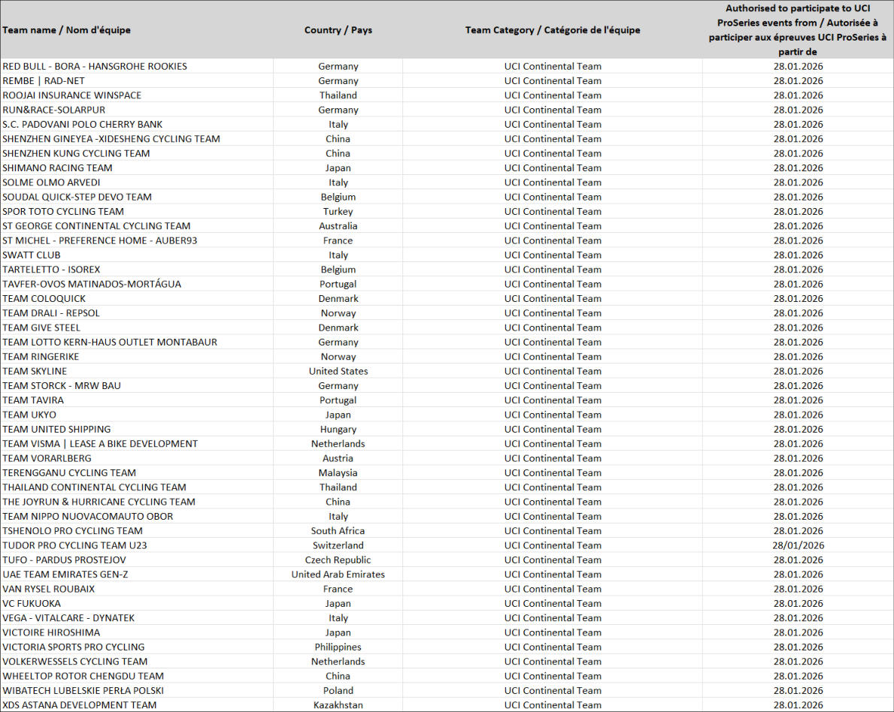

## **Participation Equipes Continentales UCI – Epreuves UCI ProSeries | Saison 2026** 

## _**UCI Continental Teams participation – UCI ProSeries events | 2026 season**_ 

## **2.1.005** 

[…] Pour prendre le départ d’une épreuve UCI ProSeries, les équipes continentales UCI et les équipes professionnelles cyclo-cross UCI doivent contribuer au programme de lutte contre le dopage lié aux épreuves de l’UCI ProSeries tel que défini dans les obligations financières publiées par l’UCI ; les équipes concernées figureront sur une liste publiée sur le site Internet de l’UCI. […]. 

(texte modifié aux 1.01.99; 1.01.05; 1.01.06; 1.10.06; 25.09.07; 1.01.08; 1.01.09; 1.07.09; 1.10.09; 1.10.10; 1.07.11; 1.07.12; 1.10.13 ; 1.01.15 ; 1.01.16 ; 12.01.17 ; 1.02.17 ; 1.01.18 ; 23.10.19 ; 1.01.20 ; 9.11.20 ; 1.1.24 ; 1.01.25 ; 1.01.26). 

Veuillez trouver ci-après les Equipes Continentales UCI et équipes professionnelles cyclo-cross UCI ayant rempli les critères afin de participer à au moins une épreuve UCI ProSeries pour la saison 2026 ainsi que la date à partir de laquelle chaque équipe peut participer à une épreuve UCI ProSeries. 

## _**2.1.005**_ 

[…] In order to compete in a UCI ProSeries event, UCI Continental Teams and UCI cyclo-cross professional teams must contribute to the programme for the fight against doping related to UCI ProSeries events as provided in the Financial Obligations published on the UCI website; the teams concerned will be included in a list published on the UCI website. […]. 

(text modified on 1.01.99; 1.01.05; 1.01.06; 1.10.06; 25.09.07; 1.01.08; 1.1.09; 1.07.09; 1.10.09; 1.10.10; 1.07.11; 1.07.12; 1.10.13; 1.01.14; 1.01.15; 1.01.16; 12.01.17; 1.02.17; 1.01.18; 23.10.19; 1.01.20, 9.11.20; 1.1.24; 1.01.25; 1.01.26). 

_The UCI Continental Teams and UCI cyclo-cross professional teams having fulfilled the criteria to participate to at least one UCI ProSeries event during the 2026 season as well as the date from which each team can participate to a UCI ProSeries event are following._ 

Page **1** / **3** 

**Union Cycliste Internationale** 17 juin 2026 

|**Team name / Nom d'équipe** **Country / Pays** **Team Category / Catégorie de l'équipe** **Authorised to participate to UCI** **ProSeries events from / Autorisée à** **participer aux épreuves UCI ProSeries à** **partir de**|**Team name / Nom d'équipe** **Country / Pays** **Team Category / Catégorie de l'équipe** **Authorised to participate to UCI** **ProSeries events from / Autorisée à** **participer aux épreuves UCI ProSeries à** **partir de**|**Team name / Nom d'équipe** **Country / Pays** **Team Category / Catégorie de l'équipe** **Authorised to participate to UCI** **ProSeries events from / Autorisée à** **participer aux épreuves UCI ProSeries à** **partir de**|**Team name / Nom d'équipe** **Country / Pays** **Team Category / Catégorie de l'équipe** **Authorised to participate to UCI** **ProSeries events from / Autorisée à** **participer aux épreuves UCI ProSeries à** **partir de**|
|---|---|---|---|
|7ELEVEN CLIQQROADBIKE PHILIPPINES|Philippines|UCI Continental Team|28.01.2026|
|AARCO|Belgium|UCI Continental Team|28.01.2026|
|AISAN RACING TEAM|Japan|UCI Continental Team|28.01.2026|
|ALPECIN-PREMIER TECH DEVELOPMENT TEAM|Belgium|UCI Continental Team|28.01.2026|
|ANICOLOR/CAMPICARN|Portugal|UCI Continental Team|28.01.2026|
|APS PRO CYCLING BY TEAM CADENCE CYCLERY|United States|UCI Continental Team|28.01.2026|
|ASTEMO UTSUNOMIYA BLITZEN|Japan|UCI Continental Team|28.01.2026|
|ATT INVESTMENTS|Czech Republic|UCI Continental Team|28.01.2026|
|AVILUDO - LOULETANO - LOULÉ|Portugal|UCI Continental Team|28.01.2026|
|AZERION/VILLA VALKENBURG|Netherlands|UCI Continental Team|28.01.2026|
|BAHRAIN VICTORIOUS DEVELOPMENT TEAM|Bahrain|UCI Continental Team|28.01.2026|
|BALOISE VERZEKERINGEN -HET POETSBUREAU LIONS|Belgium|UCI Continental Team|28.01.2026|
|BEAT CC P/B SAXO|Netherlands|UCI Continental Team|28.01.2026|
|BELTRAMI TSA TRE COLLI|Italy|UCI Continental Team|28.01.2026|
|BENOTTI BERTHOLD|Germany|UCI Continental Team|28.01.2026|
|BHS-PL BETON BORNHOLM|Denmark|UCI Continental Team|28.01.2026|
|BIESSE - CARRERA - PREMAC|Italy|UCI Continental Team|28.01.2026|
|BIKE AID|Germany|UCI Continental Team|28.01.2026|
|BODYWRAP LTWOO CYCLING TEAM|China|UCI Continental Team|28.01.2026|
|CAMP CYCING TEAM|China|UCI Continental Team|28.01.2026|
|CAMPANA IMBALLAGGI-MORBIATO-TRENTINO|Italy|UCI Continental Team|28.01.2026|
|CCACHE X BODYWRAP|Australia|UCI Continental Team|28.01.2026|
|CHINA ANTA - MENTECH CYCLING TEAM|China|UCI Continental Team|28.01.2026|
|CIC PRO CYCLING ACADEMY|France|UCI Continental Team|28.01.2026|
|COLOR CODE-ALU CENTER|Belgium|UCI Continental Team|28.01.2026|
|COMPETITIVE EDGE RACING|United States|UCI Continental Team|28.01.2026|
|CREDIBOM/LA ALUMÍNIOS/MARCOS CAR|Portugal|UCI Continental Team|28.01.2026|
|DECATHLON CMA CGM DEVELOPMENT TEAM|France|UCI Continental Team|28.01.2026|
|DEVELOPMENT TEAM PICNIC POSTNL|Netherlands|UCI Continental Team|28.01.2026|
|EF EDUCATION - AEVOLO|United States|UCI Continental Team|28.01.2026|
|EFAPEL CYCLING|Portugal|UCI Continental Team|28.01.2026|
|EUROCYCLINGTRIPS - CCN|Guam|UCI Continental Team|28.01.2026|
|FACTOR RACING|Slovenia|UCI Continental Team|28.01.2026|
|FEIRA DOS SOFÁS - BOAVISTA|Portugal|UCI Continental Team|28.01.2026|
|FEIRENSE - BEECELER|Portugal|UCI Continental Team|28.01.2026|
|FNIX-SCOM-HENGXIANG CYCLING TEAM|China|UCI Continental Team|28.01.2026|
|GENERAL STORE - ESSEGIBI - F.LLI CURIA|Italy|UCI Continental Team|28.01.2026|
|GI GROUP HOLDING - SIMOLDES - UDO|Portugal|UCI Continental Team|28.01.2026|
|GIANT CYCLING TEAM|China|UCI Continental Team|28.01.2026|
|GRAGNANO SPORTING CLUB|Italy|UCI Continental Team|28.01.2026|
|HAGENS BERMAN JAYCO|Australia|UCI Continental Team|28.01.2026|
|HUANSHENG-VONOA-TAISHAN SPORT TEAM|China|UCI Continental Team|28.01.2026|
|INEOS GRENADIERS RACING ACADEMY|Great Britain|UCI Continental Team|28.01.2026|
|ISTANBUL TEAM|Turkey|UCI Continental Team|28.01.2026|
|JAKARTA PRO CYCLING TEAM|Indonesia|UCI Continental Team|28.01.2026|
|KASPER CRYPTO4ME|Czech Republic|UCI Continental Team|28.01.2026|
|KINAN RACING TEAM|Japan|UCI Continental Team|28.01.2026|
|KOLESARSKI KLUB NOVO MESTO|Slovenia|UCI Continental Team|28.01.2026|
|KONYA BÜYÜKŞEHİR BELEDİYE SPOR|Turkey|UCI Continental Team|28.01.2026|
|KSPO|South Korea|UCI Continental Team|28.01.2026|
|L39ION OF LOS ANGELES|United States|UCI Continental Team|28.01.2026|
|LI NING STAR|China|UCI Continental Team|28.01.2026|
|LIDL-TREK FUTURE RACING|Germany|UCI Continental Team|28.01.2026|
|LILLEHAMMER CK CONTINENTAL TEAM|Norway|UCI Continental Team|28.01.2026|
|LOTTO - GROUPE WANTY|Belgium|UCI Continental Team|28.01.2026|
|LUCKY SPORT CYCLING TEAM|Sweden|UCI Continental Team|28.01.2026|
|MADAR PRO CYCLING TEAM|Algeria|UCI Continental Team|28.01.2026|
|MALAYSIA PRO CYCLING|Malaysia|UCI Continental Team|28.01.2026|
|MBB CONTINENTAL CYCLING TEAM|Turkey|UCI Continental Team|28.01.2026|
|MERIDIAN RACING P/B DE LA UZ|United States|UCI Continental Team|28.01.2026|
|METEC - SOLARWATT P/B MANTEL|Netherlands|UCI Continental Team|28.01.2026|
|MG.K VIS COSTRUZIONI E AMBIENTE|Italy|UCI Continental Team|28.01.2026|
|MOVISTAR TEAM ACADEMY|Spain|UCI Continental Team|28.01.2026|
|NICE METROPOLE COTE D'AZUR|France|UCI Continental Team|28.01.2026|
|NSN DEVELOPMENT TEAM|Switzerland|UCI Continental Team|28.01.2026|
|NUSANTARA CYCLING TEAM|Indonesia|UCI Continental Team|28.01.2026|
|OBIDOS CYCLING TEAM|Portugal|UCI Continental Team|28.01.2026|
|PAUWELS SAUZEN - ALTEZ INDUSTRIEBOUW CYCLING TEAM| Belgium|UCI Cyclo-Cross Pro Team|28.01.2026|
|PETROLIKE|Mexico|UCI Continental Team|28.01.2026|
|POGI TEAM GUSTO LJUBLJANA|Slovenia|UCI Continental Team|28.01.2026|
|PROJECT ECHELON RACING|United States|UCI Continental Team|28.01.2026|
|QINGHAI TIANYOUDE HOTEL CYCLING TEAM|China|UCI Continental Team|28.01.2026|
|QUICK PRO TEAM|Estonia|UCI Continental Team|28.01.2026|

Page **2** / **3** 

**Union Cycliste Internationale** 17 juin 2026 

Page **3** / **3** 

**Union Cycliste Internationale** 17 juin 2026 

